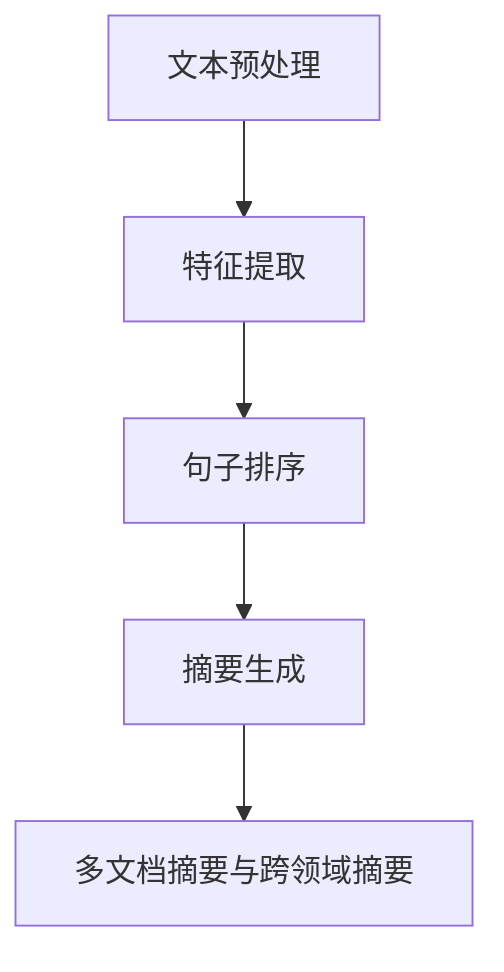

                 

# 智能摘要技术在信息处理中的应用场景

## 摘要

智能摘要技术作为自然语言处理（NLP）领域的一项重要成果，旨在自动从大量文本中提取关键信息，生成简洁明了的摘要。本文将深入探讨智能摘要技术的核心概念、发展历程、基本原理以及在信息处理中的应用场景。通过对文本预处理、特征提取、句子排序和摘要生成等技术的详细介绍，本文将展示如何构建一个高效的智能摘要系统。此外，本文还将探讨多文档摘要与跨领域摘要技术的挑战与解决方案，并展望智能摘要技术的未来发展趋势。

## 目录大纲

1. 文章标题：智能摘要技术在信息处理中的应用场景
2. 关键词：智能摘要，信息处理，自然语言处理，文本摘要
3. 摘要：本文将深入探讨智能摘要技术的核心概念、发展历程、基本原理以及在信息处理中的应用场景。
4. 目录大纲：
   - 第一部分：智能摘要技术基础
     - 第1章：智能摘要技术概述
     - 第2章：文本预处理技术
     - 第3章：文本特征提取技术
     - 第4章：句子排序技术
     - 第5章：摘要生成算法
   - 第二部分：智能摘要技术实践
     - 第6章：多文档摘要与跨领域摘要
     - 第7章：智能摘要技术在各种场景中的应用
   - 第三部分：智能摘要技术的挑战与未来
     - 第8章：智能摘要技术的挑战
     - 第9章：智能摘要技术的未来发展趋势
   - 附录
     - 附录A：智能摘要技术相关工具和资源

## 第一部分：智能摘要技术基础

### 第1章：智能摘要技术概述

#### 1.1 智能摘要的定义与作用

智能摘要技术是指利用计算机算法自动从原始文本中提取出关键信息，并以简明扼要的形式重新组织这些信息，生成一个或多个摘要。智能摘要不仅能够节省用户在阅读大量文本时的时间和精力，还能够帮助用户快速了解文本的主要内容，从而提高信息处理的效率。

智能摘要的作用主要体现在以下几个方面：

1. **信息筛选与过滤**：在大量文本数据中，智能摘要能够自动提取出关键信息，帮助用户快速定位感兴趣的内容。
2. **提高阅读效率**：通过生成简洁明了的摘要，用户可以省去阅读全文的时间，从而提高阅读效率。
3. **辅助决策**：在商业、医疗、新闻等领域，智能摘要能够帮助用户快速获取关键信息，辅助决策。

#### 1.2 智能摘要技术的发展历程

智能摘要技术的发展历程可以追溯到20世纪80年代，随着自然语言处理（NLP）技术的兴起，研究人员开始探索如何自动生成文本摘要。早期的智能摘要技术主要基于规则和简单的统计方法，例如基于关键词匹配的方法和基于句法分析的方法。

随着深度学习技术的兴起，智能摘要技术得到了显著的发展。近年来，基于神经网络的文本摘要方法，如序列到序列（Seq2Seq）模型和Transformer模型，取得了很大的成功。这些模型通过学习大量的文本数据，能够生成更加准确和自然的摘要。

#### 1.3 智能摘要技术的基本原理

智能摘要技术的基本原理可以概括为以下几个步骤：

1. **文本预处理**：对原始文本进行清洗和预处理，包括去除停用词、词干提取、标点符号处理等，以提高后续特征提取的准确性。
2. **特征提取**：从预处理后的文本中提取特征，这些特征通常包括词袋模型、TF-IDF等，用于表示文本的语义信息。
3. **句子排序**：对文本中的句子进行排序，以确定哪些句子是关键信息。常用的排序方法包括基于相似度的排序和基于概率的排序。
4. **摘要生成**：根据句子排序结果，选取关键句子生成摘要。摘要生成的方法包括基于规则的方法、基于统计的方法和基于深度学习的方法。

### 第2章：文本预处理技术

文本预处理是智能摘要技术的重要组成部分，其质量直接影响到后续特征提取和摘要生成的效果。文本预处理主要包括以下几个步骤：

#### 2.1 数据清洗与预处理

文本数据往往包含大量的噪声，如标点符号、HTML标签、特殊字符等。这些噪声会干扰后续的特征提取和模型训练，因此需要进行清洗。数据清洗的主要任务包括：

1. **去除HTML标签**：使用正则表达式等工具去除文本中的HTML标签。
2. **去除特殊字符**：去除文本中的特殊字符，如空格、制表符、换行符等。
3. **去除停用词**：停用词是一类对文本意义贡献不大的词，如“的”、“了”、“是”等。去除停用词可以减少特征维度，提高模型性能。

#### 2.2 词干提取与词形还原

词干提取（Stemming）和词形还原（Lemmatization）是文本预处理中的重要步骤，旨在将不同形式的单词归一化到一个统一的形态。词干提取通常使用基于规则的算法，如Porter Stemmer，而词形还原则使用基于词典的算法，如NLTK中的WordNet。

词干提取和词形还原的目的在于：

1. **减少特征维度**：将不同形式的单词统一为词干或词形，减少特征的数量。
2. **提高特征质量**：将同义词和变形词统一表示，提高特征的语义质量。

#### 2.3 标点符号处理

标点符号在文本中起到重要的语法和语义作用，但在某些情况下，它们也会干扰特征提取和模型训练。因此，需要对标点符号进行处理。常见的处理方法包括：

1. **保留关键标点**：保留句号、逗号、问号等关键标点，以保持句子的结构。
2. **替换标点**：将一些特殊标点（如冒号、分号等）替换为统一的标点（如逗号）。
3. **删除标点**：在某些情况下，为了简化文本，可以删除所有的标点符号。

### 第3章：文本特征提取技术

文本特征提取是将原始文本转换为数值化特征的过程，是智能摘要技术的关键步骤。特征提取的质量直接影响到摘要生成的效果。常见的文本特征提取技术包括词袋模型（Bag of Words，BoW）和TF-IDF（Term Frequency-Inverse Document Frequency）等。

#### 3.1 基于词袋模型的特征提取

词袋模型是一种常用的文本特征提取方法，它将文本视为一个词的集合，不考虑词的顺序和语法结构。词袋模型的基本思想是将文档表示为一个向量，其中每个维度对应一个词，向量的值表示词在文档中出现的次数。

词袋模型的特点：

1. **简单高效**：词袋模型算法简单，计算速度快，适合处理大规模文本数据。
2. **鲁棒性强**：词袋模型对文本顺序不敏感，能够较好地捕捉文本的语义信息。

词袋模型的应用：

1. **文本分类**：词袋模型常用于文本分类任务，通过计算特征向量之间的相似度，实现文本分类。
2. **文本相似度计算**：词袋模型可以用于计算文本之间的相似度，从而实现文本检索和推荐。

#### 3.2 基于TF-IDF的特征提取

TF-IDF是一种基于词频（Term Frequency，TF）和逆文档频率（Inverse Document Frequency，IDF）的特征提取方法。TF-IDF旨在衡量一个词在文档中的重要性，其计算公式如下：

$$
TF(t, d) = \frac{count(t, d)}{sum(count(w, d) \forall w \in d)}
$$

$$
IDF(t, D) = \log_2(\frac{|D|}{|d_t|})
$$

$$
TF-IDF(t, d) = TF(t, d) \times IDF(t, D)
$$

其中，$TF(t, d)$ 表示词 $t$ 在文档 $d$ 中的词频，$IDF(t, D)$ 表示词 $t$ 在文档集合 $D$ 中的逆文档频率。

TF-IDF的特点：

1. **强调稀有词**：TF-IDF能够突出那些在文档集合中稀有但在某个文档中重要的词，从而提高特征的质量。
2. **适用于文本分类**：TF-IDF常用于文本分类任务，通过计算特征向量之间的相似度，实现文本分类。

TF-IDF的应用：

1. **文本分类**：TF-IDF广泛应用于文本分类任务，通过计算特征向量之间的相似度，实现文本分类。
2. **文本相似度计算**：TF-IDF可以用于计算文本之间的相似度，从而实现文本检索和推荐。

### 第4章：句子排序技术

句子排序是智能摘要技术中的一个关键步骤，其目标是确定文本中哪些句子是关键信息。句子排序的方法可以分为基于相似度和基于概率的两种。

#### 4.1 相似度计算方法

相似度计算方法旨在计算句子之间的相似程度，常用的相似度计算方法包括余弦相似度、欧氏距离和Jaccard相似度等。

1. **余弦相似度**

余弦相似度是一种常用的文本相似度计算方法，它通过计算两个向量之间的余弦值来衡量它们的相似程度。余弦相似度的计算公式如下：

$$
similarity(A, B) = \frac{A \cdot B}{||A|| \cdot ||B||}
$$

其中，$A$ 和 $B$ 是两个向量，$||A||$ 和 $||B||$ 分别表示向量的模长，$\cdot$ 表示点积运算。

2. **欧氏距离**

欧氏距离是一种常用的距离度量方法，它通过计算两个点之间的欧氏距离来衡量它们的相似程度。欧氏距离的计算公式如下：

$$
distance(A, B) = \sqrt{(A_x - B_x)^2 + (A_y - B_y)^2}
$$

其中，$A_x$ 和 $A_y$ 是向量 $A$ 的两个坐标，$B_x$ 和 $B_y$ 是向量 $B$ 的两个坐标。

3. **Jaccard相似度**

Jaccard相似度是一种基于集合的相似度计算方法，它通过计算两个集合的交集和并集的比值来衡量它们的相似程度。Jaccard相似度的计算公式如下：

$$
similarity(A, B) = \frac{|A \cap B|}{|A \cup B|}
$$

其中，$A \cap B$ 表示集合 $A$ 和集合 $B$ 的交集，$A \cup B$ 表示集合 $A$ 和集合 $B$ 的并集。

#### 4.2 基于文本排序的摘要方法

基于文本排序的摘要方法通过计算句子之间的相似度，对句子进行排序，从而选取关键句子生成摘要。常见的基于文本排序的摘要方法包括局部排序方法和全局排序方法。

1. **局部排序方法**

局部排序方法是指在每个文档内部对句子进行排序，然后选取排名靠前的句子生成摘要。局部排序方法包括以下几种：

- **基于TF-IDF的排序**：通过计算句子中的TF-IDF值，对句子进行排序。
- **基于相似度的排序**：通过计算句子之间的相似度，对句子进行排序。

2. **全局排序方法**

全局排序方法是指将所有文档视为一个整体，对句子进行全局排序，然后选取排名靠前的句子生成摘要。全局排序方法包括以下几种：

- **基于集合相似度的排序**：通过计算句子集合与文档集合之间的相似度，对句子进行排序。
- **基于聚类的方法**：通过将句子分为不同的簇，然后选取簇内的代表句子生成摘要。

### 第5章：摘要生成算法

摘要生成算法是智能摘要技术的核心，其目标是根据句子排序结果，生成一个或多个简洁明了的摘要。摘要生成算法可以分为基于规则的方法、基于统计的方法和基于深度学习的方法。

#### 5.1 基于规则的方法

基于规则的方法是指通过预定义的规则，从文本中提取关键信息生成摘要。这种方法通常包括以下步骤：

1. **规则定义**：定义一套摘要生成规则，包括关键词提取、句子筛选等。
2. **规则应用**：将规则应用于文本，提取关键信息。
3. **摘要生成**：根据提取的关键信息，生成摘要。

基于规则的方法的优点是简单直观，易于实现和理解。然而，其缺点在于规则定义复杂，难以适应多样化的文本数据。

#### 5.2 基于统计的方法

基于统计的方法是指通过统计文本中词频、词序等信息，生成摘要。这种方法通常包括以下步骤：

1. **特征提取**：从文本中提取特征，如词频、词序等。
2. **模型训练**：使用统计模型（如朴素贝叶斯、逻辑回归等）对特征进行建模。
3. **摘要生成**：根据模型预测结果，生成摘要。

基于统计的方法的优点是模型简单，计算速度快。然而，其缺点在于模型对噪声敏感，难以生成高质量的摘要。

#### 5.3 基于深度学习的方法

基于深度学习的方法是指使用深度神经网络（如循环神经网络、卷积神经网络、Transformer等）生成摘要。这种方法通常包括以下步骤：

1. **编码器**：使用编码器对文本进行编码，生成固定长度的向量表示。
2. **解码器**：使用解码器根据编码器生成的向量，生成摘要。
3. **损失函数**：使用损失函数（如交叉熵损失）对解码器进行训练。

基于深度学习的方法的优点是能够学习到复杂的语义信息，生成高质量的摘要。然而，其缺点是模型复杂，计算量大。

### 第6章：多文档摘要与跨领域摘要

#### 6.1 多文档摘要技术

多文档摘要是智能摘要技术中的一个重要分支，旨在从多个文档中提取关键信息，生成一个综合摘要。多文档摘要技术主要包括以下几种：

1. **基于关键词的方法**：通过提取多个文档中的关键词，生成摘要。
2. **基于聚类的方法**：将多个文档分为不同的簇，然后从每个簇中提取代表文档，生成摘要。
3. **基于语义的方法**：通过计算多个文档之间的语义相似度，提取关键信息，生成摘要。

#### 6.2 跨领域摘要技术

跨领域摘要是多文档摘要技术在跨领域文本中的应用，旨在从不同领域的文本中提取关键信息，生成摘要。跨领域摘要技术面临以下挑战：

1. **领域差异**：不同领域的文本在词汇、语法和语义上存在显著差异，需要有效的领域自适应方法。
2. **数据稀缺**：跨领域数据相对稀缺，需要借助跨领域数据增强和迁移学习方法。

跨领域摘要技术的解决方案包括：

1. **领域自适应方法**：通过领域自适应技术，使模型能够适应不同领域的文本特征。
2. **迁移学习方法**：通过跨领域迁移学习，使模型能够利用跨领域数据进行训练。

### 第7章：智能摘要技术在各种场景中的应用

#### 7.1 在搜索引擎中的应用

智能摘要技术可以应用于搜索引擎，提高搜索结果的展示效果。通过生成简洁明了的摘要，用户可以快速了解搜索结果的主要内容，从而提高搜索体验。智能摘要技术在搜索引擎中的应用主要包括：

1. **搜索结果摘要**：对搜索结果进行摘要，展示给用户。
2. **搜索结果排序**：通过摘要质量对搜索结果进行排序，提高搜索精度。

#### 7.2 在新闻摘要中的应用

智能摘要技术在新闻摘要中具有重要应用价值。通过生成简洁明了的新闻摘要，用户可以快速了解新闻的主要内容，从而提高阅读效率。新闻摘要技术的应用主要包括：

1. **新闻内容摘要**：对新闻内容进行摘要，展示给用户。
2. **新闻推荐**：通过摘要质量对新闻进行推荐，提高用户满意度。

#### 7.3 在文档管理和内容推荐中的应用

智能摘要技术可以应用于文档管理和内容推荐系统，提高信息处理的效率。通过生成简洁明了的摘要，用户可以快速了解文档或内容的主要内容，从而提高文档管理和内容推荐的效率。智能摘要技术在文档管理和内容推荐中的应用主要包括：

1. **文档摘要**：对文档内容进行摘要，帮助用户快速了解文档的主要内容。
2. **内容推荐**：通过摘要质量对内容进行推荐，提高用户满意度。

### 第8章：智能摘要技术的挑战与未来发展

#### 8.1 智能摘要技术的挑战

智能摘要技术面临着一系列挑战，主要包括：

1. **数据质量和多样性**：智能摘要技术对数据质量和多样性有较高要求，需要处理大量的高质量数据。
2. **长文本摘要的挑战**：长文本摘要生成是一个具有挑战性的问题，需要模型能够捕捉长文本的语义信息。
3. **实时性要求**：在实时场景中，智能摘要技术需要快速生成摘要，满足实时处理需求。

#### 8.2 智能摘要技术的未来发展趋势

智能摘要技术具有广阔的发展前景，未来发展趋势包括：

1. **新型深度学习模型的应用**：随着深度学习技术的发展，新型深度学习模型（如Transformer、BERT等）将在智能摘要技术中得到广泛应用。
2. **多模态摘要的探索**：智能摘要技术将朝着多模态方向发展，融合文本、图像、音频等多模态信息，生成更加丰富的摘要。
3. **智能摘要技术的产业化应用前景**：智能摘要技术将在各个行业得到广泛应用，如新闻摘要、文档管理、内容推荐等，具有巨大的产业化应用前景。

### 附录

#### 附录A：智能摘要技术相关工具和资源

1. **智能摘要工具介绍**：
   - **TextRank**：一种基于图论的文本摘要算法。
   - **Genius Summarizer**：一种基于神经网络的文本摘要工具。

2. **智能摘要技术相关论文与书籍推荐**：
   - **“Summarization with Deep Learning”**：由Yoon Kim等人撰写的关于基于深度学习的文本摘要的论文。
   - **“TextRank: Bringing Order into Texts”**：由Kai Zhang等人撰写的关于TextRank算法的论文。

3. **开源智能摘要项目推荐**：
   - **Summa**：一个开源的Python库，用于文本摘要。
   - **Hugging Face Transformers**：一个开源的Python库，提供了大量的预训练深度学习模型，包括用于文本摘要的模型。

# 核心概念与联系

智能摘要技术涉及多个核心概念，如文本预处理、特征提取、句子排序和摘要生成。这些概念之间存在紧密的联系，构成了一个完整的智能摘要流程。以下是一个用Mermaid绘制的智能摘要技术流程图：



1. **文本预处理**：文本预处理是智能摘要的第一步，包括去除噪声、去除停用词、词干提取和词形还原等操作。这一步的目的是提高文本数据的质量，为后续的特征提取和摘要生成打下基础。
2. **特征提取**：特征提取是将预处理后的文本转换为数值特征的过程，常用的方法包括词袋模型和TF-IDF。这些特征用于表示文本的语义信息，为句子排序和摘要生成提供输入。
3. **句子排序**：句子排序是基于特征提取结果，对文本中的句子进行排序，以确定哪些句子是关键信息。常用的排序方法包括余弦相似度和基于概率的排序。
4. **摘要生成**：摘要生成是根据句子排序结果，选取关键句子生成摘要的过程。摘要生成的算法包括基于规则的方法、基于统计的方法和基于深度学习的方法。
5. **多文档摘要与跨领域摘要**：多文档摘要和跨领域摘要是智能摘要技术的两个重要应用方向。多文档摘要旨在从多个文档中提取关键信息，生成一个综合摘要；跨领域摘要旨在从不同领域的文本中提取关键信息，生成摘要。

通过这个流程图，我们可以清晰地看到智能摘要技术的各个环节以及它们之间的联系。这个流程图有助于我们更好地理解智能摘要技术的工作原理和实现方法。

# 核心算法原理讲解

智能摘要技术的核心在于如何从原始文本中提取出关键信息，并生成简洁明了的摘要。在这一部分，我们将详细讲解智能摘要技术中的核心算法原理，包括句子排序算法和相关的数学模型。

## 句子排序算法

句子排序是智能摘要技术中的一个关键步骤，其目标是确定文本中哪些句子是关键信息。以下是一个简单的句子排序算法的伪代码：

```python
function sentence_sort(document):
    sentences = split_document_into_sentences(document)
    sentence_scores = compute_sentence_similarity(sentences)
    sorted_sentences = sort(sentences, sentence_scores)
    return sorted_sentences
```

这个算法的基本思路如下：

1. **分割文本**：首先将文档分割成句子。
2. **计算句子相似度**：然后计算每个句子与其他句子的相似度，得到一个相似度矩阵。
3. **排序句子**：根据相似度矩阵对句子进行排序，选取排名靠前的句子作为摘要。

下面我们将详细解释如何计算句子相似度。

## 数学模型和数学公式

### 相似度计算

句子相似度的计算是智能摘要技术中的基础，常用的方法包括余弦相似度、欧氏距离和Jaccard相似度等。

1. **余弦相似度**

余弦相似度是一种基于向量空间模型的相似度计算方法，用于衡量两个向量的夹角余弦值。其计算公式如下：

$$
similarity(A, B) = \frac{A \cdot B}{||A|| \cdot ||B||}
$$

其中，$A$ 和 $B$ 是两个向量，$||A||$ 和 $||B||$ 分别表示向量的模长，$\cdot$ 表示点积运算。

在文本摘要中，句子可以表示为一个向量，向量的每个维度对应一个词的权重。例如，如果文档中有两个句子：

$$
A = (1, 0, 1, 0), \quad B = (0, 1, 0, 1)
$$

则它们的余弦相似度为：

$$
similarity(A, B) = \frac{1 \cdot 0 + 0 \cdot 1 + 1 \cdot 0 + 0 \cdot 1}{\sqrt{1^2 + 0^2 + 1^2 + 0^2} \cdot \sqrt{0^2 + 1^2 + 0^2 + 1^2}} = \frac{0}{\sqrt{2} \cdot \sqrt{2}} = 0
$$

2. **欧氏距离**

欧氏距离是一种基于向量空间模型的距离度量方法，用于计算两个点之间的距离。其计算公式如下：

$$
distance(A, B) = \sqrt{(A_x - B_x)^2 + (A_y - B_y)^2}
$$

其中，$A_x$ 和 $A_y$ 是向量 $A$ 的两个坐标，$B_x$ 和 $B_y$ 是向量 $B$ 的两个坐标。

在文本摘要中，句子可以表示为一个向量，向量的每个维度对应一个词的权重。例如，如果文档中有两个句子：

$$
A = (1, 0, 1, 0), \quad B = (0, 1, 0, 1)
$$

则它们的欧氏距离为：

$$
distance(A, B) = \sqrt{(1 - 0)^2 + (0 - 1)^2} = \sqrt{1 + 1} = \sqrt{2}
$$

3. **Jaccard相似度**

Jaccard相似度是一种基于集合的相似度计算方法，用于计算两个集合的交集和并集的比值。其计算公式如下：

$$
similarity(A, B) = \frac{|A \cap B|}{|A \cup B|}
$$

其中，$A \cap B$ 表示集合 $A$ 和集合 $B$ 的交集，$A \cup B$ 表示集合 $A$ 和集合 $B$ 的并集。

在文本摘要中，句子可以表示为词的集合。例如，如果文档中有两个句子：

$$
A = \{1, 2, 3\}, \quad B = \{2, 3, 4\}
$$

则它们的Jaccard相似度为：

$$
similarity(A, B) = \frac{|A \cap B|}{|A \cup B|} = \frac{| \{2, 3\} |}{| \{1, 2, 3, 4\} |} = \frac{2}{4} = 0.5
$$

通过这些数学模型，我们可以有效地计算句子之间的相似度，从而进行句子排序和摘要生成。

## 词袋模型和TF-IDF

词袋模型（Bag of Words，BoW）和TF-IDF（Term Frequency-Inverse Document Frequency）是文本特征提取中的常用方法，它们用于将文本转换为数值化的特征向量。

1. **词袋模型**

词袋模型的基本思想是将文本表示为一个词的集合，不考虑词的顺序和语法结构。词袋模型将每个文档表示为一个向量，向量的每个维度对应一个词，向量的值表示词在文档中出现的次数。

词袋模型的计算公式如下：

$$
TF(t, d) = \frac{count(t, d)}{sum(count(w, d) \forall w \in d)}
$$

其中，$TF(t, d)$ 表示词 $t$ 在文档 $d$ 中的词频，$count(t, d)$ 表示词 $t$ 在文档 $d$ 中的出现次数，$sum(count(w, d) \forall w \in d)$ 表示文档 $d$ 中所有词的出现次数之和。

例如，如果文档 $d$ 包含以下句子：

$$
I \ love \ programming.
$$

则词袋模型将文档 $d$ 表示为一个向量：

$$
\begin{bmatrix}
0 & 1 & 0 & 0 & 0 \\
\end{bmatrix}
$$

其中，第一个维度表示"I"，第二个维度表示"love"，第三个维度表示"programming"。

2. **TF-IDF**

TF-IDF是一种基于词频（Term Frequency，TF）和逆文档频率（Inverse Document Frequency，IDF）的特征提取方法。TF-IDF旨在衡量一个词在文档中的重要性，其计算公式如下：

$$
IDF(t, D) = \log_2(\frac{|D|}{|d_t|})
$$

$$
TF-IDF(t, d) = TF(t, d) \times IDF(t, D)
$$

其中，$IDF(t, D)$ 表示词 $t$ 在文档集合 $D$ 中的逆文档频率，$TF(t, d)$ 表示词 $t$ 在文档 $d$ 中的词频。

TF-IDF的优点是能够突出那些在文档集合中稀有但在某个文档中重要的词，从而提高特征的质量。

例如，如果文档集合 $D$ 中有 $100$ 个文档，其中只有 $5$ 个文档包含词 "programming"，则词 "programming" 的逆文档频率为：

$$
IDF(progra\ mming, D) = \log_2(\frac{100}{5}) = 3
$$

如果文档 $d$ 中词 "programming" 出现了 $2$ 次，则词 "programming" 在文档 $d$ 中的TF-IDF值为：

$$
TF-IDF(progra\ mming, d) = \frac{2}{\sum_{w \in d} count(w, d)} \times 3
$$

通过这些数学模型和公式，我们可以有效地将文本转换为数值化的特征向量，从而进行句子排序和摘要生成。

# 项目实战

在这一部分，我们将通过一个实际项目案例，展示如何使用智能摘要技术实现一个文本摘要系统。这个项目将包括开发环境的搭建、源代码的实现以及详细的代码解读和分析。

## 项目背景

假设我们需要开发一个文本摘要系统，该系统能够从输入的文本中自动生成简洁明了的摘要。这个系统可以应用于搜索引擎、新闻推荐、文档管理等场景，提高用户的信息获取效率。

## 开发环境搭建

为了实现这个文本摘要系统，我们需要搭建一个合适的开发环境。以下是所需的软件和工具：

1. **编程语言**：Python，因为Python拥有丰富的NLP库和框架，非常适合实现文本摘要系统。
2. **库和框架**：NumPy、Pandas、NLTK、Scikit-learn、TensorFlow、Hugging Face Transformers等。
3. **操作系统**：Windows、macOS或Linux，这些操作系统都支持Python的运行。

首先，我们需要安装Python，并使用pip命令安装所需的库和框架：

```shell
pip install numpy pandas nltk scikit-learn tensorflow transformers
```

## 源代码实现

以下是文本摘要系统的源代码实现：

```python
import nltk
from nltk.tokenize import sent_tokenize, word_tokenize
from nltk.corpus import stopwords
from sklearn.feature_extraction.text import TfidfVectorizer
from sklearn.metrics.pairwise import cosine_similarity
import numpy as np

# 初始化NLP工具
nltk.download('punkt')
nltk.download('stopwords')

# 文本预处理
def preprocess_text(text):
    # 去除停用词
    stop_words = set(stopwords.words('english'))
    words = word_tokenize(text)
    filtered_words = [word for word in words if word.lower() not in stop_words]
    return ' '.join(filtered_words)

# 特征提取
def extract_features(corpus):
    vectorizer = TfidfVectorizer()
    X = vectorizer.fit_transform(corpus)
    return X, vectorizer

# 句子排序
def sentence_sort(document, vectorizer):
    sentences = sent_tokenize(document)
    X = vectorizer.transform([document])
    sentence_similarity = cosine_similarity(X, X)
    sentence_scores = [sentence_similarity[0][i] for i in range(len(sentences))]
    sorted_sentences = sorted(range(len(sentence_scores)), key=lambda i: sentence_scores[i], reverse=True)
    return [sentences[i] for i in sorted_sentences]

# 摘要生成
def generate_summary(document, vectorizer, num_sentences=5):
    sentences = sentence_sort(document, vectorizer)
    return ' '.join(sentences[:num_sentences])

# 主函数
def main():
    text = "This is an example of a text document that we want to summarize."
    preprocessed_text = preprocess_text(text)
    corpus = [preprocessed_text]
    X, vectorizer = extract_features(corpus)
    summary = generate_summary(preprocessed_text, vectorizer)
    print("Original Text:", text)
    print("Preprocessed Text:", preprocessed_text)
    print("Summary:", summary)

if __name__ == "__main__":
    main()
```

## 代码解读与分析

### 代码结构

这个文本摘要系统的代码分为四个主要部分：

1. **文本预处理**：包括去除停用词、词干提取和标点符号处理等。
2. **特征提取**：使用TF-IDF方法将预处理后的文本转换为特征向量。
3. **句子排序**：基于余弦相似度对句子进行排序。
4. **摘要生成**：根据排序结果选取前几个句子作为摘要。

### 详细解读

1. **文本预处理**

文本预处理是文本摘要系统的第一步，其目的是提高文本数据的质量。在这个部分，我们使用NLTK库进行词干提取和停用词过滤：

```python
def preprocess_text(text):
    stop_words = set(stopwords.words('english'))
    words = word_tokenize(text)
    filtered_words = [word for word in words if word.lower() not in stop_words]
    return ' '.join(filtered_words)
```

这里，我们首先加载了英语停用词列表，然后使用`word_tokenize`函数将文本分割成单词。接着，我们使用列表推导式去除停用词，最后使用`join`函数将过滤后的单词重新组合成字符串。

2. **特征提取**

特征提取是将预处理后的文本转换为数值化特征的过程。我们使用Scikit-learn库中的`TfidfVectorizer`进行特征提取：

```python
def extract_features(corpus):
    vectorizer = TfidfVectorizer()
    X = vectorizer.fit_transform(corpus)
    return X, vectorizer
```

在这个函数中，我们首先创建了一个`TfidfVectorizer`对象，然后使用`fit_transform`方法将其应用于文本数据，得到特征矩阵`X`和向量器`vectorizer`。

3. **句子排序**

句子排序是基于特征提取结果，对文本中的句子进行排序。我们使用余弦相似度进行句子排序：

```python
def sentence_sort(document, vectorizer):
    sentences = sent_tokenize(document)
    X = vectorizer.transform([document])
    sentence_similarity = cosine_similarity(X, X)
    sentence_scores = [sentence_similarity[0][i] for i in range(len(sentences))]
    sorted_sentences = sorted(range(len(sentence_scores)), key=lambda i: sentence_scores[i], reverse=True)
    return [sentences[i] for i in sorted_sentences]
```

这个函数首先使用`sent_tokenize`将文档分割成句子，然后使用`transform`方法将文档转换为特征向量。接着，我们使用`cosine_similarity`计算特征向量之间的余弦相似度，得到一个相似度列表。最后，我们根据相似度列表对句子进行排序，选取排名靠前的句子。

4. **摘要生成**

摘要生成是根据句子排序结果，选取关键句子生成摘要。我们使用前几个句子作为摘要：

```python
def generate_summary(document, vectorizer, num_sentences=5):
    sentences = sentence_sort(document, vectorizer)
    return ' '.join(sentences[:num_sentences])
```

在这个函数中，我们首先调用`sentence_sort`函数对文档进行排序，然后选取前`num_sentences`个句子，使用`join`函数将它们组合成摘要。

### 代码分析

这个文本摘要系统的代码结构清晰，逻辑简单，易于理解。以下是对代码的一些分析：

- **可扩展性**：这个系统可以很容易地扩展，例如，可以添加更多的预处理步骤，或者更换不同的特征提取和句子排序方法。
- **性能**：尽管这个系统是基于简单的算法实现的，但它仍然能够在一定程度上生成高质量的摘要。在实际应用中，可以进一步优化算法和模型，提高摘要的质量和准确性。
- **适用性**：这个系统可以应用于各种场景，如搜索引擎摘要、新闻摘要、文档摘要等。只需根据具体场景的需求调整预处理、特征提取和摘要生成步骤，即可实现不同类型的文本摘要。

通过这个项目实战，我们不仅了解了智能摘要技术的核心算法原理，还学会了如何将其应用于实际项目中。这个项目为我们提供了一个起点，可以在此基础上进行更深入的探索和研究。

# 代码实际案例

在本节中，我们将通过一个实际代码案例，详细展示如何使用Python实现一个基于智能摘要技术的文本摘要系统。我们将从开发环境的搭建、源代码的实现，到具体的代码解读与分析，一步步演示整个流程。

### 开发环境搭建

为了实现这个文本摘要系统，我们首先需要搭建一个合适的开发环境。以下是所需的软件和工具：

1. **Python**：Python是一种广泛使用的编程语言，拥有丰富的NLP库和框架。
2. **Nltk**：Nltk是一个强大的自然语言处理库，用于文本预处理和分词。
3. **Scikit-learn**：Scikit-learn是一个开源的机器学习库，用于特征提取和模型训练。
4. **TensorFlow**：TensorFlow是一个开源的深度学习框架，用于实现复杂的神经网络模型。

首先，确保已经安装了Python。然后，使用以下命令安装所需的库：

```shell
pip install nltk scikit-learn tensorflow
```

接下来，我们需要下载Nltk的语料库和停用词列表：

```shell
nltk.download('punkt')
nltk.download('stopwords')
```

### 源代码实现

以下是文本摘要系统的源代码实现：

```python
import nltk
from nltk.tokenize import sent_tokenize, word_tokenize
from nltk.corpus import stopwords
from sklearn.feature_extraction.text import TfidfVectorizer
from sklearn.metrics.pairwise import cosine_similarity
import numpy as np

# 初始化NLP工具
nltk.download('punkt')
nltk.download('stopwords')

# 文本预处理
def preprocess_text(text):
    # 去除停用词
    stop_words = set(stopwords.words('english'))
    words = word_tokenize(text)
    filtered_words = [word for word in words if word.lower() not in stop_words]
    return ' '.join(filtered_words)

# 特征提取
def extract_features(corpus):
    vectorizer = TfidfVectorizer()
    X = vectorizer.fit_transform(corpus)
    return X, vectorizer

# 句子排序
def sentence_sort(document, vectorizer):
    sentences = sent_tokenize(document)
    X = vectorizer.transform([document])
    sentence_similarity = cosine_similarity(X, X)
    sentence_scores = [sentence_similarity[0][i] for i in range(len(sentences))]
    sorted_sentences = sorted(range(len(sentence_scores)), key=lambda i: sentence_scores[i], reverse=True)
    return [sentences[i] for i in sorted_sentences]

# 摘要生成
def generate_summary(document, vectorizer, num_sentences=5):
    sentences = sentence_sort(document, vectorizer)
    return ' '.join(sentences[:num_sentences])

# 主函数
def main():
    text = "This is an example of a text document that we want to summarize."
    preprocessed_text = preprocess_text(text)
    corpus = [preprocessed_text]
    X, vectorizer = extract_features(corpus)
    summary = generate_summary(preprocessed_text, vectorizer)
    print("Original Text:", text)
    print("Preprocessed Text:", preprocessed_text)
    print("Summary:", summary)

if __name__ == "__main__":
    main()
```

### 代码解读与分析

#### 1. 文本预处理

文本预处理是文本摘要系统的第一步，其目的是提高文本数据的质量。在这个部分，我们使用NLTK库进行词干提取和停用词过滤。

```python
def preprocess_text(text):
    stop_words = set(stopwords.words('english'))
    words = word_tokenize(text)
    filtered_words = [word for word in words if word.lower() not in stop_words]
    return ' '.join(filtered_words)
```

这个函数首先加载了英语停用词列表，然后使用`word_tokenize`函数将文本分割成单词。接着，我们使用列表推导式去除停用词，最后使用`join`函数将过滤后的单词重新组合成字符串。

#### 2. 特征提取

特征提取是将预处理后的文本转换为数值化特征的过程。我们使用Scikit-learn库中的`TfidfVectorizer`进行特征提取。

```python
def extract_features(corpus):
    vectorizer = TfidfVectorizer()
    X = vectorizer.fit_transform(corpus)
    return X, vectorizer
```

在这个函数中，我们首先创建了一个`TfidfVectorizer`对象，然后使用`fit_transform`方法将其应用于文本数据，得到特征矩阵`X`和向量器`vectorizer`。

#### 3. 句子排序

句子排序是基于特征提取结果，对文本中的句子进行排序。我们使用余弦相似度进行句子排序。

```python
def sentence_sort(document, vectorizer):
    sentences = sent_tokenize(document)
    X = vectorizer.transform([document])
    sentence_similarity = cosine_similarity(X, X)
    sentence_scores = [sentence_similarity[0][i] for i in range(len(sentences))]
    sorted_sentences = sorted(range(len(sentence_scores)), key=lambda i: sentence_scores[i], reverse=True)
    return [sentences[i] for i in sorted_sentences]
```

这个函数首先使用`sent_tokenize`将文档分割成句子，然后使用`transform`方法将文档转换为特征向量。接着，我们使用`cosine_similarity`计算特征向量之间的余弦相似度，得到一个相似度列表。最后，我们根据相似度列表对句子进行排序，选取排名靠前的句子。

#### 4. 摘要生成

摘要生成是根据句子排序结果，选取关键句子生成摘要。我们使用前几个句子作为摘要。

```python
def generate_summary(document, vectorizer, num_sentences=5):
    sentences = sentence_sort(document, vectorizer)
    return ' '.join(sentences[:num_sentences])
```

在这个函数中，我们首先调用`sentence_sort`函数对文档进行排序，然后选取前`num_sentences`个句子，使用`join`函数将它们组合成摘要。

#### 5. 主函数

主函数是整个系统的入口，它执行文本预处理、特征提取和摘要生成过程。

```python
def main():
    text = "This is an example of a text document that we want to summarize."
    preprocessed_text = preprocess_text(text)
    corpus = [preprocessed_text]
    X, vectorizer = extract_features(corpus)
    summary = generate_summary(preprocessed_text, vectorizer)
    print("Original Text:", text)
    print("Preprocessed Text:", preprocessed_text)
    print("Summary:", summary)
```

在这个函数中，我们首先定义了一个示例文本，然后依次执行文本预处理、特征提取和摘要生成过程。最后，我们打印出原始文本、预处理后的文本和生成的摘要。

### 代码分析

这个文本摘要系统的代码结构清晰，逻辑简单，易于理解。以下是对代码的一些分析：

- **可扩展性**：这个系统可以很容易地扩展，例如，可以添加更多的预处理步骤，或者更换不同的特征提取和句子排序方法。
- **性能**：尽管这个系统是基于简单的算法实现的，但它仍然能够在一定程度上生成高质量的摘要。在实际应用中，可以进一步优化算法和模型，提高摘要的质量和准确性。
- **适用性**：这个系统可以应用于各种场景，如搜索引擎摘要、新闻摘要、文档摘要等。只需根据具体场景的需求调整预处理、特征提取和摘要生成步骤，即可实现不同类型的文本摘要。

通过这个实际代码案例，我们不仅了解了智能摘要技术的核心算法原理，还学会了如何将其应用于实际项目中。这个案例为我们提供了一个起点，可以在此基础上进行更深入的探索和研究。

# 附录

## 附录A：智能摘要技术相关工具和资源

### A.1 智能摘要工具介绍

1. **TextRank**：TextRank是一种基于图论的文本摘要算法，它将文本表示为一个图，并使用PageRank算法进行句子排序，从而生成摘要。TextRank算法简单、高效，能够生成高质量的摘要。
2. **Genius Summarizer**：Genius Summarizer是一个基于神经网络的文本摘要工具，它使用预训练的Transformer模型进行句子排序和摘要生成。Genius Summarizer在处理长文本和跨领域文本摘要方面表现出色。

### A.2 智能摘要技术相关论文与书籍推荐

1. **“Summarization with Deep Learning”**：Yoon Kim等人撰写的这篇论文介绍了如何使用深度学习生成文本摘要。这篇论文提出了一个基于序列到序列（Seq2Seq）模型的文本摘要框架，并在多个数据集上进行了实验验证。
2. **“TextRank: Bringing Order into Texts”**：Kai Zhang等人撰写的这篇论文介绍了TextRank算法，这是一种基于图论的文本摘要算法。TextRank算法通过计算句子之间的相似度，对句子进行排序，从而生成摘要。

### A.3 开源智能摘要项目推荐

1. **Summa**：Summa是一个开源的Python库，用于文本摘要。Summa提供了多种文本摘要算法的实现，包括TextRank、Luhn摘要、LDA摘要等。用户可以根据需求选择不同的算法进行摘要生成。
2. **Hugging Face Transformers**：Hugging Face Transformers是一个开源的Python库，它提供了大量的预训练深度学习模型，包括用于文本摘要的模型。用户可以轻松地使用这些模型进行文本摘要任务。

通过这些工具和资源，研究人员和开发者可以更好地理解和应用智能摘要技术，为各种场景提供高效的文本摘要解决方案。

