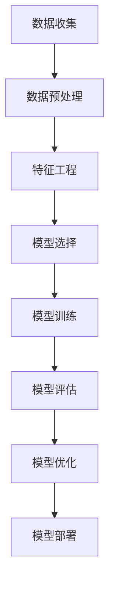

                 

# 《机器学习在预测性分析中的应用》

> 关键词：预测性分析、机器学习、应用领域、算法、实践

> 摘要：本文将深入探讨机器学习在预测性分析中的应用。首先，我们将介绍预测性分析的基础概念和重要性，随后解释机器学习的基本原理，包括监督学习、无监督学习和强化学习。接下来，我们将详细探讨预测性分析中常用的算法，如回归分析、决策树、支持向量机和集成学习。文章的下半部分将聚焦于预测性分析在金融、零售、医疗健康和供应链与物流等领域的应用案例。最后，我们将分享预测性分析项目的设计与实施步骤，并提供几个实际案例进行深入分析。本文旨在为读者提供全面而深入的机器学习在预测性分析领域的理解和应用指导。

## 第一部分：预测性分析基础

### 第1章：预测性分析概述

#### 1.1 预测性分析的定义与重要性

预测性分析是一种基于历史数据和先进数据分析技术，对未来可能发生的事件或趋势进行预测的方法。这种方法在商业、医疗、金融、气象等多个领域都具有重要应用价值。

预测性分析的定义可以从以下几个方面来理解：

1. **数据驱动**：预测性分析依赖大量的历史数据，通过对数据的深入挖掘和分析，寻找其中的规律和模式。
2. **目标导向**：预测性分析的目的是为决策提供支持，帮助企业和机构做出更加精准和高效的决策。
3. **技术先进**：预测性分析通常结合了多种先进技术，如机器学习、数据挖掘、统计分析等。

预测性分析的重要性主要体现在以下几个方面：

1. **提高决策效率**：通过预测性分析，企业可以在数据的基础上做出更加准确的预测，从而减少决策的盲目性，提高决策效率。
2. **风险控制**：预测性分析可以帮助企业和机构提前发现潜在的风险，采取预防措施，减少损失。
3. **优化资源配置**：预测性分析可以为企业提供关于客户需求、市场趋势等方面的准确预测，从而优化资源配置，提高经济效益。

#### 1.2 预测性分析的应用领域

预测性分析在多个领域都有广泛的应用，以下列举几个典型的应用领域：

1. **金融领域**：在金融领域，预测性分析可以用于预测股票市场走势、评估信用风险、预测贷款违约率等。通过预测性分析，金融机构可以更好地管理风险，提高业务运营效率。
   
2. **零售行业**：在零售行业，预测性分析可以用于销售预测、库存管理、客户行为分析等。通过预测性分析，零售企业可以优化供应链，提高销售业绩。

3. **医疗健康领域**：在医疗健康领域，预测性分析可以用于疾病预测、患者康复评估、药物研发等。通过预测性分析，医疗机构可以提供更加个性化的医疗服务，提高医疗效率。

4. **供应链与物流**：在供应链与物流领域，预测性分析可以用于库存优化、航班与货运计划、运输路线优化等。通过预测性分析，企业可以降低物流成本，提高供应链效率。

#### 1.3 预测性分析的关键概念

预测性分析涉及多个关键概念，以下介绍其中几个重要的概念：

1. **特征工程**：特征工程是预测性分析中非常重要的一环，它涉及到如何从原始数据中提取出有用的特征，以提高预测模型的准确性。
2. **模型选择**：模型选择是预测性分析中的另一个关键步骤，不同的模型适用于不同类型的数据和预测任务，需要根据实际情况进行选择。
3. **模型评估**：模型评估是衡量预测模型性能的重要手段，常用的评估指标包括准确率、召回率、F1分数等。
4. **模型优化**：模型优化是提高预测模型性能的过程，通过调整模型参数、特征选择等方法，可以进一步提高预测的准确性。

### 第2章：机器学习基础

#### 2.1 机器学习的基本概念

机器学习是一种人工智能的分支，它使计算机系统能够从数据中学习并做出预测或决策，而无需显式地编程。以下是机器学习的一些基本概念：

1. **数据集**：数据集是机器学习的基础，它由输入数据和相应的输出标签组成。输入数据可以是图像、文本、声音等，输出标签则是学习目标，例如分类标签或连续值。

2. **特征**：特征是数据集中的变量，用于描述数据点的不同属性。特征工程是机器学习过程中的重要步骤，它包括特征选择、特征提取和特征变换等。

3. **模型**：模型是机器学习算法的参数化表示，它将输入特征映射到输出标签。常见的机器学习模型包括线性模型、决策树、神经网络等。

4. **损失函数**：损失函数用于评估模型预测的误差，是机器学习优化过程中的关键组成部分。不同的模型可能使用不同的损失函数，例如均方误差（MSE）或交叉熵损失。

5. **优化算法**：优化算法用于最小化损失函数，以找到使模型预测误差最小的参数值。常见的优化算法包括梯度下降、随机梯度下降和Adam优化器。

6. **超参数**：超参数是模型训练过程中需要手动调整的参数，例如学习率、树深度等。超参数的调整对模型的性能和稳定性有很大影响。

#### 2.2 监督学习、无监督学习和强化学习

机器学习根据学习方式可以分为监督学习、无监督学习和强化学习三大类。下面分别介绍这三种学习方式：

1. **监督学习**：监督学习是最常见的一种机器学习方法，它使用标记数据集来训练模型。标记数据集包含输入和对应的输出标签，模型通过学习输入和输出之间的映射关系来预测新的输入。监督学习通常包括分类和回归任务。

   - **分类任务**：分类任务的目标是将输入数据分为不同的类别。常见的分类算法包括逻辑回归、支持向量机（SVM）、决策树、随机森林等。
   - **回归任务**：回归任务的目标是预测一个连续值输出。常见的回归算法包括线性回归、岭回归、LASSO回归等。

2. **无监督学习**：无监督学习不使用标记数据集，而是从未标记的数据中学习数据结构或模式。无监督学习通常包括聚类和降维任务。

   - **聚类任务**：聚类任务的目标是将相似的数据点分为不同的组。常见的聚类算法包括K-均值聚类、层次聚类、DBSCAN等。
   - **降维任务**：降维任务的目标是减少数据维度，同时保留数据的主要信息。常见的降维算法包括主成分分析（PCA）、线性判别分析（LDA）、t-SNE等。

3. **强化学习**：强化学习是一种通过试错来学习如何在环境中做出最佳决策的机器学习方法。强化学习中的智能体通过与环境的交互，学习到一系列动作，以最大化累积奖励。

   - **环境**：环境是一个外部实体，为智能体提供状态信息和奖励。
   - **状态**：状态是智能体在环境中的当前位置和状态。
   - **动作**：动作是智能体可以采取的操作。
   - **奖励**：奖励是智能体采取动作后从环境中获得的奖励，用于评估动作的好坏。

#### 2.3 机器学习的评估指标

评估机器学习模型的性能是机器学习过程中的重要环节。以下是一些常见的评估指标：

1. **准确率**：准确率是分类模型的一个基本评估指标，表示正确预测的样本数占总样本数的比例。准确率计算公式为：
   $$ \text{准确率} = \frac{\text{正确预测的样本数}}{\text{总样本数}} $$
   尽管准确率简单直观，但它可能受到类别不平衡问题的影响。

2. **召回率**：召回率是分类模型在正类样本中的召回能力，表示正确预测的正类样本数占总正类样本数的比例。召回率计算公式为：
   $$ \text{召回率} = \frac{\text{正确预测的正类样本数}}{\text{总正类样本数}} $$
   召回率侧重于正确识别所有正类样本。

3. **精确率**：精确率是分类模型在正类样本中的精确度，表示正确预测的正类样本数占预测为正类的样本数的比例。精确率计算公式为：
   $$ \text{精确率} = \frac{\text{正确预测的正类样本数}}{\text{预测为正类的样本数}} $$
   精确率侧重于避免错误地将负类样本分类为正类。

4. **F1分数**：F1分数是精确率和召回率的调和平均数，用于综合考虑精确率和召回率。F1分数计算公式为：
   $$ \text{F1分数} = 2 \times \frac{\text{精确率} \times \text{召回率}}{\text{精确率} + \text{召回率}} $$
   F1分数在类别不平衡情况下具有较好的评估效果。

5. **均方误差（MSE）**：均方误差是回归模型的一个基本评估指标，表示预测值与真实值之间的平均平方误差。MSE计算公式为：
   $$ \text{MSE} = \frac{1}{n}\sum_{i=1}^{n}(\hat{y}_i - y_i)^2 $$
   其中，$\hat{y}_i$ 是预测值，$y_i$ 是真实值，$n$ 是样本数量。

6. **均绝对误差（MAE）**：均绝对误差是回归模型的一个评估指标，表示预测值与真实值之间的平均绝对误差。MAE计算公式为：
   $$ \text{MAE} = \frac{1}{n}\sum_{i=1}^{n}|\hat{y}_i - y_i| $$
   MAE相对于MSE更能反映模型对异常值的敏感性。

7. **R平方（R²）**：R平方是回归模型的一个评估指标，表示模型解释的方差占总方差的百分比。R²计算公式为：
   $$ \text{R²} = 1 - \frac{\sum_{i=1}^{n}(\hat{y}_i - y_i)^2}{\sum_{i=1}^{n}(y_i - \bar{y})^2} $$
   其中，$\bar{y}$ 是真实值的平均值。

8. **ROC曲线与AUC**：ROC曲线（接收者操作特征曲线）是分类模型的评估指标，用于比较不同分类器的性能。ROC曲线通过绘制真正例率（True Positive Rate, TPR）与假正例率（False Positive Rate, FPR）之间的关系来展示模型的分类能力。AUC（曲线下面积）是ROC曲线下方的面积，用于衡量模型的分类能力。AUC的值范围从0到1，值越接近1，表示模型的分类性能越好。

## 第二部分：预测性分析中的常用算法

### 第3章：预测性分析中的常用算法

在预测性分析中，选择合适的算法是确保模型性能和预测准确性的关键。本节将介绍几种常用的预测性分析算法，包括回归分析、决策树、支持向量机和集成学习。

#### 3.1 回归分析

回归分析是一种用于预测连续值输出的统计方法。它通过建立输入特征和输出目标之间的线性关系，来预测新的输入值。

1. **线性回归**：线性回归是最简单的回归模型，它假设输入特征和输出目标之间存在线性关系。线性回归模型可以表示为：
   $$ y = \beta_0 + \beta_1x_1 + \beta_2x_2 + ... + \beta_nx_n + \epsilon $$
   其中，$y$ 是输出目标，$x_1, x_2, ..., x_n$ 是输入特征，$\beta_0, \beta_1, \beta_2, ..., \beta_n$ 是模型的参数，$\epsilon$ 是误差项。

   线性回归的损失函数通常使用均方误差（MSE），优化方法通常采用梯度下降或最小二乘法。

2. **岭回归**：岭回归是一种线性回归的变种，它通过在损失函数中加入正则项来防止过拟合。岭回归的损失函数可以表示为：
   $$ \text{MSE} + \lambda \sum_{i=1}^{n}\beta_i^2 $$
   其中，$\lambda$ 是正则化参数，用于控制模型的复杂度。

3. **LASSO回归**：LASSO回归是岭回归的进一步变种，它通过在损失函数中加入绝对值正则项来实现特征选择。LASSO回归的损失函数可以表示为：
   $$ \text{MSE} + \lambda \sum_{i=1}^{n}|\beta_i| $$
   LASSO回归能够自动选择最重要的特征，从而简化模型。

4. **多项式回归**：多项式回归是对线性回归的一种扩展，它将输入特征进行多项式组合，以建立更复杂的非线性关系。多项式回归的模型可以表示为：
   $$ y = \beta_0 + \beta_1x_1 + \beta_2x_2^2 + ... + \beta_nx_n^n + \epsilon $$

#### 3.2 决策树

决策树是一种基于树形模型的分类和回归方法。它通过一系列的决策规则，将数据集划分为不同的子集，直到达到终止条件。

1. **基本概念**：决策树由一系列内部节点和叶节点组成。内部节点表示特征，叶节点表示预测结果。

2. **构建方法**：决策树的构建过程包括选择最佳分割特征、计算信息增益或基尼不纯度等。常见的分割方法包括ID3、C4.5和C5.0等。

3. **剪枝方法**：决策树容易过拟合，因此需要采用剪枝方法来减少模型的复杂度。常见的剪枝方法包括预剪枝和后剪枝。

4. **改进方法**：决策树可以与其他算法结合，如随机森林和GBDT（梯度提升决策树）等，以提高模型的预测性能。

#### 3.3 支持向量机

支持向量机（SVM）是一种强大的分类和回归方法，它通过最大化分类边界上的支持向量来实现预测。

1. **基本概念**：SVM通过找到一个最优的超平面，将不同类别的数据点分隔开来。支持向量是位于分类边界上的数据点。

2. **核函数**：SVM可以使用核函数将低维数据映射到高维空间，从而实现非线性分类。常见的核函数包括线性核、多项式核和径向基函数（RBF）核。

3. **优化目标**：SVM的优化目标是最大化分类边界上的支持向量，最小化分类误差。其损失函数通常使用Hinge损失。

4. **模型评估**：SVM的性能可以通过准确率、召回率、精确率等指标进行评估。

#### 3.4 集成学习

集成学习是一种通过结合多个模型来提高预测性能的方法。它通过组合多个基础模型来实现更准确的预测。

1. **基本概念**：集成学习将多个基础模型（称为基学习器）结合起来，形成一个强学习器。常见的集成学习方法包括Bagging、Boosting和Stacking等。

2. **Bagging**：Bagging通过训练多个基础模型，然后取它们的平均预测结果来降低过拟合。随机森林是Bagging的一种典型实现。

3. **Boosting**：Boosting通过训练多个基础模型，并逐步调整它们对训练数据的关注点，以改善模型的预测性能。常见的Boosting算法包括AdaBoost和GBDT。

4. **Stacking**：Stacking通过训练多个基础模型，并将它们的预测结果作为新特征，训练一个强学习器来最终实现预测。Stacking通常用于提高模型的泛化性能。

### 第三部分：预测性分析在具体领域的应用

预测性分析在金融、零售、医疗健康和供应链与物流等众多领域都有广泛的应用。这些领域的预测性分析不仅有助于企业做出更准确的决策，还能提高运营效率，降低风险。以下将分别介绍这些领域中的预测性分析应用。

#### 第4章：金融领域的预测性分析

金融领域是预测性分析的重要应用领域之一。通过预测性分析，金融机构可以更准确地预测市场走势、评估信用风险，并制定更有效的交易策略。

1. **金融市场预测**：
   金融市场预测是金融领域中的一项重要任务，它涉及到股票价格、利率、汇率等金融指标的预测。机器学习算法，如时间序列分析和神经网络，可以用于金融市场预测。时间序列分析通过分析历史数据中的趋势、季节性和周期性特征，来预测未来的金融指标。神经网络则通过学习复杂的非线性关系，来实现更精确的预测。

2. **风险评估与信用评分**：
   在金融领域中，风险评估和信用评分是确保金融机构稳健运营的关键。预测性分析可以帮助金融机构评估客户的信用风险，从而制定更合理的贷款审批策略。常见的机器学习算法包括逻辑回归、决策树和SVM等。这些算法可以通过分析客户的财务状况、信用记录、行为特征等数据，来预测客户违约的可能性。

3. **交易策略优化**：
   预测性分析还可以用于交易策略的优化。通过分析市场数据和历史交易记录，机器学习算法可以识别出有效的交易信号，从而帮助投资者制定更优的交易策略。常见的算法包括技术分析指标、机器学习分类算法和遗传算法等。这些算法可以帮助投资者识别市场趋势，规避风险，提高投资收益。

#### 第5章：零售行业的预测性分析

零售行业是另一个受益于预测性分析的重要领域。通过预测性分析，零售企业可以优化库存管理、提高销售预测的准确性，并更好地了解客户行为。

1. **销售预测**：
   销售预测是零售行业的一项关键任务，它涉及到预测不同时间段、不同产品或不同渠道的销售量。机器学习算法，如时间序列分析、回归分析和集成学习等，可以用于销售预测。这些算法可以通过分析历史销售数据、市场趋势和促销活动等因素，来预测未来的销售量。准确的销售预测有助于零售企业优化库存管理，减少库存成本，提高销售额。

2. **库存管理**：
   库存管理是零售行业中的一个重要挑战。通过预测性分析，零售企业可以更好地预测库存需求，从而优化库存水平。机器学习算法，如线性回归、聚类分析和优化算法等，可以用于库存管理。这些算法可以通过分析历史销售数据、季节性特征和促销活动等因素，来预测未来的库存需求。优化的库存管理可以提高库存周转率，减少库存成本，提高运营效率。

3. **客户行为分析**：
   预测性分析还可以用于分析客户行为，从而更好地了解客户需求，提供个性化的服务和推荐。机器学习算法，如关联规则挖掘、聚类分析和协同过滤等，可以用于客户行为分析。这些算法可以通过分析客户的购买历史、浏览行为和偏好等因素，来预测客户的需求和兴趣。准确的分析结果可以帮助零售企业制定更有效的营销策略，提高客户满意度和忠诚度。

#### 第6章：医疗健康领域的预测性分析

医疗健康领域是预测性分析的另一个重要应用领域。通过预测性分析，医疗机构可以更好地预测疾病的发展趋势，评估患者的健康状况，从而提供更个性化的医疗服务。

1. **疾病预测与早期发现**：
   预测性分析可以帮助医疗机构预测疾病的发展趋势，从而实现早期发现和干预。机器学习算法，如回归分析、聚类分析和时间序列分析等，可以用于疾病预测。这些算法可以通过分析患者的健康数据、生物标志物和病史等因素，来预测疾病的发生风险。准确的疾病预测有助于医疗机构提前采取预防措施，降低疾病发病率。

2. **患者康复评估**：
   预测性分析还可以用于评估患者的康复情况，从而提供个性化的康复计划。机器学习算法，如决策树、随机森林和神经网络等，可以用于患者康复评估。这些算法可以通过分析患者的医疗记录、生理指标和行为特征等因素，来预测患者的康复进度。准确的康复评估可以帮助医疗机构制定更有效的康复计划，提高患者的生活质量。

3. **药物研发**：
   预测性分析在药物研发中也发挥着重要作用。通过预测性分析，研究人员可以更好地理解药物的作用机制，预测药物的安全性和有效性。机器学习算法，如深度学习、遗传算法和贝叶斯网络等，可以用于药物研发。这些算法可以通过分析大量的生物数据和化学数据，来预测药物的效果和副作用。准确的药物预测有助于加速药物研发进程，降低研发成本。

#### 第7章：供应链与物流的预测性分析

供应链与物流领域是预测性分析的另一个重要应用领域。通过预测性分析，企业可以优化库存管理、计划运输路线，从而提高供应链的效率。

1. **库存优化**：
   预测性分析可以帮助企业优化库存管理，从而减少库存成本，提高库存周转率。机器学习算法，如时间序列分析、回归分析和聚类分析等，可以用于库存优化。这些算法可以通过分析历史销售数据、季节性特征和供应链风险等因素，来预测未来的库存需求。优化的库存管理可以减少库存积压，降低库存成本。

2. **航班与货运计划**：
   预测性分析可以用于航班和货运计划的优化，从而提高运输效率。机器学习算法，如线性回归、决策树和遗传算法等，可以用于航班与货运计划。这些算法可以通过分析航班需求、天气状况和运输成本等因素，来优化航班和货运计划。优化的计划可以减少航班延误和货运延误，提高运输效率。

3. **运输路线优化**：
   预测性分析还可以用于运输路线的优化，从而提高运输效率，降低运输成本。机器学习算法，如聚类分析、神经网络和遗传算法等，可以用于运输路线优化。这些算法可以通过分析运输需求、交通状况和运输成本等因素，来优化运输路线。优化的路线可以减少运输时间，降低运输成本。

### 第三部分：预测性分析项目实践

预测性分析项目的设计与实施是成功应用预测性分析的关键。以下将介绍预测性分析项目的设计与实施步骤，并提供几个实际案例进行深入分析。

#### 第8章：预测性分析项目设计与实施

预测性分析项目的成功实施需要遵循一定的步骤，以下介绍预测性分析项目设计与实施的主要步骤：

1. **项目需求分析**：
   项目需求分析是预测性分析项目的第一步，它涉及到明确项目目标、确定分析任务和定义所需数据。需求分析的结果将指导后续的数据收集、特征工程和模型选择等工作。

2. **数据收集与预处理**：
   数据收集与预处理是预测性分析项目的重要环节，它包括从各种数据源收集数据、清洗数据、处理缺失值和异常值等。数据预处理的质量直接影响到预测模型的性能。

3. **模型选择与训练**：
   模型选择与训练是预测性分析项目的核心环节，它包括选择合适的预测模型、调整模型参数并进行训练。常见的机器学习算法包括线性回归、决策树、支持向量机和神经网络等。

4. **模型评估与优化**：
   模型评估与优化是预测性分析项目的重要环节，它包括评估预测模型的性能、调整模型参数并进行优化。常用的评估指标包括准确率、召回率、F1分数等。

5. **模型部署与应用**：
   模型部署与应用是将预测模型应用到实际业务场景中的过程。它包括将预测模型部署到生产环境、实时获取输入数据并生成预测结果。预测结果的准确性和实时性将直接影响业务决策的准确性。

#### 第9章：预测性分析项目案例研究

以下提供几个预测性分析项目的实际案例，以深入分析项目的实施过程、模型选择和结果评估。

1. **案例一：某零售企业的销售预测**：
   该案例涉及一个零售企业，企业希望利用预测性分析来提高销售预测的准确性。项目需求分析阶段明确了销售预测的目标和所需的输入数据。数据收集与预处理阶段收集了历史销售数据、促销活动数据和客户特征数据，并对数据进行清洗和预处理。模型选择与训练阶段选择了线性回归模型和随机森林模型进行训练，并调整了模型的参数以获得最佳性能。模型评估与优化阶段使用交叉验证方法评估了模型的性能，并根据评估结果对模型进行了优化。模型部署与应用阶段将预测模型部署到生产环境，并实时获取输入数据生成销售预测结果。预测结果的准确性和实时性得到了企业的认可。

2. **案例二：某银行的风险评估**：
   该案例涉及一家银行，银行希望利用预测性分析来评估贷款申请者的信用风险。项目需求分析阶段明确了风险评估的目标和所需的输入数据。数据收集与预处理阶段收集了贷款申请者的个人信息、财务状况和历史信用记录等数据，并对数据进行清洗和预处理。模型选择与训练阶段选择了逻辑回归模型和支持向量机模型进行训练，并调整了模型的参数以获得最佳性能。模型评估与优化阶段使用ROC曲线和AUC指标评估了模型的性能，并根据评估结果对模型进行了优化。模型部署与应用阶段将预测模型部署到生产环境，并实时评估贷款申请者的信用风险。预测结果的准确性和实时性提高了银行的信贷审批效率。

3. **案例三：某医疗机构的疾病预测**：
   该案例涉及一家医疗机构，医疗机构希望利用预测性分析来预测疾病的发展趋势。项目需求分析阶段明确了疾病预测的目标和所需的输入数据。数据收集与预处理阶段收集了患者的健康数据、生物标志物数据和病史等数据，并对数据进行清洗和预处理。模型选择与训练阶段选择了时间序列分析模型和神经网络模型进行训练，并调整了模型的参数以获得最佳性能。模型评估与优化阶段使用交叉验证方法和F1分数评估了模型的性能，并根据评估结果对模型进行了优化。模型部署与应用阶段将预测模型部署到生产环境，并实时预测疾病的发展趋势。预测结果的准确性和实时性提高了医疗机构疾病管理的效率。

### 附录

#### 附录 A：机器学习工具与资源

在机器学习领域，有许多优秀的工具和资源可供选择，以下介绍几种常用的工具和资源：

1. **Python与机器学习库**：
   Python是机器学习领域中最流行的编程语言之一，它拥有丰富的机器学习库，如Scikit-learn、TensorFlow、PyTorch等。Scikit-learn是一个强大的机器学习库，提供了丰富的算法和工具，适用于各种机器学习任务。TensorFlow和PyTorch是深度学习领域的两个主要框架，它们提供了丰富的功能和灵活性，适用于复杂的深度学习任务。

2. **数据库与数据管理**：
   数据库和数据管理在机器学习项目中起着关键作用。常用的数据库系统包括MySQL、PostgreSQL和MongoDB等。这些数据库系统提供了强大的数据存储和管理功能，支持高效的数据查询和操作。此外，数据管理工具如Pandas和NumPy也经常用于数据预处理和分析。

3. **云计算平台与大数据技术**：
   云计算平台和大数据技术在机器学习项目中具有重要应用价值。常见的云计算平台包括Amazon Web Services（AWS）、Microsoft Azure和Google Cloud等。这些平台提供了丰富的机器学习服务和工具，如Amazon SageMaker、Azure Machine Learning和Google Cloud AI等。大数据技术如Apache Hadoop和Spark也广泛应用于机器学习项目中，提供了高效的数据存储和处理能力。

#### 附录 B：预测性分析相关的Mermaid流程图与伪代码

以下提供几个预测性分析相关的Mermaid流程图和伪代码，用于帮助读者更好地理解预测性分析的过程和算法实现。

1. **预测性分析流程图**：

   ```mermaid
   graph TD
   A[数据收集] --> B[数据预处理]
   B --> C[特征工程]
   C --> D[模型选择]
   D --> E[模型训练]
   E --> F[模型评估]
   F --> G[模型优化]
   G --> H[模型部署]
   ```

2. **线性回归算法伪代码**：

   ```python
   # 线性回归算法伪代码
   def linear_regression(X, y):
       # 计算模型参数
       theta = (X^T * X)^-1 * X^T * y
       
       # 预测
       y_pred = X * theta
   
       return theta, y_pred
   ```

3. **决策树算法伪代码**：

   ```python
   # 决策树算法伪代码
   def decision_tree(X, y, max_depth):
       # 终止条件
       if max_depth == 0 or all_labels_are_same(y):
           return leaf_node
   
       # 选择最佳分割特征
       best_feature, best_threshold = find_best_split(X, y)
       
       # 创建内部节点
       node = Node(best_feature, best_threshold)
       
       # 划分数据集
       left_X, left_y = X[y < best_threshold], y[y < best_threshold]
       right_X, right_y = X[y >= best_threshold], y[y >= best_threshold]
       
       # 递归创建子节点
       node.left = decision_tree(left_X, left_y, max_depth - 1)
       node.right = decision_tree(right_X, right_y, max_depth - 1)
       
       return node
   ```

4. **集成学习算法伪代码**：

   ```python
   # 集成学习算法伪代码
   def ensemble_learning(base_models, weights):
       # 预测结果加权求和
       y_pred = sum(weights[i] * base_model.predict(X) for i, base_model in enumerate(base_models))
       
       return y_pred
   ```

这些Mermaid流程图和伪代码可以帮助读者更好地理解预测性分析的过程和算法实现，为实际项目提供有益的参考。

## 结论

本文深入探讨了机器学习在预测性分析中的应用，从基础概念、常用算法到实际案例，全面阐述了预测性分析的理论和实践。通过阅读本文，读者可以：

1. **了解预测性分析的定义、重要性和应用领域**。这有助于读者对预测性分析有一个全面的认识。

2. **掌握机器学习的基本概念和评估指标**。这些知识是理解和应用预测性分析的基础。

3. **熟悉预测性分析中常用的算法，如回归分析、决策树、支持向量机和集成学习**。读者可以了解这些算法的基本原理和实现方法。

4. **了解预测性分析在金融、零售、医疗健康和供应链与物流等领域的实际应用**。这些应用案例展示了预测性分析如何帮助企业提高效率、降低风险。

5. **学习预测性分析项目的设计与实施步骤，并通过实际案例加深理解**。这有助于读者在实际项目中应用预测性分析。

6. **了解常用的机器学习工具和资源，以及预测性分析相关的Mermaid流程图和伪代码**。这些资源为读者提供了实际操作的指导。

通过本文，读者不仅可以深入理解机器学习在预测性分析中的应用，还能掌握如何在实际项目中应用这些技术，从而为企业创造更大的价值。

## 参考文献

1. Hastie, T., Tibshirani, R., & Friedman, J. (2009). 《The Elements of Statistical Learning: Data Mining, Inference, and Prediction》. Springer.
2. Murphy, K. P. (2012). 《Machine Learning: A Probabilistic Perspective》. MIT Press.
3. Russell, S., & Norvig, P. (2020). 《Artificial Intelligence: A Modern Approach》. Prentice Hall.
4. Aggarwal, C. C. (2015). 《Data Mining: The Textbook》. Springer.
5. Kuncheva, L. I., & Whitaker, C. J. (2003). 《 Measures of Diversity in Classifier Ensembles and Their Relationship with the Ensemble Accuracy`。《Machine Learning`, 51(2), 181-207.

## 附录

### 附录 A：机器学习工具与资源

#### A.1 Python与机器学习库

Python在机器学习领域具有广泛的应用，其生态系统提供了丰富的机器学习库。以下是几个常用的Python机器学习库：

- **Scikit-learn**：Scikit-learn是一个基于Python的机器学习库，提供了各种监督学习和无监督学习算法，如回归分析、分类、聚类和降维等。
- **TensorFlow**：TensorFlow是一个由Google开发的开源深度学习框架，适用于构建和训练深度神经网络。
- **PyTorch**：PyTorch是由Facebook开发的开源深度学习框架，以其灵活性和易用性而受到广泛欢迎。

#### A.2 数据库与数据管理

有效的数据库和数据管理是机器学习项目成功的关键。以下是一些常用的数据库和数据管理工具：

- **MySQL**：MySQL是一个开源的关系型数据库管理系统，广泛用于各种Web应用程序。
- **PostgreSQL**：PostgreSQL是一个开源的关系型数据库，提供了丰富的功能和高级特性。
- **MongoDB**：MongoDB是一个开源的NoSQL数据库，适用于处理大量半结构化数据。

#### A.3 云计算平台与大数据技术

云计算平台和大数据技术在机器学习项目中发挥着重要作用。以下是一些常用的云计算平台和大数据技术：

- **Amazon Web Services (AWS)**：AWS提供了广泛的云计算服务，包括计算、存储、数据库和机器学习服务等。
- **Microsoft Azure**：Azure是微软的云计算平台，提供了强大的机器学习和数据分析工具。
- **Google Cloud Platform (GCP)**：GCP提供了广泛的云计算服务，包括机器学习、数据分析和大数据库存储。

### 附录 B：预测性分析相关的Mermaid流程图与伪代码

#### B.1 预测性分析流程图



#### B.2 机器学习算法伪代码

```python
# 线性回归算法伪代码
def linear_regression(X, y):
    # 计算模型参数
    theta = (X^T * X)^-1 * X^T * y
    
    # 预测
    y_pred = X * theta
    
    return theta, y_pred

# 决策树算法伪代码
def decision_tree(X, y, max_depth):
    # 终止条件
    if max_depth == 0 or all_labels_are_same(y):
        return leaf_node
    
    # 选择最佳分割特征
    best_feature, best_threshold = find_best_split(X, y)
    
    # 创建内部节点
    node = Node(best_feature, best_threshold)
    
    # 划分数据集
    left_X, left_y = X[y < best_threshold], y[y < best_threshold]
    right_X, right_y = X[y >= best_threshold], y[y >= best_threshold]
    
    # 递归创建子节点
    node.left = decision_tree(left_X, left_y, max_depth - 1)
    node.right = decision_tree(right_X, right_y, max_depth - 1)
    
    return node

# 集成学习算法伪代码
def ensemble_learning(base_models, weights):
    # 预测结果加权求和
    y_pred = sum(weights[i] * base_model.predict(X) for i, base_model in enumerate(base_models))
    
    return y_pred
```

通过上述流程图和伪代码，读者可以更好地理解预测性分析的过程和算法实现。这些资源为实际项目提供了实用的指导，有助于读者在实际应用中成功运用机器学习技术。

