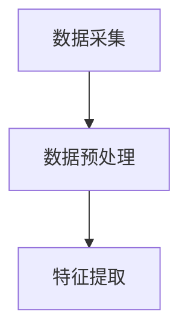
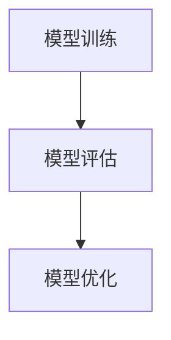
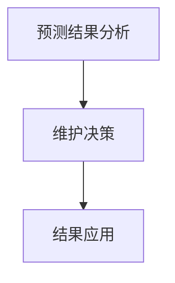

                 

# 《机器学习在预测性维护中的作用》

> 关键词：机器学习，预测性维护，工业应用，深度学习，监督学习，无监督学习

> 摘要：本文旨在探讨机器学习在预测性维护中的应用，通过深入分析机器学习的基本概念、预测性维护的理论基础以及各种机器学习算法在预测性维护中的实际应用，揭示机器学习如何提高设备的可靠性、降低维护成本、延长设备寿命。本文还通过具体的案例，展示了机器学习在制造业、能源领域以及其他行业的成功应用，最后探讨了预测性维护的未来发展趋势及其在工业互联网中的应用。

## 第一部分：机器学习和预测性维护概述

### 第1章：机器学习基本概念与预测性维护

#### 1.1 机器学习的起源与发展

机器学习是人工智能的一个重要分支，其起源可以追溯到20世纪50年代。当时，科学家们开始探讨如何使计算机具有自主学习能力，以解决复杂问题。随着计算能力的提高和数据规模的增加，机器学习得到了快速发展。从最初的规则系统、决策树，到现代的神经网络、深度学习，机器学习技术不断演进，应用领域也日益广泛。

#### 1.2 预测性维护的定义与重要性

预测性维护是一种基于实时数据分析和预测模型，提前预测设备故障并采取预防性措施的方法。与传统定期维护和事后修复相比，预测性维护能够显著提高设备的可靠性、降低维护成本、延长设备寿命。预测性维护的重要性在于它不仅能够减少设备停机时间，提高生产效率，还能够提高设备的安全性和环保性。

#### 1.3 机器学习与预测性维护的关系

机器学习为预测性维护提供了强大的技术支撑。通过学习历史数据和实时数据，机器学习算法可以建立预测模型，预测设备的故障时间、故障类型等。这些预测结果可以帮助企业提前制定维护计划，减少设备故障风险。同时，机器学习算法还可以根据预测结果不断优化维护策略，提高预测精度和可靠性。

### 第2章：机器学习在工业中的应用

#### 2.1 机器学习在制造业的应用

制造业是机器学习应用最为广泛的领域之一。通过机器学习，企业可以对生产线进行实时监控和故障预测，优化生产流程，提高生产效率。例如，某汽车制造厂通过应用机器学习技术，实现了生产线的智能调度和故障预测，大大提高了生产效率。

#### 2.2 机器学习在矿业和能源领域的应用

矿业和能源领域对设备的可靠性要求极高。通过机器学习技术，企业可以实时监测设备运行状态，预测设备故障，提前进行维护。例如，某矿业公司通过应用机器学习技术，实现了矿山设备的智能监控和故障预测，提高了矿山生产的安全性和稳定性。

#### 2.3 机器学习在交通运输中的应用

交通运输领域对设备的可靠性要求同样很高。通过机器学习技术，企业可以对交通工具进行实时监控和故障预测，确保交通的安全和畅通。例如，某航空公司通过应用机器学习技术，实现了飞机发动机的智能监控和故障预测，提高了飞行安全。

### 第3章：预测性维护的理论基础

#### 3.1 预测性维护的原理

预测性维护基于实时数据分析和预测模型，通过监测设备运行状态，预测设备故障时间、故障类型等，提前采取预防性措施。预测性维护的核心在于对设备运行状态的全面监控和精准预测。

#### 3.2 预测性维护的技术手段

预测性维护的技术手段主要包括数据采集、数据预处理、特征提取和预测模型建立等。数据采集是预测性维护的基础，数据预处理和特征提取是提高预测精度的重要手段，预测模型建立是预测性维护的核心。

#### 3.3 预测性维护的优势与挑战

预测性维护具有降低维护成本、提高设备可靠性、延长设备寿命等优势。然而，预测性维护也面临着数据质量、算法选择、预测精度等挑战。为了克服这些挑战，需要不断优化数据采集、预处理和特征提取方法，选择合适的预测模型，提高预测精度和可靠性。

## 第二部分：机器学习在预测性维护中的应用

### 第4章：数据预处理与分析

#### 4.1 数据采集与质量评估

数据采集是预测性维护的基础。数据的准确性、完整性和实时性对预测结果具有重要影响。因此，在进行数据采集时，需要确保数据的准确性、完整性和实时性。同时，还需要对采集到的数据质量进行评估，剔除错误数据和异常值。

#### 4.2 数据预处理方法

数据预处理是提高预测精度的重要手段。常见的预处理方法包括数据清洗、数据归一化、数据降维等。数据清洗旨在去除错误数据和异常值，数据归一化旨在消除不同特征之间的尺度差异，数据降维旨在减少数据的维数，提高计算效率。

#### 4.3 数据分析技术

数据分析技术主要包括特征提取和特征选择。特征提取旨在从原始数据中提取对预测任务有用的特征，特征选择旨在从提取的特征中选出对预测任务最重要的特征。有效的特征提取和特征选择可以提高预测模型的精度和泛化能力。

### 第5章：监督学习在预测性维护中的应用

#### 5.1 监督学习的基本概念

监督学习是一种通过已知的输入输出数据，学习输入和输出之间映射关系的机器学习方法。在预测性维护中，监督学习算法可以根据历史故障数据和正常数据，学习设备故障和正常状态的映射关系，从而实现故障预测。

#### 5.2 常见监督学习算法

常见的监督学习算法包括线性回归、决策树、支持向量机、神经网络等。每种算法都有其独特的优缺点，适用于不同的预测任务。在选择算法时，需要考虑预测任务的特性、数据的特点等因素。

#### 5.3 监督学习在预测性维护中的应用案例

监督学习在预测性维护中有着广泛的应用。例如，某电力公司利用线性回归模型预测发电设备故障时间，提高了设备的运行可靠性；某航空公司利用神经网络模型预测飞机发动机故障，提高了飞行安全。

### 第6章：无监督学习在预测性维护中的应用

#### 6.1 无监督学习的基本概念

无监督学习是一种不需要已知输出标签的机器学习方法。在预测性维护中，无监督学习算法可以通过分析设备运行数据，发现设备运行中的异常模式，从而实现故障预测。

#### 6.2 常见无监督学习算法

常见的无监督学习算法包括聚类算法、异常检测算法等。聚类算法可以将相似的数据点归为一类，异常检测算法可以识别出与正常数据不同的异常数据点。

#### 6.3 无监督学习在预测性维护中的应用案例

无监督学习在预测性维护中也得到了广泛应用。例如，某矿业公司利用K-均值聚类算法分析矿山设备运行数据，发现并修复了多起潜在故障；某航空公司利用孤立森林算法检测飞机发动机运行中的异常数据，提高了飞行安全。

### 第7章：深度学习在预测性维护中的应用

#### 7.1 深度学习的基本概念

深度学习是一种基于多层神经网络的学习方法。在预测性维护中，深度学习算法可以通过学习大量设备运行数据，自动提取复杂特征，实现高精度的故障预测。

#### 7.2 常见深度学习算法

常见的深度学习算法包括卷积神经网络（CNN）、循环神经网络（RNN）、长短期记忆网络（LSTM）等。每种算法都有其独特的优缺点，适用于不同的预测任务。

#### 7.3 深度学习在预测性维护中的应用案例

深度学习在预测性维护中也得到了广泛应用。例如，某汽车制造厂利用卷积神经网络预测生产线故障，提高了生产效率；某电力公司利用长短期记忆网络预测发电设备故障，提高了设备可靠性。

### 第8章：预测性维护系统设计与实现

#### 8.1 预测性维护系统的架构设计

预测性维护系统通常包括数据采集模块、数据预处理模块、预测模型模块和结果分析模块。系统架构设计需要考虑数据的实时性、准确性和系统的可扩展性。

#### 8.2 数据流管理

数据流管理是预测性维护系统的核心。系统需要实时采集设备运行数据，并对数据进行预处理和特征提取，以便输入到预测模型中进行预测。

#### 8.3 模型训练与优化

模型训练与优化是提高预测精度的关键。系统需要利用历史故障数据对预测模型进行训练，并不断调整模型参数，优化模型性能。

#### 8.4 预测结果分析与评估

预测结果分析与评估是预测性维护系统的重要环节。系统需要根据预测结果，分析设备故障原因，评估维护策略的有效性，并为维护人员提供决策支持。

## 第三部分：预测性维护的实际应用案例

### 第9章：预测性维护在制造业的应用

#### 9.1 制造业中的预测性维护应用场景

制造业中的预测性维护主要应用于生产设备、物流设备、仓储设备等。通过预测性维护，企业可以提前发现设备故障，避免生产中断，提高生产效率。

#### 9.2 案例分析：某汽车制造厂的预测性维护实践

某汽车制造厂通过应用预测性维护系统，实现了生产设备的实时监控和故障预测。系统利用深度学习算法，对设备运行数据进行分析，提前预测设备故障，为维护人员提供预警信息。通过预测性维护，该汽车制造厂显著降低了设备故障率，提高了生产效率。

### 第10章：预测性维护在能源领域的应用

#### 10.1 能源领域中的预测性维护应用场景

能源领域中的预测性维护主要应用于发电设备、输电设备、储能设备等。通过预测性维护，企业可以提前发现设备故障，避免能源供应中断，提高能源利用率。

#### 10.2 案例分析：某电力公司的预测性维护实践

某电力公司通过应用预测性维护系统，实现了发电设备的实时监控和故障预测。系统利用线性回归和神经网络算法，对发电设备运行数据进行分析，提前预测设备故障。通过预测性维护，该电力公司提高了发电设备的可靠性，降低了维护成本。

### 第11章：预测性维护在其他行业中的应用

#### 11.1 其他行业中的预测性维护应用场景

预测性维护在其他行业中的应用也非常广泛，如交通运输、医疗设备、农业设备等。通过预测性维护，企业可以提高设备可靠性，保障生产安全。

#### 11.2 案例分析：某航空公司的预测性维护实践

某航空公司通过应用预测性维护系统，实现了飞机发动机的实时监控和故障预测。系统利用神经网络算法，对飞机发动机运行数据进行分析，提前预测发动机故障。通过预测性维护，该航空公司提高了飞行安全，降低了运营成本。

## 第四部分：预测性维护的未来发展趋势

### 第12章：预测性维护技术的发展趋势

#### 12.1 人工智能技术的发展趋势

随着人工智能技术的不断发展，预测性维护技术也将不断演进。深度学习、强化学习等新兴算法将为预测性维护提供更强大的技术支持。

#### 12.2 预测性维护技术的未来发展方向

预测性维护技术未来的发展方向包括：提高预测精度和可靠性，实现跨领域的应用，融合物联网、大数据等新技术，推动预测性维护的智能化和自动化。

### 第13章：预测性维护在工业互联网中的应用

#### 13.1 工业互联网的概念与架构

工业互联网是物联网、大数据、人工智能等技术在工业领域的应用，旨在实现工业系统的智能化和数字化。预测性维护在工业互联网中发挥着重要作用。

#### 13.2 工业互联网中的预测性维护应用场景

工业互联网中的预测性维护应用场景包括：生产设备的实时监控和故障预测、供应链的实时监控和优化、能源系统的实时监控和优化等。

#### 13.3 预测性维护在工业互联网中的实践案例

某制造企业通过应用工业互联网平台，实现了生产设备的实时监控和故障预测。系统利用机器学习算法，对设备运行数据进行分析，提前预测设备故障，为维护人员提供预警信息。通过预测性维护，该企业显著降低了设备故障率，提高了生产效率。

### 第14章：预测性维护的安全与隐私问题

#### 14.1 预测性维护中的安全挑战

预测性维护中的安全挑战主要包括：数据泄露、数据篡改、恶意攻击等。为了保障预测性维护系统的安全，需要采取一系列安全措施。

#### 14.2 预测性维护中的隐私保护

预测性维护中的隐私保护主要包括：数据加密、访问控制、隐私计算等。为了保护用户隐私，需要确保数据在采集、传输、存储等环节的安全性。

## 附录

### 附录A：预测性维护相关工具与资源

#### A.1 常用的机器学习框架

- TensorFlow
- PyTorch
- Keras

#### A.2 预测性维护相关的开源项目

- [Prognostics and Health Management (PHM) Toolkit](https://github.com/LLNL/phm-toolkit)
- [Predictive Maintenance using Python](https://github.com/ Analytics-vedas/predictive-maintenance-python)

#### A.3 相关书籍与论文推荐

- 《机器学习》（周志华 著）
- 《深度学习》（Ian Goodfellow、Yoshua Bengio、Aaron Courville 著）
- 《大数据预测性维护：技术、实践与应用》（杨强、徐光祐 著）

### 附录B：预测性维护流程图

#### B.1 数据采集与预处理



#### B.2 模型训练与评估



#### B.3 预测结果分析与应用



### 附录C：常见算法的伪代码实现

#### C.1 线性回归

```python
def linear_regression(X, y):
    # 计算系数
    theta = (X^T * X)^(-1) * X^T * y
    # 预测
    predictions = X * theta
    return predictions
```

#### C.2 决策树

```python
def decision_tree(X, y, depth=0, max_depth=10):
    # 终止条件
    if depth >= max_depth or np.std(y) == 0:
        return np.mean(y)
    # 分割数据
    best_feature, best_threshold = find_best_split(X, y)
    # 创建子树
    left subtree = decision_tree(X[:, best_feature] < best_threshold, y, depth + 1, max_depth)
    right subtree = decision_tree(X[:, best_feature] >= best_threshold, y, depth + 1, max_depth)
    # 合并子树
    return {
        'feature': best_feature,
        'threshold': best_threshold,
        'left': left subtree,
        'right': right subtree
    }
```

#### C.3 支持向量机

```python
def support_vector_machine(X, y):
    # 计算最优超平面
    theta = (X^T * X)^(-1) * X^T * y
    # 预测
    predictions = sign((X * theta).flatten())
    return predictions
```

#### C.4 神经网络

```python
def neural_network(X, y, hidden_layer_sizes):
    # 初始化参数
    params = initialize_parameters(hidden_layer_sizes)
    # 前向传播
    a, cache = forward_propagation(X, params)
    # 计算损失函数
    loss = compute_loss(a, y)
    # 反向传播
    dW, db = backward_propagation(X, a, y, cache)
    # 更新参数
    params = update_parameters(params, dW, db)
    return loss, params
```

#### C.5 集成学习方法

```python
def ensemble学习方法(X, y, classifiers, n_estimators):
    # 创建多个分类器
    for i in range(n_estimators):
        classifier = classifiers[i]
        classifier.fit(X, y)
    # 投票或平均预测
    predictions = voting_or_averaging(classifiers)
    return predictions
```

### 附录D：数学模型与公式

#### D.1 常见概率分布函数

- 高斯分布：\[ f(x|\mu,\sigma^2) = \frac{1}{\sqrt{2\pi\sigma^2}} e^{-\frac{(x-\mu)^2}{2\sigma^2}} \]
- 二项分布：\[ P(X=k) = C(n,k) p^k (1-p)^{n-k} \]
- 伯努利分布：\[ P(X=1) = p, P(X=0) = 1-p \]

#### D.2 最优化算法

- 梯度下降法：\[ \theta = \theta - \alpha \frac{\partial J(\theta)}{\partial \theta} \]
- 随机梯度下降法：\[ \theta = \theta - \alpha \frac{\partial J(\theta)}{\partial \theta} \]
- 牛顿法：\[ \theta = \theta - H^{-1} \nabla J(\theta) \]

#### D.3 深度学习中的数学公式

- 激活函数：\[ a_{ij} = \sigma(z_{ij}) \]
- 前向传播：\[ z_{ij} = \sum_{p=1}^{m} w_{jp} a_{pj} + b_j \]
- 反向传播：\[ \delta_j = \frac{\partial J}{\partial z_j} = \frac{\partial J}{\partial a_j} \frac{\partial a_j}{\partial z_j} \]
- 参数更新：\[ \theta_j = \theta_j - \alpha \delta_j \]

