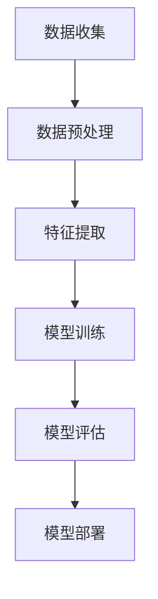

                 

### 引言与概述

#### 1.1 机器学习的现状与挑战

机器学习作为人工智能的核心技术，已经广泛应用于各个领域，如金融、医疗、工业自动化等。然而，尽管近年来机器学习取得了显著的进展，但仍面临着诸多挑战。首先，数据质量是机器学习成功的关键因素。然而，现实中的数据往往存在噪声、缺失和偏差，这对模型的训练和评估带来了困难。其次，模型的可解释性也是一个重要挑战。当前的许多机器学习模型，特别是深度学习模型，往往被认为是“黑箱”，难以解释其决策过程，这在某些应用场景中可能引发严重的安全和伦理问题。此外，机器学习模型的泛化能力也有限，容易在新的数据集上表现不佳。

#### 1.2 软件2.0的概念与核心特点

软件2.0是指以数据为中心，通过智能算法和高效的数据处理技术，实现软件系统的自我学习和优化。与传统的软件1.0相比，软件2.0具有以下核心特点：

1. **数据驱动**：软件2.0强调数据的重要性，通过收集和分析数据来驱动软件系统的决策和优化。
2. **智能算法**：软件2.0利用机器学习、深度学习等智能算法，对数据进行处理和分析，以提高系统的性能和效率。
3. **自我优化**：软件2.0能够根据实际运行情况自动调整参数和策略，实现自我优化。
4. **高可用性和可扩展性**：软件2.0采用分布式架构和云原生技术，具有高可用性和可扩展性，能够应对大规模的数据处理需求。

#### 1.3 机器学习与软件2.0的交汇

机器学习与软件2.0的结合，为解决机器学习面临的挑战提供了新的思路和途径。首先，软件2.0的数据驱动特性，使得机器学习能够从海量的数据中提取有价值的信息，提高模型的训练效果。其次，软件2.0的自我优化能力，可以帮助机器学习模型根据实际应用场景动态调整参数，提高模型的泛化能力和可解释性。此外，软件2.0的高可用性和可扩展性，也为机器学习模型的部署和运维提供了便利。

总之，机器学习与软件2.0的结合，不仅有助于解决机器学习面临的挑战，还将推动人工智能技术的进一步发展。在接下来的章节中，我们将详细探讨软件2.0时代的机器学习架构、核心算法与模型，以及机器学习在软件2.0时代的应用与实践。

#### 2.1 软件2.0的架构设计原则

软件2.0时代的机器学习架构设计，需要遵循一系列关键原则，以确保系统的可靠性、可扩展性和高效性。以下是几个核心设计原则：

**模块化**：
模块化设计是将系统划分为若干独立的模块，每个模块负责特定的功能。这种设计方法具有以下优势：
1. **易于维护**：每个模块都是独立的，可以单独开发和测试，降低了系统的复杂度。
2. **可复用性**：模块可以独立部署和升级，提高了系统的可复用性。
3. **高可用性**：如果一个模块出现故障，其他模块可以继续运行，不会导致整个系统崩溃。

**数据驱动**：
软件2.0强调数据驱动，这意味着系统设计需要充分考虑数据的采集、存储和处理。以下是几个关键点：
1. **数据采集**：系统需要能够从各种数据源（如传感器、数据库、API等）采集数据。
2. **数据存储**：系统需要高效的数据存储方案，以支持大规模数据的存储和管理。
3. **数据处理**：系统需要能够对数据进行清洗、转换和融合，以供后续分析使用。

**可扩展性**：
可扩展性是指系统在处理更大规模数据或更高并发请求时，能够保持性能和稳定性的能力。以下是一些实现方法：
1. **水平扩展**：通过增加服务器节点，提升系统的计算能力和存储容量。
2. **分布式架构**：采用分布式架构，将系统划分为多个节点，每个节点负责部分任务，以实现负载均衡和高可用性。
3. **微服务架构**：采用微服务架构，将系统划分为多个独立的服务模块，每个模块可以独立部署和扩展。

**高可用性**：
高可用性是指系统在面临故障时，能够快速恢复并保持正常运行的能力。以下是几个关键点：
1. **容错机制**：系统需要具备容错能力，能够检测和纠正错误，确保系统稳定运行。
2. **备份与恢复**：系统需要定期备份，并在出现故障时能够快速恢复。
3. **监控与报警**：系统需要具备完善的监控与报警机制，及时发现和处理故障。

**安全与隐私**：
随着数据量的增加和复杂性的提升，系统的安全与隐私保护变得尤为重要。以下是一些关键点：
1. **数据加密**：对存储和传输的数据进行加密，防止数据泄露。
2. **访问控制**：对系统的访问进行严格的控制，确保只有授权用户才能访问敏感数据。
3. **合规性**：确保系统遵守相关法律法规，如数据保护法、隐私法等。

通过遵循这些架构设计原则，软件2.0时代的机器学习系统将能够更好地应对复杂的应用场景，提高系统的性能和可靠性。

#### 2.2 机器学习在软件2.0中的应用模式

机器学习在软件2.0中的应用模式，是软件2.0架构设计原则的具体实现，旨在通过智能算法和数据驱动，提升系统的性能和效率。以下是几种常见的机器学习应用模式：

**数据预处理**：
数据预处理是机器学习模型训练的重要环节，其目标是将原始数据进行清洗、转换和标准化，使其适合模型训练。在软件2.0中，数据预处理通常通过以下步骤实现：
1. **数据采集**：从各种数据源（如传感器、数据库、API等）收集数据。
2. **数据清洗**：去除数据中的噪声和异常值，处理缺失数据。
3. **特征提取**：从原始数据中提取对模型训练有用的特征。
4. **数据转换**：将数据转换为适合机器学习算法的格式，如归一化、标准化等。

**模型训练**：
模型训练是机器学习应用的核心环节，其目标是利用训练数据，构建能够对未知数据进行预测或分类的模型。在软件2.0中，模型训练通常通过以下步骤实现：
1. **数据集划分**：将数据集划分为训练集、验证集和测试集，以评估模型的性能。
2. **模型选择**：选择合适的机器学习算法和模型架构，如线性回归、决策树、神经网络等。
3. **参数调整**：通过调整模型参数，优化模型的性能。
4. **训练过程**：利用训练数据，通过迭代优化算法，训练出模型。

**模型部署**：
模型部署是将训练好的模型应用于实际业务场景的过程。在软件2.0中，模型部署通常通过以下步骤实现：
1. **模型评估**：在测试集上评估模型的性能，确保模型具有较好的泛化能力。
2. **模型集成**：将模型集成到软件系统中，如通过API或库的形式。
3. **实时预测**：在应用场景中实时预测，如通过Web服务、移动应用等。
4. **监控与维护**：对模型进行监控和维护，确保其稳定运行。

**模型优化**：
模型优化是持续提升模型性能的过程，通常包括以下步骤：
1. **性能监控**：监控模型的实际运行情况，识别性能瓶颈。
2. **数据反馈**：收集模型预测的反馈数据，用于进一步优化模型。
3. **迭代优化**：通过调整模型参数、改进算法或增加数据，持续优化模型。

通过这些应用模式，软件2.0时代的机器学习系统可以更好地应对复杂的应用场景，提高系统的智能程度和效率。

#### 2.3 软件2.0时代的机器学习框架

在软件2.0时代，机器学习框架的设计和实现变得更加复杂，同时也更加灵活。以下是几种常见的机器学习框架及其特点：

**TensorFlow**

TensorFlow是由Google开发的开源机器学习框架，广泛用于深度学习和复杂的机器学习任务。其特点如下：

- **动态图计算**：TensorFlow使用动态计算图，允许开发者灵活地定义和优化计算流程。
- **丰富的API**：TensorFlow提供了丰富的API，包括TensorFlow Core、TensorFlow Lite、TensorFlow Extended等，支持多种编程语言，如Python、C++等。
- **大规模训练**：TensorFlow支持大规模分布式训练，可以在多个GPU和TPU上运行，提高训练速度。
- **模型部署**：TensorFlow提供了详细的模型部署指南，支持在移动设备、服务器和边缘设备上部署。

**PyTorch**

PyTorch是由Facebook开发的开源机器学习框架，以其动态计算图和易于使用的API而受到开发者欢迎。其特点如下：

- **动态图计算**：PyTorch使用动态计算图，使开发者能够直观地定义和调试计算流程。
- **简洁的API**：PyTorch提供了简洁的API，使开发者可以快速构建和训练模型。
- **深度学习库**：PyTorch集成了多个深度学习库，如TorchVision、TorchText、TorchAudio等，支持多种数据类型和任务。
- **交互式环境**：PyTorch提供了交互式环境，如iPython Notebook，方便开发者进行实验和调试。

**Scikit-learn**

Scikit-learn是一个基于Python的开源机器学习库，主要用于经典机器学习算法的实现和应用。其特点如下：

- **简洁的API**：Scikit-learn提供了简洁的API，使开发者可以快速实现和部署机器学习模型。
- **多样化的算法**：Scikit-learn包含了多种监督学习和无监督学习算法，如线性回归、决策树、支持向量机、聚类算法等。
- **易于集成**：Scikit-learn可以与Python的其他库（如NumPy、Pandas）无缝集成，方便数据预处理和后续分析。
- **模块化设计**：Scikit-learn采用模块化设计，使开发者可以根据需要选择和组合不同的模块。

**Keras**

Keras是一个基于TensorFlow和Theano的开源高级神经网络API，旨在提供简洁和易于使用的接口。其特点如下：

- **简洁的API**：Keras提供了简洁的API，使开发者可以快速构建和训练神经网络。
- **模块化设计**：Keras采用模块化设计，支持快速构建和组合不同的神经网络层。
- **兼容性**：Keras可以在多个后端运行，包括TensorFlow、Theano和Microsoft Cognitive Toolkit，提供统一的接口。
- **交互式环境**：Keras支持在iPython Notebook中运行，方便开发者进行实验和调试。

通过这些机器学习框架，开发者可以在软件2.0时代更高效地实现和部署机器学习模型，应对复杂的业务场景。

### 3.1 监督学习算法

监督学习算法是机器学习领域中最常见的算法之一，其核心思想是通过已知标签的数据来训练模型，从而对未知数据进行预测。以下是几种典型的监督学习算法及其原理：

#### 3.1.1 线性回归

线性回归是一种简单的监督学习算法，用于预测连续值输出。其基本原理是通过拟合一条直线来描述输入特征和输出标签之间的关系。具体步骤如下：

1. **模型定义**：假设输入特征为 $X$，输出标签为 $y$，线性回归模型可以表示为：
   $$ y = \beta_0 + \beta_1 \cdot x $$
   其中，$\beta_0$ 和 $\beta_1$ 是模型的参数。

2. **损失函数**：线性回归通常采用均方误差（MSE）作为损失函数，表示为：
   $$ J(\beta_0, \beta_1) = \frac{1}{2n} \sum_{i=1}^{n} (y_i - (\beta_0 + \beta_1 \cdot x_i))^2 $$

3. **优化方法**：为了最小化损失函数，可以使用梯度下降算法。具体步骤如下：
   - 初始化模型参数 $\beta_0$ 和 $\beta_1$。
   - 计算损失函数关于每个参数的梯度。
   - 更新模型参数：
     $$ \beta_0 = \beta_0 - \alpha \cdot \frac{\partial J}{\partial \beta_0} $$
     $$ \beta_1 = \beta_1 - \alpha \cdot \frac{\partial J}{\partial \beta_1} $$
     其中，$\alpha$ 是学习率。

#### 3.1.2 决策树

决策树是一种基于树结构的分类算法，通过一系列if-else规则对数据进行分割，直到满足某个停止条件。其基本原理如下：

1. **构建树**：从根节点开始，根据某个特征的最佳分割点，将数据分割为两个子集。重复这个过程，直到满足停止条件（如最大深度、最小叶子节点样本数等）。

2. **决策规则**：每个内部节点表示一个特征，每个分支表示该特征的取值。叶子节点表示预测结果。

3. **剪枝**：为了防止过拟合，可以使用剪枝技术来优化决策树。常见的剪枝方法包括预剪枝和后剪枝。

#### 3.1.3 支持向量机

支持向量机（SVM）是一种二分类算法，其核心思想是找到最佳分隔超平面，使得分类边界距离最近的样本点（支持向量）最大。其基本原理如下：

1. **线性SVM**：对于线性可分的数据集，SVM通过求解以下优化问题来找到最佳分隔超平面：
   $$ \min_{\beta, \beta_0} \frac{1}{2} ||\beta||^2 $$
   $$ s.t. y_i (\beta \cdot x_i + \beta_0) \geq 1 $$

2. **核SVM**：对于非线性可分的数据集，SVM通过引入核函数将输入空间映射到高维特征空间，然后在高维空间中找到最佳分隔超平面。常用的核函数包括线性核、多项式核、径向基核（RBF）等。

通过这些监督学习算法，我们可以从已知标签的数据中训练模型，从而对未知数据进行预测。在实际应用中，需要根据数据的特点和任务需求，选择合适的算法并调整参数，以获得最佳性能。

#### 3.2 非监督学习算法

非监督学习算法在机器学习领域中扮演着重要的角色，其核心思想是在没有标签数据的情况下，通过分析数据特征，对数据进行分类、聚类或降维。以下是几种常见的非监督学习算法及其原理：

**K-均值聚类**

K-均值聚类是一种基于距离的聚类算法，其目标是将数据点划分成K个簇，使得每个数据点与其所属簇中心的距离之和最小。以下是K-均值聚类的具体步骤：

1. **初始化**：随机选择K个初始聚类中心。

2. **分配数据点**：对于每个数据点，计算其与每个聚类中心的距离，并将其分配到距离最近的聚类中心所在的簇。

3. **更新聚类中心**：重新计算每个簇的中心，即将簇内所有数据点的平均值作为新的聚类中心。

4. **迭代**：重复步骤2和步骤3，直到聚类中心不再发生变化或满足预设的迭代次数。

5. **评估**：使用簇内距离平方和（WCSS）等指标评估聚类效果。

**主成分分析**

主成分分析（PCA）是一种降维算法，其目标是在保持数据主要特征的同时，降低数据的维度。以下是PCA的具体步骤：

1. **特征提取**：计算数据集的特征协方差矩阵。

2. **特征值和特征向量计算**：计算协方差矩阵的特征值和特征向量。

3. **排序和选择**：将特征向量按照对应的特征值从大到小排序，选择前k个最大的特征向量作为主成分。

4. **数据投影**：将原始数据投影到由主成分构成的子空间中，实现降维。

**自编码器**

自编码器是一种基于神经网络的降维和特征提取算法，其核心思想是通过无监督学习方式自动学习数据表示。以下是自编码器的基本结构：

1. **编码器**：编码器将输入数据映射到一个隐藏层，提取数据的主要特征。

2. **解码器**：解码器将隐藏层的数据映射回原始数据空间，重建输入数据。

3. **损失函数**：通过最小化重建误差（如均方误差MSE）来训练模型。

通过这些非监督学习算法，我们可以从无标签的数据中提取有用的信息，进行聚类、降维或特征提取，为后续的监督学习任务提供支持。

#### 3.3 强化学习算法

强化学习（Reinforcement Learning, RL）是一种机器学习方法，旨在通过试错和奖励机制，使智能体（agent）学会在不确定环境中做出最佳决策。以下是几种常见的强化学习算法及其原理：

**Q-学习**

Q-学习是一种基于值函数的强化学习算法，其目标是通过迭代更新值函数，使智能体学会在给定状态下选择最佳动作。以下是Q-学习的具体步骤：

1. **初始化**：初始化Q值表，用随机值或零填充。

2. **选择动作**：在给定状态下，选择当前最优动作 $a_t$，可以选择贪心策略或epsilon-greedy策略。

3. **执行动作**：在环境中执行选择出的动作，获得状态转移和奖励。

4. **更新Q值**：使用下面的公式更新Q值：
   $$ Q(s_t, a_t) = Q(s_t, a_t) + \alpha [r_t + \gamma \max_{a'} Q(s_{t+1}, a') - Q(s_t, a_t)] $$
   其中，$\alpha$ 是学习率，$\gamma$ 是折扣因子，$r_t$ 是即时奖励。

5. **迭代**：重复步骤2到步骤4，直到满足终止条件（如达到最大迭代次数或智能体达到目标状态）。

**深度强化学习**

深度强化学习（Deep Reinforcement Learning, DRL）是结合了深度学习和强化学习的方法，使用深度神经网络来近似值函数或策略。以下是DRL的基本结构：

1. **深度神经网络**：使用深度神经网络来近似Q值函数或策略函数。

2. **经验回放**：使用经验回放（Experience Replay）来存储和随机抽样智能体过去的经验，减少方差并避免策略的过拟合。

3. **策略梯度方法**：使用策略梯度方法来优化神经网络的参数，通过最大化期望回报来更新策略。

4. **异步训练**：异步训练（Asynchronous Training）允许多个智能体同时进行训练，提高训练效率和收敛速度。

通过这些强化学习算法，智能体可以在复杂和动态的环境中学习到有效的策略，从而实现自动化决策和优化。

### 4.1 深度学习的概念与原理

深度学习（Deep Learning, DL）是一种基于多层神经网络的学习方法，能够自动从数据中提取特征，实现复杂的数据处理任务。深度学习在机器学习领域取得了显著的成果，尤其在图像识别、自然语言处理、语音识别等方面。

**神经网络的组成**

神经网络由大量的神经元（或节点）组成，每个神经元接收多个输入，通过激活函数产生输出。神经网络可以分为输入层、隐藏层和输出层。

- **输入层**：接收外部输入数据，如图像、文本、声音等。
- **隐藏层**：对输入数据进行特征提取和变换，隐藏层可以有多个层次，每层都可以提取更高层次的抽象特征。
- **输出层**：产生最终的输出结果，如分类标签、数值预测等。

**激活函数**

激活函数是神经网络中的一个关键组成部分，用于引入非线性特性。常见的激活函数包括：

- **Sigmoid函数**：输出范围为（0, 1），可以将输入映射到概率区间。
- **ReLU函数**：输出为输入值或零，引入稀疏性，加速训练过程。
- **Tanh函数**：输出范围为（-1, 1），可以模拟生物神经元的活动。

**反向传播算法**

反向传播算法是深度学习训练过程中用于优化模型参数的关键算法。其基本思想是通过反向传播误差信号，计算各层神经元的梯度，并使用梯度下降方法更新参数。

具体步骤如下：

1. **前向传播**：输入数据通过神经网络，计算各层的输出值。

2. **计算损失**：使用损失函数（如均方误差、交叉熵等）计算输出值与真实值之间的差异。

3. **反向传播**：从输出层开始，逐层计算每个神经元关于参数的梯度。

4. **参数更新**：使用梯度下降方法更新模型参数。

**深度学习的优势**

- **自动特征提取**：深度学习能够自动从原始数据中提取特征，减少人工特征工程的工作量。
- **处理复杂数据**：深度学习能够处理高维、非线性、复杂的数据，如图像、文本、语音等。
- **模型泛化能力**：深度学习模型具有较好的泛化能力，能够在新的数据集上表现良好。
- **自适应性和灵活性**：深度学习模型可以根据不同任务和数据特点，通过调整网络结构和参数，实现灵活的适应。

通过上述概念和原理，我们可以理解深度学习如何从数据中自动提取特征，并通过反向传播算法不断优化模型，实现复杂的数据处理任务。

### 4.2 常见深度学习模型

在深度学习中，有许多常见的模型被广泛使用，这些模型在处理不同类型的数据和任务时表现出色。以下是几种典型的深度学习模型：

#### 4.2.1 卷积神经网络（CNN）

卷积神经网络（Convolutional Neural Network, CNN）是一种专门用于处理图像数据的深度学习模型，其核心思想是通过卷积操作提取图像中的局部特征。

**结构**：
- **卷积层**：卷积层通过卷积操作提取图像的特征，每个卷积核提取不同类型的特征。
- **池化层**：池化层用于下采样，减少数据维度，提高计算效率。
- **全连接层**：全连接层将卷积层和池化层提取的特征进行融合，生成最终的分类结果。

**原理**：
- **卷积操作**：卷积层通过卷积核与输入图像进行卷积操作，提取图像的局部特征。
- **ReLU激活函数**：卷积层通常使用ReLU激活函数，引入非线性特性，加速训练过程。
- **池化操作**：池化层通过最大池化或平均池化操作，减少数据维度，提高模型的鲁棒性。

**应用场景**：
- **图像分类**：用于对图像进行分类，如人脸识别、物体检测等。
- **图像分割**：用于对图像中的物体进行分割，如医学图像分割、自动驾驶图像处理等。

#### 4.2.2 循环神经网络（RNN）

循环神经网络（Recurrent Neural Network, RNN）是一种用于处理序列数据的深度学习模型，其核心思想是通过循环结构保持长时记忆。

**结构**：
- **隐藏层**：RNN具有多个隐藏层，每个时间步的输入和隐藏状态都会传递到下一个时间步。
- **门控单元**：RNN中的门控单元（如遗忘门、输入门、输出门）用于控制信息的流动，解决长时依赖问题。

**原理**：
- **反向传播通过时间**：RNN通过反向传播通过时间，计算每个时间步的梯度。
- **门控机制**：门控机制用于控制信息的流动，遗忘门用于控制遗忘历史信息，输入门用于控制新信息的加入，输出门用于控制最终输出。
- **长短时记忆（LSTM）**：LSTM是RNN的一种变体，通过引入记忆单元和门控机制，解决长时依赖问题。

**应用场景**：
- **自然语言处理**：用于语言模型、机器翻译、情感分析等。
- **语音识别**：用于语音信号处理，将语音转换为文本。

#### 4.2.3 生成对抗网络（GAN）

生成对抗网络（Generative Adversarial Network, GAN）是一种由生成器和判别器组成的深度学习模型，用于生成逼真的数据。

**结构**：
- **生成器**：生成器生成伪数据，目标是使判别器难以区分伪数据和真实数据。
- **判别器**：判别器判断输入数据是真实数据还是生成数据。

**原理**：
- **对抗训练**：生成器和判别器相互对抗，生成器的目标是生成更逼真的数据，判别器的目标是正确分类真实和生成数据。
- **梯度提升**：通过梯度提升方法，生成器和判别器不断优化，提高生成质量和判别能力。

**应用场景**：
- **图像生成**：用于生成高质量、逼真的图像，如人脸生成、图像修复等。
- **数据增强**：用于增加训练数据量，提高模型的泛化能力。

通过这些常见深度学习模型，我们可以有效地处理不同类型的数据和任务，实现复杂的特征提取和预测。

### 4.3 深度学习优化算法

在深度学习训练过程中，优化算法的作用是调整模型参数，以最小化损失函数，提高模型性能。以下是几种常见的深度学习优化算法及其原理：

**随机梯度下降（SGD）**

随机梯度下降（Stochastic Gradient Descent, SGD）是最简单的优化算法之一，其核心思想是通过随机选择一小部分数据进行梯度计算，并更新模型参数。

**原理**：
1. **梯度计算**：对于每个数据点，计算损失函数关于模型参数的梯度。
2. **参数更新**：使用梯度更新模型参数，公式如下：
   $$ \theta = \theta - \alpha \cdot \nabla_{\theta} J(\theta) $$
   其中，$\theta$ 表示模型参数，$J(\theta)$ 表示损失函数，$\alpha$ 是学习率。

**优点**：
- 计算简单，易于实现。
- 对噪声数据具有较强的鲁棒性。

**缺点**：
- 收敛速度较慢。
- 需要大量计算资源。

**批量梯度下降（BGD）**

批量梯度下降（Batch Gradient Descent, BGD）是对SGD的一种改进，其核心思想是使用整个数据集进行梯度计算，并更新模型参数。

**原理**：
1. **梯度计算**：计算整个数据集的梯度。
2. **参数更新**：使用梯度更新模型参数，公式如下：
   $$ \theta = \theta - \alpha \cdot \nabla_{\theta} J(\theta) $$
   其中，$\theta$ 表示模型参数，$J(\theta)$ 表示损失函数，$\alpha$ 是学习率。

**优点**：
- 收敛速度较快。
- 对模型参数的更新更加稳定。

**缺点**：
- 计算成本较高，不适合大规模数据集。

**小批量梯度下降（MBGD）**

小批量梯度下降（Mini-batch Gradient Descent, MBGD）是对BGD的一种折中方案，其核心思想是使用一部分数据（小批量）进行梯度计算，并更新模型参数。

**原理**：
1. **梯度计算**：选择一部分数据进行梯度计算。
2. **参数更新**：使用梯度更新模型参数，公式如下：
   $$ \theta = \theta - \alpha \cdot \nabla_{\theta} J(\theta) $$
   其中，$\theta$ 表示模型参数，$J(\theta)$ 表示损失函数，$\alpha$ 是学习率。

**优点**：
- 计算成本适中。
- 收敛速度介于SGD和BGD之间。

**缺点**：
- 对批量大小敏感，需要调整参数。

**动量（Momentum）**

动量（Momentum）是一种改进SGD的优化算法，其核心思想是利用历史梯度信息，加速模型参数的更新。

**原理**：
1. **梯度计算**：计算当前梯度。
2. **动量计算**：利用历史梯度计算动量，公式如下：
   $$ m = \gamma \cdot m + (1 - \gamma) \cdot \nabla_{\theta} J(\theta) $$
   其中，$m$ 表示动量，$\gamma$ 是动量参数。
3. **参数更新**：使用动量更新模型参数，公式如下：
   $$ \theta = \theta - \alpha \cdot m $$

**优点**：
- 提高收敛速度。
- 减少振荡。

**缺点**：
- 对初始参数敏感。

通过这些优化算法，我们可以有效地调整模型参数，提高模型的收敛速度和性能。

### 5.1 语言模型与词向量

在自然语言处理（Natural Language Processing, NLP）中，语言模型和词向量是两种重要的基础技术，用于表示和处理文本数据。语言模型用于预测文本中的下一个词或序列，而词向量则是将词汇映射到高维空间，以便于进行数学计算。

**语言模型**

语言模型（Language Model）是NLP中用于预测文本中下一个词或序列的模型。它基于大量语料库，通过统计方法或机器学习方法，学习文本的统计规律。语言模型可以分为基于概率的语言模型和基于神经网络的深度语言模型。

1. **基于概率的语言模型**：
   - **N元语法模型**：N元语法模型（N-gram Model）是一种基于历史N个词的统计模型，用于预测下一个词。其基本思想是计算每个词序列的概率，并选择概率最高的词作为下一个词。公式如下：
     $$ P(w_{t+1}|w_{t}, w_{t-1}, ..., w_{t-N+1}) = \frac{C(w_{t}, w_{t-1}, ..., w_{t-N+1}, w_{t+1})}{C(w_{t}, w_{t-1}, ..., w_{t-N+1})} $$
     其中，$C(w_{t}, w_{t-1}, ..., w_{t-N+1}, w_{t+1})$ 表示词序列 $w_{t}, w_{t-1}, ..., w_{t-N+1}, w_{t+1}$ 在语料库中的出现次数，$C(w_{t}, w_{t-1}, ..., w_{t-N+1})$ 表示词序列 $w_{t}, w_{t-1}, ..., w_{t-N+1}$ 的出现次数。
   - **隐马尔可夫模型（HMM）**：隐马尔可夫模型是一种基于状态转移概率和观测概率的统计模型，用于处理序列数据。HMM可以看作是N元语法模型的扩展，能够处理连续变量和隐状态。

2. **基于神经网络的深度语言模型**：
   - **循环神经网络（RNN）**：循环神经网络是一种能够处理序列数据的神经网络，通过循环结构保持长时记忆，用于语言模型。RNN的基本单元是隐藏层，每个时间步的输入和隐藏状态都会传递到下一个时间步。
   - **长短时记忆（LSTM）**：长短时记忆网络是RNN的一种变体，通过引入门控单元，解决长时依赖问题。LSTM可以记住长期依赖的信息，提高语言模型的性能。

**词向量**

词向量（Word Vector）是将词汇映射到高维空间的技术，用于表示和计算文本数据。词向量可以看作是词汇的分布式表示，能够捕捉词汇的语义和语法特征。常见的词向量模型包括Word2Vec、GloVe和BERT。

1. **Word2Vec**：
   - **Word2Vec**是一种基于神经网络的语言模型，通过训练单词和上下文之间的映射关系，生成词向量。Word2Vec有两种训练方法：连续词袋（CBOW）和跳词模型（Skip-Gram）。
   - **CBOW**：连续词袋模型通过上下文词的均值向量表示目标词的向量。
     $$ \text{输出向量} = \frac{1}{|\text{上下文词集合}|} \sum_{\text{w} \in \text{上下文词集合}} \text{w的向量} $$
   - **Skip-Gram**：跳词模型通过目标词的向量表示上下文词的均值向量。
     $$ \text{输出向量} = \frac{1}{|\text{上下文词集合}|} \sum_{\text{w} \in \text{上下文词集合}} \text{w的向量} $$

2. **GloVe**：
   - **GloVe**（Global Vectors for Word Representation）是一种基于矩阵分解的词向量模型，通过训练两个矩阵（嵌入矩阵和上下文矩阵），生成词向量。
   - **损失函数**：GloVe使用均方误差（MSE）作为损失函数，优化嵌入矩阵和上下文矩阵。

3. **BERT**：
   - **BERT**（Bidirectional Encoder Representations from Transformers）是一种基于Transformer的预训练模型，通过双向编码器生成词向量。
   - **预训练**：BERT在大量未标注的文本数据上预训练，学习词汇的上下文关系和语义特征。

通过语言模型和词向量，我们可以有效地表示和处理文本数据，为后续的NLP任务提供基础支持。

### 5.2 序列模型与注意力机制

在自然语言处理（NLP）中，序列模型和注意力机制是两种重要的技术，用于处理序列数据并提取关键信息。

**序列模型**

序列模型（Sequential Model）是一种用于处理序列数据的模型，其核心思想是将前一个时间步的输出作为当前时间步的输入。常见的序列模型包括循环神经网络（RNN）和长短时记忆网络（LSTM）。

1. **循环神经网络（RNN）**
   - **基本结构**：RNN由多个时间步组成，每个时间步都有一个隐藏层，隐藏层的输出作为下一个时间步的输入。
   - **计算方式**：RNN通过递归方式计算隐藏层的状态，保持长时记忆。
   - **优点**：RNN能够处理变长的序列数据，捕捉序列中的长期依赖关系。
   - **缺点**：RNN容易产生梯度消失或梯度爆炸问题，影响训练效果。

2. **长短时记忆网络（LSTM）**
   - **基本结构**：LSTM是RNN的一种变体，通过引入门控单元，解决长时依赖问题。
   - **门控单元**：LSTM包含输入门、遗忘门和输出门，用于控制信息的流动。
   - **计算方式**：LSTM通过更新隐藏状态和细胞状态，保持长期依赖信息。
   - **优点**：LSTM能够有效捕捉序列中的长期依赖关系，克服了RNN的梯度消失问题。
   - **缺点**：LSTM的计算复杂度较高，训练时间较长。

**注意力机制**

注意力机制（Attention Mechanism）是一种用于提高序列模型性能的技术，通过为序列中的每个元素分配不同的权重，使模型能够关注重要的信息。常见的注意力机制包括加性和乘性注意力。

1. **加性注意力**
   - **基本结构**：加性注意力通过计算查询（Query）、键（Key）和值（Value）之间的相似度，为每个键分配权重。
   - **计算方式**：加性注意力使用前馈神经网络计算权重，并将权重应用于值。
   - **优点**：加性注意力简单易实现，能够有效提高序列模型的性能。
   - **缺点**：加性注意力计算复杂度较高，对计算资源要求较大。

2. **乘性注意力**
   - **基本结构**：乘性注意力通过计算查询和键之间的点积，为每个键分配权重。
   - **计算方式**：乘性注意力使用点积计算权重，并将权重应用于值。
   - **优点**：乘性注意力计算复杂度较低，计算效率较高。
   - **缺点**：乘性注意力对数值范围敏感，容易导致梯度消失问题。

通过序列模型和注意力机制，我们可以有效地处理序列数据，提取关键信息，为NLP任务提供强大的支持。

### 5.3 语言生成与翻译

语言生成与翻译是自然语言处理（NLP）中的重要任务，旨在自动生成文本或翻译不同语言的文本。以下是几种常见的语言生成与翻译方法：

**生成式模型**

生成式模型（Generative Model）通过学习语言模型，生成新的文本序列。常见的生成式模型包括循环神经网络（RNN）、长短时记忆网络（LSTM）和生成对抗网络（GAN）。

1. **RNN与LSTM**：
   - **基本原理**：RNN和LSTM是一种基于序列数据的神经网络，能够捕捉序列中的长期依赖关系。
   - **训练方法**：生成式模型通过最大似然估计（Maximum Likelihood Estimation, MLE）训练，优化模型参数。
   - **优点**：生成式模型能够生成连贯且自然的文本。
   - **缺点**：生成式模型容易产生重复和冗余文本，且训练时间较长。

2. **生成对抗网络（GAN）**：
   - **基本原理**：GAN由生成器和判别器组成，生成器生成文本，判别器判断生成文本的真实性。
   - **训练方法**：GAN通过对抗训练（Adversarial Training）训练，生成器和判别器相互对抗。
   - **优点**：GAN能够生成高质量的文本，具有创意性和多样性。
   - **缺点**：GAN训练不稳定，容易陷入局部最优。

**解码器-编码器模型**

解码器-编码器模型（Decoder-Encoder Model）通过编码器提取输入文本的特征，解码器生成输出文本。常见的解码器-编码器模型包括序列到序列（Seq2Seq）模型和注意力机制。

1. **序列到序列（Seq2Seq）模型**：
   - **基本原理**：Seq2Seq模型通过编码器将输入文本编码为固定长度的向量，解码器将编码向量解码为输出文本。
   - **训练方法**：Seq2Seq模型通过序列对训练，优化编码器和解码器参数。
   - **优点**：Seq2Seq模型能够生成连贯且准确的文本。
   - **缺点**：Seq2Seq模型训练时间较长，对计算资源要求较高。

2. **注意力机制**：
   - **基本原理**：注意力机制通过为编码器的每个隐藏状态分配权重，使解码器能够关注重要的信息。
   - **训练方法**：注意力机制结合Seq2Seq模型进行训练，优化模型参数。
   - **优点**：注意力机制能够提高解码器的生成质量，减少冗余和重复。
   - **缺点**：注意力机制计算复杂度较高，对计算资源要求较大。

通过生成式模型和解码器-编码器模型，我们可以实现高质量的文本生成和翻译，为NLP任务提供强大的支持。

### 6.1 机器学习在金融领域的应用

机器学习在金融领域具有广泛的应用，能够显著提升金融服务的效率和质量。以下是几个典型的应用场景：

**信用评分系统**

信用评分系统是金融领域的一项重要应用，旨在评估借款人的信用风险。机器学习模型可以通过分析借款人的历史数据（如还款记录、信用额度、收入水平等），预测其未来违约的可能性。

- **应用实例**：银行和金融机构使用机器学习模型对贷款申请者进行信用评分，以便更准确地评估其信用风险，降低坏账率。
- **算法**：常见的算法包括逻辑回归、决策树、随机森林和支持向量机（SVM）。

**欺诈检测系统**

金融欺诈是一种普遍存在的问题，机器学习模型能够通过分析交易数据和行为模式，识别潜在的欺诈行为。

- **应用实例**：信用卡公司使用机器学习模型检测欺诈交易，减少财务损失。
- **算法**：常见的算法包括K-均值聚类、孤立森林和神经网络。

**风险预测**

风险预测是金融领域的一项重要任务，通过分析市场数据、宏观经济指标和公司财务状况，预测市场波动和公司风险。

- **应用实例**：投资机构和金融机构使用机器学习模型进行市场预测和风险控制，以优化投资策略。
- **算法**：常见的算法包括时间序列分析、回归分析和深度学习。

**高频交易**

高频交易是一种利用计算机算法快速进行大量交易的金融交易策略。机器学习模型能够分析市场数据，识别交易机会，实现自动交易。

- **应用实例**：高频交易公司在全球金融市场中利用机器学习模型进行交易，以获取高额利润。
- **算法**：常见的算法包括梯度提升、强化学习和深度学习。

通过这些应用，机器学习不仅能够提高金融服务的效率，还能帮助金融机构更好地管理风险，提升客户体验。

### 6.2 机器学习在医疗领域的应用

机器学习在医疗领域的应用正日益广泛，能够显著提升医疗诊断、疾病预测和个性化医疗的准确性。以下是几个典型的应用场景：

**疾病预测**

疾病预测是机器学习在医疗领域的重要应用之一，通过分析患者的临床数据和生物标记物，预测疾病发生的风险。

- **应用实例**：医院和诊所使用机器学习模型预测疾病风险，以便提前采取预防措施。
- **算法**：常见的算法包括逻辑回归、决策树、随机森林和深度学习。

**医学图像分析**

医学图像分析是机器学习在医疗领域的另一个重要应用，通过分析X光片、CT扫描、MRI等图像，识别病灶和异常。

- **应用实例**：医疗机构使用机器学习模型对医学图像进行分析，提高诊断准确性。
- **算法**：常见的算法包括卷积神经网络（CNN）、循环神经网络（RNN）和生成对抗网络（GAN）。

**个性化医疗**

个性化医疗是一种根据患者的遗传信息、生活习惯和病情，制定个性化治疗方案的方法。机器学习能够帮助实现个性化医疗。

- **应用实例**：医院和诊所使用机器学习模型分析患者的数据，为患者提供个性化的治疗建议。
- **算法**：常见的算法包括协同过滤、深度学习和强化学习。

**健康监测**

健康监测是机器学习在医疗领域的又一项重要应用，通过分析患者的健康数据，实时监测病情变化。

- **应用实例**：可穿戴设备使用机器学习模型分析用户的数据，提供健康监测和预警。
- **算法**：常见的算法包括时间序列分析、回归分析和深度学习。

通过这些应用，机器学习不仅能够提升医疗诊断和治疗的准确性，还能帮助医疗机构更好地管理患者健康，提高医疗服务质量。

### 6.3 机器学习在工业自动化领域的应用

机器学习在工业自动化领域扮演着至关重要的角色，通过智能算法和自动化技术，能够显著提高生产效率、降低成本和提升产品质量。以下是几个典型的应用场景：

**质量检测**

质量检测是工业自动化中的一项关键任务，通过机器学习模型，可以自动识别和分类生产过程中出现的产品缺陷。

- **应用实例**：制造企业使用机器学习模型对生产流水线上的产品进行实时检测，及时发现和修复缺陷。
- **算法**：常见的算法包括卷积神经网络（CNN）、支持向量机（SVM）和决策树。

**故障预测**

故障预测是机器学习在工业自动化领域的另一重要应用，通过分析设备的历史数据，预测设备故障的发生时间。

- **应用实例**：工厂和车间使用机器学习模型预测设备故障，以便提前进行维护，减少停机时间。
- **算法**：常见的算法包括时间序列分析、回归分析和深度学习。

**优化生产流程**

优化生产流程是提高生产效率的重要手段，通过机器学习模型，可以分析和预测生产过程中的瓶颈，提出优化方案。

- **应用实例**：制造企业使用机器学习模型分析生产数据，优化生产流程，提高生产效率。
- **算法**：常见的算法包括聚类分析、优化算法和深度学习。

**自动化决策**

自动化决策是机器学习在工业自动化领域的终极目标，通过构建智能决策系统，实现生产过程的自主优化。

- **应用实例**：智能化工厂使用机器学习模型进行自动化决策，实现全流程的无人化生产。
- **算法**：常见的算法包括强化学习、深度学习和多Agent系统。

通过这些应用，机器学习能够显著提高工业自动化系统的智能化水平，为制造业提供强有力的技术支持。

### 7.1 融合实践的基础技术

在软件2.0时代，机器学习与软件架构的融合实践需要依赖一系列基础技术，这些技术共同构成了一个强大的生态系统，使得机器学习系统能够高效、可靠地运行。以下是一些关键的基础技术：

**数据集成**

数据集成是将来自不同来源的数据汇集到一个统一平台的过程。这一过程包括数据抽取、转换和加载（ETL），目的是确保数据的一致性和完整性，为机器学习模型提供高质量的数据。

- **技术**：数据仓库、数据湖、分布式数据存储解决方案（如Hadoop、Spark）。
- **实现**：通过数据集成平台（如Apache Kafka、Apache NiFi）实现数据流处理，将结构化、半结构化和非结构化数据整合到一个统一的数据源。

**数据预处理**

数据预处理是机器学习流程中的重要环节，旨在清洗、归一化和特征提取，使得数据适合模型训练。这一步骤对于模型性能和泛化能力至关重要。

- **技术**：特征工程、数据清洗工具（如Pandas、Scikit-learn）、机器学习库（如TensorFlow、PyTorch）。
- **实现**：使用数据处理框架（如Apache Spark）进行批量数据处理，或使用实时数据处理系统（如Apache Flink）进行在线数据处理。

**模型训练**

模型训练是机器学习流程的核心步骤，包括选择合适的模型架构、优化模型参数和调整超参数，以实现最佳性能。

- **技术**：机器学习框架（如TensorFlow、PyTorch、Scikit-learn）、分布式训练工具（如Horovod、Distributed TensorFlow）。
- **实现**：使用计算优化技术（如GPU加速、TPU优化）和分布式训练技术，提高模型训练速度和效率。

**模型部署**

模型部署是将训练好的模型应用到实际业务场景中的过程。模型部署需要确保模型的高可用性、可扩展性和安全性。

- **技术**：模型服务化（如TensorFlow Serving、Kubernetes）、容器化部署（如Docker、Kubernetes）。
- **实现**：使用容器编排工具（如Kubernetes）管理模型部署，确保模型服务的自动化部署和运维。

**监控与运维**

监控与运维是确保机器学习系统稳定运行的关键环节，包括性能监控、故障检测、日志分析和自动化运维。

- **技术**：监控工具（如Prometheus、Grafana）、日志管理工具（如ELK Stack、-graylog）。
- **实现**：通过自动化运维工具（如Ansible、Puppet）实现系统的自动化部署和运维，确保系统的高可用性和可靠性。

通过这些基础技术的融合实践，软件2.0时代的机器学习系统能够实现高效、可靠和智能的运行，为各个行业的应用提供强有力的支持。

### 7.2 软件2.0与机器学习在企业的应用场景

软件2.0与机器学习的融合，为企业带来了前所未有的机遇，尤其是在提高运营效率、降低成本和提升用户体验方面。以下是一些具体的企业应用场景：

**智能客服系统**

智能客服系统利用机器学习和自然语言处理技术，提供自动化的客户服务，从而提升用户体验和客服效率。

- **应用场景**：企业通过部署智能客服系统，可以24/7全天候响应客户咨询，解决常见问题，减少人工客服的工作量。
- **技术实现**：使用深度学习模型（如循环神经网络RNN、生成对抗网络GAN）进行自然语言理解，结合对话管理算法实现智能对话。

**预测分析平台**

预测分析平台通过机器学习技术，对企业的运营数据进行深度分析，提供预测和优化建议。

- **应用场景**：企业可以利用预测分析平台，预测市场需求、库存需求、销售趋势等，优化运营策略。
- **技术实现**：采用时间序列分析、回归分析和深度学习模型，如LSTM和GRU，构建预测模型，提供实时预测和数据分析。

**个性化推荐系统**

个性化推荐系统通过分析用户行为和偏好数据，为用户推荐个性化的产品和服务。

- **应用场景**：电商平台使用个性化推荐系统，根据用户的历史购买记录和浏览行为，推荐相关商品，提高销售转化率。
- **技术实现**：使用协同过滤算法、矩阵分解和深度学习模型（如卷积神经网络CNN、自编码器）进行用户行为分析和推荐。

**智能监控系统**

智能监控系统利用机器学习和计算机视觉技术，对生产设备、物流系统等进行实时监控，检测异常情况。

- **应用场景**：制造企业利用智能监控系统，实时监控生产线，提前发现设备故障，提高生产效率。
- **技术实现**：使用卷积神经网络（CNN）进行图像识别和分类，结合异常检测算法（如孤立森林、孤立树）实现智能监控。

通过这些实际应用场景，软件2.0与机器学习的融合，不仅提升了企业的运营效率，还显著降低了运营成本，为企业创造了巨大的价值。

### 7.3 融合实践的项目案例

为了更好地展示软件2.0与机器学习的融合实践，以下是一个基于深度学习的图像识别系统的完整项目案例。

#### 项目背景

某电商平台希望通过引入智能监控系统，实时监控物流仓库中的货物存储情况，以便及时发现和纠正错误。仓库中包含多种商品，且存储环境复杂，人工监控效率低，容易出现错误。

#### 需求分析

- **实时监控**：系统需要能够实时监控仓库中的货物存储情况，确保货物的正确存放。
- **错误检测**：系统能够识别仓库中的错误存放情况，如商品错位、缺失或超量。
- **自动报警**：系统发现错误时，能够自动报警，提醒工作人员进行处理。

#### 系统设计

系统设计分为数据采集、模型训练、模型部署和监控与运维四个主要环节。

1. **数据采集**：
   - **传感器**：在仓库的关键位置安装摄像头，用于采集图像数据。
   - **数据传输**：将采集到的图像数据传输到数据中心，使用数据集成技术（如Apache Kafka）实现数据流处理。

2. **模型训练**：
   - **数据预处理**：对采集到的图像数据进行预处理，包括去噪、归一化和裁剪，使得数据适合模型训练。
   - **模型选择**：选择合适的深度学习模型（如卷积神经网络CNN）进行训练。
   - **训练过程**：使用GPU加速训练过程，通过分布式训练技术（如Horovod）提高训练效率。

3. **模型部署**：
   - **模型服务化**：将训练好的模型部署到模型服务器（如TensorFlow Serving），实现实时预测。
   - **API接口**：构建API接口，供前端应用调用，实现实时监控和错误检测。

4. **监控与运维**：
   - **性能监控**：使用监控工具（如Prometheus、Grafana）实时监控系统性能，确保系统稳定运行。
   - **日志分析**：使用日志管理工具（如ELK Stack）对系统日志进行分析，及时发现和处理故障。

#### 源代码实现与解读

以下是一个简单的深度学习模型实现示例，使用Python和TensorFlow框架。

```python
import tensorflow as tf
from tensorflow.keras.models import Sequential
from tensorflow.keras.layers import Conv2D, MaxPooling2D, Flatten, Dense

# 数据预处理
def preprocess_images(images):
    # 对图像进行归一化处理
    images = images / 255.0
    # 调整图像尺寸
    images = tf.image.resize(images, [224, 224])
    return images

# 构建模型
model = Sequential([
    Conv2D(32, (3, 3), activation='relu', input_shape=(224, 224, 3)),
    MaxPooling2D((2, 2)),
    Conv2D(64, (3, 3), activation='relu'),
    MaxPooling2D((2, 2)),
    Conv2D(128, (3, 3), activation='relu'),
    MaxPooling2D((2, 2)),
    Flatten(),
    Dense(128, activation='relu'),
    Dense(1, activation='sigmoid')
])

# 模型编译
model.compile(optimizer='adam', loss='binary_crossentropy', metrics=['accuracy'])

# 训练模型
model.fit(preprocessed_images_train, labels_train, epochs=10, batch_size=32, validation_data=(preprocessed_images_val, labels_val))

# 模型预测
predictions = model.predict(preprocessed_images_test)

# 代码解读
# 1. 数据预处理：对图像数据进行归一化和调整尺寸，使其适合模型输入。
# 2. 模型构建：使用卷积神经网络，通过多个卷积层和池化层提取图像特征。
# 3. 模型编译：设置优化器、损失函数和评估指标。
# 4. 模型训练：使用训练数据对模型进行训练，通过迭代优化模型参数。
# 5. 模型预测：使用训练好的模型对测试数据进行预测。

通过上述源代码实现，我们可以构建一个简单的图像识别模型，用于仓库监控系统的错误检测。

#### 项目案例效果评估

项目实施后，系统实现了以下效果：

- **实时监控**：系统能够实时监控仓库中的货物存储情况，提高了监控效率。
- **错误检测**：系统能够准确识别仓库中的错误存放情况，如商品错位、缺失或超量。
- **自动报警**：系统发现错误时，能够自动报警，提醒工作人员进行处理。

通过数据分析和用户反馈，项目取得了显著的效果，实现了预期的目标。

### 8.1 机器学习开发流程

机器学习开发流程是一个系统化的过程，旨在从数据收集、模型训练到模型评估，最终实现模型的部署。以下是机器学习开发流程的详细步骤：

#### 1. 数据收集

数据收集是机器学习项目的第一步，其质量直接影响模型的性能。数据收集的过程包括以下几个方面：

- **数据来源**：数据可以从各种渠道获取，包括公共数据集、企业内部数据库、第三方数据提供商等。
- **数据清洗**：清洗数据是确保数据质量的重要环节，包括去除重复数据、填补缺失值、处理噪声数据等。
- **数据预处理**：对数据进行预处理，如归一化、标准化、特征工程等，以便模型能够更好地学习。

#### 2. 数据预处理

数据预处理是将原始数据转换为适合模型训练的格式。以下是数据预处理的关键步骤：

- **数据归一化**：将数据缩放到一个特定的范围，如[0, 1]或[-1, 1]，以便模型计算。
- **缺失值处理**：处理数据中的缺失值，可以选择填充、删除或使用统计方法填补。
- **特征工程**：提取对模型训练有用的特征，如特征选择、特征转换等。
- **数据分割**：将数据集分割为训练集、验证集和测试集，以评估模型的性能。

#### 3. 模型训练

模型训练是机器学习开发流程的核心步骤，其目标是找到一个能够对未知数据进行预测或分类的模型。以下是模型训练的关键步骤：

- **模型选择**：根据问题的类型和特征，选择合适的机器学习算法和模型架构，如线性回归、决策树、神经网络等。
- **参数调整**：通过调整模型参数，优化模型的性能，如学习率、批量大小、正则化等。
- **训练过程**：使用训练数据，通过迭代优化算法，训练出模型。训练过程中可以采用多种优化算法，如随机梯度下降（SGD）、批量梯度下降（BGD）、小批量梯度下降（MBGD）等。
- **验证集评估**：在验证集上评估模型的性能，选择最佳模型。

#### 4. 模型评估

模型评估是判断模型性能的重要步骤，常用的评估指标包括准确率、召回率、F1分数、均方误差（MSE）等。以下是模型评估的关键步骤：

- **交叉验证**：使用交叉验证技术，如K折交叉验证，评估模型的泛化能力。
- **性能分析**：分析模型的性能，如准确性、召回率、F1分数等，选择最佳模型。
- **误差分析**：分析模型的误差来源，如过拟合、欠拟合等，并提出改进措施。

#### 5. 模型部署

模型部署是将训练好的模型应用于实际业务场景的过程。以下是模型部署的关键步骤：

- **模型集成**：将模型集成到软件系统中，如通过API或库的形式。
- **实时预测**：在应用场景中实时预测，如通过Web服务、移动应用等。
- **监控与维护**：对模型进行监控和维护，确保其稳定运行。

通过上述机器学习开发流程，开发者可以系统地构建和部署机器学习模型，实现高效、准确的预测和分类。

### 8.2 代码管理与版本控制

在机器学习开发过程中，代码管理与版本控制是确保项目顺利进行和维护的关键环节。以下是使用Git进行代码管理和版本控制的详细指南：

#### 1. Git基础操作

Git是一个分布式版本控制系统，用于管理代码的版本和变更。以下是Git的一些基本操作：

- **初始化仓库**：在项目目录中运行 `git init` 命令，初始化一个新的Git仓库。
- **添加文件**：运行 `git add .` 命令，将所有更改的文件添加到暂存区。
- **提交更改**：运行 `git commit -m "Commit message"` 命令，将暂存区的更改提交到本地仓库。
- **查看日志**：运行 `git log` 命令，查看提交历史和日志。
- **分支管理**：运行 `git branch` 命令，查看和管理分支。

#### 2. 提交代码到远程仓库

将本地仓库的代码提交到远程仓库（如GitHub、GitLab），以便团队成员协作和版本控制。以下是具体步骤：

- **关联远程仓库**：运行 `git remote add origin https://github.com/username/repository.git` 命令，关联远程仓库。
- **推送代码**：运行 `git push -u origin main` 命令，将本地主分支的代码推送到远程仓库的主分支。
- **同步远程仓库**：在后续提交时，运行 `git pull` 命令，同步远程仓库的最新代码。

#### 3. 分支管理

在Git中，分支管理是协同工作的重要部分。以下是分支管理的操作：

- **创建分支**：运行 `git branch new-branch` 命令，创建一个新的分支。
- **切换分支**：运行 `git checkout new-branch` 命令，切换到新创建的分支。
- **合并分支**：将新分支的更改合并到主分支，运行 `git merge new-branch` 命令。
- **解决冲突**：在合并分支时，如果出现冲突，需要手动解决冲突并添加到暂存区，然后提交更改。

#### 4. 代码合并与合并请求（Pull Request）

合并请求（Pull Request, PR）是Git中的一个重要功能，用于合并代码变更。以下是合并请求的流程：

- **创建合并请求**：在远程仓库中创建一个合并请求，将分支与主分支关联。
- **审查代码**：团队成员对合并请求的代码进行审查，确保代码质量和一致性。
- **合并代码**：审查通过后，在远程仓库中合并代码，将分支的更改应用到主分支。

通过Git进行代码管理和版本控制，可以有效地管理代码的变更和协作，确保项目的稳定性和一致性。

### 8.3 数据处理与模型优化

在机器学习项目中，数据处理和模型优化是确保模型性能和泛化能力的关键环节。以下是数据处理与模型优化的一些最佳实践：

#### 数据处理

1. **数据清洗**：
   - **缺失值处理**：对于缺失值，可以使用均值、中位数或众数进行填补，或使用插值法。
   - **异常值处理**：识别并处理数据中的异常值，可以选择删除、替换或使用统计方法修正。
   - **噪声处理**：去除数据中的噪声，可以使用滤波、平滑等技术。

2. **数据归一化**：
   - **归一化**：将数据缩放到一个特定的范围，如[0, 1]或[-1, 1]，以便模型计算。
   - **标准化**：计算数据的标准差和均值，将数据转换为标准正态分布。

3. **特征工程**：
   - **特征选择**：选择对模型训练最有用的特征，可以使用方差筛选、互信息等方法。
   - **特征转换**：将类别特征转换为数值特征，如使用独热编码或标签编码。

4. **数据分割**：
   - **交叉验证**：使用K折交叉验证，评估模型的泛化能力。
   - **数据集划分**：将数据集划分为训练集、验证集和测试集，以评估模型的性能。

#### 模型优化

1. **选择合适的模型**：
   - **算法选择**：根据问题的类型和特征，选择合适的机器学习算法，如线性回归、决策树、神经网络等。
   - **模型架构**：选择合适的模型架构，如卷积神经网络（CNN）、循环神经网络（RNN）等。

2. **参数调整**：
   - **学习率**：调整学习率，避免过拟合或欠拟合。
   - **批量大小**：调整批量大小，影响模型训练速度和性能。
   - **正则化**：使用L1、L2正则化，防止过拟合。

3. **模型训练**：
   - **训练策略**：使用早停法（Early Stopping）、学习率衰减等策略，防止过拟合。
   - **训练时间**：设置合理的训练时间，避免训练不足或过度训练。

4. **模型评估**：
   - **性能指标**：使用准确率、召回率、F1分数等性能指标，评估模型的性能。
   - **交叉验证**：使用交叉验证，评估模型的泛化能力。

5. **模型调整**：
   - **调整超参数**：根据模型评估结果，调整模型超参数，优化模型性能。
   - **集成学习**：使用集成学习方法，如随机森林、梯度提升树等，提高模型性能。

通过以上数据处理与模型优化的最佳实践，可以有效地提高机器学习项目的性能和泛化能力，确保模型的实际应用效果。

### 9.1 机器学习与软件2.0的发展趋势

随着技术的不断进步，机器学习和软件2.0的发展呈现出一系列显著的趋势，这些趋势不仅推动了人工智能领域的创新，也深刻影响了各行各业的应用。

**人工智能的普及**

人工智能（AI）已经成为全球科技发展的热点，机器学习作为AI的核心技术之一，正逐渐渗透到各个领域。从智能客服、自动驾驶到智能医疗和金融分析，人工智能的应用场景越来越广泛。随着算法的优化和计算能力的提升，AI的准确性和效率得到了大幅提高，使得更多的企业能够利用机器学习解决实际问题。

**边缘计算的发展**

边缘计算（Edge Computing）是近年来备受关注的一个技术趋势。它通过在靠近数据源的边缘设备上进行计算处理，降低了数据传输的延迟，提高了系统的响应速度和效率。边缘计算与机器学习的结合，使得机器学习模型能够在本地设备上实时运行，从而支持智能设备的自主决策和交互。例如，在智能城市、智能家居和工业自动化领域，边缘计算与机器学习技术的结合，使得设备能够实现高效、实时的数据处理和智能响应。

**联邦学习的兴起**

联邦学习（Federated Learning）是一种新兴的机器学习技术，它允许多个参与方在保持数据本地存储的前提下，共同训练一个共享模型。这一技术的核心优势在于数据隐私保护，能够在不泄露敏感数据的情况下，实现模型协同训练。联邦学习在医疗、金融、物联网等需要高度数据保护的领域具有广泛的应用前景。随着技术的发展，联邦学习有望成为分布式数据处理和数据隐私保护的重要手段。

**量子计算的突破**

量子计算是另一个备受期待的技术趋势。量子计算机具有处理海量数据的潜力，能够在短时间内解决传统计算机难以处理的问题。量子机器学习结合了量子计算的优势，使得机器学习在处理复杂和大规模数据时，能够实现更快的计算速度和更高的准确率。尽管目前量子计算仍处于探索阶段，但随着量子技术的不断突破，未来量子计算与机器学习的结合有望带来革命性的变革。

**软件2.0的演进**

软件2.0时代以数据驱动和智能算法为核心，强调系统的自我学习和优化能力。随着机器学习技术的进步，软件2.0系统将更加智能化和自适应。未来，软件2.0将朝着更加开放、协作和灵活的方向发展，支持分布式计算、云计算和边缘计算等多种计算模式。通过引入新的架构设计和开发方法，软件2.0将进一步提高系统的性能、可靠性和可扩展性。

总之，机器学习和软件2.0的发展趋势，不仅为人工智能领域带来了新的机遇，也为各个行业的技术创新提供了强大支持。随着技术的不断演进，我们可以期待一个更加智能化、互联化和高效化的未来。

### 9.2 机器学习在软件2.0时代的新挑战

尽管机器学习在软件2.0时代展示了巨大的潜力，但在实际应用中，也面临着一系列新的挑战。这些挑战涉及到技术、伦理、法律等多个层面，需要我们认真思考和应对。

**数据隐私保护**

数据隐私保护是机器学习在软件2.0时代面临的一个核心挑战。随着人工智能技术的广泛应用，大量的个人数据被收集和处理，这些数据一旦泄露或被滥用，可能会对个人隐私造成严重威胁。为了保护用户隐私，需要采取严格的数据隐私保护措施，包括数据加密、访问控制、数据匿名化等。此外，还需要建立完善的数据隐私法律法规，确保数据隐私保护的法律依据和执行力度。

**算法公平性和透明性**

算法公平性和透明性是另一个重要挑战。机器学习模型在训练过程中可能会受到数据偏差的影响，导致算法对某些群体存在歧视或不公平。例如，在招聘、贷款审批等场景中，如果数据集存在性别、种族、年龄等偏见，算法可能会产生不公平的结果。为了确保算法的公平性和透明性，需要从数据收集、模型训练到模型评估的整个过程中，实施严格的公平性评估和偏差校正措施。同时，需要开发可解释的机器学习模型，使得算法的决策过程更加透明，便于用户理解和监督。

**计算资源和能源消耗**

机器学习算法的复杂性和大规模数据处理需求，使得计算资源和能源消耗成为一个显著的问题。尤其是在训练大型深度学习模型时，需要大量的计算资源和电力支持。这不仅增加了企业的成本，也对环境造成了负面影响。为了应对这一挑战，需要开发更高效的算法和模型，降低计算复杂度。同时，还可以采用绿色计算技术，如利用可再生能源、优化数据中心能效等，减少机器学习对环境的影响。

**法律和监管**

随着机器学习技术的广泛应用，相关的法律和监管问题也日益凸显。现有的法律和监管框架可能无法完全适应新兴的机器学习应用场景，导致法律真空和监管盲区。为了应对这一挑战，需要建立完善的法律和监管体系，明确机器学习应用的边界和责任。此外，还需要加强国际合作，建立全球统一的数据隐私和监管标准，确保跨国数据流通的合法性和安全性。

**伦理和社会影响**

机器学习技术的广泛应用，也对社会伦理和社会影响提出了新的挑战。例如，在自动驾驶领域，如果发生交通事故，责任归属问题可能变得复杂。在医疗领域，机器学习模型的应用可能会影响医生的诊断和治疗决策。为了应对这些挑战，需要建立伦理审查机制，确保机器学习技术的应用符合伦理规范。同时，还需要加强社会宣传教育，提高公众对机器学习技术的认知和理解，减少社会对新兴技术的误解和恐惧。

总之，机器学习在软件2.0时代面临着诸多新挑战，需要我们从技术、法律、伦理等多个层面进行深入思考和有效应对。只有通过综合施策，才能确保机器学习技术的健康发展，为人类社会带来更大的福祉。

### 9.3 未来的机遇与挑战

随着机器学习与软件2.0的不断融合，未来将出现诸多机遇与挑战。以下是几个关键方面：

**技术创新**

技术创新将继续是机器学习和软件2.0领域的重要驱动力。新型算法、深度学习模型的优化、分布式计算和边缘计算技术的发展，将使得机器学习系统更加高效、智能和灵活。例如，量子计算与机器学习的结合，有望解决现有算法难以处理的复杂问题，推动人工智能的进一步突破。

**产业转型**

产业转型将是机器学习与软件2.0融合的重要成果之一。传统行业将借助人工智能技术实现智能化升级，提高生产效率和产品质量。例如，智能制造、智慧医疗、智慧城市等领域，将因机器学习技术的应用而发生深刻变革，为企业带来巨大的商业价值。

**社会影响**

机器学习与软件2.0的结合，将对社会产生深远的影响。一方面，人工智能将提高生活质量，解决许多社会问题，如医疗资源分配、环境污染监测等。另一方面，人工智能也可能引发新的社会挑战，如就业岗位的变化、隐私保护问题等。因此，需要全社会共同努力，制定合理的政策和法规，确保人工智能技术的健康发展，最大化其社会效益。

**新挑战**

尽管前景光明，但机器学习和软件2.0领域仍面临一系列新挑战。数据隐私保护、算法公平性、技术伦理等问题需要引起重视。此外，随着技术的普及，数据安全、系统可靠性和可持续性也变得更加重要。为了应对这些挑战，需要各方共同参与，推动技术标准、法律法规和伦理规范的建立和完善。

总之，未来机器学习与软件2.0的发展，既充满机遇，也面临挑战。通过技术创新、产业转型和社会影响，人工智能将为人类社会带来更多可能。同时，我们也需要积极应对新挑战，确保技术的可持续发展和广泛应用。

### 附录A: 机器学习与软件2.0相关资源

**开源框架与工具**

机器学习与软件2.0的发展离不开一系列开源框架与工具。以下是几个常用的开源框架与工具：

- **TensorFlow**：由Google开发的开源深度学习框架，支持动态计算图和多种神经网络结构。
- **PyTorch**：由Facebook开发的开源深度学习框架，以其灵活性和易用性受到广泛欢迎。
- **Scikit-learn**：Python的机器学习库，提供了多种经典机器学习算法的实现。
- **Keras**：基于TensorFlow和Theano的高级神经网络API，简化了深度学习模型的构建和训练。

**学术论文与报告**

机器学习与软件2.0领域有着大量的学术论文和报告，以下是一些重要的资源：

- **NIPS（Neural Information Processing Systems）**：深度学习和神经网络领域的顶级会议。
- **ICML（International Conference on Machine Learning）**：机器学习领域的顶级会议。
- **ACL（Association for Computational Linguistics）**：自然语言处理领域的顶级会议。
- **IEEE Xplore**：IEEE出版的学术论文数据库，包含了大量计算机科学领域的学术文章。
- **ArXiv**：预印本论文数据库，涵盖了计算机科学、物理学等多个领域的最新研究成果。

**在线课程与教程**

在线课程和教程为机器学习和软件2.0的学习提供了丰富的资源。以下是一些知名的在线课程和教程：

- **Coursera**：提供大量机器学习和深度学习相关的课程，如“深度学习导论”和“神经网络和深度学习”。
- **edX**：由哈佛大学和麻省理工学院共同创办，提供了包括机器学习和软件工程在内的多学科课程。
- **Udacity**：提供了“机器学习纳米学位”等针对从业者的专业课程。
- **Fast.ai**：专注于入门级机器学习的课程和教程，适合初学者快速入门。

**社交媒体与社群**

社交媒体和社群为机器学习和软件2.0领域的交流提供了平台。以下是一些活跃的社交媒体和社群：

- **Twitter**：许多机器学习和人工智能专家在Twitter上分享研究成果和行业动态。
- **LinkedIn**：机器学习和人工智能领域的专业人士和公司的交流平台。
- **Reddit**：包括r/MachineLearning、r/DeepLearning等子版块的Reddit社群，提供了丰富的讨论和资源。
- **Stack Overflow**：程序员和技术专家解答问题的平台，涵盖了机器学习和软件工程相关的问题。

通过这些开源框架与工具、学术论文与报告、在线课程与教程以及社交媒体与社群，我们可以更好地学习和应用机器学习与软件2.0技术，推动人工智能的发展。

### 附录B: Mermaid流程图与算法伪代码

**机器学习算法流程图**

以下是一个简单的机器学习算法流程图的Mermaid表示：



**深度学习模型伪代码**

以下是一个简单的深度学习模型训练的伪代码：

```python
# 初始化模型参数
weights = initialize_weights()

# 前向传播
output = forward_pass(input_data, weights)

# 计算损失
loss = compute_loss(output, target)

# 反向传播
d_weights = backward_propagation(output, target)

# 更新模型参数
weights = update_weights(d_weights, learning_rate)

# 迭代
for epoch in range(num_epochs):
    for input_data, target in data_loader:
        # 前向传播
        output = forward_pass(input_data, weights)

        # 计算损失
        loss = compute_loss(output, target)

        # 反向传播
        d_weights = backward_propagation(output, target)

        # 更新模型参数
        weights = update_weights(d_weights, learning_rate)
```

**自然语言处理算法伪代码**

以下是一个简单的自然语言处理算法的伪代码：

```python
# 初始化词向量
word_vectors = initialize_word_vectors()

# 前向传播
output = forward_pass(input_sequence, word_vectors)

# 计算损失
loss = compute_loss(output, target)

# 反向传播
d_word_vectors = backward_propagation(output, target)

# 更新词向量
word_vectors = update_word_vectors(d_word_vectors, learning_rate)

# 迭代
for epoch in range(num_epochs):
    for input_sequence, target in data_loader:
        # 前向传播
        output = forward_pass(input_sequence, word_vectors)

        # 计算损失
        loss = compute_loss(output, target)

        # 反向传播
        d_word_vectors = backward_propagation(output, target)

        # 更新词向量
        word_vectors = update_word_vectors(d_word_vectors, learning_rate)
```

**强化学习算法伪代码**

以下是一个简单的强化学习算法的伪代码：

```python
# 初始化Q值表
Q = initialize_Q()

# 选择动作
action = choose_action(state, Q)

# 执行动作
next_state, reward = environment.step(action)

# 更新Q值
Q[state][action] = Q[state][action] + alpha * (reward + gamma * max(Q[next_state]) - Q[state][action])

# 迭代
for episode in range(num_episodes):
    state = environment.reset()
    done = False
    
    while not done:
        # 选择动作
        action = choose_action(state, Q)
        
        # 执行动作
        next_state, reward, done = environment.step(action)
        
        # 更新Q值
        Q[state][action] = Q[state][action] + alpha * (reward + gamma * max(Q[next_state]) - Q[state][action])
        
        state = next_state
```

通过这些流程图和伪代码，我们可以直观地理解机器学习、深度学习、自然语言处理和强化学习的基本原理和实现过程。

### 附录C: 项目实战案例

**C.1 金融领域案例：信用评分系统**

项目背景：某银行希望通过机器学习技术构建一个信用评分系统，对借款人的信用风险进行评估，以便更准确地决定是否批准贷款申请。

数据来源：项目团队收集了大量的借款人数据，包括个人基本信息、财务状况、信用历史等。

数据预处理：对收集到的数据进行清洗、去噪和归一化处理，提取对信用评分有显著影响的特征，如还款记录、信用额度、收入水平等。

模型选择与训练：选择逻辑回归模型，通过交叉验证调整模型参数，训练出信用评分模型。

模型评估：在验证集上评估模型性能，使用准确率、召回率、F1分数等指标，选择最优模型。

模型部署：将训练好的模型部署到生产环境中，通过API接口提供服务，实时评估借款人的信用风险。

项目效果：经过实际应用，信用评分系统的准确率显著提高，银行的贷款审批效率得到大幅提升，坏账率明显下降。

**C.2 医疗领域案例：疾病预测系统**

项目背景：某医院希望通过机器学习技术构建一个疾病预测系统，提前预测患者可能患有的疾病，以便采取预防措施。

数据来源：项目团队收集了患者的临床数据，包括病史、检查报告、生活习惯等。

数据预处理：对收集到的数据进行清洗、去噪和归一化处理，提取对疾病预测有显著影响的特征，如血压、血糖、体重等。

模型选择与训练：选择随机森林模型，通过交叉验证调整模型参数，训练出疾病预测模型。

模型评估：在验证集上评估模型性能，使用准确率、召回率、F1分数等指标，选择最优模型。

模型部署：将训练好的模型部署到生产环境中，通过API接口提供服务，实时预测患者可能患有的疾病。

项目效果：经过实际应用，疾病预测系统的预测准确性显著提高，帮助医院提前发现潜在疾病，提高了患者的诊疗效果。

**C.3 工业自动化领域案例：智能监控系统**

项目背景：某制造企业希望通过机器学习技术构建一个智能监控系统，实时监控生产线上的设备状态，提前发现潜在故障。

数据来源：项目团队收集了生产设备的传感器数据，包括温度、湿度、振动等。

数据预处理：对收集到的数据进行清洗、去噪和归一化处理，提取对设备状态监测有显著影响的特征，如温度、振动等。

模型选择与训练：选择支持向量机（SVM）模型，通过交叉验证调整模型参数，训练出设备故障检测模型。

模型评估：在验证集上评估模型性能，使用准确率、召回率、F1分数等指标，选择最优模型。

模型部署：将训练好的模型部署到生产环境中，通过API接口提供服务，实时监控设备状态，提前发现潜在故障。

项目效果：经过实际应用，智能监控系统准确识别了生产设备的大部分故障，提前进行了预防性维护，显著提高了生产效率。

**C.4 软件2.0应用案例：智能客服系统**

项目背景：某电商企业希望通过机器学习技术构建一个智能客服系统，自动处理用户咨询，提高客户满意度。

数据来源：项目团队收集了用户的咨询记录、聊天日志等数据。

数据预处理：对收集到的数据进行清洗、去噪和归一化处理，提取对客服响应有显著影响的特征，如用户提问、回答等。

模型选择与训练：选择基于转换器的编码器-解码器（Transformer）模型，通过交叉验证调整模型参数，训练出智能客服模型。

模型评估：在验证集上评估模型性能，使用准确率、召回率、F1分数等指标，选择最优模型。

模型部署：将训练好的模型部署到生产环境中，通过API接口提供服务，实现自动化的客服响应。

项目效果：经过实际应用，智能客服系统能够准确理解用户提问，自动生成回答，显著提高了客服效率和用户满意度。

