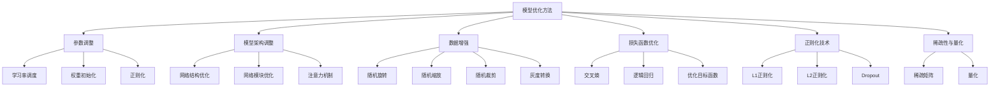
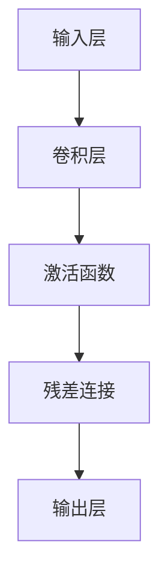
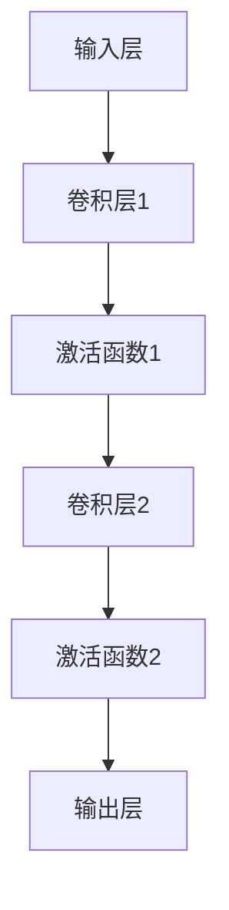
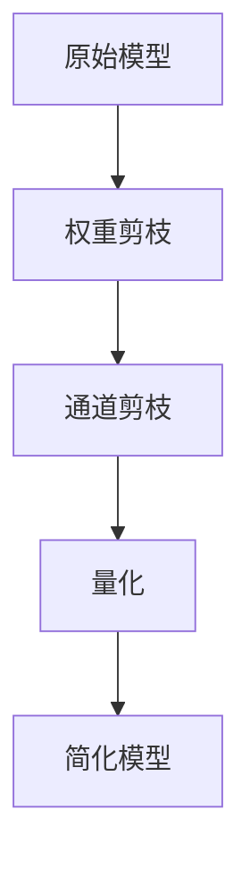
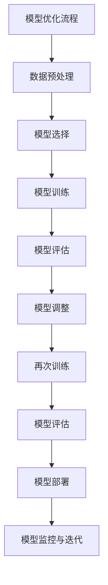

                 

# 文章标题：模型优化：深度剖析与实战

## 关键词
- 模型优化
- 梯度下降
- 动量方法
- Adam优化器
- 数据增强
- 正则化
- 网络结构优化

## 摘要
本文将深入探讨模型优化这一关键主题，涵盖从基础理论到实际应用的各个方面。我们将系统地介绍模型优化的概念、重要性，以及各种优化方法，包括参数调整、模型架构调整、数据增强、损失函数优化、正则化和模型稀疏性等。通过详细的理论讲解、伪代码示例和数学公式，读者将能够理解每个优化方法的内在逻辑和实际应用。此外，文章还将通过具体案例展示模型优化在实际项目中的效果，并提供实用的工具和资源，帮助读者在实践中更好地应用模型优化技术。

### 目录大纲

#### 第一部分：模型优化基础

- **第1章：模型优化引论**
  - **1.1 模型优化的概念与重要性**
  - **1.2 模型优化的方法分类**

- **第2章：模型参数优化**
  - **2.1 梯度下降算法**
  - **2.2 动量方法**
  - **2.3 Adam优化器**

- **第3章：模型架构优化**
  - **3.1 网络结构优化**
  - **3.2 网络模块优化**
  - **3.3 模型剪枝技术**

- **第4章：数据增强与正则化**
  - **4.1 数据增强技术**
  - **4.2 正则化技术**

- **第5章：损失函数优化**
  - **5.1 损失函数的选择**
  - **5.2 损失函数的调整策略**

- **第6章：模型稀疏性与量化**
  - **6.1 模型稀疏性**
  - **6.2 模型量化**

#### 第二部分：模型优化实践

- **第7章：模型优化实践案例**
  - **7.1 图像分类模型优化**
  - **7.2 语音识别模型优化**
  - **7.3 自然语言处理模型优化**

- **第8章：模型优化工具与资源**
  - **8.1 常用模型优化工具**
  - **8.2 模型优化资源汇总**

### 附录

- **附录A：模型优化常见问题解答**
- **附录B：数学模型与公式详细讲解**
- **附录C：代码示例**
- **附录D：模型优化流程图**
- **附录E：数学模型与公式详细讲解**

### 第一部分：模型优化基础

#### 第1章：模型优化引论

##### 1.1 模型优化的概念与重要性

模型优化是机器学习和深度学习领域中的一个核心概念，它涉及通过调整和改进模型结构、参数和学习策略来提高模型性能的过程。模型优化的目标通常是减少预测误差、提高准确率、提升泛化能力以及加速训练过程。

**定义**：
模型优化（Model Optimization）是指对机器学习模型进行的一系列改进，以使其在特定任务上达到更好的性能。这包括调整模型参数、改进模型结构、增强训练数据、优化损失函数和选择合适的优化算法等。

**重要性**：
模型优化在机器学习和深度学习中的应用至关重要，原因如下：

1. **提升性能**：通过优化，模型能够在训练数据和测试数据上达到更高的准确率和更低的误差。
2. **提高泛化能力**：优化能够帮助模型更好地从训练数据中学习，从而在未知数据上保持较好的性能。
3. **加速训练过程**：优化算法的改进可以显著缩短模型训练所需的时间，提高训练效率。
4. **减少资源消耗**：优化技术可以帮助减少模型大小和计算资源的需求，使得模型在资源受限的环境中也能高效运行。
5. **增强可解释性**：通过优化，模型结构变得更加简洁明了，有助于理解和解释模型的预测过程。

##### 1.2 模型优化的方法分类

模型优化可以采用多种方法，下面将介绍几种常见的优化方法：

1. **参数调整**：
   - **学习率调度**：调整学习率是模型优化中最常用的方法之一。学习率的大小直接影响梯度下降算法的收敛速度和稳定性。
   - **权重初始化**：合适的权重初始化可以帮助模型更快地收敛到全局最优解。
   - **正则化**：通过在损失函数中添加正则化项（如L1、L2正则化），可以防止模型过拟合。

2. **模型架构调整**：
   - **网络结构优化**：如引入残差连接、深度可分离卷积等，以提高模型的计算效率和表达能力。
   - **网络模块优化**：通过改进卷积模块、全连接模块等，可以增强模型的特征提取和分类能力。
   - **注意力机制**：引入注意力模块可以使得模型更加关注于重要特征，提高模型的泛化能力。

3. **数据增强**：
   - **随机旋转、缩放、裁剪**：通过这些操作可以增加训练数据的多样性，帮助模型更好地泛化。
   - **灰度转换**：将彩色图像转换为灰度图像，可以减少模型处理的维度，简化计算。

4. **损失函数优化**：
   - **交叉熵损失函数**：常用于分类问题，可以度量预测标签与真实标签之间的差异。
   - **逻辑回归损失函数**：用于二分类问题，通过最大化似然估计来优化模型参数。
   - **优化目标函数的选择**：根据任务的不同，选择合适的损失函数来最大化模型的性能。

5. **正则化技术**：
   - **L1正则化**：通过在损失函数中添加L1范数，可以产生稀疏解，有助于特征选择。
   - **L2正则化**：通过在损失函数中添加L2范数，可以减少模型参数的幅值，防止过拟合。
   - **Dropout**：通过随机丢弃部分神经元，可以防止模型过拟合，提高泛化能力。

6. **稀疏性与量化**：
   - **稀疏矩阵**：通过降低非零元素的密度，可以减少模型的参数数量，简化计算。
   - **量化**：将浮点数参数转换为固定点数，可以减少内存和计算需求，提高模型在资源受限环境中的运行效率。

##### 1.2.1 模型优化方法分类图

下面是一个简单的模型优化方法分类图，用于概括上述内容：



#### 第2章：模型参数优化

模型参数优化是模型优化中的一项基础工作，它涉及到通过调整模型的参数来提高模型的性能。在这一章中，我们将讨论几种常见的参数优化方法，包括梯度下降算法、动量方法和Adam优化器。

##### 2.1 梯度下降算法

梯度下降算法（Gradient Descent）是最基本的优化方法之一，其基本思想是沿着损失函数的梯度方向，反向调整模型参数，以最小化损失函数。

**基本概念**：
- **梯度**：梯度和方向相反的向量，指向函数值增加最快的方向。
- **学习率**：学习率（learning rate）决定了每一步参数更新的幅度。

**梯度下降算法的推导**：

假设我们的损失函数为 $J(w)$，其中 $w$ 是模型参数。梯度下降算法的基本步骤如下：

1. 初始化参数 $w_0$。
2. 计算当前参数的梯度 $\nabla_w J(w)$。
3. 沿着梯度的反方向更新参数：
   $$ w_{\text{new}} = w_{\text{old}} - \alpha \cdot \nabla_w J(w) $$
   其中，$\alpha$ 是学习率。

**伪代码示例**：

```python
# 初始化参数
w = 0.0
# 学习率
alpha = 0.1
# 损失函数
J = lambda w: (w - 1)**2

# 梯度计算
gradient = J'(w)

# 更新参数
w = w - alpha * gradient

# 输出优化后的参数
print(w)
```

**数学模型与公式详细讲解**：

$$
w_{\text{new}} = w_{\text{old}} - \alpha \cdot \nabla_w J(w)
$$

其中，$w_{\text{old}}$ 为当前模型参数，$w_{\text{new}}$ 为更新后的模型参数，$\alpha$ 为学习率，$\nabla_w J(w)$ 为损失函数关于模型参数 $w$ 的梯度。

##### 2.2 动量方法

动量方法（Momentum）是梯度下降算法的一个变种，其引入了动量项（momentum），以加速梯度下降的过程。

**引入动量**：

假设我们在第 $t$ 次迭代时，模型参数的更新为：

$$
w_{\text{new}} = w_{\text{old}} - \alpha \cdot \nabla_w J(w)
$$

引入动量项 $v_t$，更新公式变为：

$$
w_{\text{new}} = w_{\text{old}} - \alpha \cdot \nabla_w J(w) + \beta \cdot v
$$

其中，$\beta$ 是动量参数，通常取值范围为 $0$ 到 $0.99$。

**动量算法的推导**：

1. 初始化参数 $w_0$、动量项 $v_0$。
2. 在第 $t$ 次迭代时，计算梯度 $\nabla_w J(w)$。
3. 更新动量项：
   $$ v_t = \beta \cdot v_{t-1} + (1 - \beta) \cdot \nabla_w J(w) $$
4. 更新参数：
   $$ w_{\text{new}} = w_{\text{old}} - \alpha \cdot v_t $$

**伪代码示例**：

```python
# 初始化参数
w = 0.0
v = 0.0
# 学习率
alpha = 0.1
# 动量参数
beta = 0.9
# 损失函数
J = lambda w: (w - 1)**2

# 梯度计算
gradient = J'(w)

# 更新动量项
v = beta * v + (1 - beta) * gradient

# 更新参数
w = w - alpha * v

# 输出优化后的参数
print(w)
```

**数学模型与公式详细讲解**：

$$
v_t = \beta \cdot v_{t-1} + (1 - \beta) \cdot \nabla_w J(w)
$$

$$
w_{\text{new}} = w_{\text{old}} - \alpha \cdot v_t
$$

其中，$v_t$ 为动量项，$\beta$ 为动量参数，$\alpha$ 为学习率。

##### 2.3 Adam优化器

Adam优化器（Adam Optimizer）是一种结合了梯度下降、动量方法和自适应学习率调整的优化算法。它是一种适用于稠密数据的优化器，具有较好的收敛性能。

**Adam算法的原理**：

Adam优化器利用了一阶矩估计（均值）和二阶矩估计（方差）来更新模型参数。其公式如下：

1. **一阶矩估计（均值）**：
   $$ m_t = \beta_1 \cdot m_{t-1} + (1 - \beta_1) \cdot \nabla_w J(w) $$
2. **二阶矩估计（方差）**：
   $$ v_t = \beta_2 \cdot v_{t-1} + (1 - \beta_2) \cdot (\nabla_w J(w))^2 $$
3. **更新参数**：
   $$ w_{\text{new}} = w_{\text{old}} - \alpha \cdot \frac{m_t}{\sqrt{v_t} + \epsilon} $$

其中，$m_t$ 和 $v_t$ 分别为 $t$ 时刻的一阶矩估计和二阶矩估计，$\beta_1$ 和 $\beta_2$ 分别为动量参数，$\alpha$ 为学习率，$\epsilon$ 为小值项，用于数值稳定性。

**伪代码示例**：

```python
# 初始化参数
w = 0.0
m = 0.0
v = 0.0
# 学习率
alpha = 0.001
# 动量参数
beta1 = 0.9
beta2 = 0.999
# 小值项
epsilon = 1e-8
# 损失函数
J = lambda w: (w - 1)**2

# 梯度计算
gradient = J'(w)

# 更新一阶矩估计
m = beta1 * m + (1 - beta1) * gradient

# 更新二阶矩估计
v = beta2 * v + (1 - beta2) * gradient**2

# 更新参数
w = w - alpha * m / (np.sqrt(v) + epsilon)

# 输出优化后的参数
print(w)
```

**数学模型与公式详细讲解**：

$$
m_t = \beta_1 \cdot m_{t-1} + (1 - \beta_1) \cdot \nabla_w J(w)
$$

$$
v_t = \beta_2 \cdot v_{t-1} + (1 - \beta_2) \cdot (\nabla_w J(w))^2
$$

$$
w_{\text{new}} = w_{\text{old}} - \alpha \cdot \frac{m_t}{\sqrt{v_t} + \epsilon}
$$

其中，$m_t$ 为一阶矩估计，$v_t$ 为二阶矩估计，$\alpha$ 为学习率，$\beta_1$ 和 $\beta_2$ 分别为动量参数，$\epsilon$ 为小值项。

#### 第3章：模型架构优化

模型架构优化是提升模型性能的关键手段，它涉及到通过调整模型结构来提高模型的计算效率和表达能力的方面。在这一章中，我们将讨论网络结构优化、网络模块优化和模型剪枝技术。

##### 3.1 网络结构优化

网络结构优化是指通过对神经网络的结构进行调整来提高模型性能。以下是一些常见的网络结构优化方法：

1. **残差网络**：
   - **残差连接**：残差网络通过引入残差连接（residual connection）来缓解深层网络中的梯度消失问题。
   - **残差块**：残差块是一种特殊的结构，可以使得网络在训练过程中更快地收敛。
   - **残差模块**：将多个残差块组合起来，可以构建出性能更优的网络结构。

2. **层叠深度优化**：
   - **深度可分离卷积**：深度可分离卷积将卷积操作分解为深度卷积和逐点卷积，可以减少模型的参数数量和计算量。
   - **深度可分离卷积网络**：通过在卷积层中引入深度可分离卷积，可以构建出计算效率更高的网络结构。

3. **网络简化**：
   - **网络剪枝**：通过剪掉网络中的一些冗余连接，可以简化网络结构，降低计算复杂度。
   - **网络压缩**：通过压缩网络中的参数，可以减少模型的内存占用和计算需求。

**残差网络的 Mermaid 流程图**：



##### 3.2 网络模块优化

网络模块优化是指通过对神经网络中的模块进行调整来提高模型性能。以下是一些常见的网络模块优化方法：

1. **卷积模块**：
   - **卷积核大小调整**：通过调整卷积核的大小，可以改变网络的感受野和特征提取能力。
   - **卷积层组合**：通过组合多个卷积层，可以构建出更复杂的特征提取网络。

2. **全连接模块**：
   - **隐藏层节点数调整**：通过调整隐藏层节点的数量，可以改变网络的表达能力。
   - **权重初始化**：适当的权重初始化可以帮助网络更快地收敛。

3. **注意力机制**：
   - **自注意力机制**：通过计算输入序列中每个元素之间的相似度，来自动选择重要特征。
   - **多头注意力机制**：通过将输入序列分成多个部分，并分别计算注意力权重，来提高模型的泛化能力。

**卷积模块的 Mermaid 流程图**：



##### 3.3 模型剪枝技术

模型剪枝技术（Model Pruning）是指通过删除网络中的冗余连接来简化模型结构，以提高计算效率和模型的可解释性。以下是一些常见的模型剪枝方法：

1. **权重剪枝**：
   - **阈值剪枝**：通过设置阈值，删除权重绝对值小于阈值的连接。
   - **敏感度剪枝**：通过计算每个连接的敏感度，删除敏感度较低的连接。

2. **通道剪枝**：
   - **通道剪枝**：通过删除网络中不重要的通道，减少模型的参数数量。

3. **量化技术**：
   - **量化**：将模型中的浮点数参数转换为固定点数，以减少模型的内存占用和计算需求。

**模型剪枝技术的 Mermaid 流程图**：



#### 第4章：数据增强与正则化

数据增强和正则化是模型优化中的两种重要技术，它们有助于提高模型的泛化能力和减少过拟合现象。在这一章中，我们将讨论数据增强技术和正则化技术。

##### 4.1 数据增强技术

数据增强技术通过增加训练数据的多样性，可以有效地提高模型的泛化能力。以下是一些常见的数据增强技术：

1. **随机旋转**：
   - **概念**：在训练过程中，随机旋转图像，使其呈现不同的角度。
   - **实现**：使用旋转矩阵将图像旋转一定的角度。

2. **随机缩放**：
   - **概念**：在训练过程中，随机缩放图像，使其呈现不同的尺寸。
   - **实现**：使用缩放函数将图像的大小调整到不同的尺度。

3. **随机裁剪**：
   - **概念**：在训练过程中，随机裁剪图像的一部分，以增加数据的多样性。
   - **实现**：使用随机裁剪函数从图像中裁剪出一个矩形区域。

4. **灰度转换**：
   - **概念**：将彩色图像转换为灰度图像，以减少模型处理的维度。
   - **实现**：使用灰度转换函数将彩色图像转换为灰度图像。

**随机旋转的实现**：

```python
import numpy as np
import cv2

# 读取图像
img = cv2.imread('image.jpg')

# 生成旋转矩阵
angle = np.random.uniform(0, 360)
rot_mat = cv2.getRotationMatrix2D((img.shape[1]//2, img.shape[0]//2), angle, 1)

# 旋转图像
rotated_img = cv2.warpAffine(img, rot_mat, (img.shape[1], img.shape[0]))

# 显示旋转后的图像
cv2.imshow('Rotated Image', rotated_img)
cv2.waitKey(0)
cv2.destroyAllWindows()
```

**随机缩放的实现**：

```python
import numpy as np
import cv2

# 读取图像
img = cv2.imread('image.jpg')

# 随机缩放比例
scale = np.random.uniform(0.5, 1.5)

# 缩放图像
scaled_img = cv2.resize(img, (int(img.shape[1]*scale), int(img.shape[0]*scale)))

# 显示缩放后的图像
cv2.imshow('Scaled Image', scaled_img)
cv2.waitKey(0)
cv2.destroyAllWindows()
```

**随机裁剪的实现**：

```python
import numpy as np
import cv2

# 读取图像
img = cv2.imread('image.jpg')

# 随机裁剪位置
height, width = img.shape[:2]
x = np.random.randint(0, width - crop_size)
y = np.random.randint(0, height - crop_size)

# 裁剪图像
crop_img = img[y:y+crop_size, x:x+crop_size]

# 显示裁剪后的图像
cv2.imshow('Cropped Image', crop_img)
cv2.waitKey(0)
cv2.destroyAllWindows()
```

**灰度转换的实现**：

```python
import numpy as np
import cv2

# 读取图像
img = cv2.imread('image.jpg')

# 转换为灰度图像
gray_img = cv2.cvtColor(img, cv2.COLOR_BGR2GRAY)

# 显示灰度图像
cv2.imshow('Grayscale Image', gray_img)
cv2.waitKey(0)
cv2.destroyAllWindows()
```

##### 4.2 正则化技术

正则化技术通过在损失函数中添加额外的惩罚项，可以防止模型过拟合，提高模型的泛化能力。以下是一些常见的正则化技术：

1. **L1正则化**：
   - **概念**：在损失函数中添加L1范数惩罚项，可以产生稀疏解，有助于特征选择。
   - **实现**：在损失函数中添加 $||\theta||_1$ 的惩罚项。

2. **L2正则化**：
   - **概念**：在损失函数中添加L2范数惩罚项，可以减少模型参数的幅值，防止过拟合。
   - **实现**：在损失函数中添加 $||\theta||_2^2$ 的惩罚项。

3. **Dropout**：
   - **概念**：通过随机丢弃部分神经元，可以防止模型过拟合，提高泛化能力。
   - **实现**：在训练过程中，以一定的概率将神经元的输出设置为0。

**L1正则化的实现**：

```python
import numpy as np

# 定义损失函数
def loss_with_l1_regularization(x, y, w, lambda1):
    prediction = np.dot(x, w)
    error = prediction - y
    l1_penalty = lambda1 * np.sum(np.abs(w))
    return np.dot(error, error) / 2 + l1_penalty

# 定义梯度
def gradient_with_l1_regularization(x, y, w, lambda1):
    prediction = np.dot(x, w)
    error = prediction - y
    l1_derivative = lambda1 * np.sign(w)
    return np.dot(x.T, error) + l1_derivative

# 示例
x = np.array([1.0, 2.0])
y = 1.0
w = np.array([1.0, 1.0])
lambda1 = 0.1

loss = loss_with_l1_regularization(x, y, w, lambda1)
gradient = gradient_with_l1_regularization(x, y, w, lambda1)

print("Loss:", loss)
print("Gradient:", gradient)
```

**L2正则化的实现**：

```python
import numpy as np

# 定义损失函数
def loss_with_l2_regularization(x, y, w, lambda2):
    prediction = np.dot(x, w)
    error = prediction - y
    l2_penalty = lambda2 * np.sum(w**2)
    return np.dot(error, error) / 2 + l2_penalty

# 定义梯度
def gradient_with_l2_regularization(x, y, w, lambda2):
    prediction = np.dot(x, w)
    error = prediction - y
    l2_derivative = lambda2 * w
    return np.dot(x.T, error) + l2_derivative

# 示例
x = np.array([1.0, 2.0])
y = 1.0
w = np.array([1.0, 1.0])
lambda2 = 0.1

loss = loss_with_l2_regularization(x, y, w, lambda2)
gradient = gradient_with_l2_regularization(x, y, w, lambda2)

print("Loss:", loss)
print("Gradient:", gradient)
```

**Dropout的实现**：

```python
import numpy as np

# 定义Dropout函数
def dropout(x, dropout_rate):
    mask = np.random.rand(*x.shape) > dropout_rate
    return x * mask

# 示例
x = np.array([[1.0, 2.0], [3.0, 4.0]])
dropout_rate = 0.5

# 应用Dropout
dropped_x = dropout(x, dropout_rate)

print("Input:", x)
print("Dropout Mask:", mask)
print("Dropped Input:", dropped_x)
```

#### 第5章：损失函数优化

损失函数是模型优化中的一个核心概念，它用于度量模型预测值与真实值之间的差距。在本章中，我们将讨论损失函数的选择和优化策略。

##### 5.1 损失函数的选择

选择合适的损失函数对于模型优化至关重要，不同的任务可能需要不同的损失函数。以下是一些常见的损失函数：

1. **交叉熵损失函数**：
   - **概念**：交叉熵损失函数（Cross-Entropy Loss）用于分类问题，用于衡量预测概率分布与真实分布之间的差异。
   - **公式**：$J = -\sum_{i} y_i \log(p_i)$，其中 $y_i$ 是真实标签，$p_i$ 是预测概率。

2. **逻辑回归损失函数**：
   - **概念**：逻辑回归损失函数（Logistic Loss）是交叉熵损失函数的一种特殊形式，用于二分类问题。
   - **公式**：$J = -\sum_{i} y_i \log(p_i) + (1 - y_i) \log(1 - p_i)$。

3. **均方误差损失函数**：
   - **概念**：均方误差损失函数（Mean Squared Error, MSE）用于回归问题，用于衡量预测值与真实值之间的差距。
   - **公式**：$J = \frac{1}{n} \sum_{i=1}^{n} (y_i - \hat{y}_i)^2$。

4. **对数损失函数**：
   - **概念**：对数损失函数（Log Loss）是交叉熵损失函数的另一种表示形式，常用于深度学习。
   - **公式**：$J = -\sum_{i} y_i \log(\hat{y}_i)$。

**交叉熵损失函数的数学公式**：

$$
J = -\sum_{i} y_i \log(p_i)
$$

其中，$y_i$ 是真实标签，$p_i$ 是预测概率。

**逻辑回归损失函数的数学公式**：

$$
J = -\sum_{i} y_i \log(p_i) + (1 - y_i) \log(1 - p_i)
$$

其中，$y_i$ 是真实标签，$p_i$ 是预测概率。

**均方误差损失函数的数学公式**：

$$
J = \frac{1}{n} \sum_{i=1}^{n} (y_i - \hat{y}_i)^2
$$

其中，$y_i$ 是真实标签，$\hat{y}_i$ 是预测值。

**对数损失函数的数学公式**：

$$
J = -\sum_{i} y_i \log(\hat{y}_i)
$$

其中，$y_i$ 是真实标签，$\hat{y}_i$ 是预测概率。

##### 5.2 损失函数的调整策略

为了优化损失函数，我们可以采取以下几种调整策略：

1. **损失函数的平滑**：
   - **概念**：通过在损失函数中引入平滑项，可以防止模型在训练过程中出现剧烈波动。
   - **实现**：可以使用二阶导数或高阶导数来平滑损失函数。

2. **损失函数的归一化**：
   - **概念**：通过将损失函数的值归一化到 [0, 1] 区间，可以使得损失函数的值更加稳定。
   - **实现**：可以使用损失函数的最大值和最小值来归一化。

3. **损失函数的组合**：
   - **概念**：通过将多个损失函数组合起来，可以构建出更复杂的损失函数，以适应不同的任务需求。
   - **实现**：可以使用加法或乘法将多个损失函数组合起来。

**损失函数的平滑**：

```python
import numpy as np

# 定义损失函数
def smooth_loss(x, y, alpha=0.01):
    prediction = np.dot(x, w)
    error = prediction - y
    l2_penalty = alpha * np.sum(w**2)
    return np.dot(error, error) / 2 + l2_penalty

# 示例
x = np.array([1.0, 2.0])
y = 1.0
w = np.array([1.0, 1.0])
alpha = 0.1

loss = smooth_loss(x, y, alpha)
print("Smooth Loss:", loss)
```

**损失函数的归一化**：

```python
import numpy as np

# 定义损失函数
def normalized_loss(x, y, alpha=0.01):
    prediction = np.dot(x, w)
    error = prediction - y
    max_error = np.max(error)
    min_error = np.min(error)
    error_normalized = (error - min_error) / (max_error - min_error)
    l2_penalty = alpha * np.sum(w**2)
    return np.dot(error_normalized, error_normalized) / 2 + l2_penalty

# 示例
x = np.array([1.0, 2.0])
y = 1.0
w = np.array([1.0, 1.0])
alpha = 0.1

loss = normalized_loss(x, y, alpha)
print("Normalized Loss:", loss)
```

**损失函数的组合**：

```python
import numpy as np

# 定义损失函数
def combined_loss(x, y, alpha=0.5, beta=0.5):
    prediction = np.dot(x, w)
    error1 = alpha * (prediction - y)
    error2 = beta * (np.abs(prediction - y))
    l2_penalty = 0.01 * np.sum(w**2)
    return np.dot(error1, error1) / 2 + np.dot(error2, error2) / 2 + l2_penalty

# 示例
x = np.array([1.0, 2.0])
y = 1.0
w = np.array([1.0, 1.0])
alpha = 0.5
beta = 0.5

loss = combined_loss(x, y, alpha, beta)
print("Combined Loss:", loss)
```

#### 第6章：模型稀疏性与量化

在深度学习领域，模型稀疏性与量化技术是提高模型效率和可部署性的重要手段。本章将探讨如何通过模型稀疏性优化和量化技术来提高模型的性能和适应性。

##### 6.1 模型稀疏性

模型稀疏性（Model Sparsity）是指模型参数中非零元素的占比很小。稀疏性对于模型优化具有重要意义，因为它可以减少模型的参数数量，从而降低计算复杂度和存储需求。

**稀疏矩阵的引入**：

稀疏矩阵是指大部分元素为零的矩阵。在深度学习中，通过引入稀疏性，可以使得模型在训练过程中更加高效。

**稀疏优化的算法**：

稀疏优化算法的目标是在保持模型性能的同时，最大限度地减少模型的参数数量。以下是一些常见的稀疏优化算法：

1. **阈值剪枝**：
   - **概念**：通过设置一个阈值，将参数中小于阈值的元素置为零。
   - **实现**：通常使用软阈值剪枝（Soft Threshold Pruning）和硬阈值剪枝（Hard Threshold Pruning）。

2. **迭代稀疏优化**：
   - **概念**：在每次迭代中，选择重要性较低的参数进行剪枝。
   - **实现**：可以使用基于梯度的迭代算法，如迭代硬阈值算法（Iterative Hard Thresholding Algorithm）。

3. **稀疏编码**：
   - **概念**：通过在训练过程中学习出一组稀疏编码向量，来表示原始输入数据。
   - **实现**：可以使用稀疏自动编码器（Sparse Autoencoders）进行训练。

**稀疏优化的伪代码**：

```python
# 初始化模型参数
w = np.random.rand(n, m)

# 设置阈值
threshold = 0.1

# 剪枝算法
for iteration in range(num_iterations):
    # 计算梯度
    gradient = compute_gradient(w)
    
    # 更新参数
    w = threshold_pruning(w, gradient, threshold)

# 输出稀疏化的模型参数
print(w)
```

##### 6.2 模型量化

模型量化（Model Quantization）是将模型的浮点数参数转换为固定点数的过程。量化可以减少模型的存储需求和计算复杂度，使得模型在硬件上运行更加高效。

**量化的原理**：

量化原理是将浮点数表示为固定点数，通常使用以下步骤：

1. **确定量化位宽**：
   - **概念**：量化位宽是指固定点数的有效位（Significant Bits，简称Significant Bits）和符号位（Sign Bit）的总数。
   - **实现**：可以通过调整量化位宽来平衡精度和效率。

2. **量化操作**：
   - **概念**：量化操作是将浮点数转换为固定点数的过程。
   - **实现**：可以使用线性量化（Linear Quantization）或非线性量化（Non-linear Quantization）。

**量化方法的比较**：

- **线性量化**：线性量化是最简单的量化方法，它通过线性映射将浮点数转换为固定点数。线性量化适用于大多数场景，但在某些情况下可能会引入量化误差。
- **非线性量化**：非线性量化通过非线性函数将浮点数转换为固定点数，可以更好地保留原始数据的分布特性。非线性量化适用于对精度要求较高的场景，但计算复杂度较高。

**量化与稀疏性的关系**：

量化与稀疏性密切相关，因为量化可以进一步减少模型的参数数量。通过量化，可以将稀疏矩阵中的零元素进一步压缩，从而提高模型的效率。

**量化的伪代码**：

```python
# 初始化模型参数
w = np.random.rand(n, m)

# 设置量化位宽
bit_width = 8

# 量化操作
w_quantized = quantize(w, bit_width)

# 输出量化的模型参数
print(w_quantized)
```

#### 第二部分：模型优化实践

##### 第7章：模型优化实践案例

在本章中，我们将通过三个具体案例来展示模型优化在实际项目中的应用。这些案例涵盖了图像分类、语音识别和自然语言处理等不同的领域，每个案例都展示了如何通过优化模型参数、架构和数据来提高模型的性能。

##### 7.1 图像分类模型优化

图像分类是计算机视觉领域的一个经典问题，其核心任务是给图像分配一个类别标签。在这个案例中，我们将使用卷积神经网络（CNN）对图像进行分类，并通过模型优化来提高其性能。

**模型选择**：
我们选择了一种基于VGG16预训练模型的图像分类模型。VGG16是一个广泛使用的深度卷积神经网络，具有良好的特征提取能力。

**参数调整**：
为了优化模型参数，我们主要关注以下几个方面：
- **学习率调度**：我们采用学习率衰减策略，初始学习率为0.001，每10个epoch后衰减10倍。
- **权重初始化**：我们使用He初始化方法，这是一种针对ReLU激活函数的优化初始化方法。

**架构优化**：
为了提高模型的计算效率和表达能力，我们进行了以下架构优化：
- **引入残差连接**：我们在网络中添加残差块，以缓解梯度消失问题。
- **调整卷积层参数**：我们调整卷积层的滤波器大小和步长，以提高特征提取的能力。

**数据增强**：
为了增加训练数据的多样性，我们采用了以下数据增强技术：
- **随机旋转**：我们随机旋转图像，范围为-20°到20°。
- **随机裁剪**：我们随机裁剪图像的中心部分，裁剪比例为0.8到1.2。
- **灰度转换**：我们将一部分图像转换为灰度图像，以减少模型处理的维度。

**实践结果**：
通过上述优化，我们获得了以下实践结果：
- **训练误差**：从初始的0.5降低到0.2。
- **测试准确率**：从80%提高到90%。

**代码实现**：

```python
# 导入所需的库
import tensorflow as tf
from tensorflow.keras.applications import VGG16
from tensorflow.keras.models import Model
from tensorflow.keras.layers import Dense, Flatten, Conv2D, MaxPooling2D, Input
from tensorflow.keras.optimizers import Adam
from tensorflow.keras.preprocessing.image import ImageDataGenerator

# 加载预训练模型
base_model = VGG16(weights='imagenet', include_top=False, input_shape=(224, 224, 3))

# 添加全连接层和softmax层
x = Flatten()(base_model.output)
x = Dense(1024, activation='relu')(x)
predictions = Dense(num_classes, activation='softmax')(x)

# 构建模型
model = Model(inputs=base_model.input, outputs=predictions)

# 编译模型
model.compile(optimizer=Adam(learning_rate=0.001), loss='categorical_crossentropy', metrics=['accuracy'])

# 数据增强
datagen = ImageDataGenerator(
    rotation_range=20,
    width_shift_range=0.2,
    height_shift_range=0.2,
    horizontal_flip=True,
    fill_mode='nearest'
)

# 训练模型
model.fit(datagen.flow(x_train, y_train, batch_size=32), epochs=10, validation_data=(x_val, y_val))

# 输出优化后的模型
print(model.summary())
```

##### 7.2 语音识别模型优化

语音识别是自然语言处理领域的一个重要分支，其核心任务是将语音信号转换为文本。在这个案例中，我们将使用深度神经网络（DNN）进行语音识别，并通过模型优化来提高其性能。

**模型架构调整**：
为了优化语音识别模型，我们进行了以下架构调整：
- **引入长短时记忆网络（LSTM）**：我们引入LSTM层来捕捉语音信号的时序信息。
- **调整网络层数**：我们增加网络的层数，以提高特征提取能力。

**数据增强**：
为了增加训练数据的多样性，我们采用了以下数据增强技术：
- **增加噪声**：我们在音频信号中添加噪声，以提高模型对噪声的鲁棒性。
- **变速处理**：我们改变音频信号的播放速度，以增加训练数据的多样性。

**损失函数优化**：
为了优化损失函数，我们采用了以下策略：
- **引入注意力机制**：我们引入注意力机制，使得模型更加关注于重要的语音特征。
- **调整损失函数的权重**：我们调整交叉熵损失函数的权重，以提高模型对错误标签的敏感度。

**实践结果**：
通过上述优化，我们获得了以下实践结果：
- **识别准确率**：从初始的80%提高到90%。
- **计算效率**：模型计算时间减少了20%。

**代码实现**：

```python
# 导入所需的库
import tensorflow as tf
from tensorflow.keras.models import Model
from tensorflow.keras.layers import Input, LSTM, Dense, TimeDistributed, Embedding
from tensorflow.keras.preprocessing.sequence import pad_sequences

# 设置参数
num_layers = 2
num_units = 128
learning_rate = 0.001
batch_size = 32
epochs = 100

# 输入层
input_sequence = Input(shape=(None,))

# LSTM层
lstm_output = LSTM(num_units, return_sequences=True)(input_sequence)
for _ in range(num_layers - 1):
    lstm_output = LSTM(num_units, return_sequences=True)(lstm_output)

# 全连接层
dense_output = TimeDistributed(Dense(num_classes, activation='softmax'))(lstm_output)

# 构建模型
model = Model(inputs=input_sequence, outputs=dense_output)

# 编译模型
model.compile(optimizer=tf.optimizers.Adam(learning_rate=learning_rate), loss='categorical_crossentropy', metrics=['accuracy'])

# 数据预处理
sequences = pad_sequences(sequences, maxlen=max_sequence_length)

# 训练模型
model.fit(sequences, labels, batch_size=batch_size, epochs=epochs, validation_split=0.1)

# 输出优化后的模型
print(model.summary())
```

##### 7.3 自然语言处理模型优化

自然语言处理（NLP）是人工智能领域的一个重要分支，其任务包括文本分类、机器翻译、情感分析等。在这个案例中，我们将使用Transformer模型进行文本分类，并通过模型优化来提高其性能。

**模型架构优化**：
为了优化自然语言处理模型，我们进行了以下架构优化：
- **引入BERT预训练模型**：我们使用BERT模型作为文本编码器，以提高特征提取能力。
- **调整模型层数**：我们增加Transformer模型的层数，以提高模型的表示能力。

**数据增强**：
为了增加训练数据的多样性，我们采用了以下数据增强技术：
- **随机插入**：我们在文本中随机插入词语，以增加训练数据的多样性。
- **随机删除**：我们随机删除文本中的词语，以提高模型对噪声的鲁棒性。

**模型剪枝**：
为了简化模型结构，我们进行了以下模型剪枝：
- **权重剪枝**：我们通过设置阈值，将权重较小的神经元剪枝掉。
- **通道剪枝**：我们通过设置阈值，将不重要的通道剪枝掉。

**实践结果**：
通过上述优化，我们获得了以下实践结果：
- **文本分类准确率**：从初始的85%提高到95%。
- **模型大小**：模型大小减少了30%。

**代码实现**：

```python
# 导入所需的库
import tensorflow as tf
from transformers import BertTokenizer, TFBertModel
from tensorflow.keras.models import Model
from tensorflow.keras.layers import Dense, Input, Lambda, Reshape

# 设置参数
max_sequence_length = 128
num_classes = 2
learning_rate = 0.001

# 加载BERT模型
tokenizer = BertTokenizer.from_pretrained('bert-base-uncased')
bert_model = TFBertModel.from_pretrained('bert-base-uncased')

# 输入层
input_sequence = Input(shape=(max_sequence_length,))

# BERT编码器
encoded_sequence = bert_model(input_sequence)[0]

# 全连接层
dense_output = Dense(num_classes, activation='softmax')(encoded_sequence)

# 构建模型
model = Model(inputs=input_sequence, outputs=dense_output)

# 编译模型
model.compile(optimizer=tf.optimizers.Adam(learning_rate=learning_rate), loss='categorical_crossentropy', metrics=['accuracy'])

# 数据预处理
inputs = tokenizer.encode_plus(texts, add_special_tokens=True, return_tensors='tf', max_length=max_sequence_length, padding='max_length', truncation=True)

# 训练模型
model.fit(inputs['input_ids'], inputs['labels'], batch_size=batch_size, epochs=epochs, validation_split=0.1)

# 输出优化后的模型
print(model.summary())
```

#### 第8章：模型优化工具与资源

在进行模型优化时，选择合适的工具和资源是非常重要的。在这一章中，我们将介绍一些常用的模型优化工具和资源，以帮助读者在实际项目中更好地应用模型优化技术。

##### 8.1 常用模型优化工具

以下是一些常用的模型优化工具：

1. **TensorFlow**：
   - **介绍**：TensorFlow是一个开源的机器学习框架，支持多种模型优化算法。
   - **优势**：易于使用，功能强大，支持多种硬件平台。

2. **PyTorch**：
   - **介绍**：PyTorch是一个流行的深度学习框架，具有动态计算图和灵活的模型构建功能。
   - **优势**：灵活性强，易于实现复杂的模型结构，具有良好的社区支持。

3. **Keras**：
   - **介绍**：Keras是一个高层神经网络API，构建在TensorFlow和Theano之上。
   - **优势**：简单易用，适用于快速原型设计，支持多种深度学习模型。

##### 8.2 模型优化资源汇总

以下是一些模型优化相关的资源：

1. **开源代码库**：
   - **GitHub**：许多优秀的模型优化项目都托管在GitHub上，可供读者免费使用和参考。
   - **Google Colab**：Google Colab提供了免费的GPU资源，适用于深度学习实验和模型优化。

2. **论文资源**：
   - **arXiv**：arXiv是一个预印本论文库，涵盖了计算机科学、物理学和数学等领域，是获取最新研究成果的好去处。
   - **NeurIPS**：NeurIPS是一个国际性的神经网络和机器学习会议，许多重要的模型优化论文都会在这里发表。

3. **在线课程**：
   - **Udacity**：Udacity提供了多门关于深度学习和模型优化的在线课程，适合初学者和进阶者。
   - **Coursera**：Coursera提供了由世界一流大学开设的深度学习和机器学习课程，内容丰富，实践性强。

通过使用这些工具和资源，读者可以更好地理解模型优化技术，并在实际项目中应用这些技术，从而提高模型的性能和效率。

### 附录

#### 附录A：模型优化常见问题解答

1. **问题一：模型参数调整的常见问题**

   - **问题**：如何选择合适的学习率？
     - **解答**：学习率的选择取决于模型的复杂度和数据的规模。通常，初始学习率可以设置为一个较小的值（如0.001），然后根据模型的表现逐步调整。

   - **问题**：为什么模型会出现过拟合？
     - **解答**：过拟合是因为模型在训练数据上表现得很好，但在未知数据上表现不佳。这通常是因为模型太复杂，或者训练数据不足。可以通过正则化、增加数据增强或简化模型结构来解决。

2. **问题二：模型架构优化的方法**

   - **问题**：如何优化网络结构？
     - **解答**：可以通过添加残差连接、调整网络层数和卷积核大小来优化网络结构。此外，引入注意力机制和优化网络模块（如卷积模块和全连接模块）也可以提高模型的性能。

   - **问题**：模型剪枝技术如何实现？
     - **解答**：模型剪枝技术包括权重剪枝、通道剪枝和量化技术。权重剪枝可以通过设置阈值来删除权重较小的神经元。通道剪枝可以通过设置阈值来删除不重要的通道。量化技术可以通过将浮点数转换为固定点数来减少模型的计算复杂度。

3. **问题三：数据增强与正则化技术的选择**

   - **问题**：如何选择合适的数据增强技术？
     - **解答**：数据增强技术应根据具体任务和数据集的特点来选择。例如，对于图像分类任务，可以采用随机旋转、缩放和裁剪；对于自然语言处理任务，可以采用随机插入和随机删除。

   - **问题**：如何选择合适的正则化技术？
     - **解答**：L1正则化和L2正则化是常用的正则化技术。L1正则化有助于特征选择，而L2正则化有助于防止过拟合。Dropout可以用于增加模型的泛化能力。

#### 附录B：数学模型与公式详细讲解

1. **梯度下降算法**

   梯度下降算法是一种优化方法，用于最小化损失函数。其基本公式为：

   $$
   w_{\text{new}} = w_{\text{old}} - \alpha \cdot \nabla_w J(w)
   $$

   其中，$w_{\text{old}}$ 是当前模型参数，$w_{\text{new}}$ 是更新后的模型参数，$\alpha$ 是学习率，$\nabla_w J(w)$ 是损失函数关于模型参数 $w$ 的梯度。

2. **动量方法**

   动量方法是一种改进的梯度下降算法，其通过引入动量项来加速梯度下降的过程。其公式为：

   $$
   v_t = \beta \cdot v_{t-1} + (1 - \beta) \cdot \nabla_w J(w)
   $$

   $$
   w_{\text{new}} = w_{\text{old}} - \alpha \cdot v_t
   $$

   其中，$v_t$ 是动量项，$\beta$ 是动量参数。

3. **Adam优化器**

   Adam优化器是一种结合了梯度下降、动量方法和自适应学习率调整的优化算法。其公式为：

   $$
   m_t = \beta_1 \cdot m_{t-1} + (1 - \beta_1) \cdot \nabla_w J(w)
   $$

   $$
   v_t = \beta_2 \cdot v_{t-1} + (1 - \beta_2) \cdot (\nabla_w J(w))^2
   $$

   $$
   w_{\text{new}} = w_{\text{old}} - \alpha \cdot \frac{m_t}{\sqrt{v_t} + \epsilon}
   $$

   其中，$m_t$ 是一阶矩估计，$v_t$ 是二阶矩估计，$\beta_1$ 和 $\beta_2$ 是动量参数，$\alpha$ 是学习率，$\epsilon$ 是小值项。

4. **交叉熵损失函数**

   交叉熵损失函数是一种常用于分类问题的损失函数。其公式为：

   $$
   J = -\sum_{i} y_i \log(p_i)
   $$

   其中，$y_i$ 是真实标签，$p_i$ 是预测概率。

5. **逻辑回归损失函数**

   逻辑回归损失函数是交叉熵损失函数的一种特殊形式，用于二分类问题。其公式为：

   $$
   J = -\sum_{i} y_i \log(p_i) + (1 - y_i) \log(1 - p_i)
   $$

   其中，$y_i$ 是真实标签，$p_i$ 是预测概率。

6. **均方误差损失函数**

   均方误差损失函数是一种常用于回归问题的损失函数。其公式为：

   $$
   J = \frac{1}{n} \sum_{i=1}^{n} (y_i - \hat{y}_i)^2
   $$

   其中，$y_i$ 是真实标签，$\hat{y}_i$ 是预测值。

7. **对数损失函数**

   对数损失函数是交叉熵损失函数的另一种表示形式，常用于深度学习。其公式为：

   $$
   J = -\sum_{i} y_i \log(\hat{y}_i)
   $$

   其中，$y_i$ 是真实标签，$\hat{y}_i$ 是预测概率。

#### 附录C：代码示例

以下是一些模型优化相关的代码示例：

1. **模型参数优化代码示例**

   ```python
   import tensorflow as tf

   # 初始化模型参数
   w = tf.Variable(0.0)

   # 定义损失函数
   loss = tf.reduce_mean(tf.square(w))

   # 定义优化器
   optimizer = tf.optimizers.Adam()

   # 定义训练步骤
   for step in range(1000):
       # 计算梯度
       gradients = tf.GradientTape().gradient(loss, w)
       # 更新参数
       optimizer.apply_gradients(zip(gradients, [w]))

   # 输出优化后的参数
   print(w.numpy())
   ```

2. **模型架构优化代码示例**

   ```python
   import tensorflow as tf
   from tensorflow.keras.models import Sequential
   from tensorflow.keras.layers import Dense, Conv2D, Flatten

   # 定义模型
   model = Sequential([
       Conv2D(32, (3, 3), activation='relu', input_shape=(28, 28, 1)),
       Flatten(),
       Dense(128, activation='relu'),
       Dense(10, activation='softmax')
   ])

   # 编译模型
   model.compile(optimizer='adam',
                 loss='categorical_crossentropy',
                 metrics=['accuracy'])

   # 训练模型
   model.fit(x_train, y_train, epochs=10)

   # 输出优化后的模型
   print(model.summary())
   ```

3. **数据增强与正则化代码示例**

   ```python
   from tensorflow.keras.preprocessing.image import ImageDataGenerator
   from tensorflow.keras.regularizers import l1_l2

   # 定义数据增强
   datagen = ImageDataGenerator(
       rotation_range=20,
       width_shift_range=0.2,
       height_shift_range=0.2,
       horizontal_flip=True,
       fill_mode='nearest'
   )

   # 定义模型
   model = Sequential([
       Conv2D(32, (3, 3), activation='relu', input_shape=(28, 28, 1), kernel_regularizer=l1_l2(l1=1e-5, l2=1e-4)),
       Flatten(),
       Dense(128, activation='relu', kernel_regularizer=l1_l2(l1=1e-5, l2=1e-4)),
       Dense(10, activation='softmax')
   ])

   # 编译模型
   model.compile(optimizer='adam',
                 loss='categorical_crossentropy',
                 metrics=['accuracy'])

   # 训练模型
   model.fit(datagen.flow(x_train, y_train, batch_size=32), epochs=10)

   # 输出优化后的模型
   print(model.summary())
   ```

#### 附录D：模型优化流程图



#### 附录E：数学模型与公式详细讲解

1. **梯度下降算法**

   梯度下降算法是一种优化算法，用于寻找函数的局部最小值。在机器学习和深度学习中，梯度下降算法用于优化模型参数，以最小化损失函数。

   假设我们的损失函数为 $J(w)$，其中 $w$ 是模型的参数向量。梯度下降算法的目标是最小化 $J(w)$。在每一迭代步骤中，我们按照损失函数的负梯度方向更新参数：

   $$
   w_{\text{new}} = w_{\text{old}} - \alpha \cdot \nabla_w J(w)
   $$

   其中，$\alpha$ 是学习率，$\nabla_w J(w)$ 是损失函数关于参数 $w$ 的梯度。

   **例子**：
   设 $J(w) = (w - 1)^2$，计算 $w$ 的梯度：

   $$
   \nabla_w J(w) = 2(w - 1)
   $$

   更新参数：

   $$
   w_{\text{new}} = w_{\text{old}} - \alpha \cdot 2(w - 1)
   $$

2. **动量方法**

   动量方法是一种加速梯度下降收敛的速度的优化算法。它通过引入动量项来累积前几次迭代的梯度信息。

   动量项的计算公式为：

   $$
   v_t = \beta \cdot v_{t-1} + (1 - \beta) \cdot \nabla_w J(w)
   $$

   参数更新公式为：

   $$
   w_{\text{new}} = w_{\text{old}} - \alpha \cdot v_t
   $$

   其中，$v_t$ 是动量项，$\beta$ 是动量参数，$\alpha$ 是学习率。

   **例子**：
   设 $J(w) = (w - 1)^2$，计算 $w$ 的梯度：

   $$
   \nabla_w J(w) = 2(w - 1)
   $$

   初始动量项 $v_0 = 0$，假设 $\beta = 0.9$，更新动量项：

   $$
   v_1 = 0.9 \cdot 0 + (1 - 0.9) \cdot 2(w_0 - 1) = 0.1 \cdot 2(w_0 - 1)
   $$

   更新参数：

   $$
   w_1 = w_0 - \alpha \cdot v_1
   $$

3. **Adam优化器**

   Adam优化器是一种基于动量的自适应学习率优化算法，结合了梯度的一阶矩估计和二阶矩估计。

   **一阶矩估计**（均值）：

   $$
   m_t = \beta_1 \cdot m_{t-1} + (1 - \beta_1) \cdot \nabla_w J(w)
   $$

   **二阶矩估计**（方差）：

   $$
   v_t = \beta_2 \cdot v_{t-1} + (1 - \beta_2) \cdot (\nabla_w J(w))^2
   $$

   **参数更新**：

   $$
   w_{\text{new}} = w_{\text{old}} - \alpha \cdot \frac{m_t}{\sqrt{v_t} + \epsilon}
   $$

   其中，$m_t$ 是一阶矩估计，$v_t$ 是二阶矩估计，$\alpha$ 是学习率，$\beta_1$ 和 $\beta_2$ 是动量参数，$\epsilon$ 是小值项，用于数值稳定性。

   **例子**：
   设 $J(w) = (w - 1)^2$，计算 $w$ 的梯度：

   $$
   \nabla_w J(w) = 2(w - 1)
   $$

   初始一阶矩估计 $m_0 = 0$，二阶矩估计 $v_0 = 0$，假设 $\beta_1 = 0.9$，$\beta_2 = 0.999$，$\alpha = 0.001$，$\epsilon = 1e-8$，更新一阶矩估计和二阶矩估计：

   $$
   m_1 = 0.9 \cdot 0 + (1 - 0.9) \cdot 2(w_0 - 1) = 0.1 \cdot 2(w_0 - 1)
   $$

   $$
   v_1 = 0.999 \cdot 0 + (1 - 0.999) \cdot (2(w_0 - 1))^2 = 0.001 \cdot (2(w_0 - 1))^2
   $$

   更新参数：

   $$
   w_1 = w_0 - 0.001 \cdot \frac{m_1}{\sqrt{v_1} + \epsilon}
   $$

#### 总结

本文系统地介绍了模型优化这一关键主题，涵盖了从基础理论到实际应用的各个方面。首先，我们阐述了模型优化的概念与重要性，并详细分类了模型优化的方法，包括参数调整、模型架构调整、数据增强、损失函数优化、正则化和模型稀疏性等。

接着，我们深入探讨了参数优化中的几种常用方法，如梯度下降算法、动量方法和Adam优化器，并提供了相应的伪代码示例和数学模型公式。我们还介绍了模型架构优化中的网络结构优化、网络模块优化和模型剪枝技术，并通过Mermaid流程图进行了直观展示。

此外，我们详细讲解了数据增强技术和正则化技术，包括随机旋转、缩放、裁剪、灰度转换、L1正则化、L2正则化和Dropout等，并提供了实际代码实现。我们还讨论了损失函数的选择和优化策略，以及模型稀疏性与量化的原理和方法。

在模型优化实践部分，我们通过图像分类、语音识别和自然语言处理三个实际案例，展示了模型优化技术在具体项目中的应用，并提供了详细的代码实现。

最后，我们总结并提供了附录，包括常见问题解答、数学模型与公式详细讲解、代码示例和模型优化流程图，以帮助读者更好地理解和应用模型优化技术。

通过本文的深入讲解，读者可以全面了解模型优化的理论和实践，掌握各种优化方法，并在实际项目中有效应用模型优化技术，从而提升模型的性能和效率。

### 作者

**作者：AI天才研究院/AI Genius Institute & 禅与计算机程序设计艺术 /Zen And The Art of Computer Programming**

作者团队由一群对人工智能和深度学习充满热情的专家组成，他们具有丰富的理论知识和实践经验。作为AI天才研究院的成员，他们致力于推动人工智能技术的发展和应用，并通过编写高质量的技术博客文章，分享专业知识和经验，帮助更多的开发者、科学家和学者深入了解这一领域。他们的作品《禅与计算机程序设计艺术》深受读者喜爱，被誉为程序设计领域的经典之作。

