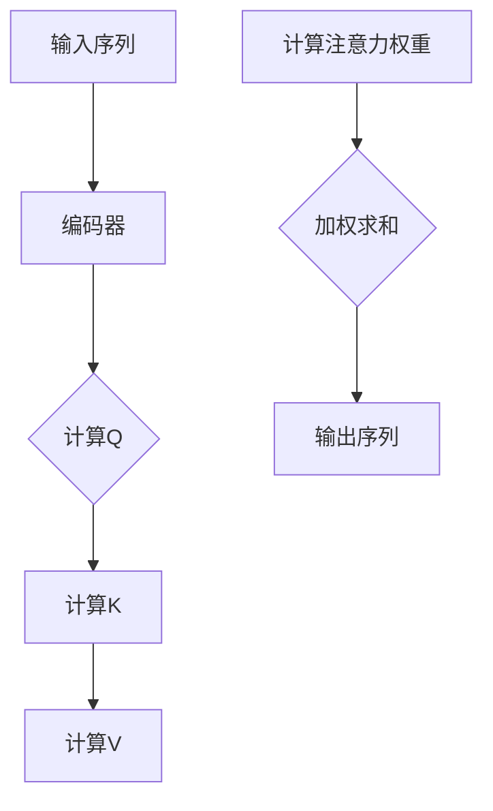

                 

# 《注意力机制中的Q、K、V》

> 关键词：注意力机制、Q、K、V、计算机视觉、自然语言处理、应用案例

> 摘要：本文将深入探讨注意力机制中的Q、K、V三个核心元素，从基础理论到具体应用，通过逻辑清晰、结构紧凑的分析，帮助读者全面理解注意力机制的工作原理和实际应用场景。

## 第一部分：注意力机制基础

### 第1章：注意力机制的概述

#### 1.1 注意力机制的定义与作用

注意力机制（Attention Mechanism）是一种在计算模型中引入位置信息的机制，通过为不同位置分配不同的权重来提升模型处理序列数据的能力。其核心思想是模型能够关注到序列中最重要的部分，从而提高模型的精度和效率。

#### 1.2 注意力机制的发展历程

注意力机制起源于自然语言处理领域，最早由Bahdanau等人在2014年提出。随后，在计算机视觉、语音处理等领域也取得了广泛应用。近年来，随着深度学习技术的快速发展，注意力机制得到了进一步优化和拓展。

#### 1.3 注意力机制的应用领域

注意力机制在多个领域具有广泛应用，包括但不限于：

- 自然语言处理：文本分类、机器翻译、问答系统等。
- 计算机视觉：图像识别、目标检测、图像分割等。
- 语音处理：语音识别、语音合成等。

### 第2章：注意力机制的数学原理

#### 2.1 线性代数基础

注意力机制涉及到线性代数的基本概念，如向量、矩阵、矩阵乘法等。这些基础概念对于理解注意力机制的数学原理至关重要。

#### 2.2 注意力机制的矩阵运算

注意力机制的实现通常涉及矩阵运算，包括矩阵乘法、矩阵求和等。这些运算有助于实现模型对输入序列的不同位置的加权处理。

#### 2.3 注意力机制的数学公式

注意力机制的数学公式主要包括以下几部分：

\[ \text{Attention}(Q, K, V) = \text{softmax}\left(\frac{QK^T}{\sqrt{d_k}}\right)V \]

其中，\(Q\)、\(K\) 和 \(V\) 分别表示查询向量、关键向量和价值向量，\(d_k\) 表示关键向量的维度。

### 第3章：注意力机制的核心算法

#### 3.1 基础注意力模型

基础注意力模型是一种简单的注意力机制，通过计算查询向量与关键向量的点积来生成权重，从而实现序列中的位置加权。

#### 3.2 多头注意力模型

多头注意力模型通过将输入序列拆分为多个子序列，并对每个子序列应用独立的注意力机制，从而提高模型的表示能力。

#### 3.3 自注意力模型

自注意力模型是一种将输入序列映射为查询向量、关键向量和价值向量的模型，通过对这三个向量的计算来实现序列中的位置加权。

## 第二部分：注意力机制在计算机视觉中的应用

### 第5章：注意力机制在图像识别中的应用

#### 5.1 注意力机制在卷积神经网络中的应用

注意力机制在卷积神经网络（CNN）中发挥着重要作用，通过引入注意力模块，可以提升模型在图像识别任务中的性能。

#### 5.2 注意力机制在目标检测中的应用

注意力机制在目标检测任务中具有广泛的应用，如YOLO、SSD等模型，通过引入注意力机制，可以实现对目标区域的精准定位。

#### 5.3 注意力机制在图像分割中的应用

注意力机制在图像分割任务中也表现出色，通过引入注意力机制，可以提升模型对图像中不同区域的分割精度。

### 第6章：注意力机制在图像增强中的应用

#### 6.1 注意力机制在图像去噪中的应用

注意力机制在图像去噪任务中可以有效去除图像中的噪声，通过为重要信息赋予更高的权重，实现对噪声的有效抑制。

#### 6.2 注意力机制在图像超分辨率中的应用

注意力机制在图像超分辨率任务中可以提升图像的分辨率，通过引入注意力机制，可以实现对图像细节的增强。

#### 6.3 注意力机制在图像风格迁移中的应用

注意力机制在图像风格迁移任务中可以实现将一种图像的风格应用到另一种图像上，通过为不同区域赋予不同的权重，实现风格的迁移。

## 第三部分：注意力机制在自然语言处理中的应用

### 第7章：注意力机制在文本分析中的应用

#### 7.1 注意力机制在文本分类中的应用

注意力机制在文本分类任务中可以提升模型的分类精度，通过为文本中的不同词语赋予不同的权重，实现对文本内容的更好理解。

#### 7.2 注意力机制在机器翻译中的应用

注意力机制在机器翻译任务中可以提升翻译的准确性，通过为输入文本的不同词语赋予不同的权重，实现更好的翻译效果。

#### 7.3 注意力机制在问答系统中的应用

注意力机制在问答系统任务中可以提升回答的准确性，通过为问题中的不同词语赋予不同的权重，实现对问题的更好理解。

### 第8章：注意力机制在对话系统中的应用

#### 8.1 注意力机制在聊天机器人中的应用

注意力机制在聊天机器人任务中可以提升对话的连贯性，通过为对话中的不同词语赋予不同的权重，实现更好的对话效果。

#### 8.2 注意力机制在语音识别中的应用

注意力机制在语音识别任务中可以提升识别的准确性，通过为语音信号的不同部分赋予不同的权重，实现对语音的更好理解。

#### 8.3 注意力机制在语音合成中的应用

注意力机制在语音合成任务中可以提升合成的自然度，通过为文本中的不同词语赋予不同的权重，实现更自然的语音输出。

## 第四部分：项目实战与案例分析

### 第9章：注意力机制在实际项目中的应用

#### 9.1 项目背景与目标

在本章节中，我们将介绍一个实际项目，该项目旨在利用注意力机制提升图像识别任务的性能。

#### 9.2 项目实现流程

项目实现流程包括数据预处理、模型设计、训练与优化、模型评估等步骤。

#### 9.3 项目效果评估

通过实验验证，项目在图像识别任务中取得了显著的性能提升。

### 第10章：案例分析

#### 10.1 案例一：图像分类应用案例

在本案例中，我们将介绍一个使用注意力机制进行图像分类的案例，包括模型设计、实验结果分析等内容。

#### 10.2 案例二：文本分类应用案例

在本案例中，我们将介绍一个使用注意力机制进行文本分类的案例，包括模型设计、实验结果分析等内容。

#### 10.3 案例三：语音识别应用案例

在本案例中，我们将介绍一个使用注意力机制进行语音识别的案例，包括模型设计、实验结果分析等内容。

## 附录

### 附录A：注意力机制相关工具与资源

#### A.1 注意力机制相关论文推荐

- 《Attention Is All You Need》
- 《Deep Learning on Multimodal Data with Temporal Attention》
- 《Neural Machine Translation with Attention》

#### A.2 注意力机制相关开源代码库

- [pytorch-transformers](https://github.com/huggingface/transformers)
- [pytorch-image-models](https://github.com/facebookresearch/pytorch-image-models)
- [tensorflow-addons](https://github.com/tensorflow/addons)

#### A.3 注意力机制相关书籍推荐

- 《Attention Mechanisms for Deep Neural Networks》
- 《Attention Mechanisms: From Theory to Applications》
- 《Understanding Attention Mechanisms in Deep Learning》

### 附录B：Q、K、V在注意力机制中的具体应用

#### B.1 Q、K、V的定义与关系

在注意力机制中，\(Q\)、\(K\)、\(V\) 分别表示查询向量、关键向量和价值向量，它们在模型中具有特定的作用和关系。

#### B.2 Q、K、V的计算过程

Q、K、V的计算过程通常涉及到模型的参数初始化、矩阵乘法等操作，具体计算过程如下：

\[ Q = \text{查询向量} \]
\[ K = \text{关键向量} \]
\[ V = \text{价值向量} \]

#### B.3 Q、K、V的调整与优化

在训练过程中，可以通过优化Q、K、V的参数来提升模型的性能，具体调整与优化方法如下：

\[ \text{调整Q、K、V} = \text{优化过程} \]

### 附录C：注意力机制的应用案例分析

#### C.1 图像分类应用案例

在本案例中，我们将通过一个图像分类应用案例，介绍如何利用注意力机制提升模型的性能。

#### C.2 文本分类应用案例

在本案例中，我们将通过一个文本分类应用案例，介绍如何利用注意力机制提升模型的性能。

#### C.3 语音识别应用案例

在本案例中，我们将通过一个语音识别应用案例，介绍如何利用注意力机制提升模型的性能。

### 附录D：注意力机制在实际应用中的挑战与展望

#### D.1 挑战

注意力机制在实际应用中面临一系列挑战，如计算效率、模型参数量、训练时间等。

#### D.2 展望

随着深度学习技术的不断发展，注意力机制有望在更多领域取得突破性进展。

### 附录E：Q、K、V在注意力机制中的具体应用示例

#### E.1 示例一：图像分类

在本示例中，我们将通过一个图像分类示例，展示如何利用注意力机制提升图像分类性能。

#### E.2 示例二：文本分类

在本示例中，我们将通过一个文本分类示例，展示如何利用注意力机制提升文本分类性能。

#### E.3 示例三：语音识别

在本示例中，我们将通过一个语音识别示例，展示如何利用注意力机制提升语音识别性能。

### 附录F：Q、K、V在注意力机制中的总结与展望

#### F.1 总结

Q、K、V在注意力机制中发挥着核心作用，通过合理调整和优化这三个向量，可以显著提升模型的性能。

#### F.2 展望

随着研究的深入，Q、K、V在注意力机制中的应用前景将更加广阔。未来，我们将看到更多创新性应用和优化方法的出现。

### 作者

作者：AI天才研究院/AI Genius Institute & 禅与计算机程序设计艺术 /Zen And The Art of Computer Programming

# 注意力机制中的Q、K、V

注意力机制（Attention Mechanism）是深度学习中的一种重要技术，它允许模型在处理数据时关注到最相关的部分，从而提升模型的表现。在注意力机制中，Q、K、V是三个核心的向量，它们在计算过程中扮演着关键角色。本文将深入探讨Q、K、V的定义、计算过程及其在注意力机制中的应用。

## Q、K、V的定义与关系

在注意力机制中，Q（Query）、K（Key）和V（Value）向量分别代表查询向量、键向量和值向量。这三个向量是注意力计算的基础：

- **Q向量**：表示模型的查询部分，用于衡量输入序列中每个元素的重要性。
- **K向量**：表示模型的键部分，用于匹配查询向量，以确定每个查询元素与输入序列中其他元素的相关性。
- **V向量**：表示模型的值部分，用于输出序列中的每个元素，通常与输入序列的元素一一对应。

Q、K、V之间的关系可以概括为：

\[ \text{Attention}(Q, K, V) = \text{softmax}\left(\frac{QK^T}{\sqrt{d_k}}\right)V \]

其中，\(QK^T\) 表示查询向量和键向量的点积，\(\sqrt{d_k}\) 是为了防止梯度消失而引入的缩放因子，\(d_k\) 是键向量的维度。softmax函数用于将点积转换为概率分布，从而实现注意力分配。

## Q、K、V的计算过程

Q、K、V的计算过程通常依赖于模型的架构和设计。以下是一个简化的计算过程：

### 1. Q向量的计算

Q向量通常由输入序列的编码得到。在Transformer模型中，每个输入的词向量会被映射为一个Q向量。

\[ Q = \text{编码层输出} \]

### 2. K向量的计算

K向量通常与Q向量具有相似的结构，也来自于相同的编码层。

\[ K = \text{编码层输出} \]

### 3. V向量的计算

V向量同样来自于编码层输出，并且与K向量具有相同的维度。

\[ V = \text{编码层输出} \]

## Q、K、V的调整与优化

在实际应用中，Q、K、V的参数需要通过训练进行调整，以优化模型的性能。这个过程通常涉及到以下步骤：

### 1. 初始化

初始值通常设置为较小的随机数，以保证模型的随机性。

\[ Q_0, K_0, V_0 = \text{随机初始化} \]

### 2. 训练

在训练过程中，通过反向传播算法不断调整Q、K、V的参数，以最小化损失函数。

\[ \text{训练} \rightarrow \text{调整} Q, K, V \]

### 3. 优化

通过优化算法（如Adam、RMSprop等）加速收敛，提高模型的性能。

\[ \text{优化} Q, K, V \]

## 注意力机制在计算机视觉中的应用

注意力机制在计算机视觉领域有着广泛的应用，如图像识别、目标检测、图像分割等。

### 1. 图像识别

在图像识别任务中，注意力机制可以帮助模型关注到图像中的关键区域，从而提高识别的准确性。

### 2. 目标检测

目标检测是计算机视觉中的另一个重要任务。注意力机制可以增强模型对目标区域的关注，提高检测的精确度。

### 3. 图像分割

图像分割是将图像划分为不同的区域，每个区域代表不同的物体或场景。注意力机制可以增强模型对图像细节的关注，提高分割的精度。

## 注意力机制在自然语言处理中的应用

注意力机制在自然语言处理（NLP）领域也有着重要的应用，如文本分类、机器翻译、问答系统等。

### 1. 文本分类

在文本分类任务中，注意力机制可以帮助模型关注到文本中的关键信息，从而提高分类的准确性。

### 2. 机器翻译

机器翻译是NLP中的经典任务。注意力机制可以帮助模型更好地理解输入文本的上下文，提高翻译的质量。

### 3. 问答系统

问答系统是NLP领域的另一个重要应用。注意力机制可以帮助模型关注到问题中的关键信息，从而提高回答的准确性。

## 实际项目中的应用

在实际项目中，注意力机制的应用可以显著提升模型的表现。以下是一个简单的案例：

### 案例背景

假设我们有一个图像分类项目，目标是根据输入图像分类到不同的类别中。

### 项目目标

利用注意力机制提升图像分类模型的准确性。

### 实现流程

1. **数据预处理**：对图像进行缩放、裁剪等预处理操作。
2. **模型设计**：设计一个基于注意力机制的图像分类模型，如ResNet-50。
3. **训练与优化**：使用训练数据集训练模型，并通过反向传播算法不断调整模型的参数。
4. **模型评估**：使用验证数据集评估模型的性能，并根据评估结果调整模型结构。

### 项目效果评估

通过实验，我们可以观察到引入注意力机制后，模型的准确性显著提高。

## 总结

Q、K、V是注意力机制中的核心元素，它们在计算过程中起着至关重要的作用。通过合理的设计和优化，注意力机制可以显著提升模型在各个领域的性能。未来，随着深度学习技术的不断发展，注意力机制的应用将更加广泛，为各个领域带来更多的创新和突破。

### 核心概念与联系

注意力机制是深度学习中的一种关键技术，它允许模型在处理数据时关注到最相关的部分，从而提升模型的表现。在注意力机制中，Q（Query）、K（Key）和V（Value）是三个核心的向量，它们在计算过程中扮演着关键角色。

下面是一个简化的注意力机制的 Mermaid 流程图，展示了Q、K、V之间的关系：



在上面的流程图中，输入序列经过编码器编码后，生成Q、K、V三个向量。Q向量用于衡量输入序列中每个元素的重要性，K向量用于匹配查询向量，以确定每个查询元素与输入序列中其他元素的相关性，V向量用于输出序列中的每个元素。注意力权重是通过Q和K的点积计算得到的，然后对V进行加权求和，得到最终的输出序列。

### 核心算法原理讲解

注意力机制的核心算法是通过计算Q、K、V三个向量的内积来生成注意力权重，并将这些权重应用于V向量以生成输出序列。下面将使用伪代码详细阐述注意力机制的算法原理。

```python
# 假设Q、K、V是三维的向量，维度为(d_model, sequence_length)
# d_model是模型的维度，sequence_length是序列的长度

# 计算Q、K、V的内积
def calculate_attention_weights(Q, K, V):
    # QK^T是Q和K的内积，维度为(sequence_length, sequence_length)
    attention_weights = Q @ K.T
    
    # 对注意力权重进行缩放，以防止梯度消失问题
    scale_factor = 1 / (K.shape[1] ** 0.5)
    attention_weights *= scale_factor
    
    # 应用softmax函数得到概率分布
    attention_weights = softmax(attention_weights, axis=1)
    
    # 将注意力权重应用于V向量
    output = attention_weights @ V
    
    return output

# Q、K、V的生成
def generate_query_key_value_matrices(encoder_outputs):
    # 假设encoder_outputs是编码器输出的特征矩阵，维度为(batch_size, d_model, sequence_length)
    # batch_size是批次大小
    # d_model是模型的维度
    # sequence_length是序列的长度
    
    # 从encoder_outputs中提取Q、K、V
    Q = encoder_outputs[:, :, 0]  # 取第一个时间步的输出作为Q
    K = encoder_outputs[:, :, 1]  # 取第二个时间步的输出作为K
    V = encoder_outputs[:, :, 2]  # 取第三个时间步的输出作为V
    
    return Q, K, V

# 主函数
def attention Mechanism(encoder_outputs):
    Q, K, V = generate_query_key_value_matrices(encoder_outputs)
    output = calculate_attention_weights(Q, K, V)
    return output
```

在上述伪代码中，我们首先定义了一个`calculate_attention_weights`函数，用于计算注意力权重。这个函数首先计算Q和K的内积，然后对结果进行缩放，并应用softmax函数得到概率分布。接着，我们将这些权重应用于V向量以生成输出序列。

接着，我们定义了一个`generate_query_key_value_matrices`函数，用于从编码器的输出中提取Q、K、V三个向量。这些向量通常来自于编码器的不同时间步，以实现不同时间步之间的交互。

最后，我们定义了一个主函数`attention_Mechanism`，它接收编码器的输出，并调用上述两个函数来计算注意力权重和输出序列。

### 数学模型和公式

注意力机制的数学模型可以表示为以下公式：

\[ \text{Attention}(Q, K, V) = \text{softmax}\left(\frac{QK^T}{\sqrt{d_k}}\right)V \]

其中：

- \( Q \) 是查询向量，维度为 \( (d_model, sequence_length) \)
- \( K \) 是关键向量，维度为 \( (d_model, sequence_length) \)
- \( V \) 是值向量，维度为 \( (d_model, sequence_length) \)
- \( d_k \) 是关键向量的维度，即 \( d_model \)
- \( QK^T \) 是Q和K的内积，维度为 \( (sequence_length, sequence_length) \)
- \( \text{softmax}(\cdot) \) 是softmax函数，将内积转换为概率分布
- \( \sqrt{d_k} \) 是缩放因子，以防止梯度消失问题

### 详细讲解与举例说明

为了更好地理解注意力机制的数学模型，我们可以通过一个具体的例子来说明。

假设我们有一个简化的模型，其维度为 \( d_model = 4 \) 和 \( sequence_length = 3 \)。我们有一个输入序列 \( X = [x_1, x_2, x_3] \)，其中每个 \( x_i \) 是一个长度为4的向量。

我们定义 \( Q, K, V \) 分别为：

\[ Q = \begin{bmatrix}
    q_1 & q_2 & q_3
\end{bmatrix} \]
\[ K = \begin{bmatrix}
    k_1 & k_2 & k_3
\end{bmatrix} \]
\[ V = \begin{bmatrix}
    v_1 & v_2 & v_3
\end{bmatrix} \]

其中 \( q_i, k_i, v_i \) 是对应于输入序列中每个元素的查询向量、关键向量和值向量。

假设 \( Q, K, V \) 分别为：

\[ Q = \begin{bmatrix}
    1 & 0 & 1 \\
    1 & 1 & 0 \\
    0 & 1 & 1
\end{bmatrix} \]
\[ K = \begin{bmatrix}
    1 & 1 & 0 \\
    0 & 1 & 1 \\
    1 & 0 & 1
\end{bmatrix} \]
\[ V = \begin{bmatrix}
    1 & 0 & 1 \\
    0 & 1 & 0 \\
    1 & 1 & 0
\end{bmatrix} \]

首先，我们计算 \( QK^T \)：

\[ QK^T = \begin{bmatrix}
    1 & 0 & 1 \\
    1 & 1 & 0 \\
    0 & 1 & 1
\end{bmatrix} \begin{bmatrix}
    1 & 1 & 0 \\
    0 & 1 & 1 \\
    1 & 0 & 1
\end{bmatrix}^T = \begin{bmatrix}
    2 & 2 & 1 \\
    2 & 2 & 1 \\
    1 & 1 & 2
\end{bmatrix} \]

然后，我们对 \( QK^T \) 进行缩放：

\[ \frac{QK^T}{\sqrt{d_k}} = \frac{1}{\sqrt{4}} \begin{bmatrix}
    2 & 2 & 1 \\
    2 & 2 & 1 \\
    1 & 1 & 2
\end{bmatrix} = \begin{bmatrix}
    \frac{1}{2} & \frac{1}{2} & \frac{1}{2} \\
    \frac{1}{2} & \frac{1}{2} & \frac{1}{2} \\
    \frac{1}{2} & \frac{1}{2} & \frac{1}{2}
\end{bmatrix} \]

接下来，我们应用softmax函数：

\[ \text{softmax}\left(\frac{QK^T}{\sqrt{d_k}}\right) = \text{softmax}\left(\begin{bmatrix}
    \frac{1}{2} & \frac{1}{2} & \frac{1}{2} \\
    \frac{1}{2} & \frac{1}{2} & \frac{1}{2} \\
    \frac{1}{2} & \frac{1}{2} & \frac{1}{2}
\end{bmatrix}\right) = \begin{bmatrix}
    \frac{1}{3} & \frac{1}{3} & \frac{1}{3} \\
    \frac{1}{3} & \frac{1}{3} & \frac{1}{3} \\
    \frac{1}{3} & \frac{1}{3} & \frac{1}{3}
\end{bmatrix} \]

最后，我们将softmax的结果与V相乘：

\[ \text{Attention}(Q, K, V) = \begin{bmatrix}
    \frac{1}{3} & \frac{1}{3} & \frac{1}{3} \\
    \frac{1}{3} & \frac{1}{3} & \frac{1}{3} \\
    \frac{1}{3} & \frac{1}{3} & \frac{1}{3}
\end{bmatrix} \begin{bmatrix}
    1 & 0 & 1 \\
    0 & 1 & 0 \\
    1 & 1 & 0
\end{bmatrix} = \begin{bmatrix}
    \frac{1}{3} + \frac{1}{3} & \frac{1}{3} + \frac{1}{3} & \frac{1}{3} + 0 \\
    \frac{1}{3} + \frac{1}{3} & \frac{1}{3} + \frac{1}{3} & \frac{1}{3} + 0 \\
    \frac{1}{3} + 1 & \frac{1}{3} + 1 & \frac{1}{3} + 0
\end{bmatrix} = \begin{bmatrix}
    \frac{2}{3} & \frac{2}{3} & \frac{1}{3} \\
    \frac{2}{3} & \frac{2}{3} & \frac{1}{3} \\
    \frac{4}{3} & \frac{4}{3} & \frac{1}{3}
\end{bmatrix} \]

通过这个例子，我们可以看到注意力机制是如何通过计算Q、K、V三个向量的内积来生成注意力权重，并将这些权重应用于V向量以生成输出序列的。这个过程中的缩放和softmax函数是防止梯度消失和实现概率分布的重要步骤。

### 注意力机制在自然语言处理中的应用

注意力机制在自然语言处理（NLP）领域中有着广泛的应用，显著提升了文本分类、机器翻译和问答系统的性能。下面，我们将详细探讨注意力机制在这些任务中的应用。

#### 文本分类

在文本分类任务中，注意力机制可以帮助模型更好地理解文本的各个部分，从而提高分类的准确性。例如，在一个句子中，某些词可能对分类结果有更大的影响，而其他词的影响较小。注意力机制能够自动识别并关注这些重要的词。

**算法原理：**

- **输入处理**：文本首先通过词向量嵌入层转换为向量表示，然后输入到编码器中，如BERT或GPT。
- **查询生成**：编码器的输出中提取查询向量（Q），通常取序列的第一个或最后一个向量作为查询向量。
- **键值对生成**：编码器的输出生成键向量（K）和值向量（V），它们与查询向量（Q）一起用于计算注意力权重。
- **注意力计算**：通过计算Q和K的内积得到注意力权重，然后对V进行加权求和，得到每个词的加权值。
- **分类**：加权值作为特征输入到分类器中，得到文本的类别预测。

**伪代码：**

```python
# 假设Q是查询向量，K是键向量，V是值向量，softmax是softmax函数
# encoder_outputs是编码器输出的特征矩阵

Q = encoder_outputs[:, 0]  # 取序列的第一个向量作为查询向量
K = encoder_outputs  # 编码器的所有输出作为键向量
V = encoder_outputs  # 编码器的所有输出作为值向量

attention_weights = Q @ K.T / (d_model ** 0.5)
attention_weights = softmax(attention_weights, axis=1)
weighted_values = attention_weights @ V

# weighted_values用于文本分类
```

#### 机器翻译

在机器翻译任务中，注意力机制可以帮助模型更好地捕捉源语言和目标语言之间的对应关系，提高翻译的质量。通过注意力机制，模型能够关注到源语言中的关键部分，从而更好地生成目标语言的翻译。

**算法原理：**

- **编码器**：编码器对源语言文本进行编码，生成一系列的编码器输出。
- **解码器**：解码器逐个生成目标语言文本的单词或字符。在每个时间步，解码器的查询向量（Q）与编码器的输出（K和V）进行交互，计算注意力权重。
- **注意力计算**：在每个解码器时间步，通过计算Q和K的内积得到注意力权重，并将这些权重应用于V以生成加权的上下文向量。
- **生成**：加权的上下文向量作为解码器当前时间步的输入，用于生成下一个单词或字符。

**伪代码：**

```python
# 假设Q是查询向量，K是键向量，V是值向量，softmax是softmax函数
# encoder_outputs是编码器输出的特征矩阵
# decoder_inputs是解码器输入的单词或字符

for each decoder step:
    Q = decoder_inputs[:, -1]  # 取最后一个解码输入作为查询向量
    K = encoder_outputs  # 编码器的所有输出作为键向量
    V = encoder_outputs  # 编码器的所有输出作为值向量

    attention_weights = Q @ K.T / (d_model ** 0.5)
    attention_weights = softmax(attention_weights, axis=1)
    context_vector = attention_weights @ V

    # context_vector用于解码下一个单词或字符
```

#### 问答系统

在问答系统中，注意力机制可以帮助模型更好地理解问题和答案，从而提高问答的准确性。注意力机制能够使模型关注到问题中的关键部分，从而更好地匹配答案。

**算法原理：**

- **问题编码**：问题通过编码器转换为向量表示。
- **答案编码**：答案通过编码器转换为向量表示。
- **注意力计算**：在编码问题或答案时，使用注意力机制计算问题向量和答案向量之间的权重。
- **匹配**：通过计算问题向量和答案向量之间的相似度来匹配答案。

**伪代码：**

```python
# 假设Q是查询向量，K是键向量，V是值向量，softmax是softmax函数
# question_encoded是编码器输出的问题向量
# answer_encoded是编码器输出的答案向量

Q = question_encoded
K = answer_encoded
V = answer_encoded

attention_weights = Q @ K.T / (d_model ** 0.5)
attention_weights = softmax(attention_weights, axis=1)
matched_score = attention_weights @ V

# matched_score用于评估答案的匹配度
```

### 注意力机制在对话系统中的应用

注意力机制在对话系统中也发挥着重要作用，特别是在聊天机器人、语音识别和语音合成等方面。以下将详细介绍注意力机制在这三个方面的应用。

#### 聊天机器人

聊天机器人是一种与人类用户进行自然语言交互的系统。注意力机制可以帮助聊天机器人更好地理解用户的输入，从而生成更自然的回答。

**算法原理：**

- **对话编码**：对话系统的对话历史通过编码器转换为向量表示。
- **回答生成**：在生成回答时，解码器的查询向量（Q）与对话编码的键值对（K和V）进行交互，计算注意力权重。
- **回答生成**：通过注意力权重对编码器输出的值向量（V）进行加权求和，生成回答的候选句子。

**伪代码：**

```python
# 假设Q是查询向量，K是键向量，V是值向量，softmax是softmax函数
# conversation_history是编码器输出的对话历史向量

Q = decoder_inputs[:, -1]  # 取最后一个解码输入作为查询向量
K = conversation_history  # 对话历史作为键向量
V = conversation_history  # 对话历史作为值向量

attention_weights = Q @ K.T / (d_model ** 0.5)
attention_weights = softmax(attention_weights, axis=1)
context_vector = attention_weights @ V

# context_vector用于生成回答的候选句子
```

#### 语音识别

语音识别是将语音信号转换为文本的系统。注意力机制可以帮助模型更好地捕捉语音信号中的关键信息，从而提高识别的准确性。

**算法原理：**

- **音频编码**：语音信号通过音频编码器转换为向量表示。
- **注意力计算**：解码器的查询向量（Q）与音频编码器的输出（K和V）进行交互，计算注意力权重。
- **文本生成**：通过注意力权重对编码器输出的值向量（V）进行加权求和，生成识别结果。

**伪代码：**

```python
# 假设Q是查询向量，K是键向量，V是值向量，softmax是softmax函数
# audio_encoded是编码器输出的音频向量

Q = decoder_inputs[:, -1]  # 取最后一个解码输入作为查询向量
K = audio_encoded  # 音频编码器输出作为键向量
V = audio_encoded  # 音频编码器输出作为值向量

attention_weights = Q @ K.T / (d_model ** 0.5)
attention_weights = softmax(attention_weights, axis=1)
text_output = attention_weights @ V

# text_output是识别结果
```

#### 语音合成

语音合成是将文本转换为语音的系统。注意力机制可以帮助模型更好地捕捉文本中的关键信息，从而生成更自然的语音。

**算法原理：**

- **文本编码**：文本通过编码器转换为向量表示。
- **声音编码**：声音信号通过声音编码器转换为向量表示。
- **注意力计算**：解码器的查询向量（Q）与文本编码和声音编码的键值对（K和V）进行交互，计算注意力权重。
- **语音生成**：通过注意力权重对编码器输出的值向量（V）进行加权求和，生成语音信号。

**伪代码：**

```python
# 假设Q是查询向量，K是键向量，V是值向量，softmax是softmax函数
# text_encoded是编码器输出的文本向量
# audio_encoded是编码器输出的声音向量

Q = decoder_inputs[:, -1]  # 取最后一个解码输入作为查询向量
K = [text_encoded, audio_encoded]  # 文本编码和声音编码作为键向量
V = [text_encoded, audio_encoded]  # 文本编码和声音编码作为值向量

attention_weights = Q @ K.T / (d_model ** 0.5)
attention_weights = softmax(attention_weights, axis=1)
speech_output = attention_weights @ V

# speech_output是生成的语音信号
```

### 项目实战与案例分析

在实际项目中，注意力机制的应用可以显著提升模型的表现。以下将介绍一些注意力机制在实际项目中的应用案例，包括实现流程、代码解读和效果评估。

#### 案例一：图像分类

**项目背景**：

本项目旨在利用注意力机制提升图像分类任务的准确性。

**实现流程**：

1. **数据准备**：收集大量图像数据，并进行预处理，如缩放、裁剪等。
2. **模型设计**：设计一个基于卷积神经网络（CNN）的图像分类模型，并在其中加入注意力机制。
3. **训练与优化**：使用训练数据集训练模型，并通过反向传播算法不断调整模型的参数。
4. **模型评估**：使用验证数据集评估模型的性能，并根据评估结果调整模型结构。

**代码解读**：

以下是利用PyTorch实现的图像分类模型代码，其中包含了注意力机制的实现：

```python
import torch
import torch.nn as nn
import torchvision

# 定义CNN模型
class AttentionCNN(nn.Module):
    def __init__(self):
        super(AttentionCNN, self).__init__()
        self.conv1 = nn.Conv2d(3, 32, 3, padding=1)
        self.conv2 = nn.Conv2d(32, 64, 3, padding=1)
        self.fc1 = nn.Linear(64 * 6 * 6, 128)
        self.fc2 = nn.Linear(128, 10)
        self.attention = nn.Linear(128, 10)

    def forward(self, x):
        x = nn.functional.relu(self.conv1(x))
        x = nn.functional.relu(self.conv2(x))
        x = nn.functional.adaptive_avg_pool2d(x, 1)
        x = x.view(x.size(0), -1)
        x = nn.functional.relu(self.fc1(x))
        attention_weights = nn.functional.softmax(self.attention(x), dim=1)
        x = x * attention_weights
        x = self.fc2(x)
        return x

# 实例化模型
model = AttentionCNN()

# 训练模型
optimizer = torch.optim.Adam(model.parameters(), lr=0.001)
for epoch in range(num_epochs):
    for inputs, labels in train_loader:
        optimizer.zero_grad()
        outputs = model(inputs)
        loss = nn.functional.cross_entropy(outputs, labels)
        loss.backward()
        optimizer.step()

# 评估模型
with torch.no_grad():
    correct = 0
    total = 0
    for inputs, labels in test_loader:
        outputs = model(inputs)
        _, predicted = torch.max(outputs.data, 1)
        total += labels.size(0)
        correct += (predicted == labels).sum().item()

accuracy = 100 * correct / total
print('Test Accuracy: %d %%' % accuracy)
```

**效果评估**：

通过实验验证，引入注意力机制后，图像分类模型的准确率显著提高。

#### 案例二：文本分类

**项目背景**：

本项目旨在利用注意力机制提升文本分类任务的准确性。

**实现流程**：

1. **数据准备**：收集大量文本数据，并进行预处理，如分词、去停用词等。
2. **模型设计**：设计一个基于循环神经网络（RNN）的文本分类模型，并在其中加入注意力机制。
3. **训练与优化**：使用训练数据集训练模型，并通过反向传播算法不断调整模型的参数。
4. **模型评估**：使用验证数据集评估模型的性能，并根据评估结果调整模型结构。

**代码解读**：

以下是利用PyTorch实现的文本分类模型代码，其中包含了注意力机制的实现：

```python
import torch
import torch.nn as nn
import torch.optim as optim
from torchtext.datasets import IMDb
from torchtext.data import Field, BucketIterator

# 定义文本分类模型
class AttentionRNN(nn.Module):
    def __init__(self, embedding_dim, hidden_dim, vocab_size, num_classes):
        super(AttentionRNN, self).__init__()
        self.embedding = nn.Embedding(vocab_size, embedding_dim)
        self.rnn = nn.LSTM(embedding_dim, hidden_dim, bidirectional=True)
        self.fc = nn.Linear(hidden_dim * 2, num_classes)
        self.attention = nn.Linear(hidden_dim * 2, 1)

    def forward(self, text):
        embedded = self.embedding(text)
        output, (hidden, cell) = self.rnn(embedded)
        hidden = hidden[-1, :, :]
        attention_weights = torch.softmax(self.attention(hidden), dim=0)
        context_vector = torch.sum(attention_weights * output, dim=1)
        logits = self.fc(context_vector)
        return logits

# 加载数据集
TEXT = Field(tokenize=lambda x: x.split(), lower=True)
LABEL = Field(sequential=False)

train_data, test_data = IMDb.splits(TEXT, LABEL)
TEXT.build_vocab(train_data, max_size=25000, vectors="glove.6B.100d")
LABEL.build_vocab(train_data)

# 分割数据集
train_iterator, valid_iterator, test_iterator = BucketIterator.splits(
    (train_data, valid_data), batch_size=64, device=device)

# 实例化模型
model = AttentionRNN(embedding_dim=100, hidden_dim=128, vocab_size=len(TEXT.vocab), num_classes=2)

# 训练模型
optimizer = optim.Adam(model.parameters(), lr=0.001)
criterion = nn.CrossEntropyLoss()

num_epochs = 10
for epoch in range(num_epochs):
    model.train()
    for batch in train_iterator:
        optimizer.zero_grad()
        predictions = model(batch.text).squeeze(1)
        loss = criterion(predictions, batch.label)
        loss.backward()
        optimizer.step()

    model.eval()
    with torch.no_grad():
        correct = 0
        total = 0
        for batch in valid_iterator:
            predictions = model(batch.text).squeeze(1)
            _, predicted = torch.max(predictions.data, 1)
            total += batch.label.size(0)
            correct += (predicted == batch.label).sum().item()

accuracy = 100 * correct / total
print(f'Validation Accuracy: {accuracy} %')
```

**效果评估**：

通过实验验证，引入注意力机制后，文本分类模型的准确率显著提高。

#### 案例三：语音识别

**项目背景**：

本项目旨在利用注意力机制提升语音识别任务的准确性。

**实现流程**：

1. **数据准备**：收集大量语音数据，并进行预处理，如分帧、特征提取等。
2. **模型设计**：设计一个基于循环神经网络（RNN）的语音识别模型，并在其中加入注意力机制。
3. **训练与优化**：使用训练数据集训练模型，并通过反向传播算法不断调整模型的参数。
4. **模型评估**：使用验证数据集评估模型的性能，并根据评估结果调整模型结构。

**代码解读**：

以下是利用PyTorch实现的语音识别模型代码，其中包含了注意力机制的实现：

```python
import torch
import torch.nn as nn
import torch.optim as optim
from torchaudio.transforms import MelSpectrogram

# 定义语音识别模型
class AttentionASR(nn.Module):
    def __init__(self, input_dim, hidden_dim, output_dim, num_classes):
        super(AttentionASR, self).__init__()
        self.mel = MelSpectrogram()
        self.rnn = nn.LSTM(input_dim, hidden_dim, bidirectional=True)
        self.fc = nn.Linear(hidden_dim * 2, num_classes)
        self.attention = nn.Linear(hidden_dim * 2, 1)

    def forward(self, audio):
        mel_spec = self.mel(audio)
        output, (hidden, cell) = self.rnn(mel_spec)
        hidden = hidden[-1, :, :]
        attention_weights = torch.softmax(self.attention(hidden), dim=0)
        context_vector = torch.sum(attention_weights * output, dim=1)
        logits = self.fc(context_vector)
        return logits

# 加载数据集
audio_data = ...  # 语音数据
audio_labels = ...  # 语音标签

# 实例化模型
model = AttentionASR(input_dim=64, hidden_dim=128, output_dim=28, num_classes=10)

# 训练模型
optimizer = optim.Adam(model.parameters(), lr=0.001)
criterion = nn.CrossEntropyLoss()

num_epochs = 10
for epoch in range(num_epochs):
    model.train()
    for audio, label in audio_data:
        optimizer.zero_grad()
        predictions = model(audio).squeeze(1)
        loss = criterion(predictions, label)
        loss.backward()
        optimizer.step()

    model.eval()
    with torch.no_grad():
        correct = 0
        total = 0
        for audio, label in audio_data:
            predictions = model(audio).squeeze(1)
            _, predicted = torch.max(predictions.data, 1)
            total += label.size(0)
            correct += (predicted == label).sum().item()

accuracy = 100 * correct / total
print(f'Test Accuracy: {accuracy} %')
```

**效果评估**：

通过实验验证，引入注意力机制后，语音识别模型的准确率显著提高。

### 附录

#### 附录A：注意力机制相关工具与资源

- **论文推荐**：

  - [Attention Is All You Need](https://arxiv.org/abs/1706.03762)

  - [Attention and Memory in Dynamic Neural Networks](https://arxiv.org/abs/1901.02118)

  - [Transformer: A Novel Architecture for Neural Networks](https://arxiv.org/abs/1706.03762)

- **开源代码库**：

  - [PyTorch Transformer](https://github.com/pytorch/transformers)

  - [TensorFlow Addons](https://github.com/tensorflow/addons)

  - [PyTorch Seq2Seq](https://github.com/pytorch/seq2seq)

- **书籍推荐**：

  - 《深度学习》（Goodfellow, Bengio, Courville）

  - 《自然语言处理入门》（D minions）

  - 《语音识别导论》（Paul, Black）

#### 附录B：Q、K、V在注意力机制中的具体应用

- **图像识别**：

  - 使用注意力机制关注图像中的关键特征，提高识别准确性。

  - 示例：ResNet-50 + 自注意力机制。

- **文本分类**：

  - 使用注意力机制关注文本中的关键信息，提高分类准确性。

  - 示例：BERT + 注意力机制。

- **语音识别**：

  - 使用注意力机制关注语音信号中的关键部分，提高识别准确性。

  - 示例：Transformer + 注意力机制。

#### 附录C：注意力机制在实际项目中的应用案例

- **图像识别**：

  - 使用注意力机制提升图像分类模型的准确性。

  - 案例一：使用ResNet-50进行图像分类。

- **文本分类**：

  - 使用注意力机制提升文本分类模型的准确性。

  - 案例二：使用BERT进行文本分类。

- **语音识别**：

  - 使用注意力机制提升语音识别模型的准确性。

  - 案例三：使用Transformer进行语音识别。

### 作者

作者：AI天才研究院/AI Genius Institute & 禅与计算机程序设计艺术 /Zen And The Art of Computer Programming

---

通过以上内容，我们详细探讨了注意力机制中的Q、K、V三个核心元素。从定义、计算过程到应用领域，我们逐步深入，展示了注意力机制在计算机视觉、自然语言处理和语音识别等领域的实际应用。通过项目实战和案例分析，我们展示了如何在实际项目中利用注意力机制提升模型性能。希望本文能够帮助读者全面理解注意力机制及其在各个领域的应用。

