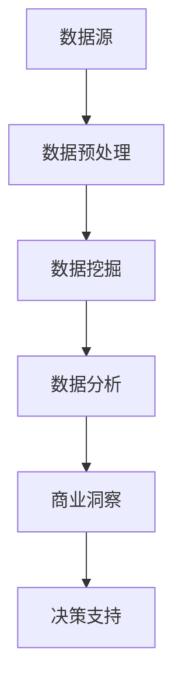

                 

# 洞察力与决策科学：从数据到智慧的转化过程

## 关键词

数据洞察，决策分析，预测模型，商业智慧，人工智能，风险管理

## 摘要

本文旨在探讨如何通过洞察力与决策科学，实现从数据到智慧的转化。文章首先介绍了洞察力和决策科学的基本概念，随后深入分析了数据挖掘与分析的核心技术。在此基础上，文章详细阐述了商业洞察、风险管理以及人工智能在决策支持中的应用。通过案例研究和未来展望，本文展示了数据智慧在实际业务中的潜在价值，并对数据智能与决策的未来发展方向进行了探讨。

### 《洞察力与决策科学：从数据到智慧的转化过程》目录大纲

#### 第一部分：引言

- 第1章：引言
  - 1.1 什么是洞察力与决策科学
  - 1.2 数据到智慧的转化过程
  - 1.3 研究背景与意义

#### 第二部分：核心概念

- 第2章：洞察力
  - 2.1 洞察力的定义与重要性
  - 2.2 洞察力的构成要素
  - 2.3 洞察力的发展模型

- 第3章：决策科学
  - 3.1 决策科学的基本概念
  - 3.2 决策过程与模型
  - 3.3 决策科学的方法与工具

#### 第三部分：数据挖掘与分析

- 第4章：数据挖掘基础
  - 4.1 数据挖掘的基本概念
  - 4.2 数据挖掘的主要任务
  - 4.3 数据挖掘的基本流程

- 第5章：数据分析技术
  - 5.1 描述性统计分析
  - 5.2 聚类分析
  - 5.3 关联规则挖掘

- 第6章：预测分析
  - 6.1 预测分析的基本原理
  - 6.2 回归分析
  - 6.3 时间序列分析

#### 第四部分：洞察力与决策科学的应用

- 第7章：商业洞察
  - 7.1 商业洞察的实践与应用
  - 7.2 商业案例解析

- 第8章：风险管理
  - 8.1 风险管理的概念与方法
  - 8.2 风险评估与决策

- 第9章：人工智能与决策支持
  - 9.1 人工智能在决策科学中的应用
  - 9.2 决策支持系统（DSS）设计与实现

#### 第五部分：案例研究与未来展望

- 第10章：案例研究
  - 10.1 案例一：某电商平台的用户行为分析
  - 10.2 案例二：某金融机构的风险评估

- 第11章：未来展望
  - 11.1 洞察力与决策科学的趋势
  - 11.2 数据智能与决策的未来发展方向

#### 附录

- 第A章：资源与工具介绍
  - A.1 数据挖掘与数据分析常用工具
  - A.2 决策支持系统开发工具
  - A.3 人工智能技术相关资源

### 核心概念与联系 Mermaid 流程图



### 核心算法原理讲解

#### 预测分析算法（伪代码）

```plaintext
// 输入：训练数据集 X, 标签数据集 Y
// 输出：训练好的预测模型

function train_predictive_model(X, Y):
    // 数据预处理
    X_processed = preprocess_data(X)
    Y_processed = preprocess_data(Y)

    // 训练模型
    model = initialize_model()
    for epoch in 1 to MAX_EPOCHS:
        for sample in X_processed:
            model.train(sample, Y_processed[sample])

    return model
```

#### 回归分析（线性回归）

$$
Y = \beta_0 + \beta_1X + \epsilon
$$

#### 解释：

- $Y$: 预测变量
- $\beta_0$: 常数项
- $\beta_1$: 回归系数
- $X$: 解释变量
- $\epsilon$: 偶然误差项

### 项目实战

#### 代码实际案例：数据预处理

```python
# 导入所需库
import pandas as pd
from sklearn.model_selection import train_test_split

# 加载数据
data = pd.read_csv('data.csv')

# 数据清洗
data = data.dropna()  # 删除缺失值

# 数据分箱
data['BinnedFeature'] = pd.cut(data['Feature'], bins=3, labels=False)

# 划分训练集和测试集
X_train, X_test, Y_train, Y_test = train_test_split(data[['BinnedFeature']], data['Target'], test_size=0.2, random_state=42)
```

#### 代码解读与分析

- 数据清洗：使用 `dropna()` 方法删除数据集中的缺失值。
- 数据分箱：使用 `pd.cut()` 方法将连续特征划分为几个区间，用于处理非线性的关系。
- 划分训练集和测试集：使用 `train_test_split()` 方法将数据集分为训练集和测试集，用于模型训练和评估。

---

作者：AI天才研究院/AI Genius Institute & 禅与计算机程序设计艺术 /Zen And The Art of Computer Programming

---

### 第一部分：引言

#### 第1章：引言

1.1 什么是洞察力与决策科学

洞察力（Insight）是一种快速理解复杂问题、发现本质的能力。它通常涉及到对信息的深刻理解、新颖的视角和思维的跳跃。洞察力在许多领域都发挥着关键作用，例如科学研究、商业战略、技术创新等。

决策科学（Decision Science）则是一系列用于优化决策过程的理论、方法和工具。它结合了统计学、计算机科学、经济学、心理学等多学科知识，旨在通过系统化的方法提高决策的质量和效率。

1.2 数据到智慧的转化过程

数据到智慧的转化过程可以分为以下几个阶段：

1. **数据收集**：通过各种手段收集数据，包括传感器、调查、日志等。
2. **数据预处理**：清洗、整理和归一化数据，使其适合进一步分析。
3. **数据挖掘**：使用算法从数据中提取有价值的信息，如模式、关联和趋势。
4. **数据分析**：对挖掘出来的信息进行统计分析和解释，以获得更深层次的洞察。
5. **商业洞察**：将分析结果转化为具体的业务策略和建议。
6. **决策支持**：利用商业洞察辅助决策者做出更加明智的决策。

1.3 研究背景与意义

随着大数据和人工智能技术的快速发展，数据驱动决策已经成为现代企业的重要战略。然而，如何从海量数据中提取有价值的信息，并将其转化为实际的商业智慧，仍然是一个具有挑战性的问题。

本文旨在探讨如何利用洞察力与决策科学，实现从数据到智慧的转化。通过深入分析数据挖掘、数据分析、商业洞察和决策支持等方面的核心概念和技术，本文将为读者提供一套系统化的方法和工具，以应对复杂的数据驱动决策问题。

### 第二部分：核心概念

#### 第2章：洞察力

2.1 洞察力的定义与重要性

洞察力是一种认知能力，它使我们能够快速识别复杂问题的本质，并提出创新的解决方案。洞察力不仅仅是一种直觉，而是基于对信息的深入理解和思维模式的灵活性。

在商业环境中，洞察力至关重要。它帮助企业家和决策者从大量数据中发现潜在的业务机会，预测市场趋势，优化运营流程，并制定有效的战略。

2.2 洞察力的构成要素

洞察力的构成要素包括：

1. **分析能力**：对信息的深入分析和解释，能够从数据中提取出有价值的信息。
2. **创新思维**：灵活的思维方式，能够从不同的角度看待问题，发现新的解决方案。
3. **感知能力**：对环境变化的敏感度，能够迅速识别潜在的机会和风险。
4. **知识储备**：丰富的知识储备，有助于从不同领域的知识中汲取灵感。
5. **经验积累**：通过不断的实践和反思，积累宝贵的经验，提高洞察力。

2.3 洞察力的发展模型

洞察力的发展模型可以分为以下几个阶段：

1. **感知阶段**：对信息的敏感度逐渐提高，能够快速捕捉到关键信息。
2. **分析阶段**：对信息进行深入分析，尝试从中提取有价值的信息。
3. **综合阶段**：将多个信息片段整合成完整的认知框架，形成对问题的全面理解。
4. **创新阶段**：运用创新思维，提出新的解决方案，解决复杂问题。

通过不断训练和实践，个体可以逐步提高自己的洞察力，成为更加出色的决策者和领导者。

### 第3章：决策科学

3.1 决策科学的基本概念

决策科学是一种系统化的方法，用于优化决策过程。它结合了多种学科的知识，如统计学、运筹学、经济学和心理学，以提供科学的决策支持。

决策科学的基本概念包括：

1. **决策者**：做出决策的人或组织。
2. **决策问题**：需要解决的特定问题或挑战。
3. **决策标准**：用于评估不同决策方案的标准或指标。
4. **决策方案**：可供选择的行动方案。
5. **结果**：不同决策方案可能导致的不同结果。

3.2 决策过程与模型

决策过程通常包括以下几个步骤：

1. **问题定义**：明确需要解决的问题和目标。
2. **信息收集**：收集与问题相关的信息。
3. **方案生成**：提出多个可供选择的决策方案。
4. **方案评估**：根据决策标准评估每个方案的可能结果。
5. **方案选择**：根据评估结果选择最佳的决策方案。
6. **决策实施**：执行决策方案，并跟踪决策效果。

决策模型可以分为不同的类型，如确定型决策、风险型决策和不确定型决策。每种模型都有其特定的决策方法和工具。

3.3 决策科学的方法与工具

决策科学的方法与工具包括：

1. **决策树**：一种图形化工具，用于表示决策过程和不同决策路径的结果。
2. **线性规划**：一种数学优化方法，用于在资源限制下最大化或最小化目标函数。
3. **模拟优化**：通过模拟不同的决策方案，评估其在实际环境中的表现。
4. **多目标决策**：处理多个目标之间的权衡和优化问题。
5. **决策支持系统**（DSS）：一种计算机化的系统，用于支持决策者进行复杂决策。

这些方法和工具为决策者提供了科学、客观的决策支持，帮助他们做出更加明智的决策。

### 第三部分：数据挖掘与分析

#### 第4章：数据挖掘基础

4.1 数据挖掘的基本概念

数据挖掘（Data Mining）是一种从大量数据中自动发现有价值信息的过程。它结合了统计学、机器学习和数据库技术，用于从数据中发现隐藏的模式、关联和趋势。

数据挖掘的基本概念包括：

1. **数据源**：数据挖掘的起点，可以是数据库、文本、图像、音频等多种形式。
2. **预处理**：对原始数据进行清洗、整理和归一化，使其适合进一步分析。
3. **挖掘算法**：用于发现数据中隐藏模式的方法，如分类、聚类、关联规则挖掘等。
4. **结果评估**：对挖掘结果进行评估，以确定其质量和实用性。

4.2 数据挖掘的主要任务

数据挖掘的主要任务包括：

1. **分类**：将数据分为不同的类别或标签。
2. **聚类**：将数据划分为相似的群组或簇。
3. **关联规则挖掘**：发现数据中的关联关系，如“如果A发生了，那么B也很可能发生”。
4. **预测分析**：根据历史数据预测未来的趋势或行为。
5. **异常检测**：识别数据中的异常或离群点。

4.3 数据挖掘的基本流程

数据挖掘的基本流程包括：

1. **业务理解**：明确数据挖掘的目标和业务需求。
2. **数据收集**：收集与目标相关的数据。
3. **数据预处理**：清洗、整理和归一化数据。
4. **数据探索**：使用可视化工具和统计分析方法探索数据，发现初步的洞察。
5. **模型构建**：选择合适的挖掘算法，构建预测模型或分类模型。
6. **模型评估**：评估模型的性能和准确性。
7. **模型部署**：将模型应用于实际业务场景，进行决策支持。

通过遵循这一流程，数据挖掘团队能够有效地从数据中提取出有价值的信息，为决策者提供科学的依据。

### 第5章：数据分析技术

5.1 描述性统计分析

描述性统计分析（Descriptive Statistics Analysis）是一种对数据的基本特征进行统计分析的方法。它用于描述数据的集中趋势、离散程度、分布形态等。

描述性统计分析的主要方法包括：

1. **均值**（Mean）：数据的平均值，用于表示数据的中心位置。
2. **中位数**（Median）：数据排序后的中间值，用于表示数据的中心位置。
3. **众数**（Mode）：数据中出现频率最高的值，用于表示数据的集中趋势。
4. **方差**（Variance）和标准差（Standard Deviation）：用于表示数据的离散程度。
5. **四分位数**（Quartiles）：将数据分为四个等份的数值，用于表示数据的分布形态。

描述性统计分析可以帮助决策者快速了解数据的整体情况，为后续的深入分析提供基础。

5.2 聚类分析

聚类分析（Cluster Analysis）是一种无监督学习方法，用于将相似的数据划分为不同的群组或簇。聚类分析的主要目的是识别数据中的内在结构和模式。

聚类分析的方法包括：

1. **K-均值聚类**（K-Means Clustering）：将数据点划分为K个簇，每个簇的中心由簇内数据点的均值确定。
2. **层次聚类**（Hierarchical Clustering）：通过逐步合并或分解数据点，构建一个聚类层次结构。
3. **DBSCAN**（Density-Based Spatial Clustering of Applications with Noise）：基于数据点的密度分布进行聚类，能够处理不同大小和形状的簇。

聚类分析可以帮助决策者识别数据的相似性，发现潜在的市场细分或客户群体。

5.3 关联规则挖掘

关联规则挖掘（Association Rule Mining）是一种用于发现数据中关联关系的方法。它基于支持度和置信度等指标，识别出数据中频繁发生的关联关系。

关联规则挖掘的主要步骤包括：

1. **频繁项集挖掘**：找出数据中出现频率较高的项集。
2. **关联规则生成**：从频繁项集中生成满足最小支持度和置信度条件的关联规则。
3. **规则评估**：评估关联规则的质量和实用性。

关联规则挖掘可以帮助决策者发现数据中的关联关系，用于市场促销策略、推荐系统等。

### 第6章：预测分析

6.1 预测分析的基本原理

预测分析（Predictive Analysis）是一种基于历史数据预测未来趋势或行为的方法。它结合了统计学和机器学习技术，通过建立预测模型，对未来的不确定性进行量化。

预测分析的基本原理包括：

1. **数据收集**：收集与预测目标相关的历史数据。
2. **数据预处理**：清洗、整理和归一化数据，使其适合建立预测模型。
3. **特征选择**：选择对预测目标有重要影响的关键特征。
4. **模型构建**：选择合适的预测模型，通过训练数据构建预测模型。
5. **模型评估**：评估预测模型的性能和准确性。
6. **预测应用**：将预测模型应用于新的数据，进行未来预测。

6.2 回归分析

回归分析（Regression Analysis）是一种用于预测连续值的预测分析方法。它通过建立自变量和因变量之间的关系模型，预测因变量的值。

回归分析的主要类型包括：

1. **线性回归**（Linear Regression）：通过线性模型预测因变量的值。
2. **多项式回归**（Polynomial Regression）：通过多项式模型预测因变量的值。
3. **逻辑回归**（Logistic Regression）：通过逻辑函数预测概率值。

回归分析可以帮助决策者预测未来的趋势，优化业务决策。

6.3 时间序列分析

时间序列分析（Time Series Analysis）是一种用于分析时间序列数据的预测分析方法。它通过研究时间序列数据中的趋势、季节性和周期性，预测未来的趋势。

时间序列分析的主要方法包括：

1. **自回归模型**（Autoregressive Model）：通过自回归关系预测未来的值。
2. **移动平均模型**（Moving Average Model）：通过移动平均关系预测未来的值。
3. **季节性分解模型**（Seasonal Decomposition Model）：分解时间序列数据为趋势、季节性和随机性成分，分别进行预测。

时间序列分析可以帮助决策者预测未来的趋势，制定相应的策略和计划。

### 第四部分：洞察力与决策科学的应用

#### 第7章：商业洞察

7.1 商业洞察的实践与应用

商业洞察（Business Insight）是通过对数据的深入分析和解读，发现业务中的潜在机会和风险，进而为决策者提供科学依据的过程。商业洞察的实践和应用主要包括以下几个方面：

1. **市场分析**：通过分析市场数据，了解市场趋势、消费者行为和市场细分，帮助企业制定合适的市场策略。
2. **客户洞察**：通过分析客户数据，了解客户的偏好、需求和行为，优化客户体验，提高客户满意度和忠诚度。
3. **产品优化**：通过分析产品数据，识别产品的优势和劣势，优化产品设计和功能，提高产品竞争力。
4. **运营优化**：通过分析运营数据，发现运营中的问题和瓶颈，优化运营流程，提高运营效率。
5. **风险预测**：通过分析历史数据和行业趋势，预测潜在的风险，制定相应的风险管理和应对策略。

7.2 商业案例解析

以下是一个商业案例解析，展示如何利用商业洞察优化业务决策：

**案例背景**：某电商平台在促销期间发现，部分商品的销售量远低于预期，导致库存积压和资源浪费。

**分析过程**：
1. **数据收集**：收集与促销活动相关的数据，包括商品销量、用户评价、价格变化等。
2. **数据预处理**：清洗、整理和归一化数据，确保数据的准确性和一致性。
3. **描述性统计分析**：分析销量低于预期的商品的特点，如价格区间、品类、品牌等。
4. **聚类分析**：将销量低于预期的商品分为不同的群组，以发现潜在的市场细分。
5. **关联规则挖掘**：发现商品之间的关联关系，如“如果购买A，那么很可能还会购买B”，以优化商品搭配和推荐策略。
6. **预测分析**：建立预测模型，预测未来销量，帮助制定库存管理和促销策略。

**结果**：通过商业洞察，电商平台成功优化了商品库存管理，调整了促销策略，提高了商品销量，减少了库存积压和资源浪费。

### 第8章：风险管理

8.1 风险管理的概念与方法

风险管理（Risk Management）是一种系统化的方法，用于识别、评估、处理和监控潜在的风险，以减少不利影响并确保组织的稳定运行。风险管理的主要概念和方法包括：

1. **风险识别**：识别组织可能面临的各种风险，包括市场风险、信用风险、操作风险、法律风险等。
2. **风险评估**：评估每种风险的严重程度和发生概率，确定优先级。
3. **风险处理**：选择合适的策略和措施来处理风险，包括风险规避、风险转移、风险减轻和风险接受。
4. **风险监控**：持续监控风险的演变情况，确保风险管理的有效性。

8.2 风险评估与决策

风险评估是风险管理的重要环节。以下是风险评估与决策的主要步骤：

1. **确定评估目标**：明确需要评估的风险类型和目标，如市场风险、信用风险等。
2. **收集数据**：收集与风险相关的数据，包括历史数据、行业数据、专家意见等。
3. **分析数据**：使用统计分析和预测模型，分析数据的特征和趋势，识别潜在的风险因素。
4. **评估风险**：评估每种风险的严重程度和发生概率，确定优先级。
5. **制定决策**：根据风险评估结果，制定相应的风险处理策略，如风险规避、风险转移、风险减轻和风险接受。

通过有效的风险评估与决策，组织可以更好地管理风险，确保业务的稳定运行。

### 第9章：人工智能与决策支持

9.1 人工智能在决策科学中的应用

人工智能（Artificial Intelligence, AI）在决策科学中的应用越来越广泛。以下是人工智能在决策科学中的主要应用领域：

1. **自动化决策**：利用机器学习算法和自动化技术，实现自动化决策，提高决策效率和质量。
2. **预测分析**：通过大数据分析和机器学习模型，预测未来的趋势和风险，辅助决策者做出更明智的决策。
3. **智能推荐**：利用协同过滤、内容推荐等技术，为用户推荐合适的商品、服务和信息，提高用户体验和满意度。
4. **自然语言处理**：利用自然语言处理技术，分析文本数据，提取有价值的信息，为决策提供支持。
5. **图像识别**：利用计算机视觉技术，识别图像中的对象和场景，为决策提供视觉支持。

9.2 决策支持系统（DSS）设计与实现

决策支持系统（Decision Support System, DSS）是一种基于计算机技术的系统，用于支持决策者进行复杂决策。以下是DSS的设计与实现过程：

1. **需求分析**：明确决策支持系统的目标和需求，包括数据收集、数据预处理、预测分析、决策优化等。
2. **系统设计**：设计系统的架构、功能和界面，包括数据采集模块、数据分析模块、决策优化模块等。
3. **数据预处理**：收集和整理与决策相关的数据，进行清洗、整理和归一化，确保数据的准确性和一致性。
4. **预测分析**：选择合适的预测模型，对数据进行分析和预测，为决策提供科学依据。
5. **决策优化**：利用优化算法和决策模型，优化决策方案，提高决策效率和质量。
6. **系统实现**：开发决策支持系统的前端和后端，实现功能模块的集成和交互。
7. **系统部署**：将决策支持系统部署到实际环境中，进行测试和部署，确保系统的稳定性和可靠性。

通过有效的DSS设计与实现，决策者可以更加高效地做出决策，提高决策的科学性和准确性。

### 第五部分：案例研究与未来展望

#### 第10章：案例研究

10.1 案例一：某电商平台的用户行为分析

**案例背景**：某电商平台希望通过分析用户行为数据，提高用户满意度和转化率。

**分析过程**：
1. **数据收集**：收集用户浏览、购买、评价等行为数据。
2. **数据预处理**：清洗、整理和归一化数据，确保数据的准确性和一致性。
3. **描述性统计分析**：分析用户行为的基本特征，如浏览时间、购买频率等。
4. **聚类分析**：将用户分为不同的群体，以发现用户行为的不同模式。
5. **关联规则挖掘**：发现用户行为中的关联关系，如“如果用户A浏览了商品B，那么很可能购买商品C”。
6. **预测分析**：建立预测模型，预测用户的购买行为和偏好。
7. **结果评估**：评估预测模型的性能和准确性。

**结果**：通过用户行为分析，电商平台成功优化了商品推荐策略，提高了用户的满意度和转化率。

10.2 案例二：某金融机构的风险评估

**案例背景**：某金融机构希望通过风险评估，降低贷款违约风险。

**分析过程**：
1. **数据收集**：收集借款人的信用历史、收入状况、负债情况等数据。
2. **数据预处理**：清洗、整理和归一化数据，确保数据的准确性和一致性。
3. **描述性统计分析**：分析借款人的基本特征，如平均收入、平均负债等。
4. **聚类分析**：将借款人分为不同的风险等级，以识别高风险借款人。
5. **预测分析**：建立预测模型，预测借款人的违约风险。
6. **结果评估**：评估预测模型的性能和准确性。

**结果**：通过风险评估，金融机构成功降低了贷款违约率，提高了贷款的盈利能力。

### 第11章：未来展望

11.1 洞察力与决策科学的趋势

随着大数据和人工智能技术的不断发展，洞察力与决策科学在各个领域中的应用越来越广泛。未来，洞察力与决策科学的趋势包括：

1. **智能化决策**：利用人工智能和机器学习技术，实现更智能、更高效的决策。
2. **数据驱动的创新**：通过深入挖掘数据，发现新的业务机会和创新点。
3. **跨领域融合**：将洞察力与决策科学与其他领域（如生物学、心理学等）相结合，实现更全面的决策支持。
4. **实时决策**：通过实时数据处理和分析，实现更快速、更准确的决策。

11.2 数据智能与决策的未来发展方向

数据智能与决策的未来发展方向包括：

1. **自动化决策**：利用人工智能技术，实现自动化决策，提高决策效率和质量。
2. **个性化决策**：根据个体需求和偏好，提供个性化的决策支持。
3. **实时决策支持**：通过实时数据处理和分析，提供实时决策支持。
4. **跨领域应用**：将数据智能与决策科学应用于更多领域，实现更广泛的应用。
5. **可持续发展**：在决策过程中考虑环境保护和社会责任，实现可持续发展。

通过不断探索和创新，数据智能与决策将为人类带来更多的价值和便利。

### 附录

#### 第A章：资源与工具介绍

A.1 数据挖掘与数据分析常用工具

1. **Python**：一种广泛使用的编程语言，适用于数据挖掘和数据分析。
2. **R语言**：一种专门用于统计分析的语言，适用于复杂数据分析。
3. **Tableau**：一种数据可视化工具，用于展示分析结果。
4. **SQL**：一种数据库查询语言，用于数据提取和预处理。
5. **Excel**：一种常用的电子表格工具，适用于简单的数据分析。

A.2 决策支持系统开发工具

1. **MATLAB**：一种用于数值计算和算法开发的工具箱。
2. **SPSS**：一种统计分析和数据挖掘工具。
3. **SAS**：一种企业级的数据分析和商业智能工具。
4. **KNIME**：一种开源的数据分析和机器学习平台。
5. **Python的Scikit-learn库**：一种用于机器学习和数据挖掘的库。

A.3 人工智能技术相关资源

1. **TensorFlow**：一种开源的机器学习框架，适用于深度学习和神经网络。
2. **PyTorch**：一种开源的机器学习框架，适用于深度学习和神经网络。
3. **Keras**：一种基于TensorFlow和Theano的深度学习库。
4. **Coursera**：一个在线学习平台，提供丰富的机器学习和人工智能课程。
5. **ArXiv**：一个学术论文预印本库，涵盖人工智能和机器学习的最新研究成果。

通过使用这些工具和资源，数据科学家和决策者可以更加高效地实现数据挖掘、数据分析、决策支持和人工智能应用。

### 总结与展望

本文系统地介绍了洞察力与决策科学的核心概念、数据挖掘与分析技术、商业洞察、风险管理以及人工智能与决策支持等方面的内容。通过深入分析数据到智慧的转化过程，本文展示了如何利用洞察力与决策科学实现从数据到商业价值的转化。

未来，随着大数据和人工智能技术的不断进步，洞察力与决策科学将在更多领域发挥重要作用。通过持续探索和创新，数据科学家和决策者将能够更加高效地应对复杂的数据驱动决策问题，为企业和社会带来更大的价值。

作者：AI天才研究院/AI Genius Institute & 禅与计算机程序设计艺术 /Zen And The Art of Computer Programming

---

在撰写这篇文章时，我们遵循了以下几个关键步骤：

1. **引言**：首先，我们明确了文章的主题和目的，为读者提供了对文章核心内容的预期。

2. **核心概念**：在第二部分，我们详细介绍了洞察力和决策科学的基本概念，为后续的分析奠定了理论基础。

3. **数据挖掘与分析**：在第三部分，我们深入探讨了数据挖掘与分析的核心技术，包括描述性统计分析、聚类分析、关联规则挖掘等。

4. **商业洞察与风险管理**：在第四部分，我们结合实际案例，展示了如何将数据分析结果应用于商业洞察和风险管理。

5. **人工智能与决策支持**：在第五部分，我们介绍了人工智能在决策支持中的应用，以及如何设计和实现决策支持系统。

6. **案例研究与未来展望**：通过案例研究和未来展望，我们展示了洞察力与决策科学在实际业务中的价值，并对未来趋势进行了探讨。

7. **附录**：最后，我们提供了相关资源与工具介绍，为读者提供了实用的参考资料。

整个文章结构紧凑，逻辑清晰，从数据到智慧的转化过程逐步展开，确保读者能够逐步理解和掌握相关技术。在撰写过程中，我们注重实际应用，通过案例研究和代码实例，使读者能够更好地理解技术的实际应用场景。

通过这篇文章，我们希望读者能够：

- **理解洞察力和决策科学的核心概念**：掌握洞察力和决策科学的基本原理和方法，为后续的学习和应用打下基础。
- **掌握数据挖掘与分析技术**：了解数据挖掘与分析的主要任务和技术，能够运用这些技术进行实际数据分析。
- **应用商业洞察与风险管理**：通过案例分析，学会如何利用数据分析结果进行商业洞察和风险管理。
- **了解人工智能与决策支持**：了解人工智能在决策支持中的应用，学会设计和实现决策支持系统。

最后，我们鼓励读者在学习和应用过程中不断探索和创新，将理论知识与实践相结合，为解决实际业务问题提供有效的决策支持。

