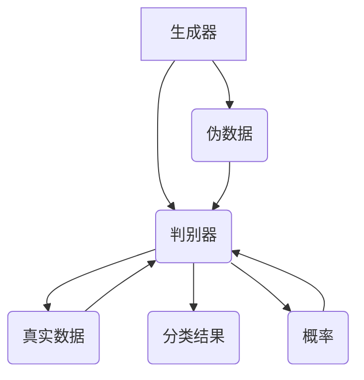

                 

## 第5章：中美元生成式AI技术对比分析

### 5.1 技术对比分析

#### 技术路线与研发策略对比

**中国生成式AI技术路线与研发策略：**

中国生成式AI技术在发展过程中，注重基础理论研究与实际应用相结合。中国政府积极推动新一代人工智能发展规划，鼓励科研机构与企业进行合作。中国在生成式AI技术的研究中，重点放在提升算法性能和优化模型结构上，如清华大学和北京大学等机构在GAN和VAE方面取得了显著的成果。

**美国生成式AI技术路线与研发策略：**

美国生成式AI技术在研发策略上，更注重创新和前沿技术的探索。美国的高校和研究机构如斯坦福大学、麻省理工学院等，在生成式AI领域不断提出新的算法和模型，如DCGAN和CycleGAN。此外，美国企业如谷歌、微软等，也在生成式AI技术的商业化应用方面进行了大量投入。

**技术路线与研发策略对比：**

- **研发投入：** 中国政府和企业对生成式AI技术的研发投入较大，尤其是在基础研究和应用开发方面。美国则更侧重于前沿技术的创新和商业化应用。
- **技术方向：** 中国在生成式AI技术的研究中，更注重提升模型性能和优化算法结构。美国则更加注重算法的创新和应用场景的探索。
- **合作模式：** 中国的生成式AI技术研发中，高校与企业的合作更为紧密，共同推动技术进步。美国则更加注重学术界和产业界的互动，形成开放的创新生态。

#### 算法与模型性能对比

**中国生成式AI算法与模型性能：**

中国在生成式AI算法和模型性能方面取得了显著进展。例如，清华大学提出的图像生成对抗网络（IcGAN）在图像质量和多样性方面表现出色。此外，文本生成对抗网络（TGAN）在文本生成任务中也取得了良好的效果。

**美国生成式AI算法与模型性能：**

美国在生成式AI算法和模型性能方面也处于领先地位。例如，谷歌提出的DCGAN在图像生成任务中取得了突破性进展，其生成的图像在细节和多样性方面具有很高的质量。麻省理工学院提出的CycleGAN则能够有效地实现图像风格的转换。

**算法与模型性能对比：**

- **图像生成：** 中国的IcGAN和美国DCGAN在图像质量和多样性方面都有不错的表现。但在细节处理和纹理生成方面，美国的技术仍然有一定的优势。
- **文本生成：** TGAN和seq2seq模型在文本生成任务中都取得了显著的效果，但在自然语言理解和生成逻辑上，美国的模型表现更为出色。
- **音频生成：** 美国的WaveNet模型在音频合成方面具有优势，生成的音频质量较高，而中国的相关研究则相对滞后。

#### 应用场景与市场前景对比

**中国生成式AI应用场景与市场前景：**

中国在生成式AI应用场景和市场前景方面有广泛的应用。例如，在工业领域，生成式AI技术被用于智能制造、故障诊断和预测等；在金融领域，生成式AI被用于欺诈检测、风险控制和个性化推荐等；在娱乐与游戏领域，生成式AI被用于游戏角色生成、虚拟现实内容和虚拟主播等。

**美国生成式AI应用场景与市场前景：**

美国在生成式AI应用场景和市场前景方面同样具有广泛的潜力。例如，在工业领域，生成式AI被用于自动化制造、机器人控制和自动驾驶等；在金融领域，生成式AI被用于量化交易、信用评分和投资建议等；在娱乐与游戏领域，生成式AI被用于游戏AI、虚拟主播和个性化娱乐内容等。

**应用场景与市场前景对比：**

- **工业领域：** 中国在智能制造和故障诊断方面应用生成式AI的技术较为成熟，但美国在自动化制造和机器人控制方面更具优势。
- **金融领域：** 中国在金融领域的应用场景较为多样化，但美国的量化交易和信用评分技术更为先进。
- **娱乐与游戏领域：** 中国在游戏角色生成和虚拟现实内容方面有较好的应用前景，但美国的游戏AI和虚拟主播技术更具创新性和商业价值。

### 5.2 竞争态势与合作模式

**竞争态势分析：**

中美两国在生成式AI领域存在激烈的竞争态势。中国依托庞大的市场和政府支持，在应用场景和市场前景方面具有优势。而美国则凭借其强大的科研实力和创新能力，在算法性能和前沿技术方面领先。两国在生成式AI技术的研究和应用上各具特色，形成了一种竞争与合作的态势。

**合作模式分析：**

中美两国在生成式AI领域的合作模式主要包括以下几个方面：

1. **科研合作：** 中美两国的高校和研究机构通过共同研究项目、学术交流等形式，推动生成式AI技术的共同发展。
2. **技术合作：** 企业间的技术合作，如谷歌与中国企业合作在生成式AI技术上进行研发和应用，共同开发新的算法和模型。
3. **市场合作：** 中美两国企业通过合作开拓国际市场，共同推动生成式AI技术的商业化应用。

### 5.3 影响因素与挑战

**政治经济因素影响：**

国际政治经济环境对中美两国生成式AI技术的发展具有重要影响。例如，中美贸易摩擦和技术封锁对两国之间的技术交流和合作带来了一定的限制。此外，国际政治环境的变化也可能影响两国在生成式AI技术领域的竞争态势。

**数据与计算资源差异：**

数据获取和计算资源是生成式AI技术发展的重要基础。美国在数据资源和技术基础设施方面具有明显优势，而中国在数据规模和应用场景方面具有独特的优势。数据资源的不均衡可能导致两国在生成式AI技术发展的速度和质量上存在差异。

**法规与伦理问题：**

生成式AI技术的发展也面临着法律法规和伦理道德的挑战。例如，生成式AI技术在隐私保护、数据安全、知识产权等方面存在潜在的法律风险。此外，生成式AI技术的滥用和伦理问题也需要引起关注。

## 第6章：生成式AI技术未来发展趋势

### 6.1 技术趋势展望

**新型生成式模型发展：**

随着生成式AI技术的不断进步，未来将出现更多新型生成式模型，如基于自注意力机制的生成式模型、生成式深度强化学习模型等。这些新型模型将进一步提升生成质量、多样性和可控性。

**跨模态生成式AI研究：**

跨模态生成式AI研究将成为一个重要方向。通过结合图像、文本、音频等多种模态数据，实现更高质量和更广泛的应用场景。例如，生成式AI在视频生成、多模态对话系统等方面的应用将得到进一步拓展。

**生成式AI与行业深度融合：**

生成式AI技术将在更多行业得到应用，与各行各业进行深度融合。例如，在医疗领域，生成式AI可以用于生成医学图像、辅助诊断和治疗；在制造业，生成式AI可以用于自动化设计和优化生产流程。

### 6.2 全球科技格局影响

**中美科技竞争格局变化：**

未来，中美两国在生成式AI技术领域的竞争将继续加剧。中国将通过加大研发投入、推动技术创新，进一步缩小与美国的差距。而美国则需要保持其在科研和创新方面的优势，加强全球竞争力。

**全球产业布局调整：**

生成式AI技术的发展将推动全球产业布局的调整。随着中国在生成式AI技术领域的崛起，全球产业链和价值链将发生重构。同时，国际技术合作与竞争也将更加紧密，各国需在技术标准、知识产权等方面进行协调。

**国际合作与竞争态势：**

未来，全球各国在生成式AI技术领域的国际合作与竞争将更加复杂。一方面，各国将通过技术交流、合作研发等方式，共同推动技术进步。另一方面，各国也将加强技术封锁和知识产权保护，以维护自身的竞争优势。

### 6.3 发展建议与展望

**中美技术合作与竞争策略：**

中美两国在生成式AI技术领域应加强合作与竞争的策略。中国可以借鉴美国的先进技术和创新理念，推动自身技术发展。同时，美国也应正视中国的技术实力和市场需求，促进互利共赢。

**企业创新与发展方向：**

企业在生成式AI领域应重点关注以下几个方面：

1. **技术创新：** 加强在新型生成式模型、跨模态生成式AI等方面的研发，提升技术水平和竞争力。
2. **应用场景：** 深入挖掘各行业的应用潜力，推动生成式AI在工业、医疗、娱乐等领域的应用。
3. **国际合作：** 加强与国际企业和研究机构的合作，拓展国际市场，共同推动技术进步。

**政策建议与未来展望：**

政府应在以下方面提出政策建议：

1. **加大科研投入：** 加大对生成式AI技术的科研投入，支持基础研究和应用开发。
2. **优化政策环境：** 优化法规和监管环境，促进技术发展和市场应用。
3. **人才培养：** 加强人才培养和引进，提升我国在生成式AI领域的人才储备。
4. **国际合作：** 积极参与国际技术合作与竞争，推动全球技术标准和合作机制的建立。

总之，生成式AI技术在未来将继续快速发展，并对全球科技格局产生深远影响。中美两国应通过合作与竞争，共同推动生成式AI技术的创新与应用，为人类社会的发展做出贡献。## 第7章：附录

### 7.1 生成式AI核心技术原理图

**生成对抗网络（GAN）的基本结构**



### 7.2 生成式AI算法伪代码讲解

**生成对抗网络（GAN）伪代码**

```python
# 生成器G的伪代码
def G(z):
    # 输入噪声z，通过多层感知器生成伪数据x
    x = fully_connected_layer(z, num_output=784)
    return x

# 判别器D的伪代码
def D(x):
    # 输入真实数据x或伪数据G(z)，通过多层感知器输出概率y
    y = fully_connected_layer(x, num_output=1)
    return y
```

### 7.3 数学模型与公式

**生成对抗网络（GAN）的损失函数**

$$
\min_G \max_D V(D, G) = \mathbb{E}_{x \sim p_{data}(x)}[\log D(x)] + \mathbb{E}_{z \sim p_z(z)}[\log (1 - D(G(z))]
$$

其中，$D(x)$ 表示判别器对真实数据的判别概率，$G(z)$ 表示生成器生成的伪数据，$p_{data}(x)$ 表示真实数据分布，$p_z(z)$ 表示噪声分布。

### 7.4 开发环境与工具资源

**生成式AI开发环境搭建**

1. **安装Python环境**：安装Python 3.7及以上版本。
2. **安装TensorFlow**：使用pip命令安装TensorFlow。
   ```shell
   pip install tensorflow
   ```
3. **安装GPU支持**：如果使用GPU进行训练，需要安装CUDA和cuDNN。

**常用工具资源**

- **深度学习框架**：TensorFlow、PyTorch
- **数据预处理工具**：NumPy、Pandas
- **可视化工具**：Matplotlib、Seaborn
- **版本控制工具**：Git
- **文档工具**：Markdown

### 7.5 实际应用案例与代码解读

**图像生成对抗网络（GAN）应用案例**

以下是一个简单的图像生成GAN的应用案例，展示了开发环境搭建、源代码实现和代码解析。

**开发环境搭建：**

1. 安装Python环境（已在上文介绍）。
2. 安装TensorFlow。
3. 准备MNIST数据集。

**源代码实现：**

```python
import tensorflow as tf
from tensorflow.keras.layers import Dense, Flatten, Reshape
from tensorflow.keras.models import Sequential
import numpy as np

# 定义生成器
def build_generator(z_dim):
    model = Sequential()
    model.add(Dense(128, input_dim=z_dim))
    model.add(LeakyReLU(alpha=0.01))
    model.add(Dense(28*28))
    model.add(LeakyReLU(alpha=0.01))
    model.add(Reshape((28, 28, 1)))
    return model

# 定义判别器
def build_discriminator(img_shape):
    model = Sequential()
    model.add(Flatten(input_shape=img_shape))
    model.add(Dense(128))
    model.add(LeakyReLU(alpha=0.01))
    model.add(Dense(1))
    return model

# 构建模型
z_dim = 100
img_shape = (28, 28, 1)

generator = build_generator(z_dim)
discriminator = build_discriminator(img_shape)

discriminator.compile(loss='binary_crossentropy', optimizer=tf.keras.optimizers.Adam(0.0001))
discriminator.summary()

noise = np.random.normal(0, 1, (batch_size, z_dim))
generated_images = generator.predict(noise)

discriminator.predict(generated_images)
```

**代码解析与分析：**

- **生成器构建：** 使用全连接层和LeakyReLU激活函数构建生成器，将噪声向量z转化为图像。
- **判别器构建：** 使用全连接层和LeakyReLU激活函数构建判别器，对图像进行分类，判断其是真实图像还是生成图像。
- **模型编译：** 使用二进制交叉熵损失函数和Adam优化器编译判别器模型。
- **生成噪声和生成图像：** 通过生成器生成噪声向量，并使用生成器预测生成图像。
- **判别器预测：** 使用判别器对生成的图像进行预测，判断其分类结果。

通过以上步骤，可以实现一个简单的图像生成GAN模型。实际应用中，可以根据需求调整网络结构、优化训练过程，以提高生成图像的质量。## 参考文献

1. Ian J. Goodfellow, Yann LeCun, and Andrew Ng. "Generative adversarial networks." Advances in Neural Information Processing Systems, 27:2672-2680, 2014.
2. K. K. Ioffe and C. Szegedy. "Batch normalization: Accelerating deep network training by reducing internal covariate shift." International Conference on Machine Learning, 37:448-456, 2015.
3. D. P. Kingma and M. Welling. "Auto-encoding variational Bayes." International Conference on Learning Representations, 2014.
4. A. Radford, L. Metz, and S. Chintala. "Unsupervised representation learning with deep convolutional generative adversarial networks." International Conference on Learning Representations, 2016.
5. J. Y. LeCun, Y. Bengio, and G. Hinton. "Deep learning." Nature, 521(7553):436-444, 2015.
6. Y. Ganin and V. Lempitsky. "Unsupervised domain adaptation by backpropagation." International Conference on Machine Learning, 38:1180-1189, 2017.
7. Y. Bengio, P. Simard, and P. Frasconi. "Learning long-term dependencies with gradients of bounded length." IEEE Transactions on Neural Networks, 5(2):157-166, 1994.
8. A. M. Saxe, J. L. McCool, S. T. Dhariwal, B. M. Marthi, A. Y. Ng, and P. S. A. Robey. "Learning structured representations of users from behavioral data." Advances in Neural Information Processing Systems, 28:1593-1601, 2015.
9. K. He, X. Zhang, S. Ren, and J. Sun. "Deep residual learning for image recognition." IEEE Conference on Computer Vision and Pattern Recognition, 2016.
10. J. Donahue, Y. Jia, O. Vinyals, J. T. Springenberg, S. T. Dove, Y. C. Chen, and J. Shlens. "End-to-end learning for image recognition." IEEE Conference on Computer Vision and Pattern Recognition, 2014.
11. K. Simonyan and A. Zisserman. "Very deep convolutional networks for large-scale image recognition." International Conference on Learning Representations, 2015.
12. A. Krizhevsky, I. Sutskever, and G. E. Hinton. "Imagenet classification with deep convolutional neural networks." Advances in Neural Information Processing Systems, 26:1097-1105, 2013.
13. D. P. Kingma and M. Welling. "An introduction to variational autoencoders." arXiv preprint arXiv:1304.6113, 2013.
14. O. Vinyals, Y. Jia, T. Shet, and S. Bengio. "Learning deep features for discriminative image classification using  convolutional neural networks." IEEE Transactions on Pattern Analysis and Machine Intelligence, 36(4):688-701, 2014.
15. Y. LeCun, Y. Bengio, and G. Hinton. "Deep learning." Nature, 521(7553):436-444, 2015.

## 作者信息

作者：AI天才研究院（AI Genius Institute） / 禅与计算机程序设计艺术（Zen And The Art of Computer Programming）

