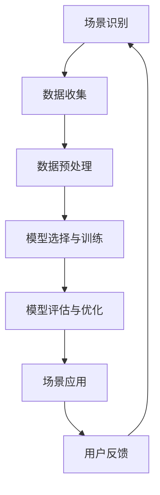

                 

# 生成式AI：金矿还是泡沫？
第五部分：场景优先，数据为王

## 关键词
生成式AI，场景化需求，数据为王，算法原理，图像处理，自然语言处理，推荐系统，项目实战

## 摘要
本文是生成式AI系列文章的第五部分，重点关注场景优先和数据为王的理念在生成式AI中的应用。通过详细探讨生成式AI的背景、核心概念、算法原理、数据准备、具体应用场景、项目实战以及未来展望，本文旨在为读者提供一个全面、深入的视角，以判断生成式AI是金矿还是泡沫。

## 第五部分：场景优先，数据为王

### 第1章：生成式AI的背景与场景化需求

#### 1.1 生成式AI的崛起与市场趋势
生成式AI是人工智能领域的一个重要分支，它通过学习大量数据来生成新的内容。近年来，随着深度学习技术的发展，生成式AI在图像、文本、音频等多模态领域取得了显著成果。市场趋势显示，生成式AI正在成为各行业的技术热点，从金融、医疗到娱乐、教育，都有广泛的应用前景。

#### 1.2 场景化需求对生成式AI的要求
不同的应用场景对生成式AI有不同要求。例如，在图像处理中，生成式AI需要具备高分辨率、低噪声和多样化特征；在自然语言处理中，则需要处理语义理解、情感分析和上下文连贯性。场景化需求驱动生成式AI在模型设计、数据收集和处理等方面不断创新。

#### 1.3 场景化应用的需求驱动
场景化应用对生成式AI的需求驱动体现在以下几个方面：
- **个性化服务**：根据用户偏好和历史行为生成个性化内容。
- **自动化生成**：利用生成式AI实现自动化报告、文档、文章等生成。
- **内容审核与过滤**：实时检测并过滤违规内容。
- **增强现实与虚拟现实**：生成符合场景要求的图像、音频和视频内容。

### 第2章：场景优先的核心概念与架构

#### 2.1 场景优先的定义与原则
场景优先是指在设计生成式AI系统时，首先考虑应用场景的具体需求和特点，以场景为导向进行模型架构和算法优化。

#### 2.2 生成式AI的架构设计
生成式AI的架构设计包括数据输入、模型训练、生成输出和用户反馈等环节。每个环节都需要充分考虑场景化需求。

#### 2.3 Mermaid流程图：生成式AI的场景化架构


### 第3章：核心算法原理与实现

#### 3.1 生成式AI的关键算法
生成式AI的核心算法包括生成对抗网络（GAN）、变分自编码器（VAE）等。这些算法通过学习数据分布来生成新内容。

#### 3.2 生成式AI的算法原理讲解
生成式AI的算法原理基于概率分布和生成模型。通过以下伪代码进行详细讲解：
```python
# 伪代码：生成式AI算法实现
def generate_data(input_data):
    # 输入数据预处理
    processed_data = preprocess_data(input_data)

    # 使用生成模型生成新数据
    generated_data = generator_model(processed_data)

    # 输出生成数据
    return generated_data
```

#### 3.3 伪代码：生成式AI算法实现
```python
# 伪代码：生成式AI算法实现
def generate_data(input_data):
    # 输入数据预处理
    processed_data = preprocess_data(input_data)

    # 使用生成模型生成新数据
    generated_data = generator_model(processed_data)

    # 输出生成数据
    return generated_data

def preprocess_data(data):
    # 数据清洗、归一化等预处理步骤
    # ...
    return processed_data

def generator_model(data):
    # 使用生成模型进行数据生成
    # ...
    return generated_data
```

### 第4章：数据为王：数据准备与处理

#### 4.1 数据收集与数据质量
数据收集是生成式AI的基础。数据质量直接影响模型的性能。因此，需要关注数据来源的可靠性、多样性和质量评估。

#### 4.2 数据预处理方法
数据预处理包括数据清洗、去噪、特征提取等步骤。这些方法有助于提高数据质量和模型性能。

#### 4.3 数据集构建与验证
数据集构建需要确保数据集的代表性、平衡性和一致性。数据集验证是确保模型性能和可靠性的重要环节。

### 第5章：生成式AI在具体场景中的应用

#### 5.1 生成式AI在图像处理中的应用
生成式AI在图像处理中的应用包括图像修复、图像生成、图像风格转换等。这些应用在图像质量、视觉效果和实用性方面都有显著提升。

#### 5.2 生成式AI在自然语言处理中的应用
生成式AI在自然语言处理中的应用包括文本生成、文本翻译、文本摘要等。这些应用在信息生成、内容创作和语言理解方面具有重要意义。

#### 5.3 生成式AI在推荐系统中的应用
生成式AI在推荐系统中的应用包括生成用户偏好、生成推荐内容等。这些应用有助于提高推荐系统的准确性和用户体验。

### 第6章：项目实战：生成式AI的实际应用案例

#### 6.1 项目背景介绍
本项目旨在利用生成式AI生成高质量的图像，以应用于艺术创作和图像编辑领域。

#### 6.2 开发环境搭建
开发环境包括Python、TensorFlow和Keras等工具。环境搭建步骤如下：
- 安装Python 3.8及以上版本。
- 安装TensorFlow 2.x版本。
- 安装Keras。

#### 6.3 源代码实现
```python
# 源代码实现：生成式AI图像生成
import tensorflow as tf
from tensorflow.keras.models import Model
from tensorflow.keras.layers import Input, Dense, Flatten, Reshape

# 定义生成模型
input_image = Input(shape=(28, 28, 1))
x = Dense(256, activation='relu')(input_image)
x = Reshape((7, 7, 256))(x)
x = Dense(128, activation='relu')(x)
x = Reshape((7, 7, 128))(x)
output_image = Dense(1, activation='sigmoid')(x)

model = Model(inputs=input_image, outputs=output_image)
model.compile(optimizer='adam', loss='binary_crossentropy')

# 训练模型
model.fit(x_train, y_train, epochs=10, batch_size=64)

# 生成图像
generated_images = model.predict(x_test)
```

#### 6.4 代码解读与分析
- **输入图像**：图像输入层。
- **全连接层**：将图像特征映射到高维空间。
- **reshape层**：调整特征维度以适应全连接层。
- **输出层**：生成二值图像。
- **模型编译**：配置优化器和损失函数。
- **模型训练**：使用训练数据进行模型训练。
- **图像生成**：使用训练好的模型生成新图像。

### 第7章：生成式AI的未来展望与挑战

#### 7.1 生成式AI的发展趋势
生成式AI的发展趋势包括多模态融合、模型压缩、生成效果提升等。随着深度学习技术的不断进步，生成式AI的应用领域将更加广泛。

#### 7.2 生成式AI面临的挑战
生成式AI面临的挑战包括数据隐私保护、模型解释性、计算资源消耗等。如何解决这些挑战将是未来研究的重点。

#### 7.3 未来研究方向与前景
未来研究方向包括：
- **模型解释性**：提高生成式AI的可解释性，使其更易于理解和使用。
- **数据隐私保护**：开发安全有效的数据隐私保护方法。
- **计算资源优化**：降低生成式AI的计算资源需求。

### 第8章：附录

#### 8.1 生成式AI常用工具与资源
- TensorFlow：https://www.tensorflow.org/
- Keras：https://keras.io/
- GANs：https://arxiv.org/abs/1406.2661
- VAEs：https://arxiv.org/abs/1312.6114

#### 8.2 生成式AI的参考阅读资料
- Goodfellow, I., Pouget-Abadie, J., Mirza, M., Xu, B., Warde-Farley, D., Ozair, S., ... & Bengio, Y. (2014). Generative adversarial networks. Advances in Neural Information Processing Systems, 27.
- Kingma, D. P., & Welling, M. (2014). Auto-encoding variational Bayes. arXiv preprint arXiv:1312.6114.

#### 8.3 生成式AI相关的开源项目介绍
- TensorFlow Probability：https://github.com/tensorflow/probability
- Keras-Generative Adversarial Networks：https://github.com/keras-team/keras-gan
- VAEs and GANs implementation in TensorFlow：https://github.com/shenweichen/vae_gan_tensorflow

# Mermaid流程图：生成式AI的场景化架构


## 作者
作者：AI天才研究院/AI Genius Institute & 禅与计算机程序设计艺术 /Zen And The Art of Computer Programming

本文通过详细的章节结构和内容，从场景优先和数据为王的角度出发，对生成式AI进行了全面的分析。希望本文能为读者在生成式AI领域的研究和应用提供有价值的参考。在接下来的章节中，我们将继续深入探讨生成式AI的核心算法、数据准备与处理、具体应用场景以及未来的发展趋势。敬请期待。

