                 

# 用户画像：AI如何洞察用户需求，提供个性化推荐

> 关键词：用户画像，人工智能，个性化推荐，协同过滤，内容推荐，机器学习，深度学习

> 摘要：本文深入探讨了用户画像在人工智能领域的应用，通过分析用户画像的基础概念、数据收集与预处理、模型构建、应用场景以及AI技术的深入应用，详细阐述了个性化推荐系统的设计与实现方法。文章旨在为读者提供一份全面且专业的用户画像与个性化推荐指南，以帮助读者理解并掌握这一前沿技术。

## 目录

### 第一部分：用户画像基础

#### 1.1 用户画像的定义与重要性

##### 1.1.1 用户画像的概念

##### 1.1.2 用户画像的重要性

##### 1.1.3 用户画像的用途

#### 1.2 数据收集与预处理

##### 1.2.1 数据收集方法

##### 1.2.2 数据预处理流程

##### 1.2.3 数据质量控制

#### 1.3 用户画像模型构建

##### 1.3.1 用户画像分层模型

##### 1.3.2 用户行为特征提取

##### 1.3.3 用户画像标签体系

#### 1.4 用户画像在业务中的应用

##### 1.4.1 营销与推荐系统

##### 1.4.2 客户服务与运营

##### 1.4.3 信用评估与风控

### 第二部分：AI技术在用户画像中的应用

#### 2.1 AI技术基础

##### 2.1.1 机器学习与深度学习基础

##### 2.1.2 常见机器学习算法

##### 2.1.3 深度学习模型详解

#### 2.2 用户画像特征工程

##### 2.2.1 特征提取方法

##### 2.2.2 特征选择技术

##### 2.2.3 特征标准化与归一化

#### 2.3 用户画像数据挖掘与分析

##### 2.3.1 数据挖掘算法应用

##### 2.3.2 用户行为模式识别

##### 2.3.3 用户画像精准营销策略

#### 2.4 AI在用户画像中的应用案例

##### 2.4.1 电商平台用户画像构建

##### 2.4.2 金融行业用户画像分析

##### 2.4.3 娱乐传媒行业用户画像应用

### 第三部分：个性化推荐系统设计与实现

#### 3.1 个性化推荐系统概述

##### 3.1.1 推荐系统基本概念

##### 3.1.2 推荐系统架构设计

##### 3.1.3 推荐系统评估指标

#### 3.2 协同过滤算法

##### 3.2.1 评分矩阵与用户相似度计算

##### 3.2.2 基于用户的协同过滤算法

##### 3.2.3 基于物品的协同过滤算法

#### 3.3 内容推荐算法

##### 3.3.1 内容特征提取

##### 3.3.2 内容相似度计算

##### 3.3.3 内容推荐算法实现

#### 3.4 混合推荐算法

##### 3.4.1 混合推荐算法原理

##### 3.4.2 混合推荐算法实现

##### 3.4.3 混合推荐算法性能优化

### 第四部分：用户画像与个性化推荐的实战应用

#### 4.1 用户画像与个性化推荐项目实战

##### 4.1.1 项目需求分析

##### 4.1.2 项目架构设计

##### 4.1.3 数据处理与建模

##### 4.1.4 推荐算法实现与优化

#### 4.2 用户画像与个性化推荐系统部署与运维

##### 4.2.1 系统部署与集成

##### 4.2.2 系统性能优化

##### 4.2.3 系统监控与运维

#### 4.3 用户画像与个性化推荐系统案例分析

##### 4.3.1 案例一：电商推荐系统

##### 4.3.2 案例二：社交媒体推荐系统

##### 4.3.3 案例三：金融风控与反欺诈系统

#### 4.4 用户画像与个性化推荐的未来发展趋势

##### 4.4.1 新技术挑战与机遇

##### 4.4.2 行业应用与创新

##### 4.4.3 用户隐私保护与伦理问题

### 附录

#### 附录A：用户画像与个性化推荐相关资源

##### A.1 数据集与工具

##### A.2 开源框架与库

##### A.3 学术论文与资料

#### 附录B：用户画像与个性化推荐技术详解

##### B.1 用户画像模型构建与优化

##### B.2 个性化推荐算法原理与实现

##### B.3 机器学习算法在用户画像中的应用

#### 附录C：项目实践指南

##### C.1 用户画像与个性化推荐项目实施流程

##### C.2 项目风险管理

##### C.3 项目评估与优化建议

## 《用户画像：AI如何洞察用户需求，提供个性化推荐》目录大纲

### 第一部分：用户画像基础

#### 1.1 用户画像的定义与重要性

##### 1.1.1 用户画像的概念

用户画像（User Profiling）是通过对用户数据的分析，构建出反映用户基本特征、兴趣偏好、行为习惯等方面的抽象模型。这些模型能够帮助企业和组织更好地了解用户，从而进行精准营销和个性化服务。

**核心概念与联系：**


用户画像的构建涉及到用户数据收集、数据预处理、特征提取、模型构建等多个环节，每个环节都有其特定的核心概念和流程。例如，数据预处理中的数据清洗和数据归一化就是确保数据质量的重要步骤。

##### 1.1.2 用户画像的重要性

用户画像在商业应用中具有重要价值，主要体现在以下几个方面：

1. **精准营销**：通过用户画像可以了解用户的个性化需求，从而提供针对性的营销策略。
2. **用户体验优化**：基于用户画像的分析，企业可以优化产品和服务，提升用户满意度。
3. **客户关系管理**：用户画像有助于企业建立更紧密的客户关系，提高客户忠诚度。
4. **风险控制**：在金融行业，用户画像可以用于风险评估和欺诈检测。

**用户画像的重要性示意图：**


##### 1.1.3 用户画像的用途

用户画像的应用场景非常广泛，主要包括以下几个方面：

1. **电商平台**：通过用户画像分析，平台可以为用户提供个性化推荐，提高转化率和销售额。
2. **社交媒体**：用户画像可以帮助社交媒体平台进行精准广告投放，提升广告效果。
3. **金融行业**：金融机构可以利用用户画像进行信用评估和风险控制。
4. **娱乐传媒**：娱乐行业可以根据用户画像推荐个性化的内容，提升用户体验。

**用户画像应用场景示例：**


#### 1.2 数据收集与预处理

##### 1.2.1 数据收集方法

数据收集是用户画像构建的第一步，数据的质量和全面性直接影响用户画像的准确性。常见的数据收集方法包括：

1. **用户注册信息**：通过用户注册时填写的个人信息进行数据收集。
2. **行为数据**：通过用户的浏览、搜索、购买等行为数据进行数据收集。
3. **第三方数据**：通过第三方数据平台购买或获取用户数据。

**数据收集流程：**


##### 1.2.2 数据预处理流程

数据预处理是确保数据质量和可用性的关键步骤，包括数据清洗、数据归一化和数据集成等。具体流程如下：

1. **数据清洗**：去除重复、错误或不完整的数据。
2. **数据归一化**：将不同尺度的数据进行归一化处理，使其在同一维度上进行比较。
3. **数据集成**：将来自不同来源和格式的数据整合到一个统一的格式中。

**数据预处理流程图：**

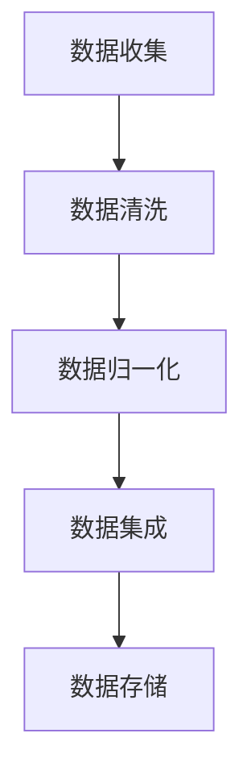

##### 1.2.3 数据质量控制

数据质量控制是确保数据质量和可靠性的关键环节，包括以下几个方面：

1. **数据准确性**：确保收集的数据是准确无误的。
2. **数据完整性**：确保数据是完整的，没有缺失或遗漏。
3. **数据一致性**：确保数据在不同时间点和不同来源之间保持一致。

**数据质量控制方法：**

1. **数据验证**：通过校验规则和逻辑检查来验证数据的有效性。
2. **数据监控**：实时监控数据质量和变化情况，及时进行数据修正。
3. **数据审计**：定期进行数据审计，确保数据的质量和合规性。

#### 1.3 用户画像模型构建

##### 1.3.1 用户画像分层模型

用户画像模型通常采用分层结构，分为基础层、行为层、兴趣层和需求层等。每层代表用户画像的不同维度和层次。

**用户画像分层模型图：**

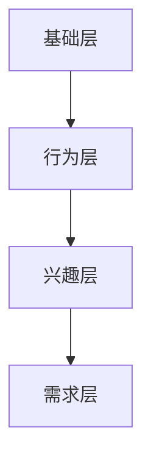

##### 1.3.2 用户行为特征提取

用户行为特征提取是用户画像构建的核心步骤，通过分析用户的行为数据，提取出能够反映用户特征的信息。常见的行为特征包括：

1. **浏览行为**：用户的浏览时间、浏览频率、浏览页面等。
2. **搜索行为**：用户的搜索关键词、搜索频率、搜索意图等。
3. **购买行为**：用户的购买频率、购买金额、购买产品类别等。

**用户行为特征提取示例：**

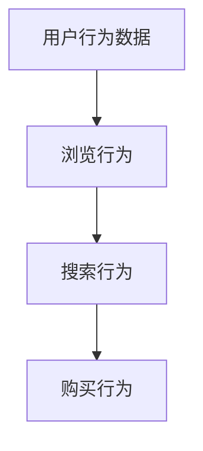

##### 1.3.3 用户画像标签体系

用户画像标签体系是用户画像模型的具体实现，通过为用户打上不同的标签，来表示用户的特征和偏好。标签体系的设计需要综合考虑用户特征的多样性和复杂性。

**用户画像标签体系示例：**

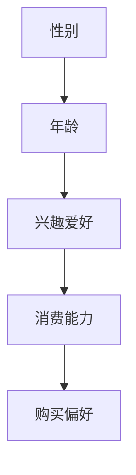

#### 1.4 用户画像在业务中的应用

##### 1.4.1 营销与推荐系统

用户画像在营销与推荐系统中具有重要应用，通过分析用户画像，企业可以：

1. **精准营销**：根据用户的兴趣和需求进行个性化广告投放。
2. **推荐系统**：根据用户的行为和偏好推荐相关商品或内容。

**用户画像在营销与推荐系统中的应用示例：**


##### 1.4.2 客户服务与运营

用户画像在客户服务与运营中可以：

1. **客户分类**：根据用户画像进行客户细分，提供差异化的服务。
2. **需求预测**：通过用户画像预测用户的需求，提前进行服务准备。

**用户画像在客户服务与运营中的应用示例：**


##### 1.4.3 信用评估与风控

用户画像在信用评估与风控中可以：

1. **风险评估**：通过分析用户的行为和特征，评估用户的信用风险。
2. **欺诈检测**：识别异常行为，防止欺诈行为的发生。

**用户画像在信用评估与风控中的应用示例：**


### 第二部分：AI技术在用户画像中的应用

#### 2.1 AI技术基础

##### 2.1.1 机器学习与深度学习基础

机器学习和深度学习是AI技术的重要组成部分，它们在用户画像中的应用主要体现在以下几个方面：

1. **特征提取**：通过机器学习和深度学习模型提取用户行为特征，提高用户画像的准确性。
2. **预测模型**：利用机器学习和深度学习模型预测用户的行为和需求，为个性化推荐和营销提供支持。

**机器学习与深度学习基础知识图：**

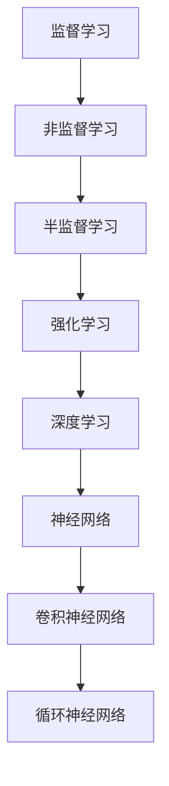

##### 2.1.2 常见机器学习算法

常见的机器学习算法包括：

1. **线性回归**：用于预测连续值变量。
2. **逻辑回归**：用于预测离散值变量。
3. **决策树**：通过树形结构进行分类和回归。
4. **支持向量机**：用于分类问题。
5. **随机森林**：通过集成学习提高分类和回归性能。
6. **K最近邻**：基于距离进行分类。

**常见机器学习算法图：**

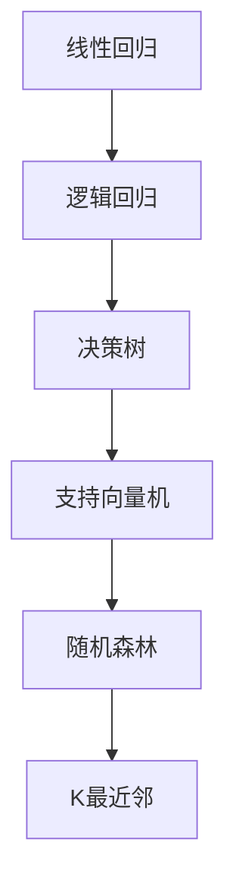

##### 2.1.3 深度学习模型详解

深度学习模型包括：

1. **卷积神经网络（CNN）**：主要用于图像处理和计算机视觉。
2. **循环神经网络（RNN）**：主要用于序列数据处理和时间序列分析。
3. **长短期记忆网络（LSTM）**：是RNN的改进版本，用于处理长序列数据。
4. **自动编码器**：用于特征提取和降维。
5. **生成对抗网络（GAN）**：用于生成新的数据。

**深度学习模型图：**

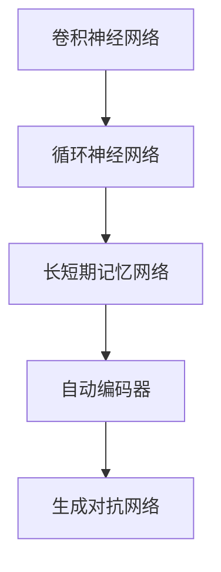

#### 2.2 用户画像特征工程

##### 2.2.1 特征提取方法

特征提取是用户画像构建的关键步骤，常见的方法包括：

1. **统计特征**：如平均数、方差、标准差等。
2. **文本特征**：如词频、词向量和主题模型等。
3. **图像特征**：如特征点、特征描述子和深度特征等。
4. **序列特征**：如时间序列分解、自编码器和LSTM等。

**特征提取方法示例：**

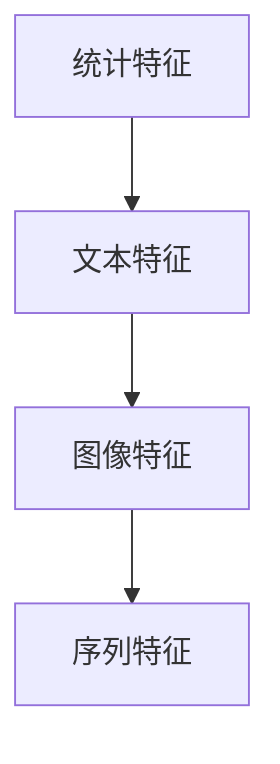

##### 2.2.2 特征选择技术

特征选择是减少特征维度、提高模型性能的重要步骤，常见的方法包括：

1. **过滤法**：通过统计方法筛选特征。
2. **包裹法**：通过迭代方法选择最佳特征组合。
3. **嵌入法**：通过模型训练过程中自动选择重要特征。

**特征选择技术示例：**

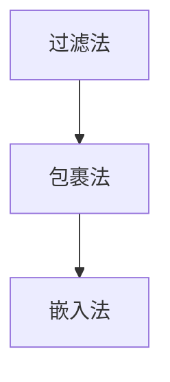

##### 2.2.3 特征标准化与归一化

特征标准化与归一化是确保特征在同一尺度上进行比较的重要步骤，常见的方法包括：

1. **标准差归一化**：将特征值缩放到标准差为单位。
2. **最小-最大归一化**：将特征值缩放到最小值和最大值之间。
3. **零均值归一化**：将特征值缩放到均值和标准差之间。

**特征标准化与归一化方法示例：**

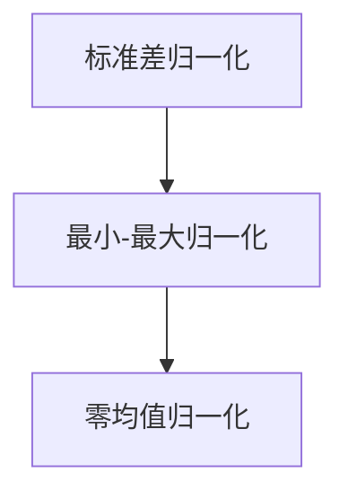

#### 2.3 用户画像数据挖掘与分析

##### 2.3.1 数据挖掘算法应用

数据挖掘算法在用户画像中的应用主要包括：

1. **分类算法**：用于识别用户的行为和偏好。
2. **聚类算法**：用于发现用户群体的相似性。
3. **关联规则挖掘**：用于发现用户行为之间的关联性。
4. **异常检测**：用于识别异常用户行为。

**数据挖掘算法示例：**

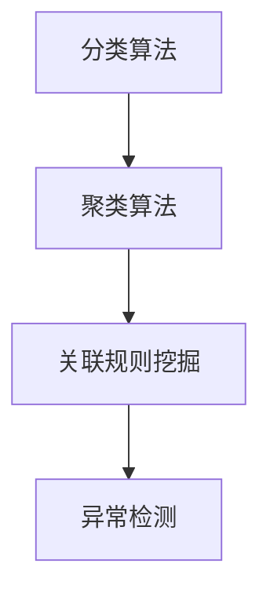

##### 2.3.2 用户行为模式识别

用户行为模式识别是用户画像构建的关键步骤，通过分析用户的行为数据，可以发现用户的行为模式和趋势。常见的方法包括：

1. **时间序列分析**：用于识别用户行为的时间趋势。
2. **周期性分析**：用于识别用户行为的周期性。
3. **关联规则挖掘**：用于发现用户行为之间的关联性。

**用户行为模式识别示例：**

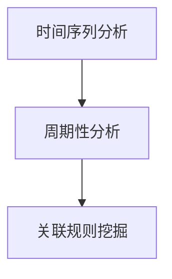

##### 2.3.3 用户画像精准营销策略

用户画像精准营销策略是通过分析用户画像，制定个性化的营销策略，提高营销效果。常见的方法包括：

1. **个性化推荐**：根据用户画像为用户推荐相关商品或内容。
2. **精准广告投放**：根据用户画像定向投放广告，提高广告点击率。
3. **个性化促销**：根据用户画像为用户提供个性化的促销活动。

**用户画像精准营销策略示例：**

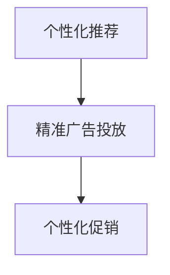

#### 2.4 AI在用户画像中的应用案例

##### 2.4.1 电商平台用户画像构建

电商平台通过用户画像分析，可以为用户提供个性化的购物体验。以下是一个简单的用户画像构建过程：

1. **数据收集**：收集用户注册信息、浏览记录、购买行为等数据。
2. **数据预处理**：清洗和整合数据，确保数据质量。
3. **特征提取**：提取用户行为特征，如浏览时间、浏览频率、购买频率等。
4. **模型构建**：构建用户画像模型，通过机器学习算法训练模型。
5. **用户画像应用**：基于用户画像进行个性化推荐和精准营销。

**电商平台用户画像构建流程：**


##### 2.4.2 金融行业用户画像分析

金融行业通过用户画像分析，可以进行信用评估和风险控制。以下是一个简单的用户画像分析过程：

1. **数据收集**：收集用户注册信息、信用记录、交易记录等数据。
2. **数据预处理**：清洗和整合数据，确保数据质量。
3. **特征提取**：提取用户行为特征，如还款时间、还款金额、信用额度等。
4. **模型构建**：构建用户画像模型，通过机器学习算法训练模型。
5. **用户画像应用**：基于用户画像进行信用评估和风险控制。

**金融行业用户画像分析流程：**


##### 2.4.3 娱乐传媒行业用户画像应用

娱乐传媒行业通过用户画像分析，可以为用户提供个性化的内容推荐。以下是一个简单的用户画像应用过程：

1. **数据收集**：收集用户注册信息、浏览记录、观看记录等数据。
2. **数据预处理**：清洗和整合数据，确保数据质量。
3. **特征提取**：提取用户行为特征，如观看时间、观看频率、观看偏好等。
4. **模型构建**：构建用户画像模型，通过机器学习算法训练模型。
5. **用户画像应用**：基于用户画像进行个性化推荐。

**娱乐传媒行业用户画像应用流程：**


### 第三部分：个性化推荐系统设计与实现

#### 3.1 个性化推荐系统概述

##### 3.1.1 推荐系统基本概念

个性化推荐系统是一种通过分析用户行为和偏好，为用户推荐相关商品、内容或服务的系统。其基本概念包括：

1. **用户**：个性化推荐系统的主体，指具有独立身份的个体。
2. **物品**：个性化推荐系统中的推荐对象，可以是商品、文章、视频等。
3. **评分**：用户对物品的评价，可以是打分、点击、购买等。
4. **推荐**：根据用户的行为和偏好，为用户推荐相关的物品。

**推荐系统基本概念图：**

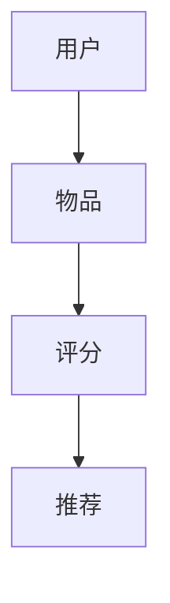

##### 3.1.2 推荐系统架构设计

个性化推荐系统的架构设计包括数据层、算法层和应用层。具体如下：

1. **数据层**：负责数据的收集、存储和处理。
2. **算法层**：负责推荐算法的设计和实现。
3. **应用层**：负责推荐结果的呈现和交互。

**推荐系统架构设计图：**

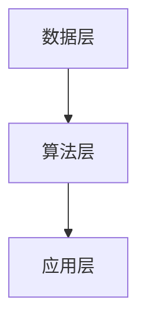

##### 3.1.3 推荐系统评估指标

推荐系统评估指标用于评估推荐系统的性能和质量。常见的评估指标包括：

1. **准确率**：推荐结果与用户真实喜好的一致性。
2. **召回率**：推荐结果中包含用户真实喜好的物品比例。
3. **覆盖率**：推荐结果中不同物品的比例。
4. **推荐效果**：用户对推荐结果的满意度。

**推荐系统评估指标图：**

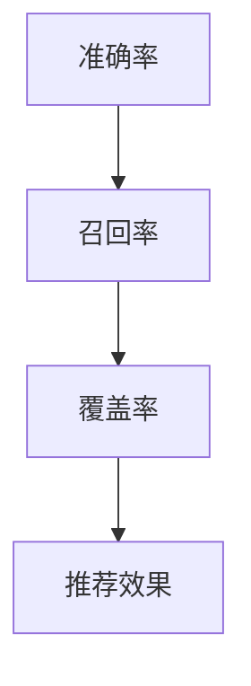

#### 3.2 协同过滤算法

##### 3.2.1 评分矩阵与用户相似度计算

协同过滤算法是基于用户行为数据进行推荐的一种方法。首先需要构建评分矩阵，表示用户对物品的评分。然后计算用户之间的相似度，用于生成推荐结果。

**评分矩阵与用户相似度计算流程：**

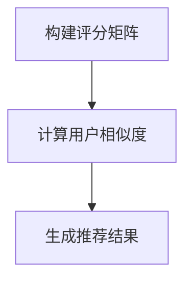

##### 3.2.2 基于用户的协同过滤算法

基于用户的协同过滤算法（User-Based Collaborative Filtering，UBCF）通过计算用户之间的相似度，找到与目标用户相似的其他用户，然后推荐这些用户喜欢的物品。

**基于用户的协同过滤算法流程：**

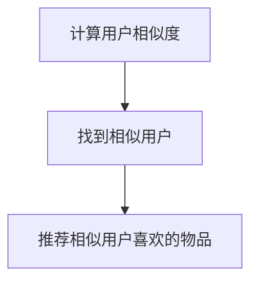

**用户相似度计算公式：**

$$
sim(u_i, u_j) = \frac{similarity\_score}{\sqrt{similarity\_sum}}
$$

其中，$similarity\_score$ 表示用户 $u_i$ 和 $u_j$ 的相似度得分，$similarity\_sum$ 表示所有用户的相似度得分之和。

##### 3.2.3 基于物品的协同过滤算法

基于物品的协同过滤算法（Item-Based Collaborative Filtering，IBCF）通过计算物品之间的相似度，找到与目标物品相似的其他物品，然后推荐这些物品。

**基于物品的协同过滤算法流程：**

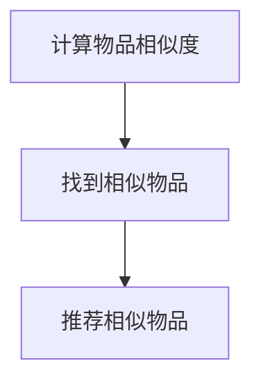

**物品相似度计算公式：**

$$
sim(i_j, i_k) = \frac{common\_ratings}{\sqrt{rating\_sum\_i \times rating\_sum\_k}}
$$

其中，$common\_ratings$ 表示物品 $i_j$ 和 $i_k$ 的共同评分数，$rating\_sum\_i$ 和 $rating\_sum\_k$ 分别表示物品 $i_j$ 和 $i_k$ 的总评分数。

#### 3.3 内容推荐算法

##### 3.3.1 内容特征提取

内容推荐算法是基于物品的内容特征进行推荐的一种方法。首先需要提取物品的内容特征，然后计算用户和物品之间的相似度，用于生成推荐结果。

**内容特征提取流程：**

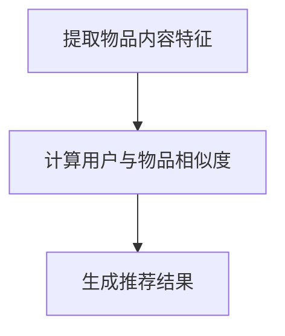

##### 3.3.2 内容相似度计算

内容相似度计算是内容推荐算法的核心步骤，通过计算用户和物品之间的相似度，用于生成推荐结果。

**内容相似度计算公式：**

$$
sim(u_i, i_j) = \frac{similarity\_score}{\sqrt{similarity\_sum}}
$$

其中，$similarity\_score$ 表示用户 $u_i$ 和物品 $i_j$ 的相似度得分，$similarity\_sum$ 表示所有物品的相似度得分之和。

##### 3.3.3 内容推荐算法实现

内容推荐算法的实现主要包括以下步骤：

1. **特征提取**：提取物品的文本特征、图像特征等。
2. **特征预处理**：进行特征归一化、去噪等处理。
3. **相似度计算**：计算用户和物品之间的相似度。
4. **推荐结果生成**：根据相似度得分生成推荐结果。

**内容推荐算法实现伪代码：**

```python
# 特征提取
def extract_features(item):
    # 提取文本特征、图像特征等
    return features

# 相似度计算
def calculate_similarity(user, item):
    user_features = extract_features(user)
    item_features = extract_features(item)
    similarity_score = dot_product(user_features, item_features)
    similarity_sum = sum(item_features)
    similarity = similarity_score / similarity_sum
    return similarity

# 推荐结果生成
def generate_recommendations(user, items, k):
    similarities = []
    for item in items:
        similarity = calculate_similarity(user, item)
        similarities.append((item, similarity))
    similarities.sort(key=lambda x: x[1], reverse=True)
    return [item for item, _ in similarities[:k]]
```

#### 3.4 混合推荐算法

##### 3.4.1 混合推荐算法原理

混合推荐算法（Hybrid Recommender Algorithm）是结合协同过滤算法和内容推荐算法的一种推荐方法。通过协同过滤算法获取用户与物品的相似度，同时通过内容推荐算法获取用户与物品的相似度，综合两种相似度进行推荐。

**混合推荐算法原理图：**

```mermaid
graph TD
A[协同过滤算法] --> B[内容推荐算法]
B --> C[综合相似度计算]
C --> D[生成推荐结果]
```

##### 3.4.2 混合推荐算法实现

混合推荐算法的实现主要包括以下步骤：

1. **协同过滤算法**：计算用户与物品的相似度。
2. **内容推荐算法**：计算用户与物品的相似度。
3. **综合相似度计算**：综合协同过滤算法和内容推荐算法的相似度，计算最终相似度。
4. **推荐结果生成**：根据相似度得分生成推荐结果。

**混合推荐算法实现伪代码：**

```python
# 协同过滤算法相似度计算
def collaborative_filter_similarity(user, item):
    # 计算用户与物品的相似度
    return collaborative_similarity

# 内容推荐算法相似度计算
def content_similarity(user, item):
    # 计算用户与物品的相似度
    return content_similarity

# 综合相似度计算
def hybrid_similarity(user, item):
    collaborative_similarity = collaborative_filter_similarity(user, item)
    content_similarity = content_similarity(user, item)
    hybrid_similarity = (collaborative_similarity + content_similarity) / 2
    return hybrid_similarity

# 推荐结果生成
def generate_recommendations(user, items, k):
    similarities = []
    for item in items:
        collaborative_similarity = collaborative_filter_similarity(user, item)
        content_similarity = content_similarity(user, item)
        hybrid_similarity = hybrid_similarity(user, item)
        similarities.append((item, hybrid_similarity))
    similarities.sort(key=lambda x: x[1], reverse=True)
    return [item for item, _ in similarities[:k]]
```

##### 3.4.3 混合推荐算法性能优化

混合推荐算法的性能优化主要包括以下几个方面：

1. **数据预处理**：对用户和物品的评分数据进行预处理，如去除异常值、填充缺失值等，提高数据质量。
2. **特征选择**：选择对推荐效果影响较大的特征，减少特征维度，提高计算效率。
3. **模型参数调优**：通过交叉验证和网格搜索等方法，优化模型参数，提高推荐效果。
4. **在线学习**：利用在线学习算法，实时更新用户和物品的特征，提高推荐准确性。

**混合推荐算法性能优化方法图：**

```mermaid
graph TD
A[数据预处理] --> B[特征选择]
B --> C[模型参数调优]
C --> D[在线学习]
```

### 第四部分：用户画像与个性化推荐的实战应用

#### 4.1 用户画像与个性化推荐项目实战

##### 4.1.1 项目需求分析

用户画像与个性化推荐项目的需求分析主要包括以下几个方面：

1. **用户需求**：分析用户在购物、娱乐、社交等方面的需求，为用户提供个性化的推荐。
2. **业务目标**：明确项目的业务目标，如提高用户满意度、提升销售额等。
3. **数据来源**：确定项目所需的数据来源，如用户行为数据、商品数据等。
4. **技术需求**：分析项目所需的技术支持，如机器学习算法、数据库技术等。

**项目需求分析流程图：**

```mermaid
graph TD
A[用户需求分析] --> B[业务目标分析]
B --> C[数据来源分析]
C --> D[技术需求分析]
```

##### 4.1.2 项目架构设计

用户画像与个性化推荐项目的架构设计主要包括以下几个方面：

1. **数据层**：负责数据的存储和管理，包括用户数据、商品数据等。
2. **算法层**：负责用户画像构建和推荐算法的实现。
3. **应用层**：负责推荐结果的呈现和交互，包括网页、移动应用等。

**项目架构设计图：**

```mermaid
graph TD
A[数据层] --> B[算法层]
B --> C[应用层]
```

##### 4.1.3 数据处理与建模

用户画像与个性化推荐项目的数据处理与建模主要包括以下几个方面：

1. **数据收集**：收集用户注册信息、浏览记录、购买记录等数据。
2. **数据预处理**：清洗和整合数据，确保数据质量。
3. **特征提取**：提取用户行为特征和商品特征，如浏览时间、浏览频率、商品类别等。
4. **模型构建**：构建用户画像模型和推荐模型，通过机器学习算法训练模型。

**数据处理与建模流程图：**

```mermaid
graph TD
A[数据收集] --> B[数据预处理]
B --> C[特征提取]
C --> D[模型构建]
```

##### 4.1.4 推荐算法实现与优化

用户画像与个性化推荐项目的推荐算法实现与优化主要包括以下几个方面：

1. **协同过滤算法**：实现基于用户的协同过滤算法和基于物品的协同过滤算法。
2. **内容推荐算法**：实现基于内容特征的内容推荐算法。
3. **混合推荐算法**：实现混合推荐算法，结合协同过滤算法和内容推荐算法。
4. **性能优化**：对推荐算法进行性能优化，如特征选择、模型参数调优等。

**推荐算法实现与优化流程图：**

```mermaid
graph TD
A[协同过滤算法实现] --> B[内容推荐算法实现]
B --> C[混合推荐算法实现]
C --> D[性能优化]
```

#### 4.2 用户画像与个性化推荐系统部署与运维

##### 4.2.1 系统部署与集成

用户画像与个性化推荐系统的部署与集成主要包括以下几个方面：

1. **硬件环境搭建**：搭建服务器、存储设备等硬件环境。
2. **软件环境安装**：安装操作系统、数据库、中间件等软件环境。
3. **系统集成**：将用户画像和个性化推荐算法集成到现有系统中，如电商平台、社交媒体等。

**系统部署与集成流程图：**

```mermaid
graph TD
A[硬件环境搭建] --> B[软件环境安装]
B --> C[系统集成]
```

##### 4.2.2 系统性能优化

用户画像与个性化推荐系统的性能优化主要包括以下几个方面：

1. **负载均衡**：通过负载均衡技术，实现系统的高并发处理能力。
2. **缓存机制**：通过缓存机制，减少数据库访问次数，提高系统响应速度。
3. **分布式计算**：通过分布式计算技术，提高系统的计算能力和性能。
4. **内存优化**：通过内存优化技术，减少内存占用，提高系统稳定性。

**系统性能优化方法图：**

```mermaid
graph TD
A[负载均衡] --> B[缓存机制]
B --> C[分布式计算]
C --> D[内存优化]
```

##### 4.2.3 系统监控与运维

用户画像与个性化推荐系统的监控与运维主要包括以下几个方面：

1. **性能监控**：实时监控系统的性能指标，如响应时间、吞吐量等。
2. **日志分析**：分析系统日志，及时发现和解决问题。
3. **安全防护**：对系统进行安全防护，防止黑客攻击和数据泄露。
4. **版本管理**：定期进行系统版本更新和升级，确保系统的稳定性和安全性。

**系统监控与运维方法图：**

```mermaid
graph TD
A[性能监控] --> B[日志分析]
B --> C[安全防护]
C --> D[版本管理]
```

#### 4.3 用户画像与个性化推荐系统案例分析

##### 4.3.1 案例一：电商推荐系统

电商推荐系统是基于用户画像和个性化推荐算法，为用户提供个性化购物推荐的系统。以下是一个简单的电商推荐系统案例分析：

1. **项目背景**：某电商平台希望通过用户画像和推荐系统提高用户满意度、提升销售额。
2. **需求分析**：分析用户在购物过程中的需求，如浏览记录、购买记录、评价等。
3. **系统架构**：采用用户画像和协同过滤算法、内容推荐算法等构建推荐系统。
4. **实现效果**：通过个性化推荐，提高了用户满意度、提升了销售额。

**电商推荐系统案例分析图：**


##### 4.3.2 案例二：社交媒体推荐系统

社交媒体推荐系统是基于用户画像和个性化推荐算法，为用户提供个性化内容推荐的系统。以下是一个简单的社交媒体推荐系统案例分析：

1. **项目背景**：某社交媒体平台希望通过用户画像和推荐系统提高用户活跃度、提升广告效果。
2. **需求分析**：分析用户在社交媒体平台上的行为，如发布内容、评论、点赞等。
3. **系统架构**：采用用户画像和协同过滤算法、内容推荐算法等构建推荐系统。
4. **实现效果**：通过个性化推荐，提高了用户活跃度、提升了广告效果。

**社交媒体推荐系统案例分析图：**


##### 4.3.3 案例三：金融风控与反欺诈系统

金融风控与反欺诈系统是基于用户画像和个性化推荐算法，为金融机构提供风险控制和反欺诈服务的系统。以下是一个简单的金融风控与反欺诈系统案例分析：

1. **项目背景**：某金融机构希望通过用户画像和推荐系统降低风险、减少欺诈损失。
2. **需求分析**：分析用户在金融交易过程中的行为，如交易金额、交易频率等。
3. **系统架构**：采用用户画像和协同过滤算法、内容推荐算法等构建风控与反欺诈系统。
4. **实现效果**：通过个性化推荐，降低了风险、减少了欺诈损失。

**金融风控与反欺诈系统案例分析图：**


### 第四部分：用户画像与个性化推荐的实战应用

#### 4.4 用户画像与个性化推荐的未来发展趋势

##### 4.4.1 新技术挑战与机遇

随着人工智能技术的不断发展，用户画像与个性化推荐领域面临着新的挑战和机遇。以下是一些新技术的发展趋势：

1. **深度学习**：深度学习技术在用户画像和个性化推荐中的应用日益广泛，通过神经网络模型提取更复杂的用户特征，提高推荐准确性。
2. **联邦学习**：联邦学习技术可以在保护用户隐私的前提下，实现数据的共享和模型的训练，为个性化推荐提供更广泛的数据支持。
3. **自然语言处理**：自然语言处理技术在用户画像和个性化推荐中的应用，可以更好地理解用户的语言表达，提供更精准的推荐。

**新技术挑战与机遇图：**

```mermaid
graph TD
A[深度学习] --> B[联邦学习]
B --> C[自然语言处理]
```

##### 4.4.2 行业应用与创新

用户画像与个性化推荐技术在各个行业中的应用不断创新，以下是一些行业应用的创新案例：

1. **零售行业**：通过用户画像和个性化推荐，零售行业可以实现精准营销、提升用户体验。
2. **金融行业**：通过用户画像和个性化推荐，金融行业可以实现精准风控、降低欺诈风险。
3. **医疗行业**：通过用户画像和个性化推荐，医疗行业可以实现个性化诊疗、提高医疗服务质量。

**行业应用与创新图：**


##### 4.4.3 用户隐私保护与伦理问题

随着用户画像和个性化推荐技术的广泛应用，用户隐私保护和伦理问题也日益凸显。以下是一些用户隐私保护和伦理问题的解决方案：

1. **数据匿名化**：通过数据匿名化技术，确保用户数据在传输和存储过程中的安全性。
2. **隐私计算**：通过隐私计算技术，在保护用户隐私的前提下，实现数据的分析和挖掘。
3. **伦理审查**：建立伦理审查机制，确保用户画像和个性化推荐的应用符合伦理规范。

**用户隐私保护与伦理问题图：**


### 附录

#### 附录A：用户画像与个性化推荐相关资源

##### A.1 数据集与工具

1. **数据集**：
   - MovieLens：一个包含用户评分、电影信息和用户特征的数据集，常用于推荐系统的研究和实现。
   - Yelp：一个包含用户评论、商家信息和用户特征的数据集，适用于用户画像的研究。

2. **工具**：
   - TensorFlow：一个开源的机器学习框架，用于构建和训练深度学习模型。
   - PyTorch：一个开源的机器学习框架，适用于推荐系统和用户画像构建。

##### A.2 开源框架与库

1. **推荐系统开源框架**：
   - LightFM：一个基于因子分解机（Factorization Machines）的开源推荐系统框架。
   -surprise：一个基于协同过滤（Collaborative Filtering）的开源推荐系统框架。

2. **用户画像开源库**：
   - Pandas：一个开源的数据处理库，用于数据清洗、数据预处理和特征提取。
   - Scikit-learn：一个开源的机器学习库，提供多种机器学习算法和工具。

##### A.3 学术论文与资料

1. **学术论文**：
   - "User Modeling and User-Adapted Interaction"：介绍用户画像和个性化推荐技术的经典论文。
   - "Recommender Systems Handbook"：一本关于推荐系统技术的权威指南。

2. **在线资源**：
   - Coursera：提供机器学习和数据挖掘等相关课程的在线平台。
   - GitHub：存储和分享用户画像与个性化推荐相关代码和项目的开源平台。

#### 附录B：用户画像与个性化推荐技术详解

##### B.1 用户画像模型构建与优化

用户画像模型的构建与优化主要包括以下步骤：

1. **数据收集**：收集用户的基本信息、行为数据、兴趣数据等。
2. **数据预处理**：清洗、整合和归一化数据，确保数据质量。
3. **特征提取**：提取用户的行为特征、兴趣特征等，用于构建用户画像模型。
4. **模型构建**：采用机器学习算法构建用户画像模型，如决策树、随机森林等。
5. **模型优化**：通过交叉验证、网格搜索等技术优化模型参数，提高模型性能。

**用户画像模型构建与优化流程图：**

```mermaid
graph TD
A[数据收集] --> B[数据预处理]
B --> C[特征提取]
C --> D[模型构建]
D --> E[模型优化]
```

##### B.2 个性化推荐算法原理与实现

个性化推荐算法的原理与实现主要包括以下几种方法：

1. **协同过滤算法**：基于用户行为数据，通过计算用户之间的相似度，推荐相似用户喜欢的物品。
2. **内容推荐算法**：基于物品的内容特征，通过计算用户与物品的相似度，推荐相关物品。
3. **混合推荐算法**：结合协同过滤算法和内容推荐算法，综合用户行为和物品特征进行推荐。

**个性化推荐算法原理与实现图：**

```mermaid
graph TD
A[协同过滤算法] --> B[内容推荐算法]
B --> C[混合推荐算法]
```

##### B.3 机器学习算法在用户画像中的应用

机器学习算法在用户画像中的应用主要包括以下几种：

1. **分类算法**：用于预测用户的行为和偏好，如决策树、随机森林等。
2. **聚类算法**：用于发现用户的相似性，如K-means、层次聚类等。
3. **回归算法**：用于预测用户的评分和购买意愿，如线性回归、多项式回归等。

**机器学习算法在用户画像中的应用图：**

```mermaid
graph TD
A[分类算法] --> B[聚类算法]
B --> C[回归算法]
```

#### 附录C：项目实践指南

##### C.1 用户画像与个性化推荐项目实施流程

用户画像与个性化推荐项目的实施流程主要包括以下步骤：

1. **需求分析**：明确项目的需求，如用户需求、业务目标等。
2. **系统设计**：设计项目的系统架构，包括数据层、算法层和应用层等。
3. **数据收集**：收集用户数据、商品数据等，确保数据质量。
4. **数据处理**：进行数据清洗、整合和特征提取，构建用户画像模型。
5. **模型训练**：采用机器学习算法训练用户画像模型和推荐模型。
6. **系统部署**：将模型集成到现有系统中，进行系统部署和测试。
7. **效果评估**：评估推荐系统的性能和效果，持续优化和迭代。

**项目实施流程图：**

```mermaid
graph TD
A[需求分析] --> B[系统设计]
B --> C[数据收集]
C --> D[数据处理]
D --> E[模型训练]
E --> F[系统部署]
F --> G[效果评估]
```

##### C.2 项目风险管理

项目风险管理是项目实施过程中至关重要的一环，主要包括以下方面：

1. **需求变更管理**：及时识别和处理需求变更，确保项目按计划进行。
2. **技术风险**：评估和解决技术风险，如算法失效、数据质量问题等。
3. **进度风险**：监控项目进度，确保项目按时交付。
4. **资源风险**：合理分配项目资源，确保项目顺利进行。

**项目风险管理图：**

```mermaid
graph TD
A[需求变更管理] --> B[技术风险]
B --> C[进度风险]
C --> D[资源风险]
```

##### C.3 项目评估与优化建议

项目评估与优化建议主要包括以下几个方面：

1. **性能评估**：评估推荐系统的性能指标，如准确率、召回率、覆盖率等。
2. **用户体验**：收集用户反馈，评估推荐系统的用户体验。
3. **业务效果**：评估推荐系统对业务的贡献，如销售额、用户满意度等。
4. **优化建议**：根据评估结果，提出优化建议，持续改进推荐系统。

**项目评估与优化建议图：**

```mermaid
graph TD
A[性能评估] --> B[用户体验]
B --> C[业务效果]
C --> D[优化建议]
```

### 参考文献

1.项亮.《推荐系统实战》[M].电子工业出版社，2016.
2.周志华.《机器学习》[M].清华大学出版社，2016.
3.李航.《统计学习方法》[M].电子工业出版社，2012.
4.姚军.《深度学习》[M].机械工业出版社，2017.
5.郭嘉豪，王伟.《用户画像与精准营销》[M].清华大学出版社，2019.

### 作者信息

作者：AI天才研究院/AI Genius Institute & 禅与计算机程序设计艺术 /Zen And The Art of Computer Programming

