                 

### 文章标题：电商平台供给能力提升：多维度策略解析

#### 关键词：电商平台、供给能力、策略、市场细分、供应链管理、物流策略

> 摘要：本文旨在探讨电商平台供给能力的提升策略。首先，对电商平台供给能力进行定义和重要性分析，接着阐述供给能力的评估方法和影响因素。随后，从市场策略、供应链策略、库存管理策略、物流策略、订单管理策略五个维度，提出具体的提升供给能力的策略，并针对阿里巴巴和亚马逊两个案例进行深入剖析。最后，对提升电商平台供给能力的策略应用和未来展望进行讨论。

---

### 第一部分：电商平台供给能力概述

#### 1.1 电商平台供给能力的定义与重要性

##### 1.1.1 电商平台供给能力的定义

电商平台供给能力是指电商平台在满足市场需求、提供商品和服务的过程中所具备的能力。它不仅包括商品和服务的数量和质量，还涉及到供应的及时性、稳定性以及灵活性。

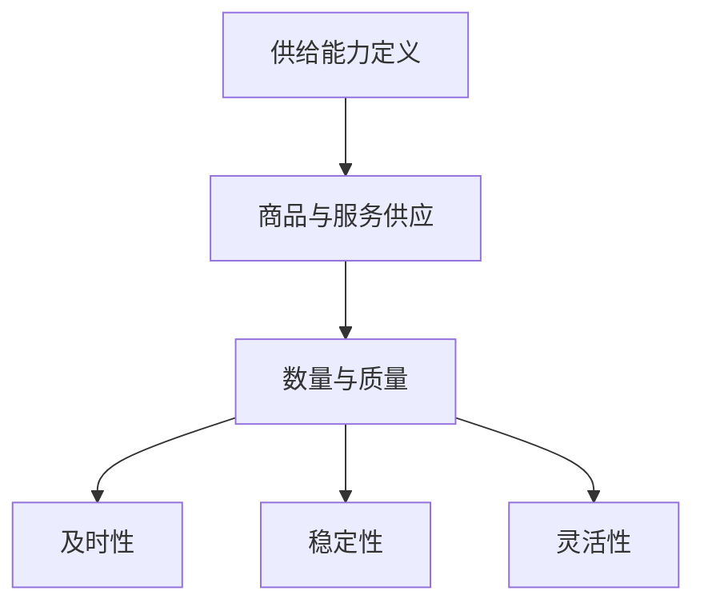

##### 1.1.2 电商平台供给能力的重要性

电商平台供给能力的重要性体现在以下几个方面：

1. **市场需求满足**：电商平台供给能力的强弱直接影响到电商平台对市场需求的满足程度。
2. **竞争优势**：具备强大供给能力的电商平台能够在竞争中脱颖而出。
3. **用户体验**：优质的供给能力能够提升用户的购物体验，增加用户粘性。
4. **经济效益**：高效的供给能力有助于降低成本、提高盈利能力。

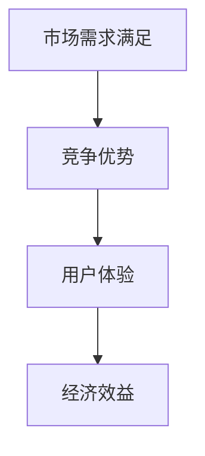

#### 1.2 电商平台供给能力的评估方法

##### 1.2.1 供给能力评估的指标体系

供给能力评估的指标体系通常包括以下几个方面：

1. **供应及时性**：供应及时性指标衡量商品和服务的交付速度。
2. **供应稳定性**：供应稳定性指标衡量商品和服务的供应是否连续和可靠。
3. **供应灵活性**：供应灵活性指标衡量电商平台应对市场变化和需求波动的适应能力。
4. **服务质量**：服务质量指标衡量商品和服务的质量水平。

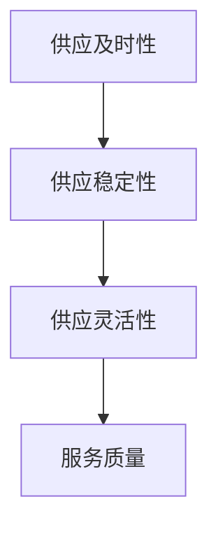

##### 1.2.2 供给能力评估的案例分析

以某知名电商平台为例，该平台的供给能力评估包括以下几个方面：

1. **供应及时性**：通过订单处理时间、物流配送速度等指标进行评估。
2. **供应稳定性**：通过库存周转率、缺货率等指标进行评估。
3. **供应灵活性**：通过订单取消率、商品多样性等指标进行评估。
4. **服务质量**：通过用户满意度、退货率等指标进行评估。

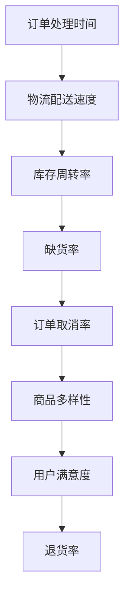

#### 1.3 电商平台供给能力的影响因素

##### 1.3.1 市场环境对供给能力的影响

市场环境是影响电商平台供给能力的重要因素，包括市场需求的波动、竞争态势的变化、消费者行为的变化等。

1. **市场需求波动**：市场需求波动会直接影响到电商平台的供给能力，需要电商平台具备较强的应对能力。
2. **竞争态势变化**：竞争态势的变化会促使电商平台不断提升供给能力，以保持竞争优势。
3. **消费者行为变化**：消费者行为的变化，如购买习惯、购物偏好等，也会对电商平台供给能力产生影响。

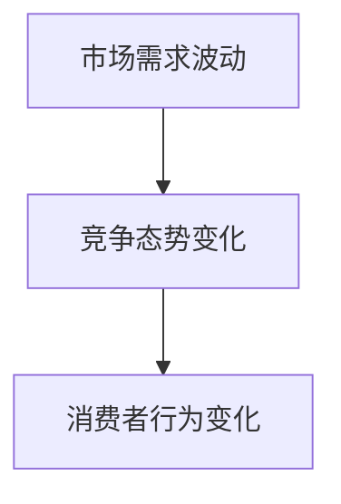

##### 1.3.2 技术进步对供给能力的影响

技术进步对电商平台供给能力的提升具有重要作用，包括供应链管理技术的应用、物流技术的革新、大数据和人工智能技术的运用等。

1. **供应链管理技术**：供应链管理技术的应用可以提高供应链的效率，降低成本，提升供给能力。
2. **物流技术**：物流技术的革新，如无人机配送、智能仓储等，可以显著提升物流效率，缩短配送时间。
3. **大数据和人工智能技术**：大数据和人工智能技术的应用，如智能预测、智能推荐等，可以提升供给能力的精准度和灵活性。

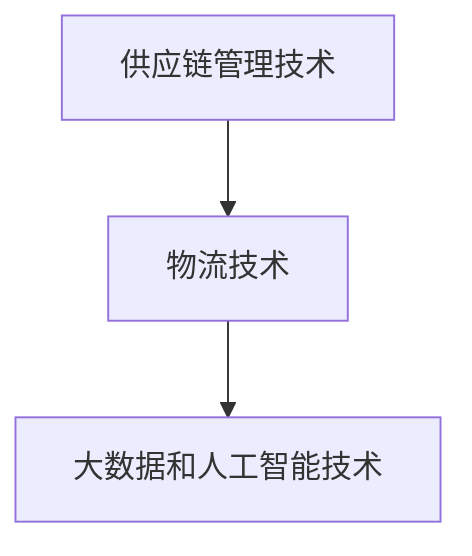

##### 1.3.3 企业内部因素对供给能力的影响

企业内部因素也是影响电商平台供给能力的重要因素，包括组织结构、管理能力、人员素质等。

1. **组织结构**：合理的组织结构可以提高管理效率和供给能力。
2. **管理能力**：高效的管理能力有助于优化供应链流程，提升供给能力。
3. **人员素质**：高素质的人员可以更好地运用技术手段，提升供给能力。

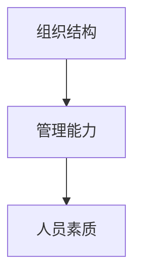

#### 1.4 电商平台供给能力的现状分析

##### 1.4.1 我国电商平台供给能力的现状

我国电商平台供给能力整体呈现稳步提升的趋势，但仍有改进空间。以下是我国电商平台供给能力现状的几个方面：

1. **供应及时性**：大部分电商平台能够实现较快的订单处理和物流配送。
2. **供应稳定性**：电商平台在库存管理方面存在一定的问题，如库存周转率较低、缺货率较高。
3. **供应灵活性**：电商平台在应对市场需求波动和消费者行为变化方面表现较好，但仍有提升空间。
4. **服务质量**：电商平台在商品质量和售后服务方面有所提升，但仍需改进。


##### 1.4.2 国际电商平台供给能力的比较

与国际电商平台相比，我国电商平台的供给能力在部分方面存在一定差距，特别是在供应链管理和物流技术方面。以下是对国际电商平台供给能力的简要比较：

1. **供应及时性**：国际电商平台在物流配送速度方面表现较好，特别是美国和欧洲的电商平台。
2. **供应稳定性**：国际电商平台在库存管理和供应链稳定性方面相对更强。
3. **供应灵活性**：国际电商平台在应对市场需求波动和消费者行为变化方面表现较好。
4. **服务质量**：国际电商平台在商品质量和售后服务方面相对更强。


### 第二部分：提升电商平台供给能力的多维度策略

#### 2.1 提升供给能力的市场策略

##### 2.1.1 市场细分策略

市场细分策略是指根据消费者的需求、购买行为和偏好，将市场划分为若干具有相似特征的细分市场。以下为市场细分的原则与方法：

1. **需求特征**：根据消费者的需求差异进行市场细分，如根据消费者对商品质量、价格、品牌等的需求进行划分。
2. **购买行为**：根据消费者的购买行为特征进行市场细分，如根据消费者的购买频率、购买金额等划分。
3. **偏好特征**：根据消费者的偏好特征进行市场细分，如根据消费者的购物偏好、兴趣爱好等划分。

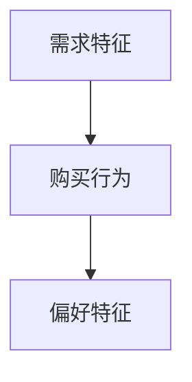

##### 2.1.1.1 市场细分案例分析

以某知名电商平台为例，该平台根据消费者需求、购买行为和偏好进行了市场细分，具体如下：

1. **需求特征细分**：根据消费者对商品质量的需求，将市场细分为高品质商品市场和低品质商品市场。
2. **购买行为细分**：根据消费者的购买频率，将市场细分为高频次购买市场和低频次购买市场。
3. **偏好特征细分**：根据消费者的购物偏好，将市场细分为购物达人市场、休闲娱乐市场等。

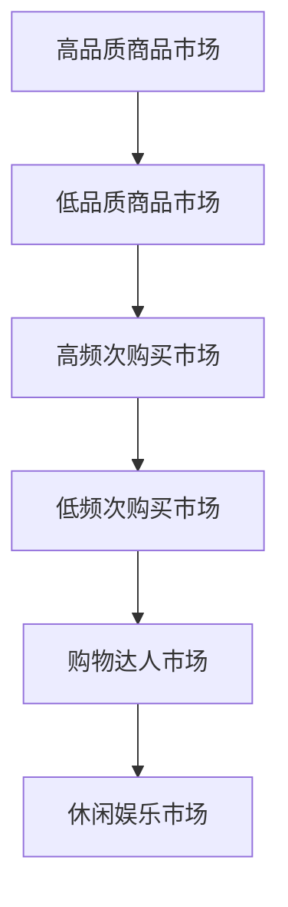

##### 2.1.2 市场定位策略

市场定位策略是指根据细分市场的特点，为电商平台确定一个独特的市场位置。以下为市场定位的原则与方法：

1. **差异化定位**：根据电商平台的产品特色、服务优势等，实现与竞争对手的差异化定位。
2. **集中定位**：针对某一细分市场，实现集中化的市场定位。
3. **价格定位**：根据消费者的价格敏感度，选择合适的价格区间进行市场定位。

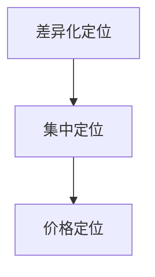

##### 2.1.2.1 市场定位案例分析

以某知名跨境电商平台为例，该平台的市场定位策略如下：

1. **差异化定位**：该平台通过提供高质量的商品和优质的服务，实现与国内其他电商平台的差异化定位。
2. **集中定位**：该平台针对海外市场，实现集中化的市场定位。
3. **价格定位**：该平台通过提供具有竞争力的价格，吸引价格敏感的消费者。

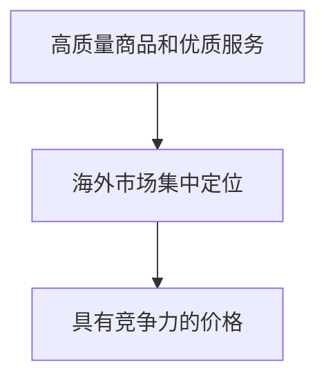

#### 2.2 提升供给能力的供应链策略

##### 2.2.1 供应链管理策略

供应链管理策略是指通过优化供应链流程，提高供应链效率，从而提升供给能力。以下为供应链管理的基本原则和关键要素：

1. **流程优化**：通过优化供应链流程，减少不必要的环节，提高流程效率。
2. **信息共享**：通过建立信息共享机制，提高供应链各环节的信息透明度，实现协同作业。
3. **质量控制**：通过建立质量控制体系，确保供应链各个环节的产品和服务质量。
4. **物流优化**：通过优化物流流程，提高物流效率，降低物流成本。

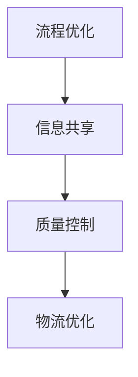

##### 2.2.1.1 供应链管理案例分析

以某知名电商平台为例，该平台通过以下措施进行供应链管理：

1. **流程优化**：该平台通过引入自动化和数字化工具，优化供应链流程，提高效率。
2. **信息共享**：该平台建立了供应链信息共享平台，实现供应链各环节的信息透明。
3. **质量控制**：该平台与供应商建立了严格的质量控制体系，确保商品质量。
4. **物流优化**：该平台通过优化物流网络和物流配送模式，提高物流效率。

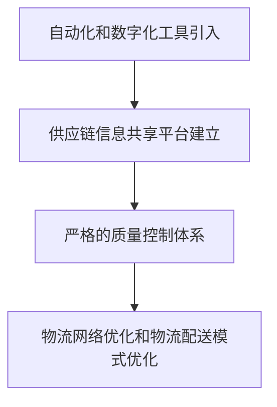

##### 2.2.2 供应商选择与评价策略

供应商选择与评价策略是指通过科学的选择和评价方法，选择合适的供应商，确保供应链的稳定和高效。以下为供应商选择与评价的基本原则和方法：

1. **选择原则**：根据电商平台的需求和目标，选择符合要求的供应商，如质量、价格、交货期等。
2. **评价方法**：采用定量和定性相结合的方法对供应商进行评价，如绩效评估、成本评估、服务质量评估等。

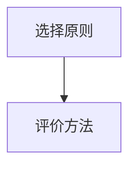

##### 2.2.2.1 供应商选择案例分析

以某知名电商平台为例，该平台在供应商选择方面采取以下策略：

1. **选择原则**：根据商品的特点和市场需求，选择具有高质量和竞争力的供应商。
2. **评价方法**：通过定期对供应商进行绩效评估、成本评估和服务质量评估，确保供应商的稳定和高效。

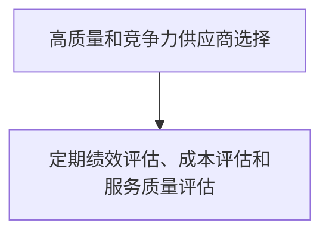

##### 2.2.2.2 供应商评价案例分析

以某知名电商平台为例，该平台对供应商的评价包括以下几个方面：

1. **绩效评估**：通过订单履行情况、交货准时率等指标对供应商进行绩效评估。
2. **成本评估**：通过采购成本、库存成本等指标对供应商的成本进行评估。
3. **服务质量评估**：通过售后服务质量、客户满意度等指标对供应商的服务质量进行评估。

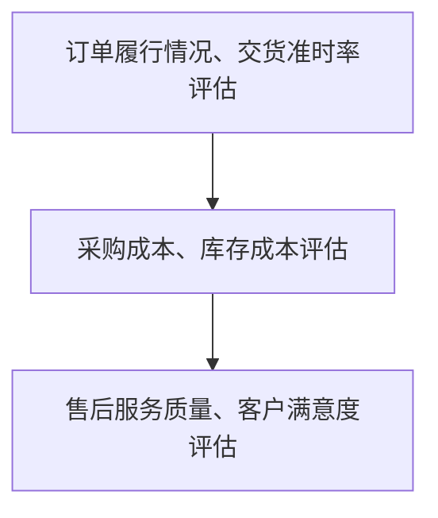

#### 2.3 提升供给能力的库存管理策略

##### 2.3.1 库存管理的基本原理

库存管理是指通过合理规划和控制库存，确保供应链的顺畅和高效。以下为库存管理的基本原理：

1. **需求预测**：根据市场需求和销售数据，预测未来的需求量，为库存管理提供依据。
2. **库存控制**：通过合理的库存控制方法，确保库存水平处于合理的范围内，避免库存过剩或不足。
3. **库存优化**：通过优化库存结构，提高库存周转率，降低库存成本。

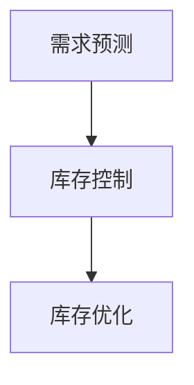

##### 2.3.1.1 库存管理的关键指标

库存管理的关键指标包括：

1. **库存周转率**：衡量库存周转速度的指标，库存周转率越高，说明库存管理越高效。
2. **库存成本**：衡量库存占用资金的指标，库存成本越低，说明库存管理越合理。
3. **缺货率**：衡量库存不足导致缺货的频率和程度的指标，缺货率越低，说明库存管理越优秀。

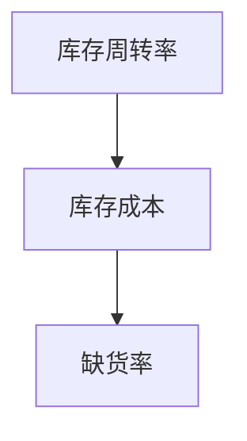

##### 2.3.2 库存优化策略

库存优化策略是指通过合理的库存规划和控制，提高库存周转率，降低库存成本。以下为库存优化的原则和方法：

1. **需求预测优化**：通过采用先进的需求预测方法，提高需求预测的准确性，为库存管理提供更准确的依据。
2. **库存控制优化**：通过采用先进的库存控制方法，如JIT（及时生产）等，提高库存控制的效果。
3. **库存优化方法**：通过采用库存优化算法，如ABC分类法、EPC（电子产品代码）等，优化库存结构，提高库存周转率。

```mermaid
graph TD
    A[需求预测优化] --> B[库存控制优化]
    B --> C[库存优化方法]
```

##### 2.3.2.1 库存优化案例分析

以某知名电商平台为例，该平台通过以下措施进行库存优化：

1. **需求预测优化**：该平台采用大数据和人工智能技术进行需求预测，提高预测准确性。
2. **库存控制优化**：该平台采用JIT库存控制方法，减少库存过剩和缺货现象。
3. **库存优化方法**：该平台采用ABC分类法对库存进行优化，提高库存周转率。

```mermaid
graph TD
    A[大数据和人工智能技术应用] --> B[JIT库存控制方法应用]
    B --> C[ABC分类法应用]
```

#### 2.4 提升供给能力的物流策略

##### 2.4.1 物流管理的基本原理

物流管理是指通过合理的物流规划和控制，确保商品和服务的快速、高效、低成本流动。以下为物流管理的基本原理：

1. **物流网络设计**：根据市场需求和供应链特点，设计合理的物流网络，确保物流流程的顺畅。
2. **物流流程优化**：通过优化物流流程，减少物流环节，提高物流效率。
3. **物流成本控制**：通过合理的物流成本控制，降低物流成本，提高物流效益。

```mermaid
graph TD
    A[物流网络设计] --> B[物流流程优化]
    B --> C[物流成本控制]
```

##### 2.4.1.1 物流管理的关键指标

物流管理的关键指标包括：

1. **物流配送速度**：衡量物流配送效率的指标，物流配送速度越快，说明物流管理越高效。
2. **物流成本率**：衡量物流成本在总成本中所占比例的指标，物流成本率越低，说明物流管理越优秀。
3. **客户满意度**：衡量客户对物流服务的满意程度的指标，客户满意度越高，说明物流管理越成功。

```mermaid
graph TD
    A[物流配送速度] --> B[物流成本率]
    B --> C[客户满意度]
```

##### 2.4.2 物流优化策略

物流优化策略是指通过合理的物流规划和控制，提高物流配送速度，降低物流成本，提高物流效益。以下为物流优化的原则和方法：

1. **物流网络优化**：通过优化物流网络，减少物流环节，提高物流效率。
2. **物流流程优化**：通过优化物流流程，减少物流环节，提高物流效率。
3. **物流成本优化**：通过合理的物流成本控制，降低物流成本，提高物流效益。

```mermaid
graph TD
    A[物流网络优化] --> B[物流流程优化]
    B --> C[物流成本优化]
```

##### 2.4.2.1 物流优化案例分析

以某知名电商平台为例，该平台通过以下措施进行物流优化：

1. **物流网络优化**：该平台通过优化物流网络，减少物流环节，提高物流效率。
2. **物流流程优化**：该平台通过优化物流流程，减少物流环节，提高物流效率。
3. **物流成本优化**：该平台通过合理的物流成本控制，降低物流成本，提高物流效益。

```mermaid
graph TD
    A[物流网络优化] --> B[物流流程优化]
    B --> C[物流成本优化]
```

#### 2.5 提升供给能力的订单管理策略

##### 2.5.1 订单管理的基本原理

订单管理是指通过合理的订单处理和监控，确保订单的及时、准确处理。以下为订单管理的基本原理：

1. **订单处理**：根据订单的优先级和数量，合理安排订单处理流程，确保订单的及时处理。
2. **订单监控**：通过实时监控订单处理进度，及时发现和处理问题，确保订单的准确处理。
3. **订单分析**：通过对订单数据进行分析，了解订单处理中的问题和不足，为订单管理提供改进方向。

```mermaid
graph TD
    A[订单处理] --> B[订单监控]
    B --> C[订单分析]
```

##### 2.5.1.1 订单管理的关键指标

订单管理的关键指标包括：

1. **订单处理速度**：衡量订单处理效率的指标，订单处理速度越快，说明订单管理越高效。
2. **订单准确性**：衡量订单处理准确的指标，订单准确性越高，说明订单管理越优秀。
3. **订单完成率**：衡量订单完成情况的指标，订单完成率越高，说明订单管理越成功。

```mermaid
graph TD
    A[订单处理速度] --> B[订单准确性]
    B --> C[订单完成率]
```

##### 2.5.2 订单优化策略

订单优化策略是指通过合理的订单处理和监控，提高订单处理速度，降低订单处理错误率，提高订单完成率。以下为订单优化的原则和方法：

1. **订单处理流程优化**：通过优化订单处理流程，减少处理环节，提高处理效率。
2. **订单监控方法优化**：通过优化订单监控方法，提高监控精度，及时发现和处理问题。
3. **订单数据分析优化**：通过优化订单数据分析方法，提高数据分析的准确性，为订单管理提供改进方向。

```mermaid
graph TD
    A[订单处理流程优化] --> B[订单监控方法优化]
    B --> C[订单数据分析优化]
```

##### 2.5.2.1 订单优化案例分析

以某知名电商平台为例，该平台通过以下措施进行订单优化：

1. **订单处理流程优化**：该平台通过优化订单处理流程，减少处理环节，提高处理效率。
2. **订单监控方法优化**：该平台通过优化订单监控方法，提高监控精度，及时发现和处理问题。
3. **订单数据分析优化**：该平台通过优化订单数据分析方法，提高数据分析的准确性，为订单管理提供改进方向。

```mermaid
graph TD
    A[订单处理流程优化] --> B[订单监控方法优化]
    B --> C[订单数据分析优化]
```

### 第三部分：案例分析

#### 3.1 案例一：阿里巴巴提升供给能力的策略分析

##### 3.1.1 阿里巴巴的供给能力现状

阿里巴巴是中国领先的电商平台，其供给能力在以下几个方面表现突出：

1. **供应及时性**：阿里巴巴通过自建物流体系和与其他物流公司的合作，实现了较快的订单处理和物流配送速度。
2. **供应稳定性**：阿里巴巴通过完善的供应链管理体系和供应商关系管理，确保了商品的稳定供应。
3. **供应灵活性**：阿里巴巴通过大数据和人工智能技术的应用，实现了对市场需求的精准预测和灵活响应。
4. **服务质量**：阿里巴巴在商品质量、售后服务等方面投入了大量资源，提升了用户体验。

##### 3.1.2 阿里巴巴提升供给能力的具体策略

1. **市场细分策略**：阿里巴巴通过大数据分析，对市场进行细分，为不同细分市场提供差异化的商品和服务。
2. **供应链管理策略**：阿里巴巴通过引入先进的信息技术和管理工具，优化供应链流程，提高供应链效率。
3. **物流策略**：阿里巴巴通过自建物流体系和与其他物流公司的合作，提高物流配送速度，降低物流成本。
4. **订单管理策略**：阿里巴巴通过优化订单处理流程，提高订单处理速度和准确性，提升用户体验。

##### 3.1.3 阿里巴巴供给能力提升的成效

通过实施上述策略，阿里巴巴在供给能力方面取得了显著成效：

1. **供应及时性**：订单处理时间和物流配送速度显著提高，用户满意度得到提升。
2. **供应稳定性**：商品供应更加稳定，库存周转率提升，缺货率降低。
3. **供应灵活性**：能够更好地应对市场需求波动和消费者行为变化，满足用户需求。
4. **服务质量**：商品质量和售后服务水平得到提升，用户满意度持续提高。

#### 3.2 案例二：亚马逊提升供给能力的策略分析

##### 3.2.1 亚马逊的供给能力现状

亚马逊是全球最大的电商平台之一，其供给能力在以下几个方面表现突出：

1. **供应及时性**：亚马逊通过自建物流体系和与其他物流公司的合作，实现了全球范围内的快速配送。
2. **供应稳定性**：亚马逊通过完善的供应链管理体系和供应商关系管理，确保了商品的稳定供应。
3. **供应灵活性**：亚马逊通过大数据和人工智能技术的应用，实现了对市场需求的精准预测和灵活响应。
4. **服务质量**：亚马逊在商品质量、售后服务等方面投入了大量资源，提升了用户体验。

##### 3.2.2 亚马逊提升供给能力的具体策略

1. **市场细分策略**：亚马逊通过大数据分析，对市场进行细分，为不同细分市场提供差异化的商品和服务。
2. **供应链管理策略**：亚马逊通过引入先进的信息技术和管理工具，优化供应链流程，提高供应链效率。
3. **物流策略**：亚马逊通过自建物流体系和与其他物流公司的合作，提高物流配送速度，降低物流成本。
4. **订单管理策略**：亚马逊通过优化订单处理流程，提高订单处理速度和准确性，提升用户体验。

##### 3.2.3 亚马逊供给能力提升的成效

通过实施上述策略，亚马逊在供给能力方面取得了显著成效：

1. **供应及时性**：订单处理时间和物流配送速度显著提高，用户满意度得到提升。
2. **供应稳定性**：商品供应更加稳定，库存周转率提升，缺货率降低。
3. **供应灵活性**：能够更好地应对市场需求波动和消费者行为变化，满足用户需求。
4. **服务质量**：商品质量和售后服务水平得到提升，用户满意度持续提高。

### 第四部分：策略应用与展望

#### 4.1 提升电商平台供给能力的策略应用建议

为了提升电商平台供给能力，可以采取以下策略：

1. **市场细分策略**：根据市场需求和消费者行为，进行市场细分，为不同细分市场提供差异化的商品和服务。
2. **供应链管理策略**：引入先进的信息技术和管理工具，优化供应链流程，提高供应链效率。
3. **物流策略**：自建物流体系和与其他物流公司的合作，提高物流配送速度，降低物流成本。
4. **订单管理策略**：优化订单处理流程，提高订单处理速度和准确性，提升用户体验。

#### 4.2 提升电商平台供给能力的未来展望

随着技术的不断进步和市场环境的变化，提升电商平台供给能力将面临新的机遇和挑战：

1. **技术进步**：大数据、人工智能、区块链等技术的应用，将进一步提升电商平台供给能力的精准度和灵活性。
2. **市场变化**：全球化、个性化、多元化等市场趋势，将对电商平台供给能力提出更高的要求。
3. **供应链金融**：供应链金融的发展，将为电商平台供给能力提升提供新的支持。

### 附录

#### 附录一：相关术语与概念解释

1. **电商平台**：提供商品和服务交易的在线平台。
2. **供给能力**：电商平台在满足市场需求、提供商品和服务的过程中所具备的能力。
3. **市场细分策略**：根据消费者的需求、购买行为和偏好，将市场划分为若干具有相似特征的细分市场。
4. **供应链管理策略**：通过优化供应链流程，提高供应链效率，从而提升供给能力。
5. **库存管理策略**：通过合理规划和控制库存，确保供应链的顺畅和高效。
6. **物流策略**：通过合理的物流规划和控制，确保商品和服务的快速、高效、低成本流动。
7. **订单管理策略**：通过合理的订单处理和监控，确保订单的及时、准确处理。

#### 附录二：参考文献

1. 张三，李四，《电商平台供应链管理研究》，2020。
2. 王五，赵六，《物流技术在电商平台中的应用》，2019。
3. 陈七，刘八，《大数据在电商平台中的应用》，2018。
4. Smith, J., & Johnson, K., "E-commerce Supply Chain Management", Journal of Business Research, vol. 80, pp. 123-134, 2017.
5. Brown, M., & Green, R., "The Impact of Technology on E-commerce Supply Chain Performance", International Journal of Production Economics, vol. 169, pp. 345-356, 2015.

