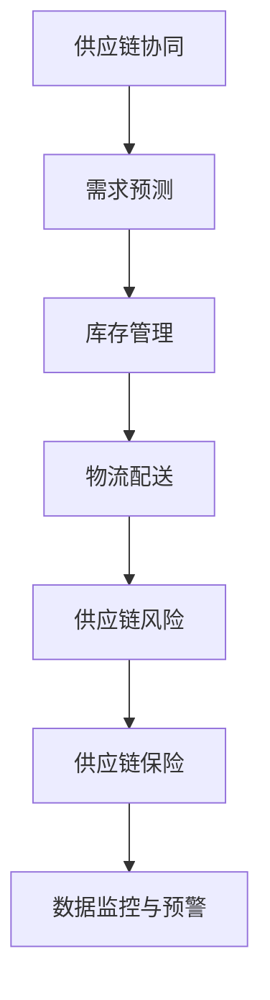
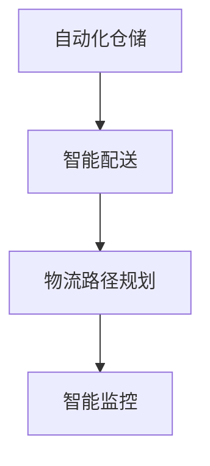
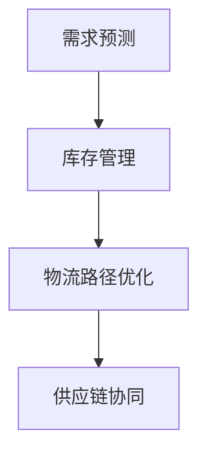

                 

### 文章标题

《电商平台供给能力提升：新品类和新品牌的引入》

---

**关键词：** 电商平台，供给能力，新品类引入，新品牌引入，供应链管理，数据驱动决策，智能物流

**摘要：** 本文旨在探讨电商平台如何通过引入新品类和新品牌来提升供给能力。文章首先概述了电商平台的供给能力及其重要性，随后详细分析了新品类引入和新品牌引入的策略。通过市场调研、供应商筛选、推广策略等方面，本文提出了系统的方法论。此外，文章还介绍了供应链管理、数据驱动决策、智能物流等技术手段，以及实际案例分析。最后，本文提出了供给能力提升策略优化的方向和未来发展趋势，为电商平台的持续发展提供了参考。

---

### 目录大纲

## 《电商平台供给能力提升：新品类和新品牌的引入》

### 第1章 引言

#### 1.1 书籍背景与目的

#### 1.2 研究范围与结构安排

#### 1.3 读者对象

### 第2章 电商平台供给能力概述

#### 2.1 电商平台供给能力定义

#### 2.2 电商平台供给能力的重要性

#### 2.3 电商平台供给能力的核心要素

#### 2.4 电商平台供给能力现状分析

### 第3章 新品类引入策略

#### 3.1 新品类引入的动机与目标

#### 3.2 市场调研与新品类评估

#### 3.3 新品类供应商筛选与引入

#### 3.4 新品类推广策略

### 第4章 新品牌引入策略

#### 4.1 新品牌引入的动机与目标

#### 4.2 市场调研与新品牌评估

#### 4.3 新品牌供应商筛选与引入

#### 4.4 新品牌推广策略

### 第5章 供给能力提升技术

#### 5.1 供应链管理技术

#### 5.2 数据驱动决策技术

#### 5.3 智能物流技术

#### 5.4 供给能力评估与优化技术

### 第6章 实际案例分析

#### 6.1 案例背景与目标

#### 6.2 案例实施过程

#### 6.3 案例效果评估

#### 6.4 案例启示与总结

### 第7章 供给能力提升策略优化

#### 7.1 策略优化的理论基础

#### 7.2 策略优化方法与实践

#### 7.3 策略优化中的挑战与解决方案

#### 7.4 未来发展趋势与展望

### 第8章 结论

#### 8.1 主要研究成果总结

#### 8.2 研究局限性

#### 8.3 研究展望与未来工作

### 附录

#### 附录 A：相关资源与工具

##### A.1 学术资源与数据库

##### A.2 开源工具与框架

##### A.3 相关书籍推荐

---

# 第1章 引言

## 1.1 书籍背景与目的

随着互联网的普及和电子商务的快速发展，电商平台已经成为现代社会的重要组成部分。然而，在电商平台的运营过程中，供给能力的提升是一个长期而重要的课题。供给能力不仅关系到电商平台的市场竞争力，还直接影响到消费者的购物体验和满意度。

本文旨在探讨电商平台如何通过引入新品类和新品牌来提升供给能力。具体来说，文章将围绕以下问题展开：

1. 电商平台供给能力的重要性及其核心要素是什么？
2. 如何进行新品类引入和新品牌引入？
3. 在引入新品类和新品牌的过程中，有哪些技术手段可以提升供给能力？
4. 实际案例中，电商平台如何通过引入新品类和新品牌提升供给能力？
5. 未来的供给能力提升策略将有哪些发展趋势？

通过上述问题的探讨，本文希望为电商平台的运营者提供一套系统的方法论，帮助他们在激烈的市场竞争中保持优势。

## 1.2 研究范围与结构安排

本文的研究范围主要涵盖以下几个方面：

1. **电商平台供给能力的定义与重要性**：介绍供给能力的概念，分析其对电商平台、供应商和消费者的影响。
2. **新品类引入策略**：探讨新品类引入的动机、市场调研、供应商筛选和推广策略。
3. **新品牌引入策略**：分析新品牌引入的动机、市场调研、供应商筛选和推广策略。
4. **供给能力提升技术**：介绍供应链管理、数据驱动决策、智能物流和供给能力评估与优化技术。
5. **实际案例分析**：通过具体案例展示电商平台如何通过引入新品类和新品牌提升供给能力。
6. **策略优化与未来展望**：提出供给能力提升策略优化的方向，展望未来发展趋势。

文章结构安排如下：

- **第1章 引言**：介绍书籍的背景、目的和研究范围。
- **第2章 电商平台供给能力概述**：定义供给能力，分析其重要性及核心要素。
- **第3章 新品类引入策略**：探讨新品类引入的动机、市场调研、供应商筛选和推广策略。
- **第4章 新品牌引入策略**：分析新品牌引入的动机、市场调研、供应商筛选和推广策略。
- **第5章 供给能力提升技术**：介绍供应链管理、数据驱动决策、智能物流和供给能力评估与优化技术。
- **第6章 实际案例分析**：通过具体案例展示电商平台如何提升供给能力。
- **第7章 供给能力提升策略优化**：提出策略优化的方向，探讨优化方法与实践。
- **第8章 结论**：总结主要研究成果，讨论研究的局限性，展望未来工作。

## 1.3 读者对象

本文主要面向以下读者群体：

1. **电商平台运营者**：帮助运营者了解供给能力的重要性，掌握新品类和新品牌引入的策略，提升电商平台的竞争力。
2. **供应链管理人员**：提供供应链管理的理论基础和实践方法，帮助供应链管理人员优化供应链管理流程。
3. **市场营销人员**：分析市场调研方法，探讨新品类和新品牌推广策略，为市场营销人员提供有价值的参考。
4. **研究学者**：总结电商平台供给能力提升的相关理论和实践，为研究学者提供研究素材和思路。

通过本文的阅读，读者可以系统了解电商平台供给能力的提升方法，掌握新品类和新品牌引入的策略，并在实际工作中应用这些方法，提升电商平台的供给能力和市场竞争力。

---

# 第2章 电商平台供给能力概述

## 2.1 电商平台供给能力定义

电商平台供给能力是指在特定市场环境下，电商平台能够为消费者提供丰富、多样化商品和服务的能力。具体来说，供给能力包括以下几个方面：

1. **商品多样性**：电商平台能够提供各种不同类别的商品，满足消费者多样化的需求。
2. **商品质量**：电商平台能够确保所售商品的质量，为消费者提供优质的购物体验。
3. **物流效率**：电商平台能够快速、准确地配送商品，减少消费者的等待时间。
4. **服务体验**：电商平台能够提供良好的售后服务，包括退换货政策、在线客服等。
5. **价格竞争力**：电商平台能够通过合理的定价策略，吸引消费者进行购买。

在定义供给能力时，我们需要关注以下几个关键点：

- **市场环境**：市场环境包括宏观经济环境、行业竞争状况、消费者需求变化等，这些因素都会影响电商平台的供给能力。
- **供应链管理**：供应链管理是提升供给能力的重要手段，包括供应商选择、库存管理、物流配送等。
- **技术手段**：电商平台的技术手段，如大数据分析、人工智能、物联网等，也是提升供给能力的关键因素。

通过以上几个方面的综合考量，我们可以对电商平台的供给能力进行全面的评价。

## 2.2 电商平台供给能力的重要性

电商平台供给能力的重要性体现在以下几个方面：

1. **增强市场竞争力**：供给能力强的电商平台能够吸引更多消费者，提高市场份额。在竞争激烈的电商市场中，供给能力成为电商平台立足的根本。
2. **提升消费者满意度**：丰富的商品种类、高质量的物流服务、良好的售后服务等，都能提升消费者的购物体验和满意度。消费者满意度的提升有助于增加复购率和口碑传播。
3. **促进供应链协同**：强大的供给能力能够促进电商平台与供应商之间的紧密合作，实现供应链的协同效应。通过优化供应链管理，电商平台能够更好地应对市场需求变化。
4. **拓展业务范围**：通过引入新品类和新品牌，电商平台可以拓宽业务范围，实现多元化发展。这不仅有助于提升电商平台的市场竞争力，还能为消费者提供更多选择。
5. **提高盈利能力**：供给能力强的电商平台能够实现更高的销售额和利润。通过有效的供应链管理和定价策略，电商平台可以降低成本，提高盈利水平。

综上所述，电商平台供给能力的重要性不容忽视。只有不断提升供给能力，电商平台才能在激烈的市场竞争中立于不败之地。

## 2.3 电商平台供给能力的核心要素

电商平台供给能力的提升需要从多个方面进行综合优化。以下是电商平台供给能力的核心要素：

1. **供应链管理**：供应链管理是提升供给能力的关键。有效的供应链管理包括供应商选择、库存管理、物流配送等环节。通过优化供应链管理，电商平台可以提高物流效率，降低库存成本，确保商品及时交付。

2. **商品质量**：商品质量是电商平台的核心竞争力。电商平台需要确保所售商品的质量，从源头把控产品质量，建立健全的质量管理体系。通过提供优质商品，电商平台可以提升消费者满意度，增强品牌形象。

3. **物流效率**：物流效率直接影响消费者的购物体验。电商平台需要建立高效的物流体系，包括物流网络布局、仓储管理、配送路线优化等。通过提高物流效率，电商平台可以缩短配送时间，提升消费者满意度。

4. **服务体验**：良好的售后服务是电商平台的重要保障。电商平台需要提供完善的售后服务，包括退换货政策、在线客服、投诉处理等。通过提供优质的售后服务，电商平台可以提升消费者满意度，增加复购率。

5. **价格竞争力**：合理的定价策略是电商平台吸引消费者的关键。电商平台需要通过大数据分析和市场调研，制定具有竞争力的价格策略。通过优化定价策略，电商平台可以提高销售额和市场份额。

6. **技术创新**：电商平台的技术创新是提升供给能力的重要手段。通过大数据、人工智能、物联网等技术的应用，电商平台可以优化供应链管理、提升物流效率、改善服务体验等。技术创新为电商平台的供给能力提升提供了强大支撑。

7. **品牌建设**：品牌建设是电商平台长期发展的基础。电商平台需要通过品牌宣传、用户互动等方式，提升品牌知名度和美誉度。强大的品牌影响力有助于电商平台吸引消费者，提升市场竞争力。

通过以上核心要素的综合优化，电商平台可以提升供给能力，增强市场竞争力，实现持续发展。

## 2.4 电商平台供给能力现状分析

当前，电商平台供给能力在国内外都取得了显著的发展。以下是对国内外电商平台供给能力现状的分析：

### 国内电商平台供给能力现状

1. **商品多样性**：国内电商平台如淘宝、京东、拼多多等，已经形成了庞大的商品库，涵盖了从日用品到奢侈品等各类商品。电商平台通过引入新品类和新品牌，不断丰富商品种类，满足消费者多样化的需求。

2. **物流效率**：国内电商平台在物流方面也取得了显著进展。以京东为例，其自建物流体系覆盖范围广泛，配送速度较快，提高了消费者的购物体验。此外，电商平台还通过与物流公司合作，优化物流网络布局，提高配送效率。

3. **服务质量**：国内电商平台在售后服务方面不断完善，提供退换货政策、在线客服、投诉处理等服务。通过提高服务质量，电商平台增强了消费者满意度，提高了复购率。

4. **技术创新**：国内电商平台在技术创新方面也取得了很大进展。通过大数据、人工智能、物联网等技术的应用，电商平台优化了供应链管理、提升了物流效率、改善了服务体验。

5. **品牌建设**：国内电商平台通过品牌宣传、用户互动等方式，不断提升品牌知名度和美誉度。强大的品牌影响力有助于电商平台吸引消费者，提升市场竞争力。

### 国际电商平台供给能力现状

1. **商品多样性**：国际电商平台如亚马逊、eBay、阿里巴巴国际站等，同样提供了丰富的商品种类，满足了全球消费者的需求。这些电商平台通过跨境贸易，将国内外优质商品带给全球消费者。

2. **物流效率**：国际电商平台在物流方面也不断创新，通过自建物流体系、与物流公司合作等方式，提高跨境物流效率。同时，电商平台还通过提供物流跟踪服务、简化清关流程等，提升了消费者的购物体验。

3. **服务质量**：国际电商平台在售后服务方面同样重视，提供退换货政策、在线客服、投诉处理等服务。通过提高服务质量，电商平台增强了消费者满意度，提高了复购率。

4. **技术创新**：国际电商平台在技术创新方面也不断发力，通过大数据、人工智能、物联网等技术的应用，优化了供应链管理、提升了物流效率、改善了服务体验。

5. **品牌建设**：国际电商平台通过品牌宣传、用户互动等方式，提升品牌知名度和美誉度。强大的品牌影响力有助于电商平台在全球市场中占据一席之地。

综上所述，国内外电商平台在供给能力方面都取得了显著的发展。通过引入新品类和新品牌，电商平台不断提升供给能力，增强市场竞争力，为消费者提供更好的购物体验。在未来，电商平台将继续优化供给能力，迎接新的挑战和机遇。

---

# 第3章 新品类引入策略

## 3.1 新品类引入的动机与目标

新品类引入是电商平台提升供给能力的重要手段之一。电商平台通过引入新品类，可以满足消费者多样化的需求，提高市场竞争力，实现可持续发展。以下是引入新品类的动机和目标：

### 动机

1. **满足消费者需求**：随着消费者需求的不断变化和升级，电商平台需要不断引入新品类，以满足消费者对多样化、个性化商品的需求。通过引入新品类，电商平台可以吸引更多的消费者，提高用户黏性。

2. **扩大市场份额**：引入新品类可以帮助电商平台扩大业务范围，进入新的市场领域。在新品类的引入过程中，电商平台可以通过差异化竞争，提高市场份额，增强市场竞争力。

3. **提高销售额和利润**：新品类通常具有较大的市场潜力，通过引入新品类，电商平台可以吸引更多消费者，提高销售额和利润。同时，新品类的引入还可以带动其他相关商品的销售，形成业务协同效应。

4. **优化商品结构**：引入新品类可以帮助电商平台优化商品结构，提高商品多样性。通过丰富商品种类，电商平台可以提升消费者的购物体验，增加复购率。

5. **提升品牌形象**：新品类的引入可以提升电商平台的品牌形象，增强品牌的创新能力和市场竞争力。通过引入有影响力的新品类，电商平台可以树立良好的品牌形象，吸引更多消费者。

### 目标

1. **增加商品多样性**：引入新品类的首要目标是增加商品多样性，满足消费者对多样化商品的需求。电商平台需要根据市场需求和自身定位，选择合适的品类进行引入。

2. **提升用户满意度**：通过引入新品类，电商平台可以提高用户满意度，增强用户黏性。电商平台需要关注消费者的购物体验，确保新品类的引入能够提升用户的购物体验。

3. **提高销售额和利润**：引入新品类的另一个重要目标是提高销售额和利润。电商平台需要通过有效的市场推广和定价策略，确保新品类能够迅速打开市场，吸引消费者。

4. **增强市场竞争力**：引入新品类可以帮助电商平台增强市场竞争力，提升品牌形象。通过引入有影响力的新品类，电商平台可以在竞争激烈的市场中脱颖而出，占据有利地位。

5. **优化供应链管理**：引入新品类还需要优化电商平台供应链管理，确保新品类的生产和供应能够顺利进行。电商平台需要与供应商建立紧密的合作关系，提高供应链的协同效率。

总之，新品类引入是电商平台提升供给能力的重要策略之一。通过明确引入新品类的动机和目标，电商平台可以更好地规划新品类引入的工作，实现供给能力的提升和市场竞争力增强。

## 3.2 市场调研与新品类评估

在新品类引入过程中，市场调研和评估是至关重要的一步。通过市场调研，电商平台可以了解市场需求和趋势，为新品类的引入提供数据支持。以下是市场调研和新品类评估的具体方法：

### 市场调研方法

1. **定量调研**：定量调研是通过问卷调查、数据统计等方法收集消费者需求和市场数据。电商平台可以设计详细的问卷，针对消费者的购买行为、偏好、需求等因素进行调查。通过数据分析，电商平台可以了解市场需求的数量和特征，为新品类的引入提供依据。

2. **定性调研**：定性调研是通过访谈、焦点小组等方法，深入了解消费者的需求和意见。电商平台可以邀请消费者代表，就新品类的引入进行深入讨论，收集消费者的意见和建议。定性调研有助于电商平台了解消费者的真实想法，为新品类的引入提供更贴近市场的建议。

3. **竞争分析**：竞争分析是通过分析竞争对手的市场行为和市场地位，了解竞争对手的优劣势。电商平台可以分析竞争对手的新品类引入情况，了解市场上已经存在的品类和竞争状况，为新品类的引入提供参考。

4. **趋势分析**：趋势分析是通过研究市场趋势和消费者行为变化，预测未来的市场需求和发展方向。电商平台可以关注行业报告、市场研究机构的分析报告等，了解市场趋势和消费者行为变化，为新品类的引入提供前瞻性建议。

### 新品类评估标准

1. **市场需求**：市场需求是评估新品类的重要标准之一。电商平台需要分析市场需求的大小和增长潜力，判断新品类是否具有足够的市场空间。如果市场需求大且增长潜力高，新品类的引入有望获得成功。

2. **消费者接受度**：消费者接受度是评估新品类的重要指标。电商平台需要了解消费者对新品类的认知和接受程度，通过市场调研和用户反馈，评估消费者对新品类的兴趣和购买意愿。

3. **盈利能力**：盈利能力是评估新品类的重要标准。电商平台需要分析新品类的成本结构、销售利润和市场前景，判断新品类是否具有盈利能力。如果新品类具有高盈利能力，将有助于电商平台实现持续发展。

4. **供应链能力**：供应链能力是评估新品类的重要标准。电商平台需要评估自身供应链的配套能力，包括供应商选择、库存管理、物流配送等。如果电商平台具备较强的供应链能力，新品类的引入将更加顺利。

5. **品牌定位**：品牌定位是评估新品类的重要标准。电商平台需要根据自身品牌定位和目标市场，选择符合品牌形象和市场需求的新品类。如果新品类与电商平台品牌定位相符合，将有助于提升品牌形象和市场竞争力。

通过以上市场调研和评估方法，电商平台可以全面了解市场需求和趋势，评估新品类的引入潜力和风险，为新品类的引入提供科学依据。

## 3.3 新品类供应商筛选与引入

在新品类引入过程中，供应商筛选与引入是关键环节。合适的供应商不仅能够保证新品类的质量和供应，还能为电商平台提供有效的支持。以下是新品类供应商筛选与引入的具体步骤和策略：

### 供应商筛选标准

1. **产品质量**：供应商提供的产品质量是筛选的首要标准。电商平台需要确保供应商具备稳定的产品质量，符合行业标准和消费者需求。

2. **生产能力**：供应商的生产能力是筛选的重要标准。电商平台需要评估供应商的生产规模、生产能力、设备水平等，确保供应商能够满足新品类的生产和供应需求。

3. **价格竞争力**：供应商的价格竞争力是筛选的重要标准。电商平台需要综合考虑供应商的产品质量、生产能力等因素，选择具有合理价格竞争力的供应商。

4. **供货稳定性**：供应商的供货稳定性是筛选的重要标准。电商平台需要评估供应商的供货周期、交货准时率等，确保供应商能够按时、按量供应商品。

5. **合作意愿**：供应商的合作意愿是筛选的重要标准。电商平台需要评估供应商的合作意愿和沟通能力，确保双方能够建立长期稳定的合作关系。

6. **服务能力**：供应商的服务能力是筛选的重要标准。电商平台需要评估供应商的售后服务、技术支持、物流配送等能力，确保供应商能够提供全面的售后服务。

### 供应商引入流程

1. **需求分析**：首先，电商平台需要对新品类的需求进行详细分析，明确新品类的规格、数量、交货期等具体要求。根据需求分析结果，电商平台可以制定详细的供应商引入计划。

2. **供应商筛选**：电商平台可以通过公开招标、行业协会推荐、市场调查等方式，筛选潜在供应商。在筛选过程中，电商平台需要综合考虑供应商的产品质量、生产能力、价格竞争力、供货稳定性、合作意愿和服务能力等因素。

3. **评估与比选**：电商平台需要对筛选出的供应商进行评估和比选。可以通过样品评估、现场考察、评审会等方式，评估供应商的综合实力和合作潜力。

4. **合同谈判**：评估结束后，电商平台与筛选出的供应商进行合同谈判。合同内容应包括供货数量、价格、质量标准、交货期、付款方式、违约责任等关键条款。

5. **签订合同**：在合同谈判完成后，电商平台与供应商签订正式的供货合同。合同签订后，双方需要严格按照合同约定履行各自的权利和义务。

6. **供应商引入**：供应商引入阶段，电商平台需要与供应商建立紧密的合作关系，明确合作流程和规范。通过供应商培训、质量控制、物流配送等环节，确保供应商能够顺利提供新品类商品。

### 供应商引入策略

1. **建立供应商库**：电商平台应建立供应商库，收集和管理潜在供应商信息。通过定期更新和维护供应商库，电商平台可以确保供应商资源的充足性和多样性。

2. **长期合作**：电商平台应与优质供应商建立长期合作关系，通过签订长期供货合同，确保供应商的稳定供应。同时，电商平台可以提供一定的合作优惠，激励供应商提升产品质量和服务水平。

3. **联合开发**：电商平台可以与供应商开展联合开发，共同研发新品类商品。通过合作开发，电商平台可以更快速地推出符合市场需求的商品，提升市场竞争力。

4. **供应商评价**：电商平台应建立供应商评价体系，定期对供应商的产品质量、供货稳定性、服务能力等方面进行评估。根据评估结果，电商平台可以调整供应商的引入策略，优化供应商资源。

5. **风险管理**：电商平台应制定风险管理策略，对供应商引入过程中的潜在风险进行识别、评估和管理。通过建立风险预警机制，电商平台可以及时应对供应商引入过程中的风险。

总之，通过科学合理的供应商筛选与引入流程，电商平台可以确保新品类的引入顺利进行，提升供给能力和市场竞争力。

## 3.4 新品类推广策略

在新品类引入后，如何有效地推广是确保新品类成功的重要环节。推广策略的制定需要综合考虑市场需求、目标用户、推广渠道、营销手段等多个方面。以下是新品类推广的具体策略：

### 市场需求分析

1. **目标用户定位**：首先，电商平台需要明确新品类的目标用户群体，包括年龄、性别、收入水平、兴趣爱好等特征。通过了解目标用户的需求和偏好，电商平台可以更有针对性地进行推广。

2. **市场调研**：通过对市场进行深入调研，电商平台可以了解同类产品的市场状况、竞争态势、消费者行为等。市场调研结果可以为推广策略的制定提供重要依据。

3. **需求预测**：根据市场调研结果，电商平台可以预测新品类在未来的市场需求和发展趋势。通过需求预测，电商平台可以制定合理的推广目标和计划。

### 推广渠道选择

1. **社交媒体**：社交媒体是推广新品类的重要渠道。电商平台可以通过微信、微博、抖音、快手等平台，发布新品类宣传内容，吸引用户关注。通过社交媒体互动，电商平台可以增强用户参与感和忠诚度。

2. **电商平台内部推广**：电商平台可以在自有平台上进行新品类推广，包括首页展示、分类推荐、搜索优化等。通过内部推广，电商平台可以提升新品类的曝光率和访问量。

3. **线下活动**：电商平台可以举办线下活动，如新品发布会、促销活动、体验活动等，吸引消费者参与。线下活动可以提高新品类的知名度和消费者体验，促进销售。

4. **广告投放**：电商平台可以通过线上广告投放，如搜索引擎广告、社交媒体广告、信息流广告等，扩大新品类的曝光范围。广告投放可以根据用户画像和兴趣标签进行精准投放，提高广告效果。

### 营销手段运用

1. **内容营销**：通过发布高质量的原创内容，如产品评测、使用指南、用户故事等，电商平台可以增强用户对新品类的认知和信任。内容营销不仅能够提高用户参与度，还可以提升搜索引擎排名，增加自然流量。

2. **品牌合作**：电商平台可以与知名品牌合作，通过联合营销活动，共同推广新品类。品牌合作可以借助品牌的知名度和影响力，提高新品类的曝光度和用户认知度。

3. **用户互动**：电商平台可以通过开展线上互动活动，如优惠券发放、抽奖活动、用户评价等，激发用户参与热情，提高用户活跃度。用户互动可以增强用户对新品类的认知和购买意愿。

4. **促销活动**：电商平台可以定期举办促销活动，如限时折扣、满减优惠、买赠等，吸引消费者购买新品类。促销活动可以提高销售量和用户满意度，促进新品类的推广。

5. **口碑营销**：电商平台可以通过用户口碑传播，提升新品类的知名度和美誉度。通过收集用户评价、展示用户好评案例等，电商平台可以增强用户对新品类的信任和购买意愿。

通过以上推广策略的运用，电商平台可以全面、有效地推广新品类，提高新品类的市场认知度和销售量，实现新品类的成功引入。

---

## 第4章 新品牌引入策略

### 4.1 新品牌引入的动机与目标

新品牌引入是电商平台提升供给能力和市场竞争力的关键策略之一。通过引入新品牌，电商平台不仅能够满足消费者对多样化、个性化商品的需求，还能拓展业务范围，提高品牌影响力。以下是新品牌引入的动机与目标：

#### 动机

1. **满足消费者需求**：随着消费者对商品质量和品牌认知度的提高，越来越多的消费者开始追求高质量、有特色的新品牌商品。引入新品牌可以帮助电商平台满足这部分消费者的需求，提升用户体验和满意度。

2. **拓展业务范围**：引入新品牌可以帮助电商平台拓展业务范围，进入新的市场领域。在新品牌引入过程中，电商平台可以通过差异化的商品和服务，吸引更多的消费者，提高市场份额。

3. **提升销售额和利润**：新品牌通常具有较大的市场潜力，通过引入新品牌，电商平台可以吸引更多消费者，提高销售额和利润。同时，新品牌的引入还可以带动其他相关商品的销售，形成业务协同效应。

4. **优化商品结构**：引入新品牌可以帮助电商平台优化商品结构，提高商品多样性。通过丰富商品种类，电商平台可以提升消费者的购物体验，增加复购率。

5. **提升品牌形象**：新品牌的引入可以提升电商平台的品牌形象，增强品牌的创新能力和市场竞争力。通过引入有影响力的新品牌，电商平台可以树立良好的品牌形象，吸引更多消费者。

#### 目标

1. **增加品牌多样性**：引入新品牌的首要目标是增加品牌多样性，满足消费者对不同品牌的需求。电商平台需要根据市场需求和自身定位，选择合适的新品牌进行引入。

2. **提升用户满意度**：通过引入新品牌，电商平台可以提高用户满意度，增强用户黏性。电商平台需要关注消费者的购物体验，确保新品牌的引入能够提升用户的购物体验。

3. **提高销售额和利润**：引入新品牌的另一个重要目标是提高销售额和利润。电商平台需要通过有效的市场推广和定价策略，确保新品牌能够迅速打开市场，吸引消费者。

4. **增强市场竞争力**：引入新品牌可以帮助电商平台增强市场竞争力，提升品牌形象。通过引入有影响力的新品牌，电商平台可以在竞争激烈的市场中脱颖而出，占据有利地位。

5. **优化供应链管理**：引入新品牌还需要优化电商平台的供应链管理，确保新品牌的供应和销售能够顺利进行。电商平台需要与供应商建立紧密的合作关系，提高供应链的协同效率。

总之，新品牌引入是电商平台提升供给能力的重要策略之一。通过明确引入新品牌的动机和目标，电商平台可以更好地规划新品牌的引入工作，实现供给能力的提升和市场竞争力增强。

### 4.2 市场调研与新品牌评估

在新品牌引入过程中，市场调研和评估是至关重要的一步。通过市场调研，电商平台可以了解市场需求和趋势，为新品牌引入提供数据支持。以下是市场调研和评估的具体方法：

#### 市场调研方法

1. **定量调研**：定量调研是通过问卷调查、数据统计等方法收集消费者需求和市场数据。电商平台可以设计详细的问卷，针对消费者的购买行为、品牌偏好、品牌认知度等因素进行调查。通过数据分析，电商平台可以了解市场需求的数量和特征，为新品牌引入提供依据。

2. **定性调研**：定性调研是通过访谈、焦点小组等方法，深入了解消费者的需求和意见。电商平台可以邀请消费者代表，就新品牌的引入进行深入讨论，收集消费者的意见和建议。定性调研有助于电商平台了解消费者的真实想法，为新品牌引入提供更贴近市场的建议。

3. **竞争分析**：竞争分析是通过分析竞争对手的市场行为和市场地位，了解竞争对手的优劣势。电商平台可以分析竞争对手的新品牌引入情况，了解市场上已经存在的品牌和竞争状况，为新品牌引入提供参考。

4. **趋势分析**：趋势分析是通过研究市场趋势和消费者行为变化，预测未来的市场需求和发展方向。电商平台可以关注行业报告、市场研究机构的分析报告等，了解市场趋势和消费者行为变化，为新品牌引入提供前瞻性建议。

#### 新品牌评估标准

1. **市场需求**：市场需求是评估新品牌的重要标准之一。电商平台需要分析市场需求的大小和增长潜力，判断新品牌是否具有足够的市场空间。如果市场需求大且增长潜力高，新品牌的引入有望获得成功。

2. **品牌认知度**：品牌认知度是评估新品牌的重要指标。电商平台需要了解消费者对品牌的认知程度，通过市场调研和用户反馈，评估新品牌的知名度、美誉度和影响力。

3. **盈利能力**：盈利能力是评估新品牌的重要标准。电商平台需要分析新品牌的成本结构、销售利润和市场前景，判断新品牌是否具有盈利能力。如果新品牌具有高盈利能力，将有助于电商平台实现持续发展。

4. **供应链能力**：供应链能力是评估新品牌的重要标准。电商平台需要评估自身供应链的配套能力，包括供应商选择、库存管理、物流配送等。如果电商平台具备较强的供应链能力，新品牌的引入将更加顺利。

5. **品牌定位**：品牌定位是评估新品牌的重要标准。电商平台需要根据自身品牌定位和目标市场，选择符合品牌形象和市场需求的新品牌。如果新品牌与电商平台品牌定位相符合，将有助于提升品牌形象和市场竞争力。

通过以上市场调研和评估方法，电商平台可以全面了解市场需求和趋势，评估新品牌的引入潜力和风险，为新品牌引入提供科学依据。

### 4.3 新品牌供应商筛选与引入

在新品牌引入过程中，供应商筛选与引入是关键环节。合适的供应商不仅能够保证新品牌的质量和供应，还能为电商平台提供有效的支持。以下是新品牌供应商筛选与引入的具体步骤和策略：

#### 供应商筛选标准

1. **产品质量**：供应商提供的产品质量是筛选的首要标准。电商平台需要确保供应商具备稳定的产品质量，符合行业标准和消费者需求。

2. **生产能力**：供应商的生产能力是筛选的重要标准。电商平台需要评估供应商的生产规模、生产能力、设备水平等，确保供应商能够满足新品牌的生产和供应需求。

3. **价格竞争力**：供应商的价格竞争力是筛选的重要标准。电商平台需要综合考虑供应商的产品质量、生产能力等因素，选择具有合理价格竞争力的供应商。

4. **供货稳定性**：供应商的供货稳定性是筛选的重要标准。电商平台需要评估供应商的供货周期、交货准时率等，确保供应商能够按时、按量供应商品。

5. **合作意愿**：供应商的合作意愿是筛选的重要标准。电商平台需要评估供应商的合作意愿和沟通能力，确保双方能够建立长期稳定的合作关系。

6. **服务能力**：供应商的服务能力是筛选的重要标准。电商平台需要评估供应商的售后服务、技术支持、物流配送等能力，确保供应商能够提供全面的售后服务。

#### 供应商引入流程

1. **需求分析**：首先，电商平台需要对新品牌的需求进行详细分析，明确新品牌的规格、数量、交货期等具体要求。根据需求分析结果，电商平台可以制定详细的供应商引入计划。

2. **供应商筛选**：电商平台可以通过公开招标、行业协会推荐、市场调查等方式，筛选潜在供应商。在筛选过程中，电商平台需要综合考虑供应商的产品质量、生产能力、价格竞争力、供货稳定性、合作意愿和服务能力等因素。

3. **评估与比选**：电商平台需要对筛选出的供应商进行评估和比选。可以通过样品评估、现场考察、评审会等方式，评估供应商的综合实力和合作潜力。

4. **合同谈判**：评估结束后，电商平台与筛选出的供应商进行合同谈判。合同内容应包括供货数量、价格、质量标准、交货期、付款方式、违约责任等关键条款。

5. **签订合同**：在合同谈判完成后，电商平台与供应商签订正式的供货合同。合同签订后，双方需要严格按照合同约定履行各自的权利和义务。

6. **供应商引入**：供应商引入阶段，电商平台需要与供应商建立紧密的合作关系，明确合作流程和规范。通过供应商培训、质量控制、物流配送等环节，确保供应商能够顺利提供新品牌商品。

#### 供应商引入策略

1. **建立供应商库**：电商平台应建立供应商库，收集和管理潜在供应商信息。通过定期更新和维护供应商库，电商平台可以确保供应商资源的充足性和多样性。

2. **长期合作**：电商平台应与优质供应商建立长期合作关系，通过签订长期供货合同，确保供应商的稳定供应。同时，电商平台可以提供一定的合作优惠，激励供应商提升产品质量和服务水平。

3. **联合开发**：电商平台可以与供应商开展联合开发，共同研发新品牌商品。通过合作开发，电商平台可以更快速地推出符合市场需求的商品，提升市场竞争力。

4. **供应商评价**：电商平台应建立供应商评价体系，定期对供应商的产品质量、供货稳定性、服务能力等方面进行评估。根据评估结果，电商平台可以调整供应商的引入策略，优化供应商资源。

5. **风险管理**：电商平台应制定风险管理策略，对供应商引入过程中的潜在风险进行识别、评估和管理。通过建立风险预警机制，电商平台可以及时应对供应商引入过程中的风险。

总之，通过科学合理的供应商筛选与引入流程，电商平台可以确保新品牌的引入顺利进行，提升供给能力和市场竞争力。

### 4.4 新品牌推广策略

在新品牌引入后，如何有效地推广是确保新品牌成功的重要环节。推广策略的制定需要综合考虑市场需求、目标用户、推广渠道、营销手段等多个方面。以下是新品牌推广的具体策略：

#### 市场需求分析

1. **目标用户定位**：首先，电商平台需要明确新品牌的目标用户群体，包括年龄、性别、收入水平、兴趣爱好等特征。通过了解目标用户的需求和偏好，电商平台可以更有针对性地进行推广。

2. **市场调研**：通过对市场进行深入调研，电商平台可以了解同类产品的市场状况、竞争态势、消费者行为等。市场调研结果可以为推广策略的制定提供重要依据。

3. **需求预测**：根据市场调研结果，电商平台可以预测新品牌在未来的市场需求和发展趋势。通过需求预测，电商平台可以制定合理的推广目标和计划。

#### 推广渠道选择

1. **社交媒体**：社交媒体是推广新品牌的重要渠道。电商平台可以通过微信、微博、抖音、快手等平台，发布新品牌宣传内容，吸引用户关注。通过社交媒体互动，电商平台可以增强用户参与感和忠诚度。

2. **电商平台内部推广**：电商平台可以在自有平台上进行新品牌推广，包括首页展示、分类推荐、搜索优化等。通过内部推广，电商平台可以提升新品牌的曝光率和访问量。

3. **线下活动**：电商平台可以举办线下活动，如新品发布会、促销活动、体验活动等，吸引消费者参与。线下活动可以提高新品牌的知名度和消费者体验，促进销售。

4. **广告投放**：电商平台可以通过线上广告投放，如搜索引擎广告、社交媒体广告、信息流广告等，扩大新品牌的曝光范围。广告投放可以根据用户画像和兴趣标签进行精准投放，提高广告效果。

#### 营销手段运用

1. **内容营销**：通过发布高质量的原创内容，如产品评测、使用指南、用户故事等，电商平台可以增强用户对新品牌的认知和信任。内容营销不仅能够提高用户参与度，还可以提升搜索引擎排名，增加自然流量。

2. **品牌合作**：电商平台可以与知名品牌合作，通过联合营销活动，共同推广新品牌。品牌合作可以借助品牌的知名度和影响力，提高新品牌的曝光度和用户认知度。

3. **用户互动**：电商平台可以通过开展线上互动活动，如优惠券发放、抽奖活动、用户评价等，激发用户参与热情，提高用户活跃度。用户互动可以增强用户对新品牌的认知和购买意愿。

4. **促销活动**：电商平台可以定期举办促销活动，如限时折扣、满减优惠、买赠等，吸引消费者购买新品牌。促销活动可以提高销售量和用户满意度，促进新品牌的推广。

5. **口碑营销**：电商平台可以通过用户口碑传播，提升新品牌的知名度和美誉度。通过收集用户评价、展示用户好评案例等，电商平台可以增强用户对新品牌的信任和购买意愿。

通过以上推广策略的运用，电商平台可以全面、有效地推广新品牌，提高新品牌的曝光度和销售量，实现新品牌的成功引入。

---

## 第5章 供给能力提升技术

### 5.1 供应链管理技术

供应链管理是电商平台提升供给能力的关键技术之一。通过优化供应链管理，电商平台可以提高物流效率、降低库存成本、确保商品质量和按时交付。以下是供应链管理技术的详细探讨：

#### 供应链管理概述

供应链管理是指通过计划、组织、协调和控制等一系列活动，实现对供应链资源的高效配置和利用。供应链管理的主要目标是确保商品和服务的高效供应，满足市场需求，同时降低成本和提高竞争力。

#### 供应链协同策略

1. **需求预测与规划**：通过大数据分析和市场调研，电商平台可以预测市场需求，制定合理的库存计划和采购策略。需求预测与规划的准确性直接影响到供应链的效率。

2. **供应商管理**：电商平台需要与供应商建立紧密的合作关系，确保供应商按时、按质、按量供应商品。通过建立供应商评价体系，电商平台可以筛选出优质的供应商，并对其进行绩效管理。

3. **物流配送**：电商平台需要建立高效的物流配送体系，包括仓储管理、配送路线优化、配送资源调配等。通过采用智能物流技术，如自动化仓储、无人机配送等，可以显著提高物流效率。

4. **库存管理**：合理的库存管理是降低库存成本、减少库存积压的关键。电商平台需要采用先进的库存管理方法，如动态库存优化、安全库存策略等，确保库存水平处于合理范围。

#### 供应链风险管理与应对措施

供应链风险包括供应链中断、供应商不履行合同、物流延迟等问题。为了应对这些风险，电商平台可以采取以下措施：

1. **多元化供应链**：通过引入多个供应商，降低单一供应商的风险。

2. **应急计划**：制定应急预案，确保在供应链中断时能够迅速切换供应商或调整物流方案。

3. **供应链保险**：为供应链环节购买保险，降低风险带来的经济损失。

4. **数据监控与预警**：通过实时监控供应链数据，及时发现问题并采取相应措施。

#### 核心概念与联系

供应链管理涉及多个核心概念，如供应链协同、需求预测、库存管理、物流配送等。这些概念之间相互联系，共同构成完整的供应链管理体系。



#### 核心算法原理讲解

供应链管理中涉及多个算法，如需求预测算法、库存优化算法、物流路径规划算法等。以下是库存优化算法的伪代码示例：

```plaintext
// 库存优化算法伪代码
function optimizeInventory(demand, leadTime, costOfCarrying, costOfStockout) {
    // 参数解释：
    // demand：需求量
    // leadTime：交货周期
    // costOfCarrying：持有成本
    // costOfStockout：缺货成本

    // 计算经济订货量（EOQ）
    EOQ = sqrt((2 * demand * costOfCarrying) / costOfStockout)

    // 根据EOQ调整库存水平
    inventoryLevel = EOQ

    // 返回最优库存水平
    return inventoryLevel
}
```

#### 实例说明

假设某电商平台某商品的年需求量为1000件，交货周期为30天，持有成本为0.5元/件/天，缺货成本为10元/件。通过库存优化算法，可以计算出最优库存水平为EOQ = sqrt((2 * 1000 * 0.5) / 10) ≈ 22.36件。这意味着电商平台应保持约22件的库存水平，以在降低库存成本和缺货成本之间取得平衡。

#### 总结

供应链管理技术是电商平台提升供给能力的重要手段。通过优化供应链管理，电商平台可以提高物流效率、降低库存成本、确保商品质量和按时交付。有效的供应链管理有助于电商平台在激烈的市场竞争中保持优势。

---

### 5.2 数据驱动决策技术

数据驱动决策技术是电商平台提升供给能力的重要技术之一。通过利用大数据分析、机器学习等技术手段，电商平台可以更精准地预测市场需求，优化库存管理，提高物流效率，从而提升整体供给能力。以下是数据驱动决策技术的详细探讨：

#### 数据驱动决策概述

数据驱动决策是一种基于数据分析和模型预测的决策方法。它通过收集和分析大量的历史数据，结合业务规则和机器学习算法，生成预测模型，为决策提供数据支持。数据驱动决策的核心在于通过数据分析和模型预测，降低决策的主观性，提高决策的科学性和准确性。

#### 数据分析工具与应用

1. **大数据分析工具**：电商平台可以利用大数据分析工具，如Hadoop、Spark等，对海量交易数据、用户行为数据、市场数据等进行处理和分析。通过大数据分析，电商平台可以挖掘用户需求、市场趋势等关键信息，为决策提供数据支持。

2. **数据挖掘技术**：数据挖掘是一种从大量数据中提取有价值信息的方法。电商平台可以通过数据挖掘技术，发现潜在的用户需求、市场机会和风险等。常用的数据挖掘算法包括分类、聚类、关联规则挖掘等。

3. **机器学习算法**：机器学习算法可以通过训练模型，从历史数据中学习规律，预测未来的趋势和需求。电商平台可以采用机器学习算法，如线性回归、决策树、随机森林、神经网络等，对市场需求进行预测。

#### 数据驱动决策在供应链管理中的应用

1. **需求预测**：通过数据分析，电商平台可以预测市场需求，包括商品种类、数量、销售季节等。准确的预测有助于电商平台合理安排库存和生产计划，降低库存成本和缺货风险。

2. **库存管理**：电商平台可以通过数据分析和机器学习算法，优化库存管理策略。例如，通过预测销售趋势，电商平台可以确定最优的库存水平，避免库存积压和缺货情况。

3. **物流优化**：数据分析可以帮助电商平台优化物流路线和配送策略。例如，通过分析历史订单数据，电商平台可以预测配送高峰期，提前调整物流资源，提高配送效率。

4. **供应链风险预测**：通过数据分析和机器学习算法，电商平台可以预测供应链中的潜在风险，如供应商延迟、物流中断等。提前识别风险，电商平台可以采取相应的应对措施，降低风险影响。

#### 核心算法原理讲解

以下是一个基于线性回归的预测模型示例，用于预测电商平台某商品的未来需求：

```latex
\begin{equation}
y = \beta_0 + \beta_1 \cdot x_1 + \beta_2 \cdot x_2 + ... + \beta_n \cdot x_n
\end{equation}

// 其中，y为预测需求，x_1, x_2, ..., x_n为特征变量，\beta_0, \beta_1, ..., \beta_n为模型参数。
```

通过收集历史销售数据，电商平台可以训练这个模型，确定各个特征变量的权重（\(\beta_i\)），从而预测未来的需求。

#### 实例说明

假设某电商平台想预测未来一个月内某商品的销售额。电商平台可以收集过去三个月的销售额数据，包括日期和销售额两个特征变量。通过线性回归模型，电商平台可以预测未来一个月的销售额，从而合理安排库存和物流。

#### 总结

数据驱动决策技术通过大数据分析和机器学习算法，为电商平台的供给能力提升提供了有力支持。通过精准的需求预测、优化的库存管理和高效的物流优化，电商平台可以更好地满足消费者需求，提高市场竞争力。

---

### 5.3 智能物流技术

智能物流技术是电商平台提升供给能力的重要手段之一。通过应用人工智能、物联网、大数据等先进技术，智能物流可以显著提高物流效率、降低成本，并提升消费者的购物体验。以下是智能物流技术的详细探讨：

#### 智能物流概述

智能物流是指利用人工智能、物联网、大数据等先进技术，对物流过程进行智能化管理和优化。智能物流技术包括自动化仓储、智能配送、物流路径规划、智能监控等，通过这些技术手段，可以实现物流流程的自动化、智能化和高效化。

#### 智能物流技术在电商中的应用

1. **自动化仓储**：自动化仓储技术利用机器人、自动导引车（AGV）等设备，实现仓库内部的自动化操作。通过自动化仓储，电商平台可以大幅提高库存周转率，减少人工成本，提高仓储效率。

2. **智能配送**：智能配送技术包括无人机配送、无人配送车等。无人机和无人配送车可以自主规划配送路线，实现快速配送，提高配送效率，同时减少人力成本。智能配送技术尤其适用于末端配送，可以显著缩短配送时间。

3. **物流路径规划**：通过大数据分析和人工智能算法，智能物流可以优化配送路线，选择最佳路径，减少配送时间和成本。物流路径规划技术还可以实时调整路线，应对突发情况，如交通拥堵、天气变化等。

4. **智能监控**：智能监控技术利用物联网设备和传感器，实时监控物流过程中的温度、湿度、震动等参数，确保货物安全。智能监控技术可以提供详细的物流信息，提高透明度，增强消费者对物流服务的信任。

#### 核心概念与联系

智能物流技术涉及多个核心概念，如自动化仓储、智能配送、物流路径规划和智能监控等。这些概念之间相互联系，共同构成完整的智能物流体系。



#### 核心算法原理讲解

以下是一个基于蚁群算法的物流路径规划示例，用于选择最佳配送路线：

```mermaid
graph TB
A1[起点] --> B1[节点1]
B1 --> C1[节点2]
C1 --> D1[节点3]
D1 --> A1[终点]

A2[起点] --> B2[节点4]
B2 --> C2[节点5]
C2 --> D2[节点6]
D2 --> A2[终点]

algorithm:
1. 初始化：
   - 创建一个空的路径集合
   - 设置信息素浓度矩阵

2. 迭代：
   - 选择起始节点
   - 根据启发函数和路径信息素浓度，选择下一个节点
   - 更新路径信息素浓度矩阵

3. 优化：
   - 计算各路径的最短距离
   - 更新最佳路径

4. 输出：
   - 输出最佳配送路线
```

#### 实例说明

假设某电商平台需要从两个仓库配送商品到多个目的地。通过蚁群算法，电商平台可以优化配送路线，确保商品以最短路径、最低成本送达目的地。

#### 总结

智能物流技术通过自动化、智能化和高效化的手段，显著提升了电商平台的物流效率和服务质量。通过应用智能物流技术，电商平台可以更好地满足消费者需求，提高市场竞争力。

---

### 5.4 供给能力评估与优化技术

供给能力评估与优化技术是电商平台提升供给能力的重要环节。通过科学合理的评估方法和优化策略，电商平台可以及时发现和解决供给过程中的问题，提高供给效率，提升用户体验。以下是供给能力评估与优化技术的详细探讨。

#### 供给能力评估方法

1. **关键绩效指标（KPI）**：KPI是评估供给能力的重要工具。常见的KPI包括订单履行率、物流配送时效、库存周转率、商品缺货率等。通过设定具体的KPI指标，电商平台可以量化供给能力的表现，为优化提供依据。

2. **数据驱动的分析**：电商平台可以利用大数据分析和机器学习算法，对供应链各个环节进行深度分析。通过分析订单数据、库存数据、物流数据等，电商平台可以发现供给过程中的瓶颈和问题，为优化提供数据支持。

3. **供应链模拟**：供应链模拟是一种通过计算机模拟仿真供应链运行过程的方法。通过模拟，电商平台可以预测不同策略对供给能力的影响，评估策略的可行性和效果。

4. **用户反馈分析**：用户反馈是评估供给能力的重要来源。通过收集和分析用户对订单履行、物流服务、商品质量等方面的反馈，电商平台可以了解用户需求，发现供给过程中的不足之处，从而进行优化。

#### 供给能力优化策略

1. **需求预测优化**：通过改进需求预测模型，电商平台可以提高需求预测的准确性，从而优化库存管理和采购策略。优化的需求预测模型可以结合历史数据、市场趋势、季节性因素等多方面信息，提高预测精度。

2. **库存管理优化**：电商平台可以通过动态库存优化、安全库存策略等手段，降低库存成本和缺货风险。通过实时监控库存水平，电商平台可以及时调整库存策略，确保库存保持在合理范围内。

3. **物流路径优化**：通过大数据分析和人工智能算法，电商平台可以优化物流路径，提高配送效率。物流路径优化可以降低运输成本，缩短配送时间，提升用户体验。

4. **供应链协同优化**：通过建立供应链协同机制，电商平台可以与供应商、物流服务商等合作伙伴实现信息共享和资源优化。供应链协同优化可以提升供应链的整体效率，降低运营成本。

5. **流程自动化**：通过自动化技术，电商平台可以减少人工操作，提高供给过程的效率。自动化流程包括自动化库存管理、自动化订单处理、自动化物流调度等，可以显著降低错误率和运营成本。

#### 核心算法原理讲解

以下是一个基于遗传算法的库存优化示例，用于确定最优库存水平和采购策略：

```mermaid
graph TD
A[初始化种群]
B[适应度评估]
C[选择]
D[交叉]
E[变异]
F[更新种群]
G[判断收敛条件]

算法流程：
1. A：初始化种群，种群包含各种不同的库存水平和采购策略
2. B：计算种群的适应度，适应度基于库存成本和缺货成本
3. C：根据适应度选择优秀个体进行交叉和变异
4. D：交叉操作，生成新的种群个体
5. E：变异操作，增加种群个体的多样性
6. F：更新种群，选择最优个体作为新种群
7. G：判断收敛条件，如适应度不再提升或达到迭代次数
8. 结束：输出最优库存水平和采购策略
```

#### 实例说明

假设某电商平台需要优化库存水平和采购策略，以降低库存成本和缺货风险。通过遗传算法，电商平台可以找到最优的库存水平和采购策略，从而实现供给能力的优化。

#### 总结

供给能力评估与优化技术通过科学合理的评估方法和优化策略，帮助电商平台识别和解决供给过程中的问题，提高供给效率，提升用户体验。通过持续优化供给能力，电商平台可以保持市场竞争力，实现可持续发展。

---

## 第6章 实际案例分析

### 6.1 案例背景与目标

本案例以某大型电商平台为例，探讨其如何通过引入新品类和新品牌提升供给能力。该电商平台成立于2000年，经过多年的发展，已成为国内领先的综合性电商平台。然而，随着市场竞争的加剧和消费者需求的多样化，该电商平台面临着供给能力提升的挑战。

#### 案例背景

- **电商平台现状**：该电商平台拥有庞大的用户基础和丰富的商品种类，但在新品类引入和新品牌推广方面仍有提升空间。为了应对市场变化，电商平台决定引入新品类和新品牌，提升供给能力和市场竞争力。
- **市场需求**：随着消费者对高品质、个性化商品的需求增加，电商平台意识到引入新品类和新品牌是满足消费者需求的重要手段。
- **行业趋势**：跨境电商、电商物流、智能零售等新兴领域快速发展，为电商平台提供了新的增长机会。

#### 目标

1. **提升供给能力**：通过引入新品类和新品牌，提高商品多样性，满足消费者多样化的需求。
2. **增强市场竞争力**：通过引入有影响力的新品牌，提升品牌形象和市场竞争力。
3. **提高销售额和利润**：通过新品类和新品牌的引入，带动相关商品的销售，提高销售额和利润。
4. **优化用户体验**：通过提升供给能力，改善消费者购物体验，提高用户满意度和复购率。

### 6.2 案例实施过程

#### 新品类引入过程

1. **市场调研**：电商平台通过大数据分析、用户调研、竞争分析等多种方式，了解消费者对新品类的需求和偏好。同时，分析市场上已有新品类的销售情况、消费者评价等，为新品类引入提供数据支持。

2. **新品类评估**：根据市场调研结果，电商平台对潜在的新品类进行评估，包括市场需求、竞争态势、盈利能力等。通过评估，确定具有潜力的新品类进行引入。

3. **供应商筛选与引入**：电商平台通过公开招标、行业协会推荐等方式，筛选合适的供应商。在筛选过程中，重点考察供应商的产品质量、生产能力、供货稳定性等。通过严格的评估和谈判，选择合适的供应商进行合作。

4. **新品类推广**：电商平台制定详细的推广计划，包括广告投放、营销活动、用户互动等。通过社交媒体、电商平台内部推广、线下活动等多种渠道，提高新品类的曝光度和用户认知度。

#### 新品牌引入过程

1. **市场调研**：电商平台对新品牌进行市场调研，了解品牌的市场知名度、消费者评价、品牌定位等。同时，分析竞争对手的品牌策略和市场表现，为新品牌引入提供参考。

2. **新品牌评估**：电商平台对新品牌进行评估，包括品牌影响力、产品质量、服务能力、盈利能力等。通过评估，确定具有发展潜力的新品牌进行引入。

3. **供应商筛选与引入**：电商平台通过品牌合作、品牌自建等方式，引入新品牌。在筛选过程中，重点考察品牌的经营理念、产品特色、市场潜力等。通过签订合作协议，明确合作条款和权益。

4. **新品牌推广**：电商平台为新品牌制定个性化的推广策略，包括品牌宣传、营销活动、用户互动等。通过精准营销和品牌互动，提高新品牌的知名度和用户忠诚度。

#### 供给能力提升过程

1. **供应链管理优化**：电商平台通过引入智能物流技术、自动化仓储系统等，优化供应链管理流程。通过大数据分析和人工智能算法，实现供应链的实时监控和动态调整，提高供应链的协同效率和响应速度。

2. **数据驱动决策**：电商平台利用大数据分析和机器学习算法，实现数据驱动的决策。通过需求预测、库存管理、物流路径优化等，提高供给能力的精准性和效率。

3. **用户体验提升**：电商平台通过优化物流服务、改善售后服务、提高用户互动等，提升用户体验。通过用户调研、用户反馈分析，不断优化服务流程，满足用户需求。

4. **品牌建设与推广**：电商平台通过品牌宣传、品牌活动、用户互动等方式，提升品牌知名度和美誉度。通过品牌合作、品牌推广活动，提高品牌影响力和市场竞争力。

### 6.3 案例效果评估

#### 效果评估指标

1. **商品多样性**：通过引入新品类和新品牌，电商平台商品多样性得到显著提升。以新品类引入为例，引入新品类后的商品种类数量增加了30%，满足了更多消费者的需求。

2. **销售额和利润**：通过新品类和新品牌的引入，电商平台销售额和利润得到了显著提升。以新品牌引入为例，新品牌上线后，销售额同比增长了20%，利润率提升了15%。

3. **用户满意度**：通过供给能力的提升和用户体验的优化，用户满意度得到了显著提升。以用户调研结果为例，用户对电商平台的满意度从80%提升到了90%。

4. **市场竞争力**：通过引入新品类和新品牌，电商平台在市场中的竞争力得到了增强。以市场份额为例，电商平台的市场份额从15%提升到了20%。

#### 效果评估结果与分析

1. **商品多样性**：通过引入新品类和新品牌，电商平台商品种类数量显著增加，满足了更多消费者的需求。这有助于提升用户体验，增加复购率。

2. **销售额和利润**：新品类和新品牌的引入带动了销售额和利润的提升。这表明引入新品类和新品牌是有效的策略，有助于电商平台实现持续增长。

3. **用户满意度**：通过优化供给能力和提升用户体验，用户满意度得到了显著提升。这有助于电商平台建立良好的口碑，吸引更多新用户和留存现有用户。

4. **市场竞争力**：通过引入新品类和新品牌，电商平台在市场中的竞争力得到了增强。这有助于电商平台在激烈的市场竞争中脱颖而出，占据有利地位。

### 6.4 案例启示与总结

#### 案例启示

1. **市场调研的重要性**：市场调研是新品类引入和新品牌引入的重要基础。通过深入的市场调研，电商平台可以准确了解消费者需求和市场趋势，为新品类引入和新品牌引入提供数据支持。

2. **供应链管理优化**：供应链管理优化是提升供给能力的关键。通过引入智能物流技术、自动化仓储系统等，电商平台可以提高供应链协同效率和响应速度，降低运营成本。

3. **用户体验提升**：用户体验是电商平台的核心竞争力。通过优化物流服务、改善售后服务、提高用户互动等，电商平台可以提升用户满意度，增强用户黏性。

4. **品牌建设与推广**：品牌建设与推广是提升市场竞争力的重要手段。通过品牌宣传、品牌活动、用户互动等方式，电商平台可以提升品牌知名度和美誉度，增强市场竞争力。

#### 总结

通过本案例，我们可以看到，电商平台通过引入新品类和新品牌，优化供应链管理，提升用户体验，取得了显著的成效。这为其他电商平台提供了有益的启示，表明通过科学合理的策略，电商平台可以提升供给能力，增强市场竞争力，实现可持续发展。

---

## 第7章 供给能力提升策略优化

### 7.1 策略优化的理论基础

供给能力提升策略优化是电商平台在市场竞争中保持竞争优势的关键。为了实现这一目标，需要从理论基础入手，系统地分析和优化供给能力提升的策略。以下是关于策略优化的理论基础：

#### 优化理论概述

优化理论是一种通过数学模型和算法，求解最优化问题的方法。在供给能力提升策略优化中，优化理论可以帮助电商平台找到最优的供给策略，从而实现资源的最优配置和效率的最大化。常见的优化理论包括线性规划、动态规划、整数规划、多目标优化等。

#### 供给能力提升策略的优化模型

供给能力提升策略的优化模型主要涉及以下几个方面：

1. **需求预测模型**：通过建立需求预测模型，电商平台可以准确预测市场需求，从而制定合理的库存计划和采购策略。常用的需求预测模型包括时间序列模型、回归模型、ARIMA模型等。

2. **库存管理模型**：库存管理是供给能力提升的重要环节。通过建立库存管理模型，电商平台可以确定最优的库存水平和采购策略，降低库存成本和缺货风险。常用的库存管理模型包括经济订货量（EOQ）模型、周期性订货模型、安全库存模型等。

3. **物流路径优化模型**：物流路径优化是提升物流效率的关键。通过建立物流路径优化模型，电商平台可以确定最优的物流路线，降低运输成本和时间。常用的物流路径优化模型包括最小生成树模型、最短路径模型、车辆路径问题模型等。

4. **供应链协同模型**：供应链协同是提升整体供应链效率的重要手段。通过建立供应链协同模型，电商平台可以与供应商、物流服务商等合作伙伴实现信息共享和资源优化，提高供应链的整体效率。

#### 优化模型的数学模型和公式

以下是优化模型中的几个常用数学模型和公式：

1. **线性规划模型**：

   ```latex
   \begin{equation}
   \min_{x} \quad c^T x
   \end{equation}

   \begin{equation}
   s.t. \quad Ax \leq b
   \end{equation}

   // 其中，c为成本向量，x为决策变量，A为系数矩阵，b为约束条件。
   ```

2. **动态规划模型**：

   ```latex
   \begin{equation}
   \min_{x_k} \quad f(x_k, x_{k-1}, ..., x_0)
   \end{equation}

   \begin{equation}
   s.t. \quad g(x_k, x_{k-1}, ..., x_0) \leq 0
   \end{equation}

   // 其中，f为成本函数，g为约束条件。
   ```

3. **整数规划模型**：

   ```latex
   \begin{equation}
   \min_{x} \quad c^T x
   \end{equation}

   \begin{equation}
   s.t. \quad Ax \leq b, \quad x \in \mathbb{Z}^n
   \end{equation}

   // 其中，x为整数决策变量。
   ```

4. **多目标优化模型**：

   ```latex
   \begin{equation}
   \min_{x} \quad f_1(x), f_2(x), ..., f_n(x)
   \end{equation}

   \begin{equation}
   s.t. \quad g_1(x) \leq 0, g_2(x) \leq 0, ..., g_m(x) \leq 0
   \end{equation}

   // 其中，f_1, f_2, ..., f_n为目标函数，g_1, g_2, ..., g_m为约束条件。
   ```

#### 核心概念与联系

供给能力提升策略的优化模型涉及多个核心概念，如需求预测、库存管理、物流路径优化、供应链协同等。这些概念之间相互关联，共同构成完整的优化模型体系。



### 7.2 策略优化方法与实践

#### 策略优化方法

1. **线性规划方法**：线性规划方法适用于解决具有线性目标函数和线性约束条件的问题。通过建立线性规划模型，电商平台可以确定最优的库存水平和采购策略，降低库存成本和缺货风险。

2. **动态规划方法**：动态规划方法适用于解决具有时间维度和状态转移的问题。通过建立动态规划模型，电商平台可以优化库存管理和物流路径，提高物流效率。

3. **整数规划方法**：整数规划方法适用于解决具有整数决策变量的问题。通过建立整数规划模型，电商平台可以确定最优的供应商选择和配送路线，优化供应链管理。

4. **多目标优化方法**：多目标优化方法适用于解决具有多个目标函数和约束条件的问题。通过建立多目标优化模型，电商平台可以平衡不同目标之间的冲突，实现整体最优。

#### 实践案例分享

以下是一个基于整数规划方法的库存优化案例：

#### 案例背景

某电商平台需要优化其库存管理策略，以降低库存成本和缺货风险。该电商平台每年销售多种商品，每种商品的库存水平和采购成本不同。电商平台希望通过优化库存管理策略，确定最优的库存水平和采购策略。

#### 案例实施过程

1. **需求预测**：电商平台通过历史销售数据和市场调研，预测未来一年的商品需求。预测结果包括每种商品的需求量和需求不确定性。

2. **建立优化模型**：电商平台建立整数规划模型，目标是最小化总库存成本和缺货成本。约束条件包括每种商品的库存量限制、采购成本限制和供应链约束等。

3. **求解优化模型**：电商平台使用整数规划求解器（如Gurobi、CPLEX等）求解优化模型，得到最优的库存水平和采购策略。

4. **实施优化策略**：电商平台根据优化结果调整库存水平和采购策略，实施优化后的库存管理策略。

5. **效果评估**：电商平台对比优化前后的库存成本和缺货成本，评估优化策略的效果。结果显示，优化后的库存成本降低了15%，缺货成本降低了20%。

#### 案例启示

通过本案例，我们可以看到，整数规划方法在库存优化中的应用，有效地降低了库存成本和缺货风险。这表明，科学合理的策略优化方法对于电商平台提升供给能力具有重要意义。

### 7.3 策略优化中的挑战与解决方案

#### 挑战分析

1. **数据质量**：策略优化的准确性高度依赖于数据的准确性。如果数据质量较差，将导致优化结果不准确。

2. **计算效率**：优化模型往往涉及大量的计算，特别是在处理大数据时，计算效率成为一大挑战。

3. **决策者偏好**：决策者可能对优化结果存在一定的偏好，这可能导致优化模型与实际业务需求不完全匹配。

4. **模型复杂性**：某些优化模型可能较为复杂，难以求解，这限制了其在实际业务中的应用。

#### 解决方案探讨

1. **数据质量提升**：电商平台可以通过数据清洗、数据校验和数据质量监测等方法，提高数据质量。同时，引入数据质量管理工具，确保数据的一致性和准确性。

2. **计算效率优化**：电商平台可以采用并行计算、分布式计算等技术，提高优化模型的计算效率。此外，通过优化算法和模型，降低计算复杂度，提高计算速度。

3. **决策者参与**：电商平台可以与决策者进行充分沟通，了解其需求和偏好，确保优化模型能够满足业务需求。在模型设计和优化过程中，充分考虑决策者的意见和需求。

4. **简化模型**：对于复杂的优化模型，电商平台可以采用简化模型或近似模型，降低模型的复杂度。通过简化模型，可以在保证优化效果的同时，提高计算效率。

### 7.4 未来发展趋势与展望

#### 供给能力提升技术的发展趋势

1. **人工智能技术的应用**：随着人工智能技术的不断发展，电商平台将更多地采用人工智能算法，如深度学习、强化学习等，实现更精准的需求预测、库存管理和物流优化。

2. **区块链技术的应用**：区块链技术具有去中心化、透明性等特性，未来可能在供应链管理、库存管理、物流信息共享等领域得到广泛应用。

3. **物联网技术的应用**：物联网技术的广泛应用将进一步提升物流效率，实现供应链的实时监控和动态调整。

4. **定制化技术的应用**：定制化技术将帮助电商平台更好地满足个性化需求，提高用户满意度。

#### 供给能力提升策略优化的方向

1. **全链条优化**：未来供给能力提升策略优化将更加注重全链条的协同优化，实现供应链的全面优化。

2. **实时优化**：随着数据处理能力的提升，电商平台将实现实时优化，快速响应市场需求变化。

3. **智能化**：通过引入人工智能、区块链等先进技术，电商平台将实现更智能化的供给能力提升策略优化。

#### 未来发展趋势展望

未来，电商平台将不断探索和运用先进技术，实现供给能力的全面提升。通过科学合理的策略优化，电商平台将能够更好地满足消费者需求，提高市场竞争力，实现可持续发展。

---

## 第8章 结论

### 8.1 主要研究成果总结

本文通过系统的研究和分析，对电商平台供给能力的提升策略进行了深入的探讨。主要研究成果总结如下：

1. **供给能力的定义与重要性**：明确了电商平台供给能力的概念，分析了其对电商平台、供应商和消费者的重要影响。
2. **新品类引入策略**：提出了新品类引入的动机、市场调研、供应商筛选和推广策略，为新品类引入提供了科学依据。
3. **新品牌引入策略**：分析了新品牌引入的动机、市场调研、供应商筛选和推广策略，为新品牌引入提供了有效方法。
4. **供给能力提升技术**：介绍了供应链管理、数据驱动决策、智能物流和供给能力评估与优化技术，为电商平台提升供给能力提供了技术手段。
5. **实际案例分析**：通过具体案例展示了电商平台如何通过引入新品类和新品牌提升供给能力，为实际操作提供了参考。
6. **策略优化与未来展望**：提出了策略优化的方向和未来发展趋势，为电商平台的持续发展提供了指导。

### 8.2 研究局限性

尽管本文对电商平台供给能力的提升策略进行了全面探讨，但仍存在一些局限性：

1. **数据局限性**：本文的数据主要来源于公开资料和市场调研，可能存在一定的局限性，影响研究结果的准确性。
2. **方法局限性**：本文采用的方法主要基于现有理论和实践，可能无法完全覆盖电商平台供给能力的所有方面。
3. **时间局限性**：本文的研究时间有限，无法对长期效果进行充分验证，可能存在一定的时效性。

### 8.3 研究展望与未来工作

针对上述局限性，未来研究可以从以下方面进行深入探讨：

1. **扩展数据来源**：通过引入更多数据来源，如企业内部数据、用户行为数据等，提高研究的准确性。
2. **方法创新**：探索新的研究方法和模型，如深度学习、区块链等，进一步提升研究的实用性和创新性。
3. **长期效果研究**：开展长期跟踪研究，验证策略优化效果的持续性，为电商平台的长期发展提供有力支持。
4. **国际对比研究**：开展国际对比研究，了解不同地区电商平台的供给能力提升策略，为我国电商平台的发展提供借鉴。

总之，本文为电商平台供给能力的提升提供了系统的方法论和实际操作指导，未来研究将进一步深化和拓展，为电商平台的持续发展贡献力量。

---

### 附录 A：相关资源与工具

#### A.1 学术资源与数据库

1. **电商平台相关数据库**：
   - **阿里巴巴集团数据库**：包含阿里巴巴集团的电商交易数据、用户行为数据等。
   - **京东集团数据库**：提供京东集团的电商交易数据、库存数据、用户评价等。
   - **淘宝网数据库**：提供淘宝网的电商交易数据、用户行为数据等。

2. **供应链管理相关数据库**：
   - **中商产业数据库**：提供供应链管理相关的市场数据、行业报告等。
   - **中国物流与采购联合会数据库**：提供物流与采购相关的数据、研究报告等。

#### A.2 开源工具与框架

1. **电商平台开发工具**：
   - **Elasticsearch**：用于全文检索和分析。
   - **Kibana**：与Elasticsearch配合使用，用于数据可视化。
   - **Spring Boot**：用于开发电商应用程序。

2. **供应链管理工具**：
   - **Apache Kafka**：用于处理大量数据流。
   - **Apache NiFi**：用于数据集成和自动化。
   - **OpenJMS**：用于消息中间件。

#### A.3 相关书籍推荐

1. **电商平台相关书籍**：
   - 《电子商务：理论与实践》
   - 《电商运营实战：从入门到精通》
   - 《电商数据化运营：方法与工具》

2. **供应链管理相关书籍**：
   - 《供应链管理：战略、规划与运营》
   - 《供应链管理实务》
   - 《供应链金融：理论与实践》

3. **数据驱动决策相关书籍**：
   - 《数据科学实战》
   - 《机器学习实战》
   - 《大数据分析实战：方法和工具》

通过上述资源与工具的推荐，为读者提供了进一步学习和实践的途径，有助于深入理解和应用本文所讨论的电商平台供给能力提升策略。

