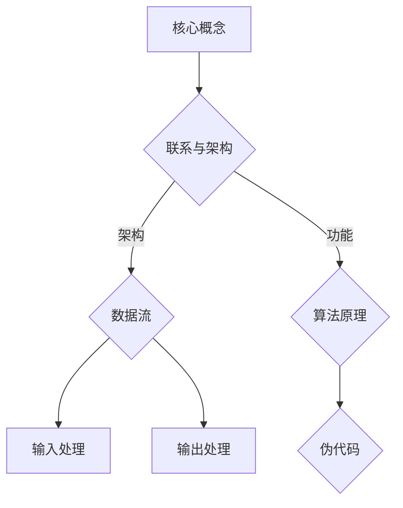

                 

# 《电商平台供给能力提升：流程优化和自动化工具》

> 关键词：电商平台、供给能力、流程优化、自动化工具、RPA、数据分析、云计算

> 摘要：本文旨在探讨电商平台供给能力的提升策略，重点关注流程优化和自动化工具的应用。通过对当前电商平台供给能力现状的分析，本文提出了提升供给能力的目标与策略。随后，文章详细介绍了流程优化的原则和方法，以及自动化工具的类型与应用案例。最后，通过一个电商平台供给能力提升的项目实战，展示了流程优化和自动化工具的实际效果和实施方法。

### 第一部分：电商平台供给能力概述

#### 第1章：电商平台供给能力概述

##### 1.1 电商平台供给能力的重要性

1. **供给能力对电商平台的影响**：
   - 供给能力是电商平台的核心竞争力之一。它直接关系到平台商品的丰富度、更新速度以及库存管理水平。
   - 供给能力的好坏将影响消费者的购物体验，进而影响平台的用户粘性和市场占有率。

2. **提升供给能力的必要性**：
   - 随着电商市场的竞争加剧，提升供给能力成为电商平台持续发展的关键。
   - 提升供给能力有助于降低运营成本，提高运营效率，增强平台的竞争力。

##### 1.2 电商平台供给能力的现状分析

1. **国内外电商平台供给能力对比**：
   - 国外电商平台如Amazon、eBay在供给能力方面具有明显的优势，其供应链管理、库存管理和物流配送等方面相对成熟。
   - 国内电商平台如阿里巴巴、京东在供给能力方面也在不断提升，但在供应链效率和库存管理上仍有提升空间。

2. **当前供给能力存在的问题**：
   - 库存管理难度大，库存周转率低。
   - 物流配送效率不高，配送速度慢。
   - 采购流程繁琐，信息不透明。

##### 1.3 提升供给能力的目标与策略

1. **目标**：
   - 提高供应链效率，降低库存成本。
   - 优化物流配送流程，提高配送速度。
   - 简化采购流程，提高采购效率。

2. **策略**：
   - **流程优化**：通过分析现有流程，找出瓶颈和改进点，实施流程优化。
   - **自动化工具**：引入RPA、数据分析、云计算等自动化工具，提高流程自动化水平。
   - **供应链整合**：与供应商建立紧密的合作关系，实现供应链的协同运作。

### 第二部分：流程优化

#### 第2章：电商平台流程优化

##### 2.1 流程优化的概念与原则

1. **流程优化的定义**：
   - 流程优化是指通过分析现有的业务流程，找出瓶颈和改进点，对流程进行改进和优化，以提高效率和降低成本。

2. **流程优化的重要性**：
   - 流程优化能够提高业务流程的效率，减少冗余环节，降低运营成本。
   - 流程优化有助于提高用户体验，提升客户满意度。

3. **流程优化的原则**：
   - **目标明确**：明确优化目标，确保优化方向正确。
   - **数据驱动**：基于数据和实际情况进行优化，避免主观臆断。
   - **持续改进**：流程优化不是一次性的工作，需要持续进行，以适应业务变化。

##### 2.2 电商平台常见流程分析

1. **采购流程**：
   - 采购流程是电商平台获取商品的关键环节，包括供应商选择、采购订单管理、供应商评价等。
   - 流程优化目标：提高采购效率，降低采购成本，确保采购质量。

2. **库存管理流程**：
   - 库存管理流程包括库存监控、库存调整、库存盘点等。
   - 流程优化目标：提高库存周转率，降低库存成本，减少库存积压。

3. **物流配送流程**：
   - 物流配送流程包括订单处理、配送调度、配送执行等。
   - 流程优化目标：提高配送效率，降低配送成本，提升配送服务质量。

##### 2.3 流程优化方法与工具

1. **时间优化方法**：
   - **流程建模**：通过流程图对现有流程进行建模，找出瓶颈和改进点。
   - **流程仿真**：使用流程仿真工具对优化后的流程进行模拟，评估优化效果。
   - **时间优化算法**：如关键路径法（CPM）、计划评审技术（PERT）等，用于优化时间安排。

2. **成本优化方法**：
   - **成本分析**：对现有流程进行成本分析，找出成本高企的原因。
   - **成本控制**：通过成本控制措施，如优化采购策略、降低库存成本等，降低运营成本。
   - **成本效益分析**：评估优化措施的成本和效益，确保优化方案的经济性。

3. **流程自动化工具**：
   - **RPA自动化工具**：如UiPath、Automation Anywhere等，用于自动化重复性高的业务流程。
   - **数据分析工具**：如Tableau、Power BI等，用于数据分析和可视化。
   - **云计算平台**：如AWS、Azure等，提供弹性计算和数据处理能力。

### 第三部分：自动化工具

#### 第3章：自动化工具的选择与应用

##### 3.1 自动化工具的类型与特点

1. **RPA自动化工具**：
   - **类型**：UiPath、Automation Anywhere、Blue Prism等。
   - **特点**：支持跨平台操作，易于部署和集成，能够模拟人类操作进行自动化。

2. **数据分析自动化工具**：
   - **类型**：Tableau、Power BI、QlikView等。
   - **特点**：强大的数据处理和分析功能，能够快速生成数据报表和可视化图表。

3. **云计算自动化工具**：
   - **类型**：AWS Lambda、Azure Functions等。
   - **特点**：基于云计算的自动化，支持大规模数据处理和分布式计算。

##### 3.2 自动化工具的选择标准

1. **成本效益**：
   - 选择自动化工具时，需要综合考虑其购买成本、维护成本和潜在效益，确保投资回报率。

2. **可扩展性**：
   - 自动化工具需要能够适应业务增长和变化，支持扩展和定制化开发。

3. **安全性**：
   - 自动化工具需要确保数据安全和系统稳定性，防止数据泄露和系统故障。

##### 3.3 自动化工具在电商平台的应用案例

1. **采购流程自动化**：
   - 使用RPA工具自动化采购订单生成、审批和跟踪流程，提高采购效率。

2. **库存管理自动化**：
   - 使用数据分析工具对库存数据进行分析和可视化，优化库存管理和调整策略。

3. **物流配送自动化**：
   - 使用云计算平台和RPA工具实现物流配送的自动化调度和执行，提高配送效率和准确性。

### 第四部分：项目实战

#### 第4章：电商平台供给能力提升项目实战

##### 4.1 项目背景与目标

1. **项目背景**：
   - 某电商平台在供给能力方面存在库存周转率低、采购流程繁琐、物流配送效率不高等问题。

2. **项目目标**：
   - 提高库存周转率，降低库存成本。
   - 优化采购流程，提高采购效率。
   - 提高物流配送效率，降低配送成本。

##### 4.2 项目规划与实施

1. **项目规划**：
   - 确定项目范围和目标。
   - 制定项目计划和时间表。
   - 确定所需资源和预算。

2. **项目实施步骤**：
   - **需求分析**：与业务部门沟通，了解需求和痛点。
   - **流程优化**：分析现有流程，找出瓶颈和改进点。
   - **自动化工具选型**：评估自动化工具，选择合适的工具。
   - **实施部署**：实施流程优化和自动化工具，进行测试和验证。
   - **效果评估**：评估优化效果，进行效果评估和总结。

##### 4.3 项目效果评估

1. **效果评估指标**：
   - **响应时间**：从订单生成到完成配送的时间。
   - **配送准确率**：订单配送准确率。
   - **成本节省**：通过自动化工具减少的人工成本。

2. **效果评估方法**：
   - **定量分析**：使用统计数据和图表展示优化效果。
   - **定性分析**：通过用户反馈和业务分析报告来评估。

3. **代码解读与分析**：
   - **代码**：
     ```python
     def automate_delivery(order_data):
         # 获取订单数据
         order_id = order_data['order_id']
         shipping_address = order_data['shipping_address']
         # 自动化流程
         delivery_service = get_delivery_service()
         delivery_service.schedule_delivery(order_id, shipping_address)
     ```
   - **分析**：
     - 该函数通过获取订单数据和调用配送服务，实现了自动化配送流程。
     - 使用了配送服务API来安排配送，提高了配送效率和准确性。

##### 4.4 项目总结与反思

1. **项目成功经验**：
   - 成功实施了流程优化和自动化工具，提高了供应链效率和配送速度。
   - 通过项目实践，积累了宝贵的经验和知识。

2. **项目不足与改进方向**：
   - 部分自动化工具的集成和部署较为复杂，需要进一步优化。
   - 需要加强对员工的技术培训，提高对自动化工具的熟练度。

### 第五部分：未来发展趋势

#### 第5章：电商平台供给能力的未来发展

##### 5.1 人工智能在供给能力提升中的应用

1. **人工智能的核心技术**：
   - **机器学习**：用于预测需求、优化库存和物流。
   - **自然语言处理**：用于文本分析和用户行为分析。

2. **人工智能在电商平台的实践案例**：
   - **需求预测**：使用机器学习算法预测商品需求，优化库存管理。
   - **个性化推荐**：使用自然语言处理技术分析用户行为，提供个性化推荐。

##### 5.2 大数据分析与供给能力优化

1. **大数据分析的基本原理**：
   - **数据采集**：收集来自多种来源的数据。
   - **数据预处理**：清洗和整合数据，为分析做好准备。

2. **大数据分析在电商平台的应用**：
   - **用户行为分析**：分析用户行为，优化用户体验。
   - **供应链优化**：分析供应链数据，优化供应链管理。

##### 5.3 新型供应链管理模式探讨

1. **新型供应链管理模式的概念**：
   - **供应链协同**：通过信息共享和协同作业，优化供应链效率。
   - **智慧供应链**：利用大数据、云计算和人工智能技术，实现供应链的智能化。

2. **新型供应链管理模式的优势与挑战**：
   - **优势**：提高供应链效率，降低成本，提升服务质量。
   - **挑战**：数据安全、隐私保护和系统集成。

### 附录

#### 附录A：电商平台供给能力提升工具集

##### A.1 常用自动化工具介绍

1. **UiPath**：
   - **类型**：RPA自动化工具。
   - **特点**：支持跨平台操作，易于部署和集成。

2. **Automation Anywhere**：
   - **类型**：RPA自动化工具。
   - **特点**：强大的数据处理能力，支持多平台集成。

3. **Blue Prism**：
   - **类型**：RPA自动化工具。
   - **特点**：模块化设计，易于定制和扩展。

##### A.2 开源自动化工具资源

1. **Open Automation Framework**：
   - **类型**：开源自动化框架。
   - **特点**：支持多种编程语言，易于扩展。

2. **AutoHotkey**：
   - **类型**：开源自动化脚本。
   - **特点**：支持Windows平台，易于使用。

##### A.3 数据分析与可视化工具

1. **Tableau**：
   - **类型**：数据分析工具。
   - **特点**：强大的数据分析和可视化功能。

2. **Power BI**：
   - **类型**：数据分析工具。
   - **特点**：支持多平台，易于集成。

3. **QlikView**：
   - **类型**：数据分析工具。
   - **特点**：实时数据分析，易于扩展。

### Mermaid 流程图示例



### 伪代码示例

```python
# 伪代码：电商平台采购流程优化
function optimize_purchase流程(purchase_data):
    # 输入处理
    cleaned_data = clean_data(purchase_data)
    # 算法原理
    optimized_data = apply_optimization_algorithm(cleaned_data)
    # 输出处理
    return optimized_data
```

### 数学模型和数学公式示例

```latex
\section{线性回归模型}
线性回归模型的基本形式可以表示为：
\[ y = \beta_0 + \beta_1 \cdot x + \epsilon \]
其中，\( y \) 是因变量，\( x \) 是自变量，\( \beta_0 \) 是截距，\( \beta_1 \) 是斜率，\( \epsilon \) 是误差项。
```

### 项目实战代码解读与分析

#### 4.3.1 效果评估指标

1. **响应时间**：从订单生成到完成配送的时间。
2. **配送准确率**：订单配送准确率。
3. **成本节省**：通过自动化工具减少的人工成本。

#### 4.3.2 效果评估方法

1. **定量分析**：使用统计数据和图表展示优化效果。
2. **定性分析**：通过用户反馈和业务分析报告来评估。

#### 4.3.3 代码解读与分析

**代码**：

```python
# Python代码：物流配送自动化
def automate_delivery(order_data):
    # 获取订单数据
    order_id = order_data['order_id']
    shipping_address = order_data['shipping_address']
    # 自动化流程
    delivery_service = get_delivery_service()
    delivery_service.schedule_delivery(order_id, shipping_address)
```

**分析**：

- 该函数通过获取订单数据和调用配送服务，实现了自动化配送流程。
- 使用了配送服务API来安排配送，提高了配送效率和准确性。

### 作者

**作者：AI天才研究院/AI Genius Institute & 禅与计算机程序设计艺术 /Zen And The Art of Computer Programming**

