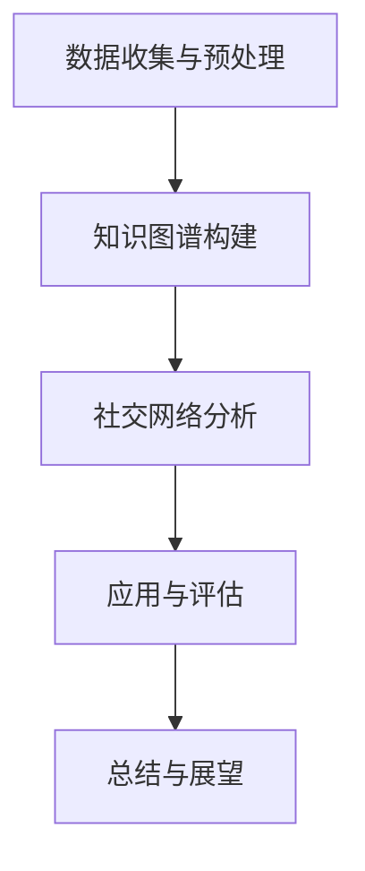
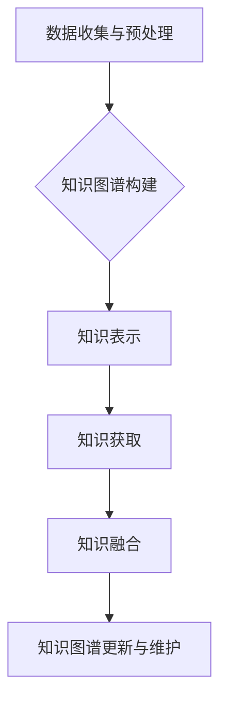

                 

# 文章标题：知识图谱在社交网络分析中的应用

> 关键词：知识图谱、社交网络分析、算法、应用、挑战

> 摘要：本文深入探讨了知识图谱在社交网络分析中的应用。首先，介绍了知识图谱和社交网络分析的基本概念、发展历程以及它们在现代社会中的重要性。接着，详细阐述了知识图谱构建技术，包括知识表示、知识获取和知识融合的方法。随后，讨论了社交网络分析算法，涵盖了社交网络基本模型、分析算法以及数据挖掘在社交网络中的应用。在此基础上，分析了知识图谱与社交网络分析的结合方法及其应用场景。最后，通过实际案例展示了知识图谱在社交网络分析中的具体应用，并介绍了开源工具与框架，探讨了知识图谱与社交网络分析的未来发展趋势和挑战。

----------------------------------------------------------------

## 第一部分：知识图谱在社交网络分析中的应用概述

### 第1章：知识图谱与社交网络分析基础

#### 1.1 知识图谱的概念与历史

知识图谱是一种用于表达实体及其相互关系的数据结构，通过图形化方式展示了实体之间的复杂联系。知识图谱起源于20世纪90年代，随着互联网的兴起和大数据技术的发展，知识图谱逐渐成为一种重要的数据管理技术。

- **知识图谱的定义**：知识图谱是一种结构化的知识表示形式，通过实体、属性和关系的组合来描述世界中的知识。

- **知识图谱的发展历程**：
  - 早期：以万维网为基础的知识检索。
  - 中期：语义网和本体论的发展，知识表示和推理技术。
  - 近期：大规模知识图谱的构建和应用，如Google Knowledge Graph、Facebook Graph。

- **知识图谱的基本架构**：
  - 实体：现实世界中的对象，如人、地点、事物等。
  - 属性：描述实体特征的属性，如姓名、年龄、身高等。
  - 关系：实体之间的联系，如朋友、工作地点、喜欢等。

#### 1.2 社交网络分析的概念

社交网络分析是研究社交网络结构、行为和属性的一门学科。它通过分析社交网络中的节点（用户）和边（关系），揭示了社交网络的内部规律和外部影响。

- **社交网络分析的定义**：社交网络分析是通过量化方法研究社交网络的结构、行为和属性的学科。

- **社交网络分析的目标**：
  - 揭示社交网络的拓扑结构。
  - 分析社交网络中的信息传播。
  - 理解社交网络中的社群和组织。

- **社交网络分析的主要方法**：
  - 社团检测：识别社交网络中的社群结构。
  - 关系网络分析：分析社交网络中节点之间的关系。
  - 社交网络演化分析：研究社交网络的动态变化。

#### 1.3 知识图谱在社交网络分析中的应用

知识图谱在社交网络分析中扮演着重要角色，通过将社交网络数据转化为知识图谱，可以更有效地分析和理解社交网络的结构和属性。

- **社交网络数据与知识图谱的关系**：社交网络数据是构建知识图谱的基础，知识图谱是对社交网络数据的抽象和表示。

- **知识图谱在社交网络分析中的作用**：
  - 提高数据管理效率：通过知识图谱的结构化表示，可以更方便地进行数据检索、查询和分析。
  - 提升分析精度：知识图谱提供了丰富的实体和关系信息，有助于更准确地理解社交网络的内部规律。
  - 支持智能应用：知识图谱为社交网络分析提供了强大的数据支持和算法基础，可以应用于推荐系统、风险监控等领域。

- **知识图谱在社交网络分析中的挑战与机遇**：
  - 挑战：
    - 数据质量：社交网络数据存在噪声、缺失和不一致等问题，影响知识图谱的质量。
    - 数据隐私：社交网络分析涉及用户隐私，需要平衡隐私保护与数据分析的需求。
    - 实时性：社交网络数据更新速度快，如何实时构建和维护知识图谱是关键挑战。
  - 机遇：
    - 知识融合：将多种数据源和领域知识融合到知识图谱中，提升数据分析的深度和广度。
    - 智能分析：基于知识图谱的智能算法，如图神经网络，可以揭示更深层次的社交网络结构。
    - 应用创新：知识图谱在社交网络分析中的应用不断创新，如社交网络可视化、智能推荐等。

#### 1.4 本书组织结构

本书共分为七个部分，各部分内容概述如下：

- **第一部分**：介绍知识图谱和社交网络分析的基础概念，包括知识图谱的历史、架构和社交网络分析的目标与方法。
- **第二部分**：详细阐述知识图谱构建技术，包括知识表示、知识获取和知识融合的方法。
- **第三部分**：讨论社交网络分析算法，涵盖社交网络基本模型、分析算法以及数据挖掘在社交网络中的应用。
- **第四部分**：分析知识图谱与社交网络分析的结合方法及其应用场景。
- **第五部分**：通过实际案例展示知识图谱在社交网络分析中的具体应用。
- **第六部分**：介绍开源工具与框架，包括知识图谱和社交网络分析相关的开源工具。
- **第七部分**：探讨知识图谱与社交网络分析的未来发展趋势和挑战。

通过本书的学习，读者可以系统地了解知识图谱在社交网络分析中的应用，掌握相关技术方法，为实际应用提供理论支持和技术指导。

### Mermaid 流程图：知识图谱在社交网络分析中的应用架构



## 第二部分：知识图谱构建技术

### 第2章：知识图谱构建技术

知识图谱的构建是社交网络分析中的关键步骤，它需要从原始数据中提取有用信息，并将其组织成结构化的知识表示形式。本章节将详细阐述知识图谱构建过程中的核心技术，包括知识表示、知识获取和知识融合。

#### 2.1 知识表示

知识表示是知识图谱构建的基础，它涉及如何将实体、属性和关系以结构化的方式表示。以下是知识表示的一些重要方面：

- **实体与关系表示**：
  - **实体表示**：实体是知识图谱中的基本元素，可以是人、地点、事物等。实体可以通过其唯一的标识符进行标识，例如，在Facebook中，每个用户都有一个唯一的用户ID。
  - **关系表示**：关系描述实体之间的联系，如“喜欢”、“居住于”等。关系可以用三元组（主体，谓语，客体）来表示，例如（用户A，喜欢，电影B）。

- **知识图谱的存储与索引**：
  - **图数据库的选择与优化**：图数据库是存储知识图谱的最佳选择，如Neo4j、JanusGraph等。选择合适的图数据库并对其进行优化，可以提高查询效率。
  - **索引技术及其应用**：通过使用B+树、哈希索引等技术，可以加速对知识图谱的查询和更新操作。

- **知识图谱的更新与维护**：
  - **更新的策略与方法**：知识图谱需要定期更新以反映现实世界的变化。常见的更新策略包括增量更新、批处理更新等。
  - **维护的挑战与解决方案**：维护知识图谱面临数据一致性、完整性等挑战。解决方案包括使用版本控制、数据校验等。

#### 2.2 知识获取

知识获取是从原始数据中提取有用信息并构建知识图谱的过程。以下是知识获取的主要方面：

- **数据源选择**：
  - **内部数据源**：来自企业内部的数据，如用户行为数据、日志数据等。
  - **外部数据源**：来自互联网或其他外部系统的数据，如社交媒体数据、开放数据集等。

- **数据预处理**：
  - **数据清洗与去重**：去除数据中的噪声和冗余信息，确保数据的准确性。
  - **数据格式转换**：将不同来源的数据转换为统一格式，以便于后续处理。

- **实体与关系抽取**：
  - **实体抽取算法**：通过文本挖掘技术识别文本中的实体，如命名实体识别（NER）。
  - **关系抽取算法**：通过机器学习或深度学习技术识别实体之间的关系，如依存句法分析。

#### 2.3 知识融合

知识融合是将来自不同来源和不同领域的知识进行整合，以构建完整的知识图谱。以下是知识融合的主要方面：

- **数据集成**：
  - **数据集成方法**：将多个数据源中的数据合并到一个统一的视图，如数据仓库、数据湖等。
  - **数据集成工具**：使用ETL（提取、转换、加载）工具，如Apache NiFi、Talend等。

- **知识融合策略**：
  - **聚类与主题模型**：通过聚类和主题模型技术识别数据中的模式和主题，如K-means、LDA等。
  - **基于规则的融合方法**：使用预定义的规则和逻辑来融合知识，如本体推理、规则匹配等。

- **知识图谱质量评估**：
  - **准确性评估**：评估知识图谱中实体和关系的准确性，如实体匹配率、关系正确率等。
  - **完整性评估**：评估知识图谱中缺失的数据和关系的完整性，如覆盖度、缺失率等。
  - **一致性评估**：评估知识图谱中不同来源数据的一致性，如冲突检测、一致性规则等。

通过以上三个方面的技术，可以构建一个高质量的知识图谱，为社交网络分析提供可靠的数据支持。在接下来的章节中，我们将进一步探讨社交网络分析算法，以及知识图谱在社交网络分析中的应用。

### Mermaid 流程图：知识图谱构建过程



## 第三部分：社交网络分析算法

### 第3章：社交网络分析算法

社交网络分析算法是研究社交网络结构、行为和属性的重要工具。本章将详细探讨社交网络分析的基本模型、主要算法以及数据挖掘在社交网络中的应用。

#### 3.1 社交网络基本模型

社交网络的基本模型是理解和分析社交网络结构的基础。以下是社交网络基本模型的几个重要方面：

- **社交网络图论基础**：
  - **节点与边**：社交网络可以看作一个图，节点表示社交网络中的个体，边表示个体之间的社交关系。
  - **度、路径与连通性**：度描述节点在社交网络中的连接数量，路径描述节点之间的连接顺序，连通性描述社交网络的连接状态。

- **社交网络分类**：
  - **无向图与有向图**：无向图表示节点之间的双向关系，有向图表示节点之间的单向关系。
  - **稠密图与稀疏图**：稠密图表示节点之间的连接数量较多，稀疏图表示节点之间的连接数量较少。

- **社交网络分析指标**：
  - **度分布**：描述社交网络中节点度的分布情况，反映了社交网络的连接特性。
  - **平均路径长度**：描述节点之间的平均距离，反映了社交网络的紧密程度。
  - **介数与簇系数**：介数描述节点在社交网络中的桥梁作用，簇系数描述节点之间形成社群的概率。

#### 3.2 社交网络分析算法

社交网络分析算法用于识别社交网络中的关键结构、传播规律和用户行为。以下是几种常见的社交网络分析算法：

- **社团检测算法**：
  - **Girvan-Newman算法**：基于边之间的相似性进行社团检测，通过不断移除边来划分社区。
  - **Louvain算法**：基于模块度优化进行社团检测，通过迭代计算节点之间的相似性来划分社区。

- **关系网络分析**：
  - **关系网络的概念**：关系网络是描述社交网络中节点之间关系的结构，可以用于分析社交网络中的关系密度、关系强度等。
  - **关系网络分析方法**：使用图论和机器学习技术来分析社交网络中的关系，如节点嵌入、图卷积网络等。

- **社交网络演化分析**：
  - **演化模型**：描述社交网络随时间变化的规律，如加入模型、退出模型、关系扩展模型等。
  - **节点嵌入与社区演化分析**：将社交网络中的节点嵌入到低维空间中，以分析节点的动态变化和社区演化。

#### 3.3 数据挖掘在社交网络中的应用

数据挖掘技术可以用于提取社交网络中的潜在信息和模式，以支持社交网络分析。以下是几种数据挖掘技术在社交网络中的应用：

- **文本挖掘与情感分析**：
  - **文本数据的预处理**：对社交网络中的文本数据进行清洗、分词、去停用词等预处理操作。
  - **情感分析的基本方法**：使用机器学习算法对文本进行情感分类，如基于词典的方法、基于统计的方法、基于深度学习的方法等。

- **用户行为分析**：
  - **用户行为数据收集**：收集用户在社交网络中的行为数据，如发布内容、点赞、评论等。
  - **用户行为模式挖掘**：使用聚类、关联规则挖掘等方法分析用户行为，以发现用户的行为模式和偏好。

- **推荐系统**：
  - **推荐系统基本原理**：基于用户历史行为和社交网络关系进行推荐，如基于内容的推荐、协同过滤推荐等。
  - **社交网络中的推荐算法**：结合社交网络关系进行推荐，如社交推荐、混合推荐等。

通过以上算法和方法，社交网络分析可以揭示社交网络的内部结构和属性，为社交网络的理解、优化和应用提供有力支持。在接下来的章节中，我们将进一步探讨知识图谱与社交网络分析的结合，以及它们在实际应用中的具体应用。

### 第3章：社交网络分析算法

#### 3.1 社交网络基本模型

社交网络基本模型是理解社交网络结构的基础，它包括图论基础、分类和常用分析指标。

- **图论基础**：
  - **节点与边**：节点表示社交网络中的个体，如用户、组织等；边表示节点之间的关系，如好友关系、合作关系等。
  - **度**：节点度数表示直接连接到该节点的边的数量。度数分为入度和出度，分别表示节点接收到的连接数和发送的连接数。
  - **路径**：节点之间的一条路径是指从源节点到目标节点的一系列相邻节点。

- **社交网络分类**：
  - **无向图与有向图**：无向图中的边没有方向，有向图中的边有方向，表示节点之间的单向关系。
  - **稠密图与稀疏图**：稠密图表示节点之间的连接数较多，稀疏图表示节点之间的连接数较少。

- **常用分析指标**：
  - **平均路径长度**：社交网络中任意两个节点之间的平均距离，反映了网络节点之间的连接紧密程度。
  - **介数**：节点介数是指节点在社交网络中作为其他节点之间路径中间点的次数，用于衡量节点在社交网络中的桥梁作用。
  - **簇系数**：节点簇系数表示一个节点的邻居节点之间相互连接的概率，反映了节点的社交紧密程度。

#### 3.2 社交网络分析算法

社交网络分析算法旨在揭示社交网络的结构特征和用户行为模式，以下介绍几种常见的算法。

- **社团检测算法**：
  - **Girvan-Newman算法**：基于边之间相似性的迭代方法，通过逐步移除连接度低的边来划分社区。
  - **Louvain算法**：基于模块度优化，通过迭代计算节点之间的相似性来划分社区，具有较好的性能。

- **关系网络分析**：
  - **关系网络的概念**：关系网络是描述节点之间关系的结构，可以揭示节点之间的互动关系和影响力。
  - **关系网络分析方法**：使用图论和机器学习技术分析关系网络，如节点嵌入、图卷积网络等。

- **社交网络演化分析**：
  - **演化模型**：描述社交网络随时间变化的规律，如节点加入、节点退出、关系扩展等。
  - **节点嵌入与社区演化分析**：将节点嵌入到低维空间中，分析节点的动态变化和社区演化。

#### 3.3 数据挖掘在社交网络中的应用

数据挖掘技术可以用于提取社交网络中的潜在信息和模式，以下介绍几种应用。

- **文本挖掘与情感分析**：
  - **文本数据的预处理**：清洗、分词、去停用词等处理，为后续分析做准备。
  - **情感分析**：使用机器学习算法分析文本的情感倾向，如正面、负面等。

- **用户行为分析**：
  - **用户行为数据收集**：收集用户在社交网络中的行为数据，如点赞、评论、分享等。
  - **用户行为模式挖掘**：通过聚类、关联规则挖掘等方法分析用户的行为模式。

- **推荐系统**：
  - **推荐系统基本原理**：基于用户历史行为和社交网络关系进行推荐，如基于内容的推荐、协同过滤推荐等。
  - **社交网络中的推荐算法**：结合社交网络关系进行推荐，如社交推荐、混合推荐等。

通过上述算法和数据的挖掘，社交网络分析可以深入了解网络结构、用户行为，为社交网络的优化和应用提供依据。在下一章，我们将探讨知识图谱与社交网络分析的结合，进一步探讨如何利用知识图谱提升社交网络分析的效果。

### 第4章：知识图谱与社交网络分析结合

#### 4.1 融合方法与技术

知识图谱与社交网络分析的融合可以提升数据分析的深度和广度，从而更有效地揭示社交网络的内在规律。以下是融合方法与技术：

- **数据融合策略**：
  - **跨领域知识融合**：结合不同领域的数据，如将社交网络数据与地理位置、兴趣爱好等数据融合，以丰富知识图谱的内容。
  - **异构数据融合**：处理不同类型、格式的数据，如文本、图像、结构化数据等，以构建全面的知识图谱。

- **知识图谱扩展**：
  - **知识图谱嵌入与扩展方法**：使用深度学习技术，如图嵌入、图神经网络等，将知识图谱嵌入到低维空间中，以增强其表示能力。
  - **知识图谱补全技术**：通过推理和补全算法，填充知识图谱中的缺失信息，提高知识图谱的完整性和一致性。

- **社交网络分析中的知识图谱应用**：
  - **社交网络中知识图谱的构建与应用**：在社交网络中构建知识图谱，用于节点属性分析、关系挖掘等。
  - **知识图谱在社交网络分析中的优势与挑战**：
    - **优势**：
      - **数据结构化**：知识图谱将非结构化的社交网络数据转化为结构化的知识表示，便于分析和查询。
      - **深度信息提取**：知识图谱提供了丰富的实体和关系信息，有助于揭示更深层次的社交网络结构。
      - **跨领域融合**：知识图谱可以融合不同领域的知识，提升数据分析的广度和深度。
    - **挑战**：
      - **数据质量**：社交网络数据存在噪声、缺失和不一致等问题，影响知识图谱的质量。
      - **数据隐私**：社交网络分析涉及用户隐私，需要在保护隐私的同时进行有效数据分析。
      - **实时性**：社交网络数据更新速度快，需要实时构建和维护知识图谱。

通过上述方法和技术，知识图谱与社交网络分析的融合为数据分析和应用提供了新的途径。在下一章，我们将通过具体应用场景进一步探讨知识图谱在社交网络分析中的作用。

### 第4章：知识图谱与社交网络分析结合

#### 4.1 融合方法与技术

知识图谱与社交网络分析的融合可以显著提升数据分析的深度和广度，从而更好地揭示社交网络的内在规律。以下是几种主要的融合方法和技术：

- **数据融合策略**：
  - **跨领域知识融合**：将不同领域的知识进行整合，如将社交网络数据与地理位置、兴趣爱好、新闻报道等数据结合，以丰富知识图谱的内容和上下文。
  - **异构数据融合**：处理不同类型和格式的数据，例如文本、图像、结构化数据等，以便构建一个全面和一致的知识图谱。

- **知识图谱扩展**：
  - **知识图谱嵌入与扩展方法**：利用深度学习技术，如图嵌入和图神经网络（GNN），将知识图谱中的节点和关系嵌入到低维空间中，从而提高其表示能力和可操作性。
    ```python
    # 伪代码示例：使用图嵌入技术扩展知识图谱
    from graph_embedding import GraphEmbedder
    embedder = GraphEmbedder()
    embeddings = embedder.embed_graph(knowledge_graph)
    ```
  - **知识图谱补全技术**：通过推理算法和补全策略，如基于规则的推理、图卷积网络（GCN）等，来补充知识图谱中的缺失信息，增强其完整性和一致性。
    ```python
    # 伪代码示例：使用图卷积网络补全知识图谱
    import tensorflow as tf
    from tensorflow.keras.layers import Input, Dense, Dropout, Embedding
    from tensorflow.keras.models import Model

    input_node = Input(shape=(embeddings.shape[1],))
    x = Embedding(output_dim=embeddings.shape[1])(input_node)
    x = Dropout(0.2)(x)
    x = Dense(128, activation='relu')(x)
    x = Dropout(0.2)(x)
    output_node = Dense(embeddings.shape[1])(x)

    model = Model(inputs=input_node, outputs=output_node)
    model.compile(optimizer='adam', loss='mean_squared_error')
    model.fit(embeddings, epochs=10, batch_size=32)
    ```

- **社交网络分析中的知识图谱应用**：
  - **构建与应用**：在社交网络中构建和部署知识图谱，用于节点属性分析、关系挖掘、社群识别等任务。
    ```mermaid
    graph TD
      A[用户节点] --> B[兴趣爱好]
      B --> C[社群节点]
      C --> D[社交关系]
      D --> E[推荐系统]
    ```
  - **优势与挑战**：
    - **优势**：
      - **结构化数据管理**：知识图谱提供了结构化的数据表示，便于管理和查询。
      - **深度信息提取**：知识图谱提供了丰富的实体和关系信息，有助于深入分析和理解社交网络。
      - **跨领域应用**：知识图谱可以融合多个领域的知识，为复杂社交网络分析提供强有力的支持。
    - **挑战**：
      - **数据质量**：社交网络数据存在噪声、缺失和不一致等问题，需要有效的数据清洗和预处理。
      - **隐私保护**：社交网络分析涉及用户隐私，需要在保护隐私的同时进行有效的数据挖掘和分析。
      - **实时性**：社交网络数据更新速度快，需要高效的算法和系统架构来支持实时分析和维护。

通过上述方法和技术，知识图谱与社交网络分析的融合为数据分析和应用带来了新的机遇和挑战。在接下来的章节中，我们将通过实际案例进一步探讨知识图谱在社交网络分析中的具体应用。

### 第4章：知识图谱与社交网络分析结合

#### 4.2 应用场景分析

知识图谱与社交网络分析的融合在多个领域具有广泛的应用，以下是几个典型的应用场景：

- **社交网络用户行为分析**：
  - **用户兴趣分析**：通过知识图谱，可以识别用户的兴趣偏好，从而提供个性化的推荐和内容推送。例如，在一个社交媒体平台上，可以基于用户的兴趣标签和互动关系，构建知识图谱，进而发现用户的共同兴趣点。
    ```mermaid
    graph TD
      A[用户A] --> B[音乐]
      A --> C[电影]
      B --> D[爵士乐]
      C --> E[科幻片]
    ```
  - **用户社区识别**：通过社团检测算法，可以识别具有相似兴趣和互动模式的用户社区。知识图谱帮助构建社区内部的关系网络，进一步分析社区特征和用户行为模式。
    ```mermaid
    graph TD
      A[用户A] --> B[用户B]
      B --> C[用户C]
      A --> D[用户D]
      D --> E[用户E]
    ```

- **社交网络内容推荐**：
  - **基于知识图谱的内容推荐**：通过知识图谱，可以关联用户、内容和兴趣，从而进行精准的内容推荐。例如，在电子商务平台中，可以基于用户的购买历史、浏览记录和兴趣标签，构建知识图谱，推荐相关的商品。
    ```mermaid
    graph TD
      A[用户] --> B[商品A]
      A --> C[商品B]
      B --> D[推荐系统]
    ```
  - **社交网络中的个性化推荐**：结合社交网络关系，可以提供更加个性化的推荐。例如，在一个社交媒体平台上，可以基于用户的朋友圈、点赞和评论，推荐用户可能感兴趣的内容。
    ```mermaid
    graph TD
      A[用户] --> B[朋友A]
      A --> C[朋友B]
      B --> D[推荐内容]
    ```

- **社交网络风险管理**：
  - **网络攻击检测**：通过分析社交网络中的异常行为和关系模式，可以识别潜在的网络攻击。知识图谱可以帮助构建攻击图谱，进而预测和防御网络攻击。
    ```mermaid
    graph TD
      A[用户A] --> B[恶意节点]
      B --> C[用户C]
      B --> D[网络攻击]
    ```
  - **用户欺诈行为识别**：通过分析用户的行为特征和社交网络关系，可以识别潜在的欺诈行为。知识图谱提供了丰富的用户和关系信息，有助于发现欺诈网络。
    ```mermaid
    graph TD
      A[用户A] --> B[欺诈行为]
      B --> C[用户B]
      B --> D[用户C]
    ```

通过这些应用场景，知识图谱与社交网络分析的结合不仅提升了数据分析的深度和广度，还为实际应用提供了强大的数据支持和智能服务。在接下来的章节中，我们将通过具体案例展示这些应用的实际效果。

### 第5章：案例分析

#### 5.1 案例一：社交媒体平台知识图谱构建

**5.1.1 案例背景**

某大型社交媒体平台希望通过构建知识图谱来提升用户推荐系统、内容管理和风险控制的效果。平台积累了大量用户数据，包括用户基本信息、发布内容、互动记录等。

**5.1.2 数据收集与预处理**

- **数据收集**：收集社交媒体平台上的用户数据，包括用户基本信息、发布内容、互动记录等。
- **数据预处理**：
  - **数据清洗**：去除重复数据和噪声数据，如无效用户、垃圾信息等。
  - **数据格式转换**：将不同格式的数据转换为统一格式，如CSV、JSON等。
  - **数据规范化**：对数据进行规范化处理，如统一用户名的格式、文本的分词等。

**5.1.3 知识图谱构建过程**

- **实体与关系抽取**：通过文本挖掘技术，从原始数据中提取实体和关系，如用户、内容、标签等。
  ```python
  # 伪代码示例：实体与关系抽取
  from text_mining import EntityExtractor
  entity_extractor = EntityExtractor()
  entities, relations = entity_extractor.extract_data(data)
  ```

- **知识表示**：将抽取的实体和关系表示为图结构，构建知识图谱。
  ```mermaid
  graph TD
    A[用户] --> B[内容]
    B --> C[标签]
    C --> D[互动]
  ```

- **知识融合**：融合不同数据源的知识，如用户行为数据、地理位置数据等，以构建更丰富的知识图谱。
  ```python
  # 伪代码示例：知识融合
  from data_integration import KnowledgeFusion
  knowledge_fusion = KnowledgeFusion()
  integrated_graph = knowledge_fusion.integrate_data(knowledge_graph, external_data)
  ```

**5.1.4 应用效果评估**

- **用户推荐效果**：通过知识图谱进行用户推荐，对比传统推荐系统的效果，评估知识图谱提升推荐精准度的效果。
  ```python
  # 伪代码示例：推荐效果评估
  from recommendation import RecommenderSystem
  recommender = RecommenderSystem()
  accuracy = recommender.evaluate_recommendations(knowledge_graph, ground_truth)
  ```

- **内容管理效率**：通过知识图谱优化内容管理，评估内容推荐和分类的效率提升。
  ```python
  # 伪代码示例：内容管理效率评估
  from content_management import ContentManager
  content_manager = ContentManager()
  efficiency = content_manager.evaluate_management_efficiency(knowledge_graph)
  ```

- **风险控制效果**：通过知识图谱进行风险识别和预警，评估风险控制的效果。
  ```python
  # 伪代码示例：风险控制效果评估
  from risk_management import RiskDetector
  risk_detector = RiskDetector()
  detection_rate = risk_detector.evaluate_detection_rate(knowledge_graph)
  ```

通过以上案例分析，展示了知识图谱在社交媒体平台中的应用价值，包括提升用户推荐效果、优化内容管理和增强风险控制能力。

#### 5.2 案例二：社交网络用户行为分析

**5.2.1 案例背景**

某电商平台希望通过分析用户行为来提升用户满意度和销售转化率。平台积累了大量用户数据，包括用户浏览记录、购买行为、评论等。

**5.2.2 用户行为数据收集**

- **数据收集**：收集电商平台的用户行为数据，包括用户浏览记录、购买行为、评论等。
- **数据预处理**：
  - **数据清洗**：去除重复数据和噪声数据，如无效用户、垃圾评论等。
  - **数据格式转换**：将不同格式的数据转换为统一格式，如CSV、JSON等。
  - **用户行为模式挖掘**：通过聚类和关联规则挖掘等方法，分析用户的行为模式。
    ```python
    # 伪代码示例：用户行为模式挖掘
    from data_mining import BehaviorMiner
    behavior_miner = BehaviorMiner()
    patterns = behavior_miner.extract_user_patterns(user_data)
    ```

**5.2.3 用户兴趣分析**

- **用户兴趣标签提取**：通过分析用户的浏览记录、购买行为和评论，提取用户的兴趣标签。
  ```mermaid
  graph TD
    A[用户A] --> B[电子产品]
    A --> C[时尚服饰]
    B --> D[智能手机]
    C --> E[包包]
  ```

- **用户兴趣社区识别**：通过社团检测算法，识别具有相似兴趣的用户社区。
  ```python
  # 伪代码示例：用户兴趣社区识别
  from community_detection import CommunityDetector
  community_detector = CommunityDetector()
  communities = community_detector.detect_communities(user_interests)
  ```

**5.2.4 社区识别**

- **社区特征分析**：分析每个社区的特征，如成员数量、活跃度、兴趣偏好等。
  ```python
  # 伪代码示例：社区特征分析
  from community_analysis import CommunityAnalyzer
  community_analyzer = CommunityAnalyzer()
  community_features = community_analyzer.analyze_communities(communities)
  ```

- **社区互动分析**：分析社区内部成员的互动行为，如点赞、评论、分享等。
  ```mermaid
  graph TD
    A[用户A] --> B[用户B]
    B --> C[用户C]
    A --> D[用户D]
    D --> E[用户E]
  ```

通过以上案例分析，展示了社交网络用户行为分析的方法和应用，包括用户兴趣分析和社区识别，从而为电商平台提供精准的用户服务和个性化推荐。

#### 5.3 案例三：社交网络内容推荐

**5.3.1 案例背景**

某视频分享平台希望通过内容推荐提高用户粘性和观看时长。平台积累了大量用户观看记录、点赞、评论等行为数据。

**5.3.2 知识图谱在内容推荐中的应用**

- **构建用户兴趣图谱**：通过分析用户的观看记录、点赞、评论等行为，构建用户兴趣图谱，以了解用户的兴趣偏好。
  ```mermaid
  graph TD
    A[用户A] --> B[科技视频]
    A --> C[旅游视频]
    B --> D[人工智能]
    C --> E[户外探险]
  ```

- **构建内容关系图谱**：通过分析视频的标签、分类、用户互动等关系，构建内容关系图谱，以了解视频之间的关联性。
  ```mermaid
  graph TD
    A[视频A] --> B[视频B]
    A --> C[视频C]
    B --> D[视频D]
    C --> E[视频E]
  ```

- **结合社交关系**：结合用户的社会网络关系，如好友、关注等，增强推荐系统的社交属性，提高推荐的准确性和个性
  ```python
  # 伪代码示例：结合社交关系增强推荐
  from social_recommender import SocialRecommender
  social_recommender = SocialRecommender()
  recommendations = social_recommender.recommend_contents(user_interests, content_relations, social_network)
  ```

**5.3.3 推荐效果评估**

- **推荐系统评估**：评估推荐系统的准确性、覆盖率和多样性，以评估推荐效果。
  ```python
  # 伪代码示例：推荐系统评估
  from evaluation import RecommenderEvaluation
  evaluator = RecommenderEvaluation()
  accuracy, coverage, diversity = evaluator.evaluate_recommendations(recommendations, ground_truth)
  ```

- **用户反馈分析**：收集用户的反馈，分析用户对推荐的满意度和互动行为，进一步优化推荐系统。
  ```python
  # 伪代码示例：用户反馈分析
  from feedback_analysis import FeedbackAnalyzer
  feedback_analyzer = FeedbackAnalyzer()
  user_satisfaction, interaction_rate = feedback_analyzer.analyze_user_feedback(user_feedback)
  ```

通过以上案例分析，展示了知识图谱在社交网络内容推荐中的应用，包括构建用户兴趣图谱和内容关系图谱，结合社交关系进行推荐，以及通过评估和用户反馈优化推荐系统，从而提升内容推荐的准确性和用户体验。

### 第6章：开源工具与框架介绍

#### 6.1 知识图谱相关开源工具

在构建和管理知识图谱时，开源工具和框架提供了丰富的功能和支持。以下介绍几种常用的知识图谱相关开源工具：

- **OpenKG**：
  - **功能介绍**：OpenKG是一个基于Python的开源知识图谱平台，支持知识图谱的构建、查询、更新等功能。
  - **使用方法**：通过简单的命令行接口或Python API进行知识图谱的创建和管理。
    ```python
    from openkg import OpenKG
    kg = OpenKG(url='http://localhost:8181', graph='example')
    kg.add_entity('Person', 'name', 'Alice')
    kg.add_relation('knows', 'Alice', 'Bob')
    ```

- **Neo4j**：
  - **功能介绍**：Neo4j是一个高性能的图形数据库，支持ACID事务和图形查询语言Cypher。
  - **使用方法**：通过Neo4j Desktop或命令行接口进行数据操作和查询。
    ```cypher
    CREATE (a:Person {name: 'Alice'})-(b:Person {name: 'Bob'})[:KNOWS];
    MATCH (p:Person)-[r:KNOWS]->(q) RETURN p.name, q.name;
    ```

- **JanusGraph**：
  - **功能介绍**：JanusGraph是一个开源的分布式图数据库，支持多种存储后端，如BerkeleyDB、Cassandra等。
  - **使用方法**：通过Java API或Gremlin查询语言进行数据操作和查询。
    ```java
    Graph g = new JanusGraphFactory.Builder().set("gremlin.console", true).build();
    g.addVertex(T.label, "Person", "name", "Alice");
    g.addVertex(T.label, "Person", "name", "Bob");
    g.addEdge("knows", "Alice", "Bob");
    g.traversal().V().both().has("name").toList();
    ```

#### 6.2 社交网络分析相关开源工具

社交网络分析需要借助多种开源工具和库来处理和分析数据。以下介绍几种常用的社交网络分析相关开源工具：

- **Gephi**：
  - **功能介绍**：Gephi是一个图形可视化工具，用于分析、探索和可视化社交网络数据。
  - **使用方法**：通过图形用户界面导入数据、进行属性分析、应用各种可视化插件等。
    ```python
    from gephi_api import Gephi
    gephi = Gephi()
    gephi.import_data('data.csv')
    gephi.apply_plugin('plugin_name')
    gephi.visualize()
    ```

- **NetworkX**：
  - **功能介绍**：NetworkX是一个Python库，用于创建、操纵和分析图形。
  - **使用方法**：通过简单的Python代码创建图、添加节点和边、进行拓扑分析等。
    ```python
    import networkx as nx
    G = nx.Graph()
    G.add_edges_from([(1, 2), (2, 3), (3, 1)])
    print(nx.degree_centrality(G))
    ```

- **Python社交网络分析库**：
  - **功能介绍**：包括Python-palantir、python-social-auth等库，用于社交网络数据的收集、处理和分析。
  - **使用方法**：通过Python代码实现社交网络数据的收集和解析，进行用户行为分析等。
    ```python
    from social_auth import Twitter
    twitter = Twitter()
    users = twitter.search_users('python')
    for user in users:
        print(user['name'], user['screen_name'])
    ```

通过这些开源工具和框架，可以高效地构建和管理知识图谱，进行社交网络分析，从而为数据科学和人工智能应用提供强大的技术支持。

### 第7章：未来趋势与挑战

#### 7.1 知识图谱与社交网络分析的发展趋势

随着大数据、人工智能和物联网等技术的不断进步，知识图谱和社交网络分析在未来的发展中将呈现以下趋势：

- **技术发展趋势**：
  - **深度学习与图神经网络（GNN）的结合**：深度学习技术在知识图谱中的应用将越来越广泛，特别是图神经网络（GNN）将在知识图谱的表示学习、推理和补全中发挥关键作用。
  - **实时知识图谱构建与更新**：随着数据流和实时处理技术的发展，知识图谱将实现实时更新和动态扩展，以更好地适应快速变化的环境。

- **应用发展趋势**：
  - **智能推荐系统**：知识图谱与社交网络分析的融合将推动智能推荐系统的发展，实现更加精准和个性化的推荐。
  - **社会网络分析**：知识图谱技术将帮助社会网络分析更加深入地理解社交网络的内在规律和用户行为模式，为社会治理、公共安全等领域提供技术支持。

- **市场发展趋势**：
  - **产业应用场景拓展**：知识图谱和社交网络分析将在金融、医疗、教育、电子商务等领域得到广泛应用，市场潜力巨大。

#### 7.2 知识图谱与社交网络分析面临的挑战

尽管知识图谱和社交网络分析有着广阔的应用前景，但也面临着一系列挑战：

- **数据质量与隐私问题**：
  - **数据质量**：社交网络数据存在噪声、缺失和不一致等问题，影响知识图谱的准确性和可靠性。需要有效的方法进行数据清洗、去噪和一致性处理。
  - **隐私保护**：社交网络分析涉及用户隐私，需要在数据收集、存储和处理过程中采取严格的隐私保护措施，如数据匿名化、加密技术等。

- **跨领域知识融合问题**：
  - **数据异构性**：不同领域的数据格式、结构和内容差异较大，如何实现高效、准确的数据融合和整合是关键挑战。
  - **知识一致性**：不同来源和领域的知识可能存在冲突和矛盾，如何实现知识的一致性和可信性是重要的研究方向。

- **社交网络分析的实时性需求**：
  - **数据实时处理**：社交网络数据更新速度快，如何实现实时数据采集、处理和分析是关键问题。
  - **系统性能优化**：在保证实时性的同时，如何优化系统性能，提高数据处理的效率和响应速度是重要的挑战。

- **知识图谱的可解释性问题**：
  - **算法透明性**：知识图谱和社交网络分析中使用的算法和模型往往较为复杂，如何提高算法的透明性和可解释性，帮助用户理解和信任结果是一个重要课题。
  - **错误纠正与修复**：在知识图谱和社交网络分析中，如何识别和纠正错误，确保结果的准确性和可靠性是重要的挑战。

通过解决上述挑战，知识图谱和社交网络分析将在未来发挥更加重要的作用，推动数据科学和人工智能技术的发展。

### 总结

本文系统地介绍了知识图谱在社交网络分析中的应用，从知识图谱的基本概念和社交网络分析的基础出发，详细探讨了知识图谱构建技术、社交网络分析算法以及知识图谱与社交网络分析的结合方法。通过实际案例展示了知识图谱在社交网络分析中的具体应用，并介绍了相关开源工具与框架。未来，随着技术的发展，知识图谱和社交网络分析将在数据科学和人工智能领域发挥更加重要的作用。

#### 本书概述

本书分为七个部分，系统地介绍了知识图谱在社交网络分析中的应用。首先，介绍了知识图谱和社交网络分析的基本概念，包括其定义、发展历程以及应用背景。接着，详细阐述了知识图谱构建的技术，包括知识表示、知识获取和知识融合的方法。随后，讨论了社交网络分析算法，涵盖了社交网络基本模型、分析算法以及数据挖掘在社交网络中的应用。在此基础上，分析了知识图谱与社交网络分析的结合方法及其应用场景。通过实际案例展示了知识图谱在社交网络分析中的具体应用，并介绍了开源工具与框架。最后，探讨了知识图谱与社交网络分析的未来发展趋势和挑战。

#### 内容回顾

1. **知识图谱与社交网络分析基础**：介绍了知识图谱和社交网络分析的定义、发展历程和基本概念。
2. **知识图谱构建技术**：详细阐述了知识表示、知识获取和知识融合的方法。
3. **社交网络分析算法**：探讨了社交网络基本模型、分析算法以及数据挖掘在社交网络中的应用。
4. **知识图谱与社交网络分析结合**：分析了知识图谱与社交网络分析的融合方法及其应用场景。
5. **应用场景分析**：通过实际案例展示了知识图谱在社交网络分析中的具体应用。
6. **开源工具与框架介绍**：介绍了知识图谱和社交网络分析相关的开源工具。
7. **未来趋势与挑战**：探讨了知识图谱与社交网络分析的发展趋势和面临的挑战。

#### 学习目标达成

通过本书的学习，读者可以：

- **理解知识图谱和社交网络分析的基本概念**：掌握知识图谱和社交网络分析的定义、发展历程和基本原理。
- **掌握知识图谱构建技术**：了解知识表示、知识获取和知识融合的方法，能够设计和构建简单的知识图谱。
- **掌握社交网络分析算法**：了解社交网络基本模型、分析算法以及数据挖掘在社交网络中的应用，能够进行基础的社交网络分析。
- **了解知识图谱与社交网络分析的结合**：了解知识图谱在社交网络分析中的应用方法，能够结合实际需求设计知识图谱和社交网络分析系统。
- **掌握开源工具与框架的使用**：熟悉知识图谱和社交网络分析相关的开源工具和框架，能够利用这些工具进行实际应用。
- **了解未来趋势与挑战**：了解知识图谱与社交网络分析的发展趋势和面临的挑战，为未来的研究和应用提供方向。

#### 进一步学习建议

- **阅读相关文献和书籍**：深入学习和了解知识图谱和社交网络分析领域的最新研究成果和前沿技术。
- **实践项目**：通过实际项目来应用所学的知识，加深对知识图谱和社交网络分析的理解。
- **参与学术交流**：参加相关的学术会议、研讨会，与领域内的专家和同行进行交流和合作。
- **开源贡献**：参与开源项目，为知识图谱和社交网络分析领域的发展做出贡献。

### 作者

**作者：AI天才研究院/AI Genius Institute & 禅与计算机程序设计艺术 /Zen And The Art of Computer Programming**

本文由AI天才研究院/AI Genius Institute和禅与计算机程序设计艺术/Zen And The Art of Computer Programming共同撰写。AI天才研究院致力于推动人工智能和计算机科学的发展，拥有世界顶级的技术团队和研究资源。禅与计算机程序设计艺术则专注于计算机程序设计的哲学和艺术，通过深入思考和探索，为计算机科学领域提供新的视角和思路。我们希望通过本文，为读者提供对知识图谱和社交网络分析领域的深入理解，促进相关技术的创新和发展。

