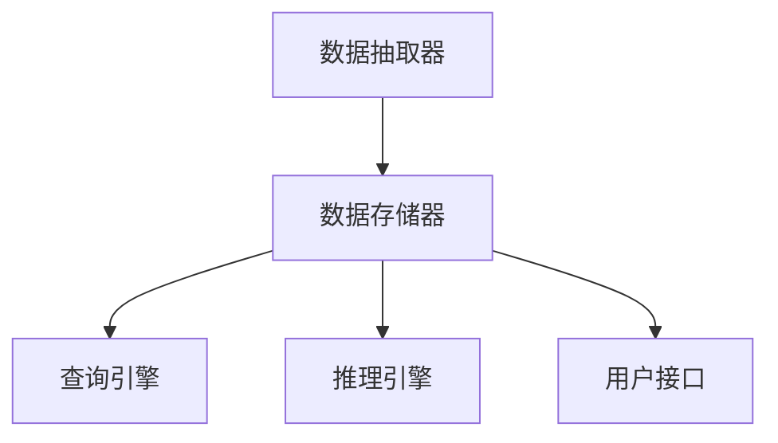
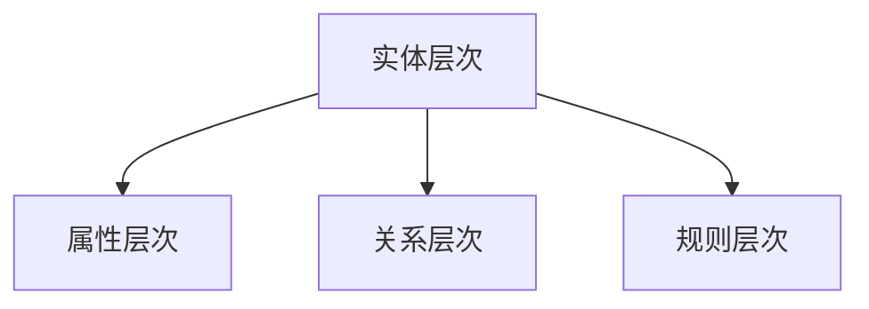

                 

### 第1章：知识图谱概述与原理

#### 1.1 知识图谱的定义与核心概念

知识图谱（Knowledge Graph）是一种用于表示实体、属性和关系的数据结构，其目的是将现实世界中的各种实体及其关系以结构化的形式呈现出来，以便于计算机理解和处理。知识图谱的核心概念包括实体（Entity）、属性（Attribute）和关系（Relationship）。

- **实体（Entity）**：知识图谱中的核心对象，可以是任何具有独立意义的个体，如人、地点、组织、事物等。
- **属性（Attribute）**：实体的特征描述，用来表示实体的一些具体信息，如人的年龄、地点的经纬度、事物的类型等。
- **关系（Relationship）**：实体之间的关联，用来描述实体之间的相互作用和联系，如人与地点之间的居住关系、事物之间的关联关系等。

知识图谱通过这些基本元素构建出一种网络结构，使得实体之间的关系变得更加直观和易于理解。这种结构化的表示方式不仅有助于计算机对知识进行高效处理，还能为用户提供更加精准和智能的信息检索服务。

#### 1.2 知识图谱的技术框架

知识图谱的技术框架主要包括以下几个关键组件：

- **数据抽取器（Data Extractor）**：从多种数据源（如文本、数据库、API等）中抽取实体、属性和关系，是构建知识图谱的第一步。
- **数据存储器（Data Storage）**：用于存储和管理知识图谱中的数据，常见的技术包括图数据库（如Neo4j、OrientDB）和NoSQL数据库（如MongoDB、Cassandra）。
- **查询引擎（Query Engine）**：支持对知识图谱的查询操作，允许用户根据特定的查询条件检索所需的信息。
- **推理引擎（Reasoning Engine）**：利用知识图谱中的关系和规则进行推理和推导，发现新的知识和关联。
- **用户接口（User Interface）**：提供用户与知识图谱交互的界面，方便用户进行数据的查询、编辑和更新。

知识图谱的技术框架如下图所示：

#### 1.3 知识图谱的构建方法

构建知识图谱通常可以分为以下几个步骤：

1. **数据收集**：从各种数据源中收集与知识图谱相关的数据，如公开的数据集、企业数据库、社交媒体等。
2. **数据预处理**：对收集到的数据进行清洗、去重、格式转换等处理，确保数据的质量和一致性。
3. **实体识别**：从预处理后的数据中识别出实体，并为每个实体分配唯一的标识符。
4. **属性抽取**：从数据源中抽取实体的属性，并将其与对应的实体进行关联。
5. **关系抽取**：从数据源中识别出实体之间的关系，并将其表示为关系对。
6. **知识融合**：将来自不同数据源的实体、属性和关系进行融合，构建出一个统一和完整的知识图谱。
7. **知识推理**：利用推理引擎对知识图谱进行推理，发现新的实体、属性和关系，进一步丰富知识图谱。

#### 1.4 知识图谱的应用领域

知识图谱在多个领域都有广泛的应用，主要包括以下几个方面：

- **搜索引擎**：利用知识图谱提供更加精准和智能的搜索服务，如Google的Knowledge Graph。
- **推荐系统**：基于知识图谱中的实体和关系，为用户推荐相关的信息或产品，如Amazon的个性化推荐。
- **自然语言处理**：利用知识图谱进行实体识别、关系抽取和语义理解，如Facebook的实体链接解析（ELM）。
- **智能问答系统**：基于知识图谱构建问答系统，能够回答用户提出的各种问题，如IBM的Watson。
- **智能代理**：利用知识图谱实现智能代理的自主学习和决策能力，如微软的Cortana。
- **健康医疗**：构建医学知识图谱，为医生提供诊断和治疗建议，如IBM的Watson for Oncology。
- **金融风控**：利用知识图谱进行客户身份识别、风险评估和欺诈检测，如阿里巴巴的金融风控系统。

### 第2章：程序员知识管理的挑战与需求

#### 2.1 程序员知识管理的现状

程序员知识管理是指对程序员在工作中积累的知识进行有效组织和管理的活动。当前，程序员知识管理主要面临以下问题：

1. **知识碎片化**：程序员的个人知识分散在各种文档、代码库和讨论组中，难以系统化和高效利用。
2. **知识孤岛**：不同团队之间的知识难以共享和传递，导致知识资源的浪费。
3. **知识流失**：程序员离职或项目结束后，积累的知识难以保留和传承。
4. **知识更新不及时**：随着技术的发展，程序员的知识需要不断更新，但往往无法及时跟进。

目前，程序员知识管理的主要方法包括文档管理、代码库管理和知识共享平台等。然而，这些方法仍然存在一些局限性，如文档分散、更新不及时、共享困难等。

#### 2.2 程序员知识管理面临的挑战

程序员知识管理面临的挑战主要包括以下几个方面：

1. **数据源多样性**：程序员的知识来源于多种渠道，如文档、代码、博客、讨论组等，如何统一管理和整合是一个挑战。
2. **数据质量**：知识数据的质量直接影响知识管理的有效性，如何保证数据的准确性、完整性和一致性是关键。
3. **知识共享与协作**：如何实现知识在团队内部的共享与协作，提高工作效率和团队凝聚力。
4. **知识应用与实战**：如何将知识应用到实际项目中，解决具体的技术问题和业务需求。

为了应对这些挑战，程序员知识管理需要采用更加先进的技术和方法，如知识图谱、人工智能等，以提高知识管理的效率和效果。

#### 2.3 知识图谱在程序员知识管理中的应用需求

知识图谱在程序员知识管理中的应用需求主要包括以下几个方面：

1. **实体识别**：将程序员的知识体系中的实体（如技术点、项目、团队等）进行识别和分类。
2. **关系构建**：构建实体之间的关联关系，如技术点之间的关联、项目与团队之间的关联等。
3. **知识共享与协作**：利用知识图谱实现知识的共享与协作，促进团队成员之间的沟通和协作。
4. **技能评估与职业发展**：通过知识图谱对程序员的技能水平进行评估，为其提供职业发展的建议和指导。

知识图谱在程序员知识管理中的应用需求可以概括为以下几点：

- **知识结构化**：将程序员的知识体系结构化，实现知识的系统化管理和利用。
- **知识共享**：促进知识在团队内部的共享与协作，提高工作效率和团队凝聚力。
- **技能评估**：基于知识图谱对程序员的技能水平进行评估，提供职业发展的建议。
- **知识应用**：将知识应用到实际项目中，解决具体的技术问题和业务需求。

### 第3章：知识图谱在程序员知识管理中的架构设计

#### 3.1 知识图谱的架构设计原则

知识图谱的架构设计原则主要包括以下几个方面：

1. **一致性**：确保知识图谱中的实体、属性和关系的一致性，避免数据冲突和冗余。
2. **可扩展性**：设计可扩展的架构，以便随着程序员知识体系的增长而进行灵活的调整和扩展。
3. **可维护性**：设计易于维护的架构，降低知识图谱的维护成本和复杂性。
4. **高性能**：优化知识图谱的查询性能，确保高效的访问和处理速度。

#### 3.2 知识图谱的层次结构

知识图谱的层次结构可以分为以下几个层次：

1. **实体层次**：定义知识图谱中的实体，如技术点、项目、团队等。
2. **属性层次**：定义实体的属性，如技术点的描述、项目的截止日期等。
3. **关系层次**：定义实体之间的关系，如技术点之间的关联、项目与团队之间的关联等。
4. **规则层次**：定义知识图谱中的规则，如推理规则、约束规则等，用于指导知识图谱的构建和使用。

知识图谱的层次结构如下图所示：

#### 3.3 知识图谱的关键组件

知识图谱的关键组件包括以下几个方面：

1. **数据抽取器**：从多种数据源中抽取实体、属性和关系，构建原始的知识图谱。
2. **数据存储器**：用于存储和管理知识图谱中的数据，支持高效的查询和更新操作。
3. **查询引擎**：支持对知识图谱进行查询，获取所需的信息和结果。
4. **推理引擎**：基于知识图谱中的关系和规则，进行推理和推导，发现新的知识和关联。
5. **用户接口**：提供用户与知识图谱交互的界面，方便用户查询、编辑和更新知识。

知识图谱的关键组件如下图所示：

#### 3.4 知识图谱的扩展与维护策略

知识图谱的扩展与维护策略包括以下几个方面：

1. **版本管理**：对知识图谱的版本进行管理，确保知识图谱的版本控制和更新记录。
2. **数据源集成**：持续集成新的数据源，丰富知识图谱的内容和结构。
3. **数据质量监控**：定期监控知识图谱中的数据质量，发现和修复数据问题。
4. **用户反馈机制**：收集用户对知识图谱的反馈，根据用户需求进行优化和改进。

#### 3.4.1 版本管理

版本管理是确保知识图谱稳定性和可追溯性的重要手段。具体策略包括：

- **版本控制**：使用版本控制系统（如Git）对知识图谱的代码和数据进行版本控制，确保每个版本的完整性和可回溯性。
- **更新记录**：记录每次更新操作的详细信息和时间戳，以便追踪和审核。

#### 3.4.2 数据源集成

数据源集成是知识图谱扩展的核心环节。具体策略包括：

- **数据抽取**：采用数据抽取器从多种数据源中抽取实体、属性和关系，确保知识图谱的全面性。
- **数据融合**：将来自不同数据源的数据进行融合，解决数据冲突和冗余问题，构建统一的知识图谱。

#### 3.4.3 数据质量监控

数据质量监控是保障知识图谱准确性和可靠性的关键。具体策略包括：

- **数据清洗**：定期对知识图谱中的数据进行清洗，去除重复、不一致、错误或不完整的数据。
- **质量评估**：设计数据质量评估指标，定期评估数据的一致性、完整性和准确性。
- **问题修复**：针对发现的数据质量问题，制定修复策略，确保知识图谱的完整性和准确性。

#### 3.4.4 用户反馈机制

用户反馈机制是优化知识图谱的重要途径。具体策略包括：

- **用户反馈收集**：设计用户反馈渠道，收集用户对知识图谱的反馈意见。
- **反馈分析**：分析用户反馈，识别知识图谱中的问题和改进机会。
- **迭代优化**：根据用户反馈和需求，对知识图谱进行优化和改进，提升用户体验。

### 第4章：知识图谱的数据源集成与处理

#### 4.1 数据源的识别与选择

数据源的识别与选择是构建知识图谱的第一步，直接关系到知识图谱的质量和应用效果。具体步骤如下：

1. **需求分析**：明确知识图谱的应用场景和需求，确定所需的数据源类型和内容。例如，如果是为了构建技术知识图谱，可能需要从技术文档、博客、代码库等数据源中收集数据。
2. **数据源筛选**：根据需求分析结果，筛选出符合要求的数据源，如公开的数据集、企业数据库、API等。在筛选过程中，应考虑数据源的质量、可用性和完整性等因素。
3. **数据源评估**：对筛选出的数据源进行评估，考虑数据源的完整性、准确性、时效性和可靠性等因素。评估方法可以包括数据分析、数据样本检验等。

#### 4.2 数据源的抽取与转换

数据源的抽取与转换是将数据源中的实体、属性和关系抽取并转换为知识图谱表示的过程。具体步骤如下：

1. **实体抽取**：从数据源中识别出实体，并为其分配唯一的标识符。实体可以是任何具有独立意义的个体，如人、地点、组织等。
2. **属性抽取**：从数据源中抽取实体的属性，并将其与对应的实体进行关联。属性描述了实体的特征信息，如人的年龄、地点的经纬度等。
3. **关系抽取**：从数据源中识别出实体之间的关系，并将其表示为关系对。关系描述了实体之间的相互作用和联系，如人与地点之间的居住关系、组织与地点之间的注册地关系等。
4. **数据转换**：将抽取的实体、属性和关系转换为知识图谱的格式，如RDF（Resource Description Framework）、OWL（Web Ontology Language）等。数据转换的过程通常涉及数据清洗、格式转换和结构化等步骤。

#### 4.3 数据源的清洗与整合

数据源的清洗与整合是确保知识图谱质量的关键步骤。具体步骤如下：

1. **数据清洗**：对抽取的数据进行清洗，去除重复、不一致、错误或不完整的数据。数据清洗的方法包括去重、去噪声、数据补全等。例如，对于重复的实体，可以选择保留一条记录；对于缺失的属性，可以选择填充默认值或利用机器学习算法进行预测。
2. **数据整合**：将来自不同数据源的数据进行整合，解决数据冲突和冗余问题，构建统一的知识图谱。数据整合的方法包括数据合并、数据映射和数据消歧等。例如，如果两个数据源中的实体标识符不同，但实际表示的是同一个实体，可以进行标识符映射，将它们合并为一个实体。

#### 4.4 数据源的质量评估与优化

数据源的质量评估与优化是确保知识图谱质量的重要环节。具体步骤如下：

1. **质量评估**：对知识图谱中的数据质量进行评估，包括数据完整性、准确性、一致性和时效性等方面。评估方法可以包括数据样本检验、指标计算和统计分析等。
2. **质量优化**：根据质量评估结果，对知识图谱中的数据进行优化，如修复数据错误、更新过时数据、合并重复数据等。质量优化的方法包括数据清洗、数据修复和数据补全等。
3. **持续监控**：建立数据质量监控机制，定期对数据质量进行监控和评估，及时发现和解决数据质量问题。

### 第5章：知识图谱的构建与存储

#### 5.1 知识图谱的构建过程

知识图谱的构建过程是将实体、属性和关系从原始数据源中抽取并转化为结构化知识的过程。以下是构建知识图谱的详细步骤：

1. **需求分析**：首先明确知识图谱构建的目标和应用场景，确定所需抽取的数据类型和实体类型。例如，在构建一个程序员知识图谱时，可能需要抽取程序员、项目、技术点等实体，以及它们之间的关系。
   
2. **数据收集**：根据需求分析的结果，从各种数据源（如公开数据集、企业内部数据库、API等）中收集所需的数据。数据源的选择应根据数据的完整度、准确性和时效性进行评估。

3. **数据预处理**：对收集到的数据进行预处理，包括数据清洗、去重、格式转换等。数据清洗的目的是去除数据中的噪声和错误，保证数据的一致性和准确性。

4. **实体识别**：从预处理后的数据中识别出实体，并为每个实体分配唯一的标识符（ID）。实体可以是任何具有独立意义的个体，如人、地点、事物等。

5. **属性抽取**：从数据源中抽取实体的属性，并将其与对应的实体进行关联。属性描述了实体的特征信息，如人的年龄、地点的经纬度等。

6. **关系抽取**：从数据源中识别出实体之间的关系，并将其表示为关系对。关系描述了实体之间的相互作用和联系，如人与人之间的友谊关系、人与地点之间的居住关系等。

7. **知识融合**：将来自不同数据源的实体、属性和关系进行融合，构建出一个统一和完整的知识图谱。知识融合的目的是解决数据冲突和冗余问题，确保知识图谱的一致性和完整性。

8. **知识推理**：利用推理引擎对知识图谱进行推理，发现新的实体、属性和关系，进一步丰富知识图谱。推理的方法包括基于规则的推理、统计推理和机器学习推理等。

9. **知识表示**：将构建好的知识图谱表示为特定的数据格式，如RDF（Resource Description Framework）、OWL（Web Ontology Language）等。知识表示的目的是方便后续的数据存储和查询。

#### 5.2 知识图谱的存储方案

知识图谱的存储方案直接影响知识图谱的性能和可扩展性。以下是几种常见的知识图谱存储方案：

1. **图数据库**：图数据库（如Neo4j、OrientDB等）是一种专门为图结构数据设计的数据库，支持高效的图存储和查询。图数据库通过节点（实体）和边（关系）来表示知识图谱，提供了强大的图查询语言（如Cypher、Gremlin等），便于进行复杂的图分析。

2. **关系数据库**：关系数据库（如MySQL、PostgreSQL等）通过表和关系来存储知识图谱数据。虽然关系数据库在处理大规模图数据时性能不如图数据库，但它们在处理复杂查询和事务处理方面具有优势。

3. **分布式存储系统**：分布式存储系统（如Hadoop、Spark等）适用于存储和处理大规模数据集。通过使用图处理框架（如GraphX、Titan等），可以将知识图谱数据分布式存储和计算，提高系统的可扩展性和性能。

4. **NoSQL数据库**：NoSQL数据库（如MongoDB、Cassandra等）提供了灵活的数据存储和查询机制，适用于存储半结构化和非结构化数据。通过将知识图谱数据存储在NoSQL数据库中，可以实现高效的数据访问和扩展。

#### 5.3 知识图谱的索引与查询

知识图谱的索引与查询是快速获取知识的重要手段。以下是知识图谱索引与查询的关键技术：

1. **索引机制**：为了提高知识图谱的查询效率，需要对知识图谱进行索引。常见的索引机制包括B+树索引、哈希索引和全文索引等。索引机制可以根据数据特点和查询需求进行选择。

2. **查询语言**：知识图谱查询语言（如Cypher、Gremlin等）提供了强大的图查询功能，支持基于路径的查询、递归查询和复杂条件查询等。查询语言的设计应考虑易用性和性能。

3. **查询优化**：为了提高查询性能，需要对查询进行优化。查询优化的方法包括索引优化、查询重写、缓存策略等。查询优化应根据具体的查询模式和系统架构进行设计。

4. **分布式查询**：在分布式系统中，需要对知识图谱进行分布式查询。分布式查询通过将查询任务分解为子任务，并在不同节点上并行执行，可以显著提高查询性能。

#### 5.4 知识图谱的更新与同步

知识图谱的更新与同步是保持知识图谱实时性和准确性的关键。以下是知识图谱更新与同步的关键步骤：

1. **数据同步**：定期从数据源中同步新的数据，更新知识图谱的内容。数据同步可以通过增量同步和全量同步两种方式实现。增量同步只更新变化的数据，而全量同步则重新加载所有数据。

2. **版本控制**：对知识图谱的版本进行管理，确保知识图谱的版本控制和更新记录。版本控制可以记录每次更新的详细信息和时间戳，便于追踪和审核。

3. **一致性检查**：在更新知识图谱时，需要进行一致性检查，确保数据的准确性和完整性。一致性检查可以包括数据校验、冲突检测和一致性修复等。

4. **错误修复**：在更新过程中，如果发现数据错误，需要及时修复。错误修复可以包括数据修复、数据替换和数据删除等。

5. **数据质量监控**：建立数据质量监控机制，定期对知识图谱的数据质量进行监控和评估，及时发现和解决数据质量问题。

### 第6章：知识图谱在程序员知识共享中的应用

#### 6.1 知识共享平台的设计与实现

知识共享平台是程序员之间进行知识交流和分享的重要工具，其设计与实现主要包括以下几个关键步骤：

1. **需求分析**：首先明确知识共享平台的应用场景和用户需求。例如，平台可能需要支持文档分享、代码审查、问答社区等功能。

2. **功能设计**：根据需求分析的结果，设计知识共享平台的主要功能模块。功能模块包括用户注册与登录、文档管理、代码审查、问答社区、消息通知等。

3. **系统架构设计**：设计知识共享平台的系统架构，包括前端界面、后端服务、数据库和数据存储等。系统架构应考虑高可用性、可扩展性和安全性。

4. **前端实现**：使用HTML、CSS和JavaScript等前端技术实现用户界面，包括导航栏、列表、表单、弹窗等。

5. **后端实现**：使用服务器端编程语言（如Java、Python、Node.js等）实现后端逻辑，包括用户认证、数据存储、API接口等。

6. **数据库设计**：设计知识共享平台的数据库结构，包括用户表、文档表、问答表等，确保数据的完整性和一致性。

7. **集成与测试**：将前端和后端系统集成，进行功能测试和性能测试，确保平台的稳定性和可靠性。

8. **部署与运维**：将知识共享平台部署到服务器，并进行日常的运维和管理，包括数据备份、故障修复、安全防护等。

#### 6.2 知识共享的流程与机制

知识共享的流程与机制是确保知识在程序员之间高效传递和利用的关键。以下是知识共享的详细流程与机制：

1. **用户注册与登录**：用户通过注册和登录功能进入知识共享平台，确保用户身份的合法性和安全性。

2. **文档上传与管理**：用户可以上传和管理自己的文档，包括技术文档、博客文章、代码示例等。平台应提供文档编辑、预览、下载等功能。

3. **代码审查与协作**：用户可以对上传的代码进行审查和协作，包括代码评论、合并请求、分支管理等。平台应提供代码审查工具和协作机制，确保代码质量和团队协作。

4. **问答社区**：用户可以在问答社区中提问和回答问题，包括技术问题、业务问题等。平台应提供问答管理、标签分类、搜索等功能，提高问答的效率和质量。

5. **消息通知**：平台应提供消息通知功能，包括文档更新通知、评论通知、问答通知等，确保用户及时获取重要信息。

6. **权限管理**：平台应提供权限管理功能，包括用户权限分配、角色权限设置等，确保知识共享的安全性和可控性。

7. **数据备份与恢复**：平台应定期进行数据备份，确保数据的安全性和可靠性。在数据丢失或损坏时，能够快速恢复数据。

8. **监控与统计**：平台应提供监控与统计功能，包括用户活跃度、文档访问量、问答满意度等，帮助管理员了解平台的使用情况和效果。

#### 6.3 知识共享的效果评估与优化

知识共享的效果评估与优化是确保知识共享平台有效运行和持续改进的关键。以下是效果评估与优化的详细步骤：

1. **效果测量**：定期测量知识共享平台的效果，包括用户满意度、文档利用率、问答解决率等。效果测量可以通过用户调查、数据统计、用户反馈等方式进行。

2. **数据收集**：收集与知识共享相关的数据，包括文档上传数量、评论数量、问答数量、用户活跃度等。数据收集可以帮助分析知识共享的效果和问题。

3. **结果分析**：分析收集到的数据，识别知识共享平台的优点和不足，发现存在的问题和改进机会。结果分析可以通过数据可视化、统计分析等方法进行。

4. **优化策略**：根据结果分析的结果，制定优化策略，包括功能改进、界面优化、用户体验提升等。优化策略应根据用户需求和平台特性进行设计。

5. **实施与监控**：实施优化策略，并对优化效果进行监控和评估。实施与监控可以帮助验证优化策略的有效性，并为进一步优化提供依据。

6. **迭代改进**：持续迭代改进知识共享平台，根据用户反馈和需求，不断优化平台的功能和性能。迭代改进可以帮助知识共享平台保持竞争力和可持续发展。

### 第7章：知识图谱在程序员技能评估中的应用

#### 7.1 技能评估指标体系的构建

技能评估指标体系的构建是确保技能评估科学性和有效性的关键。以下是构建技能评估指标体系的基本步骤：

1. **需求分析**：明确技能评估的目标和应用场景，确定需要评估的技能类型和指标。例如，在评估程序员的技能时，可能需要考虑编程能力、算法能力、项目管理能力等。

2. **专家访谈**：与相关领域的专家进行访谈，了解他们的观点和建议，收集可能的技能评估指标。专家访谈可以帮助识别关键技能和设计合理的评估指标。

3. **文献调研**：查阅相关文献和资料，了解已有的技能评估方法和指标体系。文献调研可以帮助借鉴已有的研究成果，避免重复劳动。

4. **指标定义**：根据需求分析、专家访谈和文献调研的结果，定义具体的技能评估指标。指标定义应明确指标的名称、定义、计算方法和适用范围。

5. **指标筛选**：对定义的指标进行筛选，保留关键指标，删除冗余或不重要的指标。指标筛选可以通过专家评审、问卷调查等方法进行。

6. **指标权重设置**：根据指标的重要性和影响力，为每个指标设置权重。权重设置可以通过专家评分、层次分析法（AHP）等方法进行。

7. **指标体系构建**：将筛选和权重设置后的指标整合成一个完整的技能评估指标体系。指标体系应具备完整性、层次性和可操作性。

#### 7.2 技能评估模型的构建

技能评估模型是将技能评估指标体系转化为可操作和量化的评估工具。以下是构建技能评估模型的基本步骤：

1. **数据收集**：收集与技能评估指标相关的数据，包括程序员的个人背景、项目经验、代码质量等。数据收集可以通过问卷调查、代码审查、项目评估等方法进行。

2. **数据预处理**：对收集到的数据进行预处理，包括数据清洗、去重、格式转换等。数据预处理可以确保数据的准确性和一致性。

3. **特征提取**：从预处理后的数据中提取关键特征，用于训练技能评估模型。特征提取可以通过统计分析、文本挖掘等方法进行。

4. **模型选择**：根据评估目标和数据特点，选择合适的技能评估模型。常见的技能评估模型包括回归模型、分类模型、聚类模型等。

5. **模型训练**：使用收集到的数据训练技能评估模型，调整模型参数，使其适应评估需求。模型训练可以通过机器学习算法（如线性回归、决策树、支持向量机等）进行。

6. **模型评估**：评估训练好的模型的效果，包括准确性、召回率、F1值等指标。模型评估可以通过交叉验证、性能测试等方法进行。

7. **模型优化**：根据模型评估结果，对模型进行优化，包括特征选择、参数调整、模型集成等。模型优化可以提高模型的性能和可靠性。

8. **模型部署**：将训练好的模型部署到实际应用场景，进行技能评估。模型部署可以通过API接口、Web服务等方式实现。

#### 7.3 技能评估的应用场景

技能评估在程序员职业发展、团队建设、招聘选拔等方面具有广泛的应用。以下是技能评估的几个典型应用场景：

1. **职业发展规划**：技能评估可以帮助程序员了解自己的技能水平和能力发展需求，制定合理的职业发展规划。通过定期评估和反馈，程序员可以及时调整学习方向和目标，实现职业成长。

2. **团队建设**：技能评估可以评估团队成员的技能水平，帮助团队管理者优化团队组成和资源配置。团队可以根据评估结果，加强团队成员之间的协作和互补，提高团队整体效能。

3. **招聘选拔**：技能评估是招聘选拔的重要依据。通过评估候选人的技能水平，招聘团队可以筛选出符合职位要求的人才，提高招聘的成功率和效率。

4. **绩效评估**：技能评估可以用于评估程序员的绩效表现，包括项目完成度、质量、创新能力等。通过绩效评估，可以激励程序员不断提升自己的技能和能力，促进个人和团队的发展。

5. **培训与学习**：技能评估可以帮助培训机构和培训师了解学员的技能水平和学习需求，制定针对性的培训计划。通过培训和学习，学员可以提升自己的技能水平，满足职业发展的要求。

6. **知识共享**：技能评估可以促进知识在团队内部的共享和传播。通过评估和分享技能知识，团队成员可以相互学习和借鉴，提高整体的知识水平和创新能力。

#### 7.4 技能评估的案例研究

为了更好地理解技能评估的实际应用，以下是一个技能评估的案例研究：

1. **案例背景**：某互联网公司希望对其技术团队进行技能评估，以了解团队成员的技能水平，优化团队组成和资源配置。

2. **评估指标体系构建**：根据公司的业务需求和团队现状，构建了一个包括编程能力、算法能力、项目管理能力、沟通协作能力等四个维度的技能评估指标体系。

3. **数据收集**：通过问卷调查、代码审查、项目评估等方式，收集了团队成员的技能数据，包括个人背景、项目经验、代码质量等。

4. **模型构建**：使用机器学习算法，构建了一个技能评估模型，将收集到的数据进行特征提取和模型训练，得到一个能够量化评估程序员技能水平的模型。

5. **模型评估**：通过交叉验证和性能测试，评估了技能评估模型的效果，包括准确性、召回率、F1值等指标，确定模型的可信度和可靠性。

6. **评估实施**：将训练好的模型部署到实际应用场景，对团队成员进行技能评估。评估结果用于团队管理和资源配置，帮助团队管理者优化团队组成和协作模式。

7. **结果分析**：根据评估结果，分析了团队成员的技能分布和差距，制定了针对性的培训计划和改进措施，提高了团队的整体技能水平和绩效表现。

8. **反馈与改进**：定期收集团队成员的反馈，对评估模型和评估流程进行改进，确保评估结果的准确性和实用性。

通过这个案例研究，可以看出技能评估在实际应用中的重要作用，不仅帮助公司优化团队管理和资源配置，还促进了团队成员的技能提升和职业发展。

### 第8章：知识图谱在程序员培训与学习中的应用

#### 8.1 培训需求分析

培训需求分析是确保培训计划与程序员实际需求相匹配的关键步骤。以下是进行培训需求分析的基本步骤：

1. **需求调研**：通过问卷调查、访谈、座谈会等形式，收集程序员的学习需求和兴趣点。调研可以涵盖技术技能、项目管理、团队协作等方面。

2. **数据分析**：对收集到的数据进行分析，识别出程序员的共性需求和个性化需求。例如，可以通过数据挖掘技术，分析程序员在技术难题上的薄弱环节。

3. **差距分析**：比较程序员的现有技能水平与预期技能水平，识别出技能差距。差距分析可以帮助确定培训的重点和方向。

4. **制定培训目标**：根据需求调研和分析结果，明确培训的目标和预期成果。培训目标应具体、可衡量、可实现、相关性强。

5. **撰写培训需求分析报告**：将调研和分析结果整理成报告，为后续的培训计划提供依据。报告应包括需求背景、数据分析、差距分析、培训目标和实施计划等内容。

#### 8.2 培训内容构建

培训内容构建是确保培训计划有效实施的核心环节。以下是构建培训内容的基本步骤：

1. **课程设计**：根据培训目标，设计培训课程。课程设计应包括课程名称、课程目标、课程内容、教学方法等。例如，可以设计编程基础、数据结构与算法、项目管理、团队协作等课程。

2. **教材编写**：编写培训教材，包括理论讲解、实践案例、习题等。教材内容应与课程设计相匹配，确保知识的系统性和连贯性。

3. **教学资源整合**：整合现有的教学资源，如视频教程、代码示例、案例研究等，丰富培训内容。教学资源整合可以提高培训的趣味性和实用性。

4. **教学方式设计**：根据课程内容和培训目标，选择合适的教学方式，如讲授、讨论、实验、案例分析等。教学方式设计应考虑程序员的接受程度和学习效果。

5. **培训材料审核**：对培训材料进行审核，确保内容的准确性和适用性。审核可以包括内部评审、专家评审等环节。

#### 8.3 培训效果评估

培训效果评估是衡量培训质量的重要手段。以下是进行培训效果评估的基本步骤：

1. **评估指标设定**：设定培训效果评估的指标，如知识掌握度、技能应用度、学员满意度等。评估指标应具体、可衡量。

2. **评估方法选择**：选择合适的评估方法，如问卷调查、技能测试、项目评估等。评估方法应与评估指标相匹配，确保评估结果的准确性。

3. **评估实施**：按照设定的评估方法和指标，对培训效果进行评估。评估过程中，应注意收集学员的反馈意见，了解培训的优缺点。

4. **数据分析**：对评估结果进行数据分析，识别出培训的成效和不足。数据分析可以通过统计方法、图表展示等方式进行。

5. **撰写评估报告**：将评估结果整理成报告，包括评估背景、评估方法、评估结果、分析总结和建议等。评估报告为后续培训计划的改进提供依据。

#### 8.4 培训案例分析

以下是一个培训案例分析的示例：

1. **案例背景**：某公司开发团队在完成一个重要项目后，发现团队成员在项目管理和团队协作方面存在明显不足。公司决定开展一次针对性的培训，提升团队的整体能力和协作效率。

2. **需求分析**：通过问卷调查和访谈，发现团队成员对项目管理知识了解不足，尤其是项目进度控制和风险管理方面。此外，团队成员在团队协作方面也存在沟通不畅和分工不明确的问题。

3. **培训目标**：制定培训目标，包括提高团队成员的项目管理知识和技能，提升团队协作效率，增强团队凝聚力。

4. **课程设计**：设计包括项目管理基础、项目进度控制、风险管理、团队协作等课程的培训计划。课程内容涵盖理论讲解、案例分析和实际操作。

5. **教材编写**：编写教材，包括项目管理知识体系、案例研究和实践指南。教材内容注重理论与实践相结合，提高学员的实际操作能力。

6. **培训实施**：组织培训课程，采用讲授、讨论、实验相结合的教学方式，确保学员能够深入理解和掌握培训内容。

7. **效果评估**：通过问卷调查、技能测试和项目评估等方式，评估培训效果。评估结果显示，学员在项目管理知识和技能方面得到了显著提升，团队协作效率也有所提高。

8. **反馈与改进**：根据学员反馈和评估结果，总结培训的优缺点，制定改进措施，为后续培训提供参考。改进措施包括优化培训内容、调整教学方法、增加实践环节等。

通过这个案例，可以看出培训需求分析、课程设计、培训实施和效果评估在提升团队能力和协作效率中的重要作用。

### 第9章：知识图谱在程序员职业规划中的应用

#### 9.1 职业规划的目标与指标

程序员职业规划的目标是通过系统的学习和实践，不断提升自身的专业技能和综合能力，实现职业发展的长远目标。以下是职业规划的关键目标和指标：

1. **专业技能提升**：目标是掌握前沿技术，如人工智能、大数据、云计算等，提升编程能力、算法能力和系统架构能力。
2. **项目管理能力**：目标是掌握项目管理和团队协作的技能，提升领导力和沟通能力，能够高效地组织和协调团队工作。
3. **业务理解能力**：目标是深入理解业务需求，提升业务洞察力和分析能力，能够为业务提供技术解决方案。
4. **持续学习与创新**：目标是培养持续学习的习惯，保持对新技术的敏感度，勇于尝试创新，不断提升自身竞争力。

具体指标包括：

- **技术掌握度**：如掌握编程语言、框架、工具的数量和熟练程度。
- **项目经验**：如参与的项目数量、项目规模、负责的角色等。
- **业务理解**：如参与的业务领域数量、对业务的深入理解程度等。
- **学习与成长**：如参加培训课程的数量、阅读的书籍、技术博客的数量等。

#### 9.2 职业规划的步骤与方法

职业规划的步骤和方法是确保职业发展目标实现的关键。以下是职业规划的基本步骤：

1. **自我评估**：首先进行自我评估，识别自身的优势和劣势，明确自己在技能、经验、性格、兴趣等方面的特点。

2. **目标设定**：根据自我评估结果，设定职业发展的短期和长期目标。短期目标可以是6个月到1年的技能提升，长期目标可以是3-5年的职业发展方向。

3. **制定计划**：制定具体的行动计划，包括学习计划、项目参与计划、技能提升计划等。行动计划应明确每个阶段的任务和时间表。

4. **资源整合**：整合内外部资源，如参加培训课程、阅读专业书籍、参与技术社区、参与开源项目等，为自己的职业发展提供支持。

5. **执行与监控**：执行职业规划计划，定期监控和评估自己的进步情况。根据实际情况调整计划，确保目标的实现。

#### 9.3 职业规划的应用案例

以下是一个职业规划的应用案例：

**案例背景**：张三是一名有5年工作经验的软件工程师，希望在接下来的3年内成为一名技术专家。

**自我评估**：张三发现自己在Java编程、数据库设计和Web开发方面有一定的基础，但在分布式系统架构和机器学习方面经验不足。他还认识到自己在团队管理和沟通技巧方面需要提升。

**目标设定**：短期目标是在1年内提升分布式系统架构和机器学习技能，长期目标是在3年内成为技术团队的核心成员。

**制定计划**：

- **学习计划**：参加分布式系统架构和机器学习的线上课程，每周投入至少10小时的学习时间。
- **项目参与计划**：主动参与公司的分布式系统和机器学习项目，争取成为项目负责人。
- **技能提升计划**：定期参加技术社区的活动，如技术沙龙、讲座等，扩大技术视野。

**资源整合**：利用公司的培训资源，如内部培训课程、技术书籍等。同时，通过加入技术社区和参与开源项目，扩大人脉和技术交流。

**执行与监控**：每月进行自我评估，记录学习进度和项目参与情况。每季度与上级和同事交流，获取反馈和指导。

通过这个案例，可以看到职业规划在明确目标、制定计划和整合资源方面的重要性，帮助程序员实现职业发展的目标。

### 第10章：知识图谱在程序员知识管理中的未来趋势

#### 10.1 知识图谱技术的未来发展方向

知识图谱技术在未来将继续朝着智能化、分布式、多模态和实时性的方向发展。以下是这些方向的具体内容：

1. **智能化**：随着人工智能技术的发展，知识图谱将更加智能化。例如，通过自然语言处理（NLP）技术，可以自动生成实体、属性和关系；通过机器学习算法，可以实现知识图谱的自动构建、推理和优化。

2. **分布式**：知识图谱的数据量和复杂度不断增加，分布式存储和计算技术将成为关键。通过分布式图数据库和分布式计算框架（如Apache Flink、Apache Spark等），可以高效地处理大规模知识图谱数据。

3. **多模态**：知识图谱将整合多种数据源，如文本、图像、声音等，实现多模态数据的知识表示和融合。通过多模态知识图谱，可以提供更丰富、更精确的信息检索和智能推荐服务。

4. **实时性**：知识图谱将实现实时更新和动态扩展。通过实时数据流处理技术（如Apache Kafka、Apache Flink等），可以实时捕捉和更新知识图谱中的数据，确保知识图谱的时效性和准确性。

#### 10.2 程序员知识管理的未来需求

随着技术的不断进步和业务环境的变化，程序员知识管理的需求也将不断演进。以下是未来程序员知识管理的主要需求：

1. **个性化**：知识管理将更加注重个性化，为程序员提供个性化的学习资源、技能评估和建议。通过数据分析和机器学习技术，可以精准识别程序员的兴趣和能力，提供定制化的学习路径。

2. **智能化**：知识管理将智能化，实现自动化的知识抽取、推理和推荐。通过自然语言处理和机器学习技术，可以实现智能问答、自动化文档生成等，提高知识管理的效率。

3. **协同化**：知识管理将更加协同化，支持团队协作和知识共享。通过构建知识社区和协作平台，可以促进团队成员之间的知识交流与合作，提高整体的知识管理水平。

4. **可扩展性**：知识管理将具备更高的可扩展性，支持不同规模和不同领域的企业。通过模块化和组件化设计，可以灵活地扩展知识管理的功能和模块，满足多样化的需求。

#### 10.3 知识图谱与人工智能的结合

知识图谱与人工智能（AI）的结合将带来更高效、更智能的知识管理解决方案。以下是知识图谱与人工智能结合的几个方面：

1. **智能问答系统**：利用知识图谱和自然语言处理技术，构建智能问答系统，可以快速、准确地回答用户的问题，提供即时的知识支持。

2. **自动化知识抽取**：通过机器学习和自然语言处理技术，可以自动化地从非结构化数据中抽取实体、属性和关系，构建知识图谱。

3. **知识推理与优化**：利用知识图谱和推理引擎，可以自动化地进行知识推理，发现新的知识和关联，优化知识图谱的结构和内容。

4. **智能推荐系统**：结合知识图谱和机器学习技术，可以构建智能推荐系统，为程序员提供个性化的学习资源、技术文档和项目建议。

#### 10.4 知识图谱在程序员知识管理中的应用前景

知识图谱在程序员知识管理中的应用前景非常广阔，以下是几个关键应用方向：

1. **技能评估与职业发展**：通过知识图谱，可以构建程序员的技能评估体系，提供个性化的职业发展建议和培训方案。

2. **知识共享与协作**：通过知识图谱，可以构建知识社区和协作平台，促进团队成员之间的知识交流与合作，提高团队的整体效率。

3. **项目管理和协同工作**：通过知识图谱，可以更好地管理和协同项目工作，提供项目进度监控、资源调配和风险预测等智能服务。

4. **学习和培训**：通过知识图谱，可以构建个性化的学习路径和培训方案，帮助程序员高效地学习和提升技能。

5. **技术支持和问题解决**：通过知识图谱，可以构建智能技术支持系统，快速定位和解决技术问题，提高支持效率。

附录A：知识图谱与程序员知识管理相关资源

以下是知识图谱和程序员知识管理相关的一些重要资源和工具：

- **知识图谱开源工具和平台**：
  - OpenKG：[https://openkg.cn/](https://openkg.cn/)
  - RDF4J：[https://rdf4j.org/](https://rdf4j.org/)
  - Neo4j：[https://neo4j.com/](https://neo4j.com/)

- **程序员知识管理相关文献和资料**：
  - 《程序员知识管理》：[https://www.amazon.com/Programmer-Knowledge-Management-Techniques-Techniques/dp/1590594268](https://www.amazon.com/Programmer-Knowledge-Management-Techniques-Techniques/dp/1590594268)
  - 《知识图谱：概念、方法与应用》：[https://www.amazon.com/Knowledge-Graph-Concepts-Methods-Applications/dp/3030495415](https://www.amazon.com/Knowledge-Graph-Concepts-Methods-Applications/dp/3030495415)

- **知识图谱与程序员知识管理学术会议和研讨会**：
  - WWW（The Web Conference）：[https://www.w3.org/Conferences/WWW/](https://www.w3.org/Conferences/WWW/)
  - IJCAI（International Joint Conference on Artificial Intelligence）：[https://www.ijcai.org/](https://www.ijcai.org/)
  - SIGKDD（ACM SIGKDD Conference on Knowledge Discovery and Data Mining）：[https://kdd.org/](https://kdd.org/)

