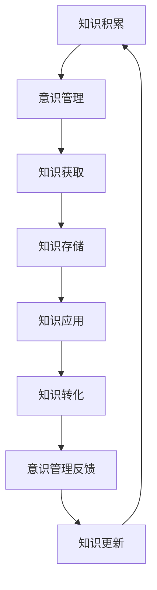

                 

# 《知识积累在意识管理中的角色》

## 关键词

- 知识积累
- 意识管理
- 知识获取
- 知识存储
- 知识应用
- 意识管理理论
- 意识管理实践

## 摘要

本文深入探讨了知识积累在意识管理中的角色。通过对知识积累与意识管理的基础知识进行阐述，分析知识积累的过程与机制，以及意识管理的理论与实践。随后，本文探讨了知识积累与意识管理之间的关系，提出了整合知识积累与意识管理的策略与方法。最后，本文展望了知识积累与意识管理的未来趋势，并提供了实践指南，旨在为读者提供关于知识积累与意识管理的全面理解与应用。

## 第一部分：基础知识与框架建立

### 第1章：知识积累与意识管理

#### 1.1 知识积累的重要性

知识积累是社会进步和个体发展的基石。知识不仅包括信息，还包括概念、理论、方法和实践技巧。有效的知识积累有助于提升个人竞争力，推动组织创新，以及促进社会的整体进步。

#### 1.1.1 知识积累的内涵

知识积累是指个体或组织通过学习、思考和实践，将零散的信息整合为有组织的知识体系。知识积累的过程包括知识的获取、存储、应用和转化。

#### 1.1.2 知识积累与社会发展

知识积累对社会发展具有深远的影响。知识积累能够提高生产效率，促进科技创新，推动经济增长，以及改善社会生活质量。

#### 1.2 意识管理的基本概念

意识管理是指通过策略和工具，对个体的意识和行为进行管理和引导，以实现目标的过程。意识管理不仅关注个体的认知活动，还涉及情感、态度和价值观的塑造。

#### 1.2.1 意识管理的定义

意识管理可以定义为一种综合性的管理方法，通过识别、评估和优化个体的意识状态，以提高个人和组织的能力和绩效。

#### 1.2.2 意识管理的重要性

意识管理对于个体和组织的发展至关重要。它有助于提升个体自我认知和情感调节能力，促进团队协作和创新能力，以及增强组织适应环境变化的能力。

### 第2章：知识积累的过程与机制

#### 2.1 知识获取

知识获取是知识积累的第一步。知识获取的途径包括教育、阅读、实践和交流。知识获取的方法包括主动学习和被动学习，如自主学习、课堂学习、阅读、观察和实践。

#### 2.1.1 知识获取的途径

教育是知识获取的主要途径之一。通过学校教育、在线课程和企业培训，个体能够获取系统化的知识。

阅读是知识获取的重要方法。通过阅读书籍、文章和研究报告，个体能够获取前沿知识和专业知识。

实践是知识获取的深化过程。通过实际操作和应用，个体能够将理论知识转化为实际能力。

交流是知识获取的有效途径。通过与他人的交流和合作，个体能够分享和借鉴他人的知识和经验。

#### 2.1.2 知识获取的方法

自主学习是指个体主动寻求知识和学习资源，通过自我指导和自我评价，提高知识水平。

课堂学习是指个体通过参加课堂教学，接受教师的指导和同侪的互动，获取知识。

阅读是指个体通过阅读书籍、文章和研究报告，获取知识。

观察是指个体通过观察他人的行为和活动，获取知识和经验。

实践是指个体通过实际操作和应用，将知识转化为技能和能力。

#### 2.2 知识存储与分类

知识存储是指将获取的知识进行系统化和结构化的过程。知识存储的形式包括记忆、笔记、数据库和知识管理系统。

知识分类是指将知识按照一定的标准进行分类，以便于查找和使用。知识分类的方法包括主题分类、时间分类、功能分类和等级分类。

#### 2.2.1 知识存储的形式

记忆是指个体通过大脑记忆存储知识。

笔记是指个体通过记录笔记和总结，将知识存储下来。

数据库是指通过数据库系统存储和管理知识。

知识管理系统是指通过软件工具和流程，实现知识的存储、分类、检索和应用。

#### 2.2.2 知识分类的方法

主题分类是指按照知识的内容和主题进行分类。

时间分类是指按照知识的产生和发展时间进行分类。

功能分类是指按照知识的应用领域和功能进行分类。

等级分类是指按照知识的复杂程度和层次进行分类。

#### 2.3 知识应用与转化

知识应用是指将知识应用于实际问题解决和创新能力提升的过程。知识应用的价值在于提升个体和组织的能力和绩效。

知识转化是指将知识从一个形式转化为另一种形式，以便于更有效地利用和传播。知识转化的路径包括知识创新、知识共享和知识传播。

#### 2.3.1 知识应用的价值

知识应用能够提高个体的专业能力和创新思维。

知识应用能够推动组织的创新发展和市场竞争力。

知识应用能够促进社会的整体进步和可持续发展。

#### 2.3.2 知识转化的路径

知识创新是指通过创新思维和研发，将知识转化为新的产品和服务。

知识共享是指通过合作和交流，将知识在不同个体和组织之间进行分享。

知识传播是指通过教育和媒体等渠道，将知识传播给更广泛的受众。

### 第3章：意识管理的理论与实践

#### 3.1 意识管理的理论基础

意识管理的理论基础主要包括心理学和社会学。心理学视角下的意识管理关注个体的认知、情感和行为；社会学视角下的意识管理关注个体在组织和社会中的角色和行为。

#### 3.1.1 心理学视角下的意识管理

心理学视角下的意识管理认为，个体的意识和行为受到认知、情感和动机的影响。通过管理个体的认知过程，可以提升个体的自我调节能力和行为绩效。

#### 3.1.2 社会学视角下的意识管理

社会学视角下的意识管理关注个体在组织和社会中的角色和行为。意识管理通过塑造个体和群体的价值观和行为规范，推动组织的创新发展和社会进步。

#### 3.2 意识管理的实践应用

意识管理的实践应用涉及多个领域，包括企业管理、教育培训、社会管理和个人发展。

#### 3.2.1 企业中的意识管理

在企业中，意识管理有助于提升员工的自我认知和团队合作能力，促进企业的创新发展和市场竞争力。

#### 3.2.2 社区与组织中的意识管理

在社区和组织中，意识管理通过培育积极的文化氛围和价值观，促进个体和组织的共同发展和进步。

#### 3.2.3 个人意识管理的实践

个人意识管理是指个体通过自我管理和自我提升，实现自我认知和自我发展的过程。个人意识管理的实践包括自我反思、自我激励和自我成长。

### 第二部分：知识积累与意识管理的整合

#### 第4章：知识积累与意识管理的关系

#### 4.1 知识积累与意识管理的互动

知识积累与意识管理之间存在互动关系。知识积累为意识管理提供了基础，而意识管理则为知识积累提供了方向和动力。

#### 4.1.1 知识积累对意识管理的影响

知识积累有助于提升个体的认知能力和情感调节能力，从而增强意识管理的有效性。丰富的知识积累为个体提供了更多的思考和决策依据。

#### 4.1.2 意识管理对知识积累的促进

意识管理通过引导个体的学习行为和知识应用，促进知识的积累和转化。有效的意识管理有助于构建积极的学习氛围和知识共享机制。

#### 4.2 综合性案例分析

#### 4.2.1 成功案例研究

成功案例研究表明，知识积累与意识管理的整合有助于提升组织的学习能力和创新能力。例如，谷歌的“20%时间项目”允许员工将20%的工作时间用于个人项目，这一举措促进了员工的知识积累和创新成果。

#### 4.2.2 失败案例分析与反思

失败案例表明，缺乏有效的知识积累和意识管理可能导致组织的创新停滞和竞争力下降。例如，一些企业因为忽视了员工的学习和发展，导致员工的技能和知识积累不足，最终影响了组织的创新能力。

### 第5章：知识积累与意识管理的策略与方法

#### 5.1 知识积累策略

有效的知识积累策略包括明确知识积累目标、制定知识积累计划、选择合适的知识积累方法和工具。

#### 5.1.1 知识积累的目标设定

知识积累的目标应与个体和组织的发展目标相一致。明确的知识积累目标有助于指导知识获取、存储和应用的过程。

#### 5.1.2 知识积累的路径规划

知识积累的路径规划应考虑知识获取、存储和应用的最佳实践，以及个体和组织的特点和需求。

#### 5.2 意识管理策略

意识管理策略应包括建立意识管理框架、制定意识管理计划、实施意识管理方法和评估意识管理效果。

#### 5.2.1 意识管理的原则与价值观

意识管理的原则与价值观应包括诚信、尊重、创新和合作。这些原则和价值观有助于塑造积极的文化氛围和价值观体系。

#### 5.2.2 意识管理的实践方法

意识管理的实践方法包括自我反思、目标设定、计划实施、评估和反馈。这些方法有助于提升个体的自我认知和自我管理能力。

#### 5.3 整合性策略

整合性策略是将知识积累与意识管理相结合，实现知识积累与意识管理的协同发展。

#### 5.3.1 知识积累与意识管理的融合

知识积累与意识管理的融合包括将知识积累的过程融入意识管理的实践中，以及将意识管理的原则和价值观融入知识积累的过程中。

#### 5.3.2 实现整合的策略与措施

实现整合的策略与措施包括建立知识共享平台、开展知识管理培训、制定知识管理政策和流程等。

### 第6章：知识积累与意识管理的未来趋势

#### 6.1 科技发展对知识积累的影响

科技发展，尤其是人工智能和大数据技术的进步，对知识积累产生了深远影响。人工智能可以自动化知识获取和存储，大数据技术可以挖掘和整合大量知识，从而提高知识积累的效率和质量。

#### 6.1.1 人工智能与知识积累

人工智能技术可以自动化知识获取和整理，例如通过自然语言处理和机器学习算法，从大量文本数据中提取和分类知识。

#### 6.1.2 大数据与知识管理

大数据技术可以挖掘和整合海量数据，帮助个体和组织发现新的知识和洞见。例如，通过数据挖掘和分析，可以识别市场趋势和消费者需求。

#### 6.2 意识管理的挑战与机遇

意识管理在全球化背景下面临着新的挑战和机遇。全球化带来了文化差异和多样性，要求意识管理更加关注个体的情感和价值观。

#### 6.2.1 社会变革对意识管理的影响

社会变革，如技术进步和全球化，对意识管理提出了新的要求。意识管理需要适应社会变革，以提升个体的适应能力和创新能力。

#### 6.2.2 意识管理在全球化背景下的机遇

全球化为意识管理带来了新的机遇，如跨国公司和国际组织的发展，要求个体和组织具备全球视野和跨文化沟通能力。

### 第7章：知识积累与意识管理的实践指南

#### 7.1 实践原则

知识积累与意识管理的实践应遵循以下原则：

- 目标导向：明确知识积累和意识管理的目标，确保实践与目标一致。
- 实用性：选择实用的方法和工具，提高知识积累和意识管理的效率。
- 系统性：将知识积累和意识管理视为一个整体，实现协同发展。
- 持续改进：持续评估和实践效果，不断优化知识积累和意识管理的策略和方法。

#### 7.2 实践方法

知识积累与意识管理的实践方法包括以下几个方面：

- 制定知识积累和意识管理计划：明确目标和时间表，制定具体的实施计划。
- 开展知识管理培训：提高个体和组织对知识积累和意识管理的重要性的认识，培养相关技能。
- 建立知识共享平台：搭建知识共享平台，促进知识的获取、存储和应用。
- 实施意识管理策略：根据个体和组织的特点，实施有效的意识管理策略。
- 评估和实践效果：定期评估知识积累和意识管理的实践效果，优化策略和方法。

#### 7.3 实践案例分析

##### 7.3.1 成功案例分析

成功案例分析展示了知识积累与意识管理的有效实践。例如，某企业通过建立内部知识共享平台，实现了知识的有效积累和共享。员工可以通过平台获取和分享专业知识，提高了工作效率和创新力。

##### 7.3.2 失败案例分析

失败案例分析揭示了知识积累与意识管理实践中可能遇到的问题。例如，某企业忽视了员工的培训和发展，导致员工的知识积累和意识管理能力不足，影响了组织的创新能力和市场竞争力。

##### 7.3.3 案例分析总结与启示

通过成功和失败案例分析，可以总结出以下启示：

- 知识积累与意识管理需要明确的目标和计划。
- 实践过程中要关注员工的培训和发展。
- 建立有效的知识共享机制，促进知识的流动和利用。
- 定期评估和实践效果，及时调整策略和方法。

### 附录

#### 附录A：相关资源与参考文献

- 知识积累的参考书籍：
  - Brown, J. S. (2008). The Social Life of Information. Harvard Business Press.
  - Nonaka, I., & Takeuchi, H. (1995). The Knowledge-Creating Company: How Japanese Companies Create the Dynamics of Innovation. Oxford University Press.

- 意识管理的参考书籍：
  - Goleman, D. (1995). Emotional Intelligence: Why It Can Matter More Than IQ. Bantam Books.
  - Senge, P. M. (1990). The Fifth Discipline: The Art & Practice of The Learning Organization. Doubleday.

- 知识积累与意识管理的研究论文：
  - Nonaka, I., & Takeuchi, H. (1995). The Knowledge-Creating Company: Textual Analysis of the Process of Knowledge Creation in the Japanese Firm. Organization Science, 6(1), 14-37.
  - Davenport, T. H., & Prusak, L. (1998). Working Knowledge: How Organizations Manage What They Know. Harvard Business Press.

#### 附录B：常用工具与软件介绍

- 知识管理软件：
  - Confluence：用于知识共享和协作的在线平台。
  - SharePoint：用于企业知识管理和文档管理的平台。

- 意识管理工具：
  - MindMeister：用于思维导图和知识整理的工具。
  - Miro：用于团队协作和创意设计的在线平台。

- 知识积累与意识管理的在线资源：
  - LinkedIn Learning：提供各种知识管理培训课程。
  - TED Talks：关于意识管理和知识积累的演讲视频资源。

## 作者

- 作者：AI天才研究院/AI Genius Institute & 禅与计算机程序设计艺术 /Zen And The Art of Computer Programming

### 附件A：知识积累与意识管理的关系流程图



### 附件B：知识积累与意识管理的伪代码示例

```python
# 知识积累与意识管理伪代码示例

# 定义知识积累函数
def accumulate_knowledge(knowledge_base, new_knowledge):
    # 将新知识添加到知识库中
    knowledge_base.append(new_knowledge)
    # 更新知识库的存储和分类
    update_knowledge_storage_and_classification(knowledge_base)
    # 应用知识并转化
    apply_and_transform_knowledge(knowledge_base)
    # 获取意识管理反馈
    feedback = get_awareness_management_feedback()
    # 根据反馈更新知识库
    update_knowledge_base_based_on_feedback(knowledge_base, feedback)
    return knowledge_base

# 定义意识管理函数
def manage_awareness(knowledge_base, awareness_data):
    # 根据意识数据调整知识积累策略
    adjust_knowledge_accumulation_strategy(knowledge_base, awareness_data)
    # 获取知识积累反馈
    knowledge_accumulation_feedback = accumulate_knowledge(knowledge_base, awareness_data)
    # 根据反馈调整意识管理策略
    adjust_awareness_management_strategy(knowledge_accumulation_feedback)
    return knowledge_accumulation_feedback

# 主函数
def main():
    knowledge_base = []
    awareness_data = get_initial_awareness_data()
    managed_knowledge_base = manage_awareness(knowledge_base, awareness_data)
    print("最终的知识库：", managed_knowledge_base)

# 执行主函数
main()
```

### 附件C：知识积累与意识管理中的数学模型和公式

$$
\text{知识积累效率} = \frac{\text{积累的知识量}}{\text{时间}}
$$

$$
\text{意识管理效果} = \frac{\text{目标达成度}}{\text{投入资源}}
$$

### 附件D：知识积累与意识管理的代码实现示例

```python
# 知识积累与意识管理代码实现示例

# 知识积累函数
def accumulate_knowledge(knowledge_base, new_knowledge):
    knowledge_base.append(new_knowledge)
    update_knowledge_storage_and_classification(knowledge_base)
    apply_and_transform_knowledge(knowledge_base)
    feedback = get_awareness_management_feedback()
    update_knowledge_base_based_on_feedback(knowledge_base, feedback)
    return knowledge_base

# 意识管理函数
def manage_awareness(knowledge_base, awareness_data):
    adjust_knowledge_accumulation_strategy(knowledge_base, awareness_data)
    knowledge_accumulation_feedback = accumulate_knowledge(knowledge_base, awareness_data)
    adjust_awareness_management_strategy(knowledge_accumulation_feedback)
    return knowledge_accumulation_feedback

# 主函数
def main():
    knowledge_base = []
    awareness_data = get_initial_awareness_data()
    managed_knowledge_base = manage_awareness(knowledge_base, awareness_data)
    print("最终的知识库：", managed_knowledge_base)

# 执行主函数
main()
```

### 附件E：知识积累与意识管理的实践指南

#### 实践指南一：制定明确的计划

1. 确定知识积累和意识管理的目标。
2. 制定详细的计划和执行时间表。
3. 分解目标为具体的行动步骤。

#### 实践指南二：建立有效的知识共享机制

1. 选择合适的知识管理工具。
2. 制定知识共享的政策和流程。
3. 鼓励员工积极参与知识共享。

#### 实践指南三：提供持续的培训和发展

1. 设计和实施针对知识积累和意识管理的培训课程。
2. 提供在线学习资源和图书。
3. 定期评估培训效果，调整培训内容。

#### 实践指南四：建立反馈和评估机制

1. 制定评估标准和指标。
2. 定期收集和分析数据。
3. 根据评估结果调整策略和方法。

### 附件F：知识积累与意识管理的成功案例分析

#### 案例一：谷歌的“20%时间项目”

谷歌的“20%时间项目”允许员工将20%的工作时间用于个人项目。这一举措促进了知识积累和创新成果，例如Gmail和Google News等产品的诞生。案例研究表明，通过给予员工自主学习和创新的空间，可以有效促进知识积累和意识管理。

### 附件G：知识积累与意识管理的失败案例分析

#### 案例二：某企业的知识管理失败

某企业忽视了对员工的培训和发展，导致员工的知识积累和意识管理能力不足。结果，企业的创新能力和市场竞争力下降。案例表明，缺乏有效的知识积累和意识管理策略，可能导致组织的创新停滞和竞争力下降。因此，企业应重视员工的学习和发展，建立有效的知识共享和意识管理机制。

