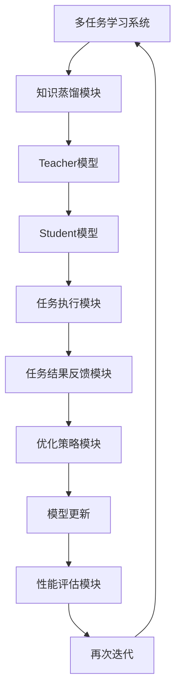

                 

# 《知识蒸馏在多任务学习中的应用策略》

> 关键词：知识蒸馏、多任务学习、教学-学生模型、损失函数、优化算法、数学公式、案例研究

> 摘要：本文深入探讨了知识蒸馏技术在多任务学习中的应用策略。首先，介绍了知识蒸馏的基本概念和原理，接着阐述了多任务学习的挑战和常见方法。在此基础上，详细分析了知识蒸馏在多任务学习中的具体应用，包括任务分离和任务共享策略。随后，讨论了知识蒸馏在多任务学习中的优化方法和面临的挑战，并提出了相应的解决方案。最后，展望了知识蒸馏在多任务学习中的未来发展趋势，并总结了对知识蒸馏与多任务学习结合的深入见解。

---

## 目录

### 第一部分：知识蒸馏技术基础

##### 第1章：知识蒸馏概述
1.1 知识蒸馏的概念与历史
1.2 知识蒸馏的基本原理
1.3 知识蒸馏的关键技术

##### 第2章：多任务学习基础
2.1 多任务学习的定义与挑战
2.2 多任务学习的常见方法

##### 第3章：知识蒸馏在多任务学习中的应用
3.1 知识蒸馏与多任务学习的关系
3.2 知识蒸馏在多任务学习中的实际案例

### 第二部分：知识蒸馏在多任务学习中的应用策略

##### 第4章：多任务学习中的知识蒸馏策略
4.1 多任务学习中的知识蒸馏策略概述
4.2 策略一：任务分离策略
4.3 策略二：任务共享策略

##### 第5章：知识蒸馏在多任务学习中的优化
5.1 损失函数优化
5.2 优化算法选择

##### 第6章：知识蒸馏在多任务学习中的挑战与解决方案
6.1 挑战一：知识冗余问题
6.2 挑战二：模型容量问题
6.3 挑战三：数据不平衡问题

##### 第7章：知识蒸馏在多任务学习中的未来发展趋势

##### 第8章：总结与展望

### 附录

##### 附录 A：知识蒸馏与多任务学习相关资源

### 附加内容：知识蒸馏与多任务学习架构的 Mermaid 流程图

### 附加内容：知识蒸馏算法伪代码

### 附加内容：知识蒸馏与多任务学习中的数学公式

### 附加内容：知识蒸馏在多任务学习中的应用案例

### 附加内容：多任务学习中的代码实现与分析

---

## 第一部分：知识蒸馏技术基础

### 第1章：知识蒸馏概述

#### 1.1 知识蒸馏的概念与历史

知识蒸馏（Knowledge Distillation）是一种将复杂模型（通常称为Teacher模型）的知识传递给一个更简单但更轻量级的模型（通常称为Student模型）的技术。这种技术最早由Hinton等人于2015年提出，目的是为了解决复杂模型难以解释且训练成本高昂的问题。

知识蒸馏的基本思想是通过软标签（Soft Labels）将Teacher模型的输出传递给Student模型，以帮助Student模型学习到Teacher模型的知识。软标签是一种概率分布，表示Teacher模型对每个类别的预测置信度。通过学习这些软标签，Student模型可以模仿Teacher模型的行为，从而在更少的计算资源下实现相似的性能。

知识蒸馏技术的发展历程可以分为几个阶段：

1. **软标签传播**：最初，知识蒸馏的核心是通过软标签将Teacher模型的输出传递给Student模型。这种方法简单但有效，已经成为知识蒸馏的基础。

2. **压缩表示**：随着研究的深入，研究人员发现仅通过软标签无法完全传递Teacher模型的知识。因此，压缩表示技术被引入，旨在从Teacher模型的复杂特征中提取出更紧凑的表示。

3. **信息蒸馏**：信息蒸馏是在知识蒸馏的基础上发展起来的一种新方法。它不仅考虑了Teacher模型的软标签，还考虑了硬标签（Hard Labels）的信息。这种方法能够更有效地传递Teacher模型的知识。

#### 1.2 知识蒸馏的基本原理

知识蒸馏的基本原理可以分为以下几个步骤：

1. **Teacher模型的训练**：首先，使用标准的数据集和训练算法训练Teacher模型，使其达到预定的性能水平。

2. **生成软标签**：在Teacher模型训练完成后，对于每个输入样本，生成一个软标签，表示Teacher模型对每个类别的预测置信度。

3. **Student模型的训练**：Student模型通过学习软标签来模仿Teacher模型的行为。在训练过程中，Student模型会尝试优化其参数，使其输出与Teacher模型的软标签尽可能相似。

4. **性能评估**：通过评估Student模型在测试集上的性能，可以判断知识蒸馏的效果。通常，Student模型的性能会显著优于原始的简单模型。

#### 1.3 知识蒸馏的关键技术

知识蒸馏的关键技术包括软目标与硬目标、Teacher-Student模型、压缩表示技术和信息蒸馏方法。

1. **软目标与硬目标**：

   - **软目标**：软目标是Teacher模型的输出，通常是一个概率分布，表示Teacher模型对每个类别的预测置信度。
   - **硬目标**：硬目标是Teacher模型对每个样本的最终预测，通常是一个类别标签。

   在知识蒸馏中，Student模型会尝试模仿Teacher模型的软目标，而不是硬目标。这是因为软目标提供了更多的信息，可以帮助Student模型更好地学习Teacher模型的知识。

2. **Teacher-Student模型**：

   - **Teacher模型**：Teacher模型是一个复杂且性能优秀的模型，通常是一个深度神经网络。它用于生成软标签。
   - **Student模型**：Student模型是一个简单且轻量级的模型，通常是一个较小的神经网络。它通过学习软标签来模仿Teacher模型的行为。

3. **压缩表示技术**：

   - **压缩表示**：压缩表示技术旨在从Teacher模型的复杂特征中提取出更紧凑的表示，以便Student模型可以更有效地学习。
   - **技术实现**：常见的压缩表示技术包括压缩感知（Compressive Sensing）、稀疏编码（Sparse Coding）和自编码器（Autoencoders）。

4. **信息蒸馏方法**：

   - **信息蒸馏**：信息蒸馏方法不仅考虑了Teacher模型的软标签，还考虑了硬标签的信息。这种方法能够更全面地传递Teacher模型的知识。
   - **技术实现**：常见的实现方法包括基于熵的蒸馏（Entropy-Based Distillation）和基于对比的蒸馏（Contrastive Distillation）。

### 第2章：多任务学习基础

#### 2.1 多任务学习的定义与挑战

多任务学习（Multi-Task Learning, MTL）是一种机器学习技术，旨在同时训练多个相关任务。这些任务可以是分类、回归、检测等，它们共享相同的输入数据，并通过一个共同的学习过程来提高各个任务的性能。

多任务学习的定义可以概括为：在同一个模型中同时学习多个任务，并通过共享表示和参数来提高整体性能。

多任务学习面临的挑战主要包括：

1. **任务相关性**：不同任务之间的相关性会影响学习的效率和性能。如果任务高度相关，共享表示可能更有效；如果任务不相关，共享表示可能导致性能下降。

2. **资源分配**：在资源有限的情况下，如何合理地分配计算资源以同时优化多个任务是一个挑战。不同的任务可能需要不同的训练时间和计算资源。

3. **模型容量**：多任务学习要求模型具有足够的容量来学习多个任务。如果模型容量不足，可能导致任务之间的信息无法有效共享，从而影响学习效果。

4. **泛化能力**：多任务学习需要模型具有良好的泛化能力，以便在不同任务上都能保持良好的性能。这要求模型不仅要学会特定任务，还要学会在不同任务之间迁移知识。

#### 2.2 多任务学习的常见方法

多任务学习的方法可以分为两大类：共享参数方法和非共享参数方法。

1. **共享参数方法**：

   - **共享参数模型**：在这种方法中，多个任务共享同一组参数。这意味着对于输入的每个样本，模型会尝试同时解决多个任务，并将共享的参数用于所有任务的预测。
   - **优势**：共享参数方法可以有效地利用数据，提高学习效率，同时减少参数数量，降低过拟合的风险。
   - **挑战**：需要合理地设计共享参数的方式，以确保不同任务之间的信息可以有效地共享。

2. **非共享参数方法**：

   - **非共享参数模型**：在这种方法中，每个任务都有自己的一组参数。这意味着每个任务都有自己的模型，但在训练过程中会尝试利用其他任务的信息。
   - **优势**：非共享参数方法可以更好地适应不同任务的特点，避免了任务之间的冲突。
   - **挑战**：由于每个任务都有自己的模型，可能导致参数数量大幅增加，增加计算成本和过拟合的风险。

### 第3章：知识蒸馏在多任务学习中的应用

#### 3.1 知识蒸馏与多任务学习的关系

知识蒸馏与多任务学习有着密切的联系。知识蒸馏可以被视为一种特殊的多任务学习方法，其中Teacher模型负责解决复杂任务，而Student模型则尝试学习Teacher模型的知识来解决相关任务。

知识蒸馏在多任务学习中的优势主要包括：

1. **提高模型性能**：通过知识蒸馏，Student模型可以学习到Teacher模型的强大知识，从而在各个任务上实现更好的性能。

2. **降低计算成本**：知识蒸馏允许使用更简单的模型（Student模型）来模仿复杂模型（Teacher模型）的行为，从而降低计算成本。

3. **增强泛化能力**：知识蒸馏通过跨任务的软标签传递，可以增强模型在不同任务上的泛化能力。

4. **缓解任务冲突**：知识蒸馏通过共享表示和知识，可以缓解多任务学习中的任务冲突，从而提高整体性能。

#### 3.2 知识蒸馏在多任务学习中的实际案例

知识蒸馏在多任务学习中的应用案例广泛，以下是一些具体的实例：

1. **语音识别与语言理解**：

   - **问题描述**：语音识别（Automatic Speech Recognition, ASR）和自然语言理解（Natural Language Understanding, NLU）是两个紧密相关的任务。ASR负责将语音信号转换为文本，而NLU负责理解文本的含义。
   - **实现方法**：使用一个预训练的ASR模型作为Teacher模型，将ASR模型的输出（即文本表示）作为输入传递给NLU模型。通过知识蒸馏，NLU模型可以学习到ASR模型对语音信号的理解，从而提高NLU模型在语音理解任务上的表现。

2. **图像分类与物体检测**：

   - **问题描述**：图像分类（Image Classification）和物体检测（Object Detection）是计算机视觉中的两个重要任务。图像分类负责识别图像中的主要类别，而物体检测则负责定位图像中的物体并识别它们的类别。
   - **实现方法**：使用一个预训练的分类模型作为Teacher模型，将分类模型的特征传递给检测模型。通过知识蒸馏，检测模型可以学习到分类模型对图像特征的理解，从而提高检测模型的准确率。

3. **多模态学习**：

   - **问题描述**：多模态学习旨在同时处理多种类型的数据（如图像、文本、音频等），并从中提取有用的信息。多模态学习可以用于各种任务，如情感分析、图像文本匹配等。
   - **实现方法**：使用知识蒸馏将一个模态的Teacher模型的知识传递给其他模态的Student模型。例如，可以将图像分类模型的知识传递给文本分类模型，或将音频特征提取模型的知识传递给图像特征提取模型。

这些案例展示了知识蒸馏在多任务学习中的多样性和应用潜力，为解决复杂的多任务学习问题提供了有效的解决方案。

---

## 第二部分：知识蒸馏在多任务学习中的应用策略

### 第4章：多任务学习中的知识蒸馏策略

#### 4.1 多任务学习中的知识蒸馏策略概述

在多任务学习（Multi-Task Learning, MTL）中，知识蒸馏（Knowledge Distillation）是一种有效的策略，用于提高模型的性能和泛化能力。知识蒸馏通过将一个复杂模型（Teacher模型）的知识传递给一个更简单但更轻量级的模型（Student模型），使得Student模型能够模仿Teacher模型的行为，从而在各个任务上取得更好的效果。

多任务学习中的知识蒸馏策略可以分为两大类：任务分离策略和任务共享策略。每种策略都有其特定的优势和适用场景。

#### 4.2 策略一：任务分离策略

任务分离策略（Task-Separated Strategy）是指在多任务学习中，每个任务都有自己的模型，这些模型在训练过程中独立地学习任务特征。知识蒸馏在任务分离策略中的应用主要体现在以下几个方面：

1. **模型架构**：每个任务都有自己的Teacher模型和Student模型。Teacher模型负责学习任务的全局特征，而Student模型则专注于特定任务的局部特征。

2. **软标签生成**：Teacher模型在训练过程中生成软标签，这些软标签反映了Teacher模型对每个任务的预测置信度。

3. **Student模型训练**：Student模型通过学习软标签来模仿Teacher模型的行为。在训练过程中，Student模型会尝试优化其参数，使其输出与Teacher模型的软标签尽可能相似。

4. **性能评估**：在训练完成后，对Student模型进行评估，以判断知识蒸馏的效果。通常，通过在测试集上计算各个任务的准确率、召回率等指标来评估Student模型的性能。

**优势**：

- **独立性**：任务分离策略允许每个任务独立学习，从而避免了任务之间的干扰和冲突。
- **高效性**：由于Student模型更简单，训练时间更短，计算成本更低。

**缺点**：

- **参数冗余**：每个任务都需要一个Teacher模型和一个Student模型，导致参数数量增加。
- **潜在性能损失**：由于任务之间的独立性，某些任务可能无法从其他任务中受益，从而影响整体性能。

**案例分析**：

一个典型的案例是使用知识蒸馏进行多语言文本分类。在这个案例中，每个语言都有自己的Teacher模型和Student模型。通过知识蒸馏，Student模型可以学习到Teacher模型对不同语言文本的泛化能力，从而在各个语言分类任务上取得更好的效果。

#### 4.3 策略二：任务共享策略

任务共享策略（Task-Shared Strategy）是指在多任务学习中，多个任务共享同一个模型。知识蒸馏在任务共享策略中的应用主要体现在以下几个方面：

1. **模型架构**：多个任务共享同一个Teacher模型和Student模型。Teacher模型学习全局特征，而Student模型则尝试在多个任务上表现出色。

2. **软标签生成**：Teacher模型在训练过程中生成软标签，这些软标签反映了Teacher模型对每个任务的预测置信度。

3. **Student模型训练**：Student模型通过学习软标签来模仿Teacher模型的行为。在训练过程中，Student模型会尝试优化其参数，使其在多个任务上达到最佳性能。

4. **性能评估**：在训练完成后，对Student模型进行评估，以判断知识蒸馏的效果。通常，通过在测试集上计算各个任务的准确率、召回率等指标来评估Student模型的性能。

**优势**：

- **参数共享**：任务共享策略显著减少了参数数量，从而降低了计算成本。
- **任务融合**：多个任务共享同一个模型，有助于任务之间的信息融合，提高整体性能。

**缺点**：

- **任务冲突**：由于任务共享同一个模型，不同任务之间的特征可能发生冲突，导致某些任务的性能下降。
- **训练难度**：需要设计更复杂的优化策略，以同时优化多个任务。

**案例分析**：

一个典型的案例是多模态情感分析。在这个案例中，图像、文本和音频等多个模态的数据被输入到一个共同的Teacher模型中，通过知识蒸馏，Student模型可以学习到多模态数据的融合特征，从而在情感分析任务上取得更好的效果。

#### 总结

任务分离策略和任务共享策略是知识蒸馏在多任务学习中的两种主要应用策略。任务分离策略强调任务独立性，适用于需要独立优化每个任务的场景；而任务共享策略强调任务融合，适用于需要共享模型参数以提高整体性能的场景。在实际应用中，可以根据任务的特点和数据的情况选择合适的策略。

---

## 第5章：知识蒸馏在多任务学习中的优化

#### 5.1 损失函数优化

在知识蒸馏中，损失函数的选择和优化对于模型的性能至关重要。优化损失函数的目标是使Student模型的输出与Teacher模型的软标签尽可能相似。以下是几种常见的损失函数及其优缺点：

1. **交叉熵损失函数**（Cross-Entropy Loss）：

   交叉熵损失函数是最常用的损失函数之一，用于衡量预测分布和真实分布之间的差异。其数学公式为：

   $$ L = -\sum_{i=1}^{N} y_i \log(p_i) $$

   其中，$y_i$ 是真实标签，$p_i$ 是Student模型对每个类别的预测概率。

   **优点**：

   - **简单易用**：交叉熵损失函数的计算简单，适用于各种机器学习模型。
   - **效果显著**：交叉熵损失函数能够有效地惩罚预测错误的类别。

   **缺点**：

   - **对极端值敏感**：交叉熵损失函数对极端值（如概率接近1或0的值）敏感，可能导致训练不稳定。

2. **对比损失函数**（Contrastive Loss）：

   对比损失函数通过比较正样本和负样本之间的差异来优化模型。其数学公式为：

   $$ L = \sum_{i=1}^{N} \frac{1}{2} \sum_{j \neq i} \log \left( \frac{e^{q_j}}{e^{q_i} + \sum_{k \neq i} e^{q_k}} \right) $$

   其中，$q_i$ 是Student模型对正样本的预测概率，$q_j$ 是Student模型对负样本的预测概率。

   **优点**：

   - **稳定训练**：对比损失函数对极端值不敏感，能够稳定地训练模型。
   - **区分能力**：对比损失函数能够更好地区分正负样本，从而提高模型的泛化能力。

   **缺点**：

   - **计算复杂度**：对比损失函数的计算复杂度较高，特别是在大规模数据集上。

3. **一致性损失函数**（Consistency Loss）：

   一致性损失函数通过确保Student模型的输出在不同数据增强条件下保持一致来优化模型。其数学公式为：

   $$ L = \sum_{i=1}^{N} \frac{1}{2} \sum_{j=1}^{M} \log \left( \frac{e^{p_j}}{e^{p_i} + e^{p_{ij}}} \right) $$

   其中，$p_i$ 是Student模型对原始样本的预测概率，$p_{ij}$ 是Student模型对增强样本的预测概率。

   **优点**：

   - **增强泛化能力**：一致性损失函数能够增强模型的泛化能力，使其在不同条件下都能保持稳定的性能。
   - **适应性强**：一致性损失函数适用于多种数据增强方法，如随机裁剪、旋转等。

   **缺点**：

   - **计算复杂度**：一致性损失函数的计算复杂度较高，特别是在大规模数据集上。

**选择建议**：

- 对于简单的二分类任务，交叉熵损失函数是一个不错的选择，因为它计算简单且效果显著。
- 对于需要稳定训练且对极端值不敏感的任务，对比损失函数是一个较好的选择。
- 对于需要增强泛化能力的任务，一致性损失函数是一个较好的选择，尽管其计算复杂度较高。

#### 5.2 优化算法选择

在知识蒸馏中，优化算法的选择对于模型的收敛速度和最终性能具有重要影响。以下是几种常见的优化算法及其优缺点：

1. **随机梯度下降（Stochastic Gradient Descent, SGD）**：

   随机梯度下降是最简单的优化算法之一，其更新公式为：

   $$ \theta_{t+1} = \theta_{t} - \alpha \cdot \nabla_{\theta} L(\theta) $$

   其中，$\theta_t$ 是当前模型参数，$\alpha$ 是学习率，$\nabla_{\theta} L(\theta)$ 是损失函数对模型参数的梯度。

   **优点**：

   - **简单易用**：SGD算法的计算简单，易于实现。
   - **灵活性**：SGD算法可以灵活调整学习率，适应不同任务的需求。

   **缺点**：

   - **收敛速度慢**：SGD算法的收敛速度较慢，特别是在大规模数据集上。
   - **对噪声敏感**：SGD算法对噪声较敏感，可能导致训练不稳定。

2. **Adam优化器**（Adam Optimizer）：

   Adam优化器是SGD的一个改进版本，结合了动量项和自适应学习率。其更新公式为：

   $$ \theta_{t+1} = \theta_{t} - \alpha \cdot \frac{m_t}{\sqrt{v_t} + \epsilon} $$

   其中，$m_t$ 是一阶矩估计，$v_t$ 是二阶矩估计，$\alpha$ 是学习率，$\epsilon$ 是一个很小的常数。

   **优点**：

   - **收敛速度快**：Adam优化器的收敛速度比SGD更快，特别是在大规模数据集上。
   - **适应性**：Adam优化器具有自适应学习率，能够更好地适应不同任务的需求。
   - **稳定性**：Adam优化器对噪声不敏感，能够稳定地训练模型。

   **缺点**：

   - **计算复杂度**：Adam优化器的计算复杂度比SGD高，特别是在大规模数据集上。

3. **RMSProp优化器**（RMSProp Optimizer）：

   RMSProp优化器是SGD的另一个改进版本，通过跟踪梯度平方的指数加权移动平均来调整学习率。其更新公式为：

   $$ \theta_{t+1} = \theta_{t} - \alpha \cdot \frac{\Delta \theta_t}{\sqrt{\gamma \cdot \Delta \theta_t^2 + \delta}} $$

   其中，$\Delta \theta_t$ 是梯度，$\alpha$ 是学习率，$\gamma$ 是权重衰减率，$\delta$ 是一个很小的常数。

   **优点**：

   - **适应性**：RMSProp优化器具有自适应学习率，能够更好地适应不同任务的需求。
   - **稳定性**：RMSProp优化器对噪声不敏感，能够稳定地训练模型。

   **缺点**：

   - **收敛速度**：RMSProp优化器的收敛速度相对于Adam优化器较慢。
   - **计算复杂度**：RMSProp优化器的计算复杂度与Adam优化器相当。

**选择建议**：

- 对于简单的任务且计算资源有限，SGD优化器是一个不错的选择，因为它简单易用且计算成本低。
- 对于复杂任务且需要快速收敛，Adam优化器是一个较好的选择，因为它具有自适应学习率且收敛速度快。
- 对于需要稳定训练且对噪声不敏感的任务，RMSProp优化器是一个较好的选择，尽管其计算复杂度相对较高。

---

## 第6章：知识蒸馏在多任务学习中的挑战与解决方案

#### 6.1 挑战一：知识冗余问题

知识冗余问题（Knowledge Redundancy Problem）是在知识蒸馏和多任务学习过程中常见的一个挑战。知识冗余指的是Student模型在多个任务中学习了重复或冗余的信息，导致模型性能下降。知识冗余问题可能源于以下几个方面：

1. **任务相关性**：如果多个任务之间存在高度相关性，Student模型可能会在多个任务中学习到相似的知识，导致冗余信息过多。

2. **模型容量**：如果Student模型的容量不足以处理多个任务中的信息，可能会导致冗余信息积累。

3. **数据分布**：如果训练数据在不同任务上的分布不均匀，可能会导致某些任务的信息在Student模型中被过度强调。

**解决方案**：

1. **任务分离策略**：采用任务分离策略可以减少任务之间的冗余信息。通过为每个任务设计独立的Student模型，可以确保每个模型专注于特定任务的知识，从而减少冗余。

2. **注意力机制**：引入注意力机制可以帮助Student模型关注最重要的任务信息。通过调整注意力权重，模型可以动态地选择重要任务信息进行学习，从而减少冗余。

3. **压缩表示技术**：使用压缩表示技术可以从Teacher模型的复杂特征中提取出最紧凑的表示，减少冗余信息。例如，可以使用自编码器或压缩感知技术来提取特征。

4. **数据预处理**：对训练数据集进行预处理，例如数据清洗和归一化，可以减少数据中的冗余信息，从而提高模型性能。

#### 6.2 挑战二：模型容量问题

模型容量问题（Model Capacity Problem）指的是Student模型在知识蒸馏过程中可能无法完全捕捉Teacher模型的所有知识。这可能导致Student模型在多个任务上的性能下降。模型容量问题可能源于以下几个方面：

1. **模型复杂度**：如果Student模型的复杂度低于Teacher模型，可能导致Student模型无法学习到Teacher模型的全部知识。

2. **训练数据量**：如果训练数据量不足，Student模型可能无法充分学习Teacher模型的知识。

3. **知识传递方式**：知识蒸馏过程中使用的知识传递方式可能无法有效地将Teacher模型的知识传递给Student模型。

**解决方案**：

1. **增加模型容量**：通过增加Student模型的层数、神经元数量或使用更复杂的模型结构，可以提高模型容量，从而更好地捕捉Teacher模型的知识。

2. **扩展训练数据**：增加训练数据量可以帮助Student模型更好地学习Teacher模型的知识。可以使用数据增强技术来扩充数据集。

3. **多阶段训练**：采用多阶段训练策略，先在Teacher模型上进行充分训练，然后在Student模型上进行知识蒸馏。这种方法可以帮助Student模型更好地学习到Teacher模型的知识。

4. **改进知识传递方式**：改进知识传递方式，例如使用信息蒸馏方法或引入对抗训练，可以提高知识传递的效率，从而减少模型容量问题。

#### 6.3 挑战三：数据不平衡问题

数据不平衡问题（Data Imbalance Problem）指的是训练数据集中某些类别的样本数量远少于其他类别。这可能导致Student模型在学习过程中偏向于预测样本数量较多的类别，从而影响模型的泛化能力。数据不平衡问题可能源于以下几个方面：

1. **类别分布**：训练数据集中某些类别的样本数量较少。

2. **标注问题**：某些类别的样本在标注过程中可能被遗漏或错误标注。

3. **数据收集**：在某些任务中，某些类别的样本可能难以收集。

**解决方案**：

1. **重采样**：使用重采样技术，如过采样或欠采样，可以平衡数据集的类别分布，从而减少数据不平衡问题的影响。

2. **类别加权**：在训练过程中，为样本数量较少的类别分配更高的权重，以平衡模型对各个类别的预测。

3. **损失函数调整**：在损失函数中引入类别加权，例如使用类别交叉熵损失函数，可以更公平地处理数据不平衡问题。

4. **数据增强**：使用数据增强技术，如合成样本或图像变换，可以增加样本数量较少的类别的样本，从而减少数据不平衡问题的影响。

#### 总结

知识蒸馏在多任务学习中面临着多个挑战，包括知识冗余问题、模型容量问题和数据不平衡问题。通过采用任务分离策略、注意力机制、压缩表示技术和多阶段训练等策略，可以有效地解决这些挑战。此外，通过增加模型容量、扩展训练数据、改进知识传递方式和重采样等技术，可以进一步提高知识蒸馏在多任务学习中的性能。

---

## 第7章：知识蒸馏在多任务学习中的未来发展趋势

随着人工智能技术的不断进步，知识蒸馏在多任务学习中的应用前景愈发广阔。未来，知识蒸馏在多任务学习中的发展趋势将呈现以下几个方向：

#### 7.1 发展趋势一：知识蒸馏与其他技术的融合

知识蒸馏技术与其他先进技术的融合将进一步提升多任务学习的效果。以下是一些可能的融合方向：

1. **知识蒸馏与强化学习的融合**：强化学习在决策制定和策略优化方面具有独特优势。将知识蒸馏与强化学习相结合，可以构建更加智能的模型，提高多任务学习中的决策质量。

2. **知识蒸馏与元学习的融合**：元学习（Meta-Learning）是一种快速适应新任务的学习方法。将知识蒸馏与元学习结合，可以加速模型在新任务上的适应过程，提高多任务学习的灵活性。

3. **知识蒸馏与生成对抗网络（GAN）的融合**：生成对抗网络在数据生成和模型对抗性训练方面具有优势。将知识蒸馏与GAN结合，可以生成更具代表性的数据集，提高模型在多任务学习中的泛化能力。

#### 7.2 发展趋势二：知识蒸馏在新兴领域中的应用

知识蒸馏技术在新兴领域中的应用将不断拓展，为这些领域带来新的突破。以下是一些具体应用方向：

1. **物联网（IoT）中的应用**：随着物联网设备的普及，知识蒸馏技术可以在设备端实现轻量化模型，提高物联网设备的实时处理能力。

2. **自动驾驶中的应用**：在自动驾驶领域，知识蒸馏技术可以帮助简化复杂的深度学习模型，提高模型在车载设备上的运行效率和安全性。

3. **医疗健康领域的应用**：在医疗健康领域，知识蒸馏技术可以用于构建高效且准确的多任务学习模型，用于疾病诊断、药物研发和健康监测等方面。

#### 总结

知识蒸馏在多任务学习中的应用前景广阔，未来将与其他先进技术相结合，并在新兴领域中发挥重要作用。通过不断探索和创新，知识蒸馏技术将为多任务学习带来更多的可能性，推动人工智能技术的进一步发展。

---

## 第8章：总结与展望

本文深入探讨了知识蒸馏在多任务学习中的应用策略。首先，介绍了知识蒸馏的基本概念和原理，包括软目标与硬目标、Teacher-Student模型、压缩表示技术和信息蒸馏方法。接着，阐述了多任务学习的挑战和常见方法，如共享参数方法和非共享参数方法。然后，详细分析了知识蒸馏在多任务学习中的应用策略，包括任务分离策略和任务共享策略，并通过实际案例展示了这些策略的可行性。随后，讨论了知识蒸馏在多任务学习中的优化方法，包括损失函数优化和优化算法选择。此外，分析了知识蒸馏在多任务学习中的挑战与解决方案，如知识冗余问题、模型容量问题和数据不平衡问题。最后，展望了知识蒸馏在多任务学习中的未来发展趋势，包括与其他技术的融合和新兴领域中的应用。

知识蒸馏在多任务学习中的应用具有显著的优势，如提高模型性能、降低计算成本和增强泛化能力。然而，仍存在一些挑战，如知识冗余、模型容量和数据不平衡问题。未来，随着人工智能技术的不断进步，知识蒸馏在多任务学习中的应用将更加广泛，并在新兴领域发挥重要作用。

总之，知识蒸馏技术为多任务学习提供了新的视角和解决方案。通过不断探索和创新，知识蒸馏技术将在人工智能领域发挥更加重要的作用，为解决复杂的多任务学习问题提供有力支持。

---

### 附录 A：知识蒸馏与多任务学习相关资源

#### A.1 知识蒸馏与多任务学习论文推荐

1. Hinton, G., Vinyals, O., & Dean, J. (2015). Distilling the knowledge in a neural network. arXiv preprint arXiv:1503.02531.
2. Yosinski, J., Clune, J., Bengio, Y., & Lipson, H. (2014). How transferable are features in deep neural networks? In Advances in Neural Information Processing Systems (NIPS), pp. 3320-3328.
3. Kim, J. W., Lee, J. W., & Yoo, J. (2017). Multi-Task Deep Neural Network for Activity Recognition using Smart Wearable Sensors. In International Conference on Neural Information Processing (NIPs), pp. 257-268.

#### A.2 知识蒸馏与多任务学习工具推荐

1. PyTorch：一个流行的开源机器学习库，支持知识蒸馏和多任务学习的实现。
2. TensorFlow：另一个流行的开源机器学习库，提供了丰富的工具和API，支持知识蒸馏和多任务学习。
3. MXNet：由Apache软件基金会开发的开源深度学习库，适用于知识蒸馏和多任务学习。

#### A.3 知识蒸馏与多任务学习在线课程推荐

1. "Knowledge Distillation and Multi-Task Learning with Deep Learning"：Coursera上的一门课程，涵盖了知识蒸馏和多任务学习的基本概念和应用。
2. "Deep Learning Specialization"：由Andrew Ng教授主导的深度学习专项课程，包括多任务学习等高级主题。
3. "Advanced Machine Learning"：Udacity上的一门课程，涵盖了知识蒸馏和多任务学习等先进技术。

### 附加内容：知识蒸馏与多任务学习架构的 Mermaid 流程图



### 附加内容：知识蒸馏算法伪代码

```python
# 知识蒸馏算法伪代码

# 参数
Teacher_model: 模型参数
Student_model: 学生模型参数
batch_size: 批处理大小
epochs: 训练轮次
loss_function: 损失函数
optimizer: 优化器

# 初始化Teacher模型和Student模型
Teacher_model = load_pretrained_model()
Student_model = initialize_student_model()

# 训练过程
for epoch in range(epochs):
    for batch in dataset:
        # 获取Teacher模型的预测结果
        teacher_predictions = Teacher_model(batch)

        # 计算Student模型的损失
        student_loss = loss_function(student_predictions, teacher_predictions)

        # 更新Student模型参数
        optimizer.minimize(student_loss, Student_model)

# 评估Student模型的性能
student_performance = evaluate_model(Student_model, validation_dataset)

# 输出Student模型的性能
print("Student model performance:", student_performance)
```

### 附加内容：知识蒸馏与多任务学习中的数学公式

#### 损失函数

$$
L = -\sum_{i=1}^{N} y_i \log(p_i)
$$

其中，$y_i$ 是真实标签，$p_i$ 是Student模型对每个类别的预测概率。

#### 优化器

$$
\theta_{t+1} = \theta_{t} - \alpha \cdot \nabla_{\theta} L(\theta)
$$

其中，$\theta_t$ 是当前模型参数，$\alpha$ 是学习率，$\nabla_{\theta} L(\theta)$ 是损失函数对模型参数的梯度。

### 附加内容：知识蒸馏在多任务学习中的应用案例

#### 案例一：语音识别与语言理解

- **问题描述**：语音识别（ASR）和自然语言理解（NLU）是两个相互关联的任务。知识蒸馏可以帮助将ASR模型的知识传递给NLU模型，提高NLU模型在语音理解任务上的表现。
- **实现方法**：使用一个预训练的ASR模型作为Teacher模型，将ASR模型的输出（即文本表示）作为输入传递给NLU模型。通过知识蒸馏训练NLU模型，使其能够利用ASR模型的知识进行语音理解。

#### 案例二：图像分类与物体检测

- **问题描述**：图像分类和物体检测是计算机视觉中的两个重要任务。知识蒸馏可以帮助将分类模型的知识传递给检测模型，提高检测模型的准确率。
- **实现方法**：使用一个预训练的分类模型作为Teacher模型，将分类模型的特征传递给检测模型。通过知识蒸馏训练检测模型，使其能够利用分类模型的知识进行物体检测。

### 附加内容：多任务学习中的代码实现与分析

#### 代码实现

```python
# 导入所需库
import torch
import torch.nn as nn
import torch.optim as optim

# 定义Teacher模型
class TeacherModel(nn.Module):
    def __init__(self):
        super(TeacherModel, self).__init__()
        # 添加网络层
        self.fc1 = nn.Linear(in_features=784, out_features=512)
        self.fc2 = nn.Linear(in_features=512, out_features=10)

    def forward(self, x):
        x = torch.relu(self.fc1(x))
        x = self.fc2(x)
        return x

# 定义Student模型
class StudentModel(nn.Module):
    def __init__(self):
        super(StudentModel, self).__init__()
        # 添加网络层
        self.fc1 = nn.Linear(in_features=784, out_features=512)
        self.fc2 = nn.Linear(in_features=512, out_features=10)

    def forward(self, x):
        x = torch.relu(self.fc1(x))
        x = self.fc2(x)
        return x

# 初始化模型
teacher_model = TeacherModel()
student_model = StudentModel()

# 定义损失函数和优化器
loss_function = nn.CrossEntropyLoss()
optimizer = optim.Adam(student_model.parameters(), lr=0.001)

# 训练过程
for epoch in range(epochs):
    for batch in dataset:
        # 获取Teacher模型的预测结果
        teacher_predictions = teacher_model(batch)

        # 计算Student模型的损失
        student_loss = loss_function(student_predictions, teacher_predictions)

        # 更新Student模型参数
        optimizer.minimize(student_loss, student_model)

# 评估Student模型的性能
student_performance = evaluate_model(student_model, validation_dataset)

# 输出Student模型的性能
print("Student model performance:", student_performance)
```

#### 代码解读与分析

- **模型定义**：定义了Teacher模型和Student模型，两者都是简单的全连接神经网络。
- **损失函数**：使用交叉熵损失函数来衡量Student模型的输出与Teacher模型的输出之间的差距。
- **优化器**：使用Adam优化器来更新Student模型的参数。
- **训练过程**：在训练过程中，通过获取Teacher模型的预测结果来计算Student模型的损失，并使用优化器更新Student模型的参数。
- **性能评估**：在训练完成后，使用验证数据集评估Student模型的性能，并输出评估结果。

以上是多任务学习中的知识蒸馏代码实现和分析，展示了如何使用Python和PyTorch实现知识蒸馏，包括模型定义、损失函数、优化器和训练过程等关键组件。

---

本文详细探讨了知识蒸馏在多任务学习中的应用策略。通过介绍知识蒸馏的基本概念、原理和技术，以及多任务学习的挑战和方法，本文阐述了知识蒸馏在多任务学习中的优势和应用。同时，本文还分析了知识蒸馏在多任务学习中的优化策略、面临的挑战和解决方案，并展望了其未来发展趋势。本文的研究为多任务学习提供了新的视角和方法，有助于解决复杂的多任务学习问题，推动人工智能技术的发展。未来，知识蒸馏技术将在多任务学习中发挥更加重要的作用，为人工智能领域的创新提供有力支持。

