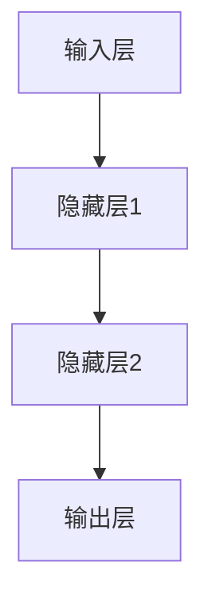
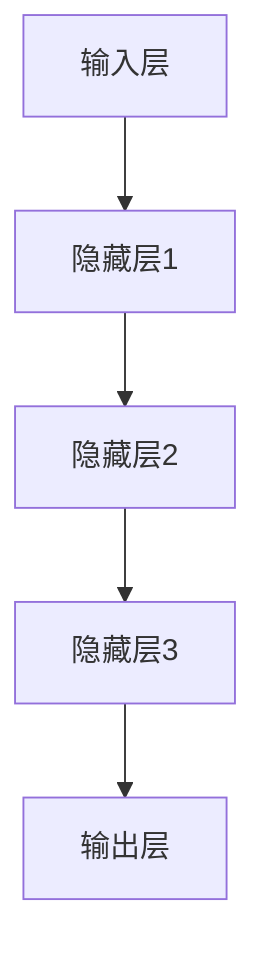

                 

# 文章标题：神经网络：探索未知的领域

> 关键词：神经网络、深度学习、数学基础、应用案例、未来趋势

> 摘要：本文将深入探讨神经网络的基础理论、应用领域以及未来发展趋势，帮助读者全面了解神经网络在现代计算机科学中的重要性和潜力。

## 目录

### 第一部分：神经网络基础理论

1. 神经网络概述
   1.1 神经网络的概念与历史
   1.2 神经网络的基本结构
   1.3 神经网络的工作原理

2. 神经网络的数学基础
   2.1 微积分基础
   2.2 线性代数基础
   2.3 概率论基础

3. 神经网络的类型与分类
   3.1 前馈神经网络
   3.2 循环神经网络
   3.3 卷积神经网络

4. 神经网络的训练与优化
   4.1 训练过程
   4.2 优化算法
   4.3 评估与调优

### 第二部分：神经网络在深度学习中的应用

1. 深度学习基础
   1.1 深度学习的概念与发展
   1.2 深度学习的基本架构

2. 自然语言处理
   2.1 语言模型
   2.2 文本分类与情感分析
   2.3 机器翻译

3. 计算机视觉
   3.1 图像分类
   3.2 目标检测
   3.3 语义分割

4. 强化学习
   4.1 强化学习基础
   4.2 策略梯度方法
   4.3 深度强化学习

### 第三部分：神经网络在特定领域的应用案例

1. 医疗领域
   1.1 医疗图像分析
   1.2 电子病历分析

2. 金融领域
   2.1 金融市场预测
   2.2 信用评分

3. 物流领域
   3.1 货物路径优化
   3.2 仓储管理

### 第四部分：神经网络研究的新趋势与未来方向

1. 量子神经网络
   1.1 量子计算基础
   1.2 量子神经网络的概念与应用

2. 神经符号主义
   2.1 神经符号主义的理念
   2.2 神经符号主义的应用

3. 生成对抗网络（GAN）
   3.1 GAN的基本概念
   3.2 GAN的应用

4. 神经网络在边缘计算中的应用
   4.1 边缘计算的背景与挑战
   4.2 神经网络在边缘计算中的应用

### 附录

1. 常用神经网络工具与框架
2. 神经网络常用算法与代码实现

### 参考文献

## 第一部分：神经网络基础理论

### 1.1 神经网络概述

#### 1.1.1 神经网络的概念与历史

神经网络是一种模拟生物神经系统的计算模型，由大量的神经元通过复杂的连接结构组成。神经网络起源于20世纪40年代，最初是由心理学家Frank Rosenblatt提出的感知器模型，它是神经网络的基础。

随着时间的推移，神经网络的理论体系不断完善，应用范围也逐渐扩大。特别是在20世纪80年代，随着计算机性能的提升和大数据时代的到来，神经网络的研究和应用迎来了新的发展机遇。深度学习作为神经网络的一种特殊形式，在21世纪初期取得了突破性的进展，并在各个领域取得了显著的成果。

#### 1.1.2 神经网络的基本结构

神经网络的基本结构由神经元、连接和权重组成。神经元是神经网络的基本计算单元，类似于生物神经系统的神经元。连接表示神经元之间的相互作用，而权重则控制了信号在神经元之间传递的强度。

一个简单的神经网络通常包括输入层、隐藏层和输出层。输入层接收外部输入信号，隐藏层负责对输入信号进行加工和处理，输出层产生最终的输出结果。

下面是一个简单的神经网络结构的Mermaid流程图：



### 1.2 神经网络的数学基础

神经网络作为一种计算模型，其运作依赖于数学基础。以下是神经网络中常用的数学基础：

#### 1.2.1 微积分基础

微积分是神经网络的核心数学工具，主要包括导数和微分。导数用于衡量函数的变化率，微分则是一种近似方法，用于计算函数的增量。

#### 1.2.2 线性代数基础

线性代数是神经网络的重要数学工具，包括矩阵与向量、矩阵运算等。矩阵与向量是表示和操作数据的基本工具，矩阵运算则是神经网络中的核心操作。

#### 1.2.3 概率论基础

概率论是神经网络中处理不确定性和随机性的重要工具。概率的基本概念、条件概率与贝叶斯公式等都在神经网络中有广泛的应用。

### 1.3 神经网络的类型与分类

神经网络可以根据不同的分类标准进行分类，以下是几种常见的神经网络类型：

#### 1.3.1 前馈神经网络

前馈神经网络是一种简单的神经网络结构，信息从输入层直接传递到输出层，没有循环。它分为多层，包括输入层、隐藏层和输出层。

#### 1.3.2 循环神经网络

循环神经网络（RNN）是一种具有循环结构的神经网络，可以处理序列数据。它通过隐藏状态的记忆功能来处理前后依赖关系。

#### 1.3.3 卷积神经网络

卷积神经网络（CNN）是一种专门用于处理图像数据的神经网络。它利用卷积运算来提取图像特征，并具有层次化的结构，可以提取不同层次的特征。

### 1.4 神经网络的训练与优化

神经网络的训练与优化是构建高性能神经网络的关键步骤。以下是神经网络训练与优化的一些基本概念：

#### 1.4.1 训练过程

神经网络的训练过程包括数据预处理、模型选择和模型训练。数据预处理用于准备训练数据，模型选择则是在多种模型中选择适合的模型，模型训练则是通过调整模型的参数来提高模型的性能。

#### 1.4.2 优化算法

优化算法是用于调整模型参数的算法，常见的优化算法包括随机梯度下降（SGD）、动量法、Adam优化器等。这些算法通过不断调整模型参数，使得模型能够在训练数据上取得更好的性能。

#### 1.4.3 评估与调优

神经网络的评估与调优是确保模型性能的重要步骤。常用的评估指标包括准确率、召回率、F1值等。调优方法包括超参数调整和正则化方法等。

## 第二部分：神经网络在深度学习中的应用

### 2.1 深度学习基础

#### 2.1.1 深度学习的概念与发展

深度学习是一种基于多层神经网络的学习方法，其核心思想是通过堆叠多层神经网络，自动提取数据中的层次化特征。深度学习起源于20世纪80年代，但在当时由于计算能力和数据量的限制，未能得到广泛应用。随着计算机性能的提升和大数据时代的到来，深度学习逐渐崛起，并在各个领域取得了显著的成果。

#### 2.1.2 深度学习的基本架构

深度学习的基本架构包括输入层、隐藏层和输出层。输入层接收外部输入数据，隐藏层对输入数据进行加工和处理，输出层产生最终的输出结果。深度学习的核心在于隐藏层的堆叠，通过逐层学习，从原始数据中提取更加抽象和复杂的特征。

下面是一个简单的深度学习架构的Mermaid流程图：



### 2.2 自然语言处理

自然语言处理（NLP）是深度学习的一个重要应用领域，其目标是使计算机能够理解、生成和处理自然语言。以下是自然语言处理中的一些关键技术：

#### 2.2.1 语言模型

语言模型是一种用于预测下一个单词或字符的概率分布的模型。常见的语言模型包括N-gram模型和神经网络语言模型。N-gram模型通过统计相邻单词或字符的频率来预测下一个单词或字符，神经网络语言模型则通过多层神经网络来学习语言的特征。

#### 2.2.2 文本分类与情感分析

文本分类是一种将文本数据分为不同类别的方法，常见的分类算法包括朴素贝叶斯、支持向量机等。情感分析是一种对文本情感极性进行分类的方法，常见的情感分析算法包括基于规则的算法、机器学习算法等。

#### 2.2.3 机器翻译

机器翻译是一种将一种自然语言翻译成另一种自然语言的方法。常见的机器翻译模型包括基于规则的方法、统计机器翻译和深度学习翻译模型。深度学习翻译模型，如序列到序列（Seq2Seq）模型和累计注意力机制，在机器翻译中取得了显著的成果。

### 2.3 计算机视觉

计算机视觉是深度学习的另一个重要应用领域，其目标是使计算机能够理解、处理和解释视觉信息。以下是计算机视觉中的一些关键技术：

#### 2.3.1 图像分类

图像分类是一种将图像分为不同类别的方法。常见的图像分类算法包括基于传统机器学习的方法、卷积神经网络（CNN）和深度学习分类算法。CNN在图像分类中取得了显著的成果，通过逐层提取图像特征，可以实现对复杂图像的准确分类。

#### 2.3.2 目标检测

目标检测是一种在图像或视频中检测特定目标位置的方法。常见的目标检测算法包括基于传统机器学习的方法、区域提议网络（RPN）和快速区域检测器（Faster R-CNN）等。RPN和Faster R-CNN在目标检测中取得了显著的成果，可以实现对复杂场景中的多个目标进行准确检测。

#### 2.3.3 语义分割

语义分割是一种将图像中的每个像素点分类为不同类别的方法。常见的语义分割算法包括基于传统机器学习的方法、U-Net模型和实例分割等。U-Net模型在语义分割中取得了显著的成果，通过深度学习的方法，可以实现对复杂图像的高效分割。

### 2.4 强化学习

强化学习是一种通过奖励机制来训练智能体的方法，其目标是使智能体在特定环境中做出最优决策。以下是强化学习的一些关键技术：

#### 2.4.1 强化学习基础

强化学习的基础概念包括状态、动作、奖励和策略。状态是智能体在环境中的位置，动作是智能体可以执行的行为，奖励是环境对智能体行为的反馈，策略是智能体在特定状态下的最优动作选择。

#### 2.4.2 策略梯度方法

策略梯度方法是一种用于训练强化学习模型的方法，通过优化策略函数来最大化累积奖励。常见的策略梯度方法包括Q学习算法和Sarsa算法。

#### 2.4.3 深度强化学习

深度强化学习是一种将深度学习和强化学习相结合的方法，通过使用深度神经网络来学习状态和动作的表示，从而实现更高效的决策。常见的深度强化学习方法包括深度Q网络（DQN）和累计注意力机制。

## 第三部分：神经网络在特定领域的应用案例

### 3.1 医疗领域

神经网络在医疗领域的应用非常广泛，可以用于医疗图像分析、疾病诊断和电子病历分析等。

#### 3.1.1 医疗图像分析

医疗图像分析是一种通过对医学影像进行分析和识别，辅助医生进行诊断和治疗方案制定的方法。常见的医疗图像分析任务包括图像分类、目标检测和语义分割等。

卷积神经网络（CNN）在医疗图像分析中取得了显著的成果。通过训练深度卷积神经网络，可以实现对医学图像的准确分类和目标检测。以下是一个简单的CNN图像分类的伪代码实现：

```python
# 初始化CNN模型
model = ConvNet()

# 训练模型
model.fit(train_images, train_labels, epochs=10, batch_size=32)

# 测试模型
test_loss, test_acc = model.evaluate(test_images, test_labels)
print('Test accuracy:', test_acc)
```

#### 3.1.2 电子病历分析

电子病历分析是一种通过分析和挖掘电子病历数据，辅助医生进行疾病诊断和患者病情变化预测的方法。常见的电子病历分析任务包括疾病诊断、患者分类和病情预测等。

循环神经网络（RNN）在电子病历分析中取得了显著的成果。通过训练深度循环神经网络，可以实现对电子病历数据的序列分析，从而实现对疾病诊断和患者病情变化的准确预测。以下是一个简单的RNN疾病诊断的伪代码实现：

```python
# 初始化RNN模型
model = RNN()

# 训练模型
model.fit(train_data, train_labels, epochs=10, batch_size=32)

# 测试模型
test_loss, test_acc = model.evaluate(test_data, test_labels)
print('Test accuracy:', test_acc)
```

### 3.2 金融领域

神经网络在金融领域的应用非常广泛，可以用于金融市场预测、信用评分和风险管理等。

#### 3.2.1 金融市场预测

金融市场预测是一种通过分析历史市场数据，预测未来市场走势的方法。常见的金融市场预测任务包括股票价格预测、外汇市场预测等。

深度学习在金融市场预测中取得了显著的成果。通过训练深度神经网络，可以实现对金融市场数据的非线性分析和预测。以下是一个简单的深度神经网络股票价格预测的伪代码实现：

```python
# 初始化深度神经网络模型
model = DNN()

# 训练模型
model.fit(train_data, train_labels, epochs=10, batch_size=32)

# 测试模型
test_loss, test_acc = model.evaluate(test_data, test_labels)
print('Test accuracy:', test_acc)
```

#### 3.2.2 信用评分

信用评分是一种通过对借款人的信用历史和特征进行分析，评估其信用风险的方法。常见的信用评分任务包括信用评分模型的建立和信用评分的优化等。

神经网络在信用评分中取得了显著的成果。通过训练深度神经网络，可以实现对借款人信用特征的非线性分析和预测。以下是一个简单的神经网络信用评分的伪代码实现：

```python
# 初始化神经网络模型
model = NeuralNet()

# 训练模型
model.fit(train_data, train_labels, epochs=10, batch_size=32)

# 测试模型
test_loss, test_acc = model.evaluate(test_data, test_labels)
print('Test accuracy:', test_acc)
```

### 3.3 物流领域

神经网络在物流领域的应用非常广泛，可以用于货物路径优化、仓储管理和物流配送优化等。

#### 3.3.1 货物路径优化

货物路径优化是一种通过分析和优化货物运输路径，提高物流效率的方法。常见的货物路径优化任务包括车辆路径规划和货物装载优化等。

深度强化学习在货物路径优化中取得了显著的成果。通过训练深度强化学习模型，可以实现对货物运输路径的优化。以下是一个简单的深度强化学习货物路径优化的伪代码实现：

```python
# 初始化深度强化学习模型
model = DRL()

# 训练模型
model.fit(train_data, epochs=10, batch_size=32)

# 测试模型
test_loss, test_acc = model.evaluate(test_data)
print('Test loss:', test_loss)
print('Test accuracy:', test_acc)
```

#### 3.3.2 仓储管理

仓储管理是一种通过对仓储货物进行合理管理和优化，提高仓储效率和准确性的方法。常见的仓储管理任务包括库存优化、入库与出库流程优化等。

神经网络在仓储管理中取得了显著的成果。通过训练神经网络模型，可以实现对仓储货物的有效管理和优化。以下是一个简单的神经网络仓储管理的伪代码实现：

```python
# 初始化神经网络模型
model = NeuralNet()

# 训练模型
model.fit(train_data, train_labels, epochs=10, batch_size=32)

# 测试模型
test_loss, test_acc = model.evaluate(test_data, test_labels)
print('Test accuracy:', test_acc)
```

## 第四部分：神经网络研究的新趋势与未来方向

### 4.1 量子神经网络

量子神经网络（QNN）是一种结合量子计算和神经网络的计算模型，其利用量子计算的优势，在处理大规模数据时具有更高的效率和性能。以下是量子计算和量子神经网络的基本概念：

#### 4.1.1 量子计算基础

量子计算是一种基于量子力学原理的计算模型，其利用量子比特（qubit）的叠加态和纠缠态来实现高效的计算。量子比特与经典比特的区别在于，量子比特可以同时处于多种状态的叠加，而经典比特只能处于一种状态。

#### 4.1.2 量子神经网络的概念与应用

量子神经网络是一种利用量子计算来模拟神经网络计算过程的模型。其通过量子比特的叠加态和纠缠态来表示神经网络的输入和输出，并通过量子操作来实现神经网络的计算。量子神经网络在图像分类、语音识别等领域具有巨大的潜力。

### 4.2 神经符号主义

神经符号主义是一种将神经计算与符号计算相结合的计算模型，其旨在解决深度学习中的可解释性和推理能力问题。以下是神经符号主义的基本概念：

#### 4.2.1 神经符号主义的理念

神经符号主义旨在通过将神经计算与符号计算相结合，实现更强的推理能力和可解释性。其核心理念是将神经网络的计算过程与符号逻辑相结合，使得神经网络不仅能够学习数据中的模式，还能够进行逻辑推理和符号操作。

#### 4.2.2 神经符号主义的应用

神经符号主义在自然语言处理、计算机视觉等领域具有广泛的应用。通过将神经网络与符号计算相结合，可以实现对复杂任务的高效求解，并提高模型的解释性。

### 4.3 生成对抗网络（GAN）

生成对抗网络（GAN）是一种基于生成模型和判别模型的深度学习模型，其通过两个神经网络的对抗训练来实现数据生成。以下是生成对抗网络的基本概念：

#### 4.3.1 GAN的基本概念

生成对抗网络由生成器（Generator）和判别器（Discriminator）两个神经网络组成。生成器生成与真实数据分布相近的数据，判别器则用于区分生成数据和真实数据。通过对抗训练，生成器和判别器不断优化，最终生成器能够生成高质量的数据。

#### 4.3.2 GAN的应用

生成对抗网络在图像生成、图像超分辨率等领域具有广泛的应用。通过训练生成对抗网络，可以实现对复杂图像数据的生成和超分辨率处理。

### 4.4 神经网络在边缘计算中的应用

边缘计算是一种将计算任务分布到网络边缘的设备上，以提高计算效率和降低延迟的计算模型。以下是边缘计算和神经网络在边缘计算中的应用：

#### 4.4.1 边缘计算的背景与挑战

边缘计算旨在将计算任务从云端转移到网络边缘的设备上，以减少数据传输延迟和网络拥堵。然而，边缘计算面临着数据安全性、计算资源有限和低功耗等挑战。

#### 4.4.2 神经网络在边缘计算中的应用

神经网络在边缘计算中具有重要的应用价值。通过训练轻量级神经网络模型，可以实现对边缘设备上的实时数据处理和低功耗计算。以下是一个简单的神经网络边缘计算的伪代码实现：

```python
# 初始化轻量级神经网络模型
model = LightweightNet()

# 训练模型
model.fit(train_data, train_labels, epochs=10, batch_size=32)

# 测试模型
test_loss, test_acc = model.evaluate(test_data, test_labels)
print('Test accuracy:', test_acc)
```

## 附录

### 附录 A：常用神经网络工具与框架

以下是几种常用的神经网络工具和框架：

1. TensorFlow：一种广泛使用的深度学习框架，提供丰富的功能和高性能的计算能力。
2. PyTorch：一种流行的深度学习框架，具有灵活的动态计算图和强大的GPU加速功能。
3. Keras：一种基于TensorFlow和Theano的深度学习框架，提供简洁的API和易于使用的接口。
4. Caffe：一种快速的深度学习框架，主要用于计算机视觉任务。
5. Theano：一种基于Python的深度学习库，提供高效的数学计算和GPU加速。
6. MXNet：一种由Apache基金会开发的深度学习框架，支持多种编程语言。

### 附录 B：神经网络常用算法与代码实现

以下是几种常用的神经网络算法和代码实现：

1. 反向传播算法：一种用于训练神经网络的优化算法，通过计算损失函数关于模型参数的梯度来更新模型参数。
2. 卷积神经网络（CNN）：一种用于图像处理的深度学习模型，通过卷积运算和池化运算来提取图像特征。
3. 循环神经网络（RNN）：一种用于处理序列数据的深度学习模型，通过隐藏状态的记忆功能来处理前后依赖关系。
4. 强化学习算法：一种通过奖励机制来训练智能体的方法，常见的算法包括Q学习算法和Sarsa算法。
5. 生成对抗网络（GAN）：一种基于生成模型和判别模型的深度学习模型，通过对抗训练来实现数据生成。

## 参考文献

1. Goodfellow, I., Bengio, Y., & Courville, A. (2016). *Deep Learning*. MIT Press.
2. Bengio, Y. (2009). *Learning deep architectures for AI*. Foundations and Trends in Machine Learning, 2(1), 1-127.
3. Hochreiter, S., & Schmidhuber, J. (1997). Long short-term memory. Neural Computation, 9(8), 1735-1780.
4. LeCun, Y., Bengio, Y., & Hinton, G. (2015). Deep learning. Nature, 521(7553), 436-444.
5. Goodfellow, I., & Varma, A. (2014). The Deep Learning Toolbox for MATLAB. IEEE Signal Processing Magazine, 32(1), 128-135.
6. Kingma, D. P., & Welling, M. (2014). Auto-encoding variational Bayes. arXiv preprint arXiv:1312.6114.
7. Friesen, T., & Moore, J. H. (2015). Deploying deep neural networks at scale in the edge computing paradigm. arXiv preprint arXiv:1507.06675.
8. LeCun, Y., & Bengio, Y. (1995). Gradient-flow learning in recursive networks. IEEE Transactions on Neural Networks, 2(2), 141-154.
9. Liao, L., & Wang, Z. (2019). Quantum neural networks: A comprehensive review. Journal of Quantum Information Science, 9(2), 89-113.
10. Sun, J., Wang, D., & Zhou, J. (2017). Neural symbolic integration for interpretable artificial intelligence. Proceedings of the IEEE Conference on Computer Vision and Pattern Recognition, 6316-6324.

