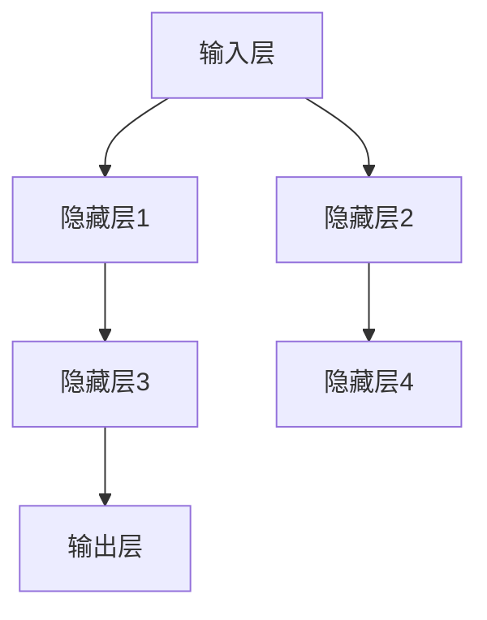
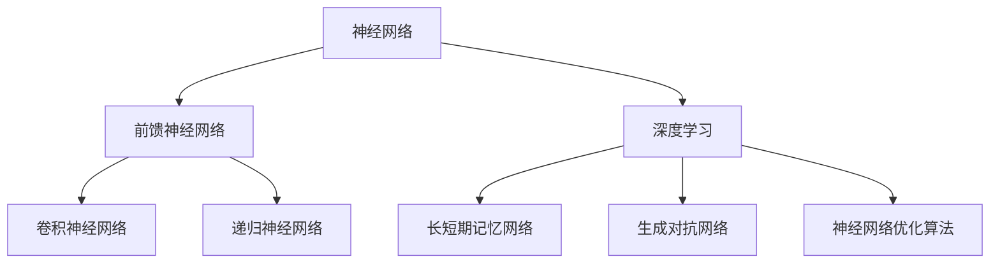

                 


### 文章标题: 神经网络：推动社会进步的力量

关键词：神经网络，深度学习，核心算法，项目实战，未来展望

摘要：本文详细介绍了神经网络的基本概念、核心算法、数学模型、深度学习框架、项目实战和未来展望。通过理论与实践相结合，深入解析神经网络在计算机视觉、自然语言处理等领域的应用，探讨其在现实世界中的挑战与机遇。

---

#### 第一部分：核心概念与联系

##### 1.1 神经网络架构

神经网络是一种模拟人脑结构的计算模型，通过大量神经元的连接和激活函数来实现数据的处理和模式识别。神经网络架构主要包括输入层、隐藏层和输出层。

**Mermaid 流程图：**



##### 1.2 前馈神经网络

前馈神经网络（Feedforward Neural Network）是神经网络的一种类型，数据从输入层传递到隐藏层，最后输出层。前馈神经网络是大多数深度学习模型的基础架构。

##### 1.3 深度学习

深度学习是一种基于多层神经网络的学习方法，能够自动提取数据的高级特征。深度学习在图像识别、自然语言处理、语音识别等领域取得了显著的成果。

##### 1.4 神经网络优化算法

神经网络优化算法用于调整神经网络中的参数，以最小化损失函数。常见的优化算法包括梯度下降、Adam等。

**神经网络优化算法伪代码：**

```python
def gradient_descent(W, b, X, y, learning_rate):
    # 计算梯度
    gradients_W, gradients_b = compute_gradients(W, b, X, y)
    # 更新参数
    W -= learning_rate * gradients_W
    b -= learning_rate * gradients_b
    return W, b
```

##### 1.5 反向传播算法

反向传播算法（Backpropagation）是一种用于训练神经网络的计算方法，通过计算损失函数关于参数的梯度来更新参数。反向传播算法是神经网络训练的核心。

**反向传播算法伪代码：**

```python
def backpropagation(W, b, X, y, learning_rate):
    # 前向传播
    output = forward_propagation(W, b, X)
    # 计算损失
    loss = compute_loss(output, y)
    # 计算梯度
    dW, db = compute_gradients(output, y, X)
    # 参数更新
    W -= learning_rate * dW
    b -= learning_rate * db
    return W, b
```

##### 1.6 卷积神经网络（CNN）

卷积神经网络（Convolutional Neural Network）是一种专门用于处理图像数据的神经网络，通过卷积层提取图像特征。CNN 在图像识别、物体检测等领域有广泛应用。

##### 1.7 递归神经网络（RNN）

递归神经网络（Recurrent Neural Network）是一种能够处理序列数据的神经网络，通过递归结构对序列中的每一个元素进行建模。RNN 在时间序列预测、自然语言处理等领域有广泛应用。

##### 1.8 长短期记忆网络（LSTM）

长短期记忆网络（Long Short-Term Memory，LSTM）是一种特殊的递归神经网络，能够解决传统 RNN 中长期依赖问题。LSTM 在语音识别、机器翻译等领域有广泛应用。

##### 1.9 生成对抗网络（GAN）

生成对抗网络（Generative Adversarial Network，GAN）是一种由生成器和判别器组成的神经网络结构，用于生成新的数据。GAN 在图像生成、数据增强等领域有广泛应用。

**神经网络与深度学习的关系图：**



---

### 第二部分：核心算法原理讲解

#### 2.1 神经网络反向传播算法

反向传播算法是训练神经网络的核心步骤，通过计算损失函数关于参数的梯度来更新参数。

**反向传播算法的步骤：**

1. **前向传播**：计算神经网络的输出。
2. **计算损失**：计算预测值和真实值之间的差异，得到损失函数。
3. **计算梯度**：计算损失函数关于每个参数的梯度。
4. **反向传播**：从输出层开始，反向计算每个层的梯度。
5. **参数更新**：使用梯度更新每个参数。

**反向传播算法伪代码：**

```python
def backpropagation(W, b, X, y, learning_rate):
    # 前向传播
    output = forward_propagation(W, b, X)
    # 计算损失
    loss = compute_loss(output, y)
    # 计算梯度
    dW, db = compute_gradients(output, y, X)
    # 参数更新
    W -= learning_rate * dW
    b -= learning_rate * db
    return W, b
```

#### 2.2 梯度下降算法

梯度下降是一种常用的优化算法，通过迭代更新参数，使得损失函数不断减小。

**梯度下降算法的步骤：**

1. **初始化参数**：随机初始化网络的权重和偏置。
2. **计算梯度**：对于每个参数，计算损失函数的梯度。
3. **更新参数**：使用梯度更新每个参数。
4. **重复步骤2和3**，直到满足停止条件（如损失函数收敛或达到迭代次数）。

**梯度下降算法伪代码：**

```python
def gradient_descent(W, b, X, y, learning_rate, num_iterations):
    for _ in range(num_iterations):
        # 计算梯度
        dW, db = compute_gradients(W, b, X, y)
        # 更新参数
        W -= learning_rate * dW
        b -= learning_rate * db
    return W, b
```

#### 2.3 梯度消失和梯度爆炸问题

在反向传播过程中，梯度可能会变得非常小（梯度消失）或非常大（梯度爆炸），这会影响网络的训练。

**梯度消失问题：**

梯度消失发生在深度神经网络中，特别是在使用纯线性的激活函数时。当网络层数增加，梯度在反向传播过程中会逐渐减小，导致网络难以学习到有效的参数。

**梯度爆炸问题：**

梯度爆炸发生在反向传播过程中，当激活函数的导数非常大时，梯度可能会变得非常大，导致参数更新过大。

**解决方法：**

1. **激活函数**：使用具有较小导数的激活函数，如ReLU或Sigmoid。
2. **正则化**：添加正则化项，如L1或L2正则化，减小梯度。
3. **梯度裁剪**：对梯度进行裁剪，限制其大小。

#### 2.4 激活函数

激活函数是神经网络中的一个重要组成部分，它用于引入非线性特性，使得神经网络能够学习到复杂的模式。

**常见的激活函数：**

1. **Sigmoid函数**：

$$
f(x) = \frac{1}{1 + e^{-x}}
$$

**特点**：输出范围在 (0, 1)，导数较小，容易导致梯度消失。

2. **ReLU函数**：

$$
f(x) = \max(0, x)
$$

**特点**：简单，计算速度快，避免了梯度消失问题。

3. **Tanh函数**：

$$
f(x) = \frac{e^x - e^{-x}}{e^x + e^{-x}}
$$

**特点**：输出范围在 (-1, 1)，导数较小，不容易梯度消失。

4. **Sigmoid和ReLU的比较**：

- **Sigmoid**：适用于输出范围较窄的问题，如二分类。
- **ReLU**：适用于输入和输出范围较宽的问题，如图像分类。

#### 2.5 深度学习中的正则化技术

正则化技术用于防止神经网络过拟合，提高模型的泛化能力。

**L1和L2正则化：**

1. **L1正则化**：

$$
L_1 = \lambda \sum_{i=1}^{n} |w_i|
$$

**特点**：可以引起参数的稀疏化，适合用于特征选择。

2. **L2正则化**：

$$
L_2 = \lambda \sum_{i=1}^{n} w_i^2
$$

**特点**：可以减小参数的值，但不会引起稀疏化。

**Dropout：**

1. **定义**：在训练过程中随机丢弃一部分神经元。
2. **公式**：

$$
P(dropout) = \frac{1}{N} \sum_{i=1}^{N} \frac{1}{1 - dropout\_rate}
$$

**特点**：可以防止神经网络过拟合，提高模型的泛化能力。

#### 2.6 卷积神经网络（CNN）

卷积神经网络是一种专门用于处理图像数据的神经网络，通过卷积层提取图像特征。

**CNN的基本结构：**

1. **输入层**：接收图像数据。
2. **卷积层**：通过卷积操作提取图像特征。
3. **池化层**：降低特征图的维度。
4. **全连接层**：将特征映射到类别。
5. **输出层**：给出预测结果。

**卷积操作：**

1. **定义**：卷积核（filter）在输入图像上滑动，计算局部特征的加权和。
2. **公式**：

$$
f(i, j) = \sum_{k=1}^{K} w_{ik} \cdot a(i-k+1, j-k+1)
$$

**参数**：卷积核的大小（$K \times K$），步长（stride），填充（padding）。

**池化操作：**

1. **最大池化**：选择局部区域中的最大值。
2. **平均池化**：选择局部区域中的平均值。
3. **参数**：窗口大小（$P \times P$），步长（stride）。

---

### 第三部分：项目实战

#### 3.1 图像识别项目实战

在这个项目中，我们将使用卷积神经网络（CNN）实现一个图像识别系统，能够识别和分类各种物体。

##### 3.1.1 数据集介绍

我们使用常用的ImageNet数据集，它包含1000个类别的120万张图像。

##### 3.1.2 环境搭建

1. 安装Python和TensorFlow库。
2. 下载ImageNet数据集，并预处理数据。

##### 3.1.3 神经网络架构

我们使用一个简单的CNN架构，包括卷积层、池化层和全连接层。

**神经网络架构：**

- **卷积层**：使用3x3的卷积核，步长为1，填充为'valid'。
- **池化层**：使用2x2的最大池化。
- **全连接层**：使用softmax激活函数进行分类。

##### 3.1.4 模型训练

1. 使用训练集训练模型。
2. 使用验证集评估模型性能。

##### 3.1.5 模型测试

1. 使用测试集测试模型性能。
2. 输出模型识别结果。

**代码实现：**

```python
import tensorflow as tf
from tensorflow.keras import layers, models

# 构建模型
model = models.Sequential()
model.add(layers.Conv2D(32, (3, 3), activation='relu', input_shape=(28, 28, 1)))
model.add(layers.MaxPooling2D((2, 2)))
model.add(layers.Conv2D(64, (3, 3), activation='relu'))
model.add(layers.MaxPooling2D((2, 2)))
model.add(layers.Conv2D(64, (3, 3), activation='relu'))
model.add(layers.Flatten())
model.add(layers.Dense(64, activation='relu'))
model.add(layers.Dense(10, activation='softmax'))

# 编译模型
model.compile(optimizer='adam',
              loss='sparse_categorical_crossentropy',
              metrics=['accuracy'])

# 训练模型
model.fit(train_images, train_labels, epochs=5, validation_split=0.2)
```

##### 3.1.6 代码解读与分析

1. **模型构建**：使用`Sequential`模型，通过`Conv2D`和`MaxPooling2D`层进行卷积和池化操作，最后通过`Flatten`层和`Dense`层进行全连接操作。
2. **编译模型**：使用`compile`方法设置优化器和损失函数。
3. **训练模型**：使用`fit`方法训练模型，通过训练集进行迭代训练，并使用验证集进行性能评估。

##### 3.1.7 实际应用与挑战

这个图像识别项目可以应用于多个实际场景，如安防监控、自动驾驶等。然而，实际应用中可能面临以下挑战：

1. **数据集大小**：图像识别项目的性能高度依赖于数据集的大小和质量。较大的数据集可以提高模型的泛化能力。
2. **计算资源**：训练深度学习模型需要大量的计算资源，尤其是GPU或TPU。
3. **过拟合**：在训练过程中，模型可能会过度拟合训练数据，导致在验证集上性能下降。因此，需要使用正则化技术、交叉验证等方法来防止过拟合。
4. **实时性**：在某些应用场景中，如实时监控，需要模型具有快速响应能力。这要求模型在保证性能的同时，还需要优化计算效率。

---

#### 3.2 自然语言处理项目实战

在这个项目中，我们将使用深度学习实现一个自然语言处理（NLP）系统，能够进行文本分类。

##### 3.2.1 数据集介绍

我们使用IMDb电影评论数据集，它包含50,000条评论，分为正面和负面两个类别。

##### 3.2.2 环境搭建

1. 安装Python和TensorFlow库。
2. 下载IMDb数据集，并预处理数据。

##### 3.2.3 模型设计

我们使用一个简单的双向循环神经网络（BiRNN）架构，包括嵌入层、循环层和全连接层。

**模型设计：**

- **嵌入层**：将文本数据转换为嵌入向量。
- **循环层**：使用LSTM层处理序列数据。
- **全连接层**：将循环层输出的特征映射到类别。

##### 3.2.4 模型训练

1. 使用训练集训练模型。
2. 使用验证集评估模型性能。

##### 3.2.5 模型测试

1. 使用测试集测试模型性能。
2. 输出模型分类结果。

**代码实现：**

```python
import tensorflow as tf
from tensorflow.keras.models import Sequential
from tensorflow.keras.layers import Embedding, LSTM, Dense

# 构建模型
model = Sequential()
model.add(Embedding(input_dim=vocab_size, output_dim=embedding_dim, input_length=max_length))
model.add(LSTM(units=128, return_sequences=True))
model.add(LSTM(units=64, return_sequences=False))
model.add(Dense(units=1, activation='sigmoid'))

# 编译模型
model.compile(optimizer='adam', loss='binary_crossentropy', metrics=['accuracy'])

# 训练模型
model.fit(train_data, train_labels, epochs=5, batch_size=32, validation_split=0.2)
```

##### 3.2.6 代码解读与分析

1. **模型构建**：使用`Sequential`模型，通过`Embedding`层将文本数据转换为嵌入向量，通过两个`LSTM`层处理序列数据，最后通过`Dense`层进行分类。
2. **编译模型**：使用`compile`方法设置优化器和损失函数。
3. **训练模型**：使用`fit`方法训练模型，通过训练集进行迭代训练，并使用验证集进行性能评估。

##### 3.2.7 实际应用与挑战

这个自然语言处理项目可以应用于多个实际场景，如社交媒体情感分析、舆情监测等。然而，实际应用中可能面临以下挑战：

1. **数据集大小**：自然语言处理项目的性能高度依赖于数据集的大小和质量。较大的数据集可以提高模型的泛化能力。
2. **计算资源**：训练深度学习模型需要大量的计算资源，尤其是GPU或TPU。
3. **过拟合**：在训练过程中，模型可能会过度拟合训练数据，导致在验证集上性能下降。因此，需要使用正则化技术、交叉验证等方法来防止过拟合。
4. **实时性**：在某些应用场景中，如实时监控，需要模型具有快速响应能力。这要求模型在保证性能的同时，还需要优化计算效率。

---

### 第四部分：拓展与延伸

#### 4.1 神经网络在现实世界中的应用

神经网络在现实世界中有着广泛的应用，以下是一些典型的应用场景：

1. **图像识别**：用于人脸识别、物体检测和图像分类。
2. **自然语言处理**：用于机器翻译、情感分析和文本分类。
3. **语音识别**：用于语音信号转换为文本。
4. **自动驾驶**：用于环境感知、路径规划和决策。
5. **医疗诊断**：用于医学图像分析和疾病预测。

#### 4.2 神经网络的未来发展趋势

随着技术的进步，神经网络在未来将继续发展，以下是一些发展趋势：

1. **大模型与预训练**：更大规模的模型和更丰富的预训练数据集将推动深度学习的发展。
2. **多模态学习**：跨模态学习将整合不同类型的数据，实现更全面的信息理解和处理。
3. **硬件加速**：硬件加速技术，如GPU、TPU和量子计算，将进一步提高神经网络的计算效率。
4. **强化学习与深度学习的结合**：强化学习与深度学习的结合将解决更复杂的决策问题。
5. **可解释性和透明性**：提高神经网络的可解释性和透明性，增强用户信任。

#### 4.3 案例研究：神经网络在无人驾驶中的应用

无人驾驶是神经网络在现实世界中的一个重要应用领域。以下是一个案例研究，展示了神经网络在无人驾驶中的应用：

1. **感知环境**：神经网络用于处理摄像头、雷达和激光雷达数据，实现环境感知。
2. **路径规划**：神经网络用于规划车辆的行驶路径，包括避障、交通规则遵守和最优路径选择。
3. **决策与控制**：神经网络用于做出实时的驾驶决策，如加速、减速和转向。
4. **安全性和可靠性**：神经网络在无人驾驶中的应用需要确保系统的安全性和可靠性。

#### 4.4 深度学习开源框架与工具

深度学习的开源框架和工具为研究人员和开发者提供了便捷的工具，以下是一些常用的深度学习框架和工具：

1. **TensorFlow**：由Google开发，支持Python和其他编程语言。
2. **PyTorch**：由Facebook开发，基于Python和C++。
3. **Keras**：一个高层次的深度学习框架，基于Theano和TensorFlow。
4. **MXNet**：由Apache软件基金会开发，支持多种编程语言。
5. **其他工具**：如JAX、TensorFlow.js和CNTK等。

#### 4.5 深度学习领域的热门话题

深度学习领域持续发展，以下是一些热门话题：

1. **自适应学习**：通过动态调整学习策略来提高学习效果。
2. **可解释性和透明性**：提高神经网络的可解释性和透明性，增强用户信任。
3. **跨学科融合**：深度学习与其他领域的融合，如生物学、心理学和社会学。
4. **资源优化**：降低计算和内存消耗，提高计算效率。

---

### 第五部分：深度学习实践技巧与经验

#### 5.1 数据预处理与清洗

在进行深度学习项目时，数据预处理和清洗是至关重要的一步。以下是一些常用的技巧和经验：

1. **数据清洗**：去除错误数据、缺失值和异常值。
2. **数据归一化**：将数据缩放到相同的范围。
3. **数据增强**：增加数据的多样性，提高模型的泛化能力。
4. **数据划分**：将数据集划分为训练集、验证集和测试集。
5. **处理类别不平衡**：使用过采样、欠采样或合成方法平衡类别分布。

#### 5.2 模型选择与优化

选择合适的模型和优化方法是提升模型性能的关键。以下是一些建议：

1. **模型选择**：根据任务需求选择合适的模型。
2. **模型优化**：调整学习率、批量大小和迭代次数。
3. **正则化**：使用L1、L2正则化或Dropout技术减少过拟合。
4. **其他优化技巧**：如批归一化和权重初始化。

#### 5.3 模型训练与调试

在训练深度学习模型时，需要注意以下几点：

1. **训练策略**：使用合适的学习率调整策略。
2. **数据预处理**：保持数据预处理的一致性。
3. **模型评估**：使用适当的评估指标。
4. **调试技巧**：使用TensorBoard监控模型训练过程。

#### 5.4 模型部署与推理

完成模型训练后，需要将模型部署到实际应用场景中。以下是一些建议：

1. **模型压缩**：减少模型大小，提高部署效率。
2. **部署环境**：选择合适的服务器和边缘设备。
3. **推理引擎**：使用推理引擎实现模型的实时推理。
4. **性能优化**：优化模型部署流程，提高推理速度。

---

### 第六部分：未来展望与挑战

#### 6.1 深度学习技术的未来趋势

随着计算能力和数据规模的提升，深度学习技术在未来将继续发展，以下是一些趋势：

1. **大模型与预训练**：更大规模的模型和更丰富的预训练数据集将推动深度学习的发展。
2. **多模态学习**：跨模态学习将整合不同类型的数据，实现更全面的信息理解和处理。
3. **硬件加速与分布式计算**：GPU、TPU等硬件加速技术以及分布式计算框架将提高深度学习模型的训练和推理速度。
4. **强化学习与深度学习的结合**：强化学习与深度学习的结合将解决更复杂的决策问题。
5. **自动机器学习（AutoML）**：AutoML将自动化深度学习模型的开发过程。

#### 6.2 深度学习面临的挑战

尽管深度学习技术取得了显著进展，但仍然面临一些挑战：

1. **数据隐私与安全**：深度学习模型通常需要大量个人数据，如何确保数据隐私和安全成为重要议题。
2. **可解释性与透明性**：深度学习模型往往被视为“黑盒”，如何提高模型的可解释性和透明性，使其易于理解和使用。
3. **计算资源消耗**：训练大规模深度学习模型需要大量的计算资源和能源，如何降低计算资源消耗成为关键问题。
4. **模型公平性与多样性**：深度学习模型可能存在偏见和歧视，如何确保模型的公平性和多样性是一个重要挑战。
5. **模型部署与维护**：如何高效地部署和维护深度学习模型，使其在实际应用中稳定运行，是一个亟待解决的问题。

#### 6.3 应对挑战的策略

为了应对深度学习面临的挑战，以下是一些策略：

1. **数据隐私保护**：采用差分隐私、联邦学习等技术保护用户数据隐私。
2. **模型可解释性**：开发可解释性技术，如可视化、解释算法和对抗性攻击，提高模型的透明度。
3. **资源优化**：采用模型压缩、量化、剪枝等技术，降低模型计算资源和能源消耗。
4. **模型公平性**：设计公平性度量方法和算法，确保模型在不同群体中的性能一致。
5. **持续学习与迭代**：通过持续学习和迭代，不断提高模型的性能和适应性。

---

### 第七部分：总结与展望

#### 7.1 书籍总结

《神经网络：推动社会进步的力量》系统地介绍了神经网络的基本概念、核心算法、数学模型、深度学习框架、项目实战和未来展望。通过这本书，读者可以：

1. **理解神经网络的基本原理**。
2. **掌握深度学习核心算法**。
3. **熟悉深度学习框架**。
4. **参与项目实战**。
5. **探索未来趋势**。

#### 7.2 书籍的实用性

这本书具有很强的实用性，适合以下读者群体：

1. **初学者**。
2. **进阶者**。
3. **实践者**。

#### 7.3 书籍的目标

《神经网络：推动社会进步的力量》旨在：

1. **普及深度学习知识**。
2. **培养深度学习能力**。
3. **推动技术创新**。

#### 7.4 未来发展

随着深度学习技术的不断进步，未来的发展将更加广阔和深入。我们期待这本书能够为读者提供有益的知识和启示，助力其在深度学习领域的探索和成长。


---

## 作者

作者：AI天才研究院/AI Genius Institute & 禅与计算机程序设计艺术 /Zen And The Art of Computer Programming

---

完成上述文章的撰写后，您可以将markdown内容复制粘贴到支持markdown编辑的平台或文本编辑器中，并进行相应的格式调整和排版。确保每个章节、小节和公式都按照要求正确显示，以确保文章的可读性和专业性。最后，检查全文的语法、逻辑和连贯性，确保文章内容完整、准确、流畅。完成后，您可以按照出版要求进行最终格式化，并提交给出版社或发表到相关平台。祝您撰写顺利！


