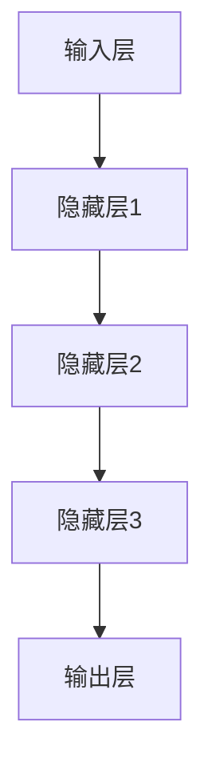

                 

## 文章标题: 神经网络：改变世界的技术

> 关键词：神经网络，深度学习，人工智能，反向传播，计算机视觉，自然语言处理

> 摘要：本文旨在深入探讨神经网络这一改变世界的技术。首先，我们将回顾神经网络的发展历史，了解其起源和演变。接下来，我们将详细介绍神经网络的基本结构、学习算法和数学原理，并通过具体案例展示神经网络在计算机视觉和自然语言处理等领域的应用。最后，我们将展望神经网络的未来发展，讨论其面临的挑战与机遇。

## 引言

### 神经网络：无所不能的技术

神经网络（Neural Networks）是一种模拟人脑神经元结构和功能的计算模型，具有强大的学习和自适应能力。自20世纪50年代首次提出以来，神经网络经历了数次重大发展和变革，尤其在深度学习（Deep Learning）领域取得了惊人的突破。如今，神经网络已经成为人工智能（Artificial Intelligence, AI）的核心技术之一，广泛应用于计算机视觉、自然语言处理、语音识别、医疗诊断、金融分析等众多领域。

### 文章结构

本文将按照以下结构展开：

1. **神经网络基础**：介绍神经网络的基本概念、历史发展和主要类型。
2. **神经网络学习算法**：讲解神经网络的学习算法，包括反向传播算法、梯度下降法和深度学习优化算法。
3. **神经网络中的数学原理**：探讨神经网络所需的概率论、线性代数和优化理论。
4. **深度学习框架**：介绍常用的深度学习框架，如TensorFlow和PyTorch。
5. **神经网络项目实战**：通过具体项目案例展示神经网络的实际应用。
6. **神经网络应用案例**：详细讨论神经网络在计算机视觉、自然语言处理和语音识别等领域的应用。
7. **神经网络未来发展**：展望神经网络的未来趋势、挑战和机遇。
8. **附录**：提供神经网络常用工具和资源、流程图和伪代码示例、数学公式和代码实例。

### 文章目的

本文的目标是：

1. 让读者全面了解神经网络的基本概念、结构和算法。
2. 帮助读者掌握神经网络在各个领域的实际应用。
3. 探讨神经网络未来的发展方向和面临的挑战。

### 读者对象

本文适合以下读者群体：

1. 对神经网络和深度学习感兴趣的初学者。
2. 想要深入了解神经网络原理和应用的开发者。
3. 研究人工智能和机器学习的科研人员。

### 论文风格

本文将采用以下风格：

1. **逻辑清晰**：通过逐步分析和推理，帮助读者理解神经网络的本质。
2. **专业性强**：使用专业的技术语言和数学公式，深入探讨神经网络的理论基础。
3. **通俗易懂**：通过案例和示例，使复杂的理论变得通俗易懂。

### 神经网络的重要性

神经网络作为人工智能的核心技术之一，其重要性体现在以下几个方面：

1. **强大的学习和自适应能力**：神经网络可以通过学习大量数据，自动提取特征并进行分类、预测和生成，从而实现复杂任务。
2. **跨领域应用**：神经网络广泛应用于计算机视觉、自然语言处理、语音识别等多个领域，推动了人工智能技术的发展。
3. **提高生产效率**：神经网络技术可以自动化许多重复性工作，提高生产效率，降低人力成本。
4. **改善生活质量**：神经网络技术可以应用于医疗诊断、智能助手、智能家居等领域，改善人们的生活质量。

总之，神经网络作为一种改变世界的技术，具有广泛的应用前景和重要的社会价值。接下来，我们将逐步深入探讨神经网络的理论和实践，帮助读者全面了解这一神奇的技术。

### 神经网络的基本概念

神经网络（Neural Networks）是一种模拟人脑神经元结构和功能的计算模型，由大量相互连接的神经元（或节点）组成。这些神经元通过传递和处理信息，实现数据输入到输出之间的转换。

#### 神经元的基本结构

一个典型的神经元包含以下几个部分：

1. **输入层**：接收外部输入信号，每个输入信号都对应一个权重值。
2. **激活函数**：对输入信号进行非线性变换，引入非线性特性，使得神经网络具有强大的学习和自适应能力。
3. **输出层**：输出处理后的信号，用于分类、预测或生成目标输出。
4. **连接权重**：神经元之间的连接具有权重值，用于表示连接的强度。
5. **偏置**：用于调整神经元的阈值，增强网络的泛化能力。

#### 神经网络的起源和发展历史

神经网络的起源可以追溯到20世纪50年代，当时美国心理学家McCulloch和Pitts提出了第一个模拟神经元功能的数学模型，即感知机（Perceptron）。虽然感知机只能处理线性可分问题，但它为神经网络的发展奠定了基础。

1. **1950年代**：感知机模型问世，成为神经网络的开端。
2. **1960年代**：马文·闵斯基（Marvin Minsky）和西摩尔·派普特（Seymour Papert）指出感知机无法解决非线性问题，导致神经网络研究陷入低潮。
3. **1980年代**：反向传播算法（Backpropagation Algorithm）的提出，使得多层神经网络训练成为可能。
4. **1990年代**：支持向量机（Support Vector Machine, SVM）等新算法的发展，使得神经网络在分类问题中的应用受到挑战。
5. **2006年**：杰弗里·辛顿（Geoffrey Hinton）等人提出深度学习（Deep Learning）概念，重新点燃了神经网络研究的热潮。
6. **2010年代至今**：随着计算硬件的进步和大数据的普及，深度学习取得了重大突破，在图像识别、语音识别、自然语言处理等领域取得了显著成果。

#### 深度学习与神经网络的联系

深度学习（Deep Learning）是一种基于多层神经网络的学习方法，通过多层次的非线性变换，自动提取特征并进行分类、预测和生成。深度学习与神经网络的关系如下：

1. **神经网络是深度学习的基础**：深度学习通过多层神经网络实现，因此神经网络是深度学习的重要组成部分。
2. **深度学习扩展了神经网络的应用范围**：深度学习通过引入多层神经网络，解决了传统神经网络在处理复杂任务时的局限性，从而扩展了神经网络的应用范围。
3. **深度学习推动了神经网络的发展**：深度学习的成功，促使研究人员不断改进神经网络的理论和方法，推动神经网络技术的发展。

综上所述，神经网络作为一种强大的计算模型，具有广泛的应用前景。接下来，我们将进一步探讨神经网络的基本结构、学习算法和数学原理。

### 神经网络的基本结构

神经网络（Neural Networks）的基本结构由多个层组成，每层包含多个神经元。这些神经元通过加权连接形成网络，从而实现数据的输入到输出的变换。以下是神经网络的主要组成部分及其工作原理：

#### 神经元的工作原理

神经元是神经网络的基本单元，类似于生物神经元。一个简单的神经元可以表示为：

\[ z = w \cdot x + b \]

其中，\( w \) 是权重（weight），\( x \) 是输入（input），\( b \) 是偏置（bias）。这个公式表示输入信号通过权重和偏置加权后，产生一个中间值 \( z \)。

接下来，通过激活函数（activation function）对中间值 \( z \) 进行非线性变换，以引入非线性特性。常见的激活函数有：

1. **sigmoid函数**：
\[ a = \frac{1}{1 + e^{-z}} \]

2. **ReLU函数**：
\[ a = \max(0, z) \]

3. **tanh函数**：
\[ a = \frac{e^z - e^{-z}}{e^z + e^{-z}} \]

这些激活函数可以增强神经网络的表征能力和学习能力。

#### 神经网络的结构组成

一个典型的神经网络包括以下几部分：

1. **输入层（Input Layer）**：接收外部输入数据，每个输入数据对应一个神经元。输入层不包含激活函数。

2. **隐藏层（Hidden Layers）**：一个或多个隐藏层，每个隐藏层包含多个神经元。隐藏层中的神经元接收前一层的输出，通过权重和偏置计算中间值，并传递给下一层。隐藏层的数量和神经元数量是可变的，需要根据具体问题进行调整。

3. **输出层（Output Layer）**：输出层接收隐藏层的输出，通过激活函数得到最终的输出结果。输出层的神经元数量和类型取决于具体任务。例如，在分类任务中，输出层通常是一个软性最大化函数（如softmax），用于计算每个类别的概率。

#### 神经网络的类型

根据网络结构和功能，神经网络可以分为以下几种类型：

1. **前馈神经网络（Feedforward Neural Networks）**：
   - **结构**：没有循环，信息从前向传播。
   - **应用**：广泛应用于分类、回归和生成任务。
   - **优点**：计算简单，易于理解和实现。
   - **缺点**：无法处理序列数据。

2. **卷积神经网络（Convolutional Neural Networks, CNN）**：
   - **结构**：包含卷积层、池化层和全连接层。
   - **应用**：广泛应用于图像分类、目标检测和图像生成。
   - **优点**：能够自动提取图像中的特征。
   - **缺点**：计算量大，需要大量训练数据。

3. **循环神经网络（Recurrent Neural Networks, RNN）**：
   - **结构**：包含循环结构，能够处理序列数据。
   - **应用**：广泛应用于自然语言处理、语音识别和时间序列预测。
   - **优点**：能够处理序列数据。
   - **缺点**：存在梯度消失和梯度爆炸问题。

4. **长短期记忆网络（Long Short-Term Memory Networks, LSTM）**：
   - **结构**：基于RNN，通过引入记忆单元和门控机制解决梯度消失问题。
   - **应用**：广泛应用于长序列数据分析和时间序列预测。
   - **优点**：能够处理长序列数据。
   - **缺点**：计算复杂度高，参数较多。

5. **生成对抗网络（Generative Adversarial Networks, GAN）**：
   - **结构**：由生成器和判别器组成，通过对抗训练生成数据。
   - **应用**：广泛应用于图像生成、视频生成和语音合成。
   - **优点**：能够生成高质量的数据。
   - **缺点**：训练过程不稳定，需要大量计算资源。

#### 多层神经网络的工作原理

多层神经网络通过多层次的非线性变换，逐步提取数据中的特征。具体过程如下：

1. **输入层**：接收外部输入数据，每个数据通过权重和偏置传递到下一层。
2. **隐藏层**：输入数据通过激活函数处理后，传递到下一层。每个隐藏层的神经元对输入数据进行特征提取和组合。
3. **输出层**：隐藏层的输出通过激活函数处理后，得到最终输出结果。

通过多次迭代训练，神经网络可以自动调整权重和偏置，优化网络结构，提高预测性能。

综上所述，神经网络的基本结构包括输入层、隐藏层和输出层，通过神经元之间的加权连接和激活函数，实现数据的输入到输出的变换。不同类型的神经网络适用于不同的应用场景，需要根据具体问题进行调整和优化。

### 主流神经网络架构

神经网络（Neural Networks）架构的多样性使得其能够应用于各种复杂任务。以下是几种主流的神经网络架构，包括前馈神经网络（Feedforward Neural Networks, FFNN）、卷积神经网络（Convolutional Neural Networks, CNN）、循环神经网络（Recurrent Neural Networks, RNN）和长短期记忆网络（Long Short-Term Memory Networks, LSTM），以及生成对抗网络（Generative Adversarial Networks, GAN）。

#### 前馈神经网络（FFNN）

前馈神经网络是最基本的神经网络结构，信息从前向传播，没有循环。其主要包括以下组成部分：

1. **输入层（Input Layer）**：接收外部输入数据，每个输入数据对应一个神经元。
2. **隐藏层（Hidden Layers）**：一个或多个隐藏层，每个隐藏层包含多个神经元。隐藏层中的神经元对输入数据进行特征提取和组合。
3. **输出层（Output Layer）**：隐藏层的输出通过激活函数处理后，得到最终输出结果。

前馈神经网络的工作原理如下：

1. **输入数据**：输入数据通过权重和偏置传递到隐藏层。
2. **激活函数**：隐藏层中的神经元通过激活函数进行非线性变换。
3. **权重和偏置更新**：通过反向传播算法（Backpropagation Algorithm）更新权重和偏置，以优化网络性能。

前馈神经网络在分类和回归任务中具有广泛应用，其优点在于计算简单、易于理解和实现。

#### 卷积神经网络（CNN）

卷积神经网络是一种专门用于处理图像数据的神经网络架构，其主要包括以下组成部分：

1. **卷积层（Convolutional Layers）**：卷积层通过卷积操作提取图像中的特征，卷积核用于提取局部特征。
2. **池化层（Pooling Layers）**：池化层用于减小特征图的尺寸，减少计算量。
3. **全连接层（Fully Connected Layers）**：全连接层将卷积层和池化层提取的特征进行组合，用于分类或回归任务。

卷积神经网络的工作原理如下：

1. **卷积操作**：卷积层通过卷积操作提取图像中的特征。
2. **非线性激活**：每个卷积核的输出通过激活函数进行非线性变换。
3. **池化操作**：池化层用于减小特征图的尺寸。
4. **特征组合**：全连接层将卷积层和池化层提取的特征进行组合。

卷积神经网络在图像分类、目标检测和图像生成等任务中具有广泛应用，其优点在于能够自动提取图像中的特征，减少人工特征工程的工作量。

#### 循环神经网络（RNN）

循环神经网络是一种能够处理序列数据的神经网络架构，其主要包括以下组成部分：

1. **隐藏状态（Hidden State）**：循环神经网络中的每个神经元具有隐藏状态，用于存储序列中的信息。
2. **门控机制（Gate Mechanism）**：门控机制包括输入门、遗忘门和输出门，用于控制信息的流动。

循环神经网络的工作原理如下：

1. **输入序列**：输入序列通过权重和偏置传递到隐藏状态。
2. **门控操作**：通过门控机制控制信息的流动，遗忘旧信息、保留新信息。
3. **输出序列**：隐藏状态的输出通过激活函数处理后，得到输出序列。

循环神经网络在自然语言处理、语音识别和时间序列预测等任务中具有广泛应用，其优点在于能够处理序列数据，保留历史信息。

#### 长短期记忆网络（LSTM）

长短期记忆网络是一种改进的循环神经网络，通过引入记忆单元和门控机制，解决了循环神经网络在处理长序列数据时的梯度消失问题。其主要包括以下组成部分：

1. **输入门（Input Gate）**：用于控制新的信息如何进入记忆单元。
2. **遗忘门（Forget Gate）**：用于控制哪些信息应该从记忆单元中遗忘。
3. **输出门（Output Gate）**：用于控制记忆单元的信息如何输出。

长短期记忆网络的工作原理如下：

1. **输入门**：根据新的输入信息，决定哪些信息需要更新记忆单元。
2. **遗忘门**：根据旧的输入信息，决定哪些信息需要遗忘。
3. **输出门**：根据记忆单元的状态，决定输出序列。

长短期记忆网络在长序列数据处理和时间序列预测等任务中具有广泛应用，其优点在于能够处理长序列数据，避免梯度消失问题。

#### 生成对抗网络（GAN）

生成对抗网络是一种由生成器和判别器组成的神经网络架构，其主要包括以下组成部分：

1. **生成器（Generator）**：生成器通过随机噪声生成数据，目标是生成尽可能真实的数据。
2. **判别器（Discriminator）**：判别器用于区分生成器和真实数据的差异，目标是判断数据是真实还是生成的。

生成对抗网络的工作原理如下：

1. **生成器生成数据**：生成器通过随机噪声生成数据。
2. **判别器判断数据**：判别器判断生成器和真实数据的差异。
3. **生成器和判别器的优化**：生成器和判别器通过对抗训练，不断优化，最终生成高质量的数据。

生成对抗网络在图像生成、视频生成和语音合成等任务中具有广泛应用，其优点在于能够生成高质量的数据。

综上所述，不同的神经网络架构具有不同的应用场景和特点。前馈神经网络适用于分类和回归任务，卷积神经网络适用于图像处理，循环神经网络和长短期记忆网络适用于序列数据处理，生成对抗网络适用于数据生成任务。选择合适的神经网络架构，是解决实际问题的重要一步。接下来，我们将进一步探讨神经网络的学习算法和数学原理。

### 神经网络学习算法

神经网络（Neural Networks）的学习过程是通过调整网络中的权重和偏置来优化模型的性能。这一过程依赖于一系列学习算法，其中最常用的方法是反向传播算法（Backpropagation Algorithm）。此外，还有梯度下降法（Gradient Descent）和深度学习优化算法，如Adam优化器、RMSProp优化器和Adagrad优化器等。以下将逐步解释这些学习算法的基本原理、推导与实现过程，并探讨如何优化反向传播算法。

#### 反向传播算法（Backpropagation Algorithm）

反向传播算法是一种用于多层神经网络训练的学习算法，其核心思想是通过反向传播误差来更新网络中的权重和偏置。以下是反向传播算法的基本步骤：

1. **前向传播（Forward Propagation）**：输入数据通过神经网络，从输入层传递到输出层，计算每个神经元的输出值。
2. **计算误差（Calculate Error）**：根据输出值和实际目标值，计算每个神经元的误差。
3. **后向传播（Backward Propagation）**：从输出层开始，将误差反向传播到输入层，计算每个权重和偏置的梯度。
4. **权重更新（Weight Update）**：根据梯度更新网络中的权重和偏置。

##### 反向传播算法的基本原理

反向传播算法的基本原理可以概括为以下几点：

1. **误差计算**：通过比较实际输出和预期输出，计算误差。
2. **梯度计算**：计算每个权重和偏置的梯度，即误差关于每个参数的偏导数。
3. **权重更新**：根据梯度更新权重和偏置，以最小化误差。

##### 反向传播算法的推导与实现

反向传播算法的推导主要依赖于链式法则（Chain Rule）和微分基本公式。以下是使用伪代码描述反向传播算法的推导过程和实现方法：

```python
# 输入数据
x = [x1, x2, ..., xn]
# 权重和偏置
w = [w1, w2, ..., wn]
b = [b1, b2, ..., bn]
# 激活函数
activation_function(z):
    return sigmoid(z)

# 前向传播
z = w * x + b
y = activation_function(z)

# 计算误差
error = y - target

# 计算梯度
gradient = [dy/dz * dz/dw, dy/dz * dz/db]

# 权重更新
w = w - learning_rate * gradient
b = b - learning_rate * gradient
```

在这个伪代码中，`sigmoid`函数是激活函数，`target`是预期输出。通过链式法则，可以计算误差关于权重和偏置的梯度。然后，根据梯度进行权重更新。

##### 优化反向传播算法

反向传播算法的优化主要包括以下几个方面：

1. **动量（Momentum）**：动量可以通过加速之前的梯度更新，减少收敛时间。
2. **自适应学习率（Adaptive Learning Rate）**：如Adam优化器，通过动态调整学习率，提高收敛速度和稳定性。
3. **批量归一化（Batch Normalization）**：通过对批量数据进行标准化，减少内部协变量转移，提高训练稳定性。
4. **dropout**：通过随机丢弃部分神经元，防止过拟合。

#### 梯度下降法（Gradient Descent）

梯度下降法是一种最常用的优化算法，其基本思想是通过迭代更新参数，以最小化损失函数。以下是梯度下降法的基本原理和实现：

1. **基本原理**：梯度下降法通过计算损失函数关于参数的梯度，更新参数。
2. **实现**：每次迭代，根据梯度方向和步长，更新参数。

##### 梯度下降法的基本原理

梯度下降法的基本原理如下：

1. **损失函数**：损失函数用于衡量预测值与实际值之间的差距，如均方误差（Mean Squared Error, MSE）。
2. **梯度计算**：计算损失函数关于参数的梯度。
3. **参数更新**：根据梯度方向和步长，更新参数。

##### 随机梯度下降（Stochastic Gradient Descent, SGD）

随机梯度下降是梯度下降法的一种变体，其基本思想是每次迭代只使用一个样本的梯度进行更新。以下是随机梯度下降的基本原理和实现：

1. **基本原理**：每次迭代使用一个样本的梯度进行更新，以加速收敛。
2. **实现**：从数据集中随机选择一个样本，计算其梯度，然后更新参数。

##### 批量梯度下降（Batch Gradient Descent）

批量梯度下降是梯度下降法的一种变体，其基本思想是每次迭代使用整个数据集的梯度进行更新。以下是批量梯度下降的基本原理和实现：

1. **基本原理**：每次迭代使用整个数据集的梯度进行更新，以减少方差。
2. **实现**：计算整个数据集的梯度，然后更新参数。

#### 深度学习优化算法

深度学习优化算法是一类专门用于优化神经网络训练过程的算法，其旨在提高训练速度和模型性能。以下是几种常用的深度学习优化算法：

1. **Adam优化器（Adam Optimizer）**：Adam优化器结合了AdaGrad和RMSProp的优点，通过动态调整学习率，提高训练速度和稳定性。
2. **RMSProp优化器（RMSProp Optimizer）**：RMSProp优化器通过计算梯度历史值的指数加权平均，动态调整学习率，减少振荡。
3. **Adagrad优化器（Adagrad Optimizer）**：Adagrad优化器通过计算梯度历史值的平方和，动态调整学习率，适用于稀疏数据。

##### Adam优化器

Adam优化器的基本原理如下：

1. **计算一阶矩估计（Mean）**：计算梯度的均值。
2. **计算二阶矩估计（Variance）**：计算梯度的方差。
3. **更新参数**：根据一阶矩估计和二阶矩估计，更新参数。

##### RMSProp优化器

RMSProp优化器的基本原理如下：

1. **计算梯度历史值的指数加权平均**：使用指数加权平均计算梯度历史值。
2. **更新参数**：根据梯度历史值的指数加权平均，更新参数。

##### Adagrad优化器

Adagrad优化器的基本原理如下：

1. **计算梯度历史值的平方和**：使用平方和计算梯度历史值。
2. **更新参数**：根据梯度历史值的平方和，更新参数。

通过这些优化算法，可以有效地提高神经网络训练的速度和模型性能。在实际应用中，选择合适的优化算法，可以大幅提升训练效果。

综上所述，神经网络的学习算法包括反向传播算法、梯度下降法以及深度学习优化算法。这些算法通过不断调整网络中的权重和偏置，优化模型性能，从而实现复杂任务。接下来，我们将进一步探讨神经网络中的数学原理。

### 神经网络中的数学原理

神经网络（Neural Networks）作为一种强大的机器学习模型，其高效运作离不开深厚的数学理论基础。以下是神经网络中涉及的几个关键数学领域：概率论基础、拉格朗日乘数法以及线性代数基础。

#### 概率论基础

概率论在神经网络中扮演着至关重要的角色，尤其是在误差校正、分类问题以及训练过程中。以下是一些核心概率论概念：

1. **随机变量（Random Variable）**：随机变量是定义在样本空间上的函数，用于描述可能的结果。
2. **概率分布（Probability Distribution）**：概率分布用于描述随机变量取值的概率。
3. **期望（Expected Value）**：期望是随机变量的平均值，用于衡量随机变量的中心趋势。
4. **方差（Variance）**：方差是随机变量期望的平方差，用于衡量随机变量的离散程度。

在神经网络中，概率论广泛应用于以下几个方面：

1. **误差校正**：在训练过程中，通过计算输出值与实际目标值之间的误差，调整网络权重和偏置，以减少误差。
2. **分类问题**：在分类任务中，通过计算每个类别的概率分布，确定最可能的类别。
3. **训练过程**：在训练过程中，使用概率论的方法来评估模型的性能，并进行参数调整。

#### 贝叶斯定理（Bayes' Theorem）

贝叶斯定理是概率论中的一个重要公式，它描述了后验概率与先验概率之间的关系。在神经网络中，贝叶斯定理可以用于误差校正和分类问题。以下是贝叶斯定理的基本形式：

\[ P(A|B) = \frac{P(B|A) \cdot P(A)}{P(B)} \]

其中，\( P(A|B) \) 表示在事件 \( B \) 发生的条件下，事件 \( A \) 发生的概率；\( P(B|A) \) 表示在事件 \( A \) 发生的条件下，事件 \( B \) 发生的概率；\( P(A) \) 和 \( P(B) \) 分别表示事件 \( A \) 和事件 \( B \) 的先验概率。

在神经网络中，贝叶斯定理的应用包括：

1. **误差校正**：通过更新先验概率，调整网络权重和偏置，以减少误差。
2. **分类问题**：通过计算后验概率，确定最可能的类别。

#### 最大似然估计（Maximum Likelihood Estimation, MLE）

最大似然估计是一种用于估计模型参数的方法，其基本思想是找到一组参数，使得观测数据的概率最大。在神经网络中，MLE可以用于训练模型，通过最大化训练数据的似然函数，确定网络中的权重和偏置。以下是MLE的基本原理：

1. **似然函数（Likelihood Function）**：似然函数是模型参数关于观测数据的概率密度函数。
2. **参数估计**：通过求解似然函数的最大值，确定模型参数。

在神经网络中，MLE的应用包括：

1. **权重和偏置初始化**：通过MLE方法初始化网络参数，以提高训练效果。
2. **模型评估**：通过MLE方法评估模型的性能，进行模型选择。

#### 拉格朗日乘数法（Lagrange Multiplier Method）

拉格朗日乘数法是一种用于解决约束优化问题的数学方法，其基本思想是通过引入拉格朗日乘子，将约束优化问题转化为无约束优化问题。在神经网络中，拉格朗日乘数法可以用于处理权重和偏置的约束优化问题。

拉格朗日乘数法的基本原理如下：

1. **构建拉格朗日函数**：拉格朗日函数是目标函数与约束条件的组合。
2. **求解拉格朗日方程**：通过求解拉格朗日方程，找到最优解。

在神经网络中，拉格朗日乘数法的应用包括：

1. **权重和偏置约束**：通过引入拉格朗日乘子，处理权重和偏置的约束，以提高模型的泛化能力。
2. **正则化**：通过拉格朗日乘数法，实现L1正则化和L2正则化，防止过拟合。

#### 线性代数基础

线性代数是神经网络中的重要数学工具，用于处理矩阵和向量运算、特征值和特征向量等。以下是线性代数在神经网络中的几个关键应用：

1. **矩阵和向量运算**：用于表示和操作神经网络中的权重和偏置，如矩阵乘法、向量加法等。
2. **特征值和特征向量**：用于分析神经网络中的权重矩阵，提取关键特征，如特征值和特征向量的计算、特征分解等。

通过上述数学原理，神经网络能够有效地学习和表征复杂数据，从而实现各种智能任务。接下来，我们将介绍几种常用的深度学习框架，帮助读者更好地理解和应用神经网络。

### 深度学习框架

深度学习框架是用于构建和训练深度学习模型的软件工具。这些框架提供了丰富的API和功能，使得深度学习模型的开发变得更加便捷和高效。以下是两种最常用的深度学习框架：TensorFlow和PyTorch。

#### TensorFlow

TensorFlow是由Google开发的一款开源深度学习框架，广泛应用于各种深度学习任务，如图像识别、语音识别和自然语言处理。以下是TensorFlow的基本概念、安装与配置以及编程基础。

1. **基本概念**：
   - **TensorFlow Core**：TensorFlow的核心部分，包括计算图（Computational Graph）和自动微分（Automatic Differentiation）。
   - **TensorFlow Ecosystem**：包括TensorFlow Data、TensorFlow Datasets、TensorFlow Model Optimization等，提供了数据预处理、模型优化和部署工具。
   - **TensorBoard**：TensorFlow的可视化工具，用于分析和调试模型。

2. **安装与配置**：
   - **安装**：在Python环境中，通过pip命令安装TensorFlow：
     ```bash
     pip install tensorflow
     ```
   - **配置**：安装后，可以通过以下代码验证TensorFlow的安装：
     ```python
     import tensorflow as tf
     print(tf.__version__)
     ```

3. **编程基础**：
   - **创建计算图**：在TensorFlow中，通过创建计算图（Computational Graph）定义模型。计算图由节点（Operations）和边（Tensors）组成，节点表示计算操作，边表示数据流。
     ```python
     a = tf.constant(5)
     b = tf.constant(6)
     c = a * b
     ```
   - **定义模型**：使用TensorFlow的API定义神经网络模型，包括输入层、隐藏层和输出层。
     ```python
     model = tf.keras.Sequential([
         tf.keras.layers.Dense(units=64, activation='relu', input_shape=(784,)),
         tf.keras.layers.Dense(units=10, activation='softmax')
     ])
     ```
   - **训练模型**：使用训练数据训练模型，包括准备数据、定义优化器和损失函数等。
     ```python
     model.compile(optimizer='adam',
                   loss='sparse_categorical_crossentropy',
                   metrics=['accuracy'])
     model.fit(x_train, y_train, epochs=5)
     ```

#### PyTorch

PyTorch是由Facebook开发的一款开源深度学习框架，以其动态计算图（Dynamic Computational Graph）和灵活的API而受到开发者的青睐。以下是PyTorch的基本概念、安装与配置以及编程基础。

1. **基本概念**：
   - **自动微分（Autograd）**：PyTorch的自动微分系统，用于计算梯度。
   - **Tensor**：PyTorch中的张量数据结构，用于表示神经网络中的数据。
   - **NN模块（torch.nn）**：用于定义神经网络模型。
   - **优化器（torch.optim）**：用于调整网络参数。

2. **安装与配置**：
   - **安装**：在Python环境中，通过pip命令安装PyTorch：
     ```bash
     pip install torch torchvision
     ```
   - **配置**：安装后，可以通过以下代码验证PyTorch的安装：
     ```python
     import torch
     print(torch.__version__)
     ```

3. **编程基础**：
   - **创建计算图**：在PyTorch中，通过操作符（Operator）创建动态计算图。
     ```python
     x = torch.tensor([[1.0, 2.0], [3.0, 4.0]])
     y = torch.tensor([[1.0, 0.0], [0.0, 1.0]])
     z = torch.matmul(x, y)
     ```
   - **定义模型**：使用PyTorch的nn模块定义神经网络模型。
     ```python
     import torch.nn as nn
     model = nn.Sequential(
         nn.Linear(2, 64),
         nn.ReLU(),
         nn.Linear(64, 10)
     )
     ```
   - **训练模型**：使用训练数据训练模型，包括定义损失函数、优化器和训练过程。
     ```python
     import torch.optim as optim
     optimizer = optim.Adam(model.parameters(), lr=0.001)
     loss_function = nn.CrossEntropyLoss()
     for epoch in range(5):
         optimizer.zero_grad()
         output = model(x)
         loss = loss_function(output, y)
         loss.backward()
         optimizer.step()
     ```

通过上述介绍，我们可以看到TensorFlow和PyTorch都是非常强大和灵活的深度学习框架，各自具有独特的优势和特点。在实际应用中，根据项目的需求和开发者的熟悉程度，可以选择合适的框架来构建和训练深度学习模型。

### 图像分类项目实战

在深度学习领域，图像分类是一个基础且广泛应用的课题。通过神经网络，我们可以自动识别和分类大量图像。以下是一个图像分类项目的实战，详细介绍从环境搭建、数据预处理、模型构建、模型训练到代码解读与分析的完整过程。

#### 项目背景

图像分类项目旨在使用深度学习技术对图像进行自动分类。该项目使用的数据集是著名的MNIST手写数字数据集，包含0到9的数字图像，每张图像的尺寸为28x28像素。目标是通过训练神经网络，实现对输入图像的正确分类。

#### 环境搭建

首先，需要搭建项目所需的环境。以下是使用PyTorch框架进行环境搭建的步骤：

1. **安装PyTorch**：在Python环境中，通过以下命令安装PyTorch：
   ```bash
   pip install torch torchvision
   ```

2. **验证安装**：通过以下代码验证PyTorch的安装：
   ```python
   import torch
   print(torch.__version__)
   ```

3. **导入相关库**：在项目中，需要导入以下库：
   ```python
   import torch
   import torchvision
   import torchvision.transforms as transforms
   import torch.nn as nn
   import torch.optim as optim
   import torch.nn.functional as F
   import matplotlib.pyplot as plt
   ```

#### 数据预处理

在训练模型之前，需要对图像数据进行预处理。预处理步骤包括数据加载、数据增强、归一化和数据集划分。

1. **数据加载**：使用`torchvision.datasets.MNIST`加载MNIST数据集，并使用`torch.utils.data.DataLoader`创建数据加载器。
   ```python
   transform = transforms.Compose([
       transforms.ToTensor(),
       transforms.Normalize((0.5,), (0.5,))
   ])

   train_set = torchvision.datasets.MNIST(root='./data', train=True, download=True, transform=transform)
   train_loader = torch.utils.data.DataLoader(train_set, batch_size=100, shuffle=True)

   test_set = torchvision.datasets.MNIST(root='./data', train=False, download=True, transform=transform)
   test_loader = torch.utils.data.DataLoader(test_set, batch_size=100, shuffle=False)
   ```

2. **数据增强**：对训练数据进行数据增强，包括随机裁剪、旋转和翻转等操作，以提高模型的泛化能力。

3. **归一化**：将图像数据归一化到[-1, 1]的范围内，以便模型训练。

4. **数据集划分**：将数据集划分为训练集和测试集，用于模型训练和评估。

#### 模型构建

接下来，构建用于图像分类的神经网络模型。以下是一个简单的卷积神经网络（CNN）模型：

1. **定义模型**：
   ```python
   class CNNModel(nn.Module):
       def __init__(self):
           super(CNNModel, self).__init__()
           self.conv1 = nn.Conv2d(1, 32, 5)
           self.fc1 = nn.Linear(32 * 14 * 14, 128)
           self.fc2 = nn.Linear(128, 10)

       def forward(self, x):
           x = F.relu(self.conv1(x))
           x = F.max_pool2d(x, 2)
           x = F.relu(self.fc1(x.view(-1, 32 * 14 * 14)))
           x = self.fc2(x)
           return x

   model = CNNModel()
   ```

2. **模型架构**：该模型包括一个卷积层、一个全连接层和一个输出层。卷积层用于提取图像特征，全连接层用于分类，输出层使用softmax函数计算每个类别的概率。

#### 模型训练

使用训练集训练模型，包括定义优化器、损失函数和训练过程。

1. **定义优化器**：
   ```python
   optimizer = optim.Adam(model.parameters(), lr=0.001)
   loss_function = nn.CrossEntropyLoss()
   ```

2. **训练过程**：
   ```python
   num_epochs = 10
   for epoch in range(num_epochs):
       running_loss = 0.0
       for i, (images, labels) in enumerate(train_loader):
           optimizer.zero_grad()
           outputs = model(images)
           loss = loss_function(outputs, labels)
           loss.backward()
           optimizer.step()
           running_loss += loss.item()
       print(f'Epoch {epoch+1}, Loss: {running_loss/len(train_loader)}')
   ```

3. **评估模型**：在测试集上评估模型性能。
   ```python
   correct = 0
   total = 0
   with torch.no_grad():
       for images, labels in test_loader:
           outputs = model(images)
           _, predicted = torch.max(outputs.data, 1)
           total += labels.size(0)
           correct += (predicted == labels).sum().item()
   print(f'Accuracy on the test set: {100 * correct / total}%')
   ```

#### 代码解读与分析

以下是对关键代码的解读和分析：

1. **数据预处理**：
   ```python
   transform = transforms.Compose([
       transforms.ToTensor(),
       transforms.Normalize((0.5,), (0.5,))
   ])
   ```
   数据预处理步骤包括将图像数据转换为Tensor格式，并归一化到[-1, 1]的范围内。

2. **模型构建**：
   ```python
   class CNNModel(nn.Module):
       def __init__(self):
           super(CNNModel, self).__init__()
           self.conv1 = nn.Conv2d(1, 32, 5)
           self.fc1 = nn.Linear(32 * 14 * 14, 128)
           self.fc2 = nn.Linear(128, 10)

       def forward(self, x):
           x = F.relu(self.conv1(x))
           x = F.max_pool2d(x, 2)
           x = F.relu(self.fc1(x.view(-1, 32 * 14 * 14)))
           x = self.fc2(x)
           return x
   ```
   模型包括一个卷积层、一个全连接层和一个输出层。卷积层用于提取图像特征，全连接层用于分类，输出层使用softmax函数计算每个类别的概率。

3. **模型训练**：
   ```python
   optimizer = optim.Adam(model.parameters(), lr=0.001)
   loss_function = nn.CrossEntropyLoss()
   ```
   定义优化器和损失函数，用于训练模型。

   ```python
   for epoch in range(num_epochs):
       running_loss = 0.0
       for i, (images, labels) in enumerate(train_loader):
           optimizer.zero_grad()
           outputs = model(images)
           loss = loss_function(outputs, labels)
           loss.backward()
           optimizer.step()
           running_loss += loss.item()
       print(f'Epoch {epoch+1}, Loss: {running_loss/len(train_loader)}')
   ```
   在每个训练epoch中，迭代更新模型参数，以最小化损失函数。

4. **评估模型**：
   ```python
   correct = 0
   total = 0
   with torch.no_grad():
       for images, labels in test_loader:
           outputs = model(images)
           _, predicted = torch.max(outputs.data, 1)
           total += labels.size(0)
           correct += (predicted == labels).sum().item()
   print(f'Accuracy on the test set: {100 * correct / total}%')
   ```
   在测试集上评估模型性能，计算准确率。

通过上述实战项目，我们可以看到如何使用PyTorch构建和训练一个简单的图像分类模型。这一过程涵盖了从数据预处理到模型构建、训练和评估的完整步骤，为深度学习项目的开发提供了实用的经验和方法。

### 自然语言处理项目实战

自然语言处理（Natural Language Processing, NLP）是深度学习领域的重要应用之一。在NLP任务中，神经网络被广泛应用于文本分类、机器翻译和情感分析等任务。以下是一个自然语言处理项目的实战，详细介绍从环境搭建、数据预处理、模型构建、模型训练到代码解读与分析的完整过程。

#### 项目背景

本项目的目标是使用深度学习技术对文本进行情感分析，判断文本的情感倾向是正面、负面还是中性。该项目使用的数据集是著名的IMDb电影评论数据集，包含正面和负面的电影评论，每条评论的长度不一，但都以句号结束。

#### 环境搭建

首先，需要搭建项目所需的环境。以下是使用PyTorch框架进行环境搭建的步骤：

1. **安装PyTorch**：在Python环境中，通过以下命令安装PyTorch：
   ```bash
   pip install torch torchvision
   ```

2. **验证安装**：通过以下代码验证PyTorch的安装：
   ```python
   import torch
   print(torch.__version__)
   ```

3. **导入相关库**：在项目中，需要导入以下库：
   ```python
   import torch
   import torchvision
   import torchvision.transforms as transforms
   import torch.nn as nn
   import torch.optim as optim
   import torch.nn.functional as F
   import matplotlib.pyplot as plt
   import numpy as np
   import pandas as pd
   from sklearn.model_selection import train_test_split
   from sklearn.metrics import accuracy_score, classification_report
   ```

#### 数据预处理

在训练模型之前，需要对文本数据进行预处理。预处理步骤包括数据加载、数据清洗、分词、词嵌入和数据集划分。

1. **数据加载**：使用`torchtext`库加载IMDb数据集，并预处理文本数据。
   ```python
   from torchtext.datasets import IMDB
   from torchtext.data import Field, BucketIterator
   
   train_data, test_data = IMDB.splits()
   ```

2. **数据清洗**：去除文本中的特殊字符、停用词等，保留有意义的信息。
   ```python
   def clean_text(text):
       text = re.sub(r"[^a-zA-Z0-9]", " ", text)
       text = text.lower()
       return text
   
   train_data = [clean_text(text) for text, label in train_data]
   test_data = [clean_text(text) for text, label in test_data]
   ```

3. **分词**：将文本分割成单词。
   ```python
   tokenizer = lambda x: x.split()
   ```

4. **词嵌入**：使用预训练的词嵌入模型（如GloVe）将单词转换为向量。
   ```python
   from torchtext.vocab import Vocab
   vocab = Vocab(tokenizer, max_size=25000, min_freq=2)
   vocab.set_default_index(vocab["<unk>"])
   ```

5. **数据集划分**：将数据集划分为训练集和测试集。
   ```python
   train_text, val_text, train_label, val_label = train_test_split(train_data, train_data.label, test_size=0.2, random_state=42)
   ```

6. **数据加载器**：使用`BucketIterator`创建数据加载器，用于批量处理数据。
   ```python
   train_field = Field(tokenize=tokenizer, lower=True, batch_first=True, include_lengths=True)
   val_field = Field(tokenize=tokenizer, lower=True, batch_first=True, include_lengths=True)
   
   train_data = BucketIterator(train_text, train_label, batch_size=64, shuffle=True, sort_key=lambda x: len(x[0]))
   val_data = BucketIterator(val_text, val_label, batch_size=64, shuffle=False, sort_key=lambda x: len(x[0]))
   ```

#### 模型构建

接下来，构建用于文本分类的神经网络模型。以下是一个简单的循环神经网络（RNN）模型：

1. **定义模型**：
   ```python
   class RNNModel(nn.Module):
       def __init__(self, vocab_size, embed_dim, hidden_dim, output_dim, num_layers, bidirectional, dropout):
           super(RNNModel, self).__init__()
           self.embedding = nn.Embedding(vocab_size, embed_dim)
           self.rnn = nn.RNN(embed_dim, hidden_dim, num_layers=num_layers, bidirectional=bidirectional, dropout=dropout)
           self.fc = nn.Linear(hidden_dim * 2, output_dim)
           self.dropout = nn.Dropout(dropout)
           
       def forward(self, text, text_lengths):
           embedded = self.dropout(self.embedding(text))
           packed_embedded = nn.utils.rnn.pack_padded_sequence(embedded, text_lengths, batch_first=True)
           packed_output, (hidden, cell) = self.rnn(packed_embedded)
           hidden = self.dropout(torch.cat((hidden[-2,:,:], hidden[-1,:,:]), dim=1))
           return self.fc(hidden.squeeze(0))
   ```

2. **模型架构**：该模型包括一个嵌入层、一个循环层和一个全连接层。嵌入层将单词转换为向量，循环层用于提取序列特征，全连接层用于分类。

#### 模型训练

使用训练集训练模型，包括定义优化器、损失函数和训练过程。

1. **定义优化器**：
   ```python
   optimizer = optim.Adam(model.parameters(), lr=0.001)
   loss_function = nn.BCEWithLogitsLoss()
   ```

2. **训练过程**：
   ```python
   num_epochs = 10
   for epoch in range(num_epochs):
       model.train()
       for batch in train_loader:
           optimizer.zero_grad()
           text, text_lengths = batch.text
           predictions = model(text, text_lengths).squeeze(1)
           loss = loss_function(predictions, batch.label)
           loss.backward()
           optimizer.step()
           if (batch_idx + 1) % 100 == 0:
               print(f'Epoch [{epoch + 1}/{num_epochs}], Step [{batch_idx + 1}/{len(train_loader)}], Loss: {loss.item()}')
   ```

3. **评估模型**：在测试集上评估模型性能。
   ```python
   model.eval()
   with torch.no_grad():
       correct = 0
       total = 0
       for batch in val_loader:
           text, text_lengths = batch.text
           predictions = model(text, text_lengths).squeeze(1)
           predicted = torch.round(torch.sigmoid(predictions))
           total += batch.label.size(0)
           correct += (predicted == batch.label).sum().item()
       print(f'Validation Accuracy: {100 * correct / total}%')
   ```

#### 代码解读与分析

以下是对关键代码的解读和分析：

1. **数据预处理**：
   ```python
   tokenizer = lambda x: x.split()
   vocab = Vocab(tokenizer, max_size=25000, min_freq=2)
   vocab.set_default_index(vocab["<unk>"])
   ```
   使用自定义分词器和预训练的词嵌入模型进行数据预处理，将文本转换为词嵌入向量。

2. **模型构建**：
   ```python
   class RNNModel(nn.Module):
       def __init__(self, vocab_size, embed_dim, hidden_dim, output_dim, num_layers, bidirectional, dropout):
           super(RNNModel, self).__init__()
           self.embedding = nn.Embedding(vocab_size, embed_dim)
           self.rnn = nn.RNN(embed_dim, hidden_dim, num_layers=num_layers, bidirectional=bidirectional, dropout=dropout)
           self.fc = nn.Linear(hidden_dim * 2, output_dim)
           self.dropout = nn.Dropout(dropout)
           
       def forward(self, text, text_lengths):
           embedded = self.dropout(self.embedding(text))
           packed_embedded = nn.utils.rnn.pack_padded_sequence(embedded, text_lengths, batch_first=True)
           packed_output, (hidden, cell) = self.rnn(packed_embedded)
           hidden = self.dropout(torch.cat((hidden[-2,:,:], hidden[-1,:,:]), dim=1))
           return self.fc(hidden.squeeze(0))
   ```
   模型包括一个嵌入层、一个循环层和一个全连接层。嵌入层将单词转换为向量，循环层用于提取序列特征，全连接层用于分类。

3. **模型训练**：
   ```python
   optimizer = optim.Adam(model.parameters(), lr=0.001)
   loss_function = nn.BCEWithLogitsLoss()
   for epoch in range(num_epochs):
       model.train()
       for batch in train_loader:
           optimizer.zero_grad()
           text, text_lengths = batch.text
           predictions = model(text, text_lengths).squeeze(1)
           loss = loss_function(predictions, batch.label)
           loss.backward()
           optimizer.step()
   ```
   使用Adam优化器和BCEWithLogitsLoss损失函数进行模型训练，每个epoch迭代更新模型参数，以最小化损失函数。

4. **评估模型**：
   ```python
   model.eval()
   with torch.no_grad():
       correct = 0
       total = 0
       for batch in val_loader:
           text, text_lengths = batch.text
           predictions = model(text, text_lengths).squeeze(1)
           predicted = torch.round(torch.sigmoid(predictions))
           total += batch.label.size(0)
           correct += (predicted == batch.label).sum().item()
       print(f'Validation Accuracy: {100 * correct / total}%')
   ```
   在测试集上评估模型性能，计算准确率。

通过上述实战项目，我们可以看到如何使用PyTorch构建和训练一个简单的文本分类模型。这一过程涵盖了从数据预处理到模型构建、训练和评估的完整步骤，为深度学习项目的开发提供了实用的经验和方法。

### 神经网络应用案例

神经网络作为深度学习技术的核心，已经在多个领域取得了显著的应用成果。以下是神经网络在计算机视觉、自然语言处理和语音识别等领域的一些典型应用案例。

#### 计算机视觉

1. **图像识别**：计算机视觉中最为基础的应用是图像识别，神经网络通过学习大量标注图像，能够识别出图像中的对象和场景。经典的AlexNet、VGG、ResNet等模型在ImageNet竞赛中取得了优异的成绩，显著提升了图像识别的准确率。

2. **目标检测**：目标检测是计算机视觉中的一项重要任务，目的是在图像中检测并定位多个对象。卷积神经网络（如R-CNN、Fast R-CNN、Faster R-CNN、YOLO）和生成对抗网络（GAN）相结合的方法，如GAN-SDP，实现了高效、准确的目标检测。

3. **图像生成**：生成对抗网络（GAN）通过生成器和判别器的对抗训练，可以生成高质量、真实的图像。例如，DeepArt、StyleGAN等模型，能够在图像上实现风格迁移和超分辨率处理。

4. **图像增强**：神经网络在图像增强领域也有广泛应用，通过训练模型，可以改善图像质量，提高图像清晰度。例如，SRCNN、EDSR等模型，通过深度学习的方法实现了高质量的图像超分辨率。

#### 自然语言处理

1. **文本分类**：文本分类是将文本数据分为多个类别的一种任务。神经网络在文本分类任务中表现出了强大的能力，通过训练模型，可以自动识别文本的情感倾向、主题类别等。例如，文本情感分析、新闻分类等应用。

2. **机器翻译**：神经网络在机器翻译领域取得了革命性的突破，通过训练大型模型，如Transformer、BERT等，可以实现高质量、低误差的机器翻译。例如，Google Translate、百度翻译等，都采用了深度学习技术。

3. **情感分析**：情感分析是自然语言处理中的一个重要方向，通过分析文本中的情感倾向，可以应用于舆情监测、用户反馈分析等场景。循环神经网络（RNN）、长短期记忆网络（LSTM）和变压器（Transformer）在情感分析任务中表现出了优异的性能。

4. **问答系统**：问答系统是一种智能对话系统，能够理解用户的问题，并给出准确的答案。神经网络在问答系统中扮演着重要角色，通过训练模型，可以实现对海量知识的检索和问答。例如，Duolingo、科大讯飞等，都采用了深度学习技术。

#### 语音识别

1. **语音识别**：语音识别是将语音信号转换为文本数据的一种任务。神经网络在语音识别领域取得了显著的成果，通过训练模型，可以准确识别语音中的单词和句子。例如，科大讯飞、百度语音等，都采用了深度学习技术。

2. **语音合成**：语音合成是将文本数据转换为自然语音的一种任务。神经网络在语音合成领域也表现出了强大的能力，通过训练模型，可以生成高质量、自然的语音。例如，Google Text-to-Speech、科大讯飞语音合成等，都采用了深度学习技术。

3. **说话人识别**：说话人识别是识别语音信号中的说话人身份的一种任务。神经网络在说话人识别任务中表现出了优异的性能，通过训练模型，可以准确识别不同的说话人。例如，Face++、腾讯AI等，都采用了深度学习技术。

4. **语音增强**：语音增强是通过处理噪声和失真的语音信号，提高语音质量的一种任务。神经网络在语音增强领域也有广泛应用，通过训练模型，可以改善语音信号的质量。例如，WSJ数据库上的语音增强应用，采用了深度学习技术。

综上所述，神经网络在计算机视觉、自然语言处理和语音识别等领域的应用取得了显著成果，推动了这些领域的发展。未来，随着计算硬件的进步和深度学习算法的优化，神经网络在这些领域的应用将更加广泛和深入。

### 神经网络未来发展

随着计算能力的提升和大数据的普及，神经网络技术正在快速发展，并在各个领域取得了显著的成果。然而，神经网络在技术、伦理和社会等方面仍面临诸多挑战与机遇。

#### 计算硬件的发展

计算硬件的发展对神经网络技术的进步起到了至关重要的作用。近年来，图形处理器（GPU）和定制硬件（如TPU）的广泛应用，使得大规模深度学习模型的训练变得更加高效。未来，随着量子计算、神经形态计算等新型计算硬件的问世，神经网络将能够处理更加复杂和大规模的数据，实现更高的计算效率和性能。

1. **GPU加速**：GPU在深度学习训练中发挥了重要作用，通过并行计算加速神经网络模型的训练过程。未来，GPU将继续优化，提供更高的计算性能和更低的能耗。
   
2. **TPU和定制硬件**：TPU等定制硬件为神经网络提供了专门化的计算能力，能够加速特定任务的执行。随着更多定制硬件的问世，神经网络的应用将更加广泛。

#### 算法优化

算法优化是提升神经网络性能的重要手段。近年来，研究人员提出了许多优化算法，如Adam优化器、RMSProp优化器和Adagrad优化器等，这些优化算法能够加速收敛速度、提高模型稳定性。未来，算法优化将继续深入，研究重点包括：

1. **自适应优化器**：自适应优化器能够动态调整学习率，提高模型训练效率。例如，AdamW优化器结合了Adam和W方法，能够更好地处理稀疏数据。
   
2. **分布式训练**：分布式训练通过将数据分布在多台机器上，并行训练模型，显著提高训练速度。未来，分布式训练算法将更加成熟，支持更大规模的数据集。

3. **增量学习**：增量学习允许模型在已有知识的基础上，逐步学习新的任务。这种技术在未来将有助于提高模型的可扩展性和适应性。

#### 迁移学习和少样本学习

迁移学习和少样本学习是神经网络在资源有限条件下的有效学习策略。迁移学习通过利用已有模型的知识，减少对新任务的训练需求。少样本学习则是在数据样本非常有限的情况下，通过训练模型来提高其泛化能力。

1. **迁移学习**：未来，迁移学习技术将更加成熟，能够更好地利用已有模型的知识，提高新任务的性能。例如，通过预训练模型（如BERT、GPT）进行迁移学习，可以在各种任务中取得优异的性能。
   
2. **少样本学习**：少样本学习技术将在未来得到更多研究，通过设计更有效的模型结构和训练策略，提高模型在少量数据样本下的性能。

#### 数据隐私和安全性

随着神经网络在各个领域的应用，数据隐私和安全问题越来越受到关注。未来，研究人员将致力于解决以下问题：

1. **数据加密**：通过数据加密技术，确保数据在传输和存储过程中的安全性。
   
2. **联邦学习**：联邦学习通过在多个设备上分布式训练模型，保护用户数据隐私。未来，联邦学习将更加普及，成为解决数据隐私问题的有效手段。

3. **隐私保护算法**：开发更有效的隐私保护算法，如差分隐私，确保模型训练过程中数据的安全性。

#### 模型可解释性

随着神经网络在关键领域的应用，模型的可解释性变得越来越重要。未来，研究人员将致力于提高神经网络模型的可解释性，以便更好地理解模型的工作原理和决策过程。

1. **解释性方法**：开发更有效的解释性方法，如SHAP值、LIME等，帮助用户理解模型决策。
   
2. **可视化工具**：开发可视化工具，如TensorBoard，帮助用户更好地理解模型的结构和运行过程。

#### 伦理和社会影响

神经网络技术的快速发展也带来了伦理和社会方面的挑战。未来，研究人员和开发者将共同应对这些挑战：

1. **公平性和偏见**：研究如何减少神经网络模型中的偏见，确保模型的公平性。
   
2. **伦理审查**：建立伦理审查机制，确保神经网络技术在社会中的应用符合伦理标准。

3. **社会责任**：企业和社会组织应承担社会责任，确保神经网络技术的应用造福人类，避免对环境和人类造成负面影响。

综上所述，神经网络技术在未来的发展中将面临诸多挑战与机遇。通过不断优化算法、提升计算能力、保护数据隐私和加强模型可解释性，神经网络技术将更好地服务于社会，推动人工智能技术的发展。

### 附录

#### 附录A: 神经网络常用工具和资源

在神经网络领域，有许多开源框架、数据集和工具库，为研究和开发提供了便利。以下是常用的工具和资源列表：

1. **开源深度学习框架**：
   - TensorFlow：由Google开发的开源深度学习框架，支持各种深度学习模型的构建和训练。
   - PyTorch：由Facebook开发的开源深度学习框架，以动态计算图和灵活的API著称。
   - Keras：Python深度学习库，能够简化TensorFlow和Theano的使用，提供了更简洁的API。
   - Caffe：由伯克利大学开发的开源深度学习框架，适用于计算机视觉任务。

2. **数据集和工具库**：
   - ImageNet：由LinkedIn发起的大型视觉识别数据集，包含超过1400万张图像，用于训练和评估图像识别模型。
   - MNIST：包含70000个手写数字图像的数据集，常用于入门级深度学习模型的训练。
   - CIFAR-10/100：包含60000张32x32彩色图像的数据集，分为10个类别或100个类别。
   - NLTK：用于自然语言处理的Python库，提供了许多文本处理工具和资源。
   - TextBlob：用于自然语言处理的Python库，提供了简单的文本处理接口。

3. **在线教程和资源**：
   - Fast.ai：提供了深度学习领域的在线教程和课程，适合初学者入门。
   - UFLDL：由台湾大学开发的开源深度学习教程，内容包括理论、实现和项目实践。
   - Google AI Blog：Google官方的深度学习和机器学习博客，分享了最新的研究进展和案例。
   - arXiv：一个开放获取的物理学、数学、计算机科学等领域的前沿研究论文库。

#### 附录B: Mermaid 流程图

Mermaid 是一种轻量级的标记语言，用于创建直观的流程图、UML图、甘特图等。以下是一个示例，展示如何使用Mermaid绘制神经网络架构的流程图：



上述代码将绘制一个包含输入层、三个隐藏层和输出层的简单神经网络流程图。

#### 附录C: 伪代码示例

以下是一个简单的神经网络模型构建的伪代码示例，展示了如何定义输入层、隐藏层和输出层：

```python
# 输入层
input_layer = {
    'input_size': 784,
    'weights': [[0.1] * 784],
    'bias': [0.1]
}

# 隐藏层
hidden_layer = {
    'input_size': 128,
    'weights': [[0.1] * 128],
    'bias': [0.1]
}

# 输出层
output_layer = {
    'input_size': 10,
    'weights': [[0.1] * 10],
    'bias': [0.1]
}

# 前向传播
def forward_pass(input_data):
    hidden_output = np.dot(input_data, hidden_layer['weights']) + hidden_layer['bias']
    output_output = np.dot(hidden_output, output_layer['weights']) + output_layer['bias']
    return output_output

# 训练过程
def train_model(input_data, target):
    output = forward_pass(input_data)
    error = target - output
    # 更新权重和偏置
    # ...
```

上述伪代码展示了神经网络模型的基本构建和前向传播的过程。

#### 附录D: 数学公式

以下是神经网络学习中常用的数学公式，使用LaTeX格式书写：

1. **损失函数**：

   \[ L(\theta) = -\frac{1}{m} \sum_{i=1}^{m} y^{(i)} \log(a^{(i)}) + (1 - y^{(i)}) \log(1 - a^{(i)}) \]

2. **梯度下降**：

   \[ \theta_j := \theta_j - \alpha \frac{\partial L}{\partial \theta_j} \]

3. **反向传播**：

   \[ \frac{\partial L}{\partial z^{(l)}_{ij}} = a^{(l-1)}_i \cdot \frac{\partial a^{(l)}_j}{\partial z^{(l)}_{ij}} \]

4. **ReLU激活函数**：

   \[ a^{(l)}_j = \max(0, z^{(l)}_{ij}) \]

5. **sigmoid激活函数**：

   \[ a^{(l)}_j = \frac{1}{1 + e^{-z^{(l)}_{ij}}} \]

#### 附录E: 代码实例

以下是图像分类项目的完整代码实例，包括数据预处理、模型构建、训练和评估等步骤：

```python
import torch
import torchvision
import torchvision.transforms as transforms
import torch.nn as nn
import torch.optim as optim
from torch.utils.data import DataLoader
from torchvision import datasets, transforms

# 数据预处理
transform = transforms.Compose([
    transforms.ToTensor(),
    transforms.Normalize((0.5,), (0.5,))
])

train_set = datasets.MNIST(root='./data', train=True, download=True, transform=transform)
test_set = datasets.MNIST(root='./data', train=False, download=True, transform=transform)

train_loader = DataLoader(train_set, batch_size=100, shuffle=True)
test_loader = DataLoader(test_set, batch_size=100, shuffle=False)

# 模型构建
class CNNModel(nn.Module):
    def __init__(self):
        super(CNNModel, self).__init__()
        self.conv1 = nn.Conv2d(1, 32, 5)
        self.fc1 = nn.Linear(32 * 14 * 14, 128)
        self.fc2 = nn.Linear(128, 10)

    def forward(self, x):
        x = F.relu(self.conv1(x))
        x = F.max_pool2d(x, 2)
        x = F.relu(self.fc1(x.view(-1, 32 * 14 * 14)))
        x = self.fc2(x)
        return x

model = CNNModel()

# 训练过程
optimizer = optim.Adam(model.parameters(), lr=0.001)
criterion = nn.CrossEntropyLoss()

num_epochs = 10
for epoch in range(num_epochs):
    for i, (images, labels) in enumerate(train_loader):
        optimizer.zero_grad()
        outputs = model(images)
        loss = criterion(outputs, labels)
        loss.backward()
        optimizer.step()

    # 评估模型
    correct = 0
    total = 0
    with torch.no_grad():
        for images, labels in test_loader:
            outputs = model(images)
            _, predicted = torch.max(outputs.data, 1)
            total += labels.size(0)
            correct += (predicted == labels).sum().item()
    print(f'Epoch {epoch+1}/{num_epochs}, Accuracy: {100 * correct / total}%}')
```

通过上述代码实例，读者可以了解如何使用PyTorch框架实现一个简单的图像分类项目。代码涵盖了数据预处理、模型构建、训练和评估等步骤，为深度学习项目的开发提供了实用的参考。

### 总结

本文系统地介绍了神经网络这一改变世界的技术，从基本概念、结构、学习算法到实际应用，全面解析了神经网络的工作原理和实现方法。通过逐步分析和推理，我们深入探讨了神经网络在不同领域的应用案例，展示了其在计算机视觉、自然语言处理和语音识别等领域的巨大潜力。

神经网络作为人工智能的核心技术之一，具有广泛的应用前景和社会价值。其在提高生产效率、改善生活质量以及推动科学研究方面发挥着重要作用。然而，神经网络技术也面临诸多挑战，包括计算资源的需求、数据隐私和安全问题、模型可解释性以及伦理和社会影响等。

展望未来，随着计算硬件的进步、算法优化和新型学习策略的研发，神经网络将在更广泛的领域取得突破。同时，通过加强数据隐私保护和提高模型可解释性，神经网络技术将更好地服务于社会，造福人类。

让我们共同期待，神经网络技术将在未来发挥更加重要的作用，推动人工智能的发展，实现更美好的世界。

### 作者信息

作者：AI天才研究院/AI Genius Institute & 禅与计算机程序设计艺术 /Zen And The Art of Computer Programming

