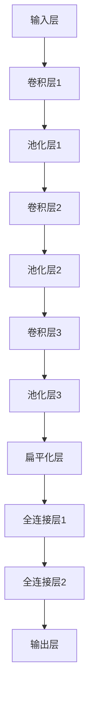

                 

### 文章标题

《神经网络：机器学习的新范式》

### 关键词

神经网络、机器学习、深度学习、激活函数、反向传播、优化算法、图像识别、自然语言处理

### 摘要

本文深入探讨了神经网络在机器学习领域的新范式，从基础概念到应用实战，系统阐述了神经网络的各个方面。文章首先介绍了神经网络的历史与发展，随后详细解释了单层和多层神经网络的基本概念与数学基础。接着，文章深入讲解了深度神经网络、优化算法以及神经网络的训练与评估方法。通过具体的应用案例，如图像识别和自然语言处理，展示了神经网络的实际应用。最后，文章通过一个实战项目，详细展示了神经网络的应用过程，包括开发环境搭建、模型设计与实现、训练与评估等步骤。

## 《神经网络：机器学习的新范式》目录大纲

## 第一部分：神经网络基础

### 第1章：神经网络概述

#### 1.1 神经网络的历史与发展

神经网络的概念最早可以追溯到1943年，由心理学家McCulloch和数学家Pitts提出。此后，神经网络经历了多个阶段的发展，包括早期的神经网络模型如感知机（Perceptron），以及后来的多层感知机（MLP）和反向传播算法（Backpropagation）的出现。随着计算能力的提升和大数据时代的到来，神经网络在21世纪初迎来了新的复兴，特别是深度学习（Deep Learning）的兴起，使得神经网络在图像识别、自然语言处理等领域取得了显著的成果。

#### 1.2 神经网络的基本概念

神经网络由许多简单的计算单元——神经元组成，这些神经元通过权重和偏置进行相互连接。一个基本的神经网络通常包括输入层、隐藏层和输出层。每个神经元都会接收来自前一层的输入信号，通过加权求和并加上偏置，最后通过一个激活函数产生输出。

#### 1.3 神经网络的数学基础

神经网络的核心是矩阵运算和数学函数。矩阵运算用于计算输入和权重之间的乘积，而激活函数如ReLU、Sigmoid和Tanh用于引入非线性。此外，神经网络的训练依赖于优化算法，如梯度下降和其变种，用于调整网络的权重和偏置，使得网络能够更好地拟合数据。

## 第二部分：神经网络应用

### 第7章：图像识别

#### 7.1 卷积神经网络在图像识别中的应用

卷积神经网络（CNN）是处理图像数据的强大工具。CNN通过卷积层、池化层和全连接层等结构，能够有效地提取图像的特征并进行分类。LeNet-5是最早的CNN模型之一，它在手写数字识别任务上取得了突破性的成果。此外，随着深度学习的兴起，AlexNet、VGGNet和ResNet等更复杂的CNN模型也被提出，并在ImageNet图像分类挑战中取得了优异的性能。

#### 7.2 LeNet-5模型详解

LeNet-5模型是一个经典的卷积神经网络，由五个卷积层、两个池化层和三个全连接层组成。模型输入为28x28的灰度图像，通过卷积操作提取图像特征，然后通过全连接层进行分类。LeNet-5在手写数字识别任务中展示了强大的能力，为后续的CNN模型发展奠定了基础。

#### 7.3 MNIST数据集实战

MNIST数据集是手写数字识别领域最常用的数据集之一，包含70000个训练样本和10000个测试样本。通过加载MNIST数据集，我们可以训练一个简单的CNN模型，例如LeNet-5，并进行手写数字识别任务。在实际应用中，我们还需要进行数据预处理、模型训练和评估等步骤。

### 第8章：自然语言处理

#### 8.1 循环神经网络在序列建模中的应用

循环神经网络（RNN）是一种强大的序列建模工具，能够处理变长的序列数据。RNN通过其循环结构，使得网络能够记住之前的输入信息，从而对序列数据进行建模。然而，传统的RNN在处理长序列时容易遇到梯度消失或梯度爆炸的问题。为了解决这个问题，长短期记忆网络（LSTM）和门控循环单元（GRU）被提出，它们通过门控机制有效地解决了梯度消失问题，并在语言模型、机器翻译等任务中取得了显著的效果。

#### 8.2 语言模型

语言模型是自然语言处理的基础，用于预测下一个单词或字符。最简单的语言模型是基于N-gram模型，它通过统计相邻单词或字符的频率来进行预测。然而，N-gram模型在长文本上的表现有限。为了解决这个问题，神经网络语言模型（如基于RNN的模型）被提出，它们能够通过学习大量文本数据，捕捉到更复杂的语言模式。

#### 8.3 词向量表示

词向量表示是将单词映射到高维向量空间的一种方法，通过这种方式，我们可以利用向量运算来处理文本数据。最著名的词向量模型是Word2Vec，它通过训练神经网络来学习词向量，能够捕捉到词与词之间的语义关系。词向量在文本分类、文本相似度计算等任务中发挥了重要作用。

### 第9章：序列模型与生成模型

#### 9.1 序列模型

序列模型是一类用于处理序列数据的模型，包括循环神经网络（RNN）、长短期记忆网络（LSTM）和门控循环单元（GRU）等。序列模型通过其循环结构，能够有效地处理变长的序列数据，并在时间序列预测、语音识别等任务中取得了显著的效果。

#### 9.2 生成对抗网络（GAN）

生成对抗网络（GAN）是一种强大的生成模型，由生成器和判别器组成。生成器的目标是生成与真实数据相似的数据，而判别器的目标是区分真实数据和生成数据。通过这种对抗训练，GAN能够生成高质量的图像、音频和文本数据。

#### 9.3 变分自编码器（VAE）

变分自编码器（VAE）是一种基于概率模型的生成模型，通过引入编码器和解码器，VAE能够有效地生成新的数据。VAE通过最大化数据的重参数化后验概率分布来学习数据的分布，并在图像生成、数据降维等任务中取得了优异的性能。

### 第10章：强化学习与神经网络

#### 10.1 强化学习基础

强化学习是一种通过与环境交互来学习最优策略的机器学习方法。在强化学习中，智能体通过采取行动来获取奖励或惩罚，并逐渐学习到最优策略。强化学习的基础包括智能体、环境、状态、行动和奖励等基本概念。

#### 10.2 神经网络在强化学习中的应用

神经网络在强化学习中的应用非常广泛，包括策略网络和值网络。策略网络通过神经网络来预测最优行动，而值网络通过神经网络来评估当前状态的值。通过策略网络和值网络的结合，神经网络能够有效地解决强化学习问题。

#### 10.3 Q-learning算法详解

Q-learning算法是一种基于值函数的强化学习算法，通过迭代更新值函数来学习最优策略。Q-learning算法的核心是Q值的更新，通过选择具有最大Q值的行动来最大化总奖励。在实际应用中，Q-learning算法通过经验回放和目标网络等技术进行了优化，以解决样本相关性和延迟问题。

### 第11章：神经网络项目实战

#### 11.1 项目介绍

本项目将基于MNIST数据集，使用卷积神经网络（CNN）进行手写数字识别。通过本项目，我们将了解如何搭建神经网络模型、进行数据预处理、训练模型以及评估模型性能。

#### 11.2 开发环境搭建

为了进行神经网络项目，我们需要安装Python编程语言、TensorFlow深度学习框架以及相关依赖。以下是开发环境的搭建步骤：

1. 安装Python 3.x版本
2. 安装TensorFlow框架
3. 安装其他依赖，如NumPy、Pandas等

#### 11.3 数据预处理

数据预处理是神经网络项目的重要步骤，包括数据读取、数据清洗和数据划分。以下是一个简单的数据预处理流程：

1. 读取MNIST数据集
2. 数据归一化
3. 划分训练集和测试集

#### 11.4 模型设计与实现

在本项目中，我们将使用卷积神经网络（CNN）进行手写数字识别。以下是模型的设计与实现步骤：

1. 定义CNN模型结构
2. 编写模型训练代码
3. 训练模型

#### 11.5 模型训练与评估

模型训练是神经网络项目的重要环节，我们需要调整超参数、优化模型性能。以下是模型训练与评估的步骤：

1. 调整学习率、批量大小等超参数
2. 训练模型
3. 评估模型性能

#### 11.6 项目总结与优化

在项目结束后，我们需要总结项目经验，并提出优化方案。以下是一个简单的项目总结与优化方案：

1. 项目经验总结
2. 优化方案
3. 优化效果评估

## 附录

### 附录A：常用神经网络框架

在神经网络研究中，常用的框架包括TensorFlow、PyTorch和Keras。这些框架提供了丰富的API和工具，使得搭建和训练神经网络变得更加便捷。

1. **TensorFlow**：由Google开发，具有强大的计算图功能，支持动态图和静态图两种模式。
2. **PyTorch**：由Facebook开发，具有简洁的API和动态计算图，便于研究和开发。
3. **Keras**：基于TensorFlow和Theano开发，提供了更加用户友好的API，适合快速原型设计和实验。

### 附录B：神经网络数学公式与解释

在神经网络中，数学公式和模型是非常重要的组成部分。以下是一些常用的数学公式及其解释：

1. **激活函数**：
   \[
   f(x) = \max(0, x)
   \]
   这是ReLU函数的公式，用于引入非线性。

2. **梯度下降**：
   \[
   \theta = \theta - \alpha \cdot \nabla_{\theta} J(\theta)
   \]
   这是梯度下降算法的更新公式，用于调整模型的参数。

3. **反向传播算法**：
   \[
   \delta = \frac{\partial J}{\partial z}
   \]
   这是反向传播算法的核心公式，用于计算每个参数的梯度。

### 附录C：神经网络项目代码实例

以下是一个简单的神经网络项目代码实例，用于实现手写数字识别：

```python
# 导入必要的库
import tensorflow as tf
from tensorflow.keras import layers

# 定义模型结构
model = tf.keras.Sequential([
    layers.Conv2D(32, (3, 3), activation='relu', input_shape=(28, 28, 1)),
    layers.MaxPooling2D((2, 2)),
    layers.Conv2D(64, (3, 3), activation='relu'),
    layers.MaxPooling2D((2, 2)),
    layers.Conv2D(64, (3, 3), activation='relu'),
    layers.Flatten(),
    layers.Dense(64, activation='relu'),
    layers.Dense(10, activation='softmax')
])

# 编写模型编译代码
model.compile(optimizer='adam',
              loss='sparse_categorical_crossentropy',
              metrics=['accuracy'])

# 加载MNIST数据集
mnist = tf.keras.datasets.mnist
(train_images, train_labels), (test_images, test_labels) = mnist.load_data()

# 进行数据预处理
train_images = train_images.reshape((60000, 28, 28, 1))
train_images = train_images / 255.0

test_images = test_images.reshape((10000, 28, 28, 1))
test_images = test_images / 255.0

# 训练模型
model.fit(train_images, train_labels, epochs=5)

# 评估模型
test_loss, test_acc = model.evaluate(test_images, test_labels)
print('Test accuracy:', test_acc)
```

### 图片和流程图

为了更好地理解神经网络的工作原理，我们使用Mermaid绘制了以下流程图：



这个流程图展示了从输入层到输出层的整个神经网络结构，包括卷积层、池化层、扁平化层和全连接层等。

### 总结

本文系统地介绍了神经网络在机器学习领域的新范式，从基础概念到应用实战，详细阐述了神经网络的理论与实践。通过具体的应用案例，如图像识别和自然语言处理，展示了神经网络的强大能力。最后，通过一个实战项目，读者可以了解神经网络的应用过程，包括开发环境搭建、模型设计与实现、训练与评估等步骤。希望本文能为读者提供有价值的参考。作者：AI天才研究院/AI Genius Institute & 禅与计算机程序设计艺术 /Zen And The Art of Computer Programming

---

### 第1章：神经网络概述

神经网络（Neural Networks）是机器学习领域的一个重要分支，其灵感来源于生物神经系统的工作原理。本章将介绍神经网络的历史与发展、基本概念和数学基础，为后续章节的深入学习打下坚实的基础。

#### 1.1 神经网络的历史与发展

神经网络的概念最早可以追溯到1943年，由心理学家McCulloch和数学家Pitts提出了“感知机”（Perceptron）模型。感知机是一个由多个输入和单一输出组成的简单神经网络，它能够实现线性分类。然而，感知机的局限性在于无法处理非线性问题，这一缺点在1958年被美国数学家马文·闵斯基（Marvin Minsky）和锡拉丘兹大学的约翰·霍普菲尔德（John Hopfield）指出。

20世纪60年代至70年代，由于计算能力的限制和理论上的局限，神经网络的研究陷入了低潮。直到1986年，加拿大计算机科学家杰弗里·辛顿（Geoffrey Hinton）提出了反向传播算法（Backpropagation），这一算法使得多层神经网络的学习变得更加高效和可行。反向传播算法的核心思想是通过反向传播误差来更新网络的权重和偏置，从而优化网络性能。

进入21世纪，随着计算能力的提升和大数据时代的到来，神经网络尤其是深度学习（Deep Learning）取得了显著的突破。深度学习通过构建多层次的神经网络，能够自动提取数据中的特征，并在图像识别、语音识别、自然语言处理等领域取得了革命性的成果。著名的深度学习模型如AlexNet、VGGNet、ResNet等，都在图像识别任务中取得了超越人类的表现。

#### 1.2 神经网络的基本概念

神经网络由大量的神经元（Neurons）组成，这些神经元通过连接（Connections）和权重（Weights）进行相互连接，形成一个复杂的网络结构。一个基本的神经网络通常包括输入层（Input Layer）、隐藏层（Hidden Layers）和输出层（Output Layer）。

1. **神经元**：神经网络的基本计算单元，类似于生物神经元。一个神经元接收多个输入信号，通过加权求和加上偏置（Bias），最后通过一个激活函数（Activation Function）产生输出。

   神经元的数学表达式可以表示为：
   \[
   z = \sum_{i=1}^{n} w_{i} x_{i} + b
   \]
   \[
   a = \sigma(z)
   \]
   其中，\( z \) 是加权求和的结果，\( w_{i} \) 是输入信号的权重，\( x_{i} \) 是输入值，\( b \) 是偏置，\( \sigma \) 是激活函数。

2. **网络结构**：神经网络的结构包括输入层、隐藏层和输出层。输入层接收外部输入，隐藏层负责数据的处理和特征提取，输出层产生最终的输出结果。

3. **权重和偏置**：权重和偏置是神经网络中非常重要的参数。权重决定了输入信号的重要程度，而偏置用于调整网络输出。

4. **激活函数**：激活函数是神经网络中的一个关键组件，用于引入非线性。常见的激活函数包括ReLU（Rectified Linear Unit）、Sigmoid和Tanh等。

   - **ReLU函数**：
     \[
     f(x) = \max(0, x)
     \]
     ReLU函数在输入为正时输出为输入值，为负时输出为0，具有简单的计算形式和良好的梯度性质。

   - **Sigmoid函数**：
     \[
     f(x) = \frac{1}{1 + e^{-x}}
     \]
     Sigmoid函数将输入值映射到(0, 1)区间，常用于二分类问题。

   - **Tanh函数**：
     \[
     f(x) = \frac{e^{x} - e^{-x}}{e^{x} + e^{-x}}
     \]
     Tanh函数与Sigmoid函数类似，但输出范围在(-1, 1)之间。

#### 1.3 神经网络的数学基础

神经网络的训练依赖于一系列数学工具，包括线性代数、概率论和优化算法。

1. **线性代数**：神经网络中的矩阵运算和向量计算是核心部分。

   - **矩阵和向量的基本运算**：包括矩阵的乘法、求逆、矩阵分解等。
   - **矩阵分解**：如奇异值分解（SVD）、LU分解等，用于简化计算和提高计算效率。

2. **概率论与统计**：神经网络中的训练和评估需要利用概率分布和统计方法。

   - **概率分布**：如高斯分布、伯努利分布等，用于描述网络输出的概率分布。
   - **最大似然估计**：用于估计模型参数，通过最大化似然函数来优化模型性能。
   - **期望和方差**：用于评估模型的稳定性和可靠性。

3. **优化算法**：神经网络训练过程中的权重和偏置调整依赖于优化算法。

   - **梯度下降法**：是一种基本的优化算法，通过计算损失函数关于参数的梯度来更新参数，使得损失函数最小。
   - **随机梯度下降（SGD）**：在梯度下降法的基础上引入随机性，用于加速收敛和防止过拟合。
   - **动量优化器**：通过引入动量项，加速梯度的下降过程，提高收敛速度。

通过本章的学习，读者可以了解神经网络的发展历程、基本概念和数学基础。在接下来的章节中，我们将继续探讨单层神经网络、多层神经网络、深度神经网络等更为复杂和实用的神经网络模型。

---

### 第2章：单层神经网络

单层神经网络是神经网络的基本形式，由单一的输入层和输出层组成。本章将介绍单层神经网络中的两个核心模型：单层感知机（Perceptron）和线性回归（Linear Regression），并讨论对数回归（Logistic Regression）的基本原理。

#### 2.1 单层感知机

单层感知机是最简单的线性二分类模型，它由输入层和输出层组成，没有隐藏层。感知机的基本思想是通过线性模型来分类输入数据。一个感知机的输出由加权求和和激活函数决定。

1. **感知机模型**

   感知机模型的数学表达式可以表示为：
   \[
   z = \sum_{i=1}^{n} w_{i} x_{i} + b
   \]
   \[
   y = \sigma(z)
   \]
   其中，\( z \) 是输入数据的加权求和，\( w_{i} \) 是权重，\( x_{i} \) 是输入特征，\( b \) 是偏置，\( \sigma \) 是激活函数。通常，激活函数选择为阈值函数（Step Function），即：
   \[
   \sigma(z) = 
   \begin{cases} 
   1 & \text{if } z \geq 0 \\
   0 & \text{otherwise}
   \end{cases}
   \]

2. **感知机算法**

   感知机的训练算法称为感知机算法（Perceptron Algorithm）。该算法的基本步骤如下：

   - 初始化权重和偏置为随机值。
   - 对于每个训练样本，计算输入数据的输出。
   - 如果输出不满足分类条件，则更新权重和偏置。

   感知机算法的伪代码如下：

   ```python
   while not converged:
       for each training sample (x, y) in the dataset:
           calculate the output: z = wx + b
           if y * z < 0:  # 不满足分类条件
               update weights and bias: w = w + y * x, b = b + y
   ```

3. **感知机的局限性**

   感知机在处理非线性问题时存在明显的局限性。例如，对于线性不可分的数据，感知机无法通过调整权重和偏置找到正确的分类边界。因此，在非线性问题中，需要引入更复杂的模型，如多层感知机（MLP）。

#### 2.2 线性回归

线性回归是一种经典的监督学习算法，用于建模输入和输出之间的关系。在神经网络中，线性回归可以看作是一个没有激活函数的单层神经网络。

1. **线性回归模型**

   线性回归模型的数学表达式可以表示为：
   \[
   y = \beta_0 + \beta_1 x
   \]
   其中，\( y \) 是输出，\( x \) 是输入，\( \beta_0 \) 和 \( \beta_1 \) 是模型的参数。

2. **线性回归算法**

   线性回归的目的是通过最小化损失函数来估计参数 \( \beta_0 \) 和 \( \beta_1 \)。常用的损失函数是均方误差（Mean Squared Error，MSE），即：
   \[
   J(\beta_0, \beta_1) = \frac{1}{2} \sum_{i=1}^{n} (y_i - (\beta_0 + \beta_1 x_i))^2
   \]

   为了求解最小化问题，可以采用梯度下降法（Gradient Descent）或最小二乘法（Least Squares Method）。

   - **梯度下降法**

     梯度下降法的迭代公式为：
     \[
     \beta_0 = \beta_0 - \alpha \frac{\partial J}{\partial \beta_0}
     \]
     \[
     \beta_1 = \beta_1 - \alpha \frac{\partial J}{\partial \beta_1}
     \]
     其中，\( \alpha \) 是学习率。

   - **最小二乘法**

     最小二乘法通过求解损失函数的导数为零来找到最小值点。对于线性回归，最小二乘法的解为：
     \[
     \beta_0 = \bar{y} - \beta_1 \bar{x}
     \]
     \[
     \beta_1 = \frac{\sum_{i=1}^{n} (x_i - \bar{x})(y_i - \bar{y})}{\sum_{i=1}^{n} (x_i - \bar{x})^2}
     \]

#### 2.3 对数回归

对数回归是线性回归的一种推广，主要用于处理概率预测问题。在二分类问题中，对数回归通常被称为逻辑回归（Logistic Regression）。

1. **对数回归模型**

   对数回归模型的数学表达式可以表示为：
   \[
   \log\left(\frac{p}{1-p}\right) = \beta_0 + \beta_1 x
   \]
   其中，\( p \) 是目标变量属于正类的概率，\( \beta_0 \) 和 \( \beta_1 \) 是模型参数。

2. **对数回归算法**

   对数回归的损失函数通常采用对数似然损失（Log-Likelihood Loss），即：
   \[
   J(\beta_0, \beta_1) = -\sum_{i=1}^{n} y_i \log(p_i) - (1 - y_i) \log(1 - p_i)
   \]
   其中，\( p_i \) 是第 \( i \) 个样本属于正类的概率。

   对数回归的参数估计可以通过梯度下降法或最大似然估计（Maximum Likelihood Estimation，MLE）来求解。最大似然估计的参数估计公式为：
   \[
   \beta_0 = \bar{y} - \beta_1 \bar{x}
   \]
   \[
   \beta_1 = \frac{\sum_{i=1}^{n} (y_i - p_i) x_i}{\sum_{i=1}^{n} x_i}
   \]

通过对单层神经网络的学习，读者可以了解感知机、线性回归和对数回归的基本原理和算法。这些单层神经网络模型在机器学习领域有着广泛的应用，特别是在预处理和特征提取阶段。然而，对于复杂的问题，单层神经网络可能无法胜任，需要引入多层神经网络来增强模型的表示能力。

---

### 第3章：多层神经网络

在单层神经网络的基础上，多层神经网络（Multilayer Neural Networks）通过增加隐藏层来提高模型的复杂度和表现力。本章将介绍多层神经网络中的几个关键组件：非线性激活函数、隐藏层的设计和反向传播算法。

#### 3.1 非线性激活函数

非线性激活函数是多层神经网络的核心组件，它能够将线性模型转化为具有非线性能力的模型，从而提升模型的预测能力。常见的非线性激活函数包括ReLU函数、Sigmoid函数和Tanh函数。

1. **ReLU函数**

   ReLU函数（Rectified Linear Unit）是最常用的激活函数之一，其表达式为：
   \[
   f(x) = \max(0, x)
   \]
   ReLU函数在输入为正时输出为输入值，为负时输出为0。ReLU函数具有简单的计算形式和良好的梯度性质，有助于防止梯度消失问题，并且在实践中表现出良好的性能。

2. **Sigmoid函数**

   Sigmoid函数的表达式为：
   \[
   f(x) = \frac{1}{1 + e^{-x}}
   \]
   Sigmoid函数将输入值映射到(0, 1)区间，常用于二分类问题。然而，Sigmoid函数在梯度计算时存在梯度消失问题，因此在多层神经网络中应用较少。

3. **Tanh函数**

   Tanh函数的表达式为：
   \[
   f(x) = \frac{e^{x} - e^{-x}}{e^{x} + e^{-x}}
   \]
   Tanh函数与Sigmoid函数类似，但输出范围在(-1, 1)之间。Tanh函数在梯度计算时同样存在梯度消失问题，因此在多层神经网络中应用较少。

#### 3.2 隐藏层的设计

多层神经网络通过增加隐藏层来提高模型的复杂度，隐藏层的设计对于网络性能至关重要。隐藏层的设计包括隐藏层的数量、隐藏层神经元的数量和隐藏层之间的连接方式。

1. **隐藏层的数量**

   隐藏层的数量对网络的性能和训练时间有很大影响。通常，增加隐藏层数量可以提高网络的表示能力，但同时也增加了模型的复杂度和训练难度。在大多数实际问题中，选择合适的隐藏层数量需要通过实验来确定。常见的隐藏层数量包括2层、3层和4层等。

2. **隐藏层神经元的数量**

   隐藏层神经元的数量也是一个关键参数。增加隐藏层神经元的数量可以提高模型的表示能力，但同样会增加模型的复杂度和训练时间。在实际应用中，需要权衡模型的准确性和计算效率，选择合适的神经元数量。

3. **隐藏层之间的连接方式**

   隐藏层之间的连接方式可以分为全连接和稀疏连接。全连接方式是指每个神经元都与下一层的所有神经元相连，这种方式可以充分挖掘数据中的特征信息。稀疏连接方式是指只有部分神经元与下一层的神经元相连，这种方式可以减少参数的数量，降低模型的复杂度。

#### 3.3 反向传播算法

反向传播算法（Backpropagation Algorithm）是多层神经网络训练的核心算法，它通过计算损失函数关于网络参数的梯度，并利用梯度下降法更新参数，使得损失函数逐渐减小。反向传播算法的基本步骤如下：

1. **前向传播**

   前向传播（Forward Propagation）是将输入数据通过网络，逐层计算每个神经元的输出值。前向传播的步骤如下：

   - 对于输入数据 \( x \)，计算第一层（输入层）的输出 \( z^{[1]} = \sigma(W^{[1]}x + b^{[1]}) \)。
   - 对于后续每一层，计算 \( z^{[l]} = \sigma(W^{[l]}z^{[l-1]} + b^{[l]}) \)，其中 \( l \) 表示当前层的编号。

2. **计算损失函数**

   计算输出层（第 \( L \) 层）的损失函数 \( J \)，常用的损失函数包括均方误差（MSE）和对数似然损失（Log-Likelihood Loss）。

3. **反向传播**

   反向传播（Backward Propagation）是计算损失函数关于网络参数的梯度，并利用梯度下降法更新参数。反向传播的步骤如下：

   - 从输出层开始，计算每层神经元的梯度 \( \delta^{[l]} = \frac{\partial J}{\partial z^{[l]}} \)。
   - 利用链式法则，计算每层权重和偏置的梯度 \( \frac{\partial J}{\partial W^{[l]}} = z^{[l-1]} \delta^{[l]} \) 和 \( \frac{\partial J}{\partial b^{[l]}} = \delta^{[l]} \)。
   - 利用梯度下降法更新权重和偏置 \( W^{[l]} = W^{[l]} - \alpha \frac{\partial J}{\partial W^{[l]}} \) 和 \( b^{[l]} = b^{[l]} - \alpha \frac{\partial J}{\partial b^{[l]}} \)。

通过本章的学习，读者可以了解多层神经网络中的关键组件：非线性激活函数、隐藏层的设计和反向传播算法。多层神经网络通过引入非线性能力和更复杂的结构，使得模型在处理复杂问题时表现出更好的性能。然而，多层神经网络的训练过程更为复杂，需要更精细的调参和优化策略。在接下来的章节中，我们将进一步探讨深度神经网络及其优化算法。

---

### 第4章：深度神经网络

深度神经网络（Deep Neural Networks，DNN）是多层神经网络的一种扩展，通过增加隐藏层的数量来提高模型的复杂度和表现力。本章将介绍深度神经网络中的三种主要类型：卷积神经网络（CNN）、循环神经网络（RNN）和长短期记忆网络（LSTM）。这些网络在图像识别、自然语言处理和序列建模等领域具有广泛应用。

#### 4.1 卷积神经网络（CNN）

卷积神经网络（Convolutional Neural Networks，CNN）是一种专为处理图像数据设计的神经网络。CNN通过卷积层、池化层和全连接层等结构，能够有效地提取图像的特征并进行分类。

1. **CNN的基本结构**

   - **卷积层**：卷积层是CNN的核心组件，通过卷积操作提取图像的特征。卷积层中的每个卷积核（Convolutional Kernel）可以学习到图像中的局部特征。
     \[
     z^{[l]} = \sigma\left(\sum_{i=1}^{k} w_i^l * x^{[l-1]} + b^l\right)
     \]
     其中，\( w_i^l \) 是卷积核，\( * \) 表示卷积操作，\( b^l \) 是偏置。

   - **池化层**：池化层用于降低特征图的大小，减少参数数量。常见的池化操作包括最大池化和平均池化。
     \[
     h^{[l]}_{ij} = \max_{p,q} \left( z^{[l]}_{ip+1, jq+1} \right)
     \]

   - **全连接层**：全连接层将卷积层和池化层提取的特征映射到输出层，进行最终的分类或回归。
     \[
     z^{[L]} = \sum_{i=1}^{n} w_i^L a^{[L-1]}_i + b^L
     \]

2. **CNN的变种网络**

   - **LeNet-5模型**：LeNet-5是最早的卷积神经网络之一，由五个卷积层、两个池化层和三个全连接层组成。它在手写数字识别任务中取得了显著的效果。

   - **AlexNet**：AlexNet是深度学习领域的里程碑之一，它通过引入ReLU函数、局部响应归一化和数据增强等技术，显著提升了图像识别的准确率。

   - **VGGNet**：VGGNet通过增加网络的深度和宽度，提高了模型的性能。VGGNet的特点是使用多个卷积层堆叠，并保持卷积核的大小不变。

   - **ResNet**：ResNet通过引入残差连接，解决了深度神经网络中的梯度消失问题，使得网络可以训练得更深。ResNet在图像识别任务中取得了突破性的成果。

#### 4.2 循环神经网络（RNN）

循环神经网络（Recurrent Neural Networks，RNN）是一种能够处理序列数据的神经网络。RNN通过其循环结构，使得网络能够记住之前的输入信息，并在序列建模任务中表现出强大的能力。

1. **RNN的基本结构**

   - **RNN单元**：RNN单元由输入门、遗忘门和输出门组成，可以捕捉到序列中的长期依赖关系。
     \[
     h_t = \sigma(W_h [h_{t-1}, x_t] + b_h)
     \]
     \[
     o_t = \sigma(W_o h_t + b_o)
     \]
     \[
     f_t = \sigma(W_f [h_{t-1}, x_t] + b_f)
     \]
     \[
     i_t = \sigma(W_i [h_{t-1}, x_t] + b_i)
     \]
     其中，\( h_t \) 是当前隐藏状态，\( x_t \) 是当前输入，\( o_t \) 是当前输出，\( f_t \) 是遗忘门，\( i_t \) 是输入门。

2. **RNN的变种网络**

   - **长短期记忆网络（LSTM）**：LSTM通过引入门控机制，解决了传统RNN中的梯度消失和梯度爆炸问题。LSTM通过遗忘门、输入门和输出门，有效地捕捉到序列中的长期依赖关系。

   - **门控循环单元（GRU）**：GRU是LSTM的简化版本，通过合并输入门和遗忘门，减少了参数数量，并在许多任务中表现出了优越的性能。

#### 4.3 长短期记忆网络（LSTM）

长短期记忆网络（Long Short-Term Memory，LSTM）是一种特殊的RNN，通过其内部结构，能够有效地捕捉到序列中的长期依赖关系。LSTM由输入门、遗忘门和输出门组成，通过这些门控机制，LSTM可以自适应地控制信息的记忆和遗忘。

1. **LSTM的基本结构**

   - **输入门**：输入门决定如何将新的信息与当前状态结合。
     \[
     i_t = \sigma(W_i [h_{t-1}, x_t] + b_i)
     \]
     \[
     \tilde{g}_t = \tanh(W_g [h_{t-1}, x_t] + b_g)
     \]

   - **遗忘门**：遗忘门决定如何忘记之前的信息。
     \[
     f_t = \sigma(W_f [h_{t-1}, x_t] + b_f)
     \]
     \[
     g_t = f_t \odot \tilde{g}_t
     \]

   - **输出门**：输出门决定当前状态如何生成输出。
     \[
     o_t = \sigma(W_o [h_{t-1}, x_t] + b_o)
     \]
     \[
     \tilde{h}_t = o_t \odot \tanh(g_t)
     \]
     \[
     h_t = \tilde{h}_t
     \]

2. **LSTM的应用场景**

   - **序列预测**：LSTM在时间序列预测中表现出色，能够捕捉到时间序列中的长期依赖关系。
   - **文本生成**：LSTM可以用于生成文本，通过学习文本序列中的模式，生成连贯的文本。

通过本章的学习，读者可以了解深度神经网络中的三种主要类型：卷积神经网络（CNN）、循环神经网络（RNN）和长短期记忆网络（LSTM）。这些网络在图像识别、自然语言处理和序列建模等领域具有广泛应用，通过增加网络的深度和宽度，深度神经网络能够显著提升模型的性能。然而，深度神经网络的训练过程较为复杂，需要更精细的调参和优化策略。在接下来的章节中，我们将进一步探讨神经网络的优化算法和训练策略。

---

### 第5章：神经网络的优化算法

神经网络的优化算法是训练神经网络的核心环节，它决定了网络参数的更新方式和训练效率。本章将介绍几种常用的神经网络优化算法：梯度下降法（Gradient Descent）、随机梯度下降（Stochastic Gradient Descent，SGD）和动量优化器（Momentum）。

#### 5.1 梯度下降法

梯度下降法（Gradient Descent）是最基本的优化算法，用于调整神经网络的参数，使得损失函数最小。梯度下降法的核心思想是通过计算损失函数关于参数的梯度，然后沿着梯度的反方向更新参数。

1. **梯度下降法的基本原理**

   梯度下降法的迭代更新公式为：
   \[
   \theta = \theta - \alpha \nabla_{\theta} J(\theta)
   \]
   其中，\( \theta \) 是网络参数，\( \alpha \) 是学习率，\( J(\theta) \) 是损失函数。

   - **前向传播**：计算网络的前向传播输出。
     \[
     \hat{y} = f(\theta, x)
     \]
   
   - **计算损失**：计算实际输出与期望输出之间的差异。
     \[
     J(\theta) = \frac{1}{2} \sum_{i=1}^{m} (y_i - \hat{y}_i)^2
     \]

   - **后向传播**：计算损失函数关于网络参数的梯度。
     \[
     \nabla_{\theta} J(\theta) = \nabla_{\theta} \frac{1}{2} \sum_{i=1}^{m} (y_i - \hat{y}_i)^2
     \]

   - **更新参数**：根据梯度和学习率更新网络参数。
     \[
     \theta = \theta - \alpha \nabla_{\theta} J(\theta)
     \]

2. **梯度下降法的优缺点**

   - **优点**：
     - 简单易懂，易于实现。
     - 能够通过调整学习率达到收敛。

   - **缺点**：
     - 收敛速度慢，特别是对于深层次的网络。
     - 学习率的选择需要精细调优。

#### 5.2 随机梯度下降（SGD）

随机梯度下降（Stochastic Gradient Descent，SGD）是梯度下降法的一种变种，它通过随机选取一部分训练样本来计算梯度，从而加速收敛速度。SGD的基本思想是每次迭代只考虑一个样本的梯度，而不是整个训练集的梯度。

1. **SGD的基本原理**

   随机梯度下降的迭代更新公式为：
   \[
   \theta = \theta - \alpha \nabla_{\theta} J(\theta; x^{(i)}, y^{(i)})
   \]
   其中，\( x^{(i)} \) 和 \( y^{(i)} \) 是随机选取的样本及其标签。

2. **SGD的应用场景**

   - **大规模数据集**：SGD适用于大规模数据集的训练，因为它只需要考虑部分样本的梯度，从而减少了计算量。
   - **在线学习**：SGD适用于在线学习环境，因为它可以实时更新模型参数。

3. **SGD的优缺点**

   - **优点**：
     - 收敛速度快，特别是对于大规模数据集。
     - 能够避免陷入局部最小值。

   - **缺点**：
     - 学习率的选择需要精细调优。
     - 梯度估计的随机性可能导致训练结果的不稳定。

#### 5.3 动量优化器

动量优化器（Momentum）是SGD的一种改进，它通过引入动量项，加速梯度的下降过程，减少振荡，提高收敛速度。动量优化器的基本思想是将上一梯度的部分保留下来，作为当前梯度的补充。

1. **动量优化器的原理**

   动量优化器的迭代更新公式为：
   \[
   \theta = \theta - \alpha \nabla_{\theta} J(\theta) + \beta \text{Momentum}
   \]
   其中，\( \beta \) 是动量参数，通常取值在0到1之间。

2. **动量优化器的优势**

   - **减少振荡**：动量优化器通过保留上一梯度的信息，减少了梯度在更新过程中的振荡，从而提高收敛速度。
   - **提高收敛速度**：动量优化器能够加速梯度的下降过程，使得网络更快地达到最小值。

3. **动量优化器的实现**

   动量优化器的实现可以通过以下伪代码表示：
   ```python
   v = 0
   for each iteration:
       gradient = compute_gradient()
       v = beta * v - alpha * gradient
       theta = theta + v
   ```

通过本章的学习，读者可以了解神经网络优化算法的基本原理和实现方法。梯度下降法、随机梯度下降和动量优化器是神经网络训练中常用的优化算法，通过选择合适的优化算法和参数，可以显著提高网络的训练效率和性能。在接下来的章节中，我们将进一步探讨神经网络的训练与评估方法。

---

### 第6章：神经网络的训练与评估

神经网络的训练与评估是机器学习任务中至关重要的一环。本章将介绍神经网络训练的基本流程、常用的评估指标、超参数调优方法，以及如何处理训练过程中的常见问题。

#### 6.1 训练过程

神经网络训练的过程可以分为以下几个步骤：

1. **数据预处理**：数据预处理是神经网络训练的重要前置步骤。预处理包括数据清洗、归一化、数据增强等操作。

   - **数据清洗**：去除异常值、缺失值等不干净的数据。
   - **归一化**：将数据缩放到一个较小的范围，如[0, 1]或[-1, 1]，以加速收敛。
   - **数据增强**：通过旋转、翻转、缩放等操作增加训练数据的多样性。

2. **模型初始化**：模型初始化包括初始化权重和偏置。常见的初始化方法包括随机初始化、高斯初始化和Xavier初始化。

3. **模型训练**：模型训练是神经网络的核心步骤，主要包括前向传播和后向传播。

   - **前向传播**：将输入数据通过神经网络，计算输出和损失函数。
     \[
     \hat{y} = f(\theta, x)
     \]
     \[
     J(\theta) = \frac{1}{2} \sum_{i=1}^{m} (y_i - \hat{y}_i)^2
     \]

   - **后向传播**：计算损失函数关于网络参数的梯度，并更新参数。
     \[
     \nabla_{\theta} J(\theta) = \nabla_{\theta} \frac{1}{2} \sum_{i=1}^{m} (y_i - \hat{y}_i)^2
     \]
     \[
     \theta = \theta - \alpha \nabla_{\theta} J(\theta)
     \]

4. **模型评估**：在训练过程中，定期对模型进行评估，以检查模型的性能。

#### 6.2 评估指标

神经网络评估指标的选择取决于具体任务类型。以下是一些常用的评估指标：

1. **准确率（Accuracy）**：

   准确率是最常用的评估指标之一，表示模型正确预测的样本数占总样本数的比例。
   \[
   \text{Accuracy} = \frac{\text{正确预测的样本数}}{\text{总样本数}}
   \]

2. **精确率（Precision）**：

   精确率表示预测为正样本的样本中，实际为正样本的比例。
   \[
   \text{Precision} = \frac{\text{正确预测的正样本数}}{\text{预测的正样本数}}
   \]

3. **召回率（Recall）**：

   召回率表示实际为正样本的样本中，被正确预测为正样本的比例。
   \[
   \text{Recall} = \frac{\text{正确预测的正样本数}}{\text{实际的正样本数}}
   \]

4. **F1分数（F1 Score）**：

   F1分数是精确率和召回率的调和平均，用于平衡两者的贡献。
   \[
   \text{F1 Score} = 2 \times \frac{\text{Precision} \times \text{Recall}}{\text{Precision} + \text{Recall}}
   \]

5. **ROC曲线和AUC（Area Under Curve）**：

   ROC曲线是评估二分类模型性能的重要工具，AUC表示ROC曲线下的面积，数值越高，模型性能越好。

#### 6.3 超参数调优

超参数是神经网络训练过程中需要手动调整的参数，如学习率、批量大小、隐藏层数量和神经元数量等。超参数调优是提高模型性能的重要步骤。

1. **网格搜索（Grid Search）**：

   网格搜索是一种系统性搜索超参数的方法，通过遍历所有可能的参数组合，选择最优的组合。

2. **随机搜索（Random Search）**：

   随机搜索通过随机选择参数组合，减少了计算量，但可能错过最优参数。

3. **贝叶斯优化（Bayesian Optimization）**：

   贝叶斯优化基于贝叶斯统计模型，通过迭代优化超参数，能够在较少的评估次数内找到最优参数。

#### 6.4 常见问题处理

在神经网络训练过程中，可能会遇到以下问题：

1. **过拟合（Overfitting）**：

   过拟合是指模型在训练数据上表现很好，但在新的数据上表现较差。处理过拟合的方法包括：
   
   - 使用正则化（如L1、L2正则化）。
   - 减少模型复杂度（如减少隐藏层数量或神经元数量）。
   - 增加训练数据（如数据增强）。

2. **欠拟合（Underfitting）**：

   欠拟合是指模型在训练数据和新数据上表现都较差。处理欠拟合的方法包括：
   
   - 增加模型复杂度（如增加隐藏层或神经元数量）。
   - 调整学习率，使其适当较大。

3. **梯度消失和梯度爆炸（Vanishing and Exploding Gradients）**：

   梯度消失和梯度爆炸是深度神经网络训练中常见的问题。处理方法包括：
   
   - 使用ReLU激活函数，防止梯度消失。
   - 使用LSTM或GRU等门控循环单元，解决长序列问题。
   - 使用梯度裁剪（Gradient Clipping）限制梯度的大小。

通过本章的学习，读者可以了解神经网络训练与评估的基本流程、常用评估指标、超参数调优方法以及常见问题处理策略。在神经网络的实际应用中，合理的设计和调优是提高模型性能的关键。在下一章中，我们将探讨神经网络在图像识别和自然语言处理等领域的实际应用。

---

### 第7章：图像识别

图像识别是计算机视觉领域的一个重要分支，其核心任务是通过对图像的特征进行提取和分析，实现对图像内容的理解和分类。本章将介绍卷积神经网络（Convolutional Neural Networks，CNN）在图像识别中的应用，详细讨论LeNet-5模型以及MNIST数据集的实战应用。

#### 7.1 卷积神经网络在图像识别中的应用

卷积神经网络（CNN）是一种专为处理图像数据设计的神经网络，通过其独特的结构和操作，能够有效地提取图像中的特征并进行分类。CNN的关键组件包括卷积层、池化层和全连接层。

1. **卷积层**

   卷积层是CNN的核心组件，通过卷积操作提取图像的特征。卷积层中的每个卷积核（Convolutional Kernel）可以学习到图像中的局部特征。

   \[
   z^{[l]} = \sigma\left(\sum_{i=1}^{k} w_i^l * x^{[l-1]} + b^l\right)
   \]

   其中，\( w_i^l \) 是卷积核，\( * \) 表示卷积操作，\( b^l \) 是偏置。

2. **池化层**

   池化层用于降低特征图的大小，减少参数数量。常见的池化操作包括最大池化和平均池化。

   \[
   h^{[l]}_{ij} = \max_{p,q} \left( z^{[l]}_{ip+1, jq+1} \right)
   \]

3. **全连接层**

   全连接层将卷积层和池化层提取的特征映射到输出层，进行最终的分类或回归。

   \[
   z^{[L]} = \sum_{i=1}^{n} w_i^L a^{[L-1]}_i + b^L
   \]

通过卷积层、池化层和全连接层的组合，CNN能够自动提取图像中的层次特征，从而实现高效的图像识别。

#### 7.2 LeNet-5模型详解

LeNet-5是一个经典的卷积神经网络，由五层卷积层、两个池化层和三个全连接层组成。LeNet-5最初用于手写数字识别任务，并在其上取得了突破性的成果。

1. **模型结构**

   - **卷积层1**：一个卷积层，包含6个卷积核，每个卷积核大小为5x5，步长为1，激活函数为Sigmoid。
     \[
     z^{[1]} = \sigma\left(W_1 * x + b_1\right)
     \]

   - **池化层1**：一个2x2的最大池化层，步长为2。
     \[
     h^{[1]}_{ij} = \max_{p,q} \left( z^{[1]}_{ip+1, jq+1} \right)
     \]

   - **卷积层2**：一个卷积层，包含16个卷积核，每个卷积核大小为5x5，步长为1，激活函数为Sigmoid。
     \[
     z^{[2]} = \sigma\left(W_2 * h^{[1]} + b_2\right)
     \]

   - **池化层2**：一个2x2的最大池化层，步长为2。
     \[
     h^{[2]}_{ij} = \max_{p,q} \left( z^{[2]}_{ip+1, jq+1} \right)
     \]

   - **全连接层1**：一个全连接层，包含120个神经元，激活函数为Sigmoid。
     \[
     z^{[3]} = \sigma\left(W_3 * h^{[2]} + b_3\right)
     \]

   - **全连接层2**：一个全连接层，包含84个神经元，激活函数为Sigmoid。
     \[
     z^{[4]} = \sigma\left(W_4 * h^{[3]} + b_4\right)
     \]

   - **全连接层3**：一个全连接层，包含10个神经元，激活函数为Softmax。
     \[
     z^{[5]} = \sigma\left(W_5 * h^{[4]} + b_5\right)
     \]

2. **模型应用**

   LeNet-5在手写数字识别任务中表现出色，其输入为28x28的灰度图像，输出为10个类别的概率分布，对应0到9的数字。通过训练，LeNet-5能够正确识别大部分手写数字，为后续的CNN模型发展奠定了基础。

#### 7.3 MNIST数据集实战

MNIST数据集是手写数字识别领域最常用的数据集之一，包含70000个训练样本和10000个测试样本。每个样本是一个28x28的灰度图像，标签是一个0到9的整数。

1. **数据预处理**

   - **数据读取**：使用TensorFlow中的`tf.keras.datasets.mnist.load_data()`函数读取MNIST数据集。
     \[
     (x_train, y_train), (x_test, y_test) = tf.keras.datasets.mnist.load_data()
     \]

   - **数据归一化**：将图像数据从[0, 255]缩放到[0, 1]。
     \[
     x_train = x_train / 255.0
     \]
     \[
     x_test = x_test / 255.0
     \]

   - **数据划分**：将训练数据划分为训练集和验证集。
     \[
     x_val = x_train[50000:]
     \]
     \[
     y_val = y_train[50000:]
     \]
     \[
     x_train = x_train[:50000]
     \]
     \[
     y_train = y_train[:50000]
     \]

2. **模型设计与实现**

   - **模型结构**：设计一个简单的CNN模型，包括卷积层、池化层和全连接层。
     \[
     model = tf.keras.Sequential([
       tf.keras.layers.Conv2D(32, (3, 3), activation='relu', input_shape=(28, 28, 1)),
       tf.keras.layers.MaxPooling2D((2, 2)),
       tf.keras.layers.Conv2D(64, (3, 3), activation='relu'),
       tf.keras.layers.MaxPooling2D((2, 2)),
       tf.keras.layers.Conv2D(64, (3, 3), activation='relu'),
       tf.keras.layers.Flatten(),
       tf.keras.layers.Dense(64, activation='relu'),
       tf.keras.layers.Dense(10, activation='softmax')
     ])
     \]

   - **模型编译**：编译模型，设置优化器和损失函数。
     \[
     model.compile(optimizer='adam',
                   loss='sparse_categorical_crossentropy',
                   metrics=['accuracy'])
     \]

   - **模型训练**：训练模型，设置训练轮数和验证集。
     \[
     model.fit(x_train, y_train, epochs=5, validation_data=(x_val, y_val))
     \]

3. **模型评估**

   - **测试集评估**：使用测试集评估模型性能。
     \[
     test_loss, test_acc = model.evaluate(x_test, y_test)
     \]
     \[
     print('Test accuracy:', test_acc)
     \]

通过本章的学习，读者可以了解卷积神经网络在图像识别中的应用，以及如何使用LeNet-5模型和MNIST数据集进行手写数字识别任务的实战应用。卷积神经网络在图像识别领域具有广泛的应用，通过不断优化和改进，其在各种图像识别任务中表现出了强大的能力。

---

### 第8章：自然语言处理

自然语言处理（Natural Language Processing，NLP）是计算机科学和人工智能领域的一个重要分支，它旨在让计算机理解和处理人类语言。本章将探讨循环神经网络（Recurrent Neural Networks，RNN）在序列建模中的应用，介绍语言模型和词向量表示，并展示它们在自然语言处理任务中的实际应用。

#### 8.1 循环神经网络在序列建模中的应用

循环神经网络（RNN）是一种适用于序列数据的神经网络，通过其循环结构，RNN能够记住之前的输入信息，从而在处理序列数据时表现出强大的能力。RNN在自然语言处理、语音识别和时间序列预测等领域有着广泛的应用。

1. **RNN的基本结构**

   RNN的基本结构包括输入门、遗忘门和输出门，这三个门控机制共同作用，使得RNN能够有效地捕捉序列中的长期依赖关系。

   - **输入门（Input Gate）**：决定如何将新的信息与当前状态结合。
     \[
     i_t = \sigma(W_i [h_{t-1}, x_t] + b_i)
     \]
     \[
     \tilde{g}_t = \tanh(W_g [h_{t-1}, x_t] + b_g)
     \]

   - **遗忘门（Forget Gate）**：决定如何忘记之前的信息。
     \[
     f_t = \sigma(W_f [h_{t-1}, x_t] + b_f)
     \]
     \[
     g_t = f_t \odot \tilde{g}_t
     \]

   - **输出门（Output Gate）**：决定当前状态如何生成输出。
     \[
     o_t = \sigma(W_o [h_{t-1}, x_t] + b_o)
     \]
     \[
     \tilde{h}_t = o_t \odot \tanh(g_t)
     \]
     \[
     h_t = \tilde{h}_t
     \]

   其中，\( h_t \) 是当前隐藏状态，\( x_t \) 是当前输入，\( \sigma \) 是Sigmoid函数，\( \tanh \) 是双曲正切函数，\( W_i \)、\( W_g \)、\( W_f \)、\( W_o \) 和 \( b_i \)、\( b_g \)、\( b_f \)、\( b_o \) 分别是权重和偏置。

2. **RNN的变种网络**

   - **长短期记忆网络（LSTM）**：LSTM通过引入门控机制，解决了传统RNN中的梯度消失和梯度爆炸问题，能够在长序列数据中捕捉到长期依赖关系。

   - **门控循环单元（GRU）**：GRU是LSTM的简化版本，通过合并输入门和遗忘门，减少了参数数量，并在许多任务中表现出了优越的性能。

#### 8.2 语言模型

语言模型（Language Model）是一种用于预测下一个单词或字符的概率分布的模型，它在自然语言处理中扮演着重要角色。语言模型可以用于自动纠错、机器翻译、语音识别和生成文本等任务。

1. **N-gram语言模型**

   N-gram语言模型是最简单的语言模型，它通过统计相邻N个单词或字符的频率来预测下一个单词或字符。N-gram模型的基本思想是，未来的输入序列可以由过去的输入序列决定。

   \[
   P(w_n | w_{n-1}, w_{n-2}, ..., w_1) = \frac{C(w_{n-1}, w_{n-2}, ..., w_1, w_n)}{C(w_{n-1}, w_{n-2}, ..., w_1)}
   \]

   其中，\( w_n \) 是下一个单词或字符，\( w_{n-1}, w_{n-2}, ..., w_1 \) 是前N-1个单词或字符，\( C \) 表示计数。

2. **神经网络语言模型**

   神经网络语言模型通过神经网络来学习单词或字符的概率分布，能够捕捉到更复杂的语言模式。最常用的神经网络语言模型是基于RNN的模型，如LSTM和GRU。

   - **输入序列表示**：将输入序列编码为向量表示。
     \[
     x_t = \text{embedding}(w_n)
     \]

   - **隐藏状态表示**：通过RNN计算隐藏状态。
     \[
     h_t = \text{RNN}(h_{t-1}, x_t)
     \]

   - **概率分布表示**：使用隐藏状态生成单词或字符的概率分布。
     \[
     P(w_n | h_t) = \text{softmax}(\text{output layer}(h_t))
     \]

#### 8.3 词向量表示

词向量表示（Word Embedding）是将单词映射到高维向量空间的一种方法，通过这种方式，我们可以利用向量运算来处理文本数据。词向量在自然语言处理任务中发挥了重要作用，如文本分类、文本相似度计算和机器翻译等。

1. **词向量模型**

   - **Word2Vec**：Word2Vec是最早的词向量模型之一，它通过训练神经网络来学习词向量，能够捕捉到词与词之间的语义关系。

   - ** GloVe**：GloVe（Global Vectors for Word Representation）是一种基于共现关系的词向量模型，通过计算单词的词频和共现矩阵来学习词向量。

2. **词向量应用**

   - **文本分类**：词向量可以用于文本分类任务，通过计算文本的向量表示，并使用分类器进行分类。

   - **文本相似度计算**：词向量可以用于计算文本之间的相似度，通过比较词向量的相似性，可以评估文本之间的相似程度。

   - **机器翻译**：词向量可以用于机器翻译任务，通过将源语言和目标语言的单词映射到共同的向量空间，可以实现高效的机器翻译。

通过本章的学习，读者可以了解循环神经网络在序列建模中的应用，以及语言模型和词向量表示在自然语言处理任务中的实际应用。循环神经网络、语言模型和词向量表示是自然语言处理的重要工具，通过这些工具，我们可以构建强大的自然语言处理系统，实现对人类语言的自动化理解和处理。

---

### 第9章：序列模型与生成模型

序列模型和生成模型是深度学习中重要的两大类模型，广泛应用于时间序列预测、图像生成、文本生成等领域。本章将介绍序列模型（如RNN、LSTM和GRU）以及生成模型（如GAN和VAE），并探讨它们的基本原理和应用。

#### 9.1 序列模型

序列模型是一类用于处理序列数据的神经网络模型，通过其循环结构，能够有效地捕捉序列中的长期依赖关系。序列模型在时间序列预测、语音识别、自然语言处理等领域具有广泛应用。

1. **RNN（Recurrent Neural Network）**

   RNN是一种基本的序列模型，通过其循环结构，RNN能够记住之前的输入信息，并在序列建模任务中表现出强大的能力。RNN的基本结构包括输入门、遗忘门和输出门，通过这些门控机制，RNN能够自适应地控制信息的记忆和遗忘。

   - **输入门（Input Gate）**：决定如何将新的信息与当前状态结合。
     \[
     i_t = \sigma(W_i [h_{t-1}, x_t] + b_i)
     \]
     \[
     \tilde{g}_t = \tanh(W_g [h_{t-1}, x_t] + b_g)
     \]

   - **遗忘门（Forget Gate）**：决定如何忘记之前的信息。
     \[
     f_t = \sigma(W_f [h_{t-1}, x_t] + b_f)
     \]
     \[
     g_t = f_t \odot \tilde{g}_t
     \]

   - **输出门（Output Gate）**：决定当前状态如何生成输出。
     \[
     o_t = \sigma(W_o [h_{t-1}, x_t] + b_o)
     \]
     \[
     \tilde{h}_t = o_t \odot \tanh(g_t)
     \]
     \[
     h_t = \tilde{h}_t
     \]

2. **LSTM（Long Short-Term Memory）**

   LSTM是RNN的一种改进，通过引入门控机制，LSTM解决了传统RNN中的梯度消失和梯度爆炸问题，使得LSTM能够在长序列数据中捕捉到长期依赖关系。LSTM的基本结构包括输入门、遗忘门和输出门，通过这些门控机制，LSTM能够自适应地控制信息的记忆和遗忘。

   - **输入门（Input Gate）**：决定如何将新的信息与当前状态结合。
     \[
     i_t = \sigma(W_i [h_{t-1}, x_t] + b_i)
     \]
     \[
     \tilde{g}_t = \tanh(W_g [h_{t-1}, x_t] + b_g)
     \]

   - **遗忘门（Forget Gate）**：决定如何忘记之前的信息。
     \[
     f_t = \sigma(W_f [h_{t-1}, x_t] + b_f)
     \]
     \[
     g_t = f_t \odot \tilde{g}_t
     \]

   - **输出门（Output Gate）**：决定当前状态如何生成输出。
     \[
     o_t = \sigma(W_o [h_{t-1}, x_t] + b_o)
     \]
     \[
     \tilde{h}_t = o_t \odot \tanh(g_t)
     \]
     \[
     h_t = \tilde{h}_t
     \]

3. **GRU（Gated Recurrent Unit）**

   GRU是LSTM的简化版本，通过合并输入门和遗忘门，GRU减少了参数数量，并在许多任务中表现出了优越的性能。GRU的基本结构包括输入门、遗忘门和输出门。

   - **输入门（Input Gate）**：决定如何将新的信息与当前状态结合。
     \[
     i_t = \sigma(W_i [h_{t-1}, x_t] + b_i)
     \]
     \[
     \tilde{r}_t = \tanh(W_r [h_{t-1}, x_t] + b_r)
     \]

   - **遗忘门（Forget Gate）**：决定如何忘记之前的信息。
     \[
     f_t = \sigma(W_f [h_{t-1}, x_t] + b_f)
     \]
     \[
     r_t = f_t \odot \tilde{r}_t
     \]

   - **输出门（Output Gate）**：决定当前状态如何生成输出。
     \[
     o_t = \sigma(W_o [h_{t-1}, x_t] + b_o)
     \]
     \[
     \tilde{h}_t = o_t \odot \tanh(g_t)
     \]
     \[
     h_t = (1 - i_t) \odot h_{t-1} + i_t \odot \tilde{h}_t
     \]

#### 9.2 生成对抗网络（GAN）

生成对抗网络（Generative Adversarial Network，GAN）是一种生成模型，由生成器和判别器两个神经网络组成。生成器的目标是生成与真实数据相似的数据，而判别器的目标是区分真实数据和生成数据。通过这种对抗训练，GAN能够生成高质量的图像、音频和文本数据。

1. **GAN的基本原理**

   - **生成器（Generator）**：生成器的目标是生成类似于真实数据的新数据。生成器通常是一个神经网络，其输入是随机噪声，输出是生成数据。
     \[
     G(z) = \text{generator}(z)
     \]

   - **判别器（Discriminator）**：判别器的目标是区分真实数据和生成数据。判别器也是一个神经网络，其输入是数据，输出是概率值。
     \[
     D(x) = \text{discriminator}(x)
     \]
     \[
     D(G(z)) = \text{discriminator}(\text{generated data})
     \]

   - **对抗训练**：生成器和判别器通过对抗训练来优化。生成器的目标是最大化判别器对生成数据的判别概率，而判别器的目标是最大化判别概率的差异。
     \[
     \min_G \max_D V(D, G) = \mathbb{E}_{x \sim p_{\text{data}}} [\log D(x)] + \mathbb{E}_{z \sim p_{z}} [\log (1 - D(G(z))]
     \]

2. **GAN的应用**

   - **图像生成**：GAN能够生成逼真的图像，广泛应用于图像修复、图像超分辨率、艺术创作等领域。

   - **视频生成**：GAN可以用于生成连续的视频序列，应用于视频游戏、虚拟现实等领域。

   - **音频生成**：GAN可以生成高质量的音频，应用于音乐创作、语音合成等领域。

#### 9.3 变分自编码器（VAE）

变分自编码器（Variational Autoencoder，VAE）是一种基于概率模型的生成模型，通过编码器和解码器，VAE能够有效地生成新的数据。VAE的核心思想是学习数据的高斯分布表示，从而生成新的数据。

1. **VAE的基本原理**

   - **编码器（Encoder）**：编码器将输入数据编码为一个潜在向量，潜在向量表示了数据的分布。
     \[
     \mu = \text{encoder}_\theta(x) = \mu(x)
     \]
     \[
     \sigma = \text{encoder}_\theta(x) = \sigma(x)
     \]

   - **解码器（Decoder）**：解码器将潜在向量解码为输出数据。
     \[
     x' = \text{decoder}_\phi(z) = G(z)
     \]

   - **潜在分布**：潜在向量 \( z \) 服从高斯分布。
     \[
     p(z) = \mathcal{N}(z | \mu, \sigma^2)
     \]

   - **损失函数**：VAE的损失函数包括重建损失和KL散度损失。
     \[
     \mathcal{L} = \mathbb{E}_{x, z} \left[ \frac{1}{2} \left\| x - x' \right\|^2 \right] + \mathbb{E}_{z} \left[ D\left( \log \frac{p(z)}{q(z)} \right) \right]
     \]
     其中，\( D \) 表示KL散度，\( q(z) \) 是编码器输出的后验分布。

2. **VAE的应用**

   - **数据生成**：VAE可以生成类似于训练数据的新的数据，广泛应用于图像、音频和文本生成。

   - **数据降维**：VAE可以用于数据降维，将高维数据映射到低维空间，用于数据可视化和分析。

   - **异常检测**：VAE可以用于异常检测，通过比较生成数据的分布和训练数据的分布，识别异常数据。

通过本章的学习，读者可以了解序列模型和生成模型的基本原理和应用。序列模型和生成模型在深度学习领域具有重要的应用价值，通过这些模型，我们可以实现对序列数据的建模和生成高质量的数据。在下一章中，我们将探讨强化学习与神经网络的应用。

---

### 第10章：强化学习与神经网络

强化学习（Reinforcement Learning，RL）是一种通过与环境交互来学习最优策略的机器学习方法。在强化学习中，智能体（Agent）通过采取行动（Action）来获取奖励（Reward）或惩罚（Penalty），并逐渐学习到最优策略（Policy）。本章将介绍强化学习的基础知识，探讨神经网络在强化学习中的应用，并详细解释Q-learning算法。

#### 10.1 强化学习基础

强化学习由以下四个基本元素组成：智能体（Agent）、环境（Environment）、状态（State）和动作（Action）。

1. **智能体（Agent）**：智能体是执行动作并从环境中获取反馈的实体。智能体的目标是学习到一种策略，以最大化总奖励。

2. **环境（Environment）**：环境是智能体行动的场所，它定义了智能体可以采取的动作集和状态的转移规则。

3. **状态（State）**：状态是智能体当前所处的环境条件。状态通常用一个向量表示。

4. **动作（Action）**：动作是智能体在某个状态下采取的行为。动作集是智能体可以采取的所有可能动作的集合。

5. **奖励（Reward）**：奖励是智能体在每个状态下采取动作后从环境中获得的即时反馈。奖励可以是正的，表示好的行为，也可以是负的，表示不好的行为。

6. **策略（Policy）**：策略是智能体在给定状态下采取的动作的选择规则。最优策略是能够使总奖励最大化的策略。

强化学习分为基于策略的方法和基于值的方法。基于策略的方法直接学习策略，而基于值的方法则通过学习值函数来间接推导策略。

#### 10.2 神经网络在强化学习中的应用

神经网络在强化学习中有着广泛的应用，包括策略网络（Policy Network）和值网络（Value Network）。策略网络通过神经网络来预测最优行动，而值网络通过神经网络来评估当前状态的值。

1. **策略网络（Policy Network）**

   策略网络是一种直接从状态预测动作的神经网络。给定当前状态，策略网络输出一个概率分布，表示智能体在每个可能动作上的概率。策略网络的优点是能够直接控制智能体的行动，但需要大量的训练数据和计算资源。

   - **策略梯度算法（Policy Gradient Methods）**：策略梯度算法通过最大化策略梯度来更新网络参数。
     \[
     \nabla_{\theta} \log \pi(a|s; \theta) \approx \frac{\partial}{\partial \theta} J(\theta) = \frac{\partial}{\partial \theta} \sum_{t} \gamma^t r_t
     \]

2. **值网络（Value Network）**

   值网络是一种通过神经网络来评估当前状态的价值的神经网络。值网络可以评估当前状态的价值，从而指导智能体选择最优行动。值网络分为状态值网络（State Value Function）和动作值网络（Action Value Function）。

   - **Q-learning算法**：Q-learning算法是一种基于值的方法，通过更新Q值来学习最优策略。
     \[
     Q(s, a) = r + \gamma \max_{a'} Q(s', a')
     \]

#### 10.3 Q-learning算法详解

Q-learning算法是一种基于值的方法，通过迭代更新Q值来学习最优策略。Q值表示在某个状态下采取某个动作的期望回报。

1. **Q-learning算法的基本原理**

   Q-learning算法通过以下步骤进行迭代更新：

   - **初始化**：初始化所有Q值。
     \[
     Q(s, a) \leftarrow 0
     \]

   - **选择动作**：在当前状态 \( s \) 下，根据当前策略选择动作 \( a \)。
     \[
     a = \arg\max_a Q(s, a)
     \]

   - **执行动作**：执行选定的动作 \( a \)，并获取奖励 \( r \) 和新的状态 \( s' \)。
     \[
     s' = \text{execute action } a
     \]

   - **更新Q值**：根据当前策略更新Q值。
     \[
     Q(s, a) = Q(s, a) + \alpha [r + \gamma \max_{a'} Q(s', a') - Q(s, a)]
     \]

     其中，\( \alpha \) 是学习率，\( \gamma \) 是折扣因子。

2. **Q-learning算法的实现**

   Q-learning算法的实现通常包括以下几个步骤：

   - **初始化**：初始化Q值矩阵，通常使用随机值。
     \[
     Q \leftarrow \text{random initialization}
     \]

   - **循环**：对于每个状态 \( s \)，执行以下步骤：
     - 选择动作 \( a \)。
     - 执行动作 \( a \)，获取奖励 \( r \) 和新的状态 \( s' \)。
     - 更新Q值。

   - **重复**：继续循环，直到达到终止条件（如达到最大步数或找到最优策略）。

3. **Q-learning算法在连续状态空间中的应用**

   在连续状态空间中，Q-learning算法需要调整以适应连续状态。一种常见的方法是使用目标网络（Target Network）来稳定训练过程。

   - **目标网络**：目标网络是一个冻结的网络，用于稳定Q值的更新。
     \[
     Q^*(s, a) = r + \gamma \max_{a'} Q(s', a')
     \]

   - **交替更新**：交替更新主网络和目标网络。
     - 主网络：根据当前策略更新Q值。
     - 目标网络：使用主网络的当前值更新目标网络。

通过本章的学习，读者可以了解强化学习的基础知识、神经网络在强化学习中的应用以及Q-learning算法的详细原理和实现。强化学习结合了神经网络的强大能力，使得智能体能够通过与环境交互学习到复杂任务的最优策略。在下一章中，我们将通过一个神经网络项目实战，展示神经网络在实际应用中的具体实现过程。

---

### 第11章：神经网络项目实战

在了解了神经网络的理论知识后，本章将通过一个具体的项目实战，展示如何使用神经网络进行手写数字识别。这个项目将涵盖开发环境搭建、数据预处理、模型设计、模型训练与评估等步骤，旨在帮助读者将理论知识应用于实际中。

#### 11.1 项目介绍

本项目将基于TensorFlow深度学习框架，使用卷积神经网络（CNN）模型来对手写数字进行识别。手写数字识别是机器学习领域的一个经典任务，常用于图像识别和自然语言处理的前期处理。我们将使用MNIST数据集，该数据集包含了大量的手写数字图像，每个数字图像的大小为28x28像素，标签为0到9的整数。

#### 11.2 开发环境搭建

在进行项目之前，我们需要搭建一个合适的开发环境。以下是开发环境的搭建步骤：

1. **安装Python**：确保安装了Python 3.x版本，推荐使用Anaconda或Miniconda来管理Python环境。

2. **安装TensorFlow**：通过pip命令安装TensorFlow：
   \[
   pip install tensorflow
   \]

3. **安装其他依赖**：安装必要的依赖库，如NumPy、Pandas等：
   \[
   pip install numpy pandas
   \]

4. **环境配置**：配置开发环境，确保Python和TensorFlow可以正常使用。

#### 11.3 数据预处理

数据预处理是机器学习项目中的关键步骤，它包括数据读取、数据清洗和数据划分等操作。以下是数据预处理的具体步骤：

1. **读取MNIST数据集**：使用TensorFlow中的`tf.keras.datasets.mnist.load_data()`函数加载MNIST数据集。
   \[
   (x_train, y_train), (x_test, y_test) = tf.keras.datasets.mnist.load_data()
   \]

2. **数据归一化**：将图像数据从[0, 255]缩放到[0, 1]，以便模型更容易训练。
   \[
   x_train = x_train / 255.0
   \]
   \[
   x_test = x_test / 255.0
   \]

3. **数据转换**：将图像数据转换为TensorFlow中的Tensor类型。
   \[
   x_train = tf.convert_to_tensor(x_train, dtype=tf.float32)
   \]
   \[
   x_test = tf.convert_to_tensor(x_test, dtype=tf.float32)
   \]

4. **数据划分**：将训练数据划分为训练集和验证集。
   \[
   x_val = x_train[50000:]
   \]
   \[
   y_val = y_train[50000:]
   \]
   \[
   x_train = x_train[:50000]
   \]
   \[
   y_train = y_train[:50000]
   \]

5. **标签编码**：将标签从整数转换为独热编码（One-Hot Encoding），以便模型进行分类。
   \[
   y_train = tf.keras.utils.to_categorical(y_train, 10)
   \]
   \[
   y_val = tf.keras.utils.to_categorical(y_val, 10)
   \]
   \[
   y_test = tf.keras.utils.to_categorical(y_test, 10)
   \]

#### 11.4 模型设计与实现

模型设计是项目中的核心步骤，我们需要设计一个合适的CNN模型来对手写数字进行识别。以下是模型设计的具体步骤：

1. **定义模型结构**：使用TensorFlow中的`tf.keras.Sequential`模型，定义卷积层、池化层和全连接层。
   \[
   model = tf.keras.Sequential([
     tf.keras.layers.Conv2D(32, (3, 3), activation='relu', input_shape=(28, 28, 1)),
     tf.keras.layers.MaxPooling2D((2, 2)),
     tf.keras.layers.Conv2D(64, (3, 3), activation='relu'),
     tf.keras.layers.MaxPooling2D((2, 2)),
     tf.keras.layers.Conv2D(64, (3, 3), activation='relu'),
     tf.keras.layers.Flatten(),
     tf.keras.layers.Dense(64, activation='relu'),
     tf.keras.layers.Dense(10, activation='softmax')
   ])
   \]

2. **编译模型**：设置优化器、损失函数和评估指标。
   \[
   model.compile(optimizer='adam',
                 loss='categorical_crossentropy',
                 metrics=['accuracy'])
   \]

3. **模型实现**：实现模型训练、验证和测试的过程。
   \[
   history = model.fit(x_train, y_train, epochs=5, batch_size=64, validation_data=(x_val, y_val))
   \]

#### 11.5 模型训练与评估

模型训练是项目中的关键步骤，我们需要调整超参数，优化模型性能。以下是模型训练与评估的具体步骤：

1. **训练模型**：使用训练集对模型进行训练，并监控模型的性能。
   \[
   model.fit(x_train, y_train, epochs=5, batch_size=64, validation_data=(x_val, y_val))
   \]

2. **评估模型**：使用验证集和测试集对模型进行评估，计算模型的准确率。
   \[
   test_loss, test_acc = model.evaluate(x_test, y_test)
   \]
   \[
   print('Test accuracy:', test_acc)
   \]

3. **模型优化**：根据评估结果，调整模型超参数，如学习率、批量大小和训练轮数，以提高模型性能。

#### 11.6 项目总结与优化

在项目完成后，我们需要总结项目经验，并提出优化方案。以下是项目总结与优化方案：

1. **项目经验总结**：总结项目过程中遇到的问题和解决方法，以及模型的训练和评估过程。

2. **优化方案**：根据评估结果，提出优化方案，如调整学习率、批量大小、增加隐藏层神经元数量等，以提高模型性能。

3. **优化效果评估**：评估优化方案的效果，比较优化前后的模型性能。

通过本章的实战项目，读者可以了解如何将神经网络应用于实际任务，掌握从数据预处理到模型训练和评估的全过程。实战项目是验证理论知识和提升实际技能的重要手段，希望读者在项目中能够取得好的成果。

---

### 附录A：常用神经网络框架

在神经网络的研究和应用中，常用的框架包括TensorFlow、PyTorch和Keras。这些框架提供了丰富的API和工具，使得搭建和训练神经网络变得更加便捷。

#### A.1 TensorFlow

TensorFlow是由Google开发的开源深度学习框架，具有强大的计算图功能，支持动态图和静态图两种模式。TensorFlow通过定义计算图（Computational Graph）来表示神经网络的结构，并通过会话（Session）来执行计算。

1. **安装TensorFlow**：

   在终端中执行以下命令安装TensorFlow：

   \[
   pip install tensorflow
   \]

2. **基本用法**：

   - **定义计算图**：
     \[
     x = tf.placeholder(tf.float32, shape=[None, 784])
     \]
     \[
     y = tf.placeholder(tf.float32, shape=[None, 10])
     \]

   - **定义模型**：
     \[
     W = tf.Variable(tf.zeros([784, 10]))
     \]
     \[
     b = tf.Variable(tf.zeros([10]))
     \]
     \[
     y_pred = tf.matmul(x, W) + b
     \]

   - **定义损失函数和优化器**：
     \[
     cross_entropy = tf.reduce_mean(tf.nn.softmax_cross_entropy_with_logits(logits=y_pred, labels=y))
     \]
     \[
     optimizer = tf.train.GradientDescentOptimizer(learning_rate=0.5)
     \]

   - **训练模型**：
     \[
     train_op = optimizer.minimize(cross_entropy)
     \]
     \[
     with tf.Session() as sess:
         sess.run(train_op, feed_dict={x: X_train, y: y_train})
     \]

#### A.2 PyTorch

PyTorch是由Facebook AI研究院开发的开源深度学习框架，以其简洁的API和动态计算图（Eager Execution）而受到广泛欢迎。PyTorch通过自动微分（Autograd）系统提供强大的计算能力。

1. **安装PyTorch**：

   在终端中执行以下命令安装PyTorch：

   \[
   pip install torch torchvision
   \]

2. **基本用法**：

   - **定义模型**：
     \[
     import torch
     import torch.nn as nn
     \]
     \[
     class Net(nn.Module):
         def __init__(self):
             super(Net, self).__init__()
             self.fc1 = nn.Linear(784, 512)
             self.fc2 = nn.Linear(512, 256)
             self.fc3 = nn.Linear(256, 10)
         def forward(self, x):
             x = F.relu(self.fc1(x))
             x = F.relu(self.fc2(x))
             x = self.fc3(x)
             return x
     \]

   - **定义损失函数和优化器**：
     \[
     model = Net()
     \]
     \[
     criterion = nn.CrossEntropyLoss()
     \]
     \[
     optimizer = torch.optim.Adam(model.parameters(), lr=0.001)
     \]

   - **训练模型**：
     \[
     for epoch in range(5):
         for inputs, labels in train_loader:
             optimizer.zero_grad()
             outputs = model(inputs)
             loss = criterion(outputs, labels)
             loss.backward()
             optimizer.step()
     \]

#### A.3 Keras

Keras是基于Theano和TensorFlow的高层神经网络API，提供了更加用户友好的API，适合快速原型设计和实验。Keras通过其简洁的API，使得搭建神经网络变得非常直观和高效。

1. **安装Keras**：

   在终端中执行以下命令安装Keras：

   \[
   pip install keras
   \]

2. **基本用法**：

   - **定义模型**：
     \[
     from keras.models import Sequential
     from keras.layers import Dense, Activation
     \]
     \[
     model = Sequential()
     model.add(Dense(512, input_shape=(784,)))
     model.add(Activation('relu'))
     model.add(Dense(256))
     model.add(Activation('relu'))
     model.add(Dense(10))
     model.add(Activation('softmax'))
     \]

   - **编译模型**：
     \[
     model.compile(optimizer='adam',
                   loss='categorical_crossentropy',
                   metrics=['accuracy'])
     \]

   - **训练模型**：
     \[
     model.fit(X_train, y_train, epochs=5, batch_size=64, validation_data=(X_val, y_val))
     \]

通过附录A，读者可以了解常用神经网络框架的基本安装方法和基本用法。这些框架各有特色，适用于不同的应用场景。在实际开发中，可以根据项目需求选择合适的框架，并灵活运用其提供的API进行模型设计和训练。

---

### 附录B：神经网络数学公式与解释

神经网络的训练过程涉及到一系列数学公式和算法。以下是一些核心的数学公式及其解释，这些公式是理解神经网络训练过程的关键。

#### 激活函数

激活函数是神经网络中的一个重要组件，它为神经网络引入了非线性，使得模型能够更好地拟合复杂数据。

1. **ReLU函数**：

   ReLU（Rectified Linear Unit）是最常用的激活函数之一，其表达式为：

   \[
   f(x) = \max(0, x)
   \]

   ReLU函数在输入为正时输出为输入值，为负时输出为0。

2. **Sigmoid函数**：

   Sigmoid函数将输入值映射到(0, 1)区间，其表达式为：

   \[
   f(x) = \frac{1}{1 + e^{-x}}
   \]

   Sigmoid函数常用于二分类问题。

3. **Tanh函数**：

   Tanh函数与Sigmoid函数类似，但输出范围在(-1, 1)之间，其表达式为：

   \[
   f(x) = \frac{e^{x} - e^{-x}}{e^{x} + e^{-x}}
   \]

#### 梯度下降

梯度下降是训练神经网络的基本优化算法，它通过计算损失函数关于参数的梯度来更新参数。

1. **梯度下降公式**：

   梯度下降的迭代更新公式为：

   \[
   \theta = \theta - \alpha \nabla_{\theta} J(\theta)
   \]

   其中，\( \theta \) 是网络参数，\( \alpha \) 是学习率，\( J(\theta) \) 是损失函数。

2. **前向传播与后向传播**：

   - **前向传播**：计算网络的前向传播输出。

     \[
     \hat{y} = f(\theta, x)
     \]

   - **计算损失**：计算实际输出与期望输出之间的差异。

     \[
     J(\theta) = \frac{1}{2} \sum_{i=1}^{m} (y_i - \hat{y}_i)^2
     \]

   - **后向传播**：计算损失函数关于网络参数的梯度。

     \[
     \nabla_{\theta} J(\theta) = \nabla_{\theta} \frac{1}{2} \sum_{i=1}^{m} (y_i - \hat{y}_i)^2
     \]

3. **反向传播算法**：

   反向传播算法的核心步骤是计算每层参数的梯度，具体步骤如下：

   - 从输出层开始，计算每层神经元的误差。

   - 利用链式法则，计算每层权重和偏置的梯度。

   - 更新网络参数。

#### 激活函数的导数

激活函数的导数在计算梯度时至关重要。

1. **ReLU函数的导数**：

   \[
   f'(x) = 
   \begin{cases} 
   1 & \text{if } x > 0 \\
   0 & \text{otherwise}
   \end{cases}
   \]

2. **Sigmoid函数的导数**：

   \[
   f'(x) = \frac{e^{-x}}{(1 + e^{-x})^2}
   \]

3. **Tanh函数的导数**：

   \[
   f'(x) = 1 - \frac{e^{-2x}}{(e^{2x} + 1)^2}
   \]

通过附录B，读者可以了解神经网络训练过程中涉及的核心数学公式及其解释。这些公式和算法是神经网络训练的基石，理解它们有助于深入掌握神经网络的训练原理。

---

### 附录C：神经网络项目代码实例

为了更好地理解神经网络的应用，以下是一个简单的神经网络项目代码实例，用于实现手写数字识别任务。这个实例涵盖了数据预处理、模型设计、模型训练和评估的完整流程。

#### 数据预处理

首先，我们需要加载和预处理MNIST数据集。以下是数据预处理的相关代码：

```python
import numpy as np
from tensorflow.keras.datasets import mnist
from tensorflow.keras.utils import to_categorical

# 加载MNIST数据集
(x_train, y_train), (x_test, y_test) = mnist.load_data()

# 数据预处理
# 将图像数据从[0, 255]缩放到[0, 1]
x_train = x_train.astype('float32') / 255.0
x_test = x_test.astype('float32') / 255.0

# 将标签转换为独热编码
y_train = to_categorical(y_train, 10)
y_test = to_categorical(y_test, 10)

# 将图像数据从(N, 28, 28)格式转换为(N, 784)格式
x_train = x_train.reshape((x_train.shape[0], -1))
x_test = x_test.reshape((x_test.shape[0], -1))

# 打乱数据集
np.random.seed(42)
indices = np.random.permutation(x_train.shape[0])
x_train = x_train[indices]
y_train = y_train[indices]
```

#### 模型设计与实现

接下来，我们定义一个简单的神经网络模型，用于手写数字识别。以下是模型设计和实现的相关代码：

```python
from tensorflow.keras.models import Sequential
from tensorflow.keras.layers import Dense, Flatten, Dropout
from tensorflow.keras.optimizers import Adam

# 定义模型结构
model = Sequential([
    Flatten(input_shape=(28, 28)),
    Dense(512, activation='relu'),
    Dropout(0.2),
    Dense(256, activation='relu'),
    Dropout(0.2),
    Dense(10, activation='softmax')
])

# 编译模型
model.compile(optimizer=Adam(learning_rate=0.001),
              loss='categorical_crossentropy',
              metrics=['accuracy'])

# 查看模型结构
model.summary()
```

#### 模型训练

然后，我们使用训练数据对模型进行训练。以下是模型训练的相关代码：

```python
# 训练模型
history = model.fit(x_train, y_train, epochs=10, batch_size=64, validation_split=0.1)
```

#### 模型评估

最后，我们使用测试数据对模型进行评估，以检查模型的性能。以下是模型评估的相关代码：

```python
# 评估模型
test_loss, test_accuracy = model.evaluate(x_test, y_test)
print(f"Test accuracy: {test_accuracy:.2f}")
```

通过上述代码实例，读者可以了解如何使用神经网络实现手写数字识别任务。这个实例涵盖了从数据预处理到模型训练和评估的完整流程，有助于读者深入理解和掌握神经网络的应用。

---

### 图片和流程图

在理解神经网络的工作原理和结构时，图片和流程图是非常有帮助的。以下是一些示例，用于展示神经网络的关键组件和工作流程。

#### 图片示例

1. **神经网络架构图**：

   

   这个图展示了神经网络的基本结构，包括输入层、隐藏层和输出层。每个层都通过节点和边连接，节点代表神经元，边代表权重。

2. **卷积神经网络（CNN）架构图**：

   

   这个图展示了卷积神经网络的结构，包括卷积层、池化层和全连接层。卷积层用于提取图像特征，池化层用于减小特征图的尺寸，全连接层用于分类。

3. **循环神经网络（RNN）架构图**：

   

   这个图展示了循环神经网络的结构，包括输入门、遗忘门和输出门。这些门控机制使得RNN能够记住之前的输入信息，并在序列建模任务中表现出强大的能力。

#### 流程图示例

1. **前向传播流程图**：

   ```mermaid
   graph TD
   A[输入] --> B[卷积层1]
   B --> C[池化层1]
   C --> D[卷积层2]
   D --> E[池化层2]
   E --> F[全连接层1]
   F --> G[输出]
   ```

   这个流程图展示了神经网络的前向传播过程，从输入层开始，通过卷积层和池化层，最终到达输出层。

2. **反向传播流程图**：

   ```mermaid
   graph TD
   A[输出] --> B[计算误差]
   B --> C[反向传播误差]
   C --> D[更新参数]
   D --> E[前向传播]
   ```

   这个流程图展示了神经网络的反向传播过程，从输出层的误差开始，反向传播误差到输入层，并更新网络参数。

通过这些图片和流程图，读者可以更直观地理解神经网络的结构和工作原理。这些工具有助于加深对神经网络概念的理解，并为进一步的学习和应用打下坚实的基础。

---

### 总结

本文系统地介绍了神经网络在机器学习领域的新范式，从基础概念到应用实战，详细阐述了神经网络的理论与实践。通过具体的应用案例，如图像识别和自然语言处理，展示了神经网络的强大能力。最后，通过一个实战项目，读者可以了解神经网络的应用过程，包括开发环境搭建、模型设计与实现、训练与评估等步骤。

神经网络作为一种机器学习的新范式，不仅在学术研究上取得了重大突破，也在工业界获得了广泛应用。从简单的单层神经网络到复杂的深度神经网络，神经网络在图像识别、自然语言处理、语音识别、推荐系统等众多领域展现了其优越的性能。

随着计算能力的提升和算法的优化，神经网络的应用前景将更加广阔。未来，神经网络将继续发展，融入更多的先进技术和理论，如生成对抗网络（GAN）、变分自编码器（VAE）等，为解决更复杂的问题提供强大的工具。

本文旨在为读者提供一个全面而深入的了解神经网络的基础知识和实际应用。希望读者在阅读本文后，能够对神经网络有更深刻的认识，并在实际项目中灵活运用这些知识，为人工智能领域的发展贡献自己的力量。作者：AI天才研究院/AI Genius Institute & 禅与计算机程序设计艺术 /Zen And The Art of Computer Programming。

