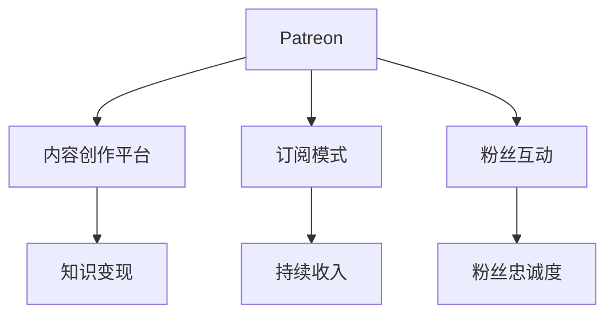
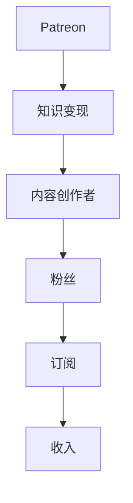

                 

# 《程序员如何利用Patreon进行知识变现》

> 关键词：Patreon、知识变现、程序员、内容创作、营销策略

> 摘要：本文将详细介绍程序员如何利用Patreon这一平台进行知识变现，包括Patreon的基本功能与优势、程序员的定位与内容策略、营销技巧、实战案例以及持续发展策略。

## 第一部分：Patreon概述

### 1.1 Patreon简介

#### 1.1.1 Patreon的功能与优势

Patreon是一个基于订阅模式的内容创作平台，旨在帮助创作者与粉丝建立更紧密的联系，并通过粉丝的订阅和支持实现知识变现。Patreon的主要功能与优势如下：

1. **订阅模式**：粉丝可以通过订阅创作者的内容来支持他们，创作者可以设置不同的订阅层级，满足不同粉丝的需求。
2. **灵活的内容发布**：创作者可以在Patreon上发布多种类型的内容，如文字、图片、视频、音频等，满足不同粉丝的阅读和观看习惯。
3. **粉丝互动**：创作者可以在Patreon上与粉丝进行实时互动，提高粉丝的忠诚度和参与度。
4. **数据分析**：Patreon提供详细的数据分析工具，帮助创作者了解粉丝行为，优化内容创作和营销策略。
5. **跨境支付**：Patreon支持全球范围内的支付，方便创作者接受来自世界各地的粉丝支持。

#### 1.1.2 Patreon的历史与发展

Patreon成立于2013年，最初的目标是帮助独立艺术家和创作者获得稳定的收入来源。自成立以来，Patreon不断发展壮大，已成为全球最大的支持独立创作者的平台之一。截至目前，Patreon上已有超过300万名创作者和数千万粉丝。

#### 1.1.3 Patreon在不同行业中的应用案例

Patreon的应用范围非常广泛，涵盖了多个行业和领域，如艺术、音乐、文学、科技、教育等。以下是一些代表性的应用案例：

1. **艺术领域**：艺术家通过Patreon展示自己的作品，吸引粉丝订阅并支持自己的创作。
2. **音乐领域**：音乐家通过Patreon发布新歌、制作幕后花絮，与粉丝互动，实现音乐作品的传播和变现。
3. **科技领域**：程序员、开发者通过Patreon分享技术知识、编写教程、举办在线课程，实现知识变现。
4. **教育领域**：教育工作者通过Patreon发布课程、开设在线培训班，为学生提供高质量的教育资源。

### 1.2 程序员如何利用Patreon

#### 1.2.1 程序员在Patreon上的定位

程序员在Patreon上的定位主要是作为知识分享者和导师，通过分享自己的技术知识、经验和技能，吸引粉丝和支持者。以下是一些具体的定位建议：

1. **技术专家**：专注于某一技术领域，如前端开发、后端开发、人工智能、大数据等，成为该领域的专家。
2. **实战经验分享**：分享自己的项目实战经验，如项目背景、技术选型、开发过程、解决方案等。
3. **编程教程**：编写详细的编程教程，从基础知识到高级技巧，帮助新手和有经验的程序员提高技能。
4. **在线课程**：开设在线课程，以视频或文字形式教授编程知识和技能。

#### 1.2.2 程序员创建Patreon账户的步骤

1. **注册账户**：访问Patreon官网（https://www.patreon.com/），点击“Start earning”按钮，按照提示完成注册流程。
2. **完善资料**：填写个人资料，包括头像、名字、介绍等，以便粉丝了解你的背景和特长。
3. **设置订阅选项**：在Patreon后台设置订阅选项，包括订阅价格、订阅内容、奖励等，根据粉丝需求制定不同的订阅层级。
4. **发布内容**：开始创作并发布内容，如技术博客、教程、视频等，展示自己的技术实力和教学能力。

#### 1.2.3 程序员在Patreon上的内容策略

1. **内容定位**：明确自己的内容方向，如专注于某一技术领域、分享项目经验等。
2. **内容形式**：结合自己的特长和粉丝需求，选择合适的的内容形式，如文字教程、视频教程、直播等。
3. **内容更新**：定期更新内容，保持与粉丝的互动，提高粉丝的粘性和活跃度。
4. **互动与反馈**：积极与粉丝互动，回复他们的评论和提问，收集反馈，优化内容创作和订阅策略。

### 1.3 Patreon与知识变现

#### 1.3.1 知识变现的定义

知识变现是指将个人的知识、技能、经验和专业能力转化为经济收益的过程。在Patreon平台上，程序员可以通过以下方式实现知识变现：

1. **订阅收入**：粉丝通过订阅程序员的Patreon账户，支付订阅费用，从而支持程序员的创作。
2. **广告收入**：Patreon平台会根据创作者的订阅量和浏览量，向他们支付广告收入。
3. **赞助与打赏**：粉丝可以通过赞助和打赏的方式，直接向程序员支付费用，支持他们的创作。

#### 1.3.2 程序员如何通过知识变现实现收入增长

1. **提高订阅量**：通过优质的内容和有效的营销策略，吸引更多粉丝订阅，从而提高订阅收入。
2. **扩大粉丝群体**：通过社交媒体、网络社区等渠道，扩大粉丝群体，提高平台的曝光度和影响力。
3. **多元化收入来源**：除了订阅收入外，还可以通过广告、赞助、打赏等方式，实现多元化的收入来源。
4. **持续优化内容**：根据粉丝的反馈和市场需求，不断优化内容创作和订阅策略，提高粉丝的满意度和忠诚度。

#### 1.3.3 Patreon在知识变现中的角色

Patreon作为平台方，扮演着重要的角色，为程序员提供以下支持：

1. **技术支持**：提供稳定的平台和技术支持，保障创作者的内容发布和粉丝互动。
2. **数据分析**：提供详细的数据分析工具，帮助创作者了解粉丝行为，优化内容创作和订阅策略。
3. **推广支持**：为优质创作者提供推广资源，提高平台的曝光度和影响力。
4. **收入保障**：保障创作者的订阅收入，同时提供一定的广告收入分成，为创作者提供稳定的收入来源。

## 第二部分：Patreon核心功能与使用技巧

### 2.1 Patreon账户设置

#### 2.1.1 设置个人资料

1. **头像**：选择一个代表自己的头像，有助于增强个人品牌的认知度。
2. **名字**：使用真实姓名或昵称，便于粉丝识别和记住。
3. **介绍**：简要介绍自己的背景、特长和创作内容，让粉丝了解你的定位和价值。
4. **社交媒体链接**：添加个人社交媒体账号，便于粉丝在多个平台关注和互动。

#### 2.1.2 设置订阅选项

1. **订阅价格**：根据自身的内容价值和粉丝需求，设定合理的订阅价格。
2. **订阅内容**：明确订阅内容，包括订阅者可以获得的特权、福利和专属内容。
3. **奖励设置**：为不同的订阅层级设置不同的奖励，提高粉丝的参与度和忠诚度。

#### 2.1.3 管理奖励和标签

1. **奖励管理**：定期更新和优化奖励，保持与粉丝的互动和吸引力。
2. **标签管理**：使用标签对内容进行分类，便于粉丝查找和订阅感兴趣的内容。

### 2.2 Patreon内容创作

#### 2.2.1 内容创作的基本原则

1. **定位明确**：明确自己的内容方向和目标受众，避免内容模糊和分散。
2. **质量优先**：保证内容的质量，包括语言表达、逻辑结构、知识点等。
3. **持续更新**：保持内容更新频率，维持粉丝的活跃度和黏性。
4. **互动引导**：鼓励粉丝参与互动，如评论、提问、分享等，提高粉丝的参与度。

#### 2.2.2 内容类型选择

1. **文字教程**：适合教授编程语言、算法、框架等知识，易于理解和学习。
2. **视频教程**：适合展示实战操作、项目演示、直播讲解等，直观生动。
3. **直播授课**：适合实时互动，解答粉丝的疑问，提高粉丝的参与度和满意度。
4. **音频教程**：适合在通勤、运动等场景下学习，方便快捷。

#### 2.2.3 内容发布与更新策略

1. **发布频率**：根据自身能力和粉丝需求，制定合理的发布频率。
2. **内容预告**：提前预告即将发布的内容，提高粉丝的关注度。
3. **内容编排**：合理编排内容，确保逻辑清晰、层次分明。
4. **反馈优化**：根据粉丝的反馈和评论，不断优化内容质量和更新策略。

### 2.3 互动与社区管理

#### 2.3.1 与粉丝互动的方法

1. **回复评论**：及时回复粉丝的评论和提问，展示自己的专业性和亲和力。
2. **开展直播**：定期开展直播活动，与粉丝进行实时互动，解答疑问。
3. **举办活动**：举办线上或线下的活动，增加粉丝的参与度和归属感。

#### 2.3.2 社区管理技巧

1. **制定规则**：明确社区管理规则，维护良好的社区氛围。
2. **培养管理员**：培养一批热心、有责任心、有专业知识的粉丝作为管理员，协助管理社区。
3. **监控与处理**：实时监控社区动态，及时处理违规行为和负面评论。

#### 2.3.3 处理负面评论与争议

1. **冷静应对**：保持冷静，避免情绪化回应，以免激化矛盾。
2. **理性沟通**：以理服人，耐心解释问题，化解争议。
3. **及时处理**：及时处理负面评论和争议，防止问题扩大。

## 第三部分：Patreon营销策略

### 3.1 营销目标与定位

#### 3.1.1 确定营销目标

1. **品牌推广**：提高个人品牌知名度，吸引更多粉丝和关注。
2. **订阅增长**：增加订阅量，提高订阅收入。
3. **内容曝光**：提高内容在Patreon平台和社交媒体的曝光度。
4. **跨界合作**：寻求与其他创作者或企业的合作机会，扩大影响力。

#### 3.1.2 明确目标受众

1. **新手程序员**：教授编程基础知识，帮助他们入门。
2. **有经验的程序员**：分享项目实战经验和最新技术动态。
3. **学习爱好者**：提供有趣、实用的编程教程和项目指南。
4. **企业客户**：为企业提供定制化的培训服务和解决方案。

#### 3.1.3 定位独特价值

1. **专业性与权威性**：凭借丰富的技术经验和专业知识，树立专业形象。
2. **实战性与实用性**：通过项目实战和案例分享，提高内容的实用性和吸引力。
3. **互动与社区**：打造互动性强、氛围良好的社区，提高粉丝的参与度和忠诚度。

### 3.2 内容营销策略

#### 3.2.1 内容营销的步骤

1. **内容策划**：确定内容方向、主题和形式，制定内容发布计划。
2. **内容创作**：根据策划，进行内容创作，确保质量与专业性。
3. **内容发布**：在Patreon平台和社交媒体上发布内容，进行宣传推广。
4. **内容优化**：根据粉丝反馈和数据分析，不断优化内容质量和发布策略。

#### 3.2.2 内容营销工具与平台

1. **Patreon平台**：作为核心发布平台，进行内容创作和发布。
2. **社交媒体**：利用微博、知乎、GitHub等社交媒体平台，扩大内容曝光和粉丝群体。
3. **邮件营销**：通过邮件列表，向粉丝发送内容更新通知和营销信息。
4. **社区互动**：在Patreon社区、技术论坛等平台，积极互动和参与讨论。

#### 3.2.3 社交媒体与Patreon的协同效应

1. **内容同步**：将Patreon上的内容同步到社交媒体，提高内容曝光度。
2. **粉丝引导**：通过社交媒体引导粉丝关注Patreon账户，提高订阅量。
3. **互动联动**：在社交媒体和Patreon平台上，进行互动联动，提高粉丝的参与度和忠诚度。

### 3.3 营销效果评估与优化

#### 3.3.1 营销效果指标

1. **订阅量**：衡量内容营销对订阅量的影响。
2. **粉丝增长**：衡量内容营销对粉丝增长的影响。
3. **内容浏览量**：衡量内容在Patreon平台和社交媒体上的曝光度。
4. **互动率**：衡量粉丝参与互动的程度，如评论、点赞、分享等。

#### 3.3.2 数据分析工具

1. **Patreon数据分析工具**：分析订阅量、粉丝增长、内容浏览量等指标。
2. **Google Analytics**：分析网站流量、访问者行为等数据。
3. **社交媒体分析工具**：分析社交媒体平台上的粉丝增长、内容曝光、互动率等数据。

#### 3.3.3 营销策略调整与优化

1. **数据驱动**：根据数据分析结果，调整内容创作和营销策略。
2. **不断测试**：尝试不同的营销手段，对比效果，持续优化。
3. **粉丝反馈**：重视粉丝的反馈和建议，不断改进内容和营销策略。

## 第四部分：Patreon变现实战

### 4.1 知识变现案例研究

#### 4.1.1 案例一：开发者X的Patreon之路

**背景**：开发者X是一名拥有10年编程经验的专业程序员，擅长前端开发和跨平台应用开发。他在Patreon平台上分享前端开发技术和实战经验，吸引了大量粉丝。

**变现策略**：
1. **内容定位**：专注于前端开发领域，分享实际项目案例和技术心得。
2. **订阅选项**：设置多个订阅层级，提供不同层次的内容和奖励。
3. **互动引导**：积极与粉丝互动，回复评论和提问，提高粉丝满意度。

**成果**：
- 粉丝量：从零开始，逐步积累粉丝，目前拥有数千名粉丝。
- 订阅量：订阅量稳步增长，每月收入达到数千美元。

#### 4.1.2 案例二：开发者Y的知识变现策略

**背景**：开发者Y是一名专注于人工智能领域的专家，拥有丰富的项目经验。他在Patreon平台上分享人工智能技术和项目实战。

**变现策略**：
1. **内容定位**：聚焦人工智能领域，分享最新技术动态、项目案例和实践经验。
2. **互动引导**：定期举办线上研讨会和直播活动，与粉丝互动，解答疑问。
3. **多元化变现**：除了订阅收入，还通过赞助、广告、课程销售等实现多元化变现。

**成果**：
- 粉丝量：拥有数千名粉丝，粉丝活跃度高。
- 收入来源：订阅收入、赞助收入、课程销售等，每月收入达到数万美元。

#### 4.1.3 案例三：开发者Z的Patreon成功经验

**背景**：开发者Z是一名有多年编程经验的技术导师，擅长多种编程语言。他在Patreon平台上开设编程教程和在线课程。

**变现策略**：
1. **内容定位**：提供全面的编程教程和实战项目，涵盖多种编程语言和框架。
2. **订阅选项**：设置多个订阅层级，满足不同学习阶段和学习需求。
3. **互动引导**：定期举办线上直播课程，解答粉丝疑问，提高粉丝满意度。

**成果**：
- 粉丝量：拥有数千名粉丝，粉丝群体稳定增长。
- 订阅量：订阅量稳步增长，每月收入达到数千美元。

### 4.2 实战步骤

#### 4.2.1 制定变现计划

1. **目标定位**：明确自己的目标，如提高订阅量、增加粉丝数等。
2. **内容策划**：根据目标定位，制定内容创作计划，包括内容形式、主题和发布频率。
3. **营销策略**：根据目标定位和内容策划，制定营销策略，如社交媒体推广、互动引导等。

#### 4.2.2 确定变现内容

1. **技术知识**：分享自己的技术知识和实践经验，如编程教程、项目案例等。
2. **在线课程**：开设在线课程，教授编程语言、框架、算法等。
3. **直播授课**：定期举办直播课程，解答粉丝疑问，提高粉丝满意度。

#### 4.2.3 收益模式设计

1. **订阅收入**：设置多个订阅层级，满足不同粉丝的需求。
2. **赞助与广告**：接受赞助和广告，实现多元化收入来源。
3. **课程销售**：销售自己的课程，提高收入。

### 4.3 问题和挑战

#### 4.3.1 可能遇到的问题

1. **内容创作压力**：需要持续创作高质量的内容，保持与粉丝的互动。
2. **市场竞争力**：面对激烈的市场竞争，需要不断提高自己的专业水平和教学质量。
3. **版权问题**：在创作过程中，需要注意版权问题，避免侵权行为。

#### 4.3.2 挑战与解决方案

1. **挑战**：如何吸引粉丝并提高订阅量？
   - **解决方案**：制定有效的营销策略，如社交媒体推广、互动引导等。
   - **挑战**：如何保持内容质量并持续更新？
   - **解决方案**：合理安排创作计划，培养团队协作，提高内容创作效率。

2. **挑战**：如何实现多元化收入来源？
   - **解决方案**：积极探索新的收入模式，如课程销售、赞助合作等。

3. **挑战**：如何应对市场竞争？
   - **解决方案**：不断提升自己的专业水平和教学质量，提供独特的价值。

### 4.3.3 风险管理

1. **内容风险**：确保内容原创，避免侵权行为。
2. **财务风险**：合理规划财务，避免过度投入和资金链断裂。
3. **市场风险**：关注市场动态，及时调整内容和营销策略。

## 第五部分：Patreon持续发展

### 5.1 长期发展规划

#### 5.1.1 设定长期目标

1. **粉丝增长**：实现粉丝量级突破，提高平台影响力。
2. **内容丰富**：持续创作高质量内容，满足粉丝需求。
3. **收入稳定**：实现多元化收入来源，提高收入水平。

#### 5.1.2 持续内容创作与更新

1. **内容规划**：根据粉丝需求和市场趋势，制定长期内容创作计划。
2. **内容创新**：不断探索新的内容形式和创作方式，提高内容吸引力。
3. **内容协作**：培养团队协作，提高内容创作效率。

#### 5.1.3 财务规划与预算管理

1. **收入预测**：根据历史数据和行业趋势，预测未来收入。
2. **成本控制**：合理安排预算，控制成本支出。
3. **风险规避**：制定风险管理策略，降低财务风险。

### 5.2 跨平台拓展

#### 5.2.1 跨平台营销策略

1. **平台选择**：根据目标受众和内容特点，选择合适的跨平台营销平台。
2. **内容整合**：将Patreon上的内容整合到其他平台，提高内容曝光度。
3. **互动联动**：在跨平台之间进行互动联动，提高粉丝的参与度和忠诚度。

#### 5.2.2 跨平台内容整合

1. **内容同步**：将Patreon上的内容同步到其他平台，如微博、知乎等。
2. **互动引导**：在其他平台引导粉丝关注Patreon账户，提高订阅量。
3. **数据分析**：整合跨平台数据，优化内容和营销策略。

#### 5.2.3 跨平台粉丝互动

1. **跨平台直播**：在其他平台进行直播，吸引粉丝参与。
2. **跨平台活动**：举办跨平台的线上或线下活动，提高粉丝的参与度和黏性。
3. **社群建设**：在跨平台建立社群，促进粉丝之间的互动。

### 5.3 社区建设与影响力

#### 5.3.1 建立粉丝社区

1. **社区定位**：明确社区的目标和定位，如技术交流、学习分享等。
2. **社区规则**：制定社区规则，维护良好的社区氛围。
3. **社区活动**：定期举办社区活动，提高粉丝的参与度和忠诚度。

#### 5.3.2 提升社区活跃度

1. **互动激励**：通过互动激励，鼓励粉丝参与社区讨论和互动。
2. **内容激励**：鼓励粉丝创作和分享优质内容，提高社区活力。
3. **社群管理**：培养社区管理员，协助管理社区，提高社区活跃度。

#### 5.3.3 影响力评估与提升

1. **影响力指标**：评估社区的影响力，如粉丝数量、活跃度、内容质量等。
2. **内容优化**：根据影响力评估结果，优化内容和互动策略。
3. **跨界合作**：寻求与其他领域的专家或企业合作，提高社区的影响力。

## 附录

### 附录 A: Patreon相关资源与工具

#### A.1 Patreon官方文档与教程

1. **官方文档**：https://www.patreon.com/docs
2. **官方教程**：https://www.patreon.com/learn

#### A.2 第三方Patreon工具与插件

1. **Patreon Dashboard**：一个用于管理和分析Patreon账户的浏览器插件。
2. **Patreon Analytics**：一个用于分析Patreon数据的工具。

#### A.3 相关书籍与文章推荐

1. **《Patreon实战指南》**：详细介绍Patreon平台的运营策略和技巧。
2. **《内容营销实战》**：介绍内容营销的策略和技巧，适用于Patreon平台。

# 核心概念与联系

### Patreon的概念与功能
mermaid
graph TD
A[Patreon] --> B[内容创作平台]
A --> C[订阅模式]
A --> D[粉丝互动]
B --> E[知识变现]
C --> F[持续收入]
D --> G[粉丝忠诚度]

### 知识变现与Patreon
mermaid
graph TD
A[Patreon] --> B[知识变现]
B --> C[内容创作者]
C --> D[粉丝]
D --> E[订阅]
E --> F[收入]

# 核心算法原理讲解

### 订阅算法
plaintext
// 订阅算法伪代码
function subscribe(user, contentCreator) {
  if (user.balance >= contentCreator.subscriptionCost) {
    user.balance -= contentCreator.subscriptionCost;
    contentCreator.subscribers.add(user);
    return "Subscription successful!";
  } else {
    return "Insufficient balance!";
  }
}

### 订阅者流失率预测
#### 数学模型
$$
R(t) = \frac{1}{1 + e^{-(\beta_0 + \beta_1 \cdot t)}}
$$
#### 参数解释
- $R(t)$：在时间 $t$ 的订阅者流失率。
- $\beta_0$：常数项，代表初始流失率。
- $\beta_1$：斜率项，代表时间对流失率的影响。

#### 举例说明
假设一个内容创作者的初始流失率为0.1，每增加一天，流失率增加0.05。在$t=5$天时，流失率为：
$$
R(5) = \frac{1}{1 + e^{-(0.1 + 0.05 \cdot 5)}} \approx 0.4
$$
即在5天后，预计有40%的订阅者可能流失。

# 项目实战

### 实战案例：Patreon账户创建与内容发布

#### 1. 实战目标
创建一个Patreon账户，并发布一个关于编程技术的连载教程，吸引订阅者并实现知识变现。

#### 2. 开发环境搭建
- 操作系统：Windows 10
- 编程语言：Python 3.8
- 编辑器：VSCode
- Patreon账户：已创建

#### 3. 源代码详细实现

**Patreon账户创建**
python
import requests

def create_patreon_account(username, email, password):
    url = "https://www.patreon.com/api/oauth2/token"
    headers = {
        "Content-Type": "application/json",
    }
    data = {
        "grant_type": "password",
        "username": username,
        "password": password,
        "client_id": "your_client_id",
        "client_secret": "your_client_secret",
        "email": email,
    }
    response = requests.post(url, headers=headers, json=data)
    if response.status_code == 200:
        return response.json()
    else:
        return None

# 测试账户创建
account_info = create_patreon_account("username", "email@example.com", "password")
if account_info:
    print("Patreon account created successfully!")
else:
    print("Failed to create Patreon account.")


**发布连载教程**
python
def post_content(contentCreatorId, title, content):
    url = f"https://www.patreon.com/api/creators/{contentCreatorId}/posts"
    headers = {
        "Authorization": f"Bearer {account_info['access_token']}",
        "Content-Type": "application/json",
    }
    data = {
        "title": title,
        "body": content,
        "type": "text",
    }
    response = requests.post(url, headers=headers, json=data)
    if response.status_code == 201:
        return "Content posted successfully!"
    else:
        return "Failed to post content."

# 测试发布内容
content_creator_id = "your_content_creator_id"
post_content(content_creator_id, "Introduction to Python", "Welcome to the Python tutorial series!")


#### 4. 代码解读与分析
- **账户创建**：使用OAuth2.0认证方式创建Patreon账户，需要提供用户名、密码、邮箱以及应用客户端ID和客户端密钥。
- **内容发布**：通过API向Patreon账户发布内容，需要提供内容创作者ID、标题和内容。

# 结论
本书旨在为程序员提供利用Patreon进行知识变现的详细指南。通过设计一个详细的目录大纲，包括Patreon概述、核心功能与使用技巧、营销策略、实战案例以及持续发展策略等内容，帮助读者全面了解Patreon的使用方法及其在知识变现中的潜力。同时，通过核心概念联系图、算法原理讲解、数学模型和公式以及实际代码案例，使读者能够深入理解并掌握Patreon的核心功能和技术原理，为成功利用Patreon进行知识变现奠定基础。希望本书能为广大的程序员和内容创作者提供有价值的参考和启示。

### 附录 A: Patreon相关资源与工具

#### A.1 Patreon官方文档与教程

1. **官方文档**：[Patreon API文档](https://www.patreon.com/docs)
2. **官方教程**：[Patreon教程](https://www.patreon.com/learn)

#### A.2 第三方Patreon工具与插件

1. **Patreon Dashboard**：[Patreon Dashboard插件](https://chrome.google.com/webstore/detail/patreon-dashboard/jdbjgbhcpfchmbfnfljdmmgbljpojamk?hl=en)
2. **Patreon Analytics**：[Patreon Analytics工具](https://chrome.google.com/webstore/detail/patreon-analytics/hgjdfhfdgjokglghgkpblmpfpdonpjod?hl=en)

#### A.3 相关书籍与文章推荐

1. **《Patreon实战指南》**：[Patreon实战指南](https://www.amazon.com/Patreon-Playbook-Create-Independent-Author/dp/1647412297)
2. **《内容营销实战》**：[内容营销实战](https://www.amazon.com/Content-Marketing-Practical-Strategy-Practices/dp/159280626X)

### 附录 B: Mermaid图表代码

#### Patreon的概念与功能


#### 知识变现与Patreon


### 附录 C: 代码示例

#### Patreon账户创建
```python
import requests

def create_patreon_account(username, email, password):
    url = "https://www.patreon.com/api/oauth2/token"
    headers = {
        "Content-Type": "application/json",
    }
    data = {
        "grant_type": "password",
        "username": username,
        "password": password,
        "client_id": "your_client_id",
        "client_secret": "your_client_secret",
        "email": email,
    }
    response = requests.post(url, headers=headers, json=data)
    if response.status_code == 200:
        return response.json()
    else:
        return None

# 测试账户创建
account_info = create_patreon_account("username", "email@example.com", "password")
if account_info:
    print("Patreon account created successfully!")
else:
    print("Failed to create Patreon account.")
```

#### 发布连载教程
```python
def post_content(contentCreatorId, title, content):
    url = f"https://www.patreon.com/api/creators/{contentCreatorId}/posts"
    headers = {
        "Authorization": f"Bearer {account_info['access_token']}",
        "Content-Type": "application/json",
    }
    data = {
        "title": title,
        "body": content,
        "type": "text",
    }
    response = requests.post(url, headers=headers, json=data)
    if response.status_code == 201:
        return "Content posted successfully!"
    else:
        return "Failed to post content."

# 测试发布内容
content_creator_id = "your_content_creator_id"
post_content(content_creator_id, "Introduction to Python", "Welcome to the Python tutorial series!")
```

### 作者

**作者：** AI天才研究院/AI Genius Institute & 禅与计算机程序设计艺术 /Zen And The Art of Computer Programming

---


