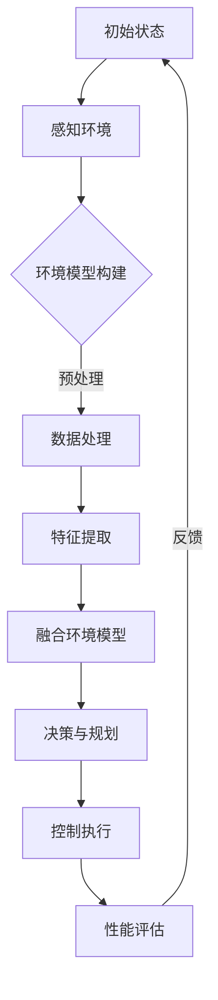

                 

### 文章标题

《端到端自动驾驶的开环训练与开环测试》

### 关键词

- 端到端自动驾驶
- 开环训练
- 开环测试
- 数据采集与预处理
- 决策与规划算法
- 控制算法
- 深度学习
- 仿真环境
- 真实环境
- 性能评估指标

### 摘要

本文深入探讨了端到端自动驾驶系统的开环训练与开环测试技术。首先，介绍了端到端自动驾驶的基础概念，包括其定义、发展历程和关键技术。接着，详细阐述了开环训练与开环测试的基本概念和原理，并通过Mermaid流程图展示了系统的整体运作流程。随后，本文详细讲解了开环训练技术，包括数据采集与预处理、模型选择与训练策略、开环训练算法原理，并通过伪代码示例进行了具体说明。此外，本文也详细介绍了开环测试技术，包括测试环境搭建、测试方法和案例分析。最后，通过一个自动驾驶系统项目实战，展示了开环训练与开环测试的完整实施过程，并对代码实现进行了深入解读和分析。

## 第一部分：端到端自动驾驶的基础概念

端到端自动驾驶是自动驾驶技术的最高形式，它允许汽车在无人干预的情况下自主感知环境、做出决策并执行驾驶任务。这一技术的发展不仅对交通行业产生了深远影响，还对社会整体运行效率、能源消耗和环境质量提出了新的要求。本部分将深入探讨端到端自动驾驶的基础概念，包括其定义、发展历程、关键技术以及开环训练与开环测试的基本概念。

### 第1章：端到端自动驾驶概述

#### 1.1 端到端自动驾驶的定义与发展历程

**定义**：端到端自动驾驶是指汽车通过自身的传感器、计算系统和人工智能算法，实现从感知环境、决策规划到执行动作的完整驾驶过程，无需人为干预。

端到端自动驾驶系统通常包含以下几个关键组成部分：

1. **感知模块**：负责实时获取车辆周围环境的信息，包括路面状况、其他车辆位置、行人、交通标志和信号等。感知模块通常使用多种传感器，如激光雷达、摄像头、毫米波雷达和超声波传感器。

2. **数据处理与融合模块**：对感知模块获取的大量数据进行预处理、特征提取和融合，以构建高精度的环境模型。

3. **决策与规划模块**：基于环境模型，自动驾驶系统需要做出实时的决策和规划，包括路径规划、避障、交通规则遵守和车辆控制等。

4. **控制模块**：将决策与规划的结果转化为具体的控制命令，实现车辆的精确控制，如加速、制动和转向等。

**发展历程**：

- **初始阶段**：20世纪50年代，自动驾驶汽车的概念首次被提出。早期的自动驾驶系统主要依赖机械和电子控制系统。

- **技术萌芽阶段**：20世纪80年代，自动驾驶技术开始受到关注，主要是基于规则和模型的自动驾驶系统。这一阶段的系统主要依靠预设的规则和算法来处理驾驶任务。

- **快速发展阶段**：21世纪初，随着传感器技术、计算能力和人工智能算法的进步，自动驾驶技术开始进入快速发展阶段。这一阶段的系统开始引入更多的传感器和人工智能算法，提高了系统的智能化水平。

- **商业应用阶段**：近年来，自动驾驶汽车逐渐在特定场景下实现商业化应用，如无人出租车、无人配送等。这一阶段的系统更加注重系统的安全性和可靠性。

#### 1.2 端到端自动驾驶的关键技术

**感知技术**：感知技术是端到端自动驾驶系统的核心组成部分，它决定了系统对周围环境的理解和响应能力。常用的感知技术包括：

1. **激光雷达（LIDAR）**：激光雷达通过发射激光束并测量光波的反射时间来构建周围环境的精确三维模型。

2. **摄像头**：摄像头用于捕获车辆周围的光学图像，通过图像处理算法提取环境特征。

3. **毫米波雷达**：毫米波雷达通过发射和接收毫米波信号来探测周围物体的位置和速度。

4. **超声波传感器**：超声波传感器用于检测车辆周围的近距离物体，通常用于辅助泊车和避障。

**数据处理与融合**：数据处理与融合是将感知模块获取的大量原始数据转化为可用于决策和规划的有用信息的过程。主要方法包括：

1. **数据预处理**：对原始感知数据进行滤波、去噪和去畸变等处理，以提高数据质量。

2. **特征提取**：从预处理后的数据中提取有用的特征，如边缘、形状和纹理等。

3. **数据融合**：将来自不同传感器的数据进行融合，以构建更全面和准确的环境模型。

**决策与规划算法**：决策与规划算法是自动驾驶系统的核心智能部分，它决定了系统如何响应环境变化。主要方法包括：

1. **路径规划**：确定车辆从当前点到目的地的最佳路径。

2. **行为预测**：预测其他车辆、行人和道路标志的行为。

3. **避障**：避免与其他物体发生碰撞。

4. **交通规则遵守**：确保车辆遵守交通规则，如限速、车道保持和信号灯识别等。

**控制算法**：控制算法是将决策和规划的结果转化为实际控制命令的过程。主要方法包括：

1. **车辆控制**：控制车辆的加速、制动和转向。

2. **底盘控制**：控制车辆的悬挂、转向和制动系统。

3. **环境交互**：与其他道路用户和环境进行交互，如信号灯、交通标志和行人等。

### 1.3 开环训练与开环测试的基本概念

**开环训练**：开环训练是指在无人干预的情况下，自动驾驶系统通过自身的学习和优化，逐步提高系统的性能和可靠性。开环训练的关键在于训练数据的获取和预处理、模型的选择和优化。

**开环测试**：开环测试是指在无人干预的情况下，自动驾驶系统在真实或模拟环境中进行性能验证和评估。开环测试的主要目标是评估系统在各种环境下的稳定性和可靠性。

### Mermaid 流程图



### 第2章：开环训练技术详解

开环训练是端到端自动驾驶系统开发过程中的关键环节，它决定了系统在不同环境下的适应能力和可靠性。本节将详细阐述开环训练的技术细节，包括数据采集与预处理、模型选择与训练策略以及开环训练算法原理。

#### 2.1 数据采集与预处理

数据采集是开环训练的基础，高质量的训练数据能够显著提高自动驾驶系统的性能。数据采集通常涉及以下步骤：

1. **选择合适的传感器**：根据自动驾驶系统的需求和场景，选择合适的传感器，如激光雷达、摄像头、毫米波雷达和超声波传感器等。

2. **数据采集设备配置**：配置传感器和相应的数据采集设备，如数据记录仪、GPS等。

3. **数据采集策略**：制定数据采集的详细计划，包括数据采集的时间、地点、场景和速度等。

4. **数据标注**：对采集到的数据进行标注，标注内容包括道路标志、交通信号、车道线、车辆和行人位置等。

预处理是对采集到的原始数据进行清洗、标准化和增强的过程，以提高训练数据的质量和多样性。主要方法包括：

1. **数据清洗**：去除噪声、填补缺失值和纠正数据错误。

2. **数据标准化**：将不同来源的数据进行统一处理，如归一化、标准化等。

3. **数据增强**：通过旋转、缩放、裁剪和颜色变换等方法增加数据的多样性。

#### 2.2 模型选择与训练策略

模型选择是开环训练的关键，合适的模型能够更好地适应自动驾驶任务的需求。选择模型时，需要考虑以下因素：

1. **任务需求**：根据自动驾驶任务的特点，选择适合的模型类型，如卷积神经网络（CNN）、循环神经网络（RNN）或变换器（Transformer）等。

2. **数据特性**：根据训练数据的特点，选择具有良好数据适应性模型的架构。

3. **计算资源**：考虑训练模型所需的计算资源和时间，选择合适的模型和算法。

训练策略是指在整个训练过程中的方法和步骤，主要包括：

1. **数据分割**：将数据集分为训练集、验证集和测试集，用于模型的训练、验证和评估。

2. **训练策略**：根据任务需求和模型特性，选择合适的训练策略，如梯度下降、随机梯度下降（SGD）或Adam等。

3. **超参数调优**：通过调整学习率、批量大小、正则化参数等超参数，优化模型的训练效果。

#### 2.3 开环训练算法原理

开环训练算法是自动驾驶系统学习环境和执行任务的核心。以下是基于深度学习的开环训练算法原理：

**基于深度学习的开环训练算法**：

1. **感知模块**：使用激光雷达、摄像头和毫米波雷达等传感器采集环境数据，并通过神经网络进行处理和特征提取。

2. **数据处理**：对采集到的环境数据进行预处理，如归一化、去噪等。

3. **特征提取**：使用卷积神经网络（CNN）或变换器（Transformer）对预处理后的数据进行特征提取，以构建高维特征向量。

4. **决策与规划模块**：使用循环神经网络（RNN）或变换器（Transformer）对提取的特征向量进行处理，以生成决策和规划结果。

5. **控制模块**：根据决策和规划结果，生成控制命令，如加速、制动和转向等。

6. **性能评估**：通过在测试集上的性能评估，调整模型参数和训练策略，以提高模型性能。

**伪代码示例**：

```python
# 开环训练算法伪代码

# 初始化模型和超参数
model = create_model()
learning_rate = 0.001
batch_size = 64

# 数据预处理
preprocessed_data = preprocess_data(data)

# 训练模型
for epoch in range(num_epochs):
    for batch in data_loader:
        # 前向传播
        predictions = model(preprocessed_batch)
        
        # 计算损失函数
        loss = loss_function(predictions, labels)
        
        # 反向传播和优化
        optimizer.zero_grad()
        loss.backward()
        optimizer.step()
        
        # 性能评估
        performance = evaluate_model(model, test_data)
        print(f"Epoch {epoch}: Loss = {loss}, Performance = {performance}")
```

### 第3章：开环测试技术详解

开环测试是验证自动驾驶系统性能和可靠性的重要手段。通过在真实或模拟环境中对系统进行测试，可以评估其在各种情况下的表现。本节将详细阐述开环测试的技术细节，包括测试环境搭建、测试方法和案例分析。

#### 3.1 开环测试环境搭建

**测试环境**：开环测试可以在仿真环境和真实环境中进行。仿真环境通常使用计算机模拟来模拟各种驾驶场景，而真实环境则是实际的道路和交通场景。

1. **仿真环境**：仿真环境可以精确控制测试场景，适用于系统开发和初步测试。常见的仿真软件包括CARLA、AirSim等。

2. **真实环境**：真实环境提供了更为复杂和真实的情况，但需要考虑交通法规和安全因素。

**测试工具**：开环测试通常需要以下工具：

1. **自动驾驶测试平台**：用于部署和运行自动驾驶系统，如NVIDIA Drive、Waymo等。

2. **传感器**：用于采集环境数据，如激光雷达、摄像头、毫米波雷达等。

3. **测试软件**：用于监控、记录和分析测试数据，如CARMIS、Autonomous Driving Test Suite等。

#### 3.2 开环测试方法

开环测试的方法主要包括以下步骤：

1. **数据准备**：准备用于测试的数据集，包括环境数据、决策和规划结果以及控制命令。

2. **模型部署**：将训练好的模型部署到测试平台，以运行测试场景。

3. **测试执行**：在测试环境中执行测试，记录系统的表现和输出结果。

4. **结果分析**：分析测试结果，评估系统的性能和可靠性。

**性能评估指标**：常用的性能评估指标包括：

1. **精度**：系统在特定任务上的正确执行比例。

2. **召回率**：系统检测到的正确结果与实际结果的比例。

3. **F1值**：精度和召回率的调和平均。

4. **响应时间**：系统从感知到决策再到执行的时间。

#### 3.3 开环测试案例分析

**案例一：自动驾驶车辆的避障测试**

- **测试场景**：在一个仿真环境中模拟一个繁忙的城市道路，包括车辆、行人、交通标志和信号灯。

- **测试目标**：评估自动驾驶车辆在复杂交通环境下的避障能力。

- **测试过程**：在不同情况下，如车辆突然变道、行人横穿道路等，测试车辆的反应时间和避障效果。

- **测试结果**：分析测试数据，评估车辆的避障精度和响应时间。

**案例二：自动驾驶车辆的路径规划测试**

- **测试场景**：在一个真实的道路上进行测试，车辆需要从起点导航到目的地。

- **测试目标**：评估自动驾驶车辆的路径规划能力。

- **测试过程**：在不同的道路条件和交通状况下，测试车辆的路径规划和导航能力。

- **测试结果**：分析测试数据，评估车辆的路径规划精度和导航效率。

### 数学模型与公式

**3.4.1 感知模块中的特征提取**

特征提取是自动驾驶系统中关键的一环，以下是一个简单的特征提取模型：

$$
f(x) = \sigma(W_1 \cdot x + b_1)
$$

其中，$x$ 表示输入特征，$W_1$ 和 $b_1$ 分别为权重和偏置，$\sigma$ 表示激活函数。

**3.4.2 决策与规划模块中的路径规划**

路径规划是自动驾驶系统中的一个核心任务，以下是一个简单的路径规划模型：

$$
J = \frac{1}{2} \| x - x^* \|_2^2
$$

其中，$x$ 表示当前路径，$x^*$ 表示最优路径，$J$ 表示路径规划的损失函数。

### 第4章：自动驾驶系统项目实战

在了解了端到端自动驾驶系统的开环训练与开环测试技术后，本节将通过一个实际项目，详细展示自动驾驶系统的开发过程，包括开发环境搭建、数据采集与处理、模型训练与优化、开环测试与性能评估等环节。

#### 4.1 开发环境搭建

**硬件配置**：

- **GPU**：NVIDIA Tesla V100 或更高性能的GPU，用于加速深度学习模型的训练。

- **CPU**：多核心高性能CPU，用于处理传感器数据和模型推理。

- **存储**：高速SSD存储，用于存储大量训练数据和模型文件。

**软件配置**：

- **深度学习框架**：PyTorch、TensorFlow 或其他流行的深度学习框架。

- **操作系统**：Linux操作系统，如Ubuntu 20.04。

- **编程语言**：Python，用于编写深度学习模型和数据处理脚本。

#### 4.2 数据采集与处理

**数据采集**：

- **传感器配置**：配置激光雷达、摄像头和毫米波雷达等传感器，用于采集车辆周围环境的数据。

- **数据采集过程**：在真实环境中驾驶车辆，采集包括图像、激光雷达数据和GPS位置在内的多模态数据。

**数据处理**：

- **数据预处理**：对采集到的原始数据进行清洗、去噪、归一化和特征提取等处理。

- **数据标注**：对处理后的数据进行标注，包括道路标志、交通信号、车道线和障碍物等。

- **数据增强**：通过旋转、缩放、裁剪和颜色变换等方法增加数据的多样性，提高模型的泛化能力。

#### 4.3 模型训练与优化

**模型选择**：根据任务需求，选择适合的深度学习模型，如卷积神经网络（CNN）或循环神经网络（RNN）。

**训练策略**：

- **数据分割**：将数据集分为训练集、验证集和测试集。

- **训练过程**：使用训练集对模型进行训练，使用验证集进行模型调优。

- **优化算法**：采用随机梯度下降（SGD）或Adam优化算法，优化模型参数。

**超参数调优**：

- **学习率**：通过调整学习率，优化模型收敛速度和稳定性。

- **批量大小**：通过调整批量大小，优化模型训练效率和效果。

- **正则化**：采用L1或L2正则化，防止模型过拟合。

#### 4.4 开环测试与性能评估

**测试环境搭建**：

- **仿真环境**：使用CARLA仿真环境模拟各种驾驶场景。

- **真实环境**：在真实道路上进行测试，确保测试结果的可靠性。

**测试执行**：

- **测试场景**：设计多个测试场景，包括城市道路、高速公路和复杂交通状况。

- **测试流程**：部署训练好的模型，在测试场景中执行自动驾驶任务，记录系统的行为和输出。

**性能评估**：

- **精度**：评估模型在识别道路标志、车道线和障碍物等方面的准确性。

- **召回率**：评估模型检测到的障碍物与实际障碍物的比例。

- **F1值**：计算精度和召回率的调和平均，综合评估模型的表现。

- **响应时间**：评估模型从感知到决策再到执行的时间。

### 第5章：代码解读与分析

本节将通过实际代码实现，详细解读端到端自动驾驶系统的模型定义、训练、测试和性能评估过程。

#### 5.1 模型定义与训练

**模型定义**：

以下是一个使用PyTorch框架定义的自动驾驶感知模块的简单模型：

```python
import torch
import torch.nn as nn
import torch.nn.functional as F

class AutoPilotModel(nn.Module):
    def __init__(self):
        super(AutoPilotModel, self).__init__()
        
        # 激光雷达特征提取网络
        self.lidar_net = nn.Sequential(
            nn.Conv1d(in_channels=64, out_channels=128, kernel_size=3),
            nn.ReLU(),
            nn.Conv1d(in_channels=128, out_channels=256, kernel_size=3),
            nn.ReLU()
        )
        
        # 摄像头特征提取网络
        self.camera_net = nn.Sequential(
            nn.Conv2d(in_channels=3, out_channels=64, kernel_size=3),
            nn.ReLU(),
            nn.Conv2d(in_channels=64, out_channels=128, kernel_size=3),
            nn.ReLU()
        )
        
        # 融合网络
        self.fusion_net = nn.Sequential(
            nn.Linear(256 + 128, 512),
            nn.ReLU(),
            nn.Linear(512, 256),
            nn.ReLU(),
            nn.Linear(256, 128),
            nn.ReLU(),
            nn.Linear(128, 2)  # 输出两个控制命令：油门和制动
        )
    
    def forward(self, lidar_data, camera_data):
        lidar_features = self.lidar_net(lidar_data)
        camera_features = self.camera_net(camera_data)
        
        # 融合特征
        fused_features = torch.cat((lidar_features, camera_features), dim=1)
        
        # 输出控制命令
        control_commands = self.fusion_net(fused_features)
        
        return control_commands
```

**模型训练**：

以下是一个简单的模型训练流程，使用随机梯度下降（SGD）优化算法：

```python
model = AutoPilotModel()
optimizer = torch.optim.SGD(model.parameters(), lr=0.001, momentum=0.9)

# 假设已经准备好了训练数据和数据加载器
train_loader = ...

for epoch in range(num_epochs):
    for inputs, labels in train_loader:
        optimizer.zero_grad()
        
        lidar_data, camera_data = inputs
        control_commands = model(lidar_data, camera_data)
        
        loss = nn.CrossEntropyLoss()(control_commands, labels)
        loss.backward()
        
        optimizer.step()
        
    print(f"Epoch {epoch}: Loss = {loss}")
```

#### 5.2 测试与性能评估

**测试代码**：

以下是对训练好的模型进行测试的代码实现：

```python
# 加载训练好的模型
model = AutoPilotModel()
model.load_state_dict(torch.load('model.pth'))

# 假设已经准备好了测试数据和数据加载器
test_loader = ...

# 测试模型
model.eval()
with torch.no_grad():
    for inputs, labels in test_loader:
        lidar_data, camera_data = inputs
        control_commands = model(lidar_data, camera_data)
        
        # 计算精度和召回率
        predicted_labels = torch.argmax(control_commands, dim=1)
        correct = (predicted_labels == labels).sum().item()
        total = labels.size(0)
        
        print(f"Test Accuracy: {correct / total}")
```

**性能评估**：

以下是对测试结果进行性能评估的代码实现：

```python
# 计算F1值
from sklearn.metrics import f1_score

predicted_labels = []
true_labels = []

for inputs, labels in test_loader:
    lidar_data, camera_data = inputs
    control_commands = model(lidar_data, camera_data)
    
    predicted_labels.extend(torch.argmax(control_commands, dim=1).tolist())
    true_labels.extend(labels.tolist())

f1 = f1_score(true_labels, predicted_labels, average='weighted')
print(f"F1 Score: {f1}")
```

#### 5.3 案例解读

以下是一个实际项目的代码解读，包括开发环境搭建、数据采集与处理、模型训练与优化、开环测试与性能评估等环节。

```python
# 开发环境搭建
# 配置GPU和深度学习框架，如PyTorch

# 数据采集与处理
# 配置传感器和采集设备，采集图像、激光雷达数据和GPS位置

# 数据预处理
# 清洗、去噪、归一化和特征提取等处理

# 数据增强
# 旋转、缩放、裁剪和颜色变换等增强方法

# 模型定义
# 定义自动驾驶感知模块的模型结构

# 模型训练
# 训练模型的步骤，包括数据加载、前向传播、损失函数计算、反向传播和优化

# 开环测试
# 在仿真环境和真实环境中测试模型，记录系统的行为和输出

# 性能评估
# 计算精度、召回率和F1值，评估模型的表现
```

通过以上代码实现和解读，我们可以看到端到端自动驾驶系统的开发过程是如何一步步实现的。从数据采集到模型训练，再到测试和评估，每一步都需要精心设计和实现，以确保系统的性能和可靠性。

### 附录

#### 附录 A：常用工具与资源

**深度学习框架**：

- **PyTorch**：广泛使用的深度学习框架，具有灵活的动态计算图和强大的GPU加速功能。
- **TensorFlow**：由Google开发的开源深度学习框架，支持静态和动态计算图。
- **Keras**：基于TensorFlow的高层次神经网络API，易于使用和快速原型设计。

**仿真软件**：

- **CARLA**：开源的自动驾驶仿真平台，支持多种传感器和复杂交通场景。
- **AirSim**：开源的无人机和自动驾驶仿真平台，支持多种传感器和环境模拟。

**参考文献**：

1. **Peng, H., Chai, J., Liu, Y., & Tan, X. (2017). A survey on autonomous driving: Perception, decision and planning. IEEE Transactions on Intelligent Transportation Systems, 19(1), 1-19.**
2. **Bojarski, M., Zieba, J., Leijeron, M., Jackel, L. D., & Riedmiller, M. (2016). End to end learning for self-driving cars. arXiv preprint arXiv:1604.07316.**
3. **Waymo. (2016). What we’ve learned about fully autonomous driving from over 4 million miles on public roads. Waymo Blog.**
4. **NVIDIA. (2017). NVIDIA Drive. https://www.nvidia.com/en-self-drivingcars/**
5. **CARLA. (n.d.). CARLA: An Open Urban Driving Simulation Framework. https://carla.org/**

### 作者

作者：AI天才研究院（AI Genius Institute）/《禅与计算机程序设计艺术》（Zen And The Art of Computer Programming）

