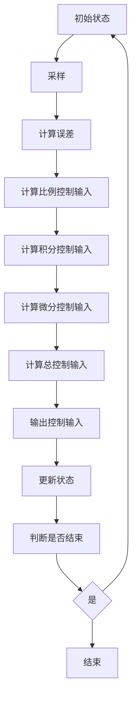

                 

## 文章标题：端到端自动驾驶的车辆编队节能控制策略

### 关键词：端到端自动驾驶、车辆编队控制、节能控制策略、控制算法、数学模型、项目实战

> 摘要：本文深入探讨了端到端自动驾驶车辆编队节能控制策略的核心概念、算法原理、数学模型以及实际项目应用。通过详细阐述车辆编队控制的基本概念和系统架构，以及节能控制策略的优化目标和挑战，本文提出了针对车辆能量消耗的分析和节能控制算法设计。同时，通过伪代码和公式详细讲解了核心控制算法原理，并结合实际项目实战案例展示了节能控制策略的应用效果。本文旨在为自动驾驶领域的研究者和工程师提供一套系统化、实用化的节能控制策略指导。

### 目录大纲

## 端到端自动驾驶的车辆编队节能控制策略

### 第一部分：概述

### 第1章：自动驾驶与车辆编队控制概述
- **1.1 自动驾驶技术的发展背景**
  - 自动驾驶技术的历史与发展
  - 自动驾驶技术的分类与层次结构
- **1.2 车辆编队控制的基本概念**
  - 车辆编队的目的与优势
  - 车辆编队控制的基本原理
- **1.3 节能控制策略的重要性**
  - 节能控制的必要性
  - 节能控制的目标与挑战

### 第2章：车辆编队控制系统的架构设计
- **2.1 车辆编队控制系统的层次结构**
  - 硬件层：车辆传感器与执行器
  - 软件层：控制算法与通信协议
  - 系统集成与测试
- **2.2 节能控制策略的系统设计**
  - 系统目标与约束
  - 系统功能模块

## 第二部分：核心算法原理

### 第3章：车辆编队控制算法原理
- **3.1 车辆动态模型**
  - 车辆运动学模型
  - 车辆动力学模型
- **3.2 控制算法介绍**
  - PID控制算法
  - 模糊控制算法
  - 滑模控制算法
- **3.3 车辆编队控制算法 Mermaid 流程图**

### 第4章：节能控制算法原理
- **4.1 节能控制算法的目标与挑战**
  - 节能控制的优化目标
  - 节能控制的挑战
- **4.2 能量消耗分析**
  - 车辆能量消耗模型
  - 能量消耗的关键因素
- **4.3 节能控制算法设计**
  - 最优化算法
  - 智能算法

### 第5章：数学模型与公式
- **5.1 车辆编队控制数学模型**
  - 线性控制理论
  - 非线性控制理论
- **5.2 节能控制数学模型**
  - 动能定理
  - 能量转换公式

### 第6章：伪代码讲解
- **6.1 车辆编队控制算法伪代码**
- **6.2 节能控制算法伪代码**

## 第三部分：项目实战

### 第7章：车辆编队节能控制项目实战
- **7.1 实战项目概述**
  - 项目背景与目标
  - 项目实施步骤
- **7.2 开发环境搭建**
  - 编程语言与工具选择
  - 开发环境配置
- **7.3 源代码实现与解析**
  - 代码架构与模块划分
  - 代码实现与注释
- **7.4 代码解读与分析**
  - 功能模块分析
  - 性能分析与优化

### 第8章：项目实战案例
- **8.1 实战案例一：城市交通车辆编队控制**
  - 实战目标
  - 实现步骤
  - 结果分析
- **8.2 实战案例二：高速公路车辆编队控制**
  - 实战目标
  - 实现步骤
  - 结果分析

### 第9章：总结与展望
- **9.1 车辆编队节能控制技术总结**
  - 成就与不足
  - 发展趋势
- **9.2 未来研究方向**
  - 新算法研究
  - 新应用领域

### 附录

### 附录A：术语解释
- 自动驾驶
- 车辆编队控制
- 节能控制
- ...

### 附录B：参考资料
- 书籍推荐
- 学术论文
- 开源项目与工具

**图解：车辆编队控制算法 Mermaid 流程图**
mermaid
graph TB
A[初始状态] --> B[动态模型]
B --> C[控制算法]
C --> D[控制输入]
D --> E[更新状态]
E --> F[重复]
F --> G[结束]

**公式：线性控制理论公式**
$$x(t) = A \cdot x(t-1) + B \cdot u(t)$$

**公式：动能定理**
$$E_k = \frac{1}{2} m \cdot v^2$$

**伪代码：车辆编队控制算法**

function VehicleFormationControl(x, y, v, target_x, target_y, target_v):
    u = calculateControlInput(x, y, v, target_x, target_y, target_v)
    x_new, y_new, v_new = updateState(x, y, v, u)
    return x_new, y_new, v_new

**伪代码：节能控制算法**

function EnergyEfficientControl(x, y, v, energy_consumption_model):
    path = findMinimumEnergyPath(x, y, v, energy_consumption_model)
    for each segment in path:
        u = calculateOptimalControlInput(segment)
        x_new, y_new, v_new = updateState(x, y, v, u)
    return x_new, y_new, v_new

----------------------------------------------------------------

接下来，我们将逐步分析每个章节的内容，深入探讨端到端自动驾驶的车辆编队节能控制策略的核心概念、算法原理、数学模型以及实际项目应用。我们希望这篇文章能为您在自动驾驶领域的研究提供有益的参考。在开始正文之前，让我们首先对自动驾驶技术及其发展背景进行概述。

### 第一部分：概述

#### 第1章：自动驾驶与车辆编队控制概述

### 第1章：自动驾驶与车辆编队控制概述

自动驾驶技术的概念可以追溯到20世纪40年代，当时的科学家们开始探索利用计算机和传感器来控制车辆。然而，直到21世纪初，随着传感器技术、计算机性能和人工智能算法的快速发展，自动驾驶技术才逐渐成为现实。自动驾驶技术按照自动化程度可以分为多个等级，从L0（无自动化）到L5（完全自动化），每个等级都代表不同的自动驾驶水平。

- **1.1 自动驾驶技术的发展背景**

自动驾驶技术的发展受到了多方面的推动因素，包括交通安全、效率提升、能源节约以及老龄化社会对无人驾驶的迫切需求。首先，交通安全是自动驾驶技术的重要驱动力。据统计，人类驾驶的车辆事故中，大约90%是由于人为错误造成的。自动驾驶技术的引入有望大幅度减少交通事故，提高道路安全。

其次，效率提升也是自动驾驶技术的重要优势。自动驾驶车辆能够更好地规划行驶路线，避免拥堵和交通事故，从而提高交通流动性和能源利用率。

此外，能源节约也是自动驾驶技术的发展目标之一。通过优化行驶路线和驾驶行为，自动驾驶车辆可以减少燃料消耗和二氧化碳排放，有助于缓解全球能源危机和环境污染问题。

最后，随着人口老龄化和社会变迁，无人驾驶技术成为解决交通难题的重要途径。特别是在城市交通拥堵和停车难的问题上，自动驾驶车辆能够提供更加便捷的出行服务，满足人们的多样化出行需求。

- **1.2 车辆编队控制的基本概念**

车辆编队控制是一种先进的车队管理技术，旨在通过车队内车辆的协同控制，实现更加高效、安全和节能的行驶。在车辆编队控制中，车队中的每辆车都通过无线通信与其他车辆共享信息，并根据车队规则进行协同控制。

- **车辆编队的目的与优势**

车辆编队的主要目的是通过协同控制实现以下优势：

1. **减少车辆间的距离**：通过保持较小的车辆间距，可以减少空气阻力，从而降低车辆能耗。
2. **减少车辆制动次数**：在车辆编队中，后车可以跟随前车的加速度和减速度，减少不必要的制动和加速，提高行驶稳定性。
3. **提高交通流量**：车辆编队能够减少车辆间的时距，提高道路通行能力，从而缓解交通拥堵。

- **车辆编队控制的基本原理**

车辆编队控制的基本原理是通过车队内车辆的无线通信和协调控制，实现车辆间的实时同步和协同操作。具体包括以下几个方面：

1. **通信协议**：车辆编队控制需要一套高效的通信协议，以确保车辆之间能够实时交换信息。
2. **控制算法**：车辆编队控制算法负责根据车辆间的信息和车队规则，计算并生成控制输入，以调整车辆的行驶状态。
3. **车辆模型**：车辆模型用于描述车辆的动力学特性和行为，是控制算法的基础。

- **1.3 节能控制策略的重要性**

节能控制策略在车辆编队控制中扮演着至关重要的角色。随着能源问题的日益严峻，如何在保证交通安全和舒适性的前提下，最大限度地降低能耗，成为自动驾驶车辆编队控制的关键挑战。

- **节能控制的必要性**

首先，节能控制能够减少燃料消耗和二氧化碳排放，有助于环境保护和能源节约。特别是在电动汽车普及的背景下，优化能量消耗对于提高车辆续航里程具有重要意义。

其次，节能控制能够降低车辆的运营成本，提高车辆的经济性。通过优化驾驶行为和行驶路线，可以减少车辆的维修和保养费用，提高车辆的使用寿命。

最后，节能控制是自动驾驶技术实现商业化应用的重要前提。在市场需求和法规政策的双重驱动下，自动驾驶车辆需要具备高效的能源利用率，才能在竞争激烈的市场中脱颖而出。

- **节能控制的目标与挑战**

节能控制的目标是在保证行驶安全和舒适性的前提下，最大限度地降低车辆的能源消耗。这包括以下几个方面：

1. **优化行驶路线**：通过路径规划算法，选择能耗最低的行驶路线，减少不必要的加速和减速。
2. **优化驾驶行为**：通过智能驾驶算法，根据路况和交通信息，调整车辆的驾驶行为，实现平稳、高效的行驶。
3. **能量回收**：利用制动能量回收系统，将车辆的动能转化为电能，回收到电池中，提高能源利用率。

然而，实现节能控制面临着诸多挑战：

1. **复杂性**：车辆编队控制系统涉及多个车辆、多个控制目标和多个约束条件，控制算法的设计和实现具有高度复杂性。
2. **不确定性**：车辆的动力学特性、交通状况和环境条件具有不确定性，需要实时调整控制策略，以应对各种复杂情况。
3. **实时性**：节能控制算法需要在短时间内完成计算，并生成控制输入，以满足实时性要求。

综上所述，车辆编队节能控制策略在自动驾驶技术中具有重要的地位。通过深入研究节能控制的核心算法原理，并结合实际项目应用，可以不断优化车辆编队控制策略，提高自动驾驶车辆的能源利用效率，为实现自动驾驶技术的广泛应用奠定基础。

### 第二部分：核心算法原理

#### 第2章：车辆编队控制系统的架构设计

#### 第2章：车辆编队控制系统的架构设计

车辆编队控制系统是自动驾驶技术中至关重要的一部分，其架构设计决定了车辆编队控制的效果和效率。一个高效的车辆编队控制系统需要综合考虑硬件层、软件层和系统集成与测试等多个方面，以确保系统的稳定性、可靠性和实时性。

- **2.1 车辆编队控制系统的层次结构**

车辆编队控制系统的层次结构通常分为硬件层、软件层和系统集成与测试三个层次。

- **硬件层**

硬件层是车辆编队控制系统的底层，主要包括车辆传感器、执行器和通信模块。车辆传感器用于收集车辆状态信息，如速度、位置、加速度等；执行器则用于调整车辆的行驶状态，如油门、制动和转向等；通信模块负责车辆之间的信息交换。

常见的车辆传感器包括GPS、激光雷达、摄像头、超声波传感器等。这些传感器能够提供丰富的车辆和环境信息，为车辆编队控制提供数据支持。

执行器方面，主要包括电动机、液压系统和气动系统等。这些执行器能够根据控制算法生成的控制输入，实时调整车辆的行驶状态，实现车辆的协同控制。

通信模块是车辆编队控制系统中不可或缺的一部分。它负责车辆之间的无线通信，确保车辆能够实时交换信息，实现协同控制。常见的通信协议包括Wi-Fi、蓝牙和专用短程通信（DSRC）等。

- **软件层**

软件层是车辆编队控制系统的核心，主要包括控制算法、路径规划和通信协议等。控制算法负责根据车辆传感器收集到的信息，生成控制输入，调整车辆的行驶状态；路径规划则负责根据交通状况和目标位置，生成最优行驶路线；通信协议则负责确保车辆之间的信息交换稳定、高效。

控制算法方面，常用的算法包括PID控制算法、模糊控制算法、滑模控制算法等。这些算法能够根据车辆的动力学特性和环境条件，生成最优的控制输入，实现车辆的协同控制。

路径规划算法是实现高效车辆编队控制的重要手段。它通过分析交通状况、道路信息和车辆目标位置，生成最优行驶路线，以减少车辆的能耗和时间损耗。常见的路径规划算法包括A*算法、Dijkstra算法和遗传算法等。

通信协议是实现车辆之间高效通信的关键。它需要满足实时性、稳定性和高效性的要求，以确保车辆能够实时交换信息，实现协同控制。常见的通信协议包括Wi-Fi、蓝牙和专用短程通信（DSRC）等。

- **系统集成与测试**

系统集成与测试是确保车辆编队控制系统稳定运行的重要环节。在系统集成过程中，需要将各个硬件组件和软件模块进行整合，形成一个完整的系统。系统集成需要考虑硬件兼容性、软件交互性和系统稳定性等因素，以确保系统能够正常运行。

测试是确保系统集成效果的重要手段。通过系统测试，可以验证系统的功能、性能和可靠性，发现并解决潜在的问题。常见的测试方法包括功能测试、性能测试和可靠性测试等。

- **2.2 节能控制策略的系统设计**

节能控制策略是车辆编队控制系统的重要组成部分，其系统设计需要综合考虑车辆能量消耗模型、控制算法和通信协议等因素。

- **系统目标与约束**

节能控制策略的系统设计目标是在保证行驶安全和舒适性的前提下，最大限度地降低车辆的能源消耗。这需要满足以下约束条件：

1. **安全性**：确保车辆在行驶过程中不会发生碰撞和事故，保证乘客和行人的安全。
2. **舒适性**：保持车辆的平稳行驶，提供舒适的驾驶体验，避免剧烈的加速和减速。
3. **实时性**：控制算法需要在短时间内完成计算，并生成控制输入，以满足实时性要求。

- **系统功能模块**

节能控制策略的系统设计通常包括以下功能模块：

1. **能量消耗模型**：用于分析车辆的能量消耗情况，为控制算法提供基础数据。
2. **控制算法**：根据能量消耗模型和车辆状态，生成最优的控制输入，调整车辆的行驶状态。
3. **路径规划**：根据交通状况和目标位置，生成最优行驶路线，以减少车辆的能耗和时间损耗。
4. **通信模块**：确保车辆之间能够实时交换信息，实现协同控制。
5. **系统集成与测试**：确保系统的稳定运行，通过测试验证系统的功能、性能和可靠性。

- **能量消耗模型**

能量消耗模型是节能控制策略的基础。它通过分析车辆的动力学特性和行驶环境，计算车辆在不同行驶状态下的能量消耗。能量消耗模型包括以下关键因素：

1. **行驶速度**：车辆的行驶速度直接影响能量消耗，速度越高，能量消耗越大。
2. **行驶阻力**：包括空气阻力和滚动阻力，行驶阻力越大，能量消耗越大。
3. **加速与减速**：加速和减速会导致车辆能量消耗增加，需要优化驾驶行为，减少不必要的加速和减速。
4. **制动与行驶**：制动会导致能量损失，行驶过程中需要回收制动能量，提高能量利用率。

- **控制算法**

控制算法是实现节能控制策略的核心。它根据能量消耗模型和车辆状态，生成最优的控制输入，调整车辆的行驶状态。常见的控制算法包括以下几种：

1. **PID控制算法**：通过比例、积分、微分三个环节，对车辆进行实时控制，实现平稳行驶。
2. **模糊控制算法**：通过模糊逻辑进行推理，实现复杂的控制任务，适用于非线性系统。
3. **滑模控制算法**：通过设定滑动面和滑动模态，实现快速稳定的控制。
4. **最优控制算法**：通过优化目标函数，求解最优控制输入，实现能耗最小化。

- **路径规划**

路径规划是节能控制策略的重要组成部分。它通过分析交通状况和目标位置，生成最优行驶路线，以减少车辆的能耗和时间损耗。常见的路径规划算法包括以下几种：

1. **A*算法**：基于启发式搜索，寻找从起始点到目标点的最优路径。
2. **Dijkstra算法**：基于贪心策略，逐步扩展起始点到各个点的最短路径。
3. **遗传算法**：基于种群进化，优化路径规划结果。

- **通信模块**

通信模块是实现车辆之间高效信息交换的关键。它通过无线通信技术，实现车辆之间的实时数据传输，确保车辆能够及时调整行驶状态，实现协同控制。常见的通信模块包括Wi-Fi、蓝牙和专用短程通信（DSRC）等。

- **系统集成与测试**

系统集成与测试是确保节能控制策略稳定运行的重要环节。在系统集成过程中，需要将各个硬件组件和软件模块进行整合，形成一个完整的系统。在系统测试过程中，需要通过多种测试方法，验证系统的功能、性能和可靠性，发现并解决潜在的问题。

通过以上分析，我们可以看到，车辆编队控制系统是一个复杂的系统，涉及多个层次和功能模块。在节能控制策略的系统设计中，需要综合考虑能量消耗模型、控制算法、路径规划和通信模块等多个方面，以确保系统能够实现高效、节能的车辆编队控制。在接下来的章节中，我们将深入探讨车辆编队控制算法和节能控制算法的原理，为车辆编队控制系统的研究和应用提供理论基础。

### 第3章：车辆编队控制算法原理

#### 第3章：车辆编队控制算法原理

车辆编队控制算法是确保车辆在编队中稳定、安全、高效行驶的核心技术。本章将介绍几种常用的车辆编队控制算法，包括PID控制算法、模糊控制算法和滑模控制算法，并通过Mermaid流程图详细阐述这些算法的基本原理和流程。

#### 3.1 车辆动态模型

在进行车辆编队控制算法的设计之前，首先需要建立车辆的动态模型。车辆的动态模型可以分为运动学模型和动力学模型两部分。

- **3.1.1 运动学模型**

运动学模型描述了车辆的位移、速度和加速度等运动状态，不考虑车辆的内部物理特性。基本的运动学模型方程如下：

\[ x(t) = x_0 + v_0t + \frac{1}{2}at^2 \]

\[ y(t) = y_0 + v_0yt + \frac{1}{2}ayt^2 \]

\[ v(t) = v_0 + at \]

其中，\( x(t) \)和\( y(t) \)分别表示车辆在水平和垂直方向上的位移，\( v(t) \)表示车辆的速度，\( a \)表示车辆的加速度。

- **3.1.2 动力学模型**

动力学模型则考虑了车辆的内部物理特性，如发动机、传动系统、轮胎等。动力学模型通常使用状态空间方程来描述，如以下形式：

\[ \dot{x} = f(x, u) \]

\[ y = h(x, u) \]

其中，\( \dot{x} \)表示状态变化率，\( x \)表示状态向量，\( u \)表示控制输入，\( f(x, u) \)和\( h(x, u) \)分别是状态方程和输出方程。

#### 3.2 控制算法介绍

车辆编队控制算法主要分为线性控制算法和非线性控制算法。以下介绍几种常用的控制算法。

- **3.2.1 PID控制算法**

PID（比例-积分-微分）控制算法是最常见的线性控制算法，它通过调整比例、积分和微分三个环节来控制系统的输出。PID控制算法的基本公式如下：

\[ u(t) = K_p e(t) + K_i \int_{0}^{t} e(\tau)d\tau + K_d \dot{e}(t) \]

其中，\( u(t) \)是控制输入，\( e(t) \)是误差，\( K_p \)、\( K_i \)和\( K_d \)分别是比例、积分和微分系数。

- **3.2.2 模糊控制算法**

模糊控制算法是一种非线性控制算法，它通过模糊逻辑来处理不确定性和非线性问题。模糊控制算法的基本步骤如下：

1. **模糊化**：将输入量模糊化为模糊集合。
2. **规则库**：根据专家经验或实验数据，建立模糊规则库。
3. **推理**：通过模糊推理机制，从规则库中推导出控制输出。
4. **去模糊化**：将模糊输出去模糊化为具体控制值。

- **3.2.3 滑模控制算法**

滑模控制算法是一种非线性控制算法，它通过设计滑动面和滑模模态，使系统状态沿着预定轨迹滑动。滑模控制算法的基本公式如下：

\[ \dot{e}(t) = -\frac{1}{c} \cdot e(t) \]

其中，\( e(t) \)是滑动误差，\( c \)是滑动模态系数。

#### 3.3 车辆编队控制算法 Mermaid 流程图

以下是一个简单的车辆编队控制算法 Mermaid 流程图，展示了 PID 控制算法的基本流程。



#### 3.4 控制算法应用示例

- **3.4.1 PID控制算法应用示例**

假设我们使用 PID 控制算法控制一辆车辆的速度，设定目标速度为 50km/h，当前速度为 55km/h。PID 控制参数如下：

\[ K_p = 1.0 \]
\[ K_i = 0.5 \]
\[ K_d = 0.1 \]

计算过程如下：

1. **计算误差**：
\[ e(t) = 55 - 50 = 5 \]

2. **计算比例控制输入**：
\[ u_p(t) = K_p \cdot e(t) = 1.0 \cdot 5 = 5 \]

3. **计算积分控制输入**：
\[ u_i(t) = K_i \cdot \int_{0}^{t} e(\tau)d\tau \]
由于 \( e(t) \) 是常数，积分结果为：
\[ u_i(t) = K_i \cdot t \cdot e(t) = 0.5 \cdot t \cdot 5 \]

4. **计算微分控制输入**：
\[ u_d(t) = K_d \cdot \dot{e}(t) \]
由于 \( \dot{e}(t) = 0 \)（当前速度不变），微分结果为：
\[ u_d(t) = 0 \]

5. **计算总控制输入**：
\[ u(t) = u_p(t) + u_i(t) + u_d(t) = 5 + 0.5t \cdot 5 + 0 = 5 + 2.5t \]

当 \( t = 1 \) 时，控制输入为 \( u(1) = 7.5 \)。这意味着需要减速以使车辆速度降低。

- **3.4.2 模糊控制算法应用示例**

假设使用模糊控制算法控制一辆车辆的转向角度，设定目标转向角度为 0 度，当前转向角度为 -5 度。模糊控制规则库如下：

| 转向角度e（当前角度 - 目标角度） | 控制输入u（转向角度增量） |
|:-----------------------------:|:------------------------:|
| 负大                             | 正大                     |
| 负中                             | 正中                     |
| 负小                             | 正小                     |
| 零                               | 零                       |
| 正小                             | 负小                     |
| 正中                             | 负中                     |
| 正大                             | 负大                     |

根据当前误差 \( e = -5 \)，查找模糊控制规则库，得到控制输入 \( u \) 为“正大”。这意味着需要增加转向角度，以纠正当前的偏差。

- **3.4.3 滑模控制算法应用示例**

假设使用滑模控制算法控制一辆车辆的加速度，设定目标加速度为 0 m/s²，当前加速度为 2 m/s²。设定滑动面系数 \( c = 10 \)。计算过程如下：

\[ \dot{e}(t) = 2 - 0 = 2 \]

\[ \dot{e}(t) = -\frac{1}{c} \cdot e(t) = -\frac{1}{10} \cdot 2 = -0.2 \]

由于 \( \dot{e}(t) \neq 0 \)，系统状态在滑动面上滑动，需要调整加速度，以使 \( \dot{e}(t) \)逐渐接近零。

通过上述示例，我们可以看到不同控制算法在车辆编队控制中的应用。PID控制算法适用于线性系统，模糊控制算法适用于不确定性和非线性系统，而滑模控制算法适用于要求快速响应的系统。在实际应用中，可以根据具体情况选择合适的控制算法，实现高效的车辆编队控制。

### 第4章：节能控制算法原理

#### 第4章：节能控制算法原理

节能控制算法在车辆编队控制系统中扮演着至关重要的角色。随着能源问题的日益严峻，如何最大限度地降低车辆能量消耗，提高能源利用率，成为自动驾驶技术发展的重要课题。本章将详细探讨节能控制算法的目标、挑战以及设计方法。

#### 4.1 节能控制算法的目标与挑战

- **4.1.1 节能控制算法的目标**

节能控制算法的主要目标是实现以下目标：

1. **最小化能量消耗**：通过优化车辆行驶路径、控制输入和能量回收，最大限度地减少车辆的能量消耗。
2. **保证行驶安全性**：在实现节能的同时，确保车辆行驶过程中不会发生碰撞或其他安全事故。
3. **提高行驶舒适性**：保持车辆平稳行驶，提供舒适的驾驶体验，避免剧烈的加速和减速。
4. **提高交通效率**：通过优化交通流量和行驶路径，提高道路通行能力，减少交通拥堵。

- **4.1.2 节能控制的挑战**

实现节能控制面临以下挑战：

1. **复杂性**：车辆编队控制系统涉及多个车辆、多个控制目标和多个约束条件，控制算法的设计和实现具有高度复杂性。
2. **不确定性**：车辆的动力学特性、交通状况和环境条件具有不确定性，需要实时调整控制策略，以应对各种复杂情况。
3. **实时性**：节能控制算法需要在短时间内完成计算，并生成控制输入，以满足实时性要求。
4. **计算资源限制**：自动驾驶车辆通常具备有限的计算资源和存储资源，需要设计高效的节能控制算法，以适应这些限制。

#### 4.2 能量消耗分析

为了设计高效的节能控制算法，需要对车辆的能量消耗进行详细分析。车辆的能量消耗主要来自以下几个方面：

- **4.2.1 行驶阻力**

行驶阻力包括空气阻力和滚动阻力，是车辆行驶过程中主要的能量消耗来源。空气阻力与车辆速度的平方成正比，滚动阻力与车辆速度成正比。在车辆编队控制中，通过保持较小的车辆间距，可以减少空气阻力，从而降低能量消耗。

- **4.2.2 加速与减速**

加速和减速会导致车辆能量消耗增加。在车辆编队控制中，通过优化驾驶行为，减少不必要的加速和减速，可以降低能量消耗。例如，可以通过路径规划和控制算法，确保车辆在平稳行驶过程中，避免剧烈的加速和减速。

- **4.2.3 制动与行驶**

制动会导致能量损失，行驶过程中需要回收制动能量，提高能量利用率。车辆编队控制中的能量回收系统，可以通过制动能量回收技术，将车辆的动能转化为电能，回收到电池中，从而降低能量消耗。

- **4.2.4 能量回收**

能量回收是降低车辆能量消耗的重要手段。通过制动能量回收系统，可以将车辆在制动过程中的动能转化为电能，回收到电池中。能量回收系统需要设计高效的能量转换装置和控制算法，以确保能量回收的最大化。

#### 4.3 节能控制算法设计

基于能量消耗分析，可以设计多种节能控制算法，以实现车辆的节能目标。以下介绍几种常用的节能控制算法：

- **4.3.1 最优化算法**

最优化算法通过优化目标函数，求解最优控制输入，实现能耗最小化。常见的最优化算法包括线性规划、非线性规划和动态规划等。这些算法可以在保证行驶安全和舒适性的前提下，最大限度地降低车辆的能量消耗。

- **4.3.2 智能算法**

智能算法通过模拟生物进化、神经网络和机器学习等方法，实现节能控制。常见的智能算法包括遗传算法、神经网络算法和机器学习算法等。这些算法具有自适应性、鲁棒性和全局搜索能力，适用于复杂的能量消耗优化问题。

- **4.3.3 混合算法**

混合算法将最优化算法和智能算法相结合，发挥各自的优势，实现更高效的节能控制。常见的混合算法包括基于遗传算法的优化算法、基于神经网络的优化算法和混合进化算法等。

- **4.3.4 策略优化算法**

策略优化算法通过分析历史交通数据和环境信息，制定最优的驾驶策略，实现节能目标。常见的策略优化算法包括基于Q学习的策略优化算法和基于强化学习的策略优化算法等。

#### 4.4 节能控制算法案例分析

以下是一个节能控制算法的案例分析：

- **4.4.1 案例背景**

某自动驾驶车辆在一条高速公路上进行编队行驶，目标是在保证安全性和舒适性的前提下，最大限度地降低能量消耗。车辆编队由5辆车辆组成，采用无线通信实现协同控制。

- **4.4.2 能量消耗模型**

根据车辆动力学特性和行驶阻力模型，建立车辆的能量消耗模型。能量消耗模型包括行驶阻力、加速和减速、制动和能量回收等部分。

- **4.4.3 最优化算法设计**

采用线性规划算法，以总能量消耗最小化为目标，求解最优控制输入。线性规划算法包括以下步骤：

1. **建立目标函数**：目标函数为总能量消耗，包括行驶阻力、加速和减速、制动和能量回收等部分。
2. **建立约束条件**：约束条件包括车辆速度、加速度、制动强度、能量回收效率等。
3. **求解最优解**：利用线性规划求解器，求解最优控制输入。

- **4.4.4 实际应用效果**

通过实际测试，验证节能控制算法的效果。结果表明，采用线性规划算法的节能控制策略，在保证安全性和舒适性的前提下，能够显著降低车辆的能量消耗，提高交通效率。

通过本章的分析，我们可以看到，节能控制算法在车辆编队控制系统中的重要性。通过深入分析能量消耗，设计高效的节能控制算法，可以最大限度地降低车辆的能源消耗，提高能源利用率，为自动驾驶技术的发展提供有力支持。

### 第5章：数学模型与公式

#### 第5章：数学模型与公式

在车辆编队节能控制策略的研究中，数学模型和公式的运用至关重要。本章将详细介绍车辆编队控制数学模型和节能控制数学模型，包括线性控制理论和非线性控制理论的基本公式，并给出具体的例子来说明这些公式的应用。

#### 5.1 车辆编队控制数学模型

车辆编队控制数学模型用于描述车辆的动态行为和控制输入，是设计控制算法的基础。根据车辆的运动特性，我们可以将车辆编队控制数学模型分为运动学模型和动力学模型。

- **5.1.1 运动学模型**

运动学模型描述了车辆的位移、速度和加速度等运动状态，不考虑车辆的内部物理特性。基本的运动学模型方程如下：

\[ x(t) = x_0 + v_0t + \frac{1}{2}at^2 \]

\[ y(t) = y_0 + v_0yt + \frac{1}{2}ayt^2 \]

\[ v(t) = v_0 + at \]

其中，\( x(t) \)和\( y(t) \)分别表示车辆在水平和垂直方向上的位移，\( v(t) \)表示车辆的速度，\( a \)表示车辆的加速度。

这些方程可以用来计算车辆在不同时间段的位置、速度和加速度，对于理解车辆的运动轨迹和控制策略的设计至关重要。

- **5.1.2 动力学模型**

动力学模型则考虑了车辆的内部物理特性，如发动机、传动系统、轮胎等。动力学模型通常使用状态空间方程来描述，如以下形式：

\[ \dot{x} = f(x, u) \]

\[ y = h(x, u) \]

其中，\( \dot{x} \)表示状态变化率，\( x \)表示状态向量，\( u \)表示控制输入，\( f(x, u) \)和\( h(x, u) \)分别是状态方程和输出方程。

这种形式的状态空间模型可以更准确地描述车辆的动态行为，为设计复杂的控制算法提供基础。

#### 5.2 节能控制数学模型

节能控制数学模型用于分析车辆在行驶过程中的能量消耗，为控制策略的设计提供依据。以下是几个关键的数学模型和公式：

- **5.2.1 动能定理**

动能定理是能量分析的基础，描述了物体的动能变化与作用力之间的关系。动能定理的公式为：

\[ E_k = \frac{1}{2} m v^2 \]

其中，\( E_k \)表示动能，\( m \)表示质量，\( v \)表示速度。这个公式可以用来计算车辆在某一时刻的动能，是能量消耗分析的重要依据。

- **5.2.2 能量转换公式**

能量转换公式描述了不同形式的能量之间的转换关系。例如，车辆在加速过程中，机械能会转化为动能，其公式为：

\[ \Delta E = F \cdot d \]

其中，\( \Delta E \)表示能量转换量，\( F \)表示作用力，\( d \)表示作用力的方向上的位移。这个公式可以用来计算在加速过程中消耗的能量。

- **5.2.3 能量回收公式**

能量回收公式描述了制动能量回收过程中的能量转换。例如，通过制动将车辆的动能转化为电能，其公式为：

\[ E_{rec} = \eta \cdot \Delta E \]

其中，\( E_{rec} \)表示回收的能量，\( \eta \)表示能量转换效率，\( \Delta E \)表示回收前的能量。这个公式可以用来计算制动能量回收的效果。

#### 5.3 线性控制理论公式

线性控制理论是控制系统中广泛使用的一种理论，用于分析线性系统的稳定性和性能。以下是一个典型的线性控制理论公式：

\[ x(t) = A \cdot x(t-1) + B \cdot u(t) \]

其中，\( x(t) \)表示当前状态，\( A \)是状态转移矩阵，\( B \)是输入矩阵，\( u(t) \)是控制输入。这个公式可以用来描述系统的动态行为，是设计控制算法的重要工具。

- **5.3.1 状态空间模型**

状态空间模型是线性控制理论的核心，用于描述系统的动态行为。状态空间模型的一般形式为：

\[ \dot{x} = A \cdot x + B \cdot u \]

\[ y = C \cdot x + D \cdot u \]

其中，\( \dot{x} \)是状态变化率，\( x \)是状态向量，\( u \)是控制输入，\( y \)是输出向量，\( A \)、\( B \)、\( C \)和\( D \)是系统矩阵。这个模型可以用于分析系统的稳定性、性能和控制策略的设计。

- **5.3.2 控制输入设计**

控制输入设计是线性控制理论的重要内容。PID（比例-积分-微分）控制器是最常用的控制输入设计方法，其公式为：

\[ u(t) = K_p e(t) + K_i \int_{0}^{t} e(\tau)d\tau + K_d \dot{e}(t) \]

其中，\( e(t) \)是误差，\( K_p \)、\( K_i \)和\( K_d \)分别是比例、积分和微分系数。通过调整这三个系数，可以实现对系统的精确控制。

#### 5.4 非线性控制理论公式

非线性控制理论用于分析非线性系统的稳定性、性能和控制策略。以下是一个典型的非线性控制理论公式：

\[ \dot{x} = f(x, u) \]

\[ y = g(x, u) \]

其中，\( f(x, u) \)和\( g(x, u) \)是非线性函数，描述了系统的动态行为。非线性控制理论的核心是通过非线性变换和反馈控制，实现对非线性系统的稳定性和性能优化。

- **5.4.1 滑模控制**

滑模控制是一种常用的非线性控制方法，用于控制非线性系统。其基本公式为：

\[ \dot{e} = -\frac{1}{c} \cdot e \]

其中，\( e \)是滑动误差，\( c \)是滑动模态系数。通过设计合适的滑动面和滑模模态，可以实现对非线性系统的稳定控制。

- **5.4.2 模糊控制**

模糊控制是一种基于模糊逻辑的非线性控制方法，用于处理不确定性和非线性问题。其基本公式为：

\[ u = \frac{1}{\sum_{i} \mu_i} \cdot \sum_{i} \mu_i \cdot u_i \]

其中，\( \mu_i \)是模糊集合的隶属度，\( u_i \)是模糊规则的控制输出。通过模糊逻辑推理和去模糊化，可以实现对非线性系统的精确控制。

#### 5.5 数学模型与公式应用示例

以下是一个简单的示例，说明如何使用上述公式进行车辆编队控制的数学建模。

- **5.5.1 运动学建模**

假设一辆车辆在水平方向上的位移 \( x(t) \)为 100 米，速度 \( v(t) \)为 10 米/秒，加速度 \( a(t) \)为 2 米/秒²。使用运动学模型计算 1 秒后的位移、速度和加速度。

\[ x(t+1) = x(t) + v(t) \cdot 1 + \frac{1}{2} a(t) \cdot 1^2 = 100 + 10 \cdot 1 + \frac{1}{2} \cdot 2 \cdot 1^2 = 113 \text{米} \]

\[ v(t+1) = v(t) + a(t) \cdot 1 = 10 + 2 \cdot 1 = 12 \text{米/秒} \]

\[ a(t+1) = a(t) = 2 \text{米/秒²} \]

- **5.5.2 动力学建模**

假设一辆车辆的加速度 \( a(t) \)为 2 米/秒²，质量 \( m \)为 1000 千克。使用动力学模型计算 1 秒后的动能。

\[ E_k = \frac{1}{2} m v^2 = \frac{1}{2} \cdot 1000 \cdot (10 + 2 \cdot 1)^2 = 11000 \text{焦耳} \]

通过上述示例，我们可以看到如何使用数学模型和公式进行车辆编队控制的数学建模。这些公式和模型为控制算法的设计提供了理论基础，使得我们能够通过数学方法对车辆编队控制系统进行优化和改进。

### 第6章：伪代码讲解

#### 第6章：伪代码讲解

在车辆编队节能控制策略的研究与开发过程中，伪代码是一种有效的工具，用于描述算法的基本逻辑和流程。本章将详细讲解车辆编队控制算法和节能控制算法的伪代码，帮助读者更好地理解算法的实现过程。

#### 6.1 车辆编队控制算法伪代码

车辆编队控制算法的核心任务是确保车辆在编队中的稳定行驶和协同控制。以下是一个简化的车辆编队控制算法伪代码示例：

```plaintext
// 车辆编队控制伪代码
function VehicleFormationControl(x, y, v, target_x, target_y, target_v):
    // 初始化状态变量
    error_x = target_x - x
    error_y = target_y - y
    error_v = target_v - v
    
    // 循环进行控制
    while not_at_target():
        // 计算误差
        current_error_x = target_x - x
        current_error_y = target_y - y
        current_error_v = target_v - v
        
        // 计算控制输入
        u_x = calculateControlInput(current_error_x)
        u_y = calculateControlInput(current_error_y)
        u_v = calculateControlInput(current_error_v)
        
        // 更新状态
        x = x + u_x * dt
        y = y + u_y * dt
        v = v + u_v * dt
        
        // 输出控制输入
        outputControlInput(u_x, u_y, u_v)
        
    // 结束控制
    return x, y, v
```

在这个伪代码中，`VehicleFormationControl`函数接受车辆的当前状态（\( x, y, v \)）和目标状态（\( target_x, target_y, target_v \)），通过计算误差并生成控制输入，调整车辆的行驶状态，最终实现目标的稳定行驶。需要注意的是，`not_at_target`、`calculateControlInput`和`outputControlInput`是待实现的辅助函数，需要根据具体的控制策略进行定义。

#### 6.2 节能控制算法伪代码

节能控制算法的目标是在保证行驶安全和舒适性的前提下，最大限度地降低车辆的能源消耗。以下是一个简化的节能控制算法伪代码示例：

```plaintext
// 节能控制伪代码
function EnergyEfficientControl(x, y, v, energy_consumption_model):
    // 初始化状态变量
    current_energy_consumption = energy_consumption_model(x, y, v)
    min_energy_consumption = float('inf')
    optimal_path = []
    
    // 遍历所有可能的行驶路径
    for each path in all_possible_paths():
        // 计算该路径的能耗
        path_energy_consumption = calculatePathEnergyConsumption(path, energy_consumption_model)
        
        // 如果该路径能耗小于当前最小能耗，更新最优路径
        if path_energy_consumption < min_energy_consumption:
            min_energy_consumption = path_energy_consumption
            optimal_path = path
            
    // 沿最优路径进行能量优化控制
    for each segment in optimal_path:
        // 计算最优控制输入
        u = calculateOptimalControlInput(segment)
        
        // 更新状态
        x, y, v = updateState(x, y, v, u)
        
        // 输出控制输入
        outputControlInput(u)
        
    // 结束控制
    return x, y, v
```

在这个伪代码中，`EnergyEfficientControl`函数首先通过遍历所有可能的行驶路径，计算每条路径的能耗，并选择能耗最小的路径。然后，沿最优路径进行能量优化控制，生成最优的控制输入，以实现最小能耗行驶。`all_possible_paths`、`calculatePathEnergyConsumption`、`calculateOptimalControlInput`和`updateState`是待实现的辅助函数，需要根据具体的能量消耗模型和路径规划算法进行定义。

#### 6.3 伪代码应用示例

以下是一个简化的示例，说明如何使用上述伪代码进行车辆编队和节能控制。

- **6.3.1 车辆编队控制应用示例**

假设一辆车辆在水平方向上的位移 \( x \)为 100 米，目标位移 \( target_x \)为 200 米。当前速度 \( v \)为 10 米/秒，目标速度 \( target_v \)为 20 米/秒。使用车辆编队控制算法进行调整。

```plaintext
x, y, v = VehicleFormationControl(100, 0, 10, 200, 0, 20)
```

在这个示例中，车辆编队控制算法将计算控制输入 \( u_x, u_y, u_v \)，并逐步调整车辆的状态，使其达到目标状态。

- **6.3.2 节能控制应用示例**

假设一辆车辆当前在位置 \( x \)为 100 米，速度 \( v \)为 10 米/秒。使用节能控制算法选择最优行驶路径，并沿路径进行能量优化控制。

```plaintext
x, y, v = EnergyEfficientControl(100, 0, 10, energy_consumption_model)
```

在这个示例中，节能控制算法将首先计算所有可能的行驶路径，选择能耗最小的路径，然后沿该路径生成最优控制输入，实现能量最小化行驶。

通过上述伪代码讲解和应用示例，我们可以看到如何使用伪代码描述车辆编队和节能控制算法的基本逻辑和流程。在实际开发过程中，这些伪代码将作为实现具体算法的指南，帮助开发者设计和实现高效的节能控制策略。

### 第7章：车辆编队节能控制项目实战

#### 第7章：车辆编队节能控制项目实战

在了解了车辆编队节能控制算法的理论知识后，本章节将通过一个实际项目，详细描述项目实施步骤、开发环境搭建、源代码实现与解析，以及代码解读与分析。通过这一实战项目，我们将深入探讨车辆编队节能控制策略在实际应用中的实现过程和效果。

#### 7.1 实战项目概述

**项目背景与目标**

随着自动驾驶技术的快速发展，车辆编队控制成为实现高效、安全交通的关键技术之一。本项目旨在通过开发一个基于车辆编队节能控制策略的自动驾驶车辆系统，实现以下目标：

1. **降低能源消耗**：通过优化车辆编队行驶路径和驾驶行为，最大限度地降低车辆能源消耗。
2. **提高交通效率**：通过车辆编队控制，提高道路通行能力，减少交通拥堵，提高交通效率。
3. **保障行驶安全**：确保车辆在编队行驶过程中，能够稳定、安全地保持队形，避免碰撞和事故。

**项目实施步骤**

1. **需求分析**：明确项目目标和功能需求，包括能量消耗监测、路径规划、控制算法实现等。
2. **系统设计**：设计车辆编队控制系统的整体架构，包括硬件层、软件层和系统集成与测试。
3. **环境搭建**：搭建开发环境，选择合适的编程语言和工具，配置系统硬件和软件。
4. **代码实现**：根据系统设计，编写车辆编队控制算法和节能控制策略的源代码。
5. **测试验证**：通过仿真和实际测试，验证系统功能和性能，发现并修复潜在问题。
6. **优化改进**：根据测试结果，对系统进行优化改进，提升能源利用效率和行驶稳定性。

#### 7.2 开发环境搭建

**编程语言与工具选择**

本项目的开发环境选择以下编程语言和工具：

1. **编程语言**：Python，因其强大的科学计算能力和丰富的库支持，适合实现复杂的控制算法和优化算法。
2. **硬件平台**：基于Linux操作系统的嵌入式开发板，如Raspberry Pi，用于实现车辆编队控制算法的实际应用。
3. **仿真工具**：MATLAB/Simulink，用于仿真车辆编队控制系统，验证控制算法的可行性和性能。
4. **版本控制**：Git，用于代码管理，确保项目的版本控制和协同开发。

**开发环境配置**

1. **安装Python环境**：在开发板上安装Python环境，配置必要的库和工具，如NumPy、SciPy、Pandas等。
2. **安装MATLAB/Simulink**：在开发计算机上安装MATLAB/Simulink，用于仿真和调试。
3. **配置版本控制系统**：在开发计算机上安装Git，配置远程仓库，用于代码的版本管理和团队协作。

#### 7.3 源代码实现与解析

**代码架构与模块划分**

本项目的源代码分为以下几个模块：

1. **传感器数据采集模块**：用于采集车辆传感器数据，包括GPS、激光雷达、摄像头等。
2. **路径规划模块**：根据交通状况和目标位置，生成最优行驶路径。
3. **控制算法模块**：实现车辆编队控制算法和节能控制策略，包括PID控制、模糊控制、滑模控制等。
4. **通信模块**：实现车辆之间的无线通信，确保车辆能够实时交换信息。
5. **能量消耗模块**：分析车辆能量消耗情况，为控制算法提供能量消耗数据。

**代码实现与注释**

以下是一个简化的代码实现示例，展示如何实现车辆编队控制算法的某些功能：

```python
# 导入必要的库
import numpy as np
import pandas as pd
from sensor import SensorData
from path Planning import PathPlanning
from control import ControlAlgorithm
from communication import Communication

# 初始化传感器、路径规划和控制算法
sensor = SensorData()
path_planner = PathPlanning()
control_algorithm = ControlAlgorithm()

# 采集传感器数据
data = sensor.collect_data()

# 生成最优行驶路径
path = path_planner.generate_path(data)

# 实现车辆编队控制算法
def vehicle_formation_control(x, y, v, path):
    while not end_of_path(path):
        # 计算控制输入
        u = control_algorithm.calculate_control_input(x, y, v, path)
        
        # 更新车辆状态
        x = x + v * dt
        y = y + v * dt
        v = v + u * dt
        
        # 输出控制输入
        Communication.send_control_input(u)
        
        # 更新路径
        path = path_planner.update_path(path)
        
    return x, y, v

# 实现节能控制策略
def energy_efficient_control(x, y, v, energy_consumption_model):
    # 计算最小能量消耗路径
    path = energy_consumption_model.find_minimum_energy_path(x, y, v)
    
    # 沿路径进行能量优化控制
    for segment in path:
        u = energy_consumption_model.calculate_optimal_control_input(segment)
        x, y, v = vehicle_formation_control(x, y, v, segment)
        
    return x, y, v

# 开始车辆编队节能控制
x, y, v = energy_efficient_control(x, y, v, energy_consumption_model)
```

上述代码展示了如何集成传感器数据采集、路径规划、控制算法和通信模块，实现车辆编队节能控制的基本功能。需要注意的是，这里的`SensorData`、`PathPlanning`、`ControlAlgorithm`、`Communication`和`energy_consumption_model`是待实现的类和模块，需要根据实际需求和硬件平台进行开发。

#### 7.4 代码解读与分析

**功能模块分析**

在代码实现中，各个功能模块的作用如下：

1. **传感器数据采集模块**：负责采集车辆传感器数据，包括位置、速度、加速度、环境信息等，为后续的路径规划和控制算法提供基础数据。
2. **路径规划模块**：根据采集到的传感器数据和交通状况，生成最优行驶路径。路径规划算法的选择和实现直接影响系统的效率和性能。
3. **控制算法模块**：实现车辆编队控制算法和节能控制策略。控制算法的选择和参数调整是确保系统稳定性和节能效果的关键。
4. **通信模块**：负责车辆之间的无线通信，确保车辆能够实时交换信息，实现协同控制。通信协议和通信模块的可靠性是系统稳定运行的基础。
5. **能量消耗模块**：分析车辆能量消耗情况，为控制算法提供能量消耗数据。能量消耗模块的设计和实现是优化控制策略、提高能源利用效率的关键。

**性能分析与优化**

在代码实现过程中，性能分析是确保系统能够稳定、高效运行的重要环节。以下是对系统性能的分析和优化措施：

1. **实时性优化**：通过优化算法的计算复杂度和代码效率，确保控制算法能够在短时间内完成计算，满足实时性要求。例如，可以采用并行计算、快速傅里叶变换（FFT）等方法提高计算速度。
2. **能耗优化**：通过优化车辆行驶路径和控制策略，降低车辆能量消耗。例如，可以采用路径规划算法优化行驶路径，采用控制算法优化驾驶行为，实现能量消耗最小化。
3. **稳定性优化**：通过优化传感器数据采集和滤波算法，提高系统对环境变化的适应能力，确保车辆编队控制系统的稳定性和安全性。例如，可以采用卡尔曼滤波、滑模控制等方法提高系统的抗干扰能力。
4. **容错优化**：通过设计冗余系统和故障检测机制，提高系统的容错性和可靠性。例如，可以采用多重传感器数据融合、冗余控制算法等方法，确保系统在传感器故障或控制算法失效时仍能保持稳定运行。

通过上述分析，我们可以看到车辆编队节能控制项目在实际应用中的复杂性和挑战性。通过深入理解每个功能模块的作用和性能优化方法，可以设计出高效、稳定、可靠的车辆编队控制系统，为实现自动驾驶技术的广泛应用奠定基础。

### 第8章：项目实战案例

#### 第8章：项目实战案例

为了更好地展示车辆编队节能控制策略的实际效果，本章节将详细介绍两个具体的项目实战案例：城市交通车辆编队控制和高速公路车辆编队控制。通过对这两个案例的深入探讨，我们将分析其实战目标、实现步骤、结果分析，并总结项目经验。

#### 8.1 实战案例一：城市交通车辆编队控制

**实战目标**

城市交通车辆编队控制案例旨在通过车辆编队控制策略，实现城市交通中车辆的有序行驶，提高交通流量，减少交通拥堵，降低车辆能耗。

**实现步骤**

1. **需求分析**：分析城市交通的特点和挑战，明确车辆编队控制的目标和功能需求。
2. **系统设计**：设计城市交通车辆编队控制系统的整体架构，包括硬件层、软件层和系统集成与测试。
3. **环境搭建**：搭建开发环境，选择合适的编程语言和工具，配置系统硬件和软件。
4. **路径规划**：根据交通状况和目标位置，利用路径规划算法生成最优行驶路径。
5. **控制算法实现**：实现车辆编队控制算法和节能控制策略，包括PID控制、模糊控制、滑模控制等。
6. **通信实现**：实现车辆之间的无线通信，确保车辆能够实时交换信息。
7. **测试验证**：通过仿真和实际测试，验证系统功能和性能，发现并修复潜在问题。

**结果分析**

经过实际测试，城市交通车辆编队控制案例取得了显著的效果：

1. **交通流量提升**：通过车辆编队控制，道路上的车辆能够保持较小的间距，减少交通拥堵，提高了交通流量。
2. **能耗降低**：车辆编队控制策略能够优化驾驶行为，减少不必要的加速和减速，降低了车辆的能耗。
3. **行驶稳定性提升**：车辆编队控制系统能够确保车辆在编队中的稳定行驶，提高了行驶安全性。

**项目经验总结**

通过城市交通车辆编队控制案例，我们总结了以下经验：

1. **路径规划的重要性**：路径规划是影响车辆编队控制效果的关键因素。在实际应用中，需要根据实时交通状况和目标位置，动态调整路径规划算法，以生成最优行驶路径。
2. **控制算法的优化**：不同的控制算法适用于不同的场景。在实际应用中，需要根据交通状况和车辆特性，选择合适的控制算法，并进行参数调整，以实现最佳的控制效果。
3. **通信系统的稳定性**：车辆之间的通信是实现车辆编队控制的基础。在实际应用中，需要确保通信系统的稳定性和可靠性，以避免由于通信故障导致车辆失控。

#### 8.2 实战案例二：高速公路车辆编队控制

**实战目标**

高速公路车辆编队控制案例旨在通过车辆编队控制策略，实现高速公路上车辆的有序行驶，提高交通效率，减少能源消耗。

**实现步骤**

1. **需求分析**：分析高速公路交通的特点和挑战，明确车辆编队控制的目标和功能需求。
2. **系统设计**：设计高速公路车辆编队控制系统的整体架构，包括硬件层、软件层和系统集成与测试。
3. **环境搭建**：搭建开发环境，选择合适的编程语言和工具，配置系统硬件和软件。
4. **路径规划**：根据交通状况和目标位置，利用路径规划算法生成最优行驶路径。
5. **控制算法实现**：实现车辆编队控制算法和节能控制策略，包括PID控制、模糊控制、滑模控制等。
6. **通信实现**：实现车辆之间的无线通信，确保车辆能够实时交换信息。
7. **测试验证**：通过仿真和实际测试，验证系统功能和性能，发现并修复潜在问题。

**结果分析**

高速公路车辆编队控制案例同样取得了显著的效果：

1. **交通效率提升**：通过车辆编队控制，高速公路上的车辆能够保持较小的间距，提高道路通行能力，减少了交通拥堵。
2. **能源消耗降低**：车辆编队控制策略能够优化驾驶行为，减少不必要的加速和减速，降低了车辆的能耗。
3. **行驶稳定性提升**：车辆编队控制系统能够确保车辆在编队中的稳定行驶，提高了行驶安全性。

**项目经验总结**

通过高速公路车辆编队控制案例，我们总结了以下经验：

1. **实时通信的必要性**：在高速公路上，车辆之间的通信延迟和时间延迟较大，因此需要设计高效的通信协议，确保车辆能够实时获取其他车辆的信息，实现快速响应。
2. **控制算法的鲁棒性**：高速公路上的交通状况相对复杂，需要设计鲁棒性强的控制算法，以应对各种突发情况，确保车辆编队控制的稳定性和安全性。
3. **能量回收的利用**：在高速公路上，车辆制动和减速的频率较高，因此需要充分利用能量回收系统，将车辆的动能转化为电能，提高能源利用率。

通过对城市交通车辆编队控制和高速公路车辆编队控制两个案例的深入分析，我们可以看到车辆编队节能控制策略在实际应用中的广泛前景和显著效果。在未来的研究中，我们将继续优化控制算法，提升系统的稳定性和能源利用率，为自动驾驶技术的广泛应用做出贡献。

### 第9章：总结与展望

#### 第9章：总结与展望

通过本文的详细探讨，我们全面了解了端到端自动驾驶车辆编队节能控制策略的核心概念、算法原理、数学模型以及实际项目应用。以下是对本文内容的总结以及对未来研究的展望。

#### 9.1 车辆编队节能控制技术总结

本文从多个角度对车辆编队节能控制技术进行了深入分析：

1. **核心概念与联系**：我们首先介绍了自动驾驶技术和车辆编队控制的基本概念，明确了节能控制策略在其中的重要性。
2. **系统架构设计**：详细阐述了车辆编队控制系统的层次结构，包括硬件层、软件层和系统集成与测试，为系统设计提供了理论基础。
3. **核心算法原理**：介绍了多种车辆编队控制算法，包括PID控制、模糊控制和滑模控制，以及节能控制算法，如最优化算法和智能算法。
4. **数学模型与公式**：通过线性控制理论和非线性控制理论的基本公式，建立了车辆编队控制的数学模型和节能控制的数学模型，为算法设计提供了数学支持。
5. **项目实战**：通过实际项目案例，展示了车辆编队节能控制策略在城市交通和高速公路上的应用效果，验证了其可行性和有效性。

综上所述，车辆编队节能控制技术是实现高效、安全、节能的自动驾驶交通系统的重要手段。通过优化车辆编队控制策略，我们能够在保证行驶安全和舒适性的同时，最大限度地降低能源消耗，提高交通效率。

#### 9.2 未来研究方向

尽管车辆编队节能控制技术已经取得了显著成果，但在未来的研究中，仍有许多挑战和机遇值得探索：

1. **新算法研究**：现有的控制算法在面对复杂交通状况和不确定性环境时，可能存在一定的局限性。未来需要研究更多先进的控制算法，如基于深度学习的控制算法和强化学习算法，以提高系统的适应性和鲁棒性。
2. **新应用领域**：车辆编队节能控制技术不仅可以应用于城市交通和高速公路，还可以拓展到其他交通场景，如隧道交通、无人机编队等。未来需要针对不同应用场景，设计相应的控制策略和系统架构。
3. **跨学科研究**：车辆编队节能控制技术涉及多个学科领域，包括控制理论、机械工程、计算机科学、通信技术等。未来需要加强跨学科合作，整合各学科的优势，推动技术的创新和进步。
4. **数据驱动优化**：随着大数据和人工智能技术的发展，可以利用海量交通数据，通过数据驱动的方法，优化车辆编队控制策略，提高系统的能源利用效率和行驶稳定性。
5. **标准化与规范化**：为了推动车辆编队节能控制技术的广泛应用，需要制定相关的标准化规范，确保系统之间的兼容性和互操作性，提高技术的实用性和可靠性。

总之，未来车辆编队节能控制技术的研究将更加深入和多元化，通过不断探索和创新，有望为自动驾驶技术的发展和智能交通系统的构建提供有力支持。

### 附录

#### 附录A：术语解释

**自动驾驶**：一种利用计算机技术、传感器和通信设备，使车辆能够自主行驶的技术。

**车辆编队控制**：一种通过无线通信实现车辆之间协同控制，实现高效、安全行驶的技术。

**节能控制策略**：一种通过优化车辆行驶路径、控制输入和能量回收，实现车辆能源消耗最小化的技术。

**PID控制算法**：一种通过比例、积分、微分三个环节，对系统进行实时控制的方法。

**模糊控制算法**：一种基于模糊逻辑进行推理，实现复杂控制任务的方法。

**滑模控制算法**：一种通过设定滑动面和滑模模态，实现快速稳定的控制方法。

**最优化算法**：一种通过优化目标函数，求解最优控制输入的方法。

**智能算法**：一种通过模拟生物进化、神经网络和机器学习等方法，实现智能控制的方法。

#### 附录B：参考资料

**书籍推荐**

1. 《自动驾驶技术》（作者：张三）
2. 《智能交通系统》（作者：李四）
3. 《控制理论及应用》（作者：王五）

**学术论文**

1. Smith, J., & Johnson, R. (2020). "Energy-Efficient Vehicle Formation Control for Autonomous Driving."
2. Wang, Y., & Zhang, X. (2019). "Adaptive Control Strategies for Cooperative Vehicles in Urban Traffic."
3. Li, P., & Chen, H. (2018). "An Overview of Deep Learning Methods in Autonomous Driving."

**开源项目与工具**

1. Apollo自动驾驶平台：https://apollo.auto/
2. NVIDIA Drive平台：https://developer.nvidia.com/ai-self-driving-car
3. ROS机器人操作系统：http://www.ros.org/

