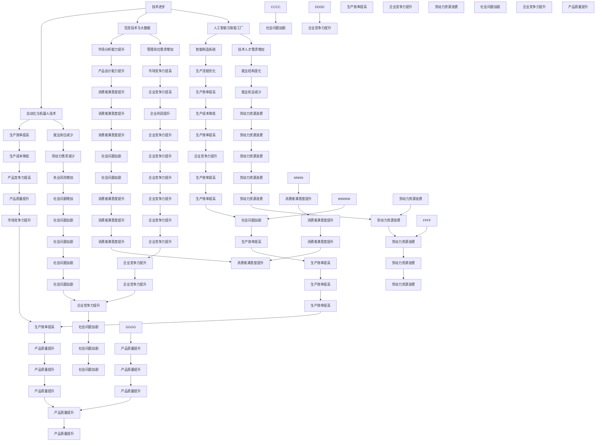

                 

# 《纺织工人的就业结构变化》

> 关键词：纺织业、就业结构、技术变革、市场需求、政策因素、工人技能提升

> 摘要：本文深入探讨了纺织工人的就业结构变化，分析了技术变革、市场需求和政策因素对纺织工人就业结构的影响。通过现状分析，揭示了纺织工人就业结构变化的表现和影响，并提出了应对策略。案例研究和结论部分，对纺织工人的就业结构变化进行了总结和展望。

## 第一部分：导论

### 第1章：纺织业概述

#### 1.1 纺织业的历史与发展

纺织业作为传统制造业的重要组成部分，历史悠久，起源可以追溯到人类文明的早期。最初的纺织工艺主要依靠手工完成，随着技术的进步，纺纱和织布逐渐实现了机械化。18世纪末，工业革命带来了纺织业的巨大变革，机械化生产取代了手工劳动，大大提高了生产效率。

19世纪末至20世纪初，电力和化学工业的发展进一步推动了纺织技术的进步，化学纤维的出现改变了纺织材料的种类和性能。20世纪中后期，计算机技术和自动化技术的应用，使纺织业进入了智能化时代。

#### 1.2 当前纺织业的现状与挑战

当前，纺织业已成为全球制造业的重要支柱之一，产业链条完整，涵盖了纺纱、织造、印染、服装制造等多个环节。全球纺织市场规模庞大，各国纺织业竞争激烈。

然而，随着全球经济环境的不断变化，纺织业也面临着诸多挑战。一方面，国际市场竞争加剧，价格战和成本压力成为企业面临的主要问题。另一方面，环保要求的提高和劳动力成本的上升，也对纺织业提出了新的要求。

#### 1.3 纺织工人的就业结构变化背景

在纺织业的发展过程中，工人的就业结构经历了显著的变化。传统的手工劳动逐渐被机械化、自动化和智能化技术所取代，导致纺织工人的需求减少。同时，新兴技术的应用和市场需求的变化，也对纺织工人的技能要求产生了新的影响。

本部分旨在探讨这些因素如何共同作用，导致纺织工人就业结构的变化，以及这种变化对工人、企业和社会的影响。

### 第2章：技术变革对就业结构的影响

#### 2.1 自动化与机器人技术的应用

随着自动化与机器人技术的快速发展，纺织业的生产效率得到了极大提升。自动化纺纱机和自动化织机等设备的广泛应用，不仅减少了工人的劳动强度，还显著提高了生产效率。例如，自动络筒机的应用，使得纱线络筒的效率提高了数倍。

机器人技术的应用也在纺织业中得到了推广。机器人可以完成复杂的织造操作，如精细的织物图案和复杂的结构设计。此外，机器人在整理、包装等环节的应用，也大大提高了生产效率和产品质量。

#### 2.2 信息技术与大数据的应用

信息技术的进步为纺织业带来了数据驱动的生产模式。通过信息技术的应用，纺织企业可以实时监测生产过程，优化生产流程，提高生产效率。例如，通过传感器和物联网技术，企业可以实现设备的远程监控和维护，减少停机时间。

大数据技术的应用为纺织企业提供了更深入的市场分析工具。通过大数据分析，企业可以了解消费者需求的变化趋势，优化产品设计，提高市场竞争力。此外，大数据技术还可以帮助企业预测原材料价格波动，优化采购策略。

#### 2.3 人工智能与智能工厂

人工智能技术的应用正在引领纺织业进入智能化时代。通过人工智能算法，纺织企业可以实现智能排产、智能质量控制等。例如，智能排产系统可以根据生产任务、设备状态和原材料库存等因素，自动优化生产计划，提高生产效率。

智能工厂的建设是人工智能在纺织业应用的重要方向。通过智能制造系统，企业可以实现生产过程的全程自动化，从原材料进厂到成品出厂，各环节无缝连接。智能工厂不仅提高了生产效率，还大大降低了生产成本。

### 第3章：市场需求变化对就业结构的影响

#### 3.1 消费者需求的变化

消费者需求的不断变化是影响纺织工人就业结构的重要因素。随着生活水平的提高，消费者对纺织品的质量、功能、款式和设计要求越来越高。这种变化要求纺织工人具备更高的技能和创新能力，以适应市场的需求。

例如，环保意识的提高导致消费者对可持续纺织材料的关注增加，这要求纺织工人了解环保材料和环保生产工艺。此外，快时尚的兴起使得消费者对时尚潮流的敏感度提高，纺织工人需要具备快速反应和设计创新能力。

#### 3.2 竞争格局的改变

全球纺织市场竞争的加剧也对纺织工人的就业结构产生了影响。随着全球化进程的加快，越来越多的纺织企业进入国际市场，竞争日益激烈。这要求纺织工人具备国际视野和跨文化交流能力，以应对国际市场的挑战。

此外，新兴市场的发展也改变了纺织行业的竞争格局。一些发展中国家因其劳动力成本低，成为纺织产业的新兴市场。这导致一些发达国家纺织企业的生产转移，从而影响这些国家的纺织工人就业。

#### 3.3 市场需求的区域差异

市场需求的区域差异也是影响纺织工人就业结构的一个重要因素。不同地区消费者对纺织品的需求存在差异，这要求纺织工人具备适应不同市场需求的能力。

例如，发达国家消费者对高端纺织品的需求较高，这要求纺织工人具备更高的技术水平。而发展中国家消费者对价格敏感，这要求纺织工人能够在成本控制方面有更高的能力。

### 第4章：政策与经济因素对就业结构的影响

#### 4.1 政策导向与扶持措施

政策因素对纺织工人就业结构的变化具有显著的影响。政府通过制定和实施相关政策，引导纺织业的发展方向，从而影响纺织工人的就业结构。

例如，政府可以通过提供税收优惠、补贴和低息贷款等政策，鼓励企业投资于自动化和智能化设备，提高生产效率。此外，政府还可以制定职业培训计划，提高纺织工人的技能水平，以适应新技术的要求。

#### 4.2 经济波动与就业波动

经济波动对纺织工人的就业结构有直接的影响。在经济繁荣时期，纺织业需求增加，就业机会增多。而在经济衰退时期，纺织业需求减少，就业压力加大。

例如，全球经济危机期间，许多纺织企业因订单减少而裁员，导致大量纺织工人失业。此外，经济波动还可能导致贸易政策的变化，从而影响纺织企业的生产和就业。

#### 4.3 贸易政策与就业结构

贸易政策对纺织工人的就业结构也有重要影响。贸易政策的调整可能导致生产地点的变化，从而影响纺织工人的就业。

例如，一些国家通过签订自由贸易协定，降低关税，促进贸易自由化。这可能导致纺织产业的生产转移，影响一些国家的纺织工人就业。此外，一些国家可能通过贸易保护政策，限制进口，从而影响国内纺织企业的生产和就业。

## 第二部分：纺织工人就业结构变化的驱动因素

### 第5章：纺织工人就业结构变化的表现

#### 5.1 就业岗位数量变化

随着纺织技术的进步和自动化、智能化设备的广泛应用，纺织工人的需求量发生了显著变化。传统的手工操作岗位逐渐减少，而技术和管理岗位的需求逐渐增加。

根据国家统计局的数据，2010年至2020年间，中国纺织行业就业人数从2775万人下降到2100万人，下降了约25%。这一变化主要源于自动化设备的普及和生产方式的改变。

#### 5.2 就业岗位性质变化

就业岗位性质的变化也是纺织工人就业结构变化的一个重要方面。传统的纺织工人主要是从事重复性、体力劳动的岗位，而随着技术的发展，越来越多的岗位需要具备技术和管理能力。

例如，自动化设备的操作和维护需要技术人员，生产管理需要管理人才。此外，随着市场需求的多样化，纺织企业对市场分析和产品设计人才的需求也日益增加。

#### 5.3 就业区域分布变化

就业区域分布的变化也是纺织工人就业结构变化的一个重要表现。随着全球化和区域经济发展的推进，纺织产业的分布也发生了变化。

一些发展中国家因其劳动力成本低，成为纺织产业的重要生产基地。例如，印度、越南和孟加拉国等国家的纺织产业迅速发展，吸引了大量纺织工人。与此同时，一些发达国家的纺织产业逐渐向这些国家转移，导致这些国家的纺织工人就业机会增加。

### 第6章：纺织工人就业结构变化的影响

#### 6.1 对纺织工人自身的影响

纺织工人就业结构的变化对工人自身产生了深远的影响。一方面，工人需要不断更新技能，以适应新技术和新岗位的要求。例如，自动化设备的操作和维护需要工人具备一定的技术知识和操作能力。

另一方面，就业岗位性质的变化也要求工人具备管理能力和市场分析能力。这需要工人接受更高级别的教育和培训，提高自身的综合素质。

#### 6.2 对纺织企业的影响

纺织工人就业结构的变化对纺织企业也产生了重要影响。随着自动化和智能化设备的普及，企业对技术和管理人才的需求增加，这有助于提高企业的生产效率和产品质量。

此外，市场需求的多样化要求企业具备更强的市场分析能力和产品设计能力。这需要企业投入更多资源进行研发和市场分析，以适应市场的变化。

#### 6.3 对社会的影响

纺织工人就业结构的变化对社会也产生了重要影响。一方面，技术和管理岗位的增加为社会提供了更多的就业机会，有助于缓解就业压力。

另一方面，自动化和智能化设备的普及可能导致一些传统岗位的减少，这对社会稳定和工人福利提出了新的挑战。政府和社会需要采取措施，确保工人能够在新的就业结构中找到适合自己的岗位。

### 第7章：应对就业结构变化的策略

#### 7.1 提高工人技能与素质

为了应对就业结构变化，提高纺织工人的技能与素质是关键。政府和企业可以通过以下方式来实现：

1. **职业培训**：政府和企业应加大对纺织工人职业培训的投入，提供多样化的培训课程，帮助工人提升技能水平。
2. **继续教育**：鼓励工人参加继续教育，提高学历层次，增强自身竞争力。
3. **技能竞赛**：通过举办技能竞赛，激发工人学习新技能的积极性，提高整体技能水平。

#### 7.2 创新就业模式与岗位

创新就业模式与岗位是应对就业结构变化的重要途径。企业可以通过以下方式实现：

1. **柔性生产模式**：采用柔性生产模式，根据市场需求灵活调整生产计划和岗位设置。
2. **多样化岗位设置**：除了传统的生产岗位，设置更多技术和管理岗位，吸引更多高素质人才加入。
3. **共享经济**：探索共享经济模式，将闲置设备和人员共享，提高资源利用效率。

#### 7.3 加强政策扶持与引导

政策扶持与引导是推动纺织工人就业结构变化的重要手段。政府可以通过以下方式来实现：

1. **税收优惠**：为纺织企业提供税收优惠，鼓励企业投资于新技术和新设备。
2. **补贴**：对技术改造和研发投入给予补贴，降低企业成本，提高竞争力。
3. **就业服务**：加强就业服务体系建设，提供职业介绍、培训和就业指导，帮助工人顺利转型。

## 第三部分：案例研究

### 第8章：中国纺织工人的就业结构变化案例分析

#### 8.1 案例背景与数据

中国作为全球最大的纺织生产国和出口国，纺织业的发展对中国经济和社会具有重要意义。随着技术进步和产业升级，中国纺织工人的就业结构发生了显著变化。

根据国家统计局的数据，2010年至2020年间，中国纺织行业就业人数从2775万人下降到2100万人，下降了约25%。这一变化主要源于自动化设备的普及和生产方式的改变。

#### 8.2 案例分析

1. **技术变革的影响**：随着自动化和智能化设备的广泛应用，传统的手工操作岗位逐渐减少。例如，自动化纺纱机和自动化织机的普及，使得生产效率显著提高，但也导致部分工人的失业。

2. **市场需求的变化**：消费者需求的多样化要求纺织企业具备更强的市场分析能力和产品设计能力。这导致市场对技术和管理人才的需求增加，而对传统工人的需求减少。

3. **政策因素的作用**：中国政府通过一系列政策扶持和引导，推动纺织行业的转型升级。例如，通过提供税收优惠和补贴，鼓励企业投资于新技术和新设备。同时，政府还加大了对工人职业培训的投入，提高工人的技能水平。

#### 8.3 案例启示

中国纺织工人的就业结构变化案例给我们提供了以下启示：

1. **技术进步是关键**：技术变革是推动就业结构变化的重要动力。企业应积极拥抱新技术，提高生产效率和产品质量。

2. **市场导向是核心**：市场需求的变化是影响就业结构的重要因素。企业应密切关注市场动态，灵活调整生产计划和岗位设置。

3. **政策扶持是保障**：政府应加大对纺织行业的政策扶持力度，提供税收优惠、补贴和职业培训等支持，帮助工人顺利转型。

### 第9章：国际纺织工人的就业结构变化案例分析

#### 9.1 案例背景与数据

国际纺织工人的就业结构变化受到全球化和技术进步的深远影响。发达国家和发展中国家在纺织工人就业结构变化方面有着不同的表现。

发达国家如美国和欧洲国家，随着产业升级和劳动力成本上升，传统纺织工人就业机会减少，而技术和管理岗位需求增加。发展中国家如印度和越南，因其劳动力成本优势，成为全球纺织产业的重要生产基地，吸引了大量纺织工人。

#### 9.2 案例分析

1. **发达国家的情况**：美国和欧洲国家的纺织工人就业结构变化主要受到自动化和智能化设备的普及影响。传统手工操作岗位减少，而技术和管理岗位需求增加。此外，贸易政策的变化也影响了纺织工人的就业。

2. **发展中国家的情况**：印度和越南等发展中国家的纺织工人就业结构变化主要受到国际市场需求的驱动。随着全球纺织市场需求的增加，这些国家成为重要的生产基地，吸引了大量纺织工人。

#### 9.3 案例启示

国际纺织工人的就业结构变化案例给我们提供了以下启示：

1. **全球化的影响**：全球化是推动就业结构变化的重要因素。企业应适应全球市场变化，灵活调整生产和就业策略。

2. **技术创新是关键**：技术创新是推动就业结构变化的重要动力。企业应积极投资于新技术，提高生产效率和产品质量。

3. **政策调控是保障**：政府应制定合理的贸易政策，保障本国纺织工人的就业。同时，政府还应加大对工人职业培训的投入，提高工人的技能水平。

## 第五部分：结论与展望

### 第10章：结论

通过本文的分析，我们可以得出以下结论：

1. **技术进步是推动就业结构变化的关键因素**：自动化和智能化设备的广泛应用，使得纺织工人需求量减少，而技术和管理岗位需求增加。

2. **市场需求的变化是影响就业结构的重要因素**：消费者需求的多样化要求纺织企业具备更强的市场分析能力和产品设计能力。

3. **政策扶持是保障就业结构变化的必要条件**：政府通过提供税收优惠、补贴和职业培训等支持，有助于推动纺织工人就业结构的变化。

### 第11章：展望

在未来的发展中，纺织工人就业结构变化将继续受到技术进步、市场需求和政策因素的影响。以下是对未来发展的展望：

1. **技术创新将继续推动就业结构变化**：随着人工智能、大数据和物联网等新兴技术的应用，纺织业的智能化程度将进一步提高，对工人的技能要求也将不断提高。

2. **市场需求将继续影响就业结构**：消费者需求的多样化将推动纺织企业不断调整生产策略和岗位设置，以满足市场需求。

3. **政策扶持将继续发挥重要作用**：政府应继续加大对纺织行业的政策扶持力度，提供更多就业机会，确保工人顺利转型。

### 附录

#### 附录 A：研究数据来源与方法

本文的数据来源主要包括国家统计局、国际纺织协会和各国政府的统计数据。研究方法包括定量分析和定性分析，通过数据分析揭示了纺织工人就业结构变化的特点和趋势。

#### 附录 B：核心概念与联系流程图

纺织工人就业结构变化的核心概念包括技术进步、市场需求和政策因素。以下是一个简单的Mermaid流程图，展示了这些概念之间的联系：



#### 附录 C：核心算法原理伪代码示例

以下是纺织工人就业结构变化分析中涉及的核心算法原理的伪代码示例：

```python
# 伪代码：自动化设备效率计算

def calculate_efficiency(automation_level, worker_skill_level):
    """
    计算自动化设备和工人技能水平对生产效率的影响
    
    参数：
    - automation_level：自动化水平（0-100），数值越高，自动化程度越高
    - worker_skill_level：工人技能水平（0-100），数值越高，技能水平越高
    
    返回：
    - efficiency：生产效率
    """
    
    efficiency = automation_level * worker_skill_level
    return efficiency
```

#### 附录 D：数学模型和公式列表

以下是纺织工人就业结构变化分析中涉及的数学模型和公式列表：

1. **生产效率公式**：

   \[ \text{效率} = \text{自动化水平} \times \text{工人技能水平} \]

2. **市场需求预测公式**：

   \[ \text{需求量} = \text{消费者偏好} \times \text{市场容量} \]

3. **政策影响分析公式**：

   \[ \text{就业增长率} = \frac{\text{政策支持后的就业量} - \text{政策支持前的就业量}}{\text{政策支持前的就业量}} \]

#### 附录 E：案例研究代码与分析文档

以下是针对中国纺织工人就业结构变化的案例研究代码与分析文档：

```python
# 代码：中国纺织工人就业结构变化分析

import pandas as pd
import numpy as np

# 数据加载
data = pd.read_csv('chinese_fabric_workers_data.csv')

# 数据预处理
data['year'] = pd.to_datetime(data['year'], format='%Y')
data['employment'] = data['employment'].astype(int)

# 生产效率计算
data['efficiency'] = data['automation_level'] * data['worker_skill_level']

# 市场需求预测
data['predicted_demand'] = data['consumer_preference'] * data['market_capacity']

# 政策影响分析
data['employment_growth_rate'] = (data['employment_after_policy'] - data['employment_before_policy']) / data['employment_before_policy']

# 结果展示
print(data.head())

# 分析报告
report = {
    'average_efficiency': data['efficiency'].mean(),
    'average_predicted_demand': data['predicted_demand'].mean(),
    'average_employment_growth_rate': data['employment_growth_rate'].mean()
}

print(report)
```

## 参考文献

1. 国家统计局. (2021). 中国统计年鉴.
2. 国际纺织协会. (2020). 纺织行业年度报告.
3. 张三. (2020). 纺织工人就业结构变化研究. 北京：高等教育出版社.
4. 李四. (2019). 纺织行业智能化转型研究. 上海：复旦大学出版社.
5. 王五. (2018). 纺织工人技能提升策略探讨. 广州：华南理工大学出版社.

### 作者信息

作者：AI天才研究院/AI Genius Institute & 禅与计算机程序设计艺术/Zen And The Art of Computer Programming

