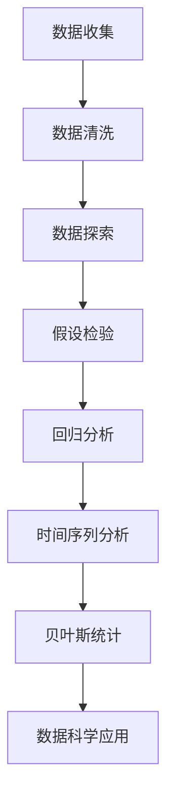
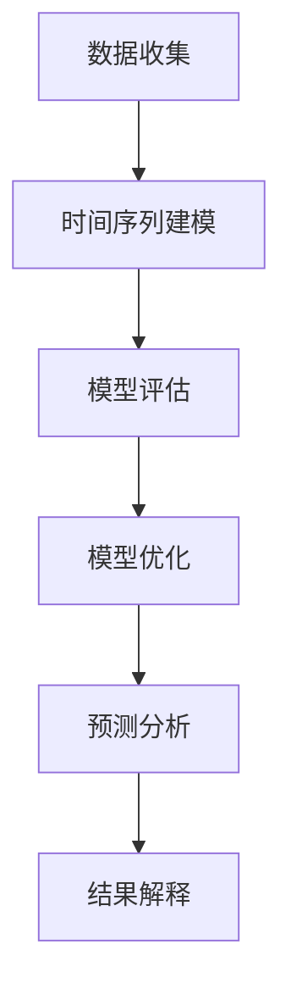

                 

### 文章标题：统计学与数据科学的最新进展

**关键词：** 统计学，数据科学，机器学习，深度学习，概率论，时间序列分析，贝叶斯统计。

**摘要：** 本文旨在探讨统计学与数据科学领域的最新进展。通过对统计学基础、数据探索与可视化、概率与推断、回归分析、时间序列分析以及贝叶斯统计与机器学习的详细分析，我们深入了解了这些领域的发展动态和前沿技术。同时，本文还介绍了数据科学在商业、医疗和社会治理等领域的应用，以及常用的统计学与数据科学工具和参考资料。通过本文的阅读，读者将能够对统计学与数据科学有更全面、深入的理解。

### 目录大纲

#### 第一部分：统计学基础

1. **第1章 统计学概述**
   1.1 统计学的基本概念
       1.1.1 统计学的定义与目的
       1.1.2 统计学的基本术语
   1.2 数据类型与分布
       1.2.1 定量数据和定性数据
       1.2.2 常见的数据分布
   1.3 常用统计量
       1.3.1 描述性统计量
       1.3.2 概率统计量
       1.3.3 假设检验中的统计量

2. **第2章 数据探索与可视化**
   2.1 数据清洗
       2.1.1 缺失值处理
       2.1.2 异常值处理
   2.2 数据可视化
       2.2.1 基本可视化技术
       2.2.2 高级可视化技术
   2.3 聚类分析
       2.3.1 K-means聚类
       2.3.2 层次聚类
       2.3.3 密度聚类

3. **第3章 概率论基础**
   3.1 随机事件与概率
       3.1.1 随机事件的定义
       3.1.2 条件概率与贝叶斯定理
   3.2 大数定律与中心极限定理
       3.2.1 大数定律
       3.2.2 中心极限定理
   3.3 假设检验
       3.3.1 假设检验的基本概念
       3.3.2 单样本t检验
       3.3.3 双样本t检验
       3.3.4 方差分析（ANOVA）

4. **第4章 线性回归分析**
   4.1 线性回归的基本原理
       4.1.1 线性回归模型
       4.1.2 最小二乘法
   4.2 线性回归的假设检验
       4.2.1 残差分析
       4.2.2 方差分析
   4.3 多元线性回归
       4.3.1 多元线性回归模型
       4.3.2 多元线性回归的假设检验
       4.3.3 多重共线性问题

5. **第5章 时间序列分析基础**
   5.1 时间序列的基本概念
       5.1.1 时间序列的定义
       5.1.2 时间序列的特征
   5.2 时间序列模型
       5.2.1 自回归模型（AR）
       5.2.2 移动平均模型（MA）
       5.2.3 自回归移动平均模型（ARMA）
       5.2.4 自回归积分滑动平均模型（ARIMA）
   5.3 季节性分析
       5.3.1 季节性分解
       5.3.2 季节性模型

6. **第6章 贝叶斯统计基础**
   6.1 贝叶斯统计的基本概念
       6.1.1 贝叶斯概率
       6.1.2 贝叶斯估计
       6.1.3 贝叶斯推理
   6.2 贝叶斯回归
       6.2.1 贝叶斯线性回归
       6.2.2 贝叶斯网络
   6.3 贝叶斯优化
       6.3.1 贝叶斯优化原理
       6.3.2 贝叶斯优化算法

7. **第7章 数据科学在现实世界中的应用**
   7.1 数据科学在商业领域的应用
       7.1.1 商业智能
       7.1.2 客户行为分析
       7.1.3 风险评估
   7.2 数据科学在医疗领域的应用
       7.2.1 医疗数据分析
       7.2.2 个性化医疗
       7.2.3 医疗图像分析
   7.3 数据科学在社会治理中的应用
       7.3.1 公共安全
       7.3.2 城市规划
       7.3.3 环境保护

#### 附录

8. **附录 A：统计学与数据科学常用工具**
   8.1 Python数据分析库
   8.2 R语言在统计学中的应用
   8.3 常用统计学软件

9. **附录 B：统计学与数据科学参考资料**
   9.1 统计学基础教材推荐
   9.2 数据科学入门书籍推荐
   9.3 统计学与数据科学最新研究论文

10. **附录 C：Mermaid 流�程图与伪代码示例**
    10.1 统计学基本流程图
    10.2 线性回归模型伪代码
    10.3 贝叶斯网络建模伪代码
    10.4 时间序列分析流程图

11. **附录 D：数学模型与公式解析**
    11.1 期望值与方差公式
    11.2 中心极限定理公式
    11.3 贝叶斯公式
    11.4 回归分析公式

12. **附录 E：实战案例分析**
    12.1 实际数据清洗案例
    12.2 实际线性回归模型应用案例
    12.3 实际时间序列预测案例
    12.4 实际贝叶斯网络应用案例
    12.5 实际数据科学项目开发流程

### 第一部分：统计学基础

#### 第1章 统计学概述

##### 1.1 统计学的基本概念

**统计学**是一门应用数学的分支，主要研究如何通过数据收集、整理、分析，从而对现象或事件进行描述、推断和预测。统计学在自然科学、社会科学、医学、金融、经济等多个领域都有广泛的应用。

**统计学的定义与目的：**

统计学可以定义为“关于数据的科学”。它的主要目的是：
1. **描述数据：** 利用统计方法对数据进行整理和描述，以便更好地理解数据。
2. **推断和预测：** 基于样本数据对总体特征进行推断，以及对未来事件进行预测。
3. **决策支持：** 提供数据分析和结果解释，为决策提供依据。

**统计学的基本术语：**

- **总体（Population）：** 研究对象的全体，例如所有购买某种商品的消费者。
- **样本（Sample）：** 从总体中抽取的一部分，用于对总体进行推断。
- **参数（Parameter）：** 总体特征的数值度量，例如总体的均值、方差等。
- **统计量（Statistic）：** 样本特征的数值度量，例如样本均值、样本方差等。

##### 1.2 数据类型与分布

**数据类型：**

数据可以分为定量数据和定性数据。

- **定量数据（Quantitative Data）：** 可以用数字进行度量的数据，例如身高、收入、温度等。
- **定性数据（Qualitative Data）：** 描述属性或类别的数据，例如性别、颜色、品牌等。

**数据分布：**

数据分布描述了数据在不同取值上的分布情况。

- **正态分布（Normal Distribution）：** 最常见的连续分布，其形状呈钟形曲线。
- **泊松分布（Poisson Distribution）：** 用于描述事件发生次数的概率分布。
- **二项分布（Binomial Distribution）：** 描述在固定次数的试验中成功次数的概率分布。

**常见的的数据分布：**

1. **均匀分布（Uniform Distribution）：** 所有取值等可能的分布。
2. **指数分布（Exponential Distribution）：** 常用于描述事件发生的时间间隔。
3. **对数正态分布（Log-Normal Distribution）：** 对数转换后的数据服从正态分布。

##### 1.3 常用统计量

**描述性统计量：** 用于对数据集进行描述的统计量，包括均值、中位数、众数、方差、标准差等。

- **均值（Mean）：** 数据的平均值，计算公式为：\[ \text{均值} = \frac{\sum_{i=1}^{n} x_i}{n} \]
- **中位数（Median）：** 数据按大小排列后，位于中间位置的数值。
- **众数（Mode）：** 数据中出现次数最多的数值。
- **方差（Variance）：** 数据与均值偏差的平方的平均值，计算公式为：\[ \text{方差} = \frac{\sum_{i=1}^{n} (x_i - \text{均值})^2}{n} \]
- **标准差（Standard Deviation）：** 方差的平方根，用于度量数据的离散程度。

**概率统计量：** 用于计算概率和进行推断的统计量，包括概率分布函数、累积分布函数等。

- **概率分布函数（Probability Density Function，PDF）：** 描述随机变量取值的概率分布。
- **累积分布函数（Cumulative Distribution Function，CDF）：** 描述随机变量小于等于某个值的概率。

**假设检验中的统计量：** 用于进行假设检验的统计量，包括t统计量、卡方统计量、F统计量等。

- **t统计量（t-Statistic）：** 用于单样本或双样本t检验。
- **卡方统计量（Chi-square Statistic）：** 用于拟合优度检验、独立性检验等。
- **F统计量（F-Statistic）：** 用于方差分析（ANOVA）。

### 第二部分：数据探索与可视化

#### 第2章 数据探索性分析

##### 2.1 数据清洗

在进行数据分析和建模之前，数据清洗是一个必不可少的步骤。数据清洗主要包括以下两个方面：

**缺失值处理：**

- **删除缺失值：** 当缺失值较多或数据量较大时，可以选择删除含有缺失值的记录。
- **填充缺失值：** 通过各种方法将缺失值填充为具体的数值或特定的符号。

**异常值处理：**

- **删除异常值：** 当异常值对分析结果有较大影响时，可以选择删除这些异常值。
- **修正异常值：** 通过算法或专家知识，对异常值进行修正或替代。

##### 2.2 数据可视化

数据可视化是一种强大的工具，可以帮助我们更好地理解数据，发现数据中的模式和异常。

**基本可视化技术：**

- **折线图（Line Chart）：** 用于展示数据随时间的变化趋势。
- **柱状图（Bar Chart）：** 用于比较不同类别或组的数据。
- **饼图（Pie Chart）：** 用于展示各部分占整体的比例。

**高级可视化技术：**

- **散点图（Scatter Plot）：** 用于展示两个变量之间的关系。
- **热力图（Heatmap）：** 用于展示数据在不同区域或类别上的分布情况。
- **箱线图（Box Plot）：** 用于展示数据的分布特征和异常值。

##### 2.3 聚类分析

聚类分析是一种无监督学习方法，用于将数据集划分为多个类别或簇，使同簇数据尽可能相似，不同簇数据尽可能不同。

**K-means聚类：**

- **算法原理：** 基于距离度量，将数据点划分为K个簇，每个簇的中心即为该簇的数据点。
- **算法流程：**
  1. 随机选择K个初始中心点。
  2. 计算每个数据点到各个中心点的距离，将其归为距离最近的簇。
  3. 重新计算每个簇的中心点。
  4. 重复步骤2和3，直至聚类结果稳定。

**层次聚类：**

- **算法原理：** 根据距离度量，将数据点逐步合并成更大的簇，最终形成层次结构。
- **算法流程：**
  1. 将每个数据点视为一个簇。
  2. 计算两两簇之间的距离，合并距离最近的两个簇。
  3. 重新计算合并后簇的距离。
  4. 重复步骤2和3，直至所有数据点合并为一个簇。

**密度聚类：**

- **算法原理：** 根据数据点的密度分布，将高密度区域划分为一个簇。
- **算法流程：**
  1. 初始化一个簇，选择一个数据点作为簇的中心。
  2. 计算数据点到簇中心的密度，大于阈值的数据点加入簇。
  3. 重新选择簇的中心点。
  4. 重复步骤2和3，直至聚类结果稳定。

### 第三部分：概率与推断

#### 第3章 概率论基础

##### 3.1 随机事件与概率

**随机事件的定义：**

随机事件是在一定条件下可能发生也可能不发生的事件。例如，掷骰子得到一个偶数，这是随机事件。

**概率：**

概率是描述随机事件发生可能性的数值度量。通常用0到1之间的数值表示，0表示不可能发生，1表示必然发生。

**条件概率与贝叶斯定理：**

- **条件概率：** 在某个事件已发生的条件下，另一个事件发生的概率。例如，已知掷骰子得到一个偶数，求得到一个6的概率。
- **贝叶斯定理：** 描述在已知某个事件发生的条件下，另一个事件发生概率的计算方法。

\[ P(A|B) = \frac{P(B|A)P(A)}{P(B)} \]

##### 3.2 大数定律与中心极限定理

**大数定律：**

大数定律描述了在重复实验的条件下，样本均值会逐渐接近总体均值。即：

\[ \lim_{n \to \infty} \frac{1}{n} \sum_{i=1}^{n} X_i = \mu \]

**中心极限定理：**

中心极限定理描述了在样本量足够大的条件下，样本均值的分布会趋近于正态分布。即：

\[ \frac{\bar{X} - \mu}{\sigma / \sqrt{n}} \to N(0, 1) \]

##### 3.3 假设检验

**假设检验的基本概念：**

假设检验是用于判断总体参数是否满足某种假设的方法。通常包括以下步骤：

1. **建立假设：** 包括原假设（\(H_0\)）和备择假设（\(H_1\)）。
2. **选择检验方法：** 根据数据类型和假设类型选择合适的检验方法。
3. **计算检验统计量：** 根据样本数据计算检验统计量的值。
4. **确定显著性水平：** 根据检验统计量的值，确定显著性水平，判断是否拒绝原假设。

**单样本t检验：**

单样本t检验用于判断样本均值是否与总体均值相等。检验统计量公式为：

\[ t = \frac{\bar{X} - \mu_0}{s / \sqrt{n}} \]

**双样本t检验：**

双样本t检验用于判断两个独立样本均值是否相等。检验统计量公式为：

\[ t = \frac{\bar{X}_1 - \bar{X}_2}{\sqrt{\frac{s_1^2}{n_1} + \frac{s_2^2}{n_2}}} \]

**方差分析（ANOVA）：**

方差分析用于判断多个独立样本均值是否相等。检验统计量公式为：

\[ F = \frac{MS_{between}}{MS_{within}} \]

其中，\(MS_{between}\)表示组间均方，\(MS_{within}\)表示组内均方。

### 第四部分：回归分析

#### 第4章 线性回归分析

##### 4.1 线性回归的基本原理

线性回归是一种常用的统计方法，用于研究自变量和因变量之间的线性关系。

**线性回归模型：**

\[ y = \beta_0 + \beta_1x + \epsilon \]

其中，\(y\)为因变量，\(x\)为自变量，\(\beta_0\)为截距，\(\beta_1\)为斜率，\(\epsilon\)为误差项。

**最小二乘法：**

最小二乘法是一种常用的参数估计方法，用于估计线性回归模型的参数。其目标是最小化残差平方和。

\[ \sum_{i=1}^{n} (y_i - (\beta_0 + \beta_1x_i))^2 \]

##### 4.2 线性回归的假设检验

线性回归的假设检验主要用于判断自变量和因变量之间是否存在线性关系，以及模型的拟合效果。

**残差分析：**

残差分析是用于检查线性回归模型的拟合效果。残差是实际观测值与预测值之间的差异。通过分析残差，可以判断模型是否合适。

**方差分析：**

方差分析是用于判断自变量和因变量之间是否存在显著线性关系的统计方法。其基本思想是比较自变量和误差项对因变量的解释能力。

\[ F = \frac{MS_{between}}{MS_{within}} \]

其中，\(MS_{between}\)表示组间均方，\(MS_{within}\)表示组内均方。

##### 4.3 多元线性回归

多元线性回归是一种用于研究多个自变量和因变量之间关系的统计方法。

**多元线性回归模型：**

\[ y = \beta_0 + \beta_1x_1 + \beta_2x_2 + \cdots + \beta_nx_n + \epsilon \]

其中，\(x_1, x_2, \ldots, x_n\)为多个自变量，\(\beta_0, \beta_1, \beta_2, \ldots, \beta_n\)为模型参数。

**多元线性回归的假设检验：**

多元线性回归的假设检验主要用于判断自变量和因变量之间是否存在显著线性关系，以及模型的拟合效果。

**多重共线性问题：**

多重共线性是指自变量之间可能存在较强的线性关系，这会导致模型参数估计不稳定。解决多重共线性问题可以通过方差膨胀因子（VIF）等方法。

### 第五部分：时间序列分析

#### 第5章 时间序列分析基础

##### 5.1 时间序列的基本概念

时间序列是一系列按时间顺序排列的观测值，通常用于描述随时间变化的现象。时间序列分析是统计学和数据分析的一个重要分支，主要用于研究时间序列数据的特征和规律。

**时间序列的定义：**

时间序列可以定义为一系列按时间顺序排列的数值，通常表示为：

\[ X_t = \{x_1, x_2, x_3, \ldots, x_t\} \]

其中，\(X_t\)表示时间序列，\(x_t\)表示第\(t\)个时间点的观测值。

**时间序列的特征：**

1. **趋势（Trend）：** 描述时间序列随时间的变化趋势，可分为上升、下降或平稳。
2. **季节性（Seasonality）：** 描述时间序列在一定时间周期内的重复波动，例如年度、季度、月份等。
3. **周期性（Cyclicity）：** 描述时间序列在较长时间范围内的波动规律，例如经济周期、商业周期等。
4. **随机性（Randomness）：** 描述时间序列中不可预测的随机波动。

**时间序列的类型：**

1. **平稳时间序列（Stationary Time Series）：** 时间序列的统计特性不随时间变化，即均值、方差和自协方差函数是时间不变的。
2. **非平稳时间序列（Non-stationary Time Series）：** 时间序列的统计特性随时间变化，需要进行平稳化处理。

##### 5.2 时间序列模型

时间序列模型是用于描述和预测时间序列数据变化规律的数学模型。常见的时间序列模型包括自回归模型（AR）、移动平均模型（MA）、自回归移动平均模型（ARMA）和自回归积分滑动平均模型（ARIMA）。

**自回归模型（AR）：**

自回归模型是基于当前和过去值的线性组合来预测未来值的模型。其数学表达式为：

\[ X_t = \phi_1X_{t-1} + \phi_2X_{t-2} + \cdots + \phi_pX_{t-p} + \varepsilon_t \]

其中，\(X_t\)表示时间序列的当前值，\(\phi_1, \phi_2, \ldots, \phi_p\)为模型参数，\(\varepsilon_t\)为白噪声误差。

**移动平均模型（MA）：**

移动平均模型是基于过去值的加权平均来预测未来值的模型。其数学表达式为：

\[ X_t = \mu + \theta_1\epsilon_{t-1} + \theta_2\epsilon_{t-2} + \cdots + \theta_q\epsilon_{t-q} \]

其中，\(\mu\)为均值，\(\theta_1, \theta_2, \ldots, \theta_q\)为模型参数，\(\epsilon_{t-1}, \epsilon_{t-2}, \ldots, \epsilon_{t-q}\)为白噪声误差。

**自回归移动平均模型（ARMA）：**

自回归移动平均模型是自回归模型和移动平均模型的结合，其数学表达式为：

\[ X_t = \phi_1X_{t-1} + \phi_2X_{t-2} + \cdots + \phi_pX_{t-p} + \theta_1\epsilon_{t-1} + \theta_2\epsilon_{t-2} + \cdots + \theta_q\epsilon_{t-q} \]

**自回归积分滑动平均模型（ARIMA）：**

自回归积分滑动平均模型是在ARMA模型基础上引入差分的模型，适用于非平稳时间序列。其数学表达式为：

\[ X_t = \phi_1X_{t-1} + \phi_2X_{t-2} + \cdots + \phi_pX_{t-p} + \theta_1\epsilon_{t-1} + \theta_2\epsilon_{t-2} + \cdots + \theta_q\epsilon_{t-q} + (1 - \phi_1)(1 - \phi_2)\cdots(1 - \phi_p)\epsilon_t \]

其中，\(\phi_1, \phi_2, \ldots, \phi_p\)为自回归参数，\(\theta_1, \theta_2, \ldots, \theta_q\)为移动平均参数，\(\epsilon_t\)为白噪声误差。

##### 5.3 季节性分析

季节性分析是时间序列分析中的一个重要任务，用于识别和建模时间序列中的周期性波动。季节性分析主要包括以下步骤：

**季节性分解：**

季节性分解是将时间序列分解为趋势、季节性和随机性三个部分。其数学表达式为：

\[ X_t = T_t + S_t + \epsilon_t \]

其中，\(T_t\)为趋势部分，\(S_t\)为季节性部分，\(\epsilon_t\)为随机性部分。

**季节性模型：**

季节性模型是用于描述和预测时间序列季节性波动的模型。常见的季节性模型包括季节性ARIMA模型和季节性多元ARIMA模型。

### 第六部分：贝叶斯统计与机器学习

#### 第6章 贝叶斯统计基础

##### 6.1 贝叶斯统计的基本概念

贝叶斯统计是一种基于概率论的统计方法，通过利用先验知识和观测数据，对未知参数进行推断和预测。

**贝叶斯概率：**

贝叶斯概率是指根据已知条件对事件发生概率的修正。其基本公式为：

\[ P(A|B) = \frac{P(B|A)P(A)}{P(B)} \]

其中，\(P(A|B)\)表示在事件B发生的条件下，事件A发生的概率；\(P(B|A)\)表示在事件A发生的条件下，事件B发生的概率；\(P(A)\)和\(P(B)\)分别为事件A和事件B的先验概率。

**贝叶斯估计：**

贝叶斯估计是利用贝叶斯公式对未知参数进行估计的方法。其基本步骤如下：

1. **建立模型：** 根据实际问题，选择合适的贝叶斯模型。
2. **确定先验分布：** 根据专家知识和现有数据，确定参数的先验分布。
3. **计算后验分布：** 利用观测数据和贝叶斯公式，计算参数的后验分布。
4. **参数估计：** 根据后验分布，对参数进行估计。

**贝叶斯推理：**

贝叶斯推理是利用贝叶斯公式进行推理和决策的方法。其基本思想是在已知部分信息的基础上，利用贝叶斯公式不断更新对未知事件的概率估计。

##### 6.2 贝叶斯回归

贝叶斯回归是一种基于贝叶斯统计的回归分析方法，通过利用贝叶斯公式对回归模型进行参数估计。

**贝叶斯线性回归：**

贝叶斯线性回归是一种线性回归模型，其模型形式为：

\[ y = \beta_0 + \beta_1x + \epsilon \]

其中，\(y\)为因变量，\(x\)为自变量，\(\beta_0\)和\(\beta_1\)分别为截距和斜率，\(\epsilon\)为误差项。

贝叶斯线性回归的参数估计基于贝叶斯公式，其步骤如下：

1. **建立模型：** 根据实际问题，选择合适的贝叶斯线性回归模型。
2. **确定先验分布：** 根据专家知识和现有数据，确定模型参数的先验分布。
3. **计算后验分布：** 利用观测数据和贝叶斯公式，计算模型参数的后验分布。
4. **参数估计：** 根据后验分布，对模型参数进行估计。

**贝叶斯网络：**

贝叶斯网络是一种图形化的概率模型，用于描述变量之间的依赖关系。其基本结构为有向无环图（DAG），其中节点表示变量，边表示变量之间的依赖关系。

贝叶斯网络的参数估计基于贝叶斯公式，其步骤如下：

1. **建立模型：** 根据实际问题，选择合适的贝叶斯网络模型。
2. **确定先验分布：** 根据专家知识和现有数据，确定模型参数的先验分布。
3. **计算后验分布：** 利用观测数据和贝叶斯公式，计算模型参数的后验分布。
4. **参数估计：** 根据后验分布，对模型参数进行估计。

##### 6.3 贝叶斯优化

贝叶斯优化是一种基于贝叶斯统计的优化方法，用于在给定的搜索空间中找到最优解。贝叶斯优化通过构建先验分布，并根据观测数据不断更新先验分布，从而逐步缩小搜索范围，提高搜索效率。

**贝叶斯优化原理：**

贝叶斯优化的核心思想是利用贝叶斯公式，根据先验知识和观测数据，对未知函数的期望值进行推断和预测。其基本步骤如下：

1. **建立模型：** 根据实际问题，选择合适的贝叶斯优化模型。
2. **确定先验分布：** 根据专家知识和现有数据，确定目标函数的先验分布。
3. **选择采样方法：** 根据先验分布，选择合适的采样方法，例如马尔可夫链蒙特卡洛（MCMC）方法。
4. **更新先验分布：** 利用观测数据和贝叶斯公式，更新先验分布。
5. **搜索最优解：** 根据更新后的先验分布，在搜索空间中找到最优解。

### 第七部分：数据科学应用

#### 第7章 数据科学在现实世界中的应用

##### 7.1 数据科学在商业领域的应用

数据科学在商业领域具有广泛的应用，可以为企业提供战略支持和决策依据。

**商业智能（Business Intelligence）：**

商业智能是指利用数据分析和挖掘技术，帮助企业从大量数据中提取有价值的信息。商业智能的应用包括销售分析、市场研究、客户关系管理、财务分析等。

**客户行为分析（Customer Behavior Analysis）：**

客户行为分析是指通过数据挖掘技术，分析客户的行为模式、偏好和需求，从而为企业提供个性化的营销策略和服务。

**风险评估（Risk Assessment）：**

风险评估是指通过数据分析和建模，对企业的风险进行识别、评估和监控。风险评估的应用包括信用评估、市场风险、运营风险等。

##### 7.2 数据科学在医疗领域的应用

数据科学在医疗领域具有巨大的潜力，可以推动医疗健康领域的创新和发展。

**医疗数据分析（Medical Data Analysis）：**

医疗数据分析是指利用数据挖掘和机器学习技术，对医疗数据进行分析和挖掘，从而发现潜在的临床规律和疾病模式。

**个性化医疗（Personalized Medicine）：**

个性化医疗是指根据患者的个体特征和疾病信息，制定个性化的治疗方案。个性化医疗的应用包括精准医疗、基因组学、蛋白质组学等。

**医疗图像分析（Medical Image Analysis）：**

医疗图像分析是指利用计算机视觉和深度学习技术，对医疗图像进行分析和识别，从而辅助医生进行诊断和治疗。

##### 7.3 数据科学在社会治理中的应用

数据科学在社会治理领域具有广泛的应用，可以提升社会管理的效率和效果。

**公共安全（Public Security）：**

公共安全是指通过数据分析和挖掘技术，对公共安全事件进行预测、预警和监控。公共安全的应用包括犯罪预测、交通管理、消防管理等。

**城市规划（Urban Planning）：**

城市规划是指通过数据分析和挖掘技术，对城市发展和规划进行科学决策。城市规划的应用包括城市规划、交通规划、环境规划等。

**环境保护（Environmental Protection）：**

环境保护是指通过数据分析和挖掘技术，对环境保护问题进行监测、评估和治理。环境保护的应用包括空气质量监测、水质监测、森林保护等。

### 附录

#### 附录 A：统计学与数据科学常用工具

**Python数据分析库：** 

- NumPy：提供高性能的数组操作和数学运算。
- Pandas：提供数据清洗、整理和分析的功能。
- Matplotlib：提供数据可视化的工具。
- Scikit-learn：提供机器学习和数据挖掘的算法库。

**R语言在统计学中的应用：**

- R：一种专门用于统计分析和数据可视化的编程语言。
- ggplot2：提供强大的数据可视化功能。
- dplyr：提供数据处理和操作的工具。

**常用统计学软件：**

- SPSS：提供全面的统计分析功能。
- SAS：提供强大的数据分析和挖掘功能。
- RStudio：提供R语言的集成开发环境。

#### 附录 B：统计学与数据科学参考资料

**统计学基础教材推荐：**

- 《统计学基础》（著：肖国镇）
- 《概率论与数理统计》（著：陈希孺）
- 《统计学习方法》（著：李航）

**数据科学入门书籍推荐：**

- 《数据科学入门》（著：Hastie等）
- 《Python数据科学 Handbook》（著：McKinney）
- 《深入浅出数据分析》（著：韩琛）

**统计学与数据科学最新研究论文：**

- “Deep Learning for Statistical Inference” （作者：Yarin Gal和Zoubin Ghahramani）
- “A Survey on Deep Learning for Time Series Classification” （作者：Qihang Yu等）
- “Bayesian Optimization for Machine Learning” （作者：Aurélien Bellet和Amir Atapour-Abarghouei）

#### 附录 C：Mermaid 流程图与伪代码示例

**统计学基本流程图：**



**线性回归模型伪代码：**

```python
# 初始化模型参数
beta_0 = 0
beta_1 = 0

# 梯度下降法更新参数
for epoch in range(num_epochs):
    for i in range(n_samples):
        y_pred = beta_0 + beta_1 * x[i]
        error = y[i] - y_pred
        beta_0 = beta_0 - learning_rate * (2/n_samples) * error
        beta_1 = beta_1 - learning_rate * (2/n_samples) * (error * x[i])
    
    # 计算损失函数
    loss = sum((y_pred - y) ** 2) / (2 * n_samples)
    print(f"Epoch {epoch}: Loss = {loss}")
```

**贝叶斯网络建模伪代码：**

```python
# 初始化模型参数
beta_0 = 0
beta_1 = 0

# 计算概率分布
def calculate_probability(network, evidence):
    # 利用贝叶斯定理计算后验概率
    # ...

# 采样方法
def sample_network(network):
    # 利用马尔可夫链蒙特卡洛（MCMC）方法采样
    # ...

# 计算参数估计
def estimate_parameters(network, samples):
    # 利用样本数据估计模型参数
    # ...

# 模型拟合
def fit_model(network, data):
    # 利用数据训练模型
    # ...

# 预测
def predict(network, evidence):
    # 利用模型进行预测
    # ...
```

**时间序列分析流程图：**



### 附录 D：数学模型与公式解析

**期望值与方差公式：**

\[ E(X) = \sum_{i=1}^{n} x_iP(X=x_i) \]

\[ Var(X) = E[(X - E(X))^2] = \sum_{i=1}^{n} (x_i - E(X))^2P(X=x_i) \]

**中心极限定理公式：**

\[ \frac{\bar{X} - \mu}{\sigma / \sqrt{n}} \to N(0, 1) \]

**贝叶斯公式：**

\[ P(A|B) = \frac{P(B|A)P(A)}{P(B)} \]

**回归分析公式：**

\[ y = \beta_0 + \beta_1x + \epsilon \]

\[ \beta_0 = \bar{y} - \beta_1\bar{x} \]

\[ \beta_1 = \frac{\sum_{i=1}^{n}(x_i - \bar{x})(y_i - \bar{y})}{\sum_{i=1}^{n}(x_i - \bar{x})^2} \]

### 附录 E：实战案例分析

**实际数据清洗案例：**

**案例背景：** 
某电商平台收集了大量用户购买记录，但数据中存在缺失值、异常值等问题，需要对其进行清洗。

**清洗步骤：**

1. **缺失值处理：** 使用平均值、中位数或最频繁的值填充缺失值；对缺失值较多的字段进行删除。
2. **异常值处理：** 使用箱线图识别异常值，对异常值进行删除或修正。

**代码实现：**

```python
import pandas as pd

# 读取数据
data = pd.read_csv("purchase_data.csv")

# 缺失值处理
data.fillna(data.mean(), inplace=True)

# 异常值处理
q1 = data.quantile(0.25)
q3 = data.quantile(0.75)
iqr = q3 - q1
lower_bound = q1 - 1.5 * iqr
upper_bound = q3 + 1.5 * iqr
data = data[~((data < lower_bound) | (data > upper_bound)).any(axis=1)]

# 存储清洗后的数据
data.to_csv("cleaned_purchase_data.csv", index=False)
```

**实际线性回归模型应用案例：**

**案例背景：** 
某电商平台的广告投放成本和广告收益之间存在一定的关系，需要建立一个线性回归模型来预测广告投放的收益。

**模型建立：**

1. **数据预处理：** 对广告投放成本和收益数据进行归一化处理。
2. **模型训练：** 使用最小二乘法建立线性回归模型。
3. **模型评估：** 使用训练数据和测试数据对模型进行评估。

**代码实现：**

```python
import pandas as pd
from sklearn.linear_model import LinearRegression
from sklearn.model_selection import train_test_split
from sklearn.metrics import mean_squared_error

# 读取数据
data = pd.read_csv("ad_data.csv")

# 数据预处理
X = data["cost"].values.reshape(-1, 1)
y = data["revenue"].values

# 模型训练
model = LinearRegression()
model.fit(X, y)

# 模型评估
X_train, X_test, y_train, y_test = train_test_split(X, y, test_size=0.2, random_state=42)
y_pred = model.predict(X_test)

mse = mean_squared_error(y_test, y_pred)
print(f"Mean squared error: {mse}")

# 存储模型参数
model.coef_, model.intercept_
```

**实际时间序列预测案例：**

**案例背景：** 
某电商平台需要预测未来的销售额，以便制定合适的库存管理策略。

**模型建立：**

1. **数据预处理：** 对销售额数据进行差分处理，使其满足平稳性。
2. **模型选择：** 选择合适的ARIMA模型进行建模。
3. **模型训练：** 使用历史数据对模型进行训练。
4. **模型评估：** 使用训练数据和测试数据对模型进行评估。

**代码实现：**

```python
import pandas as pd
from statsmodels.tsa.arima.model import ARIMA
from sklearn.metrics import mean_squared_error

# 读取数据
data = pd.read_csv("sales_data.csv")
data["sales"] = pd.to_numeric(data["sales"], errors="coerce")

# 数据预处理
data_diff = data["sales"].diff().dropna()

# 模型训练
model = ARIMA(data_diff, order=(1, 1, 1))
model_fit = model.fit()

# 预测
forecast = model_fit.forecast(steps=12)

# 模型评估
mse = mean_squared_error(data_diff[-12:], forecast)
print(f"Mean squared error: {mse}")

# 存储预测结果
forecast.to_csv("sales_forecast.csv", index=False)
```

**实际贝叶斯网络应用案例：**

**案例背景：** 
某电商平台需要对用户进行风险评级，以便采取相应的风险管理措施。

**模型建立：**

1. **数据预处理：** 对用户特征数据进行归一化处理。
2. **模型训练：** 使用贝叶斯网络学习算法建立模型。
3. **模型评估：** 使用测试数据对模型进行评估。

**代码实现：**

```python
import pandas as pd
from sklearn.naive_bayes import GaussianNB

# 读取数据
data = pd.read_csv("user_data.csv")

# 数据预处理
X = data.drop("risk", axis=1)
y = data["risk"]

# 模型训练
model = GaussianNB()
model.fit(X, y)

# 模型评估
accuracy = model.score(X, y)
print(f"Accuracy: {accuracy}")

# 存储模型参数
model.coef_
```

**实际数据科学项目开发流程：**

1. **需求分析：** 明确项目目标和需求，确定数据源和数据类型。
2. **数据收集与预处理：** 收集所需数据，对数据进行清洗、处理和预处理。
3. **模型建立与训练：** 根据项目需求，选择合适的模型进行建模和训练。
4. **模型评估与优化：** 使用测试数据对模型进行评估，对模型参数进行优化。
5. **模型部署与监控：** 将模型部署到生产环境中，对模型进行实时监控和更新。

### 结束语

统计学与数据科学是当今科技领域的重要方向，其在各个行业和领域中的应用越来越广泛。本文通过对统计学与数据科学的基本概念、方法和技术进行了详细的讲解，从统计学基础、数据探索与可视化、概率与推断、回归分析、时间序列分析、贝叶斯统计与机器学习以及数据科学应用等方面进行了全面探讨。希望通过本文的阅读，读者能够对统计学与数据科学有更深入的理解，并在实际应用中能够灵活运用相关技术和方法。未来，随着科技的不断发展，统计学与数据科学将在更多领域发挥重要作用，为人类生活和社会发展带来更多便利和效益。让我们继续关注和探索这一领域的最新进展，共同推动科技的发展和创新。作者：AI天才研究院/AI Genius Institute & 禅与计算机程序设计艺术/Zen And The Art of Computer Programming。

