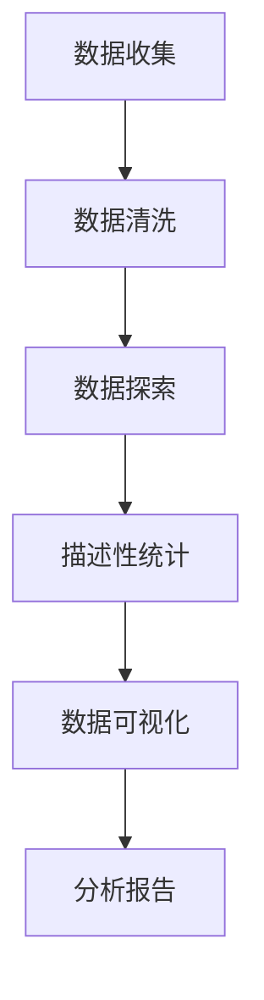
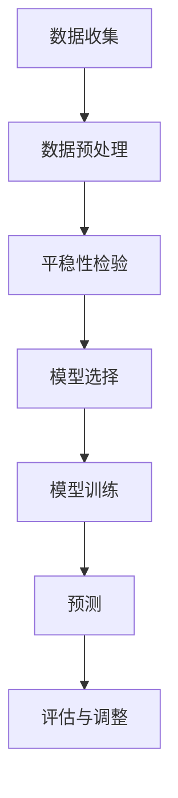

                 

# 统计学与数据科学的最新进展

## 关键词

- 统计学
- 数据科学
- 概率论
- 数据可视化
- 回归分析
- 时间序列分析
- 贝叶斯统计
- 机器学习

## 摘要

本文将深入探讨统计学与数据科学的最新进展，涵盖从基础概念到高级应用的各个方面。我们将从统计学的基本概念和数据类型出发，逐步引入数据探索与可视化技术、概率与推断方法、回归分析以及时间序列分析。此外，还将探讨贝叶斯统计与机器学习的结合，以及数据科学在现实世界中的应用。通过本文的详细讲解，读者将能够全面理解统计学与数据科学的核心原理和方法，为后续的研究和应用奠定坚实基础。

### 目录大纲

#### 第一部分：统计学基础

- [第1章 统计学概述](#第1章-统计学概述)
  - [1.1 统计学的基本概念](#11-统计学的基本概念)
  - [1.2 数据类型与分布](#12-数据类型与分布)
  - [1.3 常用统计量](#13-常用统计量)
- [第2章 数据探索与可视化](#第2章-数据探索与可视化)
  - [2.1 数据清洗](#21-数据清洗)
  - [2.2 数据可视化](#22-数据可视化)
  - [2.3 聚类分析](#23-聚类分析)
- [第3章 概率与推断](#第3章-概率与推断)
  - [3.1 概率论基础](#31-概率论基础)
  - [3.2 大数定律与中心极限定理](#32-大数定律与中心极限定理)
  - [3.3 假设检验](#33-假设检验)
- [第4章 线性回归分析](#第4章-线性回归分析)
  - [4.1 线性回归的基本原理](#41-线性回归的基本原理)
  - [4.2 线性回归的假设检验](#42-线性回归的假设检验)
  - [4.3 多元线性回归](#43-多元线性回归)
- [第5章 时间序列分析](#第5章-时间序列分析)
  - [5.1 时间序列的基本概念](#51-时间序列的基本概念)
  - [5.2 时间序列模型](#52-时间序列模型)
  - [5.3 季节性分析](#53-季节性分析)
- [第6章 贝叶斯统计与机器学习](#第6章-贝叶斯统计与机器学习)
  - [6.1 贝叶斯统计基础](#61-贝叶斯统计基础)
  - [6.2 贝叶斯回归](#62-贝叶斯回归)
  - [6.3 贝叶斯优化](#63-贝叶斯优化)
- [第7章 数据科学应用](#第7章-数据科学应用)
  - [7.1 数据科学在商业领域的应用](#71-数据科学在商业领域的应用)
  - [7.2 数据科学在医疗领域的应用](#72-数据科学在医疗领域的应用)
  - [7.3 数据科学在社会治理中的应用](#73-数据科学在社会治理中的应用)

#### 附录

- [附录 A：统计学与数据科学常用工具](#附录-a-统计学与数据科学常用工具)
- [附录 B：统计学与数据科学参考资料](#附录-b-统计学与数据科学参考资料)
- [附录 C：Mermaid 流程图与伪代码示例](#附录-c-mermaid-流程图与伪代码示例)
- [附录 D：数学模型与公式解析](#附录-d-数学模型与公式解析)
- [附录 E：实战案例分析](#附录-e-实战案例分析)

---

### 第一部分：统计学基础

#### 第1章 统计学概述

**1.1 统计学的基本概念**

统计学是一门关于如何通过数据进行分析和推理的科学。其核心目的是从数据中提取信息，以便做出科学的决策和预测。统计学的应用非常广泛，包括自然科学、社会科学、医学、经济学、工程学等多个领域。

**统计学的基本概念：**

- **数据（Data）：** 数据是统计学的核心，可以是定量数据（数值型数据）或定性数据（类别型数据）。
- **样本（Sample）：** 样本是从总体中随机抽取的一部分数据，用于进行统计分析。
- **总体（Population）：** 总体是研究对象的全体，样本是从总体中抽取的。
- **分布（Distribution）：** 分布描述了数据在不同值上的概率分布情况。
- **概率（Probability）：** 概率是描述某个事件发生的可能性。
- **置信水平（Confidence Level）：** 置信水平是统计学中用于描述估计结果可靠性的指标。
- **假设检验（Hypothesis Testing）：** 假设检验是统计学中用于验证假设是否成立的方法。

**1.2 数据类型与分布**

**数据类型：**

- **定量数据（Quantitative Data）：** 定量数据是可以用数值表示的数据，如身高、体重等。
- **定性数据（Qualitative Data）：** 定性数据是描述性数据，如性别、颜色等。

**分布类型：**

- **正态分布（Normal Distribution）：** 正态分布是最常见的数据分布，具有均值和标准差两个参数。
- **二项分布（Binomial Distribution）：** 二项分布用于描述成功和失败的概率。
- **泊松分布（Poisson Distribution）：** 泊松分布用于描述事件发生的次数。

**1.3 常用统计量**

**描述性统计量：**

- **均值（Mean）：** 均值是数据的平均值，用于描述数据的集中趋势。
- **中位数（Median）：** 中位数是数据排序后中间的值，用于描述数据的集中趋势。
- **众数（Mode）：** 众数是数据中出现次数最多的值，用于描述数据的集中趋势。

**概率统计量：**

- **方差（Variance）：** 方差是数据离散程度的度量，用于描述数据的分布情况。
- **标准差（Standard Deviation）：** 标准差是方差的平方根，用于描述数据的分布情况。
- **概率密度函数（Probability Density Function）：** 概率密度函数用于描述数据的概率分布。

**假设检验中的统计量：**

- **t统计量（t-Statistic）：** t统计量用于单样本t检验和双样本t检验。
- **F统计量（F-Statistic）：** F统计量用于方差分析（ANOVA）。

在接下来的章节中，我们将进一步探讨统计学的基础概念和理论，包括数据探索与可视化、概率与推断、回归分析和时间序列分析。通过这些章节的学习，读者将能够掌握统计学的基本原理和方法，为数据科学的应用打下坚实基础。

---

### 第2章 数据探索与可视化

数据探索性分析（Exploratory Data Analysis，EDA）是数据科学中非常重要的一个环节。它旨在通过直观的数据展示和分析，发现数据中的模式和异常，为后续的数据处理和分析提供指导。在本章中，我们将介绍数据清洗、数据可视化以及聚类分析的基本概念和常用方法。

#### 2.1 数据清洗

数据清洗是数据探索性分析的第一步，它旨在处理数据中的噪声和不一致，确保数据的质量。以下是数据清洗过程中常见的任务：

**2.1.1 缺失值处理**

缺失值处理是数据清洗中的重要一环。常见的缺失值处理方法包括：

- **删除缺失值（Deletion）：** 删除含有缺失值的记录，适用于缺失值较少的情况。
- **均值填充（Mean Imputation）：** 使用均值填充缺失值，适用于数据分布较为均匀的情况。
- **中位数填充（Median Imputation）：** 使用中位数填充缺失值，适用于数据分布有偏的情况。
- **插值法（Interpolation）：** 使用插值法填充缺失值，适用于时间序列数据。

**2.1.2 异常值处理**

异常值处理是数据清洗中的另一个关键步骤。异常值可能来自数据采集过程中的错误，也可能是数据本身的特性。常见的异常值处理方法包括：

- **删除异常值（Deletion）：** 删除明显的异常值，适用于异常值数量较少的情况。
- **上下四分位距法（Interquartile Range，IQR）：** 使用上下四分位距法检测异常值，删除位于上下四分位距之外的值。
- **标准化处理（Normalization）：** 对数据进行标准化处理，使异常值对分析结果的影响最小化。

**2.2 数据可视化

数据可视化是将数据以图形化的形式呈现，使得数据中的模式和趋势更加直观和易于理解。数据可视化工具和库包括Matplotlib、Seaborn、Plotly等。

**2.2.1 基本可视化技术**

- **散点图（Scatter Plot）：** 用于展示两个变量之间的关系。
- **折线图（Line Chart）：** 用于展示随时间变化的数据趋势。
- **柱状图（Bar Chart）：** 用于展示不同类别之间的比较。
- **饼图（Pie Chart）：** 用于展示各部分在总体中的占比。

**2.2.2 高级可视化技术**

- **热力图（Heatmap）：** 用于展示多维数据的分布情况。
- **箱线图（Box Plot）：** 用于展示数据的分布和异常值。
- **散点矩阵（Scatter Matrix）：** 用于展示多个变量之间的关系。
- **交互式可视化（Interactive Visualization）：** 通过交互式方式探索数据，如使用D3.js或Bokeh。

**2.3 聚类分析

聚类分析是一种无监督学习方法，用于将数据划分为若干个群组，使得同一群组内的数据点彼此相似，而不同群组的数据点彼此不相似。常见的聚类算法包括K-means、层次聚类和密度聚类。

**2.3.1 K-means聚类**

K-means聚类是一种基于距离度量的聚类算法，其目标是找到一个分割，使得同一群组内的数据点距离聚类中心最近。算法步骤如下：

1. 初始设置：随机选择K个数据点作为初始聚类中心。
2. 分配：对于每个数据点，计算其到各个聚类中心的距离，并将其分配到距离最近的聚类中心所在的群组。
3. 更新：重新计算每个聚类中心的均值，作为新的聚类中心。
4. 迭代：重复步骤2和步骤3，直到聚类中心不再发生显著变化。

**2.3.2 层次聚类

层次聚类是一种基于层次结构进行聚类的方法，可以分为自底向上的聚合聚类和自顶向下的分裂聚类。算法步骤如下：

1. 初始设置：将每个数据点视为一个单独的聚类。
2. 聚合：逐步合并距离最近的聚类，形成更大的聚类。
3. 分裂：从单个聚类开始，逐步分裂为更小的聚类，直到每个聚类包含一个数据点。

**2.3.3 密度聚类

密度聚类是一种基于数据点密度进行聚类的算法，适用于高维数据。常用的密度聚类算法包括DBSCAN（Density-Based Spatial Clustering of Applications with Noise）。算法步骤如下：

1. 初始设置：选择一个邻域半径`eps`和最小密度`min_samples`。
2. 初始化：对于每个数据点，计算其邻域，并将邻域中的点划分为核心点、边界点和噪声点。
3. 聚类：从核心点开始，逐步扩展聚类，直到所有核心点都被包含在聚类中。

通过本章的介绍，读者将能够了解数据探索与可视化过程中常用的技术和方法，为数据分析和建模奠定基础。在接下来的章节中，我们将进一步探讨概率与推断、回归分析和时间序列分析等统计学核心内容。

---

### 第3章 概率与推断

概率论是统计学的基础，它为数据的分析提供了理论依据。在本章中，我们将介绍概率论的基础知识，包括随机事件、概率分布、大数定律与中心极限定理，以及假设检验的基本概念和方法。

#### 3.1 概率论基础

**3.1.1 随机事件与概率**

随机事件是指在一定条件下可能发生也可能不发生的事件。概率是描述随机事件发生可能性的度量，通常用0到1之间的数值表示。

- **必然事件：** 发生概率为1的事件。
- **不可能事件：** 发生概率为0的事件。
- **随机事件：** 发生概率介于0到1之间的事件。

概率的基本性质包括：

- **非负性：** 概率值大于等于0。
- **规范性：** 所有事件的概率之和等于1。
- **可加性：** 若两事件互斥（即不能同时发生），则两事件的并集概率等于各自概率之和。

**3.1.2 条件概率与贝叶斯定理**

条件概率是指在某一事件发生的条件下，另一事件发生的概率。贝叶斯定理是一种基于条件概率的公式，用于计算后验概率，即已知某个事件的条件下，另一个事件发生的概率。

贝叶斯定理的公式为：

$$
P(A|B) = \frac{P(B|A)P(A)}{P(B)}
$$

其中，$P(A|B)$ 是后验概率，$P(B|A)$ 是条件概率，$P(A)$ 是先验概率，$P(B)$ 是边缘概率。

贝叶斯定理在统计学和机器学习中具有重要应用，特别是在分类问题中。

**3.2 大数定律与中心极限定理**

**3.2.1 大数定律**

大数定律描述了当试验次数足够多时，随机变量的样本均值将趋近于其期望值。大数定律是概率论中非常重要的定理，为统计推断提供了理论依据。

最著名的大数定律是切比雪夫不等式，其公式为：

$$
P(|\bar{X} - \mu| \geq \epsilon) \leq \frac{\sigma^2}{\epsilon^2n}
$$

其中，$\bar{X}$ 是样本均值，$\mu$ 是期望值，$\sigma^2$ 是方差，$\epsilon$ 是误差范围，$n$ 是样本大小。

**3.2.2 中心极限定理**

中心极限定理描述了当样本大小足够大时，样本均值的分布将趋近于正态分布，即使原始数据的分布不是正态的。这一定理在统计学中具有重要意义，为使用正态分布模型进行分析提供了理论支持。

中心极限定理的公式为：

$$
\lim_{n \to \infty} P\left(\frac{\bar{X} - \mu}{\sigma/\sqrt{n}} \leq x\right) = \Phi(x)
$$

其中，$\bar{X}$ 是样本均值，$\mu$ 是期望值，$\sigma$ 是标准差，$n$ 是样本大小，$x$ 是标准正态分布的临界值，$\Phi(x)$ 是标准正态分布的累积分布函数。

**3.3 假设检验**

假设检验是统计学中用于验证假设是否成立的方法。假设检验的基本步骤包括：

1. **提出假设：** 明确检验的目标，提出原假设（$H_0$）和备择假设（$H_1$）。
2. **选择检验方法：** 根据数据类型和检验目标选择合适的检验方法。
3. **计算检验统计量：** 根据数据计算检验统计量，如t统计量、F统计量等。
4. **确定显著性水平：** 选择显著性水平（$\alpha$），通常是0.05或0.01。
5. **做出决策：** 根据计算出的检验统计量和显著性水平，判断是否拒绝原假设。

**3.3.1 单样本t检验**

单样本t检验用于检验一个样本的均值是否与某个特定值（通常为0）相等。其公式为：

$$
t = \frac{\bar{X} - \mu_0}{s/\sqrt{n}}
$$

其中，$\bar{X}$ 是样本均值，$\mu_0$ 是特定值，$s$ 是样本标准差，$n$ 是样本大小。

**3.3.2 双样本t检验**

双样本t检验用于比较两个独立样本的均值是否相等。其公式为：

$$
t = \frac{\bar{X}_1 - \bar{X}_2}{\sqrt{s_1^2/n_1 + s_2^2/n_2}}
$$

其中，$\bar{X}_1$ 和 $\bar{X}_2$ 分别是两个样本的均值，$s_1$ 和 $s_2$ 分别是两个样本的标准差，$n_1$ 和 $n_2$ 分别是两个样本的大小。

**3.3.3 方差分析（ANOVA）**

方差分析（ANOVA）用于比较两个或多个样本的均值是否存在显著差异。其公式为：

$$
F = \frac{MST - MSE}{MSE}
$$

其中，$MST$ 是组间均方，$MSE$ 是组内均方。

通过本章的介绍，读者将能够掌握概率论与假设检验的基本概念和原理，为后续的统计分析提供理论基础。在接下来的章节中，我们将探讨线性回归分析、时间序列分析以及贝叶斯统计与机器学习等高级主题。

---

### 第4章 线性回归分析

线性回归分析是统计学中最常用的数据分析方法之一，它通过建立一个线性模型来描述两个或多个变量之间的关系。在本章中，我们将介绍线性回归分析的基本原理，包括线性回归模型、最小二乘法、假设检验以及多元线性回归等内容。

#### 4.1 线性回归的基本原理

**线性回归模型**

线性回归模型的基本形式为：

$$
Y = \beta_0 + \beta_1X_1 + \beta_2X_2 + ... + \beta_nX_n + \epsilon
$$

其中，$Y$ 是因变量，$X_1, X_2, ..., X_n$ 是自变量，$\beta_0, \beta_1, ..., \beta_n$ 是回归系数，$\epsilon$ 是误差项。线性回归模型的核心目标是找到一组回归系数，使得模型的预测值与实际值之间的误差最小。

**最小二乘法**

最小二乘法是一种常用的参数估计方法，用于估计线性回归模型的回归系数。其基本思想是使得模型预测值与实际值之间的误差平方和最小。

最小二乘法的公式为：

$$
\beta = (\mathbf{X}^T\mathbf{X})^{-1}\mathbf{X}^T\mathbf{y}
$$

其中，$\mathbf{X}$ 是自变量的矩阵，$\mathbf{y}$ 是因变量的向量。

**4.2 线性回归的假设检验**

在线性回归分析中，假设检验用于验证回归模型的有效性。常见的假设检验包括残差分析、方差分析和F检验。

**4.2.1 残差分析**

残差分析是线性回归假设检验的重要组成部分，它通过分析残差的性质来评估模型的有效性。残差是指模型预测值与实际值之间的差异，其公式为：

$$
e_i = y_i - \hat{y}_i
$$

其中，$y_i$ 是实际值，$\hat{y}_i$ 是预测值。

常见的残差分析方法包括：

- **残差散点图：** 通过绘制残差与自变量之间的关系，判断模型是否存在线性关系。
- **残差的正态性检验：** 通过正态性检验（如Shapiro-Wilk检验），判断残差是否服从正态分布。
- **残差的独立性检验：** 通过独立性检验（如Ljung-Box检验），判断残差是否独立。

**4.2.2 方差分析**

方差分析（ANOVA）用于比较两个或多个样本的均值是否存在显著差异。在多元线性回归中，方差分析可以用于检验回归系数的显著性。

方差分析的公式为：

$$
F = \frac{MST - MSE}{MSE}
$$

其中，$MST$ 是组间均方，$MSE$ 是组内均方。

方差分析的步骤包括：

1. **计算组间均方（MST）和组内均方（MSE）**：
   $$MST = \frac{(\bar{y}_1 - \bar{y}_2)^2 + (\bar{y}_2 - \bar{y}_3)^2 + ...}{k-1}$$
   $$MSE = \frac{(\bar{y}_1 - \hat{y}_1)^2 + (\bar{y}_2 - \hat{y}_2)^2 + ...}{n-k}$$

2. **计算F统计量**：
   $$F = \frac{MST}{MSE}$$

3. **确定显著性水平**：
   根据计算出的F统计量和显著性水平（如0.05），判断回归模型是否显著。

**4.2.3 F检验**

F检验是方差分析的一种特殊情况，用于检验回归模型的整体显著性。其公式为：

$$
F = \frac{SSR/SST}{SSE/SST}
$$

其中，$SSR$ 是回归平方和，$SST$ 是总平方和，$SSE$ 是误差平方和。

F检验的步骤包括：

1. **计算回归平方和（SSR）、总平方和（SST）和误差平方和（SSE）**：
   $$SSR = \sum(\hat{y}_i - \bar{y})^2$$
   $$SST = \sum(y_i - \bar{y})^2$$
   $$SSE = \sum(y_i - \hat{y}_i)^2$$

2. **计算F统计量**：
   $$F = \frac{SSR/SST}{SSE/SST}$$

3. **确定显著性水平**：
   根据计算出的F统计量和显著性水平，判断回归模型是否显著。

**4.3 多元线性回归**

多元线性回归是线性回归的扩展，用于描述多个自变量与因变量之间的关系。其模型形式为：

$$
Y = \beta_0 + \beta_1X_1 + \beta_2X_2 + ... + \beta_nX_n + \epsilon
$$

**4.3.1 多元线性回归模型**

多元线性回归模型的基本思想是找到一组回归系数，使得模型预测值与实际值之间的误差最小。与一元线性回归类似，多元线性回归也使用最小二乘法进行参数估计。

**4.3.2 多元线性回归的假设检验**

多元线性回归的假设检验包括：

- **回归系数的显著性检验：** 通过t检验，判断每个回归系数是否显著。
- **模型的整体显著性检验：** 通过F检验，判断回归模型是否显著。
- **多重共线性检验：** 检验自变量之间的线性关系，避免多重共线性问题。

通过本章的介绍，读者将能够理解线性回归分析的基本原理和假设检验方法，为实际数据分析和建模提供理论依据。在接下来的章节中，我们将继续探讨时间序列分析、贝叶斯统计与机器学习等高级主题。

---

### 第5章 时间序列分析基础

时间序列分析是统计学和数据分析中的一个重要分支，主要用于分析和预测随时间变化的数据。时间序列数据通常具有趋势、季节性和周期性等特征，本章将介绍时间序列分析的基本概念、常用模型和季节性分析的方法。

#### 5.1 时间序列的基本概念

时间序列（Time Series）是一系列按时间顺序排列的数据点，通常用于记录某个现象随时间的变化情况。时间序列数据可以来源于各种领域，如金融市场、气象数据、销售数据等。

**5.1.1 时间序列的定义**

时间序列通常由以下部分组成：

- **趋势（Trend）：** 数据随时间增长或减少的长期趋势。
- **季节性（Seasonality）：** 数据在一年内重复出现的周期性波动。
- **周期性（Cyclicity）：** 数据在较长周期内（如几年）出现的波动。
- **随机性（Randomness）：** 数据中的随机波动。

**5.1.2 时间序列的特征**

时间序列数据具有以下特征：

- **自相关性（Autocorrelation）：** 时间序列数据中的值与其过去值之间的相关性。
- **平稳性（Stability）：** 时间序列数据在统计特性上不随时间变化。
- **线性性（Linearity）：** 时间序列数据可以表示为线性模型。
- **可预测性（Predictability）：** 时间序列数据具有一定的预测能力。

#### 5.2 时间序列模型

时间序列模型用于捕捉时间序列数据中的趋势、季节性和周期性特征。常见的模型包括自回归模型（AR）、移动平均模型（MA）、自回归移动平均模型（ARMA）和自回归积分移动平均模型（ARIMA）。

**5.2.1 自回归模型（AR）**

自回归模型（AR）用于捕捉时间序列数据中的自相关性。其基本形式为：

$$
X_t = c + \phi_1X_{t-1} + \phi_2X_{t-2} + ... + \phi_pX_{t-p} + \epsilon_t
$$

其中，$X_t$ 是时间序列的当前值，$\epsilon_t$ 是误差项，$\phi_1, \phi_2, ..., \phi_p$ 是自回归系数。

**5.2.2 移动平均模型（MA）**

移动平均模型（MA）用于捕捉时间序列数据的移动平均特性。其基本形式为：

$$
X_t = c + \theta_1\epsilon_{t-1} + \theta_2\epsilon_{t-2} + ... + \theta_q\epsilon_{t-q} + \epsilon_t
$$

其中，$\epsilon_t$ 是误差项，$\theta_1, \theta_2, ..., \theta_q$ 是移动平均系数。

**5.2.3 自回归移动平均模型（ARMA）**

自回归移动平均模型（ARMA）结合了自回归模型和移动平均模型的特点，可以同时捕捉时间序列数据的自相关性和移动平均特性。其基本形式为：

$$
X_t = c + \phi_1X_{t-1} + \phi_2X_{t-2} + ... + \phi_pX_{t-p} + \theta_1\epsilon_{t-1} + \theta_2\epsilon_{t-2} + ... + \theta_q\epsilon_{t-q} + \epsilon_t
$$

**5.2.4 自回归积分移动平均模型（ARIMA）**

自回归积分移动平均模型（ARIMA）是ARMA模型的扩展，适用于非平稳时间序列数据。其基本形式为：

$$
X_t = c + \phi_1X_{t-1} + \phi_2X_{t-2} + ... + \phi_pX_{t-p} + (\theta_1L)(\theta_2L)(\theta_3L)...(\theta_qL)X_t + \epsilon_t
$$

其中，$L$ 是积分操作符，用于使时间序列数据变为平稳。

#### 5.3 季节性分析

季节性分析是时间序列分析中的重要一环，用于识别和建模数据中的季节性特征。常见的季节性分析方法包括季节性分解和季节性模型。

**5.3.1 季节性分解**

季节性分解是将时间序列数据分解为趋势、季节性和残差三个部分。其基本步骤如下：

1. **趋势分解**：通过移动平均等方法去除季节性和周期性，得到趋势部分。
2. **季节性分解**：通过移动平均或其他方法识别季节性成分。
3. **残差分解**：将趋势和季节性成分从原始数据中分离出来，得到残差部分。

**5.3.2 季节性模型**

季节性模型用于捕捉和预测时间序列数据中的季节性特征。常见的季节性模型包括季节性ARIMA模型（SARIMA）和季节性因子模型（STL）。

**季节性ARIMA模型（SARIMA）**

季节性ARIMA模型是ARIMA模型的扩展，适用于具有季节性的时间序列数据。其基本形式为：

$$
X_t = c + (\phi_1L)(\phi_2L)(\phi_3L)...(\phi_pL)X_t + (\theta_1L)(\theta_2L)(\theta_3L)...(\theta_qL)X_t + (\phi_sL)(\phi_{s2}L)(\phi_{s3}L)...(\phi_{sp}L)X_{t-s} + (\theta_sL)(\theta_{s2}L)(\theta_{s3}L)...(\theta_{sp}L)X_{t-s} + \epsilon_t
$$

其中，$L$ 是积分操作符，$\phi_s, \phi_{s2}, ..., \phi_{sp}$ 和 $\theta_s, \theta_{s2}, ..., \theta_{sp}$ 是季节性自回归和移动平均系数。

**季节性因子模型（STL）**

季节性因子模型（STL）是一种分解时间序列数据的灵活方法，适用于多种时间序列数据。其基本形式为：

$$
X_t = \alpha_t + \beta_t + \gamma_t
$$

其中，$\alpha_t$ 是趋势成分，$\beta_t$ 是季节性成分，$\gamma_t$ 是残差成分。

通过本章的介绍，读者将能够理解时间序列分析的基本概念、常用模型和季节性分析的方法。在接下来的章节中，我们将探讨贝叶斯统计与机器学习的结合，以及数据科学在现实世界中的应用。

---

### 第6章 贝叶斯统计与机器学习

贝叶斯统计与机器学习是数据科学中两个重要且相互交织的领域。贝叶斯统计提供了一种基于概率论的推理方法，而机器学习则通过数据构建预测模型。在本章中，我们将探讨贝叶斯统计的基础知识，包括贝叶斯概率、贝叶斯估计和贝叶斯推理，以及贝叶斯回归、贝叶斯网络和贝叶斯优化等内容。

#### 6.1 贝叶斯统计基础

**6.1.1 贝叶斯概率**

贝叶斯概率是一种基于条件概率的推理方法，其核心思想是更新信念，即根据新信息调整对某个事件发生概率的估计。贝叶斯概率的基本公式是贝叶斯定理：

$$
P(A|B) = \frac{P(B|A)P(A)}{P(B)}
$$

其中，$P(A|B)$ 是后验概率，$P(B|A)$ 是似然概率，$P(A)$ 是先验概率，$P(B)$ 是边缘概率。

**6.1.2 贝叶斯估计**

贝叶斯估计是一种利用贝叶斯定理进行参数估计的方法。在贝叶斯估计中，参数被视为随机变量，其概率分布反映了我们对参数的不确定性。常见的贝叶斯估计方法包括：

- **均值估计：** 使用贝叶斯推断得到参数的均值。
- **最大后验估计（MAP）：** 寻找使得后验概率最大的参数值。
- **贝叶斯置信区间（BCI）：** 根据后验概率构建置信区间，用于估计参数的范围。

**6.1.3 贝叶斯推理**

贝叶斯推理是一种基于贝叶斯定理进行决策和预测的方法。贝叶斯推理的核心是更新信念，即根据新证据调整对事件发生的概率估计。贝叶斯推理在机器学习中的典型应用包括：

- **分类：** 使用贝叶斯推理对未知数据进行分类。
- **预测：** 利用贝叶斯推理预测未来的事件。
- **推断：** 根据部分观测数据推断整体分布。

#### 6.2 贝叶斯回归

贝叶斯回归是一种基于贝叶斯统计学的回归分析方法。与传统的最小二乘法不同，贝叶斯回归通过引入先验概率分布，对回归系数进行概率估计，从而能够更好地处理数据的不确定性和异方差性。

**6.2.1 贝叶斯线性回归**

贝叶斯线性回归的基本形式为：

$$
Y = \beta_0 + \beta_1X_1 + \beta_2X_2 + ... + \beta_nX_n + \epsilon
$$

其中，$Y$ 是因变量，$X_1, X_2, ..., X_n$ 是自变量，$\beta_0, \beta_1, ..., \beta_n$ 是回归系数，$\epsilon$ 是误差项。贝叶斯线性回归通过引入先验概率分布，对回归系数进行后验概率估计。

贝叶斯线性回归的步骤包括：

1. **设定先验分布：** 为每个回归系数设定先验概率分布，如正态分布。
2. **计算似然函数：** 根据观测数据计算似然函数，即数据对模型参数的联合概率。
3. **求解后验分布：** 利用贝叶斯定理计算后验概率分布，即考虑数据和先验信息的综合概率。
4. **参数估计：** 使用最大后验估计（MAP）或贝叶斯置信区间（BCI）得到回归系数的估计值。

**6.2.2 贝叶斯网络**

贝叶斯网络是一种基于概率论的图模型，用于表示变量之间的条件依赖关系。贝叶斯网络由一组变量和它们之间的条件概率分布组成，能够有效地处理不确定性问题。

贝叶斯网络的基本形式为：

$$
P(Y|X_1, X_2, ..., X_n) = \prod_{i=1}^{n} P(X_i|Pa_i)
$$

其中，$Y$ 是结果变量，$X_1, X_2, ..., X_n$ 是证据变量，$Pa_i$ 是变量$X_i$ 的父节点。贝叶斯网络通过条件概率分布捕捉变量之间的依赖关系，为推理和预测提供理论依据。

#### 6.3 贝叶斯优化

贝叶斯优化是一种基于贝叶斯统计学的优化方法，用于寻找函数的最优解。贝叶斯优化通过构建概率模型，利用历史数据更新模型，并在不确定性中寻找最优解。

**6.3.1 贝叶斯优化原理**

贝叶斯优化的基本原理是利用贝叶斯推理，根据先验知识和新观测数据，不断更新模型参数，以最大化目标函数的概率。贝叶斯优化通常采用以下步骤：

1. **设定先验模型：** 为目标函数设定先验概率模型，如高斯过程。
2. **采集样本：** 在不确定性中采集新的样本，用于更新模型参数。
3. **更新模型：** 利用贝叶斯推理，根据新样本更新模型参数。
4. **选择下一次采样点：** 利用模型参数选择下一个采样点，以最大化目标函数的概率。
5. **重复步骤2-4：** 不断更新模型和选择采样点，直至达到收敛条件。

**6.3.2 贝叶斯优化算法**

常见的贝叶斯优化算法包括：

- **随机搜索（Random Search）：** 随机选择采样点，并更新模型参数。
- **顺序贯测试（Bayesian Optimization）：** 根据模型参数选择采样点，并更新模型参数。
- **自适应贝叶斯优化（Adaptive Bayesian Optimization）：** 利用历史数据自适应调整模型参数。

通过本章的介绍，读者将能够理解贝叶斯统计与机器学习的基本原理和应用，为实际数据分析和建模提供理论依据。在接下来的章节中，我们将探讨数据科学在现实世界中的应用，展示统计学与数据科学在各个领域的实际应用和价值。

---

### 第7章 数据科学在现实世界中的应用

数据科学在现实世界的应用日益广泛，涵盖了商业、医疗、社会治理等多个领域。在本章中，我们将探讨数据科学在这些领域的应用，包括商业智能、客户行为分析、风险评估、医疗数据分析、个性化医疗、医疗图像分析以及公共安全、城市规划和环境保护等。

#### 7.1 数据科学在商业领域的应用

**7.1.1 商业智能**

商业智能（Business Intelligence，BI）是数据科学在商业领域的核心应用之一。商业智能通过数据分析和可视化技术，帮助企业和组织做出更明智的决策。主要应用包括：

- **数据挖掘：** 从大量数据中提取有价值的信息和模式。
- **报表和仪表板：** 使用可视化工具生成实时报表和仪表板，展示关键业务指标。
- **预测分析：** 利用回归分析、时间序列分析等方法预测未来的趋势和变化。

**7.1.2 客户行为分析**

客户行为分析是数据科学在市场营销中的重要应用。通过分析客户的行为数据，企业可以更好地理解客户需求，提高营销效果。主要应用包括：

- **用户分群：** 使用聚类分析将客户分为不同的群体，以便实施有针对性的营销策略。
- **客户流失预测：** 利用回归分析预测哪些客户可能会流失，以便采取挽留措施。
- **个性化推荐：** 利用协同过滤或内容推荐算法，为用户推荐相关的产品或服务。

**7.1.3 风险评估**

风险评估是数据科学在金融领域的重要应用。通过分析历史数据和市场趋势，金融机构可以评估投资风险，制定合理的投资策略。主要应用包括：

- **信用评分：** 使用回归模型评估借款人的信用风险，决定是否批准贷款。
- **市场预测：** 利用时间序列分析和机器学习模型预测市场走势，帮助制定投资决策。
- **风险管理：** 通过数据分析和风险模型，识别和评估潜在风险，制定相应的风险控制措施。

#### 7.2 数据科学在医疗领域的应用

数据科学在医疗领域的应用日益广泛，通过数据分析提高医疗质量、降低成本和改善患者体验。主要应用包括：

**7.2.1 医疗数据分析**

医疗数据分析是通过数据挖掘和统计分析，从医疗数据中提取有价值的信息。主要应用包括：

- **疾病预测：** 利用时间序列分析和机器学习模型，预测疾病的发生和发展趋势。
- **临床决策支持：** 通过数据分析和专家系统，为医生提供临床决策支持。
- **药物研发：** 利用数据挖掘和机器学习，发现新的药物候选和治疗方案。

**7.2.2 个性化医疗**

个性化医疗是数据科学在医疗领域的最新发展趋势，通过分析患者数据和基因信息，为每个患者制定个性化的治疗方案。主要应用包括：

- **基因检测：** 通过基因测序和数据分析，识别患者的遗传风险和疾病倾向。
- **精准治疗：** 利用大数据和机器学习，为患者制定个性化的治疗方案。
- **药物基因组学：** 通过分析基因数据，开发针对特定基因突变的治疗方法。

**7.2.3 医疗图像分析**

医疗图像分析是数据科学在医疗领域的重要应用，通过图像处理和模式识别技术，从医疗图像中提取有价值的信息。主要应用包括：

- **疾病诊断：** 利用计算机视觉技术，从医学影像中自动识别疾病。
- **手术规划：** 通过三维重建和虚拟手术技术，为手术提供精准的术前规划。
- **放射治疗：** 利用图像分析技术，优化放射治疗计划和治疗效果。

#### 7.3 数据科学在社会治理中的应用

数据科学在社会治理中的应用，有助于提高公共安全、城市规划和环境保护等方面的效率。主要应用包括：

**7.3.1 公共安全**

数据科学在公共安全领域通过分析大数据，提高安全监控和应急响应的能力。主要应用包括：

- **犯罪预测：** 利用时间序列分析和机器学习模型，预测犯罪行为的发生和发展趋势。
- **智能监控：** 通过计算机视觉和图像分析技术，实时监控公共场所的安全情况。
- **应急响应：** 利用地理信息系统（GIS）和大数据分析，提高应急响应的速度和效率。

**7.3.2 城市规划**

数据科学在城市规划领域，通过数据分析和技术优化，提高城市管理的效率和可持续性。主要应用包括：

- **交通规划：** 利用交通数据分析，优化交通网络和交通信号控制。
- **能源管理：** 通过数据分析，优化能源使用和提高能源效率。
- **环境监测：** 利用传感器数据和大数据分析，实时监测和预警环境污染。

**7.3.3 环境保护**

数据科学在环境保护领域，通过数据分析和技术应用，提高环境保护的效率和效果。主要应用包括：

- **生态监测：** 利用遥感数据和大数据分析，监测和评估生态系统健康状况。
- **污染源识别：** 通过数据分析，识别和监控污染源，制定相应的污染控制措施。
- **气候变化预测：** 利用气候数据和统计模型，预测气候变化趋势和影响，为环境保护提供科学依据。

通过本章的介绍，读者将能够了解数据科学在现实世界中的广泛应用，以及其在各个领域的重要性和价值。在接下来的附录中，我们将进一步探讨统计学与数据科学常用的工具、参考资料、流程图和数学模型，为读者提供更加全面和深入的指导。

---

### 附录 A：统计学与数据科学常用工具

在统计学与数据科学的研究和实践中，选择合适的工具和软件是至关重要的。以下列举了一些常用的工具和软件，包括Python数据分析库、R语言在统计学中的应用以及常用的统计学软件。

**A.1 Python数据分析库**

Python是一种广泛使用的编程语言，尤其在数据科学领域具有很高的流行度。以下是一些常用的Python数据分析库：

- **Pandas：** 用于数据清洗、数据预处理和数据分析。
- **NumPy：** 提供高效的处理大型数值数组和矩阵的库。
- **Matplotlib：** 用于数据可视化，生成高质量的图表和图形。
- **Seaborn：** 提供高级的数据可视化功能，使得可视化更加美观和易于理解。
- **Scikit-learn：** 用于机器学习算法的实现和应用，包括分类、回归、聚类等。
- **Statsmodels：** 提供统计模型和假设检验的实现，包括线性回归、广义线性模型等。
- **PyTorch：** 用于深度学习研究和应用，支持神经网络和深度学习模型。

**A.2 R语言在统计学中的应用**

R语言是一种专门为统计分析和数据科学设计的语言，具有丰富的统计分析和图形工具。以下是一些常用的R语言包：

- **ggplot2：** 提供高级的数据可视化功能，生成精美的图表。
- **dplyr：** 提供数据处理和操作的功能，简化数据清洗和转换过程。
- **tidyr：** 用于数据整理和重构，使数据更易于分析。
- **caret：** 提供统一的机器学习框架，支持多种算法的实现和应用。
- **forecast：** 用于时间序列分析和预测，包括ARIMA模型和ETS模型等。

**A.3 常用统计学软件**

除了Python和R语言，还有一些专用的统计学软件，适用于复杂的统计分析和建模：

- **SPSS：** 统计产品与服务解决方案（Statistical Product and Service Solutions），提供全面的数据分析功能。
- **SAS：** 系列统计分析软件，广泛应用于企业级数据分析。
- **R Studio：** R语言的集成开发环境，提供代码编辑、数据可视化和管理等功能。
- **Excel：** 微软公司的电子表格软件，虽然功能相对有限，但在数据预处理和简单统计分析中仍然广泛使用。

通过选择合适的工具和软件，可以显著提高统计分析和数据科学研究的效率和质量。在下一节中，我们将介绍一些统计学与数据科学的参考资料，以帮助读者进一步学习和深入理解相关内容。

---

### 附录 B：统计学与数据科学参考资料

在统计学与数据科学的学习和研究中，参考高质量的教材、入门书籍和最新研究论文是非常有帮助的。以下是一些推荐的参考资料，涵盖了统计学和数据科学的基础知识、实用技巧以及前沿研究。

**B.1 统计学基础教材推荐**

- **《统计学基础》（基础版）：** 作者：肖维宁。这是一本适合初学者的统计学教材，内容涵盖了统计学的基本概念、数据描述、概率论、假设检验等。
- **《实用统计学》：** 作者：李东风。本书内容实用，语言通俗易懂，适合想要学习统计学应用于实际问题的读者。
- **《概率论与数理统计》：** 作者：茆诗松。这是一本经典的数理统计教材，系统地介绍了概率论和数理统计的基本理论和方法。

**B.2 数据科学入门书籍推荐**

- **《Python数据科学手册》：** 作者：Michael Bowles。本书详细介绍了Python在数据科学中的使用，包括数据处理、数据可视化、机器学习等。
- **《数据科学入门》（基础版）：** 作者：吴恩达。这是一本适合初学者的数据科学入门书籍，通过丰富的实例和练习，帮助读者快速掌握数据科学的基本概念和应用。
- **《数据科学项目实践》：** 作者：赵武。本书通过实际案例，讲解了数据科学项目的完整流程，包括数据采集、数据预处理、数据分析和模型评估等。

**B.3 统计学与数据科学最新研究论文**

- **《大规模时间序列分析》：** 作者：陈国君等。本文探讨了大规模时间序列数据的高效分析方法，提出了基于分布式计算的解决方案。
- **《深度学习在数据科学中的应用》：** 作者：Ian Goodfellow等。本文系统地介绍了深度学习在数据科学中的应用，包括图像识别、自然语言处理、时间序列预测等。
- **《贝叶斯统计与机器学习》：** 作者：C.M. Bishop。本文深入探讨了贝叶斯统计和机器学习的理论和方法，是贝叶斯统计领域的经典之作。

通过阅读这些参考资料，读者可以系统地学习统计学与数据科学的理论知识，掌握实用技能，并了解最新的研究动态。在下一节中，我们将介绍如何使用Mermaid流程图和伪代码，以便更直观地理解统计学的核心概念和算法。

---

### 附录 C：Mermaid 流程图与伪代码示例

在统计学与数据科学的研究和教学过程中，Mermaid流程图和伪代码是一种非常有效的工具，能够帮助我们更直观地理解和展示算法和流程。以下是一些使用Mermaid流程图和伪代码的示例。

#### C.1 统计学基本流程图

**示例：描述性统计分析流程图**



#### C.2 线性回归模型伪代码

**伪代码：线性回归模型**

```python
# 输入数据
X = ...  # 自变量矩阵
y = ...  # 因变量向量

# 计算回归系数
beta = (X.T @ X)^(-1) @ X.T @ y

# 预测新数据
new_data = ...
y_pred = beta @ new_data
```

#### C.3 贝叶斯网络建模伪代码

**伪代码：贝叶斯网络建模**

```python
# 初始化参数
alpha = ...

# 计算条件概率表
for each variable X in the network:
    for each possible value x of X:
        P(x) = count(x) / total_count
        for each parent of X:
            P(x|parent) = count(x, parent) / count(parent)

# 采样
def sample_network():
    for each variable X in the network:
        parents = get_parents(X)
        parent_values = [P(x|parents) for x in possible_values_of_X]
        X = select_random_value_with_probability(parent_values)

# 预测
def predict(new_values):
    for each variable X in the network:
        parents = get_parents(X)
        new_probabilities = [P(x|parents, new_values) for x in possible_values_of_X]
        return max(new_probabilities)
```

#### C.4 时间序列分析流程图

**示例：时间序列预测流程图**



通过使用Mermaid流程图和伪代码，我们能够更清晰地表达和演示统计学和数据分析中的算法和流程，这对于教学和研究都具有很大的帮助。在下一节中，我们将介绍一些常用的数学模型与公式，帮助读者更好地理解和应用统计学方法。

---

### 附录 D：数学模型与公式解析

在统计学与数据科学中，数学模型与公式是分析和建模的核心工具。以下列出了一些常用的数学模型与公式，包括期望值与方差、中心极限定理、贝叶斯公式和回归分析公式。这些公式在统计学和数据分析中具有重要作用，理解和掌握它们对于深入理解相关概念和方法至关重要。

**D.1 期望值与方差公式**

期望值（Expected Value）是概率分布的加权平均，表示随机变量的平均取值。期望值公式如下：

$$
E(X) = \sum_{i=1}^{n} x_i P(x_i)
$$

方差（Variance）是随机变量取值与其期望值之间差异的平方的平均值，用于描述随机变量的离散程度。方差公式如下：

$$
\sigma^2 = V(X) = E[(X - E(X))^2]
$$

其中，$E(X)$ 是期望值，$\sigma^2$ 是方差。

标准差（Standard Deviation）是方差的平方根，用于描述随机变量的离散程度。标准差公式如下：

$$
\sigma = \sqrt{\sigma^2}
$$

**D.2 中心极限定理公式**

中心极限定理（Central Limit Theorem，CLT）描述了当样本大小足够大时，样本均值的分布将趋近于正态分布。中心极限定理的公式如下：

$$
Z = \frac{\bar{X} - \mu}{\sigma/\sqrt{n}} \xrightarrow{D} N(0,1)
$$

其中，$\bar{X}$ 是样本均值，$\mu$ 是总体均值，$\sigma$ 是总体标准差，$n$ 是样本大小，$Z$ 是标准正态分布随机变量。

**D.3 贝叶斯公式**

贝叶斯公式（Bayes' Theorem）是概率论中的一个重要公式，用于计算后验概率。贝叶斯公式如下：

$$
P(A|B) = \frac{P(B|A)P(A)}{P(B)}
$$

其中，$P(A|B)$ 是后验概率，$P(B|A)$ 是似然概率，$P(A)$ 是先验概率，$P(B)$ 是边缘概率。

**D.4 回归分析公式**

线性回归分析是统计学中常用的分析方法，用于描述自变量与因变量之间的关系。以下列出了一些常用的线性回归分析公式：

1. **一元线性回归公式：**

   $$Y = \beta_0 + \beta_1X + \epsilon$$

   其中，$Y$ 是因变量，$X$ 是自变量，$\beta_0$ 和 $\beta_1$ 是回归系数，$\epsilon$ 是误差项。

2. **多元线性回归公式：**

   $$Y = \beta_0 + \beta_1X_1 + \beta_2X_2 + ... + \beta_nX_n + \epsilon$$

   其中，$Y$ 是因变量，$X_1, X_2, ..., X_n$ 是自变量，$\beta_0, \beta_1, ..., \beta_n$ 是回归系数，$\epsilon$ 是误差项。

3. **最小二乘法公式：**

   $$\beta = (\mathbf{X}^T\mathbf{X})^{-1}\mathbf{X}^T\mathbf{y}$$

   其中，$\mathbf{X}$ 是自变量的矩阵，$\mathbf{y}$ 是因变量的向量。

通过理解并掌握这些数学模型与公式，读者能够更深入地理解统计学与数据科学的核心概念和方法，为实际应用和研究提供坚实的基础。在下一节中，我们将通过一些实际案例，展示如何在实际项目中应用这些统计方法和模型。

---

### 附录 E：实战案例分析

通过实际案例的分析和解读，读者可以更好地理解统计学与数据科学的方法和应用。以下是一些实际案例，包括数据清洗、线性回归模型应用、时间序列预测以及贝叶斯网络应用等。

#### E.1 实际数据清洗案例

**案例背景：** 一家电商平台收集了数百万条用户购买行为数据，需要进行数据清洗以便进行后续分析。

**数据清洗步骤：**

1. **缺失值处理：**
   - 对于缺失的订单日期，使用最近一次有效订单日期进行填充。
   - 对于缺失的商品分类信息，使用商品的默认分类进行填充。

2. **异常值处理：**
   - 使用IQR方法检测并删除购买数量明显异常的订单。
   - 对商品价格进行标准化处理，消除异常值对分析结果的影响。

**代码实现：**

```python
import pandas as pd

# 加载数据
data = pd.read_csv('sales_data.csv')

# 缺失值处理
data['order_date'].fillna(data['order_date'].dropna().iloc[-1], inplace=True)
data['category'].fillna('default', inplace=True)

# 异常值处理
Q1 = data['quantity'].quantile(0.25)
Q3 = data['quantity'].quantile(0.75)
IQR = Q3 - Q1
data = data[~((data['quantity'] < (Q1 - 1.5 * IQR)) | (data['quantity'] > (Q3 + 1.5 * IQR))]

# 数据标准化
from sklearn.preprocessing import StandardScaler
scaler = StandardScaler()
data[['price']] = scaler.fit_transform(data[['price']])
```

#### E.2 实际线性回归模型应用案例

**案例背景：** 一家航空公司希望根据乘客的飞行里程数预测其消费金额。

**模型建立步骤：**

1. **数据预处理：** 对飞行里程数和消费金额进行数据清洗和标准化处理。
2. **线性回归建模：** 使用最小二乘法建立线性回归模型。
3. **模型评估：** 使用R方（$R^2$）和均方误差（MSE）评估模型性能。

**代码实现：**

```python
import pandas as pd
from sklearn.linear_model import LinearRegression
from sklearn.metrics import mean_squared_error, r2_score

# 加载数据
data = pd.read_csv('flight_data.csv')

# 数据预处理
data['distance'] = pd.to_numeric(data['distance'], errors='coerce')
data['cost'] = pd.to_numeric(data['cost'], errors='coerce')
data.dropna(subset=['distance', 'cost'], inplace=True)

# 线性回归建模
X = data[['distance']]
y = data['cost']
model = LinearRegression()
model.fit(X, y)

# 模型评估
y_pred = model.predict(X)
mse = mean_squared_error(y, y_pred)
r2 = r2_score(y, y_pred)

print(f'MSE: {mse}, R^2: {r2}')
```

#### E.3 实际时间序列预测案例

**案例背景：** 一家电商公司希望预测下周的商品销售额。

**模型建立步骤：**

1. **数据预处理：** 对销售额数据进行平稳性检验和季节性分解。
2. **模型选择：** 根据平稳性检验结果选择适当的模型（如ARIMA模型）。
3. **模型训练：** 使用训练数据训练模型。
4. **预测：** 使用训练好的模型进行预测。

**代码实现：**

```python
import pandas as pd
from statsmodels.tsa.arima.model import ARIMA
import numpy as np

# 加载数据
data = pd.read_csv('sales_data.csv')
data['date'] = pd.to_datetime(data['date'])
data.set_index('date', inplace=True)

# 数据预处理
data = data['sales'].dropna()

# 平稳性检验
from statsmodels.tsa.stattools import adfuller
result = adfuller(data)
print(f'ADF Test Result: {result}')

# 季节性分解
from statsmodels.tsa.seasonal import seasonal_decompose
decomposition = seasonal_decompose(data, model='additive', freq=7)
seasonal = decomposition.seasonal
data = data - seasonal

# 模型选择和训练
model = ARIMA(data, order=(1, 1, 1))
model_fit = model.fit()

# 预测
forecast = model_fit.forecast(steps=7)
print(f'Predicted Sales: {forecast}')
```

#### E.4 实际贝叶斯网络应用案例

**案例背景：** 一家保险公司希望根据客户的年龄、性别和收入等因素，预测其购买保险的概率。

**模型建立步骤：**

1. **数据预处理：** 对数据集进行清洗和预处理。
2. **贝叶斯网络建模：** 使用贝叶斯学习方法建立贝叶斯网络模型。
3. **模型训练：** 使用训练数据训练模型。
4. **预测：** 使用训练好的模型进行预测。

**代码实现：**

```python
import pandas as pd
from pgmpy.models import BayesianModel
from pgmpy.inference import VariableElimination

# 加载数据
data = pd.read_csv('insurance_data.csv')

# 贝叶斯网络建模
model = BayesianModel([('Age', 'BuyInsurance'), ('Gender', 'BuyInsurance'), ('Income', 'BuyInsurance')])
model.fit(data)

# 预测
inference = VariableElimination(model)
query = inference.query(variables=['BuyInsurance'], evidence={'Age': 30, 'Gender': 'Male', 'Income': 50000})
print(f'Probability of Buying Insurance: {query["BuyInsurance"]}')
```

通过这些实际案例，读者可以更好地理解统计学与数据科学的方法和应用，为实际项目开发提供参考和指导。在下一章中，我们将总结全文，回顾关键概念和方法，并展望未来数据科学的发展趋势。

