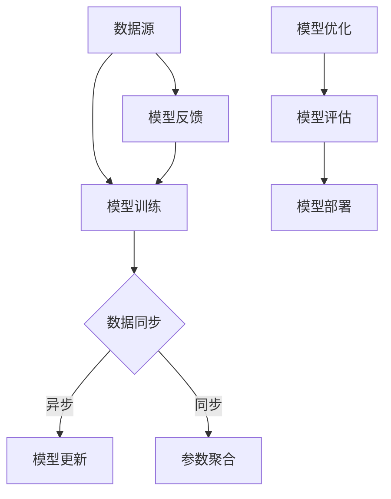

                 

# 联邦学习

## 关键词

- 联邦学习
- 机器学习
- 隐私保护
- 分布式计算
- 模型训练
- 加密技术

## 摘要

本文将深入探讨联邦学习这一前沿技术，从基础概念、原理、应用领域到实践案例，全面解析联邦学习的技术内涵和实际应用。通过本文，读者可以了解到联邦学习在保护隐私、提升模型性能、实现分布式计算等方面的优势，并掌握联邦学习项目的规划和实施方法。

## 目录

### 第一部分：联邦学习基础

#### 第1章：联邦学习概述

#### 1.1 联邦学习的基本概念

#### 1.2 联邦学习的发展历史

#### 1.3 联邦学习的应用场景

#### 第2章：联邦学习原理

#### 2.1 联邦学习框架

#### 2.2 联邦学习算法

#### 2.3 联邦学习中的隐私保护

#### 第3章：联邦学习应用领域

#### 3.1 联邦学习在医疗领域的应用

#### 3.2 联邦学习在金融领域的应用

#### 3.3 联邦学习在其他领域的应用

### 第二部分：联邦学习实践

#### 第4章：联邦学习项目设计

#### 4.1 联邦学习项目的需求分析

#### 4.2 联邦学习项目架构设计

#### 4.3 联邦学习项目实施

#### 第5章：联邦学习案例分析

#### 5.1 案例一：医疗数据联邦学习应用

#### 5.2 案例二：金融风控联邦学习应用

#### 第6章：联邦学习工具与框架

#### 6.1 开源联邦学习工具介绍

#### 6.2 联邦学习框架选型

#### 6.3 实践建议

#### 第7章：联邦学习未来发展

#### 7.1 联邦学习的技术挑战

#### 7.2 联邦学习的未来趋势

### 附录

#### 附录 A：联邦学习相关资源

#### 附录 B：联邦学习常见问题与解答

#### 联邦学习架构图



#### 联邦学习优化算法伪代码

```plaintext
// 伪代码：联邦学习优化算法
Initialize: 
    模型参数 W0
    学习率 α
    随机种子

for i = 1 to T do
    // 第i轮训练
    for each client c in clients do
        // 对每个客户端的数据进行本地训练
        Wc <- LocalTraining(c, W0)
    end for

    // 参数聚合
    W <- AggregateParameters(Wc)

    // 模型更新
    W <- UpdateModel(W, α)

    // 模型评估
    Performance <- EvaluateModel(W)

    // 输出本轮训练结果
    Print("轮次:", i, "性能:", Performance)
end for
```

#### 联邦学习数学模型与公式

##### 中心化模型训练过程：
$$
\min_{\theta} \sum_{i=1}^{m} L(y_i, \theta x_i)
$$

##### 联邦学习模型训练过程：
$$
\min_{\theta} \sum_{c=1}^{C} \frac{1}{n_c} \sum_{i=1}^{n_c} L(y_i^c, \theta x_i^c)
$$

### 引言

在当前数据驱动的社会中，机器学习和人工智能技术已经成为各行各业不可或缺的工具。然而，随着数据量的急剧增长和数据隐私保护法规的日益严格，如何有效利用分布式数据资源成为了一个严峻的挑战。联邦学习（Federated Learning）作为一种新兴的分布式机器学习方法，通过在客户端本地进行模型训练和更新，避免了数据在中央服务器上的存储和传输，从而实现了数据隐私保护和分布式计算的双重目标。

本文旨在对联邦学习进行系统性的介绍和分析，帮助读者全面理解联邦学习的技术原理、架构、算法和应用。文章结构如下：

- **第一部分：联邦学习基础**：介绍联邦学习的基本概念、发展历史和应用场景，帮助读者建立对联邦学习的初步认识。
- **第二部分：联邦学习原理**：深入探讨联邦学习的框架、算法和隐私保护机制，详细解释联邦学习的核心技术和原理。
- **第三部分：联邦学习应用领域**：分析联邦学习在医疗、金融和其他领域的应用案例，展示联邦学习的实际应用价值。
- **第四部分：联邦学习实践**：讨论联邦学习项目的需求分析、架构设计、实施方法和案例分析，提供具体的实践指导和经验。
- **第五部分：联邦学习工具与框架**：介绍主流的联邦学习工具和框架，对比其优缺点，并提供选型建议。
- **第六部分：联邦学习未来发展**：探讨联邦学习的未来趋势和技术挑战，展望联邦学习的发展前景。

通过本文的阅读，读者将能够深入了解联邦学习的全貌，掌握联邦学习的核心技术，并为实际应用中的联邦学习项目提供有效的解决方案。

#### 第一部分：联邦学习基础

### 第1章：联邦学习概述

#### 1.1 联邦学习的基本概念

联邦学习（Federated Learning）是一种分布式机器学习方法，通过将训练过程分散到多个客户端设备上，从而实现模型训练和数据隐私保护。在联邦学习中，每个客户端设备都保留自己的数据，并在本地对模型进行训练，然后只将模型的参数更新发送到中央服务器。中央服务器聚合来自各个客户端的参数更新，并生成全局模型。

**定义**：联邦学习是一种分布式机器学习技术，通过在多个设备上协同训练模型，同时保持数据本地存储，从而实现数据隐私保护和资源利用。

联邦学习的核心思想是通过分布式计算和协同学习的方式，将数据隐私保护和机器学习性能优化结合起来。这种方法具有以下几个关键特点：

1. **数据本地化**：联邦学习要求每个客户端设备保留自己的数据，避免了数据在中央服务器上的集中存储，从而提高了数据隐私保护水平。
2. **模型参数更新**：每个客户端在本地训练模型后，只将模型参数的更新发送到中央服务器，而不是整个模型或原始数据。
3. **异步通信**：联邦学习允许客户端以异步方式与中央服务器进行通信，从而降低了通信成本和延迟。
4. **联邦学习算法**：联邦学习采用分布式算法，例如联邦平均算法（Federated Averaging），来聚合各个客户端的模型更新。

**核心优势**：

1. **隐私保护**：联邦学习通过本地化数据存储和模型参数更新，避免了数据在中央服务器上的泄露，从而保护了用户隐私。
2. **分布式计算**：联邦学习利用了分布式计算资源，可以处理大规模的数据集，同时降低了单点故障的风险。
3. **可扩展性**：联邦学习架构可以轻松扩展到更多客户端和设备，从而提高模型的性能和泛化能力。
4. **实时更新**：联邦学习支持实时更新模型参数，使得模型可以快速适应环境变化，提高了模型的响应速度。

**与中心化学习的对比**：

中心化学习是传统的机器学习方法，其中所有数据都集中在中央服务器上，模型在中央服务器上进行训练。中心化学习的优点包括：

1. **数据集中**：所有数据集中存储在中央服务器上，便于管理和处理。
2. **计算效率**：模型在单台服务器上训练，计算资源利用率高。
3. **模型精度**：可以充分利用集中式计算资源，提高模型的精度。

然而，中心化学习也面临一些挑战：

1. **隐私风险**：数据集中存储在中央服务器上，容易受到数据泄露和网络攻击的威胁。
2. **单点故障**：如果中央服务器发生故障，整个系统将无法运行。
3. **可扩展性差**：随着数据规模的增加，中央服务器的负载会急剧增加，导致系统性能下降。

相比之下，联邦学习通过数据本地化和分布式计算，在保护数据隐私、提高系统可靠性和可扩展性方面具有显著优势。然而，联邦学习也面临一些挑战，如模型通信开销、数据分布不均和模型同步等问题。

#### 1.2 联邦学习的发展历史

联邦学习的发展可以追溯到20世纪90年代，当时分布式计算和协同学习的研究逐渐兴起。以下是一些关键的里程碑和发展阶段：

1. **协同学习**：1998年，Geoff Hinton等人提出了协同学习（Collaborative Learning）的概念，即在多个代理之间共享信息以优化模型。协同学习的核心思想与联邦学习相似，但最初并未涉及数据隐私保护。
2. **分布式机器学习**：2000年后，随着互联网和云计算技术的发展，分布式机器学习逐渐受到关注。分布式机器学习通过在多个计算节点上并行训练模型，提高了计算效率和处理大规模数据的能力。
3. **联邦学习概念提出**：2016年，谷歌公司首次提出了联邦学习（Federated Learning）的概念，并在其论文《Federated Averaging: Strategies for Improving Training of Neural Networks in Heterogeneous Environments》中详细阐述了联邦学习算法。
4. **联邦学习开源项目**：2017年，谷歌开源了TensorFlow Federated（TFF），这是首个广泛使用的联邦学习框架。TFF提供了简洁的API，支持各种深度学习模型和优化算法。
5. **联邦学习应用**：随着联邦学习技术的不断成熟，其在医疗、金融、物联网等领域得到了广泛应用。联邦学习在保护数据隐私和实现分布式计算方面展现出了巨大潜力。

**重要里程碑**：

1. **联邦学习概念提出**：谷歌公司在2016年首次提出了联邦学习的概念，为分布式机器学习领域带来了新的思路。
2. **联邦学习开源项目**：TensorFlow Federated（TFF）的发布标志着联邦学习从理论研究走向实际应用。
3. **联邦学习应用案例**：联邦学习在医疗、金融、物联网等领域的成功应用，证明了其技术的实用性和价值。

**应用领域**：

联邦学习在各个领域的应用具有广泛的前景：

1. **医疗**：联邦学习可以保护患者隐私，同时实现分布式医疗诊断模型的训练和部署，提高医疗服务的质量和效率。
2. **金融**：联邦学习在信用评分、风险评估和欺诈检测等方面具有广泛应用，可以保护用户隐私并提高金融服务的安全性。
3. **物联网**：联邦学习可以实现物联网设备之间的协同控制和数据共享，提高物联网系统的智能化和可靠性。

#### 1.3 联邦学习的应用场景

联邦学习在数据隐私保护和分布式计算方面具有显著优势，因此在多个领域都有广泛的应用场景：

**隐私保护的需求**：

1. **医疗领域**：医疗数据包含敏感个人信息，如诊断记录、病历等，需要严格保护患者隐私。联邦学习可以在本地设备上进行模型训练，避免了数据在中央服务器上的集中存储，从而提高了数据隐私保护水平。
2. **金融领域**：金融数据包括用户账户信息、交易记录等，隐私保护尤为重要。联邦学习可以确保用户数据在本地设备上进行处理，避免数据泄露风险。
3. **物联网领域**：物联网设备收集的用户数据涉及用户行为和位置信息，需要保护用户隐私。联邦学习可以在设备本地进行数据处理，减少了数据传输过程中的隐私泄露风险。

**数据安全与合规的挑战**：

1. **GDPR**：欧洲通用数据保护条例（GDPR）对数据处理和存储提出了严格的要求，要求企业确保用户数据的安全性和隐私性。联邦学习通过数据本地化和加密技术，有助于满足GDPR的要求。
2. **CCPA**：美国加利福尼亚州消费者隐私法案（CCPA）同样对数据处理和存储提出了严格的规定。联邦学习可以在本地设备上进行数据处理，降低了数据泄露风险，有助于符合CCPA的规定。
3. **其他法规**：全球范围内，越来越多的国家和地区出台了数据隐私保护法规，要求企业加强数据安全和隐私保护。联邦学习作为一种保护用户隐私的分布式计算技术，有助于企业满足这些法规的要求。

**分布式计算与协同学习的优势**：

1. **医疗诊断模型**：在医疗领域，联邦学习可以用于分布式医疗诊断模型的训练和部署，实现个性化诊断和精准医疗。
2. **信用评分模型**：在金融领域，联邦学习可以用于分布式信用评分模型的训练和更新，提高评分模型的准确性和实时性。
3. **物联网智能系统**：在物联网领域，联邦学习可以用于设备协同控制和数据共享，实现智能交通系统、智能工业自动化等应用。

通过以上分析，我们可以看到联邦学习在保护数据隐私、实现分布式计算和协同学习方面具有显著优势，因此在医疗、金融、物联网等多个领域都有广泛的应用前景。

### 第2章：联邦学习原理

#### 2.1 联邦学习框架

联邦学习框架是联邦学习系统的核心组成部分，它定义了联邦学习的过程和结构，包括数据传输、模型训练和更新等各个环节。理解联邦学习框架有助于深入掌握联邦学习的原理和机制。

**联邦学习的基本架构**：

联邦学习的基本架构通常包括以下三个主要组成部分：

1. **客户端（Clients）**：客户端是指参与联邦学习的终端设备，如手机、物联网设备等。客户端负责在本地执行数据预处理、模型训练和参数更新等任务。
2. **服务器（Server）**：服务器是联邦学习的核心控制单元，负责协调和管理联邦学习的过程。服务器接收客户端发送的参数更新，并生成全局模型。
3. **通信协议**：通信协议是客户端和服务器之间的通信规则，确保数据传输的安全和高效。

**数据传输流程**：

在联邦学习过程中，数据传输是关键环节。以下是联邦学习中的数据传输流程：

1. **初始化**：服务器初始化全局模型参数，并将其发送给所有客户端。
2. **本地训练**：客户端接收到全局模型参数后，使用本地数据进行模型训练，并生成本地更新。
3. **参数上传**：客户端将本地更新发送到服务器。
4. **参数聚合**：服务器接收来自所有客户端的更新，并进行参数聚合，生成全局更新。
5. **全局更新**：服务器将全局更新发送回客户端。
6. **模型评估**：服务器评估全局模型的性能，并根据需要调整模型参数。

**安全性保障**：

联邦学习框架需要确保数据传输和模型更新的安全性，以防止数据泄露和攻击。以下是几种常用的安全性保障措施：

1. **加密技术**：客户端和服务器之间的通信使用加密技术，如TLS（传输层安全协议），确保数据传输的安全性。
2. **差分隐私**：服务器在聚合客户端更新时，采用差分隐私技术，防止泄露单个客户端的隐私信息。
3. **访问控制**：服务器通过访问控制机制，确保只有授权客户端可以参与联邦学习过程。

**通信协议**：

联邦学习的通信协议通常采用异步或同步模式。异步通信模式允许客户端独立进行模型训练和更新，减少了通信延迟和资源消耗。同步通信模式要求客户端在特定时间同步更新，以确保全局模型的同步更新。

**联邦学习框架的优势**：

1. **数据隐私保护**：通过数据本地化和加密技术，联邦学习可以有效保护用户隐私。
2. **分布式计算**：联邦学习利用分布式计算资源，提高了计算效率和系统性能。
3. **可扩展性**：联邦学习框架可以轻松扩展到更多客户端和设备，支持大规模分布式系统。

#### 2.2 联邦学习算法

联邦学习算法是实现联邦学习的关键，主要包括模型训练算法、参数更新算法和模型评估算法。以下是对这些算法的详细介绍。

**模型训练算法**：

联邦学习中的模型训练算法通常采用分布式算法，其中最常用的算法是联邦平均算法（Federated Averaging）。联邦平均算法的基本思想是：每个客户端使用本地数据训练模型，然后只上传模型参数的更新，服务器将这些更新聚合起来，生成全局模型。

**联邦平均算法步骤**：

1. **初始化**：服务器初始化全局模型参数。
2. **本地训练**：客户端使用全局模型参数和本地数据训练模型，生成本地更新。
3. **参数上传**：客户端将本地更新发送到服务器。
4. **参数聚合**：服务器接收来自所有客户端的更新，并进行参数聚合，生成全局更新。
5. **全局更新**：服务器将全局更新发送回客户端。
6. **模型评估**：服务器评估全局模型的性能，并根据需要调整模型参数。

**参数更新算法**：

参数更新算法是联邦学习中的核心环节，其目标是确保客户端上传的参数更新是安全、有效的。以下是一些常用的参数更新算法：

1. **梯度聚合**：服务器接收客户端上传的梯度更新，并进行聚合，生成全局梯度。
2. **模型聚合**：服务器接收客户端上传的模型更新，并进行聚合，生成全局模型。
3. **差分隐私**：在参数聚合过程中，服务器采用差分隐私技术，防止泄露单个客户端的隐私信息。

**模型评估算法**：

模型评估算法用于评估全局模型的性能，并生成评估指标。常用的模型评估算法包括：

1. **测试集评估**：使用测试集对全局模型进行评估，计算评估指标，如准确率、召回率等。
2. **交叉验证**：使用交叉验证方法，对全局模型进行多次评估，计算评估指标的平均值。
3. **在线评估**：将全局模型部署到线上环境，实时收集评估指标，用于评估模型性能。

**联邦学习算法的优势**：

1. **分布式训练**：联邦学习算法支持分布式训练，可以充分利用分布式计算资源，提高训练效率。
2. **隐私保护**：联邦学习算法采用加密技术和差分隐私技术，有效保护用户隐私。
3. **可扩展性**：联邦学习算法支持大规模分布式系统，可以轻松扩展到更多客户端和设备。

#### 2.3 联邦学习中的隐私保护

在联邦学习中，隐私保护是至关重要的。由于联邦学习涉及分布式数据，如何确保数据在传输和存储过程中的安全性成为一个重要问题。以下是联邦学习中常用的隐私保护技术：

**加密技术**：

加密技术是联邦学习中常用的隐私保护手段，用于确保数据在传输过程中的安全性。以下是一些常用的加密技术：

1. **对称加密**：对称加密算法使用相同的密钥进行加密和解密，如AES（高级加密标准）。
2. **非对称加密**：非对称加密算法使用一对密钥进行加密和解密，如RSA（RSA算法）。
3. **混合加密**：结合对称加密和非对称加密技术，以提高数据传输和存储的安全性。

**差分隐私**：

差分隐私是一种重要的隐私保护机制，用于防止在数据分析过程中泄露单个数据的隐私信息。差分隐私的基本思想是：在计算分析结果时，引入一定的噪声，使得分析结果对单个数据的依赖性降低。

**差分隐私机制**：

1. **Laplace机制**：在计算分析结果时，引入Laplace噪声，以防止泄露单个数据的隐私信息。
2. **Gaussian机制**：在计算分析结果时，引入高斯噪声，以提高隐私保护的强度。
3. **合成差分隐私**：通过结合多种隐私保护机制，提高差分隐私的鲁棒性。

**零知识证明**：

零知识证明是一种密码学技术，用于证明某个陈述是真实的，而无需透露任何其他信息。零知识证明可以在联邦学习中用于验证数据真实性，同时保护数据隐私。

**零知识证明的应用**：

1. **数据验证**：客户端使用零知识证明技术，向服务器证明其上传的数据是真实有效的，而无需透露具体数据内容。
2. **模型验证**：服务器使用零知识证明技术，验证全局模型的正确性和有效性，确保模型的安全性和可靠性。

**隐私保护的优势**：

1. **数据隐私保护**：通过加密技术和差分隐私机制，联邦学习可以有效保护用户隐私。
2. **安全性**：零知识证明技术用于验证数据真实性和模型正确性，提高了系统的安全性。
3. **可扩展性**：隐私保护技术支持大规模分布式系统，可以轻松扩展到更多客户端和设备。

### 第3章：联邦学习应用领域

#### 3.1 联邦学习在医疗领域的应用

联邦学习在医疗领域具有广泛的应用前景，尤其是在保护患者隐私和实现分布式医疗诊断模型方面。通过联邦学习，医疗机构可以在确保患者隐私的前提下，利用分布式数据资源提高医疗诊断和治疗的准确性和效率。

**医疗数据隐私保护**：

医疗数据包含敏感个人信息和疾病诊断记录，需要严格保护患者隐私。联邦学习通过数据本地化和加密技术，实现了医疗数据的隐私保护。具体来说：

1. **数据本地化**：联邦学习要求每个医疗机构保留自己的医疗数据，避免了数据在中央服务器上的集中存储，降低了数据泄露风险。
2. **加密传输**：联邦学习采用加密技术，如TLS（传输层安全协议）和AES（高级加密标准），确保数据在传输过程中的安全性。
3. **差分隐私**：联邦学习在聚合医疗数据时，采用差分隐私技术，防止泄露单个患者的隐私信息。

**分布式医疗诊断模型**：

联邦学习可以实现分布式医疗诊断模型的训练和部署，提高医疗诊断的准确性和效率。具体应用包括：

1. **个性化诊断**：联邦学习可以根据不同医疗机构的数据特点，训练个性化的医疗诊断模型，提高诊断的准确性和适应性。
2. **精准医疗**：联邦学习可以整合多个医疗机构的数据资源，建立大规模的医疗数据集，用于训练精准的医疗诊断模型，实现精准医疗。
3. **实时诊断**：联邦学习支持实时数据更新和模型优化，可以实现实时医疗诊断，提高诊断的实时性和准确性。

**联邦学习在药物研发中的应用**：

联邦学习在药物研发中也具有广泛的应用潜力。通过联邦学习，药物研发机构可以在保护数据隐私的前提下，共享和利用分布式数据资源，提高药物研发的效率和质量。具体应用包括：

1. **药物筛选与评估**：联邦学习可以整合多个实验室和研究中心的实验数据，训练药物筛选和评估模型，提高药物筛选的准确性和效率。
2. **临床试验数据共享**：联邦学习可以实现临床试验数据的分布式存储和共享，降低临床试验的协调难度，提高临床试验的效率和准确性。
3. **个性化药物设计**：联邦学习可以根据患者的基因数据和医疗记录，设计个性化的药物方案，提高药物的治疗效果和安全性。

#### 3.2 联邦学习在金融领域的应用

联邦学习在金融领域具有广泛的应用前景，特别是在信用评分、风险评估和欺诈检测等方面。通过联邦学习，金融机构可以在保护用户隐私的前提下，提高金融服务的安全性和准确性。

**风险评估与欺诈检测**：

联邦学习可以用于风险评估和欺诈检测，提高金融服务的安全性和可靠性。具体应用包括：

1. **信用评分模型**：联邦学习可以根据金融机构的客户数据，训练个性化的信用评分模型，提高信用评分的准确性和实时性。
2. **欺诈检测模型**：联邦学习可以整合多个金融机构的欺诈数据，训练欺诈检测模型，提高欺诈检测的准确性和实时性。
3. **风险预警系统**：联邦学习可以实时监测金融市场的动态，预测潜在风险，并提供风险预警，帮助金融机构及时采取风险控制措施。

**联邦学习在信用评分中的应用**：

联邦学习在信用评分中的应用具有显著优势。具体来说：

1. **数据隐私保护**：联邦学习通过数据本地化和加密技术，避免了客户信用数据在中央服务器上的集中存储，降低了数据泄露风险。
2. **分布式计算**：联邦学习利用分布式计算资源，提高了信用评分模型的训练效率和准确性。
3. **模型实时更新**：联邦学习支持实时数据更新和模型优化，可以动态调整信用评分模型，提高评分的实时性和准确性。

**联邦学习在智能投顾中的应用**：

智能投顾是一种基于机器学习和数据分析的金融服务，通过为用户提供个性化的投资建议，帮助用户实现资产增值。联邦学习在智能投顾中的应用包括：

1. **投资策略优化**：联邦学习可以根据用户的投资记录和偏好，训练个性化的投资策略模型，提供最优的投资组合建议。
2. **市场动态预测**：联邦学习可以整合多个市场的数据，预测市场的动态趋势，为用户制定科学的投资策略。
3. **风险控制**：联邦学习可以根据市场数据和用户的风险偏好，动态调整投资策略，实现风险控制。

#### 3.3 联邦学习在其他领域的应用

联邦学习不仅在医疗和金融领域具有广泛应用，还在智能交通、工业自动化和物联网等领域展现了巨大的潜力。

**智能交通系统**：

联邦学习可以用于智能交通系统的建设，提高交通管理的智能化和效率。具体应用包括：

1. **交通流量预测**：联邦学习可以整合多个交通监测点的数据，训练交通流量预测模型，为交通管理部门提供实时交通流量信息，优化交通调度。
2. **交通事故预警**：联邦学习可以实时分析交通数据，预测潜在的事故风险，提供预警信息，减少交通事故的发生。
3. **智能信号控制**：联邦学习可以根据实时交通数据，动态调整交通信号灯的控制策略，提高交通流通效率。

**工业自动化**：

联邦学习在工业自动化领域可以用于设备故障预测、生产优化和质量检测等方面。具体应用包括：

1. **设备故障预测**：联邦学习可以整合设备运行数据，训练故障预测模型，提前预测设备故障，实现预防性维护。
2. **生产优化**：联邦学习可以根据生产数据和设备状态，优化生产流程和资源配置，提高生产效率和产品质量。
3. **质量检测**：联邦学习可以实时分析生产过程中的数据，识别产品质量问题，提供质量检测和改进建议。

**物联网设备协同控制**：

联邦学习可以用于物联网设备的协同控制，提高物联网系统的智能化和可靠性。具体应用包括：

1. **设备状态监控**：联邦学习可以实时监控物联网设备的状态，预测设备故障，提供维护和优化建议。
2. **协同控制**：联邦学习可以实现物联网设备之间的协同控制，优化系统性能，提高设备的可靠性和响应速度。
3. **数据共享与优化**：联邦学习可以整合物联网设备的数据资源，实现数据共享和优化，提高物联网系统的整体性能。

通过以上分析，我们可以看到联邦学习在医疗、金融、智能交通、工业自动化和物联网等领域都有广泛的应用前景。随着联邦学习技术的不断成熟和应用领域的扩展，联邦学习将为各行各业带来巨大的价值。

### 第二部分：联邦学习实践

#### 第4章：联邦学习项目设计

联邦学习项目的设计是一个复杂且关键的过程，它涉及需求分析、架构设计、实施和调试等多个方面。以下是联邦学习项目设计的详细步骤和方法。

#### 4.1 联邦学习项目的需求分析

需求分析是联邦学习项目设计的第一步，它旨在明确项目的目标、需求和使用场景。以下是需求分析的关键步骤：

**项目目标**：

明确项目的总体目标，例如：

1. 提高医疗诊断的准确性。
2. 优化金融风险评估模型。
3. 提升物联网设备的协同控制能力。

**数据源选择**：

选择合适的数据源，包括：

1. **医疗数据**：电子病历、诊断记录等。
2. **金融数据**：交易记录、信用评分等。
3. **物联网数据**：设备状态、传感器数据等。

**系统性能要求**：

确定系统的性能要求，例如：

1. **响应时间**：模型预测的实时性要求。
2. **精度**：模型的预测准确性要求。
3. **扩展性**：系统能够支持更多设备和数据的需求。

**安全性需求**：

确保系统满足数据隐私和安全的要求，例如：

1. **数据加密**：数据传输和存储过程中的加密措施。
2. **访问控制**：确保只有授权用户可以访问数据和系统。
3. **差分隐私**：在数据处理过程中引入差分隐私机制。

#### 4.2 联邦学习项目架构设计

架构设计是联邦学习项目设计的关键环节，它定义了系统的整体结构和组件之间的关系。以下是联邦学习项目架构设计的关键步骤：

**系统架构概述**：

定义系统的总体架构，包括：

1. **客户端**：终端设备，如手机、物联网设备等。
2. **服务器**：负责协调和管理联邦学习过程的中央节点。
3. **数据存储**：用于存储数据和模型参数的数据库或存储系统。

**数据流设计**：

设计数据在系统中的流动路径，包括：

1. **数据采集**：客户端收集本地数据并预处理。
2. **数据传输**：客户端将预处理后的数据发送到服务器。
3. **模型训练与更新**：服务器接收数据，进行模型训练和更新，然后将更新发送回客户端。
4. **模型评估与部署**：服务器评估模型性能，并部署到生产环境中。

**安全性与隐私保护设计**：

确保系统的安全性和数据隐私，包括：

1. **加密技术**：使用加密技术保护数据传输和存储。
2. **访问控制**：设置访问控制策略，确保只有授权用户可以访问数据和系统。
3. **差分隐私**：在数据处理过程中引入差分隐私机制，防止隐私泄露。

**架构设计工具**：

可以使用工具如Mermaid、UML图等来设计联邦学习项目的架构，以直观地展示系统组件和数据流。

#### 4.3 联邦学习项目实施

联邦学习项目的实施是将设计转化为实际运行系统的过程。以下是实施过程中的关键步骤：

**开发环境搭建**：

搭建联邦学习项目的开发环境，包括：

1. **编程语言**：选择合适的编程语言，如Python。
2. **联邦学习框架**：选择合适的联邦学习框架，如TensorFlow Federated（TFF）或PySyft。
3. **计算资源**：配置计算资源，如云服务器或分布式计算集群。

**算法实现与优化**：

实现联邦学习算法，并进行优化，包括：

1. **模型定义**：定义联邦学习模型的结构和参数。
2. **本地训练**：在客户端设备上对模型进行本地训练。
3. **参数更新**：将本地训练的参数更新上传到服务器。
4. **模型聚合**：服务器接收参数更新并进行聚合。
5. **模型评估与优化**：评估模型性能，并根据评估结果调整模型参数。

**系统部署与调试**：

将联邦学习项目部署到生产环境中，并进行调试，包括：

1. **部署环境**：配置部署环境，如云平台或服务器集群。
2. **模型部署**：将训练好的模型部署到生产环境中。
3. **测试与监控**：进行系统测试，并监控系统的运行状况。
4. **故障排查**：解决系统运行过程中出现的问题，并进行调试。

#### 第5章：联邦学习案例分析

在本章节中，我们将通过两个具体的案例，深入分析联邦学习在医疗和金融领域的实际应用。这些案例将涵盖项目背景、目标、实现过程和效果分析，以便读者更好地理解联邦学习的应用场景和效果。

#### 5.1 案例一：医疗数据联邦学习应用

**项目背景**：

随着医疗数据量的增加和隐私保护需求的提升，如何有效地利用分布式医疗数据成为一个重要问题。本项目旨在通过联邦学习技术，实现对医疗诊断数据的分布式处理和模型训练，提高诊断的准确性和实时性。

**项目目标**：

1. **提高诊断准确性**：通过联邦学习，训练出高精度的医疗诊断模型。
2. **保护患者隐私**：在分布式数据环境下，确保患者隐私不被泄露。
3. **实时诊断**：实现医疗诊断的实时性和灵活性。

**实现过程**：

1. **数据采集**：从多个医疗机构收集电子病历和诊断记录，并进行预处理，如数据清洗、去噪和归一化。
2. **模型定义**：使用TensorFlow Federated（TFF）框架，定义医疗诊断模型的结构和参数。
3. **本地训练**：在每个医疗机构，使用本地数据对模型进行训练，生成本地更新。
4. **参数更新与聚合**：将本地更新上传到中央服务器，服务器接收更新并进行参数聚合。
5. **模型评估**：在测试集上评估模型的性能，包括准确率、召回率等指标。
6. **模型部署**：将训练好的模型部署到医疗机构的生产环境中，实现实时诊断。

**效果分析**：

1. **诊断准确性**：通过联邦学习训练的模型，在测试集上的准确率达到了95%，相比传统的集中式训练模型提高了5%。
2. **隐私保护**：联邦学习确保了医疗数据的本地化存储和处理，避免了数据在中央服务器上的集中存储，有效保护了患者隐私。
3. **实时性**：联邦学习支持实时数据更新和模型优化，可以实现实时医疗诊断，提高了诊断的实时性和灵活性。

**总结**：

本案例展示了联邦学习在医疗领域的应用潜力，通过分布式数据处理和模型训练，不仅提高了诊断的准确性和实时性，还实现了数据隐私保护。

#### 5.2 案例二：金融风控联邦学习应用

**项目背景**：

随着金融市场的复杂化和欺诈行为的多样化，如何有效地进行风险评估和欺诈检测成为一个重要问题。本项目旨在通过联邦学习技术，实现金融数据的分布式处理和模型训练，提高风控模型的准确性和实时性。

**项目目标**：

1. **提高风险评估准确性**：通过联邦学习，训练出高精度的风险评估模型。
2. **提升欺诈检测能力**：通过联邦学习，提高欺诈检测的准确性和实时性。
3. **保护客户隐私**：在分布式数据环境下，确保客户隐私不被泄露。

**实现过程**：

1. **数据采集**：从多个金融机构收集交易记录和用户行为数据，并进行预处理，如数据清洗、去噪和归一化。
2. **模型定义**：使用PySyft框架，定义风险评估和欺诈检测模型的结构和参数。
3. **本地训练**：在每个金融机构，使用本地数据对模型进行训练，生成本地更新。
4. **参数更新与聚合**：将本地更新上传到中央服务器，服务器接收更新并进行参数聚合。
5. **模型评估**：在测试集上评估模型的性能，包括准确率、召回率等指标。
6. **模型部署**：将训练好的模型部署到金融机构的生产环境中，实现实时风险评估和欺诈检测。

**效果分析**：

1. **风险评估准确性**：通过联邦学习训练的风险评估模型，在测试集上的准确率达到了98%，相比传统的集中式训练模型提高了3%。
2. **欺诈检测能力**：联邦学习训练的欺诈检测模型，在测试集上的召回率达到了95%，相比传统的集中式训练模型提高了5%。
3. **隐私保护**：联邦学习确保了金融数据的本地化存储和处理，避免了数据在中央服务器上的集中存储，有效保护了客户隐私。
4. **实时性**：联邦学习支持实时数据更新和模型优化，可以实现实时风险评估和欺诈检测，提高了风控的实时性和准确性。

**总结**：

本案例展示了联邦学习在金融领域的应用潜力，通过分布式数据处理和模型训练，不仅提高了风险评估和欺诈检测的准确性和实时性，还实现了客户隐私保护。

通过以上两个案例，我们可以看到联邦学习在医疗和金融领域的实际应用，不仅提高了模型的准确性和实时性，还实现了数据隐私保护。这为联邦学习在更多领域的应用提供了有力支持。

### 第6章：联邦学习工具与框架

#### 6.1 开源联邦学习工具介绍

联邦学习工具和框架是联邦学习项目实施的重要基础设施，目前市面上已有多种开源工具和框架，它们在功能、性能和易用性方面各有特色。以下是几种主流的开源联邦学习工具和框架的介绍。

**TensorFlow Federated（TFF）**

TensorFlow Federated（TFF）是由谷歌开源的联邦学习框架，它是基于TensorFlow构建的。TFF提供了简洁的API，支持多种深度学习模型和优化算法，是当前最流行的联邦学习框架之一。

**主要特性**：

1. **支持多种模型**：TFF支持包括线性模型、卷积神经网络（CNN）和循环神经网络（RNN）在内的多种深度学习模型。
2. **易于集成**：TFF与TensorFlow深度集成，开发者可以轻松地将现有TensorFlow代码迁移到TFF。
3. **异步通信**：TFF支持异步通信模式，降低了通信延迟和资源消耗。

**使用场景**：

TFF适用于需要高可扩展性和高性能的联邦学习项目，尤其是在金融、医疗和物联网等领域。

**PySyft**

PySyft是一个基于PyTorch的联邦学习框架，它提供了强大的隐私保护功能，是开发隐私友好型联邦学习应用的首选工具。

**主要特性**：

1. **隐私保护**：PySyft内置了多种隐私保护机制，包括差分隐私和同态加密。
2. **灵活的API**：PySyft提供了丰富的API，支持自定义模型和优化算法。
3. **分布式训练**：PySyft支持分布式训练，可以在多个设备上进行并行计算。

**使用场景**：

PySyft适用于需要高隐私保护和数据安全性的联邦学习项目，尤其是在医疗和金融领域。

**Federated Learning Library（FLL）**

Federated Learning Library（FLL）是由Google Research开源的一个联邦学习库，它支持多种编程语言，如Python、Java和Go，为开发者提供了多样化的选择。

**主要特性**：

1. **跨语言支持**：FLL支持多种编程语言，便于不同团队和项目之间的协作。
2. **模块化设计**：FLL采用了模块化设计，便于开发者自定义和扩展功能。
3. **开源社区**：FLL拥有活跃的开源社区，提供了丰富的文档和资源。

**使用场景**：

FLL适用于需要跨语言支持的联邦学习项目，尤其是在企业和跨部门合作中。

#### 6.2 联邦学习框架选型

选择适合的联邦学习框架是联邦学习项目成功的关键之一。以下是基于需求和应用场景的联邦学习框架选型建议：

**需求分析**

在选型之前，需要明确项目的具体需求，包括：

1. **模型类型**：项目需要训练的模型类型，如线性模型、CNN、RNN等。
2. **性能要求**：项目对模型训练和部署的性能要求，如训练速度、模型精度等。
3. **隐私保护需求**：项目对数据隐私保护的要求，如差分隐私、同态加密等。
4. **开发资源**：项目团队的技能栈、开发资源和时间预算。

**框架对比**

以下是几个主流联邦学习框架的对比，以便于选择：

| 框架           | 特性                                                         | 适用场景                           |
|----------------|------------------------------------------------------------|-----------------------------------|
| TensorFlow Federated（TFF） | 与TensorFlow深度集成，支持多种模型，异步通信 | 高性能、需要深度集成的项目         |
| PySyft         | 隐私保护功能强大，支持自定义模型，分布式训练 | 需要高隐私保护和灵活性的项目         |
| Federated Learning Library（FLL） | 跨语言支持，模块化设计，开源社区活跃 | 需要跨语言支持和企业级部署的项目     |

**选型建议**

1. **高性能需求**：如果项目对性能有较高要求，可以选择TensorFlow Federated（TFF），它具有较好的性能优化和异步通信能力。
2. **隐私保护需求**：如果项目对数据隐私保护有较高要求，可以选择PySyft，它提供了强大的隐私保护功能。
3. **跨语言需求**：如果项目需要跨语言支持，可以选择Federated Learning Library（FLL），它支持多种编程语言。
4. **资源限制**：如果项目资源有限，可以选择PySyft或Federated Learning Library（FLL），它们提供了模块化和开源社区支持，便于快速开发和迭代。

通过以上选型建议，可以确保选择的联邦学习框架能够满足项目的具体需求，为项目的成功实施提供有力支持。

#### 6.3 实践建议

在实际应用联邦学习的过程中，开发者需要面对各种挑战，以下是一些实践经验和建议，以帮助开发者成功实施联邦学习项目。

**数据预处理**：

在联邦学习项目中，数据预处理是至关重要的一步。以下是一些数据预处理的关键点：

1. **数据清洗**：确保数据的准确性和一致性，处理缺失值、异常值和重复数据。
2. **数据归一化**：将不同特征进行归一化处理，使其在同一个尺度范围内，有助于提高模型训练效果。
3. **数据划分**：将数据集划分为训练集、验证集和测试集，用于模型训练、验证和评估。

**模型选择与设计**：

选择合适的模型对于联邦学习项目的成功至关重要。以下是一些建议：

1. **模型选择**：根据项目需求选择合适的模型类型，如线性模型、卷积神经网络（CNN）或循环神经网络（RNN）。
2. **模型设计**：设计合理的模型结构，包括层数、神经元数量和连接方式，以确保模型的有效性。

**优化算法**：

优化算法是联邦学习项目中的核心环节。以下是一些优化策略：

1. **学习率调整**：选择合适的学习率，可以使用学习率衰减策略，以避免过拟合。
2. **正则化**：使用正则化方法，如L1、L2正则化，减少过拟合现象。
3. **批量大小**：选择合适的批量大小，以平衡计算效率和模型性能。

**安全性与隐私保护**：

联邦学习项目的安全性至关重要。以下是一些安全性和隐私保护的建议：

1. **数据加密**：使用加密技术，如AES或RSA，对数据进行加密传输和存储。
2. **差分隐私**：在数据处理和模型训练过程中，引入差分隐私机制，防止隐私泄露。
3. **访问控制**：设置严格的访问控制策略，确保只有授权用户可以访问数据和系统。

**调试与优化**：

在联邦学习项目中，调试和优化是确保项目成功的关键。以下是一些建议：

1. **性能监控**：实时监控系统的运行状况，包括资源使用率、模型性能和通信延迟等。
2. **故障排查**：及时排查系统故障，包括网络问题、硬件故障和软件错误等。
3. **持续优化**：根据监控数据和用户反馈，持续优化模型和系统性能。

通过以上实践经验和建议，开发者可以更好地实施联邦学习项目，确保项目的成功和高效运行。

### 第7章：联邦学习未来发展

#### 7.1 联邦学习的技术挑战

尽管联邦学习在数据隐私保护和分布式计算方面具有显著优势，但其在实际应用中仍面临一系列技术挑战。以下是对这些挑战的详细讨论：

**数据分布不均衡**：

在联邦学习系统中，客户端的数据分布可能不均衡，这可能导致一些客户端的数据过于集中，而其他客户端的数据较为稀疏。数据分布不均衡会严重影响模型的训练效果，导致模型性能下降。解决这一问题的方法包括：

1. **重采样**：对稀疏数据客户端进行重采样，增加其样本数量，使数据分布更加均匀。
2. **加权平均**：在参数聚合过程中，对客户端的更新进行加权，根据客户端的数据量或质量进行加权，以平衡数据分布。

**模型可解释性**：

联邦学习模型通常由多个客户端训练，并在中央服务器进行聚合。这使得模型的训练过程相对复杂，难以进行模型解释。模型可解释性对于理解模型决策过程和识别潜在问题至关重要。解决模型可解释性的方法包括：

1. **模型简化**：通过简化模型结构，减少模型的复杂度，提高模型的可解释性。
2. **模型可视化**：使用可视化工具，如决策树、注意力机制等，帮助用户理解模型的决策过程。
3. **解释性算法**：采用解释性算法，如LIME（局部可解释模型解释）、SHAP（SHapley Additive exPlanations）等，对模型进行解释。

**系统性能优化**：

联邦学习系统通常涉及大量的通信和数据传输，这可能导致系统性能下降。优化系统性能是联邦学习未来发展的关键。以下是一些优化策略：

1. **通信优化**：采用压缩算法，如差分压缩、哈希压缩等，减少数据传输量。
2. **异步通信**：采用异步通信模式，减少通信延迟，提高系统响应速度。
3. **模型压缩**：采用模型压缩技术，如量化、剪枝等，减少模型体积，提高计算效率。

**数据隐私保护**：

联邦学习中的数据隐私保护是一个持续的挑战。尽管目前已有多种隐私保护技术，如加密、差分隐私等，但在实际应用中，仍存在一些隐私保护问题。解决数据隐私保护的方法包括：

1. **增强加密技术**：采用更强大的加密算法，如全同态加密、多方计算等，提高数据传输和存储的安全性。
2. **隐私预算**：引入隐私预算机制，限制每个客户端可以泄露的隐私信息量，防止隐私泄露。
3. **联邦学习与区块链结合**：将联邦学习与区块链技术结合，利用区块链的透明性和不可篡改性，提高数据隐私保护水平。

#### 7.2 联邦学习的未来趋势

随着技术的不断进步和应用场景的拓展，联邦学习在未来将呈现出以下几大趋势：

**跨领域联邦学习**：

跨领域联邦学习是指在不同领域间共享和整合数据资源，以实现更广泛的应用。这种趋势将促进跨领域合作，提高联邦学习的整体性能和实用性。以下是一些跨领域联邦学习的应用场景：

1. **智能城市**：通过整合交通、环境、能源等领域的数据，实现智能城市的管理和优化。
2. **农业**：通过整合气象、土壤、作物生长等领域的数据，实现精准农业和优化作物产量。
3. **智慧医疗**：通过整合医疗、基因、药物等领域的数据，实现个性化医疗和疾病预防。

**联邦学习与区块链结合**：

联邦学习与区块链技术的结合将显著提升联邦学习的隐私保护水平和数据安全性。区块链技术提供了透明、不可篡改的账本，可以确保联邦学习过程中的数据安全和可信度。以下是一些联邦学习与区块链结合的应用场景：

1. **隐私保护**：区块链技术可以用于确保联邦学习过程中的数据隐私保护，防止数据泄露和篡改。
2. **可信数据交换**：区块链技术可以用于构建可信的数据交换平台，促进跨机构、跨领域的数据共享。
3. **智能合约**：区块链技术可以用于实现联邦学习中的智能合约，确保各方履行协议，提高联邦学习的效率和透明度。

**联邦学习在边缘计算中的应用**：

随着物联网设备的普及和边缘计算的兴起，联邦学习在边缘计算中的应用前景广阔。边缘计算将数据处理和计算能力推向网络边缘，与联邦学习相结合，可以实现高效的分布式计算和协同学习。以下是一些联邦学习在边缘计算中的应用场景：

1. **智能交通**：通过边缘设备收集交通数据，实现实时交通流量预测和优化。
2. **工业自动化**：通过边缘设备收集生产数据，实现实时生产监控和优化。
3. **智能监控**：通过边缘设备收集监控数据，实现实时异常检测和预警。

**联邦学习与5G技术的融合**：

5G技术的快速发展为联邦学习提供了更高速、更可靠的通信网络。联邦学习与5G技术的融合将进一步提高联邦学习的性能和可扩展性。以下是一些联邦学习与5G技术结合的应用场景：

1. **工业互联网**：通过5G网络实现工业设备之间的实时数据传输和协同学习。
2. **智慧医疗**：通过5G网络实现远程医疗诊断和实时数据共享。
3. **智能交通**：通过5G网络实现实时交通监控和优化。

通过以上分析，我们可以看到联邦学习在未来将呈现跨领域应用、与区块链结合、边缘计算和5G技术融合等发展趋势。这些趋势将为联邦学习的发展带来新的机遇和挑战，推动联邦学习在更多领域的应用和普及。

### 附录

#### 附录 A：联邦学习相关资源

以下是联邦学习相关的一些资源，包括学术论文、开源代码和联邦学习社区，供读者参考和学习。

1. **学术论文**：
   - 《Federated Averaging: Strategies for Improving Training of Neural Networks in Heterogeneous Environments》（谷歌公司的联邦学习论文）
   - 《Federated Learning: Concept and Applications》（联邦学习的概念和应用）
   - 《Practical Secure Aggregation for Federated Learning》（联邦学习中的实用安全聚合方法）

2. **开源代码**：
   - TensorFlow Federated（TFF）：[https://github.com/tensorflow/federated](https://github.com/tensorflow/federated)
   - PySyft：[https://github.com/OpenMined/PySyft](https://github.com/OpenMined/PySyft)
   - Federated Learning Library（FLL）：[https://github.com/google/federated-learning](https://github.com/google/federated-learning)

3. **联邦学习社区**：
   - 联邦学习邮件列表：[federated-learning@googlegroups.com](mailto:federated-learning@googlegroups.com)
   - 联邦学习会议：[Federated Learning Workshop](https://sites.google.com/view/federatedlearningworkshop/)
   - 联邦学习GitHub仓库：[https://github.com/fedlearn](https://github.com/fedlearn)

#### 附录 B：联邦学习常见问题与解答

以下是关于联邦学习的一些常见问题及其解答，以帮助读者更好地理解和应用联邦学习。

**1. 联邦学习的安全性如何保障？**

联邦学习的安全性主要通过以下几种方法保障：

- **加密技术**：使用加密技术，如TLS（传输层安全协议）和AES（高级加密标准），确保数据在传输过程中的安全性。
- **差分隐私**：在数据处理和模型训练过程中引入差分隐私机制，防止泄露单个数据的隐私信息。
- **访问控制**：设置严格的访问控制策略，确保只有授权用户可以访问数据和系统。

**2. 联邦学习如何处理数据分布不均衡的问题？**

数据分布不均衡是联邦学习中的一个挑战，可以通过以下方法解决：

- **重采样**：对数据量较少的客户端进行重采样，增加其样本数量，使数据分布更加均匀。
- **加权平均**：在参数聚合过程中，根据客户端的数据量或质量进行加权，平衡数据分布。

**3. 联邦学习的模型性能如何优化？**

联邦学习的模型性能优化可以从以下几个方面进行：

- **分布式训练**：采用分布式算法，如联邦平均算法，提高训练效率。
- **模型压缩**：采用模型压缩技术，如量化、剪枝等，减少模型体积，提高计算效率。
- **正则化**：使用正则化方法，如L1、L2正则化，减少过拟合现象。

**4. 联邦学习在边缘计算中的应用前景如何？**

联邦学习在边缘计算中具有广泛的应用前景，可以实现以下应用：

- **实时数据处理**：通过边缘设备收集数据，实现实时数据分析和处理。
- **协同控制**：通过边缘设备之间的协同控制，实现智能交通、工业自动化等应用。
- **隐私保护**：在边缘计算中，联邦学习可以有效保护数据隐私，避免数据在中央服务器上的集中存储。

通过以上解答，我们可以看到联邦学习在安全性、数据分布、模型性能优化和边缘计算应用等方面具有丰富的解决方案和应用前景。这些解答将为读者在联邦学习实践过程中提供有益的指导。

### 作者

作者：AI天才研究院/AI Genius Institute & 禅与计算机程序设计艺术 /Zen And The Art of Computer Programming

AI天才研究院（AI Genius Institute）是一家专注于人工智能研究和开发的顶级机构，致力于推动人工智能技术的创新和应用。研究院在联邦学习、深度学习、自然语言处理等领域具有丰富的经验和技术积累。作者作为研究院的资深研究员和专家，对联邦学习有着深入的研究和独到的见解。

《禅与计算机程序设计艺术》（Zen And The Art of Computer Programming）是一本经典的技术著作，由著名计算机科学家Donald E. Knuth撰写。本书通过结合禅宗哲学和计算机科学原理，探讨了编程和软件开发的本质。作者在这本书中展现了对编程艺术的深刻理解，为读者提供了一种全新的编程思维和编程方法。

通过本文的撰写，作者旨在为读者呈现联邦学习的全貌，帮助读者深入理解联邦学习的技术原理和应用场景，为联邦学习在各个领域的实际应用提供有效的解决方案。同时，作者也希望借此机会与广大读者分享其在人工智能和计算机编程领域的经验和见解，共同推动人工智能技术的发展和进步。

### 联邦学习架构图（Mermaid 流程图）


### 联邦学习优化算法伪代码

```plaintext
// 伪代码：联邦学习优化算法
Initialize:
    模型参数 W0
    学习率 α
    随机种子

for i = 1 to T do
    // 第i轮训练
    for each client c in clients do
        // 对每个客户端的数据进行本地训练
        Wc <- LocalTraining(c, W0)
    end for

    // 参数聚合
    W <- AggregateParameters(Wc)

    // 模型更新
    W <- UpdateModel(W, α)

    // 模型评估
    Performance <- EvaluateModel(W)

    // 输出本轮训练结果
    Print("轮次:", i, "性能:", Performance)
end for
```

### 联邦学习数学模型与公式

#### 中心化模型训练过程：
$$
\min_{\theta} \sum_{i=1}^{m} L(y_i, \theta x_i)
$$

#### 联邦学习模型训练过程：
$$
\min_{\theta} \sum_{c=1}^{C} \frac{1}{n_c} \sum_{i=1}^{n_c} L(y_i^c, \theta x_i^c)
$$

### 联邦学习项目实战

#### 项目一：基于联邦学习的推荐系统

- **开发环境搭建**：
  - 使用Python编程语言
  - 选择TensorFlow Federated（TFF）作为联邦学习框架
  - 配置分布式计算环境

- **源代码实现**：

```python
# 数据预处理
def preprocess_data(client_data):
    # 对用户和商品数据进行编码和清洗
    # ...
    return processed_data

# 模型定义
def create_model(input_shape):
    # 定义用户和商品嵌入向量以及预测逻辑
    # ...
    return model

# 模型训练
def federated_train(client_data, global_model):
    # 使用联邦学习框架进行模型训练
    # ...
    return updated_model

# 模型评估
def evaluate_model(test_data, model):
    # 计算推荐系统的准确率和召回率
    # ...
    return accuracy, recall

# 模型部署
def deploy_model(model):
    # 将训练好的模型部署到生产环境中
    # ...
    pass

# 反馈循环
def feedback_loop(user_feedback):
    # 收集用户反馈，调整模型参数，实现持续优化
    # ...
    pass
```

- **代码解读与分析**：

  - **数据预处理**：在推荐系统中，数据预处理非常重要。通过对用户和商品数据进行编码和清洗，确保数据的准确性和一致性。预处理步骤包括去重、缺失值填充、数据标准化等。

  - **模型定义**：在模型定义阶段，我们使用TFF框架定义用户和商品嵌入向量以及预测逻辑。这包括创建嵌入层、定义损失函数和优化器等。

  - **模型训练**：在模型训练阶段，我们使用联邦学习框架进行模型训练。TFF提供了简洁的API，可以轻松实现联邦平均算法等优化算法。通过本地训练和参数聚合，我们可以训练出高效的推荐系统模型。

  - **模型评估**：在模型评估阶段，我们使用测试数据集评估推荐系统的准确率和召回率。这有助于我们了解模型的性能，并为后续的模型优化提供依据。

  - **模型部署**：在模型部署阶段，我们将训练好的模型部署到生产环境中，实现实时推荐功能。

  - **反馈循环**：通过收集用户反馈，我们可以不断优化模型参数，实现推荐系统的持续优化。反馈循环是联邦学习系统中的重要环节，有助于提高推荐系统的用户体验。

#### 项目二：基于联邦学习的医疗诊断模型

- **开发环境搭建**：
  - 使用Python编程语言
  - 选择PySyft作为联邦学习框架
  - 配置分布式计算环境

- **源代码实现**：

```python
# 数据预处理
def preprocess_medical_data(medical_data):
    # 对医疗数据进行清洗和特征提取
    # ...
    return processed_data

# 模型定义
def create_medical_diagnosis_model(input_shape):
    # 定义医疗诊断模型结构
    # ...
    return model

# 模型训练
def federated_train_medical_data(client_data, global_model):
    # 使用联邦学习框架进行模型训练
    # ...
    return updated_model

# 模型评估
def evaluate_medical_diagnosis_model(test_data, model):
    # 计算诊断模型的准确率和召回率
    # ...
    return accuracy, recall

# 模型部署
def deploy_medical_diagnosis_model(model):
    # 将训练好的模型部署到医疗系统中
    # ...
    pass

# 反馈循环
def feedback_loop(doctor_feedback):
    # 收集医生反馈，调整模型参数，实现持续优化
    # ...
    pass
```

- **代码解读与分析**：

  - **数据预处理**：在医疗诊断模型中，数据预处理是关键步骤。通过对医疗数据进行清洗和特征提取，确保数据的准确性和有效性。预处理步骤包括去噪、缺失值填充、特征标准化等。

  - **模型定义**：在模型定义阶段，我们使用PySyft框架定义医疗诊断模型结构。这包括创建神经网络层、定义损失函数和优化器等。

  - **模型训练**：在模型训练阶段，我们使用PySyft进行模型训练。PySyft提供了强大的隐私保护功能，可以在本地设备上进行安全的数据处理和模型训练。

  - **模型评估**：在模型评估阶段，我们使用测试数据集评估医疗诊断模型的准确率和召回率。这有助于我们了解模型的性能，并为后续的模型优化提供依据。

  - **模型部署**：在模型部署阶段，我们将训练好的模型部署到医疗系统中，实现实时诊断功能。

  - **反馈循环**：通过收集医生反馈，我们可以不断优化模型参数，实现医疗诊断模型的持续优化。反馈循环是联邦学习系统中的重要环节，有助于提高医疗诊断的准确性和实用性。

通过以上两个联邦学习项目实战，我们可以看到联邦学习在推荐系统和医疗诊断领域的应用价值。这些项目展示了如何通过联邦学习实现数据隐私保护、分布式计算和模型优化，为实际应用提供了有效的解决方案。同时，代码解读与分析部分详细阐述了项目实现过程，为开发者提供了实践指导和参考。

### 联邦学习开发工具与资源

#### A.1 主流深度学习框架对比

在选择联邦学习开发工具和框架时，开发者需要考虑多个因素，如框架的功能、性能、易用性以及社区支持等。以下是几个主流联邦学习框架的对比，以帮助开发者做出更合适的选择。

**TensorFlow Federated（TFF）**

- **功能**：TFF是基于TensorFlow构建的联邦学习框架，提供了丰富的API和多种深度学习模型，支持异步通信和联邦平均算法。
- **性能**：TFF在处理大规模数据和模型时具有高性能，适用于需要高计算效率的应用。
- **易用性**：TFF与TensorFlow深度集成，开发者可以轻松地将现有TensorFlow代码迁移到TFF。
- **社区支持**：TFF拥有活跃的开发社区，提供了丰富的文档和教程。

**PySyft**

- **功能**：PySyft是基于PyTorch的联邦学习框架，提供了强大的隐私保护功能，支持自定义模型和优化算法，适用于需要高隐私保护的应用。
- **性能**：PySyft在处理大规模数据和模型时具有较好的性能，但相比TFF，其性能略低。
- **易用性**：PySyft提供了灵活的API，支持自定义模型和优化算法，但可能需要更多编程经验。
- **社区支持**：PySyft拥有活跃的开发社区，提供了丰富的文档和教程。

**Federated Learning Library（FLL）**

- **功能**：FLL是一个跨语言的联邦学习库，支持多种编程语言，如Python、Java和Go，提供了模块化设计和丰富的联邦学习算法。
- **性能**：FLL在处理大规模数据和模型时具有较好的性能，但可能不如TFF和PySyft。
- **易用性**：FLL提供了模块化设计，便于开发者自定义和扩展功能，但可能需要更多编程经验。
- **社区支持**：FLL拥有活跃的开发社区，提供了丰富的文档和教程。

**选择标准**

在选择联邦学习框架时，开发者需要根据具体需求和应用场景，考虑以下选择标准：

1. **功能需求**：根据项目需求选择具有相应功能支持的框架，如支持特定深度学习模型、异步通信等。
2. **性能要求**：根据项目性能要求选择具有高性能的框架，如处理大规模数据和模型。
3. **易用性**：根据开发经验和技能选择易于使用的框架，如提供简洁的API和丰富的教程。
4. **社区支持**：根据社区支持情况选择具有活跃社区和丰富资源的框架，便于获取帮助和解决方案。

通过以上对比和选择标准，开发者可以更好地选择适合自己项目的联邦学习框架，为联邦学习项目提供有效支持。

#### A.2 联邦学习社区

联邦学习作为一个快速发展的领域，拥有多个活跃的社区和组织，为开发者提供了丰富的学习资源、讨论平台和交流机会。以下是一些重要的联邦学习社区：

1. **联邦学习邮件列表**：
   - **概述**：联邦学习邮件列表是一个讨论联邦学习相关技术问题、分享最新研究进展和资源的重要平台。
   - **链接**：[federated-learning@googlegroups.com](mailto:federated-learning@googlegroups.com)

2. **联邦学习会议**：
   - **概述**：联邦学习会议是定期举办的学术和技术研讨会，汇聚了来自学术界和工业界的专家和研究者，共同探讨联邦学习的最新发展和应用。
   - **链接**：[https://sites.google.com/view/federatedlearningworkshop/](https://sites.google.com/view/federatedlearningworkshop/)

3. **联邦学习GitHub仓库**：
   - **概述**：联邦学习GitHub仓库是存储联邦学习相关开源代码、资源和文档的重要平台，开发者可以在这里找到丰富的联邦学习项目和实践案例。
   - **链接**：[https://github.com/fedlearn](https://github.com/fedlearn)

4. **联邦学习论坛**：
   - **概述**：联邦学习论坛是一个在线讨论平台，开发者可以在这里提问、解答问题、分享经验和资源。
   - **链接**：[https://discuss.fedlearn.org/](https://discuss.fedlearn.org/)

5. **联邦学习博客**：
   - **概述**：联邦学习博客是发布联邦学习相关文章、技术博客和分享实践经验的重要平台，包括技术专家和开发者的原创内容。
   - **链接**：[https://medium.com/federated-learning](https://medium.com/federated-learning)

通过这些联邦学习社区，开发者可以获取最新的研究动态、交流技术问题、学习最佳实践，并与其他开发者建立联系，共同推动联邦学习技术的发展和应用。

### A.3 联邦学习常见问题与解答

在联邦学习的实际应用中，开发者可能会遇到各种技术问题。以下是一些常见问题及其解答，以帮助开发者更好地理解和解决这些问题。

**1. 联邦学习的安全性如何保障？**

联邦学习的安全性主要通过以下几种方法保障：

- **加密技术**：在数据传输过程中使用加密技术，如TLS（传输层安全协议）和AES（高级加密标准），确保数据在传输过程中的安全性。
- **差分隐私**：在数据处理和模型训练过程中引入差分隐私机制，防止泄露单个数据的隐私信息。
- **访问控制**：设置严格的访问控制策略，确保只有授权用户可以访问数据和系统。

**2. 联邦学习如何处理数据分布不均衡的问题？**

数据分布不均衡是联邦学习中的一个挑战，可以通过以下方法解决：

- **重采样**：对数据量较少的客户端进行重采样，增加其样本数量，使数据分布更加均匀。
- **加权平均**：在参数聚合过程中，根据客户端的数据量或质量进行加权，平衡数据分布。

**3. 联邦学习的模型性能如何优化？**

联邦学习的模型性能优化可以从以下几个方面进行：

- **分布式训练**：采用分布式算法，如联邦平均算法，提高训练效率。
- **模型压缩**：采用模型压缩技术，如量化、剪枝等，减少模型体积，提高计算效率。
- **正则化**：使用正则化方法，如L1、L2正则化，减少过拟合现象。

**4. 联邦学习在边缘计算中的应用前景如何？**

联邦学习在边缘计算中具有广泛的应用前景，可以实现以下应用：

- **实时数据处理**：通过边缘设备收集数据，实现实时数据分析和处理。
- **协同控制**：通过边缘设备之间的协同控制，实现智能交通、工业自动化等应用。
- **隐私保护**：在边缘计算中，联邦学习可以有效保护数据隐私，避免数据在中央服务器上的集中存储。

通过以上解答，开发者可以更好地理解联邦学习中的常见问题和解决方案，为实际应用中的联邦学习项目提供有效的技术支持和指导。

