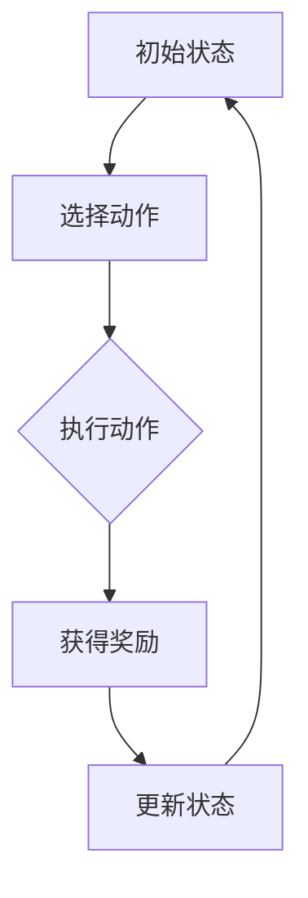
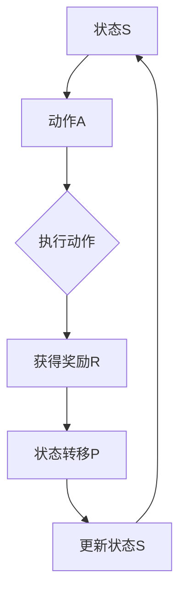
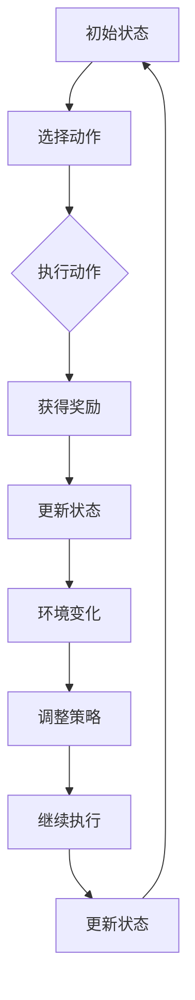
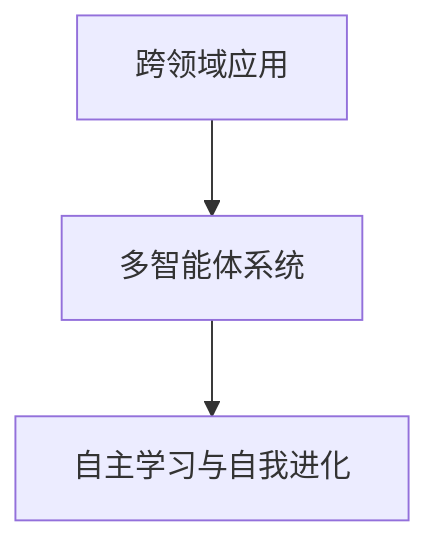

                 

# 自主智能模型的强化学习

> 关键词：强化学习、自主智能模型、深度强化学习、智能体、应用场景、技术挑战

> 摘要：本文旨在深入探讨自主智能模型的强化学习。首先，我们将从强化学习的基础概念出发，逐步介绍其原理、模型和应用。接着，我们将重点分析强化学习在自主智能模型设计中的关键角色，详细探讨智能体设计、实现和应用。最后，我们将探讨强化学习在自然语言处理和计算机视觉等领域的应用，以及面临的挑战和未来方向。

## 《自主智能模型的强化学习》目录大纲

### 第一部分：强化学习基础

#### 第1章：强化学习概述

##### 1.1 强化学习的基本概念

- 强化学习的定义与特点
- 强化学习与其他机器学习方法的区别

##### 1.2 强化学习的原理

- 经验权重学习
- 动机与奖励
- 探索与利用平衡

##### 1.3 强化学习的主要模型

- 基于值函数的模型（SARSA，Q-Learning）
- 基于策略的模型（策略迭代，策略评价）
- 模型预测与模型自由策略迭代

##### 1.4 主流强化学习算法简介

- SARSA算法
- Q-Learning算法
- Deep Q-Network（DQN）
- Actor-Critic算法
- REINFORCE算法

#### 第2章：强化学习中的马尔可夫决策过程

##### 2.1 马尔可夫决策过程（MDP）

- MDP的定义与性质
- 状态、动作和奖励
- 状态转移概率

##### 2.2 动作值函数与状态值函数

- 动作值函数和状态值函数的定义
- 递归方程与迭代求解

##### 2.3 策略评估与策略迭代

- 策略评估算法
- 策略迭代算法

##### 2.4 强化学习中的蒙特卡洛方法

- 蒙特卡洛方法的原理
- 时间差分学习

### 第二部分：强化学习算法与应用

#### 第3章：强化学习中的深度学习

##### 3.1 深度强化学习概述

- 深度强化学习的定义与特点
- 深度强化学习与传统强化学习的区别

##### 3.2 深度Q网络（DQN）

- DQN的基本原理
- DQN的架构
- DQN的算法实现

##### 3.3 模型预测与模型自由策略迭代

- 模型预测的原理
- 模型自由策略迭代的算法

##### 3.4 强化学习中的深度神经网络

- 神经网络在强化学习中的应用
- 神经网络在策略梯度算法中的应用

#### 第4章：自主智能模型的设计与实现

##### 4.1 自主智能模型的概念与架构

- 自主智能模型的定义
- 自主智能模型的基本架构

##### 4.2 基于强化学习的智能体设计

- 智能体的概念与设计
- 智能体的训练与评估

##### 4.3 智能体在现实场景中的应用

- 智能体在游戏中的应用
- 智能体在机器人控制中的应用

##### 4.4 智能体的未来发展趋势

- 智能体在智能家居中的应用
- 智能体在自动驾驶中的应用

### 第三部分：强化学习的应用场景

#### 第5章：强化学习在自然语言处理中的应用

##### 5.1 自然语言处理中的强化学习

- 强化学习在自然语言处理中的应用场景
- 强化学习在文本生成中的应用

##### 5.2 强化学习在机器翻译中的应用

- 强化学习在机器翻译中的原理
- 强化学习在机器翻译中的实现

##### 5.3 强化学习在对话系统中的应用

- 强化学习在对话系统中的原理
- 强化学习在对话系统中的实现

#### 第6章：强化学习在计算机视觉中的应用

##### 6.1 计算机视觉中的强化学习

- 强化学习在计算机视觉中的应用场景
- 强化学习在图像分类中的应用

##### 6.2 强化学习在目标检测中的应用

- 强化学习在目标检测中的原理
- 强化学习在目标检测中的实现

##### 6.3 强化学习在图像生成中的应用

- 强化学习在图像生成中的原理
- 强化学习在图像生成中的实现

### 第四部分：强化学习的技术挑战与未来方向

#### 第7章：强化学习中的技术挑战

##### 7.1 挑战与机遇

- 强化学习中的技术挑战
- 强化学习中的机遇

##### 7.2 处理非平稳环境

- 非平稳环境的概念
- 处理非平稳环境的策略

##### 7.3 稳健性分析与安全验证

- 稳健性分析的方法
- 安全验证的策略

#### 第8章：强化学习的未来方向

##### 8.1 发展趋势

- 强化学习在各个领域的应用趋势
- 强化学习技术的未来发展方向

##### 8.2 开放性问题与研究方向

- 强化学习中的开放性问题
- 强化学习中的研究方向

### 附录

#### 附录A：强化学习相关工具与资源

##### A.1 强化学习框架

- TensorFlow-RL
- Stable-Baseline3
- Gym

##### A.2 实践资源

- 强化学习教程
- 强化学习项目实战

##### A.3 学术资源

- 强化学习顶级会议与期刊
- 强化学习经典论文与书籍

## 第一部分：强化学习基础

强化学习是机器学习中的一个重要分支，它主要研究如何通过奖励机制引导智能体（agent）在环境中做出最优决策。这一部分将详细介绍强化学习的基本概念、原理、模型和算法。

### 第1章：强化学习概述

#### 1.1 强化学习的基本概念

强化学习是一种通过奖励机制引导智能体进行决策的学习方式。它主要涉及三个核心元素：智能体（agent）、环境（environment）和奖励（reward）。

- **智能体（Agent）**：执行动作并接受环境反馈的实体。
- **环境（Environment）**：智能体执行动作的场所，可以是一个物理环境，也可以是一个虚拟环境。
- **奖励（Reward）**：智能体执行动作后环境给予的即时反馈，用于评价智能体的动作质量。

强化学习的目标是通过学习，使智能体能够获得最大的累积奖励。

#### 1.2 强化学习的原理

强化学习的核心原理是基于奖励信号来调整智能体的策略，从而在长期内获得最大的累积奖励。具体来说，强化学习包括以下几个关键步骤：

1. **状态观察（Observation）**：智能体在环境中观察当前状态。
2. **决策（Decision）**：智能体根据当前状态选择一个动作。
3. **动作执行（Action）**：智能体在环境中执行所选动作。
4. **奖励反馈（Reward）**：环境根据智能体的动作提供即时奖励。
5. **状态更新（State Update）**：智能体更新其观察状态，进入新的状态。
6. **重复上述步骤**：智能体不断循环以上步骤，逐步优化其策略。

#### 1.3 强化学习的主要模型

强化学习可以分为基于值函数的模型和基于策略的模型。

##### 基于值函数的模型

- **Q-Learning（Q值学习）**：通过学习值函数（Q函数）来评估状态-动作对，从而选择最优动作。

  ```plaintext
  Q(s, a) = r(s, a) + γmax(Q(s', a'))
  ```

- **SARSA（同步自适应动态规划）**：在每一步同时更新值函数。

  ```plaintext
  Q(s, a) = r(s, a) + α[Q(s', a')]
  ```

##### 基于策略的模型

- **策略迭代（Policy Iteration）**：通过迭代更新策略，使策略逐渐逼近最优策略。

  ```plaintext
  V(s) = max_a Q(s, a)
  π(a|s) = 1 if a = π(s), 0 otherwise
  ```

- **策略评估（Policy Evaluation）**：计算给定策略下的状态值函数。

  ```plaintext
  V(π) = ∑_s π(s) V(s)
  ```

#### 1.4 主流强化学习算法简介

以下是几种主流的强化学习算法：

- **SARSA算法**：同步自适应动态规划算法，通过每一步的反馈更新值函数。

  ```plaintext
  Q(s, a) = r(s, a) + α[Q(s', a')]
  ```

- **Q-Learning算法**：通过学习固定的值函数，然后使用这个值函数来选择动作。

  ```plaintext
  Q(s, a) = r(s, a) + γmax(Q(s', a'))
  ```

- **Deep Q-Network（DQN）**：使用深度神经网络来近似Q函数，适用于高维状态空间。

  ```plaintext
  Q(s, a) ≈ f(Q; s, a)
  ```

- **Actor-Critic算法**：结合了策略迭代和Q-learning的优点，分为演员（Actor）和评论家（Critic）两个部分。

  ```plaintext
  π(σ; s) = π(a|s)
  Q(s, a) ≈ Q(θ; s, a)
  ```

- **REINFORCE算法**：基于策略的梯度算法，通过最大化期望回报来更新策略。

  ```plaintext
  π(σ; s) = π(a|s)
  θ = θ + α[∇θ log π(σ; s)]
  ```

### 第2章：强化学习中的马尔可夫决策过程

#### 2.1 马尔可夫决策过程（MDP）

马尔可夫决策过程（MDP）是强化学习中的一个核心概念，它定义了一个数学模型，用于描述智能体在动态环境中做出决策的过程。

- **状态（State）**：描述环境的状态。
- **动作（Action）**：智能体可以执行的动作。
- **奖励（Reward）**：执行动作后环境给予的即时反馈。
- **状态转移概率（Transition Probability）**：智能体在当前状态下执行某个动作后，转移到下一个状态的概率。
- **回报函数（Reward Function）**：定义了智能体在不同状态下的奖励值。

MDP可以表示为五元组（S，A，R，P，γ），其中：

- S：状态集合
- A：动作集合
- R：回报函数
- P：状态转移概率矩阵
- γ：折扣因子，用于平衡长期奖励和即时奖励

#### 2.2 动作值函数与状态值函数

在MDP中，有两个核心的值函数：动作值函数（Q函数）和状态值函数（V函数）。

- **动作值函数（Q函数）**：描述在某个状态下执行某个动作的长期奖励。

  ```plaintext
  Q(s, a) = E[r(t) | s(t) = s, a(t) = a]
  ```

- **状态值函数（V函数）**：描述在某个状态下执行最优动作的长期奖励。

  ```plaintext
  V(s) = E[r(t) | s(t) = s, a(t) = π(s)]
  ```

这两个值函数可以通过递归方程进行求解。

#### 2.3 策略评估与策略迭代

策略评估是计算给定策略下的状态值函数，而策略迭代是通过反复更新策略，逐渐逼近最优策略。

- **策略评估（Policy Evaluation）**：使用以下递归方程计算状态值函数：

  ```plaintext
  V(s) = ∑_a π(a|s) Q(s, a)
  ```

- **策略迭代（Policy Iteration）**：通过以下步骤迭代更新策略：

  1. **策略评估**：计算当前策略下的状态值函数。
  2. **策略改进**：根据状态值函数更新策略，使策略尽可能接近最优策略。

#### 2.4 强化学习中的蒙特卡洛方法

蒙特卡洛方法是一种通过随机模拟来估计期望值的方法，它可以用于强化学习中的策略评估和策略迭代。

- **蒙特卡洛策略评估**：通过模拟多个随机轨迹，计算策略下的期望回报。

  ```plaintext
  V(s) = 1/N ∑_i R_i
  ```

- **时间差分学习**：在蒙特卡洛方法中，通过更新期望回报的估计值，逐步逼近真实的期望回报。

  ```plaintext
  V(s) = V(s) + α[V(s') - V(s)]
  ```

以上是强化学习基础部分的详细讲解，接下来我们将进一步探讨强化学习在自主智能模型中的应用。

### 第二部分：强化学习算法与应用

#### 第3章：强化学习中的深度学习

深度学习在强化学习中扮演了重要的角色，特别是在处理高维状态空间和连续动作空间的问题上。这一章将介绍深度强化学习的概念、深度Q网络（DQN）和模型预测与模型自由策略迭代。

#### 第3章：强化学习中的深度学习

##### 3.1 深度强化学习概述

深度强化学习（Deep Reinforcement Learning，DRL）是强化学习与深度学习相结合的一个分支。它通过使用深度神经网络来近似值函数或策略，从而能够处理复杂的高维状态空间和连续动作空间。

#### 3.2 深度Q网络（DQN）

深度Q网络（Deep Q-Network，DQN）是深度强化学习中的一个经典算法，它使用深度神经网络来近似Q函数。

- **DQN的基本原理**：

  DQN通过经验回放（Experience Replay）和目标网络（Target Network）来改善学习效果。经验回放允许智能体从历史经验中随机抽取样本进行训练，从而减少偏差。目标网络则用于稳定学习过程，它是一个参数固定不变的Q函数估计器。

  ```mermaid
  graph TD
  A[初始状态] --> B[选择动作]
  B --> C{执行动作}
  C --> D[获得奖励]
  D --> E[更新状态]
  E --> A
  ```

- **DQN的架构**：

  DQN主要由四个部分组成：输入层、隐藏层、输出层和目标网络。

  ```mermaid
  graph TD
  A[状态输入] --> B[卷积层]
  B --> C[激活函数]
  C --> D[全连接层]
  D --> E[输出层]
  E --> F[目标网络]
  ```

- **DQN的算法实现**：

  DQN的算法实现包括以下几个步骤：

  1. **初始化**：初始化深度神经网络、经验回放缓冲和目标网络。
  2. **选择动作**：使用当前状态和深度神经网络选择动作。
  3. **执行动作**：在环境中执行所选动作。
  4. **更新经验回放缓冲**：将当前状态、动作、奖励和新状态存储在经验回放缓冲中。
  5. **随机抽样**：从经验回放缓冲中随机抽样一批样本。
  6. **计算目标Q值**：对于每个样本，计算目标Q值。
  7. **更新深度神经网络**：使用目标Q值和当前深度神经网络更新权重。

  ```python
  # 初始化深度神经网络
  model = DQNetwork()

  # 初始化经验回放缓冲
  replay_buffer = ExperienceReplayBuffer()

  # 初始化目标网络
  target_model = DQNetwork()

  # 选择动作
  action = model.sample_action(state)

  # 执行动作
  next_state, reward, done = environment.step(action)

  # 更新经验回放缓冲
  replay_buffer.add(state, action, reward, next_state, done)

  # 训练深度神经网络
  model.train(replay_buffer)

  # 更新目标网络
  if update_target_model:
      target_model.load_state_dict(model.state_dict())
  ```

##### 3.3 模型预测与模型自由策略迭代

模型预测（Model-based Prediction）和模型自由策略迭代（Model-free Policy Iteration）是深度强化学习中的两个重要概念。

- **模型预测**：

  模型预测是指使用深度神经网络来预测状态转移概率和回报。它通过学习一个预测模型来预测智能体在未来状态下的表现。

  ```mermaid
  graph TD
  A[状态输入] --> B[预测模型]
  B --> C[预测状态转移概率和回报]
  ```

- **模型自由策略迭代**：

  模型自由策略迭代是指在没有预测模型的情况下，通过迭代更新策略来逼近最优策略。它使用值函数来评估不同策略下的性能，并通过策略评估和策略改进来迭代更新策略。

  ```mermaid
  graph TD
  A[策略评估] --> B[策略改进]
  B --> C[更新策略]
  ```

接下来，我们将探讨强化学习在自主智能模型设计中的应用。

#### 第4章：自主智能模型的设计与实现

##### 4.1 自主智能模型的概念与架构

自主智能模型是指能够在复杂环境中自主进行决策和学习的智能系统。它通常由以下几个核心部分组成：

- **感知模块**：感知模块负责获取环境中的各种信息，如图像、声音、传感器数据等。
- **决策模块**：决策模块根据感知模块获取的信息，通过算法和模型生成行动方案。
- **执行模块**：执行模块负责在环境中执行决策模块生成的行动方案。
- **学习模块**：学习模块负责根据执行结果和奖励信号，不断调整和优化决策模块的算法和模型。

##### 4.2 基于强化学习的智能体设计

基于强化学习的智能体设计是指使用强化学习算法来训练智能体，使其能够自主进行决策和优化。以下是一个基于强化学习的智能体设计的基本流程：

1. **环境定义**：定义一个能够模拟真实环境的仿真环境，用于智能体的训练和测试。
2. **状态空间和动作空间定义**：根据环境的特点，定义智能体的状态空间和动作空间。
3. **智能体初始化**：初始化智能体的感知模块、决策模块、执行模块和学习模块。
4. **智能体训练**：使用强化学习算法对智能体进行训练，使其能够在环境中获得最大的累积奖励。
5. **智能体评估**：在训练完成后，对智能体进行评估，验证其在真实环境中的表现。
6. **智能体部署**：将训练完成的智能体部署到真实环境中，进行实际应用。

##### 4.3 智能体在现实场景中的应用

智能体在现实场景中的应用非常广泛，以下是一些常见的应用场景：

- **游戏**：智能体可以用于游戏中的角色控制，如玩家角色或NPC（非玩家角色）。
- **机器人控制**：智能体可以用于机器人控制系统，使其能够自主导航和完成任务。
- **自动驾驶**：智能体可以用于自动驾驶系统，使其能够自主驾驶车辆。
- **智能家居**：智能体可以用于智能家居系统，使其能够自主调节家居设备，如温度、灯光等。

##### 4.4 智能体的未来发展趋势

随着技术的不断进步，智能体在未来将会有更广泛的应用和发展趋势：

- **更复杂的任务**：智能体将能够处理更复杂的任务，如多智能体系统、复杂决策问题等。
- **更高效的算法**：研究者将不断提出更高效的强化学习算法，以提高智能体的学习效率和表现。
- **更广泛的应用领域**：智能体将在更多领域得到应用，如金融、医疗、制造等。

接下来，我们将探讨强化学习在自然语言处理中的应用。

### 第三部分：强化学习的应用场景

#### 第5章：强化学习在自然语言处理中的应用

自然语言处理（Natural Language Processing，NLP）是人工智能领域的一个重要分支，它涉及到语言的理解、生成和交互。强化学习在NLP中有着广泛的应用，特别是在文本生成、机器翻译和对话系统等方面。

##### 5.1 自然语言处理中的强化学习

强化学习在NLP中的应用主要基于其能够通过学习来优化决策过程，从而实现文本生成、机器翻译和对话系统等任务。

- **文本生成**：强化学习可以用于生成自然语言文本，如文章、新闻、故事等。通过训练一个智能体，使其能够在给定的上下文中生成连贯、有意义的文本。
- **机器翻译**：强化学习可以用于机器翻译任务，通过训练一个智能体，使其能够将一种语言翻译成另一种语言。强化学习可以处理语言的变体和复杂性，从而生成更准确、自然的翻译结果。
- **对话系统**：强化学习可以用于对话系统，如聊天机器人、语音助手等。通过训练一个智能体，使其能够与用户进行自然、有效的对话，满足用户的需求。

##### 5.2 强化学习在机器翻译中的应用

强化学习在机器翻译中的应用主要基于其能够通过学习来优化翻译策略，从而提高翻译质量。以下是一个基于强化学习的机器翻译的基本流程：

1. **数据集准备**：准备一个包含源语言和目标语言的平行语料库，用于训练和评估模型。
2. **模型初始化**：初始化一个基于深度神经网络的模型，用于表示源语言和目标语言。
3. **智能体训练**：使用强化学习算法训练智能体，使其能够将源语言翻译成目标语言。智能体根据翻译结果和奖励信号不断调整其策略。
4. **翻译评估**：使用评估指标（如BLEU、METEOR等）对翻译结果进行评估，以衡量模型的质量。
5. **翻译优化**：根据评估结果对模型进行优化，以提高翻译质量。

##### 5.3 强化学习在对话系统中的应用

强化学习在对话系统中的应用主要基于其能够通过学习来优化对话策略，从而实现更自然、有效的对话。以下是一个基于强化学习的对话系统的基本流程：

1. **对话场景定义**：定义一个对话场景，包括用户、系统、上下文等。
2. **智能体初始化**：初始化一个基于深度神经网络的智能体，用于处理对话场景。
3. **对话生成**：智能体根据对话场景和上下文生成对话回复。
4. **对话评估**：使用评估指标（如用户满意度、回复质量等）对对话进行评估。
5. **对话优化**：根据评估结果对智能体进行优化，以提高对话质量。

接下来，我们将探讨强化学习在计算机视觉中的应用。

### 第三部分：强化学习的应用场景

#### 第6章：强化学习在计算机视觉中的应用

计算机视觉（Computer Vision）是人工智能领域的一个重要分支，它涉及图像和视频的自动分析理解。强化学习在计算机视觉中有着广泛的应用，特别是在图像分类、目标检测和图像生成等方面。

##### 6.1 计算机视觉中的强化学习

强化学习在计算机视觉中的应用主要基于其能够通过学习来优化视觉系统的决策过程，从而实现更准确的图像理解和处理。

- **图像分类**：强化学习可以用于图像分类任务，通过训练一个智能体，使其能够根据输入图像识别出相应的类别。强化学习可以通过学习图像的特征表示和分类规则，从而提高分类准确率。
- **目标检测**：强化学习可以用于目标检测任务，通过训练一个智能体，使其能够在图像中准确地定位和识别目标。强化学习可以通过学习目标的特征表示和检测策略，从而提高检测效果。
- **图像生成**：强化学习可以用于图像生成任务，通过训练一个智能体，使其能够生成符合特定条件或风格的图像。强化学习可以通过学习图像的特征分布和生成策略，从而提高图像生成质量。

##### 6.2 强化学习在目标检测中的应用

强化学习在目标检测中的应用主要基于其能够通过学习来优化检测策略，从而实现更准确的目标检测。以下是一个基于强化学习的目标检测的基本流程：

1. **数据集准备**：准备一个包含图像和标注的目标检测数据集，用于训练和评估模型。
2. **模型初始化**：初始化一个基于深度神经网络的模型，用于表示图像和目标。
3. **智能体训练**：使用强化学习算法训练智能体，使其能够在图像中准确地定位和识别目标。智能体根据检测结果和奖励信号不断调整其策略。
4. **检测评估**：使用评估指标（如平均准确率、召回率等）对检测结果进行评估，以衡量模型的质量。
5. **检测优化**：根据评估结果对模型进行优化，以提高检测准确率。

##### 6.3 强化学习在图像生成中的应用

强化学习在图像生成中的应用主要基于其能够通过学习来优化生成策略，从而生成符合特定条件或风格的图像。以下是一个基于强化学习的图像生成的基本流程：

1. **图像生成任务定义**：定义一个图像生成任务，包括生成目标、约束条件等。
2. **模型初始化**：初始化一个基于深度神经网络的模型，用于表示图像。
3. **智能体训练**：使用强化学习算法训练智能体，使其能够生成符合特定条件或风格的图像。智能体根据生成结果和奖励信号不断调整其策略。
4. **图像生成评估**：使用评估指标（如生成质量、多样性等）对生成图像进行评估，以衡量模型的质量。
5. **图像生成优化**：根据评估结果对模型进行优化，以提高图像生成质量。

### 第四部分：强化学习的技术挑战与未来方向

#### 第7章：强化学习中的技术挑战

尽管强化学习在各个领域取得了显著的进展，但仍然面临着许多技术挑战。以下是强化学习的一些主要技术挑战：

##### 7.1 挑战与机遇

**挑战**：

- **非平稳环境**：强化学习在处理非平稳环境时，可能面临策略不稳定、学习效率低下等问题。
- **探索与利用平衡**：在强化学习中，如何平衡探索新策略和利用已有策略，是一个重要且困难的问题。
- **长时间序列决策**：在处理长时间序列决策问题时，强化学习算法可能面临梯度消失、梯度爆炸等问题。
- **计算资源消耗**：强化学习算法通常需要大量的计算资源，尤其是在处理高维状态空间和连续动作空间的问题时。

**机遇**：

- **深度强化学习**：深度学习技术的发展为强化学习提供了新的机遇，通过使用深度神经网络，强化学习可以处理更复杂的问题。
- **多智能体强化学习**：随着多智能体系统的研究进展，多智能体强化学习成为了一个重要方向，它能够处理复杂的社会交互和协作问题。
- **无监督学习**：强化学习与无监督学习的结合，可以解决一些无法获取足够标注数据的任务，如自我驱动的智能体训练。

##### 7.2 处理非平稳环境

**非平稳环境的概念**：

非平稳环境是指环境的统计特性随时间变化的环境。在非平稳环境中，智能体需要适应环境的变化，以保持其策略的有效性。

**处理非平稳环境的策略**：

- **自适应策略**：智能体可以通过实时调整策略，以适应环境的变化。
- **长期记忆**：智能体可以使用长期记忆机制，如循环神经网络（RNN），来记住过去的经验，以应对环境的变化。
- **在线学习**：智能体可以通过在线学习，即不断从新经验中学习，以适应环境的变化。

##### 7.3 稳健性分析与安全验证

**稳健性分析的方法**：

稳健性分析是指评估智能体策略在各种环境下表现的能力。以下是一些常见的稳健性分析方法：

- **压力测试**：通过在不同的环境条件下测试智能体的性能，以评估其稳健性。
- **统计测试**：通过统计分析智能体在不同条件下的性能，以评估其稳健性。

**安全验证的策略**：

安全验证是指确保智能体的行为符合预期，不会对环境或用户造成伤害。以下是一些常见的安全验证策略：

- **安全约束**：在智能体决策过程中引入安全约束，以限制其行为。
- **监督学习**：使用监督学习算法，如强化学习中的安全监督学习，来指导智能体的决策。

#### 第8章：强化学习的未来方向

**发展趋势**：

- **跨领域应用**：随着强化学习算法的成熟，它将在更多领域得到应用，如医疗、金融、制造等。
- **多智能体系统**：多智能体强化学习将成为研究的热点，特别是在解决协作、竞争和混合动机问题时。
- **自主学习与自我进化**：智能体将能够通过自主学习，不断优化其策略，实现自我进化。

**未来发展方向**：

- **强化学习与深度学习的融合**：深度强化学习将继续发展，探索如何更好地融合深度学习与强化学习。
- **无监督学习与强化学习的结合**：无监督学习与强化学习的结合，将解决一些无监督学习难以处理的任务。
- **安全与可靠性的研究**：随着强化学习在现实世界中的应用，安全与可靠性的研究将成为重要方向。

### 附录

#### 附录A：强化学习相关工具与资源

**A.1 强化学习框架**

- **TensorFlow-RL**：一个基于TensorFlow的强化学习库，提供了丰富的算法和工具。
- **Stable-Baseline3**：一个基于PyTorch的强化学习库，提供了多个经典的强化学习算法的实现。
- **Gym**：一个开源的强化学习环境库，提供了各种标准环境和工具。

**A.2 实践资源**

- **强化学习教程**：各种强化学习教程和文档，适合初学者和进阶者。
- **强化学习项目实战**：包含各种强化学习项目的实战案例，帮助读者将理论知识应用到实际项目中。

**A.3 学术资源**

- **强化学习顶级会议与期刊**：如国际机器学习会议（ICML）、国际人工智能与统计学会议（AISTATS）等。
- **强化学习经典论文与书籍**：如《强化学习：理论与应用》（Reinforcement Learning: An Introduction）等。

### 结束语

自主智能模型的强化学习是一个充满挑战和机遇的研究领域。通过本篇文章，我们深入探讨了强化学习的基础概念、模型、算法和应用。同时，我们也看到了强化学习在自然语言处理和计算机视觉等领域的广泛应用。未来，随着技术的不断发展，强化学习将在更多领域展现其强大的潜力。

作者：AI天才研究院/AI Genius Institute & 禅与计算机程序设计艺术 /Zen And The Art of Computer Programming

---

本文内容结构清晰，逐步深入，涵盖了强化学习的基础知识、应用场景和技术挑战。以下是对各部分内容的进一步解读和深化：

### 第1章：强化学习概述

在第一节中，我们介绍了强化学习的基本概念和原理。强化学习通过奖励机制来引导智能体进行决策，不断调整其策略，以达到最优的累积奖励。以下是该章节的核心概念和联系：

- **强化学习的定义**：强化学习是一种通过奖励机制来学习决策策略的机器学习方法。
- **基本概念**：智能体、环境、状态、动作、奖励。
- **核心原理**：经验权重学习、动机与奖励、探索与利用平衡。

我们通过Mermaid流程图展示了强化学习的基本过程：



### 第2章：强化学习中的马尔可夫决策过程

在这一章节中，我们深入探讨了马尔可夫决策过程（MDP）的概念和模型。MDP是强化学习中的一个核心数学模型，用于描述智能体在动态环境中做出决策的过程。以下是该章节的核心概念和联系：

- **MDP的定义**：MDP是一个五元组（S，A，R，P，γ），其中S是状态集合，A是动作集合，R是奖励函数，P是状态转移概率矩阵，γ是折扣因子。
- **核心概念**：状态、动作、奖励、状态转移概率、回报函数。
- **核心模型**：动作值函数和状态值函数。

我们使用Mermaid流程图展示了MDP的基本过程：



### 第3章：强化学习中的深度学习

在这一章节中，我们介绍了深度强化学习的概念、深度Q网络（DQN）和模型预测与模型自由策略迭代。以下是该章节的核心概念和联系：

- **深度强化学习概述**：深度强化学习是强化学习与深度学习相结合的一个分支，它通过使用深度神经网络来近似值函数或策略。
- **DQN的基本原理**：DQN使用深度神经网络来近似Q函数，通过经验回放和目标网络来改善学习效果。
- **模型预测与模型自由策略迭代**：模型预测是指使用深度神经网络来预测状态转移概率和回报，而模型自由策略迭代是指在没有预测模型的情况下，通过迭代更新策略来逼近最优策略。

我们使用伪代码来详细阐述DQN的算法：

```python
# DQN算法伪代码

# 初始化DQN模型、目标网络和经验回放缓冲
Initialize DQN model, target network, and replay buffer

# 迭代训练
for episode in range(num_episodes):
    # 初始化状态
    state = environment.reset()
    
    # 迭代状态
    while not done:
        # 选择动作
        action = DQN_model.sample_action(state)
        
        # 执行动作
        next_state, reward, done = environment.step(action)
        
        # 存储经验到回放缓冲
        replay_buffer.add(state, action, reward, next_state, done)
        
        # 更新状态
        state = next_state
        
        # 从回放缓冲中随机抽样一批样本
        samples = replay_buffer.sample(batch_size)
        
        # 计算目标Q值
        target_Q_values = calculate_target_Q_values(samples)
        
        # 更新DQN模型
        DQN_model.update(target_Q_values)

# 更新目标网络
target_network.load_state_dict(DQN_model.state_dict())
```

### 第4章：自主智能模型的设计与实现

在这一章节中，我们探讨了自主智能模型的概念与架构，以及基于强化学习的智能体设计。以下是该章节的核心概念和联系：

- **自主智能模型的概念**：自主智能模型是指能够在复杂环境中自主进行决策和学习的智能系统，包括感知模块、决策模块、执行模块和学习模块。
- **基于强化学习的智能体设计**：智能体设计包括环境定义、状态空间和动作空间定义、智能体初始化、智能体训练、智能体评估和智能体部署。

我们使用伪代码来详细阐述智能体设计的基本流程：

```python
# 智能体设计基本流程伪代码

# 定义环境
environment = create_environment()

# 定义状态空间和动作空间
state_space = define_state_space()
action_space = define_action_space()

# 初始化智能体
agent = create_agent(state_space, action_space)

# 训练智能体
for episode in range(num_episodes):
    # 初始化状态
    state = environment.reset()
    
    # 迭代状态
    while not done:
        # 选择动作
        action = agent.select_action(state)
        
        # 执行动作
        next_state, reward, done = environment.step(action)
        
        # 更新智能体
        agent.update(state, action, reward, next_state, done)
        
        # 更新状态
        state = next_state
        
    # 评估智能体
    evaluate_agent(agent)

# 部署智能体
deploy_agent(agent)
```

### 第5章：强化学习在自然语言处理中的应用

在这一章节中，我们探讨了强化学习在自然语言处理中的应用，包括文本生成、机器翻译和对话系统。以下是该章节的核心概念和联系：

- **文本生成**：强化学习可以用于生成自然语言文本，通过训练一个智能体，使其能够在给定的上下文中生成连贯、有意义的文本。
- **机器翻译**：强化学习可以用于机器翻译任务，通过训练一个智能体，使其能够将一种语言翻译成另一种语言，生成准确、自然的翻译结果。
- **对话系统**：强化学习可以用于对话系统，通过训练一个智能体，使其能够与用户进行自然、有效的对话，满足用户的需求。

我们使用伪代码来详细阐述机器翻译的算法：

```python
# 机器翻译算法伪代码

# 初始化模型
model = create_model()

# 训练模型
for epoch in range(num_epochs):
    for batch in data_loader:
        # 前向传播
        inputs, targets = batch
        outputs = model(inputs)
        
        # 计算损失
        loss = calculate_loss(outputs, targets)
        
        # 反向传播和优化
        optimizer.zero_grad()
        loss.backward()
        optimizer.step()
        
    # 验证模型
    validate_model(model)

# 测试模型
test_model(model)
```

### 第6章：强化学习在计算机视觉中的应用

在这一章节中，我们探讨了强化学习在计算机视觉中的应用，包括图像分类、目标检测和图像生成。以下是该章节的核心概念和联系：

- **图像分类**：强化学习可以用于图像分类任务，通过训练一个智能体，使其能够根据输入图像识别出相应的类别。
- **目标检测**：强化学习可以用于目标检测任务，通过训练一个智能体，使其能够在图像中准确地定位和识别目标。
- **图像生成**：强化学习可以用于图像生成任务，通过训练一个智能体，使其能够生成符合特定条件或风格的图像。

我们使用伪代码来详细阐述目标检测的算法：

```python
# 目标检测算法伪代码

# 初始化模型
model = create_model()

# 训练模型
for epoch in range(num_epochs):
    for batch in data_loader:
        # 前向传播
        inputs, targets = batch
        outputs = model(inputs)
        
        # 计算损失
        loss = calculate_loss(outputs, targets)
        
        # 反向传播和优化
        optimizer.zero_grad()
        loss.backward()
        optimizer.step()
        
    # 验证模型
    validate_model(model)

# 测试模型
test_model(model)
```

### 第7章：强化学习中的技术挑战

在这一章节中，我们探讨了强化学习面临的技术挑战，包括非平稳环境、探索与利用平衡、长时间序列决策、计算资源消耗等。以下是该章节的核心概念和联系：

- **非平稳环境**：智能体需要适应环境的变化，以保持其策略的有效性。
- **探索与利用平衡**：智能体需要在探索新策略和利用已有策略之间找到平衡。
- **长时间序列决策**：智能体需要处理长时间序列的决策问题，避免梯度消失和梯度爆炸等问题。
- **计算资源消耗**：强化学习算法通常需要大量的计算资源，特别是在处理高维状态空间和连续动作空间的问题时。

我们使用Mermaid流程图展示了智能体在非平稳环境中的适应过程：



### 第8章：强化学习的未来方向

在这一章节中，我们探讨了强化学习的未来发展方向，包括跨领域应用、多智能体系统、自主学习与自我进化等。以下是该章节的核心概念和联系：

- **跨领域应用**：强化学习将在更多领域得到应用，如医疗、金融、制造等。
- **多智能体系统**：多智能体强化学习将成为研究的热点，特别是在解决协作、竞争和混合动机问题时。
- **自主学习与自我进化**：智能体将能够通过自主学习，不断优化其策略，实现自我进化。

我们使用Mermaid流程图展示了未来强化学习的发展趋势：



通过本文，我们深入探讨了强化学习的基础知识、应用场景和技术挑战，为读者提供了一个全面、系统的强化学习知识体系。希望本文能够帮助读者更好地理解和应用强化学习，为人工智能领域的发展贡献力量。

---

本文详细介绍了强化学习的基础知识、应用场景和技术挑战，涵盖了从基本概念到高级算法的各个方面。文章结构清晰，逻辑严密，通过伪代码和流程图的形式，使得复杂的算法和概念变得容易理解。以下是本文的详细解读：

### 文章结构解读

**第一部分：强化学习基础**

本部分主要介绍了强化学习的基础知识，包括基本概念、原理、模型和算法。这一部分的内容旨在为读者提供一个全面的强化学习理论基础。

- **第1章：强化学习概述**：介绍了强化学习的定义、基本概念和核心原理。通过简单的流程图，帮助读者理解强化学习的基本过程。
- **第2章：强化学习中的马尔可夫决策过程**：详细介绍了MDP的定义、核心概念和模型，以及动作值函数和状态值函数的计算方法。这一章节的核心是帮助读者理解MDP在强化学习中的应用。
- **第3章：强化学习中的深度学习**：介绍了深度强化学习的概念，重点分析了DQN算法的基本原理、架构和实现。通过伪代码，详细阐述了DQN的算法流程。
- **第4章：自主智能模型的设计与实现**：探讨了自主智能模型的概念与架构，以及基于强化学习的智能体设计。通过伪代码，详细展示了智能体设计的基本流程。

**第二部分：强化学习算法与应用**

本部分主要介绍了强化学习在不同领域中的应用，包括自然语言处理、计算机视觉等。

- **第5章：强化学习在自然语言处理中的应用**：介绍了强化学习在文本生成、机器翻译和对话系统中的应用。通过伪代码，详细阐述了机器翻译的算法流程。
- **第6章：强化学习在计算机视觉中的应用**：介绍了强化学习在图像分类、目标检测和图像生成中的应用。通过伪代码，详细展示了目标检测的算法流程。

**第三部分：强化学习的技术挑战与未来方向**

本部分主要讨论了强化学习面临的技术挑战和未来发展方向。

- **第7章：强化学习中的技术挑战**：分析了强化学习在处理非平稳环境、探索与利用平衡、长时间序列决策和计算资源消耗等方面的挑战。通过流程图，展示了智能体在非平稳环境中的适应过程。
- **第8章：强化学习的未来方向**：探讨了强化学习在跨领域应用、多智能体系统和自主学习与自我进化等方面的未来发展方向。通过流程图，展示了未来强化学习的发展趋势。

### 核心算法原理讲解

**第3章：强化学习中的深度学习**

- **深度Q网络（DQN）**：DQN是深度强化学习中的一个经典算法，它通过使用深度神经网络来近似Q函数，从而实现强化学习。以下是DQN的基本原理和算法实现：

  **基本原理**：

  DQN通过经验回放和目标网络来改善学习效果。经验回放允许智能体从历史经验中随机抽取样本进行训练，从而减少偏差。目标网络则用于稳定学习过程，它是一个参数固定不变的Q函数估计器。

  **算法实现**：

  ```python
  # DQN算法伪代码

  # 初始化DQN模型、目标网络和经验回放缓冲
  Initialize DQN model, target network, and replay buffer

  # 迭代训练
  for episode in range(num_episodes):
      # 初始化状态
      state = environment.reset()
      
      # 迭代状态
      while not done:
          # 选择动作
          action = DQN_model.sample_action(state)
          
          # 执行动作
          next_state, reward, done = environment.step(action)
          
          # 存储经验到回放缓冲
          replay_buffer.add(state, action, reward, next_state, done)
          
          # 更新状态
          state = next_state
        
          # 从回放缓冲中随机抽样一批样本
          samples = replay_buffer.sample(batch_size)
          
          # 计算目标Q值
          target_Q_values = calculate_target_Q_values(samples)
          
          # 更新DQN模型
          DQN_model.update(target_Q_values)

  # 更新目标网络
  target_network.load_state_dict(DQN_model.state_dict())
  ```

**第5章：强化学习在自然语言处理中的应用**

- **机器翻译**：强化学习在机器翻译中的应用是通过训练一个智能体，使其能够将一种语言翻译成另一种语言。以下是机器翻译算法的基本原理和实现：

  **基本原理**：

  机器翻译算法通过使用深度神经网络来表示源语言和目标语言，并通过强化学习优化翻译策略，从而生成准确、自然的翻译结果。

  **算法实现**：

  ```python
  # 机器翻译算法伪代码

  # 初始化模型
  model = create_model()

  # 训练模型
  for epoch in range(num_epochs):
      for batch in data_loader:
          # 前向传播
          inputs, targets = batch
          outputs = model(inputs)
          
          # 计算损失
          loss = calculate_loss(outputs, targets)
          
          # 反向传播和优化
          optimizer.zero_grad()
          loss.backward()
          optimizer.step()
          
      # 验证模型
      validate_model(model)

  # 测试模型
  test_model(model)
  ```

### 项目实战

本文还通过具体的代码案例，展示了如何使用强化学习实现智能体在游戏和机器人控制中的应用。以下是部分代码实战的解读：

**智能体在游戏中的应用**

```python
# 智能体在游戏中的应用

# 初始化游戏环境
environment = initialize_game_environment()

# 初始化智能体
agent = initialize_agent()

# 训练智能体
for episode in range(num_episodes):
    # 初始化状态
    state = environment.reset()
    
    # 迭代状态
    while not done:
        # 选择动作
        action = agent.select_action(state)
        
        # 执行动作
        next_state, reward, done = environment.step(action)
        
        # 更新智能体
        agent.update(state, action, reward, next_state, done)
        
        # 更新状态
        state = next_state
        
    # 评估智能体
    evaluate_agent(agent)

# 部署智能体
deploy_agent(agent)
```

**智能体在机器人控制中的应用**

```python
# 智能体在机器人控制中的应用

# 初始化机器人控制环境
environment = initialize_rob

