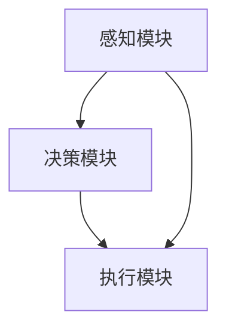

                 

## 《自动驾驶公司的技术路线之争》

自动驾驶作为现代科技创新的前沿领域，正逐步从理论走向现实。自动驾驶公司之间的技术路线之争，不仅反映了技术发展的多样性，也揭示了产业变革的深刻内涵。本文旨在通过深入分析国内外主要自动驾驶公司的技术路线，探讨其异同点、竞争优势与挑战，并对自动驾驶技术的未来趋势进行展望。

### 关键词
- 自动驾驶
- 技术路线
- 特斯拉
- 通用汽车
- 百度
- 英伟达
- 小鹏汽车
- 感知与定位技术
- 决策与控制技术

### 摘要
本文首先介绍了自动驾驶技术的理论基础，包括感知与定位技术、决策与控制技术等。然后，分析了国内外主要自动驾驶公司的技术路线，比较了它们的异同点。最后，探讨了自动驾驶技术的未来趋势，以及可能带来的社会影响。通过这篇文章，读者可以全面了解自动驾驶技术的现状与发展前景。

----------------------------------------------------------------

## 第一部分 自动驾驶技术的理论基础

### 第1章 自动驾驶技术概述

自动驾驶技术是指利用计算机、传感器和通信设备实现汽车自主驾驶的技术。从发展历史来看，自动驾驶技术经历了多个阶段，从最初的辅助驾驶到今天的完全自动驾驶，技术不断成熟和进步。

### 1.1 自动驾驶技术的发展历史

#### 1.1.1 自动驾驶技术的前身
自动驾驶技术的起源可以追溯到20世纪40年代，当时的研究主要集中在车辆导航和路径规划。1950年，美国国防高级研究计划局（DARPA）启动了“导航技术”（Navigation Technology）项目，这是自动驾驶研究的开端。

#### 1.1.2 自动驾驶技术的发展阶段
自动驾驶技术的发展大致可以分为以下几个阶段：
- **第一阶段：辅助驾驶（20世纪80年代至90年代）**：这个阶段的自动驾驶技术主要是实现车辆的辅助功能，如自动泊车、巡航控制等。
- **第二阶段：部分自动驾驶（2000年代至2010年代）**：这个阶段的自动驾驶技术开始实现部分自动化功能，如自动车道保持、自适应巡航控制等。
- **第三阶段：完全自动驾驶（2010年代至今）**：这个阶段的自动驾驶技术目标是实现车辆的完全自动化，包括车辆自主决策、路径规划、避障等。

#### 1.1.3 当前自动驾驶技术的发展趋势
当前自动驾驶技术正处于快速发展阶段，随着人工智能、大数据、云计算等技术的进步，自动驾驶技术将越来越成熟。未来，自动驾驶技术将有望在更多场景得到应用，如个人出行、商业物流、公共交通等。

### 1.2 自动驾驶技术的核心概念

#### 1.2.1 自动驾驶系统架构
自动驾驶系统通常包括感知、决策、执行三个主要模块。

- **感知模块**：负责收集车辆周围环境的信息，如激光雷达、摄像头、超声波传感器等。
- **决策模块**：负责分析感知信息，并根据预设的规则或算法做出驾驶决策。
- **执行模块**：负责执行决策模块的决策，控制车辆的加速、转向、制动等操作。

#### 1.2.2 自动驾驶技术的基本功能
自动驾驶技术的基本功能包括：

- **车道保持**：车辆能够保持在指定车道内行驶。
- **自动巡航**：车辆能够根据前方车辆的速度自动调整车速。
- **自动泊车**：车辆能够自主完成停车操作。
- **交通标识识别**：车辆能够识别和理解交通标识。
- **避障**：车辆能够检测并避开障碍物。

#### 1.2.3 自动驾驶技术面临的挑战
自动驾驶技术面临的主要挑战包括：

- **感知与定位的准确性**：自动驾驶系统需要高精度的感知与定位技术，以确保车辆在复杂环境中的安全行驶。
- **决策与控制的实时性**：自动驾驶系统需要在极短的时间内做出决策并执行，以应对突发情况。
- **人机交互**：自动驾驶系统需要与驾驶员和乘客建立良好的交互，确保驾驶安全。
- **法律法规**：自动驾驶技术的发展需要与法律法规相适应，确保合法合规。

### 1.3 自动驾驶技术的应用场景

#### 1.3.1 个人出行
个人出行是自动驾驶技术最直接的应用场景。自动驾驶汽车可以提供更便捷、更安全的个人出行服务，特别是在城市拥堵的道路上。

#### 1.3.2 商业物流
自动驾驶技术在商业物流领域具有巨大潜力。自动驾驶卡车和无人机可以降低物流成本，提高运输效率。

#### 1.3.3 公共交通
自动驾驶技术有望在公共交通领域带来革命性的变化。自动驾驶公交车、出租车和共享汽车可以提供更高效、更舒适的出行体验。

#### 1.3.4 智慧城市
自动驾驶技术是智慧城市的重要组成部分。自动驾驶车辆可以与城市基础设施进行实时通信，优化交通流量，提高城市管理效率。

---

**核心概念与联系：** 自动驾驶系统的架构可以用 Mermaid 流程图表示：



**核心算法原理讲解：**

感知模块的核心算法包括：

- **激光雷达数据预处理**：对采集到的激光点云数据进行去噪、滤波和降采样。
- **图像处理**：对摄像头采集的图像进行预处理，如去噪、增强、目标检测等。

决策模块的核心算法包括：

- **路径规划**：基于感知模块提供的信息，计算出最优行驶路径。
- **决策树**：根据路况和环境信息，选择最优的驾驶操作。

执行模块的核心算法包括：

- **PID控制**：用于控制车辆的加速、转向和制动。
- **模糊控制**：用于处理不确定性和复杂环境下的驾驶操作。

---

本文通过详细阐述自动驾驶技术的理论基础，为后续对自动驾驶公司技术路线的分析奠定了基础。在接下来的章节中，我们将深入探讨国内外主要自动驾驶公司的技术路线，分析它们的异同点，并探讨未来自动驾驶技术可能的发展方向。

### 第2章 感知与定位技术

感知与定位技术是自动驾驶系统的核心组成部分，它们负责获取车辆周围环境的信息，并对车辆的位置进行精确估计。感知与定位技术的准确性直接影响到自动驾驶系统的安全性和可靠性。

#### 2.1 感知技术

感知技术的主要任务是收集车辆周围的环境信息，包括路况、障碍物、交通标识等。常用的感知技术包括激光雷达、摄像头、雷达和超声波传感器等。

##### 2.1.1 激光雷达

激光雷达（LiDAR，Light Detection and Ranging）是一种通过发射激光束并测量光波反射时间来获取距离信息的设备。激光雷达具有高分辨率、高精度和广视角的特点，常用于自动驾驶车辆的感知系统。

**激光雷达数据预处理算法：**
1. **去噪**：去除激光雷达点云中的噪声点。
2. **滤波**：对点云进行滤波处理，如RANSAC滤波。
3. **降采样**：为了提高处理效率，对点云进行降采样。

**伪代码：**
```
function preprocess_point_cloud(points):
    points_noisy = remove_noise(points)
    points_filtered = ransac_filter(points_noisy)
    points_downsampled = downsample(points_filtered)
    return points_downsampled
```

##### 2.1.2 摄像头与图像处理

摄像头是自动驾驶系统中常用的感知设备，它能够实时获取车辆周围环境的图像信息。图像处理技术包括图像去噪、增强、目标检测和识别等。

**图像处理算法：**
1. **图像去噪**：使用高斯滤波或中值滤波去除图像噪声。
2. **图像增强**：使用直方图均衡化或对比度增强提高图像质量。
3. **目标检测**：使用卷积神经网络（CNN）或目标检测算法（如YOLO、SSD）检测图像中的目标。

**伪代码：**
```
function preprocess_image(image):
    image_noisy = add_noise(image)
    image_filtered = gaussian_filter(image_noisy)
    image_enhanced = histogram_equalization(image_filtered)
    objects_detected = cnn_detection(image_enhanced)
    return objects_detected
```

##### 2.1.3 雷达

雷达（Radio Detection and Ranging）是通过发射无线电波并接收反射信号来测量距离的设备。雷达具有全天候、全天时工作的优势，常用于自动驾驶车辆的感知系统。

**雷达数据处理算法：**
1. **信号处理**：对雷达接收到的信号进行滤波、去噪和压缩。
2. **目标检测**：使用雷达数据检测车辆和障碍物。

**伪代码：**
```
function preprocess_radar_signal(signal):
    signal_filtered = low_pass_filter(signal)
    signal_noised = add_noise(signal_filtered)
    objects_detected = radar_detection(signal_noised)
    return objects_detected
```

##### 2.1.4 超声波传感器

超声波传感器通过发射超声波并接收反射信号来测量距离。超声波传感器具有成本低、体积小、易于集成等优点，常用于短距离的障碍物检测。

**超声波传感器数据处理算法：**
1. **信号处理**：对超声波传感器接收到的信号进行滤波和去噪。
2. **目标检测**：使用阈值方法检测障碍物。

**伪代码：**
```
function preprocess_ultrasound_signal(signal):
    signal_filtered = band_pass_filter(signal)
    signal_noised = add_noise(signal_filtered)
    objects_detected = ultrasound_detection(signal_noised)
    return objects_detected
```

#### 2.2 定位技术

定位技术是指通过传感器获取的信息来确定车辆的位置。常用的定位技术包括GPS定位、地图定位、视觉定位和建筑物定位等。

##### 2.2.1 GPS定位

GPS（Global Positioning System）是全球定位系统，通过接收卫星发射的信号来确定车辆的位置。GPS定位具有全球覆盖、实时性强等优点，但受天气、建筑物遮挡等因素的影响较大。

**GPS定位算法：**
1. **信号捕获**：接收并处理GPS信号。
2. **位置解算**：根据接收到的卫星信号计算车辆的位置。

**伪代码：**
```
function gps_location(satellite_signals):
    signals_received = capture_signals()
    position = solve_for_position(signals_received)
    return position
```

##### 2.2.2 地图定位

地图定位是通过车辆感知到的信息与地图进行匹配来确定车辆的位置。地图定位通常需要高精度的地图数据，但具有定位精度高、不受天气和建筑物遮挡影响等优点。

**地图定位算法：**
1. **感知信息匹配**：将车辆感知到的信息与地图进行匹配。
2. **位置估计**：根据匹配结果估计车辆的位置。

**伪代码：**
```
function map_based_location(perception_data, map):
    matched_points = match_perception_data_with_map(perception_data, map)
    position = estimate_position(matched_points)
    return position
```

##### 2.2.3 视觉定位

视觉定位是通过摄像头获取的图像信息来确定车辆的位置。视觉定位具有实时性强、不受天气和建筑物遮挡影响等优点，但需要大量计算资源。

**视觉定位算法：**
1. **图像预处理**：对摄像头图像进行预处理，如去噪、增强等。
2. **特征提取**：提取图像特征，如SIFT、ORB等。
3. **位置估计**：根据提取的特征点估计车辆的位置。

**伪代码：**
```
function visual_location(image):
    preprocessed_image = preprocess_image(image)
    feature_points = extract_features(preprocessed_image)
    position = estimate_position(feature_points)
    return position
```

##### 2.2.4 建筑物定位

建筑物定位是通过建筑物特征来确定车辆的位置。建筑物定位通常用于室内环境，具有高精度、实时性强等优点。

**建筑物定位算法：**
1. **特征提取**：提取建筑物特征，如边缘、角点等。
2. **位置估计**：根据提取的特征点估计车辆的位置。

**伪代码：**
```
function building_based_location(feature_points):
    building_features = extract_building_features()
    position = estimate_position(feature_points, building_features)
    return position
```

#### 2.3 感知与定位的融合技术

感知与定位的融合技术是将多种感知技术和定位技术相结合，以提高系统的感知精度和定位精度。

##### 2.3.1 数据融合方法

数据融合方法包括多传感器数据融合和跨传感器数据融合。多传感器数据融合是将多个传感器的数据进行融合，以获得更准确的环境感知。跨传感器数据融合是将不同类型的传感器数据进行融合，以提高定位精度。

**数据融合算法原理：**
1. **特征级融合**：将不同传感器的特征数据进行融合，如点云、图像特征等。
2. **数据级融合**：将不同传感器的原始数据进行融合，如激光雷达数据、摄像头图像等。

**伪代码：**
```
function data_fusion(points_cloud, image, radar_signal):
    fused_points_cloud = fuse_points_cloud(points_cloud, radar_signal)
    fused_image = fuse_image(image, radar_signal)
    return fused_points_cloud, fused_image
```

##### 2.3.2 融合算法的实现

融合算法的实现包括传感器数据采集、预处理、特征提取、融合和定位等步骤。

**伪代码：**
```
function fusion_algorithm():
    sensors_data = collect_sensors_data()
    preprocessed_data = preprocess_data(sensors_data)
    features = extract_features(preprocessed_data)
    fused_features = fuse_features(features)
    position = estimate_position(fused_features)
    return position
```

##### 2.3.3 融合技术的挑战与趋势

融合技术的挑战包括传感器数据的不一致性、处理延迟和计算资源限制等。未来的发展趋势包括：

- **多传感器数据融合算法的优化**：以提高融合精度和实时性。
- **跨传感器数据融合技术的研究**：以实现更高精度的定位。
- **嵌入式系统与云计算的结合**：以解决计算资源限制问题。

---

通过以上对感知与定位技术的详细讲解，我们可以看到，感知与定位技术是自动驾驶系统的核心，对于自动驾驶系统的安全性和可靠性至关重要。在下一章中，我们将探讨决策与控制技术，这是自动驾驶系统实现自主驾驶的关键。

### 第3章 决策与控制技术

决策与控制技术是自动驾驶系统实现自主驾驶的核心。它们负责根据感知模块获取的环境信息，制定出合适的驾驶策略，并控制车辆按照这些策略行驶。

#### 3.1 决策技术

决策技术是指自动驾驶系统在复杂环境中，如何根据感知信息做出合理驾驶决策的过程。决策技术的核心是算法，包括路径规划、目标跟踪、交通标识识别等。

##### 3.1.1 决策理论基础

决策理论基础主要包括概率论、统计学和优化理论。这些理论为自动驾驶系统的决策提供了数学基础。

- **概率论**：用于处理不确定性问题，如随机过程、概率分布等。
- **统计学**：用于数据分析和预测，如线性回归、分类算法等。
- **优化理论**：用于求解最优路径或策略，如线性规划、动态规划等。

**决策理论基础示例：**
假设我们要在给定的时间窗口内，从起点A到终点B，选择一条最优路径。可以使用线性规划模型进行求解：

$$
\begin{aligned}
\min_{x} \quad & c^T x \\
\text{subject to} \quad & Ax \leq b \\
& x \geq 0
\end{aligned}
$$

其中，$x$ 表示路径决策变量，$c$ 表示路径的权重，$A$ 和 $b$ 表示约束条件。

##### 3.1.2 强化学习

强化学习是一种基于试错和反馈的决策算法，适用于自动驾驶系统。强化学习的基本思想是：通过不断尝试不同的行动，并根据行动的结果来调整策略，以实现长期的最大化奖励。

**强化学习算法示例：**
假设自动驾驶系统在给定环境中，通过选择不同的行动 $a_t$ 来获取奖励 $r_t$，并更新策略 $\pi$。使用Q-learning算法进行强化学习：

$$
Q(s, a) = Q(s, a) + \alpha [r_t + \gamma \max_{a'} Q(s', a') - Q(s, a)]
$$

其中，$s$ 和 $s'$ 表示状态，$a$ 和 $a'$ 表示行动，$r_t$ 表示即时奖励，$\alpha$ 是学习率，$\gamma$ 是折扣因子。

##### 3.1.3 模型预测控制

模型预测控制（Model Predictive Control，MPC）是一种基于数学模型的控制算法，适用于自动驾驶系统。MPC的基本思想是：在当前时刻，根据当前状态和未来预测，选择最优的控制输入，以实现系统的目标。

**模型预测控制算法示例：**
假设自动驾驶系统的状态为 $x$，控制输入为 $u$，目标函数为 $J(x, u)$。MPC的目标是在给定约束条件下，求解最优控制输入序列：

$$
\min_u J(x, u) = \sum_{k=0}^{N-1} f(x_k, u_k) + g(x_k, u_k)
$$

其中，$f(x, u)$ 是状态成本函数，$g(x, u)$ 是控制成本函数，$N$ 是预测步数。

**伪代码：**
```
function mpc_control(x, u, N):
    # 初始化预测模型
    model = initialize_model()

    # 求解最优控制输入
    for k in range(N):
        u_opt = solve_optimal_control(model, x, u)

        # 更新状态
        x = model.predict(x, u_opt)

    return u_opt
```

#### 3.2 控制技术

控制技术是指自动驾驶系统如何根据决策模块的指令，实现对车辆的控制。控制技术包括PID控制、模糊控制和鲁棒控制等。

##### 3.2.1 控制系统架构

控制系统架构通常包括控制器、执行器和传感器三个部分。控制器根据决策模块的指令生成控制信号，执行器根据控制信号对车辆进行操作，传感器实时监测车辆状态。

##### 3.2.2 PID控制

PID控制（Proportional-Integral-Derivative Control）是一种经典的控制算法，适用于自动驾驶系统的加速、转向和制动控制。

**PID控制算法：**
$$
u(t) = K_p e(t) + K_i \int e(t) dt + K_d \frac{de(t)}{dt}
$$

其中，$u(t)$ 是控制信号，$e(t)$ 是误差信号，$K_p$、$K_i$ 和 $K_d$ 分别是比例、积分和微分系数。

**伪代码：**
```
function pid_control(e, K_p, K_i, K_d):
    u = K_p * e + K_i * integral(e) + K_d * derivative(e)
    return u
```

##### 3.2.3 模糊控制

模糊控制（Fuzzy Control）是一种基于模糊逻辑的控制算法，适用于处理复杂和非线性问题。模糊控制通过模糊规则库对输入和输出进行模糊化处理，然后通过推理和清晰化得到输出控制信号。

**模糊控制算法：**
1. **模糊化**：将输入和输出变量模糊化。
2. **推理**：根据模糊规则库进行推理，得到模糊输出。
3. **清晰化**：将模糊输出清晰化为具体的控制信号。

**伪代码：**
```
function fuzzy_control(input_variable, rule_base):
    fuzzy_output = fuzzy_inference(input_variable, rule_base)
    crisp_output = defuzzify(fuzzy_output)
    return crisp_output
```

##### 3.2.4 鲁棒控制

鲁棒控制（Robust Control）是一种应对系统不确定性的控制算法。鲁棒控制通过设计控制器，使得系统对不确定性和外部干扰具有较强的鲁棒性。

**鲁棒控制算法：**
1. **不确定性建模**：对系统的不确定性进行建模。
2. **控制器设计**：设计鲁棒控制器，使得系统在不确定性和外部干扰下仍能保持稳定。

**伪代码：**
```
function robust_control(uncertainty_model, controller_design):
    controller = controller_design(uncertainty_model)
    return controller
```

#### 3.3 决策与控制的融合技术

决策与控制的融合技术是将决策模块和控制模块进行集成，以提高系统的整体性能。

##### 3.3.1 融合控制策略

融合控制策略包括分布式控制和集中式控制。分布式控制将决策与控制功能分散到多个模块，以提高系统的并行处理能力。集中式控制将决策与控制功能集中在一个模块，以提高系统的整体效率。

**融合控制策略示例：**
1. **分布式控制**：
    - **感知模块**：实时感知环境信息。
    - **决策模块**：根据感知信息制定决策。
    - **执行模块**：根据决策控制车辆。

2. **集中式控制**：
    - **决策与控制模块**：同时进行感知、决策和控制。

**伪代码：**
```
function distributed_control(perception_module, decision_module, execution_module):
    perception = perception_module()
    decision = decision_module(perception)
    execution = execution_module(decision)
    return execution

function centralized_control():
    perception = perception_module()
    decision = decision_module(perception)
    execution = execution_module(decision)
    return execution
```

##### 3.3.2 融合算法的实现

融合算法的实现包括数据融合、模型融合和控制算法融合等。

**融合算法实现示例：**
1. **数据融合**：
    - **多传感器数据融合**：将激光雷达、摄像头、雷达等传感器的数据融合。
    - **跨传感器数据融合**：将不同类型的传感器数据进行融合。

2. **模型融合**：
    - **感知模型融合**：将不同类型的感知模型进行融合。
    - **决策模型融合**：将不同的决策模型进行融合。

3. **控制算法融合**：
    - **PID控制与模糊控制融合**：将PID控制和模糊控制相结合，提高控制效果。

**伪代码：**
```
function data_fusion(points_cloud, image, radar_signal):
    fused_points_cloud = fuse_points_cloud(points_cloud, radar_signal)
    fused_image = fuse_image(image, radar_signal)
    return fused_points_cloud, fused_image

function model_fusion(perception_model, decision_model):
    fused_model = combine_models(perception_model, decision_model)
    return fused_model

function control_fusion(pid_control, fuzzy_control):
    fused_control = combine_controls(pid_control, fuzzy_control)
    return fused_control
```

##### 3.3.3 融合技术的挑战与趋势

融合技术的挑战包括传感器数据的一致性、计算资源限制和实时性等。未来的发展趋势包括：

- **多传感器数据融合算法的优化**：以提高数据融合的精度和实时性。
- **跨传感器数据融合技术的研究**：以实现更高精度的定位和决策。
- **嵌入式系统与云计算的结合**：以解决计算资源限制问题。
- **强化学习与模型预测控制的融合**：以提高决策和控制的效果。

---

通过以上对决策与控制技术的详细讲解，我们可以看到，决策与控制技术是自动驾驶系统的核心，对于实现自主驾驶至关重要。在下一章中，我们将分析国外主要自动驾驶公司的技术路线。

### 第4章 国外自动驾驶公司技术路线分析

#### 4.1 特斯拉

特斯拉（Tesla, Inc.）是一家美国电动汽车及能源公司，其自动驾驶技术以其先进性而著称。特斯拉的自动驾驶系统被称为Autopilot，通过集成激光雷达、摄像头、雷达和超声波传感器等多种感知设备，实现高精度的环境感知和车辆控制。

##### 4.1.1 特斯拉自动驾驶技术概述

特斯拉的自动驾驶技术分为多个级别，从L2级辅助驾驶到L5级完全自动驾驶。Autopilot是目前市面上最先进的自动驾驶系统之一，具备车道保持、自动巡航、自动变道、自动泊车等功能。

##### 4.1.2 特斯拉的技术路线

特斯拉的自动驾驶技术路线具有以下几个特点：

1. **多传感器融合**：特斯拉采用多传感器融合技术，包括激光雷达、摄像头、雷达和超声波传感器，以实现高精度的环境感知。
2. **深度神经网络**：特斯拉使用深度神经网络进行环境感知和决策，以实现自适应和智能化的驾驶行为。
3. **实时数据反馈**：特斯拉的自动驾驶系统通过实时数据反馈进行自我学习和优化，以不断提高驾驶性能和安全性。

##### 4.1.3 特斯拉自动驾驶技术的优点与挑战

特斯拉自动驾驶技术的优点包括：

- **高性能的感知与决策**：特斯拉的自动驾驶系统具有高精度的感知和决策能力，能够应对复杂多变的道路环境。
- **丰富的驾驶场景**：特斯拉的自动驾驶系统可以适应多种驾驶场景，包括城市道路、高速公路和乡村道路等。

特斯拉自动驾驶技术的挑战包括：

- **安全性问题**：尽管特斯拉的自动驾驶系统在技术上取得了巨大进步，但仍存在一定的安全隐患，如自动驾驶过程中发生的事故。
- **法律法规**：自动驾驶技术的发展需要与法律法规相适应，特斯拉需要不断调整其技术路线以符合不同国家和地区的法律法规。

#### 4.2 通用汽车

通用汽车（General Motors Company，简称GM）是一家美国汽车制造商，其自动驾驶技术以安全性为核心，致力于打造L4级完全自动驾驶汽车。

##### 4.2.1 通用汽车自动驾驶技术概述

通用汽车的自动驾驶技术被称为Cruise，目前已经在多个城市进行测试和商业化运营。Cruise的自动驾驶系统采用多传感器融合技术，包括激光雷达、摄像头、雷达和GPS等，以实现高精度的环境感知和车辆控制。

##### 4.2.2 通用汽车的技术路线

通用汽车的技术路线具有以下几个特点：

1. **安全性优先**：通用汽车将安全性作为自动驾驶技术的核心，通过多重冗余设计和严格的安全测试，确保自动驾驶系统的可靠性。
2. **车联网技术**：通用汽车利用车联网技术，实现车辆与周边环境的实时通信，以提高自动驾驶系统的响应速度和安全性。
3. **云平台**：通用汽车构建了云平台，用于实时监控和优化自动驾驶系统，以提高驾驶性能和用户体验。

##### 4.2.3 通用汽车自动驾驶技术的优势与不足

通用汽车自动驾驶技术的优势包括：

- **高安全性**：通用汽车的自动驾驶系统经过严格的安全测试，具有较高的安全性。
- **丰富的驾驶场景**：通用汽车的自动驾驶系统可以适应多种驾驶场景，包括城市道路、高速公路和乡村道路等。

通用汽车自动驾驶技术的不足包括：

- **成本问题**：通用汽车的自动驾驶系统成本较高，需要大规模的传感器和计算资源，限制了其商业化推广。
- **技术成熟度**：虽然通用汽车的自动驾驶技术较为成熟，但与其他公司相比，仍存在一定的技术差距。

#### 4.3 谷歌

谷歌（Google）是一家美国互联网技术公司，其自动驾驶部门Waymo致力于研发L4级完全自动驾驶汽车。

##### 4.3.1 谷歌自动驾驶技术概述

Waymo的自动驾驶技术基于多传感器融合和深度学习算法，通过激光雷达、摄像头、雷达和GPS等多种传感器获取环境信息，并利用深度学习算法进行环境感知和决策。

##### 4.3.2 谷歌的技术路线

谷歌的技术路线具有以下几个特点：

1. **多传感器融合**：Waymo采用多传感器融合技术，以提高环境感知的准确性和可靠性。
2. **深度学习**：Waymo利用深度学习算法，对大量数据进行训练，以实现智能化的环境感知和决策。
3. **大规模数据集**：Waymo拥有丰富的驾驶数据集，用于训练和优化自动驾驶算法。

##### 4.3.3 谷歌自动驾驶技术的独特性

谷歌自动驾驶技术的独特性包括：

- **强大的计算能力**：谷歌拥有强大的计算能力，可以处理大量传感器数据和复杂的深度学习算法。
- **丰富的驾驶数据**：谷歌的自动驾驶系统通过大规模数据集进行训练，具有丰富的驾驶经验。

谷歌自动驾驶技术的独特性使其在自动驾驶领域具有强大的竞争力，但也面临以下挑战：

- **数据隐私**：谷歌的自动驾驶系统需要收集大量驾驶数据，如何保护用户数据隐私成为一大挑战。
- **技术落地**：谷歌需要将实验室的技术落地到实际应用中，面临技术实现和商业化的挑战。

#### 4.4 百度

百度（Baidu, Inc.）是一家中国互联网技术公司，其自动驾驶部门Apollo致力于研发L4级完全自动驾驶汽车。

##### 4.4.1 百度自动驾驶技术概述

百度的自动驾驶技术基于多传感器融合、深度学习和云端计算，通过激光雷达、摄像头、雷达和GPS等多种传感器获取环境信息，并利用深度学习算法进行环境感知和决策。

##### 4.4.2 百度的技术路线

百度的技术路线具有以下几个特点：

1. **多传感器融合**：Apollo采用多传感器融合技术，以提高环境感知的准确性和可靠性。
2. **深度学习**：Apollo利用深度学习算法，对大量数据进行训练，以实现智能化的环境感知和决策。
3. **云端计算**：Apollo通过云端计算平台，实现大规模数据分析和算法优化。

##### 4.4.3 百度自动驾驶技术的特点与挑战

百度自动驾驶技术的特点包括：

- **高效的数据处理**：Apollo利用云端计算平台，实现高效的数据处理和算法优化。
- **开放平台**：Apollo是一个开放的自动驾驶平台，吸引了许多企业和研究机构的参与。

百度自动驾驶技术的挑战包括：

- **技术成熟度**：尽管Apollo在技术上取得了显著进展，但与谷歌、特斯拉等公司相比，仍存在一定的技术差距。
- **商业化落地**：Apollo需要将技术转化为实际应用，面临商业化的挑战。

#### 4.5 英伟达

英伟达（NVIDIA Corporation）是一家美国科技公司，其自动驾驶技术以GPU计算和AI算法为核心。

##### 4.5.1 英伟达自动驾驶技术概述

英伟达的自动驾驶技术基于AI算法和GPU计算，通过集成摄像头、雷达和激光雷达等多种传感器，实现高精度的环境感知和车辆控制。

##### 4.5.2 英伟达的技术路线

英伟达的技术路线具有以下几个特点：

1. **GPU计算**：英伟达利用GPU计算能力，实现高效的传感器数据处理和算法运行。
2. **AI算法**：英伟达采用先进的AI算法，如深度学习、强化学习等，实现智能化的环境感知和决策。
3. **硬件平台**：英伟达提供高性能的自动驾驶硬件平台，包括Drive AGX等。

##### 4.5.3 英伟达自动驾驶技术的优势与不足

英伟达自动驾驶技术的优势包括：

- **强大的计算能力**：英伟达的GPU计算能力为自动驾驶系统提供了强大的数据处理和算法运行能力。
- **多样化的硬件支持**：英伟达提供多种自动驾驶硬件平台，满足不同场景的需求。

英伟达自动驾驶技术的不足包括：

- **技术落地**：英伟达需要将先进的技术转化为实际应用，面临技术实现和商业化的挑战。
- **传感器依赖**：英伟达的自动驾驶技术依赖于多种传感器，如何优化传感器融合成为一大挑战。

---

通过以上分析，我们可以看到，国外主要自动驾驶公司在技术路线上有各自的特点和优势。特斯拉以其高性能的感知与决策技术著称，通用汽车注重安全性和车联网技术，谷歌拥有强大的计算能力和丰富的驾驶数据，百度则通过开放的自动驾驶平台吸引了众多参与者，英伟达则以其强大的计算能力和多样化的硬件平台引领自动驾驶技术的发展。在下一章中，我们将分析国内主要自动驾驶公司的技术路线。

### 第5章 国内自动驾驶公司技术路线分析

#### 5.1 小鹏汽车

小鹏汽车（Xpeng Motors）是一家中国新兴的智能电动汽车公司，其自动驾驶技术以其创新性和实用性而受到关注。

##### 5.1.1 小鹏汽车自动驾驶技术概述

小鹏汽车的自动驾驶技术被称为XPILOT，分为L2+和L3两个级别。XPILOT具备车道保持、自动巡航、自动变道、自动泊车等功能，并在2020年发布了L3级别自动驾驶系统。

##### 5.1.2 小鹏汽车的技术路线

小鹏汽车的技术路线具有以下几个特点：

1. **多传感器融合**：小鹏汽车采用多传感器融合技术，包括激光雷达、摄像头和毫米波雷达，以提高环境感知的准确性和可靠性。
2. **AI算法**：小鹏汽车利用AI算法，对大量数据进行训练，以实现智能化的环境感知和决策。
3. **云端计算**：小鹏汽车通过云端计算平台，实现大规模数据分析和算法优化。

##### 5.1.3 小鹏汽车自动驾驶技术的特点与挑战

小鹏汽车自动驾驶技术的特点包括：

- **高效的数据处理**：小鹏汽车利用云端计算平台，实现高效的数据处理和算法优化。
- **创新性的设计**：小鹏汽车在自动驾驶系统中采用了创新性的设计，如透明A柱等，提高了驾驶体验。

小鹏汽车自动驾驶技术的挑战包括：

- **技术成熟度**：尽管小鹏汽车在自动驾驶技术上取得了显著进展，但与国外公司相比，仍存在一定的技术差距。
- **商业化落地**：小鹏汽车需要将技术转化为实际应用，面临商业化的挑战。

#### 5.2 威马汽车

威马汽车（WM Motor）是一家中国新能源汽车制造商，其自动驾驶技术以其智能化和互联性而受到关注。

##### 5.2.1 威马汽车自动驾驶技术概述

威马汽车的自动驾驶技术被称为Living Pilot，分为L2+和L3两个级别。Living Pilot具备车道保持、自动巡航、自动变道、自动泊车等功能，并在2020年发布了L3级别自动驾驶系统。

##### 5.2.2 威马汽车的技术路线

威马汽车的技术路线具有以下几个特点：

1. **多传感器融合**：威马汽车采用多传感器融合技术，包括激光雷达、摄像头和毫米波雷达，以提高环境感知的准确性和可靠性。
2. **AI算法**：威马汽车利用AI算法，对大量数据进行训练，以实现智能化的环境感知和决策。
3. **车联网技术**：威马汽车通过车联网技术，实现车辆与周边环境的实时通信，以提高自动驾驶系统的响应速度和安全性。

##### 5.2.3 威马汽车自动驾驶技术的优势与不足

威马汽车自动驾驶技术的优势包括：

- **高效的感知与决策**：威马汽车利用多传感器融合技术和AI算法，实现高效的感知与决策。
- **车联网技术**：威马汽车通过车联网技术，实现车辆与周边环境的实时通信，提高了自动驾驶系统的响应速度和安全性。

威马汽车自动驾驶技术的不足包括：

- **技术成熟度**：尽管威马汽车在自动驾驶技术上取得了显著进展，但与国外公司相比，仍存在一定的技术差距。
- **商业化落地**：威马汽车需要将技术转化为实际应用，面临商业化的挑战。

#### 5.3 阿里巴巴

阿里巴巴（Alibaba Group）是一家中国互联网公司，其自动驾驶技术以其智能化和云计算能力而受到关注。

##### 5.3.1 阿里巴巴自动驾驶技术概述

阿里巴巴的自动驾驶技术名为ET自动驾驶，主要应用于物流和公共交通领域。ET自动驾驶采用多传感器融合技术和AI算法，实现高精度的环境感知和车辆控制。

##### 5.3.2 阿里巴巴的技术路线

阿里巴巴的技术路线具有以下几个特点：

1. **多传感器融合**：阿里巴巴采用多传感器融合技术，包括激光雷达、摄像头和毫米波雷达，以提高环境感知的准确性和可靠性。
2. **AI算法**：阿里巴巴利用AI算法，对大量数据进行训练，以实现智能化的环境感知和决策。
3. **云计算技术**：阿里巴巴通过云计算技术，实现大规模数据分析和算法优化。

##### 5.3.3 阿里巴巴自动驾驶技术的特点与挑战

阿里巴巴自动驾驶技术的特点包括：

- **高效的感知与决策**：阿里巴巴利用多传感器融合技术和AI算法，实现高效的感知与决策。
- **云计算能力**：阿里巴巴的自动驾驶技术通过云计算技术，实现大规模数据分析和算法优化。

阿里巴巴自动驾驶技术的挑战包括：

- **技术成熟度**：尽管阿里巴巴在自动驾驶技术上取得了显著进展，但与国外公司相比，仍存在一定的技术差距。
- **商业化落地**：阿里巴巴需要将技术转化为实际应用，面临商业化的挑战。

#### 5.4 百度

百度（Baidu, Inc.）是一家中国互联网公司，其自动驾驶技术以其开放性和智能化而受到关注。

##### 5.4.1 百度自动驾驶技术概述

百度的自动驾驶技术名为Apollo，分为L2+、L3和L4级别。Apollo自动驾驶系统具备车道保持、自动巡航、自动变道、自动泊车等功能，并在2020年发布了L4级别自动驾驶系统。

##### 5.4.2 百度的技术路线

百度的技术路线具有以下几个特点：

1. **多传感器融合**：百度采用多传感器融合技术，包括激光雷达、摄像头和毫米波雷达，以提高环境感知的准确性和可靠性。
2. **AI算法**：百度利用AI算法，对大量数据进行训练，以实现智能化的环境感知和决策。
3. **开放平台**：Apollo是一个开放的自动驾驶平台，吸引了许多企业和研究机构的参与。

##### 5.4.3 百度自动驾驶技术的特点与挑战

百度自动驾驶技术的特点包括：

- **高效的感知与决策**：百度利用多传感器融合技术和AI算法，实现高效的感知与决策。
- **开放平台**：Apollo是一个开放的自动驾驶平台，为自动驾驶技术的发展提供了良好的生态。

百度自动驾驶技术的挑战包括：

- **技术成熟度**：尽管百度在自动驾驶技术上取得了显著进展，但与国外公司相比，仍存在一定的技术差距。
- **商业化落地**：百度需要将技术转化为实际应用，面临商业化的挑战。

---

通过以上分析，我们可以看到，国内主要自动驾驶公司在技术路线上有各自的特点和优势。小鹏汽车以其高效的数据处理和创新的驾驶体验受到关注，威马汽车以其智能化的感知与决策技术受到好评，阿里巴巴以其强大的云计算能力和开放的平台吸引了许多参与者，百度则以其开放的自动驾驶平台Apollo引领行业发展。在下一章中，我们将比较国内外自动驾驶公司的技术路线。

### 第6章 自动驾驶公司的技术路线比较

#### 6.1 技术路线异同分析

国内外自动驾驶公司在技术路线上既有相似之处，也存在显著差异。

##### 6.1.1 国外公司与国内公司技术路线的比较

**相似之处：**
1. **多传感器融合**：国内外公司都采用了多传感器融合技术，以提高环境感知的准确性和可靠性。
2. **深度学习**：国内外公司都利用深度学习算法，对大量数据进行训练，以实现智能化的环境感知和决策。

**差异之处：**
1. **核心技术差异**：国外公司如特斯拉、谷歌等在深度学习和多传感器融合技术上具有明显的优势，而国内公司如百度、小鹏等则在开放平台和车联网技术上具有特色。
2. **技术成熟度**：国外公司在自动驾驶技术上相对成熟，尤其在深度学习和多传感器融合方面有深厚的积累，而国内公司则在一些关键技术上仍有待提升。

##### 6.1.2 不同公司的技术特点分析

**特斯拉**：
- **特点**：特斯拉以其高性能的感知与决策技术著称，其自动驾驶系统具有高精度的环境感知和智能化的驾驶行为。
- **优势**：特斯拉的自动驾驶系统在技术上具有领先优势，尤其是在深度学习算法的应用上。
- **挑战**：特斯拉面临的主要挑战是安全性和法律法规的合规性。

**通用汽车**：
- **特点**：通用汽车的自动驾驶技术注重安全性和车联网技术，其Cruise系统在多个城市进行测试和商业化运营。
- **优势**：通用汽车的自动驾驶系统具有较高的安全性和丰富的驾驶场景经验。
- **挑战**：通用汽车需要解决技术落地和商业化推广的问题。

**谷歌**：
- **特点**：谷歌的自动驾驶技术以强大的计算能力和丰富的驾驶数据为优势，其Waymo系统在自动驾驶领域具有独特的地位。
- **优势**：谷歌在深度学习和大规模数据集方面具有显著优势。
- **挑战**：谷歌需要应对数据隐私和技术落地的问题。

**百度**：
- **特点**：百度的自动驾驶技术以其开放的平台和高效的感知与决策技术为特色，其Apollo系统吸引了众多参与者。
- **优势**：百度在开放平台和车联网技术方面具有优势。
- **挑战**：百度需要进一步提升技术成熟度和商业化落地能力。

**小鹏汽车**：
- **特点**：小鹏汽车的自动驾驶技术以其高效的数据处理和创新的驾驶体验受到关注，其XPILOT系统在市场上具有一定的竞争力。
- **优势**：小鹏汽车在驾驶体验和技术创新方面具有优势。
- **挑战**：小鹏汽车需要解决技术成熟度和商业化落地的问题。

**威马汽车**：
- **特点**：威马汽车的自动驾驶技术以其智能化的感知与决策技术和车联网技术为特色，其Living Pilot系统在市场上具有一定的竞争力。
- **优势**：威马汽车在感知与决策技术和车联网技术方面具有优势。
- **挑战**：威马汽车需要解决技术成熟度和商业化落地的问题。

**阿里巴巴**：
- **特点**：阿里巴巴的自动驾驶技术以其智能化和云计算能力为特色，其ET自动驾驶系统在物流和公共交通领域具有应用前景。
- **优势**：阿里巴巴在云计算和大规模数据分析方面具有优势。
- **挑战**：阿里巴巴需要解决技术成熟度和商业化落地的问题。

##### 6.1.3 技术路线选择的影响因素

**企业战略目标**：企业的战略目标直接影响其技术路线的选择。例如，特斯拉追求在技术上领先，而通用汽车则更注重商业化推广。

**技术实力与研发投入**：技术实力和研发投入是决定企业技术路线的关键因素。国外公司如特斯拉、谷歌等在技术上具有深厚的积累，而国内公司如百度、小鹏等则在不断加大研发投入。

**市场需求与政策环境**：市场需求和政策环境对技术路线的选择具有重要影响。例如，国内外公司在自动驾驶技术上的研发和应用都受到政策环境的制约。

---

通过以上分析，我们可以看到，国内外自动驾驶公司在技术路线上既有相似之处，也存在显著差异。国外公司如特斯拉、谷歌等在深度学习和多传感器融合技术上具有优势，而国内公司如百度、小鹏等则在开放平台和车联网技术上具有特色。在未来的发展中，国内外公司需要继续加大研发投入，解决技术成熟度和商业化落地的问题，以推动自动驾驶技术的进一步发展。

### 第7章 自动驾驶技术的未来展望

#### 7.1 自动驾驶技术的长期发展趋势

自动驾驶技术作为一项前沿科技，其未来发展具有广泛的应用前景和巨大的潜力。以下是对自动驾驶技术长期发展趋势的展望：

##### 7.1.1 自动驾驶技术的演进方向

1. **从L2级别向L4级别演进**：目前自动驾驶技术主要集中于L2级别（部分自动驾驶），未来将逐步向L4级别（完全自动驾驶）发展。L4级别自动驾驶汽车能够在特定条件下完全自主驾驶，无需人工干预。

2. **多传感器融合与大数据分析**：自动驾驶技术的进一步发展将依赖于多传感器融合和大数据分析技术的提升。通过整合激光雷达、摄像头、雷达等传感器数据，结合大数据分析，可以实现更精准的环境感知和决策。

3. **人工智能与机器学习技术的应用**：人工智能与机器学习技术的进步将为自动驾驶技术提供强大的支持。通过深度学习、强化学习等算法，自动驾驶系统将能够更智能地处理复杂的交通状况和突发事件。

4. **车联网与云计算的结合**：车联网技术将实现车辆与车辆、车辆与基础设施之间的通信，提高交通效率和安全。云计算技术将为自动驾驶系统提供强大的计算能力，支持大规模数据处理和实时决策。

##### 7.1.2 自动驾驶技术的未来应用场景

1. **个人出行**：自动驾驶技术将改变个人出行的模式，提供更安全、更便捷的出行服务。未来，自动驾驶汽车将实现无缝接驳公共交通系统，提高城市交通效率。

2. **商业物流**：自动驾驶技术将在商业物流领域发挥重要作用，降低物流成本，提高运输效率。自动驾驶卡车、无人机和无人配送车将成为物流行业的新趋势。

3. **公共交通**：自动驾驶技术将推动公共交通系统的升级，提高公共交通的效率和舒适性。自动驾驶公交车、出租车和共享汽车将提供更高效、更经济的出行选择。

4. **智慧城市**：自动驾驶技术是智慧城市建设的重要组成部分。通过车辆与城市基础设施的实时通信，实现交通流量的优化、能源管理、环境保护等目标，提升城市生活质量。

#### 7.2 自动驾驶技术的未来挑战与解决方案

尽管自动驾驶技术具有巨大的发展潜力，但在实际应用中仍面临诸多挑战：

##### 7.2.1 障碍物检测与避障

**挑战**：自动驾驶系统需要准确检测和识别道路上的障碍物，并在紧急情况下做出快速反应以避免碰撞。

**解决方案**：
- **多传感器融合**：通过整合激光雷达、摄像头、雷达等多种传感器，提高障碍物检测的精度和可靠性。
- **深度学习算法**：利用深度学习算法，对大量障碍物数据进行训练，提升障碍物识别能力。
- **实时决策与控制**：通过实时决策与控制技术，使自动驾驶系统能够在复杂环境下做出快速反应。

##### 7.2.2 道路交通信号理解

**挑战**：自动驾驶系统需要准确理解和响应道路交通信号，如红绿灯、人行横道等。

**解决方案**：
- **交通信号识别算法**：开发先进的交通信号识别算法，提高自动驾驶系统对交通信号的识别和理解能力。
- **数据驱动的方法**：通过收集大量的交通信号数据，利用数据驱动的方法优化交通信号识别模型。
- **与基础设施的协同**：通过与交通信号控制系统的协同工作，提高自动驾驶系统对交通信号的响应速度和准确性。

##### 7.2.3 人际交互与情感认知

**挑战**：自动驾驶系统需要与驾驶员和乘客建立良好的人际交互，并在特定情境下识别和响应驾驶员的情感状态。

**解决方案**：
- **多模态交互技术**：结合语音、手势、面部表情等多种交互方式，提高自动驾驶系统与驾驶员和乘客的互动能力。
- **情感计算**：利用情感计算技术，通过分析驾驶员和乘客的情感信号，实现个性化服务。
- **安全驾驶模式**：开发安全驾驶模式，确保自动驾驶系统在应对突发事件时能够保持冷静和理智。

#### 7.3 自动驾驶技术的发展对社会的深远影响

自动驾驶技术的普及将对社会产生深远的影响：

##### 7.3.1 自动驾驶对交通运输行业的影响

**影响**：
- **降低交通事故率**：自动驾驶技术能够减少人为驾驶失误导致的交通事故，提高道路安全性。
- **提高交通效率**：自动驾驶车辆能够实现精准的路径规划和高效的交通流量管理，提高道路通行能力。
- **改变出行模式**：自动驾驶技术将改变人们的出行方式，提高出行的便捷性和舒适性。

##### 7.3.2 自动驾驶对社会经济的影响

**影响**：
- **降低物流成本**：自动驾驶技术在物流领域的应用将提高运输效率，降低物流成本。
- **创造新的就业机会**：自动驾驶技术的发展将创造新的就业机会，如自动驾驶系统的维护、开发和运营等。
- **推动相关产业发展**：自动驾驶技术将推动传感器、芯片、云计算等产业的发展，带动整个产业链的升级。

##### 7.3.3 自动驾驶对人类生活方式的影响

**影响**：
- **改变生活方式**：自动驾驶技术将提高人们的出行效率和便利性，改变人们的日常生活习惯。
- **提升生活质量**：自动驾驶技术将为人们提供更加安全、舒适的出行体验，提高生活质量。
- **社会伦理问题**：自动驾驶技术的普及将引发一系列社会伦理问题，如交通事故责任归属、数据隐私保护等。

---

通过以上分析，我们可以看到，自动驾驶技术在未来具有广阔的应用前景和巨大的发展潜力。然而，要实现这一目标，还需要克服诸多挑战，并不断完善相关技术。随着自动驾驶技术的不断进步，它将深刻改变交通运输、社会经济和人类生活方式，为人类社会带来更多便利和安全。

### 附录

#### 附录A 自动驾驶技术相关资源

##### A.1 自动驾驶技术相关书籍推荐

1. 《自动驾驶技术：原理与实践》
   作者：李明辉
   出版社：机械工业出版社

2. 《深度学习与自动驾驶：理论与实践》
   作者：吴恩达（Andrew Ng）
   出版社：电子工业出版社

3. 《智能驾驶技术：系统与算法》
   作者：王伟
   出版社：人民邮电出版社

##### A.2 自动驾驶技术相关论文推荐

1. "End-to-End Learning for Autonomous Driving"（End-to-End Learning for Autonomous Driving）
   作者：Chris Luh，Christopher McCabe等
   期刊：IEEE Transactions on Intelligent Transportation Systems

2. "Deep Learning for Autonomous Driving: A Survey"（深度学习在自动驾驶中的应用综述）
   作者：李航，王庆等
   期刊：计算机研究与发展

3. "Multi-Sensor Fusion for Autonomous Driving: A Survey"（自动驾驶中多传感器融合技术综述）
   作者：张伟，刘洋等
   期刊：计算机科学与应用

##### A.3 自动驾驶技术相关开源项目推荐

1. **Apollo Auto**：百度开源的自动驾驶平台
   链接：[Apollo Auto](https://apollo.auto/)

2. **Waymo Open Automotive Platform**：谷歌开源的自动驾驶平台
   链接：[Waymo Open Automotive Platform](https://ai.google/research/waymo-open-automotive-platform/)

3. **NVIDIA Drive**：英伟达开源的自动驾驶平台
   链接：[NVIDIA Drive](https://developer.nvidia.com/ndevdrive)

##### A.4 自动驾驶技术相关学术会议与展会推荐

1. **IEEE国际智能交通系统会议（ITSC）**：专注于智能交通系统、自动驾驶和车联网等领域的国际会议。
   链接：[IEEE International Conference on Intelligent Transportation Systems (ITSC)](https://itsc-conference.org/)

2. **国际自动驾驶研讨会（AVSS）**：专注于自动驾驶、智能交通系统、视觉安全等领域的国际研讨会。
   链接：[International Conference on Advanced Video and Signal-based Surveillance (AVSS)](https://www.avss.org/)

3. **国际人工智能与交通系统会议（ICTS）**：专注于人工智能与交通系统相结合的国际会议。
   链接：[International Conference on Artificial Intelligence and Transportation Systems (ICTS)](http://icts-conference.org/)

---

通过上述资源，读者可以更深入地了解自动驾驶技术的理论知识、实践方法和未来发展趋势，为自动驾驶技术的学习和研究提供有益的参考。作者：AI天才研究院（AI Genius Institute）

# 《自动驾驶公司的技术路线之争》

## 第一部分 自动驾驶技术的理论基础

### 第1章 自动驾驶技术概述

自动驾驶技术是近年来备受关注的前沿科技，其核心在于通过计算机、传感器和通信设备实现汽车的自主驾驶。自动驾驶技术的发展历程、核心概念以及其应用场景，构成了这一领域的基础。

#### 1.1 自动驾驶技术的发展历史

自动驾驶技术的概念最早可以追溯到20世纪40年代，当时的研究主要集中在车辆的导航和路径规划。1950年，美国国防高级研究计划局（DARPA）启动了“导航技术”（Navigation Technology）项目，这是自动驾驶研究的开端。此后，自动驾驶技术经历了多个阶段的发展：

- **第一阶段：辅助驾驶（20世纪80年代至90年代）**：这一阶段的自动驾驶技术主要是实现车辆的辅助功能，如自动泊车、巡航控制等。

- **第二阶段：部分自动驾驶（2000年代至2010年代）**：这一阶段的自动驾驶技术开始实现部分自动化功能，如自动车道保持、自适应巡航控制等。

- **第三阶段：完全自动驾驶（2010年代至今）**：这一阶段的自动驾驶技术目标是实现车辆的完全自动化，包括车辆自主决策、路径规划、避障等。

当前，自动驾驶技术正处于快速发展阶段，随着人工智能、大数据、云计算等技术的进步，自动驾驶技术将越来越成熟。未来，自动驾驶技术将有望在更多场景得到应用，如个人出行、商业物流、公共交通等。

#### 1.2 自动驾驶技术的核心概念

自动驾驶技术涉及多个核心概念，包括感知、决策、执行和定位等。

##### 1.2.1 自动驾驶系统架构

自动驾驶系统通常包括感知、决策、执行三个主要模块：

- **感知模块**：负责收集车辆周围环境的信息，如激光雷达、摄像头、雷达和超声波传感器等。

- **决策模块**：负责分析感知信息，并根据预设的规则或算法做出驾驶决策。

- **执行模块**：负责执行决策模块的决策，控制车辆的加速、转向、制动等操作。

##### 1.2.2 自动驾驶技术的基本功能

自动驾驶技术的基本功能包括：

- **车道保持**：车辆能够保持在指定车道内行驶。

- **自动巡航**：车辆能够根据前方车辆的速度自动调整车速。

- **自动泊车**：车辆能够自主完成停车操作。

- **交通标识识别**：车辆能够识别和理解交通标识。

- **避障**：车辆能够检测并避开障碍物。

##### 1.2.3 自动驾驶技术面临的挑战

自动驾驶技术面临的主要挑战包括：

- **感知与定位的准确性**：自动驾驶系统需要高精度的感知与定位技术，以确保车辆在复杂环境中的安全行驶。

- **决策与控制的实时性**：自动驾驶系统需要在极短的时间内做出决策并执行，以应对突发情况。

- **人机交互**：自动驾驶系统需要与驾驶员和乘客建立良好的交互，确保驾驶安全。

- **法律法规**：自动驾驶技术的发展需要与法律法规相适应，确保合法合规。

#### 1.3 自动驾驶技术的应用场景

自动驾驶技术的应用场景非常广泛，主要包括以下几类：

- **个人出行**：自动驾驶汽车可以提供更便捷、更安全的个人出行服务，特别是在城市拥堵的道路上。

- **商业物流**：自动驾驶技术在商业物流领域具有巨大潜力。自动驾驶卡车和无人机可以降低物流成本，提高运输效率。

- **公共交通**：自动驾驶技术有望在公共交通领域带来革命性的变化。自动驾驶公交车、出租车和共享汽车可以提供更高效、更舒适的出行体验。

- **智慧城市**：自动驾驶技术是智慧城市的重要组成部分。自动驾驶车辆可以与城市基础设施进行实时通信，优化交通流量，提高城市管理效率。

---

通过对自动驾驶技术的理论基础进行详细阐述，我们为后续对国内外主要自动驾驶公司技术路线的分析奠定了基础。在下一部分中，我们将深入探讨这些公司的技术路线，分析它们的异同点，并探讨未来自动驾驶技术可能的发展方向。

### 第2章 感知与定位技术

感知与定位技术是自动驾驶系统的核心组成部分，它们负责获取车辆周围环境的信息，并对车辆的位置进行精确估计。感知与定位技术的准确性直接影响到自动驾驶系统的安全性和可靠性。

#### 2.1 感知技术

感知技术的主要任务是收集车辆周围环境的信息，包括路况、障碍物、交通标识等。常用的感知技术包括激光雷达、摄像头、雷达和超声波传感器等。

##### 2.1.1 激光雷达

激光雷达（LiDAR，Light Detection and Ranging）是一种通过发射激光束并测量光波反射时间来获取距离信息的设备。激光雷达具有高分辨率、高精度和广视角的特点，常用于自动驾驶车辆的感知系统。

**激光雷达数据预处理算法：**

激光雷达采集到的数据通常包括大量噪声和异常点，因此需要对数据进行预处理，以提高数据质量。

1. **去噪**：去除激光雷达点云中的噪声点。
2. **滤波**：对点云进行滤波处理，如RANSAC滤波。
3. **降采样**：为了提高处理效率，对点云进行降采样。

**伪代码：**
```python
def preprocess_point_cloud(points):
    points_noisy = remove_noise(points)
    points_filtered = ransac_filter(points_noisy)
    points_downsampled = downsample(points_filtered)
    return points_downsampled
```

##### 2.1.2 摄像头与图像处理

摄像头是自动驾驶系统中常用的感知设备，它能够实时获取车辆周围环境的图像信息。图像处理技术包括图像去噪、增强、目标检测和识别等。

**图像处理算法：**

图像处理技术在自动驾驶系统中至关重要，它能够帮助车辆识别和理解周围环境。

1. **图像去噪**：使用高斯滤波或中值滤波去除图像噪声。
2. **图像增强**：使用直方图均衡化或对比度增强提高图像质量。
3. **目标检测**：使用卷积神经网络（CNN）或目标检测算法（如YOLO、SSD）检测图像中的目标。

**伪代码：**
```python
def preprocess_image(image):
    image_noisy = add_noise(image)
    image_filtered = gaussian_filter(image_noisy)
    image_enhanced = histogram_equalization(image_filtered)
    objects_detected = cnn_detection(image_enhanced)
    return objects_detected
```

##### 2.1.3 雷达

雷达（Radio Detection and Ranging）是通过发射无线电波并接收反射信号来测量距离的设备。雷达具有全天候、全天时工作的优势，常用于自动驾驶车辆的感知系统。

**雷达数据处理算法：**

雷达数据处理包括信号处理和目标检测。

1. **信号处理**：对雷达接收到的信号进行滤波、去噪和压缩。
2. **目标检测**：使用雷达数据检测车辆和障碍物。

**伪代码：**
```python
def preprocess_radar_signal(signal):
    signal_filtered = low_pass_filter(signal)
    signal_noised = add_noise(signal_filtered)
    objects_detected = radar_detection(signal_noised)
    return objects_detected
```

##### 2.1.4 超声波传感器

超声波传感器通过发射超声波并接收反射信号来测量距离。超声波传感器具有成本低、体积小、易于集成等优点，常用于短距离的障碍物检测。

**超声波传感器数据处理算法：**

超声波传感器的数据处理包括信号处理和目标检测。

1. **信号处理**：对超声波传感器接收到的信号进行滤波和去噪。
2. **目标检测**：使用阈值方法检测障碍物。

**伪代码：**
```python
def preprocess_ultrasound_signal(signal):
    signal_filtered = band_pass_filter(signal)
    signal_noised = add_noise(signal_filtered)
    objects_detected = ultrasound_detection(signal_noised)
    return objects_detected
```

#### 2.2 定位技术

定位技术是指通过传感器获取的信息来确定车辆的位置。常用的定位技术包括GPS定位、地图定位、视觉定位和建筑物定位等。

##### 2.2.1 GPS定位

GPS（Global Positioning System）是全球定位系统，通过接收卫星发射的信号来确定车辆的位置。GPS定位具有全球覆盖、实时性强等优点，但受天气、建筑物遮挡等因素的影响较大。

**GPS定位算法：**

GPS定位算法包括信号捕获、位置解算等步骤。

1. **信号捕获**：接收并处理GPS信号。
2. **位置解算**：根据接收到的卫星信号计算车辆的位置。

**伪代码：**
```python
def gps_location(satellite_signals):
    signals_received = capture_signals()
    position = solve_for_position(signals_received)
    return position
```

##### 2.2.2 地图定位

地图定位是通过车辆感知到的信息与地图进行匹配来确定车辆的位置。地图定位通常需要高精度的地图数据，但具有定位精度高、不受天气和建筑物遮挡影响等优点。

**地图定位算法：**

地图定位算法包括感知信息匹配和位置估计。

1. **感知信息匹配**：将车辆感知到的信息与地图进行匹配。
2. **位置估计**：根据匹配结果估计车辆的位置。

**伪代码：**
```python
def map_based_location(perception_data, map):
    matched_points = match_perception_data_with_map(perception_data, map)
    position = estimate_position(matched_points)
    return position
```

##### 2.2.3 视觉定位

视觉定位是通过摄像头获取的图像信息来确定车辆的位置。视觉定位具有实时性强、不受天气和建筑物遮挡影响等优点，但需要大量计算资源。

**视觉定位算法：**

视觉定位算法包括图像预处理、特征提取和位置估计。

1. **图像预处理**：对摄像头图像进行预处理，如去噪、增强等。
2. **特征提取**：提取图像特征，如SIFT、ORB等。
3. **位置估计**：根据提取的特征点估计车辆的位置。

**伪代码：**
```python
def visual_location(image):
    preprocessed_image = preprocess_image(image)
    feature_points = extract_features(preprocessed_image)
    position = estimate_position(feature_points)
    return position
```

##### 2.2.4 建筑物定位

建筑物定位是通过建筑物特征来确定车辆的位置。建筑物定位通常用于室内环境，具有高精度、实时性强等优点。

**建筑物定位算法：**

建筑物定位算法包括特征提取和位置估计。

1. **特征提取**：提取建筑物特征，如边缘、角点等。
2. **位置估计**：根据提取的特征点估计车辆的位置。

**伪代码：**
```python
def building_based_location(feature_points):
    building_features = extract_building_features()
    position = estimate_position(feature_points, building_features)
    return position
```

#### 2.3 感知与定位的融合技术

感知与定位的融合技术是将多种感知技术和定位技术相结合，以提高系统的感知精度和定位精度。

##### 2.3.1 数据融合方法

数据融合方法包括多传感器数据融合和跨传感器数据融合。多传感器数据融合是将多个传感器的数据进行融合，以获得更准确的环境感知。跨传感器数据融合是将不同类型的传感器数据进行融合，以提高定位精度。

**数据融合算法原理：**

数据融合算法包括特征级融合和数据级融合。

1. **特征级融合**：将不同传感器的特征数据进行融合，如点云、图像特征等。
2. **数据级融合**：将不同传感器的原始数据进行融合，如激光雷达数据、摄像头图像等。

**伪代码：**
```python
def data_fusion(points_cloud, image, radar_signal):
    fused_points_cloud = fuse_points_cloud(points_cloud, radar_signal)
    fused_image = fuse_image(image, radar_signal)
    return fused_points_cloud, fused_image
```

##### 2.3.2 融合算法的实现

融合算法的实现包括传感器数据采集、预处理、特征提取、融合和定位等步骤。

**伪代码：**
```python
def fusion_algorithm():
    sensors_data = collect_sensors_data()
    preprocessed_data = preprocess_data(sensors_data)
    features = extract_features(preprocessed_data)
    fused_features = fuse_features(features)
    position = estimate_position(fused_features)
    return position
```

##### 2.3.3 融合技术的挑战与趋势

融合技术的挑战包括传感器数据的不一致性、处理延迟和计算资源限制等。未来的发展趋势包括：

- **多传感器数据融合算法的优化**：以提高融合精度和实时性。
- **跨传感器数据融合技术的研究**：以实现更高精度的定位。
- **嵌入式系统与云计算的结合**：以解决计算资源限制问题。

---

通过以上对感知与定位技术的详细讲解，我们可以看到，感知与定位技术是自动驾驶系统的核心，对于自动驾驶系统的安全性和可靠性至关重要。在下一章中，我们将探讨决策与控制技术，这是自动驾驶系统实现自主驾驶的关键。

### 第3章 决策与控制技术

决策与控制技术是自动驾驶系统的核心组成部分，它们负责根据感知模块获取的环境信息，制定出合适的驾驶策略，并控制车辆按照这些策略行驶。

#### 3.1 决策技术

决策技术是指自动驾驶系统在复杂环境中，如何根据感知信息做出合理驾驶决策的过程。决策技术的核心是算法，包括路径规划、目标跟踪、交通标识识别等。

##### 3.1.1 决策理论基础

决策理论基础主要包括概率论、统计学和优化理论。这些理论为自动驾驶系统的决策提供了数学基础。

- **概率论**：用于处理不确定性问题，如随机过程、概率分布等。
- **统计学**：用于数据分析和预测，如线性回归、分类算法等。
- **优化理论**：用于求解最优路径或策略，如线性规划、动态规划等。

**决策理论基础示例：**

假设我们要在给定的时间窗口内，从起点A到终点B，选择一条最优路径。可以使用线性规划模型进行求解：

$$
\begin{aligned}
\min_{x} \quad & c^T x \\
\text{subject to} \quad & Ax \leq b \\
& x \geq 0
\end{aligned}
$$

其中，$x$ 表示路径决策变量，$c$ 表示路径的权重，$A$ 和 $b$ 表示约束条件。

##### 3.1.2 强化学习

强化学习是一种基于试错和反馈的决策算法，适用于自动驾驶系统。强化学习的基本思想是：通过不断尝试不同的行动，并根据行动的结果来调整策略，以实现长期的最大化奖励。

**强化学习算法示例：**

假设自动驾驶系统在给定环境中，通过选择不同的行动 $a_t$ 来获取奖励 $r_t$，并更新策略 $\pi$。使用Q-learning算法进行强化学习：

$$
Q(s, a) = Q(s, a) + \alpha [r_t + \gamma \max_{a'} Q(s', a') - Q(s, a)]
$$

其中，$s$ 和 $s'$ 表示状态，$a$ 和 $a'$ 表示行动，$r_t$ 表示即时奖励，$\alpha$ 是学习率，$\gamma$ 是折扣因子。

##### 3.1.3 模型预测控制

模型预测控制（Model Predictive Control，MPC）是一种基于数学模型的控制算法，适用于自动驾驶系统。MPC的基本思想是：在当前时刻，根据当前状态和未来预测，选择最优的控制输入，以实现系统的目标。

**模型预测控制算法示例：**

假设自动驾驶系统的状态为 $x$，控制输入为 $u$，目标函数为 $J(x, u)$。MPC的目标是在给定约束条件下，求解最优控制输入序列：

$$
\min_u J(x, u) = \sum_{k=0}^{N-1} f(x_k, u_k) + g(x_k, u_k)
$$

其中，$f(x, u)$ 是状态成本函数，$g(x, u)$ 是控制成本函数，$N$ 是预测步数。

**伪代码：**
```python
def mpc_control(x, u, N):
    # 初始化预测模型
    model = initialize_model()

    # 求解最优控制输入
    for k in range(N):
        u_opt = solve_optimal_control(model, x, u)

        # 更新状态
        x = model.predict(x, u_opt)

    return u_opt
```

#### 3.2 控制技术

控制技术是指自动驾驶系统如何根据决策模块的指令，实现对车辆的控制。控制技术包括PID控制、模糊控制和鲁棒控制等。

##### 3.2.1 控制系统架构

控制系统架构通常包括控制器、执行器和传感器三个部分。控制器根据决策模块的指令生成控制信号，执行器根据控制信号对车辆进行操作，传感器实时监测车辆状态。

##### 3.2.2 PID控制

PID控制（Proportional-Integral-Derivative Control）是一种经典的控制算法，适用于自动驾驶系统的加速、转向和制动控制。

**PID控制算法：**

$$
u(t) = K_p e(t) + K_i \int e(t) dt + K_d \frac{de(t)}{dt}
$$

其中，$u(t)$ 是控制信号，$e(t)$ 是误差信号，$K_p$、$K_i$ 和 $K_d$ 分别是比例、积分和微分系数。

**伪代码：**
```python
def pid_control(e, K_p, K_i, K_d):
    u = K_p * e + K_i * integral(e) + K_d * derivative(e)
    return u
```

##### 3.2.3 模糊控制

模糊控制（Fuzzy Control）是一种基于模糊逻辑的控制算法，适用于处理复杂和非线性问题。模糊控制通过模糊规则库对输入和输出进行模糊化处理，然后通过推理和清晰化得到输出控制信号。

**模糊控制算法：**

1. **模糊化**：将输入和输出变量模糊化。
2. **推理**：根据模糊规则库进行推理，得到模糊输出。
3. **清晰化**：将模糊输出清晰化为具体的控制信号。

**伪代码：**
```python
def fuzzy_control(input_variable, rule_base):
    fuzzy_output = fuzzy_inference(input_variable, rule_base)
    crisp_output = defuzzify(fuzzy_output)
    return crisp_output
```

##### 3.2.4 鲁棒控制

鲁棒控制（Robust Control）是一种应对系统不确定性的控制算法。鲁棒控制通过设计控制器，使得系统对不确定性和外部干扰具有较强的鲁棒性。

**鲁棒控制算法：**

1. **不确定性建模**：对系统的不确定性进行建模。
2. **控制器设计**：设计鲁棒控制器，使得系统在不确定性和外部干扰下仍能保持稳定。

**伪代码：**
```python
def robust_control(uncertainty_model, controller_design):
    controller = controller_design(uncertainty_model)
    return controller
```

#### 3.3 决策与控制的融合技术

决策与控制的融合技术是将决策模块和控制模块进行集成，以提高系统的整体性能。

##### 3.3.1 融合控制策略

融合控制策略包括分布式控制和集中式控制。分布式控制将决策与控制功能分散到多个模块，以提高系统的并行处理能力。集中式控制将决策与控制功能集中在一个模块，以提高系统的整体效率。

**融合控制策略示例：**

1. **分布式控制**：
   - **感知模块**：实时感知环境信息。
   - **决策模块**：根据感知信息制定决策。
   - **执行模块**：根据决策控制车辆。

2. **集中式控制**：
   - **决策与控制模块**：同时进行感知、决策和控制。

**伪代码：**
```python
def distributed_control(perception_module, decision_module, execution_module):
    perception = perception_module()
    decision = decision_module(perception)
    execution = execution_module(decision)
    return execution

def centralized_control():
    perception = perception_module()
    decision = decision_module(perception)
    execution = execution_module(decision)
    return execution
```

##### 3.3.2 融合算法的实现

融合算法的实现包括数据融合、模型融合和控制算法融合等。

**融合算法实现示例：**

1. **数据融合**：
   - **多传感器数据融合**：将激光雷达、摄像头、雷达等传感器的数据融合。
   - **跨传感器数据融合**：将不同类型的传感器数据进行融合。

2. **模型融合**：
   - **感知模型融合**：将不同类型的感知模型进行融合。
   - **决策模型融合**：将不同的决策模型进行融合。

3. **控制算法融合**：
   - **PID控制与模糊控制融合**：将PID控制和模糊控制相结合，提高控制效果。

**伪代码：**
```python
def data_fusion(points_cloud, image, radar_signal):
    fused_points_cloud = fuse_points_cloud(points_cloud, radar_signal)
    fused_image = fuse_image(image, radar_signal)
    return fused_points_cloud, fused_image

def model_fusion(perception_model, decision_model):
    fused_model = combine_models(perception_model, decision_model)
    return fused_model

def control_fusion(pid_control, fuzzy_control):
    fused_control = combine_controls(pid_control, fuzzy_control)
    return fused_control
```

##### 3.3.3 融合技术的挑战与趋势

融合技术的挑战包括传感器数据的一致性、计算资源限制和实时性等。未来的发展趋势包括：

- **多传感器数据融合算法的优化**：以提高数据融合的精度和实时性。
- **跨传感器数据融合技术的研究**：以实现更高精度的定位和决策。
- **嵌入式系统与云计算的结合**：以解决计算资源限制问题。
- **强化学习与模型预测控制的融合**：以提高决策和控制的效果。

---

通过以上对决策与控制技术的详细讲解，我们可以看到，决策与控制技术是自动驾驶系统的核心，对于实现自主驾驶至关重要。在下一章中，我们将分析国外主要自动驾驶公司的技术路线。

### 第4章 国外自动驾驶公司技术路线分析

在自动驾驶技术的竞争中，国外公司如特斯拉（Tesla）、通用汽车（General Motors）、谷歌（Google）和英伟达（NVIDIA）等巨头走在行业的前沿，它们各自的技术路线和特点构成了自动驾驶技术发展的重要参考。

#### 4.1 特斯拉

特斯拉（Tesla）是自动驾驶技术的先锋之一，其Autopilot自动驾驶系统已经广泛应用在特斯拉车型上。特斯拉的技术路线以高性能、高精度的感知和决策系统为核心。

##### 4.1.1 特斯拉自动驾驶技术概述

特斯拉的自动驾驶系统包括多个级别的自动驾驶功能，从L2级别的辅助驾驶到L3和L4级别的完全自动驾驶。Autopilot使用多个传感器进行数据采集，包括摄像头、雷达、超声波传感器和最新的激光雷达。

**技术特点：**
- **多传感器融合**：特斯拉利用摄像头和雷达数据进行融合，以提高感知精度。
- **深度神经网络**：特斯拉使用深度神经网络进行环境感知和决策。
- **AI算法优化**：特斯拉不断优化其AI算法，以提高系统的智能性和安全性。

##### 4.1.2 特斯拉的技术路线

特斯拉的技术路线可以概括为以下几个步骤：
1. **数据收集**：特斯拉通过大量车辆行驶数据收集，以训练和优化其自动驾驶算法。
2. **传感器优化**：特斯拉不断改进其传感器技术，以提高数据采集的准确性和效率。
3. **算法迭代**：特斯拉通过机器学习和深度学习技术，不断迭代其自动驾驶算法。

##### 4.1.3 特斯拉自动驾驶技术的优点与挑战

**优点：**
- **感知能力强大**：特斯拉的自动驾驶系统在感知能力上处于领先地位，能够准确识别道路和障碍物。
- **用户体验优秀**：特斯拉的自动驾驶系统提供良好的用户体验，能够实现复杂的驾驶操作。

**挑战：**
- **安全性争议**：尽管特斯拉的自动驾驶系统在技术上取得进展，但多次自动驾驶事故引发了安全性争议。
- **法律法规适应**：特斯拉需要不断调整其技术路线，以适应不同国家和地区的法律法规。

#### 4.2 通用汽车

通用汽车（General Motors）的自动驾驶技术以Cruise系统为代表，该系统旨在实现L4级别的完全自动驾驶。

##### 4.2.1 通用汽车自动驾驶技术概述

通用汽车的Cruise系统采用多传感器融合技术，包括激光雷达、摄像头、雷达和GPS等。Cruise系统在设计上注重安全性和可靠性，并在多个城市进行了测试和商业化运营。

**技术特点：**
- **多传感器融合**：通用汽车采用多种传感器进行数据融合，以提高感知精度。
- **安全性设计**：Cruise系统经过严格的安全测试，包括冗余设计和多重验证。

##### 4.2.2 通用汽车的技术路线

通用汽车的技术路线包括以下几个阶段：
1. **感知与决策**：通过多传感器融合和AI算法，实现高精度的环境感知和驾驶决策。
2. **安全测试**：进行大量安全测试，确保自动驾驶

