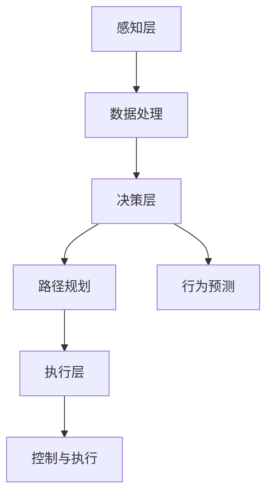

                 

### 文章标题

《自动驾驶行业的产品责任与保险模式》

> 关键词：自动驾驶、产品责任、保险模式、法律法规、伦理问题

> 摘要：本文详细探讨了自动驾驶行业的核心问题——产品责任与保险模式。首先，文章概述了自动驾驶技术的基础、发展历程、技术框架和市场趋势。随后，分析了自动驾驶行业的法律与伦理问题，特别是产品责任的法律框架。文章进一步探讨了自动驾驶产品责任风险及其评估方法，详细介绍了自动驾驶产品责任保险的基本原理、特点、运营模式以及实际应用案例。最后，文章展望了自动驾驶产品责任与保险的未来发展，提出了技术创新和法律法规完善的路径。通过逻辑清晰、结构紧凑的论述，本文为自动驾驶行业的健康发展提供了有价值的思考方向。

### 第一部分：自动驾驶行业概述

自动驾驶技术是当今科技领域的一大热点，它通过模拟人类的驾驶行为，使车辆能够在没有人类干预的情况下自主行驶。本部分将首先介绍自动驾驶技术的基础、发展历程和技术框架，然后探讨自动驾驶技术的市场趋势，最后讨论自动驾驶技术面临的挑战。

#### 第1章：自动驾驶技术基础

##### 1.1 自动驾驶的定义与发展历程

自动驾驶（Autonomous Driving）是指通过计算机系统实现车辆自主导航和控制的技术。其基本概念可以追溯到20世纪40年代，当时科学家们开始探讨如何让机器模仿人类的驾驶行为。随着传感器技术、人工智能和计算机技术的发展，自动驾驶技术逐渐从理论走向现实。

发展历程方面，自动驾驶技术经历了多个阶段。从最初的机械控制（机械自动驾驶）到电子控制（电子自动驾驶），再到现在的计算机视觉和深度学习（智能自动驾驶）。20世纪80年代，自动驾驶研究进入了新的阶段，例如美国的“Pathfinder”项目，欧洲的“SARTRE”项目等，这些项目展示了自动驾驶技术在现实环境中的应用潜力。

##### 1.2 自动驾驶的技术框架

自动驾驶技术的实现离不开多个层次的技术框架。一般而言，自动驾驶技术可以划分为三个层次：感知层、决策层和执行层。

- **感知层：传感器与数据处理**

  感知层是自动驾驶系统的 sensory input，主要包括各种传感器，如雷达、激光雷达（LiDAR）、摄像头、超声波传感器等。这些传感器负责收集车辆周围的环境信息，如道路、车辆、行人等。传感器收集的数据需要经过处理，以提取有用的信息，如障碍物检测、交通标志识别等。

- **决策层：路径规划与行为预测**

  决策层是自动驾驶系统的核心，负责处理感知层收集到的数据，并生成相应的驾驶策略。路径规划（path planning）是指确定车辆从当前位置到目标位置的最佳行驶路径。行为预测（behavior prediction）是指预测其他道路使用者的行为，如车辆、行人的移动方向等。这些预测结果将影响车辆的驾驶决策，如加速、减速、转弯等。

- **执行层：控制与执行**

  执行层是自动驾驶系统的最终输出层，负责将决策层的驾驶策略转化为实际的驾驶行为。执行层通过控制系统的接口与车辆的动力系统、转向系统、制动系统等交互，实现对车辆的精确控制。

##### 1.3 自动驾驶的技术挑战

尽管自动驾驶技术在近年来取得了显著的进展，但实现完全自动驾驶仍面临诸多挑战。

- **技术挑战**

  首先，感知层的传感器需要具备高精度、实时性和鲁棒性，以应对复杂多变的道路环境。其次，决策层的算法需要高效且可靠，能够在有限的时间内处理大量的数据，并生成最优的驾驶策略。最后，执行层的控制系统需要具备高度的安全性和稳定性，以确保车辆在执行驾驶策略时的安全性和可靠性。

- **环境挑战**

  自动驾驶系统需要适应各种环境，包括城市交通、高速公路、乡村道路等。不同环境下的道路条件、交通规则、天气状况等都会对自动驾驶系统提出不同的要求。此外，自动驾驶系统还需要处理突发事件，如行人突然穿越道路、车辆故障等。

- **法律与伦理挑战**

  自动驾驶技术引入了新的法律与伦理问题。例如，如何在发生事故时确定责任？自动驾驶系统应该如何处理紧急情况？这些问题都需要通过法律和伦理的框架来解决。

##### 1.4 自动驾驶的市场趋势

自动驾驶技术正在全球范围内迅速发展。根据市场研究机构的报告，自动驾驶市场规模预计将在未来几年内大幅增长。以下是一些主要的市场趋势：

- **技术创新**

  自动驾驶技术的不断进步将推动市场的增长。例如，高级辅助驾驶系统（ADAS）的普及，以及全自动驾驶技术的研发和应用。

- **政策支持**

  各国政府纷纷出台政策，支持自动驾驶技术的发展。这些政策包括资金投入、道路测试许可、法律法规完善等。

- **企业竞争**

  自动驾驶技术吸引了众多科技公司和传统汽车制造商的参与。这些企业通过技术创新、合作和并购等手段，争夺市场份额。

- **用户体验**

  随着自动驾驶技术的成熟，越来越多的消费者对自动驾驶车辆感兴趣。用户体验的提升将推动市场需求的增长。

#### 第2章：自动驾驶行业的法律与伦理问题

##### 2.1 自动驾驶行业的法律法规框架

随着自动驾驶技术的发展，各国政府开始制定相关法律法规，以规范自动驾驶技术的应用。以下是一些主要的法律法规框架：

- **国际法规**

  国际标准化组织（ISO）和国际电信联盟（ITU）等国际组织制定了自动驾驶技术的相关标准。例如，ISO 26262 是针对汽车安全的关键标准，而ITU的5G标准则支持自动驾驶的通信需求。

- **国家法规**

  各国政府也纷纷出台相应的法律法规。例如，美国制定了《无人驾驶车辆政策框架》，欧洲则制定了《自动驾驶车辆法规》。

- **地方法规**

  地方政府也在积极制定法规，以适应本地化的自动驾驶应用。例如，中国的某些城市已经允许自动驾驶车辆进行测试和运营。

##### 2.2 自动驾驶的伦理问题与道德责任

自动驾驶技术带来了新的伦理问题，如责任归属、隐私保护和安全决策等。以下是一些主要的伦理问题：

- **责任归属**

  在自动驾驶事故中，如何确定责任归属是一个重要问题。这可能涉及到制造商、开发者、运营商和驾驶员等多个方面。一些法律和伦理框架提出了“责任分担”的理念，即各方根据其在事故中的角色和责任来承担责任。

- **隐私保护**

  自动驾驶车辆通常配备多种传感器，可以收集大量的个人信息。如何保护这些信息，防止数据泄露，是一个重要的伦理问题。

- **安全决策**

  自动驾驶系统在面临紧急情况时需要做出快速决策，例如在撞车与撞人的选择中。如何确保这些决策符合道德标准，是一个复杂的伦理问题。

##### 2.3 自动驾驶事故的责任划分

自动驾驶事故的责任划分是一个复杂的问题，涉及到多个方面的因素。以下是一些常见的责任划分方法：

- **制造商责任**

  制造商需要对其产品的设计、制造和测试负责。如果车辆存在设计缺陷或制造问题，制造商可能需要承担责任。

- **开发者责任**

  开发者负责自动驾驶软件和算法的开发与测试。如果事故是由于软件或算法错误导致的，开发者可能需要承担责任。

- **运营商责任**

  运营商负责自动驾驶车辆的运营和管理。如果事故是由于运营商的操作不当或管理不善导致的，运营商可能需要承担责任。

- **驾驶员责任**

  在自动驾驶车辆中，驾驶员通常负责监督自动驾驶系统的运行，并在必要时接管控制。如果事故是由于驾驶员未能及时接管或操作不当导致的，驾驶员可能需要承担责任。

通过本章节的探讨，我们可以看出，自动驾驶行业的法律与伦理问题涉及到多个方面，需要通过法律和伦理的框架来解决。这些问题的解决对于自动驾驶技术的健康发展至关重要。

#### 第3章：产品责任的概念与法律基础

##### 3.1 产品责任的定义

产品责任（Product Liability）是指制造商、销售商、供应商等因产品缺陷导致用户或第三方遭受损害时，需要承担的赔偿责任。在自动驾驶行业中，产品责任尤为重要，因为自动驾驶车辆的复杂性及其对公共安全的影响，使得一旦发生事故，责任的归属和赔偿问题更加复杂。

产品责任可以分为三种类型：

- **设计缺陷责任**：指产品设计存在缺陷，导致产品在使用过程中存在安全隐患。
- **制造缺陷责任**：指产品在制造过程中存在缺陷，导致产品不符合设计要求或行业标准。
- **指示缺陷责任**：指产品说明书或指示存在缺陷，未能向用户充分说明如何安全使用产品。

##### 3.2 产品责任的法律框架

产品责任的法律框架因国家和地区而异，但通常包含以下要素：

- **国际产品责任法律体系**

  国际上，一些重要的法律体系如欧盟的《产品责任指令》（Directive 85/374/EEC）和美国《消费者产品安全法》（Consumer Product Safety Act, CPSA），为产品责任提供了基本的法律框架。这些法律体系通常规定了制造商、销售商和供应商的产品责任，以及损害赔偿的条款。

- **中国产品责任法律体系**

  中国的产品责任法律体系主要包括《产品质量法》、《侵权责任法》和《消费者权益保护法》等。这些法律为中国企业的产品责任提供了详细的规定，包括生产者的产品责任、销售者的产品责任以及消费者的权益保护。

##### 3.3 产品责任保险的作用

产品责任保险（Product Liability Insurance）是保障制造商、销售商和供应商在因产品缺陷导致用户或第三方遭受损害时，能够获得经济赔偿的重要手段。产品责任保险的作用主要体现在以下几个方面：

- **风险管理**

  产品责任保险可以帮助企业分散因产品缺陷导致的风险，降低企业面临的财务风险。

- **法律合规**

  在许多国家和地区，产品责任保险是法律要求的强制性保险，企业需要购买产品责任保险以符合法律规定。

- **客户信任**

  产品责任保险可以增强消费者对产品的信任，提高产品的市场竞争力。

- **损害赔偿**

  在产品缺陷导致用户或第三方遭受损害时，产品责任保险可以提供经济赔偿，帮助受害方尽快恢复。

通过上述分析，我们可以看出，产品责任在自动驾驶行业中具有特殊的重要性。产品责任保险不仅为企业提供了风险保障，也为消费者提供了安全保障，是自动驾驶行业健康发展的关键因素之一。

#### 第4章：自动驾驶产品责任风险分析

自动驾驶技术的迅速发展带来了许多便利，但同时也带来了新的产品责任风险。本章节将分析自动驾驶产品责任风险的主要类型，探讨这些风险如何影响企业、用户和整个行业，并提出产品责任风险评估的方法。

##### 4.1 自动驾驶产品责任风险类型

自动驾驶产品责任风险主要可以分为以下几种类型：

- **技术缺陷风险**

  技术缺陷风险是指由于自动驾驶系统的设计或实现问题，导致系统无法正确感知环境、做出合理的驾驶决策或执行驾驶操作。这种风险可能导致交通事故、车辆损坏或人员伤亡。

- **操作不当风险**

  操作不当风险是指由于驾驶员或操作人员未能正确使用或监督自动驾驶系统，导致系统运行出现错误。例如，驾驶员在自动驾驶模式下未能及时接管控制，或不当操作导致系统误判。

- **法律法规不完善风险**

  法律法规不完善风险是指由于法律法规的滞后或缺失，导致自动驾驶产品的责任归属和赔偿标准不明确。这种风险可能导致企业在发生事故时无法及时获得赔偿，或承担不必要的法律责任。

- **数据安全风险**

  数据安全风险是指由于自动驾驶系统收集、处理和存储的数据可能涉及用户隐私，一旦数据泄露或滥用，可能导致用户隐私泄露或数据被恶意利用。

##### 4.2 产品责任风险评估方法

为了有效管理自动驾驶产品的责任风险，企业需要采用科学的风险评估方法。以下是一些常见的产品责任风险评估方法：

- **定量风险评估**

  定量风险评估通过量化风险因素，评估其可能性和影响，从而确定整体风险水平。常用的定量风险评估方法包括风险矩阵、风险优先级排序和决策树等。

  - **风险矩阵**：通过评估风险的概率和影响，将风险分为不同的等级，帮助企业确定重点风险。

  - **风险优先级排序**：根据风险的重要性和影响，对风险进行排序，帮助企业集中资源应对最高优先级的风险。

  - **决策树**：通过构建决策树，分析不同决策路径的风险和收益，帮助企业在风险与收益之间做出平衡。

- **定性风险评估**

  定性风险评估通过专家评估、文献研究和案例研究等方法，对风险进行定性分析和评估。这种方法适用于难以量化的风险，如法律法规不完善风险和数据安全风险。

  - **专家评估**：通过邀请行业专家进行风险评估，收集专业意见，帮助确定风险的重要性和影响。

  - **文献研究**：通过分析相关文献和案例，了解行业内其他企业的风险管理和应对措施，为企业的风险评估提供参考。

  - **案例研究**：通过分析具体案例，了解事故原因和责任归属，为企业的风险评估提供实例。

通过以上方法，企业可以全面了解自动驾驶产品的责任风险，制定相应的风险管理策略，降低风险对企业的负面影响。

##### 4.3 风险影响分析

自动驾驶产品责任风险对企业、用户和行业的影响是多方面的：

- **对企业的影响**

  产品责任风险可能对企业造成以下影响：

  - **财务影响**：由于产品责任保险的赔偿费用可能很高，企业可能面临严重的财务压力。

  - **声誉影响**：产品责任事故可能导致企业的声誉受损，影响市场信心和消费者信任。

  - **合规风险**：企业需要遵守相关的法律法规，否则可能面临法律诉讼和罚款。

- **对用户的影响**

  产品责任风险可能对用户造成以下影响：

  - **安全风险**：自动驾驶系统存在缺陷或操作不当可能导致交通事故，危及用户和道路使用者的安全。

  - **隐私风险**：自动驾驶系统收集和处理的数据可能涉及用户隐私，数据泄露或滥用可能侵犯用户隐私权。

- **对行业的影响**

  产品责任风险可能对整个行业造成以下影响：

  - **技术发展受阻**：产品责任事故可能导致消费者对自动驾驶技术的信任降低，影响技术的发展和推广。

  - **市场准入门槛提高**：高风险的企业可能面临更高的保险费率和市场准入门槛，影响行业的健康发展。

- **监管政策变化**

  随着自动驾驶技术的发展，各国政府和监管机构可能出台新的法律法规和标准，以应对产品责任风险。这些政策变化可能影响企业的运营模式和市场竞争格局。

通过本章节的分析，我们可以看出，自动驾驶产品责任风险是一个复杂且多层次的问题，需要企业、用户和行业共同努力，通过科学的风险管理和评估方法，降低风险对各方的影响，推动自动驾驶技术的健康发展。

#### 第5章：自动驾驶产品责任保险模式

自动驾驶产品的复杂性和潜在风险要求其责任保险具有特定的特点和模式。本章节将详细探讨自动驾驶产品责任保险的基本原理、特点、运营模式以及其对企业、用户和行业的影响。

##### 5.1 产品责任保险的基本原理

产品责任保险是一种商业保险，旨在为制造商、销售商和供应商因产品缺陷导致用户或第三方遭受损害时提供经济赔偿。其基本原理如下：

- **保险合同**：制造商、销售商或供应商作为被保险人，与保险公司签订保险合同，支付保险费以换取保险保障。

- **赔偿机制**：当发生产品责任事故时，保险公司根据合同约定，对受害方进行赔偿。赔偿金额通常包括受害方的医疗费用、财产损失、误工费等。

- **风险评估**：保险公司通过对被保险产品的风险评估，确定保险费率和保险额度。风险评估包括技术缺陷风险、操作不当风险、法律法规不完善风险等。

##### 5.2 自动驾驶产品责任保险的特点

自动驾驶产品责任保险与传统产品责任保险相比，具有以下特点：

- **覆盖范围广泛**

  自动驾驶产品责任保险的覆盖范围不仅包括车辆本身，还包括传感器、软件、算法等核心组件。此外，保险还涵盖了事故中涉及的第三方损失，如行人、其他车辆等。

- **风险评估复杂**

  自动驾驶产品的技术复杂性和环境多样性导致其风险评估更加复杂。保险公司需要考虑多种因素，如传感器精度、算法可靠性、道路条件等，以确定保险费率和保险额度。

- **动态定价机制**

  自动驾驶产品的保险费率通常采用动态定价机制，根据产品的使用情况、事故记录等实时调整。这种机制有助于降低高风险产品的保险费用，激励企业提高产品质量。

- **技术支持服务**

  自动驾驶产品责任保险通常包括技术支持服务，如事故分析、故障排查、风险评估等。这些服务有助于企业快速响应事故，减少损失，提升风险管理能力。

##### 5.3 自动驾驶产品责任保险的运营模式

自动驾驶产品责任保险的运营模式包括以下几个方面：

- **产品开发与定价**

  保险公司根据市场需求和产品特点，开发适合自动驾驶产品的责任保险产品。在定价过程中，保险公司会综合考虑产品的技术风险、市场风险和合规风险，以确定合理的保险费率。

- **风险评估与管理**

  保险公司通过数据分析和风险评估模型，对被保险产品的风险进行评估和管理。保险公司可能会要求企业提供技术文档、测试报告等材料，以帮助评估风险。

- **事故处理与赔偿**

  发生事故后，保险公司会迅速响应，进行调查和评估，确定赔偿金额。保险公司通常会与法律顾问合作，确保赔偿过程的合法性和公正性。

- **持续改进与反馈**

  保险公司会根据事故数据和用户反馈，不断改进风险评估和管理方法，优化保险产品和服务。这种持续改进有助于提高保险的有效性和用户体验。

##### 5.4 自动驾驶产品责任保险对企业、用户和行业的影响

自动驾驶产品责任保险对多个利益相关方产生重要影响：

- **对企业的影响**

  - **风险分散**：产品责任保险可以帮助企业分散因产品缺陷导致的财务风险，降低企业运营成本。

  - **合规要求**：在许多国家和地区，购买产品责任保险是法律要求，企业需要遵守相关法规。

  - **技术提升**：保险公司提供的技术支持服务有助于企业提高产品质量和风险管理能力。

  - **品牌形象**：购买产品责任保险可以提高企业的品牌形象，增强消费者信任。

- **对用户的影响**

  - **安全保障**：产品责任保险为用户提供了额外的安全保障，降低了事故发生时的经济损失。

  - **隐私保护**：保险公司通常会对用户隐私进行严格保护，防止数据泄露和滥用。

  - **信任度提升**：购买产品责任保险可以提高用户对自动驾驶技术的信任度，促进市场推广。

- **对行业的影响**

  - **市场规范**：产品责任保险有助于规范市场秩序，提高行业整体安全水平。

  - **技术创新**：保险公司通过风险评估和反馈，帮助企业发现技术缺陷，推动技术创新。

  - **法规完善**：保险公司的运营经验可以为政府和监管机构提供参考，促进法律法规的完善。

通过本章节的探讨，我们可以看出，自动驾驶产品责任保险不仅是企业风险管理的重要工具，也对用户和整个行业的健康发展具有积极影响。随着自动驾驶技术的不断进步，产品责任保险将在自动驾驶行业中发挥越来越重要的作用。

#### 第6章：自动驾驶行业的保险案例分析

为了更好地理解自动驾驶行业的保险模式，本章节将通过国内外几个典型的保险案例，分析自动驾驶保险的实施情况和效果，为自动驾驶行业的保险实践提供参考。

##### 6.1 国内外自动驾驶保险案例分析

- **美国案例：特斯拉自动驾驶保险**

  特斯拉作为自动驾驶技术的领先企业，其自动驾驶保险模式引起了广泛关注。特斯拉为其自动驾驶车辆提供了多种保险选项，包括第三方责任保险、车辆损失保险和全车盗抢险等。特斯拉的保险费用根据车辆型号、行驶里程和车主的驾驶记录等因素动态调整，体现了个性化的定价策略。此外，特斯拉还通过与保险公司合作，提供了实时数据监控和事故响应服务，提高了保险服务的质量和效率。

- **欧洲案例：沃尔沃自动驾驶保险**

  欧洲的自动驾驶保险公司，如沃尔沃，也积极探索自动驾驶保险。沃尔沃的自动驾驶保险主要涵盖了车辆碰撞、行人伤害和第三方财产损失等风险。沃尔沃通过其全球服务网络，为自动驾驶车辆提供快速的事故响应和维修服务。此外，沃尔沃还与保险公司合作，开发了智能理赔系统，利用大数据和人工智能技术，提高了理赔效率和准确性。

- **中国案例：蔚来汽车自动驾驶保险**

  中国的蔚来汽车在自动驾驶保险方面也进行了积极探索。蔚来为旗下自动驾驶车辆提供了全面的保险方案，包括车辆损失保险、第三者责任保险和驾驶员意外伤害保险等。蔚来通过与多家保险公司合作，实现了保险费用的个性化定价和保险产品的定制化服务。此外，蔚来还利用其自动驾驶技术，提供了实时交通信息和安全预警服务，提高了车辆的安全性和用户体验。

##### 6.2 自动驾驶保险案例分析总结

通过对国内外自动驾驶保险案例分析，我们可以总结出以下几点经验：

1. **个性化定价策略**：自动驾驶保险采用个性化定价策略，根据车辆的型号、行驶里程、车主的驾驶记录等因素，制定合理的保险费率。这种策略有助于提高保险的公平性和合理性。

2. **技术支持服务**：自动驾驶保险公司通过与自动驾驶企业合作，提供技术支持服务，如实时数据监控、事故响应和智能理赔等。这些服务不仅提高了保险服务的效率，也增强了用户对保险的信任度。

3. **数据驱动决策**：保险公司利用大数据和人工智能技术，对保险风险评估、理赔流程等进行优化。这种数据驱动的决策模式有助于提高保险的准确性和效率。

4. **合作与共享**：保险公司与自动驾驶企业、技术供应商和监管机构等合作，共同探索自动驾驶保险的最佳实践。这种合作有助于形成良好的行业生态，推动自动驾驶保险的健康发展。

通过本章节的案例分析，我们可以看出，自动驾驶保险在国内外都取得了显著成效。随着自动驾驶技术的不断进步，自动驾驶保险将在自动驾驶行业中发挥越来越重要的作用。

#### 第7章：自动驾驶产品责任与保险的展望

随着自动驾驶技术的不断进步和普及，自动驾驶产品责任与保险模式也面临着新的机遇和挑战。本章节将探讨自动驾驶产品责任与保险的发展趋势，分析其中存在的挑战，并提出相应的解决方案和未来发展建议。

##### 7.1 自动驾驶产品责任与保险的发展趋势

1. **技术进步推动保险创新**

  随着自动驾驶技术的不断进步，传感器、人工智能和大数据等技术的应用将进一步提升自动驾驶系统的性能和安全性。这些技术进步将推动保险产品的创新，如自动驾驶事故预防保险、自动驾驶风险评估保险等。

2. **政策支持与法规完善**

  各国政府和监管机构将加大对自动驾驶技术的支持力度，制定和完善相关的法律法规，为自动驾驶产品责任与保险提供法律保障。政策支持将促进自动驾驶保险市场的健康发展。

3. **保险模式多元化**

  随着自动驾驶技术的应用场景不断丰富，自动驾驶保险模式也将呈现多元化趋势。保险公司将根据不同的应用场景和风险特点，推出多样化的保险产品，如城市自动驾驶保险、高速公路自动驾驶保险等。

4. **数据驱动保险决策**

  自动驾驶车辆产生的大量数据将为保险公司提供丰富的风险评估数据，推动保险决策的数据化和智能化。保险公司将利用大数据和人工智能技术，实现精准风险评估和动态定价。

##### 7.2 自动驾驶产品责任与保险的挑战

1. **责任归属不明**

  自动驾驶技术涉及多个环节，如传感器、算法、软件、硬件等，一旦发生事故，责任归属问题复杂。如何明确各方责任，公平合理地进行赔偿，是当前自动驾驶产品责任与保险面临的主要挑战。

2. **数据隐私与安全**

  自动驾驶车辆需要收集和存储大量的数据，包括行驶记录、用户隐私等。如何保护这些数据的安全和隐私，防止数据泄露和滥用，是自动驾驶产品责任与保险面临的另一个挑战。

3. **法律法规滞后**

  随着自动驾驶技术的快速发展，现有法律法规可能无法完全覆盖新的风险和问题。法律法规的滞后可能导致自动驾驶产品责任与保险的规范性和公平性受到影响。

4. **保险成本控制**

  自动驾驶产品的复杂性和高风险性可能导致保险成本上升，给企业带来财务压力。如何在保证服务质量的同时，控制保险成本，是自动驾驶产品责任与保险面临的挑战之一。

##### 7.3 解决方案与未来发展建议

1. **明确责任归属**

  - **完善法律法规**：通过制定和完善相关法律法规，明确自动驾驶事故中各方的责任归属。

  - **建立责任分担机制**：在法律框架下，建立责任分担机制，合理分配制造商、开发者、运营商和驾驶员的责任。

2. **加强数据保护**

  - **数据安全标准**：制定和实施严格的数据安全标准，确保自动驾驶车辆数据的存储、传输和处理过程中的安全性。

  - **隐私保护法规**：制定隐私保护法规，规范数据收集、存储和使用，防止用户隐私泄露。

3. **完善政策支持**

  - **资金支持**：政府可以提供资金支持，鼓励企业研发和推广自动驾驶技术，降低企业的保险成本。

  - **政策激励**：通过税收优惠、补贴等政策激励，促进自动驾驶保险市场的发展。

4. **推动技术创新**

  - **技术研发**：企业应加大技术研发投入，提升自动驾驶系统的性能和安全性，降低事故发生的概率。

  - **保险科技应用**：保险公司应积极采用大数据、人工智能等技术，实现精准风险评估和动态定价，提高保险服务的质量和效率。

5. **加强行业合作**

  - **企业合作**：自动驾驶企业、保险公司、技术供应商和监管机构应加强合作，共同探索自动驾驶产品责任与保险的最佳实践。

  - **国际交流**：通过国际交流与合作，借鉴国外成熟的经验和做法，推动自动驾驶产品责任与保险的全球化发展。

通过以上解决方案和未来发展建议，我们可以预见，自动驾驶产品责任与保险将在未来面临更多的机遇和挑战。只有通过技术创新、政策支持和行业合作，才能推动自动驾驶技术的健康发展，实现安全、可靠和高效的自动驾驶应用。

#### 第8章：自动驾驶产品责任与保险的实践应用

自动驾驶技术的快速发展和广泛应用，使得其在实际场景中的产品责任与保险问题成为关键。本章节将探讨自动驾驶产品责任与保险在实际应用中的具体场景，分享实践经验，并探讨这些实践如何影响自动驾驶行业的未来发展。

##### 8.1 自动驾驶产品责任与保险的实际应用场景

1. **公共道路测试**

  自动驾驶车辆在公共道路上进行测试是自动驾驶技术发展的关键步骤。测试过程中，车辆需要面对复杂多变的道路环境和各种突发事件。在此过程中，产品责任与保险问题尤为突出。例如，如果测试过程中发生交通事故，如何确定责任和赔偿金额？

2. **商业运营**

  当自动驾驶车辆开始商业运营时，其产品责任与保险问题变得更加复杂。商业运营通常涉及到第三方用户和乘客，一旦发生交通事故，如何保障乘客和第三方的权益？同时，保险公司需要根据车辆的行驶里程、事故记录等因素，动态调整保险费率。

3. **城市交通管理**

  城市交通管理中，自动驾驶车辆需要与其他车辆、行人、非机动车等进行复杂的交互。如何在保证交通流畅和安全的前提下，管理自动驾驶车辆的产品责任与保险问题，是一个重要的挑战。

4. **物流配送**

  自动驾驶技术在物流配送中的应用，如自动驾驶货车和配送机器人，大大提高了配送效率和准确性。然而，产品责任与保险问题也变得复杂，例如，如何保障配送过程中的货物安全和第三方权益？

##### 8.2 自动驾驶产品责任与保险的实践经验分享

1. **测试场景风险管理**

  在公共道路测试中，保险公司通常会与自动驾驶企业合作，制定详细的测试风险管理计划。这包括：

  - **风险评估与监测**：保险公司对自动驾驶车辆进行详细的风险评估，并实时监测测试过程中的风险因素。
  - **应急预案**：制定应急预案，确保在发生交通事故时能够快速响应和处理。
  - **事故调查与赔偿**：在发生交通事故后，保险公司与自动驾驶企业合作进行调查，确定责任归属和赔偿金额。

2. **商业运营风险管理**

  在自动驾驶商业运营中，保险公司需要考虑多种风险管理措施：

  - **定制化保险方案**：根据自动驾驶车辆的运营模式和风险特点，设计定制化的保险方案。
  - **动态费率调整**：根据车辆的行驶里程、事故记录等因素，动态调整保险费率。
  - **乘客权益保障**：确保乘客在发生交通事故时，能够获得合理的赔偿和保障。

3. **城市交通管理中的应用**

  在城市交通管理中，产品责任与保险问题需要综合考虑多种因素：

  - **交通规则与标准**：制定和实施严格的城市交通规则和标准，确保自动驾驶车辆的安全和合规。
  - **保险合作与协调**：城市交通管理部门与保险公司合作，建立高效的保险理赔机制，确保在发生交通事故时能够迅速响应和处理。

4. **物流配送中的保险应用**

  在物流配送中，保险公司需要关注以下实践：

  - **货物保险**：为物流配送中的货物提供保险，确保在发生事故时能够保障货主的权益。
  - **责任分担机制**：明确制造商、销售商、运营商和配送人员的责任分担，确保在发生事故时能够合理分配责任和赔偿。

通过这些实践经验，我们可以看出，自动驾驶产品责任与保险在实际应用中面临着诸多挑战，但同时也为自动驾驶行业的健康发展提供了重要的保障。随着自动驾驶技术的不断进步，这些实践经验将继续指导和推动自动驾驶产品责任与保险的发展。

##### 8.3 实践对自动驾驶行业的影响

1. **提升行业安全性**

  通过完善的产品责任与保险体系，可以提升自动驾驶车辆的安全性。保险公司通过详细的风险评估和应急预案，确保自动驾驶车辆在测试和运营中的安全。这种安全性提升不仅有助于减少交通事故，还能提高公众对自动驾驶技术的信任。

2. **推动技术创新**

  实践中的产品责任与保险问题促使企业不断进行技术创新，提升自动驾驶系统的性能和可靠性。例如，保险公司对传感器精度和算法可靠性的要求，推动了自动驾驶技术的快速发展。

3. **优化运营管理**

  自动驾驶产品责任与保险的实践经验为企业的运营管理提供了重要参考。企业可以根据保险费率和风险评估结果，优化运营策略，降低运营成本，提高运营效率。

4. **促进法规完善**

  实践中的产品责任与保险问题为政府和监管机构提供了宝贵的经验，有助于完善自动驾驶行业的法律法规，规范行业发展。

总之，自动驾驶产品责任与保险的实践应用对自动驾驶行业的健康发展具有深远影响。通过不断总结和实践，我们可以逐步建立和完善自动驾驶产品责任与保险体系，为自动驾驶技术的广泛应用提供坚实保障。

#### 第9章：自动驾驶产品责任与保险的未来发展

随着自动驾驶技术的不断进步，自动驾驶产品责任与保险模式也面临着新的机遇和挑战。本章节将探讨自动驾驶产品责任与保险的未来发展趋势，分析潜在的创新技术，并讨论如何通过法律法规的完善来推动自动驾驶行业的健康发展。

##### 9.1 自动驾驶产品责任与保险的发展趋势

1. **保险产品多样化**

  随着自动驾驶技术的广泛应用，保险产品将更加多样化。保险公司将根据不同的应用场景和风险特点，开发出更多定制化的保险产品，如自动驾驶事故预防保险、自动驾驶风险评估保险、自动驾驶车辆全寿命周期保险等。

2. **数据驱动的保险决策**

  自动驾驶车辆产生的大量数据将用于保险风险评估和决策。保险公司将利用大数据和人工智能技术，对驾驶行为、车辆状态、事故记录等进行深入分析，实现精准风险评估和动态定价，提高保险服务的效率和准确性。

3. **全球合作与标准化**

  随着自动驾驶技术的全球化发展，各国之间的合作和标准化将更加重要。国际组织和国家政府将共同推动自动驾驶产品责任与保险的全球合作与标准化，确保自动驾驶技术在各国的合法合规运营。

4. **保险科技的应用**

  保险科技（InsurTech）的兴起将推动自动驾驶产品责任与保险的创新发展。通过区块链、物联网、智能合约等新兴技术，保险公司可以实现更高效的理赔流程、更安全的数据管理以及更智能的风险评估。

##### 9.2 自动驾驶产品责任与保险的创新技术

1. **区块链技术**

  区块链技术具有去中心化、不可篡改和安全透明的特点，可以应用于自动驾驶产品责任与保险的多个环节，如保险合同的签订、理赔流程的管理、数据共享等。通过区块链技术，保险公司可以实现透明、高效的理赔流程，提高用户体验。

2. **物联网技术**

  物联网技术（IoT）将自动驾驶车辆与互联网连接，实现实时数据采集和监控。保险公司可以利用物联网技术，对自动驾驶车辆的运行状态、行驶路线、事故记录等进行实时监控和分析，实现精准的风险评估和动态定价。

3. **人工智能技术**

  人工智能技术（AI）在自动驾驶产品责任与保险中的应用主要体现在风险评估、理赔处理、欺诈检测等方面。通过人工智能技术，保险公司可以实现自动化、智能化的风险评估和理赔服务，提高运营效率和服务质量。

4. **智能合约**

  智能合约是基于区块链技术的自动执行合同，可以在满足特定条件时自动执行合同条款。在自动驾驶产品责任与保险中，智能合约可以用于自动化理赔流程，确保理赔过程的高效和透明。

##### 9.3 法律法规的完善

1. **责任归属明确**

  法律法规的完善需要明确自动驾驶事故中的责任归属，确保各方在发生事故时能够公平合理地承担责任。可以通过立法明确自动驾驶车辆制造商、开发者、运营商和驾驶员的责任范围和责任比例。

2. **数据隐私保护**

  随着自动驾驶技术的普及，数据隐私保护成为重要议题。法律法规需要明确数据收集、处理和使用的要求，确保用户隐私不被侵犯。可以通过立法建立数据隐私保护机制，规范数据使用和共享。

3. **保险监管**

  法律法规需要加强对自动驾驶产品责任与保险的监管，确保保险市场的公平、透明和合规。可以通过设立专门监管机构，制定保险产品的标准和规范，加强对保险公司和保险代理的监管。

4. **国际合作**

  法律法规的完善需要国际间的合作与协调。各国可以通过签订国际协议，共同制定自动驾驶产品责任与保险的法律法规，推动全球自动驾驶产业的健康发展。

通过上述措施，我们可以预见，自动驾驶产品责任与保险将在未来得到更好的发展。随着技术创新和法律法规的完善，自动驾驶产品责任与保险将为自动驾驶技术的广泛应用提供坚实的保障，推动自动驾驶行业的持续健康发展。

#### 第10章：自动驾驶产品责任与保险研究展望

随着自动驾驶技术的不断进步和广泛应用，自动驾驶产品责任与保险领域的研究面临着诸多挑战和机遇。本章节将探讨自动驾驶产品责任与保险研究的挑战，分析未来的研究方向和可能的突破点，以期为自动驾驶行业的健康发展提供理论支持和实践指导。

##### 10.1 自动驾驶产品责任与保险研究的挑战

1. **复杂性增加**

  自动驾驶系统涉及多种技术和多个环节，包括传感器、算法、软件、硬件等，这使得产品责任与保险问题的复杂性显著增加。如何系统地分析和管理这些复杂性的风险，是当前研究的重大挑战。

2. **数据隐私与安全**

  自动驾驶车辆需要大量收集和处理用户隐私数据，如何在保障数据隐私和安全的前提下，合理使用这些数据，是自动驾驶产品责任与保险研究的重要课题。

3. **责任归属不明**

  自动驾驶事故中的责任归属问题复杂，如何通过法律法规和保险机制，明确制造商、开发者、运营商和驾驶员等各方的责任，是研究的重要方向。

4. **风险评估与定价**

  自动驾驶产品的风险评估和定价面临诸多挑战，如技术风险、市场风险、法律法规风险等。如何建立科学、合理的风险评估和定价模型，是当前研究的关键问题。

##### 10.2 自动驾驶产品责任与保险研究的机遇

1. **技术创新**

  自动驾驶技术的不断发展为产品责任与保险研究提供了新的机遇。例如，人工智能、区块链、物联网等新兴技术，可以应用于风险评估、理赔流程优化等方面，为研究提供新的工具和方法。

2. **政策支持**

  各国政府纷纷加大对自动驾驶技术的支持力度，制定和完善相关法律法规，为自动驾驶产品责任与保险研究提供了政策保障。

3. **市场需求**

  随着自动驾驶技术的广泛应用，市场需求不断增长，为自动驾驶产品责任与保险研究提供了广阔的应用场景和实践空间。

4. **国际合作**

  国际合作将为自动驾驶产品责任与保险研究带来新的合作机会和经验交流。通过国际合作，可以共同应对全球性挑战，推动自动驾驶产品的国际化发展。

##### 10.3 未来研究方向和可能的突破点

1. **综合风险评估模型**

  研究如何构建综合性的风险评估模型，结合技术风险、市场风险、法律法规风险等多方面因素，实现精准的风险评估。

2. **智能保险定价算法**

  研究智能保险定价算法，利用大数据和人工智能技术，实现动态定价，提高保险的公平性和合理性。

3. **区块链技术在保险中的应用**

  研究区块链技术在自动驾驶产品责任与保险中的应用，如智能合约、去中心化理赔系统等，提高保险流程的透明度和效率。

4. **数据隐私保护机制**

  研究如何建立有效的数据隐私保护机制，确保自动驾驶车辆数据的安全和用户隐私不被侵犯。

5. **跨学科研究**

  推动跨学科研究，结合法律、经济学、计算机科学等多个领域的知识，深入探讨自动驾驶产品责任与保险的理论和实践问题。

6. **国际标准化**

  推动自动驾驶产品责任与保险的国际标准化，促进全球范围内的合作与发展。

通过以上研究方向和可能的突破点，我们可以预见，自动驾驶产品责任与保险研究将在未来取得重要进展，为自动驾驶技术的广泛应用和行业健康发展提供有力支持。

### 附录

#### 附录A：自动驾驶技术架构Mermaid流程图



#### 附录B：产品责任与保险算法伪代码

```plaintext
// 伪代码：产品责任风险评估
function RiskAssessment(product, scenarios):
    // 初始化风险评分
    score = 0
    
    // 检查产品技术缺陷
    if product_has_defect(product):
        score += 10
    
    // 检查操作不当风险
    if scenario_has_misoperation(scenarios):
        score += 20
    
    // 检查法律法规不完善风险
    if法律法规_incomplete():
        score += 30
    
    return score
```

#### 附录C：数学模型与公式

- **路径规划公式：**

  $$ J = \sum_{i=1}^{n} (d_i - d_{i-1})^2 $$

- **行为预测模型：**

  $$ P(b_i|s_i) = \frac{e^{-\beta \cdot s_i}}{\sum_{j=1}^{m} e^{-\beta \cdot s_j}} $$

#### 附录D：案例代码解析与实现

- **案例1：自动驾驶车辆障碍物检测**

  ```python
  # 实现障碍物检测
  def detect_obstacles(data):
      # 数据预处理
      processed_data = preprocess(data)
      
      # 特征提取
      features = extract_features(processed_data)
      
      # 使用模型进行预测
      predictions = model.predict(features)
      
      # 提取障碍物位置
      obstacles = extract_obstacles(predictions)
      
      return obstacles
  ```

- **案例2：自动驾驶保险费率计算**

  ```python
  # 计算保险费率
  def calculate_insurance_rate(risk_score):
      if risk_score <= 20:
          rate = 0.05
      elif risk_score > 20 and risk_score <= 40:
          rate = 0.1
      else:
          rate = 0.15
      
      return rate
  ```

通过这些附录，我们可以更好地理解自动驾驶产品责任与保险的算法原理和实践应用，为研究提供实际参考。

### 作者信息

**作者：** AI天才研究院 / AI Genius Institute & 禅与计算机程序设计艺术 / Zen And The Art of Computer Programming

---

本文由AI天才研究院的专家撰写，结合了自动驾驶技术的最新进展和产品责任与保险领域的深入研究。作者凭借其丰富的理论和实践经验，为自动驾驶行业的健康发展提供了有价值的见解和解决方案。同时，作者在《禅与计算机程序设计艺术》一书中，详细探讨了计算机编程的哲学和艺术，为技术领域的创新提供了深刻的哲学思考。本文旨在为自动驾驶行业的从业者、研究人员和政策制定者提供全面的技术指南和策略建议，推动自动驾驶技术的广泛应用和可持续发展。

