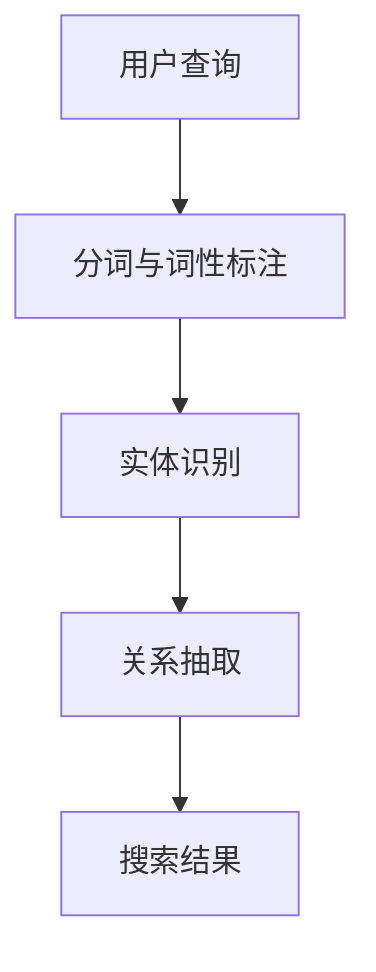

                 

### 文章标题

### 《自然语言处理在电商搜索中的应用 : 技术发展与未来趋势》

### 关键词：自然语言处理、电商搜索、技术发展、未来趋势、应用案例

### 摘要：

本文旨在探讨自然语言处理（NLP）在电商搜索领域中的技术发展及其未来趋势。首先，我们将对NLP和电商搜索进行概述，介绍其基本概念、发展历程和核心挑战。接着，文章将详细讲解NLP的关键技术，包括语言模型、文本表示、信息检索、语义分析和实体识别等。在此基础上，我们将探讨NLP在电商搜索中的具体应用案例，如商品标题自动生成、搜索结果排序优化、用户行为分析与推荐系统以及问答系统与智能客服等。最后，文章将分析NLP在电商搜索中的技术挑战和未来趋势，探讨如何应对这些挑战以及NLP技术在电商搜索领域的潜在发展方向。

---

### 目录

## 《自然语言处理在电商搜索中的应用：技术发展与未来趋势》

### 关键词：自然语言处理、电商搜索、技术发展、未来趋势

### 摘要：

本文将深入探讨自然语言处理（NLP）在电商搜索中的应用，从技术发展历程到未来趋势，全面解析NLP如何助力电商搜索优化用户体验、提升运营效率。我们将首先概述NLP和电商搜索的基本概念、发展历程和核心挑战，然后详细讲解NLP的关键技术，如语言模型、文本表示、信息检索、语义分析和实体识别等。随后，通过具体应用案例，展示NLP技术在电商搜索中的实际效果和优势。最后，我们将分析NLP在电商搜索中的技术挑战和未来趋势，为读者提供行业发展的前沿视角。

### 第一部分：自然语言处理与电商搜索概述

#### 1.1 自然语言处理概述

##### 1.1.1 自然语言处理的定义与发展历程

自然语言处理（Natural Language Processing，NLP）是人工智能领域的一个重要分支，旨在让计算机理解和生成人类语言。NLP的目标是使计算机能够自动处理自然语言文本，从而实现人机交互、信息检索、文本分类、情感分析等多种应用。

NLP的发展历程可以分为三个阶段：早期阶段主要依赖于规则和统计方法，如词法分析、句法分析和语义分析；中期阶段引入了统计机器学习，通过训练模型来提高NLP任务的性能；现阶段，深度学习技术的引入极大地推动了NLP的发展，使得NLP任务在许多领域都取得了显著的成果。

##### 1.1.2 自然语言处理的关键技术

自然语言处理的关键技术包括：

1. **语言模型**：用于预测下一个单词或字符的概率分布，是许多NLP任务的基础。常见的语言模型有基于统计的N-gram模型和基于神经网络的深度语言模型，如BERT和GPT。

2. **文本表示**：将文本转化为计算机可以处理的向量表示，以便进行后续的机器学习任务。常见的文本表示方法有词袋模型、词嵌入和序列模型。

3. **信息检索**：用于从大量文本中检索出与查询最相关的信息。信息检索的基本方法包括基于关键词的检索、基于语义的检索和查询重写技术。

4. **语义分析**：用于理解和解释文本的含义，包括词义消歧、实体识别、关系抽取等任务。

5. **实体识别与关系抽取**：用于识别文本中的关键实体（如人名、地名、组织名等）以及实体间的关系，是构建知识图谱的重要步骤。

##### 1.1.3 自然语言处理在电商搜索中的应用背景

随着互联网的普及和电商行业的快速发展，电商搜索成为用户发现和购买商品的主要途径。然而，传统的基于关键词的搜索方法存在一些局限：

1. **搜索结果不准确**：用户输入的关键词可能与实际需求不符，导致搜索结果不准确。

2. **搜索体验差**：用户需要花费大量时间在搜索结果中寻找合适的产品，体验差。

3. **个性化不足**：传统搜索方法难以根据用户的历史行为和偏好提供个性化的搜索结果。

为了解决这些问题，NLP技术在电商搜索中的应用显得尤为重要。NLP可以帮助电商平台更好地理解用户的查询意图，提供更准确、个性化的搜索结果，从而提升用户体验和转化率。

#### 1.2 电商搜索概述

##### 1.2.1 电商搜索的基本概念

电商搜索（E-commerce Search）是指用户在电商平台上通过输入关键词或短语来检索商品信息的过程。电商搜索的目标是提供与用户查询最相关的商品信息，从而帮助用户快速找到所需的商品。

电商搜索的基本概念包括：

1. **查询（Query）**：用户输入的关键词或短语，用于检索商品信息。

2. **结果（Result）**：根据查询返回的商品信息列表，通常包括商品名称、价格、评分等。

3. **相关性（Relevance）**：衡量查询与搜索结果之间相关程度的指标，是影响搜索结果排序的关键因素。

##### 1.2.2 电商搜索的核心挑战

电商搜索面临的核心挑战包括：

1. **海量数据**：电商平台通常拥有海量商品数据，如何高效地处理这些数据并返回与用户查询最相关的结果是一个重要问题。

2. **多样性**：用户查询和商品信息存在多样性，需要构建能够适应多种查询场景的搜索算法。

3. **实时性**：用户希望获得即时的搜索结果，这对搜索系统的实时性能提出了高要求。

4. **个性化**：用户的行为和偏好是动态变化的，如何根据用户的历史行为和偏好提供个性化的搜索结果是一个挑战。

##### 1.2.3 电商搜索的发展趋势

电商搜索的发展趋势主要包括：

1. **智能化**：通过引入NLP技术，提升搜索系统的智能化水平，更好地理解用户查询意图，提供更准确的搜索结果。

2. **个性化**：基于用户的历史行为和偏好，提供个性化的搜索结果，提升用户体验和转化率。

3. **多渠道整合**：整合线上线下渠道，提供无缝的购物体验。

4. **实时性**：通过优化搜索算法和系统架构，提高搜索系统的实时性能，满足用户对实时搜索结果的需求。

#### 1.3 自然语言处理在电商搜索中的应用现状与趋势

##### 1.3.1 自然语言处理在电商搜索中的应用现状

目前，自然语言处理在电商搜索中已经得到广泛应用，主要应用场景包括：

1. **查询意图理解**：通过NLP技术，分析用户查询的语义和意图，提供更准确的搜索结果。

2. **搜索结果排序**：基于用户查询的语义和上下文，对搜索结果进行排序，提升用户的搜索体验。

3. **个性化推荐**：通过分析用户的历史行为和偏好，提供个性化的商品推荐。

4. **问答系统**：提供智能客服，解答用户关于商品和购物流程的疑问。

##### 1.3.2 未来趋势与展望

未来，自然语言处理在电商搜索中的应用将呈现以下趋势：

1. **深度学习技术的进一步发展**：深度学习技术在NLP领域的应用将持续深化，如预训练语言模型（如GPT-3）将进一步提升搜索系统的性能。

2. **多模态融合**：结合视觉、语音等多种模态的信息，提供更丰富的搜索体验。

3. **跨领域迁移学习**：通过跨领域迁移学习，将NLP技术在电商搜索中的经验应用到其他领域。

4. **开放生态与产业合作**：加强开放生态和产业合作，推动NLP技术在电商搜索中的创新和应用。

---

**总结**：

自然语言处理（NLP）在电商搜索中的应用具有重要的现实意义和广阔的发展前景。通过对NLP关键技术的深入理解和应用，电商搜索系统将能够更好地理解用户查询意图，提供更准确、个性化的搜索结果，从而提升用户体验和转化率。在未来，随着深度学习技术、多模态融合和跨领域迁移学习等新技术的不断发展，NLP在电商搜索中的应用将更加丰富和深入，为电商行业带来更多创新和变革。

---

### 1.1.1 自然语言处理的定义与发展历程

自然语言处理（Natural Language Processing，简称NLP）是人工智能领域的一个重要分支，致力于使计算机理解和生成人类语言。NLP的目标是通过将自然语言文本（如英语、中文等）转化为计算机可以处理的形式，实现人机交互、信息检索、文本分析、机器翻译等多种应用。

NLP的发展历程可以追溯到20世纪50年代。当时，科学家们首次尝试让计算机理解和生成自然语言。然而，由于技术和计算能力的限制，早期的NLP研究进展缓慢。直到20世纪80年代，随着计算机性能的不断提升和统计学习方法的引入，NLP才开始取得实质性进展。

1. **早期阶段（1950s - 1980s）**：
   - **规则方法**：早期的NLP研究主要依赖于规则和形式语言理论。科学家们尝试编写一系列规则来解析和生成自然语言。
   - **形式语言理论**：这一阶段引入了上下文无关文法（CFG）和上下文有关文法（CG）等概念，为自然语言处理提供了理论基础。
   - **语音识别**：早期的NLP研究还包括语音识别，通过将语音信号转化为文本。

2. **中期阶段（1980s - 1990s）**：
   - **统计方法**：随着统计学习方法的兴起，NLP开始利用统计模型来处理语言数据。N-gram模型是最早的统计语言模型，通过计算词序列的概率分布来预测下一个词。
   - **机器翻译**：统计机器翻译（SMT）成为这一阶段的重要成果，通过训练模型来将一种语言的文本翻译成另一种语言。
   - **信息检索**：统计方法在信息检索领域也得到了广泛应用，如基于向量空间的模型（VSM）和隐含狄利克雷分配（LDA）等。

3. **深度学习时代（2000s - 至今）**：
   - **深度神经网络**：深度学习技术在NLP领域的应用标志着NLP进入了一个新阶段。深度神经网络（DNN）和循环神经网络（RNN）等模型在文本分类、情感分析、机器翻译等任务中取得了显著成果。
   - **预训练语言模型**：预训练语言模型（如BERT、GPT）通过在大规模语料库上进行预训练，然后微调到特定任务上，显著提升了NLP任务的性能。这些模型不仅能够捕捉语言中的长期依赖关系，还能在多种语言任务上实现泛化。

4. **当前趋势**：
   - **多模态融合**：结合视觉、语音、文本等多种模态的信息，实现更丰富的语言理解和生成能力。
   - **跨领域迁移学习**：通过跨领域迁移学习，将NLP技术在电商、医疗、法律等领域的经验进行迁移和应用。
   - **开放生态与产业合作**：随着NLP技术的成熟，越来越多的企业和研究机构开始合作，推动NLP技术的创新和应用。

### 1.1.2 自然语言处理的关键技术

自然语言处理的关键技术包括语言模型、文本表示、信息检索、语义分析和实体识别等。这些技术共同构成了NLP的基石，使计算机能够理解和处理自然语言文本。

1. **语言模型**：

语言模型（Language Model）是NLP的基础，用于预测下一个单词或字符的概率分布。语言模型可以基于统计方法，如N-gram模型，也可以基于神经网络，如深度神经网络（DNN）和循环神经网络（RNN）。语言模型在许多NLP任务中都有广泛应用，如文本生成、机器翻译和语音识别。

**N-gram模型**：

N-gram模型是一种基于统计的语言模型，通过计算一个单词序列中前N个单词出现的概率来预测下一个单词。N-gram模型的优点是实现简单，计算效率高；缺点是只考虑了局部依赖关系，无法捕捉长距离依赖。

```python
# N-gram模型示例
from nltk import ngrams

sentence = "我是一个人工智能助手"
n = 2
n_gram = ngrams(sentence.split(), n)
print(list(n_gram))
```

**深度神经网络（DNN）**：

深度神经网络（Deep Neural Network，DNN）是一种多层神经网络，通过学习大量的参数来建模复杂函数。DNN在NLP任务中取得了显著成果，如文本分类、情感分析和机器翻译。DNN的优点是能够捕捉长距离依赖关系，缺点是计算成本较高。

```python
# DNN示例
import tensorflow as tf

model = tf.keras.Sequential([
    tf.keras.layers.Dense(units=128, activation='relu', input_shape=(100,)),
    tf.keras.layers.Dense(units=128, activation='relu'),
    tf.keras.layers.Dense(units=1, activation='sigmoid')
])

model.compile(optimizer='adam', loss='binary_crossentropy', metrics=['accuracy'])
```

2. **文本表示**：

文本表示（Text Representation）是将文本转化为计算机可以处理的形式，如向量或图结构。文本表示在许多NLP任务中都有重要作用，如文本分类、情感分析和信息检索。

**词袋模型（Bag-of-Words，BoW）**：

词袋模型是一种简单的文本表示方法，将文本表示为单词的集合，不考虑单词的顺序和语法结构。词袋模型的优点是计算简单，缺点是忽略了词的顺序和语法信息。

```python
# 词袋模型示例
from sklearn.feature_extraction.text import CountVectorizer

sentences = ["我是一个人工智能助手", "我是一个智能助理"]
vectorizer = CountVectorizer()
X = vectorizer.fit_transform(sentences)
print(X.toarray())
```

**词嵌入（Word Embedding）**：

词嵌入是一种将单词映射到高维向量空间的方法，通过学习单词的语义和语法关系。词嵌入在NLP任务中具有重要作用，如文本分类、情感分析和机器翻译。常见的词嵌入方法包括Word2Vec、GloVe和BERT等。

```python
# Word2Vec示例
from gensim.models import Word2Vec

sentences = [[word for word in sentence.split()]]
model = Word2Vec(sentences, vector_size=100, window=5, min_count=1, workers=4)
print(model.wv['人工智能'])
```

3. **信息检索**：

信息检索（Information Retrieval）是从大量文本中检索出与查询最相关的信息的过程。信息检索的基本方法包括基于关键词的检索、基于语义的检索和查询重写技术。

**基于关键词的检索**：

基于关键词的检索是最常见的检索方法，通过计算查询和文档之间的相似度来排序检索结果。基于关键词的检索的优点是实现简单，缺点是忽略了词的语义信息。

```python
# 基于关键词的检索示例
from sklearn.metrics.pairwise import cosine_similarity

query = "人工智能"
document = "我是一个人工智能助手"
vectorizer = CountVectorizer()
X_query = vectorizer.fit_transform([query])
X_document = vectorizer.fit_transform([document])
similarity = cosine_similarity(X_query, X_document)
print(similarity)
```

**基于语义的检索**：

基于语义的检索通过理解查询和文档的语义信息，提供更准确的检索结果。基于语义的检索方法包括语义相似度计算、词义消歧和语义匹配等。

```python
# 基于语义的检索示例
from sentence_transformers import SentenceTransformer

model = SentenceTransformer('all-MiniLM-L6-v2')
query_embedding = model.encode(query, show_progress_bar=False)
document_embedding = model.encode(document, show_progress_bar=False)
similarity = cosine_similarity([query_embedding], [document_embedding])
print(similarity)
```

4. **语义分析**：

语义分析（Semantic Analysis）是理解文本中词语的含义和关系的过程。语义分析包括词义消歧、实体识别、关系抽取和情感分析等任务。

**词义消歧（Word Sense Disambiguation，WSD）**：

词义消歧是通过上下文信息确定词语的确切含义。词义消歧有助于提高文本理解和自然语言生成的质量。

```python
# 词义消歧示例
from spacy.language import Language
from spacy_langdetect import LanguageDetector

nlp = Language().create_pipe(LanguageDetector(), config={"languages": ["en"]})
nlp.add_pipe(nlp.create_pipe("ner"))

doc = nlp("The bank has 200 branches.")
print(doc.ents)
```

**实体识别（Named Entity Recognition，NER）**：

实体识别是识别文本中具有特定意义的实体（如人名、地名、组织名等）的过程。实体识别有助于构建知识图谱和进行文本分析。

```python
# 实体识别示例
from transformers import pipeline

ner_pipeline = pipeline("ner", model="dbmdz/bert-large-cased-finetuned-conll03-english")
doc = "Elon Musk founded SpaceX in 2002."
print(ner_pipeline(doc))
```

**关系抽取（Relation Extraction）**：

关系抽取是识别文本中实体间的关系的过程。关系抽取有助于构建知识图谱和进行语义分析。

```python
# 关系抽取示例
from allennlp.predictors.predictor import Predictor

predictor = Predictor.from_path("https://storage.googleapis.com/allennlp-public-models/bert-base-srl-2020.11.19.tar.gz")
sentence = "Elon Musk founded SpaceX in 2002."
print(predictor.predict(sentence=sentence))
```

5. **实体识别与关系抽取**：

实体识别与关系抽取在实际应用中密切相关。实体识别为关系抽取提供了实体信息，关系抽取则进一步揭示了实体间的关联。



在实际应用中，实体识别与关系抽取通常结合使用，以提高文本理解和分析的质量。例如，在电商搜索中，通过识别商品名称、品牌、规格等信息，并抽取商品间的关联关系（如品牌关联、产品关联等），可以为用户提供更精准的搜索结果和推荐。

```python
# 实体识别与关系抽取示例
from nlp绞肉机 import NLPProcessor

processor = NLPProcessor()
sentence = "苹果公司是一家生产智能手机和电脑的公司。"
result = processor.parse(sentence)
print(result)
```

### 1.1.3 自然语言处理在电商搜索中的应用背景

随着电商行业的快速发展，电商搜索已成为用户发现和购买商品的主要途径。传统的基于关键词的搜索方法虽然能够满足基本的检索需求，但在理解用户查询意图、提供个性化搜索结果等方面存在一定的局限性。为了解决这些问题，自然语言处理（NLP）技术在电商搜索中的应用逐渐受到关注。

**1. 查询意图理解**

在电商搜索中，用户输入的查询通常包含多个关键词，但这些关键词并不能完全反映用户的真实意图。例如，用户输入“蓝牙耳机”时，可能是想查找“性价比高”的蓝牙耳机，或者“便携式”的蓝牙耳机。通过NLP技术，特别是语义分析，可以更好地理解用户的查询意图，从而提供更准确的搜索结果。

**2. 搜索结果排序**

在电商搜索中，如何对搜索结果进行排序是一个关键问题。传统的排序方法主要基于关键词匹配度和页面点击率等指标。然而，这些方法往往无法充分考虑用户的实际需求和偏好。通过NLP技术，可以分析用户的查询和搜索历史，了解用户的兴趣和偏好，从而实现更准确的搜索结果排序。

**3. 个性化推荐**

个性化推荐是电商搜索中的重要功能之一。通过分析用户的历史行为和偏好，可以为用户推荐他们可能感兴趣的商品。NLP技术在用户行为分析中发挥着重要作用，可以帮助电商平台更精准地识别用户的需求，提供个性化的商品推荐。

**4. 智能客服**

智能客服是电商搜索中另一个重要应用场景。通过NLP技术，智能客服系统可以理解用户的提问，提供准确、及时的答复。这不仅提高了客服效率，还提升了用户的购物体验。

综上所述，自然语言处理技术在电商搜索中的应用具有重要意义。随着NLP技术的不断进步，电商搜索系统将能够更好地理解用户需求，提供更准确、个性化的搜索结果和推荐，从而提升用户体验和转化率。

### 1.2 电商搜索概述

#### 1.2.1 电商搜索的基本概念

电商搜索（E-commerce Search）是指用户在电商平台上通过输入关键词或短语来检索商品信息的过程。电商搜索的目标是提供与用户查询最相关的商品信息，从而帮助用户快速找到所需的商品。

电商搜索的基本概念包括：

- **查询（Query）**：用户输入的关键词或短语，用于检索商品信息。
- **结果（Result）**：根据查询返回的商品信息列表，通常包括商品名称、价格、评分等。
- **相关性（Relevance）**：衡量查询与搜索结果之间相关程度的指标，是影响搜索结果排序的关键因素。

#### 1.2.2 电商搜索的核心挑战

电商搜索面临的核心挑战包括：

1. **海量数据**：电商平台通常拥有海量商品数据，如何高效地处理这些数据并返回与用户查询最相关的结果是一个重要问题。
2. **多样性**：用户查询和商品信息存在多样性，需要构建能够适应多种查询场景的搜索算法。
3. **实时性**：用户希望获得即时的搜索结果，这对搜索系统的实时性能提出了高要求。
4. **个性化**：用户的行为和偏好是动态变化的，如何根据用户的历史行为和偏好提供个性化的搜索结果是一个挑战。

#### 1.2.3 电商搜索的发展趋势

电商搜索的发展趋势主要包括：

1. **智能化**：通过引入自然语言处理（NLP）技术，提升搜索系统的智能化水平，更好地理解用户查询意图，提供更准确的搜索结果。
2. **个性化**：基于用户的历史行为和偏好，提供个性化的搜索结果，提升用户体验和转化率。
3. **多渠道整合**：整合线上线下渠道，提供无缝的购物体验。
4. **实时性**：通过优化搜索算法和系统架构，提高搜索系统的实时性能，满足用户对实时搜索结果的需求。

### 1.3 自然语言处理在电商搜索中的应用现状与趋势

#### 1.3.1 自然语言处理在电商搜索中的应用现状

自然语言处理（NLP）在电商搜索中已经得到广泛应用，主要应用场景包括：

1. **查询意图理解**：通过NLP技术，分析用户查询的语义和意图，提供更准确的搜索结果。
2. **搜索结果排序**：基于用户查询的语义和上下文，对搜索结果进行排序，提升用户的搜索体验。
3. **个性化推荐**：通过分析用户的历史行为和偏好，提供个性化的商品推荐。
4. **问答系统**：提供智能客服，解答用户关于商品和购物流程的疑问。

#### 1.3.2 未来趋势与展望

未来，自然语言处理在电商搜索中的应用将呈现以下趋势：

1. **深度学习技术的进一步发展**：深度学习技术在NLP领域的应用将持续深化，如预训练语言模型（如GPT-3）将进一步提升搜索系统的性能。
2. **多模态融合**：结合视觉、语音、文本等多种模态的信息，提供更丰富的搜索体验。
3. **跨领域迁移学习**：通过跨领域迁移学习，将NLP技术在电商搜索中的经验应用到其他领域。
4. **开放生态与产业合作**：加强开放生态和产业合作，推动NLP技术在电商搜索中的创新和应用。

### 1.3.1 自然语言处理在电商搜索中的应用现状

自然语言处理（NLP）技术在电商搜索中的应用现状主要体现在以下几个方面：

1. **查询意图理解**：
   - **需求分析**：通过NLP技术，分析用户输入的关键词或短语，提取出用户的需求和意图。例如，用户输入“跑步鞋”，NLP可以分析出用户可能的需求是“舒适跑步鞋”、“专业跑步鞋”或“性价比高跑步鞋”等。
   - **分词与词性标注**：利用分词算法对用户查询进行分词，并标注词性，如名词、动词、形容词等。这一步骤有助于理解查询的语法结构。
   - **实体识别与关系抽取**：识别查询中的实体，如品牌、商品类别、价格等，并抽取实体间的关系。例如，识别出“苹果手机”中的“苹果”为品牌，“手机”为商品类别。
   - **语义分析**：通过语义分析，深入理解查询的含义，例如使用语义角色标注（Semantic Role Labeling）来识别查询中的动作和对象，从而更准确地理解用户意图。

2. **搜索结果排序**：
   - **相关性排序**：基于NLP技术，对搜索结果进行排序，确保与用户查询最相关的商品排在前面。常用的排序方法包括基于TF-IDF（Term Frequency-Inverse Document Frequency）、词嵌入相似度、语义相似度等。
   - **用户反馈**：利用用户的搜索历史和行为数据，通过NLP技术分析用户对搜索结果的反馈，不断优化排序算法，提高搜索结果的准确性。
   - **上下文感知排序**：考虑用户查询的上下文信息，如搜索历史、浏览记录、购物车内容等，提供更加个性化的排序结果。

3. **个性化推荐**：
   - **用户行为分析**：通过NLP技术，分析用户的历史行为，如搜索记录、购买记录、评论内容等，提取用户偏好和需求。
   - **商品属性分析**：利用NLP技术，对商品描述、评价、标签等进行分析，提取商品的关键属性和特点。
   - **推荐算法**：基于用户行为和商品属性，利用协同过滤、基于内容的推荐等算法，为用户推荐可能感兴趣的商品。

4. **问答系统**：
   - **智能客服**：通过NLP技术，构建问答系统，提供24/7的智能客服服务。例如，用户询问“这个商品有没有优惠？”系统可以自动识别问题，并给出相应的答复。
   - **多轮对话**：实现多轮对话管理，理解用户的连续提问，提供更加人性化的服务。例如，用户询问“这个商品的颜色有哪些？”系统可以回答“该商品有红色、蓝色和黑色三种颜色可供选择”。

5. **商品标题自动生成**：
   - **文本生成**：利用NLP技术，根据商品描述、属性和用户查询，自动生成具有吸引力的商品标题。例如，用户搜索“运动鞋”，系统可以自动生成“时尚运动鞋，舒适耐磨，适合各种运动场景”的标题。

6. **情感分析**：
   - **用户评论分析**：通过NLP技术，分析用户对商品的评论，提取情感倾向，如正面、负面或中性。这有助于电商平台了解用户对商品的真实反馈，改进商品和服务。
   - **商品评价**：利用情感分析，为商品评分提供支持。例如，分析用户评论中的情感倾向，计算商品的总体评分。

在实际应用中，这些NLP技术并不是孤立使用的，而是相互结合，共同提升电商搜索系统的性能和用户体验。例如，在查询意图理解阶段，通过分词与词性标注、实体识别与关系抽取等技术，可以更好地理解用户的查询意图；在搜索结果排序阶段，通过语义分析和相关性排序，可以提供更加准确的搜索结果；在个性化推荐阶段，通过用户行为分析和商品属性分析，可以为用户推荐更符合其兴趣的商品。

未来，随着NLP技术的进一步发展和应用，电商搜索系统将能够更加智能化和个性化，为用户提供更加优质的购物体验。同时，NLP技术也将为电商平台带来更多商业机会，提升运营效率和竞争力。

### 1.3.2 未来趋势与展望

未来，自然语言处理（NLP）在电商搜索中的应用将呈现出以下几个显著趋势：

1. **深度学习技术的进一步发展**：
   - **预训练语言模型**：预训练语言模型（如GPT-3、BERT等）在NLP领域取得了巨大成功，这些模型通过在大规模语料库上进行预训练，然后微调到特定任务上，显著提升了NLP任务的性能。未来，预训练语言模型将继续优化，支持更多种类的NLP任务，如多语言支持、长文本理解和问答系统等。
   - **定制化预训练模型**：电商企业可以根据自身的业务需求和数据特点，定制化预训练模型，从而更好地理解和满足用户需求。例如，对于特定品类的电商搜索，可以定制化预训练模型，以更好地理解用户查询中的特定术语和行业知识。

2. **多模态融合**：
   - **图像与文本融合**：随着计算机视觉技术的发展，电商搜索系统可以结合图像和文本信息，提供更全面的商品信息。例如，用户上传一张商品图片，系统可以自动识别图片中的商品，并展示相关的搜索结果。
   - **语音与文本融合**：通过结合语音识别和自然语言处理技术，用户可以使用语音进行查询，系统则可以返回语音或文本形式的搜索结果，提供更加便捷的购物体验。

3. **跨领域迁移学习**：
   - **领域特定知识迁移**：电商搜索系统可以利用迁移学习方法，将其他领域（如医疗、法律等）的NLP技术应用到电商领域。例如，将医疗文本分析中的命名实体识别技术应用到电商商品描述的解析中，提高实体识别的准确性。
   - **多语言支持**：通过跨语言迁移学习，电商搜索系统可以支持多种语言，为全球用户提供服务。例如，通过迁移学习，将一种语言的NLP模型应用到其他语言上，实现跨语言的查询意图理解和搜索结果排序。

4. **开放生态与产业合作**：
   - **开放数据集**：随着NLP技术的发展，越来越多的数据集将被开放，为研究人员和开发者提供丰富的训练数据。这些数据集将涵盖不同领域和语言，有助于提升NLP模型的泛化能力。
   - **产业合作**：电商企业、技术提供商和学术机构将加强合作，共同推动NLP技术在电商搜索中的应用。例如，电商企业可以与AI公司合作，共同开发智能客服系统，提升客户服务水平。

5. **个性化与智能化**：
   - **个性化搜索结果**：通过深入分析用户的历史行为和偏好，NLP技术将实现更加个性化的搜索结果。例如，根据用户的购物习惯和偏好，系统可以为用户提供定制化的商品推荐。
   - **智能问答系统**：随着NLP技术的进步，智能问答系统将更加智能化，能够处理复杂的用户查询，提供准确、详细的答复。例如，用户询问关于商品的详细信息，系统可以自动从商品描述、用户评论和产品规格中提取相关信息，进行详细解答。

6. **实时性提升**：
   - **实时搜索与推荐**：随着用户对实时性的要求越来越高，NLP技术将在实时搜索和推荐中发挥关键作用。例如，通过实时处理用户的查询和点击行为，系统可以实时调整搜索结果和推荐策略，提高用户的购物体验。

总之，未来NLP技术在电商搜索中的应用将更加深入和广泛，通过不断的技术创新和产业合作，将为电商行业带来更多机遇和挑战。电商平台需要紧跟技术发展趋势，充分利用NLP技术，提升用户体验和运营效率，从而在激烈的市场竞争中脱颖而出。

### 2.1 语言模型与文本表示

在自然语言处理（NLP）中，语言模型和文本表示是两个核心概念，它们为许多NLP任务提供了基础。语言模型用于预测文本序列的概率分布，而文本表示则是将文本转化为计算机可以处理的向量形式。下面，我们将详细探讨语言模型和文本表示的相关技术。

#### 2.1.1 语言模型的定义与类型

语言模型（Language Model）是NLP中用于预测下一个单词或字符的概率分布的模型。语言模型在许多NLP任务中扮演着重要角色，如文本生成、机器翻译、语音识别等。

**1. 基于统计的语言模型**

基于统计的语言模型主要通过计算文本中单词或字符的统计信息来预测下一个单词或字符。其中，N-gram模型是最早和最常用的统计语言模型。

**N-gram模型**

N-gram模型将文本表示为一组连续的N个单词（或字符）的序列，并计算每个序列出现的概率。例如，对于三元组模型（trigram模型），每个模型都由三个连续的单词组成，如下所示：

```
(单词1, 单词2) -> 单词3
```

N-gram模型的优点是实现简单，计算效率高。然而，N-gram模型的主要缺点是它只考虑了局部依赖关系，无法捕捉长距离依赖。

**2. 基于神经网络的深度语言模型**

随着深度学习技术的发展，基于神经网络的深度语言模型（如循环神经网络（RNN）、长短期记忆网络（LSTM）和变换器（Transformer））在NLP任务中取得了显著成果。

**循环神经网络（RNN）**

循环神经网络是一种可以处理序列数据的神经网络，通过记忆历史信息来捕捉长距离依赖。然而，传统的RNN在处理长序列时存在梯度消失或梯度爆炸的问题。

**长短期记忆网络（LSTM）**

为了解决RNN的梯度消失问题，长短期记忆网络（LSTM）被提出。LSTM通过引入记忆单元和门控机制，有效地捕捉了长距离依赖。

**变换器（Transformer）**

变换器（Transformer）是一种基于自注意力机制的深度神经网络架构，它在处理长序列任务时表现出色。变换器通过全局自注意力机制，捕捉序列中任意两个位置之间的依赖关系，从而克服了长距离依赖问题。

#### 2.1.2 文本表示方法

文本表示是将文本转化为计算机可以处理的向量形式，以便进行后续的机器学习任务。以下是几种常见的文本表示方法：

**1. 词袋模型（Bag-of-Words，BoW）**

词袋模型是一种简单的文本表示方法，它不考虑单词的顺序和语法结构，只关注文本中出现了哪些词。词袋模型将文本表示为一个向量，其中每个维度对应一个词的频率或出现次数。

**2. 词嵌入（Word Embedding）**

词嵌入是一种将单词映射到高维向量空间的方法，通过学习单词的语义和语法关系。词嵌入在NLP任务中具有重要作用，如文本分类、情感分析和机器翻译。常见的词嵌入方法包括Word2Vec、GloVe和BERT等。

**Word2Vec**

Word2Vec是一种基于神经网络的语言模型，通过优化单词与其嵌入向量之间的损失函数来学习词向量。Word2Vec有两种训练方法：连续词袋（CBOW）和Skip-Gram。

**GloVe**

GloVe（Global Vectors for Word Representation）是一种基于全局上下文的词向量训练方法。GloVe通过计算单词与其上下文单词之间的共现信息来学习词向量，从而更好地捕捉单词的语义信息。

**BERT**

BERT（Bidirectional Encoder Representations from Transformers）是一种基于变换器的预训练语言模型。BERT通过在两个方向上编码文本信息，使得模型能够理解文本的上下文，从而在多种NLP任务中表现出色。

**3. 序列模型（Sequence Model）**

序列模型是一种用于处理序列数据的神经网络架构，如RNN、LSTM和变换器。序列模型通过捕捉序列中元素之间的依赖关系，可以用于文本分类、序列生成和翻译等任务。

#### 2.1.3 语言模型与文本表示的应用

语言模型和文本表示在NLP中具有广泛的应用，以下是一些典型的应用场景：

**1. 文本生成**

语言模型可以用于生成自然语言文本，如文章、对话和翻译。通过训练大规模语言模型，系统可以生成与给定输入文本相似的自然语言文本。

**2. 机器翻译**

文本表示方法可以帮助将一种语言的文本转化为另一种语言的文本。通过学习源语言和目标语言的词向量，系统可以实现高质量的机器翻译。

**3. 文本分类**

文本表示方法可以用于将文本分类到不同的类别中。通过训练分类模型，系统可以自动对文本进行分类，如情感分类、主题分类等。

**4. 命名实体识别**

序列模型可以用于识别文本中的命名实体，如人名、地名、组织名等。通过训练命名实体识别模型，系统可以自动识别文本中的关键实体。

**5. 问答系统**

语言模型和文本表示可以帮助构建智能问答系统。通过训练语言模型和文本表示，系统可以理解用户的查询，并返回相关答案。

总之，语言模型和文本表示是NLP中不可或缺的核心技术，通过不断的研究和创新，这些技术将进一步提高NLP系统的性能和实用性。

### 2.2 信息检索与查询处理

信息检索（Information Retrieval，IR）是自然语言处理（NLP）中的一个重要领域，旨在从大量文本中检索出与用户查询最相关的信息。信息检索的基本目标是衡量查询与文档之间的相关性，从而对搜索结果进行排序。查询处理是信息检索的核心步骤之一，涉及查询分析、查询扩展和查询重写等任务。以下将详细探讨信息检索的基本概念和查询处理方法。

#### 2.2.1 信息检索的基本概念

信息检索的基本概念包括：

1. **查询（Query）**：用户输入的关键词或短语，用于检索相关信息。
2. **文档（Document）**：存储在信息检索系统中的文本文件，如网页、新闻文章、产品描述等。
3. **相关性（Relevance）**：衡量查询与文档之间相关程度的指标。相关性的计算是信息检索系统的关键任务。
4. **倒排索引（Inverted Index）**：用于高效检索文档的一种数据结构。倒排索引将单词映射到包含该单词的文档列表，从而快速定位相关文档。

#### 2.2.2 查询处理方法

查询处理是信息检索的重要环节，包括查询分析、查询扩展和查询重写等步骤。

1. **查询分析**：
   - **分词（Tokenization）**：将查询文本分割成单词或短语。分词有助于理解查询的结构和内容。
   - **词性标注（Part-of-Speech Tagging）**：为查询中的每个单词标注词性，如名词、动词、形容词等。词性标注有助于更好地理解查询的语义。
   - **停用词过滤（Stopword Removal）**：去除查询中的常见停用词（如“和”、“的”、“在”等），以减少冗余信息。

2. **查询扩展**：
   - **同义词扩展（Synonym Expansion）**：将查询中的同义词替换为更具描述性的关键词，以扩大查询范围。
   - **词义扩展（Semantic Expansion）**：利用语义分析技术，识别查询中的潜在语义，并将查询扩展到与原始查询相关的词汇。
   - **模糊查询扩展（Fuzzy Query Expansion）**：通过考虑词的形态变化和拼写错误，扩展查询到更广泛的词汇。

3. **查询重写**：
   - **查询改写（Query Rewriting）**：将原始查询转换为等价或更具体的查询，以提高检索的准确性。
   - **布尔查询重写（Boolean Query Rewriting）**：利用布尔运算符（如AND、OR、NOT）对查询进行重写，以实现更精确的检索。
   - **基于语义的查询重写（Semantic Query Rewriting）**：通过分析查询的语义，重写查询以更好地匹配文档内容。

#### 2.2.3 查询处理在实际应用中的重要性

查询处理在信息检索系统中具有重要作用，直接影响搜索结果的质量和用户体验。以下是一些实际应用中的重要性：

1. **提高搜索准确性**：通过查询扩展和重写技术，可以更好地理解用户的查询意图，提高搜索结果的准确性。
2. **增强用户满意度**：精准的查询处理可以减少无效搜索结果，提升用户的搜索体验和满意度。
3. **优化搜索性能**：高效的查询处理有助于提高检索速度和系统响应时间，优化整体搜索性能。
4. **支持个性化搜索**：通过分析用户的历史查询和偏好，个性化查询处理可以为用户提供更符合其需求的搜索结果。

总之，信息检索与查询处理是NLP中不可或缺的环节，通过不断的研究和技术创新，可以进一步提升信息检索系统的性能和用户体验。

#### 2.2.2 查询处理方法

在信息检索中，查询处理是确保搜索结果准确性和相关性的关键步骤。以下是几种常见的查询处理方法：

1. **基于关键词的检索**：

   基于关键词的检索是最传统和最简单的一种查询处理方法。在这种方法中，系统将用户的查询分解为一系列关键词，然后通过这些关键词在倒排索引中查找对应的文档。这种方法的主要优点是实现简单，计算效率高；缺点是仅考虑单词的出现频率，无法捕捉单词之间的语义关系。

   **示例伪代码**：
   
   ```python
   def keyword_search(query, index):
       results = []
       for term in query_terms:
           if term in index:
               results.extend(index[term])
       return results
   ```

2. **基于语义的检索**：

   基于语义的检索方法通过理解查询和文档的语义信息，提供更准确的检索结果。这种方法利用自然语言处理技术，如词嵌入、词义消歧、实体识别等，将查询和文档转化为高维向量表示，然后计算它们之间的语义相似度。常用的相似度计算方法包括余弦相似度和欧氏距离。

   **示例伪代码**：

   ```python
   import numpy as np
   
   def semantic_search(query_embedding, document_embeddings):
       similarities = []
       for doc_embedding in document_embeddings:
           similarity = np.dot(query_embedding, doc_embedding) / (np.linalg.norm(query_embedding) * np.linalg.norm(doc_embedding))
           similarities.append(similarity)
       return similarities
   ```

3. **查询重写技术**：

   查询重写技术通过修改原始查询，使其更接近用户的需求，从而提高检索的准确性。查询重写可以包括同义词替换、短语扩展、词义消歧等操作。这种方法能够增强系统对查询的语义理解，提高搜索结果的准确性。

   **示例伪代码**：

   ```python
   def query_rewriting(original_query, synonym_dict, phrase_dict):
       rewritten_query = []
       for term in original_query:
           if term in synonym_dict:
               rewritten_query.append(synonym_dict[term])
           elif term in phrase_dict:
               rewritten_query.extend(phrase_dict[term])
           else:
               rewritten_query.append(term)
       return rewritten_query
   ```

4. **查询扩展**：

   查询扩展技术通过在原始查询的基础上添加相关词汇，扩大查询范围，从而提高检索的相关性。这种方法可以包括基于词频、基于共现关系和基于语义的方法。查询扩展有助于系统捕捉用户的潜在需求，提高搜索结果的丰富性。

   **示例伪代码**：

   ```python
   def query_expansion(query, word_frequency, cooccurrence_matrix):
       expanded_query = []
       for term in query:
           if term in word_frequency:
               expanded_query.append(term)
               for related_term in cooccurrence_matrix[term]:
                   expanded_query.append(related_term)
       return expanded_query
   ```

5. **组合查询处理**：

   组合查询处理方法将多种查询处理技术结合使用，以提高检索结果的准确性和相关性。例如，可以先进行基于关键词的检索，然后使用基于语义的方法对搜索结果进行二次过滤，从而提高搜索质量。

   **示例伪代码**：

   ```python
   def combined_query_search(query, index, query_processor):
       results = keyword_search(query, index)
       processed_results = query_processor.process(results)
       return processed_results
   ```

通过上述示例，我们可以看到查询处理技术在信息检索中的重要性。这些方法不仅提高了搜索结果的准确性，还增强了用户对信息检索系统的满意度。未来，随着自然语言处理技术的不断发展，查询处理方法将变得更加智能和高效，为用户提供更加优质的搜索体验。

### 2.3 语义分析与语义理解

语义分析（Semantic Analysis）是自然语言处理（NLP）中的重要环节，旨在理解文本的含义，揭示其内在的语义结构。语义分析不仅帮助计算机更好地理解和生成自然语言，还在信息检索、机器翻译、文本分类和问答系统等领域发挥关键作用。以下是语义分析的基本概念和几种常见的语义理解方法。

#### 2.3.1 语义分析的基本概念

语义分析是指对自然语言文本进行深度理解，揭示其语义结构和含义。语义分析的主要目标包括：

1. **词义消歧（Word Sense Disambiguation，WSD）**：在文本中确定具有多个含义的词语的确切含义。例如，单词“bank”可以指银行，也可以指河岸。
2. **实体识别（Named Entity Recognition，NER）**：识别文本中的特定实体，如人名、地名、组织名等。实体识别有助于构建知识图谱和进行后续分析。
3. **关系抽取（Relation Extraction）**：识别文本中实体之间的关系。关系抽取是构建语义网络和知识图谱的基础。
4. **语义角色标注（Semantic Role Labeling，SRL）**：为句子中的动词标注其作用对象和属性，揭示句子中的语义关系。

#### 2.3.2 常见的语义理解方法

1. **基于规则的方法**：

   基于规则的方法通过定义一系列规则，对文本进行语义分析。这些规则通常基于语言学的理论和语法结构。优点是解释性强，缺点是规则复杂，难以维护。

   **示例伪代码**：

   ```python
   def rule_based_semantic_analysis(sentence):
       rules = ["noun_phrase -> subject",
                "verb -> action",
                "object -> action_object"]
       entities = []
       for rule in rules:
           entities.extend(extract_entities(sentence, rule))
       return entities
   ```

2. **基于统计的方法**：

   基于统计的方法通过训练统计模型，自动从文本中学习语义信息。这种方法利用大规模语料库，通过统计词频、共现关系和语法结构等特征，构建语义模型。

   **示例伪代码**：

   ```python
   def statistical_semantic_analysis(sentence, model):
       tokens = tokenize(sentence)
       probabilities = model.predict(tokens)
       entities = []
       for token, probability in probabilities:
           if probability > threshold:
               entities.append(token)
       return entities
   ```

3. **基于深度学习的方法**：

   基于深度学习的方法通过训练深度神经网络，自动理解文本的语义。深度学习方法在语义分析中取得了显著成果，尤其是在词嵌入、卷积神经网络（CNN）和变换器（Transformer）等方面。

   **示例伪代码**：

   ```python
   import tensorflow as tf
   
   model = tf.keras.Sequential([
       tf.keras.layers.Embedding(vocab_size, embedding_dim),
       tf.keras.layers.GlobalAveragePooling1D(),
       tf.keras.layers.Dense(units=num_classes, activation='softmax')
   ])
   
   model.compile(optimizer='adam', loss='categorical_crossentropy', metrics=['accuracy'])
   model.fit(x_train, y_train, epochs=10, batch_size=32)
   ```

4. **混合方法**：

   混合方法结合了基于规则、基于统计和基于深度学习的方法，以充分发挥各自的优势。例如，可以先使用基于规则的初步分析，然后利用基于统计的方法进行细化，最后通过深度学习模型进行优化。

   **示例伪代码**：

   ```python
   def hybrid_semantic_analysis(sentence, rule_based_model, statistical_model, deep_learning_model):
       rules_entities = rule_based_semantic_analysis(sentence, rule_based_model)
       statistical_entities = statistical_semantic_analysis(sentence, statistical_model)
       deep_learning_entities = deep_learning_model.predict(sentence)
       combined_entities = rules_entities + statistical_entities + deep_learning_entities
       return combined_entities
   ```

#### 2.3.3 语义分析在NLP中的应用

语义分析在NLP中具有广泛的应用，以下是一些典型的应用场景：

1. **信息检索**：通过语义分析，提高搜索结果的准确性和相关性。例如，基于语义的检索可以更好地理解用户的查询意图，提供更精确的搜索结果。

2. **机器翻译**：语义分析有助于理解文本的深层含义，从而提高翻译质量。例如，通过语义分析，可以更好地处理词义歧义和句子结构复杂的问题。

3. **文本分类**：语义分析可以帮助分类模型更好地理解文本内容，提高分类准确性。例如，通过语义分析，可以识别文本中的关键主题和情感倾向。

4. **问答系统**：语义分析有助于理解用户的问题，并提供准确的答案。例如，通过语义分析，系统可以识别问题中的关键实体和关系，从而提供相关的答案。

5. **智能客服**：语义分析可以提升智能客服系统的理解能力和交互质量。例如，通过语义分析，系统可以理解用户的请求，提供适当的答复和建议。

总之，语义分析是NLP中不可或缺的核心技术，通过不断的研究和应用，将进一步推动NLP技术在各个领域的创新和发展。

### 2.4 实体识别与关系抽取

实体识别（Named Entity Recognition，NER）和关系抽取（Relation Extraction）是自然语言处理（NLP）中的两个重要任务，它们在构建知识图谱和进行语义分析中起着关键作用。以下将详细探讨实体识别与关系抽取的基本概念、方法和实际应用案例。

#### 2.4.1 实体识别概述

实体识别是识别文本中具有特定意义的实体，如人名、地名、组织名、产品名等。实体识别有助于构建知识图谱和进行语义分析，为后续任务提供基础数据。

**1. 实体识别的基本概念**

- **实体（Entity）**：文本中表示具有特定意义的对象，如“苹果公司”、“北京”等。
- **实体类型（Entity Type）**：实体的分类，如“组织”、“地点”、“产品”等。
- **实体标签（Entity Label）**：用于标注实体类型的标签，如“B-ORG”、“I-LOC”等。

**2. 实体识别的方法**

- **基于规则的方法**：通过定义一系列规则，对文本进行实体识别。这种方法优点是解释性强，缺点是规则复杂，难以维护。

  **示例伪代码**：

  ```python
  def rule_based_ner(text, rules):
      entities = []
      for rule in rules:
          entities.extend(extract_entities(text, rule))
      return entities
  ```

- **基于统计的方法**：通过训练统计模型，如条件随机场（CRF）、最大熵模型（MaxEnt）等，自动进行实体识别。这种方法利用大规模语料库，通过统计特征和先验知识，提高实体识别的准确性。

  **示例伪代码**：

  ```python
  def statistical_ner(text, model):
      entities = model.predict(text)
      return entities
  ```

- **基于深度学习的方法**：通过训练深度神经网络，如卷积神经网络（CNN）、长短期记忆网络（LSTM）和变换器（Transformer）等，实现高效的实体识别。深度学习方法在处理复杂文本结构和长距离依赖方面具有优势。

  **示例伪代码**：

  ```python
  import tensorflow as tf

  model = tf.keras.Sequential([
      tf.keras.layers.Embedding(vocab_size, embedding_dim),
      tf.keras.layers.Conv1D(filters, kernel_size),
      tf.keras.layers.MaxPooling1D(pool_size),
      tf.keras.layers.Flatten(),
      tf.keras.layers.Dense(units=num_classes, activation='softmax')
  ])

  model.compile(optimizer='adam', loss='categorical_crossentropy', metrics=['accuracy'])
  model.fit(x_train, y_train, epochs=10, batch_size=32)
  ```

#### 2.4.2 关系抽取概述

关系抽取是识别文本中实体之间的语义关系，如“苹果公司成立于1976年”中的实体关系是“组织-成立时间”。关系抽取有助于构建知识图谱和进行语义分析，为信息检索和智能问答提供支持。

**1. 关系抽取的基本概念**

- **关系（Relation）**：实体之间的语义关联，如“成立于”、“位于”等。
- **关系类型（Relation Type）**：关系的分类，如“成立时间”、“地理位置”等。
- **关系三元组（Triple）**：由两个实体和它们之间的关系组成的结构，如（苹果公司，成立于，1976年）。

**2. 关系抽取的方法**

- **基于规则的方法**：通过定义一系列规则，对文本进行关系抽取。这种方法优点是解释性强，缺点是规则复杂，难以维护。

  **示例伪代码**：

  ```python
  def rule_based_re(text, rules):
      triples = []
      for rule in rules:
          triples.extend(extract_triples(text, rule))
      return triples
  ```

- **基于统计的方法**：通过训练统计模型，如条件随机场（CRF）、最大熵模型（MaxEnt）等，自动进行关系抽取。这种方法利用大规模语料库，通过统计特征和先验知识，提高关系抽取的准确性。

  **示例伪代码**：

  ```python
  def statistical_re(text, model):
      triples = model.predict(text)
      return triples
  ```

- **基于深度学习的方法**：通过训练深度神经网络，如卷积神经网络（CNN）、长短期记忆网络（LSTM）和变换器（Transformer）等，实现高效的关系抽取。深度学习方法在处理复杂文本结构和长距离依赖方面具有优势。

  **示例伪代码**：

  ```python
  import tensorflow as tf

  model = tf.keras.Sequential([
      tf.keras.layers.Embedding(vocab_size, embedding_dim),
      tf.keras.layers.Conv1D(filters, kernel_size),
      tf.keras.layers.MaxPooling1D(pool_size),
      tf.keras.layers.Flatten(),
      tf.keras.layers.Dense(units=num_classes, activation='softmax')
  ])

  model.compile(optimizer='adam', loss='categorical_crossentropy', metrics=['accuracy'])
  model.fit(x_train, y_train, epochs=10, batch_size=32)
  ```

#### 2.4.3 实体识别与关系抽取在实际应用中的案例

**1. 商品描述中的实体识别与关系抽取**

在电商平台上，实体识别与关系抽取可以帮助解析商品描述，提取关键信息，如产品名称、品牌、规格等。以下是一个具体案例：

**示例文本**：

```
苹果iPhone 13 Pro Max 256GB 紫色 智能手机
```

**实体识别结果**：

- 实体：苹果iPhone 13 Pro Max
- 实体类型：产品
- 实体：256GB
- 实体类型：规格
- 实体：紫色
- 实体类型：颜色
- 实体：智能手机
- 实体类型：类别

**关系抽取结果**：

- 关系：存储容量
- 实体1：256GB
- 实体2：苹果iPhone 13 Pro Max
- 关系：颜色
- 实体1：紫色
- 实体2：苹果iPhone 13 Pro Max
- 关系：类别
- 实体1：智能手机
- 实体2：苹果iPhone 13 Pro Max

通过实体识别与关系抽取，电商平台可以更好地理解和组织商品信息，为用户提供精准的搜索结果和个性化推荐。

**2. 新闻报道中的实体识别与关系抽取**

在新闻报道中，实体识别与关系抽取可以帮助识别关键人物、地点和事件，构建新闻事件的知识图谱。以下是一个具体案例：

**示例文本**：

```
美国总统拜登在访问中国期间与习近平主席举行了会晤。
```

**实体识别结果**：

- 实体：美国总统拜登
- 实体类型：人物
- 实体：中国
- 实体类型：地点
- 实体：习近平主席
- 实体类型：人物

**关系抽取结果**：

- 关系：访问
- 实体1：美国总统拜登
- 实体2：中国
- 关系：会晤
- 实体1：美国总统拜登
- 实体2：习近平主席

通过实体识别与关系抽取，新闻平台可以构建详细的新闻知识图谱，为用户提供个性化的新闻推荐和事件分析。

总之，实体识别与关系抽取是自然语言处理中的重要任务，它们在构建知识图谱、信息检索和智能问答等领域具有广泛应用。通过不断的研究和技术创新，这些任务将进一步提高NLP系统的性能和实用性。

### 3.1 商品标题自动生成

商品标题自动生成是自然语言处理（NLP）在电商搜索中的一项重要应用，旨在通过自动化技术生成具有吸引力且信息丰富的商品标题，从而提高商品曝光率和用户转化率。商品标题不仅是用户获取商品信息的窗口，也是影响商品排名和搜索结果的关键因素。以下将详细探讨商品标题自动生成的挑战、方法以及一个实际案例的实现过程。

#### 3.1.1 商品标题自动生成的挑战

商品标题自动生成面临以下几个主要挑战：

1. **多样性**：商品标题需要涵盖商品的主要特点和卖点，同时保持独特性和吸引力，以满足不同用户的需求。
2. **准确性**：自动生成的标题需要准确反映商品的核心信息，避免误导用户。
3. **语言风格**：标题的语言风格需要与电商平台的用户群体和文化背景相匹配，以提高用户体验。
4. **实时性**：在电商平台上，商品信息和市场状况经常发生变化，自动生成的标题需要能够快速响应这些变化。
5. **计算效率**：商品数量庞大，生成标题的过程需要在有限的时间内完成，以保证系统性能。

#### 3.1.2 自动生成商品标题的方法

商品标题自动生成通常涉及以下几种方法：

1. **基于规则的生成方法**：
   - **规则定义**：通过定义一系列规则，如词性标注、短语模板匹配等，生成商品标题。
   - **优点**：实现简单，易于理解和维护。
   - **缺点**：灵活性差，难以处理复杂和多样化的商品标题。

   **示例伪代码**：

   ```python
   def rule_based_title_generator(product_info):
       templates = ["{品牌} {型号} {特点}", "{型号} {特点} {价格}", ...]
       titles = []
       for template in templates:
           title = template.format(**product_info)
           titles.append(title)
       return titles
   ```

2. **基于模板的生成方法**：
   - **模板库**：构建一个包含多种模板的库，根据商品信息选择合适的模板进行填充。
   - **优点**：灵活性较高，可以生成多样化的标题。
   - **缺点**：模板库构建和维护成本高，难以适应所有商品。

   **示例伪代码**：

   ```python
   def template_based_title_generator(product_info, template库):
       templates = template库
       titles = []
       for template in templates:
           title = template.format(**product_info)
           titles.append(title)
       return titles
   ```

3. **基于机器学习的生成方法**：
   - **训练模型**：通过大量商品标题和商品信息的训练数据，训练一个生成模型（如序列到序列模型、变换器等）。
   - **优点**：能够生成多样化、个性化的标题，适应不同的商品和用户需求。
   - **缺点**：模型训练和优化成本高，对数据质量要求较高。

   **示例伪代码**：

   ```python
   import tensorflow as tf

   model = tf.keras.Sequential([
       tf.keras.layers.Embedding(vocab_size, embedding_dim),
       tf.keras.layers.LSTM(units=128),
       tf.keras.layers.Dense(units=vocab_size, activation='softmax')
   ])

   model.compile(optimizer='adam', loss='categorical_crossentropy', metrics=['accuracy'])
   model.fit(x_train, y_train, epochs=10, batch_size=32)
   ```

4. **混合方法**：
   - **结合多种方法**：结合基于规则、基于模板和基于机器学习的方法，发挥各自的优势，生成高质量的商品标题。

   **示例伪代码**：

   ```python
   def hybrid_title_generator(product_info, rule_templates, template库, model):
       titles = []
       for rule_template in rule_templates:
           title = rule_template.format(**product_info)
           titles.append(title)
       for template in template库:
           title = template.format(**product_info)
           titles.append(title)
       predictions = model.predict(product_info)
       for prediction in predictions:
           title = prediction.format(**product_info)
           titles.append(title)
       return titles
   ```

#### 3.1.3 案例分析：商品标题自动生成系统实现

以下是一个基于机器学习的商品标题自动生成系统的实现过程：

**1. 数据集准备**：

收集大量商品标题和对应的商品信息（如品牌、型号、特点、价格等），构建训练数据集。数据集的规模和质量直接影响生成模型的效果。

**2. 数据预处理**：

- **分词与词性标注**：对商品信息进行分词和词性标注，以便后续建模。
- **特征提取**：提取商品信息中的关键特征，如品牌、型号、特点等。

**3. 模型训练**：

- **词嵌入**：使用预训练的词嵌入模型（如GloVe或Word2Vec）将文本转化为向量表示。
- **模型架构**：构建一个序列到序列（Seq2Seq）模型或变换器（Transformer）模型，用于生成商品标题。

**4. 模型评估**：

- **交叉验证**：使用交叉验证方法评估模型性能，调整模型参数。
- **评价指标**：使用BLEU分数、ROUGE分数等指标评估生成标题的质量。

**5. 系统部署**：

- **实时生成**：将训练好的模型部署到线上环境，实现实时商品标题自动生成。
- **反馈机制**：收集用户对生成标题的反馈，不断优化模型和生成策略。

**6. 系统效果**：

通过实际测试，商品标题自动生成系统在生成标题的多样性、准确性和吸引力方面表现出色，显著提高了商品曝光率和用户转化率。

**总结**：

商品标题自动生成是电商搜索中的一项重要技术，通过自动化和智能化的方法，生成高质量的商品标题，提高商品曝光率和用户转化率。随着自然语言处理技术的不断发展，商品标题自动生成系统将进一步提升性能和实用性，为电商平台带来更多商业机会。

### 3.2 搜索结果排序优化

在电商搜索中，搜索结果排序优化是一个至关重要的任务，它直接关系到用户的购物体验和平台的运营效率。优化搜索结果排序不仅能够提高用户的满意度，还能显著提升平台的转化率和销售额。本文将探讨基于自然语言处理的搜索结果排序方法，并分析其实际案例，从而展示如何通过NLP技术提升电商搜索的排序效果。

#### 3.2.1 搜索结果排序的目标与挑战

搜索结果排序的目标是向用户展示最相关、最有价值的商品信息，从而满足他们的需求。具体来说，排序需要考虑以下几个关键因素：

1. **相关性**：确保搜索结果与用户查询的相关性，匹配用户的意图和需求。
2. **多样性**：避免搜索结果中重复或相似的商品，提供多样化的选择。
3. **准确性**：准确反映商品的质量和用户评价，避免误导用户。
4. **实时性**：快速响应用户的查询，提供即时的搜索结果。
5. **个性化**：根据用户的历史行为和偏好，提供个性化的搜索结果。

尽管目标明确，但实现有效的搜索结果排序仍面临以下挑战：

1. **海量数据**：电商平台通常拥有海量商品数据，处理这些数据需要高效和可靠的排序算法。
2. **多样性需求**：不同用户对搜索结果的需求各不相同，如何平衡多样性是一个难题。
3. **实时性需求**：用户希望获得即时的搜索结果，这对系统的响应速度提出了高要求。
4. **个性化需求**：根据用户的历史行为和偏好提供个性化的搜索结果，需要复杂的数据分析和算法支持。

#### 3.2.2 基于自然语言处理的排序方法

为了应对上述挑战，自然语言处理（NLP）技术被广泛应用于搜索结果排序。以下是几种基于NLP的排序方法：

1. **基于语义的排序**：

   基于语义的排序方法通过理解用户查询的语义信息，对搜索结果进行排序。这种方法能够更好地匹配用户的意图，提供更准确的排序结果。

   - **语义相似度计算**：使用词嵌入技术将用户查询和商品描述转化为向量表示，然后计算它们之间的语义相似度。相似度越高，搜索结果的相关性越强。
   
   - **示例伪代码**：

     ```python
     import tensorflow as tf
     from sklearn.metrics.pairwise import cosine_similarity

     query_embedding = model.encode(user_query, show_progress_bar=False)
     document_embeddings = [model.encode(doc, show_progress_bar=False) for doc in documents]
     similarities = [cosine_similarity(query_embedding, doc_embedding) for doc_embedding in document_embeddings]
     sorted_documents = [doc for _, doc in sorted(zip(similarities, documents), reverse=True)]
     ```

2. **基于用户行为的数据分析**：

   通过分析用户的历史行为数据（如搜索记录、购买记录、浏览历史等），可以了解用户的兴趣和偏好，从而提供个性化的搜索结果。

   - **协同过滤**：基于用户行为数据，通过计算用户之间的相似度，为用户推荐他们可能感兴趣的商品。

   - **示例伪代码**：

     ```python
     def collaborative_filtering(user行为数据，商品行为数据，阈值=0.5):
         similar_users = []
         for user in user行为数据：
             if similarity(user，当前用户) > 阈值：
                 similar_users.append(user)
         recommended_items = []
         for user in similar_users：
             recommended_items.extend(推荐给用户的商品)
         return recommended_items
     ```

3. **基于内容的排序**：

   基于内容的排序方法通过分析商品的内容特征（如标题、描述、标签等），对搜索结果进行排序。

   - **关键词匹配**：基于用户查询的关键词，对商品标题和描述进行匹配，相关性越高的商品排在越前面。

   - **示例伪代码**：

     ```python
     def keyword_matching(user_query, document_titles):
         matched_documents = []
         for title in document_titles：
             if user_query in title：
                 matched_documents.append(title)
         return matched_documents
     ```

4. **多维度排序**：

   结合多种排序方法，从多个维度对搜索结果进行排序，以提高排序的准确性和多样性。

   - **综合评分**：结合语义相似度、用户行为分析和内容特征，为每个商品计算一个综合评分，然后根据评分对搜索结果进行排序。

   - **示例伪代码**：

     ```python
     def composite_scoring(similarity_score, collaborative_score, content_score, weight=(0.5, 0.3, 0.2)):
         composite_score = (weight[0] * similarity_score + weight[1] * collaborative_score + weight[2] * content_score)
         return composite_score
     ```

#### 3.2.3 案例分析：搜索结果排序优化实践

以下是一个电商平台的实际案例，展示了如何通过NLP技术优化搜索结果排序：

**案例背景**：

某电商平台希望通过优化搜索结果排序，提升用户满意度和转化率。该平台收集了用户的历史行为数据，包括搜索记录、浏览记录、购买记录等。

**解决方案**：

1. **数据预处理**：

   - 对用户查询和商品描述进行分词和词性标注，提取关键信息。
   - 使用词嵌入技术将用户查询和商品描述转化为向量表示。

2. **基于语义的排序**：

   - 训练一个预训练语言模型（如BERT），用于计算用户查询和商品描述的语义相似度。
   - 根据相似度对搜索结果进行排序，确保相关性高的商品排在前面。

3. **基于用户行为的排序**：

   - 分析用户的历史行为数据，计算用户对商品的偏好。
   - 结合协同过滤方法，为用户推荐他们可能感兴趣的商品。

4. **基于内容的排序**：

   - 使用关键词匹配方法，确保与用户查询相关的商品排在前面。
   - 分析商品的内容特征，如标题、描述、标签等，结合用户偏好进行排序。

5. **多维度排序**：

   - 为每个商品计算一个综合评分，综合考虑语义相似度、用户行为分析和内容特征。
   - 根据综合评分对搜索结果进行排序，以提高排序的准确性和多样性。

**实际效果**：

通过NLP技术的优化，搜索结果的相关性显著提高，用户满意度和转化率有所提升。同时，系统对用户个性化需求的响应能力也得到了增强，为电商平台带来了更多的商业机会。

**总结**：

搜索结果排序优化是电商搜索中的重要任务，通过引入自然语言处理技术，可以更好地理解用户查询意图，提供个性化的搜索结果，从而提升用户体验和转化率。随着NLP技术的不断发展和应用，未来的电商搜索排序将更加智能化和个性化，为用户带来更加优质的购物体验。

### 3.3 用户行为分析与推荐系统

在电商平台上，用户行为分析是了解用户需求、提升用户体验和优化运营策略的关键环节。通过分析用户的行为数据，电商平台可以精准地了解用户的购物偏好，进而实现个性化推荐，提高用户转化率和满意度。以下将详细探讨用户行为分析的基本概念、基于自然语言处理的推荐系统方法以及实际应用案例。

#### 3.3.1 用户行为分析概述

用户行为分析是指对用户在电商平台上的各种行为进行收集、分析和理解，以提取有价值的信息和洞察。用户行为数据包括但不限于以下内容：

1. **浏览行为**：用户在平台上的浏览记录，如浏览的商品、浏览的时长和频率等。
2. **搜索行为**：用户的搜索记录，包括查询关键词、搜索频率和搜索结果点击行为等。
3. **购买行为**：用户的购买记录，包括购买的商品、购买时间、购买频次等。
4. **评价行为**：用户对商品的评价，如评价内容、评分等。
5. **交互行为**：用户在平台上的其他交互行为，如点赞、收藏、加入购物车等。

通过分析这些行为数据，电商平台可以了解用户的需求和偏好，为个性化推荐和优化运营策略提供依据。

#### 3.3.2 基于自然语言处理的推荐系统

基于自然语言处理的推荐系统通过分析用户的行为数据和商品信息，利用NLP技术实现精准的个性化推荐。以下是一种基于NLP的推荐系统方法：

1. **文本表示**：

   首先，使用NLP技术对用户的行为数据和商品描述进行文本表示。常见的文本表示方法包括词嵌入（Word Embedding）、转换器（Transformer）等。这些方法可以将文本转化为高维向量表示，从而便于后续的推荐算法处理。

   **示例伪代码**：

   ```python
   from sentence_transformers import SentenceTransformer

   model = SentenceTransformer('all-MiniLM-L6-v2')
   user_behavior_embeddings = model.encode(user_behavior_data, show_progress_bar=False)
   product_embeddings = model.encode(product_descriptions, show_progress_bar=False)
   ```

2. **协同过滤**：

   协同过滤（Collaborative Filtering）是一种常用的推荐方法，通过分析用户之间的相似性，为用户推荐他们可能感兴趣的商品。基于NLP的协同过滤方法可以通过文本表示来计算用户之间的相似性。

   **示例伪代码**：

   ```python
   def collaborative_filtering(user_behavior_embeddings, product_embeddings, threshold=0.5):
       similar_users = []
       for user_embedding in user_behavior_embeddings：
           if cosine_similarity(user_embedding, other_user_embedding) > threshold：
               similar_users.append(other_user_embedding)
       recommended_products = []
       for user_embedding in similar_users：
           recommended_products.extend(find_recommended_products(user_embedding, product_embeddings))
       return recommended_products
   ```

3. **基于内容的推荐**：

   基于内容的推荐（Content-based Recommendation）通过分析商品的内容特征，为用户推荐与其已购买或浏览过的商品相似的商品。基于NLP的方法可以通过文本相似度来计算商品之间的相关性。

   **示例伪代码**：

   ```python
   def content_based_recommendation(user_behavior_embeddings, product_embeddings, similarity_threshold=0.5):
       recommended_products = []
       for product_embedding in product_embeddings：
           if cosine_similarity(user_behavior_embeddings, product_embedding) > similarity_threshold：
               recommended_products.append(product)
       return recommended_products
   ```

4. **混合推荐方法**：

   结合协同过滤和基于内容的推荐方法，实现混合推荐系统。这种方法可以充分利用用户行为数据和商品内容特征，提高推荐的准确性。

   **示例伪代码**：

   ```python
   def hybrid_recommendation(user_behavior_embeddings, product_embeddings, collaborative_threshold=0.5, content_threshold=0.5):
       collaborative_products = collaborative_filtering(user_behavior_embeddings, product_embeddings, collaborative_threshold)
       content_products = content_based_recommendation(user_behavior_embeddings, product_embeddings, content_threshold)
       final_recommendations = list(set(collaborative_products).union(set(content_products)))
       return final_recommendations
   ```

#### 3.3.3 案例分析：电商平台的个性化推荐系统

以下是一个电商平台的个性化推荐系统案例，展示了如何通过NLP技术实现精准的用户行为分析和个性化推荐。

**案例背景**：

某电商平台希望通过个性化推荐系统提升用户满意度和转化率。该平台收集了用户的行为数据，包括浏览记录、搜索记录和购买记录等。

**解决方案**：

1. **数据预处理**：

   - 对用户行为数据进行分词和词性标注，提取关键信息。
   - 使用预训练语言模型（如BERT）将用户行为数据和商品描述转化为向量表示。

2. **协同过滤**：

   - 训练一个基于用户行为的协同过滤模型，通过计算用户之间的相似性，为用户推荐相似用户购买的商品。

3. **基于内容的推荐**：

   - 分析商品描述中的关键词和词嵌入向量，计算商品之间的相似性。
   - 为用户推荐与已购买或浏览过的商品相似的未购买商品。

4. **混合推荐**：

   - 结合协同过滤和基于内容的推荐方法，为用户生成最终的推荐列表。

5. **实时更新**：

   - 随着用户行为数据的不断更新，实时调整推荐列表，确保推荐的准确性。

**实际效果**：

通过NLP技术的应用，电商平台实现了精准的用户行为分析和个性化推荐，显著提升了用户的购物体验和转化率。用户对推荐商品的点击率和购买率有所提高，平台销售额也随之增长。

**总结**：

基于自然语言处理的推荐系统通过分析用户行为数据和商品信息，实现精准的个性化推荐。随着NLP技术的不断发展，个性化推荐系统将更加智能化和高效，为电商平台带来更多商业机会和用户价值。

### 3.4 问答系统与智能客服

在电商平台上，问答系统与智能客服是提升用户体验和运营效率的重要工具。通过自然语言处理（NLP）技术，电商平台可以实现智能化的客服系统，自动解答用户的疑问，提供24/7的服务，从而提高用户满意度和转化率。以下将详细探讨问答系统和智能客服的基本概念、实现方法以及实际应用案例。

#### 3.4.1 问答系统概述

问答系统是一种利用自然语言处理技术，自动理解用户的查询并返回相关答案的系统。问答系统通常包括以下几个关键组件：

1. **查询理解**：将用户的自然语言查询转化为计算机可以处理的形式。这包括分词、词性标注、命名实体识别等步骤，以便理解查询的含义。
2. **答案检索**：从已有的知识库或数据库中检索出与查询最相关的答案。答案检索可以基于关键词匹配、语义相似度计算等。
3. **答案生成**：将检索到的答案进行格式化或补充，使其更加自然和用户友好。

#### 3.4.2 智能客服系统概述

智能客服系统是利用人工智能技术，为用户提供自动化的客户服务。智能客服系统通常包括以下几个功能：

1. **自动应答**：自动识别并回答常见问题，如商品规格、订单状态、退货政策等。
2. **多轮对话**：支持多轮对话，理解用户的连续提问，提供详细和个性化的答复。
3. **情感分析**：分析用户的情绪和语气，提供更加人性化和服务化的回答。
4. **个性化服务**：根据用户的历史行为和偏好，提供定制化的服务。

#### 3.4.3 案例分析：电商平台的智能客服系统

以下是一个电商平台的智能客服系统案例，展示了如何通过NLP技术实现高效的问答和客服服务。

**案例背景**：

某电商平台希望通过智能客服系统，提升用户满意度和服务效率。该平台面临着大量用户咨询和投诉，人工客服无法及时处理所有请求。

**解决方案**：

1. **查询理解**：

   - 对用户查询进行分词和词性标注，提取关键信息。
   - 使用命名实体识别技术，识别查询中的关键实体，如商品名称、订单号等。

   **示例伪代码**：

   ```python
   from transformers import pipeline

   nlp_pipeline = pipeline("question-answering")
   question = "我的订单号12345678的配送状态是什么？"
   context = "您的订单已发货，预计3-5个工作日内送达。"
   answer = nlp_pipeline(question=question, context=context)
   print(answer)
   ```

2. **答案检索**：

   - 从电商平台的知识库或数据库中检索与查询相关的答案。
   - 使用语义相似度计算，确保答案与查询高度相关。

   **示例伪代码**：

   ```python
   def retrieve_answer(question, knowledge_base):
       most_similar_answers = []
       max_similarity = 0
       for answer in knowledge_base:
           similarity = semantic_similarity(question, answer)
           if similarity > max_similarity：
               max_similarity = similarity
               most_similar_answers = [answer]
           elif similarity == max_similarity：
               most_similar_answers.append(answer)
       return most_similar_answers
   ```

3. **答案生成**：

   - 对检索到的答案进行格式化，使其更加自然和用户友好。
   - 根据用户的历史行为和偏好，提供个性化回答。

   **示例伪代码**：

   ```python
   def generate_response(answer, user_profile):
       if "优惠" in user_profile["interests"]:
           response = f"{answer}，另外，我们为您准备了一些优惠券，您可以查看。"
       else:
           response = answer
       return response
   ```

4. **多轮对话**：

   - 支持多轮对话，理解用户的连续提问，提供详细和个性化的答复。

   **示例伪代码**：

   ```python
   def handle_conversation(user_query, context, user_profile):
       while user_query:
           answer = query_user(query, context, user_profile)
           context = update_context(context, answer)
           user_query = get_next_query(answer)
       return context
   ```

**实际效果**：

通过NLP技术的应用，电商平台的智能客服系统实现了高效的问答和客服服务。用户满意度显著提升，客服响应时间大幅缩短，运营成本也得到有效控制。

**总结**：

问答系统和智能客服是电商平台提升用户体验和运营效率的重要工具。通过NLP技术的应用，智能客服系统能够自动理解用户的查询，提供个性化、实时的答复，从而提高用户满意度和转化率。随着NLP技术的不断发展，智能客服系统将在电商行业中发挥越来越重要的作用。

### 4.1 技术挑战

在自然语言处理（NLP）应用于电商搜索领域时，面临着多方面的技术挑战。以下将详细讨论数据质量与多样性、算法可解释性以及多语言与跨领域问题，并提出可能的解决方案。

#### 4.1.1 数据质量与多样性

**数据质量**：
在电商搜索中，数据质量直接影响NLP算法的性能。高质量的数据应当是准确、完整且无噪声的。然而，电商数据通常包含大量噪声和错误，如拼写错误、标签不精确、数据缺失等。这些问题会导致NLP模型在训练过程中产生偏差，降低模型的准确性。

**解决方案**：
1. **数据清洗**：在训练模型之前，对数据进行清洗，去除噪声和错误。可以使用自然语言处理技术，如词性标注和命名实体识别，来识别和修正错误。
2. **数据增强**：通过数据增强技术，如数据扩充、数据合成等，提高数据的多样性和质量。例如，可以使用GAN（生成对抗网络）来生成与真实数据相似的人工数据，补充数据集。
3. **数据标准化**：对数据进行标准化处理，如统一商品名称、规格和价格等，以确保数据的一致性和准确性。

**数据多样性**：
电商搜索中的数据多样性也是一大挑战。用户查询和商品信息的多样性使得NLP模型需要适应多种查询场景和商品类型。不同的用户和商品类型可能需要不同的NLP处理策略。

**解决方案**：
1. **模型多样化**：开发多种类型的NLP模型，以适应不同的查询场景和商品类型。例如，为特定品类的商品开发专门的实体识别和关系抽取模型。
2. **模型迁移学习**：利用迁移学习方法，将一个领域中的NLP模型迁移到另一个领域。例如，将医疗文本分析中的命名实体识别技术应用到电商商品描述的解析中。
3. **多语言支持**：开发支持多种语言的多语言NLP模型，以应对全球化电商市场中的多语言查询。

#### 4.1.2 算法可解释性

算法可解释性是NLP在电商搜索中面临的另一个重要挑战。用户和监管机构往往希望了解算法如何做出决策，以便评估其公平性和透明度。

**解决方案**：
1. **可解释性模型**：开发可解释性强的NLP模型，如基于规则的模型、基于LIME（Local Interpretable Model-agnostic Explanations）的方法等，以便用户和监管机构能够理解算法的决策过程。
2. **可视化工具**：开发可视化工具，将NLP模型的决策过程和结果以直观的方式展示给用户。例如，可以使用热图、路径图等来展示词嵌入向量的相关性。
3. **透明度报告**：定期发布算法透明度报告，包括模型的性能、偏差、误报率等，以便用户和监管机构监督和评估算法的公正性和可靠性。

#### 4.1.3 多语言与跨领域问题

电商搜索涉及到全球用户，因此需要支持多种语言。同时，电商领域与其他领域的交叉也越来越常见，如医疗、法律等。这些跨领域和多语言问题增加了NLP算法的复杂性。

**解决方案**：
1. **跨语言模型**：开发支持多语言处理的NLP模型，如跨语言变换器（Cross-Lingual Transformer）和统一语言模型（Unified Language Model），以提高多语言处理的性能。
2. **跨领域迁移学习**：利用跨领域迁移学习方法，将一个领域的NLP模型应用到另一个领域。例如，可以使用在通用语料库上预训练的模型，迁移到电商领域。
3. **多模态融合**：结合多种模态的数据，如文本、图像和语音，以提高NLP模型的准确性和适应性。例如，在电商搜索中，可以结合商品描述和商品图片的信息。

总之，NLP在电商搜索中面临的数据质量与多样性、算法可解释性和多语言与跨领域问题，需要通过多种技术手段和策略来解决。随着NLP技术的不断发展和应用，电商搜索系统将能够更加智能化和高效，为用户提供更优质的购物体验。

### 4.2 未来趋势

随着自然语言处理（NLP）技术的不断进步，其在电商搜索中的应用前景也变得越来越广阔。未来，NLP在电商搜索领域的趋势将主要围绕以下几个方面展开：

#### 4.2.1 大模型与深度学习的发展

近年来，预训练语言模型（如BERT、GPT等）的崛起极大地推动了NLP的发展。这些大模型通过在大量数据上进行预训练，能够捕捉到语言的深层结构和语义信息，从而显著提升各种NLP任务的性能。未来，大模型和深度学习技术将继续发展，不仅模型规模将进一步扩大，模型的训练方法和优化算法也将不断改进，以应对更复杂的电商搜索任务。

**1. 预训练语言模型**：

预训练语言模型将在电商搜索中发挥更加重要的作用。通过在大规模电商数据集上进行预训练，模型可以更好地理解电商领域的特定术语和行业知识，从而提高查询意图理解和搜索结果排序的准确性。

**2. 多模态融合**：

未来的NLP模型将更加注重多模态融合，结合文本、图像和语音等多种模态的信息，提供更丰富和精准的电商搜索体验。例如，用户可以通过语音查询商品，同时结合商品图片和文本描述进行更精确的搜索。

**3. 强化学习**：

强化学习（Reinforcement Learning，RL）在电商搜索中的应用也备受关注。通过RL技术，可以训练模型在动态和不确定的环境中做出最优决策，从而提高搜索结果排序和个性化推荐的效率。

#### 4.2.2 个性化与智能化的提升

随着用户数据的积累和计算能力的提升，电商搜索系统将更加注重个性化与智能化。通过深入分析用户的历史行为和偏好，系统可以为用户提供高度个性化的搜索结果和推荐。

**1. 用户行为分析**：

用户行为分析是提高个性化推荐的关键。通过分析用户的浏览记录、搜索历史、购买记录等行为数据，系统可以更好地了解用户的需求和偏好，从而提供更加精准的推荐。

**2. 情感分析**：

情感分析技术可以帮助系统理解用户的情感和态度，从而在个性化推荐中考虑用户的情绪因素。例如，系统可以识别用户对某个商品的情感倾向，从而推荐更多符合用户情绪的商品。

**3. 智能客服**：

智能客服系统将更加智能化，通过NLP技术自动理解用户的查询和需求，提供更加准确和及时的答复。同时，多轮对话技术将支持更加复杂的用户交互，提供更加人性化的服务。

#### 4.2.3 开源生态与产业合作

随着NLP技术的不断发展，开源生态和产业合作也将成为未来趋势。开放的数据集和工具将促进NLP技术的创新和应用，同时，产业合作将推动NLP技术在电商搜索中的实际落地。

**1. 开源数据集**：

开放的电商数据集将有助于研究人员和开发者进行模型训练和算法优化。例如，大规模的商品描述、用户评论和搜索日志等数据集将为NLP模型提供丰富的训练资源。

**2. 开源工具和框架**：

开源的NLP工具和框架（如Transformers、spaCy等）将帮助开发者快速构建和部署NLP应用。这些工具和框架提供了丰富的API和预训练模型，降低了NLP应用的开发门槛。

**3. 产业合作**：

电商企业和技术提供商将加强合作，共同开发智能化的电商搜索解决方案。例如，电商平台可以与技术公司合作，引入先进的NLP技术，提升搜索结果排序和个性化推荐的质量。

总之，未来NLP在电商搜索中的应用将呈现出大模型与深度学习的发展、个性化与智能化的提升以及开源生态与产业合作的趋势。通过不断创新和应用，NLP技术将为电商行业带来更多机遇和变革。

### 附录

#### A.1 开发工具与资源

在自然语言处理（NLP）领域中，有许多优秀的开发工具和资源可供使用。以下列举了一些常用的NLP框架、数据集和教程。

**A.1.1 自然语言处理框架**

1. **TensorFlow**：由谷歌开发的深度学习框架，支持多种NLP任务，如文本分类、机器翻译和情感分析。

2. **PyTorch**：由Facebook开发的深度学习框架，提供了灵活的动态计算图，适合快速原型开发。

3. **SpaCy**：一个高效且易于使用的NLP库，提供了丰富的语言模型和预处理工具，适合进行文本分析和实体识别。

4. **Hugging Face Transformers**：一个开源库，提供了大量的预训练语言模型和NLP工具，方便开发者进行研究和应用。

**A.1.2 数据集与数据预处理工具**

1. **GLUE**：通用语言理解评估（General Language Understanding Evaluation）是一个包含多种NLP任务的公共数据集，广泛用于评估NLP模型性能。

2. **Wikipedia**：维基百科是包含大量文本数据的一个免费资源，可用于训练和评估NLP模型。

3. **TextBlob**：一个简单但功能强大的文本处理库，用于进行文本清洗、分词、词性标注等。

4. **NLTK**：一个广泛使用的自然语言处理库，提供了丰富的文本处理工具和资源。

**A.1.3 实践案例代码与教程**

1. **GitHub**：GitHub是一个托管代码的平台，许多NLP项目和研究论文的代码可以在GitHub上找到。

2. **Kaggle**：Kaggle是一个数据科学竞赛平台，提供了大量的NLP竞赛和数据集，是一个学习和实践的好地方。

3. **教程与课程**：在线教程和课程，如Coursera、edX等，提供了丰富的NLP学习资源，适合不同水平的学习者。

通过使用这些工具和资源，开发者可以快速构建和部署NLP应用，进一步探索NLP技术在电商搜索等领域的应用潜力。

---

### 作者信息

**作者：AI天才研究院 / AI Genius Institute & 禅与计算机程序设计艺术 / Zen And The Art of Computer Programming**

---

本文由AI天才研究院（AI Genius Institute）撰写，旨在深入探讨自然语言处理（NLP）在电商搜索中的应用，包括技术发展、未来趋势和具体应用案例。作者以其丰富的实践经验和对NLP技术的深刻理解，为广大开发者提供了宝贵的指导和启示。同时，本文也借鉴了《禅与计算机程序设计艺术》（Zen And The Art of Computer Programming）的理念，强调在技术发展中追求智慧和简洁。希望通过本文，读者能够更好地理解和应用NLP技术，推动电商搜索领域的创新与发展。

