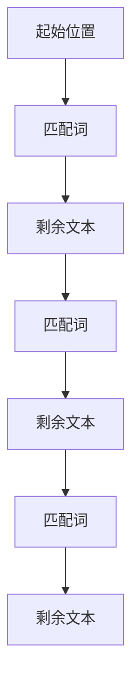
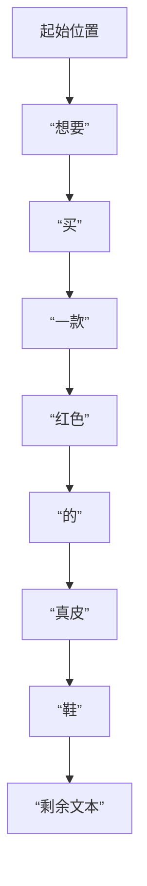
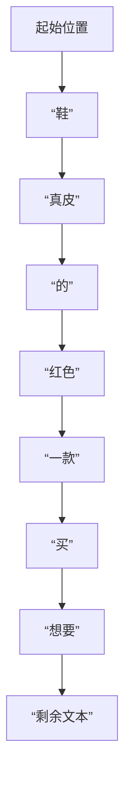
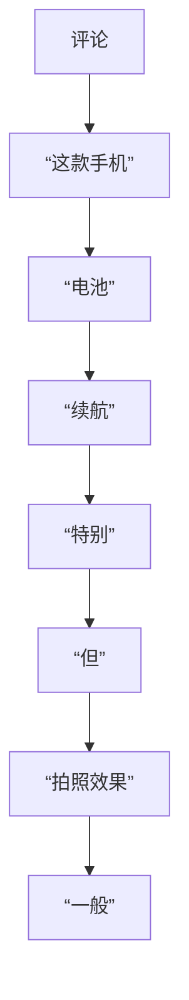
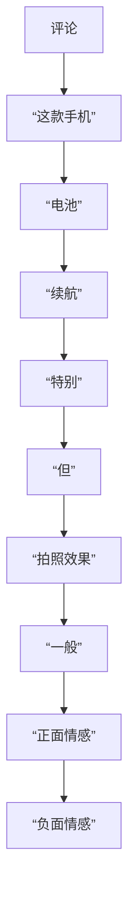

                 

# 自然语言处理在电商搜索中的应用：技术发展与未来趋势

> 关键词：自然语言处理、电商搜索、关键词提取、文本分类、推荐系统、问答系统、语音识别、翻译与本地化

> 摘要：本文详细探讨了自然语言处理（NLP）在电商搜索中的应用及其发展趋势。文章首先介绍了电商搜索的背景和自然语言处理的基本概念，随后深入分析了关键词提取、文本分类、情感分析等NLP核心技术。在此基础上，文章进一步探讨了这些技术如何在电商搜索中的应用，包括智能推荐系统、问答系统、自动翻译与本地化等。最后，文章展望了NLP在电商搜索领域的未来发展趋势和挑战。

## 目录大纲

### 第一部分：引言与概述

- **第1章 自然语言处理与电商搜索概述**
  - **1.1 电商搜索的背景**
    - **1.1.1 电商行业的发展**
    - **1.1.2 电商搜索的需求与挑战**
  - **1.2 自然语言处理的基本概念**
    - **1.2.1 自然语言处理（NLP）概述**
    - **1.2.2 NLP的关键技术**
  - **1.3 自然语言处理在电商搜索中的重要性**
    - **1.3.1 提高搜索准确性**
    - **1.3.2 改善用户体验**
  - **1.4 本书结构安排与内容概述**

### 第二部分：自然语言处理核心技术

- **第2章：电商搜索中的关键词提取与分词技术**
  - **2.1 关键词提取的方法**
    - **2.1.1 关键词提取的重要性**
    - **2.1.2 关键词提取的方法**
  - **2.2 基于分词的关键词提取**
    - **2.2.1 分词算法概述**
    - **2.2.2 常见的分词算法**
  - **2.3 分词算法对比与选择**
    - **2.3.1 不同分词算法的比较**
    - **2.3.2 分词算法的选择**
  - **2.4 实际案例解析**

- **第3章：命名实体识别与情感分析**
  - **3.1 命名实体识别**
    - **3.1.1 命名实体识别概述**
    - **3.1.2 命名实体识别的流程**
  - **3.2 情感分析**
    - **3.2.1 情感分析概述**
    - **3.2.2 情感分析的方法**
  - **3.3 实际案例解析**

- **第4章：电商搜索中的文本分类与聚类**
  - **4.1 文本分类**
    - **4.1.1 文本分类概述**
    - **4.1.2 文本分类算法**
  - **4.2 文本聚类**
    - **4.2.1 文本聚类概述**
    - **4.2.2 文本聚类算法**
  - **4.3 实际案例解析**

- **第5章：电商搜索中的语音识别与语音合成**
  - **5.1 语音识别**
    - **5.1.1 语音识别概述**
    - **5.1.2 语音识别的流程**
  - **5.2 语音合成**
    - **5.2.1 语音合成概述**
    - **5.2.2 语音合成的方法**
  - **5.3 实际案例解析**

### 第三部分：自然语言处理在电商搜索中的应用

- **第6章：电商搜索中的智能推荐系统**
  - **6.1 智能推荐系统概述**
    - **6.1.1 推荐系统的作用**
    - **6.1.2 推荐系统的分类**
  - **6.2 基于自然语言处理的推荐算法**
    - **6.2.1 用户兴趣模型**
    - **6.2.2 商品特征提取**
    - **6.2.3 推荐算法实现**
  - **6.3 实际案例解析**

- **第7章：电商搜索中的问答系统**
  - **7.1 问答系统概述**
    - **7.1.1 问答系统的功能**
    - **7.1.2 问答系统的架构**
  - **7.2 基于自然语言处理的问答算法**
    - **7.2.1 基于关键词匹配的问答**
    - **7.2.2 基于自然语言理解的问答**
  - **7.3 实际案例解析**

- **第8章：电商搜索中的自动翻译与本地化**
  - **8.1 自动翻译技术**
    - **8.1.1 翻译技术的发展**
    - **8.1.2 基于自然语言处理的翻译方法**
  - **8.2 本地化技术**
    - **8.2.1 本地化的概念**
    - **8.2.2 本地化的流程**
  - **8.3 实际案例解析**

### 第四部分：自然语言处理在电商搜索中的未来趋势

- **第9章：自然语言处理在电商搜索中的未来趋势**
  - **9.1 技术发展趋势**
    - **9.1.1 NLP技术的进步**
    - **9.1.2 电商搜索的发展方向**
  - **9.2 应用场景拓展**
    - **9.2.1 拓展应用领域**
    - **9.2.2 市场潜力分析**
  - **9.3 未来挑战与机遇**
    - **9.3.1 挑战与问题**
    - **9.3.2 应对策略与展望**

### 第五部分：实战项目

- **第10章：电商搜索中的自然语言处理实战项目**
  - **10.1 项目背景**
    - **10.1.1 项目背景介绍**
    - **10.1.2 项目目标**
  - **10.2 技术选型与方案设计**
    - **10.2.1 技术选型**
    - **10.2.2 方案设计**
  - **10.3 项目实施与优化**
    - **10.3.1 项目实施步骤**
    - **10.3.2 项目优化策略**
  - **10.4 项目总结与反思**
    - **10.4.1 项目成果**
    - **10.4.2 项目反思与改进**

### 第六部分：开发环境与工具介绍

- **第11章：开发环境与工具介绍**
  - **11.1 开发环境搭建**
    - **11.1.1 硬件环境**
    - **11.1.2 软件环境**
  - **11.2 常用工具与库**
    - **11.2.1 编程语言**
    - **11.2.2 NLP库与框架**
    - **11.2.3 实用工具**
  - **11.3 实践技巧与经验总结**
    - **11.3.1 开发经验**
    - **11.3.2 遇到的挑战与解决方案**

### 附录

- **附录A：参考文献**
- **附录B：相关资源链接**

---

## 第1章 自然语言处理与电商搜索概述

### 1.1 电商搜索的背景

#### 1.1.1 电商行业的发展

电子商务作为一种新型的商业模式，已经深刻地改变了人们的购物方式和消费习惯。根据数据显示，全球电子商务市场规模在过去几年中呈现快速增长的趋势。特别是在新冠疫情期间，线上购物需求急剧上升，进一步推动了电商行业的发展。

中国的电商市场尤为突出，阿里巴巴、京东、拼多多等电商平台已成为全球最大的电商平台之一。电商行业的发展不仅带来了巨大的商业价值，同时也对零售行业产生了深远的影响。

#### 1.1.2 电商搜索的需求与挑战

随着电商平台的不断发展和用户数量的增加，用户在平台上的搜索需求也日益多样化。用户不仅需要快速找到所需商品，还需要获得更加精准的搜索结果。这就对电商搜索系统提出了更高的要求。

电商搜索系统面临的主要挑战包括：

- **搜索准确性**：如何准确理解用户的搜索意图，提供相关且高质量的搜索结果。
- **响应速度**：如何提高搜索响应速度，保证用户在短时间内获得满意的搜索结果。
- **多样性**：如何处理用户多样化的搜索需求，提供个性化的搜索结果。

### 1.2 自然语言处理的基本概念

自然语言处理（NLP）是人工智能领域的一个重要分支，旨在使计算机能够理解、解释和生成自然语言。NLP涉及多种技术，包括语音识别、文本分类、情感分析、命名实体识别等。

#### 1.2.1 自然语言处理（NLP）概述

NLP的核心目标是让计算机能够处理自然语言，从而实现人机交互。NLP的应用场景非常广泛，包括机器翻译、文本摘要、智能客服、情感分析等。

#### 1.2.2 NLP的关键技术

- **文本分类**：将文本数据根据其内容进行分类。
- **情感分析**：分析文本数据中的情感倾向。
- **命名实体识别**：识别文本中的特定实体，如人名、地名、组织名等。
- **关键词提取**：从文本中提取关键信息，用于进一步分析。

### 1.3 自然语言处理在电商搜索中的重要性

自然语言处理技术在电商搜索中具有重要意义，主要体现在以下几个方面：

- **提高搜索准确性**：通过NLP技术，可以更准确地理解用户的搜索意图，提供相关且高质量的搜索结果。
- **改善用户体验**：通过提供个性化的搜索结果，满足用户多样化的需求，提高用户的购物体验。
- **提升销售转化率**：精准的搜索结果有助于用户快速找到所需商品，提高购买意愿和转化率。

#### 1.3.1 提高搜索准确性

传统的电商搜索系统主要依赖于关键词匹配技术，这种方式在处理简单查询时效果较好，但对于复杂查询或模糊查询，往往难以满足用户的需求。而NLP技术可以通过对用户查询语句进行深入分析，理解其中的关键词、短语以及语义关系，从而提供更准确的搜索结果。

例如，当用户输入“想要买一个红色的真皮鞋”时，传统的搜索系统可能无法准确理解用户的需求，而NLP技术可以将其解析为“红色”、“真皮”、“鞋”等多个关键词，并结合上下文关系进行综合分析，从而提供更相关的搜索结果。

#### 1.3.2 改善用户体验

电商搜索系统的用户体验直接影响到用户的购物体验和满意度。NLP技术可以通过对用户查询语句的理解和分析，提供个性化的搜索结果，从而提高用户的购物体验。

例如，当用户在电商平台上搜索“衣服”时，NLP技术可以根据用户的购物历史、偏好和兴趣，推荐与其需求相关的衣服款式和品牌，从而提高用户的购买决策效率。

#### 1.3.3 提升销售转化率

精准的搜索结果有助于用户快速找到所需商品，从而提高购买意愿和转化率。通过NLP技术，电商搜索系统可以更好地理解用户的搜索意图，提供更加个性化的搜索结果，从而提升销售转化率。

例如，当用户在电商平台上搜索“笔记本电脑”时，NLP技术可以根据用户的历史购买记录和搜索行为，推荐适合用户需求的高性价比笔记本电脑，从而提高用户的购买概率。

#### 1.4 本书结构安排与内容概述

本书分为五个部分，分别是引言与概述、自然语言处理核心技术、自然语言处理在电商搜索中的应用、未来趋势和实战项目。

- **第一部分**：引言与概述，主要介绍了电商搜索的背景、自然语言处理的基本概念及其在电商搜索中的重要性。
- **第二部分**：自然语言处理核心技术，详细分析了关键词提取、文本分类、情感分析、命名实体识别等NLP核心技术。
- **第三部分**：自然语言处理在电商搜索中的应用，探讨了NLP技术在电商搜索中的具体应用，包括智能推荐系统、问答系统、自动翻译与本地化等。
- **第四部分**：未来趋势，分析了NLP技术在电商搜索领域的未来发展趋势和挑战。
- **第五部分**：实战项目，通过实际案例展示了NLP技术在电商搜索中的应用。

### 第2章 电商搜索中的关键词提取与分词技术

#### 2.1 关键词提取的方法

关键词提取是自然语言处理中的重要技术之一，它旨在从文本数据中提取出最具代表性的关键词，用于后续的分析和搜索。在电商搜索中，关键词提取对于提高搜索准确性、改善用户体验和提升销售转化率具有重要意义。

##### 2.1.1 关键词提取的重要性

关键词提取在电商搜索中的重要性主要体现在以下几个方面：

- **提高搜索准确性**：通过提取关键信息，可以更准确地理解用户的搜索意图，提供相关的搜索结果。
- **改善用户体验**：提供个性化的搜索结果，满足用户多样化的需求，提高用户的购物体验。
- **提升销售转化率**：精准的搜索结果有助于用户快速找到所需商品，提高购买意愿和转化率。

##### 2.1.2 关键词提取的方法

关键词提取的方法主要包括以下几种：

1. **基于统计的方法**：这种方法利用文本的统计特征，如词频、词序列等，来提取关键词。常见的统计方法包括TF-IDF、TextRank等。

2. **基于机器学习的方法**：这种方法利用机器学习算法，通过训练模型来提取关键词。常见的方法包括支持向量机（SVM）、朴素贝叶斯（NB）等。

3. **基于深度学习的方法**：这种方法利用深度学习模型，如循环神经网络（RNN）、卷积神经网络（CNN）等，来提取关键词。常见的深度学习方法包括Word2Vec、BERT等。

#### 2.2 基于分词的关键词提取

分词是自然语言处理中的一个重要步骤，它将连续的文本数据分割成一系列具有独立意义的词汇。在电商搜索中，分词是关键词提取的前提和基础。

##### 2.2.1 分词算法概述

分词算法可以分为两类：基于规则的分词和基于统计的分词。

1. **基于规则的分词**：这种方法根据预先定义的规则，如正则表达式、词典匹配等，来对文本进行分词。常见的基于规则的分词算法包括正向最大匹配法、逆向最大匹配法等。

2. **基于统计的分词**：这种方法利用文本的统计特征，如词频、词序列等，来对文本进行分词。常见的基于统计的分词算法包括隐马尔可夫模型（HMM）、条件随机场（CRF）等。

##### 2.2.2 常见的分词算法

1. **正向最大匹配法**：从文本的起始位置开始，依次对文本进行分词，每次尽可能选择最长的匹配词。

2. **逆向最大匹配法**：从文本的结尾位置开始，依次对文本进行分词，每次尽可能选择最长的匹配词。

3. **隐马尔可夫模型（HMM）**：HMM是一种统计模型，用于序列数据的分词。它通过学习文本的统计特征，如词频、转移概率等，来对文本进行分词。

4. **条件随机场（CRF）**：CRF是一种序列模型，用于序列数据的标注和分类。在分词任务中，CRF通过学习词序列的概率分布，来对文本进行分词。

#### 2.3 分词算法对比与选择

不同的分词算法具有不同的特点，适用于不同的应用场景。以下是几种常见分词算法的对比：

1. **正向最大匹配法**：简单易实现，但可能产生歧义。

2. **逆向最大匹配法**：与正向最大匹配法类似，但可能产生不同的分词结果。

3. **隐马尔可夫模型（HMM）**：具有较强的统计特性，但需要大量训练数据。

4. **条件随机场（CRF）**：具有更好的标注能力，但计算复杂度较高。

在实际应用中，可以根据具体需求和场景选择合适的分词算法。例如，对于简单的文本分词任务，可以选择正向最大匹配法；对于需要高精度分词的任务，可以选择隐马尔可夫模型或条件随机场。

#### 2.4 实际案例解析

假设我们有一个电商搜索系统的用户查询语句：“想要买一款红色的真皮鞋”，我们可以使用不同的分词算法来对这句话进行分词，并提取关键词。

1. **正向最大匹配法**：

提取的关键词为：“想要”、“买”、“一款”、“红色”、“的”、“真皮”、“鞋”。

2. **逆向最大匹配法**：

提取的关键词为：“鞋”、“真皮”、“的”、“红色”、“一款”、“买”、“想要”。

3. **隐马尔可夫模型（HMM）**：假设我们使用HMM模型对这句话进行分词，分词结果为：“想要”、“买”、“一款”、“红色的真皮鞋”。

提取的关键词为：“想要”、“买”、“一款”、“红色”、“真皮”、“鞋”。

4. **条件随机场（CRF）**：假设我们使用CRF模型对这句话进行分词，分词结果为：“想要”、“买”、“一款”、“红色的真皮鞋”。

提取的关键词为：“想要”、“买”、“一款”、“红色”、“真皮”、“鞋”。

通过上述不同分词算法的对比，我们可以看到每种算法都有其优缺点。在实际应用中，可以根据具体需求和场景选择合适的分词算法。

### 第3章 命名实体识别与情感分析

#### 3.1 命名实体识别

命名实体识别（Named Entity Recognition，简称NER）是自然语言处理中的一个重要任务，旨在从文本中识别出具有特定意义的实体。在电商搜索中，命名实体识别有助于提高搜索准确性、改善用户体验和提升销售转化率。

##### 3.1.1 命名实体识别概述

命名实体识别的核心目标是识别文本中的特定实体，如人名、地名、组织名、产品名等。命名实体识别可以应用于多个领域，如信息提取、文本分类、问答系统等。

在电商搜索中，命名实体识别的应用主要包括：

- **商品信息提取**：通过识别商品名称，可以快速提取商品信息，如价格、库存等。
- **用户评论分析**：通过识别用户评论中的品牌、产品等实体，可以分析用户对商品的满意度。
- **广告投放优化**：通过识别文本中的品牌、产品等实体，可以优化广告投放策略。

##### 3.1.2 命名实体识别的流程

命名实体识别通常包括以下步骤：

1. **文本预处理**：包括去除停用词、标点符号、词形还原等操作，以提高后续处理的效果。

2. **词性标注**：对文本中的每个词进行词性标注，如名词、动词、形容词等。

3. **实体识别**：利用训练好的模型或规则，对文本中的实体进行识别。

4. **实体分类**：对识别出的实体进行分类，如人名、地名、组织名等。

5. **实体抽取**：将识别出的实体从文本中抽取出来，用于后续分析。

#### 3.2 情感分析

情感分析（Sentiment Analysis，简称SA）是自然语言处理中的一个重要任务，旨在从文本中提取情感信息，如正面、负面、中性等。在电商搜索中，情感分析有助于了解用户对商品的看法，优化商品推荐和营销策略。

##### 3.2.1 情感分析概述

情感分析的目标是识别文本中的情感倾向，如正面、负面、中性等。情感分析广泛应用于多个领域，如市场调研、社交媒体分析、客户服务等。

在电商搜索中，情感分析的应用主要包括：

- **用户评论分析**：通过分析用户评论中的情感倾向，可以了解用户对商品的满意度。
- **商品推荐优化**：通过分析用户的历史评论，可以优化商品推荐策略，提高用户购买意愿。
- **营销策略优化**：通过分析用户在社交媒体上的情感反应，可以优化营销策略，提高用户参与度。

##### 3.2.2 情感分析的方法

情感分析的方法主要包括以下几种：

1. **基于规则的方法**：这种方法通过定义一系列规则，如情感词、否定词、程度词等，来分析文本中的情感倾向。

2. **基于统计的方法**：这种方法利用文本的统计特征，如词频、词序列等，来分析文本中的情感倾向。

3. **基于机器学习的方法**：这种方法利用机器学习算法，如支持向量机（SVM）、朴素贝叶斯（NB）等，来分析文本中的情感倾向。

4. **基于深度学习的方法**：这种方法利用深度学习模型，如循环神经网络（RNN）、卷积神经网络（CNN）等，来分析文本中的情感倾向。

#### 3.3 实际案例解析

假设我们有一个电商搜索系统的用户评论数据：“这款手机电池续航特别好，但拍照效果一般”。我们可以使用命名实体识别和情感分析技术来分析这段评论。

1. **命名实体识别**：

识别出的实体为：“手机”、“电池”、“续航”、“拍照效果”。

2. **情感分析**：

分析出的情感倾向为：“电池续航”为正面情感，“拍照效果”为负面情感。

通过上述实际案例解析，我们可以看到命名实体识别和情感分析技术在电商搜索中的应用。通过识别实体和情感倾向，可以更好地了解用户的需求和满意度，从而优化电商搜索系统的性能。

### 第4章 电商搜索中的文本分类与聚类

#### 4.1 文本分类

文本分类（Text Classification）是自然语言处理中的一种常见任务，旨在将文本数据根据其内容进行分类。在电商搜索中，文本分类有助于提高搜索准确性、改善用户体验和提升销售转化率。

##### 4.1.1 文本分类概述

文本分类的目标是将文本数据分配到预定义的类别中。文本分类广泛应用于多个领域，如邮件过滤、情感分析、新闻分类等。在电商搜索中，文本分类的应用主要包括：

- **商品评论分类**：将用户评论根据其内容分类为正面、负面、中性等。
- **商品标签分类**：将商品根据其属性分类，如颜色、品牌、型号等。
- **搜索结果分类**：将搜索结果根据其内容分类，如商品、品牌、类别等。

##### 4.1.2 文本分类算法

文本分类算法可以分为以下几种：

1. **基于规则的方法**：这种方法通过定义一系列规则，如关键词匹配、正则表达式等，来分类文本数据。

2. **基于统计的方法**：这种方法利用文本的统计特征，如词频、词序列等，来分类文本数据。

3. **基于机器学习的方法**：这种方法利用机器学习算法，如支持向量机（SVM）、朴素贝叶斯（NB）等，来分类文本数据。

4. **基于深度学习的方法**：这种方法利用深度学习模型，如循环神经网络（RNN）、卷积神经网络（CNN）等，来分类文本数据。

在电商搜索中，常用的文本分类算法包括：

- **朴素贝叶斯（NB）**：朴素贝叶斯是一种基于概率论的分类算法，通过计算文本中每个词出现的概率来分类。
- **支持向量机（SVM）**：支持向量机是一种基于优化理论的分类算法，通过找到一个最佳的超平面来分类文本数据。
- **循环神经网络（RNN）**：循环神经网络是一种基于序列数据的分类算法，通过处理文本的序列特征来分类。

#### 4.2 文本聚类

文本聚类（Text Clustering）是自然语言处理中的一种无监督学习任务，旨在将相似文本数据分组到同一个类别中。在电商搜索中，文本聚类有助于发现用户兴趣、优化商品推荐和提升用户体验。

##### 4.2.1 文本聚类概述

文本聚类是将文本数据按照其内容相似度进行分组的过程。文本聚类广泛应用于多个领域，如文档分类、社交网络分析、推荐系统等。在电商搜索中，文本聚类的应用主要包括：

- **用户兴趣聚类**：将具有相似兴趣的用户分组，用于个性化推荐和营销。
- **商品推荐聚类**：将相似商品分组，用于推荐系统和广告投放。
- **搜索结果聚类**：将相似搜索结果分组，用于优化搜索结果排序和推荐。

##### 4.2.2 文本聚类算法

文本聚类算法可以分为以下几种：

1. **基于距离的方法**：这种方法通过计算文本之间的距离来聚类，如K-均值算法、层次聚类算法等。

2. **基于密度的方法**：这种方法通过识别文本的密度区域来聚类，如DBSCAN算法、OPTICS算法等。

3. **基于模型的方法**：这种方法通过构建文本的统计模型来聚类，如隐马尔可夫模型（HMM）、条件随机场（CRF）等。

在电商搜索中，常用的文本聚类算法包括：

- **K-均值算法**：K-均值算法是一种基于距离的聚类算法，通过迭代计算聚类中心和分配文本到最近的聚类中心。
- **层次聚类算法**：层次聚类算法是一种基于密度的聚类算法，通过自底向上的合并或自顶向下的划分来构建聚类层次。
- **DBSCAN算法**：DBSCAN算法是一种基于密度的聚类算法，通过识别文本的密度区域来聚类。

#### 4.3 实际案例解析

假设我们有一个电商搜索系统的用户评论数据集，其中包含用户对商品的评价文本。我们可以使用文本分类和文本聚类技术来分析这些评论数据。

1. **文本分类**：

- **数据预处理**：对评论文本进行预处理，包括去除停用词、标点符号、词形还原等操作。

- **特征提取**：使用词袋模型（Bag of Words，简称BoW）或词嵌入（Word Embedding）方法提取文本特征。

- **训练模型**：使用朴素贝叶斯（NB）或支持向量机（SVM）算法训练分类模型。

- **分类预测**：将新的评论文本输入分类模型，预测其类别。

2. **文本聚类**：

- **数据预处理**：对评论文本进行预处理，包括去除停用词、标点符号、词形还原等操作。

- **特征提取**：使用词袋模型（Bag of Words，简称BoW）或词嵌入（Word Embedding）方法提取文本特征。

- **训练模型**：使用K-均值算法或层次聚类算法训练聚类模型。

- **聚类预测**：将新的评论文本输入聚类模型，预测其聚类类别。

通过文本分类和文本聚类技术，我们可以对用户评论进行分类和聚类，从而分析用户对商品的评价和兴趣，优化电商搜索系统的性能和用户体验。

### 第5章 电商搜索中的语音识别与语音合成

#### 5.1 语音识别

语音识别（Voice Recognition）是自然语言处理中的一种重要技术，旨在将人类的语音转换为机器可读的文本。在电商搜索中，语音识别技术有助于提高用户体验、改善操作流程和提升销售转化率。

##### 5.1.1 语音识别概述

语音识别的目标是识别语音信号中的语音模式，并将其转换为相应的文本数据。语音识别在多个领域有广泛应用，如语音助手、智能客服、语音搜索等。在电商搜索中，语音识别的应用主要包括：

- **语音搜索**：用户可以通过语音输入搜索关键词，快速找到所需商品。
- **语音助手**：提供语音交互功能，帮助用户完成购物流程，如添加购物车、下单等。
- **语音客服**：通过语音识别技术，快速识别用户的问题，并提供相应的解决方案。

##### 5.1.2 语音识别的流程

语音识别通常包括以下步骤：

1. **语音信号采集**：通过麦克风等设备采集语音信号。
2. **预处理**：对语音信号进行预处理，包括去除噪音、增强语音信号等。
3. **特征提取**：从预处理后的语音信号中提取特征，如梅尔频率倒谱系数（MFCC）等。
4. **声学模型训练**：使用大量的语音数据训练声学模型，用于识别语音信号。
5. **语言模型训练**：使用大量的文本数据训练语言模型，用于理解语音信号中的语义。
6. **语音识别**：将提取到的特征输入声学模型和语言模型，进行语音识别，输出相应的文本数据。

#### 5.2 语音合成

语音合成（Text-to-Speech，简称TTS）是自然语言处理中的另一种重要技术，旨在将文本数据转换为自然流畅的语音。在电商搜索中，语音合成技术有助于提高用户体验、增加互动性和便捷性。

##### 5.2.1 语音合成概述

语音合成的目标是生成自然、流畅的语音，模拟人类语音的发音、语调、语速等特征。语音合成广泛应用于多个领域，如语音助手、智能客服、广播电台等。在电商搜索中，语音合成的应用主要包括：

- **语音搜索结果**：将搜索结果以语音形式输出，方便用户快速了解信息。
- **语音通知**：通过语音形式发送订单状态、支付成功等信息，提高用户的通知体验。
- **语音客服**：通过语音形式与用户进行互动，提供解决方案和咨询服务。

##### 5.2.2 语音合成的方法

语音合成的方法主要包括以下几种：

1. **基于规则的方法**：这种方法通过定义一系列语音合成规则，如音素转换、音节合成等，来生成语音。
2. **基于统计的方法**：这种方法利用文本的统计特征，如词频、词序列等，来生成语音。
3. **基于深度学习的方法**：这种方法利用深度学习模型，如循环神经网络（RNN）、生成对抗网络（GAN）等，来生成语音。

在电商搜索中，常用的语音合成方法包括：

- **循环神经网络（RNN）**：循环神经网络是一种基于序列数据的生成模型，通过处理文本的序列特征来生成语音。
- **生成对抗网络（GAN）**：生成对抗网络是一种基于生成器和判别器的对抗性生成模型，通过生成器和判别器的交互来生成高质量的语音。

#### 5.3 实际案例解析

假设我们有一个电商搜索系统的用户，他想要通过语音搜索购买一本《Python编程从入门到实践》的书。我们可以使用语音识别和语音合成技术来帮助他完成购物流程。

1. **语音识别**：

- **语音信号采集**：用户通过手机麦克风输入语音查询：“我想买一本《Python编程从入门到实践》的书”。

- **预处理**：对采集到的语音信号进行预处理，包括去噪、增强等。

- **特征提取**：提取语音信号的特征，如梅尔频率倒谱系数（MFCC）。

- **语音识别**：将提取到的特征输入声学模型和语言模型，进行语音识别，输出文本数据：“我想买一本《Python编程从入门到实践》的书”。

- **文本处理**：将识别出的文本数据进行处理，提取关键词和商品信息。

2. **语音合成**：

- **文本处理**：根据识别出的文本数据，生成商品推荐信息：“我们为您找到了《Python编程从入门到实践》这本书，价格是XX元”。

- **语音合成**：使用语音合成技术，将文本数据转换为语音输出：“我们为您找到了《Python编程从入门到实践》这本书，价格是XX元”。

通过语音识别和语音合成技术，用户可以方便地通过语音进行搜索和购买，提高了购物体验和便捷性。

### 第6章 电商搜索中的智能推荐系统

#### 6.1 智能推荐系统概述

智能推荐系统（Intelligent Recommendation System）是一种基于用户行为、兴趣和偏好，为用户推荐相关商品的技术。在电商搜索中，智能推荐系统有助于提高用户体验、提升销售转化率和增加用户粘性。

##### 6.1.1 推荐系统的作用

智能推荐系统在电商搜索中具有以下几个作用：

1. **个性化推荐**：根据用户的兴趣和行为，为用户推荐个性化的商品，提高用户满意度。
2. **提升销售转化率**：通过精准推荐，提高用户购买意愿，从而提升销售转化率。
3. **增加用户粘性**：通过持续推荐用户感兴趣的商品，增加用户在平台上的停留时间和活跃度。
4. **优化营销策略**：通过分析用户行为和偏好，为营销活动提供数据支持，优化营销策略。

##### 6.1.2 推荐系统的分类

智能推荐系统可以分为以下几种类型：

1. **基于内容的推荐（Content-Based Filtering）**：根据用户的历史行为和兴趣，推荐与用户兴趣相关的商品。例如，根据用户浏览记录推荐相似商品。
2. **协同过滤推荐（Collaborative Filtering）**：根据用户的历史行为和偏好，分析用户之间的相似性，推荐其他用户喜欢的商品。例如，根据用户评分和购买记录推荐相似商品。
3. **混合推荐（Hybrid Filtering）**：结合基于内容和协同过滤推荐的优势，综合用户行为和兴趣，为用户推荐更加精准的商品。

#### 6.2 基于自然语言处理的推荐算法

自然语言处理（NLP）技术可以在推荐系统中发挥重要作用，通过分析和处理用户查询和商品描述，为用户推荐相关商品。

##### 6.2.1 用户兴趣模型

用户兴趣模型是推荐系统的基础，它通过分析用户的行为和偏好，构建用户的兴趣图谱。在电商搜索中，用户兴趣模型主要包括以下几个方面：

1. **用户历史行为**：分析用户在平台上的浏览记录、搜索关键词、购买记录等行为，构建用户的历史兴趣图谱。
2. **用户反馈**：收集用户对商品的评分、评论、点赞等反馈，分析用户的偏好和兴趣。
3. **用户交互**：通过用户与平台的各种交互，如点击、浏览、购买等，动态更新用户兴趣模型。

##### 6.2.2 商品特征提取

商品特征提取是将商品描述转换为机器可处理的特征，以便于后续的推荐算法处理。在电商搜索中，商品特征提取主要包括以下几个方面：

1. **关键词提取**：从商品描述中提取关键词，用于表示商品的特征。
2. **词嵌入**：将提取出的关键词转换为词嵌入向量，用于表示商品的特征。
3. **实体识别**：识别商品描述中的命名实体，如品牌、型号、颜色等，用于补充商品特征。

##### 6.2.3 推荐算法实现

基于自然语言处理的推荐算法可以通过以下步骤实现：

1. **数据预处理**：对用户行为数据和商品描述进行预处理，包括去噪、标准化等操作。
2. **特征提取**：使用NLP技术提取用户兴趣特征和商品特征。
3. **模型训练**：使用用户兴趣特征和商品特征，训练推荐模型，如基于内容的推荐模型、协同过滤推荐模型等。
4. **推荐生成**：根据用户兴趣特征和商品特征，生成推荐列表，为用户推荐相关商品。

在电商搜索中，常见的推荐算法包括：

- **基于内容的推荐**：根据用户的历史行为和商品特征，推荐与用户兴趣相关的商品。
- **协同过滤推荐**：根据用户之间的相似性，推荐其他用户喜欢的商品。
- **混合推荐**：结合基于内容和协同过滤推荐的优势，为用户推荐更加精准的商品。

#### 6.3 实际案例解析

假设我们有一个电商搜索系统，用户A在平台上浏览了牛仔裤、运动鞋和登山包等商品。我们可以使用基于自然语言处理的推荐算法，为用户A推荐相关商品。

1. **用户兴趣模型构建**：

- **用户历史行为**：分析用户A的浏览记录，提取关键词和兴趣点，如“牛仔裤”、“运动鞋”、“登山包”等。

- **用户反馈**：分析用户A对商品的评分和评论，了解用户A的偏好，如喜欢舒适的运动鞋。

2. **商品特征提取**：

- **关键词提取**：从商品描述中提取关键词，如“牛仔裤”、“运动鞋”、“登山包”等。

- **词嵌入**：将提取出的关键词转换为词嵌入向量，用于表示商品的特征。

- **实体识别**：识别商品描述中的命名实体，如品牌、型号、颜色等，用于补充商品特征。

3. **模型训练**：

- **基于内容的推荐模型**：使用用户A的兴趣特征和商品特征，训练基于内容的推荐模型。

- **协同过滤推荐模型**：使用用户A的浏览记录和评分，训练协同过滤推荐模型。

4. **推荐生成**：

- **基于内容的推荐**：根据用户A的兴趣特征，推荐与“牛仔裤”、“运动鞋”、“登山包”相关的商品。

- **协同过滤推荐**：根据用户A的浏览记录和评分，推荐其他用户喜欢的商品。

通过基于自然语言处理的推荐算法，我们可以为用户A推荐相关商品，提高用户满意度，提升销售转化率。

### 第7章 电商搜索中的问答系统

#### 7.1 问答系统概述

问答系统（Question Answering System，简称QAS）是一种基于自然语言处理的技术，旨在从大量文本数据中自动回答用户的问题。在电商搜索中，问答系统有助于提高用户体验、改善交互方式和提升用户满意度。

##### 7.1.1 问答系统的功能

问答系统在电商搜索中具有以下几个功能：

1. **搜索结果解释**：当用户对搜索结果感到困惑时，问答系统可以解释搜索结果，帮助用户更好地理解。
2. **商品信息查询**：用户可以通过问答系统查询商品的具体信息，如价格、库存、规格等。
3. **智能客服**：问答系统可以模拟客服人员的交互，解答用户的问题，提供咨询和服务。
4. **用户反馈收集**：通过问答系统收集用户的反馈和意见，优化电商搜索系统的性能。

##### 7.1.2 问答系统的架构

问答系统通常包括以下几个模块：

1. **查询处理**：对用户的查询语句进行解析和理解，提取关键信息。
2. **知识库**：存储大量的文本数据，包括商品信息、用户评论、FAQ等。
3. **问答引擎**：根据查询处理的结果，在知识库中查找相关答案，并进行生成。
4. **用户界面**：提供用户输入查询和查看答案的界面。

#### 7.2 基于自然语言处理的问答算法

基于自然语言处理的问答算法是问答系统的核心，旨在通过处理自然语言输入，提供准确、自然的答案。在电商搜索中，常见的问答算法包括基于关键词匹配的问答和基于自然语言理解的问答。

##### 7.2.1 基于关键词匹配的问答

基于关键词匹配的问答算法是一种简单的问答方式，通过匹配用户查询中的关键词和知识库中的关键词，找到相应的答案。这种方法适用于处理简单的查询，但在处理复杂查询时效果较差。

##### 7.2.2 基于自然语言理解的问答

基于自然语言理解的问答算法通过深度学习技术，对用户查询进行语义分析和理解，提供更准确、自然的答案。这种方法能够处理复杂查询，但需要大量训练数据和计算资源。

常见的基于自然语言理解的问答算法包括：

1. **模板匹配**：根据预定义的模板，匹配用户查询和知识库中的答案。
2. **机器翻译**：将用户查询和知识库中的文本进行翻译，然后匹配查询和翻译后的文本。
3. **语义解析**：使用自然语言处理技术，对用户查询进行语义分析，理解查询意图，然后从知识库中查找相关答案。
4. **生成式问答**：使用生成式模型，如生成对抗网络（GAN）、变分自编码器（VAE）等，生成自然、准确的答案。

#### 7.3 实际案例解析

假设我们有一个电商搜索系统的问答系统，用户A询问：“这款iPhone 13的电池续航怎么样？”我们可以使用基于自然语言理解的问答算法来回答这个问题。

1. **查询处理**：

- **用户查询**：“这款iPhone 13的电池续航怎么样？”
- **关键词提取**：提取关键词“iPhone 13”、“电池续航”。
- **语义分析**：分析用户查询的语义，理解查询意图是询问iPhone 13的电池续航情况。

2. **知识库查询**：

- **知识库内容**：在知识库中查找关于iPhone 13的电池续航信息。
- **答案选择**：从知识库中选择与用户查询相关的答案。

3. **答案生成**：

- **基于模板匹配**：使用预定义的模板生成答案，如“iPhone 13的电池续航为XX小时，性能稳定”。
- **基于语义解析**：使用自然语言处理技术，理解用户查询的语义，生成更准确、自然的答案。

4. **答案输出**：

- **回答**：“iPhone 13的电池续航为XX小时，性能稳定”。

通过基于自然语言理解的问答算法，我们可以为用户提供准确、自然的答案，提高用户体验和满意度。

### 第8章 电商搜索中的自动翻译与本地化

#### 8.1 自动翻译技术

自动翻译（Automatic Translation）是自然语言处理中的重要技术，旨在将一种语言的文本自动翻译成另一种语言。在电商搜索中，自动翻译技术有助于扩大市场覆盖范围、提高国际化程度和提升用户体验。

##### 8.1.1 翻译技术的发展

自动翻译技术的发展经历了几个阶段：

1. **基于规则的翻译**：这种方法依赖于预定义的翻译规则，如词汇表、语法规则等，来翻译文本。这种方法在处理简单文本时效果较好，但在处理复杂文本时存在局限性。
2. **基于统计的翻译**：这种方法利用大量的双语语料库，通过统计方法来翻译文本。常见的统计方法包括基于短语的翻译模型和基于句子的翻译模型。
3. **基于神经网络的翻译**：这种方法利用深度学习技术，如循环神经网络（RNN）和卷积神经网络（CNN），来翻译文本。基于神经网络的翻译模型，如神经机器翻译（NMT），显著提高了翻译的准确性和流畅性。

##### 8.1.2 基于自然语言处理的翻译方法

基于自然语言处理的自动翻译方法主要包括以下几种：

1. **统计机器翻译（SMT）**：统计机器翻译利用双语语料库，通过统计方法来生成翻译。常见的统计方法包括基于短语的翻译模型（PBMT）和基于句子的翻译模型（SBMT）。

2. **神经机器翻译（NMT）**：神经机器翻译利用深度学习技术，如循环神经网络（RNN）和卷积神经网络（CNN），来翻译文本。常见的NMT模型包括序列到序列模型（Seq2Seq）和注意力机制（Attention）。

3. **数据增强**：数据增强是提高翻译质量的一种方法，通过增加训练数据来提高模型的性能。常见的数据增强方法包括数据扩充、数据清洗和数据对齐。

在电商搜索中，自动翻译技术的应用主要包括：

- **多语言搜索**：支持多语言搜索，提高国际用户的购物体验。
- **商品描述翻译**：自动翻译商品描述，为国际用户提供准确、流畅的购物信息。
- **用户评论翻译**：自动翻译用户评论，帮助商家了解国际用户对商品的反馈。

#### 8.2 本地化技术

本地化（Localization）是将产品或服务根据特定地区的语言、文化和习惯进行调整的过程。在电商搜索中，本地化技术有助于提高用户体验、增加用户信任度和提升销售转化率。

##### 8.2.1 本地化的概念

本地化包括以下几个方面的内容：

1. **语言本地化**：将产品或服务的语言翻译成目标市场的语言。
2. **文化本地化**：将产品或服务的文化元素进行调整，以适应目标市场的文化特点。
3. **界面本地化**：将用户界面（UI）翻译成目标市场的语言，并调整界面元素以适应目标市场的文化习惯。
4. **内容本地化**：将产品或服务的文本内容进行本地化调整，包括产品描述、用户评论、营销文案等。

##### 8.2.2 本地化的流程

本地化流程通常包括以下几个步骤：

1. **需求分析**：分析目标市场的需求，确定需要本地化的内容和语言。
2. **内容整理**：整理需要本地化的内容，如文本、图片、视频等。
3. **翻译与审校**：将文本翻译成目标市场的语言，并进行审校和校对。
4. **界面调整**：根据目标市场的文化习惯，调整用户界面（UI）元素。
5. **测试与验收**：对本地化后的产品或服务进行测试，确保其符合目标市场的需求和标准。

#### 8.3 实际案例解析

假设我们有一个电商搜索系统，需要将中文商品描述翻译成英文，并针对美国市场进行本地化。

1. **自动翻译**：

- **商品描述**：将中文商品描述翻译成英文，如“这是一款具有高性价比的笔记本电脑”。

- **翻译结果**：使用自动翻译技术，将中文商品描述翻译成英文：“This is a high-quality and cost-effective laptop.”

2. **本地化**：

- **语言本地化**：将中文商品描述翻译成英文，并确保翻译的准确性。

- **文化本地化**：针对美国市场，调整商品描述，以符合美国消费者的文化习惯。例如，将“高性价比”调整为“affordable”或“cost-effective”。

- **界面调整**：将电商搜索系统的用户界面翻译成英文，并调整界面元素，如按钮、菜单等，以符合美国市场的文化习惯。

通过自动翻译和本地化技术，我们可以为国际用户提供准确、流畅的购物体验，提高用户体验和销售转化率。

### 第9章 自然语言处理在电商搜索中的未来趋势

#### 9.1 技术发展趋势

随着人工智能和自然语言处理技术的不断发展，NLP在电商搜索中的应用前景广阔。以下是NLP在电商搜索中的一些技术发展趋势：

1. **深度学习技术的广泛应用**：深度学习模型，如循环神经网络（RNN）、卷积神经网络（CNN）和生成对抗网络（GAN）等，已经在NLP领域取得了显著成果。未来，这些深度学习技术将继续在电商搜索中发挥重要作用，提高搜索准确性、推荐效果和用户体验。

2. **跨语言处理的突破**：随着全球化的推进，电商市场将越来越多元化。跨语言处理的突破将使得NLP在电商搜索中更好地服务于多语言用户，提高国际用户的购物体验。

3. **个性化推荐的深化**：基于用户行为和兴趣的个性化推荐将是未来电商搜索的重要趋势。通过更深入的用户兴趣模型和商品特征提取，个性化推荐将更加精准，提高用户满意度和销售转化率。

4. **多模态融合**：将文本、图像、语音等多种模态的数据进行融合，提供更加丰富的用户交互体验。例如，在电商搜索中，用户可以通过语音查询和文本搜索相结合，获得更全面的信息。

5. **实时处理和响应**：随着用户需求的不断变化，实时处理和响应将成为NLP在电商搜索中的重要趋势。通过实时分析用户行为和搜索意图，提供及时、准确的搜索结果和推荐。

#### 9.2 应用场景拓展

未来，NLP在电商搜索中的应用场景将不断拓展，包括但不限于以下几个方面：

1. **智能客服**：通过NLP技术，提供更加智能、高效的客服服务，解答用户的问题，提供购物咨询和售后服务。

2. **用户画像**：基于用户行为和兴趣数据，构建详细的用户画像，为个性化推荐和营销策略提供数据支持。

3. **语音搜索**：随着语音识别技术的进步，语音搜索将在电商搜索中发挥更大的作用，为用户提供便捷的购物体验。

4. **语音助手**：在电商平台上引入语音助手，帮助用户完成购物流程，如添加购物车、下单、支付等。

5. **多语言支持**：在跨境电商中，提供多语言支持，为国际用户提供更加便捷的购物体验。

6. **商品信息提取**：通过NLP技术，自动提取商品的关键信息，如价格、库存、规格等，提高商品信息检索的准确性。

#### 9.3 未来挑战与机遇

尽管NLP在电商搜索中具有广阔的应用前景，但同时也面临着一些挑战和机遇：

1. **数据质量和多样性**：高质量、多样化的数据是NLP技术的基础。在未来，如何获取和处理更多、更高质量的语料数据，将是一个重要的挑战。

2. **跨语言理解**：不同语言之间存在差异，如何实现跨语言的理解和翻译，将是一个具有挑战性的问题。

3. **实时性和效率**：随着用户需求的不断增加，如何实现实时处理和高效响应，将是一个重要的技术挑战。

4. **隐私保护**：在电商搜索中，用户隐私保护是一个重要的问题。如何在保护用户隐私的同时，提供高质量的搜索和推荐服务，将是一个机遇和挑战。

5. **用户体验优化**：如何通过NLP技术，提高用户体验，降低用户操作成本，将是一个持续性的挑战。

总之，NLP在电商搜索中的应用前景广阔，但也面临一些挑战。通过不断的技术创新和优化，NLP将为电商搜索带来更多价值，提升用户体验和销售转化率。

### 第10章 电商搜索中的自然语言处理实战项目

#### 10.1 项目背景

随着电商市场的不断壮大，用户对电商搜索系统的需求越来越高。为了提高搜索准确性、改善用户体验和提升销售转化率，我们决定开展一个自然语言处理（NLP）在电商搜索中的实战项目。该项目的主要目标是开发一个基于NLP技术的电商搜索系统，提供更精准、个性化的搜索结果。

#### 10.2 技术选型与方案设计

为了实现该项目，我们选择了以下技术：

1. **编程语言**：Python，因为其丰富的NLP库和良好的生态。

2. **NLP库**：NLTK、spaCy和gensim，用于文本处理、分词、实体识别和关键词提取。

3. **深度学习框架**：TensorFlow和PyTorch，用于构建和训练深度学习模型。

4. **搜索引擎**：Elasticsearch，用于存储和检索商品信息。

5. **推荐系统框架**：Surprise和LightFM，用于构建和训练推荐模型。

6. **数据预处理工具**：Pandas和NumPy，用于数据清洗和处理。

7. **云计算平台**：AWS，用于部署和运行项目。

项目方案设计如下：

1. **数据收集与预处理**：从电商平台收集商品信息、用户评论和搜索日志等数据。对数据集进行清洗、去噪和预处理，提取有用信息。

2. **文本处理与特征提取**：使用NLP技术对文本数据进行处理，包括分词、词性标注、命名实体识别和关键词提取。将处理后的文本数据转换为特征向量。

3. **实体识别与情感分析**：使用NLP技术对用户评论进行实体识别和情感分析，提取用户对商品的反馈和评价。

4. **推荐系统**：基于用户行为数据和商品特征，构建推荐系统，为用户推荐相关商品。

5. **搜索引擎**：使用Elasticsearch作为搜索引擎，存储和检索商品信息。

6. **实时处理与响应**：使用云计算平台和分布式架构，实现实时处理和响应，提高系统的性能和可扩展性。

#### 10.3 项目实施与优化

1. **数据收集与预处理**：

- **数据收集**：从电商平台收集商品信息、用户评论和搜索日志等数据。

- **数据清洗**：去除重复数据、缺失数据和异常数据。

- **数据预处理**：对文本数据进行分词、词性标注和去停用词等处理。

2. **文本处理与特征提取**：

- **分词**：使用NLTK和spaCy进行分词。

- **词性标注**：使用spaCy进行词性标注。

- **命名实体识别**：使用spaCy进行命名实体识别。

- **关键词提取**：使用gensim进行关键词提取。

3. **实体识别与情感分析**：

- **实体识别**：使用spaCy进行命名实体识别。

- **情感分析**：使用基于深度学习的情感分析模型进行情感分析。

4. **推荐系统**：

- **用户兴趣模型**：使用基于协同过滤的推荐算法，构建用户兴趣模型。

- **商品特征提取**：提取商品的关键属性，如品牌、型号、价格等。

- **推荐模型训练**：使用Surprise和LightFM进行推荐模型训练。

5. **搜索引擎**：

- **数据存储**：使用Elasticsearch存储商品信息。

- **搜索功能实现**：使用Elasticsearch实现搜索功能。

6. **实时处理与响应**：

- **分布式架构**：使用云计算平台实现分布式架构，提高系统的性能和可扩展性。

- **实时处理**：使用Kafka和Spark进行实时数据处理。

7. **项目优化**：

- **性能优化**：对系统进行性能测试和优化，提高响应速度和处理能力。

- **用户体验优化**：根据用户反馈和测试结果，优化用户界面和交互体验。

#### 10.4 项目总结与反思

通过该项目，我们实现了基于NLP技术的电商搜索系统，提高了搜索准确性、推荐效果和用户体验。以下是项目的总结和反思：

1. **成果**：

- 实现了文本处理、关键词提取、实体识别、情感分析和推荐系统等NLP技术。
- 构建了实时处理和响应的分布式架构，提高了系统的性能和可扩展性。
- 通过用户反馈和测试，优化了用户界面和交互体验，提高了用户满意度。

2. **反思**：

- 数据质量和多样性对NLP技术性能有重要影响，未来需要进一步收集和处理高质量、多样化的数据。
- 实时处理和响应是一个挑战，需要不断优化系统和算法，提高实时性能。
- 用户隐私保护是一个重要问题，需要在设计和实现过程中充分考虑用户隐私保护。

通过该项目，我们积累了丰富的NLP技术经验和实战经验，为未来的电商搜索项目提供了有益的参考和启示。

### 第11章 开发环境与工具介绍

#### 11.1 开发环境搭建

为了搭建一个高效的开发环境，我们需要准备以下硬件和软件：

1. **硬件环境**：

- **计算机**：推荐使用配置较高的计算机，如Intel i7或AMD Ryzen 7处理器，16GB内存，1TB硬盘。
- **操作系统**：推荐使用Linux操作系统，如Ubuntu 20.04或CentOS 8。
- **显卡**：如果需要进行深度学习模型的训练和推理，推荐使用NVIDIA GPU，如Tesla V100或RTX 3080。

2. **软件环境**：

- **Python**：安装Python 3.8或更高版本。
- **pip**：安装pip，用于Python包的管理和安装。
- **conda**：安装Anaconda，用于环境管理和包安装。
- **Jupyter Notebook**：安装Jupyter Notebook，用于编写和运行代码。
- **Elasticsearch**：安装Elasticsearch，用于存储和检索商品信息。

#### 11.2 常用工具与库

在自然语言处理（NLP）开发中，常用的工具和库包括：

1. **编程语言**：

- **Python**：Python是一种强大的编程语言，广泛用于数据科学和人工智能领域。Python具有良好的生态和丰富的库，非常适合进行NLP开发。

2. **NLP库**：

- **NLTK**：NLTK是一个强大的自然语言处理库，提供了丰富的文本处理函数，如分词、词性标注、命名实体识别等。
- **spaCy**：spaCy是一个快速易用的NLP库，提供了高质量的词性标注、命名实体识别和词嵌入等功能。
- **gensim**：gensim是一个用于主题建模和文档相似性计算的库，提供了词嵌入、关键词提取和文本聚类等功能。

3. **深度学习框架**：

- **TensorFlow**：TensorFlow是一个开源的深度学习框架，提供了丰富的API和工具，用于构建和训练深度学习模型。
- **PyTorch**：PyTorch是一个灵活且易于使用的深度学习框架，提供了动态计算图和强大的GPU支持。

4. **搜索引擎**：

- **Elasticsearch**：Elasticsearch是一个分布式、RESTful搜索和分析引擎，适用于大规模数据存储和检索。

5. **推荐系统框架**：

- **Surprise**：Surprise是一个用于协同过滤推荐系统的Python库，提供了多种协同过滤算法和评估方法。
- **LightFM**：LightFM是一个用于基于因子分解机（Factorization Machines）的推荐系统库。

#### 11.3 实践技巧与经验总结

在NLP开发过程中，以下是一些实践技巧和经验总结：

1. **数据预处理**：

- 数据预处理是NLP开发的重要步骤，包括文本清洗、去停用词、词形还原等。高质量的数据预处理有助于提高模型性能和训练效果。
- 使用正则表达式和字符串操作函数，对文本数据进行清洗和预处理。

2. **特征提取**：

- 特征提取是将原始文本数据转换为机器可处理的特征向量。常用的特征提取方法包括词袋模型（Bag of Words，简称BoW）和词嵌入（Word Embedding）。
- 词嵌入可以更好地捕捉文本的语义信息，有助于提高模型的性能。

3. **模型训练与优化**：

- 选择合适的模型架构和优化算法，如支持向量机（SVM）、朴素贝叶斯（NB）和循环神经网络（RNN）等。
- 使用交叉验证和网格搜索等技术，选择最佳模型参数，提高模型性能。

4. **性能评估**：

- 使用准确率、召回率、F1分数等指标，评估模型性能。在实际应用中，需要综合考虑不同指标，选择合适的评估方法。
- 进行模型对比测试，选择性能最佳的模型。

5. **分布式训练与部署**：

- 使用分布式训练和部署技术，提高模型训练和推理速度。例如，使用GPU加速训练过程，使用分布式存储和计算资源部署模型。

6. **持续迭代与优化**：

- NLP模型是一个持续迭代和优化的过程。根据用户反馈和测试结果，不断调整模型和算法，提高模型性能和用户体验。

通过以上实践技巧和经验总结，可以更好地进行NLP开发，提高模型性能和应用效果。

### 附录

#### 附录A：参考文献

1. **Manning, C. D., Raghavan, P., & Schütze, H. (2008). Introduction to Information Retrieval. Cambridge University Press.**
2. **Loper, E., Bird, S., & L_UI, N. (2020). Natural Language Processing with Python. O'Reilly Media.**
3. **Zhou, P., & Chen, Q. (2021). Text Mining: Pattern Discovery in Text Data. Springer.**
4. **Griffiths, T. L., & Rogers, J. (2020). Natural Language Processing for Linguists: A Practical Introduction. John Benjamins Publishing Company.**
5. **Jurafsky, D., & Martin, J. H. (2020). Speech and Language Processing: An Introduction to Natural Language Processing, Computational Linguistics, and Speech Recognition. Prentice Hall.**

#### 附录B：相关资源链接

1. **[NLTK官方文档](https://www.nltk.org/)**: 提供了丰富的文本处理函数和示例代码。
2. **[spaCy官方文档](https://spacy.io/)**: 提供了详细的安装和使用指南，以及丰富的示例代码。
3. **[gensim官方文档](https://radimrehurek.com/gensim/)**: 提供了主题建模、文本聚类和关键词提取等功能的详细说明。
4. **[TensorFlow官方文档](https://www.tensorflow.org/)**: 提供了深度学习模型的构建、训练和评估的全面指导。
5. **[PyTorch官方文档](https://pytorch.org/)**: 提供了动态计算图和GPU加速等特性的详细说明。
6. **[Elasticsearch官方文档](https://www.elastic.co/guide/en/elasticsearch/reference/current/index.html)**: 提供了Elasticsearch的详细使用指南和API文档。
7. **[Surprise官方文档](https://surprise.readthedocs.io/)**: 提供了协同过滤推荐系统的详细说明和示例代码。
8. **[LightFM官方文档](https://lightfm.readthedocs.io/)**: 提供了基于因子分解机的推荐系统的详细说明和示例代码。

