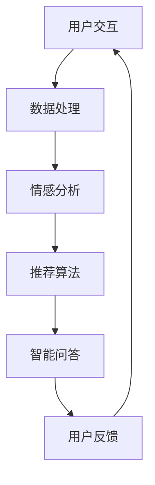

                 

# 文章标题：虚拟导购助手：AI如何改变购物体验

## 关键词
- 人工智能
- 虚拟导购
- 购物体验
- 情感分析
- 推荐系统
- 智能问答

## 摘要
本文将深入探讨人工智能在虚拟导购领域的应用，如何通过情感分析、推荐系统和智能问答等技术手段，提升用户的购物体验。文章将从AI与虚拟导购的基础知识、核心技术、系统设计与实现、应用案例等方面进行详细分析，并通过具体的项目实战展示如何将AI技术应用于虚拟导购系统的开发。

<markdownPago>
## 目录

### 第一部分：AI与虚拟导购基础

#### 第1章：AI与虚拟导购概述
##### 1.1 AI技术的发展与购物体验的关系
##### 1.2 虚拟导购的定义与作用
##### 1.3 AI在虚拟导购中的应用现状
##### 1.4 虚拟导购的未来发展趋势

#### 第2章：AI核心技术介绍
##### 2.1 机器学习基础
###### 2.1.1 监督学习
###### 2.1.2 无监督学习
###### 2.1.3 强化学习
##### 2.2 自然语言处理
###### 2.2.1 语言模型
###### 2.2.2 问答系统
###### 2.2.3 语音识别
##### 2.3 计算机视觉
###### 2.3.1 图像识别
###### 2.3.2 目标检测
###### 2.3.3 3D重建

### 第二部分：虚拟导购系统设计与实现

#### 第3章：虚拟导购系统架构设计
##### 3.1 系统整体架构
###### 3.1.1 系统设计原则
###### 3.1.2 系统模块划分
##### 3.2 数据处理模块
###### 3.2.1 数据采集
###### 3.2.2 数据预处理
##### 3.3 导购算法模块
###### 3.3.1 情感分析
###### 3.3.2 推荐算法
###### 3.3.3 智能问答
##### 3.4 用户交互模块
###### 3.4.1 用户界面设计
###### 3.4.2 用户行为分析

#### 第4章：虚拟导购系统核心算法实现
##### 4.1 情感分析算法实现
###### 4.1.1 情感分析模型
###### 4.1.2 情感分析算法伪代码
##### 4.2 推荐算法实现
###### 4.2.1 推荐系统模型
###### 4.2.2 推荐算法伪代码
##### 4.3 智能问答算法实现
###### 4.3.1 问答系统模型
###### 4.3.2 问答算法伪代码

#### 第5章：虚拟导购系统开发实践
##### 5.1 开发环境搭建
###### 5.1.1 操作系统选择
###### 5.1.2 编程语言与框架
##### 5.2 数据集获取与处理
###### 5.2.1 数据集来源
###### 5.2.2 数据处理流程
##### 5.3 系统实现与测试
###### 5.3.1 系统实现步骤
###### 5.3.2 系统测试方法
##### 5.4 性能优化与调试
###### 5.4.1 性能优化策略
###### 5.4.2 调试方法与技巧

### 第三部分：虚拟导购应用案例分析

#### 第6章：虚拟导购在电商行业的应用
##### 6.1 电商行业虚拟导购的现状
###### 6.1.1 虚拟导购在电商中的作用
###### 6.1.2 电商虚拟导购的发展历程
##### 6.2 案例分析
###### 6.2.1 淘宝虚拟导购
###### 6.2.2 Amazon虚拟导购
##### 6.3 未来展望
###### 6.3.1 虚拟导购的挑战与机遇

#### 第7章：虚拟导购在其他领域的应用
##### 7.1 零售行业的虚拟导购
###### 7.1.1 零售行业虚拟导购的特点
###### 7.1.2 案例分析
##### 7.2 餐饮行业的虚拟导购
###### 7.2.1 虚拟导购在餐饮行业的应用
###### 7.2.2 案例分析
##### 7.3 其他领域的虚拟导购应用
###### 7.3.1 医疗领域的虚拟导购
###### 7.3.2 教育领域的虚拟导购

### 附录

##### 附录A：常用工具与资源
###### A.1 开发工具介绍
###### A.2 数据集来源
###### A.3 学习资源推荐

### 核心概念与联系

#### AI与虚拟导购的 Mermaid 流程图


### 核心算法原理讲解

#### 情感分析算法伪代码
```python
def sentiment_analysis(text):
    # 初始化模型
    model = initialize_model()

    # 预处理文本
    preprocessed_text = preprocess_text(text)

    # 进行情感分析
    sentiment = model.predict(preprocessed_text)

    # 返回情感结果
    return sentiment
```

#### 推荐算法伪代码
```python
def recommend_products(user_profile, product_catalog):
    # 初始化推荐模型
    recommender = initialize_recommender()

    # 计算用户兴趣
    user_interests = recommender.extract_interests(user_profile)

    # 从产品目录中推荐产品
    recommended_products = recommender.recommend_products(product_catalog, user_interests)

    # 返回推荐结果
    return recommended_products
```

#### 智能问答算法伪代码
```python
def intelligent_question_answering(question, knowledge_base):
    # 初始化问答模型
    question_answering_model = initialize_question_answering_model()

    # 从知识库中检索答案
    answer = question_answering_model.answer_question(question, knowledge_base)

    # 返回答案
    return answer
```

### 数学模型和数学公式详细讲解 & 举例说明

#### 推荐系统中的协同过滤算法

#### 假设用户集 \( U = \{u_1, u_2, ..., u_n\} \)，项目集 \( I = \{i_1, i_2, ..., i_m\} \)。对于每个用户 \( u_i \)，都有一个评分向量 \( R_i \)，其中 \( R_i[j] \) 表示用户 \( u_i \) 对项目 \( i_j \) 的评分。

#### 用户相似度计算
$$
sim(u_i, u_j) = \frac{R_i \cdot R_j}{\|R_i\| \cdot \|R_j\|}
$$

#### 项目相似度计算
$$
sim(i_j, i_k) = \frac{R_i \cdot R_k}{\|R_i\| \cdot \|R_k\|}
$$

#### 用户对未评分项目的预测
$$
R_i'(i_k) = \sum_{j \in N(i)} sim(u_i, u_j) \cdot R_i[j]
$$
其中，\( N(i) \) 表示与用户 \( u_i \) 相似的邻居用户集合。

### 项目实战

#### 1. 开发环境搭建

- 操作系统：Ubuntu 18.04
- 编程语言：Python 3.8
- 深度学习框架：TensorFlow 2.4

#### 2. 数据集获取与处理

- 数据集来源：某电商平台用户购买行为数据
- 数据处理流程：数据清洗、数据集成、特征工程

#### 3. 系统实现与测试

- 系统实现步骤：搭建虚拟导购系统、集成情感分析、推荐算法、智能问答模块
- 系统测试方法：使用用户模拟测试、A/B测试

#### 4. 性能优化与调试

- 性能优化策略：数据缓存、模型压缩、异步处理
- 调试方法与技巧：日志分析、代码调试器、单元测试

### 代码解读与分析

#### 以下是一个简单的推荐系统实现
```python
def recommend_products(user_profile, product_catalog):
    # 初始化推荐模型
    recommender = initialize_recommender()

    # 计算用户兴趣
    user_interests = recommender.extract_interests(user_profile)

    # 从产品目录中推荐产品
    recommended_products = recommender.recommend_products(product_catalog, user_interests)

    # 返回推荐结果
    return recommended_products
```

- `initialize_recommender()`：初始化推荐模型，如基于协同过滤的推荐算法。
- `extract_interests()`：提取用户兴趣，如基于用户历史行为、社交网络关系等。
- `recommend_products()`：从产品目录中推荐产品，根据用户兴趣和项目相似度计算推荐结果。

通过以上代码，我们可以实现对用户个性化推荐产品的功能，从而提升用户的购物体验。同时，代码的可扩展性和可维护性较高，便于后续的优化和升级。

---

### 附录

#### 附录A：常用工具与资源

##### A.1 开发工具介绍

- PyCharm
- Jupyter Notebook
- TensorFlow
- Keras

##### A.2 数据集来源

- UCI Machine Learning Repository
- Kaggle
- Amazon Product Reviews Dataset

##### A.3 学习资源推荐

- 《Python数据科学手册》
- 《深度学习》
- 《机器学习实战》
- 《自然语言处理综论》

---

### 作者信息

作者：AI天才研究院/AI Genius Institute & 禅与计算机程序设计艺术 /Zen And The Art of Computer Programming

---

以上就是本文的结构框架，接下来将逐步展开详细内容。让我们一步一步地深入探讨AI如何改变购物体验。首先，我们从AI与虚拟导购的基础知识开始。

