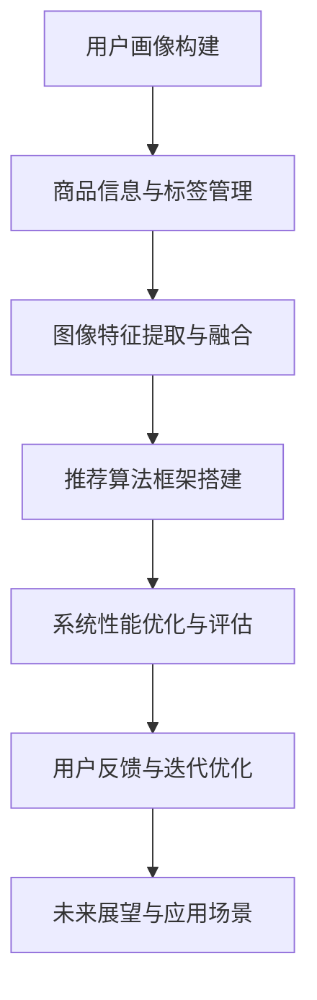

                 

# 文章标题：视觉推荐：AI如何利用图像识别技术，提供更直观的商品推荐

> 关键词：视觉推荐，图像识别，AI，商品推荐，深度学习，卷积神经网络，用户画像，特征提取，特征融合，推荐算法，系统优化，性能评估

> 摘要：本文将探讨视觉推荐系统的概念、架构、算法原理以及实际应用，重点关注AI如何利用图像识别技术来提供更直观、个性化的商品推荐。通过深入分析视觉推荐的核心算法和实现步骤，结合实际项目案例和代码示例，本文旨在为读者提供一个全面、系统的视觉推荐系统学习和应用指南。

### 《视觉推荐：AI如何利用图像识别技术，提供更直观的商品推荐》目录大纲

#### 第一部分：视觉推荐系统基础

### 第1章：视觉推荐概述

#### 1.1 视觉推荐的概念与重要性

##### 1.1.1 视觉推荐的定义

视觉推荐是一种基于图像识别和内容理解的推荐系统，通过分析用户上传或选择的图片，为用户提供相关商品、内容或服务。与传统推荐系统不同，视觉推荐更加直观、易于操作，能够提高用户互动体验和满意度。

##### 1.1.2 视觉推荐的发展背景

随着移动互联网和智能手机的普及，图像数据量呈爆炸式增长。同时，深度学习和图像识别技术的不断进步，为视觉推荐系统的实现提供了强大的技术支持。视觉推荐系统逐渐成为电商、社交网络和内容平台等领域的重要发展方向。

##### 1.1.3 视觉推荐的应用场景

视觉推荐广泛应用于电商、社交媒体、内容平台和医疗健康等领域。例如，在电商领域，用户可以通过上传服装、家居用品等图片，获得相关商品推荐；在社交媒体领域，用户可以基于上传的图片，获得感兴趣的内容推荐。

#### 1.2 视觉推荐系统架构

##### 1.2.1 系统架构概述

视觉推荐系统通常由用户画像与行为分析、商品信息与标签管理、图像识别与特征提取、推荐算法和用户反馈与迭代优化等模块组成。

##### 1.2.2 用户画像与行为分析

用户画像与行为分析模块负责收集、处理和存储用户的基本信息、兴趣偏好和行为数据，为后续的推荐算法提供数据支持。

##### 1.2.3 商品信息与标签管理

商品信息与标签管理模块负责收集、处理和存储商品的基本信息、属性标签和描述信息，为推荐算法提供商品数据支持。

#### 1.3 视觉技术基础

##### 1.3.1 图像识别技术原理

图像识别技术是指通过计算机算法对图像进行分析和处理，从中提取特征并识别出图像中的目标物体。本文将重点介绍卷积神经网络（CNN）在图像识别中的应用。

##### 1.3.2 特征提取与降维技术

特征提取与降维技术旨在从原始图像中提取关键特征，并降低特征维度，以提高计算效率和模型性能。

##### 1.3.3 视觉内容理解技术

视觉内容理解技术通过对图像中的目标物体、场景和背景等进行深入分析，实现图像内容的语义理解。

#### 第二部分：核心算法原理与实现

### 第2章：图像识别算法原理

#### 2.1 卷积神经网络（CNN）基础

##### 2.1.1 CNN结构详解

卷积神经网络由卷积层、池化层、全连接层等组成，通过逐层提取图像特征，实现对图像的识别和分类。

##### 2.1.2 卷积与激活函数

卷积层通过卷积操作提取图像特征，激活函数用于增强特征表达能力。

##### 2.1.3 池化与反卷积

池化层用于减小特征图尺寸，反卷积层用于实现上采样操作。

#### 2.2 深度学习优化算法

##### 2.2.1 梯度下降算法

梯度下降算法是一种常用的优化方法，用于调整模型参数，以最小化损失函数。

##### 2.2.2 随机梯度下降（SGD）

随机梯度下降是梯度下降的一种变体，通过随机选取样本计算梯度，以加速收敛。

##### 2.2.3 动量优化与自适应学习率

动量优化和自适应学习率是优化算法的常用技巧，有助于提高模型训练效果。

#### 2.3 图像识别算法应用

##### 2.3.1 分类与回归任务

图像识别算法可以应用于分类和回归任务，实现对图像的识别和预测。

##### 2.3.2 目标检测与跟踪

目标检测与跟踪是图像识别的重要应用领域，通过识别图像中的目标物体并进行跟踪，实现对场景的实时监控。

##### 2.3.3 人脸识别与验证

人脸识别与验证是图像识别技术的经典应用，通过识别人脸特征，实现对用户的身份验证。

#### 第三部分：视觉推荐项目实战

### 第3章：视觉推荐系统项目搭建

#### 3.1 项目环境搭建

##### 3.1.1 开发环境配置

介绍如何配置开发环境，包括操作系统、编程语言、深度学习框架等。

##### 3.1.2 数据集获取与预处理

介绍如何获取和使用常见图像数据集，以及数据预处理方法。

#### 3.2 用户画像与行为分析

##### 3.2.1 用户画像构建

介绍如何构建用户画像，包括用户基本信息、兴趣偏好、行为数据等。

##### 3.2.2 用户行为数据挖掘

介绍如何挖掘用户行为数据，包括点击、浏览、购买等行为，用于训练推荐算法。

#### 3.3 商品信息与标签管理

##### 3.3.1 商品信息收集

介绍如何收集商品信息，包括商品名称、描述、属性、标签等。

##### 3.3.2 商品标签生成与优化

介绍如何生成和优化商品标签，以提高推荐效果。

#### 3.4 视觉推荐算法实现

##### 3.4.1 卷积神经网络实现

介绍如何使用卷积神经网络实现图像识别算法，包括模型搭建、训练和评估。

##### 3.4.2 图像特征提取与融合

介绍如何提取和融合图像特征，为推荐算法提供数据支持。

##### 3.4.3 推荐算法框架搭建

介绍如何搭建视觉推荐算法框架，包括用户画像、商品信息、图像特征和推荐策略等。

#### 第四部分：优化与评估

### 第4章：视觉推荐系统优化与评估

#### 4.1 系统性能优化

##### 4.1.1 模型压缩与加速

介绍如何对模型进行压缩和加速，以提高系统性能。

##### 4.1.2 集群部署与性能调优

介绍如何将模型部署到集群环境中，并进行性能调优。

#### 4.2 推荐效果评估

##### 4.2.1 评价指标与方法

介绍常用的推荐效果评价指标，如准确率、召回率、F1值等。

##### 4.2.2 评估指标计算与优化

介绍如何计算和优化评估指标，以提高推荐效果。

#### 4.3 用户反馈与迭代优化

##### 4.3.1 用户反馈机制

介绍如何收集和利用用户反馈，用于优化推荐系统。

##### 4.3.2 系统迭代与优化策略

介绍如何进行系统迭代和优化策略，以持续提高推荐效果。

#### 第五部分：未来展望与应用场景

### 第5章：视觉推荐系统未来展望

#### 5.1 视觉推荐技术的发展趋势

##### 5.1.1 深度学习与强化学习融合

介绍深度学习和强化学习在视觉推荐系统中的应用，以及未来的发展趋势。

##### 5.1.2 多模态数据的融合应用

介绍多模态数据在视觉推荐系统中的应用，以及未来的发展趋势。

##### 5.1.3 跨媒体推荐系统

介绍跨媒体推荐系统的发展趋势，以及如何在视觉推荐系统中实现跨媒体推荐。

#### 5.2 视觉推荐系统的应用场景

##### 5.2.1 电子商务与广告营销

介绍视觉推荐系统在电子商务和广告营销中的应用场景。

##### 5.2.2 社交网络与内容推荐

介绍视觉推荐系统在社交网络和内容推荐中的应用场景。

##### 5.2.3 医疗健康与智能硬件

介绍视觉推荐系统在医疗健康和智能硬件中的应用场景。

### 附录

#### 附录A：相关工具与资源

##### A.1 开源框架与库

介绍常用的深度学习框架和图像识别库，如TensorFlow、PyTorch、OpenCV等。

##### A.2 数据集介绍

介绍常用的图像数据集，如ImageNet、MS COCO、Flicker等。

##### A.3 进一步学习资源

介绍相关论文、书籍和线上课程，供读者进一步学习和研究。

#### 附录B：Mermaid流程图



#### 附录C：算法伪代码

```python
# 卷积神经网络（CNN）伪代码

def conv2d(input, filters, kernel_size, stride, padding):
    # 假设input为输入图像，filters为卷积核，kernel_size为卷积核大小，stride为步长，padding为填充
    # 计算卷积操作
    return (input * filters).sum(axis=1).sum(axis=2).sum(axis=3)

def relu激活函数(x):
    # ReLU激活函数
    return np.maximum(0, x)

def池化操作(pool_size, stride):
    # 假设input为输入图像，pool_size为池化窗口大小，stride为步长
    # 进行池化操作
    return np.mean(input[:, ::stride, ::stride], axis=(1, 2))
```

#### 附录D：数学公式和举例说明

段落1：
$$
E[X] = \int_{-\infty}^{\infty} x \cdot f(x) \, dx
$$
这是期望值的数学公式。

段落2：
假设我们有一个随机变量X，它的概率密度函数为$f(x)$。期望值$E[X]$可以通过对所有可能值x与其概率的乘积求和来计算。

#### 附录E：代码实际案例与详细解释

```python
# 代码案例：基于TensorFlow的卷积神经网络训练示例

import tensorflow as tf
from tensorflow.keras.models import Sequential
from tensorflow.keras.layers import Conv2D, MaxPooling2D, Flatten, Dense

# 创建模型
model = Sequential([
    Conv2D(32, (3, 3), activation='relu', input_shape=(28, 28, 1)),
    MaxPooling2D(pool_size=(2, 2)),
    Flatten(),
    Dense(128, activation='relu'),
    Dense(10, activation='softmax')
])

# 编译模型
model.compile(optimizer='adam',
              loss='categorical_crossentropy',
              metrics=['accuracy'])

# 加载数据
(x_train, y_train), (x_test, y_test) = tf.keras.datasets.mnist.load_data()

# 预处理数据
x_train = x_train.reshape(-1, 28, 28, 1).astype('float32') / 255
x_test = x_test.reshape(-1, 28, 28, 1).astype('float32') / 255

# 将标签转换为one-hot编码
y_train = tf.keras.utils.to_categorical(y_train, 10)
y_test = tf.keras.utils.to_categorical(y_test, 10)

# 训练模型
model.fit(x_train, y_train, epochs=10, batch_size=64, validation_data=(x_test, y_test))

# 评估模型
test_loss, test_acc = model.evaluate(x_test, y_test)
print('Test accuracy:', test_acc)
```

**详细解释：**
- 首先，我们导入了TensorFlow库，并定义了一个顺序模型（Sequential）。
- 接着，我们添加了卷积层（Conv2D）、最大池化层（MaxPooling2D）、扁平化层（Flatten）和全连接层（Dense）。
- 然后，我们编译模型，指定了优化器（optimizer）、损失函数（loss）和评估指标（metrics）。
- 之后，我们加载数据集，并对数据进行预处理，如调整形状和归一化。
- 接着，我们将标签转换为one-hot编码，以便模型可以更好地处理。
- 然后，我们使用训练数据训练模型，并设置了一些训练参数，如训练轮数（epochs）和批量大小（batch_size）。
- 最后，我们使用测试数据评估模型的性能，并打印出测试准确率。

#### 附录F：代码解读与分析

**代码解读：**
- 第一部分：引入必要的库和模块，包括TensorFlow和Keras。
- 第二部分：定义了一个顺序模型，并添加了卷积层、最大池化层、扁平化层和全连接层。
- 第三部分：编译模型，指定了优化器、损失函数和评估指标。
- 第四部分：加载数据集，并进行预处理，如调整形状和归一化。
- 第五部分：将标签转换为one-hot编码，以便模型可以更好地处理。
- 第六部分：使用训练数据训练模型，并设置了一些训练参数。
- 第七部分：使用测试数据评估模型的性能，并打印出测试准确率。

**代码分析：**
- 卷积层：用于提取图像的局部特征，通过卷积操作和ReLU激活函数增强特征表达能力。
- 最大池化层：用于减小特征图的尺寸，同时保留最显著的特征。
- 扁平化层：将多维特征图展平为一维向量，方便全连接层进行分类。
- 全连接层：用于进行最后的分类决策，通过softmax激活函数输出概率分布。
- 优化器：用于调整模型参数，以最小化损失函数。
- 损失函数：用于评估模型预测与真实标签之间的差距。
- 评估指标：用于衡量模型在测试集上的表现。

**总结：**
该代码案例展示了一个基于卷积神经网络的图像分类任务。通过定义一个顺序模型，并使用TensorFlow提供的API进行模型搭建、编译、训练和评估，实现了对MNIST手写数字数据集的分类。该代码实现了卷积神经网络的核心组成部分，并展示了如何使用TensorFlow进行深度学习任务的基本流程。通过分析代码，我们可以更好地理解卷积神经网络的工作原理和应用场景。

