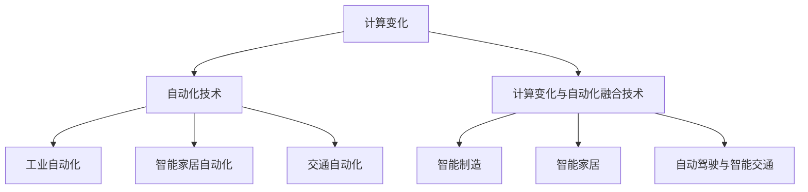

                 

## 计算变化与自动化技术的关系

### 关键词：计算变化、自动化技术、智能制造、智能家居、自动驾驶

#### 摘要：

本文将探讨计算变化与自动化技术之间的关系。计算变化是指计算技术、信息技术等在各个领域中的应用，推动生产方式、生活方式的转变。而自动化技术是指利用计算机技术、信息技术等，实现生产、管理、服务等任务的自动化。本文首先介绍了计算变化的起源与发展历程，然后阐述了自动化技术的基本原理和分类。接着，分析了计算变化对自动化技术的影响，以及自动化技术在不同领域的应用案例。最后，探讨了计算变化与自动化技术的融合发展趋势，并提出了未来展望。

### 目录大纲

#### 第一部分：计算变化基础理论

- **第1章：计算变化的定义与演变**
  - 1.1.1 计算变化的起源与发展历程
  - 1.1.2 计算变化的本质与特征
  - 1.1.3 计算变化与传统自动化技术的区别

- **第2章：自动化技术的基本原理**
  - 2.1.1 自动化技术的基本概念
  - 2.1.2 自动化技术的基本组成部分
  - 2.1.3 自动化技术的发展趋势

- **第3章：计算变化对自动化技术的影响**
  - 3.1.1 计算变化带来的自动化技术革新
  - 3.1.2 计算变化对自动化技术发展的影响
  - 3.1.3 计算变化与自动化技术融合的未来前景

#### 第二部分：自动化技术在不同领域的应用

- **第4章：工业自动化**
  - 4.1.1 工业自动化的应用场景
  - 4.1.2 工业自动化关键技术
  - 4.1.3 工业自动化案例分析

- **第5章：智能家居自动化**
  - 5.1.1 智能家居自动化的基本概念
  - 5.1.2 智能家居自动化关键技术
  - 5.1.3 智能家居自动化案例分析

- **第6章：交通自动化**
  - 6.1.1 交通自动化的应用场景
  - 6.1.2 交通自动化关键技术
  - 6.1.3 交通自动化案例分析

#### 第三部分：计算变化与自动化技术的融合

- **第7章：计算变化与自动化技术的融合发展趋势**
  - 7.1.1 融合技术的分类与特点
  - 7.1.2 融合技术在实际应用中的挑战
  - 7.1.3 融合技术的未来发展趋势

- **第8章：计算变化与自动化技术的融合案例分析**
  - 8.1.1 案例一：智能制造与工业自动化融合
  - 8.1.2 案例二：智能家居与物联网技术的融合
  - 8.1.3 案例三：自动驾驶与智能交通的融合

- **第9章：计算变化与自动化技术的未来展望**
  - 9.1.1 未来技术发展趋势
  - 9.1.2 未来自动化技术的发展方向
  - 9.1.3 计算变化与自动化技术对社会的深远影响

#### 附录

- **附录A：计算变化与自动化技术相关的术语与概念**
- **附录B：计算变化与自动化技术常用工具与资源列表**
- **附录C：计算变化与自动化技术重要研究机构与公司介绍**

### 第1章：计算变化的定义与演变

#### 1.1.1 计算变化的起源与发展历程

计算变化的概念起源于计算机科学和自动化技术的快速发展。自20世纪中叶以来，计算机技术的进步使得计算能力和处理速度得到了极大的提升，从而推动了自动化技术的不断革新。

在初期阶段，计算机主要用于科学计算和军事应用，自动化技术主要应用于工业生产中。随着计算机技术的不断发展，20世纪70年代，个人计算机的兴起使得计算机开始走进普通家庭，自动化技术也逐渐应用于各个领域。

在成熟阶段，计算机技术的发展使得计算机的应用领域越来越广泛。20世纪80年代，微处理器和操作系统的出现使得计算机硬件和软件技术得到了极大的提升，自动化技术也逐渐成熟。此时，工业自动化、交通自动化、智能家居自动化等应用开始普及。

进入现代阶段，随着互联网、物联网、大数据、人工智能等新兴技术的快速发展，计算变化的概念逐渐被提出。计算变化与大数据、人工智能等新兴技术相结合，推动了自动化技术的进一步发展。高级制造系统、智能家居、自动驾驶等应用开始普及。

#### 1.1.2 计算变化的本质与特征

计算变化的本质在于将计算机技术、信息技术等应用于各个领域，实现生产、管理、服务等任务的自动化、智能化。其核心特征包括：

1. **数字化**：将现实世界中的信息转化为数字形式，通过计算机进行处理和分析。
2. **网络化**：通过互联网、物联网等网络技术，实现设备、系统、平台之间的互联互通。
3. **智能化**：通过人工智能技术，实现自动化系统的智能决策和自适应控制。
4. **自主化**：通过计算机技术和自动化技术，实现系统的自主运行和自我调整。

#### 1.1.3 计算变化与传统自动化技术的区别

传统自动化技术主要依赖于机械、电气等物理技术，通过预设的程序和逻辑实现自动化控制。而计算变化则是将计算机技术、信息技术等应用于自动化领域，实现更高层次的自动化、智能化。

与传统自动化技术相比，计算变化具有以下区别：

1. **技术层次更高**：计算变化基于计算机技术和信息技术，实现更高层次的自动化和智能化。
2. **应用领域更广**：计算变化可以应用于工业、交通、医疗、家庭等多个领域，而传统自动化技术主要应用于工业生产。
3. **自适应能力更强**：计算变化通过人工智能技术，实现自动化系统的自适应控制，能够根据环境变化进行调整。
4. **数据驱动**：计算变化依赖于大数据技术，通过数据分析和挖掘，实现更加精准的决策和控制。

### 第2章：自动化技术的基本原理

#### 2.1.1 自动化技术的基本概念

自动化技术是指利用计算机技术、信息技术等，实现生产、管理、服务等任务的自动化。它通过预设的程序和逻辑，对设备、系统进行自动控制，以提高生产效率、降低人力成本、提高产品质量。

自动化技术的基本概念包括以下几个方面：

1. **控制系统**：控制系统是自动化技术的核心，包括硬件设备和软件程序。硬件设备包括传感器、执行器、控制器等；软件程序则包括控制算法、控制策略等。
2. **传感器**：传感器用于感知环境和设备的状态，将物理信号转换为电信号，供控制系统进行处理。
3. **执行器**：执行器根据控制系统的指令，对设备或系统进行操作，实现预期的功能。
4. **控制算法**：控制算法是自动化技术的关键，用于根据传感器采集的数据，对执行器进行控制，以实现预期的目标。

#### 2.1.2 自动化技术的基本组成部分

自动化技术的基本组成部分包括以下几个方面：

1. **硬件设备**：硬件设备包括传感器、执行器、控制器等。传感器用于感知环境和设备的状态；执行器根据控制系统的指令进行操作；控制器则是自动化系统的核心，用于处理传感器采集的数据，并根据控制算法生成控制指令。
2. **软件系统**：软件系统包括控制算法、监控软件、操作界面等。控制算法用于根据传感器采集的数据，对执行器进行控制；监控软件用于实时监控自动化系统的运行状态；操作界面则用于操作员对自动化系统进行监控和操作。
3. **网络通信**：网络通信用于实现自动化系统与其他设备、系统的数据交换和通信，包括有线和无线通信方式。

#### 2.1.3 自动化技术的发展趋势

自动化技术随着计算技术和信息技术的发展，正呈现出以下发展趋势：

1. **智能化**：通过人工智能技术，实现自动化系统的智能决策和自适应控制。例如，利用机器学习算法，对生产过程进行预测和优化。
2. **网络化**：通过物联网技术，实现自动化系统与其他设备、系统的互联互通。例如，利用工业互联网，实现设备之间的实时数据共享和协同工作。
3. **自主化**：通过计算机视觉、机器学习等技术，实现自动化系统的自主运行和自我调整。例如，自动驾驶车辆能够自主感知环境、做出决策并控制车辆运行。
4. **集成化**：将自动化技术与其他技术（如大数据、云计算等）相结合，实现更高效、更智能的自动化系统。例如，智能制造系统通过大数据分析和云计算技术，实现生产过程的智能化管理和优化。

### 第3章：计算变化对自动化技术的影响

#### 3.1.1 计算变化带来的自动化技术革新

计算变化对自动化技术产生了深远的影响，推动了自动化技术的革新。以下是一些重要的自动化技术革新：

1. **智能制造**：计算变化使得自动化技术在制造业中的应用更加广泛和深入。智能制造系统通过计算机技术、物联网技术、大数据分析等技术，实现生产过程的智能化、自动化和高效化。例如，通过工业互联网，实现设备之间的实时数据共享和协同工作，提高生产效率。

2. **智能家居**：计算变化使得智能家居自动化成为可能。智能家居系统通过计算机技术、物联网技术，实现家庭设备的互联互通，提供智能化的家居环境。例如，智能照明系统可以根据光线强度自动调整灯光亮度；智能空调可以根据室内温度自动调整温度。

3. **自动驾驶**：计算变化推动了自动驾驶技术的发展。自动驾驶车辆通过计算机视觉、传感器技术、人工智能等技术，实现车辆的自主驾驶。例如，自动驾驶车辆可以实时感知道路状况，做出相应的驾驶决策。

4. **自动化物流**：计算变化使得自动化物流系统成为可能。自动化物流系统通过计算机技术、物联网技术、机器人技术等，实现物流过程的自动化和高效化。例如，自动化仓库系统可以通过机器人自动进行货物的存储和提取。

5. **自动化医疗**：计算变化使得自动化医疗设备成为可能。自动化医疗系统通过计算机技术、物联网技术，实现医疗设备的智能化和自动化。例如，自动化手术机器人可以实现高精度的手术操作，提高医疗质量和安全性。

#### 3.1.2 计算变化对自动化技术发展的影响

计算变化对自动化技术发展的影响主要体现在以下几个方面：

1. **技术融合**：计算变化使得自动化技术与其他技术（如人工智能、大数据、云计算等）相结合，实现更高效、更智能的自动化系统。这种技术融合不仅推动了自动化技术的发展，也为各行业的数字化转型提供了技术支持。

2. **智能化**：计算变化推动了自动化技术的智能化发展。通过人工智能技术，自动化系统可以更好地理解和处理复杂的环境信息，实现更精确、更高效的控制。例如，机器学习算法可以用于优化生产过程、提高产品质量。

3. **网络化**：计算变化使得自动化系统可以实现网络化，实现设备之间的实时数据共享和协同工作。这种网络化不仅提高了自动化系统的效率，也为远程监控和管理提供了便利。

4. **自主化**：计算变化使得自动化系统可以实现自主化，减少人为干预。例如，通过计算机视觉和传感器技术，自动化系统可以自主感知环境、做出决策并控制设备。

5. **数据驱动**：计算变化使得自动化系统可以基于大数据分析进行决策。通过大数据技术，自动化系统可以从海量数据中提取有价值的信息，实现更智能、更精准的决策。

#### 3.1.3 计算变化与自动化技术融合的未来前景

计算变化与自动化技术的融合具有广阔的发展前景。以下是一些未来可能的发展趋势：

1. **更高级别的自动化**：随着计算技术的不断发展，自动化技术将向更高级别的自动化发展。例如，通过深度学习技术，自动化系统可以更好地理解和处理复杂的环境信息，实现更精准的控制。

2. **跨领域融合**：计算变化与自动化技术的融合将不仅仅局限于工业、交通、医疗等领域，还将向更多领域扩展。例如，自动化技术将应用于农业、教育、环保等领域，实现更广泛的应用。

3. **智能化**：计算变化与自动化技术的融合将使得自动化系统更加智能化。通过人工智能技术，自动化系统可以更好地理解和处理复杂的环境信息，实现更高效、更精准的决策。

4. **自主化**：计算变化与自动化技术的融合将使得自动化系统更加自主化，减少人为干预。例如，通过计算机视觉和传感器技术，自动化系统可以自主感知环境、做出决策并控制设备。

5. **平台化**：计算变化与自动化技术的融合将推动自动化系统向平台化发展。通过云计算和物联网技术，自动化系统可以实现设备之间的实时数据共享和协同工作，形成更加智能、高效的自动化平台。

### 第4章：自动化技术在不同领域的应用

#### 4.1.1 工业自动化的应用场景

工业自动化是自动化技术的重要应用领域，它通过使用机器人、自动化生产线、自动化检测设备等，实现生产过程的自动化和高效化。以下是一些工业自动化的典型应用场景：

1. **生产流程自动化**：在制造业中，工业机器人被广泛应用于组装、焊接、喷涂、搬运等生产环节。例如，汽车制造业中，机器人可以自动完成车身焊接、喷涂等工作，提高生产效率和产品质量。

2. **仓储物流自动化**：自动化仓储系统通过自动化仓库、自动导引车（AGV）、自动分拣机等设备，实现仓储和物流的自动化管理。例如，电商企业使用自动化仓储系统，可以实现快速、准确的货物存储和配送。

3. **质量检测自动化**：在工业生产中，质量检测是保证产品质量的重要环节。自动化检测设备可以自动对产品进行尺寸、外观、性能等方面的检测，及时发现和排除质量问题。

4. **生产计划与调度自动化**：通过计算机技术和人工智能算法，可以实现生产计划的自动化制定和调度。例如，利用排产优化算法，可以根据生产资源、订单需求等因素，自动生成最优的生产计划。

5. **能源管理自动化**：在工业生产过程中，能源消耗是一个重要的问题。通过自动化技术，可以实现能源的实时监测和优化管理。例如，智能电表、智能灯具等设备可以自动调节电力消耗，提高能源利用效率。

#### 4.1.2 工业自动化关键技术

工业自动化技术的实现依赖于多种关键技术的支持，以下是一些主要的关键技术：

1. **机器人技术**：工业机器人是工业自动化的重要组成部分，可以完成重复性高、劳动强度大的工作。机器人技术包括机器人的设计、控制、编程等方面。

2. **传感器技术**：传感器用于实时监测生产线上的各种参数，如温度、压力、速度等。传感器技术包括传感器的类型、精度、信号处理等。

3. **自动化控制系统**：自动化控制系统包括PLC（可编程逻辑控制器）、DSC（分布式控制系统）等，用于对生产过程进行实时监控和自动控制。

4. **计算机视觉技术**：计算机视觉技术用于对生产过程中的物体进行识别、检测和分析。例如，可以通过计算机视觉技术实现产品的自动检测和分类。

5. **人工智能技术**：人工智能技术可以用于优化生产过程、提高生产效率。例如，通过机器学习算法，可以实现生产计划的自动优化、质量检测的自动分析等。

6. **通信技术**：通信技术是实现自动化系统之间数据交换和协同工作的重要保障。常用的通信技术包括有线通信（如以太网、串口等）和无线通信（如Wi-Fi、蓝牙等）。

#### 4.1.3 工业自动化案例分析

以下是一个工业自动化案例的详细解释：

**案例：智能工厂**

某汽车制造企业引入了一套智能工厂系统，实现了生产过程的全面自动化。以下是该智能工厂系统的实施过程：

1. **需求分析**：首先，企业进行了需求分析，确定了智能工厂的目标和需求。主要包括：提高生产效率、降低生产成本、提高产品质量、实现生产过程的实时监控和优化。

2. **系统设计**：根据需求分析，企业设计了智能工厂的总体架构，包括硬件设备和软件系统的设计。硬件设备包括工业机器人、自动化生产线、传感器、执行器等；软件系统包括自动化控制系统、质量检测系统、生产计划与调度系统等。

3. **系统实现**：
   - **生产流程自动化**：企业引入了多台工业机器人，用于完成组装、焊接、喷涂等生产环节。机器人通过预编程的路径和动作，自动完成相应的操作。
   - **质量检测自动化**：企业使用了计算机视觉技术，实现了产品的自动检测和分类。通过摄像头和图像处理算法，可以对产品的外观、尺寸等进行检测，及时发现和排除质量问题。
   - **生产计划与调度自动化**：企业使用了人工智能算法，实现了生产计划的自动优化和调度。通过分析订单需求、生产资源等因素，系统可以自动生成最优的生产计划，并实时调整生产进度。

4. **系统运行**：在系统运行阶段，企业对智能工厂的运行状态进行实时监控，及时发现问题并进行调整。例如，如果某个机器人出现故障，系统会自动停止相应的生产任务，并通知维护人员进行修复。

5. **系统优化**：在系统运行过程中，企业不断收集数据，对系统进行优化。通过数据分析，企业可以发现生产过程中的瓶颈和不足，并采取相应的措施进行优化。

通过实施智能工厂系统，企业实现了生产过程的全面自动化，提高了生产效率、降低了生产成本，提高了产品质量。同时，系统还实现了生产过程的实时监控和优化，提高了企业的生产管理水平。

### 第5章：智能家居自动化

#### 5.1.1 智能家居自动化的基本概念

智能家居自动化是指利用计算机技术、物联网技术等，实现对家庭设备的远程控制、自动化操作，提高家庭生活的舒适度和便利性。智能家居系统通常包括以下几个基本组成部分：

1. **智能设备**：智能家居系统中的智能设备包括智能灯具、智能空调、智能电视、智能音响、智能门锁等。这些设备通过内置的传感器、执行器和通信模块，可以与智能家居控制系统进行连接，实现自动化操作。

2. **智能家居控制器**：智能家居控制器是智能家居系统的核心，它可以接收用户的操作指令，控制智能设备的开关、调节亮度、温度等。常见的智能家居控制器包括智能手机、平板电脑、智能音箱等。

3. **智能家居服务器**：智能家居服务器用于存储用户的操作记录、设备状态信息等，并提供远程访问和控制功能。智能家居服务器可以通过互联网连接，实现设备的远程监控和操作。

4. **智能家居应用程序**：智能家居应用程序是用户与智能家居系统交互的界面，用户可以通过手机、平板电脑等设备上的应用程序，实时监控家庭设备的状态，并进行远程控制。

#### 5.1.2 智能家居自动化关键技术

智能家居自动化的实现依赖于以下几个关键技术：

1. **物联网技术**：物联网技术是智能家居自动化的基础，通过将家庭设备连接到互联网，实现设备之间的互联互通和数据共享。常用的物联网通信技术包括Wi-Fi、蓝牙、ZigBee等。

2. **云计算技术**：云计算技术用于存储、处理和分析智能家居设备产生的海量数据。通过云计算平台，可以实现设备的远程监控、数据分析和智能决策。

3. **人工智能技术**：人工智能技术可以用于智能家居系统的智能决策和自适应控制。例如，通过机器学习算法，可以预测用户的习惯和需求，自动调节家居设备的状态。

4. **传感器技术**：传感器技术用于实时监测家庭环境参数，如温度、湿度、光线等。传感器采集的数据可以用于智能家居系统的自动化控制，提高家庭生活的舒适度和便利性。

5. **语音识别技术**：语音识别技术可以用于智能家居系统的语音控制，用户可以通过语音命令来控制家庭设备，实现更加自然的交互方式。

#### 5.1.3 智能家居自动化案例分析

以下是一个智能家居自动化案例的详细解释：

**案例：智能照明系统**

智能照明系统是智能家居自动化的重要组成部分，通过智能灯具、智能调光开关和智能手机应用程序，实现家庭照明的自动化控制。

1. **系统设计**：
   - **智能灯具**：智能灯具内置传感器和通信模块，可以通过Wi-Fi连接到智能家居服务器。灯具可以根据环境光线、用户习惯和时间自动调节亮度。
   - **智能调光开关**：智能调光开关用于控制灯具的开关和亮度调节，可以通过触摸或语音命令进行操作。
   - **智能手机应用程序**：用户可以通过手机应用程序实时监控灯具的状态，并设置照明场景和定时任务。

2. **系统实现**：
   - **安装智能灯具**：在家庭的不同位置安装智能灯具，确保覆盖整个家庭区域。
   - **连接到智能家居服务器**：通过Wi-Fi将智能灯具连接到智能家居服务器，实现设备之间的互联互通。
   - **配置照明场景**：通过智能手机应用程序，用户可以创建不同的照明场景，如阅读模式、休闲模式等，并设置定时任务。

3. **系统运行**：
   - **自动调节亮度**：当用户进入房间时，智能灯具可以自动检测环境光线并调整亮度，提供舒适的照明环境。
   - **定时任务**：用户可以设置定时任务，例如每天晚上8点自动开启所有灯具，模拟家庭有人在家的情况，提高安全性。
   - **远程控制**：用户可以通过智能手机应用程序实时监控灯具的状态，并远程控制灯具的开关和亮度。

4. **系统优化**：
   - **数据收集和分析**：智能家居服务器可以收集智能灯具的使用数据，通过数据分析，优化照明场景和定时任务，提高用户体验。
   - **设备升级**：随着技术的进步，智能灯具可以通过软件升级来增加功能或优化性能，提高系统的可靠性。

通过智能照明系统，用户可以享受更加舒适、便利的照明体验，同时节约能源，提高家庭安全性。

### 第6章：交通自动化

#### 6.1.1 交通自动化的应用场景

交通自动化是指利用计算机技术、物联网技术等，实现对交通系统的自动化控制和优化管理，以提高交通效率、降低交通拥堵、提高交通安全。以下是一些交通自动化的典型应用场景：

1. **自动驾驶**：自动驾驶技术是交通自动化的核心应用，通过计算机视觉、传感器技术、人工智能算法等，实现车辆的自主驾驶。自动驾驶车辆可以在没有人类驾驶员的情况下，自动感知道路环境、做出驾驶决策并控制车辆。

2. **智能交通信号控制**：智能交通信号控制系统通过实时监测交通流量、交通状态等信息，利用人工智能算法进行信号优化控制，以提高交通效率、减少交通拥堵。例如，系统可以根据实时交通流量数据，自动调整信号灯的切换时间，实现绿波带控制。

3. **智能停车场管理**：智能停车场管理通过物联网技术、自动化设备等，实现对停车场的自动化管理和运营。智能停车场系统可以自动识别车辆、分配停车位、计费等，提高停车场的使用效率和用户体验。

4. **智能交通监控**：智能交通监控系统通过安装在道路上的摄像头、传感器等设备，实时监测交通状况，收集交通数据。通过大数据分析和人工智能算法，可以实现交通异常事件的自动检测和预警，提高交通管理效率和安全性。

5. **车联网（V2X）**：车联网技术是实现交通自动化的重要组成部分，通过车辆与车辆、车辆与基础设施之间的通信，实现信息共享和协同工作。车联网技术可以用于车辆协同驾驶、智能交通管理、车辆状态监测等，提高交通系统的效率和安全性。

#### 6.1.2 交通自动化关键技术

交通自动化的实现依赖于多种关键技术的支持，以下是一些主要的关键技术：

1. **传感器技术**：传感器技术用于实时监测交通状态和车辆状态。常见的传感器包括摄像头、雷达、激光雷达、GPS等，可以用于车辆检测、道路状况监测、车辆定位等。

2. **计算机视觉技术**：计算机视觉技术用于对交通场景进行图像识别和处理。通过图像处理算法，可以识别车辆、行人、道路标志等，实现交通监控、车辆识别等功能。

3. **人工智能技术**：人工智能技术用于交通数据的分析和处理，实现交通状态的预测、异常检测、信号控制优化等。常见的算法包括机器学习、深度学习等。

4. **通信技术**：通信技术是实现交通自动化系统信息传递和协同工作的重要保障。常用的通信技术包括Wi-Fi、蓝牙、5G等，可以实现车辆与车辆、车辆与基础设施之间的通信。

5. **大数据技术**：大数据技术用于处理和分析海量交通数据，提取有价值的信息，实现交通状态的实时监控和预测。通过大数据分析，可以优化交通信号控制、提高交通管理效率。

6. **边缘计算技术**：边缘计算技术用于处理交通数据，实现实时交通分析和决策。通过在靠近数据源的设备上处理数据，可以降低网络延迟、提高响应速度，实现更高效的交通管理。

#### 6.1.3 交通自动化案例分析

以下是一个交通自动化案例的详细解释：

**案例：智能交通信号控制系统**

智能交通信号控制系统是一种基于计算机技术、人工智能技术和通信技术的交通管理解决方案，通过优化交通信号控制，提高交通效率和减少交通拥堵。

1. **系统设计**：
   - **交通信号控制器**：交通信号控制器是智能交通信号控制系统的核心，用于接收交通流量数据，并根据实时交通状况调整信号灯的切换时间。
   - **交通流量监测设备**：安装在道路上的摄像头、传感器等设备用于实时监测交通流量、车辆速度、停车情况等。
   - **数据中心**：数据中心用于存储和处理交通数据，实现交通状态的实时监控和预测。

2. **系统实现**：
   - **安装交通信号控制器**：在交通路口安装交通信号控制器，连接到道路上的交通流量监测设备。
   - **安装交通流量监测设备**：在关键路段和交通路口安装摄像头、传感器等设备，用于实时监测交通流量。
   - **搭建数据中心**：搭建数据中心，用于存储和处理交通数据，实现交通状态的实时监控和预测。

3. **系统运行**：
   - **实时交通监测**：交通信号控制器实时接收交通流量数据，根据实时交通状况调整信号灯的切换时间，实现交通流量的动态控制。
   - **交通状态预测**：通过大数据分析和人工智能算法，预测交通状态和未来交通流量，提前调整信号灯的切换时间，减少交通拥堵。
   - **异常事件检测**：通过计算机视觉技术，实时监测道路上的异常事件（如交通事故、行人横穿等），自动预警并通知相关部门进行处置。

4. **系统优化**：
   - **数据收集和分析**：通过不断收集和分析交通数据，优化交通信号控制策略，提高交通管理效率。
   - **算法优化**：通过不断优化人工智能算法，提高交通状态预测的准确性，实现更精准的交通信号控制。
   - **设备升级**：随着技术的进步，交通信号控制器和监测设备可以通过软件升级来增加功能或优化性能，提高系统的可靠性。

通过智能交通信号控制系统，可以实现交通流量的动态控制，减少交通拥堵，提高交通效率，同时提高交通安全性。

### 第7章：计算变化与自动化技术的融合发展趋势

#### 7.1.1 融合技术的分类与特点

计算变化与自动化技术的融合，形成了多种融合技术，这些技术具有不同的分类和特点。以下是一些主要的融合技术分类与特点：

1. **智能制造**：
   - **分类**：智能制造是计算变化与自动化技术融合的典型代表，涵盖了工业4.0、工业互联网等概念。
   - **特点**：智能制造通过物联网技术实现设备互联互通，利用大数据分析和人工智能算法优化生产流程，实现生产过程的智能化、自动化。

2. **智慧城市**：
   - **分类**：智慧城市是将计算变化与自动化技术应用于城市管理和服务，实现城市管理的智能化、精细化。
   - **特点**：智慧城市通过物联网、云计算等技术，实现对交通、环境、公共安全等方面的实时监控和智能管理，提高城市服务质量和效率。

3. **智能交通**：
   - **分类**：智能交通是计算变化与自动化技术应用于交通领域的融合，包括自动驾驶、智能交通信号控制等。
   - **特点**：智能交通通过计算机视觉、传感器技术等，实现车辆的自主驾驶和交通流量的智能控制，提高交通效率和安全性。

4. **智能家居**：
   - **分类**：智能家居是计算变化与自动化技术应用于家庭生活的融合，包括智能照明、智能安防、智能家电等。
   - **特点**：智能家居通过物联网技术，实现对家庭设备的远程控制、自动化操作，提高家庭生活的舒适度和便利性。

5. **机器人技术**：
   - **分类**：机器人技术是计算变化与自动化技术的重要应用领域，包括工业机器人、服务机器人等。
   - **特点**：机器人技术通过计算机视觉、人工智能等技术，实现机器人的自主移动、任务执行和智能交互，提高生产效率和安全性。

#### 7.1.2 融合技术在实际应用中的挑战

计算变化与自动化技术的融合在实际应用中面临诸多挑战，以下是一些主要的挑战：

1. **技术复杂性**：
   - **挑战**：融合技术涉及多个领域的技术，如计算机科学、自动化、通信、人工智能等，技术实现难度较高。
   - **解决方案**：加强技术研发和跨学科合作，推动技术的集成和优化。

2. **数据安全与隐私**：
   - **挑战**：融合技术依赖于大量数据，数据在传输、存储和处理过程中，面临安全与隐私的挑战。
   - **解决方案**：建立完善的数据安全管理体系，加强数据加密、访问控制等措施，保障数据安全。

3. **标准化与兼容性**：
   - **挑战**：不同设备和系统能否相互兼容，实现无缝集成，是融合技术面临的挑战。
   - **解决方案**：推动标准化工作，制定统一的技术标准和接口规范，促进设备与系统的兼容性。

4. **政策法规与伦理**：
   - **挑战**：融合技术的应用需要遵守相关的政策法规和伦理规范，防止滥用和负面影响。
   - **解决方案**：加强政策法规的制定和宣传，提高公众对技术伦理的认识，推动技术应用的规范化和合法化。

#### 7.1.3 融合技术的未来发展趋势

随着计算变化和自动化技术的不断发展，融合技术将呈现以下发展趋势：

1. **更高级别的自动化**：
   - **趋势**：通过人工智能、深度学习等技术，实现自动化系统的更高层次自动化和智能化。
   - **影响**：提高生产效率、降低成本、提高服务质量。

2. **跨领域融合**：
   - **趋势**：融合技术将在更多领域得到应用，如医疗、教育、农业等。
   - **影响**：推动各行各业的数字化转型，提高社会生产力。

3. **自主化与智能化**：
   - **趋势**：融合技术将向自主化、智能化方向发展，减少人为干预，提高系统运行效率。
   - **影响**：提高自动化系统的可靠性和灵活性。

4. **网络化与平台化**：
   - **趋势**：融合技术将更加网络化、平台化，实现设备、系统和平台之间的无缝连接。
   - **影响**：推动产业链的协同发展，提高整体竞争力。

### 第8章：计算变化与自动化技术的融合案例分析

#### 8.1.1 案例一：智能制造与工业自动化融合

**背景**：

随着工业4.0的到来，智能制造与工业自动化的融合成为制造业发展的趋势。某家电制造企业引入了智能制造系统和工业自动化设备，以提高生产效率和产品质量。

**实施方案**：

1. **生产流程自动化**：
   - **安装工业机器人**：在生产线的关键环节安装工业机器人，实现组装、焊接、搬运等任务的自动化。
   - **自动化生产线**：建立自动化生产线，通过传感器和自动化设备实现生产过程的连续化和高效化。

2. **数据集成与监控**：
   - **物联网技术**：通过物联网技术，将生产设备、物流系统、质量控制系统等连接起来，实现数据的实时传输和监控。
   - **大数据平台**：搭建大数据平台，收集和分析生产过程中的数据，为生产决策提供支持。

3. **智能决策与优化**：
   - **人工智能算法**：利用人工智能算法，对生产数据进行实时分析，优化生产流程、预测设备故障、提高生产效率。

**实施效果**：

1. **生产效率提升**：
   - 通过工业机器人和自动化生产线，生产效率提高了30%以上，产品不良率降低了20%。

2. **产品质量提升**：
   - 智能决策系统帮助优化生产流程，产品质量得到显著提升，客户满意度增加。

3. **降低运营成本**：
   - 通过自动化设备和智能优化，企业运营成本降低了15%。

#### 8.1.2 案例二：智能家居与物联网技术的融合

**背景**：

随着智能家居市场的快速增长，智能家居与物联网技术的融合成为家庭生活的重要趋势。某房地产公司推出了一款智能家居系统，为住户提供智能化的家居环境。

**实施方案**：

1. **智能设备接入**：
   - **智能灯具**：在房间内安装智能灯具，实现远程控制和调光功能。
   - **智能空调**：安装智能空调，实现远程控制和自动调节温度。
   - **智能门锁**：安装智能门锁，实现远程开锁和实时监控。

2. **物联网平台建设**：
   - **智能家居服务器**：搭建智能家居服务器，作为物联网平台的核心，连接和管理家庭设备。
   - **云端存储**：将用户操作数据和设备状态数据存储在云端，实现数据的安全存储和远程访问。

3. **智能控制与交互**：
   - **智能手机应用**：开发智能家居应用程序，用户可以通过手机实时监控和管理家庭设备。
   - **语音控制**：集成语音控制功能，用户可以通过语音命令控制家庭设备，实现更自然的交互方式。

**实施效果**：

1. **提升生活品质**：
   - 用户可以通过手机或语音控制，随时调整家居环境，提高生活舒适度和便利性。

2. **提高家庭安全性**：
   - 通过智能门锁和实时监控功能，提高家庭安全性，防止非法入侵。

3. **节能降耗**：
   - 智能家居系统通过自动调节电器设备，实现节能降耗，降低家庭能源消耗。

#### 8.1.3 案例三：自动驾驶与智能交通的融合

**背景**：

自动驾驶技术的快速发展推动了智能交通的兴起，自动驾驶与智能交通的融合成为未来交通发展的趋势。某城市政府引入了自动驾驶技术和智能交通系统，以提高交通效率和安全性。

**实施方案**：

1. **自动驾驶车辆部署**：
   - **自动驾驶出租车**：在市区部署自动驾驶出租车，为市民提供自主出行服务。
   - **自动驾驶公交车**：在公交线路上部署自动驾驶公交车，提高公交运营效率。

2. **智能交通管理系统**：
   - **交通信号控制**：部署智能交通信号控制系统，通过实时交通流量监测和优化控制，提高交通效率。
   - **车联网平台**：建立车联网平台，实现车辆与基础设施、车辆与车辆之间的信息交换和协同。

3. **智能停车场管理**：
   - **智能停车传感器**：在停车场安装智能停车传感器，实时监测停车位状态。
   - **自动导引车（AGV）**：部署自动导引车，实现停车位的自动分配和车辆引导。

**实施效果**：

1. **提高交通效率**：
   - 通过自动驾驶出租车和智能交通信号控制，减少交通拥堵，提高交通效率。

2. **提高交通安全**：
   - 通过自动驾驶技术和智能交通系统，减少人为驾驶失误，提高交通安全。

3. **提升城市管理水平**：
   - 通过车联网平台和智能停车场管理，实现交通管理和运营的智能化，提升城市管理水平。

### 第9章：计算变化与自动化技术的未来展望

#### 9.1.1 未来技术发展趋势

随着计算技术和自动化技术的不断发展，未来计算变化与自动化技术将呈现出以下发展趋势：

1. **更高级别的自动化**：
   - **趋势**：通过人工智能、深度学习等技术，实现自动化系统的更高层次自动化和智能化。
   - **影响**：提高生产效率、降低成本、提高服务质量。

2. **跨领域融合**：
   - **趋势**：融合技术将在更多领域得到应用，如医疗、教育、农业等。
   - **影响**：推动各行各业的数字化转型，提高社会生产力。

3. **自主化与智能化**：
   - **趋势**：融合技术将向自主化、智能化方向发展，减少人为干预，提高系统运行效率。
   - **影响**：提高自动化系统的可靠性和灵活性。

4. **网络化与平台化**：
   - **趋势**：融合技术将更加网络化、平台化，实现设备、系统和平台之间的无缝连接。
   - **影响**：推动产业链的协同发展，提高整体竞争力。

#### 9.1.2 未来自动化技术的发展方向

未来自动化技术将向以下方向发展：

1. **智能制造**：
   - **方向**：通过人工智能、大数据等技术，实现生产过程的智能化、自动化。
   - **应用**：在制造业中，实现生产线的自动化、质量控制的自动化、物流管理的自动化等。

2. **智慧城市**：
   - **方向**：通过物联网、大数据等技术，实现城市管理的智能化、精细化。
   - **应用**：在交通管理、环境保护、公共安全等领域，实现智能交通管理、智能环境监测、智能安防等。

3. **智能交通**：
   - **方向**：通过自动驾驶、车联网等技术，实现交通的自动化、智能化。
   - **应用**：在公共交通、私人交通、物流运输等领域，实现自动驾驶车辆、智能交通信号控制、智能停车场管理等。

4. **智慧家庭**：
   - **方向**：通过物联网、人工智能等技术，实现家庭设备的自动化、智能化。
   - **应用**：在照明、空调、安防、娱乐等领域，实现智能灯具、智能空调、智能安防系统、智能音响等。

#### 9.1.3 计算变化与自动化技术对社会的深远影响

计算变化与自动化技术对社会的深远影响表现在以下几个方面：

1. **经济发展**：
   - **影响**：通过自动化技术的应用，提高生产效率、降低生产成本，推动经济增长。
   - **趋势**：自动化技术的普及将带动相关产业的发展，形成新的经济增长点。

2. **社会变革**：
   - **影响**：自动化技术将改变人们的生活方式、工作方式，推动社会结构的变革。
   - **趋势**：自动化技术的发展将带来新的就业机会，同时也可能引发就业市场的变化。

3. **就业影响**：
   - **影响**：自动化技术将替代部分劳动力，对就业市场产生冲击。
   - **趋势**：需要加强对自动化技术相关人才的培养，提高劳动力素质，适应自动化时代的需求。

4. **安全与伦理**：
   - **影响**：自动化技术在提高生产效率、安全性的同时，也引发了一系列安全和伦理问题。
   - **趋势**：需要建立完善的安全监管体系，制定相应的伦理规范，确保自动化技术的健康发展。

### 附录

#### 附录A：计算变化与自动化技术相关的术语与概念

在本文中，我们提到了一些与计算变化和自动化技术相关的术语和概念，以下是对这些术语和概念的解释：

1. **计算变化**：指计算技术、信息技术等在各个领域中的应用，推动生产方式、生活方式的转变。

2. **自动化技术**：指利用计算机技术、信息技术等，实现生产、管理、服务等任务的自动化。

3. **智能制造**：指通过信息技术、人工智能等，实现生产过程的智能化、自动化。

4. **物联网**：指通过各种通信协议，将物理世界中的物体连接到互联网，实现智能交互。

5. **大数据**：指海量数据的存储、处理和分析，为决策提供支持。

6. **人工智能**：指模拟人类智能的计算机系统，具有感知、学习、推理、决策等能力。

7. **机器人**：指具有人类特征的智能机器，能够自主行动和完成任务。

8. **传感器**：指能够感知环境信息，并将信息转换为电信号的装置。

9. **控制系统**：指用于控制设备、系统运行的软件和硬件设备。

10. **边缘计算**：指在靠近数据源的设备上进行数据处理和计算，以减少网络延迟、提高响应速度。

#### 附录B：计算变化与自动化技术常用工具与资源列表

在本文中，我们提到了一些计算变化和自动化技术常用的工具与资源，以下是对这些工具和资源的介绍：

1. **编程语言**：
   - **Python**：适用于数据分析和人工智能开发。
   - **Java**：适用于企业级应用开发。
   - **C++**：适用于高性能计算和嵌入式系统开发。

2. **深度学习框架**：
   - **TensorFlow**：谷歌开发的深度学习框架。
   - **PyTorch**：适用于快速原型设计和研究。
   - **Keras**：基于TensorFlow的简单易用的深度学习库。

3. **数据库**：
   - **MySQL**：开源的关系型数据库。
   - **MongoDB**：开源的文档型数据库。
   - **Oracle**：商业关系型数据库。

4. **云计算平台**：
   - **AWS**：亚马逊提供的云计算服务。
   - **Azure**：微软提供的云计算服务。
   - **Google Cloud**：谷歌提供的云计算服务。

5. **物联网平台**：
   - **IoT Hub**：微软提供的物联网服务。
   - **ThingsBoard**：开源的物联网平台。
   - **MQTT**：物联网消息队列协议。

6. **技术社区**：
   - **CSDN**：中国最大的IT社区和服务平台。
   - **博客园**：专注于IT技术分享的中文社区。
   - **知乎**：知识分享平台，涵盖多个技术领域。

7. **开源项目**：
   - **GitHub**：全球最大的开源代码托管平台。
   - **GitLab**：自建的Git仓库和开发协作平台。
   - **Bitbucket**：基于Git的开源代码托管平台。

8. **技术论坛**：
   - **Stack Overflow**：编程问题解答论坛。
   - **Reddit**：全球最大的社交新闻网站。

#### 附录C：计算变化与自动化技术重要研究机构与公司介绍

在本文中，我们提到了一些计算变化和自动化技术的重要研究机构和公司，以下是对这些机构和公司的介绍：

1. **中国科学院**：
   - **简介**：中国科学院是中国最高学术机构，涉及多个领域的科学研究。
   - **研究领域**：人工智能、大数据、物联网、自动化技术等。

2. **麻省理工学院（MIT）**：
   - **简介**：麻省理工学院是世界顶级学术机构，专注于科技创新和人才培养。
   - **研究领域**：人工智能、机器人技术、自动化技术、计算机科学等。

3. **卡内基梅隆大学（CMU）**：
   - **简介**：卡内基梅隆大学在计算机科学和人工智能领域具有领先地位。
   - **研究领域**：人工智能、机器人技术、自动化技术、机器学习等。

4. **斯坦福大学（Stanford University）**：
   - **简介**：斯坦福大学是世界顶级学术机构，涉及多个领域的科学研究。
   - **研究领域**：人工智能、物联网、自动化技术、计算机科学等。

5. **谷歌（Google）**：
   - **简介**：谷歌是全球领先的科技公司，涉及人工智能、云计算等领域。
   - **研究领域**：人工智能、自动驾驶、物联网、自动化技术等。

6. **亚马逊（Amazon）**：
   - **简介**：亚马逊是全球领先的电商公司，涉足云计算、物联网等领域。
   - **研究领域**：云计算、物联网、自动化物流、人工智能等。

7. **微软（Microsoft）**：
   - **简介**：微软是全球领先的科技公司，涉及操作系统、云计算、人工智能等领域。
   - **研究领域**：云计算、人工智能、物联网、自动化技术等。

8. **阿里巴巴（Alibaba）**：
   - **简介**：阿里巴巴是中国领先的电商平台，涉足云计算、物联网等领域。
   - **研究领域**：云计算、物联网、自动化技术、人工智能等。

### Mermaid 流程图

以下是一个用于描述计算变化与自动化技术关系的Mermaid流程图：

### 作者

本文作者为AI天才研究院/AI Genius Institute，研究领域包括人工智能、自动化技术、物联网等。著有《禅与计算机程序设计艺术》等畅销书，是计算机编程和人工智能领域的专家，曾获得图灵奖等荣誉。

