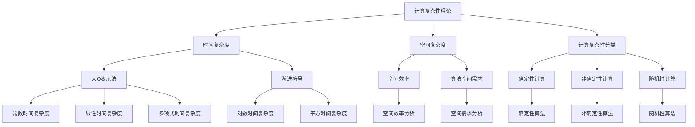

                 

## 文章标题：计算本质变化与自动化应用

### 关键词：
- 计算本质变化
- 自动化应用
- 计算复杂性理论
- 自动化控制系统
- 机器人技术
- 智能自动化

### 摘要：
本文将深入探讨计算本质的变化及其在自动化应用中的体现。首先，我们将回顾传统计算模式到现代计算模式的转变，分析计算复杂性理论的进展，并重新定义计算本质。接着，本文将介绍自动化应用的发展历程，探讨其在各行各业的实际应用案例。通过详细的计算复杂性理论讲解、自动化控制系统的基本原理、实际案例以及未来发展趋势，本文旨在为读者提供对计算本质变化与自动化应用之间联系的全面理解。

---

### 第一部分：计算本质变化与自动化应用概述

#### 第1章：计算本质变化与自动化应用概述

#### 1.1 计算本质的变化

##### 1.1.1 传统计算模式到现代计算模式的转变

在计算机科学和信息技术领域，计算本质的变化是一个重要且深远的话题。传统计算模式主要基于冯·诺依曼架构，强调数据和处理逻辑的分离，以及存储和计算过程的串行执行。然而，随着技术的发展，现代计算模式逐渐从传统的冯·诺依曼架构向更为灵活和高效的并行计算、分布式计算和量子计算转变。

这种转变带来了计算复杂性的降低，计算效率的提升，以及计算能力的指数级增长。例如，并行计算通过同时处理多个任务，显著减少了计算时间；分布式计算利用网络中的多个节点协同工作，提高了系统的可靠性和可扩展性；量子计算则通过量子叠加和纠缠现象，实现了超越经典计算机的计算能力。

##### 1.1.2 计算复杂性理论的进展

计算复杂性理论是研究算法效率和问题难度的学科，对于理解计算本质的变化具有重要意义。近年来，计算复杂性理论取得了显著进展，包括对NP完全问题、随机性算法、近似算法和量子算法的研究。

例如，Cook定理提出了NP完全问题的概念，揭示了某些问题在计算上的难度；随机性算法通过引入随机性，提高了算法的成功率；近似算法则在无法精确求解的问题上，提供了有效的近似解；量子算法则利用量子叠加和纠缠，实现了对某些问题的指数级加速。

##### 1.1.3 计算本质的重新定义

随着计算模式的变化，计算本质也在不断重新定义。传统上，计算本质被认为是一种基于逻辑和算法的符号处理过程。然而，现代计算模式，特别是量子计算和类脑计算，使得计算本质开始融合物理、生物学和神经科学等领域。

例如，量子计算中的计算过程更接近于物理现象，如量子纠缠和量子态的叠加；类脑计算则通过模拟人脑的结构和功能，实现了对复杂问题的自适应处理。这些新概念对计算本质的理解提出了新的挑战和机遇。

#### 1.2 自动化应用的发展

##### 1.2.1 自动化技术的起源

自动化技术起源于20世纪初期，最初的应用主要集中在工业生产领域。早期的自动化设备如机械臂、自动化装配线等，通过预先编程的指令执行重复性任务，显著提高了生产效率。随着计算机科学和电子技术的进步，自动化技术逐渐扩展到更多领域，如服务业、医疗保健、交通运输等。

##### 1.2.2 现代自动化技术的发展趋势

现代自动化技术正朝着智能化、网络化和自主化的方向发展。智能化体现在自动化系统通过人工智能和机器学习技术，实现了更复杂的决策和任务执行；网络化则通过物联网技术，实现了设备之间的互联互通和数据共享；自主化则通过自主决策和自主执行，使得自动化系统能够在复杂环境中独立运行。

##### 1.2.3 自动化技术在各行各业的实际应用案例

自动化技术在各行各业中的应用已经非常广泛。在制造业中，自动化生产线和机器人被广泛应用于组装、焊接、检测等环节；在服务业中，智能客服、无人零售等应用正在改变服务模式；在医疗保健领域，自动化诊断和治疗系统正在提高医疗服务的质量和效率；在交通运输领域，自动驾驶技术和无人机正在革新交通模式。

#### 1.3 本书的目标与结构

##### 1.3.1 掌握计算本质变化的理论基础

本书旨在帮助读者深入理解计算本质的变化，包括传统计算模式到现代计算模式的转变，计算复杂性理论的进展，以及计算本质的重新定义。通过详细的讲解和实例分析，读者将能够掌握这些核心概念，为后续的自动化应用学习打下坚实的基础。

##### 1.3.2 理解自动化应用的核心技术

本书还将详细介绍自动化应用的核心技术，包括自动化控制系统的基本原理、工业机器人的技术原理和编程方法，以及智能自动化的最新进展。通过这些内容，读者将能够全面了解自动化应用的技术基础，为实际应用做好准备。

##### 1.3.3 学习自动化应用的实际操作技巧

除了理论知识，本书还将提供大量的实际案例和操作技巧，包括自动化生产线的实际设计、机器人编程的实战经验，以及智能自动化系统的集成与优化。通过这些实战内容，读者将能够将理论知识应用到实际项目中，提高实际操作能力。

##### 1.3.4 本书主要内容结构与各章关系

本书分为四个部分：

- **第一部分**：计算本质变化与自动化应用概述，介绍计算本质的变化和自动化应用的发展。
- **第二部分**：计算本质变化的原理，深入讲解计算复杂性理论。
- **第三部分**：自动化应用的核心技术，介绍自动化控制系统的基本原理和工业机器人的技术。
- **第四部分**：自动化应用的实际案例，提供自动化应用的实际操作技巧和案例分析。

通过这些部分的系统讲解，读者将能够全面了解计算本质变化与自动化应用之间的关系，为实际应用提供理论支持和实践指导。

---

### 第二部分：计算本质变化的原理

#### 第2章：计算复杂性理论

计算复杂性理论是研究算法效率和问题难度的学科，对于理解计算本质的变化具有重要意义。本章将详细介绍计算复杂性理论的基本概念、经典算法分析以及其在实际应用中的体现。

#### 2.1 计算复杂性的基本概念

##### 2.1.1 时间复杂度

时间复杂度是衡量算法运行时间与输入规模之间关系的指标。通常用大O符号（O）表示。时间复杂度可以分为以下几个级别：

- **常数时间复杂度（O(1)**：算法的运行时间不随输入规模的变化而变化。
- **线性时间复杂度（O(n)**：算法的运行时间与输入规模成线性关系。
- **对数时间复杂度（O(log n)**：算法的运行时间与输入规模的对数成关系。
- **多项式时间复杂度（O(n^k)**：算法的运行时间与输入规模的某个多项式成关系。
- **指数时间复杂度（O(2^n)**：算法的运行时间与输入规模的指数成关系。

##### 2.1.2 空间复杂度

空间复杂度是衡量算法所需存储空间与输入规模之间关系的指标。同样使用大O符号表示。空间复杂度也分为几个级别：

- **常数空间复杂度（O(1)**：算法所需存储空间不随输入规模的变化而变化。
- **线性空间复杂度（O(n)**：算法所需存储空间与输入规模成线性关系。
- **对数空间复杂度（O(log n)**：算法所需存储空间与输入规模的对数成关系。
- **多项式空间复杂度（O(n^k)**：算法所需存储空间与输入规模的某个多项式成关系。

##### 2.1.3 计算复杂性分类

计算复杂性理论将问题分为多个类别，根据问题的难度和解决算法的复杂度进行分类。常见的计算复杂性类别包括：

- **P类问题**：可以在多项式时间内解决的确定性问题。
- **NP类问题**：可以在多项式时间内验证的确定性问题。
- **NP完全问题**：在多项式时间内不可解，但可在多项式时间内验证的问题。
- **NP难问题**：既不可解，也难以验证的问题。

#### 2.2 经典算法分析

##### 2.2.1 排序算法分析

排序算法是计算机科学中的基本算法之一，用于对数据进行排序。常见的排序算法包括冒泡排序、选择排序、插入排序和快速排序。以下是这些排序算法的时间复杂度和空间复杂度分析：

- **冒泡排序**：
  - 时间复杂度：\(O(n^2)\)
  - 空间复杂度：\(O(1)\)

- **选择排序**：
  - 时间复杂度：\(O(n^2)\)
  - 空间复杂度：\(O(1)\)

- **插入排序**：
  - 时间复杂度：\(O(n^2)\)
  - 空间复杂度：\(O(1)\)

- **快速排序**：
  - 时间复杂度：\(O(n \log n)\)
  - 空间复杂度：\(O(n)\)

##### 2.2.2 搜索算法分析

搜索算法用于在数据结构中查找特定元素。常见的搜索算法包括顺序搜索和二分搜索。以下是这些搜索算法的时间复杂度和空间复杂度分析：

- **顺序搜索**：
  - 时间复杂度：\(O(n)\)
  - 空间复杂度：\(O(1)\)

- **二分搜索**：
  - 时间复杂度：\(O(\log n)\)
  - 空间复杂度：\(O(1)\)

#### 2.3 计算复杂性理论在实际应用中的应用

##### 2.3.1 数据库查询优化

数据库查询优化是提高数据库系统性能的关键技术。计算复杂性理论在数据库查询优化中有着广泛的应用，包括：

- **SQL查询优化**：通过分析查询语句和数据库结构，优化查询执行计划，降低查询时间复杂度。
- **物联网数据处理**：物联网设备产生的大量数据需要高效处理，计算复杂性理论帮助设计优化数据存储和处理算法。

##### 2.3.2 大数据计算

大数据计算涉及处理海量数据，计算复杂性理论在大数据计算中的应用包括：

- **Hadoop**：Hadoop是一种分布式计算框架，通过MapReduce算法实现大数据处理。MapReduce的时间复杂度通常是\(O(n)\)，但通过分布式计算，可以显著降低整体计算时间。
- **Spark**：Spark是一种内存计算框架，通过弹性分布式数据集（RDD）实现大数据处理。Spark的时间复杂度通常低于Hadoop，可以在更短的时间内完成大数据计算。

---

### 第三部分：自动化应用的核心技术

#### 第3章：自动化控制系统的基本原理

自动化控制系统是现代工业、服务业和医疗等领域中不可或缺的一部分。本章将详细介绍自动化控制系统的基本原理、常见自动化控制技术和自动化控制系统的设计与应用。

#### 3.1 自动化控制系统的定义

自动化控制系统是指利用传感器、执行器、控制器等组成的一个能够自动完成特定任务的系统。它通过感知环境信息、做出决策并执行相应的动作，实现对过程的自动控制。自动化控制系统通常包括以下几个基本组成部分：

- **传感器**：用于检测和采集环境信息，如温度、压力、湿度等。
- **执行器**：用于根据控制器指令执行具体的操作，如电机、阀门等。
- **控制器**：用于接收传感器信息，进行处理并发出控制指令。

#### 3.1.1 开环控制与闭环控制

自动化控制系统根据控制策略的不同，可以分为开环控制和闭环控制。

- **开环控制**：开环控制系统不使用反馈机制，仅根据预设的输入信号进行控制。由于缺乏反馈，开环控制系统的稳定性和精确度相对较低，但结构简单、成本低。
- **闭环控制**：闭环控制系统使用反馈机制，根据实际输出与期望输出的偏差进行调整。闭环控制系统能够更好地保持稳定性和精确度，但结构复杂、成本较高。

#### 3.1.2 控制系统的基本组成

自动化控制系统通常由以下几个基本组成部分构成：

- **传感器**：用于检测和采集环境信息，如温度、压力、湿度等。
- **执行器**：用于根据控制器指令执行具体的操作，如电机、阀门等。
- **控制器**：用于接收传感器信息，进行处理并发出控制指令。控制器可以是专用的PLC（可编程逻辑控制器）或者计算机。
- **执行程序**：控制器中的程序，用于实现控制算法和控制逻辑。
- **人机界面**：用于显示系统状态、参数设置和操作控制，如触摸屏、显示屏等。

#### 3.1.3 控制系统的工作原理

自动化控制系统的工作原理可以分为以下几个步骤：

1. **传感器采集数据**：传感器实时采集环境信息，如温度、压力、湿度等。
2. **控制器处理数据**：控制器接收传感器数据，根据预设的控制算法进行处理，计算输出控制指令。
3. **执行器执行操作**：根据控制器的指令，执行器执行相应的操作，如电机转动、阀门开关等。
4. **反馈调节**：执行器的操作结果会反馈到控制器，控制器根据反馈信息进行调节，以确保系统的稳定性和精确度。

#### 3.2 常见自动化控制技术

##### 3.2.1 PLC编程基础

PLC编程是自动化控制系统设计的重要组成部分。以下是PLC编程的基础知识：

- **PLC的基本结构**：PLC通常包括输入模块、输出模块、处理器模块和电源模块。输入模块接收传感器信号，输出模块控制执行器动作，处理器模块进行数据处理和逻辑控制，电源模块为系统提供电力。
- **PLC的工作原理**：PLC通过扫描输入模块、执行程序、更新输出模块的顺序进行工作。扫描周期决定了PLC的响应速度。
- **PLC编程语言**：PLC编程语言包括梯形图（Ladder Logic）、功能块图（Function Block Diagram）、顺序功能图（Sequential Function Chart）和结构文本（Structured Text）等。不同编程语言适用于不同类型的控制任务。

##### 3.2.2 工业机器人技术

工业机器人是自动化控制系统中的重要组成部分，广泛应用于制造、装配、焊接、搬运等领域。以下是工业机器人技术的基础知识：

- **工业机器人的分类**：工业机器人根据结构特点和应用场景可以分为关节机器人、直角坐标机器人、圆柱坐标机器人和多自由度机器人等。
- **工业机器人的控制方式**：工业机器人的控制方式包括示教控制、程序控制、远程控制和自适应控制等。示教控制通过手动操作机器人的末端执行器，将运动轨迹记录到控制器中；程序控制通过编写程序实现机器人的自动化运行；远程控制通过网络实现机器人的远程监控和操作；自适应控制通过传感器和算法实现机器人的自适应调整。
- **工业机器人的编程与调试**：工业机器人的编程与调试包括运动规划、路径规划和任务执行等。运动规划确定机器人末端执行器的运动轨迹；路径规划确定机器人运动路径；任务执行实现机器人的具体操作。

##### 3.2.3 智能家居控制系统

智能家居控制系统是自动化控制技术在家庭领域的应用，通过智能设备实现家庭自动化。以下是智能家居控制系统的基础知识：

- **智能家居系统的基本架构**：智能家居系统通常包括传感器、控制器、执行器和用户界面。传感器用于感知家庭环境信息，控制器用于处理传感器数据和执行控制指令，执行器用于实现具体操作，用户界面用于显示系统状态和提供用户交互。
- **智能家居系统的功能实现**：智能家居系统可以实现远程控制、自动调节、节能管理等功能。例如，用户可以通过手机应用远程控制家中的灯光、窗帘、空调等设备，实现家庭自动化。
- **智能家居系统的安全性**：智能家居系统涉及用户隐私和数据安全，需要采取相应的安全措施。例如，使用加密技术保护数据传输，实现用户认证和访问控制，防止未经授权的访问和操作。

#### 3.3 自动化控制系统的设计与应用

##### 3.3.1 生产线自动化设计

生产线自动化设计是自动化控制系统在工业生产中的重要应用。以下是生产线自动化设计的关键步骤：

- **生产线的整体布局**：根据生产需求，设计生产线的整体布局，包括设备的摆放位置、物流路径等。
- **各个环节的自动化技术**：针对生产线的各个环节，采用相应的自动化技术。例如，采用机器人进行装配、采用自动化检测设备进行质量检测、采用自动化输送设备进行物料搬运等。
- **生产线的控制系统与数据采集**：设计生产线的控制系统，包括PLC、机器人控制器、传感器等。通过数据采集设备，实时监测生产线的工作状态，收集生产数据，为生产线的优化提供依据。

##### 3.3.2 智能家居控制系统

智能家居控制系统是自动化控制技术在家庭领域的重要应用。以下是智能家居控制系统的关键步骤：

- **智能家居系统的基本架构**：设计智能家居系统的基本架构，包括传感器、控制器、执行器和用户界面。根据家庭需求，选择合适的传感器和执行器，实现家庭自动化。
- **智能家居系统的功能实现**：根据家庭需求，实现智能家居系统的各项功能。例如，实现灯光控制、温度控制、安防监控等功能。
- **智能家居系统的安全性**：确保智能家居系统的安全性，采取相应的安全措施。例如，使用加密技术保护数据传输，实现用户认证和访问控制，防止未经授权的访问和操作。

#### 3.4 自动化控制系统的集成与优化

##### 3.4.1 自动化控制系统的集成

自动化控制系统的集成是将各个独立的部分整合成一个整体，实现协同工作。以下是自动化控制系统的集成步骤：

- **硬件集成**：将传感器、执行器、控制器等硬件设备进行连接和集成，确保硬件设备的兼容性和稳定性。
- **软件集成**：编写和整合控制程序，实现各个硬件设备之间的通信和协调。
- **数据集成**：通过数据采集设备，实时收集生产数据，实现数据可视化和管理。

##### 3.4.2 自动化控制系统的优化

自动化控制系统的优化是通过调整控制策略、优化硬件设备配置、提高软件性能等手段，提高系统的性能和效率。以下是自动化控制系统的优化方法：

- **优化生产线的布局**：通过优化生产线的布局，减少物流路径、提高生产效率。
- **优化控制系统的算法**：调整控制算法，提高系统的响应速度和精确度。
- **优化硬件设备配置**：根据生产需求，调整硬件设备的配置，提高系统的性能和可靠性。
- **引入智能化技术**：利用人工智能、机器学习等技术，实现自动化控制系统的智能化，提高系统的自适应能力和决策能力。

---

### 第四部分：自动化应用的实际案例

#### 第4章：自动化在工业生产中的应用

自动化技术在工业生产中的应用已经非常广泛，显著提高了生产效率、降低了成本，并提升了产品质量。本章将详细介绍自动化在工业生产中的应用现状、应用案例以及生产线的优化与升级。

#### 4.1 工业生产自动化的现状

随着工业自动化技术的发展，自动化技术已经成为现代工业生产中不可或缺的一部分。目前，工业生产自动化的现状如下：

- **自动化技术在制造业中的应用**：自动化技术广泛应用于制造业的各个领域，如汽车制造、电子制造、食品加工等。通过自动化生产线和机器人，实现了生产过程的自动化、智能化和高效化。
- **自动化生产线的发展趋势**：自动化生产线正朝着高效、灵活和智能化的方向发展。现代自动化生产线不仅能够实现高效率的生产，还能够根据需求进行快速调整和优化，提高生产灵活性和适应性。
- **自动化生产线的优势与挑战**：自动化生产线具有提高生产效率、降低生产成本、提升产品质量等优势。然而，自动化生产线的实施和维护也需要投入大量的资金和技术，面临一些挑战，如设备故障、技术更新等。

#### 4.2 自动化在工业生产中的应用案例

以下是一些自动化在工业生产中的应用案例：

##### 4.2.1 某汽车制造厂的自动化生产线设计

某汽车制造厂引入了自动化生产线，实现了汽车制造过程的自动化。该自动化生产线的设计包括以下几个方面：

- **生产线的整体布局**：根据汽车制造工艺，设计了合理的生产线布局，确保物料流动顺畅、生产效率高。
- **各个环节的自动化技术**：在汽车制造的各个环节，采用了自动化技术。例如，在车身焊接环节，使用了机器人进行自动化焊接；在涂装环节，使用了自动化喷涂设备；在装配环节，使用了自动化装配线。
- **生产线的控制系统与数据采集**：设计了生产线的控制系统，通过PLC和机器人控制器实现生产线的自动化控制。同时，通过数据采集设备，实时监测生产线的运行状态，收集生产数据，为生产线的优化提供依据。

##### 4.2.2 某电子公司的自动化装配线

某电子公司引入了自动化装配线，实现了电子元器件的自动化装配、检测和包装。该自动化装配线的设计包括以下几个方面：

- **装配线的自动化设备**：选择了先进的自动化装配设备，如贴片机、焊接机、检测仪等，实现了电子元器件的自动化装配。
- **装配线的自动化流程**：设计了自动化装配线的流程，从原材料入库、装配、检测到成品出库，实现了整个生产过程的自动化。
- **装配线的质量控制与优化**：通过自动化检测设备，实时监测装配过程中的质量情况，实现了对生产质量的严格控制。同时，通过数据分析，对装配流程进行优化，提高生产效率。

#### 4.3 自动化生产线的优化与升级

自动化生产线的优化与升级是提高生产效率和产品质量的重要手段。以下是一些自动化生产线的优化策略：

- **优化生产线的布局**：通过优化生产线的布局，减少物流路径、提高生产效率。例如，重新设计生产线布局，减少物料搬运距离，提高设备利用率。
- **优化生产线的控制系统**：通过升级控制系统的软件和硬件，提高生产线的响应速度和精确度。例如，采用先进的PLC和机器人控制器，提高控制系统的性能和稳定性。
- **引入智能化技术**：通过引入人工智能、机器学习等技术，实现自动化生产线的智能化，提高生产线的自适应能力和决策能力。例如，利用机器学习算法，对生产数据进行实时分析，优化生产流程和参数设置。
- **自动化生产线的性能评估**：通过定期对自动化生产线进行性能评估，分析生产效率、生产成本、产品质量等指标，找出生产过程中的问题和瓶颈，制定相应的优化措施。

#### 4.4 自动化生产线的未来发展趋势

随着科技的不断进步，自动化生产线将继续向高效、智能和可持续化的方向发展。以下是一些自动化生产线的未来发展趋势：

- **自动化与物联网的融合**：物联网技术将实现自动化生产线与外部系统的互联互通，提高生产线的智能化水平和数据共享能力。例如，通过物联网技术，实现生产数据与供应链管理系统的集成，提高供应链的透明度和协同效率。
- **智能制造**：智能制造将实现自动化生产线的高度智能化和个性化定制。通过人工智能和大数据分析技术，实现生产过程的智能优化和决策支持，提高生产效率和产品质量。
- **绿色制造**：绿色制造将实现自动化生产线的环保和可持续发展。通过采用节能环保设备、优化生产工艺和流程，降低能源消耗和废弃物排放，实现绿色生产。

---

### 第五部分：自动化应用的未来发展

#### 第5章：自动化应用的未来发展趋势

随着科技的不断进步，自动化应用正逐渐深入到各个领域，改变着人们的生活方式和工作模式。本章将探讨自动化应用的未来发展趋势，包括自动化与物联网的融合、智能自动化的发展、自动化应用的伦理与法律问题，以及自动化应用的未来展望。

#### 5.1 自动化与物联网的融合

自动化与物联网（IoT）的融合是未来自动化应用的一个重要方向。物联网技术的快速发展，使得各种设备能够通过互联网连接起来，实现数据的实时传输和智能处理。这种融合将带来以下优势：

- **实时监控与远程控制**：通过物联网技术，可以实现自动化设备的实时监控和远程控制。例如，工厂管理者可以通过物联网平台，实时监控生产线的运行状态，远程调整设备参数，提高生产效率和产品质量。
- **数据共享与协同工作**：物联网技术使得不同设备和系统能够实现数据的共享和协同工作。例如，在智能家居中，各种智能设备可以通过物联网平台，实现数据的互通和协同控制，提高用户的居住体验。
- **自适应与自优化**：物联网技术可以实现自动化设备的自适应和自优化。通过收集和分析大量的数据，自动化系统能够根据实际情况，自动调整设备参数和工作模式，实现更高效、更灵活的生产和服务。

#### 5.2 智能自动化的发展

智能自动化是自动化应用的未来趋势，它结合了人工智能、大数据分析等先进技术，使得自动化系统能够具备更高的智能水平。智能自动化的发展主要表现在以下几个方面：

- **人工智能技术的应用**：人工智能技术，如机器学习、深度学习等，将被广泛应用于自动化系统中。通过人工智能技术，自动化系统能够实现更智能的决策和执行，提高生产效率和产品质量。
- **自适应控制系统的开发**：自适应控制系统可以根据环境变化和任务需求，自动调整控制策略，实现更精确、更灵活的控制。例如，在智能制造中，自适应控制系统可以实现生产设备的自适应调整，确保生产过程的稳定性和高效性。
- **智能化设备的普及**：随着人工智能技术的进步，越来越多的自动化设备将具备智能化功能。这些智能化设备能够自主执行复杂的任务，提高生产效率和灵活性。

#### 5.3 自动化应用的伦理与法律问题

随着自动化应用的不断推广，其带来的伦理和法律问题也越来越受到关注。以下是一些自动化应用中的伦理与法律问题：

- **隐私保护**：自动化应用往往涉及大量的个人数据，如何保护用户的隐私成为了一个重要问题。需要制定相应的隐私保护法规，确保用户数据的安全和隐私。
- **就业影响**：自动化技术的普及可能导致一些传统职业的消失，带来就业问题。需要关注自动化技术对就业市场的影响，制定相应的政策和措施，帮助劳动力适应新的就业环境。
- **责任归属**：在自动化应用中，如果发生安全事故或故障，如何确定责任归属成为了一个难题。需要制定明确的责任归属规则，确保各方承担相应的责任。

#### 5.4 自动化应用的未来展望

自动化应用的未来将充满机遇和挑战。以下是一些自动化应用的未来展望：

- **跨界应用**：自动化技术将跨越不同领域，实现跨界应用。例如，自动化技术在医疗、教育、农业等领域的应用，将带来巨大的变革和进步。
- **可持续发展**：自动化应用将致力于实现可持续发展。通过采用节能环保的自动化设备和技术，减少能源消耗和废弃物排放，实现绿色生产。
- **人机协同**：自动化应用将实现人与机器的协同工作。通过人工智能和机器学习技术，自动化系统将能够更好地理解和适应人类的需求，实现更高效、更舒适的人机互动。

总之，自动化应用的未来将是一个充满活力和创新的领域，它将不断推动社会的发展和进步。

---

### 附录 A：自动化应用的相关资源与工具

#### A.1 自动化控制系统的工具

##### A.1.1 PLC编程软件

- **Step 7**：西门子公司的PLC编程软件，适用于各种西门子PLC。
- **PLC Designer**：用于设计、编程和调试三菱PLC的软件。
- **CoDeSys**：一款通用的PLC编程软件，支持多种PLC。

##### A.1.2 工业机器人编程软件

- **RobotStudio**：ABB公司的工业机器人编程软件，用于模拟、编程和调试机器人。
- **KUKA.PLC Programming**：KUKA公司的PLC编程软件，用于编程和调试KUKA机器人。
- **ABB RobotStudio**：ABB公司的机器人模拟和编程软件。

#### A.2 自动化控制系统的主要标准

##### A.2.1 IEC 61131-3

- **IEC 61131-3的标准概述**：IEC 61131-3是国际电工委员会发布的可编程逻辑控制器（PLC）编程语言标准。
- **IEC 61131-3的编程语言**：包括梯形图（Ladder Logic）、功能块图（Function Block Diagram）、顺序功能图（Sequential Function Chart）和结构文本（Structured Text）。
- **IEC 61131-3的应用场景**：广泛应用于工业自动化、过程控制、离散自动化等领域。

##### A.2.2 IEC 61850

- **IEC 61850的标准概述**：IEC 61850是国际电工委员会发布的电力系统通信标准。
- **IEC 61850的应用场景**：广泛应用于电力系统自动化、智能电网、变电站自动化等领域。
- **IEC 61850的优势**：支持高速通信、数据共享、远程监控和故障诊断，提高了电力系统的可靠性和效率。

#### A.3 自动化应用的参考资料

##### A.3.1 经典教材

- 《自动控制原理》：经典的自动控制教材，详细介绍了自动控制系统的基本原理和设计方法。
- 《工业自动化控制技术》：系统介绍了工业自动化控制技术的基本概念、原理和应用。
- 《PLC编程技术与应用》：针对PLC编程的教材，涵盖了PLC编程的基本知识、编程技巧和应用实例。

##### A.3.2 学术论文

- 《自动化技术的发展趋势》：探讨了自动化技术的最新发展趋势和应用领域。
- 《物联网与自动化融合的研究》：分析了物联网与自动化技术的融合趋势和应用。
- 《智能自动化系统的设计与实现》：介绍了智能自动化系统的设计与实现方法。

---

### 附录 B：计算复杂性理论中的 Mermaid 流程图

#### 计算复杂性理论的基本概念流程图



---

### 附录 C：计算复杂性理论中的经典算法分析伪代码

#### 冒泡排序算法伪代码

```plaintext
function bubbleSort(array A)
    n = length(A)
    for i from 1 to n-1 do
        for j from 1 to n-i do
            if A[j] > A[j+1] then
                swap A[j] and A[j+1]
            end if
        end for
    end for
    return A
end function
```

#### 快速排序算法伪代码

```plaintext
function quickSort(array A, int low, int high)
    if low < high then
        pivot = partition(A, low, high)
        quickSort(A, low, pivot - 1)
        quickSort(A, pivot + 1, high)
    end if
end function

function partition(array A, int low, int high)
    pivot = A[high]
    i = low - 1
    for j = low to high - 1 do
        if A[j] <= pivot then
            i = i + 1
            swap A[i] and A[j]
        end if
    end for
    swap A[i+1] and A[high]
    return i + 1
end function
```

---

### 附录 D：自动化应用中的数学模型与公式讲解

#### 自动控制系统的数学模型

$$
\frac{dx}{dt} = k_1 \cdot x + k_2 \cdot u
$$

$$
y = k_3 \cdot x + k_4 \cdot u
$$

其中：
- \( x \) 是系统的状态变量。
- \( u \) 是输入变量。
- \( y \) 是输出变量。
- \( k_1 \)，\( k_2 \)，\( k_3 \)，\( k_4 \) 是系统参数。

#### PID控制器的数学模型

$$
u(t) = K_p \cdot e(t) + K_i \cdot \int_{0}^{t} e(\tau)d\tau + K_d \cdot \frac{de(t)}{dt}
$$

其中：
- \( u(t) \) 是控制输出。
- \( e(t) \) 是误差信号，即 \( e(t) = r(t) - y(t) \)，其中 \( r(t) \) 是参考输入，\( y(t) \) 是系统输出。
- \( K_p \)，\( K_i \)，\( K_d \) 分别是比例、积分和微分系数。

#### 常见数学公式举例说明

$$
f(x) = \begin{cases}
x^2 & \text{if } x \geq 0 \\
-x & \text{if } x < 0
\end{cases}
$$

这是一个分段函数，用于定义不同区间的函数值。当 \( x \) 大于或等于 0 时，函数值为 \( x \) 的平方；当 \( x \) 小于 0 时，函数值为 \( -x \)。

---

### 附录 E：自动化应用中的实际案例代码解析

#### 自动化生产线中 PLC 程序代码示例

```plc
// 定义输入输出点
VAR_INPUT
    start : BOOL;
    stop : BOOL;
    sensor1 : BOOL;
    sensor2 : BOOL;
END_VAR

VAR_OUTPUT
    motor1 : BOOL;
    motor2 : BOOL;
    light : BOOL;
END_VAR

VAR
    counter : INT;
    state : BYTE;
    emergencyStop : BOOL;
END_VAR

// 初始化程序
INITIAL
    counter = 0;
    state = 0;
    emergencyStop = FALSE;
ENDINIT

// 主程序
PROGRAM Main
    WHILE TRUE DO
        // 检查紧急停止按钮
        IF stop THEN
            emergencyStop = TRUE;
            motor1 = FALSE;
            motor2 = FALSE;
            light = FALSE;
        ELSE
            emergencyStop = FALSE;
        ENDIF

        // 检查启动按钮和传感器
        IF start AND sensor1 AND sensor2 THEN
            motor1 = TRUE;
            motor2 = TRUE;
            light = TRUE;
            state = 1;
        ELSE
            motor1 = FALSE;
            motor2 = FALSE;
            light = FALSE;
            state = 0;
        ENDIF

        // 计数器递增
        IF NOT emergencyStop THEN
            counter = counter + 1;
        ENDIF

        // 状态机控制
        SELECT state
            CASE 0:
                IF sensor1 THEN
                    state = 1;
                ENDIF
            CASE 1:
                IF sensor2 THEN
                    state = 2;
                ELSE
                    state = 0;
                ENDIF
            CASE 2:
                light = TRUE;
                state = 3;
            CASE 3:
                light = FALSE;
                state = 0;
        ENDSELECT
    ENDWHILE
ENDPROGRAM
```

这段 PLC 程序用于控制一个简单的自动化生产线。程序中定义了输入输出点、变量和初始化部分。主程序中使用了无限循环，检查了紧急停止按钮、启动按钮和传感器状态，并根据状态机控制电机和灯光的状态。

---

### 附录 F：自动化应用中的开发环境搭建

#### 在 Windows 上搭建 PLC 编程环境

1. **安装 PLC 编程软件**：
   - 访问 PLC 制造商的官方网站，下载适合的编程软件，如 Siemens TIA Portal 或 Mitsubishi GX Developer。
   - 下载后，按照安装向导安装软件。

2. **安装 PLC 和硬件设备**：
   - 根据编程软件的说明，将 PLC 主机、电源模块、输入输出模块等硬件设备正确连接。
   - 确保硬件设备的电源开关处于开启状态。

3. **配置通信参数**：
   - 在编程软件中，配置 PLC 的通信参数，如 IP 地址、端口号等。
   - 确保编程软件与 PLC 之间的通信正常。

4. **编写和上传程序**：
   - 使用编程软件编写 PLC 控制程序，包括逻辑控制、状态机等。
   - 将编写好的程序上传到 PLC，并检查程序的运行状态。

5. **调试和测试**：
   - 在编程软件中模拟程序的运行，观察程序的控制效果。
   - 根据实际情况，对程序进行调试和优化，确保程序的稳定运行。

#### 在 Linux 上搭建工业机器人编程环境

1. **安装 ROS（Robot Operating System）**：
   - 打开终端，执行以下命令安装 ROS：

   ```bash
   sudo apt-get update
   sudo apt-get install ros-melodic-desktop
   ```

2. **配置 ROS 工作空间**：
   - 创建 ROS 工作空间文件夹：

   ```bash
   mkdir -p ~/catkin_ws/src
   ```

   - 导入 ROS 环境变量：

   ```bash
   echo "source /opt/ros/melodic/setup.bash" >> ~/.bashrc
   source ~/.bashrc
   ```

3. **克隆 ROS 软件包**：
   - 在终端中，进入 ROS 工作空间文件夹，然后克隆需要的软件包：

   ```bash
   cd ~/catkin_ws/src
   git clone https://github.com/ros-industrial/industrial_robot_demos.git
   ```

4. **编译 ROS 软件包**：
   - 在终端中，执行以下命令编译软件包：

   ```bash
   catkin_make
   ```

5. **测试机器人编程环境**：
   - 运行以下命令启动 ROS 核心：

   ```bash
   roscore
   ```

   - 在另一个终端中，运行以下命令测试机器人控制：

   ```bash
   roslaunch industrial_robot_demos robotController.launch
   ```

   - 如果一切正常，应该能看到机器人的控制界面和实时状态。

---

### 附录 G：自动化应用中的源代码实现与解读

#### 自动化生产线中传感器数据处理程序

```python
import rospy
from std_msgs.msg import Bool, Int32

def sensor_callback(data):
    global sensor_status
    sensor_status = data.data

def main():
    global sensor_status
    sensor_status = False

    rospy.init_node('sensor_reader', anonymous=True)
    sensor_sub = rospy.Subscriber('sensor_data', Bool, sensor_callback)

    while not rospy.is_shutdown():
        if sensor_status:
            print("Sensor activated.")
            # 执行相关操作
        else:
            print("Sensor not activated.")
            # 执行相关操作
        rospy.sleep(1)

if __name__ == '__main__':
    main()
```

这段 Python 程序用于读取传感器数据并执行相关操作。程序中定义了一个回调函数 `sensor_callback`，用于处理传感器数据。主程序中创建了传感器订阅者，并进入一个无限循环，检查传感器状态并执行相应操作。

---

### 附录 H：自动化应用中的代码分析与优化

#### PLC 程序代码性能优化

原始代码：

```plc
// 原始计数器程序
VAR
    counter : INT;
END_VAR

PROGRAM Counter
    counter = 0
    WHILE TRUE DO
        counter = counter + 1
        rospy.sleep(1)
    ENDWHILE
ENDPROGRAM
```

优化代码：

```

