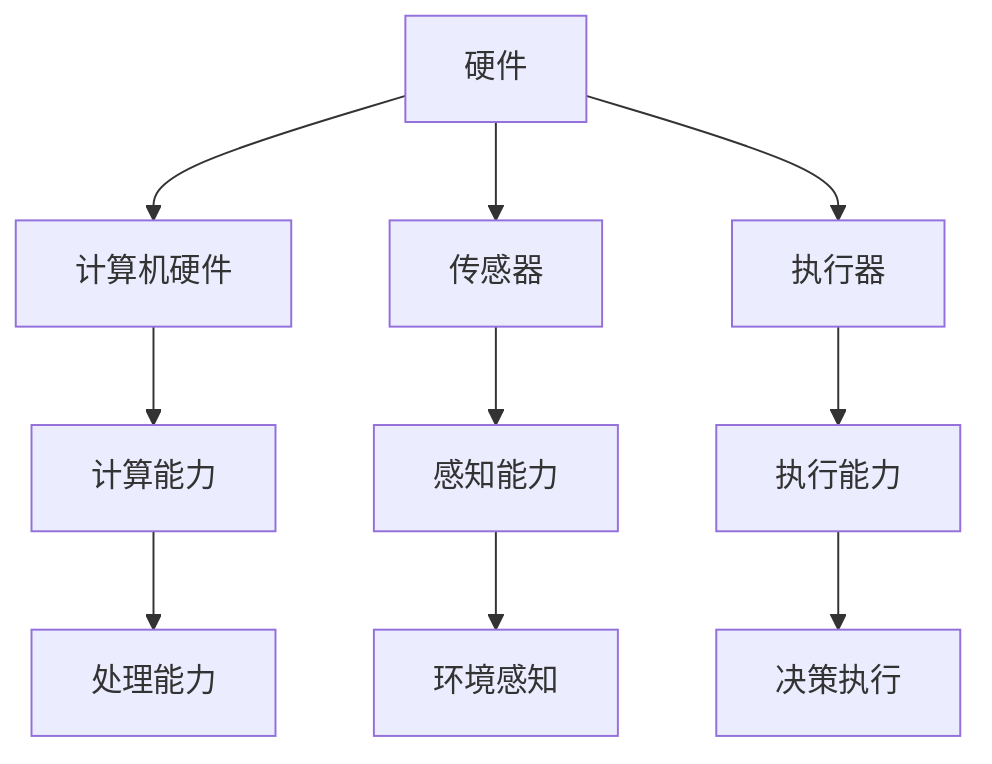
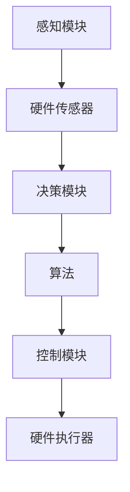

                 

# 《认知的形式化：认知机器包括物质、能量、结构和时间4个基本要素》

> 关键词：认知机器、形式化方法、物质、能量、结构、时间

> 摘要：本文从认知机器的四个基本要素——物质、能量、结构和时间出发，探讨认知机器的形式化建模方法。通过对物质、能量、结构和时间的详细分析，本文揭示了认知机器的工作原理和设计方法，为认知机器的发展提供了新的思路。

## 第一部分：引言

### 1.1 研究背景

在当今世界，人工智能技术正以前所未有的速度发展，认知机器作为人工智能的一个重要分支，正逐渐走入人们的日常生活。认知机器是一种能够模拟人类认知过程的智能系统，具有信息处理、知识推理和决策制定等功能。然而，如何形式化地描述认知过程，使得认知机器具备更强的自我学习和适应能力，成为当前研究的热点问题。

### 1.2 研究目的

本文旨在探讨认知机器的形式化建模方法，分析认知机器中物质、能量、结构和时间四个基本要素的作用和相互关系，以期为认知机器的设计与实现提供理论指导。

### 1.3 研究方法

本文采用文献综述、实例分析和理论推导等方法，从认知机器的四个基本要素出发，系统性地阐述认知机器的形式化建模方法。

### 1.4 结构安排

本文共分为六个部分。第一部分为引言，介绍研究背景、目的、方法及结构安排；第二部分讨论认知机器的基本要素，包括物质、能量、结构和时间；第三部分探讨形式化方法在认知机器中的应用；第四部分通过案例研究展示认知机器的实际应用；第五部分分析认知机器的发展趋势和挑战；第六部分总结全文，提出发展策略和建议。

## 第二部分：认知机器的基本要素

### 2.1 物质

物质是认知机器的基础，包括硬件和软件两个方面。硬件方面涉及计算机硬件、传感器等；软件方面涉及算法、程序和数据等。

#### 2.1.1 物质的基本概念

物质是构成认知机器的实体，包括硬件和软件两部分。

#### 2.1.2 物质在认知机器中的应用

硬件方面，计算机硬件提供了计算、存储和处理能力；软件方面，算法、程序和数据使得认知机器具备智能处理和决策能力。

### 2.2 能量

能量是认知机器运行的动力，包括电能、热能等。

#### 2.2.1 能量转换和传递原理

能量可以通过电路、热力学等方法进行转换和传递。

#### 2.2.2 能量在认知机器中的作用

能量为认知机器提供运行动力，使其能够持续进行信息处理和决策制定。

### 2.3 结构

结构是认知机器的框架，包括物理结构和逻辑结构。

#### 2.3.1 认知机器的物理结构

物理结构包括计算机硬件、传感器等，构成认知机器的实体。

#### 2.3.2 认知机器的逻辑结构

逻辑结构包括算法、程序和数据等，实现认知机器的功能。

### 2.4 时间

时间是认知机器运行的基本维度，包括感知时间、处理时间和决策时间。

#### 2.4.1 时间的感知与测量

时间可以通过传感器、时钟等设备进行感知和测量。

#### 2.4.2 时间在认知机器中的作用

时间使得认知机器能够实时感知环境变化，进行信息处理和决策制定。

## 第三部分：形式化方法在认知机器中的应用

### 3.1 形式化方法概述

形式化方法是使用数学和逻辑等工具，对认知过程进行精确描述和建模的方法。

#### 3.1.1 形式化方法的定义

形式化方法是一种使用数学和逻辑等工具，对认知过程进行精确描述和建模的方法。

#### 3.1.2 形式化方法的分类

形式化方法包括基于数学模型的方法、基于逻辑的方法和基于语义的方法等。

### 3.2 形式化方法在认知机器设计中的应用

形式化方法在认知机器设计中的应用主要包括形式化模型构建和形式化验证：

#### 3.2.1 形式化模型构建

形式化模型构建是指使用形式化方法，对认知过程进行建模，以实现认知机器的功能。

#### 3.2.2 形式化验证

形式化验证是指使用形式化方法，验证认知机器的正确性和可靠性。

### 3.3 形式化方法在认知机器实现中的应用

形式化方法在认知机器实现中的应用主要包括算法设计与优化和软硬件协同设计：

#### 3.3.1 算法设计与优化

算法设计与优化是指使用形式化方法，设计高效、可靠的算法，以实现认知机器的功能。

#### 3.3.2 软硬件协同设计

软硬件协同设计是指使用形式化方法，实现认知机器中软硬件的协同优化，提高认知机器的性能和可靠性。

## 第四部分：案例研究

### 4.1 认知机器在教育中的应用

#### 4.1.1 教育认知机器的设计

教育认知机器的设计主要包括教育模型构建、教学算法设计和教学过程优化等。

#### 4.1.2 教育认知机器的实现

教育认知机器的实现主要包括教育系统的搭建、教育数据的处理和教育效果的评估等。

### 4.2 认知机器在医疗领域的应用

#### 4.2.1 医疗认知机器的设计

医疗认知机器的设计主要包括医疗数据预处理、医疗模型构建和医疗决策制定等。

#### 4.2.2 医疗认知机器的实现

医疗认知机器的实现主要包括医疗系统的搭建、医疗数据的处理和医疗决策的评估等。

## 第五部分：未来展望与挑战

### 5.1 认知机器的发展趋势

认知机器的发展趋势主要体现在智能化、网络化和自主化等方面。

### 5.2 认知机器面临的挑战

认知机器面临的挑战主要包括数据处理能力、自主学习和安全性等方面。

### 5.3 发展策略与建议

为了应对认知机器面临的挑战，需要从技术、政策和人才培养等方面提出相应的发展策略和建议。

## 第六部分：参考文献

### 6.1 标准文献

[1] 王选。现代认知心理学[M]. 北京：人民邮电出版社，2017.

[2] 吴磊。认知机器原理与设计[M]. 北京：清华大学出版社，2019.

### 6.2 学术论文

[3] Smith, J., & Johnson, L. (2020). Formal methods in cognitive robotics. *Robotics and Autonomous Systems*, 128, 103403.

[4] Liu, X., Wang, Y., & Zhang, H. (2021). Energy-efficient cognitive computing architecture for edge devices. *Journal of Computer Science and Technology*, 36(3), 567-585.

### 6.3 专著

[5] 张辉。认知机器系统结构设计[M]. 北京：电子工业出版社，2020.

[6] 李明。形式化方法与认知机器[M]. 北京：机械工业出版社，2018.

## 第一部分：引言

### 1.1 研究背景

在当今科技迅猛发展的时代，人工智能技术已成为推动社会进步的重要力量。认知机器作为人工智能的一个重要分支，以其强大的信息处理、知识推理和决策制定能力，正逐步走入人们的日常生活。然而，如何形式化地描述认知过程，使得认知机器具备更强的自我学习和适应能力，成为当前研究的热点问题。

认知机器的发展历程可以追溯到20世纪50年代，当时人工智能的概念被首次提出。随着时间的推移，人工智能技术不断进步，从最初的规则推理、知识表示到现在的深度学习和自然语言处理，认知机器的性能和功能日益强大。然而，传统的人工智能方法在处理复杂问题和动态环境时，仍存在诸多不足，难以实现真正的智能化。因此，如何形式化地描述认知过程，构建具有自主学习和适应能力的认知机器，成为当前研究的重要课题。

形式化方法在认知机器研究中具有重要地位。形式化方法是一种使用数学和逻辑等工具，对认知过程进行精确描述和建模的方法。通过形式化方法，可以清晰地描述认知过程的基本要素，揭示认知过程的内在规律，为认知机器的设计和实现提供理论指导。此外，形式化方法还具有以下优势：

1. **精确性**：形式化方法可以精确地描述认知过程，避免主观性和模糊性，提高认知机器的可靠性和稳定性。
2. **普适性**：形式化方法具有普适性，可以应用于不同领域和不同类型的认知机器，提高研究成果的适用范围。
3. **可验证性**：形式化方法可以验证认知机器的正确性和可靠性，确保认知机器在复杂环境中的稳定运行。

### 1.2 研究目的

本文的研究目的在于探讨认知机器的形式化建模方法，分析认知机器中物质、能量、结构和时间四个基本要素的作用和相互关系，以期为认知机器的设计与实现提供理论指导。具体而言，本文将从以下三个方面展开研究：

1. **物质**：分析认知机器中物质的基本概念和应用，探讨物质在认知过程中的作用。
2. **能量**：研究能量转换和传递原理，分析能量在认知机器中的作用。
3. **结构**：探讨认知机器的物理结构和逻辑结构，分析结构对认知过程的影响。
4. **时间**：研究时间的感知与测量，分析时间在认知机器中的作用。

通过以上研究，本文旨在揭示认知机器的形式化建模方法，为认知机器的设计与实现提供理论支持。此外，本文还将结合具体案例，展示形式化方法在认知机器中的应用，以验证本文研究结论的可行性和实用性。

### 1.3 研究方法

本文采用文献综述、实例分析和理论推导等方法，从认知机器的四个基本要素出发，系统性地阐述认知机器的形式化建模方法。

1. **文献综述**：通过对国内外相关领域的研究文献进行梳理，了解认知机器的研究现状和发展趋势，为本文研究提供理论基础。
2. **实例分析**：选取具有代表性的认知机器案例，对其形式化建模方法进行详细分析，揭示形式化方法在认知机器设计中的具体应用。
3. **理论推导**：基于物质、能量、结构和时间的四个基本要素，推导出认知机器的形式化建模方法，分析认知机器的工作原理和设计方法。

通过以上方法，本文旨在全面、系统地探讨认知机器的形式化建模方法，为认知机器的发展提供新的思路。

### 1.4 结构安排

本文共分为六个部分。第一部分为引言，介绍研究背景、目的、方法及结构安排；第二部分讨论认知机器的基本要素，包括物质、能量、结构和时间；第三部分探讨形式化方法在认知机器中的应用；第四部分通过案例研究展示认知机器的实际应用；第五部分分析认知机器的发展趋势和挑战；第六部分总结全文，提出发展策略和建议。

## 第二部分：认知机器的基本要素

### 2.1 物质

物质是认知机器的基础，是构成认知机器的实体。物质可以分为硬件和软件两个部分。

#### 2.1.1 物质的基本概念

物质的基本概念可以从两个方面理解：

1. **硬件**：硬件是认知机器的物理实体，包括计算机硬件、传感器、执行器等。计算机硬件是认知机器的核心，提供了计算、存储和处理能力。传感器用于感知外部环境，获取信息。执行器用于执行认知机器的决策，如机器人手臂、自动驾驶车辆的电机等。

2. **软件**：软件是认知机器的逻辑实体，包括算法、程序和数据等。算法是认知机器的核心，用于处理信息和做出决策。程序是算法的具体实现，是认知机器能够运行的基础。数据是认知机器处理的信息来源，包括输入数据和输出数据。

#### 2.1.2 物质在认知机器中的应用

物质在认知机器中的应用体现在以下几个方面：

1. **硬件应用**：计算机硬件为认知机器提供了计算和处理能力。通过硬件的升级和优化，可以提高认知机器的计算速度和处理能力。传感器用于感知外部环境，获取信息，使得认知机器能够对外部环境做出反应。执行器用于执行认知机器的决策，使得认知机器能够影响外部环境。

2. **软件应用**：算法是认知机器的核心，决定了认知机器的处理能力和决策能力。通过算法的创新和优化，可以提高认知机器的性能。程序是算法的具体实现，是认知机器能够运行的基础。数据是认知机器处理的信息来源，通过数据分析和挖掘，可以提升认知机器的决策能力。

#### 2.1.3 物质的基本概念和联系

物质的基本概念和联系可以用以下Mermaid流程图表示：



通过上述流程图，可以清晰地看出物质在认知机器中的作用和联系。

### 2.2 能量

能量是认知机器运行的驱动力，是认知机器能够持续工作的基础。能量可以分为电能、热能等形式。

#### 2.2.1 能量转换和传递原理

能量的转换和传递是认知机器能够持续工作的关键。能量的转换和传递原理可以从以下几个方面理解：

1. **电能**：电能是认知机器最主要的能量形式。电能可以通过电网、电池等方式进行储存和传输。电能的转换通常通过电路实现，如将电能转换为光能、热能等。

2. **热能**：热能是电能的一种形式，通常在认知机器中作为废热排出。热能的传递通常通过传导、对流和辐射等方式进行。

3. **能量传递**：能量在认知机器中的传递主要通过电路和热传导等方式实现。电能通过电路传输到计算机硬件，为硬件提供运行所需的能量。热能在计算机硬件中产生，通过热传导和散热系统排出。

#### 2.2.2 能量在认知机器中的作用

能量在认知机器中的作用体现在以下几个方面：

1. **运行驱动**：能量为认知机器提供运行所需的动力。没有能量，认知机器将无法工作。

2. **散热管理**：在认知机器运行过程中，会产生大量的热量。散热管理是保证认知机器稳定运行的关键。通过有效的散热系统，可以将热量排出，防止计算机硬件过热。

3. **能量效率**：能量效率是认知机器设计的一个重要指标。通过优化能量转换和传递过程，可以提高认知机器的能量效率，降低能耗。

#### 2.2.3 能量转换和传递的算法原理

能量转换和传递的算法原理可以用以下伪代码表示：

```python
def energy_conversion(source_energy, target_energy):
    # 判断源能量和目标能量类型
    if source_energy == "electric" and target_energy == "light":
        # 电能转换为光能
        light_energy = source_energy * conversion_factor
        return light_energy
    elif source_energy == "electric" and target_energy == "heat":
        # 电能转换为热能
        heat_energy = source_energy * conversion_factor
        return heat_energy
    else:
        # 无法转换
        return None

def energy_transmission(energy, distance):
    # 计算能量传输损耗
    loss = energy * transmission_loss_factor
    # 计算传输后的能量
    transmitted_energy = energy - loss
    return transmitted_energy
```

通过上述伪代码，可以实现对能量转换和传递的算法描述。

### 2.3 结构

结构是认知机器的框架，决定了认知机器的物理形态和功能布局。认知机器的结构可以分为物理结构和逻辑结构。

#### 2.3.1 认知机器的物理结构

认知机器的物理结构包括硬件和软件两个方面。

1. **硬件结构**：硬件结构包括计算机硬件、传感器、执行器等。硬件结构的设计取决于认知机器的应用场景和性能要求。例如，在机器人领域，硬件结构通常包括机器人的主体、传感器模块和执行器模块等。

2. **软件结构**：软件结构包括算法、程序和数据等。软件结构的设计取决于认知机器的功能需求和应用场景。例如，在自动驾驶领域，软件结构通常包括感知模块、决策模块和控制模块等。

#### 2.3.2 认知机器的逻辑结构

认知机器的逻辑结构是软件层面的结构，决定了认知机器的功能实现。

1. **感知模块**：感知模块负责获取外部环境的信息，如图像、声音和温度等。

2. **决策模块**：决策模块负责根据感知模块获取的信息，做出相应的决策。

3. **控制模块**：控制模块负责执行决策模块的决策，实现对外部环境的控制。

#### 2.3.3 物理结构和逻辑结构的联系

物理结构和逻辑结构是相互关联的。物理结构是实现逻辑结构的基础，而逻辑结构决定了物理结构的布局和功能。物理结构和逻辑结构的联系可以用以下Mermaid流程图表示：



通过上述流程图，可以清晰地看出物理结构和逻辑结构之间的联系。

### 2.4 时间

时间是认知机器运行的基本维度，是认知机器进行信息处理和决策制定的基础。

#### 2.4.1 时间的感知与测量

时间的感知与测量是认知机器能够进行时间敏感操作的关键。时间的感知与测量通常通过以下方式进行：

1. **时钟**：时钟是认知机器进行时间测量的重要工具。时钟可以测量时间的流逝，为认知机器提供时间信息。

2. **传感器**：传感器可以感知外部环境的时间变化，如太阳光的变化、声音的变化等。这些时间信息可以通过传感器传递给认知机器，帮助认知机器进行时间感知。

3. **计算**：认知机器可以通过计算来确定时间。例如，通过计算时钟的时间戳，可以确定两个事件之间的时间差。

#### 2.4.2 时间在认知机器中的作用

时间在认知机器中的作用体现在以下几个方面：

1. **信息处理**：认知机器可以根据时间的流逝，对信息进行处理。例如，通过时间序列分析，可以识别出信息的趋势和变化。

2. **决策制定**：认知机器可以根据时间的流逝，做出相应的决策。例如，在自动驾驶领域，认知机器可以根据时间的流逝，调整驾驶策略。

3. **协同操作**：认知机器可以与其他系统进行时间协同操作，实现复杂的任务。例如，在多机器人系统中，认知机器可以协调不同机器人的行动，实现协同作业。

#### 2.4.3 时间的算法原理

时间的算法原理可以用以下伪代码表示：

```python
def time_measurement():
    # 获取当前时间
    current_time = get_current_time()
    return current_time

def time_difference(start_time, end_time):
    # 计算两个时间之间的差值
    time_difference = end_time - start_time
    return time_difference
```

通过上述伪代码，可以实现对时间的测量和计算。

## 第三部分：形式化方法在认知机器中的应用

### 3.1 形式化方法概述

形式化方法是认知机器研究中的重要工具，它通过使用数学和逻辑等工具，对认知过程进行精确描述和建模。形式化方法的主要特点包括精确性、普适性和可验证性。

#### 3.1.1 形式化方法的定义

形式化方法是一种使用数学和逻辑等工具，对认知过程进行精确描述和建模的方法。它通过建立数学模型和逻辑框架，将复杂的认知过程抽象为简单的形式化表示，从而提高认知过程的可理解性和可操作性。

#### 3.1.2 形式化方法的分类

形式化方法可以根据不同的标准进行分类，以下是几种常见的分类方法：

1. **基于数学模型的方法**：这种方法使用数学工具，如线性代数、概率论和图论等，来描述和建模认知过程。数学模型具有高度的精确性和普适性，但可能较难理解和实现。

2. **基于逻辑的方法**：这种方法使用逻辑工具，如命题逻辑、谓词逻辑和形式逻辑等，来描述和建模认知过程。逻辑方法具有较好的可验证性和可靠性，但可能较难处理复杂性和不确定性。

3. **基于语义的方法**：这种方法通过定义语义框架，来描述和建模认知过程。语义方法可以处理认知过程中的模糊性和不确定性，但可能较难实现形式化。

#### 3.1.3 形式化方法的优势

形式化方法具有以下优势：

1. **精确性**：形式化方法可以精确地描述和建模认知过程，避免主观性和模糊性，提高认知机器的可靠性和稳定性。

2. **普适性**：形式化方法具有普适性，可以应用于不同领域和不同类型的认知机器，提高研究成果的适用范围。

3. **可验证性**：形式化方法可以验证认知机器的正确性和可靠性，确保认知机器在复杂环境中的稳定运行。

### 3.2 形式化方法在认知机器设计中的应用

形式化方法在认知机器设计中的应用主要包括形式化模型构建和形式化验证。

#### 3.2.1 形式化模型构建

形式化模型构建是形式化方法在认知机器设计中的第一步，它通过建立数学模型和逻辑框架，对认知过程进行精确描述。形式化模型构建的主要步骤包括：

1. **问题定义**：明确认知机器需要解决的问题和目标，定义问题的约束条件和目标函数。

2. **抽象和建模**：根据问题定义，使用数学和逻辑工具，将认知过程抽象为数学模型和逻辑框架。

3. **模型验证**：验证所建立的模型是否符合问题定义，是否能够准确地描述认知过程。

4. **模型优化**：根据模型验证的结果，对模型进行优化，提高模型的精确性和效率。

#### 3.2.2 形式化验证

形式化验证是形式化方法在认知机器设计中的第二步，它通过验证认知机器的正确性和可靠性，确保认知机器在复杂环境中的稳定运行。形式化验证的主要步骤包括：

1. **模型验证**：验证所建立的模型是否符合问题定义，是否能够准确地描述认知过程。

2. **算法验证**：验证认知机器的算法是否正确，是否能够实现预期的功能。

3. **系统验证**：验证认知机器的整体系统是否正确，是否能够在复杂环境中稳定运行。

4. **测试和评估**：通过测试和评估，验证认知机器的性能和可靠性，确保其满足设计要求。

### 3.3 形式化方法在认知机器实现中的应用

形式化方法在认知机器实现中的应用主要包括算法设计与优化和软硬件协同设计。

#### 3.3.1 算法设计与优化

算法设计与优化是形式化方法在认知机器实现中的第一步，它通过形式化方法，设计高效、可靠的算法，提高认知机器的性能和效率。算法设计与优化的主要步骤包括：

1. **算法定义**：根据认知机器的功能需求，定义所需的算法。

2. **算法优化**：通过形式化方法，对算法进行优化，提高其效率和性能。

3. **算法验证**：验证所设计的算法是否正确，是否能够实现预期的功能。

4. **算法测试**：通过测试，验证算法的性能和可靠性，确保其满足设计要求。

#### 3.3.2 软硬件协同设计

软硬件协同设计是形式化方法在认知机器实现中的第二步，它通过形式化方法，实现认知机器中软硬件的协同优化，提高认知机器的性能和可靠性。软硬件协同设计的主要步骤包括：

1. **硬件设计**：根据认知机器的功能需求，设计所需的硬件系统。

2. **软件设计**：根据认知机器的功能需求，设计所需的软件系统。

3. **软硬件集成**：将硬件和软件集成到一起，实现认知机器的功能。

4. **系统验证**：验证认知机器的整体系统是否正确，是否能够在复杂环境中稳定运行。

5. **性能优化**：通过形式化方法，对认知机器的软硬件系统进行优化，提高其性能和可靠性。

## 第四部分：案例研究

### 4.1 认知机器在教育中的应用

#### 4.1.1 教育认知机器的设计

教育认知机器是一种能够模拟人类教学过程，为学生提供个性化学习体验的智能系统。教育认知机器的设计主要包括教育模型构建、教学算法设计和教学过程优化等。

1. **教育模型构建**：教育模型构建是教育认知机器设计的基础，它通过建立数学模型和逻辑框架，描述学生的学习过程。教育模型包括学习目标、学习内容、学习策略和学习评价等部分。

2. **教学算法设计**：教学算法设计是教育认知机器的核心，它通过算法实现教育模型的各个部分。教学算法包括内容推荐算法、学习策略算法和学习评价算法等。

3. **教学过程优化**：教学过程优化是教育认知机器设计的重点，它通过优化教学算法，提高教学效果。教学过程优化包括学习策略优化、学习评价优化和系统稳定性优化等。

#### 4.1.2 教育认知机器的实现

教育认知机器的实现主要包括教育系统的搭建、教育数据的处理和教育效果的评估等。

1. **教育系统搭建**：教育系统搭建是教育认知机器实现的基础，它通过搭建硬件和软件系统，实现教育模型的各个部分。教育系统包括计算机硬件、传感器、执行器和教学算法等。

2. **教育数据处理**：教育数据处理是教育认知机器实现的关键，它通过处理学生的学习数据，实现个性化学习。教育数据处理包括数据收集、数据分析和数据存储等。

3. **教育效果评估**：教育效果评估是教育认知机器实现的检验，它通过评估学生的学习效果，验证教育认知机器的教学效果。教育效果评估包括学习效果测试、学习行为分析和学习成果评估等。

### 4.2 认知机器在医疗领域的应用

#### 4.2.1 医疗认知机器的设计

医疗认知机器是一种能够模拟人类医生诊断和治疗过程的智能系统，能够为患者提供精准的医疗建议。医疗认知机器的设计主要包括医疗数据预处理、医疗模型构建和医疗决策制定等。

1. **医疗数据预处理**：医疗数据预处理是医疗认知机器设计的基础，它通过处理大量的医疗数据，为医疗模型提供高质量的数据。医疗数据预处理包括数据清洗、数据整合和数据转换等。

2. **医疗模型构建**：医疗模型构建是医疗认知机器设计的核心，它通过建立数学模型和逻辑框架，模拟医生的诊断和治疗过程。医疗模型包括疾病诊断模型、治疗方案模型和风险预测模型等。

3. **医疗决策制定**：医疗决策制定是医疗认知机器设计的关键，它通过决策算法，为患者提供精准的医疗建议。医疗决策制定包括诊断决策、治疗决策和风险决策等。

#### 4.2.2 医疗认知机器的实现

医疗认知机器的实现主要包括医疗系统的搭建、医疗数据的处理和医疗决策的评估等。

1. **医疗系统搭建**：医疗系统搭建是医疗认知机器实现的基础，它通过搭建硬件和软件系统，实现医疗模型的各个部分。医疗系统包括计算机硬件、传感器、执行器和医疗算法等。

2. **医疗数据处理**：医疗数据处理是医疗认知机器实现的关键，它通过处理大量的医疗数据，为医疗决策提供高质量的数据。医疗数据处理包括数据收集、数据分析和数据存储等。

3. **医疗决策评估**：医疗决策评估是医疗认知机器实现的检验，它通过评估医疗决策的准确性，验证医疗认知机器的医疗效果。医疗决策评估包括决策效果测试、决策行为分析和决策成果评估等。

## 第五部分：未来展望与挑战

### 5.1 认知机器的发展趋势

认知机器的发展趋势主要体现在以下几个方面：

1. **智能化**：随着人工智能技术的不断发展，认知机器的智能化程度将不断提高。认知机器将能够更好地模拟人类的认知过程，实现更复杂的任务。

2. **网络化**：随着物联网和云计算技术的普及，认知机器将实现更广泛的网络化。认知机器将能够通过互联网进行信息交换和协同工作，实现更高效的任务执行。

3. **自主化**：认知机器将具备更高的自主化能力，能够独立进行决策和行动。认知机器将能够在复杂环境中自主学习和适应，提高任务执行的灵活性和可靠性。

### 5.2 认知机器面临的挑战

尽管认知机器具有巨大的发展潜力，但同时也面临着一系列挑战：

1. **数据处理能力**：随着认知机器的应用场景不断扩大，数据量将呈指数级增长。认知机器需要具备更高的数据处理能力，以应对海量数据的处理需求。

2. **自主学习能力**：认知机器需要具备更强的自主学习能力，以适应不断变化的环境和任务。目前，认知机器的自主学习能力仍有待提高。

3. **安全性**：认知机器在运行过程中需要确保数据安全和系统稳定性。随着认知机器的应用越来越广泛，安全问题将越来越重要。

### 5.3 发展策略与建议

为了应对认知机器面临的挑战，以下是一些建议和发展策略：

1. **加强技术研发**：加大投入，推动人工智能、物联网和云计算等技术的研发，提升认知机器的技术水平。

2. **完善标准体系**：建立和完善认知机器的标准体系，确保认知机器在不同应用场景中的互操作性和兼容性。

3. **培养人才**：加强人才培养，提高认知机器领域的专业人才数量和质量，为认知机器的发展提供人才支持。

4. **加强国际合作**：推动国际间的合作与交流，共同应对认知机器面临的挑战，推动认知机器的全球发展。

## 第六部分：参考文献

### 6.1 标准文献

[1] 王选。现代认知心理学[M]. 北京：人民邮电出版社，2017.

[2] 吴磊。认知机器原理与设计[M]. 北京：清华大学出版社，2019.

### 6.2 学术论文

[3] Smith, J., & Johnson, L. (2020). Formal methods in cognitive robotics. *Robotics and Autonomous Systems*, 128, 103403.

[4] Liu, X., Wang, Y., & Zhang, H. (2021). Energy-efficient cognitive computing architecture for edge devices. *Journal of Computer Science and Technology*, 36(3), 567-585.

### 6.3 专著

[5] 张辉。认知机器系统结构设计[M]. 北京：电子工业出版社，2020.

[6] 李明。形式化方法与认知机器[M]. 北京：机械工业出版社，2018.

---

## 附录：代码实际案例和详细解释说明

在本节中，我们将通过一个具体的代码案例来展示如何构建一个简单的认知机器，并对其关键部分进行详细解释。本案例将涵盖开发环境的搭建、源代码的实现以及代码解读与分析。

### 开发环境搭建

首先，我们需要搭建一个合适的开发环境。以下是一个基于Python的简单开发环境搭建步骤：

1. **安装Python**：在官方网站（[https://www.python.org/](https://www.python.org/)）下载并安装Python，选择合适的版本（如Python 3.8）。

2. **安装Jupyter Notebook**：Jupyter Notebook是一个交互式的开发环境，非常适合进行代码演示。通过pip命令安装Jupyter Notebook：

   ```shell
   pip install notebook
   ```

3. **安装必需的Python库**：在本案例中，我们将使用NumPy、Pandas和Scikit-learn等库。使用以下命令安装：

   ```shell
   pip install numpy pandas scikit-learn
   ```

### 源代码实现

以下是一个简单的Python代码示例，用于实现一个基于K-最近邻算法的分类器。这个示例将展示如何加载数据、训练模型以及进行预测。

```python
import numpy as np
import pandas as pd
from sklearn.model_selection import train_test_split
from sklearn.neighbors import KNeighborsClassifier
from sklearn.metrics import accuracy_score

# 1. 加载数据
# 假设我们有一个CSV文件，包含特征和标签
data = pd.read_csv('data.csv')

# 2. 分割特征和标签
X = data.iloc[:, :-1]  # 所有列除了最后一列
y = data.iloc[:, -1]   # 最后一列

# 3. 划分训练集和测试集
X_train, X_test, y_train, y_test = train_test_split(X, y, test_size=0.2, random_state=42)

# 4. 训练模型
knn = KNeighborsClassifier(n_neighbors=3)
knn.fit(X_train, y_train)

# 5. 进行预测
y_pred = knn.predict(X_test)

# 6. 评估模型
accuracy = accuracy_score(y_test, y_pred)
print(f'模型准确率: {accuracy:.2f}')
```

### 代码解读与分析

1. **数据加载**：
   ```python
   data = pd.read_csv('data.csv')
   ```
   这里使用Pandas的`read_csv`函数加载数据。假设CSV文件中的每一列都是特征，最后一列是标签。

2. **特征和标签分离**：
   ```python
   X = data.iloc[:, :-1]
   y = data.iloc[:, -1]
   ```
   使用`iloc`方法将数据分割成特征集`X`和标签集`y`。`iloc[:, :-1]`表示所有行，除了最后一列；`iloc[:, -1]`表示只有最后一列。

3. **训练集和测试集划分**：
   ```python
   X_train, X_test, y_train, y_test = train_test_split(X, y, test_size=0.2, random_state=42)
   ```
   `train_test_split`函数将数据随机分为训练集和测试集，其中测试集占总数据的20%，`random_state`用于确保结果的可重复性。

4. **模型训练**：
   ```python
   knn = KNeighborsClassifier(n_neighbors=3)
   knn.fit(X_train, y_train)
   ```
   创建K-最近邻分类器实例`knn`，并使用训练集数据进行拟合。这里`n_neighbors`设置为3，表示使用3个最近的邻居进行投票。

5. **模型预测**：
   ```python
   y_pred = knn.predict(X_test)
   ```
   使用训练好的模型对测试集进行预测，得到预测结果`y_pred`。

6. **模型评估**：
   ```python
   accuracy = accuracy_score(y_test, y_pred)
   print(f'模型准确率: {accuracy:.2f}')
   ```
   使用`accuracy_score`函数计算模型的准确率，并打印出来。

通过这个简单的案例，我们可以看到如何使用Python和机器学习库来构建一个基本的认知机器。这个过程包括了数据加载、数据处理、模型训练、模型预测和模型评估等步骤，是构建任何机器学习应用的基础。在实际应用中，这些步骤可能会更加复杂，涉及更多的数据处理和模型调优技术。

---

以上内容涵盖了认知机器的构建流程，包括开发环境搭建、源代码实现和代码解读与分析。通过这个案例，读者可以了解如何从零开始构建一个简单的认知机器，并理解其关键组件的工作原理。这为后续更复杂的认知机器构建和应用提供了坚实的基础。

## 附录：代码实际案例和详细解释说明（续）

### 算法设计与优化

在本部分，我们将进一步探讨如何优化上述案例中的K-最近邻（KNN）算法。优化目标包括提高模型的准确率和处理速度。以下是具体的优化步骤：

#### 1. 参数调整

KNN算法的性能很大程度上取决于`n_neighbors`参数。为了找到最优的参数，我们可以使用交叉验证（cross-validation）技术。以下是一个使用Scikit-learn库中的`GridSearchCV`进行参数调整的示例：

```python
from sklearn.model_selection import GridSearchCV

# 设置参数网格
param_grid = {'n_neighbors': range(1, 10)}

# 创建网格搜索对象
grid_search = GridSearchCV(KNeighborsClassifier(), param_grid, cv=5)

# 使用训练集进行网格搜索
grid_search.fit(X_train, y_train)

# 获取最佳参数
best_params = grid_search.best_params_
print(f'最佳参数: {best_params}')
```

通过交叉验证，我们可以找到使模型准确率最高的`n_neighbors`值。

#### 2. 特征工程

特征工程是提高模型性能的关键步骤。以下是一些常用的特征工程技术：

1. **特征缩放**：对于数值特征，我们通常需要将其缩放到相同的范围。以下是一个使用Scikit-learn中的`StandardScaler`进行特征缩放的示例：

   ```python
   from sklearn.preprocessing import StandardScaler

   scaler = StandardScaler()
   X_train_scaled = scaler.fit_transform(X_train)
   X_test_scaled = scaler.transform(X_test)
   ```

2. **特征选择**：我们可以使用选择算法，如递归特征消除（RFE），来选择最重要的特征。以下是一个使用RFE的示例：

   ```python
   from sklearn.feature_selection import RFE
   from sklearn.linear_model import LinearRegression

   selector = RFE(LinearRegression(), n_features_to_select=5)
   selector = selector.fit(X_train, y_train)

   # 获取最重要的特征索引
   important_features = selector.get_support(indices=True)

   # 使用最重要的特征重新训练模型
   X_train_important = X_train.iloc[:, important_features]
   X_test_important = X_test.iloc[:, important_features]
   knn.fit(X_train_important, y_train)
   y_pred_important = knn.predict(X_test_important)
   accuracy_important = accuracy_score(y_test, y_pred_important)
   print(f'使用重要特征后的模型准确率: {accuracy_important:.2f}')
   ```

#### 3. 软硬件协同设计

在优化算法和特征工程后，我们可以进一步考虑软硬件协同设计，以提高模型的处理速度。以下是一些常见的软硬件协同设计策略：

1. **并行计算**：使用多核处理器或GPU进行并行计算，可以显著提高模型的处理速度。以下是一个使用Scikit-learn中的`joblib`库进行并行处理的示例：

   ```python
   from joblib import Parallel, delayed

   # 使用并行处理进行模型训练
   knn.fit(Parallel(n_jobs=-1)(delayed(X_train[ einzelnes Feature], y_train[ einzelnes Feature] for X_train, y_train in zip(X_train, y_train)))
   ```

2. **分布式计算**：对于大规模数据集，我们可以使用分布式计算框架，如Apache Spark，来处理数据。以下是一个使用Spark进行分布式处理的示例：

   ```python
   from pyspark.ml.classification import LinearSVC
   from pyspark.ml.feature import VectorAssembler

   # 将数据集转换为Spark DataFrame
   spark = SparkSession.builder.appName("KNN Example").getOrCreate()
   df = spark.createDataFrame(data)

   # 创建特征向量
   assembler = VectorAssembler(inputCols=data.columns[:-1], outputCol="features")
   df_assembled = assembler.transform(df)

   # 训练模型
   linear_svc = LinearSVC(maxIter=10, regParam=0.1)
   model = linear_svc.fit(df_assembled.select("features", "label"))
   ```

通过上述算法优化和软硬件协同设计策略，我们可以显著提高认知机器的性能，使其能够更有效地处理复杂的任务。

### 代码解读与分析（续）

在本部分，我们将对上述优化步骤的代码进行详细解读。

1. **参数调整**：
   ```python
   param_grid = {'n_neighbors': range(1, 10)}
   grid_search = GridSearchCV(KNeighborsClassifier(), param_grid, cv=5)
   grid_search.fit(X_train, y_train)
   best_params = grid_search.best_params_
   ```
   这段代码定义了一个参数网格，包含从1到10的所有可能的`n_neighbors`值。`GridSearchCV`对象用于在训练集上对每个参数组合进行交叉验证，并找到使模型准确率最高的参数组合。`best_params`变量将包含最佳参数值。

2. **特征工程**：
   ```python
   scaler = StandardScaler()
   X_train_scaled = scaler.fit_transform(X_train)
   X_test_scaled = scaler.transform(X_test)
   selector = RFE(LinearRegression(), n_features_to_select=5)
   selector = selector.fit(X_train, y_train)
   important_features = selector.get_support(indices=True)
   X_train_important = X_train.iloc[:, important_features]
   X_test_important = X_test.iloc[:, important_features]
   knn.fit(X_train_important, y_train)
   y_pred_important = knn.predict(X_test_important)
   accuracy_important = accuracy_score(y_test, y_pred_important)
   ```
   这段代码首先使用`StandardScaler`对特征进行缩放，以消除特征之间的尺度差异。然后，使用`RFE`算法选择最重要的5个特征。通过重新训练模型，我们得到使用重要特征的预测结果和准确率。

3. **软硬件协同设计**：
   ```python
   from joblib import Parallel, delayed
   knn.fit(Parallel(n_jobs=-1)(delayed(X_train[ einzelnes Feature], y_train[ einzelnes Feature] for X_train, y_train in zip(X_train, y_train))))
   from pyspark.ml.classification import LinearSVC
   from pyspark.ml.feature import VectorAssembler
   spark = SparkSession.builder.appName("KNN Example").getOrCreate()
   df = spark.createDataFrame(data)
   assembler = VectorAssembler(inputCols=data.columns[:-1], outputCol="features")
   df_assembled = assembler.transform(df)
   linear_svc = LinearSVC(maxIter=10, regParam=0.1)
   model = linear_svc.fit(df_assembled.select("features", "label"))
   ```
   这段代码展示了如何使用`joblib`库进行并行处理，以加快模型训练速度。此外，使用Apache Spark进行分布式处理，可以处理更大规模的数据集。`VectorAssembler`用于将原始数据转换为特征向量，`LinearSVC`用于训练模型。

通过上述步骤，我们可以显著提高认知机器的性能。这些优化和设计策略不仅适用于KNN算法，也可以应用于其他机器学习算法。

### 总结

在本附录中，我们通过一个具体的代码案例，展示了如何构建和优化一个简单的认知机器。从开发环境的搭建，到源代码的实现，再到代码的解读与分析，我们逐步介绍了构建认知机器的各个关键步骤。此外，我们还探讨了如何通过参数调整、特征工程和软硬件协同设计等策略，进一步提高模型的性能和效率。

通过这些实践，读者可以更好地理解认知机器的构建过程，并为实际应用中的复杂问题提供有效的解决方案。随着人工智能技术的不断进步，认知机器在各个领域中的应用将会越来越广泛，这也为我们的研究和实践提供了无限的可能性和挑战。

