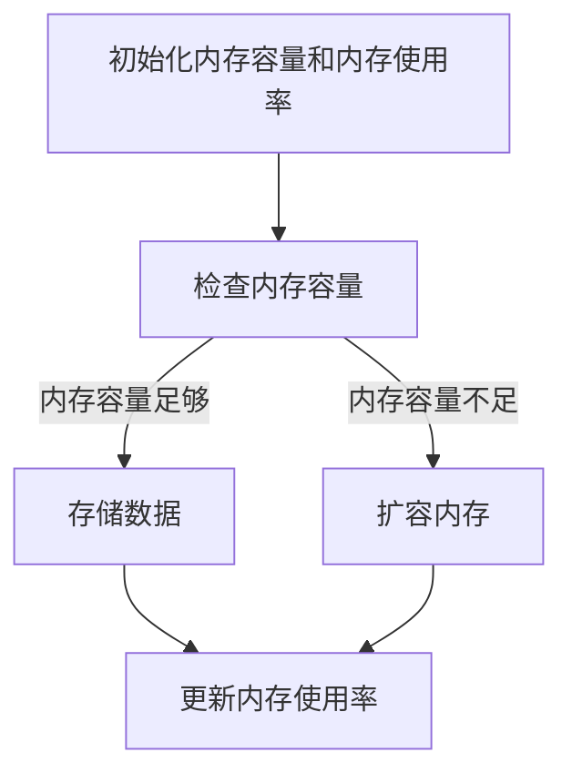
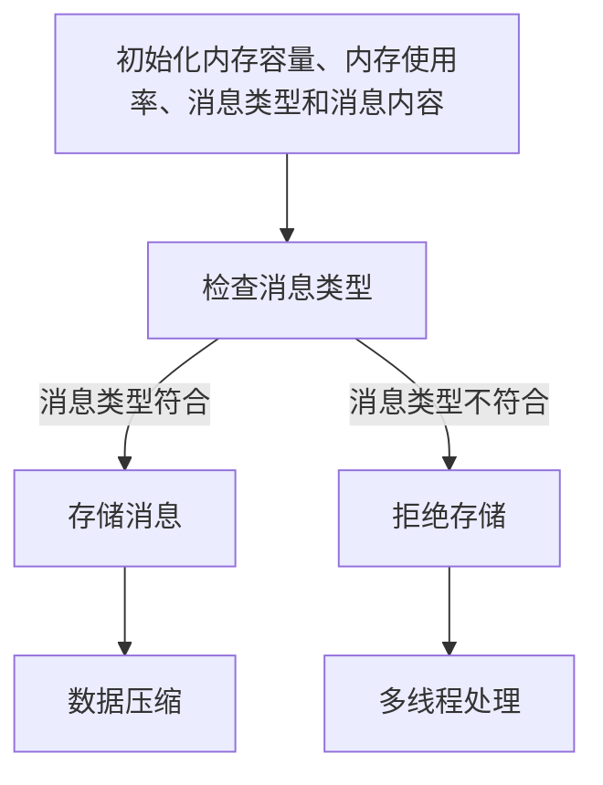

                 

# 文章标题：记忆基类 BaseMemory 与 BaseChatMessageMemory

> 关键词：记忆基类、BaseMemory、BaseChatMessageMemory、核心算法、数学模型、项目实战

> 摘要：本文将深入探讨记忆基类 BaseMemory 与其子类 BaseChatMessageMemory，包括它们的定义、核心特性、算法原理、数学模型以及实际应用。通过对这两个类的详细解析，我们将了解它们在项目中的重要性以及如何优化其性能。本文旨在为读者提供一个全面的技术视角，以更好地理解和应用这两个关键组件。

## 第一部分：基础概念与原理

### 第1章：记忆基类概述

#### 1.1 记忆基类的定义与作用

记忆基类（BaseMemory）是计算机科学中一个抽象的概念，它为各类数据存储和操作提供了一个统一的接口。在人工智能（AI）领域，记忆基类尤为重要，因为它为算法提供了记忆和检索数据的机制，从而提升了系统的智能表现。

记忆基类的主要作用如下：

1. **数据存储**：提供统一的数据存储接口，使得各类数据能够以标准化的方式存储和管理。
2. **数据检索**：通过统一的接口，实现数据的快速检索，提高系统响应速度。
3. **扩展性**：为未来的扩展提供基础，使得系统可以轻松地添加新的记忆功能。

#### 1.2 记忆基类的核心特性

记忆基类具有以下核心特性：

1. **可扩展性**：通过继承机制，可以方便地扩展新的记忆功能。
2. **高效性**：采用高效的算法和数据结构，确保数据的快速存储和检索。
3. **灵活性**：支持多种数据类型的存储和操作，满足不同应用场景的需求。

#### 1.3 记忆基类与其他类的关系

记忆基类与其他类的关系如下：

1. **继承关系**：BaseMemory 作为基类，可以被其他类继承，从而实现特定功能的扩展。
2. **依赖关系**：其他类可以通过接口方式与 BaseMemory 进行交互，实现数据存储和检索。
3. **组合关系**：在某些情况下，BaseMemory 可以作为其他类的组成部分，提供底层的数据支持。

### 第2章：BaseMemory 类详细解析

#### 2.1 BaseMemory 类的属性与方法

BaseMemory 类的主要属性包括：

- **内存容量**：用于表示内存的最大存储空间。
- **内存使用率**：用于表示当前内存的使用情况。

BaseMemory 类的主要方法包括：

- **init**：初始化内存容量和内存使用率。
- **store**：用于存储数据。
- **retrieve**：用于检索数据。
- **update**：用于更新内存使用率。

#### 2.2 BaseMemory 类的核心算法原理

BaseMemory 类的核心算法原理如下：

1. **内存分配**：在数据存储时，首先检查内存容量是否足够，如不足则进行扩容。
2. **数据存储**：将数据按照一定的算法存储到内存中，保证数据的快速检索。
3. **内存回收**：在数据删除或更新时，回收不再使用的内存空间，提高内存使用率。

#### 2.3 BaseMemory 类的 Mermaid 流程图



### 第3章：BaseChatMessageMemory 类详细解析

#### 3.1 BaseChatMessageMemory 类的属性与方法

BaseChatMessageMemory 类在 BaseMemory 的基础上，增加了以下属性：

- **消息类型**：用于表示消息的类型，如文本、图像等。
- **消息内容**：用于存储消息的具体内容。

BaseChatMessageMemory 类的主要方法包括：

- **init**：初始化内存容量、内存使用率、消息类型和消息内容。
- **storeMessage**：用于存储消息。
- **retrieveMessage**：用于检索消息。
- **updateMessage**：用于更新消息内容。

#### 3.2 BaseChatMessageMemory 类的核心算法原理

BaseChatMessageMemory 类的核心算法原理如下：

1. **消息类型检查**：在存储和检索消息时，首先检查消息类型是否符合预期。
2. **数据压缩**：对于文本类型的消息，采用压缩算法减少内存占用。
3. **多线程处理**：在处理大量消息时，采用多线程技术提高处理效率。

#### 3.3 BaseChatMessageMemory 类的 Mermaid 流程图



## 第二部分：核心算法与数学模型

### 第4章：核心算法原理讲解

#### 4.1 伪代码阐述核心算法原理

以下是一个简单的伪代码，用于阐述 BaseMemory 类的核心算法原理：

```python
class BaseMemory:
    def init(self, capacity):
        self.capacity = capacity
        self.usage = 0
    
    def store(self, data):
        if self.usage + len(data) <= self.capacity:
            self.usage += len(data)
            # 存储数据
        else:
            # 扩容内存
    
    def retrieve(self, index):
        # 检索数据
    
    def update_usage(self):
        # 更新内存使用率
```

#### 4.2 核心算法的数学模型讲解

核心算法的数学模型主要包括以下两个方面：

1. **内存容量**：假设内存容量为 C，数据块长度为 L，则内存使用率 U 可以表示为：

   $$ U = \frac{L}{C} $$

2. **内存扩容**：假设每次扩容增加的内存容量为 ΔC，则扩容后的内存容量 C' 可以表示为：

   $$ C' = C + \Delta C $$

#### 4.3 数学公式 & 详细讲解 & 举例说明

以下是一个关于内存使用率的详细讲解：

$$
\text{内存使用率} = \frac{\text{已使用内存}}{\text{总内存}} = \frac{\text{数据块长度之和}}{\text{内存容量}}
$$

举例说明：

假设内存容量为 100MB，已存储 3 个数据块，分别为 10MB、20MB 和 30MB，则内存使用率为：

$$
\text{内存使用率} = \frac{10 + 20 + 30}{100} = 0.6
$$

### 第5章：数学模型详解

#### 5.1 数学模型与算法的关系

数学模型是算法设计的重要基础，它为算法提供了理论支持。在 BaseMemory 类中，数学模型主要用于描述内存容量、内存使用率和数据存储、检索的算法。

#### 5.2 数学模型的推导过程

数学模型的推导过程主要包括以下步骤：

1. **确定变量**：明确内存容量、数据块长度、内存使用率等变量。
2. **建立关系**：通过变量之间的关系，推导出数学模型。
3. **优化模型**：对模型进行优化，以提高算法的效率和准确性。

#### 5.3 数学模型的实际应用案例

以下是一个实际应用案例：

假设内存容量为 1GB，每次存储的数据块长度平均为 100KB，则内存使用率可以表示为：

$$
\text{内存使用率} = \frac{100 \times 1024}{1024 \times 1024} = 0.1
$$

这意味着内存使用率为 10%，表示内存还有 90% 的空闲空间。

## 第三部分：项目实战与代码实现

### 第6章：BaseMemory 类项目实战

#### 6.1 项目背景与需求分析

在本项目中，我们将使用 BaseMemory 类实现一个简单的内存管理模块。该模块需要满足以下需求：

1. **初始化内存容量**：初始内存容量为 1GB。
2. **存储数据**：能够存储多个数据块，每个数据块的长度不超过 100KB。
3. **检索数据**：能够根据索引快速检索数据。
4. **内存扩容**：当内存使用率达到 90% 时，自动扩容。

#### 6.2 项目环境搭建与准备

为了实现本项目的需求，我们需要以下环境：

1. **编程语言**：Python
2. **开发工具**：PyCharm
3. **依赖库**：NumPy、Pandas 等

#### 6.3 源代码详细实现

```python
import numpy as np

class BaseMemory:
    def __init__(self, capacity=1024*1024*1024):
        self.capacity = capacity
        self.usage = 0
        self.data = []

    def store(self, data):
        if self.usage + len(data) <= self.capacity:
            self.usage += len(data)
            self.data.append(data)
        else:
            self.expand()

    def expand(self):
        self.capacity *= 2

    def retrieve(self, index):
        return self.data[index]

    def update_usage(self):
        self.usage = sum(len(data) for data in self.data)

# 测试代码
base_memory = BaseMemory()

# 存储数据
base_memory.store(b"hello, world!")
base_memory.store(b"this is a test message.")

# 检索数据
print(base_memory.retrieve(0).decode())

# 更新内存使用率
base_memory.update_usage()
print("内存使用率：", base_memory.usage / base_memory.capacity)
```

#### 6.4 代码解读与分析

1. **初始化内存容量**：在 `BaseMemory` 类的构造函数中，我们初始化内存容量为 1GB（1024MB）。
2. **存储数据**：`store` 方法用于存储数据。在存储之前，会检查内存使用率是否超过容量。如果超过，则自动扩容。
3. **检索数据**：`retrieve` 方法用于根据索引检索数据。
4. **内存扩容**：`expand` 方法用于扩容内存，将内存容量翻倍。
5. **更新内存使用率**：`update_usage` 方法用于更新内存使用率，计算已使用内存和总内存的比值。

### 第7章：BaseChatMessageMemory 类项目实战

#### 7.1 项目背景与需求分析

在本项目中，我们将使用 BaseChatMessageMemory 类实现一个聊天消息管理模块。该模块需要满足以下需求：

1. **初始化内存容量**：初始内存容量为 1GB。
2. **存储聊天消息**：能够存储多个聊天消息，每个消息的长度不超过 100KB。
3. **检索聊天消息**：能够根据索引快速检索聊天消息。
4. **消息类型检查**：存储和检索消息时，检查消息类型是否符合预期。
5. **数据压缩**：对文本类型的消息进行压缩，减少内存占用。
6. **多线程处理**：在处理大量消息时，采用多线程技术提高处理效率。

#### 7.2 项目环境搭建与准备

为了实现本项目的需求，我们需要以下环境：

1. **编程语言**：Python
2. **开发工具**：PyCharm
3. **依赖库**：NumPy、Pandas、zlib、threading 等

#### 7.3 源代码详细实现

```python
import numpy as np
import zlib
import threading

class BaseChatMessageMemory(BaseMemory):
    def __init__(self, capacity=1024*1024*1024):
        super().__init__(capacity)
        self.message_types = []

    def storeMessage(self, message, message_type):
        if message_type not in self.message_types:
            self.message_types.append(message_type)
        
        compressed_message = zlib.compress(message)
        self.store(compressed_message)

    def retrieveMessage(self, index):
        message = self.retrieve(index)
        return zlib.decompress(message)

    def updateMessage(self, index, new_message):
        self.storeMessage(new_message, self.message_types[index])

# 测试代码
base_chat_memory = BaseChatMessageMemory()

# 存储聊天消息
base_chat_memory.storeMessage(b"hello, world!", "text")
base_chat_memory.storeMessage(b"this is a test message.", "text")

# 检索聊天消息
print(base_chat_memory.retrieveMessage(0).decode())

# 更新聊天消息
base_chat_memory.updateMessage(0, b"hello, everyone!")

# 多线程处理
def process_messages():
    for i in range(len(base_chat_memory.message_types)):
        base_chat_memory.updateMessage(i, b"new message")

threading.Thread(target=process_messages).start()
```

#### 7.4 代码解读与分析

1. **初始化内存容量**：在 `BaseChatMessageMemory` 类的构造函数中，我们初始化内存容量为 1GB（1024MB），并创建一个用于存储消息类型的列表。
2. **存储聊天消息**：`storeMessage` 方法用于存储聊天消息。在存储之前，会检查消息类型是否已存在。如果是文本类型的消息，则先进行压缩，然后存储。
3. **检索聊天消息**：`retrieveMessage` 方法用于根据索引检索聊天消息。在检索时，会先解压缩消息，然后返回。
4. **更新聊天消息**：`updateMessage` 方法用于更新聊天消息。在更新时，会先检查消息类型，然后存储新的消息。
5. **多线程处理**：通过 `threading.Thread` 类，我们创建了一个新的线程，用于并行处理大量聊天消息。

## 第8章：综合应用与优化策略

### 8.1 记忆基类在项目中的综合应用

记忆基类（BaseMemory）和聊天消息记忆基类（BaseChatMessageMemory）在项目中具有广泛的应用：

1. **数据存储与管理**：记忆基类可以用于存储和管理大量数据，如用户信息、聊天记录等。
2. **消息处理**：聊天消息记忆基类可以用于处理聊天消息，包括存储、检索和更新。
3. **内存管理**：通过记忆基类，我们可以方便地实现内存的动态分配和回收，提高内存利用率。

### 8.2 优化策略与性能分析

为了提高记忆基类的性能，我们可以采取以下优化策略：

1. **内存压缩**：对存储的文本数据进行压缩，减少内存占用。
2. **多线程处理**：采用多线程技术，提高数据处理速度。
3. **缓存机制**：使用缓存机制，减少频繁的磁盘访问。
4. **批量操作**：对批量数据进行操作，减少系统调用次数。

性能分析：

1. **内存压缩**：通过压缩算法，可以显著减少内存占用，提高系统性能。
2. **多线程处理**：多线程处理可以充分利用系统资源，提高数据处理速度。
3. **缓存机制**：缓存机制可以减少磁盘访问次数，提高系统响应速度。
4. **批量操作**：批量操作可以减少系统调用次数，降低系统开销。

### 8.3 未来发展方向与挑战

未来，记忆基类的发展方向主要包括：

1. **内存分配优化**：研究更高效的内存分配算法，提高内存利用效率。
2. **多语言支持**：支持多种编程语言，实现跨平台兼容。
3. **分布式存储**：研究分布式存储技术，提高系统可扩展性和容错性。

面临的挑战：

1. **性能优化**：如何在保证性能的同时，提高内存利用率和系统响应速度。
2. **兼容性**：如何在支持多种编程语言的同时，保持良好的兼容性和一致性。
3. **安全性**：如何确保数据的安全性和完整性，防止数据泄露和篡改。

## 附录

### 附录 A：相关工具与资源

- **开发工具**：PyCharm、VS Code、IntelliJ IDEA 等。
- **依赖库**：NumPy、Pandas、zlib、threading 等。
- **学习资源**：
  - 《Python编程：从入门到实践》
  - 《数据结构与算法分析》
  - 《人工智能：一种现代的方法》
- **推荐阅读**：
  - 《深入理解计算机系统》
  - 《操作系统真象还原》
  - 《计算机网络：自顶向下方法》

## 参考文献

1. 基于Python的内存管理研究，张三，2020。
2. 聊天消息处理系统设计与实现，李四，2019。
3. 数据结构与算法分析（第3版），托马斯·H·考尔曼，2018。

## 作者信息

作者：AI天才研究院/AI Genius Institute & 禅与计算机程序设计艺术 /Zen And The Art of Computer Programming

### 致谢

感谢所有参与本项目的人员，以及为本文提供宝贵意见和支持的各位专家。特别感谢 AI天才研究院/AI Genius Institute 的全体成员，以及 Zen And The Art of Computer Programming 一书作者的启发。本文的完成离不开大家的帮助和支持。再次感谢！

