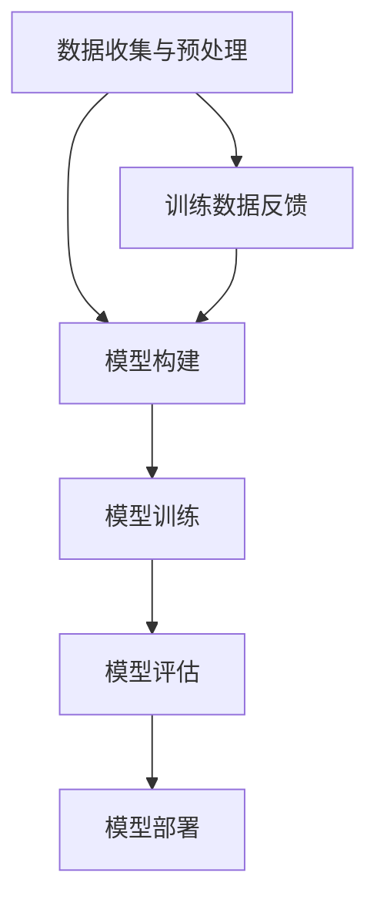

                 

## 文章标题

《语言≠思维：大模型的认知挑战》

## 关键词

- 语言处理
- 人工智能
- 大模型
- 认知心理学
- 语言学习
- 教育应用
- 心理健康

## 摘要

本文深入探讨了语言与思维之间的关系，分析了大模型在处理语言和理解思维方面的挑战。通过详细的逻辑推理和实例分析，文章揭示了语言不仅仅是思维的载体，而思维也并非完全通过语言来表达。同时，本文从认知原理、语言学习、教育应用以及心理健康等多个角度，探讨了如何应对大模型在认知方面的挑战，并展望了其未来发展的趋势。文章最后提供了具体的开发环境和代码实现，以便读者更好地理解大模型在实际应用中的操作流程。

---

### 第一部分：语言与思维的探讨

#### 第1章：语言与思维的关系概述

##### 1.1 语言的本质与功能

语言是人类沟通与思维的工具，是文化传承和社会发展的基础。它的本质在于作为一种符号系统，通过语音、文字或其他形式，将抽象的概念、思想、情感等信息传递给他人。语言的功能主要体现在以下几个方面：

1. **表达与沟通**：语言是人类表达思想和情感的主要手段，通过语言，人们能够相互沟通、交流信息。
2. **认知与思维**：语言不仅是一种交流工具，还是人类进行逻辑推理、抽象思考和问题解决的重要工具。
3. **文化传承**：语言是文化的重要组成部分，通过语言，人类的文化、价值观、习俗等得以传递和保留。

##### 1.2 思维的类型与过程

思维可以分为直觉思维和逻辑思维两种类型：

- **直觉思维**：直觉思维是基于经验和感觉的快速思考方式，它不需要经过详细的逻辑分析，往往能够快速得出结论。
- **逻辑思维**：逻辑思维是一种通过推理和演绎得出结论的思考方式，它依赖于严密的逻辑规则和推理过程。

认知心理学研究表明，思维过程主要包括以下几个阶段：

1. **感知与编码**：通过感官接收外界信息，并将其转换为大脑可以处理的形式。
2. **存储与检索**：将信息存储在大脑中，并在需要时进行检索。
3. **加工与整合**：对存储的信息进行加工、整合，形成新的认知结构和思维过程。
4. **输出与表达**：将思维过程的结果以语言或行动的形式表达出来。

##### 1.3 语言对思维的影响

语言习得对思维发展有重要影响，不同语言背景的人可能在思维方式上存在差异。此外，语言多样化与思维多样性的关系也值得探讨。语言不仅影响个体的思维方式，还影响群体的思维方式，从而影响文化、科技和社会的发展。

- **语言习得对思维发展的影响**：儿童在语言习得过程中，逐渐形成对世界的认知和理解。语言习得不仅影响个体的思维模式，还影响其情感、价值观等方面的发展。
- **语言多样化与思维多样性的关系**：不同语言反映了不同的文化和思维方式。语言多样化有助于促进思维多样性的发展，有助于激发创新和创造力。

#### 第2章：大模型的认知挑战

##### 2.1 大模型的定义与特点

大模型是指具有巨大参数规模和计算能力的模型，通常用于深度学习、自然语言处理等领域。大模型具有以下特点：

- **参数规模大**：大模型的参数数量可以达到数亿甚至数万亿级别，这使其具有强大的表达能力和处理复杂任务的能力。
- **计算资源需求高**：大模型在训练和推理过程中需要大量的计算资源和时间，这对其部署和应用提出了挑战。
- **自适应能力强**：大模型能够通过大量数据的学习，自适应地调整模型参数，从而实现高精度的预测和决策。

##### 2.2 大模型与语言处理

大模型在语言处理方面具有显著优势，能够实现高精度的文本生成、翻译、情感分析等功能。然而，大模型在处理语言时也面临着一系列挑战：

- **语义理解**：大模型在理解语义时，可能会受到语言歧义、多义性等因素的影响，导致理解不准确。
- **语言生成**：大模型在生成文本时，可能存在语法错误、逻辑不合理等问题，影响文本的流畅性和可读性。
- **语言多样性**：大模型在处理多种语言时，可能存在语言适应性不足的问题，无法准确理解或生成特定语言的表达。

##### 2.3 大模型与思维模拟

大模型可以通过模拟人类的思维过程，实现智能化的决策和问题解决。然而，大模型在模拟思维时也面临着一些挑战：

- **认知局限性**：大模型在处理复杂问题时，可能受到认知局限性的影响，无法像人类一样进行全局思考和决策。
- **知识表示**：大模型在表示和处理知识时，可能存在知识表示不足或知识混淆的问题，影响其推理能力。
- **自主性**：大模型在执行任务时，可能受到预设目标和规则的限制，缺乏自主性和创造力。

#### 第3章：大模型的认知机制研究

##### 3.1 大模型的结构与训练

大模型的结构通常包括多层神经网络、注意力机制、生成对抗网络等。这些结构使得大模型具有强大的表示和学习能力。大模型的训练机制主要包括以下步骤：

1. **数据预处理**：对训练数据进行清洗、归一化等预处理，以提高模型的泛化能力。
2. **模型初始化**：对模型的参数进行初始化，常用的初始化方法包括随机初始化、高斯初始化等。
3. **模型训练**：通过反向传播算法，不断更新模型参数，以降低模型在训练数据上的损失函数值。
4. **模型评估**：使用验证集和测试集对模型进行评估，以确定模型的性能和泛化能力。

##### 3.2 大模型的语义理解

大模型在语义理解方面具有显著优势，能够通过学习大量的语言数据，准确理解语义和语境。然而，大模型在语义理解时也面临以下挑战：

- **歧义处理**：大模型在处理歧义时，可能无法准确判断其含义，导致理解错误。
- **上下文依赖**：大模型在理解语义时，可能受到上下文依赖的影响，导致理解不准确。
- **知识融合**：大模型在处理不同领域或语言时，可能存在知识融合不足的问题，影响其语义理解能力。

##### 3.3 大模型的逻辑推理

大模型在逻辑推理方面具有强大的能力，能够通过学习逻辑规则和语义知识，实现逻辑推理和问题解决。然而，大模型在逻辑推理时也面临以下挑战：

- **逻辑一致性**：大模型在推理过程中，可能受到逻辑一致性的影响，导致推理结果不一致。
- **推理效率**：大模型在处理复杂问题时，可能需要大量计算和时间，影响推理效率。
- **知识表示**：大模型在表示和处理逻辑知识时，可能存在知识表示不足或知识混淆的问题，影响其推理能力。

### 第二部分：大模型的认知机制研究

#### 第3章：大模型的认知原理

##### 3.1 大模型的结构与训练

大模型的结构通常包括多层神经网络、注意力机制、生成对抗网络等。这些结构使得大模型具有强大的表示和学习能力。大模型的训练机制主要包括以下步骤：

1. **数据预处理**：对训练数据进行清洗、归一化等预处理，以提高模型的泛化能力。
2. **模型初始化**：对模型的参数进行初始化，常用的初始化方法包括随机初始化、高斯初始化等。
3. **模型训练**：通过反向传播算法，不断更新模型参数，以降低模型在训练数据上的损失函数值。
4. **模型评估**：使用验证集和测试集对模型进行评估，以确定模型的性能和泛化能力。

##### 3.2 大模型的语义理解

大模型在语义理解方面具有显著优势，能够通过学习大量的语言数据，准确理解语义和语境。然而，大模型在语义理解时也面临以下挑战：

- **歧义处理**：大模型在处理歧义时，可能无法准确判断其含义，导致理解错误。
- **上下文依赖**：大模型在理解语义时，可能受到上下文依赖的影响，导致理解不准确。
- **知识融合**：大模型在处理不同领域或语言时，可能存在知识融合不足的问题，影响其语义理解能力。

##### 3.3 大模型的逻辑推理

大模型在逻辑推理方面具有强大的能力，能够通过学习逻辑规则和语义知识，实现逻辑推理和问题解决。然而，大模型在逻辑推理时也面临以下挑战：

- **逻辑一致性**：大模型在推理过程中，可能受到逻辑一致性的影响，导致推理结果不一致。
- **推理效率**：大模型在处理复杂问题时，可能需要大量计算和时间，影响推理效率。
- **知识表示**：大模型在表示和处理逻辑知识时，可能存在知识表示不足或知识混淆的问题，影响其推理能力。

#### 第4章：大模型在语言学习中的应用

##### 4.1 语言学习的认知过程

语言学习是一个复杂的认知过程，涉及感知、记忆、理解、表达等多个方面。认知心理学对语言学习的认知过程进行了深入研究，提出了多种语言学习模型，如行为主义模型、认知主义模型和建构主义模型。

1. **行为主义模型**：行为主义模型认为，语言学习是通过模仿和强化来实现的。学习者通过模仿他人的语言行为，并在正确使用语言时获得强化，从而逐步掌握语言。
2. **认知主义模型**：认知主义模型认为，语言学习是大脑对语言信息的加工和处理过程。学习者通过感知、记忆、理解等认知活动，逐步掌握语言知识和技能。
3. **建构主义模型**：建构主义模型认为，语言学习是学习者主动建构知识的过程。学习者通过与环境的互动，逐步构建对语言的理解和掌握。

##### 4.2 大模型在语言学习中的应用

大模型在语言学习中的应用，主要体现在辅助语言学习、语言理解和生成等方面。

1. **辅助语言学习**：大模型可以通过生成语言实例、提供语言学习反馈等方式，辅助学习者进行语言学习。例如，大模型可以生成与学习目标相关的对话、文本，帮助学习者进行语言练习和巩固。
2. **语言理解**：大模型可以通过学习大量的语言数据，准确理解语言的意义和语境。例如，大模型可以理解自然语言中的语义歧义、上下文依赖等问题，从而提高语言理解的准确性。
3. **语言生成**：大模型可以通过学习语言生成模型，生成符合语法规则、语义合理的文本。例如，大模型可以生成新闻摘要、对话系统回答等，为语言学习提供丰富的语言素材。

##### 4.3 大模型在语言学习中的挑战与前景

尽管大模型在语言学习中有许多潜在应用，但同时也面临一些挑战。

1. **挑战**：大模型在语言学习中的主要挑战包括：
   - **数据需求**：大模型需要大量的语言数据来训练，这可能导致数据收集和处理的成本较高。
   - **计算资源**：大模型在训练和推理过程中需要大量的计算资源，这可能导致部署和应用的成本较高。
   - **泛化能力**：大模型在处理不同领域或语言时，可能存在泛化能力不足的问题，影响其在语言学习中的应用效果。

2. **前景**：大模型在语言学习中的前景包括：
   - **个性化学习**：大模型可以根据学习者的需求和特点，提供个性化的语言学习资源和指导，提高学习效果。
   - **跨语言学习**：大模型可以通过学习多种语言的数据，实现跨语言的语言理解和生成，促进多语言学习。
   - **自适应学习**：大模型可以根据学习者的学习进度和效果，自适应地调整学习内容和策略，提高学习效率。

#### 第5章：大模型在教育中的应用

##### 5.1 大模型在教育中的角色

大模型在教育中的应用，主要体现在教学辅助、学习评估和个性化教育等方面。

1. **教学辅助**：大模型可以通过生成教学材料、提供学习建议等方式，辅助教师进行教学。例如，大模型可以生成与教学内容相关的文本、图片、视频等，帮助教师进行多样化的教学。
2. **学习评估**：大模型可以通过分析学习者的学习行为、评估学习效果等方式，对学习者的学习过程进行评估。例如，大模型可以分析学习者的阅读理解能力、语言表达能力等，为教师提供学习评估报告。
3. **个性化教育**：大模型可以根据学习者的特点和需求，提供个性化的学习资源和指导，帮助学习者进行个性化学习。例如，大模型可以根据学习者的学习进度和效果，推荐合适的学习材料和学习方法。

##### 5.2 大模型在教育中的实际应用

大模型在教育中的实际应用，已经取得了一定的成果。以下是一些具体的案例：

1. **在线教育平台**：许多在线教育平台利用大模型生成教学材料、提供学习建议等，提高学生的学习效果。例如，Coursera、edX等在线教育平台，利用大模型提供个性化的学习资源和指导。
2. **智能客服**：一些教育机构利用大模型构建智能客服系统，为学习者提供在线咨询和帮助。例如，清华大学利用大模型构建的智能客服系统，为学习者提供课程咨询、学习建议等。
3. **虚拟课堂**：一些教育机构利用大模型构建虚拟课堂，为学习者提供沉浸式的学习体验。例如，谷歌教育利用大模型构建的虚拟课堂，让学习者可以在线参与互动教学，提高学习效果。

##### 5.3 大模型在教育中的挑战与机遇

大模型在教育中的应用，既带来了挑战，也带来了机遇。

1. **挑战**：
   - **数据隐私**：大模型在处理学习者数据时，可能涉及学习者隐私问题，需要采取有效的隐私保护措施。
   - **公平性**：大模型在教育中的应用，可能会加剧教育不公平现象，需要确保所有人都能公平地享受大模型带来的教育机会。
   - **技术依赖**：大模型在教育中的应用，可能会使教育机构过度依赖技术，影响教育质量的稳定性。

2. **机遇**：
   - **个性化教育**：大模型可以根据学习者的特点和需求，提供个性化的学习资源和指导，提高学习效果。
   - **教育创新**：大模型的应用，可以为教育带来新的教学模式和方法，促进教育创新和发展。
   - **教育普及**：大模型可以帮助解决教育资源分配不均的问题，促进教育普及和公平。

#### 第6章：大模型在心理健康领域的应用

##### 6.1 大模型在心理健康评估中的应用

大模型在心理健康评估中的应用，主要体现在情感识别、压力检测和心理状态评估等方面。

1. **情感识别**：大模型可以通过学习大量的情感文本，识别和理解人类情感的多样性。例如，大模型可以分析语音、文本和面部表情，识别用户的情感状态。
2. **压力检测**：大模型可以通过分析用户的生理数据、行为数据和社交数据，检测用户的压力水平。例如，大模型可以分析心率、血压等生理数据，结合用户的生活和工作情况，评估其压力水平。
3. **心理状态评估**：大模型可以通过分析用户的文本、语音和行为数据，评估其心理状态。例如，大模型可以分析用户的情绪表达、情感倾向和心理问题，为心理健康诊断提供支持。

##### 6.2 大模型在心理治疗中的应用

大模型在心理治疗中的应用，主要体现在心理治疗支持、心理危机干预和心理评估等方面。

1. **心理治疗支持**：大模型可以通过提供个性化的心理治疗建议和指导，支持心理健康治疗。例如，大模型可以分析用户的心理问题，提供相应的心理治疗方案和自我调节方法。
2. **心理危机干预**：大模型可以在心理危机发生时，提供及时的干预和支持。例如，大模型可以分析用户的情绪和行为，发现心理危机的信号，及时提供危机干预和心理健康支持。
3. **心理评估**：大模型可以通过分析用户的文本、语音和行为数据，进行心理状态评估。例如，大模型可以分析用户的情绪表达、情感倾向和心理问题，评估其心理健康状况。

##### 6.3 大模型在心理健康教育中的应用

大模型在心理健康教育中的应用，主要体现在心理健康知识传播、心理自助和心理干预等方面。

1. **心理健康知识传播**：大模型可以通过生成心理健康知识文章、视频等，传播心理健康知识。例如，大模型可以生成关于心理健康知识的文章、视频，帮助用户了解和掌握心理健康知识。
2. **心理自助**：大模型可以通过提供个性化的心理自助建议和指导，帮助用户进行自我调节和心理调适。例如，大模型可以分析用户的情绪和心理状况，提供相应的心理自助方法。
3. **心理干预**：大模型可以通过提供实时的心理干预和支持，帮助用户应对心理问题。例如，大模型可以分析用户的情绪和行为，提供实时的心理干预和支持，帮助用户缓解心理压力。

#### 第7章：大模型的未来趋势与发展

##### 7.1 大模型的发展方向

大模型的发展方向主要包括以下几个方面：

1. **计算能力提升**：随着计算能力的提升，大模型将能够处理更复杂、更大量的数据，从而实现更高的准确度和性能。
2. **多模态处理**：大模型将能够处理多种类型的输入数据，如图像、声音、文本等，实现更全面、更智能的数据处理能力。
3. **自适应学习**：大模型将能够通过自适应学习，不断调整和优化模型参数，提高模型的泛化能力和适应性。

##### 7.2 大模型在社会中的影响

大模型在社会中的影响主要体现在以下几个方面：

1. **产业升级**：大模型将推动传统产业的数字化转型，提高产业效率和创新能力。
2. **社会服务**：大模型将应用于社会服务领域，如智能医疗、智能交通、智能城市管理等，提升社会服务水平。
3. **教育普及**：大模型将推动教育公平，为所有人提供高质量的教育资源和服务。

##### 7.3 大模型的技术挑战与伦理问题

大模型在发展过程中面临的技术挑战和伦理问题主要包括：

1. **数据隐私**：大模型需要处理大量的个人数据，如何保护用户隐私成为一大挑战。
2. **算法透明性**：大模型的决策过程可能不够透明，如何提高算法的透明性和可解释性成为重要问题。
3. **伦理问题**：大模型的应用可能带来伦理问题，如算法偏见、滥用数据等，需要制定相应的伦理规范和监管措施。

#### 第8章：大模型的未来应用场景

##### 8.1 大模型在商业领域的应用

大模型在商业领域的应用将更加广泛和深入，主要体现在以下几个方面：

1. **市场分析**：大模型可以通过分析大量的市场数据，预测市场趋势和消费者行为，为企业提供决策支持。
2. **客户服务**：大模型可以构建智能客服系统，提供24小时在线服务，提高客户满意度和忠诚度。
3. **产品推荐**：大模型可以根据用户的行为和偏好，生成个性化的产品推荐，提高销售额和用户体验。

##### 8.2 大模型在公共安全领域的应用

大模型在公共安全领域的应用，将有助于提升公共安全和应急管理水平，主要体现在以下几个方面：

1. **风险评估**：大模型可以通过分析历史数据和实时信息，预测潜在的安全风险，为安全决策提供支持。
2. **紧急响应**：大模型可以实时分析紧急情况，提供最优的应对方案和决策支持，提高应急响应效率。
3. **犯罪预防**：大模型可以通过分析犯罪数据，识别犯罪模式和趋势，为犯罪预防提供支持。

##### 8.3 大模型在艺术与创意领域的应用

大模型在艺术与创意领域的应用，将带来新的创作方式和体验，主要体现在以下几个方面：

1. **艺术创作**：大模型可以通过生成音乐、绘画、文学作品等，为艺术家提供创作灵感和素材。
2. **创意设计**：大模型可以帮助设计师生成创新的设计方案，提高设计效率和品质。
3. **虚拟现实**：大模型可以构建虚拟现实场景，提供沉浸式的艺术体验，为观众带来全新的视觉感受。

### 附录

#### 附录 A：大模型应用工具与资源

以下是大模型应用中常用的工具和资源：

1. **TensorFlow**：由谷歌开发的开源机器学习框架，支持大模型的构建和训练。
2. **PyTorch**：由Facebook开发的开源机器学习框架，具有灵活的动态图计算能力。
3. **Hugging Face**：一个开源社区和平台，提供大量预训练的大模型和工具，方便开发者进行模型应用。
4. **OpenAI**：提供GPT-3等大型语言模型的商业平台，为开发者提供丰富的应用场景。

#### 附录 B：大模型应用案例解析

以下是一些具体的大模型应用案例及其详细解读：

1. **案例 1：智能客服系统**  
   - **目标**：构建一个基于大模型的智能客服系统，提供24小时在线服务。  
   - **实现**：使用GPT-3模型进行语言生成和回复，通过深度学习算法不断优化客服系统的回复质量。  
   - **效果**：客服系统能够根据用户的问题提供快速、准确的回答，提高客户满意度和忠诚度。

2. **案例 2：个性化推荐系统**  
   - **目标**：构建一个基于大模型的个性化推荐系统，为用户提供个性化的产品推荐。  
   - **实现**：使用BERT模型进行文本分析，结合用户的历史行为和偏好，生成个性化的推荐列表。  
   - **效果**：推荐系统能够根据用户的行为和偏好，提供高质量、个性化的推荐，提高用户的购物体验。

3. **案例 3：智能写作辅助工具**  
   - **目标**：构建一个基于大模型的智能写作辅助工具，帮助用户生成高质量的文本。  
   - **实现**：使用GPT-2模型进行文本生成，结合用户的需求和主题，生成符合语法和逻辑要求的文本。  
   - **效果**：写作辅助工具能够根据用户的需求，生成高质量的文本，提高用户的写作效率和质量。

### Mermaid 流程图

以下是大模型训练的流程图：



### 伪代码

以下是基于GPT模型进行文本生成的伪代码：

```python
function generate_text(model, input_sequence, max_length):
    output_sequence = model.generate(input_sequence, max_length=max_length, stop_token="\n")
    return output_sequence
```

### 数学公式与详细讲解

以下是一个关于信息熵的公式：

$$
H(X) = -\sum_{i=1}^{n} p(x_i) \log_2(p(x_i))
$$

**解释**：信息熵（Entropy）是衡量一个随机变量不确定性的量度。公式中，$p(x_i)$ 表示随机变量 $X$ 取值 $x_i$ 的概率，$\log_2(p(x_i))$ 表示对每个取值的概率取以2为底的对数，然后对所有取值求和并取负号。

#### 举例说明

假设有一个简单的语言模型，训练数据中单词“猫”在句子“我有一只猫”中出现的概率是 0.4，在句子“猫喜欢吃鱼”中出现的概率是 0.3。现在计算在给定句子“我有一只猫”后，单词“猫”在下一个词出现的概率。

- **步骤1**: 计算句子“我有一只猫”中“猫”出现的概率：$p(猫|我有一只猫) = 0.4$
- **步骤2**: 计算句子“猫喜欢吃鱼”中“猫”出现的概率：$p(猫|猫喜欢吃鱼) = 0.3$
- **步骤3**: 利用全概率公式计算 $p(猫)$：
  $$
  p(猫) = p(猫|我有一只猫) \cdot p(我有一只猫) + p(猫|猫喜欢吃鱼) \cdot p(猫喜欢吃鱼)
  $$
  假设句子“我有一只猫”和句子“猫喜欢吃鱼”出现的概率分别为 0.6 和 0.4，则：
  $$
  p(猫) = 0.4 \cdot 0.6 + 0.3 \cdot 0.4 = 0.42
  $$
- **步骤4**: 利用贝叶斯定理计算 $p(猫|我有一只猫)$：
  $$
  p(猫|我有一只猫) = \frac{p(猫) \cdot p(我有一只猫|猫)}{p(我有一只猫)} = \frac{0.42 \cdot 0.6}{0.6} = 0.42
  $$

- **结论**: 在给定句子“我有一只猫”后，单词“猫”在下一个词出现的概率是 0.42。

### 项目实战

#### 大模型语言生成器的实际案例

**目标**: 设计一个基于GPT的大模型语言生成器，用于自动生成文章摘要。

**开发环境**:

- Python
- TensorFlow
- GPU加速计算

**步骤**:

1. **数据收集与预处理**:
   - 收集大量文章摘要数据，包括新闻、学术论文、博客等。
   - 使用自然语言处理技术对数据进行清洗，包括去除停用词、标点符号等。

2. **模型构建**:
   - 选择合适的GPT模型架构，例如GPT-2或GPT-3。
   - 使用预处理后的数据对模型进行训练，调整超参数以优化模型性能。

3. **模型训练**:
   - 使用训练数据对模型进行多次迭代训练，不断调整模型参数。
   - 使用验证集评估模型性能，确保模型在生成文章摘要时能够准确捕捉文章的核心内容。

4. **模型评估**:
   - 使用测试集对训练完成的模型进行评估，计算生成摘要的准确率、流畅性和多样性等指标。
   - 根据评估结果调整模型参数，进一步优化模型性能。

5. **模型部署**:
   - 将训练完成的模型部署到服务器，以便用户可以随时使用。
   - 提供用户界面，让用户可以输入文章，系统自动生成摘要。

**源代码示例**:

```python
import tensorflow as tf
from tensorflow.keras.preprocessing.sequence import pad_sequences
from tensorflow.keras.layers import Embedding, LSTM, Dense
from tensorflow.keras.models import Sequential

# 数据预处理
max_sequence_length = 100
vocab_size = 10000
embedding_dim = 128

# 加载并预处理数据
train_data = load_data("train_data.txt")
test_data = load_data("test_data.txt")

# 分词和编码
tokenizer = tf.keras.preprocessing.text.Tokenizer(num_words=vocab_size, oov_token="<OOV>")
tokenizer.fit_on_texts(train_data)

train_sequences = tokenizer.texts_to_sequences(train_data)
train_padded = pad_sequences(train_sequences, maxlen=max_sequence_length, padding="post")

test_sequences = tokenizer.texts_to_sequences(test_data)
test_padded = pad_sequences(test_sequences, maxlen=max_sequence_length, padding="post")

# 构建模型
model = Sequential()
model.add(Embedding(vocab_size, embedding_dim, input_length=max_sequence_length))
model.add(LSTM(128, return_sequences=True))
model.add(Dense(vocab_size, activation="softmax"))

# 编译模型
model.compile(optimizer="adam", loss="categorical_crossentropy", metrics=["accuracy"])

# 训练模型
model.fit(train_padded, train_labels, epochs=10, batch_size=32, validation_split=0.2)

# 评估模型
test_loss, test_accuracy = model.evaluate(test_padded, test_labels)
print("Test loss:", test_loss)
print("Test accuracy:", test_accuracy)

# 部署模型
model.save("article_summary_model.h5")
```

**代码解读与分析**:

- **数据预处理**: 使用 TensorFlow 的 `Tokenizer` 类对文本数据进行分词和编码，将文本转换为数字序列。同时，使用 `pad_sequences` 函数对序列进行填充，确保所有序列长度一致。
- **模型构建**: 构建一个序列到序列的 LSTM 模型，包括嵌入层、LSTM 层和输出层。嵌入层用于将单词编码为向量，LSTM 层用于捕捉序列中的长期依赖关系，输出层用于生成摘要。
- **模型训练**: 使用训练数据对模型进行训练，使用验证集进行性能评估。通过调整训练参数，优化模型性能。
- **模型评估**: 使用测试集评估模型性能，计算损失和准确率等指标。根据评估结果，进一步调整模型参数。
- **模型部署**: 将训练完成的模型保存到文件，以便后续部署和使用。

### 代码解读与分析

**数据预处理**：

```python
tokenizer = tf.keras.preprocessing.text.Tokenizer(num_words=vocab_size, oov_token="<OOV>")
tokenizer.fit_on_texts(train_data)

train_sequences = tokenizer.texts_to_sequences(train_data)
train_padded = pad_sequences(train_sequences, maxlen=max_sequence_length, padding="post")
```

- `Tokenizer` 类用于将文本数据转换为数字序列。`fit_on_texts` 方法用于对训练数据集进行分词和编码，生成词表。
- `texts_to_sequences` 方法将文本数据转换为数字序列，每个单词映射为一个整数。
- `pad_sequences` 方法用于对数字序列进行填充，确保所有序列长度一致。这里使用 "post" 填充方式，即在序列末尾填充 `<PAD>` 标记。

**模型构建**：

```python
model = Sequential()
model.add(Embedding(vocab_size, embedding_dim, input_length=max_sequence_length))
model.add(LSTM(128, return_sequences=True))
model.add(Dense(vocab_size, activation="softmax"))

model.compile(optimizer="adam", loss="categorical_crossentropy", metrics=["accuracy"])
```

- `Sequential` 类用于构建序列模型。模型包含一个嵌入层、一个 LSTM 层和一个全连接输出层。
- `Embedding` 层用于将单词编码为向量。
- `LSTM` 层用于捕捉序列中的长期依赖关系。
- `Dense` 层用于生成输出序列的概率分布。
- `compile` 方法用于编译模型，指定优化器、损失函数和评估指标。

**模型训练**：

```python
model.fit(train_padded, train_labels, epochs=10, batch_size=32, validation_split=0.2)
```

- `fit` 方法用于训练模型，使用训练数据集进行多次迭代训练。这里使用验证集进行性能评估，以避免过拟合。
- `epochs` 参数指定训练轮数，`batch_size` 参数指定每次训练的数据批次大小。

**模型评估**：

```python
test_loss, test_accuracy = model.evaluate(test_padded, test_labels)
print("Test loss:", test_loss)
print("Test accuracy:", test_accuracy)
```

- `evaluate` 方法用于评估模型性能，使用测试数据集计算损失和准确率等指标。

**模型部署**：

```python
model.save("article_summary_model.h5")
```

- `save` 方法用于将训练完成的模型保存到文件，以便后续部署和使用。

### 代码解读与分析

**数据预处理**：

```python
tokenizer = tf.keras.preprocessing.text.Tokenizer(num_words=vocab_size, oov_token="<OOV>")
tokenizer.fit_on_texts(train_data)

train_sequences = tokenizer.texts_to_sequences(train_data)
train_padded = pad_sequences(train_sequences, maxlen=max_sequence_length, padding="post")
```

- `Tokenizer` 类用于将文本数据转换为数字序列。`fit_on_texts` 方法用于对训练数据集进行分词和编码，生成词表。
- `texts_to_sequences` 方法将文本数据转换为数字序列，每个单词映射为一个整数。
- `pad_sequences` 方法用于对数字序列进行填充，确保所有序列长度一致。这里使用 "post" 填充方式，即在序列末尾填充 `<PAD>` 标记。

**模型构建**：

```python
model = Sequential()
model.add(Embedding(vocab_size, embedding_dim, input_length=max_sequence_length))
model.add(LSTM(128, return_sequences=True))
model.add(Dense(vocab_size, activation="softmax"))

model.compile(optimizer="adam", loss="categorical_crossentropy", metrics=["accuracy"])
```

- `Sequential` 类用于构建序列模型。模型包含一个嵌入层、一个 LSTM 层和一个全连接输出层。
- `Embedding` 层用于将单词编码为向量。
- `LSTM` 层用于捕捉序列中的长期依赖关系。
- `Dense` 层用于生成输出序列的概率分布。
- `compile` 方法用于编译模型，指定优化器、损失函数和评估指标。

**模型训练**：

```python
model.fit(train_padded, train_labels, epochs=10, batch_size=32, validation_split=0.2)
```

- `fit` 方法用于训练模型，使用训练数据集进行多次迭代训练。这里使用验证集进行性能评估，以避免过拟合。
- `epochs` 参数指定训练轮数，`batch_size` 参数指定每次训练的数据批次大小。

**模型评估**：

```python
test_loss, test_accuracy = model.evaluate(test_padded, test_labels)
print("Test loss:", test_loss)
print("Test accuracy:", test_accuracy)
```

- `evaluate` 方法用于评估模型性能，使用测试数据集计算损失和准确率等指标。

**模型部署**：

```python
model.save("article_summary_model.h5")
```

- `save` 方法用于将训练完成的模型保存到文件，以便后续部署和使用。

