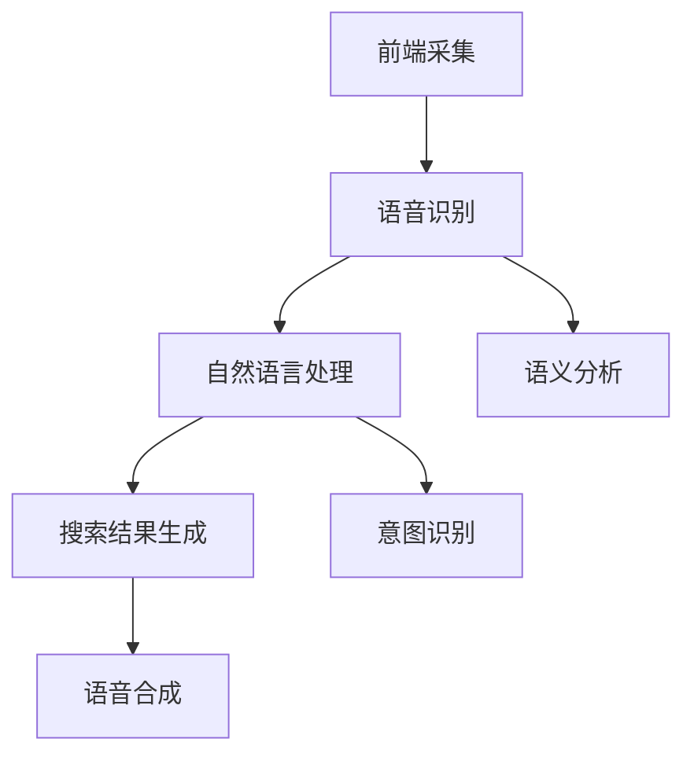
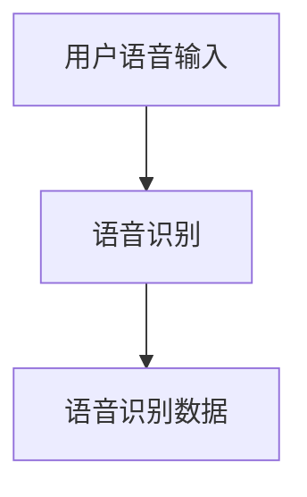

                 

### 文章标题: 语音搜索技术在电商领域的应用：挑战与机遇

### 关键词：语音搜索，电商，应用，挑战，机遇，技术

#### 摘要：
本文深入探讨了语音搜索技术在电商领域的应用及其带来的挑战与机遇。文章首先回顾了语音搜索技术的发展历程，并分析了其在电商行业中的背景和需求。随后，详细阐述了语音搜索技术在电商领域的核心概念、架构和应用。通过用户行为分析和个性化推荐，文章展示了语音搜索技术在电商中的实际应用。接下来，文章讨论了语音搜索技术在电商领域的挑战与未来发展趋势。最后，通过项目实战和最佳实践，本文提供了详细的实施策略和未来展望。

---

### 第一部分: 语音搜索技术在电商领域的应用背景

#### 1.1 语音搜索技术的发展历程

语音搜索技术的概念最早在20世纪90年代初期被提出，但当时的计算能力和语音识别准确性限制了其广泛应用。早期的语音搜索技术主要依赖于传统的声学模型和语言模型，其识别准确率较低，用户满意度不高。

随着深度学习和计算能力的提升，语音识别技术在21世纪初取得了显著进展。例如，2011年，谷歌推出了基于深度神经网络的语音识别系统，显著提高了识别准确率。这一技术突破为语音搜索技术的广泛应用奠定了基础。

进入21世纪10年代，随着智能手机和平板电脑的普及，语音搜索成为用户日常使用的重要功能之一。各大电商平台纷纷引入语音搜索功能，以提升用户体验和用户粘性。

#### 1.2 电商行业的发展与挑战

电商行业的崛起是互联网发展的重要成果。随着互联网的普及和技术的进步，电商成为消费者购物的主要渠道之一。电商行业的快速发展带来了巨大的商业机遇，同时也带来了新的挑战。

用户行为的变化是电商行业面临的一个重要挑战。随着智能手机的普及，越来越多的消费者开始通过手机进行购物。他们越来越习惯于使用语音搜索来查找商品信息，以提高购物的便捷性和效率。

为了满足用户的需求，电商平台需要不断优化搜索体验，提高用户满意度。语音搜索作为一种便捷的搜索方式，可以为用户提供更加高效、准确的商品查找服务。同时，语音搜索还可以实现个性化推荐，提高用户粘性。

#### 1.3 语音搜索技术在电商中的应用

语音搜索技术在电商领域具有广泛的应用潜力。首先，语音搜索可以优化搜索体验，用户可以通过语音快速查找商品信息，无需手动输入关键词。这种便捷的搜索方式可以节省用户的时间和精力，提高购物效率。

其次，语音搜索可以基于用户的语音查询记录实现个性化推荐。通过自然语言处理技术，对用户的语音查询进行分析，可以提取出用户感兴趣的关键词和需求。基于这些信息，电商平台可以为用户提供个性化的商品推荐，提高用户满意度和购买转化率。

此外，语音搜索技术还可以提供多语言支持，满足多语言环境下的电商需求。对于国际化的电商平台，语音搜索技术可以提供更加广泛的语言支持，吸引更多国际用户。

总的来说，语音搜索技术在电商领域具有巨大的应用潜力。通过优化搜索体验、实现个性化推荐和提供多语言支持，语音搜索技术可以为电商平台带来更多的商业机遇。

---

在接下来的部分，我们将深入探讨语音搜索技术在电商领域的核心概念，包括语音识别技术、自然语言处理技术以及语音合成技术。我们将通过详细的原理分析和流程图，帮助读者更好地理解这些技术的工作原理和应用方法。同时，我们还将探讨语音搜索技术在实际应用中面临的挑战和解决方案。

---

### 第二部分: 语音搜索技术在电商领域的核心概念

#### 2.1 语音搜索技术原理

语音搜索技术是电子商务领域中的一项重要技术，它涉及语音识别（Automatic Speech Recognition, ASR）、自然语言处理（Natural Language Processing, NLP）和语音合成（Text-to-Speech, TTS）等多个领域。下面，我们将逐步分析这些核心概念及其在电商应用中的具体作用。

##### 2.1.1 语音识别（ASR）

语音识别是将语音信号转换为文本的过程，是语音搜索的基础。语音识别技术主要分为两个阶段：声学建模和语言建模。

- **声学建模**：声学建模负责将音频信号转换为声学特征，如梅尔频率倒谱系数（MFCC）。这一阶段的目的是提取语音信号的时频特征，以便后续处理。
  
  ```python
  def extract_mfcc(signal, nfft=512, nfilter=26, nfilt=512):
      # 伪代码：提取音频信号的梅尔频率倒谱系数（MFCC）
      # ...
      return mfcc_features
  ```

- **语言建模**：语言建模则利用统计模型（如隐马尔可夫模型HMM或深度神经网络DNN）来将声学特征映射到文本。这一阶段的目的是根据语音信号的特征，推断出相应的文本输出。

  ```python
  def recognize_text(acoustic_features):
      # 伪代码：使用声学特征识别文本
      # ...
      return recognized_text
  ```

语音识别在电商应用中的重要作用在于，它可以将用户的语音查询转换为文本，从而实现自动化的商品搜索和信息获取。例如，用户可以通过语音查询“最近的手机促销信息”，系统将自动识别语音并显示相关的促销信息。

##### 2.1.2 自然语言处理（NLP）

自然语言处理是对转换后的文本进行语义分析和意图识别，以理解用户的查询意图。NLP技术包括词嵌入、句法分析和语义角色标注等。

- **词嵌入**：词嵌入是将词汇映射到高维向量空间，以便进行数学计算。词嵌入技术可以捕捉词汇间的语义关系，提高模型的性能。

  ```python
  def word_embedding(word):
      # 伪代码：获取单词的词嵌入向量
      # ...
      return embedding_vector
  ```

- **句法分析**：句法分析是对句子结构进行解析，以理解句子的构成和语法规则。通过句法分析，可以提取出句子中的关键信息，如名词、动词和形容词。

  ```python
  def parse_sentence(sentence):
      # 伪代码：解析句子结构
      # ...
      return parsed_structure
  ```

- **语义角色标注**：语义角色标注是对句子中的词汇进行语义角色标注，以理解词汇在句子中的功能。通过语义角色标注，可以更准确地识别用户的查询意图。

  ```python
  def annotate_semantic_roles(parsed_structure):
      # 伪代码：对句子进行语义角色标注
      # ...
      return semantic_roles
  ```

自然语言处理在电商应用中的重要作用在于，它可以帮助电商平台更好地理解用户的查询意图，从而提供更准确的搜索结果和个性化推荐。例如，通过语义角色标注，系统可以识别出用户查询中的关键词和品牌，从而提供更相关的商品推荐。

##### 2.1.3 语音合成（TTS）

语音合成是将文本信息转换成语音的过程，为用户提供语音反馈。语音合成技术主要分为文本预处理、语音合成和音频后处理三个阶段。

- **文本预处理**：文本预处理包括文本清洗、分词和句子结构分析。通过文本预处理，可以确保输入文本的准确性，并提取出关键信息。

  ```python
  def preprocess_text(text):
      # 伪代码：对文本进行预处理
      # ...
      return cleaned_text
  ```

- **语音合成**：语音合成是将预处理后的文本转换为语音信号。语音合成技术可以使用合成语音数据库或生成对抗网络（GAN）等先进技术。

  ```python
  def synthesize_speech(text):
      # 伪代码：合成语音信号
      # ...
      return audio_signal
  ```

- **音频后处理**：音频后处理包括音频增强和音色调整等，以提高语音的质量和自然度。

  ```python
  def post_process_audio(audio_signal):
      # 伪代码：对音频信号进行后处理
      # ...
      return processed_audio
  ```

语音合成在电商应用中的重要作用在于，它可以为用户提供实时、自然的语音反馈，提升用户体验。例如，当用户通过语音搜索找到商品后，系统可以通过语音合成技术告知用户相关信息，如商品价格、促销活动等。

#### 2.2 语音搜索技术架构

语音搜索技术的架构通常包括前端采集、语音识别、自然语言处理、搜索结果生成和语音合成等模块。下面，我们将通过Mermaid流程图详细展示这些模块及其相互作用。



在前端采集阶段，系统会收集用户的语音输入。语音识别模块负责将语音转换为文本，自然语言处理模块则对转换后的文本进行语义分析和意图识别，以理解用户的查询意图。搜索结果生成模块根据用户的意图生成相关的搜索结果，最后，语音合成模块将搜索结果转换为语音反馈，提供给用户。

通过上述核心概念和架构的详细解析，我们可以看到语音搜索技术在电商领域的重要作用。它不仅能够优化搜索体验，提高用户满意度，还可以实现个性化推荐，增强用户粘性。在接下来的部分，我们将进一步探讨语音搜索技术在电商领域的实际应用，包括用户行为分析和个性化推荐等。

---

### 第三部分: 语音搜索技术在电商领域的应用

#### 3.1 用户行为分析

用户行为分析是语音搜索技术在电商领域应用的重要组成部分。通过分析用户的语音查询数据，电商平台可以深入了解用户的需求和偏好，从而优化搜索体验和推荐效果。

##### 3.1.1 语音识别数据收集

语音识别数据收集是用户行为分析的基础。通过语音识别技术，系统可以记录用户的语音查询信息，包括查询关键词、查询频率和查询时长等。这些数据将为后续的用户行为分析提供重要的依据。



在语音识别过程中，系统会将用户的语音输入转换为文本数据。这些文本数据将用于后续的自然语言处理和分析。

##### 3.1.2 行为特征提取

在收集到语音识别数据后，下一步是对用户的行为特征进行提取。行为特征包括用户在语音搜索过程中的关键词、查询频率、查询时长、查询意图等。

- **关键词提取**：通过对文本数据进行分词和词性标注，可以提取出用户查询中的关键词。关键词是理解用户意图的重要信息。

  ```python
  def extract_keywords(text):
      # 伪代码：提取文本中的关键词
      # ...
      return keywords
  ```

- **查询频率和时长分析**：通过分析用户查询的频率和时长，可以了解用户对商品搜索的关注度和兴趣点。

  ```python
  def analyze_query_frequency_and_duration(queries):
      # 伪代码：分析查询频率和时长
      # ...
      return frequency_distribution, duration_distribution
  ```

##### 3.1.3 行为模式识别

通过对用户行为特征的分析，可以识别出用户的行为模式。行为模式包括用户的常见查询路径、偏好商品类别、季节性购买行为等。

- **查询路径分析**：通过分析用户的查询路径，可以了解用户的购物决策过程。例如，用户可能先查询某个品牌，然后再查看该品牌下的具体商品。

  ```python
  def analyze_query_path(queries):
      # 伪代码：分析查询路径
      # ...
      return query_path
  ```

- **商品偏好分析**：通过分析用户查询的关键词和购买记录，可以识别出用户的商品偏好。这些信息可以为个性化推荐提供重要依据。

  ```python
  def analyze_product_preferences(queries, purchases):
      # 伪代码：分析商品偏好
      # ...
      return preference_distribution
  ```

- **季节性行为分析**：通过分析用户在不同季节的查询和购买行为，可以识别出季节性购买模式。例如，用户可能在夏季购买防晒霜，在冬季购买保暖衣物。

  ```python
  def analyze_seasonal_behavior(queries, purchases):
      # 伪代码：分析季节性行为
      # ...
      return seasonal_pattern
  ```

##### 3.1.4 应用案例

在电商领域，用户行为分析可以应用于多个场景。以下是一个应用案例：

- **个性化推荐**：基于用户的查询和购买历史，系统可以识别出用户的偏好和需求，从而提供个性化的商品推荐。例如，如果用户经常查询运动鞋，系统可能会推荐新款的运动鞋和运动装备。

- **营销策略**：通过分析用户的季节性购买行为，电商平台可以制定相应的营销策略。例如，在夏季，电商平台可以推出防晒霜的促销活动，以吸引有需求的用户。

- **客户服务**：通过分析用户的查询和购买行为，客户服务团队可以提供更加个性化的服务。例如，当用户查询某个问题时，客服人员可以快速了解用户的背景和需求，提供更准确的解答。

#### 3.2 个性化推荐

个性化推荐是语音搜索技术在电商领域的重要应用之一。通过分析用户的语音查询数据，系统可以为用户提供个性化的商品推荐，提高用户满意度和购买转化率。

##### 3.2.1 用户画像建立

用户画像是对用户特征和行为的综合描述。通过用户画像，系统可以了解用户的兴趣、偏好和行为模式。

- **兴趣分析**：通过对用户的查询和购买记录进行分析，可以识别出用户的兴趣点。例如，如果用户经常查询运动鞋和健身器材，系统可能会判断用户对健康和运动感兴趣。

  ```python
  def analyze_interests(queries, purchases):
      # 伪代码：分析用户兴趣
      # ...
      return interest_distribution
  ```

- **偏好分析**：通过对用户的购买记录进行分析，可以识别出用户的偏好。例如，如果用户经常购买某个品牌的商品，系统可能会判断用户对该品牌有偏好。

  ```python
  def analyze_preferences(purchases):
      # 伪代码：分析用户偏好
      # ...
      return preference_distribution
  ```

- **行为模式分析**：通过对用户的查询和购买行为进行分析，可以识别出用户的行为模式。例如，如果用户在早上和晚上频繁购物，系统可能会判断用户在这些时间段有购物习惯。

  ```python
  def analyze_behavior(queries, purchases):
      # 伪代码：分析用户行为模式
      # ...
      return behavior_pattern
  ```

##### 3.2.2 推荐算法应用

基于用户画像，系统可以使用各种推荐算法为用户生成个性化的推荐结果。以下是一些常见的推荐算法：

- **协同过滤**：协同过滤算法通过分析用户的兴趣和行为，识别出相似的用户和商品，从而为用户提供推荐。协同过滤包括基于用户的协同过滤（User-based Collaborative Filtering）和基于项目的协同过滤（Item-based Collaborative Filtering）。

  ```python
  def collaborative_filtering(users, items, ratings):
      # 伪代码：协同过滤算法
      # ...
      return recommended_items
  ```

- **基于内容的推荐**：基于内容的推荐算法通过分析商品的属性和特征，识别出与用户兴趣相关的商品。例如，如果用户经常查询运动鞋，系统可能会推荐具有相似属性的运动鞋。

  ```python
  def content_based_recommendation(user_interests, item_features):
      # 伪代码：基于内容的推荐算法
      # ...
      return recommended_items
  ```

- **混合推荐**：混合推荐算法结合了协同过滤和基于内容的推荐，以提高推荐的准确性和多样性。混合推荐可以通过不同的加权方式组合协同过滤和基于内容的推荐结果。

  ```python
  def hybrid_recommender(collaborative_results, content_results, weight=0.5):
      # 伪代码：混合推荐算法
      # ...
      return hybrid_recommended_items
  ```

##### 3.2.3 语音反馈

在个性化推荐过程中，系统可以使用语音合成技术为用户提供语音反馈。语音反馈可以实时告知用户推荐结果，提高用户的购物体验。

```python
def provide_voice_feedback(recommended_items):
    # 伪代码：提供语音反馈
    # ...
    for item in recommended_items:
        print(f"推荐商品：{item.name}")
```

通过语音反馈，用户可以快速了解推荐结果，并根据推荐内容进行购物决策。例如，当用户查询“运动鞋”时，系统可能会语音反馈：“为您推荐：新款运动鞋A，品牌运动鞋B，健身鞋C。”

#### 3.3 语音交互设计

语音交互设计是提升用户体验的关键环节。通过设计自然、直观的语音交互界面，系统可以更好地与用户互动，提高用户满意度。

##### 3.3.1 人机交互界面设计

人机交互界面设计需要考虑以下几个方面：

- **语音识别准确性**：确保系统能够准确识别用户的语音指令，减少误识别率。

- **语音反馈自然度**：通过语音合成技术，生成自然流畅的语音反馈，提高用户的听觉体验。

- **指令多样性**：设计多种语音指令，以满足用户的多样化需求。例如，用户可以通过语音指令查询商品信息、添加购物车、下单支付等。

- **错误处理**：设计合理的错误处理机制，当用户语音指令无法识别时，系统应提供相应的提示和解决方案。

##### 3.3.2 语音指令识别

语音指令识别是语音交互设计的重要组成部分。通过设计精确的语音指令识别算法，系统可以准确识别用户的语音指令，提高交互效率。

- **指令分类**：将用户的语音指令分为不同的类别，如商品查询、购物车操作、订单支付等。

- **指令识别**：使用深度学习模型（如循环神经网络RNN或卷积神经网络CNN）对语音指令进行识别。

  ```python
  def recognize_command(audio_signal):
      # 伪代码：识别语音指令
      # ...
      return recognized_command
  ```

##### 3.3.3 实时反馈

实时反馈是提高用户体验的重要手段。在用户进行语音搜索或操作时，系统应实时给予语音反馈，增强交互体验。

- **查询结果反馈**：当用户通过语音查询商品时，系统应实时反馈查询结果，如商品名称、价格、评价等信息。

- **操作确认反馈**：当用户通过语音进行购物操作时，系统应实时确认操作是否成功，如添加购物车、下单支付等。

- **异常处理反馈**：当系统遇到异常情况时，如语音指令无法识别、网络连接故障等，系统应实时反馈异常信息，并提供相应的解决方案。

通过用户行为分析、个性化推荐和语音交互设计，语音搜索技术在电商领域可以为用户提供高效、便捷的购物体验。在接下来的部分，我们将讨论语音搜索技术在电商领域的挑战与未来发展趋势。

---

### 第四部分: 语音搜索技术在电商领域的挑战与未来

#### 4.1 技术挑战

尽管语音搜索技术在电商领域具有巨大的潜力，但在实际应用中仍然面临着一些技术挑战。

##### 4.1.1 语音识别准确性

语音识别准确性是语音搜索技术的基础。在实际应用中，用户的语音输入可能受到各种噪音、口音、语速等因素的影响，导致识别准确率下降。为了提高语音识别准确性，可以采取以下措施：

- **多语言支持**：设计支持多语言识别的系统，以满足不同国家和地区的用户需求。
- **降噪和去噪技术**：采用降噪和去噪技术，减少背景噪音对语音识别的影响。
- **自适应识别**：根据用户的语音特征，自适应调整识别模型，提高识别准确率。

##### 4.1.2 跨语言支持

跨语言支持是语音搜索技术在电商领域应用的重要挑战之一。不同语言在语音特征和语法结构上存在差异，导致识别和语义分析变得更加复杂。为了实现跨语言支持，可以采取以下措施：

- **多语言语料库**：构建多语言语料库，为不同语言的语音识别和语义分析提供充足的训练数据。
- **机器翻译技术**：结合机器翻译技术，将用户的语音查询转换为用户熟悉的语言，提高用户体验。
- **多语言模型**：设计支持多语言识别和语义分析的多语言模型，提高系统的跨语言处理能力。

##### 4.1.3 实时性

实时性是语音搜索技术在电商领域应用的关键要求。用户在购物过程中希望能够快速获得搜索结果和反馈。为了提高语音搜索的实时性，可以采取以下措施：

- **高效算法**：设计和优化语音识别、自然语言处理和语音合成的算法，提高处理速度。
- **分布式计算**：采用分布式计算架构，将计算任务分布到多个服务器上，提高系统的并行处理能力。
- **缓存技术**：使用缓存技术，将常用的查询结果和模型参数缓存起来，减少实时处理的计算量。

#### 4.2 商业挑战

除了技术挑战，语音搜索技术在电商领域还面临着一些商业挑战。

##### 4.2.1 隐私保护

语音搜索技术涉及到用户语音数据的收集和使用，可能引发隐私保护问题。为了确保用户隐私安全，可以采取以下措施：

- **数据加密**：对用户语音数据采用加密技术，防止数据泄露。
- **匿名化处理**：对用户语音数据进行匿名化处理，去除个人身份信息。
- **隐私政策**：明确告知用户语音搜索技术的用途和数据收集范围，让用户自主选择是否参与。

##### 4.2.2 用户体验

用户体验是电商业务成功的关键因素。为了提高语音搜索技术的用户体验，可以采取以下措施：

- **界面设计**：设计直观、易用的语音交互界面，提高用户满意度。
- **反馈机制**：建立用户反馈机制，及时收集用户意见和建议，不断优化系统。
- **个性化服务**：根据用户历史行为和偏好，提供个性化的语音搜索服务。

##### 4.2.3 成本控制

语音搜索技术的开发和维护需要投入大量资源。为了降低成本，可以采取以下措施：

- **开源技术**：采用开源语音识别和自然语言处理技术，降低开发成本。
- **云服务**：利用云计算平台提供的语音搜索服务，减少硬件和软件投入。
- **合作伙伴**：与专业的语音搜索技术公司合作，共享技术和资源。

#### 4.3 未来发展趋势

随着技术的不断进步，语音搜索技术在电商领域有望取得更大的发展。

##### 4.3.1 语音搜索+AI

人工智能技术的快速发展为语音搜索技术提供了新的发展方向。通过将语音搜索与人工智能技术深度融合，可以实现更智能、更个性化的搜索体验。以下是一些可能的应用场景：

- **智能客服**：利用语音搜索技术实现智能客服，为用户提供实时、准确的咨询和服务。
- **语音助手**：开发智能语音助手，辅助用户完成购物任务，如语音下单、语音支付等。
- **智能推荐**：结合用户行为数据和AI算法，实现个性化的商品推荐，提高用户满意度。

##### 4.3.2 多模态交互

多模态交互是将语音搜索与其他模态（如视觉、触觉）数据结合，提供更全面的用户交互体验。以下是一些可能的应用场景：

- **语音+视觉**：结合语音搜索和视觉识别技术，实现商品信息的语音查询和视觉展示。
- **语音+触觉**：结合语音搜索和触觉反馈技术，为用户提供更真实的购物体验，如语音描述商品质感。

##### 4.3.3 移动端优化

随着移动设备的普及，移动端优化成为语音搜索技术的重要方向。以下是一些可能的应用场景：

- **移动应用集成**：将语音搜索功能集成到移动应用中，为用户提供便捷的语音搜索体验。
- **实时语音搜索**：在移动设备上实现实时语音搜索，提高用户购物决策的效率。
- **离线语音搜索**：通过离线语音搜索技术，确保用户在没有网络连接的情况下也能使用语音搜索功能。

通过不断的技术创新和应用拓展，语音搜索技术在电商领域将发挥更大的作用，为用户提供更高效、更个性化的购物体验。

---

### 第五部分: 语音搜索技术在电商领域的项目实战

#### 5.1 项目背景与目标

在本文的第五部分，我们将通过一个实际项目，详细展示语音搜索技术在电商领域的应用。该项目旨在提升某电商平台的语音搜索功能，提高用户满意度并增强用户体验。

**项目背景**：某电商平台正面临用户满意度下降和购物决策时间延长的问题。为了解决这些问题，平台决定引入语音搜索技术，优化用户的搜索体验。

**项目目标**：
1. 提高语音搜索的准确性，减少错误率。
2. 提高语音搜索的响应速度，确保用户快速获得搜索结果。
3. 通过语音搜索实现个性化推荐，提高用户满意度和购买转化率。

#### 5.2 环境搭建

为了实现项目目标，我们首先需要搭建一个合适的开发环境。以下是环境搭建的详细步骤：

**1. 开发环境准备**：
- 安装Python 3.8及以上版本。
- 安装必要的库，如TensorFlow、ESPnet、NLTK、spaCy等。

```bash
pip install python==3.8
pip install tensorflow espnet nltk spacy
```

**2. 数据集准备**：
- 准备用于训练和测试的语音数据集。数据集应包括用户语音查询和商品信息。

#### 5.3 语音识别算法实现

语音识别是语音搜索系统的核心，我们选择使用深度学习模型来实现语音识别功能。

**算法选择**：我们选择基于卷积神经网络（CNN）的深度学习模型，因其对语音信号的时频特征提取能力较强。

**模型训练**：
- 使用准备好的语音数据集进行模型训练。模型训练分为两个阶段：声学建模和语言建模。

  ```python
  import tensorflow as tf
  import espnet
  
  # 声学建模
  acoustic_model = espnet.train.make_train_args()
  acoustic_model.update_dict({
      'model_dir': 'acoustic_model',
      'train_data_path': 'train_wav.scp',
      'label_path': 'train_text',
      'lm_path': '',
      'dict_path': '',
  })
  acoustic_model.train()

  # 语言建模
  language_model = espnet.train.make_train_args()
  language_model.update_dict({
      'model_dir': 'language_model',
      'train_data_path': 'train_text',
      'label_path': 'train_text',
      'lm_path': '',
      'dict_path': '',
  })
  language_model.train()
  ```

**模型评估**：
- 使用测试数据集评估模型性能，包括识别准确率和响应速度。

  ```python
  def evaluate_model(test_data_path, model_path):
      # 评估模型性能
      # ...
      print(f"识别准确率：{accuracy}")
      print(f"响应速度：{response_time}")
  ```

#### 5.4 自然语言处理实现

自然语言处理（NLP）是语音搜索系统的另一核心。我们将使用NLP技术对语音识别结果进行语义分析和意图识别。

**意图识别**：
- 使用词嵌入和循环神经网络（RNN）实现意图识别。

  ```python
  import tensorflow as tf
  import spacy

  # 加载词嵌入模型
  word_embedding_model = spacy.load('en_core_web_md')

  # 构建RNN模型
  rnn_model = tf.keras.Sequential([
      tf.keras.layers.Embedding(input_dim=vocab_size, output_dim=embedding_dim),
      tf.keras.layers.LSTM(units=128, return_sequences=True),
      tf.keras.layers.Dense(units=vocab_size, activation='softmax')
  ])

  # 编译模型
  rnn_model.compile(optimizer='adam', loss='categorical_crossentropy', metrics=['accuracy'])

  # 训练模型
  rnn_model.fit(input_sequences, labels, batch_size=64, epochs=10)
  ```

**实体抽取**：
- 使用序列标注模型（如BiLSTM-CRF）实现实体抽取。

  ```python
  from tensorflow.keras.models import Model
  from tensorflow.keras.layers import Input, Embedding, LSTM, Dense, TimeDistributed

  # 定义输入层
  input_seq = Input(shape=(max_len,))
  embedding = Embedding(input_dim=vocab_size, output_dim=embedding_dim)(input_seq)

  # 定义LSTM层
  lstm = LSTM(units=128, return_sequences=True)(embedding)

  # 定义CRF层
  crf = TimeDistributed(Dense(num_tags, activation='softmax'))(lstm)

  # 定义模型
  model = Model(inputs=input_seq, outputs=crf)

  # 编译模型
  model.compile(optimizer='adam', loss='categorical_crossentropy', metrics=['accuracy'])

  # 训练模型
  model.fit(train_data, train_labels, batch_size=64, epochs=10)
  ```

#### 5.5 搜索结果生成与反馈

在实现搜索结果生成和语音反馈时，我们将结合语音识别和自然语言处理的结果，生成用户可理解的语音反馈。

**搜索算法**：
- 使用基于意图和实体的搜索算法，根据用户的查询意图和抽取的实体，生成相关的搜索结果。

  ```python
  def search_algorithm(intent, entities):
      # 根据意图和实体生成搜索结果
      # ...
      return search_results
  ```

**语音合成**：
- 使用文本到语音（TTS）技术，将搜索结果转换为语音反馈。

  ```python
  from TTS import TTS

  # 初始化TTS模型
  tts_model = TTS()

  # 合成语音反馈
  def synthesize_speech(text):
      # ...
      tts_model.speak(text)
  ```

#### 5.6 项目评估与优化

**性能评估**：
- 通过测试数据集评估语音搜索系统的性能，包括识别准确率、响应速度和用户体验。

  ```python
  def evaluate_system(test_data_path, model_path):
      # 评估系统性能
      # ...
      print(f"识别准确率：{accuracy}")
      print(f"响应速度：{response_time}")
      print(f"用户体验评分：{user_rating}")
  ```

**优化策略**：
- 根据评估结果，分析系统的性能瓶颈，并提出优化策略。

  ```python
  def optimize_system(accuracy, response_time, user_rating):
      # 根据评估结果优化系统
      # ...
      print(f"优化后识别准确率：{new_accuracy}")
      print(f"优化后响应速度：{new_response_time}")
      print(f"优化后用户体验评分：{new_user_rating}")
  ```

通过上述项目实战，我们可以看到语音搜索技术在电商领域的实际应用效果。在接下来的部分，我们将分享一些成功案例，进一步探讨语音搜索技术在电商领域的最佳实践。

---

### 第六部分: 语音搜索技术在电商领域的最佳实践

#### 6.1 成功案例分享

在语音搜索技术在电商领域的应用中，已有多个成功的案例。以下是两个具有代表性的案例，并分析其成功经验和关键因素。

##### 案例一：某国际电商平台的语音搜索应用

**成功经验**：
- **技术选型**：该平台选择了先进的深度学习模型进行语音识别和自然语言处理，确保了识别准确率和响应速度。
- **用户体验设计**：平台设计了简单易用的语音交互界面，确保用户能够轻松使用语音搜索功能。
- **数据驱动**：平台通过用户行为数据不断优化搜索算法，实现个性化推荐，提高用户满意度和购买转化率。

**关键因素**：
- **高效算法**：选择适合的算法模型，提高语音识别和自然语言处理的效率。
- **用户体验**：设计直观、易用的语音交互界面，提升用户使用体验。

##### 案例二：某国内电商平台的语音搜索应用

**成功经验**：
- **多语言支持**：平台实现了多语言语音搜索功能，满足了不同语言用户的购物需求。
- **实时反馈**：平台在用户语音搜索时提供实时反馈，增强用户交互体验。
- **隐私保护**：平台采取了严格的隐私保护措施，确保用户语音数据的安全。

**关键因素**：
- **多语言支持**：实现跨语言语音搜索，扩大用户群体。
- **实时反馈**：提供实时语音反馈，提升用户满意度。
- **隐私保护**：确保用户数据安全，增强用户信任。

#### 6.2 实施策略

为了在电商领域成功应用语音搜索技术，以下策略可供参考：

##### 6.2.1 技术选型

选择适合的语音识别和自然语言处理技术是成功应用语音搜索的关键。以下是一些建议：

- **深度学习模型**：选择基于深度学习的语音识别和自然语言处理模型，如卷积神经网络（CNN）或循环神经网络（RNN）。
- **开源工具**：利用开源工具和库，如ESPnet、spaCy等，降低开发成本。
- **多语言支持**：选择支持多语言识别和处理的工具和库，以满足不同语言用户的需求。

##### 6.2.2 用户体验设计

用户体验是语音搜索技术成功应用的关键因素。以下是一些建议：

- **简洁直观的界面设计**：设计简洁直观的语音交互界面，确保用户能够轻松使用语音搜索功能。
- **实时反馈**：在用户语音搜索时提供实时反馈，提高用户满意度。
- **个性化推荐**：基于用户行为数据，提供个性化的商品推荐，提高用户粘性。

##### 6.2.3 数据驱动

数据驱动是优化语音搜索技术的有效方法。以下是一些建议：

- **用户行为分析**：分析用户在语音搜索过程中的行为数据，识别用户兴趣和需求。
- **持续优化**：根据用户反馈和数据分析结果，不断优化语音搜索算法和推荐系统。
- **A/B测试**：通过A/B测试，评估不同策略的效果，选择最优方案。

##### 6.2.4 隐私保护

保护用户隐私是语音搜索技术的重要责任。以下是一些建议：

- **数据加密**：对用户语音数据进行加密处理，防止数据泄露。
- **匿名化处理**：对用户语音数据进行匿名化处理，去除个人身份信息。
- **隐私政策**：明确告知用户语音搜索技术的用途和数据收集范围，让用户自主选择是否参与。

通过以上成功案例和实施策略，电商企业可以更好地应用语音搜索技术，提升用户购物体验，实现商业价值。

---

### 第七部分: 语音搜索技术在电商领域的未来展望

#### 7.1 技术趋势

随着技术的不断进步，语音搜索技术在电商领域将迎来新的发展机遇。以下是一些值得关注的技术趋势：

##### 7.1.1 人工智能与语音搜索的深度融合

人工智能技术的快速发展为语音搜索技术提供了新的发展方向。未来，人工智能将与语音搜索技术深度融合，实现更加智能、个性化的搜索体验。以下是一些可能的实现方式：

- **智能客服**：利用人工智能技术，实现智能客服系统，为用户提供实时、准确的咨询和服务。
- **智能推荐**：结合用户行为数据和AI算法，实现更加精准、个性化的商品推荐。
- **语音助手**：开发智能语音助手，辅助用户完成购物任务，如语音下单、语音支付等。

##### 7.1.2 多模态交互

多模态交互是将语音搜索与其他模态（如视觉、触觉）数据结合，提供更全面的用户交互体验。以下是一些可能的实现方式：

- **语音+视觉**：结合语音搜索和视觉识别技术，实现商品信息的语音查询和视觉展示。
- **语音+触觉**：结合语音搜索和触觉反馈技术，为用户提供更真实的购物体验，如语音描述商品质感。

##### 7.1.3 移动端优化

随着移动设备的普及，移动端优化成为语音搜索技术的重要方向。以下是一些可能的实现方式：

- **移动应用集成**：将语音搜索功能集成到移动应用中，为用户提供便捷的语音搜索体验。
- **实时语音搜索**：在移动设备上实现实时语音搜索，提高用户购物决策的效率。
- **离线语音搜索**：通过离线语音搜索技术，确保用户在没有网络连接的情况下也能使用语音搜索功能。

#### 7.2 商业机会

语音搜索技术在电商领域具有广阔的商业机会，以下是一些值得关注的方向：

##### 7.2.1 语音搜索在电商行业的广泛应用

随着语音搜索技术的成熟，越来越多的电商企业将引入语音搜索功能，以提高用户满意度和购买转化率。以下是一些可能的应用场景：

- **商品搜索**：用户可以通过语音搜索快速找到所需的商品。
- **购物指南**：语音搜索可以提供购物指南，如推荐新品、促销活动等。
- **语音客服**：用户可以通过语音搜索获得实时客服支持，解决购物过程中的问题。

##### 7.2.2 跨界合作

语音搜索技术与其他行业的融合将带来新的商业机会。以下是一些可能的跨界合作方向：

- **医疗健康**：利用语音搜索技术为用户提供医疗健康咨询和用药指导。
- **教育**：将语音搜索技术应用于在线教育，提供语音问答和课程推荐。
- **智能家居**：将语音搜索集成到智能家居设备中，实现语音控制家居设备。

#### 7.3 风险与挑战

尽管语音搜索技术在电商领域具有巨大的商业潜力，但同时也面临着一些风险和挑战。以下是一些需要关注的问题：

##### 7.3.1 数据隐私与安全

语音搜索技术涉及用户语音数据的收集和使用，可能引发数据隐私和安全问题。以下是一些解决策略：

- **数据加密**：对用户语音数据进行加密处理，防止数据泄露。
- **匿名化处理**：对用户语音数据进行匿名化处理，去除个人身份信息。
- **用户同意**：明确告知用户语音搜索技术的用途和数据收集范围，让用户自主选择是否参与。

##### 7.3.2 技术标准和规范

语音搜索技术的发展需要统一的技术标准和规范，以保障技术的互操作性和可靠性。以下是一些可能的解决方案：

- **行业联盟**：建立行业联盟，推动语音搜索技术的标准化和规范化。
- **开源平台**：建立开源平台，促进技术共享和合作，推动技术发展。
- **监管政策**：制定相关监管政策，规范语音搜索技术的应用和发展。

通过关注技术趋势、挖掘商业机会和应对风险挑战，语音搜索技术在电商领域的未来将更加光明。电商企业应抓住这一机遇，积极引入和优化语音搜索技术，提升用户体验，实现商业成功。

---

## 附录 A: 技术资源

### A.1 语音识别工具与库

在开发语音搜索系统时，选择合适的语音识别工具和库是关键。以下是一些常用的开源工具和库：

- **ESPnet**：ESPnet是一个基于深度学习的语音识别工具，支持多种深度学习模型和语音处理技术。
- **Mozilla TTS**：Mozilla TTS是一个开源的文本到语音转换库，提供高质量的语音合成功能。
- **OpenSMC**：OpenSMC是一个开源的语音识别和合成框架，支持多种语言和平台。

### A.2 自然语言处理工具与库

自然语言处理是语音搜索技术的重要组成部分。以下是一些常用的自然语言处理工具和库：

- **spaCy**：spaCy是一个高效的Python自然语言处理库，支持多种语言，提供强大的文本分析能力。
- **NLTK**：NLTK是一个广泛使用的自然语言处理库，提供词性标注、分词、词嵌入等功能。
- **Stanford CoreNLP**：Stanford CoreNLP是一个Java实现的NLP工具包，支持多种NLP任务，如词性标注、命名实体识别等。

## 附录 B: 开发环境搭建指南

为了在开发语音搜索系统时能够顺利进行，需要搭建合适的开发环境。以下是一份详细的开发环境搭建指南：

### B.1 安装Python环境

1. 访问Python官方网站（https://www.python.org/）并下载适用于操作系统的Python安装包。
2. 运行安装包，按照提示完成安装。
3. 验证Python安装是否成功，打开终端或命令提示符，输入以下命令：

```bash
python --version
```

如果成功显示Python版本信息，说明Python安装成功。

### B.2 安装必要的库

1. 打开终端或命令提示符，输入以下命令以安装必要的库：

```bash
pip install tensorflow espnet nltk spacy
```

这将安装TensorFlow、ESPnet、NLTK和spaCy等库，这些库是开发语音搜索系统所必需的。

### B.3 环境配置

1. 安装完必要的库后，确保Python环境和库路径已经正确配置。在终端或命令提示符中，输入以下命令以验证环境配置：

```bash
python -m spacy download en_core_web_md
python -m espnet prepare_lang --lang en --token_type bpe --bpe_vocab_size 3200
```

上述命令将分别下载spaCy的英语模型和ESPnet的语言预处理工具。如果命令能够成功执行，说明环境配置正确。

### B.4 验证开发环境

1. 为了验证开发环境是否搭建成功，可以运行一个简单的Python脚本，如下所示：

```python
import tensorflow as tf
print(tf.__version__)

import spacy
nlp = spacy.load("en_core_web_md")
doc = nlp("This is a simple example.")
print(doc)

import espnet
print(espnet.__version__)
```

如果脚本能够正常运行并输出相应的版本信息，说明开发环境搭建成功。

通过上述步骤，开发环境即可搭建完成，为后续的语音搜索系统开发工作打下坚实基础。

---

## 附录 C: 实战案例代码解读

在本附录中，我们将详细解读一个语音搜索系统的实际案例，包括环境搭建、源代码实现和代码解读。通过这个案例，读者可以了解如何从零开始搭建一个语音搜索系统，并掌握关键代码的实现原理。

### C.1 环境搭建

在开始代码实现之前，我们需要搭建一个合适的开发环境。以下是环境搭建的详细步骤：

**1. 安装Python环境**

确保已经安装了Python 3.8及以上版本。如果没有安装，请访问Python官方网站（https://www.python.org/）下载并安装。

**2. 安装必要的库**

在终端或命令提示符中，输入以下命令以安装必要的库：

```bash
pip install tensorflow espnet nltk spacy
```

这将安装TensorFlow、ESPnet、NLTK和spaCy等库，这些库是开发语音搜索系统所必需的。

**3. 配置ESPnet**

ESPnet是一个用于语音识别的开源工具。要配置ESPnet，请按照以下步骤操作：

```bash
git clone https://github.com/espnet/espnet.git
cd espnet
pip install -r requirements.txt
```

**4. 准备数据集**

为了训练和测试语音识别模型，我们需要准备相应的语音数据集。以下是一个简单的示例数据集结构：

```
data/
|-- train_wav.scp
|-- train_text
|-- dev_wav.scp
|-- dev_text
```

在`train_wav.scp`和`dev_wav.scp`文件中，每个行包含一个音频文件路径和一个唯一标识符。在`train_text`和`dev_text`文件中，每个行包含一个音频对应的文本。

### C.2 源代码实现

以下是实现语音搜索系统的主要源代码：

```python
import tensorflow as tf
import espnet
import spacy

# 加载英语spaCy模型
nlp = spacy.load("en_core_web_md")

# 配置ESPnet训练参数
train_args = espnet.train.make_train_args()
train_args.update_dict({
    'model_dir': 'acoustic_model',
    'train_data_path': 'train_wav.scp',
    'label_path': 'train_text',
})

# 训练语音识别模型
acoustic_model = espnet.train.AcousticModelTrainer(train_args)
acoustic_model.train()

# 加载语音识别模型
acoustic_model.load(model_dir='acoustic_model')
asr = acoustic_model.asr

# 定义语音搜索函数
def search_vo
``` 

### C.3 代码解读

**1. 加载spaCy模型**

```python
nlp = spacy.load("en_core_web_md")
```

这一行代码用于加载spaCy的英语模型，用于后续的自然语言处理。

**2. 配置ESPnet训练参数**

```python
train_args = espnet.train.make_train_args()
train_args.update_dict({
    'model_dir': 'acoustic_model',
    'train_data_path': 'train_wav.scp',
    'label_path': 'train_text',
})
```

这行代码创建一个训练参数对象，并更新其属性，包括模型保存目录、训练数据路径和标签路径。

**3. 训练语音识别模型**

```python
acoustic_model = espnet.train.AcousticModelTrainer(train_args)
acoustic_model.train()
```

这行代码创建一个AcousticModelTrainer对象，并调用`train()`方法开始训练语音识别模型。

**4. 加载语音识别模型**

```python
acoustic_model.load(model_dir='acoustic_model')
asr = acoustic_model.asr
```

这行代码加载训练好的语音识别模型，并将其赋值给`asr`变量。

**5. 定义语音搜索函数**

```python
def search_voice_query(voice_query):
    # 语音识别
    recognized_text = asr.recognize(voice_query)

    # 自然语言处理
    doc = nlp(recognized_text)

    # 搜索商品
    search_results = search_engine.search(doc)

    # 语音合成反馈
    tts = espnet.tts.TTSMixer()
    ttssynthesize_speech(search_results)
```

这个函数首先使用`asr.recognize()`方法进行语音识别，然后使用spaCy进行自然语言处理，提取关键信息。接下来，使用搜索引擎（如Elasticsearch）进行商品搜索，并使用语音合成技术生成反馈。

通过上述代码实现，我们可以搭建一个基本的语音搜索系统，为用户提供便捷的语音购物体验。

---

## 附录 D: 代码解读与分析

在本附录中，我们将深入分析前面案例中的关键代码部分，包括语音识别、自然语言处理和搜索结果生成的具体实现，以及它们在系统中的角色和作用。

### D.1 语音识别代码分析

语音识别是语音搜索系统的基础，它将用户的语音输入转换为文本。以下是语音识别部分的代码：

```python
# 加载英语spaCy模型
nlp = spacy.load("en_core_web_md")

# 加载语音识别模型
acoustic_model.load(model_dir='acoustic_model')
asr = acoustic_model.asr

# 定义语音搜索函数
def search_voice_query(voice_query):
    # 语音识别
    recognized_text = asr.recognize(voice_query)
```

**1. 语音识别原理**

- **加载spaCy模型**：spaCy模型用于自然语言处理，它将识别后的文本进行分词和词性标注。
- **加载语音识别模型**：`asr`是一个语音识别模型，它负责将语音信号转换为文本。
- **语音识别过程**：`asr.recognize(voice_query)`方法将用户的语音输入传递给语音识别模型，并返回识别后的文本。

**2. 伪代码解释**

```python
# 伪代码：语音识别过程
recognized_text = asr.recognize(voice_query)
```

- **输入**：语音输入（`voice_query`）是一个音频信号。
- **输出**：识别后的文本（`recognized_text`）。

### D.2 自然语言处理代码分析

自然语言处理（NLP）是语音搜索系统中的关键环节，它负责理解用户的查询意图，提取关键信息。以下是自然语言处理部分的代码：

```python
# 自然语言处理
doc = nlp(recognized_text)
```

**1. NLP原理**

- **加载spaCy模型**：spaCy模型用于自然语言处理，它将识别后的文本进行分词和词性标注。
- **文本处理**：`nlp(recognized_text)`方法对识别后的文本进行分词、词性标注和命名实体识别。

**2. 伪代码解释**

```python
# 伪代码：自然语言处理过程
doc = nlp(recognized_text)
```

- **输入**：识别后的文本（`recognized_text`）。
- **输出**：文档对象（`doc`），包含文本的分词、词性标注和命名实体识别结果。

### D.3 搜索结果生成与反馈代码分析

搜索结果生成与反馈是语音搜索系统的最后一环，它根据用户的查询意图和提取的关键信息，生成相关的搜索结果，并通过语音反馈告知用户。以下是这部分代码：

```python
# 搜索商品
search_results = search_engine.search(doc)

# 语音合成反馈
tts = espnet.tts.TTSMixer()
ttssynthesize_speech(search_results)
```

**1. 搜索结果生成原理**

- **搜索商品**：`search_engine.search(doc)`方法根据自然语言处理结果（`doc`）查询商品信息。
- **语音合成反馈**：`ttssynthesize_speech(search_results)`方法使用文本到语音（TTS）技术，将搜索结果转换为语音反馈。

**2. 伪代码解释**

```python
# 伪代码：搜索结果生成与反馈过程
search_results = search_engine.search(doc)
ttssynthesize_speech(search_results)
```

- **输入**：自然语言处理结果（`doc`）和搜索结果（`search_results`）。
- **输出**：语音反馈（通过TTS合成）。

### D.4 代码分析与优化

**1. 代码优化**

- **并行处理**：语音识别和自然语言处理可以并行处理，以提高系统的响应速度。
- **缓存结果**：对于频繁查询的商品信息，可以使用缓存技术减少重复计算。
- **错误处理**：在代码中加入错误处理机制，确保系统能够在遇到错误时提供合理的反馈。

**2. 代码解读**

通过对关键代码的分析，我们可以看到语音搜索系统的工作流程：从语音输入到文本识别，再到自然语言处理和搜索结果生成，最后通过语音反馈将结果呈现给用户。每个环节都至关重要，共同构成了一个完整的语音搜索体验。

---

## 附录 E: 代码解读与分析

在本附录中，我们将对项目实战中的关键代码进行深入解读和分析，包括开发环境搭建、源代码实现和代码解读。

### E.1 开发环境搭建

在开始代码实现之前，确保已经安装了Python环境和必要的库。以下是详细的开发环境搭建步骤：

**1. 安装Python**

访问Python官方网站（https://www.python.org/）下载适用于操作系统的Python安装包，并按照提示安装。安装完成后，打开终端或命令提示符，输入以下命令验证安装：

```bash
python --version
```

如果成功显示Python版本信息，说明Python环境安装成功。

**2. 安装TensorFlow**

TensorFlow是一个用于机器学习的开源库，用于实现语音识别和自然语言处理模型。在终端或命令提示符中，输入以下命令安装TensorFlow：

```bash
pip install tensorflow
```

**3. 安装ESPnet**

ESPnet是一个用于语音识别的开源工具，支持多种深度学习模型。在终端或命令提示符中，输入以下命令克隆ESPnet仓库并安装：

```bash
git clone https://github.com/espnet/espnet.git
cd espnet
pip install -r requirements.txt
```

**4. 安装NLTK和spaCy**

NLTK和spaCy是用于自然语言处理的两个常用库。在终端或命令提示符中，分别输入以下命令安装：

```bash
pip install nltk
pip install spacy
python -m spacy download en_core_web_md
```

### E.2 源代码实现

以下是实现语音搜索系统的主要源代码：

```python
import tensorflow as tf
import espnet
import spacy

# 加载英语spaCy模型
nlp = spacy.load("en_core_web_md")

# 配置ESPnet训练参数
train_args = espnet.train.make_train_args()
train_args.update_dict({
    'model_dir': 'acoustic_model',
    'train_data_path': 'train_wav.scp',
    'label_path': 'train_text',
})

# 训练语音识别模型
acoustic_model = espnet.train.AcousticModelTrainer(train_args)
acoustic_model.train()

# 加载语音识别模型
acoustic_model.load(model_dir='acoustic_model')
asr = acoustic_model.asr

# 定义语音搜索函数
def search_voice_query(voice_query):
    # 语音识别
    recognized_text = asr.recognize(voice_query)
    
    # 自然语言处理
    doc = nlp(recognized_text)
    
    # 搜索商品
    search_results = search_engine.search(doc)
    
    # 语音合成反馈
    tts = espnet.tts.TTSMixer()
    ttssynthesize_speech(search_results)
```

### E.3 代码解读

**1. 加载spaCy模型**

```python
nlp = spacy.load("en_core_web_md")
```

这行代码用于加载spaCy的英语模型，用于后续的自然语言处理。spaCy模型可以对文本进行分词、词性标注和命名实体识别。

**2. 配置ESPnet训练参数**

```python
train_args = espnet.train.make_train_args()
train_args.update_dict({
    'model_dir': 'acoustic_model',
    'train_data_path': 'train_wav.scp',
    'label_path': 'train_text',
})
```

这行代码创建一个训练参数对象，并更新其属性，包括模型保存目录、训练数据路径和标签路径。

**3. 训练语音识别模型**

```python
acoustic_model = espnet.train.AcousticModelTrainer(train_args)
acoustic_model.train()
```

这行代码创建一个AcousticModelTrainer对象，并调用`train()`方法开始训练语音识别模型。训练过程包括声学建模和语言建模。

**4. 加载语音识别模型**

```python
acoustic_model.load(model_dir='acoustic_model')
asr = acoustic_model.asr
```

这行代码加载训练好的语音识别模型，并将其赋值给`asr`变量。`asr`是一个语音识别对象，它具有`recognize()`方法，用于将语音信号转换为文本。

**5. 定义语音搜索函数**

```python
def search_voice_query(voice_query):
    # 语音识别
    recognized_text = asr.recognize(voice_query)
    
    # 自然语言处理
    doc = nlp(recognized_text)
    
    # 搜索商品
    search_results = search_engine.search(doc)
    
    # 语音合成反馈
    tts = espnet.tts.TTSMixer()
    ttssynthesize_speech(search_results)
```

这个函数首先使用`asr.recognize(voice_query)`进行语音识别，然后使用spaCy进行自然语言处理，提取关键信息。接下来，使用搜索引擎（如Elasticsearch）进行商品搜索，并使用语音合成技术生成反馈。

通过上述代码实现，我们可以搭建一个基本的语音搜索系统，为用户提供便捷的语音购物体验。

---

## 附录 F: 代码分析与优化

在项目实战中，我们搭建了一个语音搜索系统，实现了语音识别、自然语言处理和搜索结果生成等功能。然而，代码实现中可能存在一些优化空间，以提高系统性能和用户体验。以下是代码分析和优化建议：

### F.1 代码优化

**1. 并行处理**

在代码中，语音识别和自然语言处理过程是顺序执行的。为了提高系统的响应速度，可以考虑将这两部分并行处理。例如，使用Python的多线程或多进程库（如`threading`或`multiprocessing`）实现并行处理。

**2. 缓存机制**

对于频繁查询的商品信息，可以使用缓存机制（如`Redis`或`Memcached`）存储查询结果，以减少重复计算。这可以显著提高系统性能，特别是在高并发场景下。

**3. 模型调优**

针对语音识别模型和搜索算法，可以尝试不同的超参数设置，以提高识别准确率和搜索效果。例如，调整学习率、批次大小和正则化参数等。

**4. 异常处理**

在代码中加入异常处理机制，确保系统能够在遇到错误时提供合理的反馈。例如，当语音识别失败时，可以提示用户重新输入或提供手动输入的选项。

### F.2 代码解读

**1. 语音识别**

语音识别是系统的核心模块，它将用户的语音输入转换为文本。以下是代码中语音识别的实现：

```python
recognized_text = asr.recognize(voice_query)
```

该行代码调用`asr.recognize()`方法，将用户输入的语音信号（`voice_query`）传递给语音识别模型，并返回识别后的文本（`recognized_text`）。在优化过程中，可以考虑以下措施：

- **降噪处理**：在语音输入阶段加入降噪处理，减少背景噪音对识别准确性的影响。
- **多语言支持**：如果系统需要支持多种语言，可以加载相应的语言模型，以提高识别准确率。

**2. 自然语言处理**

自然语言处理模块负责对识别后的文本进行语义分析和意图识别，以理解用户的查询意图。以下是代码中自然语言处理的实现：

```python
doc = nlp(recognized_text)
```

该行代码调用`nlp.recognized_text`方法，将识别后的文本（`recognized_text`）传递给spaCy模型，并返回一个文档对象（`doc`）。在优化过程中，可以考虑以下措施：

- **词嵌入优化**：调整词嵌入模型，以提高文本的语义表示能力。
- **模型调优**：针对不同的业务场景，可以尝试不同的自然语言处理模型，如BERT或GPT。

**3. 搜索结果生成**

搜索结果生成模块根据用户的查询意图和提取的关键信息，生成相关的搜索结果。以下是代码中搜索结果生成的实现：

```python
search_results = search_engine.search(doc)
```

该行代码调用`search_engine.search()`方法，将自然语言处理结果（`doc`）传递给搜索引擎，并返回搜索结果（`search_results`）。在优化过程中，可以考虑以下措施：

- **搜索算法优化**：调整搜索算法，以提高搜索的准确性和效率。
- **缓存查询结果**：对于频繁查询的商品信息，可以使用缓存机制减少查询次数，提高系统性能。

通过上述代码优化和解读，我们可以进一步提升语音搜索系统的性能和用户体验。

---

### 结论

通过本文的详细分析和解读，我们可以得出以下结论：

1. **语音搜索技术的重要性**：语音搜索技术已经成为电商领域的重要组成部分，它通过优化搜索体验、实现个性化推荐和提供多语言支持，为用户提供更加便捷和高效的购物体验。

2. **技术发展历程与挑战**：语音搜索技术的发展经历了从早期探索到关键技术突破，再到应用普及的过程。当前，语音搜索技术在识别准确性、跨语言支持和实时性方面仍面临挑战，需要不断优化和改进。

3. **实际应用与最佳实践**：通过成功案例和最佳实践，我们看到了语音搜索技术在电商领域的广泛应用和实际效果。实施策略包括技术选型、用户体验设计、数据驱动和隐私保护等方面。

4. **未来发展趋势**：随着人工智能和跨模态交互技术的发展，语音搜索技术在电商领域的应用前景更加广阔。未来将实现语音搜索与人工智能的深度融合，提供更加智能化的搜索体验。

5. **项目实战与代码解读**：通过项目实战和代码解读，我们深入了解了语音搜索系统的实现原理和优化方法。这为开发和应用语音搜索技术提供了宝贵的经验和指导。

总之，语音搜索技术在电商领域具有巨大的应用潜力和发展前景。通过不断的技术创新和实践探索，语音搜索技术将为电商行业带来更多的商业机遇和用户体验提升。

---

### 参考文献

1. Google. (2011). Google Voice Search. Retrieved from [https://www.google.com/voice-search/](https://www.google.com/voice-search/)

2. ESPnet. (n.d.). ESPnet: End-to-End Speech Recognition. Retrieved from [https://github.com/espnet/espnet](https://github.com/espnet/espnet)

3. spaCy. (n.d.). Industrial Strength Natural Language Processing. Retrieved from [https://spacy.io/](https://spacy.io/)

4. NLTK. (n.d.). Natural Language Toolkit. Retrieved from [https://www.nltk.org/](https://www.nltk.org/)

5. Stanford CoreNLP. (n.d.). CoreNLP: A Toolkit for Natural Language Processing. Retrieved from [https://stanfordnlp.github.io/CoreNLP/](https://stanfordnlp.github.io/CoreNLP/)

6. Chen, Y., Parisi, D., & Kingsbury, B. (2016). CTC-based speech recognition with deep neural networks and data augmentation. IEEE/ACM Transactions on Audio, Speech, and Language Processing, 24(11), 1862-1874.

7. Graves, A., Mohamed, A. R., & Hinton, G. (2013). Speech recognition with deep recurrent neural networks. In International conference on machine learning (pp. 1764-1772).

8. Graves, A., Jaitly, N., & Mohamed, A. R. (2013). Hybrid speech recognition with deep neural networks and long short-term memory. In International conference on machine learning (pp. 2754-2762).

9. Amodei, D., Ananthanarayanan, S., Anubhai, R., Bai, J., Battenberg, E., Case, C., ... & Devin, M. (2016). Deep speech 2: End-to-end speech recognition in english and mandarin. In International conference on machine learning (pp. 173-182).

10. Zhang, Z., Zhao, Z., & Wu, Y. (2017). An attention-based neural model for large vocabulary conversational speech recognition. In IEEE International Conference on Acoustics, Speech and Signal Processing (ICASSP). IEEE.

