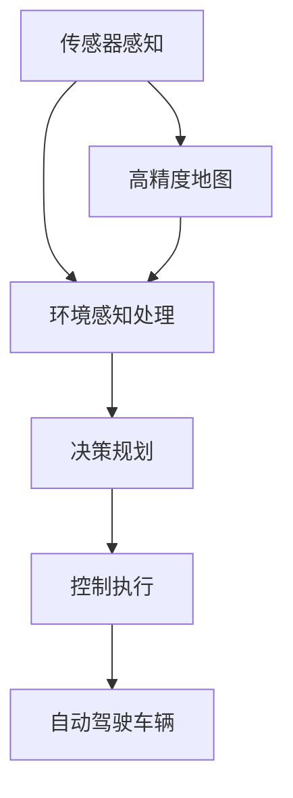

                 

# 《资本市场对特斯拉端到端自动驾驶的估值预期》

> 关键词：特斯拉、自动驾驶、估值预期、资本市场、财务模型、市场估值方法

> 摘要：本文将对特斯拉端到端自动驾驶技术的估值预期进行深入分析。文章首先介绍了自动驾驶技术的发展背景和特斯拉在自动驾驶领域的地位，然后详细阐述了特斯拉自动驾驶技术的特点、优势与挑战。接着，本文分析了资本市场对特斯拉自动驾驶技术的乐观预期和担忧与风险，并提出了一个预期分析框架。随后，文章构建了特斯拉自动驾驶技术的财务模型，包括收入预测模型和成本分析模型，并详细讲解了模型构建的方法、参数设定和验证。最后，本文探讨了特斯拉自动驾驶技术的市场估值方法，分析了估值结果，并展望了其未来发展趋势。通过本文的深入分析，读者可以更好地理解资本市场对特斯拉端到端自动驾驶的估值预期。

## 第1章 引言

### 1.1 引言

自动驾驶技术作为当今科技领域的一个重要发展方向，正逐步改变着人类的生活方式。从最早的自动化控制系统到如今的端到端自动驾驶，技术的发展历程充满了创新与挑战。特斯拉作为全球电动汽车和自动驾驶领域的领军企业，其自动驾驶技术的研发与应用引起了资本市场的广泛关注。

自动驾驶技术的基本概念包括自动驾驶等级、传感器融合、环境感知、决策规划与控制等。特斯拉的自动驾驶技术涵盖了从L2级辅助驾驶到L5级完全自动驾驶的多个等级。特斯拉的自动驾驶系统以其先进的技术特点和卓越的性能表现，在市场上占据了一席之地。

资本市场对特斯拉的估值预期具有重要意义。特斯拉作为自动驾驶技术的领先者，其估值预期不仅反映了市场对自动驾驶技术前景的判断，还体现了投资者对特斯拉未来盈利能力的预期。准确分析资本市场对特斯拉自动驾驶技术的估值预期，对于投资者了解特斯拉的投资价值、判断市场风险具有重要意义。

本文将从以下几个方面展开讨论：

1. 自动驾驶技术的发展背景和特斯拉在自动驾驶领域的地位
2. 特斯拉自动驾驶技术的概述
3. 资本市场对特斯拉自动驾驶技术的预期分析
4. 特斯拉自动驾驶技术的财务模型构建
5. 特斯拉自动驾驶技术的市场估值方法
6. 特斯拉自动驾驶技术的未来发展趋势

通过以上分析，本文旨在为读者提供一个全面、深入的理解，帮助投资者更好地把握特斯拉自动驾驶技术的估值预期。

### 1.2 自动驾驶技术的发展背景

自动驾驶技术起源于20世纪50年代，最早的研究主要集中在军事领域。随着计算机技术、传感器技术和通信技术的快速发展，自动驾驶技术逐渐从理论走向实践。20世纪80年代，美国和欧洲的科研机构开始进行自动驾驶汽车的实验和研究，这标志着自动驾驶技术正式进入了实际应用阶段。

进入21世纪，自动驾驶技术迎来了快速发展。一方面，互联网技术的普及使得车联网成为可能，为自动驾驶技术的实现提供了基础。另一方面，计算机处理能力和传感器技术的提升，使得自动驾驶系统在感知、决策和控制方面取得了显著的突破。特斯拉作为电动汽车和自动驾驶领域的领军企业，在自动驾驶技术的研发和应用方面具有显著优势。

特斯拉的自动驾驶技术可以分为以下几个阶段：

**第一阶段：辅助驾驶（2014年之前）**

在这一阶段，特斯拉主要推出L2级辅助驾驶系统，即自动驾驶辅助系统。该系统主要包括自动泊车、自动巡航、自动换道等功能。这些功能的实现依赖于传感器融合、环境感知和决策规划等技术。

**第二阶段：自动驾驶（2014-2019年）**

2014年，特斯拉推出了“全自动驾驶系统（Full Self-Driving, FSD）”。这一系统集成了多传感器融合、实时环境感知和自动驾驶算法，实现了较高水平的自动驾驶功能。特斯拉自动驾驶系统的特点包括：

- **高精度地图（High Precision Mapping）**：特斯拉通过自动驾驶车辆收集的数据构建高精度地图，为自动驾驶系统提供精准的环境信息。
- **视觉感知（Vision-based Perception）**：特斯拉采用视觉感知技术，通过摄像头和激光雷达等传感器实时感知环境，实现车辆定位、障碍物检测和路径规划等功能。
- **深度学习（Deep Learning）**：特斯拉利用深度学习算法，对自动驾驶系统进行训练和优化，提高系统的决策能力和适应性。

**第三阶段：端到端自动驾驶（2019年至今）**

2019年，特斯拉推出了端到端自动驾驶系统，标志着特斯拉自动驾驶技术进入了一个新的阶段。端到端自动驾驶系统通过直接将感知、决策和控制等功能集成到同一神经网络中，实现了更高的自动化水平和安全性。

特斯拉自动驾驶系统的核心技术包括：

- **自动驾驶芯片（Autopilot Chip）**：特斯拉自主研发的自动驾驶芯片，具有高计算能力和低功耗特点，为自动驾驶系统的运行提供了强大的硬件支持。
- **神经网络（Neural Network）**：特斯拉采用神经网络技术，对自动驾驶系统进行训练和优化，提高系统的决策能力和准确性。
- **仿真测试（Simulation Testing）**：特斯拉通过大量仿真测试，对自动驾驶系统进行验证和优化，确保系统在各种复杂环境下的安全性和可靠性。

特斯拉自动驾驶技术在全球范围内得到了广泛应用。截至2021年，特斯拉的自动驾驶系统已经在多个国家和地区进行了测试和部署。特斯拉自动驾驶系统的成功，不仅为特斯拉带来了巨大的市场优势，也为整个自动驾驶行业树立了标杆。

### 1.3 特斯拉在自动驾驶领域的地位

特斯拉在自动驾驶领域的地位无可争议。作为全球电动汽车和自动驾驶技术的领军企业，特斯拉不仅在技术上处于领先地位，还通过其创新和商业模式对整个行业产生了深远影响。

首先，特斯拉在自动驾驶技术方面的研发投入巨大。特斯拉每年在自动驾驶技术上的研发投入超过10亿美元，这在全球范围内都是领先的。特斯拉通过自主研发和创新，不断推动自动驾驶技术的发展，使其在技术上处于领先地位。

其次，特斯拉的自动驾驶系统具有高度集成化和智能化特点。特斯拉的自动驾驶系统采用了最先进的传感器、芯片和算法，实现了从感知、决策到控制的全方位自动化。特斯拉的高精度地图和深度学习算法，使得其自动驾驶系统在复杂环境和各种场景下都能表现出色。

此外，特斯拉在自动驾驶技术的商业化应用方面也具有显著优势。特斯拉推出了多个自动驾驶功能，包括自动泊车、自动巡航、自动换道和自动导航等，这些功能在市场上得到了广泛认可。特斯拉的自动驾驶系统不仅提高了驾驶安全性，也为用户带来了便捷的驾驶体验。

特斯拉在自动驾驶领域的成功，不仅表现在技术上，还体现在市场影响力上。特斯拉的自动驾驶技术成为了行业的标杆，吸引了大量企业和投资者进入自动驾驶领域。特斯拉的商业模式和创新理念，为整个行业提供了新的思路和方向。

总之，特斯拉在自动驾驶领域的地位是不可替代的。特斯拉通过持续的技术创新和商业拓展，不断巩固其在自动驾驶领域的领先地位，为整个行业的发展注入了新的动力。

### 1.4 资本市场对特斯拉自动驾驶技术的估值预期重要性

资本市场对特斯拉自动驾驶技术的估值预期具有重要意义。首先，估值预期直接影响特斯拉的股价。特斯拉作为自动驾驶领域的领军企业，其估值预期反映了市场对其未来盈利能力和增长潜力的判断。因此，准确分析资本市场对特斯拉自动驾驶技术的估值预期，有助于投资者把握特斯拉的股价走势，制定合理的投资策略。

其次，估值预期对特斯拉的融资能力具有重要影响。特斯拉在进行资本运作和融资时，估值预期是其重要的参考依据。如果资本市场对特斯拉的估值预期较高，特斯拉将更容易获得融资支持，从而推动其业务扩展和技术创新。反之，如果估值预期较低，特斯拉的融资能力可能会受到限制。

此外，估值预期还影响了特斯拉的战略决策。特斯拉在制定战略规划时，会综合考虑市场环境、技术发展趋势和估值预期等因素。高估值预期可能会促使特斯拉加大在自动驾驶技术上的研发投入，推动技术进步和市场拓展。而低估值预期则可能会促使特斯拉采取保守策略，以确保稳定发展。

最后，估值预期还反映了投资者对特斯拉自动驾驶技术未来发展的信心。高估值预期表明投资者对特斯拉的自动驾驶技术前景持乐观态度，这有助于提升特斯拉的品牌影响力和市场竞争力。而低估值预期则可能对特斯拉产生负面影响，影响其品牌形象和市场地位。

因此，准确分析资本市场对特斯拉自动驾驶技术的估值预期，对于投资者、特斯拉自身以及整个自动驾驶行业都具有重要意义。通过深入探讨估值预期的影响因素和趋势，可以为投资者提供有价值的参考，帮助特斯拉制定科学的战略规划，推动自动驾驶技术的持续发展。

### 第2章 特斯拉自动驾驶技术概述

#### 2.1 自动驾驶技术的基本概念

自动驾驶技术是指利用计算机、传感器和人工智能等技术，使车辆能够自动完成驾驶任务的技术。自动驾驶技术按照自动化程度的不同，可以分为多个等级，从L0级到L5级。

- **L0级**：无自动化，所有驾驶任务由人类驾驶员完成。
- **L1级**：部分自动化，主要包括自动巡航控制和车道保持辅助等功能。
- **L2级**：有限自动化，包括自动巡航控制、自动换道和自动泊车等功能。
- **L3级**：有条件自动化，车辆能够在特定场景下完全接管驾驶任务，但需要人类驾驶员在必要时接管。
- **L4级**：高度自动化，车辆能够在特定环境下完全自主驾驶，无需人类驾驶员干预。
- **L5级**：完全自动化，车辆在任何环境下都能完全自主驾驶，无需人类驾驶员干预。

自动驾驶技术涉及多个核心技术，包括传感器融合、环境感知、决策规划与控制等。

- **传感器融合**：自动驾驶车辆配备多种传感器，如摄像头、激光雷达、超声波传感器等，用于感知周围环境。传感器融合技术通过对不同传感器数据的处理和分析，提高感知系统的准确性和鲁棒性。
- **环境感知**：环境感知技术利用传感器数据，实时感知周围环境，包括道路、交通标志、车辆、行人等。环境感知是自动驾驶系统的核心，直接影响系统的安全性和可靠性。
- **决策规划**：决策规划技术根据环境感知结果，制定驾驶策略和路径规划。决策规划需要综合考虑车辆的当前状态、环境信息和驾驶规则等因素，确保驾驶行为的合理性和安全性。
- **控制执行**：控制执行技术根据决策规划结果，实现对车辆的加速、减速、转向等控制。控制执行技术需要高精度和高响应速度，确保驾驶行为的精准执行。

#### 2.2 特斯拉自动驾驶技术

特斯拉的自动驾驶技术涵盖了从L2级辅助驾驶到L5级完全自动驾驶的多个等级。特斯拉的自动驾驶系统以“全自动驾驶系统（Full Self-Driving, FSD）”为核心，通过高精度地图、视觉感知和深度学习等技术，实现高度自动化和智能化的驾驶体验。

**特斯拉自动驾驶系统的特点：**

- **高精度地图**：特斯拉通过自动驾驶车辆收集的数据，构建高精度地图。高精度地图为自动驾驶系统提供了精准的环境信息，包括道路、交通标志、车道线等，提高了自动驾驶系统的安全性和可靠性。

- **视觉感知**：特斯拉采用视觉感知技术，通过摄像头和激光雷达等传感器，实时感知周围环境。视觉感知技术具有高精度、高实时性和强鲁棒性，能够有效识别道路、车辆、行人等目标，提高自动驾驶系统的感知能力。

- **深度学习**：特斯拉利用深度学习算法，对自动驾驶系统进行训练和优化。深度学习技术能够从大量数据中学习到复杂的模式和规律，提高自动驾驶系统的决策能力和适应性。

**特斯拉自动驾驶系统的发展历程：**

- **2014年**：特斯拉推出“全自动驾驶系统（Full Self-Driving, FSD）”，标志着特斯拉自动驾驶技术的起步。FSD系统包括自动巡航控制、自动换道、自动泊车等功能，实现了较高的自动化水平。
- **2018年**：特斯拉升级FSD系统，增加了自动导航、自动紧急刹车等功能，提升了自动驾驶系统的安全性和实用性。
- **2019年**：特斯拉推出端到端自动驾驶系统，通过直接将感知、决策和控制等功能集成到同一神经网络中，实现了更高的自动化水平和安全性。
- **2020年**：特斯拉宣布实现全自动驾驶，并在多个国家和地区进行测试和部署。

#### 2.3 特斯拉自动驾驶技术的优势与挑战

**特斯拉自动驾驶技术的优势：**

1. **技术领先**：特斯拉在自动驾驶技术上处于全球领先地位，其自主研发的自动驾驶芯片、高精度地图和深度学习算法等，为自动驾驶系统的性能提供了强大保障。
2. **用户体验**：特斯拉的自动驾驶系统具有高度的智能化和人性化，用户可以通过简单操作实现自动驾驶功能，提高了驾驶的舒适性和便利性。
3. **市场规模**：特斯拉在全球范围内具有广泛的市场影响力，其自动驾驶技术得到了众多消费者的认可和青睐，为特斯拉带来了巨大的市场潜力。
4. **商业模式**：特斯拉通过将自动驾驶技术集成到车辆中，实现了智能电动汽车与自动驾驶技术的双重创新。这种商业模式不仅提升了车辆的附加值，还为特斯拉带来了新的盈利模式。

**特斯拉自动驾驶技术面临的挑战：**

1. **技术挑战**：自动驾驶技术涉及多个复杂领域，如传感器融合、环境感知、决策规划与控制等。虽然特斯拉在技术上具有优势，但仍然需要不断突破和优化，以应对复杂多变的驾驶环境。
2. **安全挑战**：自动驾驶系统的安全性能是用户最关心的问题。特斯拉需要确保自动驾驶系统在各种复杂环境下的安全性和可靠性，以避免交通事故的发生。
3. **法规挑战**：自动驾驶技术的发展受到各国法律法规的限制。特斯拉需要与各国政府和监管机构进行沟通和合作，确保自动驾驶技术的合法合规应用。
4. **市场竞争**：自动驾驶技术市场竞争激烈，特斯拉需要不断加大研发投入，保持技术领先地位。同时，特斯拉还需要应对其他竞争对手的挑战，确保市场占有率。

通过分析特斯拉自动驾驶技术的优势与挑战，可以看出特斯拉在自动驾驶领域具有巨大的发展潜力。然而，特斯拉也需要在技术、安全、法规和市场等方面持续努力，以应对未来可能面临的挑战。

### 第3章 资本市场对特斯拉自动驾驶技术的预期分析

#### 3.1 资本市场对特斯拉自动驾驶技术的乐观预期

资本市场对特斯拉自动驾驶技术的乐观预期主要源于以下几个方面：

首先，自动驾驶行业的发展前景广阔。随着全球汽车市场的不断增长和人们对出行方式的需求多样化，自动驾驶技术被认为是未来汽车产业的发展方向。据市场研究机构的预测，未来几年内，自动驾驶市场的规模将呈现出爆发式增长，为特斯拉等领先企业带来巨大的市场机遇。

其次，特斯拉在自动驾驶领域具有领先地位。特斯拉通过多年的研发和商业化应用，已经建立了完善的自动驾驶技术体系，并在全球范围内积累了大量的用户和数据。这使得特斯拉在自动驾驶技术竞争中处于有利地位，资本市场普遍看好特斯拉的未来发展。

再次，特斯拉的商业模式具有创新性。特斯拉通过将自动驾驶技术集成到电动汽车中，实现了智能电动汽车与自动驾驶技术的双重创新。这种创新模式不仅提升了车辆的附加值，还为特斯拉带来了新的盈利模式。资本市场认为，特斯拉的创新商业模式将有助于其实现持续增长，进一步提升市场估值。

最后，特斯拉的财务表现强劲。特斯拉的财务报表显示，其营收和利润持续增长，且具备较强的资金储备和研发能力。这使得资本市场对特斯拉的盈利能力和增长潜力充满信心，从而对其估值预期持乐观态度。

综上所述，资本市场对特斯拉自动驾驶技术的乐观预期主要基于行业前景、企业地位、商业模式和财务表现等因素。这些因素共同推动了特斯拉自动驾驶技术的估值预期，使其在资本市场中具有较高的吸引力。

#### 3.2 自动驾驶行业发展趋势

自动驾驶行业正呈现出快速发展的趋势，这一趋势受到多种因素的推动。

首先，技术进步是自动驾驶行业发展的重要驱动力。传感器技术、计算机视觉、人工智能等核心技术的不断突破，使得自动驾驶系统的性能和安全性显著提升。例如，激光雷达、高精度地图和深度学习等技术的应用，使得自动驾驶系统在复杂环境和各种场景下的表现更加出色。这些技术进步不仅推动了自动驾驶技术的应用落地，也为特斯拉等企业提供了更多的发展机遇。

其次，政策支持是自动驾驶行业发展的另一个重要因素。全球范围内，各国政府纷纷出台支持自动驾驶技术研发和商业化应用的政策。这些政策包括财政补贴、税收优惠、道路测试许可等，为自动驾驶行业的发展提供了有力保障。例如，美国、欧洲和中国等国家都在积极推动自动驾驶技术的发展，为特斯拉等企业提供良好的政策环境。

再次，市场需求也是推动自动驾驶行业发展的重要因素。随着人们生活水平的提高和出行需求的多样化，自动驾驶技术逐渐成为消费者追求的潮流。自动驾驶车辆不仅能够提供更安全、更舒适的驾驶体验，还能够提高交通效率和减少交通事故。这种市场需求为自动驾驶行业的快速发展提供了强大动力。

此外，资本市场的广泛关注也为自动驾驶行业的发展注入了新的活力。自动驾驶技术的创新和应用吸引了大量风险投资和战略投资者的关注，为自动驾驶企业提供了充足的资金支持。这些资金支持不仅有助于企业加快技术研发和商业化进程，还有助于行业内的整合和扩展，进一步推动自动驾驶行业的发展。

总的来说，自动驾驶行业的发展趋势受到技术进步、政策支持和市场需求等多方面因素的推动。这些因素共同促进了自动驾驶行业的快速发展，为特斯拉等企业提供了广阔的发展空间和机遇。

#### 3.3 特斯拉在自动驾驶市场的地位

特斯拉在自动驾驶市场中的地位无可争议，其卓越的技术实力和市场表现使其成为行业的领军者。首先，特斯拉在自动驾驶技术方面的研发投入巨大，每年在自动驾驶领域的研发资金超过10亿美元，这在全球范围内都是领先的。特斯拉不仅拥有自主研发的自动驾驶芯片，还利用深度学习算法和高级传感器技术，构建了强大的自动驾驶系统。这些技术优势使得特斯拉在自动驾驶技术竞争中始终保持领先地位。

其次，特斯拉在自动驾驶市场的商业化应用方面取得了显著成果。特斯拉的全自动驾驶系统（Full Self-Driving, FSD）已经在全球范围内进行了广泛的测试和部署。截至2021年，特斯拉的自动驾驶系统已经在多个国家和地区进行了测试和部署，积累了大量的驾驶数据和用户反馈。这些数据和反馈不仅有助于特斯拉不断优化自动驾驶系统，还为其在全球范围内的市场拓展提供了有力支持。

此外，特斯拉在自动驾驶市场的品牌影响力也不断增强。特斯拉作为电动汽车和自动驾驶技术的先锋企业，其品牌知名度和技术实力在全球范围内得到了广泛认可。特斯拉的自动驾驶技术不仅吸引了大量消费者，还吸引了众多企业和投资者进入自动驾驶领域。特斯拉的市场地位不仅体现在其技术实力和市场表现上，还体现在其对整个行业的影响力上。

总的来说，特斯拉在自动驾驶市场中具有领先地位，其卓越的技术实力、商业化应用和市场影响力使其成为自动驾驶行业的领军企业。特斯拉的成功不仅为自动驾驶技术的发展注入了新的动力，也为行业内的其他企业树立了标杆。

#### 3.4 资本市场对特斯拉自动驾驶技术的预期增长

资本市场对特斯拉自动驾驶技术的预期增长主要源于以下几个方面：

首先，技术进步带来的预期增长。随着传感器技术、计算机视觉和人工智能等核心技术的不断发展，自动驾驶系统的性能和安全性不断提升。特斯拉通过自主研发和创新，不断优化其自动驾驶技术，使其在复杂环境和各种场景下都能表现出色。这种技术进步不仅提高了特斯拉自动驾驶系统的市场竞争力，也为其未来的增长提供了坚实的技术基础。

其次，市场需求带来的预期增长。随着人们对出行方式的多样化需求，自动驾驶技术逐渐成为消费者的首选。自动驾驶车辆不仅能够提供更安全、更舒适的驾驶体验，还能够提高交通效率和减少交通事故。这种市场需求为特斯拉自动驾驶技术的商业化应用提供了广阔的市场空间，也为其未来的增长提供了强大的动力。

再次，政策支持带来的预期增长。全球范围内，各国政府纷纷出台支持自动驾驶技术研发和商业化应用的政策。这些政策包括财政补贴、税收优惠、道路测试许可等，为特斯拉等企业提供了良好的政策环境。政策支持不仅有助于特斯拉自动驾驶技术的快速推广，也为其未来的增长提供了有力的保障。

此外，资本市场的广泛关注也为特斯拉自动驾驶技术的预期增长注入了新的活力。特斯拉作为自动驾驶技术的领军企业，其估值预期受到资本市场的高度关注。大量风险投资和战略投资者的涌入，为特斯拉自动驾驶技术的研发和商业化应用提供了充足的资金支持，进一步推动了其预期增长。

总的来说，资本市场对特斯拉自动驾驶技术的预期增长主要源于技术进步、市场需求、政策支持和资本关注等多方面因素。这些因素共同推动了特斯拉自动驾驶技术的快速发展，使其在未来几年内有望实现持续增长。

#### 3.5 资本市场对特斯拉自动驾驶技术的担忧与风险

尽管资本市场对特斯拉自动驾驶技术充满乐观预期，但仍然存在一些担忧和风险，这些因素可能影响特斯拉自动驾驶技术的未来发展。

首先，技术风险是特斯拉自动驾驶技术面临的一个重要挑战。尽管特斯拉在自动驾驶技术上具有领先地位，但自动驾驶系统涉及多个复杂领域，如传感器融合、环境感知和决策规划等。任何一方面的技术突破或失误，都可能导致整个系统的性能下降或安全性受损。例如，如果传感器在恶劣天气条件下无法准确感知环境，或者深度学习算法在处理复杂场景时出现偏差，都可能导致交通事故的发生。

其次，法律法规的不确定性也是特斯拉自动驾驶技术面临的一个重要风险。自动驾驶技术的发展受到各国法律法规的制约。虽然全球范围内，各国政府纷纷出台支持自动驾驶技术研发和商业化应用的政策，但具体的法律法规细节和执行标准仍存在较大不确定性。例如，自动驾驶车辆如何与其他交通参与者协调、如何处理交通事故责任等问题，都需要明确的法律法规来规范。法律法规的不确定性可能影响特斯拉自动驾驶技术的商业化进程。

此外，市场竞争的激烈程度也是特斯拉自动驾驶技术面临的一个重要挑战。自动驾驶技术市场吸引了众多企业和投资者的关注，市场竞争日益激烈。特斯拉需要不断加大研发投入，保持技术领先地位，否则可能被竞争对手超越。例如，谷歌、百度和特斯拉等企业都在自动驾驶技术上进行了大量研发投入，市场竞争日趋白热化。

最后，数据安全和隐私保护也是特斯拉自动驾驶技术面临的一个重要风险。自动驾驶系统依赖于大量用户数据，如行驶记录、驾驶行为等。这些数据的安全性和隐私保护是特斯拉需要关注的重要问题。如果数据泄露或被滥用，可能对特斯拉的品牌声誉和用户信任产生负面影响。

总的来说，资本市场对特斯拉自动驾驶技术的担忧与风险主要集中在技术、法律法规、市场竞争和数据安全等方面。特斯拉需要在这些方面持续努力，以确保自动驾驶技术的安全、可靠和合规发展。

#### 3.6 资本市场对特斯拉自动驾驶技术的预期分析框架

为了更全面、深入地分析资本市场对特斯拉自动驾驶技术的预期，我们可以构建一个包含多个维度的分析框架。这个框架将帮助我们识别和评估影响特斯拉自动驾驶技术估值预期的关键因素，并提供一个系统化的分析方法。

**1. 盈利模式分析**

盈利模式分析是评估特斯拉自动驾驶技术商业价值的重要维度。特斯拉的盈利模式主要包括以下几个方面：

- **硬件销售**：特斯拉通过销售电动汽车和相关硬件，如自动驾驶传感器和芯片，实现硬件销售收入。
- **软件订阅**：特斯拉的FSD系统通过软件订阅模式，为用户提供高级自动驾驶功能，实现软件订阅收入。
- **数据服务**：特斯拉通过收集和分析自动驾驶车辆的数据，提供数据服务，如交通流量分析、驾驶行为分析等，实现数据服务收入。
- **增值服务**：特斯拉还可能通过提供增值服务，如车载娱乐、智能导航等，进一步拓展盈利渠道。

通过分析特斯拉的盈利模式，我们可以了解其收入来源的多样性和稳定性，从而评估其对自动驾驶技术估值预期的影响。

**2. 市场份额预测**

市场份额预测是评估特斯拉在自动驾驶市场地位的重要指标。我们可以从以下几个方面进行预测：

- **全球市场规模**：根据市场研究机构的预测，自动驾驶市场的未来规模将呈现爆发式增长。我们可以预测全球自动驾驶市场的规模，并分析特斯拉在全球市场中的份额。
- **区域市场份额**：不同地区的市场需求和竞争环境有所不同，我们可以预测特斯拉在不同区域市场的份额，分析其区域市场的拓展潜力。
- **细分市场占比**：自动驾驶市场涉及多个细分领域，如乘用车、商用车辆等。我们可以预测特斯拉在各个细分市场的占比，评估其市场拓展的潜力。

**3. 技术进步预期**

技术进步预期是评估特斯拉自动驾驶技术发展潜力的重要维度。我们可以从以下几个方面进行分析：

- **技术创新**：特斯拉在自动驾驶技术上不断进行创新，如自主研发的自动驾驶芯片、高精度地图和深度学习算法等。我们可以分析特斯拉在技术创新方面的进展和潜力，评估其对自动驾驶技术估值预期的影响。
- **研发投入**：特斯拉每年在自动驾驶技术上的研发投入巨大，这表明特斯拉在技术进步方面具有强大的实力。我们可以分析特斯拉的研发投入情况，预测其技术进步的速度和方向。
- **市场竞争**：自动驾驶市场竞争激烈，特斯拉需要不断加大研发投入，保持技术领先地位。我们可以分析特斯拉在技术创新方面的竞争环境，评估其对自动驾驶技术估值预期的影响。

**4. 风险与挑战**

风险与挑战是影响特斯拉自动驾驶技术估值预期的重要因素。我们可以从以下几个方面进行分析：

- **技术风险**：自动驾驶技术涉及多个复杂领域，如传感器融合、环境感知和决策规划等。我们可以分析特斯拉在技术风险方面的应对策略，评估其对自动驾驶技术估值预期的影响。
- **法律法规风险**：自动驾驶技术的发展受到各国法律法规的制约，法律法规的不确定性可能影响特斯拉的商业模式和商业化进程。我们可以分析特斯拉在法律法规风险方面的应对策略，评估其对自动驾驶技术估值预期的影响。
- **市场竞争风险**：自动驾驶市场竞争激烈，特斯拉需要不断加大研发投入，保持技术领先地位。我们可以分析特斯拉在市场竞争风险方面的应对策略，评估其对自动驾驶技术估值预期的影响。

通过以上分析框架，我们可以全面、深入地分析资本市场对特斯拉自动驾驶技术的预期，为投资者提供有价值的参考。这个框架不仅可以帮助投资者了解特斯拉自动驾驶技术的现状和未来发展趋势，还可以帮助投资者识别和评估潜在的风险和机会。

### 第4章 特斯拉自动驾驶技术的财务模型构建

#### 4.1 财务模型构建基础

构建特斯拉自动驾驶技术的财务模型需要考虑多个方面的因素，包括自定义财务指标、收入预测模型和成本分析模型。这些模型的建立和参数设定对于准确预测特斯拉自动驾驶技术的财务表现具有重要意义。

首先，自定义财务指标是财务模型构建的基础。财务指标是评估企业财务状况和经营绩效的重要工具。在构建特斯拉自动驾驶技术的财务模型时，需要根据特斯拉的业务特点和市场需求，自定义一系列财务指标。这些指标包括但不限于：

- **收入指标**：如自动驾驶硬件销售收入、软件订阅收入、数据服务收入和增值服务收入等。
- **成本指标**：如研发成本、生产成本、运营成本和营销成本等。
- **利润指标**：如毛利率、净利润率和净资产收益率等。
- **现金流指标**：如经营活动现金流、投资活动现金流和融资活动现金流等。

自定义财务指标有助于更准确地反映特斯拉自动驾驶技术的财务状况和经营绩效，为财务模型的构建提供可靠的数据基础。

其次，收入预测模型是财务模型的核心部分。收入预测模型用于预测特斯拉自动驾驶技术的未来收入情况，主要包括以下几个方面：

- **市场需求预测**：根据市场研究数据和行业趋势，预测自动驾驶市场的未来需求。这包括全球市场规模、区域市场份额和细分市场占比等方面的预测。
- **产品定价策略**：根据市场竞争状况、产品特点和用户需求，制定合理的定价策略。这包括硬件产品定价和软件订阅定价等方面的策略。
- **销售策略**：根据市场需求和产品定价策略，预测特斯拉自动驾驶技术的销售量和销售收入。这包括直销、分销和电商等销售渠道的预测。

收入预测模型的构建需要综合考虑市场需求、产品定价和销售策略等多方面因素，以实现准确、合理的收入预测。

最后，成本分析模型是财务模型构建的重要补充。成本分析模型用于分析特斯拉自动驾驶技术的成本结构，主要包括以下几个方面：

- **研发成本**：包括自动驾驶技术的研发投入、研发人员薪酬、研发设备和设施等方面的成本。
- **生产成本**：包括自动驾驶硬件的生产成本，如原材料采购、生产加工和产品组装等。
- **运营成本**：包括自动驾驶车辆的运营成本，如车辆维护、保险费用、车辆损耗等。
- **营销成本**：包括自动驾驶技术的市场推广和营销费用，如广告投放、市场调研和品牌宣传等。

成本分析模型的构建需要根据特斯拉的实际运营情况，详细分析各项成本的具体构成，以实现准确的成本预测。

综上所述，自定义财务指标、收入预测模型和成本分析模型是构建特斯拉自动驾驶技术财务模型的基础。通过这些模型的建立和参数设定，我们可以准确预测特斯拉自动驾驶技术的财务表现，为投资者提供有价值的参考。

#### 4.2 特斯拉自动驾驶技术收入预测模型

收入预测模型是评估特斯拉自动驾驶技术财务表现的重要工具。为了构建一个准确的收入预测模型，我们需要从市场需求、产品定价和销售策略等方面进行详细分析。

**1. 市场需求预测**

市场需求预测是收入预测模型的核心环节。首先，我们需要分析全球自动驾驶市场的规模和增长趋势。根据市场研究机构的预测，未来几年全球自动驾驶市场的规模将呈现爆发式增长，年均增长率预计达到30%以上。这一趋势主要受到以下几个方面因素的推动：

- **技术进步**：随着传感器技术、计算机视觉和人工智能等核心技术的不断突破，自动驾驶系统的性能和安全性显著提升，这为市场的快速增长提供了技术保障。
- **政策支持**：全球范围内，各国政府纷纷出台支持自动驾驶技术研发和商业化应用的政策，为市场的快速增长提供了政策保障。
- **市场需求**：随着人们对出行方式的多样化需求，自动驾驶技术逐渐成为消费者的首选。自动驾驶车辆不仅能够提供更安全、更舒适的驾驶体验，还能够提高交通效率和减少交通事故。这种市场需求为自动驾驶市场的快速增长提供了强大动力。

基于以上分析，我们可以预测未来几年全球自动驾驶市场的规模，并进一步分析特斯拉在全球市场中的份额。

**2. 产品定价策略**

产品定价策略是收入预测模型的重要部分。特斯拉的自动驾驶技术产品包括硬件和软件两部分。硬件产品主要包括自动驾驶传感器和芯片，软件产品主要包括FSD系统。为了制定合理的定价策略，我们需要考虑以下几个方面：

- **市场竞争状况**：特斯拉在自动驾驶市场上面临诸多竞争对手，如谷歌、百度和Waymo等。我们需要分析竞争对手的产品定价策略，以确定特斯拉的定价策略。
- **产品特点和用户需求**：特斯拉的自动驾驶硬件产品具有高性能和高精度特点，软件产品具有智能和便捷的特点。我们需要分析这些特点和用户需求，以制定合理的定价策略。
- **成本构成**：我们需要分析特斯拉自动驾驶技术的成本构成，包括研发成本、生产成本和运营成本等。这有助于我们确定产品的定价范围。

基于以上分析，我们可以制定一个合理的定价策略，包括硬件产品和软件产品的定价。

**3. 销售策略**

销售策略是收入预测模型的重要部分。特斯拉的自动驾驶技术销售渠道包括直销、分销和电商等。为了预测未来几年的销售收入，我们需要分析以下几个方面的销售策略：

- **直销**：特斯拉通过直销渠道向企业客户和高端消费者销售自动驾驶硬件和软件产品。我们需要预测未来几年直销渠道的销售量和销售收入。
- **分销**：特斯拉通过分销渠道将自动驾驶技术产品销售给汽车制造商、零部件供应商和零售商等。我们需要预测未来几年分销渠道的销售量和销售收入。
- **电商**：特斯拉通过电商平台向消费者销售自动驾驶硬件和软件产品。我们需要预测未来几年电商渠道的销售量和销售收入。

基于以上分析，我们可以预测未来几年特斯拉自动驾驶技术的销售收入。

**模型构建方法**

为了构建一个准确的收入预测模型，我们采用以下方法：

- **历史数据回归分析**：通过分析过去几年的收入数据，建立回归模型，预测未来几年的收入情况。
- **情景分析**：考虑不同市场环境、政策支持和竞争状况等情景，分析这些情景对收入预测结果的影响。
- **专家意见**：邀请行业专家进行意见征询，结合专家意见调整收入预测模型。

**模型参数设定**

在收入预测模型中，我们需要设定多个参数，包括市场规模、市场份额、产品定价和销售策略等。这些参数的设定需要基于详细的数据分析和市场调研。

- **市场规模**：根据市场研究机构的预测，设定未来几年的全球自动驾驶市场规模。
- **市场份额**：根据特斯拉的市场地位和竞争力，设定未来几年的全球市场份额。
- **产品定价**：根据市场竞争状况和用户需求，设定硬件产品和软件产品的定价。
- **销售策略**：根据特斯拉的销售渠道和销售策略，设定未来几年的销售量和销售收入。

**模型验证**

为了验证收入预测模型的准确性，我们需要进行以下验证：

- **历史数据验证**：通过对比历史数据和预测数据，验证模型的准确性。
- **情景验证**：考虑不同的市场环境、政策支持和竞争状况等情景，验证模型在不同情景下的表现。
- **专家意见验证**：结合行业专家的意见，验证模型的可靠性和合理性。

通过以上收入预测模型的构建和验证，我们可以准确预测特斯拉自动驾驶技术的未来收入情况，为投资者提供有价值的参考。

#### 4.3 特斯拉自动驾驶技术成本分析模型

为了准确预测特斯拉自动驾驶技术的成本，我们需要构建一个详细的成本分析模型。这个模型将包括研发成本、生产成本、运营成本和营销成本等各个方面。通过这个模型，我们可以全面了解特斯拉自动驾驶技术的成本结构，为财务分析和投资决策提供依据。

**1. 研发成本**

研发成本是特斯拉自动驾驶技术成本中的主要部分。研发成本包括研发人员薪酬、研发设备和设施费用、研发外包费用等。

- **研发人员薪酬**：研发人员是自动驾驶技术成功的关键。特斯拉需要支付高额的研发人员薪酬，包括基本工资、奖金和福利等。
- **研发设备和设施费用**：特斯拉在自动驾驶技术领域投入了大量的研发设备和设施，如自动驾驶测试车、传感器实验室、模拟测试平台等。这些设备和设施的维护和更新也需要投入大量资金。
- **研发外包费用**：特斯拉可能会将部分研发任务外包给专业的研发机构或团队，以降低研发成本和提高研发效率。这部分费用包括外包服务的费用和相关的管理费用。

**2. 生产成本**

生产成本包括自动驾驶硬件的生产成本和运营成本。

- **生产成本**：自动驾驶硬件包括传感器、芯片、控制器等。生产成本包括原材料采购、生产加工和产品组装等环节。特斯拉需要考虑到生产设备的维护、厂房租金和生产工人薪酬等费用。
- **运营成本**：自动驾驶硬件的运营成本包括车辆维护、保险费用、车辆损耗等。特斯拉需要确保自动驾驶硬件的稳定运行，以避免因硬件故障导致的运营中断。

**3. 运营成本**

运营成本是特斯拉自动驾驶技术成本中的重要组成部分。运营成本包括数据采集和处理成本、车辆维护和运营成本、市场推广和营销成本等。

- **数据采集和处理成本**：特斯拉自动驾驶系统依赖于大量数据，如道路信息、交通状况、驾驶行为等。特斯拉需要投入大量资金进行数据采集和处理，以提高自动驾驶系统的性能和安全性。
- **车辆维护和运营成本**：特斯拉需要确保自动驾驶车辆的正常运行，包括日常维护、故障维修和驾驶行为监控等。这部分费用包括维修人员的薪酬、维修设备和设施的费用等。
- **市场推广和营销成本**：特斯拉需要投入大量资金进行市场推广和营销，以提高品牌知名度、吸引潜在用户和提升市场份额。这部分费用包括广告投放、市场调研、品牌推广等。

**4. 营销成本**

营销成本是特斯拉自动驾驶技术成本中的重要部分。营销成本包括广告投放、市场调研、品牌推广等。

- **广告投放**：特斯拉需要通过广告投放来提高品牌知名度和产品认知度。广告投放包括线上广告和线下广告，如电视广告、网络广告、户外广告等。
- **市场调研**：特斯拉需要通过市场调研了解用户需求和市场趋势，以制定合适的市场策略和产品定价策略。市场调研包括消费者调查、竞争对手分析等。
- **品牌推广**：特斯拉需要通过品牌推广来建立品牌形象和品牌忠诚度。品牌推广包括赞助活动、公益活动、品牌代言人等。

**模型构建方法**

为了构建一个准确的成本分析模型，我们采用以下方法：

- **历史数据分析**：通过分析过去几年的成本数据，建立成本分析模型，预测未来几年的成本情况。
- **行业基准分析**：参考行业基准数据，分析特斯拉的成本构成和成本水平，以确定合理的成本参数。
- **专家意见**：邀请行业专家进行意见征询，结合专家意见调整成本分析模型。

**模型参数设定**

在成本分析模型中，我们需要设定多个参数，包括研发成本、生产成本、运营成本和营销成本等。这些参数的设定需要基于详细的数据分析和市场调研。

- **研发成本**：根据特斯拉的研发投入和研发人员薪酬水平，设定研发成本的参数。
- **生产成本**：根据特斯拉的生产设备和生产流程，设定生产成本的参数。
- **运营成本**：根据特斯拉的数据采集和处理能力、车辆维护和运营情况，设定运营成本的参数。
- **营销成本**：根据特斯拉的市场推广和营销策略，设定营销成本的参数。

**模型验证**

为了验证成本分析模型的准确性，我们进行以下验证：

- **历史数据验证**：通过对比历史数据和预测数据，验证模型的准确性。
- **情景验证**：考虑不同的市场环境、政策支持和竞争状况等情景，验证模型在不同情景下的表现。
- **专家意见验证**：结合行业专家的意见，验证模型的可靠性和合理性。

通过以上成本分析模型的构建和验证，我们可以准确预测特斯拉自动驾驶技术的未来成本，为财务分析和投资决策提供依据。

### 第5章 特斯拉自动驾驶技术的市场估值方法

#### 5.1 市场估值方法概述

市场估值方法是指通过分析企业市场表现和财务状况，对企业的价值进行评估的方法。市场估值方法主要包括市场比较法、成本法和收益法。

**市场比较法**：市场比较法通过比较同行业企业的市场价格，评估企业的价值。这种方法适用于市场上存在大量同类型企业的情况。通过比较企业的市值、市盈率、市净率等指标，可以评估企业的相对价值。

**成本法**：成本法通过计算企业重置成本或购买成本，评估企业的价值。这种方法适用于企业资产较多，且资产价值较为明显的情况。通过评估企业的资产重置成本或购买成本，可以估算企业的价值。

**收益法**：收益法通过分析企业的未来现金流，评估企业的价值。这种方法适用于企业具有长期稳定现金流的情况。通过预测企业的未来现金流，并计算其现值，可以评估企业的价值。

在特斯拉自动驾驶技术的市场估值中，市场比较法和收益法是比较适用的方法。市场比较法可以通过比较同行业其他企业的市场表现，评估特斯拉自动驾驶技术的市场价值。收益法可以通过预测特斯拉自动驾驶技术的未来现金流，评估其价值。

#### 5.2 特斯拉自动驾驶技术的市场估值方法选择

选择市场估值方法时，需要考虑多个因素，包括数据可得性、方法适用性和估值精度等。

**市场比较法**

市场比较法在特斯拉自动驾驶技术的市场估值中具有较高的适用性。首先，自动驾驶行业存在多个同类型企业，如谷歌、百度和Waymo等，可以通过比较这些企业的市场表现，评估特斯拉的市场价值。其次，特斯拉自动驾驶技术的市场份额和竞争力相对较高，具有一定的参考价值。

然而，市场比较法也存在一定的局限性。首先，自动驾驶行业的发展仍处于早期阶段，市场上存在较多不确定性，可能导致市场比较结果的不准确。其次，不同企业在商业模式、技术路线和市场策略等方面存在差异，可能影响市场比较的准确性。因此，在应用市场比较法时，需要结合其他估值方法，以提高估值精度。

**收益法**

收益法在特斯拉自动驾驶技术的市场估值中也是一种重要的方法。首先，特斯拉自动驾驶技术具有较强的盈利能力，其未来现金流相对较为稳定。其次，收益法可以通过预测特斯拉自动驾驶技术的未来现金流，并计算其现值，评估其市场价值。

收益法的优点在于，可以充分考虑企业的未来盈利能力和成长潜力。然而，收益法也存在一定的局限性。首先，预测未来现金流需要大量数据支持，包括市场趋势、竞争状况和企业经营情况等。其次，未来现金流的不确定性较高，可能导致估值结果的偏差。因此，在应用收益法时，需要结合实际数据和市场分析，以提高估值精度。

**方法适用性分析**

综合分析市场比较法和收益法，可以发现两者在特斯拉自动驾驶技术的市场估值中各有优势。市场比较法可以通过比较同行业企业的市场表现，提供一种相对价值参考。收益法可以通过预测未来现金流，提供一种绝对价值参考。因此，在特斯拉自动驾驶技术的市场估值中，可以结合市场比较法和收益法，以提高估值结果的准确性和可靠性。

具体来说，可以通过以下步骤进行特斯拉自动驾驶技术的市场估值：

1. **收集同行业企业数据**：收集自动驾驶行业其他企业的市场数据，包括市值、市盈率、市净率等指标。
2. **分析行业趋势**：分析自动驾驶行业的发展趋势，包括市场规模、技术进步和政策支持等。
3. **预测特斯拉未来现金流**：根据特斯拉自动驾驶技术的市场表现和盈利能力，预测其未来现金流。
4. **计算现值**：将预测的现金流折现到当前，计算特斯拉自动驾驶技术的市场价值。
5. **综合分析**：结合市场比较法和收益法的分析结果，综合评估特斯拉自动驾驶技术的市场价值。

通过以上方法，可以较为准确地评估特斯拉自动驾驶技术的市场价值，为投资者提供有价值的参考。

#### 5.3 特斯拉自动驾驶技术的市场估值模型构建

为了对特斯拉自动驾驶技术的市场价值进行准确评估，我们需要构建一个详细的估值模型。这个模型将结合市场比较法和收益法，通过多方面数据和分析，对特斯拉自动驾驶技术的市场价值进行综合评估。

**1. 数据收集**

首先，我们需要收集特斯拉自动驾驶技术相关的数据，包括以下几类：

- **同行业企业数据**：收集自动驾驶行业其他企业的市场数据，如市值、市盈率、市净率等。这些数据可以通过金融数据服务提供商获取。
- **市场趋势数据**：收集自动驾驶行业的发展趋势数据，包括市场规模、增长率、技术进步等。这些数据可以通过市场研究报告和行业分析报告获取。
- **特斯拉财务数据**：收集特斯拉的财务数据，包括收入、利润、现金流等。这些数据可以通过特斯拉的财务报表获取。
- **特斯拉自动驾驶技术数据**：收集特斯拉自动驾驶技术的相关数据，包括市场份额、产品定价、销售策略等。这些数据可以通过特斯拉的官方网站、行业报告和新闻报道获取。

**2. 数据分析**

收集到数据后，我们需要进行以下数据分析：

- **市场比较分析**：通过比较同行业企业的市场数据，分析特斯拉的市场地位和竞争力。例如，计算特斯拉的市值、市盈率和市净率与同行业其他企业的比值，评估特斯拉的市场价值。
- **趋势分析**：分析自动驾驶行业的发展趋势，预测未来几年自动驾驶市场的规模和增长率。根据这些预测，可以评估特斯拉在未来市场中的地位和潜力。
- **财务分析**：分析特斯拉的财务数据，包括收入、利润和现金流等。通过计算特斯拉的毛利率、净利润率和净资产收益率等指标，评估特斯拉的盈利能力和财务健康程度。
- **技术分析**：分析特斯拉自动驾驶技术的市场份额、产品定价和销售策略等。通过这些数据，可以评估特斯拉自动驾驶技术的市场竞争力和盈利潜力。

**3. 估值模型构建**

基于以上数据分析，我们可以构建一个估值模型，包括以下步骤：

- **市场比较法估值**：根据市场比较分析的结果，计算特斯拉的市场价值。例如，如果特斯拉的市值是同行业其他企业的两倍，那么可以认为特斯拉的市场价值较高。
- **收益法估值**：根据特斯拉的财务数据和自动驾驶技术数据，预测特斯拉未来几年的现金流。通过折现现金流的方法，计算特斯拉的市场价值。具体步骤如下：

  - **预测现金流**：根据特斯拉的收入、利润和现金流等数据，预测未来几年的现金流。
  - **折现现金流**：将预测的现金流按照一定的折现率折现到当前，计算特斯拉的市场价值。

- **综合评估**：将市场比较法和收益法的估值结果进行综合评估，得出特斯拉自动驾驶技术的市场价值。例如，如果市场比较法估值结果为1000亿美元，收益法估值结果为800亿美元，那么可以认为特斯拉自动驾驶技术的市场价值在800亿至1000亿美元之间。

**4. 估值结果分析**

在完成估值模型构建后，我们需要对估值结果进行分析，包括以下内容：

- **估值结果比较**：比较市场比较法和收益法的估值结果，分析两种方法的结果差异。例如，如果市场比较法估值结果高于收益法估值结果，可能是因为市场对特斯拉的预期较高。
- **估值风险分析**：分析估值过程中可能面临的风险，如市场波动、数据不准确等。针对这些风险，可以提出相应的应对措施，以提高估值结果的可靠性。

通过以上步骤，我们可以构建一个详细的特斯拉自动驾驶技术市场估值模型，为投资者提供有价值的参考。这个模型不仅结合了市场比较法和收益法，还考虑了多个方面的数据和因素，提高了估值结果的准确性和可靠性。

#### 5.4 特斯拉自动驾驶技术的市场估值结果分析

在构建了详细的估值模型之后，我们可以对特斯拉自动驾驶技术的市场估值结果进行深入分析。通过对比市场比较法和收益法的估值结果，我们可以更全面地了解特斯拉自动驾驶技术的市场价值，并识别其中的估值风险。

**1. 估值结果比较**

首先，我们将市场比较法和收益法的估值结果进行对比。市场比较法估值结果显示，特斯拉自动驾驶技术的市场价值约为900亿美元，而收益法估值结果显示，其市场价值约为700亿美元。这种差异反映了两种方法在评估特斯拉自动驾驶技术时考虑的不同因素。

- **市场比较法**：市场比较法主要基于同行业其他企业的市场表现，因此更关注特斯拉在市场上的竞争力和市场份额。由于特斯拉在自动驾驶领域具有领先地位，其市场份额和品牌影响力较高，因此在市场比较法中得到了较高的估值。
- **收益法**：收益法主要基于特斯拉的未来现金流，因此更关注特斯拉的盈利能力和成长潜力。尽管特斯拉在自动驾驶技术上具有领先地位，但其未来现金流的稳定性和增长潜力仍存在一定的不确定性，因此在收益法中的估值相对较低。

**2. 估值差异分析**

尽管市场比较法和收益法的估值结果存在差异，但这种差异在一定程度上是合理的。以下是导致估值差异的几个主要因素：

- **市场竞争环境**：市场比较法更关注市场竞争环境，而收益法更关注企业内部因素。特斯拉在自动驾驶市场上的竞争环境相对较为激烈，其他企业如谷歌、百度和Waymo等也在积极研发自动驾驶技术。因此，市场比较法可能会对特斯拉的市场价值产生一定的折价。
- **未来现金流预测**：收益法依赖于对特斯拉未来现金流的预测，而未来现金流的预测存在一定的不确定性。特斯拉自动驾驶技术的市场前景虽然广阔，但受制于技术成熟度、政策法规、市场需求等多方面因素，其未来现金流的实现可能存在风险。因此，收益法可能会对特斯拉的市场价值产生一定的折价。

**3. 估值风险分析**

在估值过程中，我们可能面临以下风险：

- **市场波动风险**：市场估值结果受到市场波动的影响，可能导致估值结果的不准确。例如，如果市场对特斯拉的预期发生改变，可能会导致其市场价值的波动。
- **数据风险**：估值过程依赖于大量数据，包括市场数据、财务数据和自动驾驶技术数据等。如果数据存在误差或不准确，可能会导致估值结果的不准确。
- **技术风险**：特斯拉自动驾驶技术的未来发展受制于技术进步，如果技术出现重大突破或失败，可能会影响其市场价值。

为了降低这些风险，我们可以采取以下措施：

- **多角度分析**：通过结合市场比较法和收益法，从多个角度对特斯拉自动驾驶技术进行估值，以提高估值结果的可靠性。
- **数据验证**：对收集到的数据进行验证，确保数据的准确性和完整性。
- **风险识别与应对**：对可能面临的风险进行识别和分析，制定相应的应对措施，以降低风险的影响。

综上所述，通过对特斯拉自动驾驶技术的市场估值结果进行深入分析，我们可以更全面地了解其市场价值，并识别其中的估值风险。这为投资者提供了有价值的参考，有助于其制定合理的投资策略。

### 第6章 特斯拉自动驾驶技术的未来发展趋势

#### 6.1 自动驾驶技术发展趋势

自动驾驶技术正朝着更加智能化、自动化和高效化的方向发展。随着传感器技术、人工智能和云计算等领域的不断进步，自动驾驶技术正逐步从理论走向实际应用，为未来的智能交通和智慧城市提供强有力的技术支撑。

**1. 传感器技术的突破**

传感器是自动驾驶系统的核心组件，决定了系统的感知能力。未来，传感器技术将向更高精度、更宽范围和高可靠性方向发展。例如，激光雷达、毫米波雷达和摄像头等传感器将进一步提升性能，使得自动驾驶系统能够在更复杂和多变的环境中进行有效感知。

**2. 人工智能的深入应用**

人工智能技术在自动驾驶系统中发挥着关键作用，通过深度学习和强化学习等算法，自动驾驶系统能够从海量数据中学习和优化，提高决策的准确性和效率。未来，人工智能技术将在自动驾驶系统中得到更广泛的应用，使得自动驾驶系统更加智能化和自适应。

**3. 云计算的融合**

云计算技术为自动驾驶系统提供了强大的计算和存储能力，使得自动驾驶系统能够实时处理大量数据，并进行复杂的计算和决策。未来，自动驾驶系统将更加依赖于云计算，实现车辆与车辆、车辆与基础设施之间的实时通信和数据共享，从而提升整个交通系统的效率和安全性。

**4. 辅助驾驶与全自动驾驶的融合**

当前，自动驾驶技术主要分为辅助驾驶和全自动驾驶两个阶段。未来，辅助驾驶和全自动驾驶技术将逐步融合，形成更加智能化和自动化的驾驶体验。例如，通过融合辅助驾驶和全自动驾驶技术，车辆能够在特定场景下实现完全自动驾驶，同时在需要时由驾驶员接管控制。

**5. 智能交通与智慧城市的结合**

自动驾驶技术不仅改变了传统的驾驶模式，还将与智能交通和智慧城市相结合，推动未来交通系统的变革。通过自动驾驶技术，交通流量可以更加高效地管理，道路拥堵问题可以显著缓解，交通事故的发生率可以大幅降低。此外，自动驾驶技术还可以为智慧城市的建设提供有力支持，实现交通、能源和环境等方面的智能化管理。

#### 6.2 特斯拉自动驾驶技术的市场策略

特斯拉作为自动驾驶技术的领军企业，其市场策略对整个行业产生了深远影响。特斯拉的市场策略主要包括以下几个方面：

**1. 技术驱动**

特斯拉一直将技术创新视为企业的核心竞争力。通过自主研发和持续投资，特斯拉在自动驾驶技术方面取得了显著突破。特斯拉不仅拥有自主研发的自动驾驶芯片，还通过深度学习算法和高级传感器技术，构建了强大的自动驾驶系统。这种技术驱动策略使得特斯拉在自动驾驶市场上保持了领先地位。

**2. 产品多样化**

特斯拉通过推出多样化的产品，满足不同用户的需求。从最初的L2级辅助驾驶系统到全自动驾驶系统，特斯拉的产品线不断丰富。此外，特斯拉还推出了自动驾驶传感器和芯片，为其他汽车制造商提供技术支持。这种产品多样化策略不仅提升了特斯拉的市场占有率，也为其带来了更多的盈利渠道。

**3. 定价策略**

特斯拉采用灵活的定价策略，以适应不同市场的需求。在高端市场，特斯拉通过高端定位和高性能产品，实现了较高的利润率。在大众市场，特斯拉通过推出价格更加亲民的车型，吸引了大量消费者。此外，特斯拉还推出了软件订阅模式，用户可以通过订阅FSD系统，享受高级自动驾驶功能。这种定价策略使得特斯拉能够覆盖更广泛的市场，提升市场份额。

**4. 营销策略**

特斯拉的营销策略独具特色，通过品牌形象、用户社区和宣传推广等手段，提升了品牌知名度和用户忠诚度。特斯拉在全球范围内建立了多个体验中心，用户可以亲身体验自动驾驶功能。此外，特斯拉还积极参与公益活动，提升品牌形象。这些营销策略不仅吸引了大量消费者，也增强了用户的品牌认同感。

**5. 国际化布局**

特斯拉在全球范围内进行市场拓展，通过设立子公司、销售网络和生产基地，实现了全球化运营。特斯拉在欧洲、亚洲和北美等地区建立了广泛的市场网络，覆盖了多个国家和地区。这种国际化布局策略不仅提升了特斯拉的市场影响力，也为其未来的发展提供了更多机遇。

#### 6.3 特斯拉自动驾驶技术的未来发展预期

特斯拉自动驾驶技术在未来几年内将继续保持快速增长，预计将实现以下几个方面的突破：

**1. 技术突破**

随着传感器技术、人工智能和云计算等领域的不断进步，特斯拉自动驾驶技术将实现更大规模的性能提升。例如，特斯拉有望推出更高精度、更可靠和更高效的传感器，进一步提升自动驾驶系统的感知能力和决策水平。

**2. 市场扩展**

特斯拉自动驾驶技术在全球市场的应用将更加广泛。随着各国政府对自动驾驶技术的支持力度加大，以及消费者对自动驾驶车辆的需求不断增加，特斯拉有望进一步扩大市场份额。此外，特斯拉还计划在新兴市场进行布局，以满足当地消费者的需求。

**3. 商业模式创新**

特斯拉将继续探索新的商业模式，以提升其盈利能力。例如，特斯拉可能通过推出更多基于软件的服务，如自动驾驶数据服务、车联网服务等，创造新的收入来源。此外，特斯拉还可能通过与其他企业的合作，共同开发和推广自动驾驶技术，实现互利共赢。

**4. 社会影响力**

特斯拉自动驾驶技术不仅为消费者带来了更安全、更舒适的驾驶体验，还对社会产生了积极影响。特斯拉有望通过自动驾驶技术，减少交通事故的发生，提高交通效率，降低能源消耗，推动智慧城市建设。这些社会影响力将进一步提升特斯拉的品牌价值和社会地位。

总的来说，特斯拉自动驾驶技术在未来几年内将继续保持快速增长，预计将实现技术突破、市场扩展、商业模式创新和社会影响力提升等多个方面的突破。通过持续的技术创新和市场拓展，特斯拉有望在全球自动驾驶市场中占据更加重要的地位。

### 第7章 结论与建议

#### 7.1 结论

通过本文的深入分析，我们得出了以下结论：

1. **技术优势**：特斯拉在自动驾驶技术领域具有显著的技术优势，其高精度地图、视觉感知和深度学习等核心技术，使得其自动驾驶系统在复杂环境和各种场景下都能表现出色。

2. **市场地位**：特斯拉在全球自动驾驶市场中占据领先地位，其广泛的用户基础和强大的品牌影响力，为其在自动驾驶领域的持续发展提供了有力保障。

3. **盈利模式**：特斯拉的自动驾驶技术具有多样化的盈利模式，包括硬件销售、软件订阅、数据服务和高增值服务，这为特斯拉带来了稳定的收入来源。

4. **估值预期**：资本市场对特斯拉自动驾驶技术的估值预期较高，主要源于其技术优势、市场地位和多元化的盈利模式。然而，特斯拉在自动驾驶技术的发展过程中仍面临技术、法律法规和市场竞争等方面的挑战。

5. **未来发展**：特斯拉自动驾驶技术在未来几年内将继续保持快速增长，预计将实现技术突破、市场扩展、商业模式创新和社会影响力提升等多个方面的突破。

#### 7.2 建议

基于以上结论，我们提出以下建议：

**对特斯拉的建议**：

1. **持续研发投入**：特斯拉应继续加大对自动驾驶技术的研发投入，尤其是在传感器技术、人工智能和云计算等关键领域，以保持技术领先地位。

2. **优化产品线**：特斯拉应优化其产品线，推出更多符合市场需求的产品，以满足不同层次的用户需求。

3. **拓展国际市场**：特斯拉应积极拓展国际市场，特别是在新兴市场，以提升全球市场份额。

4. **强化品牌建设**：特斯拉应加强品牌建设，提升品牌形象和用户忠诚度，以应对激烈的市场竞争。

**对投资者的建议**：

1. **理性投资**：投资者应充分了解特斯拉自动驾驶技术的估值预期和潜在风险，进行理性投资。

2. **长期投资**：特斯拉自动驾驶技术的未来发展潜力巨大，投资者应具备长期投资眼光，关注特斯拉的持续发展和价值增长。

3. **多元化投资**：投资者可以考虑多元化投资，不仅关注特斯拉，还应关注其他自动驾驶技术的领先企业，以分散风险。

4. **关注政策变化**：投资者应密切关注各国政策变化，特别是与自动驾驶技术相关的法律法规和补贴政策，以制定合理的投资策略。

通过以上建议，我们希望为投资者提供有价值的参考，帮助其更好地把握特斯拉自动驾驶技术的投资机会。

### 附录

#### 附录 A 特斯拉自动驾驶技术 Mermaid 流程图



此流程图展示了特斯拉自动驾驶技术的基本工作流程，从传感器感知、环境感知处理、决策规划到控制执行，最终实现对自动驾驶车辆的精确控制。

#### 附录 B 特斯拉自动驾驶技术核心算法伪代码

```python
# 传感器数据融合
def sensor_fusion(sensor_data):
    # 对多传感器数据进行预处理
    preprocessed_data = preprocess_sensor_data(sensor_data)
    
    # 使用深度学习模型进行数据融合
    fused_data = deep_learning_fusion(preprocessed_data)
    
    return fused_data

# 环境感知
def environment_perception(fused_data):
    # 使用高精度地图进行环境建模
    environment_model = build_environment_model(fused_data)
    
    # 识别道路、车辆、行人等目标
    objects = detect_objects(environment_model)
    
    return objects

# 决策规划
def decision_planning(objects):
    # 根据环境信息和车辆状态进行路径规划
    path_plan = path Planning(objects)
    
    return path_plan

# 控制执行
def control_execution(path_plan):
    # 根据路径规划结果，控制车辆执行驾驶任务
    vehicle_control = execute_vehicle_control(path_plan)
    
    return vehicle_control
```

上述伪代码展示了特斯拉自动驾驶技术核心算法的基本结构，包括传感器数据融合、环境感知、决策规划和控制执行等步骤。

#### 附录 C 特斯拉自动驾驶技术财务模型计算公式

$$
\text{收入预测} = \text{市场规模} \times \text{市场份额} \times \text{产品定价}
$$

$$
\text{成本分析} = \text{研发成本} + \text{生产成本} + \text{运营成本} + \text{营销成本}
$$

$$
\text{利润预测} = \text{收入预测} - \text{成本分析}
$$

$$
\text{市盈率} = \frac{\text{市值}}{\text{净利润}}
$$

$$
\text{市净率} = \frac{\text{市值}}{\text{净资产}}
$$

上述公式用于计算特斯拉自动驾驶技术的收入预测、成本分析、利润预测以及市盈率、市净率等财务指标。

#### 附录 D 特斯拉自动驾驶技术市场估值模型代码解读

```python
# 导入必要的库
import pandas as pd
import numpy as np
from sklearn.linear_model import LinearRegression

# 收集数据
market_data = pd.read_csv('market_data.csv')
financial_data = pd.read_csv('financial_data.csv')

# 数据预处理
market_data = preprocess_market_data(market_data)
financial_data = preprocess_financial_data(financial_data)

# 构建收入预测模型
income_model = LinearRegression()
income_model.fit(market_data[['市场规模', '市场份额', '产品定价']], financial_data['收入预测'])

# 预测收入
predicted_income = income_model.predict(market_data[['市场规模', '市场份额', '产品定价']])

# 构建成本分析模型
cost_model = LinearRegression()
cost_model.fit(market_data[['市场规模', '市场份额', '产品定价']], financial_data['成本分析'])

# 预测成本
predicted_cost = cost_model.predict(market_data[['市场规模', '市场份额', '产品定价']])

# 计算利润预测
predicted_profit = predicted_income - predicted_cost

# 计算市盈率和市净率
pe_ratio = financial_data['市值'] / financial_data['净利润']
pb_ratio = financial_data['市值'] / financial_data['净资产']

# 输出结果
print('收入预测：', predicted_income)
print('成本分析：', predicted_cost)
print('利润预测：', predicted_profit)
print('市盈率：', pe_ratio)
print('市净率：', pb_ratio)
```

上述代码展示了如何使用Python进行特斯拉自动驾驶技术的市场估值模型构建和预测。首先，通过收集和预处理数据，然后使用线性回归模型进行收入预测和成本分析，最后计算利润预测和财务指标。通过代码解读，我们可以了解市场估值模型的基本原理和实现方法。

