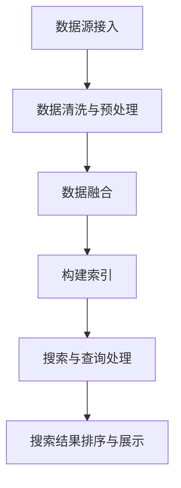
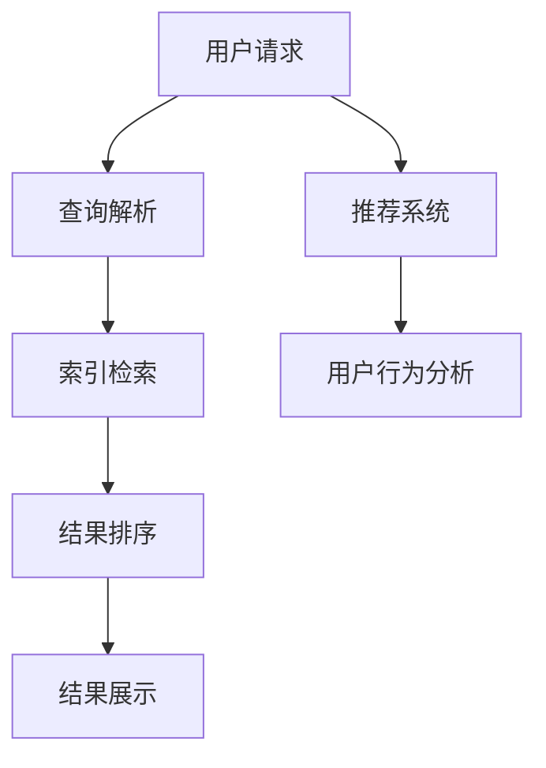

                 

## 文章标题: 跨平台搜索：AI如何整合多渠道数据，提供最优选择

### 关键词：跨平台搜索、AI整合数据、多渠道数据融合、搜索优化、用户体验

### 摘要：
本文深入探讨了跨平台搜索技术的原理、AI在数据整合中的应用，以及如何通过优化策略提供最优的搜索体验。文章分为七个部分，首先概述了跨平台搜索的背景和重要性，然后详细介绍了跨平台搜索的技术架构和AI应用。接着，分析了多渠道数据的类型与特性，以及数据整合和优化的方法。文章进一步探讨了搜索结果的排序与性能优化，并提供了跨平台搜索系统开发的实战案例。最后，文章展望了跨平台搜索的未来发展趋势，并总结了关键要点，为读者提供了全面的技术参考。

## 第一部分：跨平台搜索概述

### 第1章: 跨平台搜索技术原理

#### 1.1 跨平台搜索的概念与重要性

##### 1.1.1 跨平台搜索的定义

跨平台搜索（Cross-Platform Search）是指在一个统一的搜索界面下，同时整合多个平台或渠道的数据资源，提供综合性的搜索服务。这些平台或渠道可能包括电子商务网站、社交媒体、新闻媒体、在线论坛等，涵盖了不同类型的文本、图像、音频和视频等多媒体数据。

##### 1.1.2 跨平台搜索的兴起与发展

跨平台搜索技术的发展可以追溯到互联网早期，随着搜索引擎技术的成熟和大数据时代的到来，跨平台搜索逐渐成为各行业数据整合和用户服务的重要手段。近年来，随着人工智能技术的不断进步，跨平台搜索的功能更加智能化和个性化，为用户提供了更加便捷和高效的搜索体验。

##### 1.1.3 跨平台搜索的核心价值

跨平台搜索的核心价值主要体现在以下几个方面：

1. **提升用户体验**：通过整合多渠道数据，用户可以在一个界面下获取多样化的信息，提高了搜索效率和满意度。
2. **数据整合与利用**：跨平台搜索实现了数据的统一管理和检索，为企业和机构提供了更加全面的数据分析能力。
3. **商业价值挖掘**：跨平台搜索可以帮助企业挖掘用户需求，优化产品和服务，提高市场竞争力。

#### 1.2 跨平台搜索的技术架构

##### 1.2.1 数据源集成

**1.2.1.1 多渠道数据接入**

跨平台搜索的数据源通常来自多个不同的平台和渠道。为了实现数据的统一接入，需要采用多种技术手段，如API调用、Web爬虫和数据交换协议等。这些技术手段可以确保各种类型的数据能够被高效地接入和整合。

**1.2.1.2 数据清洗与预处理**

数据清洗与预处理是跨平台搜索中的关键步骤。在这一过程中，需要对数据进行去重、格式统一、缺失值填充和噪声过滤等操作，确保数据的一致性和质量。此外，还需要对数据进行标注和分类，以便后续的检索和分析。

##### 1.2.2 搜索引擎构建

**1.2.2.1 搜索引擎架构设计**

跨平台搜索引擎的架构设计需要考虑数据规模、查询性能和扩展性等因素。常见的架构设计包括分布式搜索引擎（如Elasticsearch、Apache Solr）和搜索引擎集群（如百度搜索引擎、谷歌搜索引擎）。

**1.2.2.2 搜索算法原理**

搜索算法是跨平台搜索的核心技术之一。常见的搜索算法包括基于关键词匹配的布尔搜索、基于向量空间模型的相似度搜索和基于深度学习的语义搜索等。这些算法可以实现对海量数据的快速检索和精准匹配。

**1.2.2.3 搜索引擎优化策略**

为了提高跨平台搜索的查询性能和用户体验，需要对搜索引擎进行优化。常见的优化策略包括索引优化、查询缓存、垂直搜索和个性化搜索等。

##### 1.3 AI技术在跨平台搜索中的应用

**1.3.1 自然语言处理技术**

自然语言处理（NLP）技术在跨平台搜索中发挥着重要作用。通过NLP技术，可以实现对用户查询和文档内容的语义分析，提高搜索的准确性和智能化水平。常见的NLP技术包括词嵌入、语言模型、命名实体识别和情感分析等。

**1.3.2 推荐系统与个性化搜索**

推荐系统与个性化搜索是跨平台搜索的重要组成部分。通过分析用户行为和兴趣，推荐系统可以为用户提供个性化的搜索结果，提高搜索满意度和转化率。常见的推荐算法包括基于内容的推荐、协同过滤推荐和混合推荐等。

**1.3.3 用户行为分析与建模**

用户行为分析是跨平台搜索的重要手段。通过分析用户的行为数据，可以了解用户的需求和偏好，为搜索结果的排序和推荐提供依据。常见的用户行为分析技术包括点击率分析、停留时间分析和浏览路径分析等。

### 第2章: 多渠道数据整合

#### 2.1 多渠道数据类型与特性

##### 2.1.1 离线数据与实时数据

跨平台搜索涉及到的数据类型主要包括离线数据和实时数据。离线数据是指在搜索系统运行之前已经存在的数据，如电商平台的商品信息、社交媒体的用户动态等。实时数据则是指在搜索过程中动态产生的数据，如用户的搜索查询、点击记录等。

##### 2.1.2 结构化数据与非结构化数据

跨平台搜索的数据源多样，包括结构化数据和非结构化数据。结构化数据是指以表格形式存储的数据，如关系型数据库中的数据。非结构化数据则是指无固定格式的数据，如文本、图像、音频和视频等。

##### 2.1.3 数据源访问与同步

为了实现多渠道数据的整合，需要解决数据源的访问和同步问题。常见的解决方案包括：

1. **API调用**：通过调用各数据源的API接口，获取所需的数据。
2. **Web爬虫**：使用爬虫技术自动抓取互联网上的公开数据。
3. **数据交换协议**：采用标准化的数据交换协议，如HTTP、FTP、SOAP和REST等，实现数据源之间的数据传输。

#### 2.2 数据融合技术

##### 2.2.1 数据清洗与预处理

数据清洗与预处理是数据融合的基础步骤。在这一过程中，需要对数据进行去重、格式统一、缺失值填充和噪声过滤等操作，确保数据的一致性和质量。具体方法如下：

1. **数据去重**：通过比对数据字段，删除重复记录，避免数据冗余。
2. **格式统一**：将不同数据源的格式转换为统一的格式，如将不同编码的文本转换为UTF-8编码。
3. **缺失值填充**：对于缺失的数据，采用平均值、中位数或插值等方法进行填充。
4. **噪声过滤**：去除数据中的噪声和异常值，如去除含有大量特殊字符的文本。

##### 2.2.2 数据融合算法

数据融合算法是跨平台搜索中的关键技术之一。常见的融合算法包括：

1. **最小覆盖集算法**：通过选择最小数量的数据源，使得融合后的数据集覆盖所有源数据。
2. **多源数据集成算法**：通过集成多个数据源，形成一个新的数据集，如基于加权融合的方法。

##### 2.2.3 数据融合评估方法

为了评估数据融合的效果，需要采用合适的评估方法。常见的评估方法包括：

1. **精度评估**：评估融合后的数据集与原始数据集之间的匹配程度。
2. **召回率评估**：评估融合后的数据集能够召回的原始数据记录的比例。
3. **F1值评估**：综合考虑精度和召回率，计算F1值以评估数据融合的整体效果。

#### 2.3 多渠道数据质量评估

##### 2.3.1 数据质量指标

数据质量是跨平台搜索的关键因素之一。为了评估数据质量，需要定义一系列质量指标，如：

1. **完整性**：数据是否完整，是否存在缺失值。
2. **准确性**：数据是否准确，与真实情况是否一致。
3. **一致性**：数据在不同源之间是否一致，是否存在冲突。
4. **及时性**：数据是否及时更新，是否反映了最新的信息。

##### 2.3.2 数据质量评估方法

为了评估数据质量，可以采用以下方法：

1. **对比评估**：通过对比不同数据源的数据，评估数据的一致性和准确性。
2. **统计分析**：采用统计分析方法，评估数据的分布和异常情况。
3. **用户反馈**：通过用户反馈，评估数据对用户需求的满足程度。

##### 2.3.3 数据质量提升策略

为了提升数据质量，可以采用以下策略：

1. **数据源优化**：选择高质量的数据源，优化数据采集和存储过程。
2. **数据清洗**：定期进行数据清洗，去除重复、噪声和异常数据。
3. **数据验证**：采用数据验证方法，确保数据的准确性和一致性。
4. **数据治理**：建立数据治理机制，规范数据的使用和管理。

### 第三部分：跨平台搜索优化策略

#### 第3章: 跨平台搜索优化策略

##### 3.1 搜索结果排序与相关性评估

搜索结果排序是跨平台搜索的重要环节，其目的是将最相关的结果呈现给用户。相关性评估方法分为基于词语匹配和基于语义理解两种。

**3.1.1 相关性评估方法**

1. **基于词语匹配的评估**：通过计算查询词与文档中的词语匹配程度来评估相关性。常见的评估方法包括布尔模型、TF-IDF模型和词袋模型等。

2. **基于语义理解的评估**：通过语义分析技术，理解查询词和文档的含义，评估其相关性。常见的评估方法包括向量空间模型、词嵌入和深度学习模型等。

**3.1.2 搜索结果排序算法**

1. **逆序文档频率（IDF）排序算法**：基于词语匹配的排序算法，通过计算查询词在文档中的逆序文档频率来评估相关性。

2. **BM25排序算法**：基于向量空间模型的排序算法，通过计算查询词与文档的相似度来评估相关性。

##### 3.2 跨平台搜索性能优化

跨平台搜索性能优化是提升用户体验的关键因素。性能优化主要从以下几个方面进行：

**3.2.1 搜索引擎性能瓶颈分析**

1. **查询处理延迟**：由于数据规模和查询负载增加，导致查询处理延迟。
2. **索引构建速度**：索引构建速度慢，影响搜索速度。
3. **并发查询处理**：在高并发情况下，搜索引擎的响应速度和稳定性受到影响。

**3.2.2 索引构建与查询优化**

1. **倒排索引构建**：通过构建倒排索引，提高查询速度。倒排索引将文档中的词语映射到对应的文档，实现快速检索。

2. **查询缓存技术**：通过缓存查询结果，减少重复查询的次数，提高查询响应速度。

**3.2.3 数据存储优化**

1. **数据分片**：将大量数据分散存储到多个节点，提高查询处理能力和数据存储容量。
2. **数据压缩**：通过数据压缩技术，减少数据存储空间和传输带宽。

##### 3.3 跨平台搜索用户体验优化

用户体验是跨平台搜索的核心目标之一。为了优化用户体验，可以从以下几个方面进行：

**3.3.1 搜索建议与关键词提示**

1. **搜索建议**：在用户输入查询词时，提供相关的搜索建议，帮助用户快速找到所需信息。
2. **关键词提示**：在用户输入查询词时，提供相关的关键词提示，帮助用户扩展查询范围。

**3.3.2 搜索结果展示与交互设计**

1. **搜索结果展示**：优化搜索结果展示方式，提高结果的视觉吸引力，如使用卡片式展示、图片搜索等。
2. **交互设计**：优化用户与搜索系统的交互设计，提高用户操作的便捷性和满意度。

**3.3.3 用户体验评估与反馈机制**

1. **用户体验评估**：通过用户反馈和数据分析，评估搜索系统的用户体验，识别存在的问题。
2. **反馈机制**：建立反馈机制，及时收集用户反馈，优化搜索系统，提高用户体验。

### 第四部分：跨平台搜索应用实战

#### 第4章: 跨平台搜索系统开发

##### 4.1 跨平台搜索系统架构设计

跨平台搜索系统架构设计需要考虑系统的可扩展性、可靠性和性能。以下是常见的架构设计原则和组件：

**4.1.1 系统模块划分**

1. **数据接入模块**：负责接入各种数据源，包括结构化数据和非结构化数据。
2. **数据预处理模块**：负责清洗、格式统一、缺失值填充和噪声过滤等预处理操作。
3. **搜索引擎模块**：负责构建索引、处理查询和返回搜索结果。
4. **搜索算法模块**：负责实现各种搜索算法，如布尔搜索、相似度搜索和深度学习搜索等。
5. **推荐系统模块**：负责分析用户行为和兴趣，提供个性化推荐结果。
6. **用户接口模块**：负责与用户交互，接收用户查询请求和展示搜索结果。

**4.1.2 系统接口设计**

1. **API接口**：提供与外部系统集成的API接口，如与其他业务系统的数据交换接口。
2. **Web界面**：提供用户访问的Web界面，包括搜索框、搜索结果展示和相关推荐等。

**4.1.3 系统部署与运维**

1. **分布式部署**：将系统部署到多个节点，提高系统的可用性和扩展性。
2. **负载均衡**：通过负载均衡技术，实现查询请求的分布式处理，提高系统的响应速度。
3. **监控与日志分析**：建立监控和日志分析系统，实时监控系统的运行状态，快速发现和处理问题。

##### 4.2 搜索引擎开发与实现

**4.2.1 索引构建与查询处理**

1. **索引构建**：通过构建倒排索引，实现高效的搜索查询。倒排索引将文档中的词语映射到对应的文档，提高查询速度。
2. **查询处理**：处理用户输入的查询请求，解析查询关键词，构建查询语句，然后在索引中检索相关文档。

**4.2.2 搜索算法实现**

1. **基于关键词匹配的搜索算法**：通过计算查询词与文档中的关键词匹配程度，评估文档的相关性，如布尔搜索和TF-IDF搜索。
2. **基于语义理解的搜索算法**：通过语义分析技术，理解查询词和文档的含义，评估文档的相关性，如向量空间模型和深度学习搜索。

**4.2.3 性能优化与调优**

1. **索引优化**：通过索引优化技术，提高搜索查询的效率，如索引压缩、索引分片等。
2. **查询优化**：通过查询优化技术，减少查询处理的时间和资源消耗，如查询缓存、分词优化等。
3. **系统调优**：通过系统调优，提高搜索系统的整体性能和稳定性，如负载均衡、分布式缓存等。

##### 4.3 跨平台搜索系统集成与测试

**4.3.1 与其他系统的接口集成**

跨平台搜索系统需要与其他系统进行集成，如电子商务系统、社交媒体平台等。集成主要通过API接口和数据交换协议实现。

**4.3.2 搜索功能测试与优化**

1. **功能测试**：对搜索系统的各个功能进行测试，确保其正确性和稳定性。
2. **性能测试**：对搜索系统的性能进行测试，评估其响应速度和并发处理能力。
3. **优化策略**：根据测试结果，优化搜索系统的性能和稳定性，如缓存策略、查询优化等。

**4.3.3 系统部署与上线**

1. **系统部署**：将搜索系统部署到生产环境，确保系统的稳定运行。
2. **上线计划**：制定上线计划，包括系统测试、数据迁移、上线发布等步骤。
3. **上线支持**：提供上线支持，确保系统的顺利运行和用户反馈的处理。

### 第五部分：跨平台搜索案例分析

#### 第5章：跨平台搜索实战案例分析

##### 5.1 案例一：电商平台跨平台搜索系统

**5.1.1 案例背景与需求分析**

电商平台通常拥有大量的商品信息、用户评论、商家数据等，用户在购买商品时需要进行搜索。为了提高用户体验和销售额，电商平台需要实现跨平台搜索功能，整合多渠道数据，提供精准的搜索结果。

**5.1.2 系统架构与关键技术**

1. **系统架构**：电商平台跨平台搜索系统采用分布式架构，包括数据接入模块、数据预处理模块、搜索引擎模块、搜索算法模块和用户接口模块。
2. **关键技术**：采用Elasticsearch作为搜索引擎，使用基于深度学习的搜索算法，实现文本、图像和视频等多媒体数据的搜索。

**5.1.3 开发与实现细节**

1. **数据接入**：通过API接口和Web爬虫技术，接入电商平台的商品信息、用户评论和商家数据。
2. **数据预处理**：对接入的数据进行清洗、格式统一和缺失值填充等预处理操作，确保数据的一致性和质量。
3. **搜索算法**：采用基于深度学习的搜索算法，实现对文本、图像和视频的精准搜索。

**5.1.4 性能优化与调优策略**

1. **索引优化**：采用索引分片和索引压缩技术，提高搜索查询的效率。
2. **查询优化**：采用查询缓存技术，减少查询处理的资源消耗。
3. **系统调优**：通过负载均衡和分布式缓存技术，提高搜索系统的整体性能和稳定性。

##### 5.2 案例二：社交媒体平台跨平台搜索

**5.2.1 案例背景与需求分析**

社交媒体平台拥有大量的用户生成内容，如文本、图片、视频和音频等。用户在社交媒体平台上需要进行信息的检索和浏览，为了提高用户体验和内容推荐质量，社交媒体平台需要实现跨平台搜索功能，整合多渠道数据。

**5.2.2 系统架构与关键技术**

1. **系统架构**：社交媒体平台跨平台搜索系统采用分布式架构，包括数据接入模块、数据预处理模块、搜索引擎模块、搜索算法模块和用户接口模块。
2. **关键技术**：采用Apache Solr作为搜索引擎，使用基于内容的推荐算法，实现文本、图像和视频等多媒体数据的搜索。

**5.2.3 开发与实现细节**

1. **数据接入**：通过API接口和Web爬虫技术，接入社交媒体平台的内容数据，包括用户生成的文本、图片、视频和音频等。
2. **数据预处理**：对接入的数据进行清洗、格式统一和缺失值填充等预处理操作，确保数据的一致性和质量。
3. **搜索算法**：采用基于内容的推荐算法，实现对文本、图像和视频的精准搜索。

**5.2.4 性能优化与调优策略**

1. **索引优化**：采用索引分片和索引压缩技术，提高搜索查询的效率。
2. **查询优化**：采用查询缓存技术，减少查询处理的资源消耗。
3. **系统调优**：通过负载均衡和分布式缓存技术，提高搜索系统的整体性能和稳定性。

### 第六部分：跨平台搜索的未来发展趋势

#### 第6章：跨平台搜索技术的发展趋势

##### 6.1 跨平台搜索技术新方向

随着人工智能、物联网和边缘计算等技术的发展，跨平台搜索技术也在不断演进。以下是一些跨平台搜索技术的新方向：

**6.1.1 深度学习与跨平台搜索**

深度学习技术在跨平台搜索中发挥着重要作用。通过深度学习算法，可以实现对大规模数据的自动特征提取和分类，提高搜索的准确性和智能化水平。例如，基于深度学习的文本分类和情感分析技术可以用于搜索结果的排序和推荐。

**6.1.2 跨平台搜索在边缘计算中的应用**

边缘计算是一种将计算能力分布在靠近数据源的设备上的计算模式，可以减少数据传输延迟和网络带宽消耗。在跨平台搜索中，边缘计算可以实现实时数据分析和查询处理，提高搜索的响应速度和用户体验。

**6.1.3 跨平台搜索与物联网的结合**

物联网（IoT）技术的发展使得跨平台搜索的应用场景更加广泛。例如，智能家居设备、智能医疗设备和智能交通系统等都可以通过跨平台搜索实现数据的整合和智能分析，提供个性化服务。

##### 6.2 跨平台搜索面临的挑战与解决方案

**6.2.1 数据安全与隐私保护**

随着跨平台搜索的数据规模和多样性增加，数据安全与隐私保护成为重要的挑战。为了解决这一问题，可以采用以下解决方案：

1. **数据加密**：采用数据加密技术，确保数据在传输和存储过程中的安全性。
2. **访问控制**：通过访问控制策略，限制用户对敏感数据的访问权限。
3. **匿名化处理**：对用户数据进行匿名化处理，保护用户的隐私。

**6.2.2 跨平台搜索系统的可扩展性与弹性**

跨平台搜索系统需要具备高可扩展性和弹性，以应对大规模数据和大量并发查询的需求。以下是一些解决方案：

1. **分布式架构**：采用分布式架构，将系统拆分为多个节点，实现数据的分布式存储和查询处理。
2. **弹性伸缩**：通过自动化的伸缩策略，根据实际负载动态调整系统资源，确保系统的稳定运行。
3. **负载均衡**：采用负载均衡技术，实现查询请求的分布式处理，提高系统的响应速度和吞吐量。

**6.2.3 跨平台搜索用户体验优化**

跨平台搜索用户体验优化是提升用户满意度和忠诚度的关键。以下是一些优化策略：

1. **搜索建议与关键词提示**：提供智能搜索建议和关键词提示，帮助用户快速找到所需信息。
2. **个性化推荐**：通过分析用户行为和兴趣，提供个性化的搜索结果和内容推荐。
3. **搜索结果展示与交互设计**：优化搜索结果展示方式和交互设计，提高用户的操作便捷性和满意度。

### 第七部分：跨平台搜索总结与展望

#### 第7章：跨平台搜索的总结与展望

##### 7.1 跨平台搜索技术的核心要点

跨平台搜索技术是现代信息检索系统中的重要组成部分，其核心要点包括：

1. **数据源集成**：通过多种技术手段，实现多渠道数据的接入和整合。
2. **搜索算法**：采用先进的搜索算法，提高搜索结果的准确性和用户体验。
3. **性能优化**：通过优化策略，提高搜索系统的性能和可扩展性。
4. **用户体验**：注重用户体验优化，提供智能化的搜索服务和个性化推荐。

##### 7.2 跨平台搜索的未来发展展望

跨平台搜索技术在未来将继续发展，并在以下几个方面展现出巨大的潜力：

1. **深度学习与人工智能**：深度学习技术将进一步推动跨平台搜索的智能化和个性化水平。
2. **物联网与边缘计算**：跨平台搜索将在物联网和边缘计算领域发挥重要作用，实现实时数据分析和智能决策。
3. **数据安全与隐私保护**：随着数据隐私和安全问题的日益突出，跨平台搜索将加强对数据安全和隐私保护的关注。
4. **多渠道融合**：跨平台搜索将实现更加全面和多元的数据融合，提供更加丰富和个性化的搜索体验。

### 附录

#### 附录A：跨平台搜索相关工具与资源

**A.1 跨平台搜索开发工具**

1. **Elasticsearch**：一款开源的分布式搜索引擎，适用于大规模数据检索。
2. **Apache Solr**：一款开源的企业级搜索引擎，具有丰富的功能和强大的扩展性。
3. **百度搜索开放平台**：提供API接口和SDK，支持自定义搜索功能。

**A.2 跨平台搜索算法资源**

1. **论文资源**：可以通过学术数据库（如IEEE Xplore、ACM Digital Library）获取相关领域的论文。
2. **开源代码与项目**：在GitHub等代码托管平台上可以找到许多开源的跨平台搜索项目。

#### 附录B：Mermaid流程图

**B.1 数据源集成流程**



**B.2 搜索引擎架构设计**



#### 附录C：伪代码与数学公式

**C.1 数据融合算法伪代码**

```python
function data_fusion(data_sources):
    result = []
    for source in data_sources:
        data = source.fetch_data()
        clean_data = clean_data(data)
        result.append(clean_data)
    return merge_data(result)

function clean_data(data):
    data = remove_duplicates(data)
    data = unify_format(data)
    data = fill_missing_values(data)
    data = filter_noise(data)
    return data

function merge_data(data_list):
    result = []
    for data in data_list:
        for item in data:
            result.append(item)
    return result
```

**C.2 搜索结果排序算法伪代码**

```python
function rank_documents(queries, documents):
    scores = []
    for query in queries:
        for document in documents:
            score = calculate_similarity(query, document)
            scores.append((document, score))
    scores = sort_by_score(scores)
    return scores

function calculate_similarity(query, document):
    query_vector = embed_query(query)
    document_vector = embed_document(document)
    similarity = cosine_similarity(query_vector, document_vector)
    return similarity

function sort_by_score(scores):
    scores = sorted(scores, key=lambda x: x[1], reverse=True)
    return scores
```

**C.3 数学模型与公式**

$$
\text{相似度} = \frac{\text{query\_vector} \cdot \text{document\_vector}}{\|\text{query\_vector}\| \|\text{document\_vector}\|}
$$

#### 附录D：项目实战代码解析

**D.1 搜索引擎开发环境搭建**

1. 安装Elasticsearch：通过官方网站下载Elasticsearch安装包并解压。
2. 启动Elasticsearch：运行elasticsearch.bat（Windows）或elasticsearch.sh（Linux）。
3. 安装Kibana：通过官方网站下载Kibana安装包并解压。
4. 启动Kibana：运行kibana.bat（Windows）或kibana.sh（Linux）。

**D.2 源代码实现与解读**

```java
// 搜索引擎入口
public class SearchEngine {
    public static void main(String[] args) {
        // 创建Elasticsearch客户端
        Client client = HttpClientFactory.createClient();
        // 创建索引
        createIndex(client);
        // 添加文档
        addDocument(client);
        // 搜索文档
        searchDocuments(client);
    }
    
    // 创建索引
    public static void createIndex(Client client) {
        // 索引名称
        String indexName = "search_index";
        // 创建索引请求
        CreateIndexRequest request = new CreateIndexRequest(indexName);
        // 执行创建索引操作
        client.index().create(request);
    }
    
    // 添加文档
    public static void addDocument(Client client) {
        // 文档ID
        String id = "1";
        // 文档内容
        String content = "这是一个示例文档。";
        // 文档请求
        IndexRequest request = new IndexRequest("search_index", id).source(content);
        // 执行添加文档操作
        client.index(request);
    }
    
    // 搜索文档
    public static void searchDocuments(Client client) {
        // 搜索关键字
        String query = "示例";
        // 搜索请求
        SearchRequest request = new SearchRequest("search_index");
        request.source().query(new MatchQuery("content", query));
        // 执行搜索操作
        SearchResponse response = client.search(request);
        // 遍历搜索结果
        for (SearchHit hit : response.getHits()) {
            String content = hit.getSource().getString("content");
            System.out.println(content);
        }
    }
}
```

**D.3 代码解读与分析**

该代码实现了一个简单的搜索引擎，主要功能包括创建索引、添加文档和搜索文档。

1. **创建索引**：通过`createIndex`方法创建名为`search_index`的索引。
2. **添加文档**：通过`addDocument`方法添加一个示例文档，文档内容为`"这是一个示例文档。"`。
3. **搜索文档**：通过`searchDocuments`方法搜索包含关键字`"示例"`的文档，并将搜索结果输出。

该代码展示了如何使用Elasticsearch进行简单的索引操作和搜索操作，为实际开发提供了参考。

#### 附录E：跨平台搜索参考书目

**E.1 跨平台搜索技术基础**

1. 《搜索引擎设计原理与应用》
2. 《信息检索与搜索引擎技术》
3. 《跨平台搜索：技术原理与实践》

**E.2 自然语言处理与搜索算法**

1. 《自然语言处理综合教程》
2. 《大规模自然语言处理》
3. 《词嵌入与深度学习》

**E.3 跨平台搜索应用案例研究**

1. 《社交媒体搜索：方法与实践》
2. 《电商平台搜索：技术与案例》
3. 《物联网搜索：原理与应用》

### 结语

跨平台搜索技术的发展为信息检索领域带来了新的机遇和挑战。本文从多个角度对跨平台搜索进行了全面分析，介绍了技术原理、算法实现和实战应用。通过深入探讨跨平台搜索的关键技术和优化策略，本文为开发者和研究者提供了有益的参考。随着人工智能和物联网等技术的不断进步，跨平台搜索将继续发挥重要作用，为用户提供更加智能和便捷的搜索体验。让我们共同期待跨平台搜索的未来发展！

