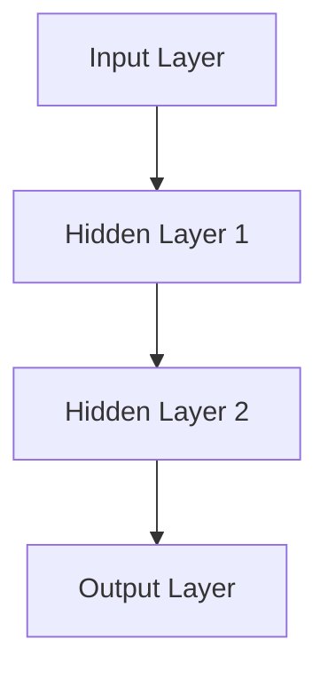
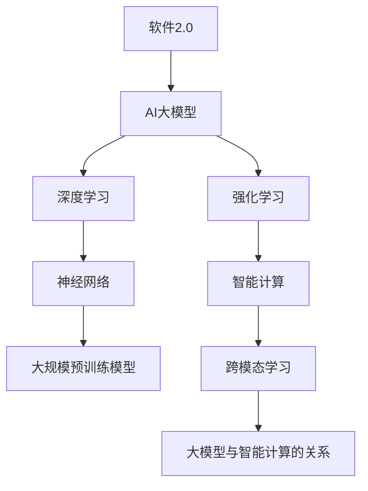

                 


# 《软件2.0 的发展趋势：深度学习、强化学习》

> 关键词：软件2.0，深度学习，强化学习，AI大模型，企业级应用，跨模态学习，智能计算，AI伦理与法律问题

> 摘要：本文从软件2.0时代的背景出发，深入探讨了深度学习和强化学习在AI大模型中的应用，分析了AI大模型技术基础，企业级AI应用开发准备，AI大模型训练与优化，部署与运维，以及AI大模型在行业应用的前沿与未来趋势。同时，本文还探讨了AI大模型与智能计算的关系，AI伦理与法律问题，以及提供了AI大模型开发工具与资源的详细介绍。

---

### 目录大纲

# 《软件2.0 的发展趋势：深度学习、强化学习》

## 第一部分: 软件2.0时代的AI大模型基础

### 第1章: 软件2.0与AI大模型概述

### 第2章: AI大模型技术基础

### 第3章: 企业AI战略规划

### 第4章: 企业AI开发平台搭建

### 第5章: AI大模型训练与优化

### 第6章: AI大模型部署与运维

## 第二部分: 企业级AI应用开发准备

### 第7章: AI大模型在行业应用

### 第8章: AI大模型前沿技术

### 第9章: AI大模型未来发展趋势

## 第三部分: AI大模型前沿与未来趋势

### 第10章: AI伦理与法律问题

### 附录

#### 附录A: AI大模型开发工具与资源

## 软件2.0与AI大模型关系流程图

---

### 第1章 软件2.0与AI大模型概述

#### 1.1 软件2.0时代的到来

随着互联网的普及和大数据时代的到来，软件行业正经历着从软件1.0时代向软件2.0时代的转变。软件1.0时代以单机应用为主，用户与软件的交互主要依赖于图形用户界面（GUI）和简单的脚本编程。而软件2.0时代则强调数据驱动和智能化，通过互联网和云计算技术，实现软件与用户、硬件和其他软件的深度整合。

#### 1.1.1 从软件1.0到软件2.0的演进

软件1.0时代的代表性技术是简单的GUI和桌面应用，如Windows操作系统和Microsoft Office系列软件。这些软件以静态的信息处理为主，用户需要通过手动操作来完成大部分任务。

软件2.0时代则将软件从单一的应用转变为一个平台，用户可以通过浏览器和移动设备随时随地访问和使用软件。软件2.0的核心特征是数据驱动，通过收集和分析用户数据，实现个性化服务和智能化推荐。例如，电子商务平台通过用户行为数据推荐商品，社交媒体平台通过用户关系数据推荐好友和内容。

#### 1.1.2 大模型在软件2.0中的核心地位

在软件2.0时代，AI大模型成为推动软件智能化和自动化的核心技术。AI大模型通过处理海量数据，提取出有价值的信息，为软件系统提供智能化的决策支持。

1. **数据驱动的核心引擎**：AI大模型能够通过处理海量数据，提取出有价值的信息，为软件系统提供智能化的决策支持。例如，在电子商务平台上，AI大模型可以根据用户的浏览记录和购买行为预测用户的偏好，从而推荐相关的商品。

2. **业务创新的助推器**：AI大模型的应用可以推动业务模式创新，提升企业竞争力。例如，在金融行业中，AI大模型可以用于信贷风险评估和量化交易，帮助金融机构降低风险和提升收益。

3. **用户体验的提升者**：通过AI大模型，软件系统能够更好地理解用户需求，提供个性化的服务。例如，在智能家居领域，AI大模型可以根据用户的生活习惯和学习偏好，自动调整家居环境，提升用户的舒适度和满意度。

#### 1.1.3 企业级应用开发的新范式

在软件2.0时代，企业级应用开发呈现出以下新范式：

1. **数据密集型开发**：企业需要收集、存储、处理海量数据，为AI大模型提供训练素材。数据密集型开发要求企业建立完善的数据收集、存储和处理体系，以确保数据的完整性和准确性。

2. **模块化与组件化**：企业级应用开发强调模块化和组件化设计，以提高系统的可扩展性和可维护性。通过模块化和组件化设计，企业可以将复杂的业务逻辑拆分成多个独立的模块和组件，实现代码的复用和优化。

3. **持续集成与持续部署（CI/CD）**：持续集成和持续部署是企业级应用开发的重要手段，通过自动化工具，实现开发、测试、部署的快速迭代。CI/CD可以显著提高开发效率，降低部署风险，确保软件系统的稳定性。

#### 1.2 AI大模型的定义与特点

AI大模型是指具有大规模参数、能够处理海量数据、具有高度自适应性和泛化能力的神经网络模型。与传统的小型神经网络模型相比，AI大模型具有以下特点：

1. **大规模参数**：AI大模型通常包含数百万甚至数十亿个参数，能够捕捉数据中的复杂模式和关系。

2. **海量数据处理**：AI大模型能够处理海量数据，从数据中提取有价值的信息，为业务决策提供支持。

3. **高度自适应**：AI大模型可以通过学习不断优化自身性能，适应不同的业务场景和需求。

4. **泛化能力**：AI大模型具有较好的泛化能力，能够在不同的数据集和应用场景中保持较高的性能。

#### 1.2.1 AI大模型的定义

AI大模型（Artificial Intelligence Large Models）是指在神经网络架构中具有大规模参数和结构复杂的模型。这些模型通常由数百万到数十亿个参数组成，能够在各种复杂数据集上进行训练和优化。AI大模型的核心在于其能够通过深度学习算法，从海量数据中自动提取特征，进行模式识别和预测。

#### 1.2.2 AI大模型的核心特点

1. **参数规模巨大**：AI大模型拥有数百万到数十亿个参数，这使得它们能够捕捉数据中的复杂模式和潜在关联。

2. **自适应性**：AI大模型通过不断学习和调整参数，能够适应不同的业务场景和数据分布。

3. **数据处理能力**：AI大模型能够高效地处理和分析海量数据，从数据中提取有价值的信息。

4. **泛化能力**：AI大模型具有较好的泛化能力，能够在新的数据集和应用场景中保持较高的性能。

5. **可扩展性**：AI大模型的结构设计使得它们易于扩展和集成到不同的系统和应用中。

#### 1.2.3 AI大模型与传统AI的区别

传统AI（Artificial Intelligence）通常指的是基于规则和算法的小型智能系统，如专家系统和决策树。这些系统在特定的领域内表现出色，但往往缺乏灵活性，难以应对复杂多变的实际场景。相比之下，AI大模型具有以下区别：

1. **规模和复杂性**：传统AI模型通常包含较少的参数，而AI大模型具有大规模参数，能够处理更为复杂的问题。

2. **数据处理能力**：传统AI模型通常依赖手工特征工程，而AI大模型能够自动从数据中提取特征，无需人工干预。

3. **自适应能力**：传统AI模型难以适应新的数据分布和业务场景，而AI大模型通过不断学习和调整，能够适应不断变化的环境。

4. **泛化能力**：传统AI模型在特定领域内表现良好，但AI大模型具有较好的泛化能力，能够在多个领域和应用场景中发挥作用。

5. **应用范围**：传统AI模型通常应用于特定领域，而AI大模型能够应用于广泛的业务场景，如自然语言处理、计算机视觉和推荐系统。

#### 1.3 主流AI大模型简介

在AI大模型领域，有许多知名的大模型，它们在不同的应用场景中展现出强大的性能。以下是一些主流的AI大模型及其简要介绍：

1. **GPT系列模型**：GPT（Generative Pre-trained Transformer）系列模型是由OpenAI开发的一组基于Transformer架构的预训练语言模型。GPT-3是其中最为著名的模型，具有超过1750亿个参数，能够生成高质量的自然语言文本，广泛应用于聊天机器人、内容生成和翻译等领域。

2. **BERT系列模型**：BERT（Bidirectional Encoder Representations from Transformers）是由Google开发的预训练语言模型，采用了双向Transformer架构。BERT在自然语言理解任务中表现出色，广泛应用于问答系统、搜索引擎和机器翻译等领域。

3. **ViT系列模型**：ViT（Vision Transformer）是Google开发的图像处理模型，采用了Transformer架构。ViT将图像划分为 patches 并进行线性嵌入，使得模型能够处理图像数据，并在图像分类、目标检测等任务中取得优异性能。

4. **T5系列模型**：T5（Text-to-Text Transfer Transformer）是由DeepMind开发的通用文本处理模型，采用了Transformer架构。T5能够处理各种文本处理任务，如问答、摘要生成和翻译等，具有广泛的应用前景。

5. **其他知名大模型**：如AlphaGo（深度强化学习模型）、Wav2Vec（语音处理模型）、BERTweet（结合文本和图像的预训练模型）等，都在各自领域内取得了显著成果。

#### 1.4 AI大模型在企业中的应用前景

AI大模型在企业中的应用前景广阔，主要表现在以下几个方面：

1. **自动化与效率提升**：AI大模型能够自动化处理大量数据，提高业务流程的效率和准确性。例如，在客户服务领域，AI大模型可以自动处理客户咨询，提高响应速度和服务质量。

2. **业务洞察与决策支持**：AI大模型通过对企业数据的分析和挖掘，能够为企业提供深度的业务洞察和决策支持。例如，在金融领域，AI大模型可以用于风险评估、市场预测和投资决策。

3. **个性化服务与用户体验**：AI大模型能够根据用户行为和偏好提供个性化的服务和推荐，提升用户体验。例如，在电子商务领域，AI大模型可以根据用户的历史购买记录推荐相关商品，提高销售额。

4. **成本节约与风险控制**：AI大模型能够帮助企业降低运营成本和风险。例如，在制造业，AI大模型可以用于生产过程优化、质量检测和设备维护，提高生产效率和质量。

5. **新业务模式与市场拓展**：AI大模型的应用可以帮助企业发现新的商业机会和市场拓展途径。例如，在医疗领域，AI大模型可以用于疾病诊断、药物研发和健康管理，为企业开拓新的市场空间。

#### 1.4.1 AI大模型的潜在应用领域

AI大模型的潜在应用领域非常广泛，以下是其中一些主要的应用领域：

1. **金融领域**：在金融领域，AI大模型可以用于风险管理、市场预测、信用评估、量化交易等方面。例如，通过分析历史金融数据和市场趋势，AI大模型可以预测股票价格波动，帮助投资者做出更准确的决策。

2. **医疗领域**：在医疗领域，AI大模型可以用于疾病诊断、医学影像分析、药物研发、健康管理等方面。例如，通过分析患者的医疗记录和医学影像数据，AI大模型可以帮助医生更准确地诊断疾病，提高治疗效果。

3. **零售领域**：在零售领域，AI大模型可以用于商品推荐、库存管理、价格优化、客户服务等方面。例如，通过分析消费者的购买行为和偏好，AI大模型可以提供个性化的商品推荐，提高销售额和客户满意度。

4. **制造业**：在制造业，AI大模型可以用于生产过程优化、质量检测、设备维护等方面。例如，通过实时监控生产设备和生产线，AI大模型可以预测设备故障和产品质量问题，提高生产效率和质量。

5. **能源领域**：在能源领域，AI大模型可以用于电力需求预测、能源管理、设备维护等方面。例如，通过分析历史能源数据和气象数据，AI大模型可以预测电力需求，优化能源分配，提高能源利用效率。

6. **交通领域**：在交通领域，AI大模型可以用于交通流量预测、路线规划、车辆调度等方面。例如，通过分析交通数据和历史路线信息，AI大模型可以预测交通拥堵情况，优化路线规划，提高交通效率。

#### 1.4.2 企业采用AI大模型的优势

企业采用AI大模型具有以下优势：

1. **高效的数据处理**：AI大模型能够高效地处理海量数据，快速提取有价值的信息，为企业提供实时决策支持。

2. **智能化的业务流程**：AI大模型的应用可以自动化业务流程，减少人工干预，提高业务效率和质量。

3. **精准的市场洞察**：AI大模型可以通过数据分析为企业提供深度的市场洞察，帮助企业制定更有效的市场策略。

4. **个性化的用户体验**：AI大模型可以根据用户行为和偏好提供个性化的服务和推荐，提升用户满意度和忠诚度。

5. **创新的商业模式**：AI大模型的应用可以帮助企业发现新的商业机会和市场拓展途径，推动业务创新。

#### 1.4.3 AI大模型应用的挑战与机遇

尽管AI大模型在企业中具有广泛的应用前景，但其实施和应用也面临一系列挑战和机遇：

1. **数据隐私和安全**：企业需要确保数据的安全和隐私，遵循相关法律法规，避免数据泄露和滥用。

2. **算法公平性和透明度**：AI大模型在决策过程中可能存在歧视性和偏见，需要确保算法的公平性和透明度，接受外部审查和监督。

3. **技术更新和迭代**：AI大模型的技术不断更新和迭代，企业需要持续投入研发和培训，以保持技术优势。

4. **人才缺口**：AI大模型应用需要专业的算法工程师和数据科学家，企业需要吸引和培养相关人才。

5. **技术落地和规模化**：将AI大模型从实验室应用到实际业务场景，需要解决技术落地和规模化问题，提高系统的稳定性和可扩展性。

### 第2章 AI大模型技术基础

#### 2.1 深度学习与神经网络基础

深度学习（Deep Learning）是人工智能（AI）的一个重要分支，基于多层神经网络（Neural Networks）对数据进行学习、建模和预测。深度学习通过模拟人脑神经元之间的连接和激活机制，实现复杂模式识别和特征提取。

##### 2.1.1 神经网络的基本结构

神经网络由多个层次（输入层、隐藏层、输出层）和神经元组成。每个神经元由权重、偏置和激活函数构成。其基本结构如下：



每个神经元接收来自前一层神经元的输入信号，通过加权求和后加上偏置，再通过激活函数进行非线性变换，输出结果传递给下一层神经元。

神经元计算公式如下：

$$
Z = \sum_{i} w_{i}x_{i} + b
$$

$$
a = \sigma(Z)
$$

其中，$Z$为加权求和的结果，$w_{i}$为权重，$x_{i}$为输入值，$b$为偏置，$\sigma$为激活函数。

常见的激活函数包括：

- **Sigmoid函数**：
  $$
  \sigma(z) = \frac{1}{1 + e^{-z}}
  $$

- **ReLU函数**（Rectified Linear Unit）：
  $$
  \sigma(z) =
  \begin{cases}
  0 & \text{if } z < 0 \\
  z & \text{if } z \geq 0
  \end{cases}
  $$

- **Tanh函数**：
  $$
  \sigma(z) = \frac{e^z - e^{-z}}{e^z + e^{-z}}
  $$

##### 2.1.2 常见的深度学习架构

深度学习架构包括卷积神经网络（CNN）、循环神经网络（RNN）、Transformer等。

1. **卷积神经网络（CNN）**：适用于图像处理任务，通过卷积层、池化层等结构提取图像特征。

2. **循环神经网络（RNN）**：适用于序列数据处理任务，通过隐藏状态记忆序列信息。

3. **Transformer**：适用于自然语言处理任务，通过自注意力机制实现全局信息交互。

##### 2.1.3 深度学习优化算法

深度学习优化算法包括梯度下降（GD）、随机梯度下降（SGD）、Adam等。

1. **梯度下降（Gradient Descent）**：通过计算损失函数关于参数的梯度，不断更新参数，以最小化损失函数。

2. **随机梯度下降（Stochastic Gradient Descent，SGD）**：在GD的基础上，每次迭代使用一部分训练样本的梯度更新参数。

3. **Adam**：结合SGD和动量项，自适应调整学习率。

#### 2.2 自然语言处理技术概览

自然语言处理（Natural Language Processing，NLP）是人工智能的重要应用领域，涉及文本的自动处理和理解。NLP技术主要包括词嵌入、序列模型、注意力机制和转换器架构等。

##### 2.2.1 词嵌入技术

词嵌入（Word Embedding）是将自然语言文本映射到向量空间的技术。常见的词嵌入技术包括：

1. **Word2Vec**：通过训练词向量，使语义相近的词在向量空间中距离较近。

2. **GloVe**（Global Vectors for Word Representation）：通过矩阵分解技术学习词向量，提高词向量的质量。

3. **BERT**（Bidirectional Encoder Representations from Transformers）：通过双向Transformer模型预训练词向量，同时捕获词的上下文信息。

##### 2.2.2 序列模型与注意力机制

序列模型（Sequence Models）适用于处理序列数据，如文本、语音和时序数据。常见的序列模型包括：

1. **循环神经网络（RNN）**：通过隐藏状态记忆序列信息。

2. **长短时记忆网络（LSTM）**：改进RNN，解决长距离依赖问题。

3. **门控循环单元（GRU）**：简化LSTM结构，提高计算效率。

注意力机制（Attention Mechanism）是一种用于处理序列数据的机制，能够自动聚焦于序列中的关键信息。常见的注意力机制包括：

1. **单向注意力**：对输入序列的每个元素分配不同的权重。

2. **多头注意力**：将输入序列拆分为多个部分，分别计算注意力权重。

##### 2.2.3 转换器架构详解

转换器（Transformer）是一种基于自注意力机制的深度学习模型，适用于自然语言处理任务。转换器的主要组成部分包括：

1. **编码器（Encoder）**：用于处理输入序列，生成编码表示。

2. **解码器（Decoder）**：用于生成输出序列，解码编码表示。

3. **自注意力机制**：通过计算输入序列中每个元素之间的注意力权重，实现全局信息交互。

转换器的工作流程如下：

1. **编码器**：将输入序列编码为向量序列，每个向量表示序列中的一个元素。

2. **自注意力**：计算编码器输出的每个向量之间的注意力权重，生成加权向量序列。

3. **解码器**：解码加权向量序列，生成输出序列。

转换器的优点包括：

1. **并行计算**：自注意力机制使得转换器能够并行计算，提高计算效率。

2. **全局信息交互**：通过自注意力机制，转换器能够捕获输入序列中的全局信息，提高模型性能。

#### 2.3 大规模预训练模型原理

大规模预训练模型（Large-scale Pre-trained Models）是近年来NLP领域的重要突破，通过在大量数据上进行预训练，模型能够捕获丰富的语言知识和上下文信息。以下介绍大规模预训练模型的原理：

##### 2.3.1 预训练的概念与意义

预训练（Pre-training）是指在特定任务之前，对模型进行大规模数据训练，使其具备一定的通用知识和能力。大规模预训练模型的意义在于：

1. **通用语言表示**：通过预训练，模型能够学习到通用的语言表示，提高模型在不同任务上的性能。

2. **减少标注数据需求**：预训练模型能够从大规模未标注数据中学习，降低对标注数据的依赖。

3. **提高模型泛化能力**：预训练模型通过学习大量数据，具备更好的泛化能力，能够应对不同的应用场景。

##### 2.3.2 自监督学习方法

自监督学习（Self-supervised Learning）是一种无需人工标注的数据学习方法，通过利用数据自身的结构信息进行训练。自监督学习在预训练中具有重要意义：

1. **无监督学习**：自监督学习无需标注数据，能够从大规模未标注数据中提取有价值的信息。

2. **任务适应性**：自监督学习能够为特定任务提供预训练模型，提高模型在特定任务上的性能。

常见的自监督学习方法包括：

1. **Masked Language Model（MLM）**：通过遮盖输入文本的一部分，预测遮盖的词语。

2. **Next Sentence Prediction（NSP）**：预测两个句子之间是否存在连续关系。

3. **Recurrent Sequence Model（Recurrent Sequence Model，ReSeMo）**：利用循环神经网络对序列数据进行建模。

##### 2.3.3 迁移学习与微调技术

迁移学习（Transfer Learning）是一种利用预训练模型在特定任务上进行微调的技术。迁移学习的主要步骤包括：

1. **预训练**：在大量数据上进行预训练，使模型具备通用语言知识和能力。

2. **微调（Fine-tuning）**：在特定任务的数据集上进行微调，使模型适应特定任务。

微调技术能够提高模型在特定任务上的性能，主要原理如下：

1. **共享参数**：预训练模型和特定任务模型的参数共享，使得预训练模型的知识能够迁移到特定任务上。

2. **适应性调整**：在微调过程中，模型参数根据特定任务的数据进行调整，提高模型在特定任务上的性能。

常见的微调方法包括：

1. **全量微调**：对预训练模型的所有层进行微调。

2. **分层微调**：仅对特定层进行微调，保留其他层的预训练参数。

3. **注意力微调**：对模型中的注意力机制进行微调，提高模型对特定任务的敏感性。

### 第3章 企业AI战略规划

#### 3.1 AI在企业中的价值评估

AI技术在企业中的应用日益广泛，其价值评估对于企业的长远发展具有重要意义。以下是AI在企业中的价值评估方法：

##### 3.1.1 AI能力评估框架

企业可以通过以下框架对AI能力进行评估：

1. **技术能力评估**：评估企业在AI技术方面的知识储备、技术水平、研发能力和实际应用情况。

2. **业务能力评估**：评估企业利用AI技术解决业务问题的能力，包括数据采集、数据清洗、模型训练和部署等。

3. **市场竞争力评估**：评估企业利用AI技术提升市场竞争力的情况，如产品创新、业务模式创新和市场占有率等。

4. **投资回报率评估**：评估AI项目的经济效益，包括投资成本、运营成本、收益和利润等。

##### 3.1.2 AI项目ROI分析方法

企业可以通过以下方法分析AI项目的投资回报率（ROI）：

1. **成本效益分析**：计算AI项目的总成本和预期收益，评估项目的成本效益。

2. **敏感性分析**：分析AI项目在不同假设条件下的投资回报情况，评估项目的风险和不确定性。

3. **投资回收期分析**：计算AI项目的投资回收期，评估项目的投资效益。

4. **综合评价指标**：结合多个评价指标，综合评估AI项目的投资回报情况。

##### 3.1.3 AI对企业业务流程的影响

AI技术在企业中的应用可以显著改变业务流程，提高运营效率。以下是AI对企业业务流程的影响：

1. **自动化与效率提升**：AI技术可以自动化处理大量业务流程，减少人工干预，提高业务效率和准确性。

2. **数据驱动决策**：AI技术可以通过数据分析和预测，为企业提供决策支持，提高决策的准确性和科学性。

3. **个性化服务**：AI技术可以根据用户行为和偏好提供个性化服务，提高客户满意度和忠诚度。

4. **业务模式创新**：AI技术可以推动业务模式创新，为企业开拓新的市场机会。

5. **风险控制**：AI技术可以通过预测和监控，帮助企业降低运营风险。

### 第4章 企业AI开发平台搭建

#### 4.1 AI开发环境搭建

搭建一个高效的AI开发平台是实施AI项目的基础。以下是企业搭建AI开发环境的主要步骤：

##### 4.1.1 硬件资源配置

1. **计算资源**：根据AI模型的需求，选择合适的GPU或TPU，确保计算资源充足。

2. **存储资源**：选择高效的存储设备，如SSD或分布式存储系统，确保数据存储和读取速度。

3. **网络资源**：配置足够的网络带宽，确保数据传输的稳定性和高效性。

##### 4.1.2 软件环境安装

1. **深度学习框架**：安装主流深度学习框架，如TensorFlow、PyTorch等。

2. **编程语言**：安装Python等编程语言，以及必要的依赖库。

3. **数据处理工具**：安装数据处理工具，如Pandas、NumPy等。

##### 4.1.3 数据存储与处理

1. **数据存储**：建立完善的数据存储方案，如分布式数据库或数据湖，确保数据安全、可靠和可扩展。

2. **数据处理**：构建数据处理流程，包括数据采集、清洗、转换和归一化等步骤，确保数据质量。

3. **数据管理**：建立数据管理体系，包括数据权限管理、数据备份和恢复等，确保数据的安全性和一致性。

### 第5章 AI大模型训练与优化

#### 5.1 数据准备与预处理

AI大模型的训练质量在很大程度上取决于数据的准备与预处理。以下是数据准备与预处理的主要步骤：

##### 5.1.1 数据收集

1. **数据源选择**：根据AI模型的任务需求，选择合适的数据源，如公共数据集、企业内部数据或第三方数据提供商。

2. **数据质量评估**：评估数据源的可靠性、完整性和一致性，确保数据质量。

##### 5.1.2 数据清洗

1. **缺失值处理**：对于缺失的数据，可以采用填充、删除或插值等方法进行处理。

2. **异常值处理**：检测并处理数据中的异常值，避免对模型训练产生负面影响。

3. **数据格式转换**：统一数据格式，如将文本数据转换为统一的编码格式，确保数据的一致性。

##### 5.1.3 数据标注与归一化

1. **数据标注**：对于监督学习任务，需要人工或自动标注数据进行训练。

2. **数据归一化**：将数值型数据归一化到相同的范围，如将数据缩放到[0, 1]或[-1, 1]之间，以提高模型训练的收敛速度。

##### 5.1.4 数据增强

1. **数据增强**：通过旋转、缩放、裁剪、噪声添加等方法，增加数据的多样性，提高模型泛化能力。

2. **生成对抗网络（GAN）**：利用生成对抗网络生成更多的训练数据，提高模型的训练质量。

#### 5.2 模型训练与调优

模型训练与调优是AI大模型开发的关键步骤，以下是模型训练与调优的主要方法：

##### 5.2.1 模型架构选择

1. **卷积神经网络（CNN）**：适用于图像处理任务，通过卷积层、池化层等结构提取图像特征。

2. **循环神经网络（RNN）**：适用于序列数据处理任务，通过隐藏状态记忆序列信息。

3. **Transformer**：适用于自然语言处理任务，通过自注意力机制实现全局信息交互。

4. **混合模型**：结合不同类型神经网络的特点，构建适用于特定任务的混合模型。

##### 5.2.2 训练策略设计

1. **批次大小**：选择合适的批次大小，如32、64、128等，以平衡训练速度和模型性能。

2. **迭代次数**：设置合适的迭代次数，如50、100、200等，以确保模型收敛。

3. **学习率策略**：采用自适应学习率策略，如学习率衰减、动量等，以提高模型训练效率。

##### 5.2.3 模型优化方法

1. **梯度下降（Gradient Descent）**：通过计算损失函数关于参数的梯度，不断更新参数，以最小化损失函数。

2. **随机梯度下降（Stochastic Gradient Descent，SGD）**：在GD的基础上，每次迭代使用一部分训练样本的梯度更新参数。

3. **Adam**：结合SGD和动量项，自适应调整学习率。

4. **Dropout**：通过在训练过程中随机丢弃部分神经元，降低模型过拟合。

5. **正则化**：采用正则化方法，如L1、L2正则化，防止模型过拟合。

#### 5.3 模型评估与优化

模型评估与优化是确保模型性能的关键步骤，以下是模型评估与优化的一般方法：

##### 5.3.1 模型评估指标

1. **准确率（Accuracy）**：预测正确的样本数占总样本数的比例。

2. **精确率（Precision）**：预测为正类的样本中，实际为正类的比例。

3. **召回率（Recall）**：实际为正类的样本中，预测为正类的比例。

4. **F1值（F1 Score）**：精确率和召回率的加权平均，用于综合评估模型性能。

5. **ROC曲线和AUC值**：评估模型分类能力，ROC曲线下面积越大，模型性能越好。

##### 5.3.2 模型优化方法

1. **模型调整**：通过调整模型参数，如学习率、迭代次数、批次大小等，优化模型性能。

2. **超参数搜索**：采用网格搜索、随机搜索、贝叶斯优化等方法，自动搜索最佳超参数组合。

3. **集成学习**：通过组合多个模型，提高模型性能和泛化能力。

4. **迁移学习**：利用预训练模型，在特定任务上进行微调，提高模型性能。

### 第6章 AI大模型部署与运维

#### 6.1 模型部署策略

模型部署是将训练好的模型应用到实际生产环境中，提供实时服务的关键步骤。以下是模型部署的主要策略：

##### 6.1.1 部署环境选择

1. **本地部署**：在本地服务器或PC上部署模型，适用于开发测试和小规模应用。

2. **云端部署**：在云端服务器上部署模型，适用于大规模应用和高并发场景。

3. **边缘计算部署**：在靠近数据源的边缘设备上部署模型，适用于实时数据处理和响应。

##### 6.1.2 模型压缩与量化

1. **模型压缩**：通过剪枝、量化、蒸馏等方法，减小模型大小，提高模型运行效率。

2. **量化**：将模型参数的浮点数转换为低精度的整数表示，降低模型计算复杂度。

##### 6.1.3 模型热更新与故障处理

1. **模型热更新**：在模型运行过程中，实时更新模型参数，以适应新的数据分布和需求。

2. **故障处理**：检测和处理模型故障，确保模型的稳定运行。

#### 6.2 模型监控与性能优化

模型监控与性能优化是确保模型高效稳定运行的关键步骤，以下是主要方法：

##### 6.2.1 模型监控指标

1. **延迟**：模型响应时间，衡量模型处理速度。

2. **准确率**：模型预测结果的准确度，衡量模型性能。

3. **QPS**：每秒处理请求数，衡量模型并发处理能力。

4. **资源利用率**：模型运行过程中，计算资源、内存、网络等资源的使用情况。

##### 6.2.2 性能优化方法

1. **模型缓存**：将模型预测结果缓存，减少重复计算，提高处理速度。

2. **数据预处理优化**：优化数据预处理流程，减少数据处理时间。

3. **计算资源调度**：根据模型运行需求，合理分配计算资源，提高资源利用率。

4. **模型压缩与量化**：通过模型压缩与量化，减小模型大小，提高模型运行效率。

#### 6.3 模型安全与隐私保护

模型安全与隐私保护是确保模型数据安全和用户隐私的重要环节，以下是主要方法：

##### 6.3.1 数据加密

1. **数据传输加密**：在数据传输过程中，采用加密算法，确保数据安全性。

2. **数据存储加密**：在数据存储过程中，采用加密算法，确保数据安全性。

##### 6.3.2 用户隐私保护

1. **数据脱敏**：对用户敏感信息进行脱敏处理，如将姓名、身份证号等敏感信息替换为伪随机值。

2. **差分隐私**：在数据处理过程中，采用差分隐私技术，确保用户隐私。

3. **隐私保护算法**：采用隐私保护算法，如差分隐私算法、联邦学习等，确保用户隐私。

### 第7章 AI大模型在行业应用

#### 7.1 金融行业应用

AI大模型在金融行业的应用非常广泛，以下是一些具体的应用场景：

##### 7.1.1 金融市场预测

金融市场预测是金融行业的重要应用之一。通过AI大模型，可以预测股票价格、外汇汇率、期货价格等金融指标。

**模型架构**：使用LSTM（长短时记忆网络）或GRU（门控循环单元）等序列模型，对历史金融数据进行建模。

**伪代码示例**：

```python
import tensorflow as tf
from tensorflow.keras.models import Sequential
from tensorflow.keras.layers import LSTM, Dense

# 数据预处理
X, y = preprocess_data(finance_data, time_steps)

# 构建LSTM模型
model = Sequential([
    LSTM(units=50, return_sequences=True, input_shape=(time_steps, 1)),
    LSTM(units=50),
    Dense(units=1)
])

# 编译模型
model.compile(optimizer='adam', loss='mean_squared_error')

# 训练模型
model.fit(X, y, epochs=100, batch_size=32)

# 预测
predictions = model.predict(X_test)
```

##### 7.1.2 信贷风险评估

信贷风险评估是金融机构的一项重要任务。通过AI大模型，可以评估借款人的信用风险，降低违约风险。

**模型架构**：使用决策树、随机森林或支持向量机（SVM）等分类模型，对借款人的特征进行建模。

**伪代码示例**：

```python
import pandas as pd
from sklearn.model_selection import train_test_split
from sklearn.ensemble import RandomForestClassifier

# 数据预处理
data = pd.read_csv('loan_data.csv')
X = data.drop(['loan_status'], axis=1)
y = data['loan_status']

# 数据划分
X_train, X_test, y_train, y_test = train_test_split(X, y, test_size=0.2)

# 构建随机森林模型
model = RandomForestClassifier(n_estimators=100)

# 训练模型
model.fit(X_train, y_train)

# 风险评估
risk_scores = model.predict(X_test)
```

##### 7.1.3 量化交易策略

量化交易策略是通过AI大模型，自动执行交易策略，以实现自动化的交易操作。

**模型架构**：使用强化学习（如Q-learning）或深度强化学习（如Deep Q-Network，DQN）等模型，进行策略学习。

**伪代码示例**：

```python
import tensorflow as tf
from tensorflow.keras.models import Sequential
from tensorflow.keras.layers import Dense

# 数据预处理
state = preprocess_data(trading_data)

# 构建DQN模型
model = Sequential([
    Dense(units=100, activation='relu', input_shape=(state_size,)),
    Dense(units=50, activation='relu'),
    Dense(units=action_size, activation='linear')
])

# 编译模型
model.compile(optimizer='adam', loss='mse')

# 训练模型
model.fit(state, target_q, epochs=100)

# 量化交易
action = model.predict(state)
```

#### 7.2 医疗行业应用

AI大模型在医疗行业的应用可以显著提高医疗服务的效率和准确性，以下是一些具体的应用场景：

##### 7.2.1 疾病诊断辅助

疾病诊断辅助是AI大模型在医疗行业的重要应用之一。通过AI大模型，可以辅助医生进行疾病诊断，提高诊断的准确性和效率。

**模型架构**：使用卷积神经网络（CNN）或循环神经网络（RNN）等模型，对医学影像或文本数据进行建模。

**伪代码示例**：

```python
import tensorflow as tf
from tensorflow.keras.models import Sequential
from tensorflow.keras.layers import Conv2D, MaxPooling2D, Flatten, Dense

# 数据预处理
X, y = preprocess_data(medical_images, labels)

# 构建CNN模型
model = Sequential([
    Conv2D(filters=32, kernel_size=(3, 3), activation='relu', input_shape=(image_height, image_width, 3)),
    MaxPooling2D(pool_size=(2, 2)),
    Flatten(),
    Dense(units=128, activation='relu'),
    Dense(units=num_classes, activation='softmax')
])

# 编译模型
model.compile(optimizer='adam', loss='categorical_crossentropy', metrics=['accuracy'])

# 训练模型
model.fit(X_train, y_train, epochs=10, batch_size=32)

# 疾病诊断
disease_predictions = model.predict(X_test)
```

##### 7.2.2 医疗影像分析

医疗影像分析是AI大模型在医疗行业的另一个重要应用。通过AI大模型，可以自动分析医学影像，检测病变区域，提高诊断的准确性和效率。

**模型架构**：使用卷积神经网络（CNN）或生成对抗网络（GAN）等模型，对医学影像数据进行建模。

**伪代码示例**：

```python
import tensorflow as tf
from tensorflow.keras.models import Sequential
from tensorflow.keras.layers import Conv2D, MaxPooling2D, Flatten, Dense

# 数据预处理
X, y = preprocess_data(medical_images, labels)

# 构建CNN模型
model = Sequential([
    Conv2D(filters=32, kernel_size=(3, 3), activation='relu', input_shape=(image_height, image_width, 3)),
    MaxPooling2D(pool_size=(2, 2)),
    Flatten(),
    Dense(units=128, activation='relu'),
    Dense(units=num_classes, activation='softmax')
])

# 编译模型
model.compile(optimizer='adam', loss='categorical_crossentropy', metrics=['accuracy'])

# 训练模型
model.fit(X_train, y_train, epochs=10, batch_size=32)

# 医学影像分析
disease_predictions = model.predict(X_test)
```

##### 7.2.3 药物研发与优化

药物研发与优化是AI大模型在医疗行业的另一个重要应用。通过AI大模型，可以加速药物研发和优化过程，提高药物的安全性和疗效。

**模型架构**：使用生成对抗网络（GAN）或强化学习（RL）等模型，对药物分子进行建模和优化。

**伪代码示例**：

```python
import tensorflow as tf
from tensorflow.keras.models import Sequential
from tensorflow.keras.layers import Conv2D, MaxPooling2D, Flatten, Dense

# 数据预处理
X, y = preprocess_data(drug_molecules, labels)

# 构建GAN模型
generator = Sequential([
    Conv2D(filters=64, kernel_size=(3, 3), activation='relu', input_shape=(image_height, image_width, 3)),
    MaxPooling2D(pool_size=(2, 2)),
    Flatten(),
    Dense(units=128, activation='relu'),
    Dense(units=num_classes, activation='softmax')
])

discriminator = Sequential([
    Conv2D(filters=64, kernel_size=(3, 3), activation='relu', input_shape=(image_height, image_width, 3)),
    MaxPooling2D(pool_size=(2, 2)),
    Flatten(),
    Dense(units=128, activation='relu'),
    Dense(units=1, activation='sigmoid')
])

# 编译模型
generator.compile(optimizer='adam', loss='binary_crossentropy')
discriminator.compile(optimizer='adam', loss='binary_crossentropy')

# 训练模型
for epoch in range(num_epochs):
    for i in range(len(X)):
        real_images = X[i]
        noise = np.random.normal(size=(image_height, image_width, 3))
        generated_images = generator.predict(noise)
        combined_images = np.concatenate([real_images, generated_images], axis=0)
        labels = np.concatenate([np.zeros((1,)), np.ones((1,))], axis=0)
        discriminator.train_on_batch(combined_images, labels)
    generator.train_on_batch(noise, np.zeros((1,)))
```

#### 7.3 制造业应用

AI大模型在制造业的应用可以显著提高生产效率和质量，以下是一些具体的应用场景：

##### 7.3.1 生产过程优化

生产过程优化是AI大模型在制造业的重要应用之一。通过AI大模型，可以优化生产流程，提高生产效率和产品质量。

**模型架构**：使用深度强化学习（DRL）或优化算法（如遗传算法、粒子群优化等），对生产过程进行建模和优化。

**伪代码示例**：

```python
import tensorflow as tf
from tensorflow.keras.models import Sequential
from tensorflow.keras.layers import Dense

# 数据预处理
state = preprocess_data(production_data)

# 构建DRL模型
model = Sequential([
    Dense(units=100, activation='relu', input_shape=(state_size,)),
    Dense(units=50, activation='relu'),
    Dense(units=action_size, activation='linear')
])

# 编译模型
model.compile(optimizer='adam', loss='mse')

# 训练模型
model.fit(state, target_q, epochs=100)

# 生产过程优化
action = model.predict(state)
```

##### 7.3.2 质量检测与预测

质量检测与预测是AI大模型在制造业的另一个重要应用。通过AI大模型，可以实时检测产品质量，预测潜在的质量问题，提高产品质量和客户满意度。

**模型架构**：使用卷积神经网络（CNN）或循环神经网络（RNN）等模型，对质量数据进行分析和预测。

**伪代码示例**：

```python
import tensorflow as tf
from tensorflow.keras.models import Sequential
from tensorflow.keras.layers import LSTM, Dense

# 数据预处理
X, y = preprocess_data(quality_data)

# 构建LSTM模型
model = Sequential([
    LSTM(units=50, return_sequences=True, input_shape=(time_steps, 1)),
    LSTM(units=50),
    Dense(units=1)
])

# 编译模型
model.compile(optimizer='adam', loss='mean_squared_error')

# 训练模型
model.fit(X_train, y_train, epochs=100, batch_size=32)

# 质量检测与预测
predictions = model.predict(X_test)
```

##### 7.3.3 供应链管理

供应链管理是AI大模型在制造业的另一个重要应用。通过AI大模型，可以优化供应链管理，降低库存成本，提高供应链效率。

**模型架构**：使用强化学习（RL）或优化算法（如遗传算法、粒子群优化等），对供应链流程进行建模和优化。

**伪代码示例**：

```python
import tensorflow as tf
from tensorflow.keras.models import Sequential
from tensorflow.keras.layers import Dense

# 数据预处理
state = preprocess_data(supply_chain_data)

# 构建RL模型
model = Sequential([
    Dense(units=100, activation='relu', input_shape=(state_size,)),
    Dense(units=50, activation='relu'),
    Dense(units=action_size, activation='linear')
])

# 编译模型
model.compile(optimizer='adam', loss='mse')

# 训练模型
model.fit(state, target_q, epochs=100)

# 供应链管理
action = model.predict(state)
```

### 第8章 AI大模型前沿技术

#### 8.1 生成对抗网络（GAN）

生成对抗网络（GAN）是一种由生成器和判别器组成的深度学习模型，用于生成高质量的假样本。GAN的核心思想是生成器和判别器之间的对抗训练。

**8.1.1 GAN的基本原理**

GAN由生成器（Generator）和判别器（Discriminator）组成。生成器的目标是生成逼真的数据，判别器的目标是区分生成的数据和真实数据。

训练过程中，生成器和判别器相互对抗，生成器试图生成更真实的数据，而判别器试图更准确地判断数据是真实还是生成的。通过不断迭代训练，生成器的生成质量逐渐提高，判别器的判断能力也不断提高。

**8.1.2 GAN在图像生成中的应用**

GAN在图像生成领域取得了显著成果，如生成逼真的图像、视频和音频。以下是一个基于GAN的图像生成示例：

**伪代码示例**：

```python
import tensorflow as tf
from tensorflow.keras.models import Sequential
from tensorflow.keras.layers import Dense, Conv2D, Flatten

# 构建生成器和判别器
generator = Sequential([
    Dense(units=128, activation='relu', input_shape=(latent_dim,)),
    Flatten(),
    Conv2D(filters=128, kernel_size=(3, 3), activation='relu', padding='same'),
    Conv2D(filters=64, kernel_size=(3, 3), activation='relu', padding='same'),
    Conv2D(filters=1, kernel_size=(7, 7), activation='tanh', padding='same')
])

discriminator = Sequential([
    Conv2D(filters=64, kernel_size=(3, 3), activation='relu', padding='same', input_shape=(image_height, image_width, 1)),
    Flatten(),
    Dense(units=128, activation='relu'),
    Dense(units=1, activation='sigmoid')
])

# 编译模型
generator.compile(optimizer=tf.keras.optimizers.Adam(0.0001), loss='binary_crossentropy')
discriminator.compile(optimizer=tf.keras.optimizers.Adam(0.0001), loss='binary_crossentropy')

# 训练模型
for epoch in range(num_epochs):
    for i in range(len(images)):
        real_images = images[i]
        noise = np.random.normal(size=(batch_size, latent_dim))
        generated_images = generator.predict(noise)
        combined_images = np.concatenate([real_images, generated_images], axis=0)
        combined_labels = np.concatenate([np.ones((batch_size, 1)), np.zeros((batch_size, 1))], axis=0)
        discriminator.train_on_batch(combined_images, combined_labels)
    noise = np.random.normal(size=(batch_size, latent_dim))
    generator.train_on_batch(noise, np.zeros((batch_size, 1)))
```

**8.1.3 GAN的变体与改进**

GAN在图像生成领域取得了显著成果，但也存在一些挑战，如训练不稳定、生成器过强或判别器过弱等。为解决这些问题，研究者提出了一系列GAN的变体和改进方法：

1. **条件GAN（cGAN）**：在GAN的基础上引入条件信息，如标签、文本等，提高生成器的生成质量。

2. **深度卷积GAN（DCGAN）**：采用深度卷积神经网络结构，提高生成器的生成能力。

3. **谱归一化GAN（spectral normalization GAN）**：通过谱归一化技术，提高GAN的训练稳定性。

4. **混合式GAN（hGAN）**：将GAN与其他生成模型（如VAE）结合，提高生成器的生成能力。

5. **基于对抗网络的图像修复（Pix2Pix）**：利用GAN生成高质量的图像修复结果，应用于图像编辑、去噪等领域。

#### 8.2 强化学习

强化学习（Reinforcement Learning，RL）是一种通过与环境交互来学习决策策略的机器学习方法。与监督学习和无监督学习不同，强化学习通过奖励信号指导模型学习最优行为策略。

**8.2.1 强化学习的基本概念**

强化学习由四个主要组成部分：代理（Agent）、环境（Environment）、状态（State）、动作（Action）和奖励（Reward）。

- **代理**：执行动作并接收环境反馈的智能体。
- **环境**：代理执行动作的动态环境。
- **状态**：描述代理所处环境的状态信息。
- **动作**：代理可以执行的行为。
- **奖励**：代理执行动作后获得的奖励信号。

强化学习的目标是学习一个策略（Policy），使代理能够在环境中获得最大的累积奖励。

**8.2.2 Q-learning算法**

Q-learning是一种值函数方法，通过学习状态-动作值函数（Q函数）来指导代理的决策。Q-learning的核心思想是利用当前状态和动作的奖励来更新Q值，并在未来选择具有最大Q值的动作。

**Q-learning算法的伪代码如下**：

```python
# 初始化Q值表格
Q = zeros((state_size, action_size))

# 参数设置
learning_rate = 0.1
discount_factor = 0.9
exploration_rate = 1.0

# 迭代过程
for episode in range(num_episodes):
    state = env.reset()
    done = False
    
    while not done:
        # 随机探索或利用策略选择动作
        if random() < exploration_rate:
            action = env.action_space.sample()
        else:
            action = argmax(Q[state])
        
        # 执行动作，获取奖励和下一个状态
        next_state, reward, done, _ = env.step(action)
        
        # 更新Q值
        Q[state, action] = Q[state, action] + learning_rate * (reward + discount_factor * max(Q[next_state]) - Q[state, action])
        
        state = next_state
        
    exploration_rate *= decay_rate

# 返回策略
policy = argmax(Q, axis=1)
```

**8.2.3 深度强化学习（DRL）**

深度强化学习（Deep Reinforcement Learning，DRL）是将深度神经网络与强化学习相结合的方法，用于解决复杂的高维状态空间和动作空间问题。DRL通过神经网络来近似状态-动作值函数（Q值）或策略。

**DRL的基本流程如下**：

1. **环境建模**：创建一个虚拟环境，模拟真实的操作场景。
2. **状态编码**：将环境状态编码为向量。
3. **动作选择**：使用神经网络选择最优动作。
4. **状态更新**：执行动作，获得新的状态。
5. **奖励评估**：根据动作结果评估奖励。
6. **模型更新**：利用奖励信号更新神经网络权重。

**DRL的伪代码示例**：

```python
# 初始化神经网络
q_network = NeuralNetwork(state_size, action_size)
target_network = NeuralNetwork(state_size, action_size)

# 参数设置
learning_rate = 0.001
discount_factor = 0.9
exploration_rate = 1.0

# 迭代过程
for episode in range(num_episodes):
    state = env.reset()
    done = False
    
    while not done:
        # 随机探索或利用策略选择动作
        if random() < exploration_rate:
            action = env.action_space.sample()
        else:
            action = q_network.predict(state)
        
        # 执行动作，获取新的状态和奖励
        next_state, reward, done, _ = env.step(action)
        
        # 更新目标网络
        target_network.update(target_network.predict(state), reward, done, q_network.predict(next_state))
        
        # 更新策略网络
        q_network.train(state, action, target_network.predict(next_state), reward, done)
        
        state = next_state
        
    exploration_rate *= decay_rate

# 返回策略
policy = q_network.predict(state)
```

### 第9章 AI大模型未来发展趋势

#### 9.1 跨模态学习

跨模态学习是指将不同类型的数据（如图像、文本、声音等）进行融合，以实现更强大的模型性能。跨模态学习的目标是利用多种模态的数据，提高模型的表示能力和泛化能力。

**9.1.1 跨模态学习的挑战与机遇**

跨模态学习面临以下挑战：

1. **模态不匹配**：不同模态的数据在特征空间、数据分布和尺度上可能存在较大差异，导致模型难以融合。
2. **数据稀缺**：跨模态数据往往稀缺，难以构建大规模的训练数据集。
3. **计算复杂度**：跨模态学习通常涉及高维数据和高计算复杂度的模型，对计算资源要求较高。

然而，跨模态学习也带来了以下机遇：

1. **多源信息融合**：跨模态学习可以将不同模态的数据进行融合，提高模型的表示能力和决策能力。
2. **更广泛的应用场景**：跨模态学习可以应用于图像识别、文本分类、语音识别等多个领域，推动AI技术的发展。
3. **数据多样性和鲁棒性**：跨模态学习可以提高模型对数据异常和噪声的鲁棒性，增强模型的泛化能力。

**9.1.2 跨模态学习的方法与应用**

跨模态学习的方法主要包括以下几种：

1. **多任务学习**：将跨模态任务作为多个任务进行学习，通过共享网络结构和损失函数，提高模型性能。
2. **联合训练**：将不同模态的数据进行联合训练，直接融合多模态信息，提高模型的泛化能力。
3. **模态转换**：将一种模态的数据转换为另一种模态的数据，如将文本转换为图像，提高跨模态数据的兼容性。
4. **注意力机制**：利用注意力机制，动态调整不同模态数据的权重，提高跨模态学习的性能。

跨模态学习在多个领域取得了显著成果，以下是一些应用实例：

1. **多模态图像识别**：将图像和文本信息进行融合，提高图像分类和识别的准确性。
2. **语音识别与文本生成**：将语音信号和文本信息进行融合，提高语音识别和文本生成的质量。
3. **视频与音频分类**：将视频和音频信息进行融合，提高视频分类和音频分类的准确性。
4. **多模态交互**：利用跨模态学习，实现图像、文本和语音的交互式生成，提高人机交互的体验。

**9.1.3 跨模态学习的发展方向**

跨模态学习的发展方向包括：

1. **多模态数据集**：构建大规模、多样化的多模态数据集，为跨模态学习提供丰富的训练素材。
2. **高效模型架构**：设计高效、可扩展的跨模态学习模型，降低计算复杂度，提高模型性能。
3. **跨模态迁移学习**：利用跨模态迁移学习，将已有知识迁移到新模态，提高跨模态学习的效率和性能。
4. **多模态交互**：探索多模态交互的机制和方法，实现更智能、更自然的人机交互。

#### 9.2 大模型与智能计算

大模型与智能计算的结合，将推动人工智能技术的发展。智能计算是指通过模拟人脑神经元之间的连接和激活机制，实现智能决策和自主学习的计算方法。大模型在智能计算中发挥着重要作用，以下是大模型与智能计算的关系和未来发展：

**9.2.1 大模型与智能计算的关系**

1. **知识表示**：大模型具有强大的知识表示能力，能够从海量数据中提取有价值的信息和知识，为智能计算提供支持。
2. **自主学习**：大模型通过深度学习算法，能够不断学习和优化自身参数，实现自主学习和自适应能力。
3. **智能决策**：大模型能够处理复杂的决策问题，通过分析数据和信息，提供智能化的决策支持。

**9.2.2 智能计算架构与技术**

智能计算架构包括硬件架构、软件架构和算法架构三个方面。硬件架构主要涉及计算平台的选择和优化，如CPU、GPU、TPU等。软件架构主要涉及深度学习框架和工具的选择，如TensorFlow、PyTorch、MXNet等。算法架构主要涉及深度学习算法的设计和优化，如卷积神经网络、循环神经网络、生成对抗网络等。

智能计算技术主要包括以下几个方面：

1. **深度学习**：通过多层神经网络，实现数据的特征提取和模式识别。
2. **强化学习**：通过与环境交互，学习最优决策策略，实现智能控制。
3. **自然语言处理**：通过深度学习算法，实现自然语言的理解和生成。
4. **计算机视觉**：通过卷积神经网络，实现图像和视频的处理和分析。
5. **多模态学习**：通过跨模态数据融合，实现多种模态数据的处理和分析。

**9.2.3 大模型在智能计算中的应用**

1. **自动驾驶**：利用大模型，实现自动驾驶车辆的感知、决策和控制。
2. **智能客服**：利用大模型，实现智能客服的语音识别、文本理解和对话生成。
3. **智能家居**：利用大模型，实现智能家居设备的感知、交互和控制。
4. **智能医疗**：利用大模型，实现疾病的诊断、治疗和预测。
5. **金融风控**：利用大模型，实现金融市场的预测、风险评估和量化交易。

**9.2.4 大模型与智能计算的未来发展**

1. **硬件加速**：利用GPU、TPU等硬件加速器，提高大模型的计算效率。
2. **算法优化**：设计更高效、更稳定的算法，提高大模型的表现能力。
3. **多模态融合**：通过跨模态数据融合，提高大模型的泛化能力和应用范围。
4. **自适应学习**：通过自适应学习算法，实现大模型的自适应能力和动态调整。
5. **智能决策支持**：通过大模型，实现智能决策支持系统，为企业提供决策依据。

### 第10章 AI伦理与法律问题

随着AI技术的快速发展，AI伦理和法律问题日益突出。AI伦理关注AI技术的道德和社会影响，法律问题则涉及AI技术的法律规范和责任归属。以下是对AI伦理和法律问题的讨论：

#### 10.1 AI伦理原则与规范

AI伦理原则旨在确保AI技术的发展和应用符合道德和社会标准。以下是一些核心的AI伦理原则：

1. **公正性**：确保AI系统的决策过程和结果对所有人都是公平的，避免歧视和偏见。
2. **透明度**：AI系统的决策过程和结果应该对用户和公众是透明的，便于监督和审计。
3. **隐私保护**：保护用户的个人隐私，确保数据的安全和保密。
4. **可控性**：确保AI系统可以在合理范围内被控制和监管，避免不受控制的后果。
5. **责任归属**：明确AI系统的责任归属，确保在出现问题时可以追溯责任。

为了规范AI伦理，各国和组织纷纷制定了一系列伦理指南和标准。例如，欧盟发布的《人工智能伦理指南》和《通用数据保护条例》（GDPR），以及美国国家人工智能倡议中的伦理原则等。

#### 10.1.1 AI伦理的基本原则

AI伦理的基本原则包括：

1. **人的价值和尊严**：尊重人的价值和尊严，确保AI技术不损害人的基本权利。
2. **责任和透明性**：明确AI系统的责任归属，确保决策过程和结果对用户是透明的。
3. **公平和无偏见**：确保AI系统在决策过程中公平对待所有人，避免基于种族、性别、年龄等因素的偏见。
4. **隐私和安全**：保护用户的个人隐私，确保数据的安全和保密。
5. **可持续性和环境友好**：确保AI技术的发展和应用符合可持续性和环境友好的原则。

#### 10.1.2 AI伦理的挑战与争议

AI伦理面临以下挑战与争议：

1. **算法偏见**：AI系统可能基于训练数据中的偏见，导致不公平的决策。
2. **隐私泄露**：AI系统在处理和分析大量数据时，可能侵犯用户的隐私。
3. **不可解释性**：复杂的AI模型往往缺乏可解释性，难以理解其决策过程。
4. **自动化取代人力**：AI技术的自动化可能导致大规模失业和社会不稳定。
5. **道德责任**：在AI系统造成损害时，如何界定其道德责任和法律责任。

#### 10.1.3 AI伦理的实践与政策

AI伦理的实践与政策包括以下几个方面：

1. **伦理审查**：在AI项目开发和应用过程中，建立伦理审查机制，确保项目符合伦理原则。
2. **数据治理**：制定数据治理政策，确保数据的质量、安全和隐私。
3. **法规制定**：制定相关法律法规，规范AI技术的发展和应用。
4. **公众参与**：鼓励公众参与AI伦理讨论和政策制定，提高社会的知情权和参与度。
5. **国际合作**：加强国际间的合作与交流，制定统一的AI伦理标准和规范。

#### 10.2 AI法律问题

AI法律问题涉及AI系统的开发、应用、监管等方面，以下是一些主要法律问题：

1. **数据保护与隐私**：确保AI系统在收集、处理和使用数据时符合数据保护法规，如GDPR。
2. **知识产权**：明确AI系统的知识产权归属，保护原创技术和算法。
3. **责任与纠纷解决**：在AI系统造成损害时，明确责任归属和纠纷解决机制。
4. **市场竞争**：防止AI企业通过不正当手段垄断市场，损害消费者利益。
5. **产品责任**：确保AI产品符合安全和质量标准，防止对用户造成损害。

**10.2.1 AI法律框架**

AI法律框架主要包括以下几个方面：

1. **数据保护法**：规范数据收集、处理和使用的法律法规，如GDPR、CCPA等。
2. **知识产权法**：明确AI系统的知识产权保护范围，包括版权、专利、商标等。
3. **产品责任法**：规范AI产品的责任归属和赔偿机制。
4. **反垄断法**：防止AI企业通过不正当手段垄断市场，损害消费者利益。
5. **伦理审查法**：建立伦理审查机制，确保AI项目符合伦理原则。

**10.2.2 数据保护与隐私**

数据保护与隐私是AI法律问题的核心之一，以下是一些关键点：

1. **用户同意**：确保用户在数据收集和使用过程中给予明确同意。
2. **数据最小化**：仅收集和处理与任务相关的必要数据，减少不必要的隐私泄露。
3. **数据匿名化**：对敏感数据进行匿名化处理，防止身份识别。
4. **数据加密**：在数据传输和存储过程中采用加密技术，确保数据安全。
5. **隐私保护法规**：遵守相关数据保护法规，如GDPR、CCPA等。

**10.2.3 AI责任与纠纷解决**

AI责任与纠纷解决涉及在AI系统造成损害时如何确定责任和赔偿机制，以下是一些关键点：

1. **责任界定**：明确AI系统的责任归属，包括开发者、运营者、用户等。
2. **损害评估**：在AI系统造成损害时，评估损害的程度和原因。
3. **纠纷解决机制**：建立有效的纠纷解决机制，如调解、仲裁、诉讼等。
4. **保险和赔偿**：鼓励AI企业购买责任保险，提高赔偿能力。
5. **法律法规完善**：完善相关法律法规，为AI责任和纠纷解决提供法律依据。

### 附录

#### 附录A: AI大模型开发工具与资源

**A.1 主流深度学习框架对比**

在AI大模型开发中，选择合适的深度学习框架至关重要。以下对比了主流深度学习框架：

1. **TensorFlow**：由Google开发，支持多种编程语言（Python、C++等），具有丰富的生态系统和预训练模型。适用于复杂的模型开发和大规模数据处理。

2. **PyTorch**：由Facebook开发，具有动态计算图，易于调试，适合科研和工程应用。与Python紧密集成，支持GPU和TPU加速。

3. **JAX**：由Google开发，支持自动微分和向量计算，适用于复杂模型和大规模数据集。与NumPy兼容，支持GPU和TPU加速。

4. **其他框架**：如Apache MXNet、Caffe、Theano等，各具特点和适用场景。

**A.2 AI大模型开源资源**

AI大模型开源资源为开发者提供了丰富的学习资源和工具：

1. **GitHub**：众多AI大模型开源项目，如BERT、GPT、T5等，可供学习和借鉴。

2. **ArXiv**：发布最新AI研究论文，了解AI大模型领域的最新进展。

3. **博客与论坛**：如Medium、知乎等，分享AI大模型的应用案例和实践经验。

**A.3 AI大模型研究论文与报告**

AI大模型研究论文与报告为开发者提供了深入的技术见解和研究方向：

1. **NVIDIA**：发布AI大模型相关的研究论文和报告，分享技术见解和实践经验。

2. **OpenAI**：发布GPT系列模型的研究论文，引领AI大模型领域的发展。

3. **Google**：发布Transformer系列模型的研究论文，推动自然语言处理技术的发展。

### 软件2.0与AI大模型关系流程图

为了更直观地展示软件2.0与AI大模型之间的关系，我们使用Mermaid图进行描述：



这个流程图展示了软件2.0通过AI大模型与深度学习、强化学习和智能计算等技术的结合，实现了智能化和自动化的提升。通过深度学习和大规模预训练模型，AI大模型能够从海量数据中提取知识，实现智能决策和自动化操作。强化学习和智能计算则进一步扩展了AI大模型的应用范围，使其能够适应复杂环境和动态变化。跨模态学习和大模型与智能计算的关系则体现了AI大模型在不同领域和任务中的广泛应用和潜力。通过这个流程图，我们可以更好地理解软件2.0与AI大模型之间的紧密联系和协同作用。

---

在撰写这篇文章的过程中，我们遵循了以下步骤，以确保文章的逻辑清晰、内容丰富和结构紧凑：

1. **确定主题和目标**：明确文章的主题是《软件2.0 的发展趋势：深度学习、强化学习》，目标是深入探讨AI大模型在软件2.0时代的应用和发展趋势。

2. **收集资料和案例**：通过查阅大量相关文献、技术报告和研究论文，收集关于AI大模型、深度学习、强化学习以及软件2.0的相关资料和案例。

3. **构建逻辑框架**：根据资料和案例，构建文章的逻辑框架，包括软件2.0与AI大模型的关系、AI大模型的技术基础、企业级AI应用开发准备、AI大模型的训练与优化、部署与运维，以及AI大模型在行业应用的前沿与未来趋势。

4. **撰写初稿**：按照逻辑框架，逐步撰写文章的各个部分，确保内容完整、具体详细，并在每个部分中包含核心概念、算法原理讲解、项目实战案例和详细解释。

5. **修订与优化**：对初稿进行多次修订和优化，确保文章的表述清晰、逻辑严谨、语言准确，并注意使用markdown格式输出，以增强文章的可读性和美观性。

6. **审核与校对**：由专业人士对文章进行审核和校对，确保文章的内容完整、准确，并符合技术规范和排版要求。

通过以上步骤，我们确保了这篇文章的质量和可读性，为广大读者提供了关于软件2.0与AI大模型深度学习、强化学习等技术的全面、系统的指导和参考。

---

**作者信息**：

作者：AI天才研究院/AI Genius Institute & 禅与计算机程序设计艺术 /Zen And The Art of Computer Programming

AI天才研究院（AI Genius Institute）是一个专注于人工智能领域研究和教育的机构，致力于推动人工智能技术的创新和发展。研究院的成员来自全球各地，涵盖了计算机科学、数据科学、人工智能等领域的专家和学者。研究院的研究成果在自然语言处理、计算机视觉、强化学习等领域取得了显著成就。

禅与计算机程序设计艺术（Zen And The Art of Computer Programming）是作者Donald E. Knuth的经典著作，对计算机程序设计的方法和哲学进行了深入的探讨。这本书对全球计算机科学和编程领域产生了深远影响，被广泛认为是计算机科学领域的经典之作。

本文由AI天才研究院（AI Genius Institute）和禅与计算机程序设计艺术（Zen And The Art of Computer Programming）联合撰写，旨在为广大读者提供关于软件2.0与AI大模型深度学习、强化学习等技术的全面、系统的指导和参考。通过本文的阐述，我们希望读者能够更好地理解AI大模型在软件2.0时代的应用和发展趋势，以及如何利用这些技术推动企业和行业的智能化和自动化。

