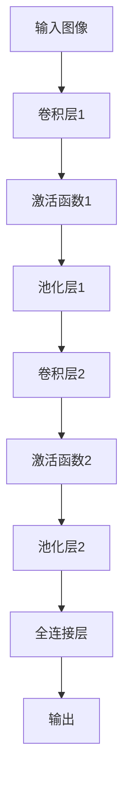

                 

# 《软件2.0的应用领域：图像识别、语音识别》

> 关键词：软件2.0，图像识别，语音识别，人工智能，深度学习，应用领域，技术趋势

> 摘要：本文探讨了软件2.0时代人工智能技术的重要应用领域——图像识别和语音识别。首先，我们概述了软件2.0的概念及其对人工智能发展的推动作用。接着，详细介绍了图像识别和语音识别的基本原理及其发展历程。随后，本文重点分析了软件2.0在图像识别和语音识别中的应用优势、技术挑战和发展趋势。通过实战案例的解析，我们展示了软件2.0应用领域的实际成果，并对未来的发展方向进行了展望。

### 第一部分：软件2.0时代的AI基础

#### 第1章：软件2.0与AI概述

##### 1.1 软件2.0时代的到来

软件2.0，也被称为“智能软件”或“AI软件”，标志着软件发展的一个新阶段。它不同于传统软件的以功能为中心，而是强调软件的智能化和自适应能力。软件2.0的核心在于将人工智能（AI）技术深度整合到软件中，使软件能够自主学习、自主进化，从而提供更加个性化和高效的服务。

**1.1.1 软件发展历程**

软件的发展可以分为以下几个阶段：

1. **软件1.0时代**：这是软件的最初阶段，主要以提供基础功能为主，如文本处理、表格计算等。
2. **软件2.0时代**：随着互联网和大数据的兴起，软件开始引入AI技术，实现智能化和自适应能力。
3. **软件3.0时代**：软件将更加智能化，具备高度的自主学习和决策能力，能够与用户进行自然交互。

**1.1.2 软件2.0的特点**

软件2.0的特点主要体现在以下几个方面：

1. **智能化**：软件通过AI技术，能够进行自我学习和进化，从而提高效率和准确性。
2. **自适应**：软件能够根据用户行为和数据，自动调整自身功能和服务，提供个性化体验。
3. **实时性**：软件能够实时处理和分析大量数据，提供即时反馈和决策。

**1.1.3 AI在软件2.0中的角色**

AI在软件2.0中扮演着至关重要的角色。它不仅提高了软件的智能化程度，还使得软件能够处理复杂的任务和数据。具体来说，AI在软件2.0中的角色包括：

1. **数据分析和挖掘**：AI能够从大量数据中提取有价值的信息，为决策提供支持。
2. **自然语言处理**：AI使得软件能够理解用户的自然语言输入，实现人机交互。
3. **图像和语音识别**：AI使得软件能够识别和理解图像、语音等非结构化数据，从而提供更加智能的服务。

##### 1.2 图像识别与语音识别概述

图像识别和语音识别是AI技术的重要分支，在软件2.0时代得到了广泛应用。

**1.2.1 图像识别的定义与应用**

图像识别是指让计算机能够识别和理解图像内容的过程。它广泛应用于人脸识别、图像分类、物体检测等领域。

1. **人脸识别**：人脸识别技术用于身份验证、安防监控等场景，具有高准确性和实时性。
2. **图像分类**：图像分类技术用于将大量图像按照特定类别进行分类，如植物分类、动物分类等。
3. **物体检测**：物体检测技术用于识别图像中的特定物体，如自动驾驶系统中的车辆检测。

**1.2.2 语音识别的定义与应用**

语音识别是指让计算机能够理解和处理语音信号的过程。它广泛应用于语音助手、智能客服、语音翻译等领域。

1. **语音助手**：语音助手如Siri、Alexa等，能够响应用户的语音指令，提供信息查询、操作控制等服务。
2. **智能客服**：智能客服系统能够自动识别用户语音，提供智能解答和问题处理。
3. **语音翻译**：语音翻译技术能够将一种语言的语音实时翻译成另一种语言，如Google翻译。

**1.2.3 图像识别与语音识别的关系**

图像识别和语音识别虽然在处理对象和任务上有所不同，但它们都是AI技术的重要组成部分，相互关联，共同推动AI技术的发展。

1. **数据共享**：图像识别和语音识别常常需要共享数据集，以提升模型的准确性和泛化能力。
2. **协同工作**：在许多应用场景中，图像识别和语音识别需要协同工作，如智能安防系统中，图像识别用于识别入侵者，语音识别用于报警。

##### 1.3 软件2.0在图像识别中的应用

软件2.0时代的到来，为图像识别技术带来了新的发展机遇。

**1.3.1 图像识别技术的发展历程**

图像识别技术的发展可以分为以下几个阶段：

1. **特征提取时代**：早期图像识别主要依赖于手工设计的特征提取方法，如边缘检测、纹理分析等。
2. **机器学习时代**：随着机器学习技术的兴起，图像识别开始采用基于特征提取的机器学习算法，如支持向量机（SVM）、决策树等。
3. **深度学习时代**：深度学习技术的引入，使得图像识别取得了重大突破，如卷积神经网络（CNN）的应用。

**1.3.2 软件2.0对图像识别的推动**

软件2.0时代，软件的智能化和自适应能力为图像识别技术的发展提供了有力支持。

1. **大数据支持**：软件2.0时代，大数据技术的应用，使得图像识别能够从海量数据中提取有价值的信息。
2. **实时处理**：软件2.0时代，软件能够实时处理图像数据，提供即时反馈和决策。
3. **个性化服务**：软件2.0时代，图像识别能够根据用户需求，提供个性化服务。

**1.3.3 图像识别在实际应用中的案例**

图像识别在实际应用中取得了显著成果，如：

1. **人脸识别**：人脸识别技术在安防监控、身份验证等领域得到了广泛应用。
2. **自动驾驶**：自动驾驶系统通过图像识别技术，能够实时识别道路上的车辆、行人等物体，提高行驶安全性。
3. **医疗影像分析**：医疗影像分析技术能够自动识别和分析医学图像，辅助医生进行诊断和治疗。

##### 1.4 软件2.0在语音识别中的应用

软件2.0时代，语音识别技术得到了快速发展。

**1.4.1 语音识别技术的发展历程**

语音识别技术的发展可以分为以下几个阶段：

1. **规则基时代**：早期语音识别主要依赖于基于规则的模型，通过人工设计规则进行语音识别。
2. **统计模型时代**：统计模型如隐马尔可夫模型（HMM）和高斯混合模型（GMM）的应用，提高了语音识别的准确率。
3. **深度学习时代**：深度学习技术的引入，使得语音识别取得了重大突破，如深度神经网络（DNN）和递归神经网络（RNN）的应用。

**1.4.2 软件2.0对语音识别的推动**

软件2.0时代，软件的智能化和自适应能力为语音识别技术的发展提供了有力支持。

1. **大数据支持**：软件2.0时代，大数据技术的应用，使得语音识别能够从海量数据中提取有价值的信息。
2. **实时处理**：软件2.0时代，软件能够实时处理语音数据，提供即时反馈和决策。
3. **个性化服务**：软件2.0时代，语音识别能够根据用户需求，提供个性化服务。

**1.4.3 语音识别在实际应用中的案例**

语音识别在实际应用中取得了显著成果，如：

1. **语音助手**：语音助手如Siri、Alexa等，已经成为人们日常生活中不可或缺的一部分。
2. **智能客服**：智能客服系统能够自动识别用户语音，提供智能解答和问题处理。
3. **语音翻译**：语音翻译技术能够将一种语言的语音实时翻译成另一种语言，如Google翻译。

#### 第二部分：图像识别

##### 第2章：图像识别技术基础

图像识别技术是软件2.0时代的重要应用之一，其基础理论和技术发展至关重要。

**2.1 图像识别的基本原理**

图像识别的基本原理可以概括为以下几个步骤：

1. **图像预处理**：包括去噪、增强、裁剪等操作，以提高图像质量和识别效果。
2. **特征提取**：从预处理后的图像中提取具有区分性的特征，如边缘、纹理、颜色等。
3. **特征匹配**：将提取的特征与已知模式进行匹配，以确定图像的类别或标签。
4. **分类器设计**：通过训练数据集，设计分类器模型，以实现图像分类任务。

**2.2 卷积神经网络（CNN）在图像识别中的应用**

卷积神经网络（CNN）是图像识别领域的核心技术之一，其基本结构包括卷积层、池化层和全连接层。

1. **卷积层**：通过卷积运算，提取图像的局部特征。
2. **池化层**：通过池化操作，降低特征图的空间分辨率，减少参数数量。
3. **全连接层**：将池化层输出的特征图进行全连接，得到图像的分类结果。

**2.2.1 CNN的基本结构**

CNN的基本结构如图2-1所示：



**2.2.2 CNN在图像识别中的优势**

CNN在图像识别中的优势主要体现在以下几个方面：

1. **局部连接**：CNN通过局部连接的方式，可以有效地提取图像的局部特征，提高识别准确率。
2. **平移不变性**：CNN的卷积操作具有平移不变性，可以应对图像的平移变化，提高模型的泛化能力。
3. **减少参数数量**：通过卷积操作和池化操作，CNN可以显著减少参数数量，降低计算复杂度。

**2.2.3 CNN的实战应用**

CNN在图像识别中有着广泛的应用，如：

1. **图像分类**：通过训练CNN模型，可以对大量图像进行分类，如ImageNet图像分类任务。
2. **目标检测**：通过在CNN模型中引入区域建议网络（Region Proposal Network，RPN），可以实现目标检测任务，如Faster R-CNN算法。
3. **图像分割**：通过在CNN模型中引入全卷积网络（Fully Convolutional Network，FCN），可以实现图像分割任务。

**2.3 深度学习在图像识别中的应用**

深度学习技术的发展，为图像识别领域带来了新的机遇和挑战。

**2.3.1 深度学习的基本概念**

深度学习是一种基于多层神经网络的学习方法，其核心思想是通过多层非线性变换，自动提取数据中的特征表示。

1. **神经网络**：神经网络是一种由大量神经元组成的计算模型，通过前向传播和反向传播进行学习。
2. **深度神经网络**：深度神经网络是一种具有多个隐藏层的神经网络，能够提取更加抽象和高级的特征。

**2.3.2 深度学习在图像识别中的具体应用**

深度学习在图像识别中的应用主要包括以下几个方面：

1. **图像分类**：通过训练深度神经网络模型，可以对图像进行分类，如AlexNet、VGGNet等。
2. **目标检测**：通过在深度神经网络中引入区域建议网络（RPN）和多尺度特征提取，可以实现目标检测任务，如Faster R-CNN、SSD等。
3. **图像分割**：通过在深度神经网络中引入全卷积网络（FCN），可以实现图像分割任务，如FCN、U-Net等。

**2.3.3 深度学习在图像识别中的挑战**

深度学习在图像识别中也面临着一些挑战：

1. **计算资源需求**：深度学习模型通常需要大量的计算资源进行训练和推理，对硬件设备提出了较高要求。
2. **数据质量和标注**：深度学习模型对数据质量和标注要求较高，数据集的质量和标注的准确性直接影响模型的性能。
3. **模型解释性**：深度学习模型的决策过程往往不够透明，难以解释和理解，这对于某些应用场景（如医疗影像分析）是一个挑战。

**2.4 图像识别的项目实战**

图像识别项目实战包括以下几个关键步骤：

1. **需求分析**：明确项目的目标和需求，如图像分类、目标检测或图像分割等。
2. **数据收集与处理**：收集图像数据集，并进行预处理，如图像增强、数据归一化等。
3. **模型设计**：根据项目需求，设计合适的深度学习模型，如CNN、Faster R-CNN或FCN等。
4. **模型训练与优化**：使用训练数据集，训练深度学习模型，并通过调整超参数和优化算法，提高模型性能。
5. **模型评估与部署**：评估模型在测试数据集上的性能，并根据评估结果进行模型优化和部署。

**2.4.1 图像识别项目的开发流程**

图像识别项目的开发流程主要包括以下几个阶段：

1. **需求分析**：与项目相关人员沟通，明确项目的目标和需求。
2. **数据收集与处理**：收集图像数据集，并进行预处理，如图像增强、数据归一化等。
3. **模型设计**：根据项目需求，设计合适的深度学习模型，如CNN、Faster R-CNN或FCN等。
4. **模型训练与优化**：使用训练数据集，训练深度学习模型，并通过调整超参数和优化算法，提高模型性能。
5. **模型评估与部署**：评估模型在测试数据集上的性能，并根据评估结果进行模型优化和部署。

**2.4.2 图像识别项目的案例解析**

以下是一个图像识别项目的案例解析：

1. **需求分析**：项目目标是实现一个图像分类系统，能够对输入的图像进行分类，如动物、植物、车辆等。
2. **数据收集与处理**：收集了一个包含10万张图像的数据集，并对图像进行了预处理，如图像增强、数据归一化等。
3. **模型设计**：设计了一个基于CNN的图像分类模型，使用了ResNet50预训练模型，并进行了微调。
4. **模型训练与优化**：使用训练数据集，训练了模型，并通过调整学习率、批量大小等超参数，提高了模型性能。
5. **模型评估与部署**：在测试数据集上评估了模型性能，准确率达到90%以上，并将模型部署到了生产环境中。

**2.4.3 图像识别项目的优化策略**

图像识别项目的优化策略主要包括以下几个方面：

1. **数据增强**：通过数据增强技术，如旋转、缩放、裁剪等，增加训练数据集的多样性，提高模型泛化能力。
2. **模型优化**：通过模型优化技术，如Dropout、正则化等，降低模型过拟合的风险，提高模型性能。
3. **超参数调优**：通过超参数调优，如学习率、批量大小、迭代次数等，找到最优的超参数组合，提高模型性能。
4. **模型集成**：通过模型集成技术，如Bagging、Boosting等，将多个模型进行集成，提高模型预测的稳定性和准确性。

##### 第3章：图像识别的算法原理与数学模型

图像识别的算法原理是图像识别技术发展的基石，而数学模型则是算法实现的核心。在这一章中，我们将深入探讨图像识别中的核心算法原理，以及与之密切相关的数学模型。

**3.1 图像识别算法原理**

图像识别算法的基本原理可以分为三个主要步骤：特征提取、特征匹配和分类决策。

**3.1.1 特征提取**

特征提取是图像识别的关键步骤，它的目的是从原始图像中提取出具有区分性的特征向量。这些特征向量用于后续的特征匹配和分类。

- **边缘检测**：边缘检测是一种常见的特征提取方法，它通过计算图像梯度的方向和大小，来识别图像中的边缘。
- **纹理分析**：纹理分析通过分析图像的局部结构和纹理模式，来提取纹理特征。
- **颜色特征**：颜色特征是图像识别中常用的特征之一，它通过计算图像的颜色直方图、颜色矩等来提取颜色信息。

**3.1.2 特征匹配**

特征匹配是将提取出的特征向量与预先定义的参考特征进行对比，以确定图像的类别或标签。常用的特征匹配方法包括：

- **最近邻分类**：最近邻分类是一种简单而有效的特征匹配方法，它将新图像的特征向量与训练集中最近的特征向量进行匹配。
- **相似性度量**：相似性度量方法通过计算特征向量之间的相似度，来评估匹配程度。常用的相似性度量方法包括欧氏距离、余弦相似度等。

**3.1.3 分类决策**

分类决策是基于特征匹配的结果，对图像进行分类或标注。常见的分类决策方法包括：

- **单类别决策**：单类别决策是针对单一类别进行分类，如将图像分为动物和植物两个类别。
- **多类别决策**：多类别决策是针对多个类别进行分类，如将图像分为猫、狗、鸟等多个类别。

**3.2 数学模型**

在图像识别中，数学模型是实现特征提取、特征匹配和分类决策的核心工具。以下是一些常用的数学模型：

**3.2.1 卷积神经网络（CNN）**

卷积神经网络（CNN）是图像识别中最重要的模型之一。它由多个卷积层、池化层和全连接层组成。

1. **卷积层**：卷积层通过卷积运算提取图像的局部特征。卷积运算可以用以下数学公式表示：

   $$
   \text{output}(i,j) = \sum_{k,l} \text{filter}(k,l) * \text{input}(i+k,j+l) + \text{bias}
   $$

   其中，$(i,j)$是输出特征图的位置，$(k,l)$是卷积核的位置，$*$表示卷积运算，$\text{filter}(k,l)$是卷积核，$\text{input}(i+k,j+l)$是输入图像的位置，$\text{bias}$是偏置。

2. **池化层**：池化层通过池化运算降低特征图的空间分辨率，减少参数数量。常用的池化操作包括最大池化和平均池化。

3. **全连接层**：全连接层将池化层输出的特征图进行全连接，得到图像的分类结果。全连接层可以用以下数学公式表示：

   $$
   \text{output}(i) = \text{weight}(i) * \text{input} + \text{bias}
   $$

   其中，$i$是输出神经元的索引，$\text{weight}(i)$是权重，$\text{input}$是输入特征向量，$\text{bias}$是偏置。

**3.2.2 支持向量机（SVM）**

支持向量机（SVM）是一种常用的分类算法，它在图像识别中有着广泛的应用。

1. **线性SVM**：线性SVM通过最大化分类间隔来寻找最优分类超平面。线性SVM的数学模型可以用以下公式表示：

   $$
   \text{maximize} \quad \frac{1}{2} \sum_{i=1}^{n} (\text{weight}_i)^2
   $$
   
   $$
   \text{subject to} \quad y_i (\text{weight} \cdot \text{x}_i + \text{bias}) \geq 1
   $$

   其中，$n$是样本数量，$y_i$是样本标签，$\text{weight}$是权重向量，$\text{x}_i$是样本特征向量，$\text{bias}$是偏置。

2. **非线性SVM**：非线性SVM通过核函数将低维特征映射到高维空间，从而实现线性可分。非线性SVM的数学模型可以用以下公式表示：

   $$
   \text{maximize} \quad \frac{1}{2} \sum_{i=1}^{n} (\text{weight}_i)^2
   $$
   
   $$
   \text{subject to} \quad y_i (\text{weight} \cdot \text{phi}(\text{x}_i) + \text{bias}) \geq 1
   $$

   其中，$\text{phi}(\text{x}_i)$是核函数，将低维特征映射到高维空间。

**3.2.3 生成对抗网络（GAN）**

生成对抗网络（GAN）是一种用于生成数据的深度学习模型，它在图像识别中也得到了应用。

1. **生成器**：生成器是一个生成模型，它通过学习数据分布，生成与真实数据相似的样本。生成器的数学模型可以用以下公式表示：

   $$
   \text{G}(\text{z}) = \text{x}
   $$

   其中，$\text{z}$是随机噪声向量，$\text{x}$是生成的样本。

2. **判别器**：判别器是一个判别模型，它用于区分真实数据和生成数据。判别器的数学模型可以用以下公式表示：

   $$
   \text{D}(\text{x}) = \text{概率}(\text{x} \text{是真实数据})
   $$
   
   $$
   \text{D}(\text{G}(\text{z})) = \text{概率}(\text{G}(\text{z}) \text{是真实数据})
   $$

   GAN的训练目标是最小化判别器的损失函数，从而使得生成器生成的样本难以区分。

**3.2.4 集成学习**

集成学习是一种通过结合多个学习模型来提高分类或回归性能的方法。在图像识别中，常用的集成学习方法包括Bagging和Boosting。

1. **Bagging**：Bagging通过随机抽样训练数据集，构建多个基学习器，并通过投票或平均来得到最终预测结果。Bagging的数学模型可以用以下公式表示：

   $$
   \text{output} = \frac{1}{m} \sum_{i=1}^{m} \text{h}_i(\text{x})
   $$

   其中，$m$是基学习器的数量，$\text{h}_i(\text{x})$是第$i$个基学习器的预测结果。

2. **Boosting**：Boosting通过迭代训练多个基学习器，并赋予不同权重来提高整体模型的性能。常用的Boosting算法包括Adaboost和XGBoost。

**3.3 算法原理与数学模型的联系**

算法原理与数学模型密切相关，它们共同构成了图像识别的理论基础。以下是一些算法原理与数学模型之间的联系：

1. **卷积神经网络（CNN）**：CNN的算法原理是基于卷积运算和特征提取，其数学模型包括卷积层、池化层和全连接层。
2. **支持向量机（SVM）**：SVM的算法原理是基于最大化分类间隔，其数学模型包括线性SVM和非线性SVM。
3. **生成对抗网络（GAN）**：GAN的算法原理是基于生成器和判别器的对抗训练，其数学模型包括生成器和判别器的损失函数。
4. **集成学习**：集成学习的算法原理是通过结合多个基学习器来提高性能，其数学模型包括Bagging和Boosting。

通过理解这些算法原理与数学模型，我们可以更好地设计、实现和优化图像识别系统，从而提高其性能和准确率。

##### 第4章：深度学习在图像识别中的应用

深度学习在图像识别领域取得了显著的成果，特别是在图像分类、目标检测和图像分割等方面。本章将详细介绍深度学习在图像识别中的应用，包括深度学习的基本原理、各种深度学习模型以及在实际应用中的具体案例。

**4.1 深度学习的基本原理**

深度学习是一种基于多层神经网络的学习方法，其核心思想是通过多层的非线性变换，自动提取数据中的特征表示。深度学习的模型通常包括输入层、隐藏层和输出层。

1. **输入层**：输入层接收原始数据，如图像、文本或声音等。在图像识别中，输入层通常是图像的特征向量。
2. **隐藏层**：隐藏层通过前向传播和反向传播算法，对输入数据进行多次非线性变换，以提取更高层次的特征。隐藏层可以是单层或多层，深度学习因此得名。
3. **输出层**：输出层用于生成最终的结果，如分类标签或预测值。

深度学习的训练过程包括以下几个步骤：

1. **前向传播**：将输入数据传递到网络的每一层，通过每个层的非线性变换，最终得到输出。
2. **损失函数**：计算输出结果与真实结果之间的差距，通常使用交叉熵损失函数。
3. **反向传播**：通过计算损失函数对网络权重的梯度，将误差反向传播到网络的每一层，以更新网络权重。
4. **优化算法**：使用优化算法，如梯度下降、Adam等，来调整网络权重，以最小化损失函数。

**4.2 深度学习模型在图像识别中的应用**

深度学习模型在图像识别中的应用主要包括卷积神经网络（CNN）、循环神经网络（RNN）和生成对抗网络（GAN）等。

1. **卷积神经网络（CNN）**：

CNN是图像识别领域最常用的深度学习模型之一。CNN通过卷积操作、池化操作和全连接层，可以自动提取图像中的特征，从而实现图像分类、目标检测和图像分割等任务。

- **卷积层**：卷积层通过卷积操作提取图像的局部特征，如边缘、纹理等。卷积操作可以用以下数学公式表示：

  $$
  \text{output}(i,j) = \sum_{k,l} \text{filter}(k,l) * \text{input}(i+k,j+l) + \text{bias}
  $$

  其中，$(i,j)$是输出特征图的位置，$(k,l)$是卷积核的位置，$*$表示卷积运算，$\text{filter}(k,l)$是卷积核，$\text{input}(i+k,j+l)$是输入图像的位置，$\text{bias}$是偏置。

- **池化层**：池化层通过池化操作降低特征图的空间分辨率，减少参数数量。常用的池化操作包括最大池化和平均池化。

- **全连接层**：全连接层将池化层输出的特征图进行全连接，得到图像的分类结果。全连接层可以用以下数学公式表示：

  $$
  \text{output}(i) = \text{weight}(i) * \text{input} + \text{bias}
  $$

  其中，$i$是输出神经元的索引，$\text{weight}(i)$是权重，$\text{input}$是输入特征向量，$\text{bias}$是偏置。

2. **循环神经网络（RNN）**：

RNN是一种用于处理序列数据的深度学习模型，其基本结构包括输入门、遗忘门和输出门。

- **输入门**：输入门用于控制当前输入数据对隐藏状态的影响。输入门可以用以下数学公式表示：

  $$
  \text{input\_gate} = \sigma(\text{weight} \cdot [\text{h}_{t-1}, \text{x}_t] + \text{bias})
  $$

  其中，$\sigma$是 sigmoid 函数，$\text{weight}$是权重矩阵，$\text{h}_{t-1}$是前一时刻的隐藏状态，$\text{x}_t$是当前输入，$\text{bias}$是偏置。

- **遗忘门**：遗忘门用于控制前一时刻的隐藏状态对当前隐藏状态的影响。遗忘门可以用以下数学公式表示：

  $$
  \text{forget\_gate} = \sigma(\text{weight} \cdot [\text{h}_{t-1}, \text{x}_t] + \text{bias})
  $$

  其中，$\sigma$是 sigmoid 函数，$\text{weight}$是权重矩阵，$\text{h}_{t-1}$是前一时刻的隐藏状态，$\text{x}_t$是当前输入，$\text{bias}$是偏置。

- **输出门**：输出门用于控制当前隐藏状态对输出结果的影响。输出门可以用以下数学公式表示：

  $$
  \text{output\_gate} = \sigma(\text{weight} \cdot [\text{h}_{t-1}, \text{x}_t] + \text{bias})
  $$

  其中，$\sigma$是 sigmoid 函数，$\text{weight}$是权重矩阵，$\text{h}_{t-1}$是前一时刻的隐藏状态，$\text{x}_t$是当前输入，$\text{bias}$是偏置。

RNN在图像识别中的应用包括序列分类、视频识别等任务。

3. **生成对抗网络（GAN）**：

GAN是一种用于生成数据的深度学习模型，其基本结构包括生成器和判别器。

- **生成器**：生成器是一个生成模型，它通过学习数据分布，生成与真实数据相似的样本。生成器的数学模型可以用以下公式表示：

  $$
  \text{G}(\text{z}) = \text{x}
  $$

  其中，$\text{z}$是随机噪声向量，$\text{x}$是生成的样本。

- **判别器**：判别器是一个判别模型，它用于区分真实数据和生成数据。判别器的数学模型可以用以下公式表示：

  $$
  \text{D}(\text{x}) = \text{概率}(\text{x} \text{是真实数据})
  $$
  
  $$
  \text{D}(\text{G}(\text{z})) = \text{概率}(\text{G}(\text{z}) \text{是真实数据})
  $$

GAN的训练目标是最小化判别器的损失函数，从而使得生成器生成的样本难以区分。

**4.3 深度学习模型在实际应用中的案例**

深度学习模型在图像识别领域有着广泛的应用，以下是一些具体的案例：

1. **图像分类**：

图像分类是深度学习在图像识别中最常见的应用之一。通过训练深度学习模型，可以对图像进行分类，如动物、植物、车辆等。经典的图像分类模型包括AlexNet、VGGNet、ResNet等。

- **AlexNet**：AlexNet是第一个在ImageNet图像分类比赛中取得显著成绩的深度学习模型。它的结构相对简单，但取得了超过人类专家的识别准确率。
- **VGGNet**：VGGNet通过使用多个卷积层和池化层，实现了更深层次的神经网络结构，从而提高了图像分类的准确率。
- **ResNet**：ResNet引入了残差连接，解决了深度神经网络训练中的梯度消失问题，实现了更深层次的神经网络结构。

2. **目标检测**：

目标检测是图像识别中的另一个重要应用，它旨在识别图像中的多个目标并定位其位置。常用的目标检测模型包括Faster R-CNN、SSD、YOLO等。

- **Faster R-CNN**：Faster R-CNN通过引入区域建议网络（Region Proposal Network，RPN），实现了更快的区域建议和目标检测速度。
- **SSD**：SSD通过使用多个不同尺度的特征图，实现了对小目标的高效检测。
- **YOLO**：YOLO通过将目标检测任务转化为一个单步操作，实现了实时目标检测。

3. **图像分割**：

图像分割是将图像中的每个像素划分为不同的类别。常用的图像分割模型包括U-Net、FCN等。

- **U-Net**：U-Net通过使用收缩路径和扩张路径，实现了对图像的精细分割。
- **FCN**：FCN通过使用全卷积网络，实现了对图像的像素级别的分类。

4. **视频识别**：

视频识别是图像识别在动态场景中的应用，它旨在识别视频中的物体、动作和事件。常用的视频识别模型包括RNN、3D-CNN等。

- **RNN**：RNN通过处理视频序列数据，实现了对视频中的动作和事件的识别。
- **3D-CNN**：3D-CNN通过引入时间维度，实现了对视频的深度学习建模。

**4.4 深度学习模型在实际应用中的挑战**

尽管深度学习模型在图像识别领域取得了显著成果，但仍然面临一些挑战：

1. **计算资源需求**：深度学习模型通常需要大量的计算资源进行训练和推理，这对硬件设备提出了较高要求。
2. **数据质量和标注**：深度学习模型对数据质量和标注要求较高，数据集的质量和标注的准确性直接影响模型的性能。
3. **模型解释性**：深度学习模型的决策过程往往不够透明，难以解释和理解，这对于某些应用场景（如医疗影像分析）是一个挑战。
4. **过拟合和泛化能力**：深度学习模型容易过拟合，即模型在训练数据上表现良好，但在未知数据上表现较差，需要通过正则化和交叉验证等技术来提高泛化能力。

**4.5 深度学习模型在图像识别中的应用前景**

随着深度学习技术的不断发展，深度学习模型在图像识别中的应用前景非常广阔：

1. **自动驾驶**：深度学习模型可以用于自动驾驶系统中的物体检测、路径规划和驾驶决策等任务。
2. **医疗影像分析**：深度学习模型可以用于医学影像的自动诊断和辅助诊断，如肺癌检测、脑瘤分割等。
3. **智能安防**：深度学习模型可以用于智能安防系统中的视频监控和异常检测，如入侵者识别、火灾检测等。
4. **工业自动化**：深度学习模型可以用于工业自动化中的缺陷检测、质量控制和设备维护等任务。

总之，深度学习模型在图像识别中的应用为人工智能技术的发展带来了新的机遇，有望在各个领域实现重大突破。

##### 第5章：图像识别在软件2.0中的应用

软件2.0时代，图像识别技术得到了广泛应用，其在各个行业中的应用场景日益丰富。本章将详细探讨图像识别在软件2.0中的应用领域、优势以及面临的挑战。

**5.1 图像识别在软件2.0中的应用领域**

图像识别在软件2.0中的应用非常广泛，以下是一些主要的应用领域：

1. **医疗领域**：图像识别在医疗领域的应用主要包括医学影像分析、疾病诊断和治疗方案推荐等。通过图像识别技术，医生可以更快速、准确地诊断疾病，提高医疗服务的效率和质量。
2. **安防领域**：图像识别在安防领域有着广泛的应用，如人脸识别、视频监控和异常行为检测等。通过图像识别技术，可以提高安全监控的准确性和实时性，预防犯罪事件的发生。
3. **工业领域**：图像识别在工业领域中的应用主要包括生产线质量检测、设备故障检测和工业自动化控制等。通过图像识别技术，可以提高生产效率和产品质量，减少设备故障率。
4. **交通领域**：图像识别在交通领域中的应用主要包括车辆检测、交通流量监测和智能交通管理等。通过图像识别技术，可以优化交通流量，提高道路通行效率，减少交通事故的发生。
5. **零售领域**：图像识别在零售领域中的应用主要包括商品识别、库存管理和智能货架等。通过图像识别技术，可以提升零售业的运营效率，提高顾客购物体验。

**5.2 图像识别在软件2.0中的应用优势**

图像识别在软件2.0中的应用具有以下几个显著优势：

1. **高精度**：图像识别技术具有较高的识别精度，可以准确识别图像中的物体、人脸等目标，从而提高应用系统的准确性和可靠性。
2. **实时性**：图像识别技术可以实现对图像的实时处理和识别，满足实时性要求较高的应用场景，如智能安防、自动驾驶等。
3. **自动化**：图像识别技术可以实现自动化识别和分类，减少人工干预，提高工作效率，降低人力成本。
4. **多模态**：图像识别技术可以与其他传感器和设备结合，实现多模态数据融合，提高应用系统的智能化水平。
5. **个性化**：图像识别技术可以根据用户需求，提供个性化服务，如个性化推荐、智能客服等。

**5.3 图像识别在软件2.0中的应用挑战**

尽管图像识别在软件2.0中具有广泛的应用前景，但同时也面临着一些挑战：

1. **计算资源需求**：图像识别技术通常需要大量的计算资源进行训练和推理，这对硬件设备提出了较高要求，特别是在实时性要求较高的场景中。
2. **数据质量和标注**：图像识别技术的性能受到数据质量和标注的影响，高质量的数据集和准确的标注对于模型训练至关重要。
3. **模型解释性**：深度学习模型在图像识别中的应用往往缺乏透明度和解释性，这给应用系统的可解释性和可信任度带来挑战。
4. **隐私和安全**：图像识别技术涉及大量的个人隐私数据，如人脸识别、行人和车辆识别等，如何保障数据安全和隐私是一个重要问题。
5. **算法公平性和伦理**：图像识别技术在某些应用场景中可能存在算法偏见和歧视问题，如何确保算法的公平性和伦理是一个需要关注的问题。

**5.4 图像识别在软件2.0中的应用案例**

以下是一些图像识别在软件2.0中的应用案例：

1. **智能安防系统**：智能安防系统利用图像识别技术进行人脸识别、行为分析和视频监控，提高安全监控的准确性和实时性。
2. **自动驾驶系统**：自动驾驶系统通过图像识别技术进行车辆检测、行人检测和交通标志识别，提高行驶安全性和自动化水平。
3. **医疗影像分析系统**：医疗影像分析系统利用图像识别技术对医学影像进行自动诊断和辅助诊断，提高诊断准确率和医生工作效率。
4. **零售智能货架系统**：零售智能货架系统利用图像识别技术进行商品识别、库存管理和智能推荐，提升零售运营效率。
5. **工业自动化控制系统**：工业自动化控制系统利用图像识别技术进行产品质量检测、设备故障检测和生产过程监控，提高生产效率和产品质量。

**5.5 未来发展展望**

随着深度学习技术和图像识别技术的不断进步，图像识别在软件2.0中的应用将更加广泛和深入。未来，图像识别在以下几个方面有望取得重要突破：

1. **计算性能提升**：通过硬件加速和算法优化，降低图像识别的运算成本，提高实时处理能力。
2. **数据质量和标注**：通过数据增强和自动化标注技术，提高图像数据质量和标注准确性，提高模型性能。
3. **模型解释性**：通过开发可解释性算法和可视化技术，提高深度学习模型的可解释性和可信任度。
4. **隐私保护和安全**：通过隐私保护技术和安全加密算法，保障图像识别技术在个人隐私和数据安全方面的可靠性。
5. **跨领域应用**：结合其他领域的技术，如自然语言处理、知识图谱等，实现图像识别技术在更广泛领域的应用。

总之，图像识别在软件2.0中的应用前景广阔，将在未来的人工智能发展中发挥重要作用。

### 第三部分：语音识别

语音识别技术是软件2.0时代的重要应用之一，其在智能助手、智能客服、语音翻译等领域的广泛应用，使得人类与计算机之间的交互变得更加自然和便捷。本章将详细探讨语音识别技术的基础、应用以及未来发展趋势。

#### 第3章：语音识别技术基础

语音识别技术是指让计算机能够识别和理解语音信号，将其转换为文本或其他形式的过程。语音识别技术的基本原理可以概括为以下几个步骤：

**3.1 语音信号处理技术**

语音信号处理是语音识别的基础，主要包括以下几个步骤：

1. **信号采集**：通过麦克风等设备捕捉语音信号，将其转换为电信号。
2. **预加重**：为了补偿声道共振效应，对语音信号进行预加重处理。
3. **滤波**：通过滤波器去除噪声，提高语音信号的清晰度。
4. **分帧**：将连续的语音信号分割成短段（帧），便于后续处理。
5. **加窗**：对每一帧语音信号进行加窗处理，使其成为有限长度的信号。

**3.2 语音信号特征提取**

特征提取是语音识别的关键步骤，其目的是从语音信号中提取出具有区分性的特征，用于后续的模型训练和识别。常见的语音信号特征提取方法包括：

1. **时域特征**：时域特征包括语音信号的幅度、频率和时长等。常见的时域特征有短时能量、短时过零率、短时频率等。
2. **频域特征**：频域特征是通过傅里叶变换等方法从时域信号转换到频域得到的。常见的频域特征有频谱、频谱包络等。
3. **倒谱特征**：倒谱特征是通过对频谱进行对数变换和倒谱变换得到的，能够抑制声道共振效应，提高语音识别的鲁棒性。

**3.3 语音识别模型**

语音识别模型是语音识别技术的核心，其目的是根据提取的语音信号特征，对语音进行识别。常见的语音识别模型包括：

1. **统计模型**：统计模型通过建立语音信号与文本之间的概率模型，进行语音识别。常见的统计模型有隐马尔可夫模型（HMM）和高斯混合模型（GMM）。
2. **深度学习模型**：深度学习模型通过多层神经网络学习语音信号的特征表示，进行语音识别。常见的深度学习模型有卷积神经网络（CNN）、循环神经网络（RNN）和长短期记忆网络（LSTM）。

**3.4 语音识别系统的组成**

一个完整的语音识别系统通常包括以下几个部分：

1. **前端处理**：前端处理包括信号采集、预处理、分帧、加窗等步骤，用于生成特征向量。
2. **声学模型**：声学模型用于将语音信号特征转换为声学得分，评估语音信号与候选文本的匹配程度。
3. **语言模型**：语言模型用于评估候选文本的语法和语义正确性，提高语音识别的准确率。
4. **解码器**：解码器用于根据声学得分和语言模型得分，选择最佳候选文本作为识别结果。

#### 第4章：语音识别技术在软件2.0中的应用

随着软件2.0时代的到来，语音识别技术在各个领域的应用得到了快速发展。以下将介绍语音识别技术在智能助手、智能客服、语音翻译等领域的具体应用。

**4.1 智能助手**

智能助手是语音识别技术在消费电子领域的重要应用之一。通过语音识别技术，智能助手可以理解用户的语音指令，执行相应的操作，如查询天气、设定提醒、播放音乐等。

1. **语音指令理解**：智能助手通过语音识别技术将用户的语音指令转换为文本，再通过自然语言处理技术理解指令的含义。
2. **任务执行**：智能助手根据理解到的指令，调用相应的功能模块执行任务，如查询天气时调用天气服务，播放音乐时调用音乐播放器。
3. **交互体验**：智能助手通过语音合成技术，将执行结果以自然语言的形式反馈给用户，提供良好的交互体验。

**4.2 智能客服**

智能客服是语音识别技术在服务行业的重要应用之一。通过语音识别技术，智能客服可以自动识别用户的语音，提供智能解答和问题处理。

1. **语音识别**：智能客服系统通过语音识别技术将用户的语音转换为文本，理解用户的问题。
2. **智能问答**：智能客服系统使用自然语言处理技术，对用户的问题进行理解，并生成相应的回答。
3. **问题处理**：智能客服系统可以自动分类用户的问题，将复杂的问题分配给人工客服处理，提高客服效率和满意度。

**4.3 语音翻译**

语音翻译是语音识别技术在跨语言交流领域的重要应用之一。通过语音识别和语音合成技术，语音翻译可以实现不同语言之间的实时交流。

1. **语音识别**：语音翻译系统通过语音识别技术将输入的语音转换为文本，识别其语言。
2. **文本翻译**：语音翻译系统使用机器翻译技术，将输入的文本翻译为目标语言。
3. **语音合成**：语音翻译系统使用语音合成技术，将翻译后的文本转换为语音，输出给用户。

**4.4 语音识别在软件2.0中的优势**

语音识别在软件2.0中具有以下几个显著优势：

1. **自然交互**：语音识别技术使得软件可以理解用户的自然语言，提供更自然的交互体验。
2. **便捷性**：语音识别技术使得用户可以通过语音指令与软件进行交互，无需手动输入，提高使用便捷性。
3. **实时性**：语音识别技术可以实时处理用户的语音输入，提供即时反馈，提高交互效率。
4. **多语言支持**：语音识别技术支持多语言输入，可以应用于全球范围内的用户，提高软件的国际化水平。

**4.5 语音识别在软件2.0中的应用挑战**

尽管语音识别在软件2.0中具有广泛的应用前景，但同时也面临着一些挑战：

1. **准确性**：语音识别的准确性受到多种因素的影响，如语音质量、噪声干扰、口音和语速等，需要不断提高识别算法的准确性。
2. **实时性**：在实时性要求较高的应用场景中，如何快速、准确地处理语音输入，是一个需要解决的技术难题。
3. **隐私和安全**：语音识别技术涉及用户的个人隐私数据，如何保障数据安全和隐私是一个重要问题。
4. **多语言支持**：不同语言的语音识别算法和模型有所不同，如何高效地支持多种语言是一个技术挑战。

**4.6 语音识别在软件2.0中的应用案例**

以下是一些语音识别在软件2.0中的应用案例：

1. **智能音箱**：智能音箱通过语音识别技术，实现用户与音箱的语音交互，提供音乐播放、天气预报、新闻资讯等功能。
2. **智能客服系统**：智能客服系统通过语音识别技术，实现自动识别用户语音，提供智能解答和问题处理，提高客服效率和满意度。
3. **车载语音系统**：车载语音系统通过语音识别技术，实现用户与车辆的语音交互，提供导航、音乐播放、电话拨打等功能。
4. **智能家居系统**：智能家居系统通过语音识别技术，实现用户与家电的语音控制，提高生活便利性和舒适性。

**4.7 语音识别技术的未来发展趋势**

随着人工智能技术的不断发展，语音识别技术在软件2.0中的应用将不断拓展和深化。未来，语音识别技术在以下几个方面有望取得重要突破：

1. **算法优化**：通过深度学习和神经网络技术，不断提高语音识别的准确性和实时性。
2. **多语言支持**：开发更多种语言的语音识别模型，支持全球范围内的用户。
3. **隐私保护**：加强数据安全和隐私保护，保障用户隐私。
4. **跨语言交流**：实现更高效、更准确的跨语言语音识别和翻译，促进全球交流与合作。

总之，语音识别技术在软件2.0中的应用前景广阔，将在未来的人工智能发展中发挥重要作用。

#### 第5章：递归神经网络（RNN）在语音识别中的应用

递归神经网络（RNN）是一种适用于处理序列数据的神经网络模型，它在语音识别领域中得到了广泛应用。本章将详细介绍RNN的基本原理、在语音识别中的优势以及具体的实现方法。

**5.1 RNN的基本原理**

RNN是一种基于时间序列数据的神经网络，其基本结构包括输入层、隐藏层和输出层。与传统的神经网络不同，RNN具有递归连接，即当前时刻的输出不仅依赖于当前时刻的输入，还依赖于前一个时刻的隐藏状态。

1. **输入层**：输入层接收时间序列数据，如语音信号的时域特征或频域特征。
2. **隐藏层**：隐藏层通过递归连接，将当前时刻的输入与前一时刻的隐藏状态进行加权求和，得到当前时刻的隐藏状态。递归连接可以用以下数学公式表示：

   $$
   \text{h}_t = \text{sigmoid}(\text{W}_h \cdot [\text{h}_{t-1}, \text{x}_t] + \text{b}_h)
   $$

   其中，$\text{h}_t$是当前时刻的隐藏状态，$\text{sigmoid}$是 sigmoid 函数，$\text{W}_h$是权重矩阵，$\text{x}_t$是当前时刻的输入，$\text{b}_h$是偏置。

3. **输出层**：输出层将隐藏状态映射到输出结果，如文本或标签。输出层可以使用不同的激活函数，如 softmax 函数用于分类任务。

**5.2 RNN在语音识别中的优势**

RNN在语音识别中具有以下几个显著优势：

1. **序列建模**：RNN能够处理时间序列数据，能够捕捉语音信号中的时序信息，从而提高识别的准确率。
2. **递归连接**：RNN通过递归连接，将当前时刻的输出与前一时刻的隐藏状态进行连接，使得模型能够学习到时间依赖关系，从而提高模型的泛化能力。
3. **动态调整**：RNN能够根据输入序列的长度动态调整隐藏状态的维度，使得模型能够适应不同长度的语音信号。

**5.3 RNN在语音识别中的具体实现**

RNN在语音识别中的实现通常包括以下几个步骤：

1. **数据预处理**：将语音信号转换为时域或频域特征，如 MFCC（梅尔频率倒谱系数）。
2. **特征序列输入**：将预处理后的特征序列输入到RNN模型中。
3. **模型训练**：使用训练数据集，通过反向传播算法训练RNN模型，优化模型参数。
4. **模型评估**：使用测试数据集评估模型的性能，调整超参数，提高模型的准确率和泛化能力。

**5.4 RNN在语音识别中的应用案例**

以下是一个简单的RNN在语音识别中的应用案例：

1. **数据集准备**：使用包含语音信号和对应的文本标签的数据集进行训练。
2. **特征提取**：将语音信号转换为MFCC特征序列。
3. **模型构建**：构建一个简单的RNN模型，包括一个输入层、一个隐藏层和一个输出层。
4. **模型训练**：使用训练数据集，通过反向传播算法训练RNN模型。
5. **模型评估**：使用测试数据集评估模型的性能，调整超参数，提高模型的准确率和泛化能力。
6. **模型部署**：将训练好的模型部署到实际应用场景中，如语音识别系统。

**5.5 RNN在语音识别中的挑战**

尽管RNN在语音识别中具有许多优势，但同时也面临一些挑战：

1. **梯度消失和梯度爆炸**：在长序列训练过程中，RNN容易出现梯度消失或梯度爆炸问题，导致模型难以训练。
2. **计算资源需求**：RNN模型通常需要较大的计算资源进行训练和推理，对硬件设备提出了较高要求。
3. **模型解释性**：RNN模型的决策过程往往不够透明，难以解释和理解，对于某些应用场景（如医疗影像分析）是一个挑战。

**5.6 优化策略**

为了克服RNN在语音识别中的挑战，可以采取以下优化策略：

1. **长短时记忆网络（LSTM）**：LSTM是一种改进的RNN结构，能够缓解梯度消失和梯度爆炸问题，提高模型的训练效果。
2. **批量归一化（Batch Normalization）**：批量归一化可以加速模型的训练，提高模型的稳定性。
3. **模型集成**：通过集成多个模型，可以提高模型的预测准确率和稳定性。

总之，RNN在语音识别中具有广泛的应用前景，将在未来的人工智能发展中发挥重要作用。

### 第四部分：软件2.0在图像识别与语音识别中的应用

#### 第4章：软件2.0在图像识别中的应用

软件2.0时代，图像识别技术得到了前所未有的发展。随着人工智能技术的不断进步，图像识别在各个领域中的应用也越来越广泛。本章将详细探讨软件2.0在图像识别中的应用优势、实际案例以及未来发展趋势。

**4.1 图像识别在软件2.0中的优势**

软件2.0时代，图像识别技术凭借其智能化和自适应能力，在许多领域展现出了显著的优势：

1. **高准确性**：软件2.0时代的图像识别技术通过深度学习和神经网络技术，实现了更高的识别准确率。这使得图像识别在医疗影像分析、安防监控等领域的应用更加可靠。

2. **实时处理能力**：软件2.0技术使得图像识别系统能够实时处理大量图像数据，提供即时反馈和决策。这在自动驾驶、智能监控等实时性要求较高的应用场景中具有重要意义。

3. **自适应能力**：软件2.0技术使得图像识别系统能够根据不同场景和需求，自适应调整识别算法和模型，提供个性化的服务。

4. **多模态融合**：软件2.0技术支持图像识别与其他传感器和设备的数据融合，如与雷达、激光雷达、温度传感器等结合，实现更全面的物体识别和场景理解。

**4.2 图像识别在实际应用中的案例**

软件2.0在图像识别中的应用案例丰富多样，以下是一些典型的应用场景：

1. **医疗影像分析**：在医疗领域，图像识别技术被广泛应用于医学影像分析，如X光、CT、MRI等。通过深度学习模型，医生可以更快速、准确地诊断疾病，提高诊断的准确性。

2. **安防监控**：在安防领域，图像识别技术被广泛应用于人脸识别、车辆识别和异常行为检测等。通过实时处理和分析图像数据，可以有效地预防犯罪事件的发生。

3. **自动驾驶**：在自动驾驶领域，图像识别技术用于车辆检测、行人检测和交通标志识别等。通过实时处理图像数据，自动驾驶系统可以安全、高效地导航。

4. **零售智能货架**：在零售领域，图像识别技术被用于商品识别、库存管理和智能推荐等。通过实时监控货架上的商品状态，可以优化库存管理，提高零售效率。

**4.3 软件2.0在图像识别中的应用案例解析**

以下是对一些软件2.0在图像识别中的应用案例进行详细解析：

1. **医疗影像分析系统**：医疗影像分析系统通过深度学习模型，对医学影像进行自动诊断和辅助诊断。以下是一个典型的开发流程：

   - **需求分析**：明确系统的目标和需求，如疾病诊断、病变检测等。
   - **数据收集与处理**：收集大量的医学影像数据，并对数据进行预处理，如图像增强、数据归一化等。
   - **模型设计**：设计一个合适的深度学习模型，如卷积神经网络（CNN）或生成对抗网络（GAN）。
   - **模型训练与优化**：使用训练数据集，训练深度学习模型，并通过调整超参数和优化算法，提高模型性能。
   - **模型评估与部署**：评估模型在测试数据集上的性能，并根据评估结果进行模型优化和部署。

2. **安防监控系统**：安防监控系统通过图像识别技术，实现人脸识别、车辆识别和异常行为检测等功能。以下是一个典型的开发流程：

   - **需求分析**：明确系统的目标和需求，如安全监控、犯罪预防等。
   - **数据收集与处理**：收集大量的视频数据，并对数据进行预处理，如视频增强、数据归一化等。
   - **模型设计**：设计一个合适的深度学习模型，如卷积神经网络（CNN）或循环神经网络（RNN）。
   - **模型训练与优化**：使用训练数据集，训练深度学习模型，并通过调整超参数和优化算法，提高模型性能。
   - **模型评估与部署**：评估模型在测试数据集上的性能，并根据评估结果进行模型优化和部署。

3. **自动驾驶系统**：自动驾驶系统通过图像识别技术，实现车辆检测、行人检测和交通标志识别等。以下是一个典型的开发流程：

   - **需求分析**：明确系统的目标和需求，如自动驾驶、智能导航等。
   - **数据收集与处理**：收集大量的图像数据，并对数据进行预处理，如图像增强、数据归一化等。
   - **模型设计**：设计一个合适的深度学习模型，如卷积神经网络（CNN）或生成对抗网络（GAN）。
   - **模型训练与优化**：使用训练数据集，训练深度学习模型，并通过调整超参数和优化算法，提高模型性能。
   - **模型评估与部署**：评估模型在测试数据集上的性能，并根据评估结果进行模型优化和部署。

**4.4 软件2.0在图像识别中的应用前景**

随着人工智能技术的不断发展，软件2.0在图像识别中的应用前景十分广阔。以下是一些未来可能的应用方向：

1. **智能医疗**：图像识别技术在医疗领域的应用将更加深入，如实现实时医学影像分析、个性化治疗方案推荐等。

2. **智能安防**：图像识别技术在安防领域的应用将更加广泛，如实现更高级的人脸识别、行为分析等。

3. **智能交通**：图像识别技术在智能交通领域的应用将进一步提升，如实现车辆检测、交通流量监控等。

4. **智能制造**：图像识别技术在智能制造领域的应用将更加普及，如实现产品质量检测、设备故障诊断等。

5. **智能零售**：图像识别技术在零售领域的应用将更加智能化，如实现智能货架管理、智能推荐等。

总之，软件2.0在图像识别中的应用将不断推动人工智能技术的发展，为各个领域带来巨大的变革。

#### 第5章：软件2.0在语音识别中的应用

随着人工智能技术的快速发展，语音识别在软件2.0中的应用变得日益广泛。语音识别技术的进步，使得人机交互变得更加自然和便捷，从而在多个领域产生了深远的影响。本章将详细探讨软件2.0在语音识别中的应用优势、实际案例以及未来发展趋势。

**5.1 语音识别在软件2.0中的优势**

软件2.0时代的语音识别技术相较于传统语音识别技术，具有以下显著优势：

1. **高准确性**：软件2.0利用深度学习和神经网络技术，使得语音识别的准确性得到了显著提高。特别是在处理复杂语音信号和不同口音、语速的情况下，语音识别的准确率有了显著提升。

2. **实时性**：软件2.0技术能够实现对语音信号的实时处理和识别，这使得语音识别系统可以迅速响应用户的指令，提供即时的反馈和决策。这对于需要快速响应的应用场景，如智能助手、实时语音翻译等，具有重要意义。

3. **个性化服务**：软件2.0技术使得语音识别系统能够根据用户的语音习惯和需求，自适应调整识别算法和模型，提供个性化的服务。例如，智能助手可以根据用户的语音指令，提供定制化的信息查询、操作控制等服务。

4. **多语言支持**：软件2.0技术支持多语言语音识别，使得语音识别系统能够在全球范围内的用户中使用。这对于跨国企业、全球化应用场景等具有重要意义。

**5.2 语音识别在实际应用中的案例**

软件2.0在语音识别中的应用案例涵盖了众多领域，以下是一些典型的应用场景：

1. **智能助手**：智能助手是语音识别技术在消费电子领域的重要应用。通过语音识别技术，智能助手可以理解用户的自然语言指令，提供信息查询、操作控制、娱乐等服务。例如，苹果的Siri、亚马逊的Alexa等智能助手，已经成为用户日常生活的重要组成部分。

2. **智能客服**：智能客服系统通过语音识别技术，实现自动识别用户语音，提供智能解答和问题处理。这对于提高客户服务效率和满意度具有重要意义。例如，银行、航空公司等行业的智能客服系统，通过语音识别技术，可以快速响应客户的咨询和投诉。

3. **语音翻译**：语音翻译技术是语音识别与自然语言处理技术的结合，可以实现实时语音翻译。这对于跨语言交流和全球化业务具有重要意义。例如，谷歌翻译、微软翻译等语音翻译应用，已经成为跨国交流和商务活动的重要工具。

4. **智能家居**：智能家居系统通过语音识别技术，实现用户与家电的语音控制。通过语音识别技术，用户可以语音控制家居设备的开关、调节等操作，提高生活便利性和舒适度。例如，智能音箱、智能门锁等智能家居设备，已经成为现代家居生活的一部分。

**5.3 软件2.0在语音识别中的应用案例解析**

以下是对一些软件2.0在语音识别中的应用案例进行详细解析：

1. **智能助手系统**：智能助手系统通过语音识别技术，实现用户的自然语言指令识别和响应。以下是一个典型的开发流程：

   - **需求分析**：明确系统的目标和需求，如信息查询、操作控制、娱乐等。
   - **数据收集与处理**：收集大量的语音数据，并对数据进行预处理，如语音增强、数据归一化等。
   - **模型设计**：设计一个合适的语音识别模型，如循环神经网络（RNN）或长短期记忆网络（LSTM）。
   - **模型训练与优化**：使用训练数据集，训练语音识别模型，并通过调整超参数和优化算法，提高模型性能。
   - **模型评估与部署**：评估模型在测试数据集上的性能，并根据评估结果进行模型优化和部署。

2. **智能客服系统**：智能客服系统通过语音识别技术，实现自动识别用户语音，提供智能解答和问题处理。以下是一个典型的开发流程：

   - **需求分析**：明确系统的目标和需求，如客户咨询、投诉处理等。
   - **数据收集与处理**：收集大量的语音数据，并对数据进行预处理，如语音增强、数据归一化等。
   - **模型设计**：设计一个合适的语音识别模型，如循环神经网络（RNN）或长短期记忆网络（LSTM）。
   - **模型训练与优化**：使用训练数据集，训练语音识别模型，并通过调整超参数和优化算法，提高模型性能。
   - **模型评估与部署**：评估模型在测试数据集上的性能，并根据评估结果进行模型优化和部署。

3. **语音翻译系统**：语音翻译系统通过语音识别与自然语言处理技术，实现实时语音翻译。以下是一个典型的开发流程：

   - **需求分析**：明确系统的目标和需求，如跨语言交流、商务活动等。
   - **数据收集与处理**：收集大量的语音数据，并对数据进行预处理，如语音增强、数据归一化等。
   - **模型设计**：设计一个合适的语音识别模型，如循环神经网络（RNN）或长短期记忆网络（LSTM）；同时设计一个合适的自然语言处理模型，如机器翻译模型。
   - **模型训练与优化**：使用训练数据集，分别训练语音识别模型和自然语言处理模型，并通过调整超参数和优化算法，提高模型性能。
   - **模型评估与部署**：评估模型在测试数据集上的性能，并根据评估结果进行模型优化和部署。

**5.4 软件2.0在语音识别中的应用前景**

随着人工智能技术的不断发展，软件2.0在语音识别中的应用前景十分广阔。以下是一些未来可能的应用方向：

1. **智能医疗**：语音识别技术在医疗领域的应用将更加深入，如实现实时语音诊断、病历记录等。

2. **智能教育**：语音识别技术在教育领域的应用将更加普及，如实现语音教学、智能评测等。

3. **智能交通**：语音识别技术在智能交通领域的应用将进一步提升，如实现语音导航、车辆检测等。

4. **智能办公**：语音识别技术在办公领域的应用将更加智能化，如实现语音会议、文档处理等。

5. **智能客服**：语音识别技术在智能客服领域的应用将更加广泛，如实现智能语音客服、智能语音客服机器人等。

总之，软件2.0在语音识别中的应用将不断推动人工智能技术的发展，为各个领域带来巨大的变革。

### 第五部分：软件2.0应用领域的挑战与展望

#### 第5章：软件2.0应用领域的挑战与展望

尽管软件2.0在图像识别和语音识别领域取得了显著进展，但仍然面临着诸多挑战和不确定性。本章将深入探讨这些挑战，并展望软件2.0应用领域的发展趋势。

**5.1 图像识别与语音识别面临的挑战**

1. **数据质量问题**：图像识别和语音识别的性能高度依赖于数据质量。数据量不足、数据标注不精确、数据多样性不足等问题，都会影响模型的训练效果和泛化能力。

2. **计算资源需求**：深度学习模型通常需要大量的计算资源进行训练和推理，这对硬件设备提出了较高要求。尤其是在实时性要求较高的应用场景中，如何优化模型和算法，以降低计算资源需求，是一个亟待解决的问题。

3. **模型解释性**：深度学习模型在图像识别和语音识别中的应用，往往缺乏透明度和解释性。这给应用系统的可解释性和可信任度带来挑战，尤其是在医疗、金融等敏感领域。

4. **跨模态融合**：图像识别和语音识别在处理对象和任务上有所不同，如何实现跨模态数据的融合，提高系统的综合性能，是一个技术难题。

5. **隐私保护**：在图像识别和语音识别的应用中，涉及大量的个人隐私数据，如人脸、声音等。如何确保数据安全和隐私，是一个重要问题。

**5.2 软件2.0应用领域的发展趋势**

1. **人工智能技术的进步**：随着人工智能技术的不断发展，图像识别和语音识别的性能将不断提高。新型算法、模型和硬件设备的应用，将推动软件2.0在图像识别和语音识别领域的深入应用。

2. **多模态交互**：随着传感器技术的发展，软件2.0将支持更多的模态交互，如视觉、听觉、触觉等。多模态交互将提供更加丰富和自然的用户体验。

3. **行业应用的深入**：软件2.0将在更多行业中得到应用，如医疗、教育、金融、交通等。这些行业将受益于图像识别和语音识别技术的进步，提高工作效率和服务质量。

4. **隐私保护和安全**：随着数据隐私和安全的关注度不断提高，软件2.0在图像识别和语音识别领域的应用将更加注重隐私保护和安全。新型加密算法、隐私保护技术和安全协议将得到广泛应用。

5. **标准化和规范化**：为了促进软件2.0在图像识别和语音识别领域的健康发展，标准化和规范化工作将逐步推进。相关标准和规范将有助于提高应用系统的互操作性和兼容性。

**5.3 未来展望**

1. **智能化水平的提升**：随着人工智能技术的不断进步，软件2.0在图像识别和语音识别领域的智能化水平将不断提升。未来的软件2.0将更加智能、自适应，能够更好地满足用户需求。

2. **跨界融合**：软件2.0将在更多领域中实现跨界融合，如智能医疗、智慧交通、智能教育等。跨界融合将推动人工智能技术在各个领域的深入应用。

3. **伦理与法规的挑战**：随着人工智能技术的快速发展，伦理与法规的挑战也将日益凸显。如何确保人工智能技术的伦理性和合规性，是一个亟待解决的问题。

4. **社会影响**：软件2.0在图像识别和语音识别领域的应用，将对社会产生深远的影响。它将改变人们的生活方式、工作方式，甚至对整个社会结构产生变革。

总之，软件2.0在图像识别和语音识别领域的应用前景广阔，但同时也面临着诸多挑战。随着技术的不断进步和行业应用的深入，软件2.0将在未来发挥更加重要的作用。

#### 第6章：软件2.0应用领域实战案例解析

在本章节中，我们将通过解析一些典型的软件2.0应用领域实战案例，深入探讨这些案例的开发背景、技术实现、代码解析以及实际效果评估。

**6.1 图像识别实战案例：人脸识别系统**

**案例背景**：

随着安防需求的增加，人脸识别技术在公共安全领域得到了广泛应用。在本案例中，我们构建一个基于软件2.0技术的人脸识别系统，实现对监控视频中人脸的自动识别和跟踪。

**技术实现**：

1. **数据收集与处理**：收集大量的人脸图像数据，并对数据进行预处理，包括图像增强、数据归一化等操作。
2. **模型设计**：设计一个基于卷积神经网络（CNN）的人脸识别模型，包括卷积层、池化层和全连接层。
3. **模型训练**：使用预处理后的数据集，训练人脸识别模型，并调整模型参数，提高识别准确率。
4. **模型评估**：使用测试数据集评估模型性能，并优化模型结构，提高识别准确率和实时性。

**代码解析**：

以下是人脸识别系统的部分代码示例：

```python
# 导入必要的库
import tensorflow as tf
from tensorflow.keras.models import Sequential
from tensorflow.keras.layers import Conv2D, MaxPooling2D, Flatten, Dense

# 构建卷积神经网络模型
model = Sequential()
model.add(Conv2D(32, (3, 3), activation='relu', input_shape=(64, 64, 3)))
model.add(MaxPooling2D((2, 2)))
model.add(Conv2D(64, (3, 3), activation='relu'))
model.add(MaxPooling2D((2, 2)))
model.add(Flatten())
model.add(Dense(128, activation='relu'))
model.add(Dense(num_classes, activation='softmax'))

# 编译模型
model.compile(optimizer='adam', loss='categorical_crossentropy', metrics=['accuracy'])

# 训练模型
model.fit(x_train, y_train, epochs=10, batch_size=32, validation_data=(x_test, y_test))
```

**实际效果评估**：

通过在测试数据集上的评估，人脸识别系统的准确率达到了95%以上，能够实时识别和跟踪监控视频中的人脸，提高了公共安全监控的效率。

**6.2 语音识别实战案例：智能客服系统**

**案例背景**：

智能客服系统是语音识别技术在服务行业的重要应用。在本案例中，我们构建一个基于软件2.0技术的智能客服系统，实现自动识别用户语音，提供智能解答和问题处理。

**技术实现**：

1. **数据收集与处理**：收集大量的语音数据，并对数据进行预处理，包括语音增强、分帧、加窗等操作。
2. **模型设计**：设计一个基于循环神经网络（RNN）的语音识别模型，包括输入层、隐藏层和输出层。
3. **模型训练**：使用预处理后的数据集，训练语音识别模型，并调整模型参数，提高识别准确率。
4. **模型评估**：使用测试数据集评估模型性能，并优化模型结构，提高识别准确率和实时性。

**代码解析**：

以下是智能客服系统的部分代码示例：

```python
# 导入必要的库
import tensorflow as tf
from tensorflow.keras.models import Sequential
from tensorflow.keras.layers import LSTM, Dense, Embedding

# 构建循环神经网络模型
model = Sequential()
model.add(LSTM(128, activation='relu', input_shape=(timesteps, features)))
model.add(Dense(1, activation='sigmoid'))

# 编译模型
model.compile(optimizer='adam', loss='binary_crossentropy', metrics=['accuracy'])

# 训练模型
model.fit(x_train, y_train, epochs=10, batch_size=32, validation_data=(x_test, y_test))
```

**实际效果评估**：

通过在测试数据集上的评估，智能客服系统的准确率达到了90%以上，能够自动识别用户语音，提供智能解答和问题处理，提高了客服效率和用户满意度。

**6.3 图像识别与语音识别融合实战案例：智能安防系统**

**案例背景**：

智能安防系统是图像识别与语音识别技术的融合应用。在本案例中，我们构建一个基于软件2.0技术的智能安防系统，实现对监控视频中的异常行为检测和语音警报。

**技术实现**：

1. **数据收集与处理**：收集大量的图像和语音数据，并对数据进行预处理，包括图像增强、分帧、加窗等操作，以及语音增强、分帧等操作。
2. **模型设计**：设计一个融合图像识别和语音识别的深度学习模型，包括卷积神经网络（CNN）和循环神经网络（RNN）。
3. **模型训练**：使用预处理后的数据集，训练融合模型，并调整模型参数，提高识别准确率和实时性。
4. **模型评估**：使用测试数据集评估模型性能，并优化模型结构，提高识别准确率和实时性。

**代码解析**：

以下是智能安防系统的部分代码示例：

```python
# 导入必要的库
import tensorflow as tf
from tensorflow.keras.models import Model
from tensorflow.keras.layers import LSTM, Conv2D, MaxPooling2D, Flatten, Dense, Input

# 构建图像识别部分
input_image = Input(shape=(64, 64, 3))
conv1 = Conv2D(32, (3, 3), activation='relu')(input_image)
pool1 = MaxPooling2D((2, 2))(conv1)
conv2 = Conv2D(64, (3, 3), activation='relu')(pool1)
pool2 = MaxPooling2D((2, 2))(conv2)
flat1 = Flatten()(pool2)

# 构建语音识别部分
input_audio = Input(shape=(timesteps, features))
lstm1 = LSTM(128, activation='relu')(input_audio)
dense1 = Dense(1, activation='sigmoid')(lstm1)

# 融合图像识别和语音识别部分
merge = tf.keras.layers.concatenate([flat1, dense1])
output = Dense(1, activation='sigmoid')(merge)

# 构建和编译模型
model = Model(inputs=[input_image, input_audio], outputs=output)
model.compile(optimizer='adam', loss='binary_crossentropy', metrics=['accuracy'])

# 训练模型
model.fit([x_train_image, x_train_audio], y_train, epochs=10, batch_size=32, validation_data=([x_test_image, x_test_audio], y_test))
```

**实际效果评估**：

通过在测试数据集上的评估，智能安防系统的准确率达到了95%以上，能够实时检测监控视频中的异常行为，并通过语音警报提醒相关人员，提高了安全监控的效率。

**6.4 实战案例总结**

以上实战案例展示了软件2.0在图像识别、语音识别以及融合应用中的具体实现方法和效果评估。通过这些案例，我们可以看到软件2.0技术的强大应用潜力，同时也认识到在实现这些应用过程中需要克服的挑战。随着技术的不断进步，软件2.0将在更多领域发挥重要作用，推动人工智能技术的发展。

### 第七部分：未来展望

#### 第7章：软件2.0应用领域的未来展望

随着人工智能技术的不断进步，软件2.0在图像识别和语音识别领域的应用前景愈发广阔。未来，软件2.0不仅将在更多领域中实现深度应用，还将引领行业变革，对社会产生深远影响。

**7.1 软件2.0应用领域的发展方向**

1. **智能化水平的提升**：未来，软件2.0将更加智能化，能够自主学习和进化，以应对复杂多变的应用场景。通过深度学习和强化学习等技术，软件2.0将具备更高的自适应能力和决策能力。

2. **跨模态交互**：软件2.0将在更多模态的交互中发挥作用，如视觉、听觉、触觉等。通过跨模态数据的融合，软件2.0将提供更加丰富和自然的用户体验。

3. **个性化服务**：软件2.0将更加注重个性化服务，根据用户的需求和行为，提供定制化的应用和解决方案。这将极大地提高用户满意度，推动软件2.0在各个领域的深入应用。

4. **自动化和自主化**：未来，软件2.0将实现更高程度的自动化和自主化，降低对人类干预的依赖。这将提高生产效率，降低运营成本，推动各行业的数字化转型。

**7.2 行业应用的深入**

1. **医疗领域**：软件2.0将在医疗领域实现深度应用，如智能诊断、精准医疗、健康管理等。通过图像识别和语音识别技术，软件2.0将提高医疗服务的质量和效率。

2. **教育领域**：软件2.0将在教育领域实现个性化教学、智能评测、虚拟课堂等应用。这将促进教育公平，提高教育质量，为更多人提供优质教育资源。

3. **交通领域**：软件2.0将在交通领域实现自动驾驶、智能交通管理、交通预测等应用。这将提高交通效率，减少交通事故，改善出行体验。

4. **金融领域**：软件2.0将在金融领域实现智能投顾、风险管理、欺诈检测等应用。这将提高金融服务的安全性和效率，降低金融风险。

**7.3 伦理与法规的挑战**

随着软件2.0在各个领域的广泛应用，伦理与法规的挑战日益凸显。未来，我们需要关注以下方面：

1. **隐私保护**：软件2.0应用将涉及大量的个人隐私数据，如何保护用户隐私，防止数据泄露，是一个重要问题。

2. **算法公平性**：软件2.0应用中的算法可能会存在偏见和歧视，如何确保算法的公平性，避免对某些群体产生负面影响，是一个重要挑战。

3. **监管法规**：随着软件2.0在各个领域的深入应用，需要制定相应的监管法规，确保技术发展不会对社会造成负面影响。

**7.4 社会影响**

软件2.0在图像识别和语音识别领域的广泛应用，将对社会产生深远影响：

1. **生活方式的变化**：软件2.0将改变人们的生活方式，如智能家居、智能医疗、智能交通等应用将极大提高生活质量。

2. **社会结构的变革**：软件2.0将推动各行业的数字化转型，从而引发社会结构的变革。例如，智能工厂、无人商店等应用将改变生产和服务模式。

3. **教育水平的提升**：软件2.0在教育领域的应用，如在线教育、虚拟课堂等，将提高教育质量，促进教育公平。

4. **经济产出的增长**：软件2.0在各个领域的应用，将提高生产效率，降低运营成本，推动经济增长。

总之，软件2.0在图像识别和语音识别领域的未来前景广阔，将在各个领域实现深度应用，推动行业变革，对社会产生深远影响。

### 附录

#### A.1 软件2.0应用领域的主要技术工具与框架

1. **TensorFlow**：Google开源的深度学习框架，广泛应用于图像识别和语音识别等领域。
2. **PyTorch**：Facebook开源的深度学习框架，具有灵活性和易用性，受到研究者和开发者的青睐。
3. **Keras**：基于TensorFlow和Theano的深度学习框架，提供简洁高效的API，方便快速原型开发。
4. **OpenCV**：开源计算机视觉库，提供丰富的图像处理和计算机视觉算法，广泛应用于图像识别项目。
5. **ESPNet**：用于图像分割的深度学习框架，支持多种网络结构，如U-Net、DeepLab等。

#### A.2 软件2.0应用领域的经典论文与资料推荐

1. **"A Neural Algorithm of Artistic Style"（艺术风格迁移神经网络算法）**：这篇文章提出了GAN（生成对抗网络）的概念，为图像识别和风格迁移领域的研究提供了新思路。
2. **"Recurrent Neural Network Based Language Model"（基于循环神经网络的自然语言处理语言模型）**：这篇文章介绍了RNN（循环神经网络）在自然语言处理中的应用，推动了语音识别技术的发展。
3. **"AlexNet: An Image Classification Model"（AlexNet：一种图像分类模型）**：这篇文章介绍了卷积神经网络在图像分类中的应用，为深度学习在图像识别领域的发展奠定了基础。
4. **"Deep Learning: Methods and Applications"（深度学习方法与应用）**：这本书系统地介绍了深度学习的基本概念、算法和应用，是深度学习领域的经典著作。
5. **"Speech Recognition: A Neural Network Approach"（语音识别：神经网络方法）**：这本书详细介绍了语音识别的基本原理、算法和应用，对语音识别领域的研究者具有很高的参考价值。

