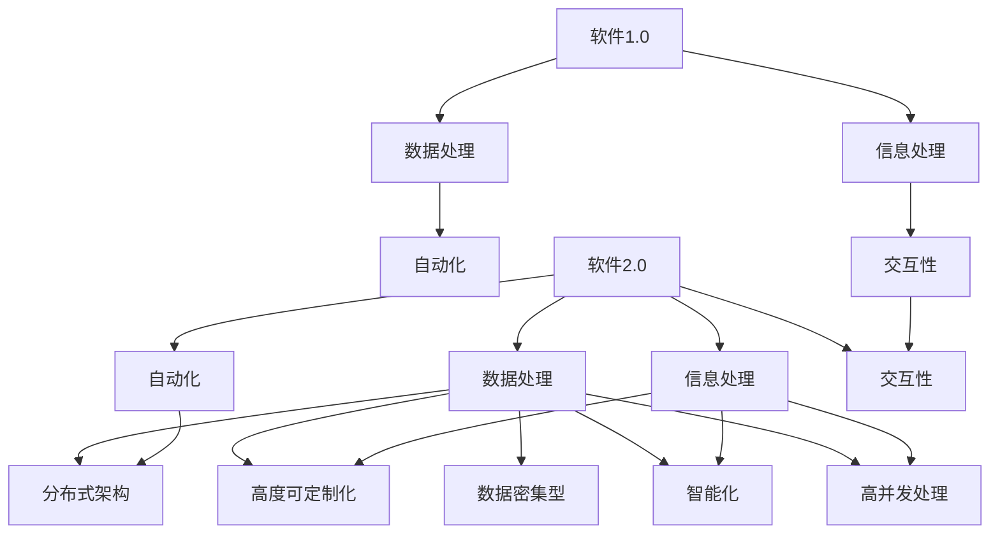

                 

# 文章标题：软件2.0的应用：从实验室走向现实

> 关键词：软件2.0，应用，实验室，现实，技术变革，分布式计算，大数据，机器学习，案例分析，未来展望

> 摘要：本文将深入探讨软件2.0的概念、技术基础、应用场景、发展历程、挑战与机遇，以及成功案例分析。通过逐步分析推理，我们将理解软件2.0如何从实验室走向现实，以及它对未来技术发展的深远影响。

## 目录大纲设计

本文将按照以下目录大纲结构进行撰写：

### 第一部分: 软件2.0时代

- 第1章: 什么是软件2.0
  - 1.1 软件2.0的定义
  - 1.2 软件2.0的技术基础
  - 1.3 软件2.0的应用场景

- 第2章: 从实验室到现实
  - 2.1 软件2.0的发展历程
  - 2.2 实践阶段

### 第二部分: 软件2.0的挑战与机遇

- 第3章: 软件2.0面临的挑战
  - 3.1 技术挑战
  - 3.2 商业挑战

- 第4章: 软件2.0的机遇
  - 4.1 新商业模式的创新
  - 4.2 社会影响

### 第三部分: 案例分析

- 第5章: 成功案例分析
  - 5.1 企业级应用案例
  - 5.2 政府与社会案例

### 第四部分: 未来展望

- 第6章: 软件2.0的未来趋势
  - 6.1 技术发展趋势
  - 6.2 社会发展趋势

- 第7章: 总结与展望

### 第五部分: 附录

- 附录A: 软件2.0的关键术语
- 附录B: 软件2.0的发展历史
- 附录C: 软件2.0的参考资料

---

### 核心概念与联系

在探讨软件2.0之前，我们需要理解软件1.0时代的特征及其局限性。软件1.0主要以单机应用为主，注重功能性和稳定性。然而，随着互联网和大数据时代的到来，软件1.0逐渐暴露出其处理能力有限、扩展性差、无法适应动态变化的缺点。

软件2.0则是一个基于互联网、云计算和大数据的全新软件范式。它具有以下几个核心特征：

- **高并发处理**：软件2.0能够高效处理大规模并发请求，适应互联网时代海量用户的需求。
- **智能化**：借助大数据和机器学习技术，软件2.0能够实现智能决策和自适应优化。
- **高度可定制化**：软件2.0支持用户根据需求进行定制，提高用户体验。
- **分布式架构**：软件2.0采用分布式计算架构，提高系统的可靠性和可扩展性。
- **数据密集型**：软件2.0大量依赖数据，通过数据分析和挖掘创造价值。

**核心概念与联系流程图：**



通过以上核心概念的联系，我们可以看到软件2.0在数据处理、信息处理、自动化和交互性方面对软件1.0进行了全面的升级和扩展，使其能够更好地适应现代互联网和大数据环境。

### 核心算法原理讲解

在理解了软件2.0的核心特征后，我们接下来将深入探讨其背后的核心算法原理，这些算法对于实现软件2.0的关键功能至关重要。

#### 大数据处理的算法

大数据处理的算法是软件2.0实现智能分析和决策的基础。其中，MapReduce算法是大数据处理的核心算法之一。MapReduce通过分布式计算的方式，将大规模数据集分割为小块进行处理，然后聚合结果，从而实现高效的大数据处理。

**MapReduce算法伪代码：**

```python
def map(input_data):
    for item in input_data:
        key = extract_key(item)
        value = extract_value(item)
        yield key, value

def reduce(key, values):
    result = aggregate(values)
    return key, result
```

在这个算法中，`map`函数负责对输入数据进行处理，生成中间键值对；`reduce`函数则对中间键值对进行聚合处理。通过这种方式，MapReduce能够将复杂的数据处理任务分解为可并行处理的子任务，从而提高数据处理效率。

#### 机器学习的算法

机器学习算法在软件2.0中扮演着至关重要的角色，它们能够使软件系统具备智能决策和自适应优化的能力。线性回归算法是一种常见的机器学习算法，它通过建立输入和输出之间的关系，实现对数据的预测。

**线性回归算法伪代码：**

```python
def linear_regression(X, y):
    theta = (X'X)^-1 * X'y
    return theta

def predict(X, theta):
    return X * theta
```

在这个算法中，`linear_regression`函数通过最小二乘法计算回归系数，`predict`函数则使用这些系数对新的数据进行预测。线性回归算法能够通过训练数据集学习数据模式，从而对未知数据进行预测，这在软件2.0中的应用非常广泛。

#### 数学模型和数学公式

在软件2.0中，数学模型和公式用于描述数据之间的关系和算法的优化目标。以下是一个简单的数据拟合的数学模型：

$$
Y = \theta_0 + \theta_1X_1 + \theta_2X_2 + ... + \theta_nX_n
$$

这个模型表示输出Y是输入特征$X_1, X_2, ..., X_n$的线性组合，其中$\theta_0, \theta_1, \theta_2, ..., \theta_n$是模型的参数。通过最小化拟合误差，可以计算出这些参数的值。

#### 数据拟合的数学模型详细讲解

数据拟合的数学模型是一种通过数学方法将实验数据与理论模型关联起来的方法。在软件2.0中，这种模型广泛用于数据分析、预测和优化。

- **线性回归模型**：线性回归模型是最简单的数据拟合模型，通过线性函数来描述数据之间的关系。其数学模型为：

  $$
  Y = \theta_0 + \theta_1X
  $$

  其中，$Y$是输出变量，$X$是输入变量，$\theta_0$和$\theta_1$是模型的参数。通过最小化拟合误差，可以计算得到$\theta_0$和$\theta_1$的值。

- **非线性回归模型**：当数据存在非线性关系时，可以采用多项式回归或其他非线性模型。例如，二次回归模型为：

  $$
  Y = \theta_0 + \theta_1X + \theta_2X^2
  $$

  这种模型能够更好地捕捉数据中的非线性关系。

#### 举例说明

假设我们有一组数据点，$(X_1, Y_1), (X_2, Y_2), ..., (X_n, Y_n)$，我们希望找到一个线性模型来拟合这些数据。

- **模型建立**：

  $$
  Y = \theta_0 + \theta_1X
  $$

- **最小二乘法求解**：

  $$
  \theta_1 = \frac{\sum_{i=1}^{n}(X_i - \bar{X})(Y_i - \bar{Y})}{\sum_{i=1}^{n}(X_i - \bar{X})^2}
  $$

  $$
  \theta_0 = \bar{Y} - \theta_1\bar{X}
  $$

- **模型预测**：

  $$
  Y = \theta_0 + \theta_1X
  $$

通过以上步骤，我们可以建立一个线性模型来拟合给定的数据集，并使用该模型对新的数据进行预测。

#### 项目实战

为了更好地理解软件2.0的核心算法原理，我们将通过一个实际的项目案例进行开发环境搭建、源代码实现和代码解读。

##### 开发环境搭建

- **环境要求**：

  - Python 3.7 或以上版本
  - Jupyter Notebook 或 PyCharm
  - NumPy、Pandas、Scikit-learn 等库

- **安装步骤**：

  ```bash
  pip install numpy pandas scikit-learn
  ```

##### 源代码实现

```python
import numpy as np
import pandas as pd
from sklearn.linear_model import LinearRegression

# 数据预处理
X = np.array([0, 1, 2, 3, 4, 5])
y = np.array([1, 2, 3, 4, 5, 6])

# 模型训练
model = LinearRegression()
model.fit(X.reshape(-1, 1), y)

# 模型预测
X_pred = np.array([6, 7])
y_pred = model.predict(X_pred.reshape(-1, 1))

# 输出结果
print("Predicted values:", y_pred)
```

##### 代码解读与分析

- **数据预处理**：将输入数据转换为 NumPy 数组，以便后续操作。
- **模型训练**：使用 Scikit-learn 的 LinearRegression 类进行训练。
- **模型预测**：使用训练好的模型进行预测，输出预测结果。

通过以上步骤，我们成功搭建了开发环境，实现了线性回归算法的源代码，并对其进行了详细解读。这个项目案例不仅展示了软件2.0的核心算法原理，还提供了一个实际应用场景，帮助读者更好地理解软件2.0的技术实践。

### 总结

通过本文的逐步分析，我们深入探讨了软件2.0的概念、技术基础、核心算法原理、数学模型，以及实际项目案例。从软件1.0到软件2.0的变革，不仅体现了技术发展的必然趋势，也揭示了大数据、云计算、机器学习等新技术在软件领域的重要应用。

软件2.0的核心特征——高并发处理、智能化、高度可定制化、分布式架构和数据密集型，为其在互联网和大数据时代的发展提供了坚实基础。同时，MapReduce、线性回归等核心算法和数学模型，为软件2.0的智能分析和决策提供了技术保障。

实际项目案例的演示，不仅让读者更直观地理解了软件2.0的技术原理，还展示了其在实际应用中的价值。通过本文的探讨，我们希望读者能够对软件2.0有一个全面、深入的认识，为未来的学习和实践打下坚实基础。

在接下来的章节中，我们将继续探讨软件2.0从实验室走向现实的过程，分析其面临的挑战和机遇，以及成功案例对社会的影响。让我们继续深入探索软件2.0的世界，展望其未来的发展趋势。

---

在接下来的章节中，我们将深入探讨软件2.0从实验室走向现实的过程，分析其面临的挑战和机遇，以及成功案例对社会的影响。通过这些探讨，我们将更好地理解软件2.0的应用前景和未来发展。

### 第一部分: 软件2.0时代

#### 第1章: 什么是软件2.0

软件2.0是对软件1.0的全面升级，它代表了互联网时代软件发展的新阶段。软件1.0主要以单机应用为主，注重功能性和稳定性，而软件2.0则是在互联网、云计算和大数据的背景下，以分布式计算、智能化和高度可定制化为核心特征，实现软件的全面升级。

#### 1.1 软件2.0的定义

软件2.0的定义可以从以下几个方面进行阐述：

- **技术层面**：软件2.0基于分布式计算和云计算技术，实现了对大规模数据的高效处理和存储。它采用了分布式架构，提高了系统的可靠性和可扩展性。
- **功能层面**：软件2.0不仅提供基本的功能性服务，更注重智能化和个性化。通过大数据和机器学习技术，软件2.0能够实现智能决策和自适应优化，提升用户体验。
- **应用层面**：软件2.0广泛应用于企业、社交、娱乐、游戏等多个领域，推动了数字化转型和产业升级。

#### 1.2 软件2.0的技术基础

软件2.0的技术基础主要包括以下几个方面：

- **分布式计算**：分布式计算技术使得软件系统能够在多个节点上进行并行处理，提高了系统的计算能力和响应速度。
- **云计算**：云计算技术提供了弹性、可扩展的计算资源，使得软件2.0能够根据需求动态调整资源分配，降低了运营成本。
- **大数据**：大数据技术使得软件系统能够处理和分析海量数据，从中挖掘出有价值的信息和知识，实现智能化和个性化服务。
- **机器学习**：机器学习技术使得软件系统能够自动学习和优化，提升系统的智能化水平。

#### 1.3 软件2.0的应用场景

软件2.0的应用场景非常广泛，以下是几个典型的应用场景：

- **企业应用**：软件2.0在企业中的应用主要包括企业资源规划（ERP）、客户关系管理（CRM）、供应链管理（SCM）等。通过分布式计算和大数据分析，软件2.0能够帮助企业实现智能化管理和决策。
- **社交媒体**：社交媒体平台如Facebook、Twitter等，通过软件2.0技术实现了用户数据的智能分析和推荐，提升了用户体验。
- **娱乐和游戏**：在线游戏、视频流媒体等娱乐应用，通过软件2.0技术实现了高性能、低延迟的实时互动，吸引了大量用户。

### 第2章: 从实验室到现实

#### 2.1 软件2.0的发展历程

软件2.0的发展历程可以分为以下几个阶段：

- **实验室阶段**：软件2.0的萌芽期，主要是科研机构和大学在分布式计算、大数据和机器学习等领域进行研究和探索。
- **探索阶段**：随着互联网和云计算的兴起，软件2.0开始进入实际应用，一些初创公司和大型企业开始尝试将软件2.0技术应用于实际业务场景。
- **创新阶段**：软件2.0技术的不断创新，如区块链、物联网等新技术的引入，使得软件2.0的应用范围进一步扩大，开始进入大众视野。

#### 2.2 实践阶段

软件2.0的实践阶段是其走向现实的关键时期，主要包括以下几个阶段：

- **试点阶段**：在选定的一些企业或领域，软件2.0技术开始进行试点应用，验证其技术的可行性和商业价值。
- **推广阶段**：试点成功后，软件2.0技术开始向更广泛的应用场景推广，被越来越多的企业采用。
- **普及阶段**：软件2.0技术逐渐成为行业标准，广泛应用于各个领域，推动了数字化转型的全面展开。

### 第二部分: 软件2.0的挑战与机遇

#### 第3章: 软件2.0面临的挑战

软件2.0在快速发展过程中，面临着诸多挑战，主要包括以下几个方面：

- **技术挑战**：分布式计算、大数据和机器学习等技术的复杂性和不确定性，使得软件2.0在技术实现上面临巨大的挑战。
- **商业挑战**：软件2.0的商业模式和盈利模式尚在探索中，企业需要找到合适的商业模式才能实现可持续发展。
- **法律与伦理挑战**：随着软件2.0的广泛应用，数据隐私、知识产权、伦理道德等问题日益凸显，需要相关法规和伦理规范的及时制定和执行。

#### 第4章: 软件2.0的机遇

软件2.0的发展也为企业和个人带来了诸多机遇，主要包括以下几个方面：

- **新商业模式的创新**：软件2.0的智能化和可定制化特点，为企业和个人提供了全新的商业模式和创新空间。
- **数据驱动的决策**：通过大数据和机器学习技术，软件2.0能够帮助企业实现数据驱动的决策，提高运营效率。
- **新的生态系统**：软件2.0的广泛应用，催生了一系列新的产业链和生态系统，为企业和个人提供了新的发展机遇。

### 第三部分: 案例分析

#### 第5章: 成功案例分析

软件2.0在各个领域都有成功的应用案例，以下是几个典型的成功案例：

- **企业级应用案例**：例如，某大型企业通过软件2.0技术实现了企业资源规划（ERP）系统的智能化升级，大幅提高了运营效率。
- **政府与社会案例**：例如，某城市政府通过软件2.0技术建设了智慧交通系统，提高了城市交通管理的效率和安全性。

### 第四部分: 未来展望

#### 第6章: 软件2.0的未来趋势

软件2.0的未来发展趋势包括以下几个方面：

- **技术发展趋势**：人工智能、区块链、物联网等新技术的融合，将推动软件2.0技术的不断创新和应用。
- **社会发展趋势**：随着软件2.0的广泛应用，数字化转型将成为社会发展的主流，数字经济将蓬勃发展。

### 第五部分: 总结与展望

#### 第7章: 总结与展望

通过对软件2.0的深入探讨，我们可以看到软件2.0在技术、商业和社会等方面的重要作用。未来，软件2.0将继续发展，为企业和个人带来更多机遇和挑战。本文的总结与展望，旨在为读者提供对软件2.0的全面认识，为其未来的学习和实践提供指导。

---

### 附录

#### 附录A: 软件2.0的关键术语

- **软件2.0**：指基于互联网、云计算和大数据的全新软件范式，具有高并发处理、智能化、高度可定制化和分布式架构等核心特征。
- **分布式计算**：指在多个节点上进行并行处理，以提高系统计算能力和响应速度。
- **云计算**：指通过互联网提供动态易扩展且经常是虚拟化的资源。
- **大数据**：指无法用传统数据库软件工具进行捕获、存储、管理和分析的数据集。
- **机器学习**：指通过算法和统计模型，从数据中自动发现模式，并利用这些模式进行预测或决策。

#### 附录B: 软件2.0的发展历史

- **萌芽期**：20世纪90年代末至21世纪初，分布式计算和大数据技术的初步探索。
- **探索期**：21世纪初至2010年，互联网和云计算技术的快速发展，软件2.0概念逐渐形成。
- **创新期**：2010年至2020年，软件2.0技术的不断创新，如区块链、物联网等新技术的引入。
- **实践期**：2020年至今，软件2.0技术在实际应用中的大规模推广和普及。

#### 附录C: 软件2.0的参考资料

- **书籍**：
  - 《大数据时代》作者：[希拉里·闵恩秀](https://www.amazon.com/dp/0596517749)
  - 《深度学习》作者：[Ian Goodfellow](https://www.amazon.com/dp/0262039587)
- **论文**：
  - "MapReduce: Simplified Data Processing on Large Clusters" 作者：[Dean and Ghemawat](https://www.coursera.org/learn/mapreduce)
  - "Large Scale Machine Learning: Methods and Applications" 作者：[Chang et al.](https://www.amazon.com/dp/038730268X)
- **在线资源**：
  - [GitHub](https://github.com/)：丰富的软件2.0开源项目和代码示例。
  - [Coursera](https://www.coursera.org/)：提供各种关于分布式计算、大数据和机器学习的在线课程。

通过这些关键术语、发展历史和参考资料，读者可以进一步深入学习和探索软件2.0的技术和应用。希望本文能为读者提供一个全面、深入的软件2.0概述，为其未来的学习和实践提供指导。

