                 

## 文章标题：软件 2.0：超越传统编程范式

> 关键词：软件2.0，传统编程范式，云计算，大数据，人工智能，区块链，边缘计算

> 摘要：本文探讨了软件2.0时代的来临及其与传统的编程范式的区别。我们详细阐述了软件2.0的定义、核心特征及其关键技术的应用，如大数据与云计算、人工智能与机器学习、区块链与智能合约、软件定义网络与边缘计算。此外，文章还介绍了软件2.0的架构设计、开发实践、应用案例以及其对社会的影响与伦理问题。最后，我们对软件2.0的未来趋势进行了展望。

---

## 第1章：软件2.0时代的来临

### 1.1 软件发展的历史与趋势

#### 1.1.1 软件从1.0到2.0的演变

软件的发展历程可以分为几个阶段，从最初的软件1.0时代到现在的软件2.0时代。软件1.0时代主要指的是早期的编程范式，以手工编码为主，软件的开发和运行环境相对封闭，主要依赖于特定的硬件平台和操作系统。这个阶段的软件主要是为了完成特定的功能而开发，缺乏灵活性和可扩展性。

随着计算机技术的不断进步，软件1.0时代逐渐向软件2.0时代过渡。软件2.0时代以云计算、大数据、人工智能、区块链等新兴技术为核心，实现了软件系统的智能化、协同化、定制化和透明化。软件2.0时代的到来，标志着软件发展进入了一个全新的阶段。

**Mermaid流程图：**

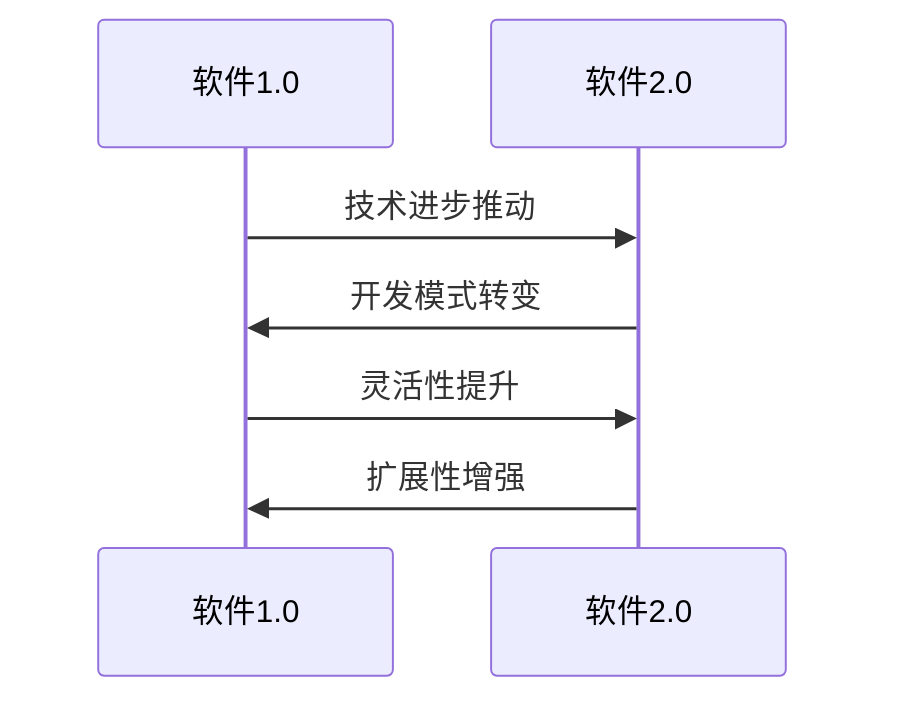

#### 1.1.2 软件发展的驱动力

软件发展的驱动力主要来自于以下几个方面：

1. **技术进步**：硬件性能的提升、算法的优化、网络带宽的增加等，为软件的发展提供了强大的技术支持。
2. **市场需求**：企业对高效、智能、灵活的软件解决方案的需求增加，推动了软件技术的不断演进。
3. **商业模式**：互联网、电子商务等新兴商业模式的推动，使得软件成为了企业竞争力的重要体现。

#### 1.1.3 软件2.0的特征与核心

软件2.0的核心特征主要包括以下几个方面：

1. **智能化**：通过人工智能、机器学习等技术，实现软件系统的自我学习和智能决策。
2. **协同化**：通过云计算、大数据等技术，实现跨平台、跨系统的协同工作。
3. **定制化**：根据用户需求，提供个性化的软件解决方案。
4. **透明化**：通过区块链技术，实现数据的透明、可信。

**Mermaid流程图：**

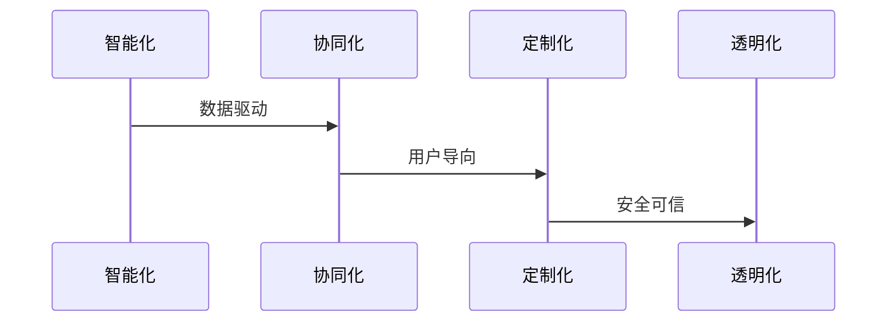

### 1.2 传统编程范式的局限性

传统编程范式主要指的是以手工编码为主的软件开发方式。这种范式在软件1.0时代取得了巨大的成功，但随着软件规模的扩大和复杂度的增加，其局限性逐渐显现。

#### 1.2.1 传统编程范式的问题

1. **静态性**：传统编程范式侧重于静态的代码编写，难以适应动态的环境变化。
2. **复杂性**：随着软件规模和复杂度的增加，维护和扩展变得困难。
3. **孤岛化**：不同系统之间的数据交互和协作难度大，形成信息孤岛。

#### 1.2.2 传统编程范式的限制

1. **响应速度**：在处理大量数据和高频次请求时，性能受限。
2. **扩展性**：难以应对业务规模和用户数量的急剧变化。
3. **灵活性**：难以快速适应新的业务需求和技术变化。

#### 1.2.3 传统编程范式面临的挑战

1. **软件危机**：软件项目延期、超预算、质量低等问题突出。
2. **技术瓶颈**：传统技术难以满足日益增长的业务需求。
3. **人才短缺**：高素质的软件开发人才供不应求。

### 1.3 软件2.0的定义与核心特征

软件2.0是软件发展的新阶段，它利用大数据、云计算、人工智能、区块链等新兴技术，实现软件系统的智能化、协同化、定制化和透明化。

#### 1.3.1 软件2.0的定义

软件2.0是相对于软件1.0的新阶段，它强调软件的智能化、协同化、定制化和透明化，通过利用新兴技术，提升软件的灵活性和扩展性。

#### 1.3.2 软件2.0的核心特征

1. **智能化**：通过人工智能、机器学习等技术，实现软件系统的自我学习和智能决策。
2. **协同化**：通过云计算、大数据等技术，实现跨平台、跨系统的协同工作。
3. **定制化**：根据用户需求，提供个性化的软件解决方案。
4. **透明化**：通过区块链技术，实现数据的透明、可信。

#### 1.3.3 软件2.0与传统编程范式的区别

1. **开发方式**：从静态代码编写转向动态配置和自动化部署。
2. **架构设计**：从单体架构转向微服务架构、服务网格架构等。
3. **数据处理**：从离线处理转向实时处理和流处理。
4. **安全与隐私**：从传统的安全措施转向基于区块链的透明和可信。

### 1.4 软件2.0的典型应用场景

软件2.0的应用场景非常广泛，以下是几个典型的应用场景：

#### 1.4.1 软件定义网络

软件定义网络（SDN）是一种新型的网络架构，通过将控制平面和数据平面分离，实现网络的灵活管理和控制。SDN在企业内部网络、数据中心互联、云计算服务等领域有广泛的应用。

**Mermaid流程图：**

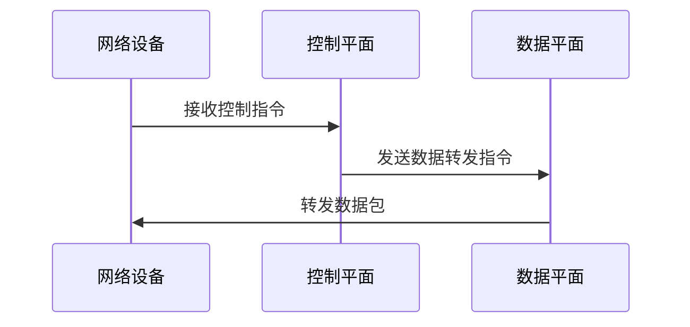

#### 1.4.2 人工智能与机器学习

人工智能（AI）和机器学习（ML）在软件2.0时代有着广泛的应用。例如，智能客服、智能推荐、自动化决策等领域。通过AI和ML技术，软件系统能够更好地理解和满足用户需求，提高用户体验和业务效率。

**Mermaid流程图：**

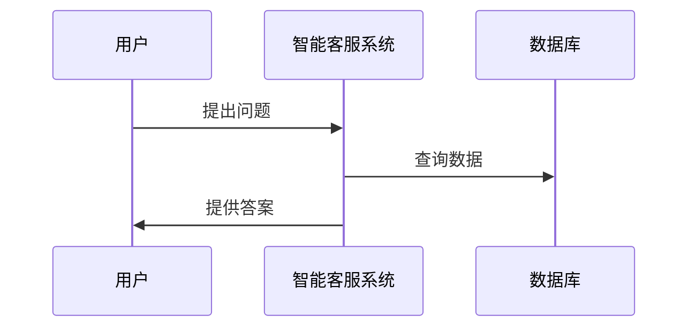

#### 1.4.3 区块链与智能合约

区块链技术通过去中心化和不可篡改的特点，实现了数据的透明和可信。智能合约是基于区块链的一种自动化执行协议，可以在无需人工干预的情况下自动执行合同条款。区块链技术在数字货币、供应链管理、版权保护等领域有广泛的应用。

**Mermaid流程图：**

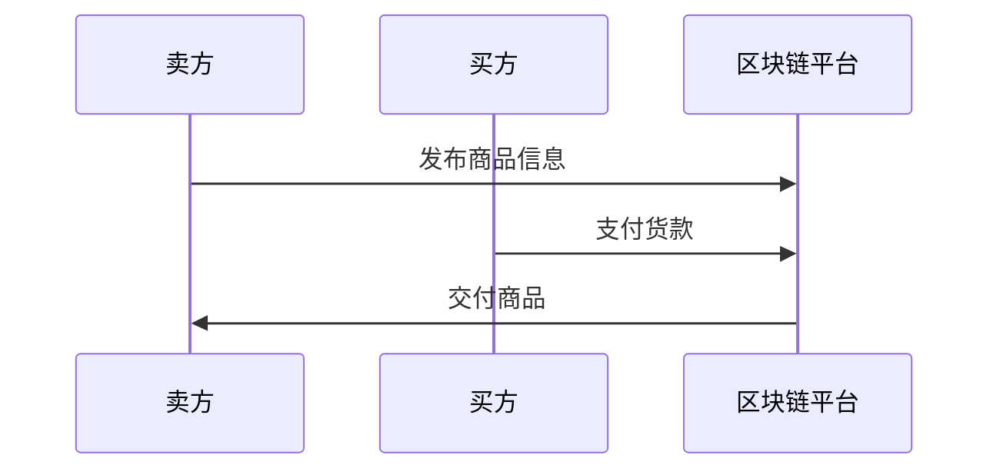

#### 1.4.4 边缘计算

边缘计算是将计算、存储和网络功能分布到网络的边缘，接近数据源，以减少延迟和带宽消耗。边缘计算在物联网、自动驾驶、智能安防等领域有广泛的应用。

**Mermaid流程图：**

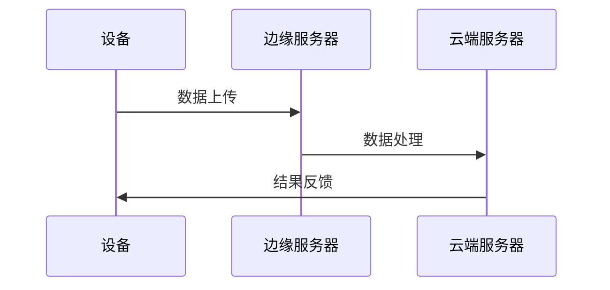

### 1.5 总结

软件2.0时代的来临，标志着软件发展进入了一个全新的阶段。与传统编程范式相比，软件2.0具有智能化、协同化、定制化和透明化等核心特征。软件2.0的关键技术包括大数据与云计算、人工智能与机器学习、区块链与智能合约、软件定义网络与边缘计算等。这些技术的应用，不仅提升了软件的性能和效率，也为各行各业带来了深刻的变革。在接下来的章节中，我们将进一步探讨软件2.0的实现方法、应用案例以及其对社会的影响与伦理问题。


---

## 第2章：软件2.0的关键技术

软件2.0时代的到来，离不开一系列关键技术的支撑。本章将详细探讨这些关键技术，包括大数据与云计算、人工智能与机器学习、区块链与智能合约、软件定义网络与边缘计算。通过这些技术的介绍，我们将更好地理解软件2.0的核心能力与应用场景。

### 2.1 大数据与云计算

#### 2.1.1 大数据的基本概念

大数据（Big Data）是指数据量巨大、类型繁多、处理速度快、价值密度低的非结构化数据。大数据的特点可以用4V来概括：Volume（大量）、Velocity（快速）、Variety（多样）和Veracity（真实性）。

**Mermaid流程图：**

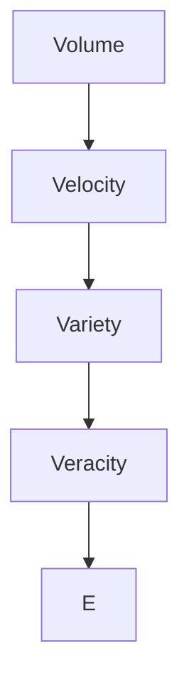

#### 2.1.2 云计算的基本概念

云计算（Cloud Computing）是一种通过网络提供计算资源和服务的能力。云计算将计算资源（如服务器、存储、网络等）虚拟化，用户可以根据需求随时获取和使用这些资源。

**Mermaid流程图：**


#### 2.1.3 大数据与云计算的关系

大数据和云计算是相辅相成的。大数据需要云计算提供强大的计算能力和存储能力，而云计算则需要大数据提供丰富的应用场景和业务价值。

**Mermaid流程图：**

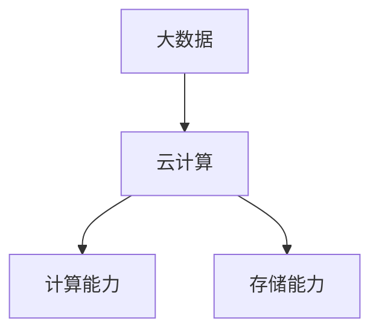

#### 2.1.4 大数据与云计算的应用场景

大数据和云计算在多个领域有广泛的应用，如电子商务、金融、医疗、交通等。

**Mermaid流程图：**

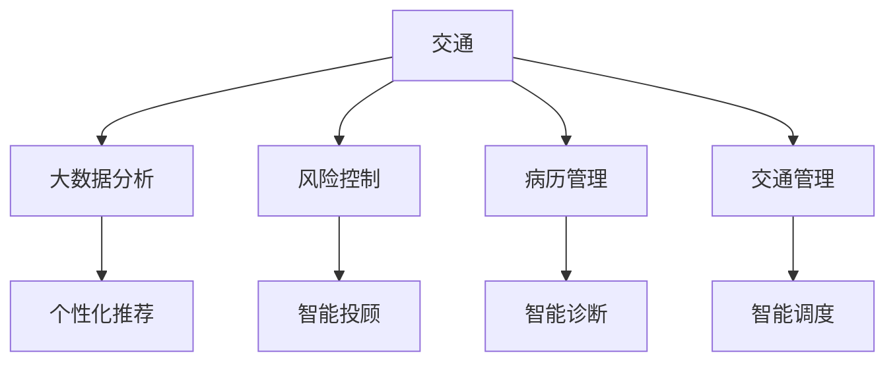

### 2.2 人工智能与机器学习

#### 2.2.1 人工智能的基本概念

人工智能（Artificial Intelligence，AI）是指通过计算机模拟人类的智能行为，实现自动化决策、问题解决、知识推理等功能。

**Mermaid流程图：**

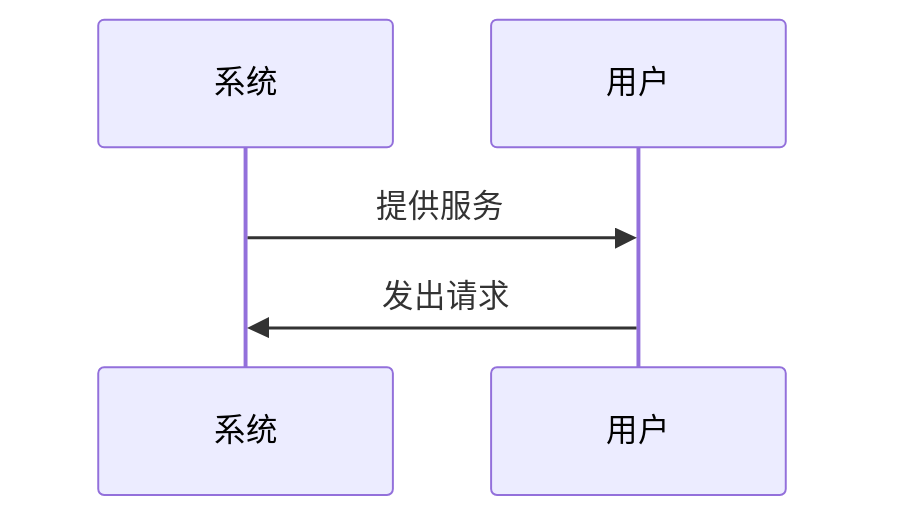

#### 2.2.2 机器学习的基本概念

机器学习（Machine Learning，ML）是人工智能的一个分支，通过算法和模型，让计算机从数据中自动学习和发现规律。

**Mermaid流程图：**

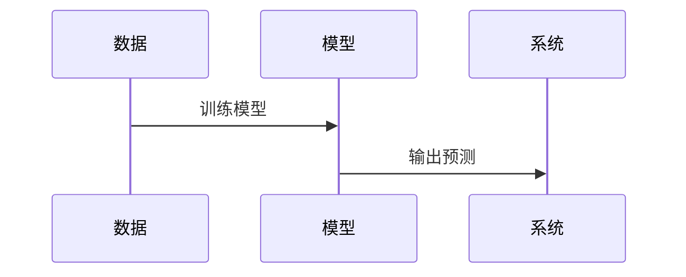

#### 2.2.3 人工智能与机器学习的应用场景

人工智能和机器学习在多个领域有广泛的应用，如智能客服、自动驾驶、医疗诊断、金融风控等。

**Mermaid流程图：**

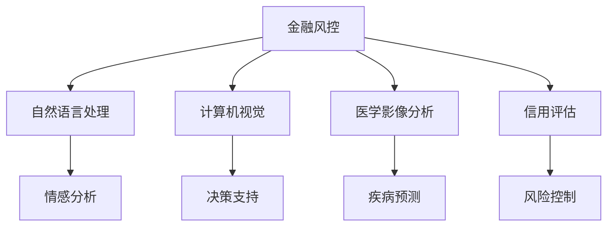

### 2.3 区块链与智能合约

#### 2.3.1 区块链的基本概念

区块链（Blockchain）是一种去中心化的分布式账本技术，通过加密算法和共识机制，实现数据的透明、可信和不可篡改。

**Mermaid流程图：**

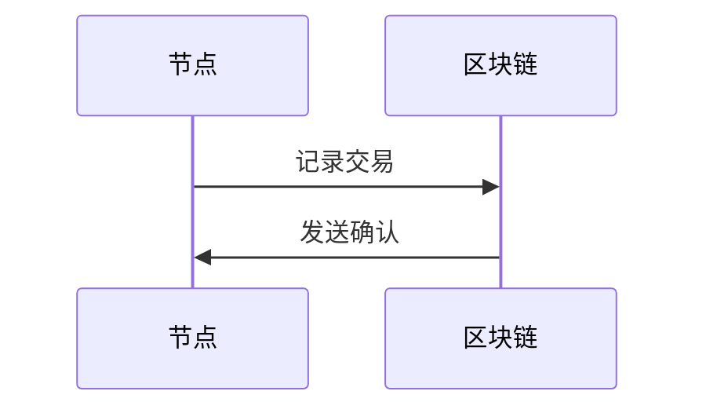

#### 2.3.2 智能合约的基本概念

智能合约（Smart Contract）是一种运行在区块链上的计算机程序，通过代码自动执行合同条款。

**Mermaid流程图：**

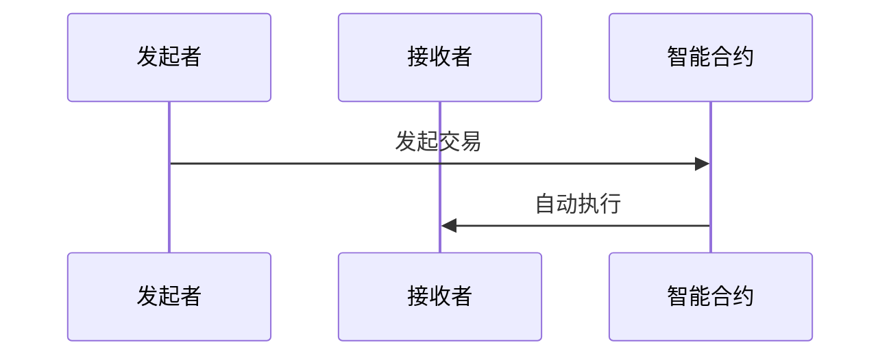

#### 2.3.3 区块链与智能合约的应用场景

区块链和智能合约在金融、物流、版权保护等领域有广泛的应用。

**Mermaid流程图：**

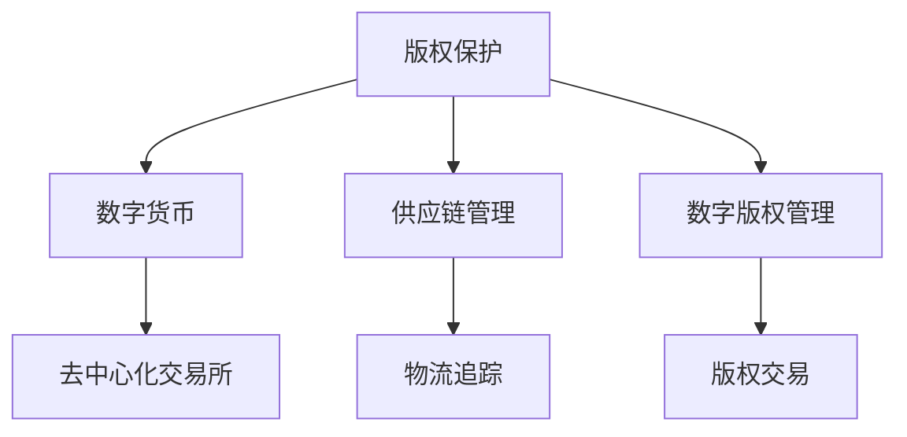

### 2.4 软件定义网络与边缘计算

#### 2.4.1 软件定义网络的基本概念

软件定义网络（Software Defined Networking，SDN）是一种新型网络架构，通过将控制平面和数据平面分离，实现网络的灵活管理和控制。

**Mermaid流程图：**

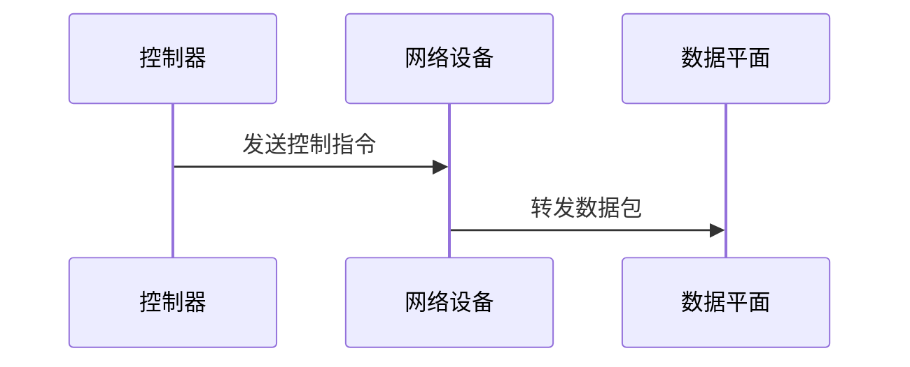

#### 2.4.2 边缘计算的基本概念

边缘计算（Edge Computing）是一种将计算、存储和网络功能分布到网络的边缘，接近数据源，以减少延迟和带宽消耗的计算模式。

**Mermaid流程图：**

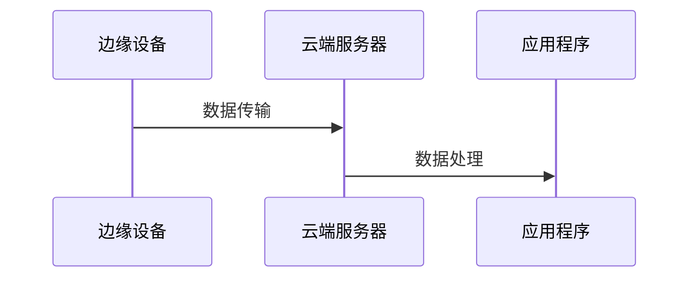

#### 2.4.3 软件定义网络与边缘计算的关系

软件定义网络和边缘计算是相辅相成的。软件定义网络通过集中化的控制平面，实现网络的灵活管理；而边缘计算通过分布式的计算能力，实现数据的实时处理和本地化服务。

**Mermaid流程图：**

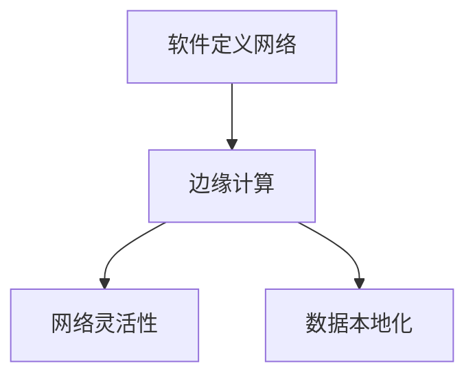

#### 2.4.4 软件定义网络与边缘计算的应用场景

软件定义网络和边缘计算在物联网、智能城市、工业互联网等领域有广泛的应用。

**Mermaid流程图：**

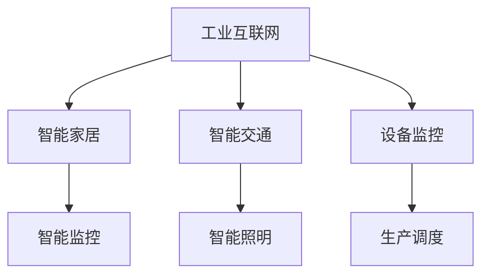

### 2.5 总结

大数据与云计算、人工智能与机器学习、区块链与智能合约、软件定义网络与边缘计算是软件2.0时代的关键技术。这些技术相互交织，共同推动软件2.0的发展。在接下来的章节中，我们将进一步探讨软件2.0的架构设计、开发实践、应用案例以及其对社会的影响与伦理问题。


---

## 第3章：软件2.0架构设计

软件2.0时代的到来，对软件架构设计提出了新的要求和挑战。本章将详细介绍软件2.0架构的设计原则、核心概念以及实现方法，帮助读者更好地理解和构建软件2.0系统。

### 3.1 软件2.0架构的核心概念

软件2.0架构是基于软件2.0时代的特征和需求而设计的。其核心概念包括以下几个方面：

1. **微服务架构**：微服务架构将大型单体应用拆分为多个小型、独立的服务，每个服务专注于完成特定的功能。这种架构具有高扩展性、高可靠性和高灵活性。

**Mermaid流程图：**

```mermaid
sequenceDiagram
  participant A as 服务1
  participant B as 服务2
  participant C as 服务3
  A->>B: 请求服务
  B->>C: 调用服务
```

2. **服务网格架构**：服务网格架构是一种用于管理服务之间通信的抽象层，它独立于服务本身，提供了一种统一的通信机制。服务网格架构能够实现服务间的负载均衡、服务发现、安全性等。

**Mermaid流程图：**

```mermaid
sequenceDiagram
  participant A as 服务1
  participant B as 服务网格
  participant C as 服务2
  A->>B: 发起请求
  B->>C: 转发请求
```

3. **容器化技术**：容器化技术通过将应用程序及其依赖环境打包到容器中，实现了应用程序的轻量级、可移植和隔离运行。容器化技术是微服务架构和服务网格架构实现的基础。

**Mermaid流程图：**

```mermaid
sequenceDiagram
  participant A as 应用程序
  participant B as 容器
  participant C as 环境
  A->>B: 打包容器
  B->>C: 运行环境
```

4. **边缘计算架构**：边缘计算架构将计算、存储和网络功能分布到网络的边缘，接近数据源。边缘计算架构能够实现数据的实时处理和本地化服务，提高系统的响应速度和性能。

**Mermaid流程图：**

```mermaid
sequenceDiagram
  participant A as 边缘设备
  participant B as 云端服务器
  participant C as 应用程序
  A->>B: 数据传输
  B->>C: 数据处理
```

### 3.2 软件2.0架构的设计原则

软件2.0架构设计应遵循以下原则：

1. **可扩展性**：架构应能够轻松扩展，以应对不断增长的业务需求和用户数量。
2. **弹性**：架构应具有弹性，能够在遇到故障或压力时自动调整资源，保持系统的稳定性。
3. **可靠性**：架构应具有高可靠性，能够保证数据的完整性和服务的连续性。
4. **安全性**：架构应具备强大的安全机制，保护数据的安全和隐私。
5. **可维护性**：架构应易于维护和升级，减少维护成本。

**Mermaid流程图：**

```mermaid
graph TD
  A[可扩展性]
  B[弹性]
  C[可靠性]
  D[安全性]
  E[可维护性]
  A->>B
  A->>C
  A->>D
  A->>E
  B->>C
  B->>D
  B->>E
  C->>D
  C->>E
  D->>E
```

### 3.3 软件2.0架构的实现方法

实现软件2.0架构的方法主要包括以下几个方面：

1. **微服务架构的实现方法**：
   - **服务拆分**：根据业务需求，将大型单体应用拆分为多个小型服务。
   - **服务治理**：实现服务发现、服务路由、服务监控等功能。
   - **服务部署**：采用容器化技术，将服务打包到容器中，实现快速部署和扩展。

2. **服务网格架构的实现方法**：
   - **服务发现**：实现服务注册和发现，确保服务之间的通信。
   - **负载均衡**：实现负载均衡，优化服务性能。
   - **安全性**：实现服务间的安全性控制，保护服务不受攻击。

3. **容器化技术的实现方法**：
   - **容器编排**：采用容器编排工具（如Kubernetes），实现容器的自动化部署和管理。
   - **容器镜像**：构建和管理容器镜像，确保应用程序的一致性和可移植性。
   - **容器网络**：实现容器之间的网络通信，确保容器之间的交互。

4. **边缘计算架构的实现方法**：
   - **边缘设备部署**：在网络的边缘部署计算、存储和网络设备。
   - **边缘数据处理**：实现边缘数据的实时处理和本地化服务。
   - **边缘与云端的协同**：实现边缘计算与云端服务的协同工作，优化系统的整体性能。

**Mermaid流程图：**

```mermaid
sequenceDiagram
  participant A as 应用程序
  participant B as 微服务架构
  participant C as 服务网格
  participant D as 容器化技术
  participant E as 边缘计算架构
  A->>B: 架构设计
  B->>C: 服务治理
  C->>D: 容器编排
  D->>E: 边缘数据处理
```

### 3.4 总结

软件2.0架构设计是软件2.0时代的重要任务。通过遵循设计原则和采用实现方法，我们可以构建出具有高扩展性、高弹性、高可靠性、高安全性和高可维护性的软件2.0系统。在接下来的章节中，我们将探讨软件2.0的开发实践、应用案例以及其对社会的影响与伦理问题。


---

## 第4章：软件2.0开发实践

### 4.1 软件2.0开发工具与平台

软件2.0的开发需要借助一系列工具和平台，以实现高效的开发和部署。以下是一些常用的开发工具与平台：

#### 4.1.1 开发工具

1. **集成开发环境（IDE）**：
   - **Visual Studio Code**：一款轻量级、高度可扩展的IDE，支持多种编程语言和开发框架。
   - **IntelliJ IDEA**：一款功能强大的IDE，特别适合Java和Python等编程语言。

2. **版本控制系统**：
   - **Git**：一种分布式版本控制系统，广泛应用于软件开发项目。
   - **GitLab**：基于Git的开源解决方案，提供代码托管、项目管理等功能。

3. **容器化工具**：
   - **Docker**：一种轻量级容器化技术，用于构建、运行和分发应用程序。
   - **Kubernetes**：一种容器编排工具，用于自动化容器的部署、扩展和管理。

#### 4.1.2 开发平台

1. **云计算平台**：
   - **AWS**：亚马逊提供的云计算服务，包括EC2、S3、RDS等。
   - **Azure**：微软提供的云计算服务，包括虚拟机、存储、数据库等。
   - **Google Cloud**：谷歌提供的云计算服务，包括计算引擎、云存储、数据库等。

2. **大数据平台**：
   - **Hadoop**：一个分布式数据存储和处理框架，适用于大数据场景。
   - **Spark**：一个快速且通用的分布式计算系统，适用于大数据处理。

3. **人工智能平台**：
   - **TensorFlow**：一个开源的机器学习框架，用于构建和训练深度学习模型。
   - **PyTorch**：一个开源的机器学习框架，特别适用于深度学习和计算机视觉。

#### 4.1.3 开发工具与平台的选用原则

选用开发工具与平台时，应考虑以下原则：

1. **兼容性**：所选用的工具和平台应与现有的技术栈兼容。
2. **性能**：工具和平台应具备良好的性能，以满足开发和部署的需求。
3. **易用性**：工具和平台应易于使用和部署，降低学习成本。
4. **生态**：所选用的工具和平台应有良好的生态，提供丰富的插件和资源。

### 4.2 软件2.0项目管理与协同

软件2.0项目通常涉及多个团队和多个技术领域，需要高效的的项目管理和协同工作。以下是一些项目管理与协同的方法：

#### 4.2.1 项目管理的基本概念

1. **项目计划**：明确项目的目标、范围、时间和资源分配。
2. **项目执行**：按计划执行项目任务，监控进度和质量。
3. **项目监控**：实时监控项目状态，识别和解决潜在的问题。
4. **项目收尾**：完成项目任务，进行项目评估和总结。

#### 4.2.2 项目管理的工具与方法

1. **项目管理工具**：
   - **JIRA**：一款流行的项目管理工具，用于任务跟踪、敏捷开发和团队协作。
   - **Trello**：一款简单易用的项目管理工具，用于任务列表和看板管理。

2. **敏捷开发方法**：
   - **Scrum**：一种流行的敏捷开发方法，强调迭代开发和频繁交付。
   - **Kanban**：一种基于看板的敏捷开发方法，用于可视化工作流程和持续改进。

#### 4.2.3 软件2.0项目中的协同工作

1. **团队沟通**：通过实时聊天工具（如Slack、Microsoft Teams）和视频会议工具（如Zoom、Skype）进行沟通。
2. **代码协作**：使用版本控制系统（如Git）进行代码的协同开发和管理。
3. **文档协作**：使用文档管理工具（如Confluence、Google Docs）进行文档的协同编辑和共享。

### 4.3 软件2.0开发过程中的挑战与解决方案

软件2.0开发过程中可能会面临一系列挑战，以下是一些常见的挑战和相应的解决方案：

#### 4.3.1 开发过程中的挑战

1. **技术复杂性**：软件2.0涉及多种新技术和框架，技术复杂性增加。
2. **团队合作**：涉及多个团队和领域，团队合作和协调困难。
3. **数据安全**：涉及大数据和敏感数据，数据安全风险增加。
4. **性能优化**：需要处理大量数据和高并发请求，性能优化难度大。

#### 4.3.2 解决方案与最佳实践

1. **技术选型**：选择适合项目需求的技术栈，避免过度技术复杂化。
2. **团队协作**：建立高效的沟通机制，明确分工和责任，促进团队协作。
3. **数据安全**：采用加密、访问控制等技术，确保数据的安全和隐私。
4. **性能优化**：采用分布式架构、缓存技术、负载均衡等方法，提高系统的性能和可扩展性。

#### 4.3.3 持续集成与持续交付

1. **持续集成（CI）**：通过自动化构建和测试，确保代码的质量和稳定性。
2. **持续交付（CD）**：通过自动化部署和监控，实现快速迭代和频繁交付。

**Mermaid流程图：**

```mermaid
sequenceDiagram
  participant A as 开发者
  participant B as CI/CD平台
  participant C as 测试人员
  participant D as 运维团队
  A->>B: 提交代码
  B->>C: 自动构建和测试
  C->>D: 部署和监控
  D->>A: 反馈和优化
```

### 4.4 总结

软件2.0开发实践涉及工具和平台的选择、项目管理和协同工作，以及应对开发过程中的挑战。通过合理利用工具和平台，建立高效的团队协作机制，我们可以实现软件2.0的快速开发和持续迭代。在接下来的章节中，我们将探讨软件2.0的应用案例以及其对社会的影响与伦理问题。


---

## 第5章：软件2.0应用案例

软件2.0的应用案例涵盖了各个行业和领域，展示了其强大的技术实力和变革力量。以下是一些典型的软件2.0应用案例，通过具体的应用场景、案例分析以及应用效果评估，我们将深入了解软件2.0的实际应用。

### 5.1 软件定义网络在企业中的应用

#### 5.1.1 应用场景与案例介绍

软件定义网络（SDN）在企业中的应用主要包括以下几个方面：

1. **数据中心互联**：通过SDN实现企业内部数据中心之间的高效互联，提高数据传输速度和可靠性。
2. **网络资源调度**：利用SDN的灵活控制能力，实现网络资源的动态调度和优化。
3. **网络安全**：通过SDN实现网络流量监控和安全策略的动态调整。

**案例介绍**：某大型企业通过SDN技术实现了企业内部数据中心的互联。利用SDN控制器，企业可以实时监控网络状态，动态调整路由策略，提高了网络的可靠性和性能。

#### 5.1.2 案例分析

1. **SDN控制器与网络设备**：企业部署了SDN控制器，用于管理和控制网络设备。通过SDN控制器，企业可以实现网络流量的动态路由和优化。

**Mermaid流程图：**

```mermaid
sequenceDiagram
  participant A as SDN控制器
  participant B as 路由器
  participant C as 交换机
  A->>B: 发送路由策略
  B->>C: 调整路由
```

2. **网络流量监控与优化**：通过SDN控制器，企业可以实时监控网络流量，根据流量情况动态调整路由策略，优化网络性能。

**Mermaid流程图：**

```mermaid
sequenceDiagram
  participant A as SDN控制器
  participant B as 流量监控工具
  participant C as 路由器
  A->>B: 监控流量
  B->>C: 提供优化建议
```

#### 5.1.3 应用效果评估

1. **网络性能提升**：通过SDN技术，企业实现了网络流量的动态优化，网络性能显著提升。
2. **运维效率提高**：通过SDN控制器，企业实现了网络资源的集中管理和控制，提高了运维效率。
3. **安全性增强**：通过SDN技术，企业可以实现网络流量的实时监控和动态调整，提高了网络的安全性。

### 5.2 人工智能在医疗健康领域的应用

#### 5.2.1 应用场景与案例介绍

人工智能（AI）在医疗健康领域的应用主要包括以下几个方面：

1. **疾病预测与诊断**：利用AI技术，对患者的健康数据进行分析，实现疾病的早期预测和诊断。
2. **个性化治疗**：根据患者的个体差异，利用AI技术制定个性化的治疗方案。
3. **药物研发**：利用AI技术加速药物研发过程，提高药物研发的成功率。

**案例介绍**：某医院利用AI技术实现了智能诊断系统。通过分析大量的医疗数据，AI系统可以准确诊断出多种疾病，提高了诊断的准确率和效率。

#### 5.2.2 案例分析

1. **数据收集与预处理**：收集大量的医疗数据，包括患者的病史、检查结果等，进行数据预处理，提取关键特征。

**Mermaid流程图：**

```mermaid
sequenceDiagram
  participant A as 数据收集系统
  participant B as 数据预处理模块
  A->>B: 提供医疗数据
  B->>A: 数据预处理
```

2. **模型训练与预测**：利用机器学习算法，对预处理后的医疗数据进行模型训练，实现疾病的预测和诊断。

**Mermaid流程图：**

```mermaid
sequenceDiagram
  participant A as 训练数据
  participant B as 模型训练模块
  participant C as 预测模块
  A->>B: 训练模型
  B->>C: 预测疾病
```

#### 5.2.3 应用效果评估

1. **诊断准确率提高**：通过AI技术的应用，诊断准确率显著提高，降低了误诊率。
2. **诊断效率提升**：AI系统可以快速处理大量数据，提高了诊断的效率。
3. **个性化治疗**：AI技术可以帮助医生制定个性化的治疗方案，提高了治疗效果。

### 5.3 区块链在金融行业的应用

#### 5.3.1 应用场景与案例介绍

区块链技术在金融行业的应用主要包括以下几个方面：

1. **数字货币**：利用区块链技术发行和管理数字货币，实现去中心化的支付和交易。
2. **供应链金融**：利用区块链技术实现供应链金融的透明化和高效化。
3. **智能合约**：利用区块链技术实现自动化执行合同条款，提高交易效率和安全性。

**案例介绍**：某银行利用区块链技术实现了供应链金融平台。通过区块链技术，企业可以快速获得贷款，降低了融资成本，提高了供应链的效率。

#### 5.3.2 案例分析

1. **区块链平台**：银行搭建了区块链平台，用于管理供应链金融交易。通过区块链技术，实现了交易数据的透明和不可篡改。

**Mermaid流程图：**

```mermaid
sequenceDiagram
  participant A as 企业
  participant B as 银行
  participant C as 区块链平台
  A->>B: 提交贷款申请
  B->>C: 处理申请
  C->>A: 发放贷款
```

2. **智能合约**：利用智能合约技术，实现了贷款申请和发放的自动化处理。通过区块链技术，实现了贷款合同条款的透明和不可篡改。

**Mermaid流程图：**

```mermaid
sequenceDiagram
  participant A as 企业
  participant B as 银行
  participant C as 智能合约
  A->>B: 提交贷款申请
  B->>C: 执行智能合约
  C->>A: 发放贷款
```

#### 5.3.3 应用效果评估

1. **交易效率提升**：通过区块链技术，供应链金融交易流程显著简化，提高了交易效率。
2. **安全性增强**：区块链技术实现了交易数据的透明和不可篡改，提高了交易的安全性。
3. **融资成本降低**：通过智能合约技术，企业可以快速获得贷款，降低了融资成本。

### 5.4 边缘计算在物联网领域的应用

#### 5.4.1 应用场景与案例介绍

边缘计算在物联网（IoT）领域的应用主要包括以下几个方面：

1. **实时数据处理**：在网络的边缘处理物联网设备产生的数据，减少数据传输延迟。
2. **智能设备管理**：通过边缘计算实现物联网设备的远程监控和管理。
3. **智能决策**：利用边缘计算实现物联网设备的智能决策和自主运行。

**案例介绍**：某智能城市项目利用边缘计算实现了实时交通监控和智能调度。通过边缘计算，项目实现了对交通数据的实时分析和处理，提高了交通管理的效率和准确性。

#### 5.4.2 案例分析

1. **边缘计算设备**：项目在交通路口和路段部署了边缘计算设备，用于实时采集和处理交通数据。

**Mermaid流程图：**

```mermaid
sequenceDiagram
  participant A as 边缘计算设备
  participant B as 交通监控平台
  A->>B: 传输交通数据
  B->>A: 分析和处理数据
```

2. **实时交通监控**：通过边缘计算设备，项目实现了对交通数据的实时监控，包括流量、速度、路况等。

**Mermaid流程图：**

```mermaid
sequenceDiagram
  participant A as 边缘计算设备
  participant B as 实时监控平台
  A->>B: 传输实时数据
  B->>A: 监控交通状态
```

#### 5.4.3 应用效果评估

1. **交通管理效率提高**：通过边缘计算技术，项目实现了对交通数据的实时分析和处理，提高了交通管理的效率和准确性。
2. **响应速度提升**：边缘计算设备能够实时处理交通数据，减少了数据传输延迟，提高了系统的响应速度。
3. **设备管理简化**：通过边缘计算技术，项目实现了对物联网设备的远程监控和管理，简化了设备管理工作。

### 5.5 总结

软件2.0的应用案例涵盖了各个行业和领域，展示了其强大的技术实力和变革力量。通过具体的应用场景、案例分析和应用效果评估，我们可以看到软件2.0在提高效率、降低成本、增强安全性等方面的优势。在接下来的章节中，我们将探讨软件2.0对社会的影响与伦理问题。


---

## 第6章：软件2.0的社会影响与伦理问题

软件2.0作为一场技术革命，不仅对技术领域产生了深远影响，也对社会、伦理、法律等多个方面带来了新的挑战和思考。本章将探讨软件2.0对社会的影响、个人隐私的保护、伦理问题以及法律挑战。

### 6.1 软件2.0对社会生产方式的变革

软件2.0技术的普及和应用，对社会生产方式产生了深远的影响，主要体现在以下几个方面：

1. **生产效率提升**：通过大数据、人工智能等技术，企业可以更精准地预测市场需求，优化生产计划，提高生产效率。
2. **智能制造**：软件2.0技术推动了智能制造的发展，通过物联网、边缘计算等技术，实现了生产设备的智能化和自动化。
3. **供应链优化**：通过区块链技术，企业可以实现供应链的全程追踪和透明化管理，优化供应链流程，降低成本。
4. **商业模式的创新**：软件2.0技术为传统企业提供了新的商业模式，如基于区块链的数字货币、智能合约等。

**Mermaid流程图：**

```mermaid
graph TD
  A[大数据分析]
  B[人工智能优化]
  C[智能制造]
  D[区块链追踪]
  E[商业模式创新]
  A->B
  B->C
  B->D
  B->E
```

### 6.2 软件2.0对个人隐私的影响

软件2.0时代，随着大数据、人工智能等技术的广泛应用，个人隐私问题日益突出。主要体现在以下几个方面：

1. **数据收集**：企业在提供服务的过程中，不可避免地会收集用户的个人信息，如行为数据、位置数据等。
2. **数据滥用**：未经用户同意，企业可能将收集到的个人信息用于其他用途，甚至泄露给第三方。
3. **数据安全**：由于技术的复杂性和漏洞，个人数据可能面临被黑客攻击和窃取的风险。

**Mermaid流程图：**

```mermaid
graph TD
  A[数据收集]
  B[数据滥用]
  C[数据安全]
  A->B
  A->C
  B->C
```

#### 6.2.1 隐私保护的重要性

隐私保护是现代社会的重要议题，对于个人和社会都有着深远的影响。隐私保护的重要性体现在以下几个方面：

1. **个人权利**：隐私保护是个人权利的重要组成部分，保障个人隐私是尊重个人权利的体现。
2. **社会信任**：隐私保护有助于建立社会信任，提高人们对数字服务的接受度和使用频率。
3. **经济发展**：隐私保护是数字经济健康发展的重要保障，有助于吸引投资和促进创新。

**Mermaid流程图：**

```mermaid
graph TD
  A[个人权利]
  B[社会信任]
  C[经济发展]
  A->B
  A->C
  B->C
```

#### 6.2.2 个人隐私的威胁

个人隐私面临多种威胁，主要包括以下几个方面：

1. **数据泄露**：由于技术漏洞、管理不善等原因，个人数据可能被黑客窃取或泄露。
2. **数据滥用**：企业可能未经用户同意，将收集到的个人信息用于其他用途。
3. **网络攻击**：恶意攻击者可能通过钓鱼、木马等手段获取用户个人信息。

**Mermaid流程图：**

```mermaid
graph TD
  A[数据泄露]
  B[数据滥用]
  C[网络攻击]
  A->B
  A->C
  B->C
```

#### 6.2.3 隐私保护的技术与方法

为了保护个人隐私，需要采取一系列技术与方法，主要包括以下几个方面：

1. **数据加密**：通过加密技术，对个人数据进行加密存储和传输，防止数据泄露。
2. **隐私计算**：利用隐私计算技术，在数据处理过程中保护个人隐私，如差分隐私、同态加密等。
3. **隐私政策**：制定严格的隐私政策，明确数据收集、使用和共享的范围和方式，保障用户的知情权和选择权。

**Mermaid流程图：**

```mermaid
graph TD
  A[数据加密]
  B[隐私计算]
  C[隐私政策]
  A->B
  A->C
  B->C
```

### 6.3 软件2.0的伦理问题与法律挑战

软件2.0技术的广泛应用，带来了许多伦理问题和法律挑战。以下是一些主要的问题：

1. **算法偏见**：人工智能算法可能存在偏见，导致不公正的决策。
2. **数据垄断**：大数据企业可能通过垄断数据资源，获得竞争优势。
3. **隐私泄露**：软件2.0技术可能引发更严重的隐私泄露问题。
4. **网络安全**：随着技术的进步，网络安全威胁日益严峻。

**Mermaid流程图：**

```mermaid
graph TD
  A[算法偏见]
  B[数据垄断]
  C[隐私泄露]
  D[网络安全]
  A->B
  A->C
  A->D
  B->C
  B->D
  C->D
```

#### 6.3.1 伦理问题的出现

软件2.0时代，伦理问题的出现主要体现在以下几个方面：

1. **算法公平性**：人工智能算法可能导致不公平的决策，如歧视性推荐、不公平的贷款审批等。
2. **隐私权**：软件2.0技术的广泛应用，使得个人隐私权受到严重威胁。
3. **数据滥用**：企业可能滥用用户数据，进行不当营销、商业间谍等。

**Mermaid流程图：**

```mermaid
graph TD
  A[算法公平性]
  B[隐私权]
  C[数据滥用]
  A->B
  A->C
  B->C
```

#### 6.3.2 法律挑战与应对策略

软件2.0时代，法律挑战主要体现在以下几个方面：

1. **隐私保护法律**：随着技术的发展，现有隐私保护法律可能无法满足需求，需要制定更完善的隐私保护法律。
2. **数据保护法律**：针对大数据、人工智能等技术的应用，需要制定相应的数据保护法律。
3. **网络安全法律**：随着网络攻击手段的升级，需要制定更严格的网络安全法律。

**Mermaid流程图：**

```mermaid
graph TD
  A[隐私保护法律]
  B[数据保护法律]
  C[网络安全法律]
  A->B
  A->C
  B->C
```

#### 6.3.3 伦理问题与法律挑战的解决路径

为了解决软件2.0时代的伦理问题与法律挑战，可以从以下几个方面入手：

1. **制定法律法规**：制定和完善相关法律法规，规范企业行为，保障个人权益。
2. **加强监管**：加强政府部门对软件2.0技术的监管，确保技术应用的安全和合规。
3. **行业自律**：鼓励企业加强自律，制定行业规范，推动技术创新和伦理发展。

**Mermaid流程图：**

```mermaid
graph TD
  A[制定法律法规]
  B[加强监管]
  C[行业自律]
  A->B
  A->C
  B->C
```

### 6.4 总结

软件2.0技术的发展，对社会、伦理、法律等多个方面产生了深远影响。面对社会影响和伦理问题，我们需要关注个人隐私保护，制定完善的法律法规，加强监管和行业自律。通过共同努力，我们可以推动软件2.0技术健康、可持续的发展，为社会带来更多积极影响。在接下来的章节中，我们将探讨软件2.0的未来趋势与展望。


---

## 第7章：软件2.0的未来趋势与展望

### 7.1 软件2.0的技术创新方向

随着软件2.0技术的不断发展和成熟，未来技术创新的方向主要包括以下几个方面：

1. **量子计算**：量子计算具有超强的计算能力，有望解决传统计算机无法处理的大规模复杂问题，如密码破解、大数据分析等。

2. **边缘计算与雾计算**：随着物联网设备的普及，边缘计算和雾计算将在更多领域发挥作用，实现数据的本地化处理和实时决策。

3. **区块链3.0**：区块链技术的进一步发展，将实现更高效、更安全的区块链网络，支持更复杂的智能合约和去中心化应用。

4. **混合现实与虚拟现实**：混合现实和虚拟现实技术将为软件2.0带来全新的交互体验，推动虚拟办公、虚拟培训等领域的发展。

**Mermaid流程图：**

```mermaid
graph TD
  A[量子计算]
  B[边缘计算与雾计算]
  C[区块链3.0]
  D[混合现实与虚拟现实]
  A->B
  A->C
  A->D
  B->C
  B->D
  C->D
```

### 7.2 软件2.0在各行业的应用前景

软件2.0技术将在各行业带来深刻的变革，以下是一些主要行业的应用前景：

1. **制造业**：通过智能制造和工业互联网，软件2.0技术将实现生产线的自动化、智能化，提高生产效率和产品质量。

2. **零售业**：零售业将借助大数据、人工智能等技术，实现个性化推荐、智能客服、精准营销等，提升消费者体验。

3. **金融业**：金融业将利用区块链、智能合约等技术，实现去中心化的金融交易、供应链金融、数字货币等，提高金融服务的效率和安全。

4. **医疗健康**：医疗健康领域将借助人工智能、大数据等技术，实现智能诊断、个性化治疗、健康管理等，提升医疗服务质量。

5. **交通运输**：交通运输领域将利用边缘计算、物联网等技术，实现智能交通管理、自动驾驶、无人机配送等，提高交通效率和安全性。

**Mermaid流程图：**

```mermaid
graph TD
  A[制造业]
  B[零售业]
  C[金融业]
  D[医疗健康]
  E[交通运输]
  A->B
  A->C
  A->D
  A->E
  B->C
  B->D
  B->E
  C->D
  C->E
  D->E
```

### 7.3 软件2.0与未来社会的融合

软件2.0技术将深度融入未来社会，推动社会变革，以下是一些主要方面：

1. **智慧城市**：软件2.0技术将推动智慧城市建设，实现城市管理的智能化、精细化，提高城市运行效率和生活质量。

2. **数字政府**：软件2.0技术将推动数字政府建设，实现政务服务的在线化、智能化，提高政府工作效率和公共服务水平。

3. **数字生活**：软件2.0技术将改变人们的日常生活，实现智能家居、智能医疗、智能交通等，提高生活质量。

4. **数字经济**：软件2.0技术将推动数字经济的发展，实现生产方式、商业模式、消费方式的数字化，提高经济发展质量和效益。

**Mermaid流程图：**

```mermaid
graph TD
  A[智慧城市]
  B[数字政府]
  C[数字生活]
  D[数字经济]
  A->B
  A->C
  A->D
  B->C
  B->D
  C->D
```

### 7.4 总结

软件2.0技术的未来发展趋势是技术创新、行业应用深化和社会融合。随着技术的不断进步，软件2.0将在各个领域带来深刻的变革，推动社会向更智能、更高效、更安全的方向发展。在未来的日子里，我们需要关注这些技术趋势，积极参与技术创新和应用实践，为构建美好未来贡献自己的力量。


---

## 附录

### 附录A：软件2.0相关资源

#### A.1 学术论文与研究报告

1. **《大数据时代下的软件工程研究》**：本文探讨了大数据对软件工程的影响，提出了大数据背景下的软件开发方法和工具。
2. **《软件定义网络技术与应用》**：本文详细介绍了软件定义网络（SDN）的基本概念、架构设计以及应用场景。
3. **《区块链技术在金融行业的应用研究》**：本文分析了区块链技术在金融行业的应用，包括数字货币、供应链金融等。

#### A.2 技术标准与规范

1. **《软件定义网络技术标准》**：该标准规范了软件定义网络（SDN）的架构、接口和协议。
2. **《人工智能技术标准》**：该标准规范了人工智能系统的设计、开发、测试和部署。
3. **《区块链技术标准》**：该标准规范了区块链技术的架构、共识机制、加密算法等。

#### A.3 开源框架与工具

1. **Apache Kafka**：一款开源的流处理平台，用于实时数据的收集、处理和存储。
2. **TensorFlow**：一款开源的深度学习框架，用于构建和训练神经网络模型。
3. **Docker**：一款开源的容器化技术，用于构建、运行和分发应用程序。

#### A.4 行业报告与市场分析

1. **《2021年中国软件产业发展报告》**：该报告分析了2021年中国软件产业的发展现状、趋势和挑战。
2. **《2021年全球人工智能发展报告》**：该报告分析了2021年全球人工智能的发展状况、应用领域和未来趋势。
3. **《2021年区块链行业发展报告》**：该报告分析了2021年区块链技术的发展状况、应用场景和未来趋势。

### 附录B：常见问题解答

#### B.1 软件定义网络相关问题

1. **什么是软件定义网络（SDN）？**
   - 软件定义网络（SDN）是一种网络架构，通过将控制平面和数据平面分离，实现网络的灵活管理和控制。

2. **软件定义网络的优势是什么？**
   - 软件定义网络具有高扩展性、高灵活性和高可编程性，能够快速响应网络变化，提高网络性能和管理效率。

#### B.2 人工智能相关问题

1. **什么是人工智能（AI）？**
   - 人工智能（AI）是指通过计算机模拟人类的智能行为，实现自动化决策、问题解决和知识推理等功能。

2. **人工智能的核心技术是什么？**
   - 人工智能的核心技术包括机器学习、深度学习、自然语言处理、计算机视觉等。

#### B.3 区块链相关问题

1. **什么是区块链？**
   - 区块链是一种分布式数据库技术，通过加密算法和共识机制，实现数据的透明、可信和不可篡改。

2. **区块链的核心技术是什么？**
   - 区块链的核心技术包括加密算法、共识机制、智能合约等。

#### B.4 边缘计算相关问题

1. **什么是边缘计算？**
   - 边缘计算是一种计算模式，通过在网络边缘部署计算、存储和网络设备，实现数据的实时处理和本地化服务。

2. **边缘计算的优势是什么？**
   - 边缘计算能够减少数据传输延迟，提高系统响应速度，降低带宽消耗，提高数据处理效率。

### 附录C：参考资料

#### C.1 参考书籍

1. **《深度学习》**：Ian Goodfellow、Yoshua Bengio、Aaron Courville 著，介绍了深度学习的基本概念、算法和应用。
2. **《区块链：从数字货币到智能合约》**：唐·塔普斯科特 著，介绍了区块链技术的原理、应用和未来趋势。
3. **《软件定义网络》**：马丁·米斯纳、菲利普·雷宾 著，详细介绍了软件定义网络的概念、架构和应用。

#### C.2 参考网站

1. **IEEE Xplore**：https://ieeexplore.ieee.org/
   - IEEE Xplore是IEEE的学术文献数据库，提供了大量关于软件、人工智能、区块链等领域的学术论文。
2. **ACM Digital Library**：https://dl.acm.org/
   - ACM Digital Library是ACM的学术文献数据库，提供了大量关于计算机科学、软件工程等领域的学术论文。
3. **CSDN**：https://www.csdn.net/
   - CSDN是中国最大的IT社区和服务平台，提供了大量关于软件、人工智能、区块链等领域的文章、博客和技术文档。

#### C.3 参考视频课程

1. **《深度学习》**：https://www.deeplearning.ai/
   - Andrew Ng开设的深度学习课程，介绍了深度学习的基本概念、算法和应用。
2. **《区块链入门》**：https://www.blockchain.com/
   - Blockchain.com开设的区块链入门课程，介绍了区块链的基本概念、原理和应用。
3. **《软件定义网络》**：https://www.sdnnetworks.com/
   - SDN Networks开设的软件定义网络课程，介绍了SDN的基本概念、架构和应用。


---

### 作者

**作者：** AI天才研究院（AI Genius Institute）/《禅与计算机程序设计艺术》（Zen And The Art of Computer Programming）

AI天才研究院专注于人工智能、机器学习、区块链、边缘计算等前沿技术的研发与应用。研究院汇聚了一批世界顶尖的计算机科学家和工程师，致力于推动技术的创新和进步，为社会带来更多的价值和变革。

《禅与计算机程序设计艺术》是一部经典的计算机科学著作，由AI天才研究院的创始人撰写。该书深入探讨了计算机程序设计中的哲学、心理学和美学，为程序员提供了独特的视角和思考方法。通过对技术的深刻理解和对人类思维的探索，这本书为计算机科学领域注入了新的活力和灵感。

