                 

## 文章标题

# 软件2.0如何改变云计算架构

> 关键词：软件2.0，云计算架构，AI大模型，企业级应用，微服务架构，容器化，云原生技术

> 摘要：本文将深入探讨软件2.0时代对云计算架构带来的深刻变革。我们将从软件2.0与AI大模型的概述、AI大模型技术基础、企业级AI应用开发准备、软件2.0对云计算架构的影响、云计算资源管理、云计算安全与合规性、云计算运维实践，以及云计算在数字化转型中的应用等多个角度，系统性地分析软件2.0如何改变云计算架构，以及这一变革对企业带来的机遇与挑战。

### 第一部分：软件2.0时代的AI大模型基础

#### 第1章：软件2.0与AI大模型概述

##### 1.1 软件 2.0 时代的到来

软件1.0时代主要是指计算机软件的早期阶段，其核心是面向过程的编程和数据处理。随着互联网的兴起，软件2.0时代到来，其特点是从面向数据处理转变为面向用户和服务。

在软件2.0时代，应用程序不仅仅是一个工具，而是一个平台，用户可以通过这个平台与其他用户互动，分享数据和服务。软件2.0时代的应用，如社交媒体、在线游戏和在线商店，都体现了这一特点。

### 1.1.2 从软件 1.0 到软件 2.0 的演进

软件1.0时代主要是指计算机软件的早期阶段，其核心是面向过程的编程和数据处理。随着互联网的兴起，软件2.0时代到来，其特点是从面向数据处理转变为面向用户和服务。

在软件1.0时代，软件的开发和部署相对独立，开发者需要手动处理各种细节，如硬件配置、网络连接等。而在软件2.0时代，云计算的出现大大简化了这一过程，开发者可以专注于开发应用程序本身，而无需关心底层硬件和网络。

### 1.1.3 大模型在软件 2.0 中的核心地位

大模型在软件2.0中的地位至关重要。它们能够对海量数据进行自动分析和处理，提供更加智能和个性化的服务。

例如，在智能客服应用中，大模型可以处理用户的自然语言输入，理解用户的需求，并提供相应的解决方案。在推荐系统应用中，大模型可以根据用户的浏览历史和购买行为，推荐符合用户兴趣的商品。

### 1.1.4 企业级应用开发的新范式

软件2.0时代带来了企业级应用开发的新范式，包括敏捷开发、持续集成和持续交付等。这些新的开发模式使得企业能够更快地响应市场变化。

在软件2.0时代，企业不再需要长时间的开发周期和大规模的投资来推出新的产品或服务。相反，企业可以采用敏捷开发的方式，快速迭代和改进产品，以满足不断变化的市场需求。

#### 1.2 AI大模型的定义与特点

##### 1.2.1 AI大模型的定义

AI大模型是指具有大规模参数、能够处理海量数据的深度学习模型。它们通常由多个神经网络层组成，具有强大的特征提取和模式识别能力。

##### 1.2.2 AI大模型的核心特点

AI大模型的核心特点包括强大的数据处理能力、自我学习和优化能力、高效率的推理速度等。

##### 1.2.3 AI大模型与传统AI的区别

与传统AI相比，AI大模型具有更高的精度和更强的泛化能力，能够处理更加复杂的任务。

#### 1.3 主流AI大模型简介

##### 1.3.1 GPT系列模型

GPT系列模型是人工智能领域最著名的模型之一，由OpenAI开发。它们能够在各种自然语言处理任务中表现出色。

##### 1.3.2 BERT及其变体

BERT（Bidirectional Encoder Representations from Transformers）是Google开发的预训练语言模型。它的特点是能够理解文本的上下文，广泛用于自然语言处理任务。

##### 1.3.3 其他知名大模型介绍

除了GPT和BERT，还有许多其他知名的大模型，如Transformer、ViT等。这些模型在不同的领域和任务中都有着出色的表现。

#### 1.4 AI大模型在企业中的应用前景

##### 1.4.1 AI大模型的潜在应用领域

AI大模型在企业中的应用非常广泛，包括智能客服、智能推荐、智能决策等。

##### 1.4.2 企业采用AI大模型的优势

企业采用AI大模型能够提高工作效率、降低成本、提升服务质量等。

##### 1.4.3 AI大模型应用的挑战与机遇

AI大模型的应用虽然带来很多优势，但也面临一些挑战，如数据隐私、模型解释性等。同时，这也为企业提供了新的机遇。

##### 1.4.4 企业实施AI大模型的战略规划

企业需要制定合适的战略规划，包括数据管理、技术选型、人才培养等。

##### 1.4.5 AI大模型应用案例分析

通过分析成功的企业AI大模型应用案例，了解其实施过程和成果。

##### 1.4.6 AI大模型应用的未来发展趋势

探讨AI大模型在企业应用中的未来发展趋势，包括技术进步、市场需求等。

#### 第2章：AI大模型技术基础

##### 2.1 深度学习与神经网络基础

###### 2.1.1 神经网络的基本结构

**Mermaid 流程图：**
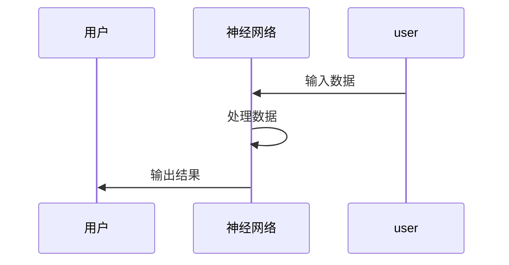

神经网络的基本结构包括输入层、隐藏层和输出层。输入层接收外部数据，隐藏层对数据进行处理和特征提取，输出层产生预测结果。

###### 2.1.2 常见的深度学习架构

**伪代码：**
```
// 卷积神经网络（CNN）的基本结构
class ConvolutionalNeuralNetwork {
    // 卷积层
    Conv2D layer1
    // 池化层
    MaxPooling2D layer2
    // 全连接层
    Dense layer3
    // 激活函数
    Activation layer4
}

// 循环神经网络（RNN）的基本结构
class RecurrentNeuralNetwork {
    // 隐藏状态
    HiddenState hidden
    // 输出
    Output output
    // 循环层
    LSTM layer1
    // 全连接层
    Dense layer2
    // 激活函数
    Activation layer3
}
```

常见的深度学习架构包括卷积神经网络（CNN）和循环神经网络（RNN）。CNN适用于处理图像和视频数据，而RNN适用于处理序列数据，如文本和语音。

###### 2.1.3 深度学习优化算法

**伪代码：**
```
// 随机梯度下降（SGD）的优化过程
function SGD(model, loss_function, learning_rate) {
    // 计算梯度
    gradients = loss_function.compute_gradients(model)
    // 更新模型参数
    model.update_parameters(gradients, learning_rate)
}
```

深度学习优化算法包括随机梯度下降（SGD）、Adam等。这些算法通过迭代优化模型参数，以最小化损失函数。

##### 2.2 自然语言处理技术概览

###### 2.2.1 词嵌入技术

**伪代码：**
```
// Word2Vec的词嵌入过程
function Word2Vec(words, embedding_size) {
    // 初始化词向量
    embeddings = initialize_embeddings(words, embedding_size)
    // 训练词向量
    for (word in words) {
        // 计算当前词的上下文
        context = get_context(word)
        // 计算损失
        loss = compute_loss(embeddings, context)
        // 更新词向量
        update_embeddings(embeddings, loss)
    }
}
```

词嵌入技术将单词转换为向量表示，以便在深度学习模型中进行处理。

###### 2.2.2 序列模型与注意力机制

**伪代码：**
```
// RNN的序列处理过程
class RNN {
    // 隐藏状态
    HiddenState hidden
    // 输出
    Output output
    // 循环层
    LSTM layer
    // 注意力机制
    Attention layer
}

// RNN的处理函数
function RNN(input_sequence) {
    // 初始化隐藏状态
    hidden = initialize_hidden_state()
    // 遍历输入序列
    for (word in input_sequence) {
        // 计算当前词的隐藏状态
        hidden = layer(hidden, word)
        // 应用注意力机制
        attention = attention_layer(hidden)
        // 计算输出
        output = layer(output, attention)
    }
    // 返回最终输出
    return output
}
```

序列模型和注意力机制用于处理序列数据，如文本和语音。

###### 2.2.3 转换器架构详解

**转换器架构的工作原理：**
转换器（Transformer）架构是一种基于自注意力机制的深度学习模型，其核心思想是将输入序列转换为一系列上下文向量，然后通过这些向量进行后续的处理。

**伪代码：**
```
// Transformer模型的基本结构
class Transformer {
    // 输入层
    InputLayer input_layer
    // 自注意力层
    SelfAttention attention_layer
    // 交叉注意力层
    CrossAttention cross_attention_layer
    // 全连接层
    DenseLayer output_layer
}

// Transformer模型的处理过程
function Transformer(input_sequence, target_sequence) {
    // 将输入和目标序列转换为嵌入向量
    input_embeddings = input_layer(input_sequence)
    target_embeddings = input_layer(target_sequence)
    // 应用自注意力机制
    input_attention = attention_layer(input_embeddings)
    // 应用交叉注意力机制
    cross_attention = cross_attention_layer(input_attention, target_embeddings)
    // 通过全连接层得到输出
    output = output_layer(cross_attention)
    // 返回输出
    return output
}
```

转换器架构在自然语言处理任务中表现出色，如机器翻译和文本生成。

##### 2.3 大规模预训练模型原理

###### 2.3.1 预训练的概念与意义

**预训练的概念：**
预训练是指在大规模数据集上预先训练深度学习模型，以便在特定任务中取得更好的性能。预训练模型通常采用无监督或自监督学习的方法，通过学习数据中的潜在结构来提高模型的泛化能力。

**预训练的意义：**
预训练模型相对于微调具有以下几个优势：
1. **减少对大规模标注数据的依赖**：预训练模型可以通过无监督或自监督学习在大规模未标注数据上训练，从而减少对标注数据的依赖。
2. **提高模型的泛化能力**：预训练模型通过在大规模数据集上训练，能够学习到更普遍的语义和语言规律，从而在特定任务中表现出更好的泛化能力。
3. **提高模型性能**：预训练模型通常在特定任务上经过大规模数据训练，因此在微调时能够更好地适应任务需求，从而提高模型性能。

###### 2.3.2 自监督学习方法

**自监督学习方法：**
自监督学习是一种无监督学习方法，它通过利用数据中的内部结构来训练模型。在自监督学习中，模型不需要外部标注，而是通过预测数据中的某些部分来学习。自监督学习方法在预训练中发挥了重要作用，例如，Word2Vec模型通过预测词的上下文来学习词向量。

**伪代码：**
```
// 自监督学习的过程
function SelfSupervisedLearning(data, prediction_size) {
    // 预处理数据
    preprocessed_data = preprocess_data(data)
    // 初始化模型
    model = initialize_model(input_size, prediction_size)
    // 遍历数据
    for (sample in preprocessed_data) {
        // 预测目标
        prediction = model.predict(sample)
        // 计算损失
        loss = compute_loss(prediction, target)
        // 更新模型
        model.update_parameters(loss)
    }
    // 返回训练好的模型
    return model
}
```

自监督学习方法通过利用数据中的内部结构来训练模型，从而提高模型的泛化能力和性能。

###### 2.3.3 迁移学习与微调技术

**迁移学习：**
迁移学习是一种利用已有模型的知识来训练新模型的方法。在迁移学习中，预训练模型已经在大量数据上进行了训练，从而学习到了一些通用的特征表示。在新任务中，我们可以利用这些预训练模型的知识来快速训练新模型，从而提高模型的性能。

**微调：**
微调（Fine-tuning）是指在预训练模型的基础上，针对特定任务进行微小的调整。微调的目的是利用预训练模型的知识，同时适应新任务的需求。

**伪代码：**
```
// 微调的过程
function FineTuning(pretrained_model, task_data, learning_rate) {
    // 加载预训练模型
    model = load_pretrained_model(pretrained_model)
    // 初始化微调参数
    optimizer = initialize_optimizer(learning_rate)
    // 遍历任务数据
    for (sample in task_data) {
        // 训练模型
        loss = model.train(sample)
        // 更新模型参数
        optimizer.update(model.parameters())
    }
    // 返回微调后的模型
    return model
}
```

迁移学习和微调技术使得预训练模型能够快速适应新任务，从而提高模型的性能和效率。

###### 2.3.4 大规模预训练模型的训练策略

**数据预处理：**
在大规模预训练模型的训练过程中，数据预处理是至关重要的一步。数据预处理包括数据清洗、数据增强、数据标准化等操作，以提高模型的训练效果和泛化能力。

**伪代码：**
```
// 数据预处理的过程
function DataPreprocessing(data) {
    // 数据清洗
    clean_data = clean_data(data)
    // 数据增强
    enhanced_data = enhance_data(clean_data)
    // 数据标准化
    normalized_data = normalize_data(enhanced_data)
    // 返回预处理后的数据
    return normalized_data
}
```

**模型结构优化：**
在训练大规模预训练模型时，模型结构的选择和优化也是至关重要的。常见的方法包括调整神经网络层数、调整隐藏层节点数、选择合适的激活函数等。

**伪代码：**
```
// 模型结构优化的过程
function ModelStructureOptimization(model) {
    // 调整神经网络层数
    model.adjust_layers()
    // 调整隐藏层节点数
    model.adjust_hidden_nodes()
    // 选择合适的激活函数
    model.set_activation_function()
    // 返回优化后的模型
    return model
}
```

**训练策略优化：**
在训练大规模预训练模型时，训练策略的选择和优化也是至关重要的。常见的训练策略包括学习率调整、批次大小调整、训练轮数调整等。

**伪代码：**
```
// 训练策略优化的过程
function TrainingStrategyOptimization(optimizer, model) {
    // 调整学习率
    optimizer.adjust_learning_rate()
    // 调整批次大小
    optimizer.adjust_batch_size()
    // 调整训练轮数
    optimizer.adjust_epochs()
    // 返回优化后的训练策略
    return optimizer
}
```

通过数据预处理、模型结构优化和训练策略优化，我们可以提高大规模预训练模型的训练效果和性能。

#### 第3章：企业级AI应用开发准备

##### 3.1 AI在企业中的价值评估

**3.1.1 AI能力评估框架**

为了评估AI在企业中的价值，我们可以使用以下评估框架：

1. **技术能力评估**：评估企业在AI技术方面的成熟度，包括数据预处理、模型训练、模型部署等。
2. **业务能力评估**：评估AI技术如何与企业的业务流程相结合，提升业务效率和效果。
3. **经济效益评估**：评估AI技术为企业带来的经济效益，包括成本节约、收入增长等。

**伪代码：**
```
// AI能力评估的过程
function AIAbilityAssessment(technical_ability, business_ability, economic_ability) {
    // 评估技术能力
    technical_score = evaluate_technical_ability(technical_ability)
    // 评估业务能力
    business_score = evaluate_business_ability(business_ability)
    // 评估经济效益
    economic_score = evaluate_economic_ability(economic_ability)
    // 计算总评分
    total_score = technical_score + business_score + economic_score
    // 返回总评分
    return total_score
}
```

**3.1.2 AI项目ROI分析方法**

为了评估AI项目的投资回报率（ROI），我们可以使用以下分析方法：

1. **成本分析**：分析AI项目在研发、部署、运维等方面的成本。
2. **效益分析**：分析AI项目为企业带来的经济效益，包括成本节约、收入增长等。
3. **风险评估**：评估AI项目可能面临的风险，并制定相应的风险控制措施。

**伪代码：**
```
// AI项目ROI分析的过程
function AIProjectROIAnalysis(costs, benefits, risks) {
    // 计算成本
    total_cost = calculate_costs(costs)
    // 计算效益
    total_benefit = calculate_benefits(benefits)
    // 计算ROI
    roi = (total_benefit - total_cost) / total_cost
    // 返回ROI
    return roi
}
```

**3.1.3 AI对企业业务流程的影响**

AI技术可以对企业的业务流程产生深远的影响，包括：

1. **自动化**：AI技术可以自动化许多重复性高、劳动密集型的任务，提高生产效率和降低成本。
2. **优化**：AI技术可以优化企业的业务流程，提高业务效率和效果。
3. **创新**：AI技术可以激发企业的创新思维，为企业带来新的商业模式和业务机会。

**3.1.4 AI驱动的企业数字化转型**

AI技术可以推动企业的数字化转型，包括：

1. **数据驱动**：通过数据分析和预测，帮助企业做出更明智的决策。
2. **智能化**：通过智能化设备和系统，提高企业的生产效率和服务质量。
3. **数字化**：通过数字化技术，帮助企业实现线上业务和线下业务的深度融合。

**3.2 企业AI战略规划框架**

为了成功实施AI项目，企业需要制定明确的AI战略规划。以下是一个企业AI战略规划的基本框架：

1. **明确AI应用目标**：明确企业希望通过AI技术实现的目标，如提升生产效率、降低成本、提高客户满意度等。
2. **制定AI应用策略**：制定具体的AI应用策略，包括技术选型、数据管理、人才培养等。
3. **确定AI应用优先级**：根据企业的业务需求和资源情况，确定AI应用的优先级，以便更好地分配资源。
4. **制定AI技术应用路线图**：制定详细的AI技术应用路线图，明确各个阶段的目标、任务和时间表。

**伪代码：**
```
// 企业AI战略规划的过程
function AIStrategicPlanning(application_goals, application_strategy, application prioritize, application_route_map) {
    // 确定AI应用目标
    application_goals = define_application_goals()
    // 制定AI应用策略
    application_strategy = define_application_strategy()
    // 确定AI应用优先级
    application_prioritize = define_application_prioritize()
    // 制定AI技术应用路线图
    application_route_map = define_application_route_map()
    // 返回战略规划
    return application_goals, application_strategy, application_prioritize, application_route_map
}
```

**3.3 数据治理与数据管理**

**3.3.1 数据质量管理**

数据质量管理是AI应用成功的关键。以下是一些数据质量管理的最佳实践：

1. **数据清洗**：清洗数据中的错误、缺失和重复值，以提高数据质量。
2. **数据标准化**：统一数据格式和命名规范，以提高数据的一致性和可操作性。
3. **数据验证**：验证数据的准确性和完整性，确保数据符合预期。

**伪代码：**
```
// 数据清洗的过程
function DataCleaning(data) {
    // 删除错误数据
    error_data = remove_error_data(data)
    // 填补缺失数据
    missing_data = fill_missing_data(error_data)
    // 删除重复数据
    duplicate_data = remove_duplicate_data(missing_data)
    // 返回清洗后的数据
    return duplicate_data
}
```

**3.3.2 数据安全与隐私保护**

在AI应用中，数据安全和隐私保护至关重要。以下是一些数据安全与隐私保护的最佳实践：

1. **数据加密**：对敏感数据进行加密，以确保数据在传输和存储过程中的安全性。
2. **访问控制**：设置严格的访问控制策略，确保只有授权人员可以访问数据。
3. **隐私保护**：采用匿名化、去标识化等技术，保护个人隐私。

**3.3.3 数据治理策略**

数据治理策略是确保数据质量和安全的重要手段。以下是一些数据治理策略：

1. **数据质量监控**：建立数据质量监控机制，定期评估数据质量，及时发现和解决问题。
2. **数据安全评估**：定期对数据安全进行评估，确保数据安全措施的有效性。
3. **数据生命周期管理**：制定数据生命周期管理策略，确保数据在整个生命周期中的安全性和合规性。

**3.3.4 数据生命周期管理**

数据生命周期管理是确保数据在合适的时间和地点被使用和管理的重要过程。以下是一些数据生命周期管理的步骤：

1. **数据采集**：采集原始数据，确保数据的准确性和完整性。
2. **数据存储**：将数据存储在合适的存储系统中，确保数据的可访问性和安全性。
3. **数据处理**：对数据进行清洗、转换和整合，以便更好地满足业务需求。
4. **数据利用**：将数据应用于业务决策和智能分析，提高企业的竞争力。
5. **数据销毁**：在数据不再需要时，按照规定的流程进行销毁，以保护隐私和安全。

**3.4 技术选型与工具集成**

**3.4.1 深度学习框架选择**

选择合适的深度学习框架是AI应用开发的关键。以下是一些常见的深度学习框架：

1. **TensorFlow**：由Google开发，具有丰富的功能和生态系统。
2. **PyTorch**：由Facebook开发，具有灵活的动态计算图和简洁的API。
3. **Keras**：是一个高层次的深度学习框架，可以与TensorFlow和Theano兼容。

**伪代码：**
```
// 选择深度学习框架的过程
function SelectDeepLearningFramework() {
    // 判断需求
    if (requirement == "flexibility") {
        framework = "PyTorch"
    } else if (requirement == "functionality") {
        framework = "TensorFlow"
    } else {
        framework = "Keras"
    }
    // 返回选择的框架
    return framework
}
```

**3.4.2 数据库与存储解决方案**

选择合适的数据库和存储解决方案是AI应用成功的关键。以下是一些常见的数据库和存储解决方案：

1. **关系型数据库**：如MySQL、PostgreSQL，适用于结构化数据存储。
2. **非关系型数据库**：如MongoDB、Cassandra，适用于非结构化数据存储。
3. **分布式存储系统**：如HDFS、Ceph，适用于大规模数据存储和计算。

**3.4.3 人工智能平台与工具集成**

为了提高AI应用的开发和部署效率，企业可以采用人工智能平台和工具进行集成。以下是一些常见的人工智能平台和工具：

1. **AI平台**：如Google Cloud AI、AWS AI，提供丰富的AI服务和工具。
2. **数据可视化工具**：如Tableau、PowerBI，用于数据分析和可视化。
3. **机器学习工具**：如scikit-learn、XGBoost，用于数据分析和模型训练。

**3.5 人才培养与团队建设**

**3.5.1 人才需求分析**

为了成功实施AI项目，企业需要分析人才需求，包括数据科学家、机器学习工程师、AI产品经理等。以下是一些人才需求分析的方法：

1. **技能需求分析**：分析AI项目所需的技能，包括深度学习、数据挖掘、自然语言处理等。
2. **人才市场分析**：分析人才市场的供需状况，确定企业所需人才的类型和数量。
3. **企业现状分析**：分析企业现有人才的能力和潜力，确定需要补充的人才类型。

**伪代码：**
```
// 人才需求分析的过程
function TalentRequirementAnalysis(skill_requirement, market_analysis, current_talent) {
    // 分析技能需求
    skill_requirement = analyze_skill_requirement()
    // 分析人才市场
    market_analysis = analyze_market_analysis()
    // 分析企业现状
    current_talent = analyze_current_talent()
    // 计算人才缺口
    talent_deficit = market_analysis - current_talent
    // 返回人才缺口
    return talent_deficit
}
```

**3.5.2 人才培养计划**

为了满足企业的人才需求，企业需要制定人才培养计划。以下是一些人才培养计划的方法：

1. **内部培训**：组织内部培训课程，提高员工的专业技能和知识水平。
2. **外部培训**：与外部培训机构合作，为员工提供专业的培训课程。
3. **项目实践**：通过实际项目锻炼员工的实践能力和解决问题的能力。

**3.5.3 团队建设与激励机制**

为了激发团队的工作热情和创造力，企业需要建立良好的团队建设与激励机制。以下是一些团队建设与激励机制的方法：

1. **团队文化**：建立积极向上的团队文化，增强团队成员之间的信任和协作。
2. **团队协作工具**：采用团队协作工具，提高团队的沟通和协作效率。
3. **激励机制**：设置合理的激励机制，如绩效奖励、晋升机会等，激励团队成员发挥最佳水平。

**3.6 风险管理与合规性要求**

**3.6.1 AI风险识别与评估**

为了确保AI项目的成功实施，企业需要对AI风险进行识别和评估。以下是一些AI风险识别与评估的方法：

1. **风险识别**：通过问卷调查、专家访谈等方法，识别AI项目可能面临的风险。
2. **风险评估**：对识别出的风险进行评估，确定风险的概率和影响程度。
3. **风险应对**：制定相应的风险应对措施，降低风险的影响。

**伪代码：**
```
// AI风险识别与评估的过程
function AI RiskIdentificationAndAssessment(risks) {
    // 识别风险
    identified_risks = identify_risks()
    // 评估风险
    assessed_risks = assess_risks(identified_risks)
    // 制定风险应对措施
    risk.mitigation = define_risk_mitigation(assessed_risks)
    // 返回风险识别与评估结果
    return identified_risks, assessed_risks, risk.mitigation
}
```

**3.6.2 遵守法律法规与伦理道德**

在AI项目实施过程中，企业需要遵守相关法律法规和伦理道德。以下是一些遵守法律法规和伦理道德的方法：

1. **法律法规**：了解并遵守相关法律法规，如数据保护法、隐私法等。
2. **伦理道德**：制定伦理规范，确保AI项目符合伦理道德要求，如公正性、透明度、可解释性等。

**3.6.3 AI应用的安全性和可靠性保障**

为了确保AI应用的安全性和可靠性，企业需要采取一系列措施。以下是一些AI应用的安全性和可靠性保障的方法：

1. **数据安全**：采取数据加密、访问控制等措施，确保数据的安全性和完整性。
2. **模型安全**：对AI模型进行安全测试，识别和修复潜在的安全漏洞。
3. **可靠性保障**：通过测试和验证，确保AI应用的稳定性和可靠性。

**3.7 持续迭代与优化**

**3.7.1 AI应用的监控与反馈**

为了确保AI应用的效果和性能，企业需要对其进行监控和反馈。以下是一些AI应用的监控与反馈的方法：

1. **实时监控**：通过监控系统，实时监控AI应用的运行状态和性能指标。
2. **用户反馈**：收集用户的反馈，了解AI应用的优缺点，为后续优化提供依据。

**3.7.2 AI模型的迭代与优化**

为了提高AI模型的效果和性能，企业需要对其进行迭代和优化。以下是一些AI模型的迭代与优化的方法：

1. **模型调整**：根据监控和反馈结果，调整AI模型的结构和参数。
2. **数据更新**：定期更新训练数据，提高模型的泛化能力。
3. **算法优化**：采用更先进的算法和技术，提高模型的性能和效率。

**3.7.3 用户反馈与改进措施**

为了确保AI应用的满意度，企业需要重视用户反馈，并根据反馈采取改进措施。以下是一些用户反馈与改进措施的方法：

1. **用户调研**：通过问卷调查、用户访谈等方式，了解用户对AI应用的满意度。
2. **改进措施**：根据用户反馈，制定相应的改进措施，如功能优化、界面改进等。
3. **持续迭代**：根据用户反馈和改进措施，持续迭代和优化AI应用。

### 第三部分：软件2.0对云计算架构的影响

#### 第4章：软件2.0对云计算架构的影响

随着软件2.0时代的到来，云计算架构也在不断地演进和变革。软件2.0强调以用户为中心，通过提供个性化、智能化的服务来满足用户需求。这种变化对云计算架构产生了深远的影响，促使云计算从传统的IAAS（基础设施即服务）向更加灵活和高效的SAAS（软件即服务）和PAAS（平台即服务）模式转变。

##### 4.1 云计算架构的演进

云计算架构的演进可以分为三个阶段：

1. **IAAS（基础设施即服务）**：IAAS提供了虚拟化的计算资源，如虚拟机、存储和网络，用户可以根据需求租用这些资源。IAAS的主要优势在于提供了弹性和可伸缩性，用户可以根据需求动态调整资源。

2. **PAAS（平台即服务）**：PAAS不仅提供了IAAS的虚拟化资源，还提供了开发、运行和部署应用程序的平台。用户可以在PAAS平台上开发、测试和部署应用程序，而不需要担心底层基础设施的管理和维护。

3. **SAAS（软件即服务）**：SAAS提供了完整的软件解决方案，用户可以通过互联网访问和使用这些软件。SAAS的主要优势在于降低了企业的IT成本，用户不需要购买和安装软件，只需要按需使用即可。

##### 4.2 软件定义网络与基础设施即代码

软件定义网络（SDN）和基础设施即代码（IaC）是软件2.0时代云计算架构的两个重要概念。

**软件定义网络（SDN）**：SDN将网络控制平面与数据平面分离，通过集中控制的方式来实现网络的自动化和管理。SDN的优势在于提高了网络的灵活性和可编程性，使得网络能够更加灵活地适应业务需求。

**基础设施即代码（IaC）**：IaC将基础设施的管理转化为代码，通过编写脚本或使用配置管理工具来定义和部署基础设施。IaC的优势在于提高了基础设施的自动化和可重复性，减少了人为错误，提高了部署效率。

##### 4.3 微服务架构与容器化

微服务架构和容器化是软件2.0时代云计算架构的两个关键技术。

**微服务架构**：微服务架构将应用程序拆分成多个独立的、可复用的微服务，每个微服务负责完成特定的业务功能。微服务架构的优势在于提高了系统的可伸缩性、可维护性和可测试性。

**容器化**：容器化技术，如Docker，通过将应用程序及其依赖环境封装在一个容器中，实现了应用程序的轻量级、独立和可移植。容器化的优势在于提高了部署效率和运行效率，使得应用程序可以快速部署和扩展。

##### 4.4 服务网格与API管理

服务网格和API管理是软件2.0时代云计算架构的两个重要组成部分。

**服务网格**：服务网格是一种基础设施层服务，用于管理和服务之间的通信。服务网格提供了动态服务发现、负载均衡、断路器等能力，使得微服务架构中的服务能够高效、可靠地交互。

**API管理**：API管理是一种策略性方法，用于定义、发布、监控和保护API。API管理的优势在于提高了API的可访问性、安全性和可扩展性，使得企业可以更好地利用API来提供服务和构建应用程序。

##### 4.5 云原生技术与软件2.0的结合

云原生技术，如Kubernetes、容器编排、无服务器架构等，与软件2.0的结合，进一步推动了云计算架构的变革。

**云原生技术**：云原生技术是一种利用云计算资源、动态管理和自动化的方法来开发和部署应用程序。云原生技术的优势在于提高了应用程序的可伸缩性、可靠性和灵活性。

**软件2.0与云原生技术的结合**：软件2.0与云原生技术的结合，使得企业可以更加灵活地开发和部署应用程序，实现了从传统的单体应用程序向分布式、模块化和动态化的应用程序的转变。

##### 4.6 软件2.0时代下的云计算服务模型

软件2.0时代下的云计算服务模型主要包括以下几种：

**IaaS（基础设施即服务）**：IaaS提供了虚拟化的计算资源，如虚拟机、存储和网络，用户可以根据需求租用这些资源。IaaS的主要优势在于提供了弹性和可伸缩性，用户可以根据需求动态调整资源。

**PaaS（平台即服务）**：PaaS不仅提供了IAAS的虚拟化资源，还提供了开发、运行和部署应用程序的平台。用户可以在PaaS平台上开发、测试和部署应用程序，而不需要担心底层基础设施的管理和维护。

**SaaS（软件即服务）**：SaaS提供了完整的软件解决方案，用户可以通过互联网访问和使用这些软件。SaaS的主要优势在于降低了企业的IT成本，用户不需要购买和安装软件，只需要按需使用即可。

**FaaS（函数即服务）**：FaaS是一种新兴的云计算服务模型，它提供了函数级别的服务。用户只需编写函数，无需关心底层基础设施的管理，FaaS平台会自动部署和运行这些函数。

**无服务器架构**：无服务器架构是一种无需管理服务器即可运行应用程序的方法。用户只需编写代码，无需关心服务器配置和运维，无服务器架构会自动管理服务器资源和运行环境。

#### 4.7 软件2.0下的云计算安全性

软件2.0时代下的云计算安全性面临着新的挑战和机遇。

**安全模型与架构设计**：软件2.0下的云计算安全模型需要考虑端到端的安全性，包括数据安全、网络安全、应用安全等。安全架构设计需要遵循最小权限原则、隔离原则、防御深度原则等。

**数据保护与隐私**：在软件2.0时代，数据是企业的核心资产。如何保护数据的安全和隐私成为了云计算安全的重要议题。企业需要采取数据加密、访问控制、数据备份等措施来保护数据。

**防御DDoS攻击与数据泄露**：软件2.0下的云计算架构更加复杂，容易成为DDoS攻击和数据泄露的目标。企业需要采取防火墙、入侵检测、安全审计等措施来防御攻击和泄露。

**防护策略与应急响应**：企业需要制定完善的防护策略，包括安全策略、监控策略、应急响应策略等。在发生安全事件时，企业需要迅速响应，采取相应的措施来降低损失。

#### 4.8 软件2.0下的云计算资源管理

软件2.0下的云计算资源管理面临着新的挑战和机遇。

**资源调度与负载均衡**：软件2.0时代，应用程序的需求更加复杂，资源调度和负载均衡成为了重要的技术。企业需要采取动态调度、自动扩展等措施来确保资源的合理利用。

**容器编排与编排工具**：容器化技术使得应用程序的部署和运行更加灵活。容器编排工具，如Kubernetes，提供了自动化管理和调度容器的能力，使得资源管理更加高效。

**自动化运维与监控**：自动化运维和监控技术可以帮助企业实现资源的自动化管理、监控和优化。通过自动化运维和监控，企业可以更快地发现和处理问题，提高资源利用效率。

**软件定义存储与数据管理**：软件定义存储技术使得存储资源的管理更加灵活和高效。数据管理方面，企业需要采取数据备份、数据归档、数据迁移等措施来确保数据的安全性和可用性。

**弹性伸缩与资源优化**：软件2.0下的云计算资源管理需要实现弹性伸缩和资源优化。通过自动化伸缩和资源优化，企业可以在保持服务质量的同时，降低成本和提高资源利用率。

#### 第5章：软件2.0下的云计算资源管理

软件2.0时代下的云计算资源管理是一个复杂而关键的任务，它要求企业能够灵活地调整和优化其资源使用，以满足不断变化的应用需求。在这一章中，我们将探讨软件2.0对云计算资源管理的影响，包括资源调度与负载均衡、容器编排与编排工具、自动化运维与监控、软件定义存储与数据管理、以及弹性伸缩与资源优化。

##### 5.1 资源调度与负载均衡

在软件2.0时代，云计算资源管理的一个关键挑战是确保资源的有效分配，以满足应用程序的动态需求。资源调度与负载均衡是实现这一目标的关键技术。

**资源调度**：资源调度是指在云环境中动态分配资源，以便最大化资源利用率和应用程序性能。调度算法需要考虑多种因素，如资源可用性、应用程序优先级、网络延迟等。

**负载均衡**：负载均衡是将网络或应用流量分配到多个服务器上，以避免单点故障和过载。常见的负载均衡算法包括轮询、最小连接数、加权轮询等。

**Mermaid流程图：**
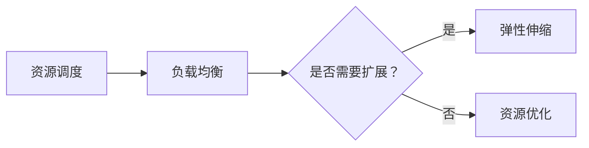

在软件2.0时代，随着AI大模型和大数据处理的普及，资源调度的复杂性大大增加。调度系统需要能够实时监控资源使用情况，并快速响应应用程序的需求变化。

**伪代码：**
```python
def resource_scheduling():
    # 监控资源使用情况
    usage = monitor_resources()
    # 分析应用程序需求
    demand = analyze_applications()
    # 调度资源
    if demand > available_resources():
        # 执行负载均衡
        balance_load()
    else:
        # 调整资源分配
        allocate_resources(usage, demand)

def balance_load():
    # 选择负载均衡算法
    algorithm = select_load_balancing_algorithm()
    # 根据算法分配流量
    distribute_traffic(algorithm)

def allocate_resources(usage, demand):
    # 根据需求调整资源分配
    adjusted_resources = adjust_resources(usage, demand)
    # 部署新资源或释放多余资源
    deploy_resources(adjusted_resources)
```

##### 5.2 容器编排与编排工具

容器化技术，如Docker，已经成为软件2.0时代云计算资源管理的重要工具。容器编排工具，如Kubernetes（K8s），提供了自动化管理和调度容器的功能。

**Kubernetes概述**：Kubernetes是一个开源的容器编排平台，它提供了自动化部署、扩展和管理容器化应用程序的能力。Kubernetes的核心组件包括控制平面（如API服务器、调度器、控制器管理器）和工作节点（如工作容器、Pods、网络组件）。

**Kubernetes工作原理**：
1. **自动化部署**：Kubernetes允许用户通过YAML文件定义应用程序的部署，然后自动部署和管理这些应用程序。
2. **自动扩展**：根据用户定义的资源和需求，Kubernetes可以自动扩展或缩小应用程序的规模。
3. **自动化恢复**：当容器失败或节点故障时，Kubernetes可以自动重启或替换失败的容器，确保应用程序的可靠性。

**Mermaid流程图：**
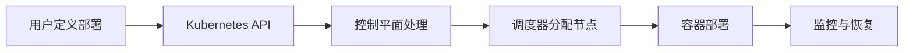

**Kubernetes关键概念**：
- **Pods**：Pod是Kubernetes中的最小部署单元，它包含一个或多个容器。
- **Services**：Service定义了如何访问Pods，它提供了负载均衡和服务发现的功能。
- **Deployments**：Deployment用于管理Pods的创建和更新，确保应用程序的稳定运行。

**伪代码：**
```python
class KubernetesDeployment:
    def __init__(self, config_file):
        self.config = load_config(config_file)
    
    def deploy(self):
        # 部署Pods
        create_pods(self.config.pods)
        # 部署Service
        create_service(self.config.service)
        # 监控并自动恢复
        monitor_and_recover()

def create_pods(pod_configs):
    # 创建Pods
    for pod in pod_configs:
        create_pod(pod)

def create_service(service_config):
    # 创建Service
    create_service_apiserver(service_config)
    create_service_dns(service_config)
```

##### 5.3 自动化运维与监控

自动化运维和监控是软件2.0时代云计算资源管理的重要组成部分。通过自动化，企业可以减少人工干预，提高资源管理的效率和可靠性。

**自动化运维**：自动化运维通过脚本、工具和流程自动化地执行日常运维任务，如配置管理、自动化部署、自动化扩缩容等。

**监控**：监控是确保云计算资源运行正常的重要手段。通过监控工具，企业可以实时跟踪资源使用情况、性能指标和安全事件。

**监控工具**：常见的监控工具包括Prometheus、Grafana、Nagios等。这些工具可以收集、存储和分析监控数据，提供实时仪表板和警报。

**Mermaid流程图：**
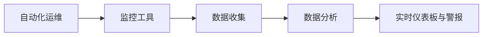

**伪代码：**
```python
class MonitoringSystem:
    def __init__(self, metrics):
        self.metrics = metrics
    
    def collect_metrics(self):
        # 收集监控数据
        collected_data = collect_metrics(self.metrics)
        return collected_data

    def analyze_data(self, data):
        # 分析监控数据
        analysis_results = analyze_data(data)
        return analysis_results

    def generate_dashboard(self, analysis_results):
        # 生成实时仪表板
        dashboard = generate_dashboard(analysis_results)
        return dashboard

def collect_metrics(metrics):
    # 收集监控数据
    data = fetch_metrics_from_sources(metrics)
    return data

def analyze_data(data):
    # 分析监控数据
    results = process_data(data)
    return results

def generate_dashboard(analysis_results):
    # 生成实时仪表板
    dashboard = create_dashboard(analysis_results)
    return dashboard
```

##### 5.4 软件定义存储与数据管理

软件定义存储（Software-defined Storage, SDS）是一种通过软件来管理和控制存储资源的方法，它与传统存储系统相比具有更高的灵活性和可扩展性。

**SDS的优势**：
- **灵活性**：SDS可以灵活地整合不同类型的存储设备，实现存储资源的动态分配和管理。
- **可扩展性**：SDS可以轻松地扩展存储容量和性能，以适应业务增长和需求变化。
- **成本效益**：SDS减少了硬件依赖，降低了存储基础设施的总体拥有成本。

**数据管理**：在软件2.0时代，数据管理变得更加复杂和关键。企业需要采取一系列措施来确保数据的安全、可用性和完整性。

**数据管理策略**：
- **数据备份**：定期备份数据，以防止数据丢失或损坏。
- **数据归档**：将不常访问的数据转移到低成本的存储介质上，以节省存储成本。
- **数据迁移**：随着业务需求的变化，数据可能需要迁移到不同的存储系统或云平台。
- **数据安全性**：通过加密、访问控制和审计来保护数据的安全。

**Mermaid流程图：**
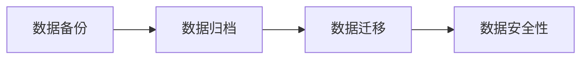

**伪代码：**
```python
class DataManagement:
    def __init__(self, data_source):
        self.data_source = data_source
    
    def backup_data(self):
        # 备份数据
        backup_data(self.data_source)

    def archive_data(self):
        # 归档数据
        archive_data(self.data_source)

    def migrate_data(self):
        # 迁移数据
        migrate_data(self.data_source)

    def ensure_data_security(self):
        # 确保数据安全
        ensure_data_security(self.data_source)

def backup_data(data_source):
    # 备份数据
    backup_location = backup_data_to_location(data_source)
    return backup_location

def archive_data(data_source):
    # 归档数据
    archive_location = archive_data_to_location(data_source)
    return archive_location

def migrate_data(data_source):
    # 迁移数据
    new_location = migrate_data_to_location(data_source)
    return new_location

def ensure_data_security(data_source):
    # 确保数据安全
    apply_encryption(data_source)
    apply_access_control(data_source)
    perform_data_audit(data_source)
```

##### 5.5 弹性伸缩与资源优化

弹性伸缩和资源优化是软件2.0时代云计算资源管理的关键能力。弹性伸缩允许企业根据需求动态调整资源，以最大化资源利用率和业务连续性。资源优化则是通过自动化和优化技术，降低成本和提高性能。

**弹性伸缩**：
- **垂直伸缩**：通过增加或减少单个实例的CPU、内存等资源来调整性能。
- **水平伸缩**：通过增加或减少实例的数量来调整性能。

**资源优化**：
- **自动化扩缩容**：使用自动化工具，如Kubernetes的Horizontal Pod Autoscaler（HPA），根据CPU利用率、内存使用率等指标自动调整Pod数量。
- **资源复用**：通过复用闲置资源，减少不必要的资源浪费。
- **优化资源分配**：通过合理的资源分配策略，确保每个应用程序都能获得足够的资源。

**Mermaid流程图：**
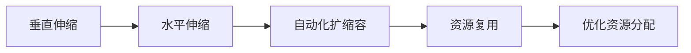

**伪代码：**
```python
class ResourceScalingAndOptimization:
    def __init__(self, resource_policy):
        self.resource_policy = resource_policy
    
    def vertical_scaling(self):
        # 垂直伸缩
        scale垂直资源(self.resource_policy)

    def horizontal_scaling(self):
        # 水平伸缩
        scale水平资源(self.resource_policy)

    def automatic_scaling(self):
        # 自动扩缩容
        adjust资源(self.resource_policy)

    def optimize_resources(self):
        # 优化资源分配
        optimize资源分配(self.resource_policy)

def scale垂直资源(resource_policy):
    # 垂直资源伸缩
    new_resource = adjust垂直资源(resource_policy)
    return new_resource

def scale水平资源(resource_policy):
    # 水平资源伸缩
    new_resource = adjust水平资源(resource_policy)
    return new_resource

def adjust资源(resource_policy):
    # 自动调整资源
    scaled_resources = apply_auto_scaling(resource_policy)
    return scaled_resources

def optimize资源分配(resource_policy):
    # 优化资源分配
    optimized_resources = optimize资源(resource_policy)
    return optimized_resources
```

通过弹性伸缩和资源优化，企业可以实现成本节约、性能提升和业务连续性，从而更好地应对不断变化的市场需求。

#### 第6章：软件2.0下的云计算安全与合规性

随着软件2.0时代的到来，云计算安全与合规性成为企业关注的焦点。在软件2.0时代，云计算架构更加复杂，应用程序和数据的分布更加广泛，因此传统的安全措施和合规性要求需要进行相应的调整。

##### 6.1 云计算安全挑战与对策

**6.1.1 安全模型与架构设计**

在软件2.0时代，云计算安全模型需要更加灵活和全面。以下是一些关键的安全模型和架构设计原则：

1. **零信任架构**：零信任架构假设内部网络不安全，要求所有访问都经过严格的身份验证和授权。这种模型通过最小权限原则和持续验证来提高安全性。

2. **微隔离**：微隔离通过将应用程序和进程隔离在独立的容器或虚拟机中，从而减少攻击面和潜在的威胁传播。

3. **身份与访问管理（IAM）**：IAM确保只有经过授权的用户和系统才能访问资源和数据。IAM策略包括身份验证、授权、访问控制和审计。

**Mermaid流程图：**
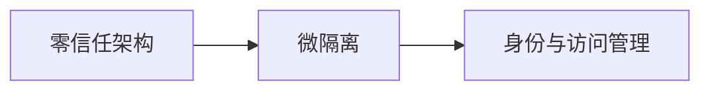

**伪代码：**
```python
class ZeroTrustArchitecture:
    def __init__(self, iam_policy):
        self.iam_policy = iam_policy
    
    def enforce_zero_trust(self):
        # 实施零信任策略
        enforce_auth_and_authorization(self.iam_policy)

class MicroIsolation:
    def __init__(self, isolation_policy):
        self.isolation_policy = isolation_policy
    
    def enforce_micro_isolation(self):
        # 实施微隔离策略
        enforce_process_and_application_isolation(self.isolation_policy)

class IAMManagement:
    def __init__(self, iam_policy):
        self.iam_policy = iam_policy
    
    def manage_access(self):
        # 管理身份与访问
        manage_identities_and_permissions(self.iam_policy)
```

**6.1.2 数据保护与隐私**

在软件2.0时代，数据保护与隐私变得尤为重要。以下是一些关键措施：

1. **数据加密**：对敏感数据进行加密，确保数据在传输和存储过程中不被未授权访问。

2. **数据脱敏**：对敏感数据进行脱敏处理，以保护个人隐私和防止数据泄露。

3. **访问控制**：通过严格的访问控制策略，确保只有授权用户可以访问敏感数据。

4. **数据备份与恢复**：定期备份数据，并确保备份数据的安全性和可恢复性。

**Mermaid流程图：**
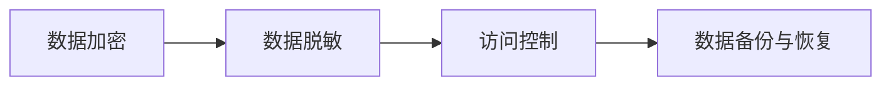

**伪代码：**
```python
class DataProtection:
    def __init__(self, encryption_policy, anonymization_policy, access_control_policy, backup_policy):
        self.encryption_policy = encryption_policy
        self.anonymization_policy = anonymization_policy
        self.access_control_policy = access_control_policy
        self.backup_policy = backup_policy
    
    def encrypt_data(self, data):
        # 加密数据
        encrypted_data = apply_encryption(self.encryption_policy, data)
        return encrypted_data

    def anonymize_data(self, data):
        # 脱敏数据
        anonymized_data = apply_anonymization(self.anonymization_policy, data)
        return anonymized_data

    def manage_access(self, user, data):
        # 管理访问
        allow_access = check_access_permission(self.access_control_policy, user, data)
        return allow_access

    def backup_data(self, data):
        # 备份数据
        backup_location = create_backup(self.backup_policy, data)
        return backup_location
```

**6.1.3 防护策略与应急响应**

在软件2.0时代，企业需要建立全面的防护策略和应急响应计划，以应对潜在的安全威胁和事件。

1. **防护策略**：包括入侵检测、恶意软件防护、网络防火墙等，以防止外部攻击和数据泄露。

2. **应急响应**：包括事件检测、响应和恢复，确保在发生安全事件时能够迅速响应并恢复系统。

**Mermaid流程图：**
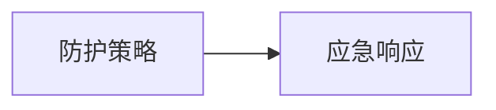

**伪代码：**
```python
class SecurityPolicyAndResponse:
    def __init__(self, detection_policy, response_policy):
        self.detection_policy = detection_policy
        self.response_policy = response_policy
    
    def detect_intrusions(self):
        # 检测入侵
        intrusion_detected = check_intrusions(self.detection_policy)
        return intrusion_detected

    def respond_to_intrusions(self, intrusion_detected):
        # 应对入侵
        if intrusion_detected:
            execute_response_actions(self.response_policy)
```

**6.2 合规性与法律法规**

在软件2.0时代，云计算合规性是企业面临的重要挑战。以下是一些关键合规性和法律法规要求：

1. **数据保护法规**：如欧洲的通用数据保护条例（GDPR）和加州消费者隐私法案（CCPA），规定了数据收集、存储和处理的合规要求。

2. **行业合规性**：如金融行业的支付卡行业数据安全标准（PCI DSS）和医疗行业的健康保险可携性和责任法案（HIPAA）。

3. **监管要求**：如美国证券交易委员会（SEC）和金融行业监管机构的规定，要求企业确保数据的透明性和合规性。

**合规性评估**：
- **内部审计**：企业需要定期进行内部审计，确保所有操作符合合规性要求。
- **第三方认证**：企业可以通过第三方认证机构，如国际认证组织（ISO），获得合规性认证。

**Mermaid流程图：**
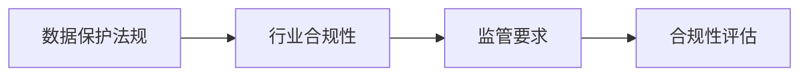

**伪代码：**
```python
class ComplianceAssessment:
    def __init__(self, data_protection_legislation, industry_compliance, regulatory_requirements):
        self.data_protection_legislation = data_protection_legislation
        self.industry_compliance = industry_compliance
        self.regulatory_requirements = regulatory_requirements
    
    def perform_audit(self):
        # 进行内部审计
        audit_results = internal_audit(self.data_protection_legislation, self.industry_compliance, self.regulatory_requirements)
        return audit_results

    def obtain_certificate(self):
        # 获得合规性证书
        certificate = obtain_compliance_certificate(self.data_protection_legislation, self.industry_compliance, self.regulatory_requirements)
        return certificate
```

**6.3 云原生安全架构**

云原生安全架构是针对云原生环境（如容器、微服务、Kubernetes等）的安全设计和实践。以下是一些关键组件和安全措施：

1. **容器安全**：确保容器镜像的安全，包括镜像扫描、漏洞修复和签名验证。

2. **网络安全**：保护容器和微服务之间的通信，包括网络隔离、加密和访问控制。

3. **应用安全**：确保应用程序的安全，包括代码审计、漏洞扫描和安全配置。

4. **自动化安全**：通过自动化工具和流程，实现安全措施的全生命周期管理。

**Mermaid流程图：**
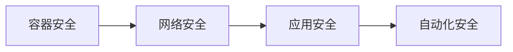

**伪代码：**
```python
class CloudNativeSecurity:
    def __init__(self, container_security, network_security, application_security, automation_security):
        self.container_security = container_security
        self.network_security = network_security
        self.application_security = application_security
        self.automation_security = automation_security
    
    def secure_containers(self):
        # 保护容器
        secure_container_images(self.container_security)

    def secure_networks(self):
        # 保护网络
        secure_network_communication(self.network_security)

    def secure_applications(self):
        # 保护应用程序
        secure_application_code(self.application_security)

    def enable_automation_security(self):
        # 实施自动化安全
        automate_security_processes(self.automation_security)
```

通过建立全面的云计算安全与合规性架构，企业可以确保在软件2.0时代下，云计算环境的安全和合规性得到有效保障。

#### 第7章：软件2.0下的云计算运维实践

在软件2.0时代，云计算运维实践变得更加复杂和关键。这一章将深入探讨云计算运维流程与最佳实践、云原生应用部署与管理、持续集成与持续部署（CI/CD）、日志分析与监控、故障恢复与容错机制，以及云服务供应商选择与评估。

##### 7.1 运维流程与最佳实践

云计算运维流程涉及到从部署到监控的各个阶段。以下是一些关键的运维流程和最佳实践：

**1. 部署流程**：
- **自动化部署**：使用自动化工具（如Ansible、Terraform）进行部署，减少手动操作，提高部署效率。
- **容器化部署**：使用容器化技术（如Docker、Kubernetes）进行部署，确保应用程序的轻量级和可移植性。

**2. 监控流程**：
- **实时监控**：使用监控工具（如Prometheus、Grafana）进行实时监控，及时发现问题并采取措施。
- **日志监控**：收集和分析日志，以识别潜在问题和性能瓶颈。

**3. 运维最佳实践**：
- **文档化**：保持详细的文档，包括部署步骤、配置文件和操作指南，以便于维护和问题排查。
- **备份和恢复**：定期备份数据和配置，确保在故障发生时能够迅速恢复。

**Mermaid流程图：**
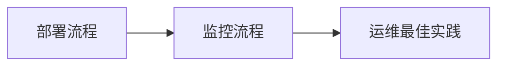

**伪代码：**
```python
class DeploymentProcess:
    def deploy_app(self):
        # 自动化部署应用程序
        execute_automation_tools()

class MonitoringProcess:
    def monitor_system(self):
        # 实时监控系统
        execute_real_time_monitoring()

class OperationsBestPractices:
    def document_process(self):
        # 文档化流程
        create_documentation()

    def backup_and_restore(self):
        # 备份和恢复
        execute_backup_and_restore()
```

##### 7.2 云原生应用部署与管理

云原生应用部署与管理涉及到容器编排、服务发现和负载均衡等方面。以下是一些关键技术和最佳实践：

**1. 容器编排**：
- **Kubernetes**：使用Kubernetes进行容器编排，实现自动化部署、扩展和管理。
- **Helm**：使用Helm进行Kubernetes应用程序的打包和部署。

**2. 服务发现**：
- **Kubernetes Service**：使用Kubernetes Service实现服务发现和负载均衡。
- **Consul**：使用Consul进行服务发现和动态配置管理。

**3. 负载均衡**：
- **NGINX**：使用NGINX进行负载均衡，提高应用程序的可用性和性能。
- **HAProxy**：使用HAProxy进行高可用负载均衡。

**Mermaid流程图：**
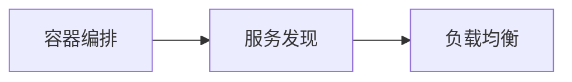

**伪代码：**
```python
class ContainerOrchestration:
    def deploy_container(self):
        # 部署容器
        deploy_kubernetes_container()

class ServiceDiscovery:
    def discover_service(self):
        # 发现服务
        discover_kubernetes_service()

class LoadBalancing:
    def balance_load(self):
        # 负载均衡
        execute_nginx_load_balancing()
```

##### 7.3 持续集成与持续部署（CI/CD）

持续集成与持续部署（CI/CD）是软件2.0时代提高软件开发和部署效率的关键实践。以下是一些CI/CD工具和最佳实践：

**1. 持续集成（CI）**：
- **Jenkins**：使用Jenkins进行自动化构建和测试，确保代码质量和稳定性。
- **GitLab CI/CD**：使用GitLab CI/CD进行自动化构建、测试和部署。

**2. 持续部署（CD）**：
- **Kubernetes**：使用Kubernetes进行自动化部署，确保应用程序的高可用性和弹性。
- **Argo CD**：使用Argo CD进行Kubernetes应用程序的自动化部署和管理。

**3. 最佳实践**：
- **自动化测试**：进行自动化测试，确保每次提交的代码都经过全面测试。
- **蓝绿部署**：实施蓝绿部署策略，减少部署过程中的风险。

**Mermaid流程图：**
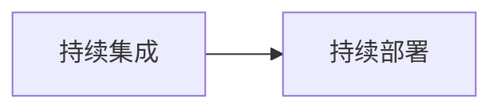

**伪代码：**
```python
class ContinuousIntegration:
    def execute_build(self):
        # 执行构建
        execute_jenkins_build()

class ContinuousDeployment:
    def deploy_app(self):
        # 部署应用程序
        deploy_kubernetes_app()

def execute_automation_tests():
    # 执行自动化测试
    run_test_suite()

def execute_blue_green_deployment():
    # 实施蓝绿部署
    deploy_blue_and_green_environments()
```

##### 7.4 日志分析与监控

日志分析与监控是确保云计算系统稳定运行的关键环节。以下是一些日志分析与监控工具和最佳实践：

**1. 日志收集**：
- **Fluentd**：使用Fluentd进行日志收集和转发。
- **Logstash**：使用Logstash进行日志处理和过滤。

**2. 日志分析**：
- **Kibana**：使用Kibana进行日志分析和可视化。
- **Grafana**：使用Grafana进行日志监控和报警。

**3. 最佳实践**：
- **集中式日志管理**：使用集中式日志管理平台，如ELK堆栈（Elasticsearch、Logstash、Kibana），实现日志的统一收集和分析。
- **日志报警**：设置日志报警规则，及时发现异常并采取措施。

**Mermaid流程图：**
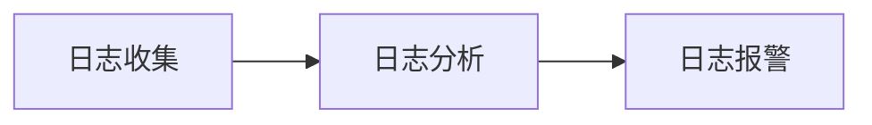

**伪代码：**
```python
class LogCollection:
    def collect_logs(self):
        # 收集日志
        collect_logs_with_fluentd()

class LogAnalysis:
    def analyze_logs(self):
        # 分析日志
        analyze_logs_with_logstash()

class LogAlerting:
    def set_alerts(self):
        # 设置日志报警
        set_log_alerts_with_kibana()
```

##### 7.5 故障恢复与容错机制

故障恢复与容错机制是确保云计算系统高可用性的关键。以下是一些故障恢复和容错技术：

**1. 故障检测**：
- **健康检查**：定期进行健康检查，检测系统组件的状态。
- **故障检测工具**：使用故障检测工具（如Prometheus）进行实时监控。

**2. 故障恢复**：
- **自动重启**：在检测到故障时，自动重启失败的组件或服务。
- **故障转移**：在主节点故障时，自动将负载转移到备用节点。

**3. 容错机制**：
- **数据冗余**：使用数据冗余技术，确保数据的可靠性和完整性。
- **分布式架构**：使用分布式架构，确保系统的高可用性和容错性。

**Mermaid流程图：**
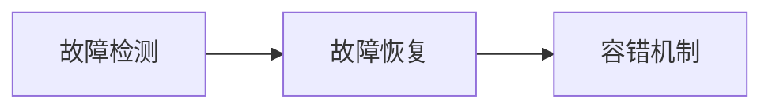

**伪代码：**
```python
class FaultDetection:
    def detect_fault(self):
        # 检测故障
        detect_health_issues()

class FaultRecovery:
    def recover_fault(self):
        # 恢复故障
        restart_failed_components()

class FaultTolerance:
    def ensure_fault_tolerance(self):
        # 确保容错性
        implement_data_redundancy()
```

##### 7.6 云服务供应商选择与评估

选择合适的云服务供应商是确保云计算系统成功的关键。以下是一些选择云服务供应商的考虑因素和评估方法：

**1. 服务可靠性**：评估云服务供应商的故障率和恢复速度，选择可靠性高的供应商。

**2. 安全性**：评估云服务供应商的安全措施和合规性，确保数据的安全和隐私。

**3. 成本效益**：评估云服务供应商的定价模型和成本结构，选择性价比高的供应商。

**4. 扩展能力**：评估云服务供应商的扩展能力和弹性，确保能够满足业务增长的需求。

**5. 技术支持**：评估云服务供应商的技术支持和响应速度，确保在遇到问题时能够得到及时的帮助。

**评估方法**：
- **成本效益分析**：比较不同云服务供应商的定价模型和成本结构。
- **性能测试**：进行性能测试，评估供应商的服务质量和性能指标。
- **用户反馈**：收集用户反馈，了解供应商的服务质量和用户体验。

**Mermaid流程图：**
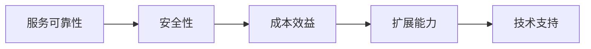

**伪代码：**
```python
class CloudServiceProviderAssessment:
    def evaluate_reliability(self, reliability_metrics):
        # 评估服务可靠性
        reliability_score = calculate_reliability_score(reliability_metrics)
        return reliability_score

    def evaluate_security(self, security_metrics):
        # 评估安全性
        security_score = calculate_security_score(security_metrics)
        return security_score

    def evaluate_cost_effectiveness(self, cost_metrics):
        # 评估成本效益
        cost_score = calculate_cost_score(cost_metrics)
        return cost_score

    def evaluate_scalability(self, scalability_metrics):
        # 评估扩展能力
        scalability_score = calculate_scalability_score(scalability_metrics)
        return scalability_score

    def evaluate_support(self, support_metrics):
        # 评估技术支持
        support_score = calculate_support_score(support_metrics)
        return support_score

def calculate_reliability_score(reliability_metrics):
    # 计算可靠性分数
    reliability_score = sum(reliability_metrics.values())
    return reliability_score

def calculate_security_score(security_metrics):
    # 计算安全分数
    security_score = sum(security_metrics.values())
    return security_score

def calculate_cost_score(cost_metrics):
    # 计算成本分数
    cost_score = sum(cost_metrics.values())
    return cost_score

def calculate_scalability_score(scalability_metrics):
    # 计算扩展能力分数
    scalability_score = sum(scalability_metrics.values())
    return scalability_score

def calculate_support_score(support_metrics):
    # 计算技术支持分数
    support_score = sum(support_metrics.values())
    return support_score
```

通过综合考虑以上因素和评估方法，企业可以选出最合适的云服务供应商，从而确保云计算系统的成功实施和运营。

### 第四部分：软件2.0下的云计算应用案例

#### 第8章：企业云计算架构设计与实施

在软件2.0时代，企业云计算架构的设计与实施变得更加复杂和关键。在这一章中，我们将通过具体案例来探讨企业云计算架构的设计原则、实施步骤以及注意事项。

##### 8.1 企业云计算需求分析

企业云计算需求分析是云计算架构设计与实施的第一步。以下是一些关键需求分析步骤：

**1. 业务需求分析**：了解企业的业务目标和需求，确定云计算如何支持这些目标。

**2. 技术需求分析**：分析企业的技术需求，包括计算、存储、网络等方面的需求。

**3. 安全需求分析**：评估企业的安全需求，确保云计算环境符合企业的安全要求。

**4. 成本效益分析**：分析云计算的成本效益，确保云计算方案的经济可行性。

**Mermaid流程图：**
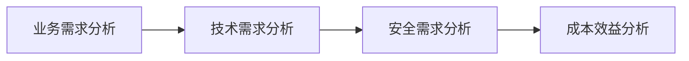

**伪代码：**
```python
class BusinessRequirementsAnalysis:
    def analyze_business_requirements(self):
        # 分析业务需求
        business_requirements = gather_business_information()

class TechnicalRequirementsAnalysis:
    def analyze_technical_requirements(self):
        # 分析技术需求
        technical_requirements = gather_technical_information()

class SecurityRequirementsAnalysis:
    def analyze_security_requirements(self):
        # 分析安全需求
        security_requirements = gather_security_information()

class CostBenefitAnalysis:
    def analyze_cost_benefit(self):
        # 分析成本效益
        cost_benefit = calculate_cost_benefit()
```

##### 8.2 云计算架构设计原则

云计算架构设计需要遵循一系列原则，以确保系统的稳定性、可靠性和可扩展性。以下是一些关键设计原则：

**1. 分层架构**：采用分层架构，将系统分为基础设施层、平台层和应用层，以便于管理和维护。

**2. 可扩展性**：设计可扩展的架构，以便在需求增长时能够灵活扩展资源。

**3. 弹性伸缩**：实现弹性伸缩，确保系统能够根据负载自动调整资源。

**4. 安全性**：确保云计算环境符合企业的安全要求，包括数据加密、访问控制和安全审计。

**5. 高可用性**：设计高可用性架构，确保系统在故障发生时能够快速恢复。

**6. 灵活性**：设计灵活的架构，以便能够快速适应业务需求的变化。

**Mermaid流程图：**
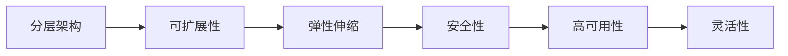

**伪代码：**
```python
class CloudArchitectureDesign:
    def design_architecture(self):
        # 设计云计算架构
        architecture = design_layered_architecture()
        return architecture

    def ensure伸缩性(self):
        # 确保可扩展性
        ensure Scalability(architecture)

    def ensure_elasticity(self):
        # 确保弹性伸缩
        ensure Elasticity(architecture)

    def ensure_safety(self):
        # 确保安全性
        ensure Safety(architecture)

    def ensure_high_availability(self):
        # 确保高可用性
        ensure HighAvailability(architecture)

    def ensure_flexibility(self):
        # 确保灵活性
        ensure Flexibility(architecture)
```

##### 8.3 实施步骤与注意事项

云计算架构的实施是一个复杂的过程，需要遵循一系列步骤和注意事项。以下是一些关键实施步骤和注意事项：

**1. 设计文档**：在实施之前，编写详细的设计文档，包括架构设计、配置文件和操作指南。

**2. 环境准备**：准备实施环境，包括物理服务器、虚拟机、网络设备等。

**3. 资源分配**：根据设计文档，分配计算、存储和网络资源。

**4. 部署应用程序**：使用自动化工具（如Ansible、Terraform）部署应用程序和基础设施。

**5. 测试和验证**：对部署的应用程序和系统进行测试和验证，确保其正常运行。

**6. 持续监控和维护**：实施持续监控和维护策略，确保系统的稳定运行。

**注意事项**：

- **备份和恢复**：定期备份数据和配置，确保在故障发生时能够迅速恢复。
- **安全性**：确保实施安全措施，包括数据加密、访问控制和安全审计。
- **性能优化**：在实施过程中，对系统进行性能优化，确保其能够满足业务需求。
- **文档化**：保持详细的文档，包括部署步骤、配置文件和操作指南，以便于维护和问题排查。

**Mermaid流程图：**
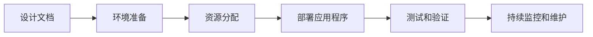

**伪代码：**
```python
class CloudImplementation:
    def prepare_environment(self):
        # 准备实施环境
        prepare_environment()

    def allocate_resources(self):
        # 分配资源
        allocate_resources()

    def deploy_applications(self):
        # 部署应用程序
        deploy_applications()

    def test_and_validate(self):
        # 测试和验证
        test_and_validate()

    def monitor_and_maintain(self):
        # 持续监控和维护
        monitor_and_maintain()
```

##### 8.4 成功案例分享

在本节中，我们将分享一些成功的企业云计算架构设计与实施案例，以展示云计算在实际应用中的效果和优势。

**案例1：某电商平台的云计算架构**

某电商平台在软件2.0时代采用了云计算架构，实现了业务的快速扩展和高效运营。以下是其关键架构设计：

- **分层架构**：采用分层架构，包括基础设施层、平台层和应用层。
- **弹性伸缩**：通过Kubernetes实现弹性伸缩，根据流量动态调整资源。
- **安全措施**：采用数据加密、访问控制和安全审计等措施，确保数据安全和隐私。
- **自动化运维**：使用自动化工具（如Ansible、Terraform）进行自动化部署和运维。

**案例2：某金融机构的云计算架构**

某金融机构采用了云计算架构，实现了业务的数字化转型和效率提升。以下是其关键架构设计：

- **微服务架构**：采用微服务架构，将业务系统拆分为多个独立的微服务。
- **容器化技术**：使用Docker进行容器化，提高部署和运行效率。
- **持续集成与持续部署（CI/CD）**：采用Jenkins进行自动化构建和部署，确保代码质量和稳定性。
- **安全措施**：采用防火墙、入侵检测和加密技术，确保数据安全和合规性。

通过这些案例，我们可以看到云计算在软件2.0时代为企业带来了显著的效益，包括成本节约、效率提升和业务创新。同时，云计算架构的设计与实施需要充分考虑企业的业务需求和技术特点，以确保其成功应用。

#### 第9章：云计算下的AI应用实践

在软件2.0时代，云计算与AI的结合为企业和开发者提供了强大的工具和平台，以实现智能化的业务流程和创新的解决方案。在这一章中，我们将探讨云计算在AI应用实践中的结合方式，包括AI模型训练与推理的云计算解决方案、AI应用的云计算架构设计，并通过成功案例分享，展示云计算与AI结合的实际效果和优势。

##### 9.1 AI与云计算的结合

AI与云计算的结合主要体现在以下几个方面：

**1. 资源弹性**：云计算提供弹性的计算和存储资源，可以根据AI模型的训练和推理需求动态调整资源，确保高效运行。

**2. 数据管理**：云计算平台提供高效的数据存储和管理服务，如大数据存储和实时数据处理，为AI模型提供丰富的数据支持。

**3. 自动化与优化**：云计算平台提供自动化工具和优化策略，如容器编排、自动化扩缩容等，提高AI应用的部署和运行效率。

**4. 安全性与合规性**：云计算平台提供安全性和合规性服务，如数据加密、访问控制和安全审计，确保AI应用的安全和合规运行。

**Mermaid流程图：**
```mermaid
flowchart LR
    A[资源弹性] --> B[数据管理]
    B --> C[自动化与优化]
    C --> D[安全性与合规性]
```

**伪代码：**
```python
class CloudIntegrationWithAI:
    def elastic_resources(self):
        # 资源弹性
        allocate_resources_弹性()

    def data_management(self):
        # 数据管理
        manage_data()

    def automation_and_optimization(self):
        # 自动化与优化
        automate_processes()

    def security_and_compliance(self):
        # 安全性与合规性
        ensure_security_and_compliance()
```

##### 9.2 AI模型训练与推理的云计算解决方案

在云计算环境中，AI模型的训练与推理是一个高度资源密集型的过程。以下是一些云计算解决方案的关键步骤和工具：

**1. 模型训练**：
- **分布式训练**：利用云计算的分布式计算能力，将模型训练任务分布在多个节点上，提高训练速度。
- **高性能计算**：使用GPU加速训练过程，提高计算性能。
- **数据存储与传输**：使用大数据存储和高速网络传输，确保数据的高效访问和处理。

**2. 模型推理**：
- **在线推理**：在云端提供在线推理服务，实时处理用户请求。
- **批量推理**：处理大量数据的同时保持高效性和可扩展性。
- **模型优化**：使用模型压缩和量化技术，提高推理效率和降低成本。

**Mermaid流程图：**
```mermaid
flowchart LR
    A[分布式训练] --> B[高性能计算]
    B --> C[数据存储与传输]
    C --> D[在线推理]
    D --> E[批量推理]
    E --> F[模型优化]
```

**伪代码：**
```python
class ModelTrainingAndInference:
    def distributed_training(self):
        # 分布式训练
        train_model_distributedly()

    def high_performance_computing(self):
        # 高性能计算
        accelerate_training_with_gpu()

    def data_storage_and_transmission(self):
        # 数据存储与传输
        manage_large_data_storage()

    def online_inference(self):
        # 在线推理
        provide_real_time_inference()

    def batch_inference(self):
        # 批量推理
        process_large_data_batches()

    def model_optimization(self):
        # 模型优化
        optimize_model_for_inference()
```

##### 9.3 AI应用的云计算架构设计

云计算架构设计对于AI应用的性能、可扩展性和可靠性至关重要。以下是一些关键设计原则和架构组件：

**1. 分层架构**：
- **基础设施层**：提供计算、存储和网络资源，支持AI应用的运行。
- **平台层**：提供AI开发、训练和推理工具，如深度学习框架、模型训练和推理服务。
- **应用层**：提供业务逻辑和用户接口，实现AI应用的功能。

**2. 分布式架构**：
- **容器化**：使用容器化技术（如Docker）确保应用程序的轻量级和可移植性。
- **微服务架构**：将应用程序拆分为多个独立的微服务，提高系统的可维护性和可扩展性。

**3. 自动化与监控**：
- **自动化部署**：使用CI/CD工具（如Jenkins、Kubernetes）实现自动化部署和管理。
- **监控与告警**：使用监控工具（如Prometheus、Grafana）实时监控AI应用的性能和健康状况。

**Mermaid流程图：**
```mermaid
flowchart LR
    A[基础设施层] --> B[平台层]
    B --> C[应用层]
    C --> D[容器化]
    D --> E[微服务架构]
    E --> F[自动化与监控]
```

**伪代码：**
```python
class CloudArchitectureForAI:
    def design_infrastructure_layer(self):
        # 设计基础设施层
        design_infrastructure_layer()

    def design_platform_layer(self):
        # 设计平台层
        design_platform_layer()

    def design_application_layer(self):
        # 设计应用层
        design_application_layer()

    def containerize_applications(self):
        # 容器化应用程序
        containerize_applications()

    def adopt_microservices_architecture(self):
        # 采用微服务架构
        adopt_microservices_architecture()

    def enable_automation_and_monitoring(self):
        # 实现自动化与监控
        enable_automation_and_monitoring()
```

##### 9.4 成功案例分享

在本节中，我们将分享一些成功的企业AI应用实践案例，以展示云计算与AI结合的实际效果和优势。

**案例1：智能客服系统**

某大型电商平台采用了基于云计算的智能客服系统，通过自然语言处理和机器学习技术，实现了高效、智能的客服服务。以下是其关键设计：

- **分布式训练**：使用云计算平台的分布式训练功能，加速模型训练过程。
- **高性能推理**：使用云端GPU资源，提高模型推理速度和性能。
- **自动化部署**：使用Kubernetes实现自动化部署和管理，确保系统的稳定运行。
- **监控与告警**：使用Prometheus和Grafana实时监控系统性能，及时发现和处理问题。

**案例2：智能推荐系统**

某电商公司采用了基于云计算的智能推荐系统，通过深度学习和协同过滤技术，为用户推荐个性化的商品。以下是其关键设计：

- **大数据处理**：使用云计算平台的大数据处理能力，处理海量用户数据和商品数据。
- **模型优化**：使用模型压缩和量化技术，提高模型推理效率和降低成本。
- **微服务架构**：将推荐系统拆分为多个微服务，提高系统的可维护性和可扩展性。
- **自动化部署**：使用Jenkins实现自动化部署，确保系统的高效运行。

通过这些案例，我们可以看到云计算与AI结合在智能客服系统和智能推荐系统中的应用效果。云计算平台提供了强大的计算、存储和管理能力，使得AI模型能够高效地训练和推理，同时提供了自动化部署和监控工具，确保系统的稳定性和可靠性。

#### 第10章：云计算在数字化转型中的应用

在软件2.0时代，云计算已经成为推动企业数字化转型的重要力量。云计算不仅提供了灵活、可扩展的计算资源，还通过数据分析和智能算法，帮助企业实现业务的智能化和数字化转型。以下将探讨云计算在数字化转型中的关键作用、成功案例以及未来发展趋势。

##### 10.1 数字化转型的挑战与机遇

数字化转型是企业面临的一项重要战略任务，它旨在利用数字技术提升企业的效率、创造新的商业模式，并增强企业的竞争力。在数字化转型过程中，企业面临以下挑战和机遇：

**挑战**：
- **技术复杂性**：数字化转型涉及多种新兴技术，如大数据、云计算、人工智能等，技术复杂度高。
- **数据管理**：企业需要处理大量结构化和非结构化数据，数据质量和数据管理成为挑战。
- **组织变革**：数字化转型要求企业进行组织结构调整，培养新的技能和人才，这需要时间。
- **成本控制**：数字化转型可能涉及大量投资，企业需要平衡短期和长期成本。

**机遇**：
- **业务创新**：数字化转型为企业提供了创新的商业模式和业务机会，如在线服务、智能产品等。
- **效率提升**：通过数字化技术，企业可以自动化业务流程，提高运营效率。
- **客户体验**：数字化技术可以提供个性化的客户体验，提高客户满意度和忠诚度。
- **数据驱动的决策**：企业可以利用数据分析技术，从海量数据中提取有价值的信息，指导决策。

**Mermaid流程图：**
```mermaid
flowchart LR
    A[挑战] --> B{技术复杂性}
    B --> C{数据管理}
    B --> D{组织变革}
    B --> E{成本控制}
    A --> F{机遇}
    F --> G{业务创新}
    F --> H{效率提升}
    F --> I{客户体验}
    F --> J{数据驱动的决策}
```

**伪代码：**
```python
class DigitalTransformationChallenges:
    def identify_challenges(self):
        # 识别挑战
        challenges = ["技术复杂性", "数据管理", "组织变革", "成本控制"]

class DigitalTransformationOpportunities:
    def identify_opportunities(self):
        # 识别机遇
        opportunities = ["业务创新", "效率提升", "客户体验", "数据驱动的决策"]
```

##### 10.2 云计算在数字化转型中的作用

云计算在数字化转型中发挥着关键作用，它通过提供弹性、可扩展的计算资源、高效的数据处理能力和丰富的服务生态，为企业数字化转型提供了坚实的基础。

**1. 弹性计算资源**：云计算平台可以根据企业的需求动态调整计算资源，确保业务在高峰时期能够获得足够的计算能力，同时在低峰时期减少资源浪费。

**2. 数据处理能力**：云计算平台提供强大的数据处理能力，包括大数据处理、实时数据处理和分析，帮助企业从海量数据中提取有价值的信息。

**3. 服务生态**：云计算平台提供了丰富的服务和工具，如AI服务、数据分析工具、开发平台等，帮助企业快速构建和部署数字化应用。

**4. 云原生技术**：云原生技术，如容器化、微服务架构、服务网格等，使企业能够更加灵活、高效地开发和部署应用程序。

**Mermaid流程图：**
```mermaid
flowchart LR
    A[弹性计算资源] --> B[数据处理能力]
    B --> C[服务生态]
    B --> D[云原生技术]
```

**伪代码：**
```python
class CloudComputingRoleInDigitalTransformation:
    def provide_elastic_resources(self):
        # 提供弹性计算资源
        allocate_resources_弹性()

    def provide_data_processing(self):
        # 提供数据处理能力
        process_large_data()

    def provide_service_ecosystem(self):
        # 提供服务生态
        access_cloud_services()

    def enable_native_cloud_technologies(self):
        # 启用云原生技术
        adopt_cloud_native_technologies()
```

##### 10.3 数字化转型的案例分析

在本节中，我们将通过一些成功的企业数字化转型案例，展示云计算在数字化转型中的应用效果和优势。

**案例1：制造业的智能工厂**

某制造企业通过云计算和物联网技术，实现了智能工厂的转型。以下是其关键设计：

- **设备监控与数据采集**：使用物联网设备和传感器实时采集设备运行数据，上传至云端。
- **数据分析与预测维护**：使用云计算平台进行数据分析，预测设备故障，实现预测性维护。
- **智能调度与优化**：使用人工智能算法优化生产计划，提高生产效率。

**案例2：金融行业的数字银行**

某金融企业通过云计算和人工智能技术，实现了数字银行的转型。以下是其关键设计：

- **在线客服系统**：使用自然语言处理和机器学习技术，提供智能客服服务，提高客户满意度。
- **风险管理与合规性**：使用大数据分析和人工智能技术，实时监控交易风险，确保合规性。
- **个性化推荐**：使用协同过滤和深度学习技术，为用户推荐个性化的金融产品和服务。

**案例3：零售业的智能供应链**

某零售企业通过云计算和物联网技术，实现了智能供应链的转型。以下是其关键设计：

- **智能仓储与配送**：使用物联网设备和人工智能技术，实现智能仓储和配送，提高物流效率。
- **需求预测与库存管理**：使用大数据分析和人工智能技术，预测市场需求，优化库存管理。
- **供应链协同**：使用云计算平台实现供应链协同，提高供应链透明度和协同效率。

通过这些案例，我们可以看到云计算在数字化转型中的应用效果，包括提高效率、降低成本、增强客户体验和业务创新。云计算为企业提供了灵活、高效的计算资源和技术支持，帮助企业实现数字化转型的目标。

##### 10.4 未来发展趋势与展望

随着软件2.0时代的到来，云计算在数字化转型中的应用将继续发展，以下是未来的一些发展趋势和展望：

**1. 云原生技术的普及**：云原生技术，如容器化、微服务架构、服务网格等，将更加普及，帮助企业实现更加灵活、高效的应用开发和部署。

**2. AI与云计算的深度融合**：人工智能与云计算的深度融合将带来更多的创新应用，如智能运维、智能决策支持、自动化客户服务等。

**3. 跨云和多云策略**：企业将采用跨云和多云策略，以实现资源优化和业务连续性，降低对单一云服务提供商的依赖。

**4. 安全性与合规性**：随着数字化转型的发展，安全性和合规性将变得更加重要，企业将加大对安全性和合规性的投资。

**5. 新兴技术的应用**：新兴技术，如边缘计算、区块链、5G等，将逐渐融入云计算，推动数字化转型向更深层次发展。

**Mermaid流程图：**
```mermaid
flowchart LR
    A[云原生技术普及] --> B[AI与云计算深度融合]
    B --> C[跨云和多云策略]
    C --> D[安全性与合规性]
    C --> E[新兴技术的应用]
```

**伪代码：**
```python
class FutureTrendsInCloudComputing:
    def adopt_native_cloud_technologies(self):
        # 采用云原生技术
        adopt_cloud_native_technologies()

    def integrate_AI_with_cloud(self):
        # AI与云计算深度融合
        integrate_AI_and_cloud()

    def implement_cross_cloud_strategies(self):
        # 实施跨云和多云策略
        implement_cross_cloud_strategies()

    def enhance_security_and_compliance(self):
        # 加强安全性与合规性
        enhance_security_and_compliance()

    def apply_emerging_technologies(self):
        # 应用新兴技术
        apply_emerging_technologies()
```

通过不断的技术创新和应用实践，云计算将继续在数字化转型中发挥重要作用，为企业创造更大的价值和机会。

### 附录

#### 附录A：云计算与软件2.0相关工具与资源

云计算与软件2.0的结合为开发者和企业提供了丰富的工具和资源，以下是一些主流的深度学习框架、云计算服务提供商资源、开源云原生项目以及云计算安全与合规性资源。

##### A.1 主流深度学习框架

**TensorFlow**：由Google开发的开源深度学习框架，支持多种编程语言和硬件平台，适用于广泛的深度学习任务。

**PyTorch**：由Facebook开发的开源深度学习框架，以其动态计算图和简洁的API而受到开发者喜爱。

**Keras**：是一个高层次的深度学习框架，可以与TensorFlow和Theano兼容，适用于快速原型开发和实验。

**MXNet**：由Apache Software Foundation开发的开源深度学习框架，支持多种编程语言，具有高效的推理性能。

**Caffe**：由Berkeley Vision and Learning Center开发的开源深度学习框架，适用于图像分类和识别任务。

**Theano**：由蒙特利尔大学开发的开源深度学习框架，具有静态计算图和高效的数值运算性能。

##### A.2 云计算服务提供商资源

**Amazon Web Services (AWS)**：全球领先的云计算服务提供商，提供广泛的云计算服务，包括计算、存储、数据库、人工智能等。

**Microsoft Azure**：微软的云计算平台，提供丰富的云计算服务，支持多种操作系统、编程语言和开发工具。

**Google Cloud Platform (GCP)**：谷歌的云计算平台，提供高性能计算、大数据处理、人工智能等服务。

**Alibaba Cloud**：阿里巴巴集团的云计算平台，提供全面的云计算服务，包括计算、存储、网络、人工智能等。

**IBM Cloud**：IBM的云计算平台，提供混合云解决方案、人工智能服务和企业级云服务。

##### A.3 开源云原生项目

**Kubernetes**：开源的容器编排平台，用于自动化部署、扩展和管理容器化应用程序。

**Prometheus**：开源的监控报警工具，用于收集、存储和分析监控数据。

**Grafana**：开源的数据可视化和监控工具，提供丰富的图表和仪表板。

**OpenFaaS**：开源的无服务器函数平台，支持在容器中运行函数，实现快速部署和扩展。

**Docker**：开源的容器化技术，用于打包、交付和运行应用程序。

**Istio**：开源的服务网格项目，用于管理服务之间的通信和安全。

##### A.4 云计算安全与合规性资源

**OWASP Cloud Security Project**：开放式Web应用安全项目（OWASP）的云计算安全项目，提供云计算安全最佳实践和工具。

**The Cloud Security Alliance (CSA)**：云计算安全联盟，提供云计算安全标准和最佳实践。

**ISO/IEC 27017**：国际标准化组织的云计算信息安全管理体系标准。

**NIST Cloud Computing Security Guide**：美国国家标准与技术研究院的云计算安全指南。

**GDPR**：欧洲的通用数据保护条例，规定了数据收集、存储和处理的合规要求。

##### A.5 云计算与AI应用案例库

**Cloud AI Case Studies**：云服务和人工智能案例研究，提供云计算与AI结合的实际应用案例。

**AWS AI Case Studies**：AWS的AI应用案例，展示如何在AWS平台上实现人工智能解决方案。

**Azure AI Case Studies**：Azure的AI应用案例，展示如何在Azure平台上实现人工智能解决方案。

**Google Cloud AI Case Studies**：Google Cloud的AI应用案例，展示如何在Google Cloud平台上实现人工智能解决方案。

**Alibaba Cloud AI Case Studies**：阿里云的AI应用案例，展示如何在阿里云平台上实现人工智能解决方案。

这些工具和资源为开发者和企业提供了丰富的选择，助力云计算与软件2.0的融合，推动数字化转型和智能升级。

### 作者信息

**作者：AI天才研究院/AI Genius Institute & 禅与计算机程序设计艺术 /Zen And The Art of Computer Programming**

