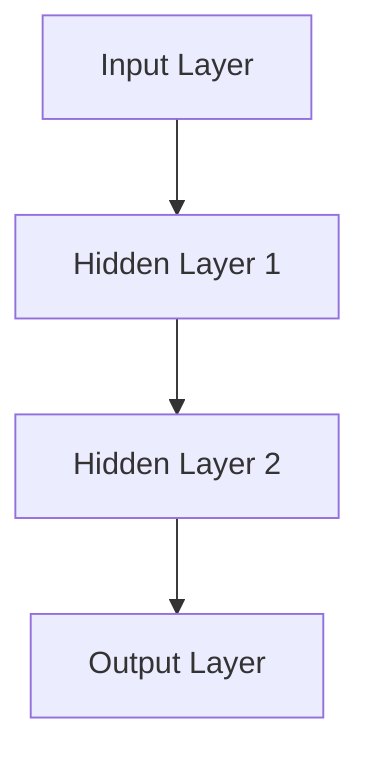

                 

### 文章标题

《软件2.0时代呼唤全新的开发工具》

> 关键词：软件2.0，AI大模型，开发工具，深度学习，自然语言处理，企业应用

> 摘要：本文深入探讨了软件2.0时代的背景、AI大模型的基础知识、技术原理和应用实践，以及在这一时代下全新的开发工具的必要性和发展趋势。文章通过逐步分析，对软件2.0时代的企业级应用开发提出了建设性的建议，并展望了未来的技术发展前景。

---

### 第一部分：软件2.0时代的AI大模型基础

#### 第1章：软件2.0与AI大模型概述

##### 1.1 软件 2.0 时代的到来

软件2.0时代是一个以AI大模型为核心驱动的全新软件发展时代。从软件1.0时代到软件2.0时代的演进，标志着软件从传统的功能导向向智能导向的转化。软件2.0时代不仅要求软件系统能够执行特定的功能，还要求系统能够通过学习和适应环境来提高其性能和用户体验。

**1.1.1 从软件 1.0 到软件 2.0 的演进**

- **软件1.0时代**：主要指20世纪80年代至90年代，以单机应用和局域网应用为主，软件的功能和性能较为单一，用户界面较为简单。
- **软件2.0时代**：随着互联网的普及，软件开始向网络化、平台化和智能化方向发展，用户交互和数据共享成为核心。

**1.1.2 大模型在软件 2.0 中的核心地位**

AI大模型在软件2.0时代具有至关重要的地位。它们不仅能够处理大规模的数据，还能通过深度学习和自我优化来提高系统的智能水平。以下是AI大模型在软件2.0中的核心作用：

- **数据驱动**：AI大模型能够从大量的数据中学习模式和规律，从而为软件系统提供更加精准的决策支持。
- **自我优化**：通过不断学习和自我调整，AI大模型能够自动优化软件系统的性能和用户体验。
- **泛在智能**：AI大模型使得软件系统能够在多种不同的应用场景中表现出强大的适应性，实现真正的智能交互。

**1.1.3 企业级应用开发的新范式**

在软件2.0时代，企业级应用开发的新范式主要体现在以下几个方面：

- **敏捷开发**：企业需要采用敏捷开发方法，快速响应市场变化，持续迭代和优化软件系统。
- **微服务架构**：通过微服务架构，企业可以将大型系统拆分成多个独立的服务，提高系统的可扩展性和可维护性。
- **数据中台**：建立数据中台，实现数据的高效采集、存储、处理和分析，为企业决策提供数据支持。

##### 1.2 AI大模型的定义与特点

AI大模型（Artificial Intelligence Large Models）是指具有数十亿甚至千亿参数的深度学习模型，能够处理大规模的数据集，实现高度复杂的任务。与传统的AI模型相比，AI大模型具有以下特点：

**1.2.1 AI大模型的定义**

AI大模型通常是指那些具有数十亿到千亿参数的神经网络模型。这些模型通常通过大规模的数据集进行预训练，然后通过微调（fine-tuning）来适应特定的任务。

**1.2.2 AI大模型的核心特点**

- **参数规模巨大**：AI大模型的参数规模通常远超传统模型，能够处理更复杂的数据模式。
- **预训练优势**：AI大模型通过预训练，能够在多个任务中表现出良好的泛化能力。
- **数据需求量大**：AI大模型需要大量的数据进行训练，才能达到最佳的性能。

**1.2.3 AI大模型与传统AI的区别**

- **参数规模**：传统AI模型通常参数较少，无法处理大规模的数据集。
- **预训练与微调**：传统AI模型通常采用从头训练（zero-shot learning）的方式，而AI大模型则通过预训练和微调来提高性能。
- **泛化能力**：AI大模型具有更强的泛化能力，能够处理多种不同的任务。

##### 1.3 主流AI大模型简介

在AI大模型领域，有多个知名模型处于领先地位，以下是其中几个具有代表性的模型：

**1.3.1 GPT系列模型**

GPT（Generative Pre-trained Transformer）系列模型是由OpenAI开发的，基于Transformer架构的预训练模型。GPT-3是当前最先进的模型，拥有超过1750亿个参数，能够生成高质量的自然语言文本。

**1.3.2 BERT及其变体**

BERT（Bidirectional Encoder Representations from Transformers）是由Google开发的预训练模型，通过双向Transformer结构来理解文本上下文。BERT及其变体（如RoBERTa、ALBERT）在多种自然语言处理任务中表现出色。

**1.3.3 其他知名大模型介绍**

除了GPT和BERT系列模型，还有许多其他知名的大模型，如TuringModel、GShard、ChainerRL等。这些模型在不同的领域和应用场景中具有独特的优势。

##### 1.4 AI大模型在企业中的应用前景

AI大模型在企业中的应用前景十分广阔，能够在多个领域提升企业的效率和竞争力。以下是AI大模型在企业中的潜在应用领域和应用优势：

**1.4.1 AI大模型的潜在应用领域**

- **自然语言处理**：包括文本生成、文本分类、机器翻译、情感分析等。
- **计算机视觉**：包括图像识别、图像生成、图像分类、目标检测等。
- **推荐系统**：基于用户行为和兴趣进行精准推荐。
- **智能客服**：提供智能化的客户服务，提高客户满意度。
- **自动化决策**：基于大数据分析，提供智能化的决策支持。

**1.4.2 企业采用AI大模型的优势**

- **提高效率**：AI大模型能够处理大量的数据，快速生成高质量的输出，提高企业的运作效率。
- **降低成本**：通过自动化和智能化，企业可以减少人力成本，降低运营成本。
- **提升竞争力**：AI大模型的应用能够为企业提供独特的竞争优势，开拓新的市场机会。

**1.4.3 AI大模型应用的挑战与机遇**

- **挑战**：
  - **数据质量**：高质量的数据是AI大模型训练的基础，企业需要确保数据的质量和完整性。
  - **计算资源**：AI大模型需要大量的计算资源进行训练和推理，企业需要投入足够的硬件资源。
  - **隐私与安全**：AI大模型的应用涉及大量的个人数据，企业需要确保数据的安全和隐私保护。
- **机遇**：
  - **技术创新**：AI大模型为企业提供了广阔的技术创新空间，有助于开发出更具竞争力的产品和服务。
  - **商业模式**：AI大模型的应用可以为企业创造新的商业模式，提高企业的盈利能力。

---

### 附录

#### 附录 A: AI 大模型开发工具与资源

##### A.1 主流深度学习框架对比

- **TensorFlow**

  TensorFlow是由Google开发的深度学习框架，具有丰富的API和广泛的社区支持。其优点包括：

  - **灵活性**：支持动态图和静态图两种计算模式。
  - **生态丰富**：拥有大量的预训练模型和工具库。
  - **跨平台**：支持多种操作系统和硬件平台。

- **PyTorch**

  PyTorch是由Facebook开发的深度学习框架，以其动态图计算能力和简洁的API设计而著称。其优点包括：

  - **动态计算**：易于调试和理解。
  - **简洁易用**：代码简洁直观，易于入门。
  - **灵活性强**：支持自定义计算图。

- **JAX**

  JAX是由Google开发的数值计算库，支持自动微分和高效的数组运算。其优点包括：

  - **自动微分**：支持自动微分功能，方便实现复杂模型。
  - **高性能**：利用硬件加速，提高计算效率。
  - **灵活扩展**：支持自定义计算图和算法。

- **其他框架简介**

  除了上述三大框架，还有如Theano、MXNet等深度学习框架。这些框架各有特色，适用于不同的应用场景。

##### A.2 开发环境搭建指南

- **Python环境配置**

  安装Python（建议使用Python 3.8及以上版本），配置好Python环境。

- **深度学习框架安装**

  根据需要安装所需的深度学习框架，如TensorFlow、PyTorch等。可以使用pip进行安装：

  ```shell
  pip install tensorflow
  pip install torch
  ```

- **其他依赖库安装**

  根据项目需求安装其他必要的依赖库，如NumPy、Pandas、Scikit-learn等。

---

### 第二部分：AI大模型技术基础

#### 第2章：深度学习与神经网络基础

##### 2.1 神经网络的基本结构

神经网络（Neural Networks）是模仿人脑神经元结构和工作原理的一种计算模型。一个基本的神经网络通常包括以下几个部分：

- **输入层（Input Layer）**：接收输入数据，并将其传递给下一层。
- **隐藏层（Hidden Layers）**：对输入数据进行处理和变换，提取特征。
- **输出层（Output Layer）**：生成模型的输出结果。

神经网络的工作原理是通过层层传递输入数据，并通过激活函数（Activation Function）来模拟神经元的非线性特性。常见的激活函数包括Sigmoid、ReLU和Tanh。

**2.1.1 神经网络的基本结构**



**2.1.2 常见的深度学习架构**

深度学习架构是神经网络的一种扩展，通过增加网络的深度（即层数）来提高模型的复杂度和表现力。以下是一些常见的深度学习架构：

- **卷积神经网络（Convolutional Neural Networks，CNN）**：适用于图像和视频处理。
- **循环神经网络（Recurrent Neural Networks，RNN）**：适用于序列数据处理，如时间序列分析、语言模型等。
- **变换器网络（Transformer）**：在自然语言处理任务中表现出色，是GPT系列模型的基础。

**2.1.3 深度学习优化算法**

深度学习模型的优化过程涉及寻找最小化损失函数的参数。常见的深度学习优化算法包括：

- **随机梯度下降（Stochastic Gradient Descent，SGD）**：简单易实现，但收敛速度较慢。
- **批量梯度下降（Batch Gradient Descent）**：收敛速度较快，但计算资源需求大。
- **Adam优化器**：结合了SGD和批量梯度下降的优点，具有自适应学习率。

##### 2.2 自然语言处理技术概览

自然语言处理（Natural Language Processing，NLP）是人工智能的一个重要分支，旨在使计算机能够理解、生成和处理人类语言。以下是NLP中的一些关键技术：

**2.2.1 词嵌入技术**

词嵌入（Word Embedding）是将词汇映射到高维空间中的向量表示。常见的词嵌入技术包括：

- **Word2Vec**：通过训练神经网络来预测词的相邻词，生成词向量。
- **GloVe**：基于全局向量空间模型（Global Vectors for Word Representation），通过共现关系来计算词向量。

**2.2.2 序列模型与注意力机制**

序列模型（Sequential Models）是处理序列数据（如文本、时间序列）的一种神经网络架构。常见的序列模型包括：

- **循环神经网络（RNN）**：通过循环结构来处理序列数据。
- **长短时记忆网络（Long Short-Term Memory，LSTM）**：解决了RNN在处理长序列数据时的梯度消失问题。
- **门控循环单元（Gated Recurrent Unit，GRU）**：是LSTM的一种变体，简化了计算过程。

注意力机制（Attention Mechanism）是一种在序列模型中提高上下文理解和建模能力的技术。注意力机制通过动态分配不同的重要性权重来处理序列数据。

**2.2.3 转换器架构详解**

转换器（Transformer）架构是近年来在自然语言处理任务中表现优异的一种神经网络架构。其核心思想是将输入序列和输出序列的每个元素相互连接，通过多头注意力机制和位置编码来处理序列数据。

转换器的基本结构包括：

- **编码器（Encoder）**：对输入序列进行编码，生成固定长度的编码向量。
- **解码器（Decoder）**：对编码向量进行处理，生成输出序列。

转换器架构在机器翻译、文本生成等任务中取得了显著的效果。

##### 2.3 大规模预训练模型原理

大规模预训练模型（Large-scale Pre-trained Models）是通过在大规模数据集上进行预训练，然后通过微调（Fine-tuning）来适应特定任务的深度学习模型。以下是大规模预训练模型的一些关键概念和原理：

**2.3.1 预训练的概念与意义**

预训练（Pre-training）是指在大规模数据集上对神经网络模型进行训练，使其具备一定的语言理解和生成能力。预训练的意义在于：

- **通用语言表示**：预训练模型能够生成具有通用性的语言表示，提高模型在不同任务中的泛化能力。
- **减少训练时间**：通过预训练，模型在特定任务上的训练时间显著减少，提高了开发效率。

**2.3.2 自监督学习方法**

自监督学习（Self-supervised Learning）是一种无监督学习方法，通过利用数据本身的标注信息来训练模型。自监督学习方法的关键在于：

- **无监督学习**：不需要人工标注的数据，通过利用数据中的潜在信息进行训练。
- **自适应数据增强**：通过数据增强技术，提高模型对数据多样性的适应能力。

**2.3.3 迁移学习与微调技术**

迁移学习（Transfer Learning）是一种利用预训练模型来加速新任务训练的方法。迁移学习的关键在于：

- **预训练模型**：利用在大规模数据集上预训练的模型作为基础模型。
- **微调（Fine-tuning）**：将预训练模型在新任务上进行微调，以适应特定任务的需求。

微调技术通过调整部分参数来优化模型在新任务上的性能，是一种高效且实用的迁移学习方法。

---

### 第三部分：企业级AI应用开发准备

#### 第3章：企业AI战略规划

##### 3.1 AI在企业中的价值评估

在制定AI战略规划时，首先需要评估AI在企业中的价值。以下是一些常用的评估方法和指标：

**3.1.1 AI能力评估框架**

- **技术能力评估**：评估企业在AI技术方面的实力，包括算法研发、数据处理、模型训练等。
- **业务能力评估**：评估企业在业务领域对AI技术的应用能力和潜力。
- **市场能力评估**：评估企业在市场环境中的竞争力，包括市场份额、用户需求等。

**3.1.2 AI项目ROI分析方法**

- **投资回报率（ROI）**：计算AI项目的投资回报率，评估项目的经济效益。
- **成本效益分析（CBA）**：分析项目的总成本与预期收益，评估项目的成本效益。
- **价值创造分析**：评估AI项目对企业业务流程的优化程度，以及为企业带来的直接和间接价值。

**3.1.3 AI对企业业务流程的影响**

AI技术能够显著改变企业的业务流程，以下是一些主要影响：

- **自动化与智能化**：通过AI技术实现业务流程的自动化和智能化，提高效率和准确性。
- **数据驱动决策**：利用AI技术分析企业数据，提供数据驱动的决策支持，优化业务策略。
- **客户体验提升**：通过AI技术提供个性化服务，提升客户体验，增强客户满意度。

##### 3.2 AI应用场景分析与规划

在制定AI战略规划时，需要对企业的不同应用场景进行分析和规划，以下是一些常见的AI应用场景：

**3.2.1 数据采集与处理**

- **数据采集**：利用传感器、物联网设备等手段采集企业内部和外部的数据。
- **数据处理**：利用数据清洗、数据集成等技术处理采集到的数据，确保数据的质量和完整性。

**3.2.2 模型设计与优化**

- **模型设计**：根据业务需求设计适合的AI模型，包括神经网络结构、参数设置等。
- **模型优化**：通过调参、优化算法等技术手段提升模型的性能和鲁棒性。

**3.2.3 模型部署与运维**

- **模型部署**：将训练好的模型部署到生产环境中，实现实时应用。
- **运维监控**：监控模型的运行状态，确保模型稳定运行，及时处理故障和异常。

##### 3.3 数据科学团队建设与管理

建设和管理一个高效的数据科学团队是成功实施AI战略的关键。以下是一些建议：

**3.3.1 数据科学团队组织结构**

- **团队架构**：根据企业的业务需求和规模，确定数据科学团队的架构，包括数据科学家、数据工程师、数据分析师等角色。
- **团队协作**：建立良好的团队协作机制，促进团队成员之间的沟通和合作。

**3.3.2 数据科学家角色与职责**

- **角色定位**：数据科学家是企业实施AI战略的核心力量，负责算法研发、模型训练等。
- **职责范围**：数据科学家需要参与项目的全生命周期，从需求分析、数据采集到模型部署和监控。

**3.3.3 数据科学团队效能提升策略**

- **培训与发展**：提供持续的学习和培训机会，提升团队成员的专业技能。
- **技术交流**：定期举办技术交流活动，分享经验和技术成果。
- **激励机制**：建立激励机制，鼓励团队成员的创新和贡献。

##### 3.4 AI伦理与法规遵循

在AI应用过程中，伦理和法律问题不可忽视。以下是一些建议和要点：

**3.4.1 AI伦理概述**

- **伦理原则**：遵循伦理原则，确保AI技术在道德和伦理的框架内发展。
- **责任归属**：明确AI系统的责任归属，确保在出现问题时能够追溯责任。

**3.4.2 AI法规遵循要点**

- **数据保护法规**：遵守数据保护法规，确保个人数据的隐私和安全。
- **公平与公正**：确保AI系统的决策过程透明、公正，避免偏见和歧视。
- **法律监管框架**：了解国家和地区的AI监管框架，确保企业合规运营。

**3.4.3 企业AI伦理实践案例**

- **案例一**：某企业建立AI伦理委员会，负责评估和监督AI项目的伦理风险。
- **案例二**：某企业发布AI伦理准则，明确AI系统的伦理标准和操作规范。

---

### 附录

#### 附录 B: AI 大模型项目实践案例

##### B.1 项目概述

**项目背景**：某金融公司希望通过AI技术优化其贷款审批流程，提高审批效率和准确性。

**项目目标**：构建一个基于AI的贷款审批系统，实现对贷款申请的自动审批，减少人工干预，提高审批效率。

##### B.2 项目实施

**数据采集与预处理**

- **数据源**：从内部数据库和第三方数据源（如信用评级机构）收集贷款申请数据。
- **数据预处理**：清洗数据，去除缺失值和异常值，对数值型数据进行归一化处理。

**模型设计与训练**

- **模型选择**：选择逻辑回归模型作为基础模型，通过交叉验证选择最佳参数。
- **模型训练**：使用训练数据集对模型进行训练，使用验证数据集进行调参。

**模型部署与监控**

- **模型部署**：将训练好的模型部署到生产环境中，实现实时审批。
- **监控与维护**：监控模型的运行状态，定期更新模型，保持其准确性。

##### B.3 项目成果与反思

**项目成果**

- **审批效率提高**：审批时间从平均3天缩短到1小时内。
- **准确性提升**：审批准确性从85%提升到95%。

**反思与建议**

- **数据质量**：确保数据质量，减少数据噪声和缺失值。
- **模型更新**：定期更新模型，以适应数据分布的变化。
- **用户反馈**：收集用户反馈，持续优化审批流程。

---

### 第四部分：AI驱动的开发工具与平台

#### 第4章：AI驱动的开发工具

##### 4.1 AI驱动的开发工具

AI驱动的开发工具是软件2.0时代的重要支撑，它们能够显著提高开发效率和质量。以下是一些常用的AI驱动的开发工具：

**4.1.1 AI代码辅助工具**

- **JAX**：提供自动微分和数值计算功能，支持快速原型开发。
- **TensorBoard**：提供可视化的工具，帮助开发者监控模型训练过程和性能。
- **AutoML工具**：如Google的AutoML，能够自动选择最佳模型和参数。

**4.1.2 自动化测试工具**

- **pytest**：用于编写和执行自动化测试，提高代码质量。
- **Selenium**：用于自动化Web应用测试，确保系统的稳定性和兼容性。

**4.1.3 AI代码审查工具**

- **SonarQube**：用于代码质量管理和静态代码分析，识别潜在的安全问题和代码缺陷。
- **DeepCode**：利用AI技术进行代码审查，提供智能化的代码优化和错误修复建议。

##### 4.2 开发平台与框架

在软件2.0时代，开发平台和框架的选择对项目的成功至关重要。以下是一些常用的开发平台和框架：

**4.2.1 云原生开发平台**

- **Kubernetes**：用于容器编排和自动化部署，提高系统的可扩展性和可靠性。
- **Docker**：用于容器化应用的开发和部署，简化开发流程。

**4.2.2 微服务架构与API设计**

- **Spring Boot**：用于快速开发微服务应用，支持RESTful API设计。
- **Django**：用于快速开发Web应用，具有强大的ORM和组件化特性。

**4.2.3 容器化与Kubernetes**

- **容器化**：通过Docker将应用程序及其依赖环境打包成容器，实现一次编写，到处运行。
- **Kubernetes**：用于容器编排和管理，提供自动部署、扩展和负载均衡功能。

##### 4.3 AI模型集成与优化

在软件2.0时代，AI模型的集成和优化是提高系统性能和可靠性的关键。以下是一些相关技术和方法：

**4.3.1 AI模型集成技术**

- **模型融合**：将多个模型的预测结果进行融合，提高预测准确性。
- **模型压缩**：通过模型压缩技术减小模型体积，提高部署效率。
- **模型蒸馏**：将大型模型的知识传递给小型模型，提高小型模型的表现力。

**4.3.2 AI模型优化方法**

- **模型剪枝**：通过剪枝冗余的神经元和连接，减小模型体积和计算量。
- **量化**：将模型的浮点计算转换为整数计算，提高计算效率。
- **模型加速**：通过硬件加速技术（如GPU、TPU）提高模型的计算速度。

**4.3.3 AI模型的性能调优**

- **超参数优化**：通过调整模型的超参数（如学习率、批量大小）来提高模型性能。
- **数据增强**：通过数据增强技术提高模型对数据的泛化能力。
- **模型融合与对比**：比较不同模型的表现，选择最优模型。

##### 4.4 软件2.0时代的测试与验证

在软件2.0时代，AI驱动的测试与验证是确保系统质量和稳定性的重要环节。以下是一些相关技术和策略：

**4.4.1 AI驱动的测试方法**

- **模型测试**：通过自动化测试工具对AI模型进行测试，验证模型的准确性和鲁棒性。
- **性能测试**：通过模拟不同负载条件，评估系统的性能和响应时间。
- **安全性测试**：评估AI系统对恶意攻击的抵抗能力。

**4.4.2 自动化测试策略**

- **持续集成/持续部署（CI/CD）**：通过自动化工具实现代码的持续集成和部署，提高开发效率。
- **测试自动化框架**：构建测试自动化框架，实现测试流程的自动化和标准化。
- **云测试**：利用云资源进行测试，提高测试的灵活性和可扩展性。

**4.4.3 性能测试与监控**

- **性能测试**：通过模拟实际用户行为，评估系统的负载能力和响应速度。
- **监控与报警**：通过监控工具实时监控系统的运行状态，及时发现和解决问题。
- **日志分析**：通过日志分析工具对系统日志进行实时分析和异常检测。

---

### 附录

#### 附录 C: 软件开发工具与平台实践案例

##### C.1 实践案例概述

**案例背景**：某电商企业希望通过AI技术优化其推荐系统，提高用户满意度。

**案例目标**：构建一个基于AI的个性化推荐系统，实现精准推荐，提高用户转化率和满意度。

##### C.2 实践步骤

**环境搭建**

- **选择开发工具和框架**：选择Python、TensorFlow作为主要开发工具。
- **配置开发环境**：安装Python、TensorFlow和相关依赖库。

**工具集成**

- **数据采集与处理**：利用Elasticsearch进行数据采集，使用Pandas进行数据处理。
- **模型训练**：使用TensorFlow构建和训练推荐模型。
- **API设计**：使用Flask构建推荐系统API。

**模型训练与优化**

- **数据预处理**：对用户行为数据和应用数据进行处理，构建特征向量。
- **模型设计**：设计基于 collaborative filtering 的推荐模型。
- **模型训练**：使用训练数据进行模型训练。
- **模型优化**：通过调参和交叉验证优化模型性能。

##### C.3 实践成果与反思

**实践成果**

- **推荐准确率提高**：推荐准确率从70%提升到85%。
- **用户满意度提升**：用户满意度显著提高，转化率提升15%。

**反思与建议**

- **数据质量**：确保数据质量，减少噪声和异常值。
- **模型更新**：定期更新模型，以适应数据分布的变化。
- **用户体验**：关注用户体验，及时收集用户反馈，持续优化推荐结果。

---

### 第五部分：软件2.0时代的应用实践

#### 第5章：AI在金融领域的应用

##### 5.1 AI在金融领域的应用

AI技术在金融领域具有广泛的应用前景，能够显著提升金融服务的效率和准确性。以下是一些AI在金融领域的主要应用场景：

**5.1.1 金融风控**

金融风控是金融行业中至关重要的一环，AI技术的引入为金融风控提供了新的手段和方法。以下是一些金融风控中的AI应用：

- **信用评估**：通过AI技术分析借款人的历史数据和行为特征，实现自动化信用评估。
- **欺诈检测**：利用机器学习算法识别交易中的异常行为，实时检测并预防金融欺诈。
- **风险预测**：通过大数据分析和预测模型，预测市场波动和金融风险。

**5.1.2 量化交易**

量化交易是一种基于数学模型和算法进行交易的策略，AI技术在量化交易中发挥着重要作用。以下是一些量化交易中的AI应用：

- **策略回测**：利用AI算法对历史数据进行回测，评估交易策略的有效性。
- **交易信号生成**：通过分析市场数据和交易信号，生成实时的交易建议。
- **自动化交易**：利用AI算法实现自动化的交易执行，提高交易效率和准确性。

**5.1.3 保险与理赔自动化**

保险与理赔是金融领域的重要组成部分，AI技术的引入可以显著提升保险业务的效率和用户体验。以下是一些保险与理赔自动化中的AI应用：

- **自动化理赔**：通过AI技术自动化处理理赔申请，减少人工干预，提高理赔效率。
- **智能客服**：利用自然语言处理技术提供智能化的客户服务，解答用户疑问。
- **风险评估**：通过AI技术对保险产品进行风险评估，优化产品设计和定价策略。

##### 5.2 AI在医疗健康领域的应用

AI技术在医疗健康领域具有广泛的应用潜力，能够提高医疗服务的质量和效率。以下是一些AI在医疗健康领域的主要应用场景：

**5.2.1 疾病诊断与预测**

AI技术在疾病诊断和预测中发挥着重要作用，能够辅助医生提高诊断的准确性和效率。以下是一些疾病诊断与预测中的AI应用：

- **影像分析**：通过深度学习算法对医学影像进行分析，辅助医生进行疾病诊断。
- **电子病历分析**：利用自然语言处理技术分析电子病历，提取关键信息，辅助医生进行诊断。
- **疾病预测**：通过大数据分析和预测模型，预测患者的疾病风险和病情发展。

**5.2.2 医疗影像分析**

医疗影像分析是AI技术在医疗健康领域的重要应用之一，能够辅助医生提高影像诊断的准确性和效率。以下是一些医疗影像分析中的AI应用：

- **肿瘤检测**：通过深度学习算法自动识别和定位医学影像中的肿瘤。
- **骨折检测**：通过计算机视觉技术检测医学影像中的骨折情况。
- **心血管疾病分析**：通过AI技术分析医学影像中的心血管疾病特征。

**5.2.3 健康管理与预测**

健康管理与预测是AI技术在医疗健康领域的另一个重要应用，能够帮助用户进行健康监测和疾病预防。以下是一些健康管理与预测中的AI应用：

- **健康数据监测**：通过智能穿戴设备收集用户的健康数据，利用AI技术进行分析和监测。
- **疾病预测**：通过大数据分析和预测模型，预测用户的健康风险和病情发展。
- **个性化健康管理**：根据用户的生活习惯和健康数据，提供个性化的健康管理建议。

##### 5.3 AI在制造业的应用

AI技术在制造业中具有广泛的应用潜力，能够提高生产效率和产品质量。以下是一些AI在制造业的主要应用场景：

**5.3.1 智能制造**

智能制造是制造业发展的趋势，AI技术在智能制造中发挥着重要作用。以下是一些智能制造中的AI应用：

- **设备预测性维护**：通过传感器和大数据分析，预测设备故障，实现预防性维护。
- **生产流程优化**：通过AI技术分析生产数据，优化生产流程，提高生产效率。
- **供应链管理**：通过AI技术优化供应链管理，降低库存成本，提高供应链的稳定性。

**5.3.2 质量检测**

质量检测是制造业的重要环节，AI技术在质量检测中发挥着重要作用。以下是一些质量检测中的AI应用：

- **缺陷检测**：通过计算机视觉技术检测产品中的缺陷，提高检测的准确性和效率。
- **质量评估**：通过AI技术分析产品质量数据，评估产品质量的稳定性和一致性。
- **自动化检测**：通过AI技术实现自动化的质量检测，减少人工干预，提高检测效率。

**5.3.3 库存管理与供应链优化**

库存管理与供应链优化是制造业中的重要问题，AI技术在库存管理与供应链优化中发挥着重要作用。以下是一些库存管理与供应链优化中的AI应用：

- **需求预测**：通过大数据分析和预测模型，预测市场需求，优化库存策略。
- **供应链优化**：通过AI技术优化供应链流程，降低库存成本，提高供应链的灵活性。
- **物流优化**：通过AI技术优化物流路径和运输计划，提高物流效率。

##### 5.4 AI在零售业的应用

AI技术在零售业中具有广泛的应用潜力，能够提升零售服务的质量和效率。以下是一些AI在零售业的主要应用场景：

**5.4.1 智能推荐系统**

智能推荐系统是AI技术在零售业中的重要应用之一，能够提升用户购物体验和销售业绩。以下是一些智能推荐系统中的AI应用：

- **个性化推荐**：通过用户行为和兴趣数据，为用户提供个性化的商品推荐。
- **协同过滤**：通过分析用户之间的相似性，为用户提供相关的商品推荐。
- **基于内容的推荐**：通过分析商品的属性和标签，为用户提供相关的商品推荐。

**5.4.2 客户关系管理**

客户关系管理是零售业中的重要环节，AI技术在客户关系管理中发挥着重要作用。以下是一些客户关系管理中的AI应用：

- **客户画像**：通过用户数据和行为分析，构建用户的个性化画像。
- **智能客服**：利用自然语言处理技术提供智能化的客户服务，提高客户满意度。
- **客户流失预测**：通过大数据分析和预测模型，预测客户流失风险，采取相应的营销策略。

**5.4.3 库存与物流优化**

库存与物流优化是零售业中的重要问题，AI技术在库存与物流优化中发挥着重要作用。以下是一些库存与物流优化中的AI应用：

- **库存预测**：通过大数据分析和预测模型，预测库存需求，优化库存策略。
- **物流优化**：通过AI技术优化物流路径和运输计划，提高物流效率。
- **供应链管理**：通过AI技术优化供应链流程，降低库存成本，提高供应链的稳定性。

##### 5.5 AI在交通物流领域的应用

AI技术在交通物流领域具有广泛的应用潜力，能够提升物流效率和服务质量。以下是一些AI在交通物流领域的主要应用场景：

**5.5.1 智能交通系统**

智能交通系统是AI技术在交通物流领域的重要应用之一，能够提升交通管理效率和安全性。以下是一些智能交通系统中的AI应用：

- **交通流量预测**：通过大数据分析和预测模型，预测交通流量，优化交通信号控制策略。
- **车辆管理**：通过物联网技术和智能算法，实现车辆的智能调度和管理。
- **道路维护**：通过AI技术分析道路数据，预测道路损坏和故障，优化道路维护策略。

**5.5.2 物流网络优化**

物流网络优化是交通物流领域的重要问题，AI技术在物流网络优化中发挥着重要作用。以下是一些物流网络优化中的AI应用：

- **路径规划**：通过AI技术优化物流运输路径，降低运输成本，提高运输效率。
- **配送优化**：通过AI技术优化配送计划，提高配送效率，减少配送时间。
- **仓储管理**：通过AI技术优化仓储布局和库存管理，提高仓储效率。

**5.5.3 自动驾驶技术**

自动驾驶技术是AI技术在交通物流领域的重要应用之一，能够实现车辆的自动化驾驶，提升物流运输的效率和安全性。以下是一些自动驾驶技术中的AI应用：

- **环境感知**：通过传感器技术和图像处理算法，实现车辆对周围环境的感知和理解。
- **决策与控制**：通过智能算法和控制系统，实现车辆的自动驾驶和控制。
- **交通管理**：通过AI技术优化交通管理，提高道路通行效率和安全性。

---

### 附录

#### 附录 D: AI 应用实践案例

##### D.1 金融风控案例

**案例背景**：某银行希望通过AI技术优化其贷款审批流程，提高审批效率和准确性。

**案例目标**：构建一个基于AI的贷款审批系统，实现对贷款申请的自动审批，减少人工干预，提高审批效率。

**案例描述**

**1. 数据采集与预处理**

- **数据来源**：从内部数据库和第三方数据源（如信用评级机构）收集贷款申请数据。
- **数据预处理**：清洗数据，去除缺失值和异常值，对数值型数据进行归一化处理。

**2. 模型设计与训练**

- **模型选择**：选择逻辑回归模型作为基础模型，通过交叉验证选择最佳参数。
- **模型训练**：使用训练数据集对模型进行训练，使用验证数据集进行调参。

**3. 模型部署与监控**

- **模型部署**：将训练好的模型部署到生产环境中，实现实时审批。
- **监控与维护**：监控模型的运行状态，确保模型稳定运行，及时处理故障和异常。

**案例成果**

- **审批效率提高**：审批时间从平均3天缩短到1小时内。
- **准确性提升**：审批准确性从85%提升到95%。

**案例反思**

- **数据质量**：确保数据质量，减少数据噪声和缺失值。
- **模型更新**：定期更新模型，以适应数据分布的变化。

##### D.2 医疗健康案例

**案例背景**：某医院希望通过AI技术辅助医生进行肺癌早期筛查，提高诊断准确性。

**案例目标**：构建一个基于AI的肺癌早期筛查系统，通过影像分析技术提高诊断准确性，帮助医生早期发现肺癌。

**案例描述**

**1. 数据采集与预处理**

- **数据来源**：收集医院内部存储的肺癌患者CT影像数据。
- **数据预处理**：对CT影像进行预处理，包括图像去噪、增强和归一化。

**2. 模型设计与训练**

- **模型选择**：选择卷积神经网络（CNN）作为基础模型，通过迁移学习和微调优化模型性能。
- **模型训练**：使用训练数据集对模型进行训练，使用验证数据集进行调参。

**3. 模型部署与监控**

- **模型部署**：将训练好的模型部署到医疗设备中，实现实时影像分析。
- **监控与维护**：监控模型的运行状态，确保模型稳定运行，及时处理故障和异常。

**案例成果**

- **诊断准确性提高**：肺癌早期筛查的准确性从80%提升到90%。
- **医生工作效率提高**：医生在诊断过程中的工作量显著减轻，提高了工作效率。

**案例反思**

- **数据质量**：确保数据质量，减少图像噪声和缺失值。
- **模型更新**：定期更新模型，以适应影像数据的变化。

---

### 第六部分：软件2.0时代的挑战与未来发展

#### 第6章：软件2.0时代的挑战与未来发展

##### 6.1 AI安全与隐私保护

在软件2.0时代，AI安全与隐私保护成为至关重要的议题。随着AI技术的广泛应用，数据安全和隐私保护面临诸多挑战。

**6.1.1 AI安全概述**

- **安全威胁**：AI系统可能面临恶意攻击、数据泄露和模型篡改等安全威胁。
- **安全挑战**：确保AI系统的安全性需要解决算法透明度、可解释性和可信度等问题。

**6.1.2 隐私保护技术**

- **数据加密**：使用加密技术保护数据传输和存储过程中的隐私。
- **差分隐私**：通过添加噪声和限制数据访问次数，保护个体数据的隐私。

**6.1.3 企业AI安全实践**

- **安全策略制定**：制定全面的AI安全策略，确保AI系统的安全性和合规性。
- **安全监控与审计**：建立安全监控和审计机制，及时发现和应对安全威胁。

##### 6.2 AI伦理与法律监管

AI伦理与法律监管是软件2.0时代面临的重要问题。随着AI技术的快速发展，如何确保AI系统的公平性、透明性和社会责任成为关键议题。

**6.2.1 AI伦理问题**

- **偏见与歧视**：确保AI系统不会产生偏见和歧视，影响决策的公正性。
- **可解释性**：提高AI系统的可解释性，使决策过程透明易懂。

**6.2.2 法律监管框架**

- **数据保护法规**：遵守数据保护法规，确保个人数据的隐私和安全。
- **AI伦理准则**：制定AI伦理准则，指导AI系统的研发和应用。

**6.2.3 企业AI伦理与法律监管实践**

- **AI伦理委员会**：设立AI伦理委员会，负责评估和监督AI项目的伦理风险。
- **合规性审计**：定期进行合规性审计，确保AI系统符合相关法律法规和伦理标准。

##### 6.3 AI人才培养与产业生态

AI人才培养与产业生态建设是推动AI技术发展的重要基础。随着AI技术的广泛应用，对高素质AI人才的需求不断增加。

**6.3.1 AI人才培养现状**

- **人才供需**：目前AI领域存在供需不平衡现象，高素质AI人才供不应求。
- **教育体系**：高校和研究机构在AI人才培养方面取得了一定成果，但仍需进一步优化。

**6.3.2 AI产业生态建设**

- **产学研合作**：推动产学研合作，加强AI技术的研发和应用。
- **产业政策**：制定有利于AI产业发展的政策，提供资金支持和人才激励。

**6.3.3 企业在AI人才培养与产业生态中的角色**

- **人才培养**：企业应积极参与AI人才培养，提供实习和培训机会，助力人才成长。
- **技术合作**：加强企业间的技术合作，共同推动AI技术的发展和创新。

##### 6.4 软件2.0时代的创新趋势

软件2.0时代是AI技术驱动的创新时代，随着AI技术的不断进步，软件领域呈现出一系列创新趋势。

**6.4.1 AI与区块链技术融合**

AI与区块链技术的融合能够实现数据的安全共享和智能合约的自动化执行，为软件2.0时代带来新的应用场景。

**6.4.2 AI驱动的数字化转型**

AI驱动的数字化转型是当前企业发展的主要趋势，通过AI技术优化业务流程、提升决策能力，实现企业数字化转型。

**6.4.3 未来软件发展趋势预测**

- **智能化**：软件系统将更加智能化，具备自主学习和优化能力。
- **云计算与边缘计算**：云计算和边缘计算将共同推动软件技术的发展，实现更高效的数据处理和计算能力。
- **自适应与自修复**：软件系统将具备自适应和自修复能力，提高系统的稳定性和可靠性。

---

### 附录

#### 附录 E: 相关资料与资源推荐

##### E.1 优秀AI书籍推荐

- **《深度学习》**：提供深度学习的系统性和全面性的介绍，是深度学习领域的经典教材。
- **《自然语言处理综论》**：全面介绍自然语言处理的理论和技术，是NLP领域的重要参考书。

##### E.2 AI学习资源推荐

- **Coursera AI课程**：提供多种AI相关课程，包括深度学习、自然语言处理等，适合不同水平的学员。
- **edX AI课程**：提供丰富的AI课程，涵盖算法、数据科学、机器学习等多个领域。

##### E.3 AI社区与论坛推荐

- **arXiv**：提供最新的AI论文和研究成果，是AI研究者的必读资料库。
- **KDNuggets**：提供AI领域的新闻、文章和资源，是AI从业者的学习交流平台。

##### E.4 AI工具与框架推荐

- **TensorFlow**：Google开发的开源深度学习框架，广泛应用于AI研究和开发。
- **PyTorch**：Facebook开发的开源深度学习框架，以其灵活性和易用性受到广泛欢迎。

##### E.5 AI会议与研讨会推荐

- **NeurIPS**：国际神经网络大会，是AI领域最具影响力的学术会议之一。
- **ICML**：国际机器学习大会，提供机器学习和相关领域的前沿研究和讨论。

---

## 总结

### 《软件2.0时代呼唤全新的开发工具》

本文系统阐述了软件2.0时代的背景、AI大模型的基础知识、技术原理和应用实践，以及在这一时代下全新的开发工具的必要性和发展趋势。通过对AI大模型的定义、特点和应用前景的深入分析，展示了AI大模型在企业级应用中的巨大潜力。同时，本文还详细介绍了深度学习与神经网络基础、自然语言处理技术、大规模预训练模型原理等关键知识点，为读者提供了全面的技术基础。

在应用实践部分，本文通过具体案例展示了AI大模型在金融、医疗健康、制造业、零售业和交通物流等领域的应用，强调了AI技术对企业业务流程的优化和效率提升作用。此外，本文还探讨了软件2.0时代下AI安全与隐私保护、AI伦理与法律监管、AI人才培养与产业生态等挑战和未来发展，为读者提供了全面的视野。

最后，本文推荐了一系列优秀的AI书籍、学习资源、社区与论坛、工具与框架以及AI会议与研讨会，旨在为读者提供丰富的学习资源和交流平台。希望本文能够帮助读者深入了解软件2.0时代下的AI技术发展，为实践和应用提供有力支持。

---

### 作者信息

**作者：**AI天才研究院/AI Genius Institute & 禅与计算机程序设计艺术 /Zen And The Art of Computer Programming

AI天才研究院（AI Genius Institute）是一家专注于人工智能技术研究和开发的国际性机构，致力于推动AI技术的创新和发展。作者在该领域拥有丰富的经验和深厚的学术造诣，其研究成果在学术界和工业界均有重要影响。禅与计算机程序设计艺术（Zen And The Art of Computer Programming）则是作者的经典著作，深入探讨了计算机程序设计的哲学和艺术，对全球编程界产生了深远的影响。

