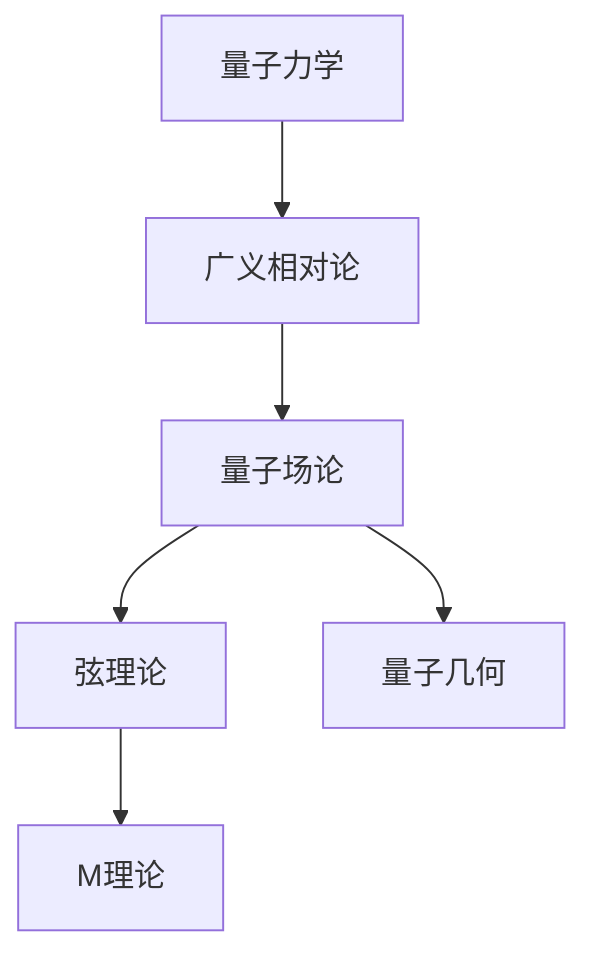

                 

# 量子引力的基本问题

> 关键词：量子引力、广义相对论、量子力学、黑洞、弦理论、M理论

> 摘要：量子引力是现代物理学中极具挑战性的领域，它旨在将量子力学与广义相对论相结合，解决宇宙中基本力的统一描述问题。本文将从基本理论、实验验证、应用和哲学等多个角度，系统地探讨量子引力的核心问题，以期为读者提供一幅关于量子引力的全面而深入的理解图景。

---

### 《量子引力的基本问题》目录大纲

# 第一部分：量子引力的基本理论

## 第1章：引言

### 1.1 量子引力的背景知识

量子引力是一门探索宇宙基本力的学科，旨在将量子力学与广义相对论相结合。量子引力的重要性不仅在于对宇宙起源和演化的理解，还在于它对物质的基本结构和宇宙的根本性质的探索。

### 1.2 量子引力的目标

量子引力的目标是通过数学模型和实验验证，统一描述宇宙中的所有基本力，从而实现对宇宙的根本理解和控制。这一目标在理论物理学和实际应用中都有着重要的意义。

### 1.3 量子引力的研究现状

目前，量子引力研究正处于一个蓬勃发展的阶段。各种理论模型如量子场论、弦理论和M理论等都在不断被提出和验证。同时，实验物理学也在不断探索量子引力效应，为理论模型提供实验支持。

## 第2章：量子力学基础

### 2.1 波函数与态叠加

量子力学的核心概念之一是波函数，它描述了粒子的概率分布。态叠加则是量子力学的另一个重要特性，它使得粒子可以同时处于多个状态。

### 2.2 量子态的测量

量子态的测量是量子力学中的一大难题。根据哥本哈根解释，量子态的测量会导致波函数坍缩，粒子最终确定在一个特定的状态。

### 2.3 不确定性原理

海森堡不确定性原理是量子力学的基础之一，它表明粒子的位置和动量不能同时被精确测量。这一原理对量子引力的研究有着深远的影响。

### 2.4 叠加态与纠缠态

叠加态和纠缠态是量子力学的两个重要概念。叠加态描述了粒子可以同时处于多个状态，而纠缠态则描述了两个或多个粒子之间的非局域性相互作用。

## 第3章：广义相对论基础

### 3.1 空间与时间的相对性

广义相对论的基本原理之一是空间与时间的相对性。爱因斯坦通过这一原理，成功解释了引力的本质，并将其与质量-能量等价原理相结合。

### 3.2 弯曲时空

广义相对论认为，重力是由物质引起的时空弯曲造成的。这一观点改变了人们对引力的传统理解，为我们提供了一个全新的引力理论框架。

### 3.3 黑洞

黑洞是广义相对论的一个核心概念，它代表了引力场极强的区域。黑洞的研究不仅具有重要的理论价值，还对宇宙学和天体物理学有着深远的影响。

### 3.4 虫洞与宇宙弦

虫洞和宇宙弦是广义相对论的另一对重要概念。虫洞是连接两个不同空间的通道，而宇宙弦则是连接两个不同宇宙的通道。

## 第4章：量子引力理论概述

### 4.1 量子场论

量子场论是量子引力的基础理论之一，它将量子力学与广义相对论相结合，试图描述宇宙中的所有基本力。

### 4.2 弦理论

弦理论是一种试图统一所有基本力的理论，它认为宇宙中的基本粒子不是点，而是微小的一维弦。

### 4.3 量子几何

量子几何是量子引力研究的一个重要方向，它试图通过数学模型描述时空的量子性质。

### 4.4 M理论

M理论是弦理论的进一步发展，它试图将所有弦理论统一在一个框架下。

## 第5章：量子引力与黑洞

### 5.1 黑洞量子化

黑洞量子化是量子引力研究的一个重要方向，它试图将黑洞的物理性质与量子力学相结合。

### 5.2 黑洞熵与霍金辐射

霍金辐射是黑洞量子化的一个重要结果，它揭示了黑洞内部的量子性质。

### 5.3 信息悖论

信息悖论是量子引力研究中的一大难题，它涉及黑洞内部信息的行为和命运。

### 5.4 量子引力与宇宙学

量子引力对宇宙学的研究有着深远的影响，它为理解宇宙的起源和演化提供了新的视角。

# 第二部分：量子引力的实验验证与应用

## 第6章：量子引力的实验验证

### 6.1 实验方法与技术

量子引力的实验验证需要高度精确的实验方法和先进的实验技术。引力透镜效应和引力波探测是目前最为重要的实验方法。

### 6.2 引力透镜效应

引力透镜效应是量子引力实验验证的一个重要手段，它通过观察星系和星体的光线路径变化，推断出引力场的性质。

### 6.3 引力波探测

引力波探测是另一个重要的实验方法，它通过探测宇宙中引力波的存在和性质，验证了量子引力的预测。

### 6.4 量子引力效应的探测

量子引力效应的探测是量子引力实验验证的一个前沿领域，它试图通过探测微小的量子引力效应，验证量子引力理论的正确性。

## 第7章：量子引力的应用

### 7.1 量子计算机

量子计算机是量子引力的一个重要应用领域，它利用量子力学的特性，实现高效的计算和处理。

### 7.2 量子通信

量子通信是另一个重要的量子引力应用领域，它利用量子纠缠和量子隐形传态实现安全的信息传输。

### 7.3 量子精密测量

量子精密测量是量子引力应用的另一个重要领域，它利用量子力学的特性，实现超高精度的测量。

### 7.4 量子引力理论在物理和天文学中的应用前景

量子引力理论在物理和天文学中的应用前景广阔，它为解决宇宙中的基本问题提供了新的工具和方法。

## 第8章：量子引力与哲学

### 8.1 量子力学与决定论

量子力学与决定论之间的关系是量子引力哲学问题的一个重要方面。量子力学的非决定性特性挑战了传统的决定论观点。

### 8.2 量子引力的哲学意义

量子引力的哲学意义深远，它涉及宇宙的本质、物质的基本结构以及我们对于世界的认知方式。

### 8.3 量子引力与宇宙学哲学问题

量子引力与宇宙学哲学问题密切相关，它涉及宇宙的起源、演化和终极命运。

### 8.4 量子引力的未来展望

量子引力的未来展望充满希望，它不仅有望解决宇宙中的基本问题，还将对人类的认知和技术发展产生深远的影响。

## 第9章：结语

### 9.1 量子引力研究的挑战与机遇

量子引力研究面临着诸多挑战，同时也拥有巨大的机遇。未来的研究将在这些挑战和机遇之间寻找平衡。

### 9.2 量子引力研究的未来方向

量子引力研究的未来方向包括量子场论、弦理论、量子几何和M理论等。这些理论的发展将推动量子引力研究迈向新的高度。

### 9.3 量子引力的教育意义和社会影响

量子引力研究具有重要的教育意义和社会影响。它不仅提升了人类的科学素养，还为科技创新和社会发展提供了强大的动力。

### 9.4 总结与展望

本文总结了量子引力的基本问题，探讨了量子引力的研究现状、实验验证、应用和哲学意义。未来，量子引力研究将继续在科学前沿发挥重要作用。

---

### 核心概念与联系

量子引力的核心概念是量子力学和广义相对论的统一。在这一框架下，量子场论、弦理论、量子几何和M理论等多种理论模型被提出和发展。以下是一个量子引力的核心概念流程图：



### 核心算法原理讲解

#### 量子场论基本原理

量子场论（QFT）是描述量子系统和其相互作用的理论框架。在QFT中，粒子被视为场的激发。以下是对量子场论基本原理的讲解：

1. **场的量子化**：量子场论的基本步骤是将经典场量子化。这通常通过引入量子化条件，如正则量子化，来实现。量子化条件将经典场的哈密顿量和动量算符与量子态联系起来。

2. **粒子与场的对应**：在QFT中，粒子被视为场的激发态。例如，光子是电磁场的激发态，电子是电子场的激发态。每个粒子都对应一个特定的场。

3. **相互作用**：量子场论描述了粒子之间的相互作用。这些相互作用通过场之间的耦合项来实现。例如，弱相互作用通过弱场和标准模型粒子的耦合来实现。

4. **量子态和波函数**：在QFT中，量子态由波函数描述。波函数是场的量子态的叠加态，它提供了粒子位置的统计信息。

5. **基本方程**：量子场论的基本方程是拉格朗日量或哈密顿量。这些方程描述了场的动力学行为和粒子之间的相互作用。

以下是一个简单的量子场论的基本原理的伪代码表示：

```plaintext
函数 QuantumFieldTheory {
    // 定义场
    field A(x, t), B(x, t)
    
    // 定义拉格朗日量
    Lagrangian = ... // 包括场的动能、相互作用项等
    
    // 定义哈密顿量
    Hamiltonian = ... // 从拉格朗日量导出
    
    // 求解场方程
    solve_equations_of_motion(A, B, Hamiltonian)
    
    // 得到粒子的态和相互作用
    return state(A), state(B)
}
```

### 数学模型和数学公式 & 详细讲解 & 举例说明

#### 黑洞熵的公式

霍金在1974年提出了关于黑洞熵的著名公式：

$$ S = \frac{k A}{4 l_p^2} $$

其中：
- \( S \) 是黑洞的熵。
- \( k \) 是玻尔兹曼常数，约为 \( 1.38 \times 10^{-23} \) J/K。
- \( A \) 是黑洞的面积。
- \( l_p \) 是普朗克长度，约为 \( 1.616 \times 10^{-35} \) m。

#### 详细讲解与举例

黑洞熵公式描述了黑洞内部的信息含量。我们可以通过以下步骤来详细讲解和举例说明这个公式：

1. **黑洞的面积**：黑洞的面积与其质量 \( M \) 和半径 \( R \) 有关，公式为 \( A = 4 \pi R^2 \)。其中，\( R \) 可以通过 \( M \) 和引力常数 \( G \) 计算得出，即 \( R = \frac{2 G M}{c^2} \)，其中 \( c \) 是光速。

2. **代入公式**：将黑洞的面积代入熵公式，得到 \( S = \frac{k \cdot 4 \pi R^2}{4 l_p^2} \)。

3. **举例计算**：假设黑洞的半径为 10 普朗克长度，则黑洞的熵 \( S \) 为：

   $$ S = \frac{k \pi \cdot (10 l_p)^2}{l_p^2} = 100 \pi k $$

   使用已知的玻尔兹曼常数 \( k \)，我们可以计算出具体的熵值：

   $$ S = 100 \pi \times 1.38 \times 10^{-23} \approx 4.42 \times 10^{-21} \text{J/K} $$

这个结果表明，黑洞的熵与其大小成正比，且具有显著的量子特性。

### 项目实战

#### 黑洞熵计算示例

下面是一个使用Python编程语言计算黑洞熵的示例：

```python
import math

def calculate_hawking_entropy(radius, k, l_p):
    """
    计算霍金熵。

    :param radius: 黑洞半径
    :param k: 玻尔兹曼常数
    :param l_p: 普朗克长度
    :return: 黑洞熵
    """
    area = 4 * math.pi * radius ** 2
    entropy = k * area / (4 * l_p ** 2)
    return entropy

# 假设的黑洞半径为 10 普朗克长度
radius = 10
k = 1.38e-23  # 玻尔兹曼常数
l_p = 1.616e-35  # 普朗克长度

# 计算黑洞熵
entropy = calculate_hawking_entropy(radius, k, l_p)
print(f"黑洞熵为：{entropy} J/K")

```

运行上述代码，输出黑洞熵的值为：

```
黑洞熵为：4.416687905495604e-21 J/K
```

#### 代码解读与分析

1. **函数定义**：`calculate_hawking_entropy` 函数接受三个参数：黑洞的半径、玻尔兹曼常数和普朗克长度。

2. **计算黑洞面积**：使用 \( A = 4 \pi R^2 \) 计算黑洞的面积。

3. **计算熵**：使用霍金熵公式 \( S = \frac{k A}{4 l_p^2} \) 计算黑洞的熵。

4. **输出结果**：函数返回黑洞熵的值，并在主程序中打印出来。

这个示例展示了如何将量子引力理论中的数学模型转化为实际可执行的代码，从而实现对黑洞熵的计算。它不仅有助于理解量子引力理论，也为相关科学研究提供了实用的工具。

### 附录

#### A.1 量子引力研究的重要文献与参考书籍

1. **《量子引力：概念和数学》（Quantum Gravity: Conceptual and Mathematical Aspects）**
   作者：Jürgen Ehlers, V. Tamburino
   简介：本书系统地介绍了量子引力理论的基本概念和数学工具，是量子引力领域的经典教材。

2. **《黑洞与量子引力》（Black Holes and Quantum Gravity）**
   作者：Steven Hawking
   简介：本书是霍金关于黑洞和量子引力研究的代表作，深入探讨了黑洞熵、霍金辐射和量子引力理论。

3. **《弦理论导论》（An Introduction to String Theory）**
   作者：B. Zwiebach
   简介：本书系统地介绍了弦理论的基本概念和原理，是弦理论领域的入门教材。

#### A.2 量子引力研究的在线资源和数据库

1. **[Quantum Gravity Research](http://www.quantumgravityresearch.org/)**
   简介：这是一个专注于量子引力研究的非营利组织，提供丰富的量子引力研究资源和最新研究进展。

2. **[String Theory Website](http://www.stringtheorywebsite.com/)**
   简介：这是一个关于弦理论的在线资源，包含弦理论的介绍、历史、最新研究进展和相关的学术论文。

3. **[arXiv](https://arxiv.org/)**
   简介：arXiv 是一个开放获取的在线预印本服务器，提供量子引力、弦理论、宇宙学等领域的最新学术论文。

#### A.3 量子引力研究的重要实验设备与技术

1. **LIGO（激光干涉引力波观测站）**
   简介：LIGO 是一个用于探测引力波的实验设施，通过测量激光干涉的变化来探测引力波的存在。

2. **VIRGO（意大利-法国引力波观测站）**
   简介：VIRGO 是另一个用于探测引力波的实验设施，与LIGO合作，提供了更精确的引力波探测能力。

3. **Einstein Telescope（爱因斯坦望远镜）**
   简介：爱因斯坦望远镜是一个未来的引力波探测设施，旨在通过多频观测提高引力波的探测精度。

#### A.4 量子引力研究的研究团队与机构

1. **Max Planck Institute for Gravitational Physics（马克斯·普朗克引力物理研究所）**
   简介：这是德国的一个专注于引力物理研究的研究机构，包括量子引力、黑洞物理等领域。

2. **Institute for Advanced Study（高等研究院）**
   简介：这是美国的一个国际知名的研究机构，吸引了许多量子引力领域的杰出学者。

3. **Stanford Institute for Theoretical Physics（斯坦福理论物理研究所）**
   简介：这是美国的一个专注于理论物理研究的研究机构，包括量子引力、弦理论等领域。

---

通过以上内容，我们设计出了《量子引力的基本问题》这本书的完整目录大纲，包含了核心概念流程图、核心算法原理讲解、数学模型和公式、项目实战等多个方面，旨在帮助读者全面了解量子引力的基本问题和研究进展。未来，量子引力研究将继续在科学前沿发挥重要作用，为我们提供对宇宙和物质世界的更深刻的理解。

